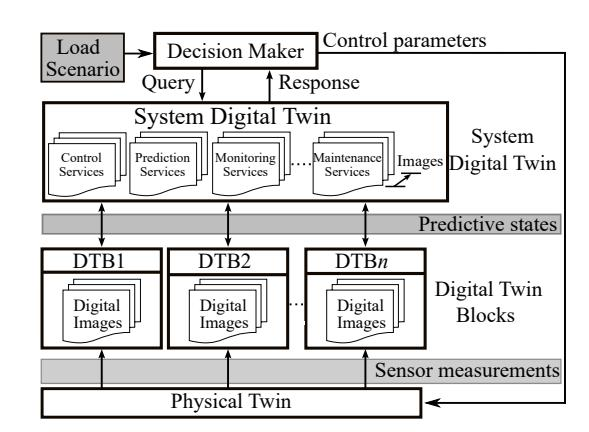
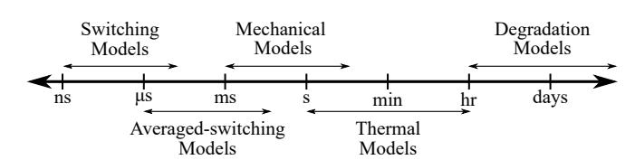
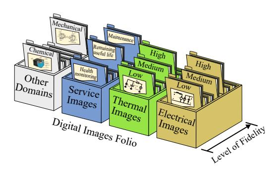
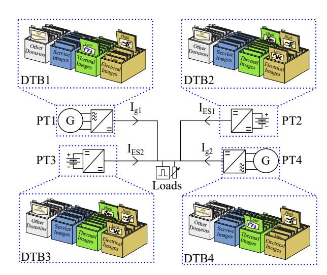
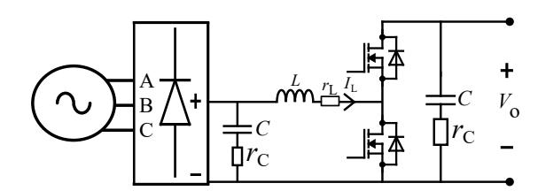
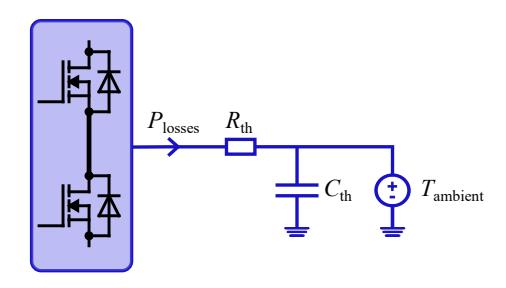
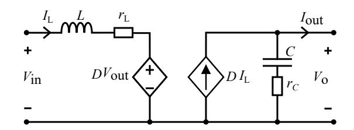
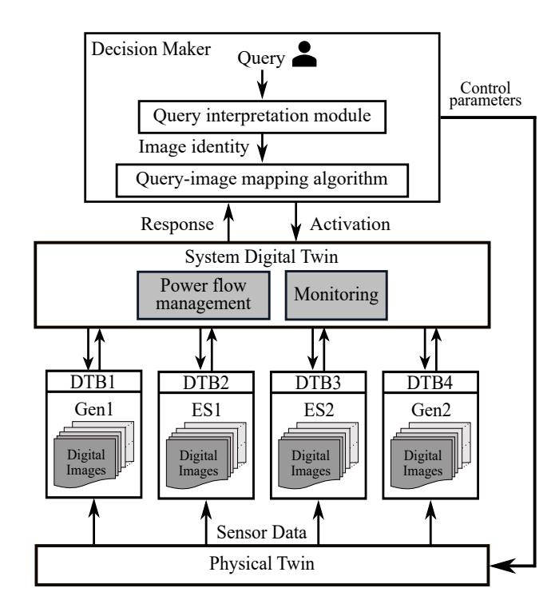
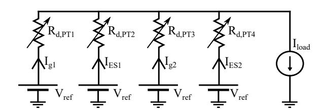
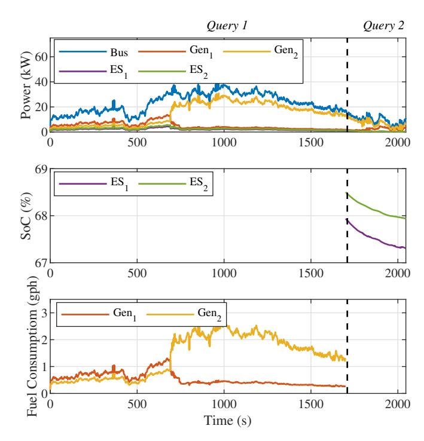

{0}------------------------------------------------

# DC Microgrid Control using a Multi-Function Multi-Domain Image-based Hierarchical Digital Twin

Kerry Sado\*, *Member, IEEE*, Jarrett Peskar†,

Austin Downey†‡, *Member, IEEE*, and Kristen Booth\*, *Member, IEEE*

\* Dept. of Electrical Engineering

†*Dept. of Electrical Engineering*

‡*Dept. of Civil and Environmental Engineering*

University of South CarolinaColumbia, USA

\*ksado@email.sc.edu

*Abstract*—This study presents a digital twin framework for operational management of DC microgrids through the integration of multi-function, multi-domain digital images within the hierarchical digital twin structure. Digital images depict various aspects of physical assets at different levels of fidelity. The framework allows the hierarchical digital twin to respond to decision maker queries, offering estimations and analysis. A real-time simulation case study showcases the practical implementation of this approach and demonstrates its potential to enhance decision making and operational management of DC microgrids.

*Index Terms*—DC Microgrid, Hierarchical Digital Twin, Query, Decision Making, Digital Images, Power Electronics

# I. INTRODUCTION

The control and management of DC microgrids, as complex and dynamic components of modern energy systems, encounter significant challenges. These challenges include the integration of diverse energy sources, management of fluctuating loads, and the assurance of reliable and efficient power distribution [1], [2]. Traditional management systems often struggle to cope with the high level of complexity and the rapid decision making needed to maintain stability and efficiency in DC microgrids [3]. As the complexity of managing DC microgrids escalates, the emergence of Digital Twins (DTs) signifies a promising approach for addressing these complexities. A digital twin can be defined as a faithful integrated representation of a physical asset, often referred to as the Physical Twin (PT). It utilizes both real-time and historical data to accurately mirror the life-cycle of its PT. Digital twins enhance decision making, enable predictive maintenance, and facilitate proactive management, thereby increasing the operational efficiency and sustainability of microgrids [5], [6]. The digital twin technology is particularly suited to addressing the complexities of microgrid management where multiple subsystems interact in a non-linear and interdependent manner.

Recent studies have highlighted the potential of digital twins in enhancing the operational management of energy systems. For instance, Park *et al.* emphasized the role of digital twins in operational management through the development of an energy storage system operation scheduling model and highlighted the utility of digital twins in enhancing microgrid operation efficiency. [7]. Similarly, in their exploration of digital twin technologies within microgrid systems, Kumari *et al.* emphasized the role of digital twins in enhancing operational efficiency and addressing the challenges of complex system design and maintenance. [8].

Despite the growing adoption of digital twins, several challenges remain in the deployment of digital twins within DC microgrid frameworks. The complexity and scale of interactions between various components and subsystems within a microgrid often make it difficult to maintain consistent and real-time alignment between the digital twin and its physical counterpart. Additionally, the deployment of digital twins demands substantial computational resources to support sophisticated simulations and real-time analytics, which are crucial for their effective operation [9].

Further complexity is added in developing a multi-functional, multi-domain digital twin. A multi-functional, multi-domain digital twin is designed to support various operational needs by adapting to different levels of detail for individual assets and incorporating multiple physical domains, such as electrical, thermal, and mechanical systems. Beyond merely replicating the physical attributes of the microgrid, the digital twin aims to capture its operational dynamics. This capability allows the digital twin to support functions such as real-time system monitoring, predictive maintenance, and enhancement of operational management. Developing multi-functional, multi-domain digital twins involves continuous data analysis from sensors and other monitoring devices to ensure comprehensive representation of the behavior of the microgrid across all physics domains. However, integrating all desired functionalities and domain representations into a

{1}------------------------------------------------

Fig. 1. Two-layered hierarchical digital twin.

universal digital twin increases computational costs. This onesize-fits-all approach can lead to inefficiencies, as it may not adapt or scale down effectively for queries that are less complex or smaller in scope than what the all-purpose representation was originally designed for.

Addressing the challenges associated with developing digital twins, this study presents a framework that builds upon the approach developed by the authors in [4]. It is designed to integrate multi-function, multi-domain digital twins within the hierarchical digital twin structure of microgrids. The method utilizes multiple digital images of the physical asset where each image represents a different segment of the asset at varying detail levels. By organizing these images cohesively within a single digital twin, the framework ensures that each segment is represented with specialized and distinct levels of detail, which are all integrated seamlessly within the same digital twin.

Section II details the digital twin hierarchy by explaining its multi-layered structure and the digital image approach that enables multifunctional, multi-domain capabilities in digital twins. Section III discusses the use of a small-scale microgrid to demonstrate the integration of digital images within the hierarchical digital twin and the establishment of various images. The real-time simulation model used in this work and the results from real-time scenarios are presented in Section IV. Finally, Section V summarizes the conclusions and outlines future work.

# II. DIGITAL TWIN STRUCTURE

The designed digital twin for microgrid management is a multi-layered, hierarchical structure that meticulously mirrors the structure and operations of the physical microgrid. This architecture allows each layer within the hierarchy to focus on specific components or subsystems and is equipped with detailed simulations and analytics to provide a comprehensive representation of microgrid operations. Figure 1 depicts a two-layered hierarchical digital twin. In this structure, the lower level consists of Digital Twin Blocks (DTBs) detailing individual subsystems. These DTBs are essential for capturing real-time operational data and are configured to handle the rapid dynamics of microgrid components, such

Fig. 2. Timescales of different domains and representations [10].

Fig. 3. A generic digital twin with a folio of digital images [10].

as voltage fluctuations and load changes. Digital twin blocks interface directly with the upper-level System Digital Twin (SDT), which aggregates and analyzes data from the DTBs to model the overall behavior of the microgrid. This digital twin structure supports distributed studies of system components. These components can relay information up to the SDT for comprehensive system-level management.

The hierarchical digital twin provides responses to a decision maker based on queries, linking the digital twin hierarchy with its PT. This interaction, initiated through these queries, guides the digital twin hierarchy to predict behaviors and offer decision support customized to specified parameters or conditions. This support aligns with the objectives of the decision maker. Queries often require representations from different domains interacting across various timescales, presenting challenges for a single-function, one-dimensional digital twin representation [10]. For instance, electrical transient responses usually evolve faster than thermal ones. Additionally, varying detail levels in electrical domain representations require different timescales, as illustrated in Fig. 2. Therefore, combining these different domain representations or levels of abstraction within a single timescale could lead to computational challenges due to varying timestep requirements.

Recognizing the complexity and variety of queries leading to multipurpose digital twins and the varied timescales in different domains, this study integrates the digital image concept within the hierarchical digital twin of microgrids. These images provide customized representations that capture specific detail levels for distinct segments of the physical asset. Each image acts essentially as a digital twin thread that maps discrete operational aspects and performance metrics of the physical asset while, collectively, they create a comprehensive representation of the entire operational lifecycle of the asset. Systematically grouped within a single digital twin, these digital images ensure that each segment has its own specialized

{2}------------------------------------------------

Fig. 4. Physical demonstrator with assigned DTBs.

representation. Each image is characterized by a distinct level of fidelity and all are smoothly integrated into the unified digital twin. Digital images serve functions that extend beyond traditional hardware measurements, offering capabilities such as health monitoring, estimating the remaining useful life, and facilitating predictive maintenance. Once digital images for various aspects of the physical asset are developed, the digital twin includes a folio of these images, as depicted in Fig. 3.

The primary advantage of this image-based approach is its ability to selectively engage and utilize images relevant to specific inquiries or analyses [10]. This selective approach efficiently deactivates irrelevant images, conserving computational resources. Within the digital twin hierarchy, a DTB or an SDT can maintain a set of digital images that represent different aspects of the PT. Service and informational images can be employed within the DTB of a component or the SDT. Digital images offer operational flexibility; they can function independently, sequentially, or simultaneously in parallel, depending on the specific query from the decision maker. At any level of the digital twin hierarchy, multiple images can be utilized to align with the objectives of the decision maker.

# III. ESTABLISHING FAITHFUL DIGITAL TWIN REPRESENTATIONS

To demonstrate the integration of digital images within a hierarchical digital twin structure, a small-scale microgrid demonstrator, as illustrated in Fig. 4, is utilized. This microgrid comprises two generator subsystems (PT1, PT4) and two Energy Storage (ES) unit subsystems (PT2, PT3) with each connected to their respective converters. The digital twin hierarchy of this microgrid is segmented into four DTBs, each corresponding to one of the subsystems. The DTBs for the generator subsystems are equipped with digital images that monitor the fuel consumption of the generators, thermal conditions of converter, and the electrical behavior of the interfacing converters. Similarly, the DTBs for the ES subsystems include images that estimate the State of Charge (SoC) of the batteries,

Fig. 5. Three-phase diode bridge rectifier with a boost converter output stage.

as well as images that monitor thermal behavior and calculate electrical parameters of the interfacing converters.

Within this framework, the SDT, not shown in Fig. 4, processes queries from a decision maker. A specialized algorithm within the decision making framework queries the hierarchical digital twin, targeting specific DTBs to respond efficiently to queries. This targeted approach ensures that responses are both timely and relevant. Each DTB or SDT within the hierarchy can maintain a set of digital images, each representing a different aspect of the physical twin.

# *A. Digital Twin Block of the Generator Subsystems*

The DTB of the generators subsystem is structured to include a folio of three digital images; each developed to serve specific functions critical for both independent and systemwide monitoring and management.

# *1) Digital image of the fuel consumption estimation:*

The emulated generator has a capacity of 50 kW [11]. Fuel consumption,  $F_c$ , is calculated based on the percentage load on the generator,  $L_{\text{percent}}$ . To estimate the fuel consumption of this generator in gallons per hour (g/h), one must first determine the specific fuel consumption (SFC) of the generator, typically provided in grams per kilowatt-hour (g/kWh). The formula incorporates the output power of the generator,  $P_{\text{out}}$ , at the desired load percentage, then the SFC is converted from g/kWh to g/h by adjusting for the output power scaled to the percentage load. This conversion is facilitated by a factor of 100,000 (1000 for conversion from kW to watts and 100 for the percentage scale), which adjusts the SFC to the actual operational output. The process involves calculating the power output for the given load, applying the SFC, and adjusting for fuel density to estimate fuel consumption in g/ph. The fuel consumption image is mathematically represented as

$$F_c(\text{g/h}) = \left( \frac{\text{SFC (g/kWh)} P_{\text{out}}(\text{kW})}{100000} \right) L_{\text{percent}} D \quad (1)$$

where  $D$  is the conversion factor to adjust the fuel consumption from grams per kilowatt-hour (g/kWh) to gallons per hour (g/h), based on the density of diesel fuel.

# *2) Electrical behavior image of the interfacing converters:*

Each generator interfaces with the DC bus through a threephase diode bridge rectifier plus an output boost converter. The digital image that captures the electrical behavior of this setup employs a switching technique to represent the dynamics of the converter. The circuit diagram that details this converter stage is shown in Fig. 5. Additionally, this image utilizes physics-based techniques and lookup tables to dynamically update the parameters of the interfacing converter. This allows

{3}------------------------------------------------

Fig. 6. Thermal image of the boost converter stage modeled with lumped thermal resistance and capacitive elements.

for real-time adjustments in response to changing electrical loads or other operational conditions. The digital twin activates this image specifically when an analysis of the electrical behavior is needed.

### *3) Thermal behavior images for the interfacing converters:*

To model the thermal behavior of the boost converter stage within the interfacing converters, power losses identified by the electrical image are utilized in a low-fidelity thermal image, as shown in Fig. 6. This thermal image uses lumped thermal capacitances and resistances to simulate the temperature response of the converter under various operational conditions. The converter being emulated features two semiconductor switching devices of the synchronous boost converter mounted on a shared heat sink [12]. The thermal image monitors the temperature of the heat sink and assists in estimating temperature fluctuations that could impact the efficiency and longevity of the converter.

### *B. Digital Twin Block of the Energy Storage Subsystems*

The energy storage subsystem within the DTB is organized to incorporate a set of four digital images; each meticulously developed to fulfill distinct roles essential for both individual and comprehensive monitoring and management of the system. The interfacing converter, a synchronous boost converter, features two electrical images. One is a switching image which analyzes the switching behavior of the converter when needed and calculates the total power losses from the switching devices for thermal analysis. Both the switching electrical behavior image and the thermal image are similar to those developed for the generator subsystems since the same converter module is utilized. Additionally, an averagedswitching electrical image of the boost converter is employed, providing essential data for the state of charge estimation image. The development of these images is outlined as follows:

*1) Averaged-switching electrical behavior image:* When simpler electrical analyses are required, the digital twin activates the averaged-switching electrical image. This image averages the switching cycles over a period to reduce computational demands and is equipped with lookup tables to dynamically update its parameters based on varying operational scenarios. Additionally, this image is essential when estimating the state of charge for the energy storage system. It provides the averaged value of the inductor current, which corresponds to the output current from the energy storage,

Fig. 7. Averaged-switching boost converter.

for the state of charge estimation image to utilize in its calculations. This approach ensures that the digital twin adapts to changes in system conditions efficiently. The averagedswitching electrical image is depicted in Fig. 7.

*2) State of charge estimator image:* To indirectly estimate the state of charge of the battery, this image utilizes the averaged value of the inductor current provided by the averagedswitching electrical image and employs Coulomb counting. This method integrates the current over time to determine the total charge transferred into or out of the battery and providing a practical approach to monitor battery status without direct measurement. The state of charge is estimated as

$$\text{SoC}(t) = \text{SoC}(t_0) + \frac{1}{Q} \int_{t_0}^t I(t) \, dt \quad (2)$$

where  $\text{SoC}(t)$  represents the state of charge at time  $t$ ,  $\text{SoC}(t_0)$  is the initial state of charge,  $Q$  is the total capacity of the battery in Coulombs, and  $I(t)$  is the current at time  $t$ .

Fig. 8. Hierarchical digital twin layout for the demonstrator.

{4}------------------------------------------------

Fig. 9. System Digital Twin model.

# *C. Integration of the Hierarchical Digital Twin*

After developing digital twin blocks for each subsystem, they are integrated into a hierarchical structure, as depicted in Figure 8. The system digital twin facilitates a power flow management service through a resistive droop control scheme. Additionally, the query interpretation module and the query-image mapping algorithm serve to interconnect a human-in-the-loop decision maker with the hierarchical digital twin. These modules are adapted based on the methodologies presented in [10]. For the resistive droop control, the output current from each sources  $I$ , is a function of the bus voltage reference,  $V_{\text{ref}}$ , the measured bus voltage,  $V_{\text{bus}}$ , and the virtual resistance,  $R_{\text{d,x}}$  where  $x$  is for the specific source. The current contribution from each source can be determined to be

$$I = \frac{V_{\text{ref}} - V_{\text{bus}}}{R_{\text{d,x}}}. \quad (3)$$

Equation (3) illustrates the adjustment of each source output to compensate for variations in bus voltage, thereby maintaining stable power distribution within the microgrid. Replacing the virtual resistor  $R_{d,x}$  with a variable resistor will enable the system to control the current contribution of each source. This modification facilitates instantaneous adjustments to the reference voltage of each converter. Accordingly,  $R_{d,PT1}$ ,  $R_{d,PT4}$ , are used in the control loop of the generator subsystem converters, and  $R_{d,PT2}$  and  $R_{d,PT3}$  are utilized in the control loop of the energy storage subsystem converters, as shown in Fig. 9 which corresponds to the system digital twin model. The adjustments in the droop values are made by the human-in-the-loop decision maker based on insights received from the digital twin hierarchy.

# IV. REAL-TIME SIMULATION AND RESULTS

A real-time simulation model, developed using OPAL-RT, emulates the physical twin of the system depicted in Fig. 4. The parameters of the emulated boost converters for each

TABLE I  
PARAMETERS OF THE IMPLEMENTED BOOST CONVERTERS.

| <b>Parameters</b>                                | <b>Value</b> |
|--------------------------------------------------|--------------|
| Energy Storage Subsystem Input voltage, $V_{in}$ | 100.4 V      |
| Generator Subsystem Input voltage, $V_{in}$      | 200 V        |
| Bus voltage, $V_{bus}$                           | 400 V        |
| Switching frequency, $f_{sw}$                    | 20 kHz       |
| Inductor, $L$                                    | 1.25 mH      |
| Output capacitor, $C$                            | 500 $\mu$ F  |

Fig. 10. Hierarchical digital twin response to queries.

subsystem are provided in Table I. Each DTB, equipped with its corresponding digital images, was deployed on the FPGA of an NI CompactRIO. The system digital twin replicates the behavior of the physical twin and manages the power distribution among various energy resources through a resistive droop control scheme, as shown in Fig. 9. Additionally, an NI PXIe real-time controller was employed to implement the decision maker framework, which integrates the query-image mapping algorithm with a human-in-the-loop. This configuration enables real-time querying of the digital twin hierarchy and execution of instructions on the physical twin. The decision maker initiates the process by querying the digital twin hierarchy for insights and predictions about the behavior of the physical twin. The following queries were posed by the decision maker:

- *Query 1:* “Show the fuel consumption rate of generators.”
- *Query 2:* “Show the State of Charge (SoC) of the Energy Storage (ES) units.”

When *Query 1* was executed, the query interpretation module and the query-image mapping algorithm identified the specific DTB responsible for monitoring generator fuel consumption. This module mapped the query to the appropriate digital images needed to fulfill the request, activating the corresponding DTB within the digital twin hierarchy. The SDT then sent current components to the corresponding DTBs for simulation and instructed the designated DTB to simulate and analyze current fuel consumption data. The DTB processed this data, utilizing its digital images that estimates the fuel consumption of the generator under current conditions. After completing the simulation, the DTB transmitted the results back to the SDT. As illustrated in Fig. 10, the digital twin hierarchy

{5}------------------------------------------------

provided a response to *Query 1* with fuel consumption data. At approximately 700 s, the human-in-the-loop decision maker increased the load on the second generator based on insights from the digital twin hierarchy, evident from the first plot. The second query was made at 1700 s when an estimation of the SoC of the energy storage units was requested. The response from the digital twin hierarchy, shown in the second plot, provided the SoC estimation. The third plot indicates that the digital twin hierarchy deactivated images for fuel consumption estimation to conserve computational resources. Consequently, the decision maker adjusted the droop values sent to the physical twin to reduce the load on the energy

- storage units, resulting in increased demand on the generators.
- V. CONCLUSIONS cal digital twin. physical microgrid systems. ACKNOWLEDGMENTS under contracts N00014-22-C-1003 and N00014-23-C-1012. REFERENCES [1] S. H. Hanzaei, M. Ektesabi, S. A. Gorji, M. Korki, and R. Leon, "Control of DC Microgrids: A Review," in *2021 31st Australasian Universities Power Engineering Conference (AUPEC)*, 2021, pp. 1–6. [2] F. Salha, F. Colas, and X. Guillaud, "Dynamic behavior analysis of a voltage source inverter for microgrid applications," in *IEEE PES General Meeting*, 2010, pp. 1–7. [3] A. Aghmadi and O. A. Mohammed, "Operation and coordinated energy management in multi-microgrids for improved and resilient distributed energy resource integration in power systems," *Electronics*, vol. 13, no. 2, 2024. [Online]. Available: https://www.mdpi.com/2079-9292/13/ 2/358 [4] K. Sado, J. Hannum, E. Skinner, H. L. Ginn, and K. Booth, "Hierarchical Digital Twin of a Naval Power System," in *2023 IEEE Energy Conversion Congress and Exposition (ECCE)*, 2023, pp. 1514–1521. [5] M. Singh, R. Srivastava, E. Fuenmayor, V. Kuts, Y. Qiao, N. Murray, and D. Devine, "Applications of Digital Twin Across Industries:A Review," *Applied Sciences*, vol. 12, no. 11, 2022. [Online]. Available: https://www.mdpi.com/2076-3417/12/11/5727 [6] N. Bazmohammadi, A. Madary, J. C. Vasquez, H. B. Mohammadi,
- B. Khan, Y. Wu, and J. M. Guerrero, "Microgrid Digital Twins: Concepts, Applications, and Future Trends," *IEEE Access*, vol. 10, pp. 2284–2302, 2022. [7] H.-A. Park, G. Byeon, W. Son, H.-C. Jo, J. Kim, and S. Kim, "Digital Twin for Operation of Microgrid: Optimal Scheduling in Virtual Space of Digital Twin," *Energies*, vol. 13, no. 20, 2020. [Online]. Available: https://www.mdpi.com/1996-1073/13/20/5504 [8] N. Kumari, A. Sharma, B. Tran, N. Chilamkurti, and D. Alahakoon, "A Comprehensive Review of Digital Twin Technology for Grid-Connected Microgrid Systems: State of the Art, Potential and Challenges Faced," *Energies*, vol. 16, no. 14, 2023. [Online]. Available: https://www.mdpi.com/1996-1073/16/14/5525 [9] National Academy of Engineering and National Academies of Sciences, Engineering, and Medicine, *Foundational Research Gaps and Future Directions for Digital Twins*. Washington, DC: The National Academies Press, 2023. [Online]. Available: https://nap.nationalacademies.org/catalog/26894/ foundational-research-gaps-and-future-directions-for-digital-twins [10] K. Sado, J. Peskar, A. Downey, H. L. Ginn, R. Dougal, and K. Booth, "Query-and-Response Digital Twin Framework using a Multi-domain, Multi-function Image Folio," *TechRxiv*, February 2024. [Online]. Available: https://www.techrxiv.org/users/721683/articles/713884 [11] GENERAC INDUSTRIAL POWER. 50kW Diesel Generator SD050. [Online; accessed 12/01/2024]. [Online]. Available: https://www.generac.com/Industrial/products/diesel-generators/ configured/50kw-diesel-generator [12] Imperix PEB8038 datasheet, "Peb8038 half-bridge sic power module," Feb. 2023, accessed: 2023-03-26.

This study has successfully demonstrated a digital twin framework designed to enhance operational management and decision making processes within DC microgrids. Through the implementation of a multi-functional, multi-domain imagebased hierarchical digital twin, the framework enables the digital twin to respond to decision maker queries and provide estimations and analysis. A real-time simulation case study was conducted to showcase the practical implementation of this approach. The results demonstrated the potential to enhance decision making and operational management of DC microgrids by utilizing the insights provided by the hierarchi-

Looking ahead, the next phase of research will focus on applying the developed digital twin framework in actual hardware experiments with an improved decision making algorithm. This transition from simulated environments to realworld applications aims to test the robustness and practicality of the framework under the operational conditions typical of

This work was supported by the Office of Naval Research