{0}------------------------------------------------

## Temporal Forecasting of High-Rate Dynamic Using Physics-Informed Machine Learning and Hardware-Software Co-Design

by

Puja Chowdhury

Master of Science University of Ulsan, 2016

Bachelor of Science Chittagong University of Engineering & Technology, 2013

Submitted in Partial Fulfillment of the Requirements

for the Degree of Doctor of Philosophy in

Mechanical Engineering

Molinaroli College of Engineering and Computing

University of South Carolina

2024

Accepted by:

Austin R.J. Downey, Major Professor

Jason D. Bakos, Committee Member

Yi Wang, Committee Member

Junsoo Lee, Committee Member

Ann Vail, Dean of the Graduate School

{1}------------------------------------------------

© Copyright by Puja Chowdhury, 2024 All Rights Reserved.

{2}------------------------------------------------

# Dedication

To my loving parents.

{3}------------------------------------------------

# Acknowledgments

After a prolonged search for the right research track and a three-year study break, my dream of pursuing a PhD seemed increasingly elusive. That changed when I received a life-changing email from Dr. Austin Downey. From that day on, my focus moved from the ultimate goal of achieving a PhD to cherishing the enriching journey itself. Dr. Downey, with his exceptional patience, guidance, and support, taught me not only research but also instilled in me a profound sense of professionalism and growth in personal life. Professor, words cannot adequately express my gratitude for your invaluable mentorship.

I am also deeply thankful to the faculty members who have taught me, collaborated with me, and served on my dissertation committee. Their encouragement and expertise have made a significant impact on my learning.

I feel fortunate to have been part of a lab filled with kind and cooperative colleagues, as well as collaborative partners. Their friendship and support have made this journey more rewarding. Lastly, I appreciate the help and support from the school's staff who have made my time here smoother and more enjoyable.

Furthermore, I would like to thank the Air Force Office of Scientific Research (AFOSR) and the National Science Foundation (NSF) for funding this work and the other projects I accomplished during my PhD program. This material is based upon work supported by the Air Force Office of Scientific Research (AFOSR) through award no. **FA9550-21-1-0083**. This work is also partly supported by the National Science Foundation (NSF) grant numbers **1937535**, **1956071**, and **2237696**. I also extended the data-driven approach of this work in structural health monitoring of the 

{4}------------------------------------------------

levee which was funded by the NSF grant number **2152896**. Any opinions, findings, conclusions, or recommendations expressed in this material are those of the authors and do not necessarily reflect the views of the National Science Foundation or the United States Air Force.

For this entire quest, I want to express my gratitude to my family, including my parents, elder sister, and brother. They laid the foundation for my life from childhood and encouraged me to dream big. And that dream came true with support from the funniest and most whimsical person in my life, my beloved husband, Dr. Tanmoy Chowdhury. When I felt down, he provided me with forklifts (figuratively speaking, of course), and when I felt lost, he hugged me with so much energy that I forgot to breathe. We've grown together like the biggest collaborators without any official title. You've been my rock, my cheerleader, and my trusty sidekick. Thank you, my beloved life partner. I am also fortunate to have the unwavering support of my in-laws. Also, some friends who were always there for me.

I want to pay a special tribute to my father, whom I lost along this voyage, but who instilled in me the aspiration to pursue a Doctorate. A heartfelt immense love to my newborn, Upakhyan Oikki Chowdhury, for bringing me joy and tranquility throughout my pregnancy and beyond. Finally, gratitude to the divine power that ensures everything works perfectly, always.

{5}------------------------------------------------

## Abstract

Due to aging, fatigue, corrosion, and even natural disasters; the health of the structure is prone to degradation throughout its service life. The explosively-fast growing efforts on Structural health monitoring (SHM) always try to exploit different aspects of the automation of damage detection, localization, and prognosis tasks. One of the main challenges is the hardware and software co-design to implement the model in real-life situations. On the other hand, the fast-advancing artificial intelligence draws the researchers' attention to adopt different data-driven approaches in this field. This brings other challenges like domain-specific model adaptation, data bias, data scarcity, model validation by physics rules, etc. To find a common ground between computational model approaches and data-driven approaches; new interest is growing in physics-informed machine learning (ML).

To solve the above issues, this dissertation aims to achieve hardware-software design for SHM in two aspects: (1) data-driven ML and (2) physics-informed ML. The design approaches also want to adopt both co-design and sequential paradigms based on domain-specific problems. As a byproduct of this dissertation, this research also wants to contribute to the data generation process. The research community will be benefited from the generated data as well as the methodologies involved to generate the data because it will give them the flexibility to generate more data based on their needs.

{6}------------------------------------------------

# Table of Contents

| DEDICATION                                                                                   | iii |
|----------------------------------------------------------------------------------------------|-----|
| ACKNOWLEDGMENTS                                                                              | iv  |
| ABSTRACT                                                                                     | vi  |
| LIST OF TABLES                                                                               | x   |
| LIST OF FIGURES                                                                              | xii |
| CHAPTER 1 INTRODUCTION                                                                       | 1   |
| 1.1 Research Issues                                                                          | 3   |
| 1.2 Contribution                                                                             | 6   |
| 1.3 Dissertation Organization                                                                | 7   |
| CHAPTER 2 DATA                                                                               | 9   |
| 2.1 Non-stationary vibration data                                                            | 9   |
| 2.2 Single impact data                                                                       | 12  |
| CHAPTER 3 FFT BASED TIME SERIES FORECASTING FOR STRUCTURES SUBJECTED TO NONSTATIONARY INPUTS | 15  |
| 3.1 Background                                                                               | 15  |
| 3.2 Methodology                                                                              | 18  |

{7}------------------------------------------------

| 3.3     | Results and Discussion            | 21                         |
|---------|-----------------------------------|----------------------------|
| 3.4     | Conclusion                        | 26                         |
| Chapter | 4 Hardware Implementation         | of Nonstationary Struc    |
|         | tural Dynamics Forecasting        | by FFT-based Prediction 28 |
| 4.1     | Background                        | 29                         |
| 4.2     | Methodology                       | 32                         |
| 4.3     | Results                           | 37                         |
| 4.4     | Conclusion                        | 40                         |
| Chapter | 5 Deterministic and low-latency   | time-series forecast      |
|         | ing of nonstationary signals      | by Ensembled MLP 42        |
| 5.1     | Background                        | 42                         |
| 5.2     | Methodology                       | 44                         |
| 5.3     | Hardware Validation               | 46                         |
| 5.4     | Results                           | 47                         |
| 5.5     | Conclusion                        | 49                         |
| Chapter | 6 Predicting Structural Responses | in Impact Sce             |
|         | narios with Physics-Guided        | Machine Learning 50        |
| 6.1     | Background                        | 51                         |
| 6.2     | Data Generation                   | 54                         |
| 6.3     | Methodology                       | 57                         |
| 6.4     | Results and Discussion            | 60                         |
| 6.5     | Conclusion                        | 68                         |

{8}------------------------------------------------

| CHAPTER 7 ONLINE STRUCTURAL RESPONSES FORECASTING USING A PHYSICS-INFORMED KNOWLEDGE TRANSFER MODE . . . . . | 71  |
|--------------------------------------------------------------------------------------------------------------|-----|
| 7.1 Background . . . . .                                                                                     | 72  |
| 7.2 Relevant Background . . . . .                                                                            | 75  |
| 7.3 Problem Statement . . . . .                                                                              | 80  |
| 7.4 Methodology . . . . .                                                                                    | 82  |
| 7.5 Experimental Validation . . . . .                                                                        | 89  |
| 7.6 Results and Discussion . . . . .                                                                         | 93  |
| 7.7 Supplement document for different data . . . . .                                                         | 101 |
| 7.8 Results and Discussion . . . . .                                                                         | 102 |
| 7.9 Conclusions . . . . .                                                                                    | 110 |
| 7.10 Sequence Representation function $\S(\cdot)$ . . . . .                                                  | 111 |
| 7.11 Performance evaluation metrics . . . . .                                                                | 114 |
| CHAPTER 8 CONCLUSIONS . . . . .                                                                              | 115 |
| 8.1 Publications . . . . .                                                                                   | 119 |
| BIBLIOGRAPHY . . . . .                                                                                       | 123 |

{9}------------------------------------------------

# List of Tables

| Table | 3.1 | Collected frequencies                                            | 20 |
|-------|-----|------------------------------------------------------------------|----|
| Table | 3.2 | Parameter values                                                 | 21 |
| Table | 3.3 | Performance metrics for various learning window lengths.         | 24 |
| Table | 3.4 | Performance metrics for various computational times.             | 26 |
| Table | 4.1 | FFT size and input length for different sampled data in hardware |    |
|       |     | implementation.                                                  | 36 |
| Table | 4.2 | For various sampling data, simulation outputs including RMSE,    |    |
|       |     | SNR, and chosen frequencies.                                     | 37 |
| Table | 4.3 | Time required for different aspects of FFT-based forecasting.    | 39 |
| Table | 4.4 | Device utilization for FFT-based forecasting where FPGA ele     |    |
|       |     | ments are shown by device utilization.                           | 40 |
| Table | 5.1 | Types and examples of timescales for high-rate monitoring [25].  | 43 |
| Table | 5.2 | Performance metrics of the predicted results.                    | 48 |
| Table | 5.3 | The FPGA elements are shown by the device utilization.           | 49 |
| Table | 6.1 | Model Parameters used for PISP model.                            | 60 |
| Table | 6.2 | Performance analysis with and without physics information in     |    |
|       |     | terms of percentage improvement.                                 | 67 |
| Table | 6.3 | Comparison of data with and without physics-informed features    | 69 |
| Table | 7.1 | Important notations used in this work, with corresponding de    |    |
|       |     | scriptions.                                                      | 76 |

{10}------------------------------------------------

| Table | 7.2 | Model     | Parameters    | used     | for          | PIMENTO.     |         |           | 93             |
|-------|-----|-----------|---------------|----------|--------------|--------------|---------|-----------|----------------|
| Table | 7.3 | Selecting | different     | PI       | feature      | combinations | based   | on        | performance    |
|       |     | metrics.  |               |          |              |              |         |           | 94             |
| Table | 7.4 |           | Performance   | analysis | with         | and without  | physics |           | information in |
|       |     | terms     | of percentage |          | improvement. |              |         |           | 97             |
| Table | 7.5 | Different | metrics       | analysis | of           | corrector    | and     | estimator | during var    |
|       |     | ious      | physics-based |          | features.    |              |         |           | 98             |
| Table | 7.6 | Model     | Parameters    | used     | for          | PIMENTO.     |         |           | 101            |
| Table | 7.7 | Selecting | different     | PI       | features     | combination  | based   | on        | performance    |
|       |     | metrics.  |               |          |              |              |         |           | 103            |
| Table | 7.8 |           | Performance   | analysis | with         | and without  | physics |           | information in |
|       |     | terms     | of percentage |          | improvement. |              |         |           | 106            |
| Table | 7.9 | Different | metrics       | analysis | of           | corrector    | and     | estimator | during var    |
|       |     | ious      | physics-based |          | features.    |              |         |           | 107            |

{11}------------------------------------------------

# List of Figures

| Figure | 1.1 | Example      | of               | high-rate dynamics                   | 2                      |
|--------|-----|--------------|------------------|--------------------------------------|------------------------|
| Figure | 1.2 |              | Physics-informed | vs Data-driven                       | 7                      |
| Figure | 1.3 | Research     | relation         | overview                             | 8                      |
| Figure | 2.1 | Data         | acquisition      | setup                                | 9                      |
| Figure | 2.2 | Mode         | shapes and       | frequencies for the cantilever       | beam setup 10          |
| Figure | 2.3 | The full     | 16-second        | test is shown in the upper           | plot while the         |
|        |     | inset        | shows the        | 1 second around the nonstationarity. | 11                     |
| Figure | 2.4 | Experimental |                  | setup of a cantilever beam with      | key components         |
|        |     | and data     | acquisition      | setup.                               | 13                     |
| Figure | 2.5 | The          | experimental     | test results, showing (a) the        | measured accel        |
|        |     | eration      | response,        | and (b) zoomed in portion            | of the response. 13    |
| Figure | 3.1 | Schematic    | Algorithm        | diagram of FFT-based                 | time series predic    |
|        |     | tion         | algorithms.      |                                      | 18                     |
| Figure | 3.2 | Time         | series           | prediction using various learning    | window lengths. 22     |
| Figure | 3.3 | Calculated   |                  | instantaneous error over for the     | experiment data        |
|        |     | with         | various          | learning window lengths.             | 23                     |
| Figure | 3.4 | Effect       | of various       | learning window lengths              | 25                     |
| Figure | 3.5 | Effect       | of various       | computational time ( T ) in          | a specific learning    |
|        |     | window       | length (         | L ) showing: (a) MAE in              | different states, and; |
|        |     | (b)          | transient time.  |                                      | 26                     |

{12}------------------------------------------------

| Figure | 4.1 | Data    | set with     | varied        | sample       | rates,      | showing:        | (a)           | the      | native sam     |
|--------|-----|---------|--------------|---------------|--------------|-------------|-----------------|---------------|----------|-----------------|
|        |     | ple     | rate of      | 51200 S/s;    | (b)          | sub-sampled | at              | 25600         | S/s; (c) | 512 S/s;        |
|        |     | (d)     | 256 S/s;     | (e) 128       | S/s;         | and inset   | plots           | provide       | a        | close look      |
|        |     | around  |              | nonstationary | for          | each        | sampled         | data.         |          | 31              |
| Figure | 4.2 |         | Schematic    | Algorithm     | diagram      | of          | FFT-based       |               | time     | series fore    |
|        |     | casting |              | algorithms.   |              |             |                 |               |          | 33              |
| Figure | 4.3 |         | Flowchart    | for data      | collection   | and         | processing      |               | during   | FFT-based       |
|        |     |         | forecasting  | in case       | of hardware  |             | implementation. |               |          | 35              |
| Figure | 4.4 |         | Simulation   | outcomes      | of           | forecasting | at              | various       | sample   | rates,          |
|        |     |         | showing: (a) | 25600         | S/s; (b)     | 512 S/s;    | (c)             | 256           | S/s; and | (d) 128 S/s. 36 |
| Figure | 4.5 | Effects | of           | variously     | sampled      | data        | from            | simulation    |          | results, show  |
|        |     | ing:    | (a)          | RMSE; and     | (b)          | SNR.        |                 |               |          | 38              |
| Figure | 4.6 | Results | of           | the hardware  |              | validation  | procedure       | for           | varied   | sampled         |
|        |     | data    | in cases     | of (a)        | computation  |             | time            | required;     | and      | (b) device      |
|        |     |         | utilization. |               |              |             |                 |               |          | 39              |
| Figure | 5.1 |         | Schematic    | Algorithm     | diagram      | of          | an              | ensemble      | of       | MLPs using      |
|        |     | the     | 50 most      | recent        | data         | points and  |                 | predicting    | 25       | data points     |
|        |     | (1      | ms) into     | the           | future.      |             |                 |               |          | 44              |
| Figure | 5.2 | Flow    | chart        | of data       | collection   | and         | processing      | in            | parallel | MLP tracks. 46  |
| Figure | 5.3 |         | Algorithm    | results       |              |             |                 |               |          | 47              |
| Figure | 5.4 | Time    | required     | for           | different    | aspects     | of the          | process.      |          | 48              |
| Figure | 6.1 | FEA     | model        | of a steel    | cantilever   |             | beam with       |               | detail   | mesh. 56        |
| Figure | 6.2 | Physics |              | informed      | data from    | FEA         | model           | showing:      | (a)      | total dis      |
|        |     |         | placement;   | (b)           | equivalent   | elastic     | strain; (c)     | x-axis        |          | displacement;   |
|        |     | (d)     | y-axis       | displacement; | and          | (e)         | z-axis          | displacement. |          | 56              |
| Figure | 6.3 | Simple  | overall      |               | architecture | and         | workflow        | of the        | proposed | model           |
|        |     | PISP    | (a)          | training;     | and (b)      | inference.  |                 |               |          | 57              |
| Figure | 6.4 | Overall |              | detailed      | architecture | and         | workflow        | of the        | proposed | model           |
|        |     | PISP    |              |               |              |             |                 |               |          | 58              |

{13}------------------------------------------------

| Figure 6.5  | Different   | PI           | features      | are           | used          | for time         | series         | forecast        | from the          |
|-------------|-------------|--------------|---------------|---------------|---------------|------------------|----------------|-----------------|-------------------|
|             | estimator   |              | model,        | but all       | have          |                  | experimental   | data            | acceleration:     |
| (a)         | no          | PI           | feature       | only          | acceleration; |                  | (b) PI         | feature         | strain; (c)       |
| PI          | feature     |              | y-axis        | displacement, |               | and              | z-axis         | displacement;   | (d) PI            |
|             | feature     | strain,      | x-axis        |               | displacement, |                  | and y-axis     |                 | displacement; (e) |
| PI          | feature     |              | strain,       | x-axis        |               | displacement,    | y-axis         |                 | displacement, and |
|             | z-axis      |              | displacement; | and           | all           | show a           | close          | look around     | nonsta           |
|             | tionary     | event.       |               | Second        | column        | shows            | RMSE,          | MAE,            | SNR db , and      |
|             | TRAC        | for          | different     | PI            | features      | time             | series         | forecast.       | 63                |
| Figure 6.6  | Combination |              | of            | error plot    | for           | 0 PI             | features;      | 4 PI            | features; and     |
|             | error       | different    |               | between       | two.          |                  |                |                 | 64                |
| Figure 6.7  | Combination |              | of            | absolute      | error         | plot             | for 0 PI       | features;       | 4 PI fea         |
|             | tures;      | and          | error         | different     | between       | two.             |                |                 | 64                |
| Figure 6.8  | The         | performance  |               | analyses      | of            | the              | data-augmented |                 | PISP model        |
|             | using       | four key     |               | metrics:      | (a) Root      | Mean             | Squared        | Error           | (RMSE),           |
|             | (b)         | Mean         | Absolute      | Error         |               | (MAE),           | (c)            | signal-to-noise | ratio in          |
|             | decibels    | (SNR         | db ),         | and           | (d) Time      |                  | Response       | Assurance       | Criterion         |
|             | (TRAC).     | It           | compares      |               | the           | model’s          | performance    | when            | incorpo          |
|             | rating      | different    |               | numbers       | of            | physics-informed |                | (PI)            | features (1 to    |
| 4)          | against     |              | the           | baseline      | case          | with no          | PI             | features        | (considering      |
|             | only        | experimental |               |               | acceleration  | data).           | The            | models          | with PI fea      |
|             | tures       | are          | grouped       | as “with      | PI,"          | while            | the            | one without     | them is           |
|             | labeled     | “without     |               | PI."          |               |                  |                |                 | 66                |
| Figure 6.9  | Percentage  |              | performance   |               | analysis      | with             | physics        |                 | information for   |
|             | different   |              | features.     |               |               |                  |                |                 | 67                |
| Figure 6.10 | Performance |              | analysis      | with          | physics       |                  | information    | and             | without physics   |
| for         | 9           | data         | sets.         |               |               |                  |                |                 | 69                |
| Figure 6.11 | Performance |              | analysis      | with          | physics       |                  | information    | and             | without physics   |
| for         | 9           | data sets    | along         | with          |               | hammering        | around         | time            | and hammer        |
|             | force.      |              |               |               |               |                  |                |                 | 70                |

{14}------------------------------------------------

| Figure 7.1  |      | Generic       | time             | series        | forecast    | scenario         |               | that    | takes         | into          | account     |
|-------------|------|---------------|------------------|---------------|-------------|------------------|---------------|---------|---------------|---------------|-------------|
|             |      | how, in       | the case         | of            | univariate  | data             | shown         | in      | (a), x        | input         | exper      |
|             |      | imental       | acceleration     |               | data        | becomes          | the           | time    | series        | prediction    | y           |
|             | in   | future.       | Using            |               | different   | physics-informed |               |         | feature       | data,         | such        |
|             | as   | x a , x       | b , and          | x c           | input is    | showing          | in            | (b)     | illustrates   | a             | general     |
|             |      | scenario      | for a            | time          | series      | forecast,        | with          | y as    | the           | predicted     | out        |
|             |      | come.         | In general,      | the           | input       | is               | multivariate, |         | but           | the           | forecast is |
|             |      | identical     | to that          | of            | generic     | time series      |               |         | forecasting.  |               | 78          |
| Figure 7.2  |      | Estimator     | model            |               | problem     | formulation.     |               |         |               |               | 81          |
| Figure 7.3  |      | Corrector     | model            |               | problem     | formulation.     |               |         |               |               | 81          |
| Figure 7.4  |      | Preliminary   |                  | layout of     | proposed    | model            |               | PIMENTO |               | is            | showing:(a) |
|             |      | training:     | estimator        |               | model’s     | encoder          | is            | tuned   | based         | on            | the cor    |
|             |      | rection       | from             | the           | corrector   | model.           | During        |         | training      | the           | decoder     |
|             | is   | replicated    |                  | from the      | corrector   |                  | decoder       | and     | then          | tuned         | during      |
|             |      | training;     | and              | (b)           | inference   | : as the         |               | encoder | and           | the           | decoder     |
|             |      | have been     | tuned            | in            | the         | training         | phase,        | so      | no            | correction    | or in      |
|             |      | volvement     | of               | the           | corrector   | model is         | needed.       |         |               |               | 82          |
| Figure 7.5  |      | Corrector     | model            |               | complete    | architecture     |               |         |               |               | 85          |
| Figure 7.6  |      | Estimator     | model            |               | complete    | architecture     |               |         |               |               | 86          |
| Figure 7.7  | The  | full          |                  | experimental  |             | acceleration     | data          | is      | shown         | in the        | upper       |
|             | plot | (a)           | and              | the           | bottom      | (b) shows        | a             | close   | view          | around        | the         |
|             |      |               | nonstationarity. |               |             |                  |               |         |               |               | 89          |
| Figure 7.8  |      | FEA           | model of         | a steel       | cantilever  | beam             |               | with    | detail        | mesh          | and an      |
|             |      | inset that    | shows            |               | close-up    | looks of         | the           | mesh.   |               |               | 89          |
| Figure 7.9  |      | FEA           | model of         | the           | cantilever  | beam             | analysis      |         | showing:      | (a)           | total       |
|             |      | displacement; |                  | (b)           | equivalent  | elastic          | strain;       |         | (c) x         | directional   | dis        |
|             |      | placement;(d) |                  | y             | directional | displacement;    |               |         | and (e)       | z             | directional |
|             |      | displacement  |                  | of FEA        | model.      |                  |               |         |               |               | 91          |
| Figure 7.10 |      | Physics       | informed         | data          | from        | FEA              | model         |         | showing:      | (a) total     | dis        |
|             |      | placement;    | (b)              | equivalent    |             | elastic          | strain;       | (c)     | x-axis        | displacement; |             |
|             | (d)  | y-axis        |                  | displacement; | and         | (e)              | z-axis        |         | displacement. |               | 92          |

{15}------------------------------------------------

[Figure 7.11 Different PI features are used for time series forecast from the](#page-111-0) [estimator model, but all have experimental data acceleration:](#page-111-0) [\(a\) no PI feature only acceleration; \(b\) PI feature strain; \(c\)](#page-111-0) [PI feature y-axis displacement, and z-axis displacement; \(d\) PI](#page-111-0) [feature strain, x-axis displacement, and y-axis displacement; \(e\)](#page-111-0) [PI feature strain, x-axis displacement, y-axis displacement, and](#page-111-0) [z-axis displacement; and all show a close look around nonsta](#page-111-0)[tionary event. Second column shows RMSE, MAE, SNR](#page-111-0)db, and [TRAC for different PI features time series forecast.](#page-111-0) . . . . . . . . 95

[Figure 7.12 Various metrics analysis based on without PI features and with](#page-112-0) [PI features showing:\(a\) RMSE; \(b\) MAE; \(c\) SNR](#page-112-0)db; and (d) [TRAC.](#page-112-0) . . . . . . . . . . . . . . . . . . . . . . . . . . . . . . . . . 96

[Figure 7.13 Percentage improvement over without physics-informed feature](#page-113-1) [analysis with different numbers of physics information features.](#page-113-1) . 97

[Figure 7.14 Performing sensitivity analysis using features to illustrate: \(a\)](#page-114-1) RMSE; (b) MAE; (c) SNRdb[; and \(d\) TRAC.This figure com](#page-114-1)[pares the concurrent performance of the corrector and estimator](#page-114-1) [models about four PI features \(1-4\) and also with 0 PI features,](#page-114-1) [which only consider experimental acceleration.](#page-114-1) . . . . . . . . . . . 98

[Figure 7.15 Sensitivity analysis varying the input dimension for 4 PI fea](#page-115-0)[tures, showing results for \(a\) RMSE; \(b\) MAE; \(c\) SNR](#page-115-0)db; and [\(d\) TRAC. This investigation helps in choosing the most suit](#page-115-0)[able input dimensions for the proposed model when there are](#page-115-0) [4 PI features. To make decisions, values that are near between](#page-115-0) [the corrector and estimator models are utilized.](#page-115-0) . . . . . . . . . . 99

[Figure 7.16 Sensitivity analysis varying the output dimensions for 4 PI fea](#page-116-0)[tures and an input dimension is 10000, showing: \(a\) RMSE;](#page-116-0) (b) MAE; (c) SNRdb[; and \(d\) TRAC. This analysis decides the](#page-116-0) [best output dimensions for the proposed model in the case of](#page-116-0) [4 PI features. Decisions are made upon close values between](#page-116-0) [corrector and estimator models.](#page-116-0) . . . . . . . . . . . . . . . . . . . 100

[Figure 7.17 The full experimental acceleration data is shown in the upper](#page-117-2) [plot \(a\) and the bottom \(b\) shows a close view around the](#page-117-2) [nonstationarity.](#page-117-2) . . . . . . . . . . . . . . . . . . . . . . . . . . . . 101

[Figure 7.18 Physics informed data from FEA model showing: \(a\) total de](#page-118-1)[formation; \(b\) equivalent elastic strain; \(c\) x-axis deformation;](#page-118-1) [\(d\) y-axis deformation; and \(e\) z-axis deformation.](#page-118-1) . . . . . . . . 102 

{16}------------------------------------------------

[Figure 7.19 Different PI features are used for time series forecast from the](#page-121-0) [estimator model, but all have experimental data acceleration:](#page-121-0) [\(a\) no PI feature only acceleration; \(b\) PI feature deformation;](#page-121-0) [\(c\) PI feature deformation, and strain; \(d\) PI feature strain, x](#page-121-0)[axis deformation, and y-axis deformation; \(e\) PI feature strain,](#page-121-0) [x-axis deformation, y-axis deformation, and z-axis deformation;](#page-121-0) [and all shows a close look around nonstationary event. Second](#page-121-0) [column shows RMSE, MAE, SNR](#page-121-0)db, and TRAC for different [PI features time series forecast.](#page-121-0) . . . . . . . . . . . . . . . . . . . 105

[Figure 7.20 Various metrics analysis based on without PI features and with](#page-122-1) [PI features showing:\(a\) RMSE; \(b\) MAE; \(c\) SNR](#page-122-1)db; and (d) [TRAC.](#page-122-1) . . . . . . . . . . . . . . . . . . . . . . . . . . . . . . . . . 106

[Figure 7.21 Percentage improvement over without physics informed feature](#page-122-2) [analysis with different numbers of physics information features.](#page-122-2) . 106

[Figure 7.22 Performing sensitivity analysis using features to illustrate: \(a\)](#page-123-1) RMSE; (b) MAE; (c) SNRdb[; and \(d\) TRAC.This figure com](#page-123-1)[pares the concurrent performance of the corrector and estima](#page-123-1)[tor models with regard to four PI features \(1-4\) and also with](#page-123-1) [0 PI features, which only take experimental acceleration into](#page-123-1) [consideration.](#page-123-1) . . . . . . . . . . . . . . . . . . . . . . . . . . . . . 107

[Figure 7.23 Sensitivity analysis varying the input dimension for 4 PI fea](#page-124-0)[tures, showing results for: \(a\) RMSE; \(b\) MAE; \(c\) SNR](#page-124-0)db; [and \(d\) TRAC. This investigation helps in choosing the most](#page-124-0) [suitable input dimensions for the proposed model when there](#page-124-0) [are 4 PI features. To make decisions, values that are near be](#page-124-0)[tween the corrector and estimator models are utilized. Right](#page-124-0) [top corner\(a.1\); \(b.1\); \(c.1\); and \(d.1\) shows a zoom portion](#page-124-0) [near lowest error change for each metrics.](#page-124-0) . . . . . . . . . . . . . 108

[Figure 7.24 Sensitivity analysis varying the output dimensions for 4 PI fea](#page-125-0)[tures and an input dimension is 25500, showing: \(a\) RMSE;](#page-125-0) (b) MAE; (c) SNRdb[; and \(d\) TRAC.This analysis decides the](#page-125-0) [best output dimensions for proposed model in case of 4 PI fea](#page-125-0)[tures and input dimension 25500.Decisions are made upon close](#page-125-0) [values between corrector and estimator models.Right top cor](#page-125-0)[ner\(a.1\); \(b.1\); \(c.1\); and \(d.1\) shows a zoom portion near low](#page-125-0)[est error change for each metrics.](#page-125-0) . . . . . . . . . . . . . . . . . . 109

[Figure 7.25 Diagram of an LSTM cell.](#page-128-0) . . . . . . . . . . . . . . . . . . . . . . 112

{17}------------------------------------------------

# Chapter 1 Introduction

Over the service life, different types of elements, including age, fatigue, corrosion, and even natural catastrophes, continuously impact and impair the health of structures. The cumulative deterioration will lower the ability of the structure to withstand disasters and occasionally cause partial failure, failure, or even total collapse of the structures. The possibility of such accidents poses a serious threat to both people's lives and property. Given these growing worries, one of the main areas of research concentration in recent years has been on the health monitoring and rehabilitation technologies of structures. Despite the enormous amount of study that has been done in recent years, there are still significant problems and difficulties. The act of gathering, interpreting, and analyzing data from structures to ascertain their health state and remaining life span is known as structural health monitoring (SHM). The idea of SHM is not new; military aircraft have used it in the past with a different justification but some overlapping features. Safety is the main driver of SHM. The economic motive is also clear, and it is made achievable by optimizing safety margins throughout rehabilitation and retrofitting [\[53\]](#page-144-0). The goal of this research work is to analyze temporal forecasting in structural health monitoring systems. In the first stage, the main focus is time series data of high-rate dynamics systems and developing models, and implementing those models on hardware. In next stage, the goal is to improve the data-driven model to a physics-informed model. For the preliminary study, this work proposes to develop a testbench structure that consists of a cantilever beam subjected to nonstationary inputs to generate experimental data.

{18}------------------------------------------------

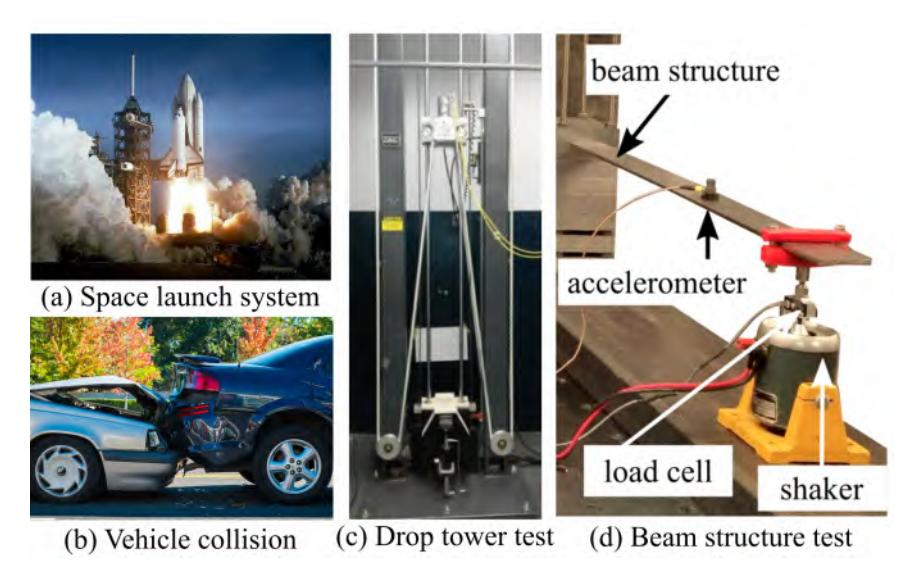

Figure 1.1 Example of high-rate dynamics  $^1$ 

The dynamics, that emerges from the high-rate change of the state of a system, makes the system characteristics more complex. Understanding the kinematics of the state-transition function of a dynamic system is a daunting task, in particular for real world. In the real world, the data caveats (data acquisition, processing, noise) are worsened by the high-rate ( $< 100$  ms) change in the system. Moreover, the structures experiencing high-rate dynamics are subjected to three important phenomena [37]. These are: 1) large uncertainties in external loads, 2) high levels of nonstationarities and heavy disturbances, and 3) the generation of unmodeled dynamics from changes in system configuration. In general, structures that experience high-rate dynamics have acceleration amplitudes higher than  $100 g_n$  for a duration of under  $100$  ms. Examples of structures that experience high-rate dynamics include hypersonic vehicles, space infrastructure, active blast mitigation structures, and airbag system etc. Microsecond ( $\mu$ s) structural awareness, damage detection, prognostics, and control of structures that experience high-rate dynamics (i.e. shock) would benefit from real-time time-series forecasting of structural responses. Knowledge of future structural

1Sources: <https://www.space.com/16726-space-shuttle.html>, <https://www.aarp.org/auto/driver-safety/what-to-do-after-car-accident/>

{19}------------------------------------------------

response would increase structure survivability in harsh dynamic environments by responding appropriately and adapting goals to changing conditions [\[25\]](#page-141-0).

One key challenge in the development of a real-time monitoring and prediction methodology is its ability to operate through nonstationarities. A nonstationary event is one in which the statistical representation of the signal changes. Stationarities can be classified as weak stationarity, covariance stationarity, or second-order stationarity [\[5\]](#page-139-1). If a shift in time does not induce a difference in the distribution form, a time series has stationarity, and therefore, the distribution properties (e.g., mean, variance, and covariance) are constant over time. To address the challenge, we can pursue the data-drvien models and implement the model in hardware and software levels. But, data-driven system has its own demerits (Needs to see a large number of input, can only learn from data not intelligence in the sense that humans are, etc). Again if we want to use the rule-based model then the demerits are problems with a vast number of variables problems with many constraints and limited intelligence. So, it brings the challenge to find a middle ground between this data-driven and rule-based models. So, hardware-software design of structural health monitoring systems brings the two important **research questions** for this dissertation:

- **Research Question 1**: How to design hardware and software for real-time forecasting for SHM?
- **Research Question 2**: How to synergies between data-driven and rule-based system?

## 1.1 Research Issues

This research mainly focus on modeling and hardware implementation of the realtime forecasting of the dynamics of structures experiencing non-stationary inputs. The major search issues are as follows:

{20}------------------------------------------------

#### 1.1.1 Data Scarcity

One of the biggest challenges in high-rate dynamic studies is the scarcity of the data. Security, compliance, governance restrictions, and intellectual property policies hinder the data collection process. So, lack of data makes the system analysis more cumbersome. There is a demanding need to make a data generating algorithm.

#### 1.1.2 Model development for time series forecasting

Time series forecasting of high-rate dynamics is challenging. Specifically, a time series forecasting technique must be robust enough to operate with noisy sensor data. Time series forecasting is performed by studying patterns in a variable (or the relationships between variables), building a model, and using this knowledge to build a model. The model is then used to extrapolate the variable into the future. This demonstrating approach is especially valuable when little information is accessible on the information-producing operation or when there is no agreeable illustrative model that relates the expectation variable to other illustrative factors.

Common techniques for time series prediction incorporate the sliding window, smoothing, and autoregressive expectation techniques, which are broadly applied in a forecast of high rate dynamics system states, financial turn of events, environmental change, and energy interest. The sliding window technique is similar to the single dramatic smoothing strategy while the smoothing and autoregressive techniques are similar to the two-fold dramatic smoothing technique and the triple outstanding smoothing strategy, respectively [\[50\]](#page-143-0).

If a time series is  $X_t = \{x_1, x_2, \dots, x_t\}$ , then predicting the future value of the target series can be formulated as:

$$y_{t+1} = f_s(X_t); \quad \text{Single Horizon} \quad (1.1)$$

$$y_{\{t+1, t+2, \dots, t+n\}} = f_m(X_t); \quad \text{Multi-Horizon} \quad (1.2)$$

{21}------------------------------------------------

Modeling the functions  $f_s(\cdot)$  and  $f_m(\cdot)$  for noisy non-stationary data ( $X_t$ ) for single horizon ( $y_{t+1}$ ) or multi-horizon ( $y_{\{t+1, t+2, \dots, t+n\}}$ ) involves lot of sub-tasks as the investigation can be diversified based on the domain demands (online, offline, sliding window, scalar value, vector value).

#### 1.1.3 Hardware Implementation of the Model

In the simulated environment, speed can be varied based on the processor speed of the computer involved. The performance of the algorithm/model in a simulated environment can show discrepancies to the real-world implementation. So, it is necessary to see the performance of the developed algorithm in hardware. Moreover, high-rate dynamics have a very short response time. So, it is crucial to see the performance of a developed algorithm related to time series prediction in hardware when this whole issue is very time-sensitive due to sudden impact for a short time.

#### 1.1.4 Synergies between data-driven and rule-based system

The aforementioned issues are directly related with research question 1. Now this specific issue is related to the research question 2. By addressing the previous issues we can overcome the development phase problems of this research work. Then the research aims to improve the data-driven approaches. There are several pros and cons to data-driven approaches. The system is self-learning, capable of handling complex problems and adapting over time. One of its major strengths is its ability to analyze large volumes of data and make informed decisions without explicit programming. However, a key drawback is its reliance on massive datasets and its lack of human-like intuition. Data-driven approaches excel at processing and extracting insights from large datasets, while rule-based systems rely on predefined hypotheses and equations to make decisions. Rule-based approaches, though effective for smaller data sets, struggle to scale with large, complex data. To advance this field, a hybrid

{22}------------------------------------------------

system is needed—one that synergies the strengths of both data-driven and rule-based approaches, combining the ability to process vast amounts of data with the logical structure and interpretability of rule-based methods.

## 1.2 Contribution

By addressing the research issues stated above, the research proposal aims to contribute the following in the research community:

- This work presents a testbench structure consisting of a cantilever beam subjected to nonstationary inputs, designed to generate experimental data. The key contribution is the generation of prototype high-rate data, addressing the challenges of limited access to real high-rate data, which is often unavailable or restricted for general use and graduate-level research.
- This work proposes two models which can recognize nonstationary events and alter their anticipated signal in response to them.
  - **–** Investigates the performance of the FFT-based approach before, during, and after a nonstationary event, while evaluating the effects of different learning window lengths and computation times.
  - **–** Proposes the use of an ensemble of Multi-Layer Perceptrons (MLPs) in the technique, trained offline on both actual and simulated data relevant to the structure.
- This work implements both models (FFT-based, ensembled MLP based) on Field Programmable Gate Array (FPGAs).Real time implementation in hardware (FPGA) is the key contribution.
- This works proposes two more models to improve the data-driven models so that it can handle minimum number of data and a significant amount of physics

{23}------------------------------------------------

information about the system. Here physics-informed machine learning comes to improve the models that are designed and implemented in hardware in the development phase of this research work. The Figure [1.2](#page-23-1) depicts the relationship between data-driven and physics-informed machine learning.

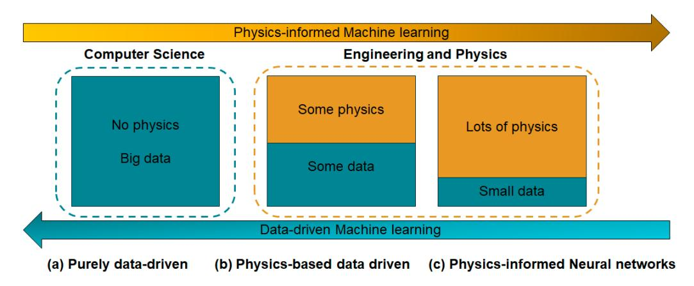

Figure 1.2 Physics-informed vs Data-driven

In a nutshell, the whole research work aims to develop hardware-software design for temporal forecasting in structural health monitoring system. In many of diversified applications, this work focuses mainly to address the issues in the time-series prediction of high-rate dynamic systems both in the simulated and real world as well with data-driven and physics-informed machine learning models. The Figure [1.3](#page-24-0) shows the relationship of the research areas. Here, Along the way, this work utilizes traditional data models and two unique problem-specific frameworks to integrate physics-based rules with the data driven models to predict the time-series data.

#### 1.3 Dissertation Organization

The remainder of the research dissertation is as follows. First, this work focuses on the data generation process in Chapter [2.](#page-25-0) Then, Chapter [3](#page-31-0) presents numerical analysis and experimental results for the real-time implementation of a Fast Fourier Transform (FFT)-based approach for time series forecasting. Chapter [4](#page-44-0) discusses

{24}------------------------------------------------

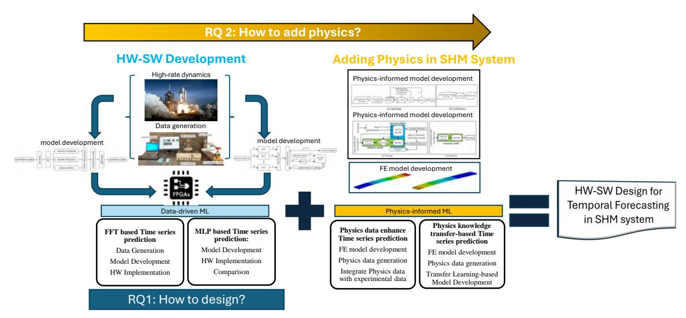

Figure 1.3 Research relation overview

the hardware implementation of FFT-based prediction. Chapter [5](#page-58-0) reports on the development of a coupled software-hardware algorithm (ensembled MLP-based) for deterministic and low-latency online time-series forecasting of structural vibrations that is capable of learning over nonstationary events and adjusting its forecasted signal following an event. Chapter [6](#page-66-0) enhances the experimental data with the physics based finite element model data. This focuses the impact of integrating physics data with the experimental data. In Chapter [7,](#page-87-0) transfer learning approach was adopted to make a student model which does not need the physics data but can utilizes the physics informed trained model as the teacher model was trained based on the physics enhanced data. Finally, the Chapter [8](#page-131-0) summarizes all the accomplished works and future directions.

{25}------------------------------------------------

## Chapter 2

## Data

Mainly two approaches can be followed for data generation: rule-based and deep generative models. However, since deep generative models rely heavily on data, a lack of sufficient data makes it challenging to implement and achieve accurate results. We focused on rule-based methods for data generation. Our goal is to find the schema/theory to generate a realistic dataset which can be benefecial for the community to continue the research in different directions. Two types of experimental data has been generated for these overall dissertation research work.First approach is Non-stationary vibration data and second one is Single impact data.

## 2.1 Non-stationary vibration data

#### 2.1.1 Experimental Setup

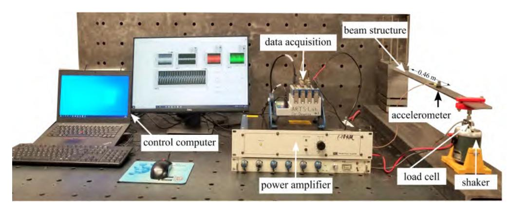

Figure 2.1 Experimental setup of a cantilever beam with key components and data acquisition setup[\[11\]](#page-140-0). Puja Chowdhury, CC-BY-SA-4.0..

{26}------------------------------------------------

The experimental setup is shown in Figure [2.1.](#page-25-2) For the purpose of the experiment, a steel cantilever beam structure of 759 x 50.66 x 5.14 mm is used and a single Integral Electronics Piezoelectric (IEPE) accelerometer (model J352C33 manufactured by PCB Piezotronics) is mounted close to the edge of the beam structure.The location of the accelerometer is 0.46 m from the fixed point of the cantilever beam as shown in Figure [2.1.](#page-25-2)This accelerometer has a frequency range of 0.5 Hz to 9k Hz with a sensitivity of 100 mV/g. The sensor data is digitized using a 24-bit NI-9234 IEPE signal conditioner manufactured by National Instruments.

## 2.1.2 Mode

To ensure that the accelerometer was not placed at a node of the beam, the mode shapes and natural frequencies for the first three modes of the cantilever were computed via Euler's formula [\[45\]](#page-143-1) and are shown in Figure [2.2.](#page-26-0) The node of the system for the second mode is at 0.594 m while the nodes of the system for the third mode are at 0.380 m and 0.659 m. Therefore, the location of the accelerometer at 0.46 m does not lie directly at any node.

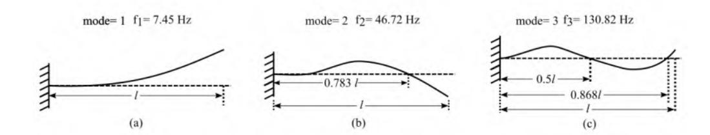

Figure 2.2 Mode shapes and frequencies for the cantilever beam setup showing: (a) mode shape 1; (b) mode shape 2, and; (c) mode shape 3.

Equations for the first three natural frequency are given below: First natural frequency

$$f_1 = (1.875)^2/2\pi\sqrt{(Ed^2)/(12\rho(l^4))} \quad (2.1)$$

{27}------------------------------------------------

Second natural frequency

$$f_2 = (4.694)^2/2\pi\sqrt{(Ed^2)/(12\rho(l^4))} \quad (2.2)$$

Third natural frequency

$$f_1 = (7.855)^2/2\pi\sqrt{(Ed^2)/(12\rho(l^4))} \quad (2.3)$$

where,  $E = \text{young's modulus}$  ( $N/m^2$ ) =  $2.1 \times 10^{11}$  (steel),  $d = \text{depth/ thickness}$  (m) =  $0.00514$ ,  $\rho = \text{density}$  (kg/ $m^3$ ) =  $7850$  (steel),  $l = \text{length}$  (m) =  $0.759$ .

## 2.1.3 Data acquisition

The beam is excited by an electromagnetic shaker (model V203R manufactured by LDS), with a useful frequency range of 5-13000Hz and a peak sine force of 17.8N, and is driven by a power amplifier (model PA25E-CE manufactured by LDS). A 45 N load cell (model MLP-10 manufactured by Transducer Techniques) is mounted in-between the shaker and beam structure. A 24-bit bridge input signal conditioner (NI-9237 manufactured by National Instruments) is used to acquire the load-cell data. The experiment is run through a control computer with a Virtual Instrument written in LabVIEW.

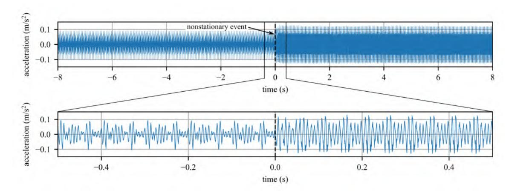

Figure 2.3 The full 16-second test is shown in the upper plot while the inset shows the 1 second around the nonstationarity.

{28}------------------------------------------------

Figure 2.3 reports the structure's measured acceleration response ( $x_v$ ) for a composite sinusoidal input from the shaker. In figure 2.3, the composite signal is made up of 100, 120, and 150 Hz sinusoidal signals. Two sine wave signals are concatenated together at  $t=0$  where a 50% nonstationary is present. A 50% nonstationary event is introduced at 0 s, as measured by a 50% increase in the standard deviation of the signal. To achieve this, an input signal of 0.25 V is used before  $t=0$  while a signal of 0.375 V is used after  $t=0$ . The first half of the composite signal is built from 100, 120, and 150 Hz frequencies while the second half signal consists of 100 and 120 Hz frequencies. The entire 16-second test is shown in Figure 2.3 while the expanded view shows the 1 s around the nonstationary. This is one of several types of generated data. All of this data are available in a public repository [35] 1. For this introductory work, only a harmonic load with a single non-stationary event is considered. Future work will consider non-harmonic loads.

## 2.2 Single impact data

These data involves a physical experiment: a cantilever beam is vibrated consistently and then subjected to an unexpected impact. This simulates real-world situations where structures experience both regular and sudden forces.

## 2.2.1 Experimental data generation:

The experimental setup, depicted in Figure [2.4,](#page-29-0) is as same as like Nonstationary vibration data generation in [2.1.](#page-25-1)Only addition is a model hammer (Emerson Model A034701) to create the sudden single impact in the cantilever beam.The accelerometer is situated at a distance of 0.55 m from the fixed point of the cantilever beam, as

1https://github.com/High-Rate-SHM-Working-Group/Dataset-4-Univariate-signal-withnonstationarity

{29}------------------------------------------------

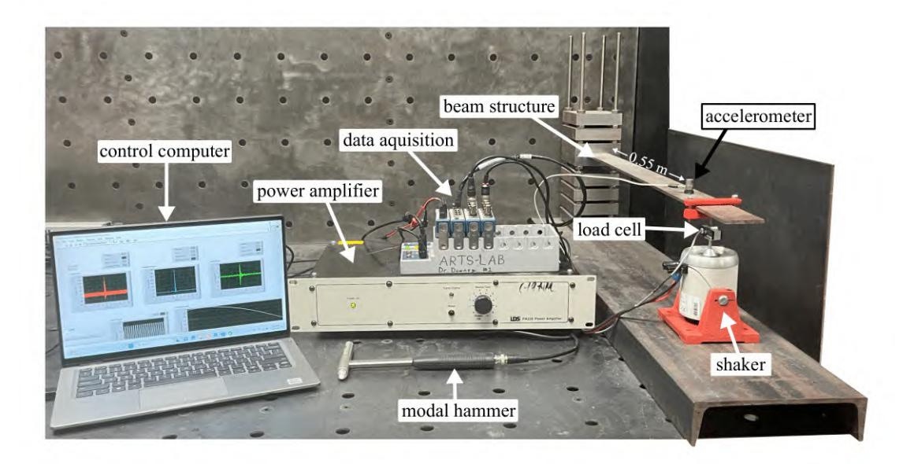

Figure 2.4 Experimental setup of a cantilever beam with key components and data acquisition setup.

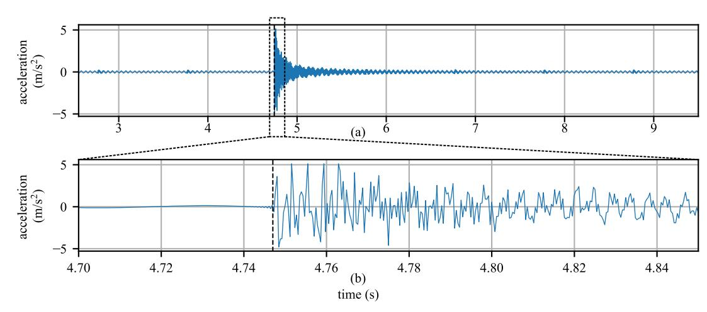

Figure 2.5 The experimental test results, showing (a) the measured acceleration response, and (b) zoomed in portion of the response.

illustrated in Figure [2.1.](#page-25-2) Mode shape analysis remains consistent with the approach in Section [2.1.2,](#page-26-1) as the same cantilever beam is used.

## Data Generation

The shaker initiates a nonstationary excitation of the beam using a pre-generated sinusoid signal with a 1 V amplitude and a 20 Hz frequency starting at  $t=0$ . Around  $t=5$  secs, a modal hammer (Emerson Model A034701) delivers a secondary non-

{30}------------------------------------------------

stationary excitation to the beam. The hammer force is approximately 315.73 N. Furthermore, the force exerted by the modal hammer is captured to provide insight into the impact force applied to the cantilever beam and recorded by the DAQ module. The structure's measured acceleration response (**X**a) for the entire test is shown in Figure [2.5\(](#page-29-1)a), while an expanded view depicting the close view around the nonstationary event created by modal hammer impact is displayed in Figure [2.5\(](#page-29-1)b). The sample rate of this generated data is around 2560 S/s.These data explanation is for a single data. We generated these type of several data with different hammer force and available in a public repository.

{31}------------------------------------------------

# Chapter 3 FFT Based Time Series Forecasting for Structures Subjected to Nonstationary Inputs

(This chapter was published on "Time Series Forecasting for Structures Subjected to Nonstationary Inputs." In Smart Materials, Adaptive Structures and Intelligent Systems, vol. 85499, p. V001T03A008. American Society of Mechanical Engineers, 2021.[\[18\]](#page-140-1))

The development of a real-time monitoring and prediction methodology that observes the current state of a structure and predicts its future state will enable active structures that can respond to high-rate dynamics in real-time [\[44\]](#page-143-2). If an effective framework can be developed, control commands can be initiated to prevent further harm or complete system failure [\[20\]](#page-141-1). One key challenge in the development of a real-time monitoring and prediction methodology is its ability to operate through nonstationarities. A nonstationary event is one in which the statistical representation of the signal changes. Stationarities can be classified as weak stationarity, covariance stationarity, or second-order stationarity [\[5\]](#page-139-1). If a shift in time does not induce a difference in the distribution form, a time series has stationarity, and therefore, the distribution properties (e.g., mean, variance, and covariance) are constant over time.

## 3.1 Background

There are a variety of cases in which a time series does not stay stationary. If these distribution properties are mishandled, the time series would display nonstationary 

{32}------------------------------------------------

attributes, which is a significant test for a few fields. The nonstationary time arrangement incorporates time trends, arbitrary strolls (additionally called unit roots), and seasonality. Time trends in a signal can also be thought of as low frequency components with periods longer than the considered data set. Thus, a few methodologies are created to break down the nonstationary attributes. These methodologies can be characterized into two primary sorts: time strategies (e.g., Auto-Correlation Analysis strategy, Regression technique, Seasonal Auto-Regressive Incorporated Moving Average, Break for Additive Trend and Season) and Spectro-Temporal strategies [\[57\]](#page-144-1). Spectro-Temporal techniques consider the portrayal of frequency varieties [\[56\]](#page-144-2).

Time series forecasting of high-rate dynamics is challenging. Specifically, a time series forecasting technique must be robust enough to operate with noisy sensor data. Time series forecasting is performed by studying patterns in a variable (or the relationships between variables), building a model, and using this knowledge to build a model. The model is then used to extrapolate the variable into the future. This demonstrating approach is especially valuable when little information is accessible on the information-producing operation or when there is no agreeable illustrative model that relates the expectation variable to other illustrative factors. Much effort has been committed to the improvement and development of time series forecasting models [\[41\]](#page-143-3). The investigation of the time series can be separated into two tasks. The initial task is to acquire the structure and basic knowledge (i.e. dynamics) of the observed information. The subsequent task is to fit a model that will be used to make predictions. Observing past information can be utilized for the examination of the dynamics of a structure under nonstationary inputs as well as prediction of its future dynamics. A standard methodology in dissecting time series is to decompose the monitored variable into the three segments: trend, nonstationary, and residual [\[51\]](#page-143-4). For the most part, time series examination can be isolated into univariate and multivariate examinations. Univariate time series includes a period arrangement containing a 

{33}------------------------------------------------

solitary perception recorded consecutively over time. Multivariate time arrangement is utilized when several time series factors are included, and their connections are to be considered [\[6\]](#page-139-2). Common techniques for time series prediction incorporate the sliding window, smoothing, and autoregressive expectation techniques, which are broadly applied in a forecast of high rate dynamics system states, financial turn of events, environmental change, and energy interest. The sliding window technique is similar to the single dramatic smoothing strategy while the smoothing and autoregressive techniques are similar to the two-fold dramatic smoothing technique and the triple outstanding smoothing strategy, respectively [\[50\]](#page-143-0).

The main aim of this work is to investigate the real-time implementation of time series forecasting over a nonstationary event. In this work, a change in loading is introduced into a cantilever beam structure to generate a nonstationarity event. This is intended to represent a structure subjected to a high-rate dynamic event (e.g. impact) that changes the state (i.e. damage) of the structure. This work presents a numerical analysis for the real-time implementation of a Fast Fourier Transform (FFT)-based approach for time series forecasting. For this preliminary study, a testbench structure that consists of a cantilever beam subjected to nonstationary inputs is used to generate experimental data. For online time series forecasting, the FFT-based approach is implemented in a rolling window configuration. The main contribution of this paper is a investigation into how the FFT-based approach responds before, during, and directly following a nonstationary event, while considering different learning window lengths and assumed computation times. The performance of the system is quantified using a variety of metrics that investigate the quality of the prediction. The FFT-based approach with the shortest learning time achieves the best performance. Here 0.1 s, 0.5 s, and 1 s learning window length have been considered with different computation times simulated. The effect of learning window length in different states is described with MAE (mean absolute time) and transient state. The mean absolute

{34}------------------------------------------------

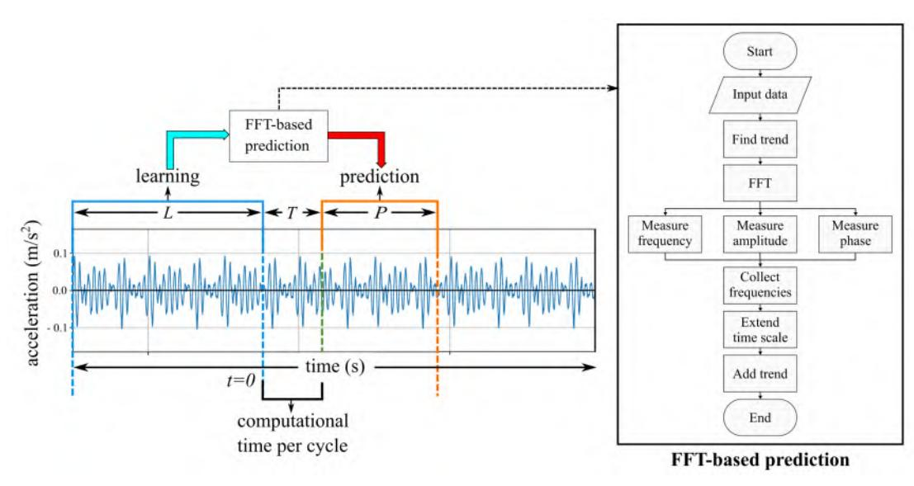

Figure 3.1 Schematic Algorithm diagram of FFT-based time series prediction algorithms.

error (MAE) can be used to classify errors that are uniformly distributed [7]. The computation time is an approximation of the actual computation time needed for the FFT, signal extraction, and IFFT. These values are reasonable approximations for actual hardware. The effect of computational time is also analyzed in different states and described with mean error and transient time. The algorithm configuration with the shortest learning window that exceeds the lower bound set by the Nyquist sampling theorem (0.1 s) is shown to converge faster following the nonstationary when compared to algorithm configurations with longer learning windows. The shortest computational time (0.01 s) is also impactful for smaller mean errors in different states and for obtaining the shortest transient time.

#### 3.2 Methodology

We followed the same data generation process described in Chapter 2. In this study, periodic structural vibration is analyzed. The measured acceleration signal is  $x_v$  ( $x_1, x_2, x_3, \dots, x_V$ ) where  $V$  is the total sample points in the observed signal. A rolling window,  $x_a$  of size,  $N$  moves forward through time as time progresses. By ap-

{35}------------------------------------------------

plying the FFT-based time series forecasting method, a signal is generated that is  $M$  points long where  $M > N$ . The difference,  $(M - N)$  presents the length of the prediction horizon. By determining  $N$  and  $M$ , this method can be applied to achieve a predicted signal of desirable length. The rolling window is  $x_a = (x_{a1}, x_{a2}, x_{a3}, \dots, x_{aN})$ . The first step is to remove any trend line from the acceleration  $x_a$ .  $x_{\text{trend}}$  represents the trend component of the acceleration data  $x_a$ . This trend component is the part of the acceleration signal that captures any long-term, systematic behavior or pattern, such as a steady increase or decrease over time, rather than short-term fluctuations or random noise. To do this, a polynomial function used where

$$x_{\text{trend}} = p(x) = c_0 + c_1 x + c_2 x^2 + \dots + c_q x^q \quad (3.1)$$

and  $q$  is the degree of the polynomial and  $c$  is a set of coefficients. In this work,  $q = 1$ , meaning it's a linear trend. After removing the trend, the new acceleration signal without trend is  $x = x_a - x_{\text{trend}}$  which has the same sample size as  $N$ . As considered, the acceleration signal without the trend,  $x = (x_1, x_2, x_3, \dots, x_N)$ , is a time series of  $N$ -samples that the frequency content is extracted from. Therefore, the discrete Fourier transform (DFT) of that series can be expressed as

$$X_k = \sum_{n=0}^{N-1} x_n e^{-i2\pi(kn/N)} \text{ for } k = 0, \dots, N \quad (3.2)$$

where,

$$\omega = 2\pi/N = 2\pi f \quad (3.3)$$

$$(X_{\text{amp}})_k = |X_k| \quad (3.4)$$

$$(X_{\text{phase}})_k = X_k/|X_k| \quad (3.5)$$

Similarly, the inverse DFT can be written as

$$x_n = \frac{1}{N} \sum_{k=0}^{N-1} X_k e^{i2\pi k n/N} \text{ for } n = 0, \dots, N \quad (3.6)$$

{36}------------------------------------------------

Now, consider a new series of  $M$  length where  $M > N$ . Using amplitude and phase information, the time series can be constructed and written as

$$x_m = \sum_{k=0}^{M-1} ((X_{\text{amp}})_k \cos(2\pi(\dot{k}m/M)) + (X_{\text{phase}})_k) \text{ for } m = 1, \dots, M \quad (3.7)$$

The  $x_m$  time series with the trend information added back can be expressed as

$$x_{\text{a\_new}} = x_m + x_{\text{trend}} \quad (3.8)$$

The predicted series would then be:

$$x_{\text{pred}} = (x_{\text{a\_new}(N+1)}, x_{\text{a\_new}(N+2)}, x_{\text{a\_new}(N+3)}, \dots, x_{\text{a\_new}(M)}) \quad (3.9)$$

Frequency domain  $X_k$ , measures for frequency ( $f$ ), amplitude ( $X_{\text{amp}}$ ) $_k$ , and phase ( $X_{\text{phase}}$ ) $_k$ . Here  $k$  is the index of components in the frequency domain while  $n$  and  $m$  are the indexes in the time domain for the original series and the new extended series respectively. Thereafter, selective frequency components are collected. For this work, only 28 frequencies are used for propagating the frequencies forward. The selected frequencies are those that have the most energy in the original signal. Here, the list of collected frequencies are given in Table 3.1

Table 3.1 Collected frequencies

|      |      |      | frequencies | (Hz) |      |      |
|------|------|------|-------------|------|------|------|
| 20   | -20  | 60   | -60         | 70   | -70  | 80   |
| -80  | 100  | -100 | 120         | -120 | 140  | -140 |
| 150  | -150 | 160  | -160        | 170  | -170 | 180  |
| -180 | 200  | -200 | 220         | -220 | 240  | -240 |

For time series forecasting, the FFT-based approach is implemented in a rolling window configuration. In this work, the sliding window length and the prediction window length is 1 s. The performance of this work has been analyzed with different learning window length ( $L$ ) and various computational times ( $T$ ). Here, three lengths

{37}------------------------------------------------

of learning windows are used, they are: i) 0.1 s window length, ii) 0.5 s window length, and iii) 1 s window length. Here, four computational times are assumed, intended to model the latency of the FFT, signal extraction, and IFFT on various hardware architectures. These are: i) 0.01 s, ii) 0.1 s, iii) 0.5 s, and iv) 1 s.

The algorithm is diagrammed in Figure 3.1. The left side of the figure shows how the rolling window is used to enable time series forecasting while the right-side flow chart shows how frequency component extraction and time series prediction is performed. Table 3.2 shows the parameter values.

Table 3.2 Parameter values

| learning | L (s) | length | computational time T (s) | prediction length P (s) |
|----------|-------|--------|--------------------------|-------------------------|
| 0.1,     | 0.5,  | 1      | 0.01                     | 1                       |
| 0.1,     | 0.5,  | 1      | 0.1                      | 1                       |
| 0.1,     | 0.5,  | 1      | 0.5                      | 1                       |
| 0.1,     | 0.5,  | 1      | 1                        | 1                       |

## 3.3 Results and Discussion

The effect of two parameters on the algorithm have been analyzed: the length of the learning window and the computational time required to perform the FFT-based algorithm.

Figure 3.2 reports the time series prediction for the FFT-based algorithm for the 12 window lengths considered. Figures 3.2(a)-(e) show that when the learning window is shorter than the period of the lowest frequency component of the signal, a periodicity in the predicted signal develops. However, when the learning window exceeds the base period in the signal, the periodicity in the predicted signal is removed; as shown in Figures 3.2(i)-(l). The lowest frequency among the frequencies that compose the signal is 20 Hz, as presented in Table 3.1. For a 20 Hz frequency, the corresponding period is 0.05 s. Therefore, to capture this frequency, the minimum learning window

{38}------------------------------------------------

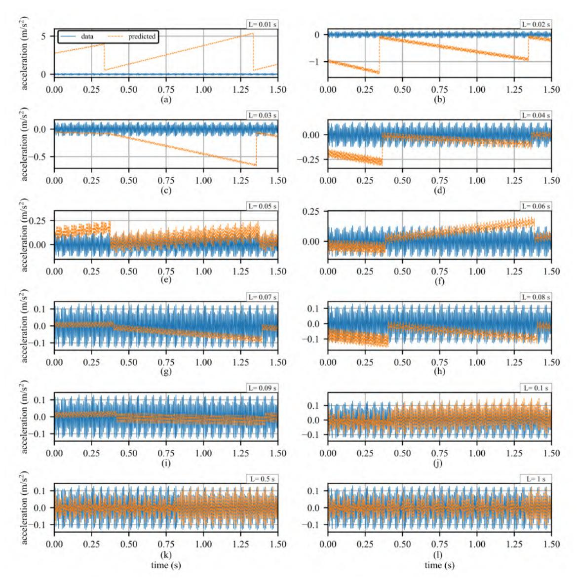

Figure 3.2 time series prediction using various learning window lengths showing: (a) 0.01 s window length; (b) 0.02 s window length; (c) 0.03 s window length; (d) 0.04 s window length; (e) 0.05 s window length; (f) 0.06 s window length; (g) 0.07 s window length; (h) 0.08 s window length; (i) 0.09 s window length; (j) 0.1 s window length; (k) 0.5 s window length; and (l) 1 s window length.

length needs to be twice the period of the signal, per the Nyquist Theorem. Applying the Nyquist Theorem, the minimum length of the learning window should be 0.1 s. This minimum sampling rate requirement is shown in Figures 3.2(j)-(l). For accurately capturing all the frequencies listed in Table 3.1, the minimum period should be higher than the Nyquist limit; for this data set the minimum learning rate

{39}------------------------------------------------

is about 0.15 s. As the length of the learning window increases beyond 0.1 s, the quality of the reproduced signal improves. This is shown in Figures 3.2(k)-(l) where Figure 3.2 (l) shows the best prediction. Signal convergence during the transient

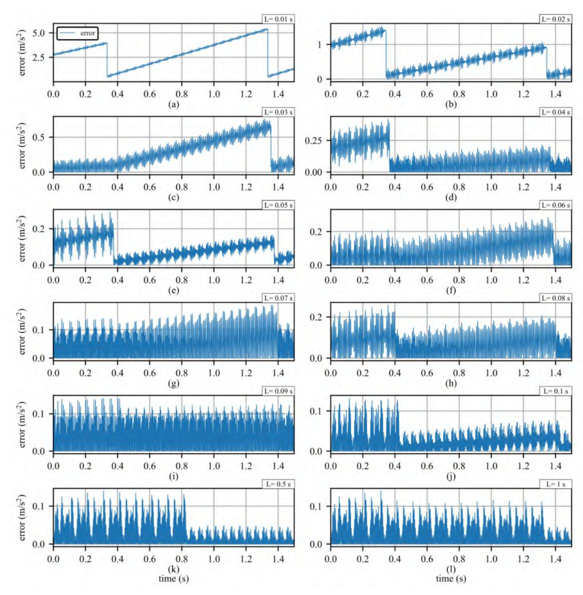

Figure 3.3 Calculated instantaneous error over for the experiment data with various learning window lengths showing: (a) 0.01 s window length; (b) 0.02 s window length; (c) 0.03 s window length; (d) 0.04 s window length; (e) 0.05 s window length; (f) 0.06 s window length; (g) 0.07 s window length; (h) 0.08 s window length; (i) 0.09 s window length; (j) 0.1 s window length; (k) 0.5 s window length; and (l) 1 s window length.

state is affected by the length of the learning window. As shown in Figure 3.2(l), the longest learning window length (1 s) takes approximately 1.3 seconds compared to

{40}------------------------------------------------

the 0.4 s learning window length in Figure 3.2(j) which requires only 0.4 seconds to converge. For the purpose of this paper, the system is said to be transient or in a transient state when it has not converged to a steady-state, quantified by looking at the change in error of the system.

The instantaneous (i.e. point-by-point) error for the FFT-based algorithm for the 12 window lengths considered is shown in Figure 3.3. The periodicity in the predicted signal is removed when the learning window reaches twice the signal's base frequency, as seen in Figures 3.3(j)-(l). Figure 3.3(j) shows the error for a learning window length is 0.1 s and has a slight periodic pattern, this is due to it being at the Nyquist limit. In Figures 3.3(j)-(l), the period of the signal that is in the transient state is denoted by a significantly higher level of error.

Figure 3.4 and Table 3.3 consider the three learning window lengths of 0.1 s (j), 0.5 s (k), and 1 s (l) for further analysis. Figure 3.4 and Table 3.3 report the effects of the selected learning window length on both the MAE and the transient time. Figure 3.4(a) shows that if the learning window length is increased, the mean error for the considered state decrease. Moreover, Figure 3.4(b) shows that if the learning length increases, the transient time also increases. Therefore, the mean error and learning window length relationship are inversely proportional while the transient time and learning window length relationship are proportional.

Table 3.3 Performance metrics for various learning window lengths.

| Pre-event steady state State MAE (m/s 2 ) | learning 0.1 s 0.0112 | window 0.5 s 0.0039 | length 1 s 0.0038 |
|-------------------------------------------|-----------------------|---------------------|-------------------|
| Transient event                           | 0.0409                | 0.0398              | 0.0335            |
| Post-event steady state                   | 0.0298                | 0.0103              | 0.0102            |
| Transient time (s)                        | 0.42                  | 0.82                | 1.32              |

Following the analysis of learning window length, the computational time of the algorithm is considered as another important parameter. Figure 3.5 and Table 3.4

{41}------------------------------------------------

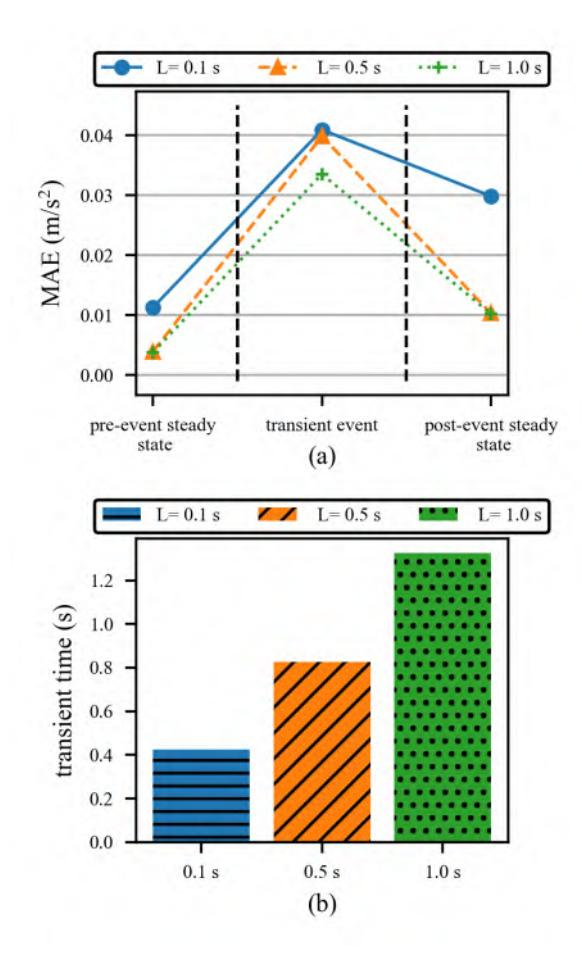

Figure 3.4 Effect of various learning window lengths ( $L$ ) showing: (a) MAE in different states, and; (b) transient time.

display the impact of four simulated computational times (0.01 s, 0.1 s, 0.5 s, and 1 s) for a constant learning length of 0.1 s. The learning length of 0.1 s was chosen as it provides a nice trade-off between the considered metrics of MAE and transient time. Figure 3.5 and Table 3.4 show that as the computational time increases, the MAE and transient time increases. This is a proportional relationship. Figure 3.5(a) depicts the MAE in various states. The MAE across the three computational times varies by less than 3%, this relatively constant error results from the benefits of a shorter computational time only being leveraged when the system experiences a transient event it must respond to. Figure 3.5(b) and Table 3.4 shows that the 0.01 s computational time results in a response with less transient time than 1 s.

{42}------------------------------------------------

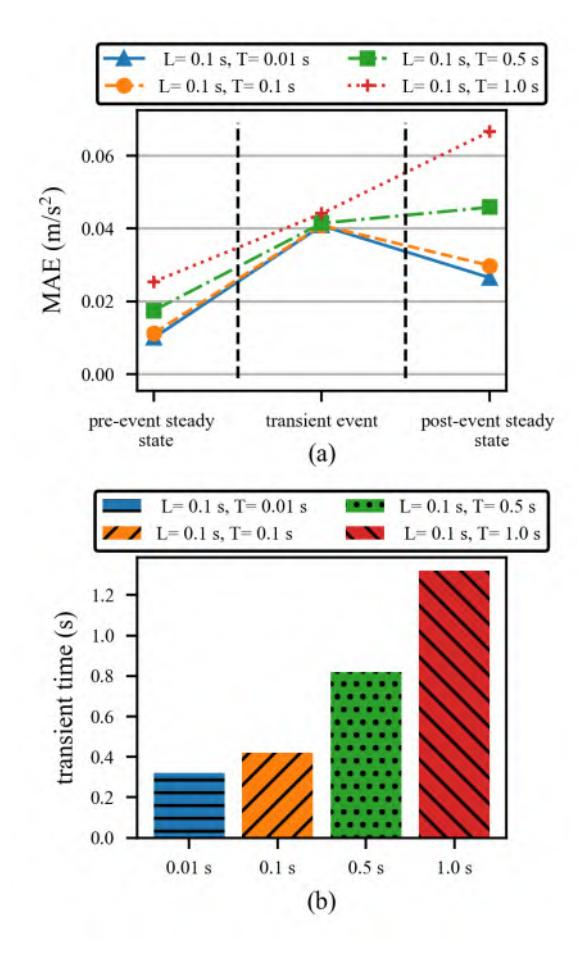

Figure 3.5 Effect of various computational time ( $T$ ) in a specific learning window length ( $L$ ) showing: (a) MAE in different states, and; (b) transient time.

Table 3.4 Performance metrics for various computational times.

|                  |        |       | 0.01   | s 0.1  | computational s 0.5 | time s 1 s |
|------------------|--------|-------|--------|--------|---------------------|------------|
| State MAE (m/s 2 |        |       |        |        |                     |            |
| Pre-event )      | steady | state | 0.0099 | 0.0112 | 0.0175              | 0.0254     |
| Transient        | event  |       | 0.0408 | 0.0409 | 0.0414              | 0.0441     |
| Post-event       | steady | state | 0.0265 | 0.0298 | 0.0459              | 0.0666     |
| Transient time   | (s)    |       | 0.32   | 0.42   | 0.82                | 1.32       |

## 3.4 Conclusion

This work describes a method for forecasting the state of dynamic structures experiencing nonstationary inputs, capable of time series predictions across different timescales. Hypersonic vehicles and space launch systems are the target applications

{43}------------------------------------------------

for this system. This work presents a mathematical examination and exploratory outcomes for the continuous execution of a Fast Fourier Transform (FFT)-based methodology for time series forecasting. For offline time series forecasting, the FFT-based approach is implemented in a rolling window configuration. Two types of parameter effects have been analyzed for the algorithm. The length of the learning window and the computational time taken to run the FFT-based algorithm are the two parameters. The effect of learning window length is described concerning mean error and transient state. Learning window lengths are inversely proportional with mean error in different states and proportional with transient time. In the case of mean error, the longest learning window length of 1 s provides the best performance in the steady-state condition. In the case of transient time or convergence duration, the shortest learning window length that is above the Nyquist limit (0.1 s) performs the best. The relationship between computational time and mean error in different states, as well as transient time, is proportional. The shortest computational time (0.01 s) shows the best performance in MAE and also in transient time. In future work, the FFT-based rolling window prediction method will be implemented in hardware for real-time online time series forecasting.

{44}------------------------------------------------

# Chapter 4 Hardware Implementation of Nonstationary Structural Dynamics Forecasting by FFT-based Prediction

(This chapter was published on "Time Series Forecasting for Structures Subjected to Nonstationary Inputs." In Smart Materials, Adaptive Structures and Intelligent Systems, vol. 85499, p. V001T03A008. American Society of Mechanical Engineers, 2021.[\[18\]](#page-140-1))

High-rate time series forecasting has applications in the domain of high-rate structural health monitoring and control. Hypersonic vehicles and space infrastructure are examples of structural systems that would benefit from time series forecasting on temporal data, including oscillations of control surfaces or structural response to an impact. This paper reports on the development of a software-hardware methodology for the deterministic and low-latency time series forecasting of structural vibrations. The proposed methodology is a software-hardware co-design of a fast Fourier transform (FFT) approach to time series forecasting. The FFT-based technique is implemented in a variable-length sequence configuration. The data is first de-trended, after which the time series data is translated to the frequency domain, and frequency, amplitude, and phase measurements are acquired. Next, a subset of frequency components is collected, translated back to the time domain, recombined, and the data's trend is recovered. Finally, the recombined signals are propagated into the future to the chosen forecasting horizon. The developed methodology achieves fully deterministic timing by being implemented on a Field Programmable Gate Array (FPGA). The developed 

{45}------------------------------------------------

methodology is experimentally validated on a Kintex-7 70T FPGA using structural vibration data obtained from a test structure with varying levels of nonstationarities. Results demonstrate that the system is capable of forecasting time series data 1 millisecond into the future. Four data acquisition sampling rates from 128 to 25600 S/s are investigated and compared. Results show that for the current hardware (Kintex-7 70T), only data sampled at 512 S/s is viable for real-time time series forecasting with a total system latency of 39.05 µs in restoring signal. In totality, this research showed that for the considered FFT-based time series algorithm the fine-tuning of hyperparameters for a specific sampling rate means that the usefulness of the algorithm is limited to a signal that does not shift considerably from the frequency information of the original signal. FPGA resource utilization, timing constraints of various aspects of the methodology, and the algorithm accuracy and limitations concerning different data are discussed.

## 4.1 Background

Real-time model-based control of active structures operating in high-rate environments requires real-time time series structural response forecasting. For example, hypersonic, space, and military systems require active control within the microsecond (µs) timescale as dictated by the dynamics of the system [\[25\]](#page-141-0). Real-time model-based control of these structures would enable real-time decision-making that would boost structure survivability in these extreme environments by modifying mission goals and outputs to changing conditions. According to Hong et al.[\[38\]](#page-142-2), the high-rate problem is marked by:

- 1. significant external load uncertainty;
- 2. high levels of nonstationarities and heavy disturbances; and
- 3. produced dynamics from modifications to the system design.

{46}------------------------------------------------

In general, structures that experience high-rate dynamics have acceleration amplitudes higher than  $100 g_n$  for a duration of under  $100$  ms.

Time series forecasting with high-rate dynamics is challenging as any approach used must be robust enough to operate with noisy sensor data [\[41\]](#page-143-3). Time series forecasting is accomplished by examining patterns in a variable (or the connections between variables) or developing a model and using either the learned pattern or model to forecast signals into the future. To analyze time series data, it is common practice to divide the monitored variable into the three categories of trend, nonstationary, and residual[\[51\]](#page-143-4). Various methods can be used to do this, including sliding window, smoothing, and autoregressive expectation, which is widely used in forecasting high-rate dynamic system states, financial turn of events, environmental change, and energy interest. [\[50\]](#page-143-0). When numerous time series components are present and their interactions need to be taken into account, a multivariate time arrangement is used [\[6\]](#page-139-2).

The timing requirements driven by µs structural health monitoring were articulated by Dodson et al. [\[25\]](#page-141-0). Based on the dynamics of the considered "high-rate" class of systems, this work sets a system latency and forecasting horizon of 1 ms. To expand, the algorithmic work developed in this paper seeks to forecast the dynamic structural response (i.e. signal) 1 ms into the future while completing all required computations within a latency of 1 ms. To enable deterministic and low-latency time series forecasting of nonstationary signals, an FFT-based forecasting approach was developed that was implemented on a Field Programmable Gate Array (FPGA).

This study outlines the development of an online structural vibration time series forecasting hardware/software system [\[12\]](#page-140-2). The FFT-based forecasting technique is employed in this study and is implemented in a variable-length sequence configuration. After the data has been de-trended, it is translated into the frequency domain and measurements of frequency, amplitude, and phase are made. The data's trend

{47}------------------------------------------------

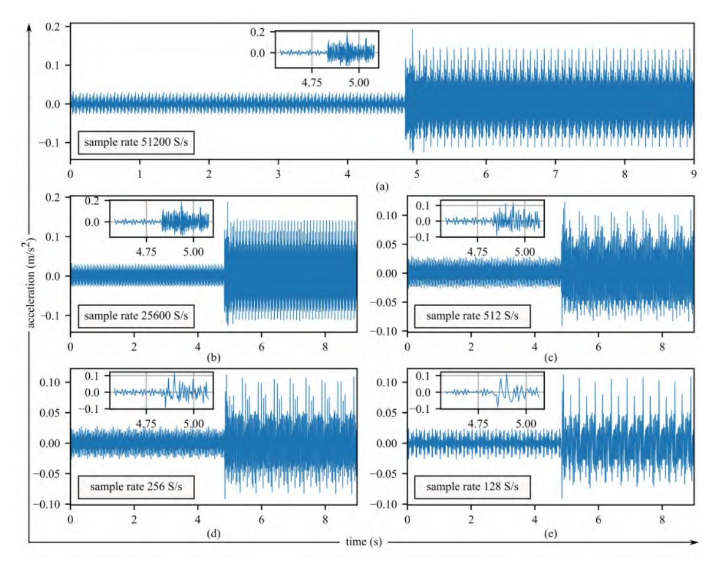

Figure 4.1 Data set with varied sample rates, showing: (a) the native sample rate of 51200 S/s; (b) sub-sampled at 25600 S/s; (c) 512 S/s; (d) 256 S/s; (e) 128 S/s; and inset plots provide a close look around nonstationary for each sampled data.

is then retrieved by gathering a selection of frequency components, translating them back into the time domain, and recombining them. The signals are extended into the future to the selected forecasting horizon at this point. The proposed methodology is experimentally evaluated on a Kintex-7 70T FPGA using structural vibration data from a test structure with varying levels of non-stationaries. [\[11\]](#page-140-0) Four data collection sampling rates, ranging from 128 to 25600 S/s, are examined and compared.

Results show that the system can forecast time series data within the 1 ms latency constraint. However, it needs to be noted that a key challenge of FFT-based time series forecasting is that the periodicity of the time series signal must be properly considered. There must be sufficient perceptions of a period arrangement that may

{48}------------------------------------------------

need to be processed as whole components (not partial cycles). To expand, there are challenges when trying to forecast a period signal when considering anything other than full periods of the signal that initiate and terminate as the zero-crossing. The contributions of this work are two-fold, 1) An experimental investigation showing the potential of the FFT-based time series forecasting methodology for high-rate signals, and 2) a detailed discussion of the periodicity challenge for FFT-based time series forecasting.

## 4.2 Methodology

This section describes the experimental testbed, experimental data, and the formulation of the FFT-based forecasting methodology.

## 4.2.1 Experimental Testbed

We followed the same data generation process described in Chapter 2, Section 2.1. Figure 4.1 reports the structure's measured acceleration response ( $x_v$ ) for a composite sinusoidal input from the shaker. In this work, the composite signal is made up of 50, 70, and 100 Hz sinusoidal signals. Two sine wave signals are concatenated together at  $t=5$  s where a nonstationary is present due to a change of frequency. To achieve this, an input signal of 0.25 V is used before  $t=5$  s while a signal of 0.25 V is used after  $t=5$  s. The first half of the composite signal is built from 50, 70, and 100 Hz frequencies while the second half signal consists of 50 and 100 Hz frequencies. Four different sampled data were created from this data and Figure 4.1 shows all of that including zoomed section near by nonstationary event. The original sampling rate of the data is displayed in figure 4.1 (a). This data is available in a public repository [11]

{49}------------------------------------------------

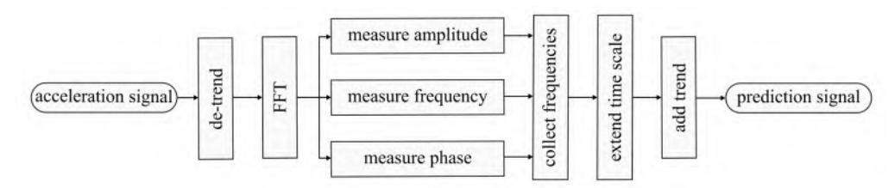

Figure 4.2 Schematic Algorithm diagram of FFT-based time series forecasting algorithms.

#### 4.2.2 Algorithm Formulation for FFT-based Forecasting

Figure 4.2 diagrams the algorithm used in this work for periodic structural vibration forecasting. The signal of observed acceleration is  $x_v = (x_1, x_2, x_3, \dots, x_V)$  where  $V$  is the total sample points in the observed signal. A variable length sequence,  $x_a$  of size,  $N$  moves forward through time as time progresses. By applying the FFT-based time series forecasting method, a signal is generated that is  $M$  points long where  $M > N$ . The difference,  $(M - N)$  presents the length of the forecasting horizon. By determining  $N$  and  $M$ , this method can be applied to achieve a predicted signal of desirable length. The variable length sequence is  $x_a = (x_{a1}, x_{a2}, x_{a3}, \dots, x_{aN})$ . The first step is to remove any trend line from the acceleration  $x_a$ . To do this, a polynomial function is used where

$$x_{\text{trend}} = p(x) = c_0 + c_1 x + c_2 x^2 + \cdots + c_q x^q \quad (4.1)$$

and  $q$  is the degree of the polynomial and  $c$  is a set of coefficients. In this work,  $q = 1$ . After removing the trend, the new acceleration signal without trend is  $x = x_a - x_{\text{trend}}$  which has the same sample size as  $N$ . As considered, the acceleration signal without the trend,  $x = (x_1, x_2, x_3, \dots, x_N)$ , is a time series of  $N$ -samples that the frequency content is extracted from[18]. Therefore, the discrete Fourier transform (DFT) of that series can be expressed as

$$X_k = \sum_{n=0}^{N-1} x_n e^{-i2\pi(kn/N)} \text{ for } k = 0, \dots, N \quad (4.2)$$

{50}------------------------------------------------

where,

$$\omega = 2\pi/N = 2\pi f \quad (4.3)$$

$$(X_{\text{amp}})_k = |X_k| \quad (4.4)$$

$$(X_{\text{phase}})_k = X_k/|X_k| \quad (4.5)$$

Similarly, the inverse DFT can be written as

$$x_n = \frac{1}{N} \sum_{k=0}^{N-1} X_k e^{(i2\pi k n/N)} \text{ for } n = 0, \dots, N \quad (4.6)$$

Now, consider a new series of  $M$  length where  $M > N$ . Using amplitude and phase information, the time series can be constructed and written as

$$x_m = \sum_{k=0}^{M-1} ((X_{\text{amp}})_k \cos(2\pi \dot{k}m/M)) + (X_{\text{phase}})_k) \text{ for } m = 1, \dots, M \quad (4.7)$$

The  $x_m$  time series with the trend information added back can be expressed as

$$x_{\text{a\_new}} = x_m + x_{\text{trend}} \quad (4.8)$$

The FFT-based algorithm works best when the waveform is not interrupted. Let's say a signal is embedded with 1 Hz, 5 Hz, and 10 Hz frequencies. Now if an acquisition (learning) window of 1.5 seconds in length is considered, then all of these waveforms are cropped except 10 Hz. In FFT, the time domain and frequency domain maintain the circular topologies. So, the two endpoints of input length are assumed to meet at the same point. But this is not true for this example. That's why it is necessary to ensure that the acquisition length considered for FFT must contain the integer number of periods. In a non-stationary signal, it is not possible to have all the embedded signals with different frequencies start at the same time. So, even taking a 1-second window cannot solve the situation. When the input length is shorter than the period of the lowest frequency component of the signal, periodicity in the predicted signal develops. However, when the input length exceeds the base period in the signal, the periodicity in the predicted signal is removed. Therefore, to capture

{51}------------------------------------------------

this frequency, the minimum learning window length needs to be twice the period of the signal, per the Nyquist Theorem. For accurately capturing all the frequencies, the minimum period should be higher than the Nyquist limit.

#### 4.2.3 Hardware Validation

While implementing any algorithm in FPGA hardware is a challenge, the FFT-based forecasting approach is a relatively simple algorithm making it well-suited for hardware implementation. In this work, hardware validation is done on a Kintex-7 70T FPGA housed in a NI cRIO-9035 that also incorporates a CPU running NI Linux Real-Time. Figure [5.2](#page-62-1) diagrams how data is collected and processed on the FPGA, as well as how data is transmitted through parallel FFT-based forecasting. The sampling rate of the hardware system is set from 128 to 51,200 S/s and is restricted to intervals of the internal clock of the 24-bit ADC used in this project. Data is passed from the DAQ to FIFO and stored in the FPGA's look-up table memory. From FIFO through a for-loop data is going to the FFT process. The next step is collecting specific frequencies to make more accurate forecasting and finally restoring the signal which is equivalent to 1 ms into the future is produced. The FFT process includes different steps like measuring real and imaginary, measuring phase, and measuring amplitude.

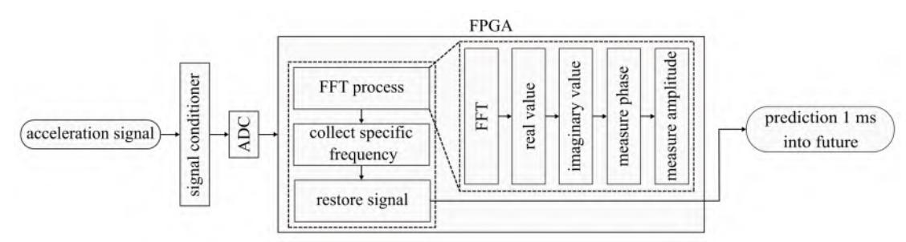

Figure 4.3 Flowchart for data collection and processing during FFT-based forecasting in case of hardware implementation.

{52}------------------------------------------------

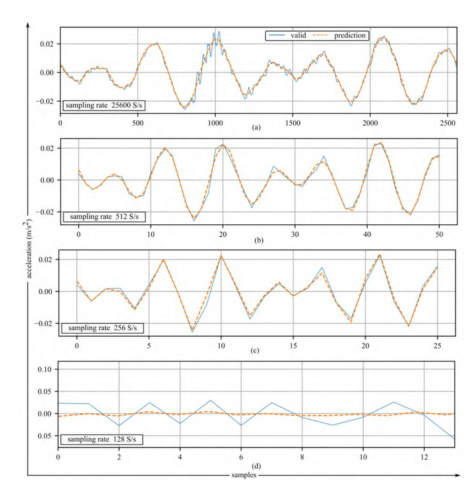

Figure 4.4 Simulation outcomes of forecasting at various sample rates, showing: (a) 25600 S/s; (b) 512 S/s; (c) 256 S/s; and (d) 128 S/s.

Table 4.1 FFT size and input length for different sampled data in hardware implementation.

| sampling rate  |       |     |     |     |
|----------------|-------|-----|-----|-----|
| (S/s)          | 25600 | 512 | 256 | 128 |
| FFT size input | 128   | 512 | 256 | 128 |
| (samples)      | 256   | 512 | 256 | 128 |

In this work, the LabVIEW FPGA development environment was used for devel-

{53}------------------------------------------------

oping the FPGA hardware designs, before being converted to a bitstream file through a Xilinx/Vivado workflow. The built-in LabVIEW FPGA FFT function has a range of size limitations between 8 to 8192 samples. Each size of FFT has a latency of cycles from 16 to 16384. For each sample rate, the goal was to pass a second of data to the FFT. However, due to hardware restrictions related to the chosen Kintex-7 70T FPGA, at the higher sampling rate of 25600 S/s the FPGA design could not meet timing requirements. Therefore, as shown in table [4.1,](#page-52-0) the FFT size and number of inputs are constrained for the sampling speeds of 25600 S/s. As a result, for subsequent research, only sampling data with a speed range of 128 to 25600 S/s is taken into consideration. The investigation of algorithm deployment on larger hardware is left to future work.

Table 4.2 For various sampling data, simulation outputs including RMSE, SNR, and chosen frequencies.

| Sampling Rate (S/s) | RMSE     | SNR   | Frequency List                              |      |
|---------------------|----------|-------|---------------------------------------------|------|
| 25600               | 0.001727 | 17.12 | 50, 70, 100, 210, 220, 240, 260, 280, -50,  | -70, |
|                     |          |       | -100, -210, -220, -240, -260, -280          |      |
| 512                 | 0.001889 | 16.33 | 50, 70, 100, -50, -70, -100                 |      |
| 256                 | 0.001911 | 16.18 | 50, 70, 100, -50, -70, -100                 |      |
| 128                 | 0.033853 | 0.15  | 50, 58, 22, 14, 20, 24, -50, -58, -22, -14, | -20, |

## 4.3 Results

Figure [4.4](#page-52-1) reports on the time series forecasting for four different sampling rates. Note that the native sampling rate of 51200 S/s is not shown for brevity as it performs similarly to 25600 S/s. Compared to the higher sampled data, the prediction accuracy for the lowest sampled data, 128 S/s, is poor. Note the significant drop-off in the algorithm's capabilities between 256 S/s and 128 S/s; which demonstrates that 256 S/s is the lower limit in terms of forecasting capabilities due to the loss of the higher frequency content in the signal down-sampled to 128 S/s.

{54}------------------------------------------------

Table [4.2](#page-53-1) shows the frequencies used in reconstructing the signal and reports the RMSE and SNR for the four considered sampling speeds. The average difference between values predicted by a model and the actual values is measured by the Root Mean Squared Error (RMSE). The ratio of a signal's (valid) power to background noise (error) is known as the signal-to-noise ratio (SNR). Here, signals are expressed using the logarithmic decibel (dB) scale as the signals considered have a wide dynamic range. In contrast to other speeds such as 128 S/s, the frequency list reveals that 25600 S/s utilized more frequencies. When data is sampled at faster speeds, more frequency-rich information is gathered, allowing for frequencies to be used in the reconstruction of the signal. Due to this, the algorithm is considered useless at the lowest sampling speed of 128 S/s. Figure [4.5](#page-54-0) reports the same RMSE and SNR data but in a graphical format, showing how values change in response to changes in the sampling speed.

Figure [4.6](#page-55-1) shows the required computation time and device utilization for different intermediate steps of hardware implementation. The 512 S/s sampling rate takes greater computation time for various intermediate hardware implementation phases

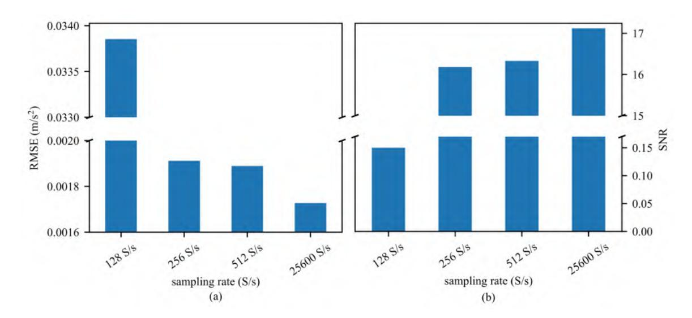

Figure 4.5 Effects of variously sampled data from simulation results, showing: (a) RMSE; and (b) SNR.

{55}------------------------------------------------

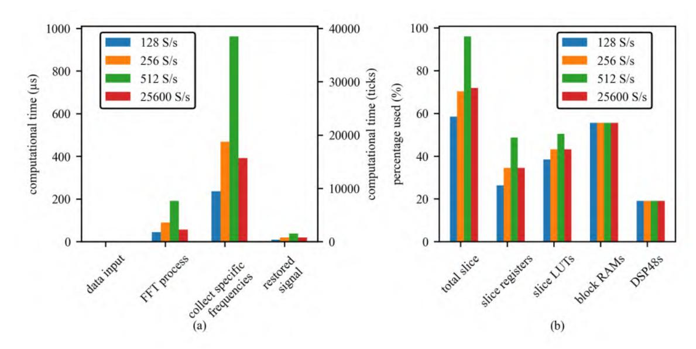

Figure 4.6 Results of the hardware validation procedure for varied sampled data in cases of (a) computation time required; and (b) device utilization.

than other sampling rates, as seen in figure [4.6\(](#page-55-1)a). Moreover, the larger the FFT size as defined in table [4.1,](#page-52-0) the larger the latency. This is the reason that the smallest sampled data 128 S/s has the lowest computation time, despite its forecasting results being completely unusable. Device utilization is shown in figure [4.6\(](#page-55-1)b) and experiences the same situation where the faster sampling rates generally require more FPGA resources. Note that for device utilization, the signal sampled at 512 S/s uses 96% of the FPGA slices, signifying that a sample rate of 512 S/s, along with an FFT size of 512 samples (see table [4.1\)](#page-52-0) is effectively the largest useful implementation of the FFT-based time series forecasting algorithm that can be deployed on the considered hardware (Kintex-7 70T).

Table 4.3 Time required for different aspects of FFT-based forecasting.

| sampling rate (S/s) | input (samples) | ticks | data input microsecond (µs) | ticks | FFT process microsecond (µs) | collect ticks | specific frequency microsecond (µs) | ticks | restore signal microsecond (µs) |
|---------------------|-----------------|-------|-----------------------------|-------|------------------------------|---------------|-------------------------------------|-------|---------------------------------|
| 25600               | 256             | 1     | 0.025                       | 2305  | 57.625                       | 15717         | 392.925                             | 802   | 20.05                           |
| 512                 | 512             | 1     | 0.025                       | 7679  | 191.975                      | 38502         | 962.55                              | 1562  | 39.05                           |
| 256                 | 256             | 1     | 0.025                       | 3584  | 89.6                         | 18789         | 469.725                             | 802   | 20.05                           |
| 128                 | 128             | 1     | 0.025                       | 1792  | 44.8                         | 9445          | 236.125                             | 410   | 10.25                           |

{56}------------------------------------------------

Table [4.3](#page-55-0) illustrates that all data sampling speeds require the same amount of time for the data input step of 0.025 µs. An important outlier to note is that the sampling speed of 512 S/s requires the most time with a total latency of 39.05 µs in case of restoring signal. This is because the sample rate of 512 S/s is paired with an FFT size of 512; which maximizes the device hardware. In comparison, the higher sampling rates of 25600 required its pairing with reduced FFT sizes to enable its deployment on the chosen FPGA hardware.

Table 4.4 Device utilization for FFT-based forecasting where FPGA elements are shown by device utilization.

| sampling rate (S/s) | total slice |                  |        | slice registers |                  |        | slice LUT/s |                  |        | block RAM/s |                  |        | DSD/s       |                  |        |
|------------------------|-------------|------------------|--------|-----------------|------------------|--------|-------------|------------------|--------|-------------|------------------|--------|-------------|------------------|--------|
|                        | slice used  | slices available | % used | slices used     | slices available | % used | slices used | slices available | % used | slices used | slices available | % used | slices used | slices available | % used |
| 25600                  |             |                  | 72     |                 |                  | 34.5   | 17723       |                  |        |             |                  | 46     |             |                  |        |
| 512                    | 9837        |                  | 96     |                 |                  | 48.8   | 20688       |                  |        |             |                  | 46     |             |                  |        |
| 256                    | 7220        | 10205            | 70.4   | 28320           | 82000            | 34.5   | 17716       | 41000            | 43.2   |             |                  |        |             | 240              | 19.2   |
| 128                    | 5999        |                  | 21663  |                 |                  | 26.4   | 15802       |                  |        |             |                  | 46     |             |                  |        |

Table [4.4](#page-56-1) shows that the device utilization for DSP48s and block RAMs remains constant across all data. Except for this, every other FPGA component shows a considerable amount of variance depending on the sampling rate of the data.

## 4.4 Conclusion

This work describes the creation of a hardware/software system for real-time structural vibration time series forecasting. The suggested method makes use of a forecasting algorithm based on FFT. While any algorithm is difficult to implement in FPGA hardware, the straightforward nature of this technique makes it less complicated for hardware implementation. The FFT-based approach collects, processes, and extends the chosen frequencies to the forecast horizon. In FFT, the circular topologies are maintained in both the time domain and the frequency domain. Thus, it is assumed that the input length's two ends match. Because of this, it is essential to make sure that the acquisition duration taken into account for FFT must include an even number of periods that start and stop at zero. Results show that for the current hardware

{57}------------------------------------------------

(Kintex-7 70T), only data sampled at 512 S/s is viable for real-time time series forecasting of the considered system with a total system latency of 39.05 µs in restoring signal. While a sampling speed of 256 S/s shows usefulness, a sampling speed of 25600 S/s requires FPGA resources beyond that provided by the chosen hardware. Lastly, the FFT-based time series algorithm itself completely falls apart for a sampling speed of 128 S/s. In totality, the tuning of hyperparameters for the FFT-based time series algorithm and its deployment onto FPGA hardware was found to be finicky and laborious while being tied to a signal within a limited frequency bandwidth. Future work will investigate the deployment of a hardware-in-a-loop implementation of the hardware/software system proposed here.

{58}------------------------------------------------

# Chapter 5 Deterministic and low-latency time-series forecasting of nonstationary signals by Ensembled MLP

(This chapter was published on "Deterministic and low-latency time-series forecasting of nonstationary signals." In Active and Passive Smart Structures and Integrated Systems XVI, vol. 12043, pp. 466-472. SPIE, 2022. [12])

Microsecond ( $\mu$ s) structural awareness, damage detection, prognostics, and control of structures that experience high-rate dynamics (i.e. shock) would benefit from real-time time-series forecasting of structural responses. Knowledge of future structural response would increase structure survivability in harsh dynamic environments by responding appropriately and adapting mission goals/outcomes to changing conditions.

#### 5.1 Background

The timing requirements driven by  $\mu$ s structural health monitoring of structures were articulated by Dodson et al. [25] and are presented in Table 5.1. Based on the dynamics of the considered class of system, a prediction horizon of 1 ms is used for this work. This work experimentally demonstrates that an ensemble of MLPs can be used for time series forecasting at an iteration step of 40  $\mu$ s, resulting in a new forecasted data point 1 ms into the future every 40  $\mu$ s.

To enable deterministic and low-latency time-series forecasting [63] of nonstationary signals, an ensemble-based approach was developed that consists of a series of

{59}------------------------------------------------

Table 5.1 Types and examples of timescales for high-rate monitoring [\[25\]](#page-141-0).

| Time      | scales of. Time Scales Examples                                             |
|-----------|-----------------------------------------------------------------------------|
| duration  | of the event 30 µs – 100 ms structural loading blast,                       |
|           | high-speed impact, automotive crash [38]                                    |
| sensor    | response 3 µs – 10 µs accelerometer, strain gage, ect. [67]                 |
| different | physical                                                                    |
| behavior  | regimes 250 µs – 1 sec energy propagation,structural resonance              |
| algorithm | execution                                                                   |
| and       | decision-making 100 µs – 1 ms damage detection, uncertainty quantification, |
|           | state awareness                                                             |

Multi-Layer Perceptrons (MLP) implemented on a Field Programmable Gate Array (FPGAs) [\[49\]](#page-143-5). The MLPs are trained offline where the proportion of trustworthiness that is associated to the output of any particular MLP is updated online through an attention layer. Through parallelizing the neural networks, the length of the graph is reduced, thereby enabling low-latency inference. In this preliminary work, a series of MLPs are trained offline on dynamics learned from the system. When the system experiences a nonstationarity and transfers to another state the attention layer adapts to the changing dynamics, thereby allowing for a continuous prediction horizon.

This chapter describes the creation of a software-hardware system for online structural vibration time-series forecasting that can recognize nonstationary events and alter their anticipated signal in response to them. An ensemble of multi-layer perceptrons is used in the proposed technique, which is trained offline on actual and simulated data relevant to the structure. The outputs of the multiple models are then selectively scaled by a dynamic attention layer to generate a unified anticipated signal over the relevant prediction horizon. The results show that for the system under consideration, a total system latency of less than 1 ms may be attained with appropriate precision. The time consumption [\[32\]](#page-142-3) for various components of code and device utilization is the major focus for hardware implementation in this preliminary work.

{60}------------------------------------------------

#### 5.2 Methodology

We followed the same data genertion process described in Chapter 2. The algorithm consists of an ensemble of MLPs running in parallel, each sampling the incoming observations at a different rate. The use of an ensemble empowers multi-rate sampling to capture multi-temporal features of the time series. Also, the parallel arrangement of the network enables the fast computation times required by high-rate applications. An attention layer combines the output information of the individual MLPs in the ensemble to model the input time series. The architecture of the pre-trained networks connected with the attention layer is illustrated in Fig. 5.1. MLP  $i$  is a multi-layer perceptron network pre-trained to predict with a unique time delay and sequence input. The output of each of the MLPs is a pre-defined feature of the input time series, e.g. a specific frequency of the input. The attention layer scales the output features from the MLPs as the input to another feed-forward network for the target prediction. In this specific case, the attention layer is a single neuron with linear activation.

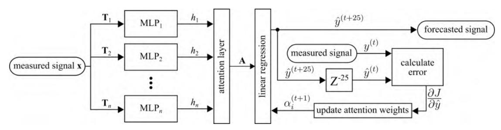

Figure 5.1 Schematic Algorithm diagram of an ensemble of MLPs using the 50 most recent data points and predicting 25 data points (1 ms) into the future.

The steps for the forward pass of the network for online prediction are as follows:

- The input to the network is an online stream of observations sampled at  $f_s$ .
- 2. The input to MLP  $i$  is a vector  $\mathbf{T}_i$  of length  $m_i$  constructed by taking every  $s_i$  ( $s_i \in \mathbb{N}$ ) observation from the raw input. The length and sub-sampling rate

{61}------------------------------------------------

of the inputs are determined according to the desired extracted features of the time-series during the pre-training phase of the individual MLPs. At time step, the input  $\mathbf{T}_i$  is of the form:

$$\mathbf{T}_i = \{x_{t-(m_i-1)s_i}, \dots, x_{t-s_i}, x_t\} \quad (5.1)$$

3. The input to the attention layer is the output of the individual MLPs. The attention layer assigns a real-valued weight to each of the outputs  $h_i$  of MLPs as:

$$\mathbf{A} = \begin{bmatrix} \alpha_1 & 0 & \cdots & 0 \\ 0 & \alpha_2 & \cdots & 0 \\ \vdots & \vdots & \ddots & \vdots \\ 0 & 0 & \cdots & \alpha_n \end{bmatrix} \begin{bmatrix} h_1 \\ h_2 \\ \vdots \\ h_n \end{bmatrix} \quad (5.2)$$

where  $\alpha_i \in \mathbb{R}$ . The output vector of the attention layer is fed into a linear regressor neuron to make a prediction at a 25-step ahead (1 ms) as:

$$\hat{y}^{(t+25)} = \mathbf{W}_{1 \times n} \mathbf{A}_{n \times 1} + b \quad (5.3)$$

where  $\mathbf{W}$  and  $b$  are the weight matrix of the MLP outputs and the bias scalar, respectively.

4. The loss of the prediction is calculated as:

$$J = \frac{(y - \hat{y})^2}{2} \quad (5.4)$$

where  $y$  is the target value.

The prediction error can be propagated backward in the network to train the attention layer and the linear regressor. The goal is to obtain the gradient of the prediction error with respect to trainable parameters  $\alpha_i$ ,  $\mathbf{W}$ , and  $b$ , i.e.  $\frac{\partial J}{\partial \alpha_i}$ ,  $\frac{\partial J}{\partial \mathbf{W}}$ , and  $\frac{\partial J}{\partial b}$ . Using the chain rule :

$$\frac{\partial J}{\partial \alpha_i} = \frac{\partial J}{\partial \hat{y}} \frac{\partial \hat{y}}{\partial \mathbf{A}_i} \frac{\partial \mathbf{A}_i}{\partial \alpha_i} \quad \frac{\partial J}{\partial \mathbf{W}} = \frac{\partial J}{\partial \hat{y}} \frac{\partial \hat{y}}{\partial \mathbf{W}} \quad \frac{\partial J}{\partial b} = \frac{\partial J}{\partial \hat{y}} \quad (5.5)$$

{62}------------------------------------------------

The chain derivative terms are calculated as:

$$\frac{\partial J}{\partial \hat{y}} = \hat{y} - y \quad \frac{\partial \hat{y}}{\partial A} = \mathbf{W} \quad \frac{\partial \mathbf{A}}{\partial \alpha_i} = h_i \quad \frac{\partial \hat{y}}{\partial \mathbf{W}} = \mathbf{A}^T \quad (5.6)$$

With the gradients obtained, the parameters are trained with gradient descent method as:

$$\alpha_i^{t+1} = \alpha_i^t - \text{learning\_rate} \times \frac{\partial J}{\partial \alpha_i} \quad (5.7)$$

$$\mathbf{W}^{t+1} = \mathbf{W}^t - \text{learning\_rate} \times \frac{\partial J}{\partial W} \quad (5.8)$$

$$b^{t+1} = b^t - \text{learning\_rate} \times \frac{\partial J}{\partial b} \quad (5.9)$$

#### 5.3 Hardware Validation

In this work, hardware validation is done on a Kintex-7 70T FPGA housed in a NI cRIO-9035 that also incorporates a CPU running NI Linux Real-Time. Fig. [5.2](#page-62-1) diagrams how data is collected and processed on the FPGA [\[8\]](#page-139-4) , as well as how data is transmitted through the parallel MLP tracks.

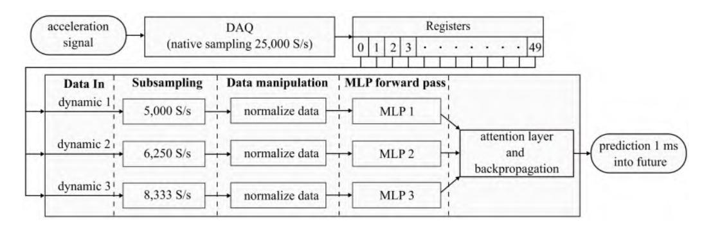

Figure 5.2 Flow chart of data collection and processing in parallel MLP tracks.

The sampling rate of the system is set to 25,000 S/s and is restricted to intervals of the internal clock of the 24-bit ADC used in this project, a NI-9239 manufactured by NI. Data is passed from the DAQ to a set of 50 registers, stored in the FPGA's look-up table memory. The registers make up a software-defined rolling buffer of the 50 most recent digitized signals. The rolling buffer is sub-sampled at 5,000 S/s, 6,250 S/s, 

{63}------------------------------------------------

and 8,333 S/s for the three different MLP tracks. The data is then normalized, by detecting maximum and minimum values from input data and ranging the data between -1 to 1. Next, the normalized data is fed through the MLP (i.e. forward pass) to obtain a prediction that is then passed to the attention layer before a final prediction of the signal 25 clock cycles (1 ms) into the future is produced.

## 5.4 Results

In validating the proposed algorithm, it is assumed that the input signal was available as prior knowledge based on which the hyper-parameters of the ensemble architecture and training sets of individual MLPs were selected. In this application, three MLPs are selected to represent the three harmonics making the input time series. Three synthetic datasets, each containing a single frequency harmonics with 1,562 Hz, 1,875 Hz, and 2,344 Hz frequency were created and sampled at a similar rate of 25,000 S/s to the target dataset to pre-train the MLPs. The inputs to the individual MLPs are

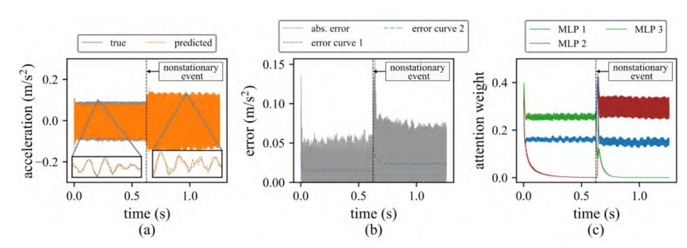

Figure 5.3 Algorithm results, showing: (a) the truth and prediction result of the ensemble; (b) the absolute error before and after the nonstationary event, and; (c) the evolution of the attention weights for different MLP's.

sampled at four times the oscillating frequency of the corresponding harmonic, i.e. 6,248 Hz, 7,500 Hz, and 9,376 Hz, which translates to  $s = \{5, 4, 3\}$  for MLPs 1, 2, and 3, respectively. All MLPs have an input length of 10 ( $m = 10$ ) as well as a single hidden layer with rectified linear unit (ReLU) activation function and four neurons

{64}------------------------------------------------

followed by a single neuron output layer with a linear activation function. The MLPs were pre-trained on batches of 10 for 10 epochs with a learning rate of 0.05 to predict 25 steps (1 ms) into the future.

Figs. 5.3(a) and (b) show the prediction result of the ensemble along with the error, respectively. The error is maximum at the beginning of the prediction and after the nonstationary event, but it quickly settles into a steady-state error. To measure the convergence of the error at the two locations, an exponential curve of the form  $y = a - be^{-ct}$  is fitted to the error before and after the nonstationary event where  $a$  is the error floor,  $b$  the error amplitude, and  $c$  error convergence rate. The fitted curves are also shown in Fig. 5.3(b) in dashed and dashed-dotted lines. The convergence is defined as the time where the error curve reaches  $\pm 5\%$  of the error floor. Table 5.2 lists the root mean squared error (RMSE), error floor, signal to noise ratio (SNR), and convergence time of the network before and after the nonstationary event.

Table 5.2 Performance metrics of the predicted results.

|                            | RMSE (m/s 2 ) | <i>a</i> (m/s 2 ) | SPR  | convergence (ms) |
|----------------------------|--------------------------|------------------------------|------|------------------|
| before nonstationary event | 0.019                    | 0.015                        | 6.09 | 18.5             |
| after nonstationary event  | 0.031                    | 0.024                        | 5.63 | 71.6             |

The deterministic characteristics of the algorithm are provided by the FPGA

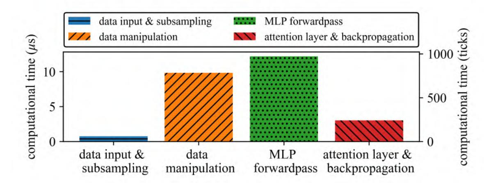

Figure 5.4 Time required for different aspects of the process.

{65}------------------------------------------------

implementation, timing, and resource utilization are discussed here. The FPGA’s base clock is compiled at 80 MHz and a single pass through the algorithm takes 2,005 clock ticks (25.76  $\mu$ s). As a new sample is digitized every 40  $\mu$ s, the system is dormant for 1,195 clock ticks (14.24  $\mu$ s) between each iteration as it waits for a new data point to be added to the rolling memory buffer. Fig. 5.4 reports the timing performance for different aspects of the process. Resource utilization is presented in Table 5.3, which reports the resource utilization in terms of slices used, slice availability, and percentage (%).

Table 5.3 The FPGA elements are shown by the device utilization.

|        |           | slices used | slices available | percentage used (%) |
|--------|-----------|-------------|------------------|---------------------|
| total  | slice     | 9895        | 10250            | 96.5                |
| slice  | registers | 36661       | 82000            | 44.7                |
| slice  | LUTs      | 27917       | 41000            | 68.1                |
| block  | RAMs      | 19          | 135              | 14.1                |
| DSP48s |           | 48          | 240              | 20.0                |

## 5.5 Conclusion

This study outlines the development of a software-hardware system for online forecasting of structural vibration time-series that can learn over nonstationary occurrences and adjust the expected signal accordingly. The proposed technique employs an ensemble of multi-layer perceptrons that are trained offline on simulated data relevant to the structure. The results reveal that a total system latency of 25.76  $\mu$ s can be achieved with sufficient precision for the high-rate systems under discussion. The key focus for the current hardware implementation is the time consumption for various components of code and device utilization. The current implementation is largely limited by the amount of memory available in look-up tables at the cell level block.

{66}------------------------------------------------

# Chapter 6 Predicting Structural Responses in Impact Scenarios with Physics-Guided Machine Learning

( This chapter was partially published on the following:

"Physics informed machine learning part I: Different strategies to incorporate physics into engineering problems. In Conference Proceedings of the Society for Experimental Mechanics Series". Springer Nature Switzerland, 2024 [\[65\]](#page-145-1)

"Physics informed machine learning part II: Applications in structural response forecasting". In Conference Proceedings of the Society for Experimental Mechanics Series. Springer Nature Switzerland, 2024.[\[26\]](#page-141-2) )

To effectively manage real-time model-predictive control of active structures within extreme dynamic environments, it's crucial to have a modeling program that accurately represents dynamic structural behavior and can adapt to rapid changes in external conditions. Active structures, such as supersonic aircraft, active blast mitigation systems, and adaptive response mechanisms during vehicle crashes, are subject to high-rate dynamics that pose significant challenges for predictive modeling. Traditional black/gray-box machine learning approaches to modeling these structures often encounter difficulties with data trustworthiness, primarily due to the rapid and complex nature of the dynamics involved. The challenge is further compounded by the limited availability of data from structures that have sustained damage, making

{67}------------------------------------------------

diagnoses and predictions using supervised machine learning techniques less reliable. This study introduces **PISP** (Physics Informed Series Prediction) model designed to enhance the accuracy of dynamic response forecasts for structural systems. The focus is on structures undergoing non-stationary events, such as impacts, superimposed on what are considered stationary dynamic conditions, like wind-induced loading. A key objective of this research is to assess the forecasting capabilities of a neural networkbased forecaster that incorporates physical knowledge from numerical models through a data augmentation approach. The experimental setup involves a cantilever beam subjected to consistent excitation, with an additional impact excitation to simulate a nonstationary event. Physics-informed features derived from finite element analysis of the beam are integrated into the machine learning model. This approach not only aids in overcoming the limitations posed by the lack of data from damaged structures but also introduces a novel way of enriching machine learning models with physical insights. The results of this study demonstrate a significant improvement, with the proposed physics-informed machine learning approach outperforming purely experimental data-driven methods in forecasting accuracy in the form of percentages is around 18% for RMSE, 9.80% for MAE, 9.65% for SNRdb, and 0.91% for TRAC. This advancement underscores the potential of combining physical principles with machine learning to create more robust, reliable models for predicting the dynamic responses of structures under complex, high-rate dynamic conditions. By integrating detailed physical insights into the machine learning process, this research paves the way for more effective real-time predictive control of active structures, ensuring better preparedness and response to dynamic environmental challenges.

## 6.1 Background

The real-time forecasting of structural responses using time-series analysis offers significant advantages in understanding structural behavior, detecting damage, and con

{68}------------------------------------------------

trolling systems under high-rate dynamics like shock events. This capability enhances survivability in dynamic environments, facilitating adaptive responses to changing conditions. Accurately predicting a structure's future behavior is crucial for its survival in harsh environments. This applies to high-rate dynamics including hypersonic vehicles, space infrastructure, and blast mitigation systems [\[25\]](#page-141-0), all experiencing extreme accelerations over very short durations. Challenges in high-rate dynamics include uncertainties in external loads, nonstationarities, disruptive disturbances, and unmodeled dynamics [\[38\]](#page-142-2).

Time series analysis is a technique for analyzing data collected over time to understand system evolution and changes. It is widely used in various fields for prediction and decision-making. However, traditional methods like ARIMA [\[36\]](#page-142-4). and support vector machines struggle with the complexity of high-rate dynamics. Deep learning models are well-suited for handling large, multi-dimensional datasets, making them advantageous for complex structures experiencing high-rate dynamics. However, deep learning can be limited by the availability of data and the difficulty in interpreting its results [\[64\]](#page-144-4).

Physics-Informed Machine Learning (PIML) breaks new ground by seamlessly combining the strengths of machine learning with well-understood physics principles. Imagine injecting expert knowledge directly into the model! This empowers PIML to create highly accurate predictions that are firmly rooted in real-world physics. This innovative marriage of techniques allows PIML to tackle complex problems, adapt to changing situations, and deliver reliable results even with limited data. In essence, PIML rewrites the rules of time series prediction by harmonizing practical observations with fundamental scientific laws. PIML isn't without its challenges [\[65\]](#page-145-1). These can be broadly categorized into two areas: data and models. Since PIML relies on machine learning, it inherits some of its limitations. Data issues like representation, combining data from different sources, scarcity, noise, and validation can 

{69}------------------------------------------------

all affect performance. Additionally, researchers are still actively exploring the best models for complex, multi-dimensional problems. This includes figuring out how to incorporate physical constraints into the model's design, how much weight to give existing physics knowledge, and how to optimize these complex models with all their multi-dimensional limitations [\[59\]](#page-144-5). Despite its potential, PIML encounters limitations related to data representation, cross-domain data adaptation, model selection, and optimization.PIML presents a promising approach for real-time forecasting of high-rate dynamic structures. While limitations exist, ongoing research holds the potential to revolutionize structural health monitoring [\[14\]](#page-140-3) and control in demanding environments [\[40\]](#page-142-5).

One promising approach to enhance the capabilities of Physics-Informed Machine Learning (PIML) is through data augmentation. PIML, while powerful for complex problems with limited data, inherits challenges from its machine learning foundation, such as data scarcity and difficulty capturing intricate physical relationships. Data augmentation bridges this gap by artificially expanding the training dataset. This is achieved by generating new data points through techniques like random rotations, scaling, or adding noise. By injecting this enriched information into the PIML model, it improves its ability to learn complex physics even with a limited original dataset [\[21\]](#page-141-3).

This research explores how a neural network predictor can be enhanced by incorporating physical knowledge from numerical models. This "data-augmented" approach bridges the gap between purely data-driven models and physics-based models, aiming to improve prediction accuracy. The experiment uses a vibrating beam with an extra, unexpected impact to simulate a real-world situation. Information from a computer model of the beam is fed into the machine-learning model. This not only helps overcome the challenge of limited data on damaged structures but also creates a new way to enrich machine learning models with real-world physics. This work

{70}------------------------------------------------

analyses how an increased number of physics-informed features improves temporal prediction. The contributions of this paper are: 1) Generating data originating from experimental observations and finite element analysis for a cantilever beam structure, and 2) Physics-informed data augmented model development.

## 6.2 Data Generation

This research utilizes two data sources. The first involves a physical experiment: a cantilever beam is vibrated consistently and then subjected to an unexpected impact. This simulates real-world situations where structures experience both regular and sudden forces. The second data source is computational. A finite element analysis of the beam is used to extract physics-informed features. This additional data enriches the machine learning model with valuable insights about the beam's physical behavior.

#### 6.2.1 Experimental data generation:

We followed the same data generation process described in Chapter 2, Section 2.2. The shaker initiates a nonstationary excitation of the beam using a pre-generated sinusoid signal with a 1 V amplitude and a 20 Hz frequency starting at  $t=0$ . Around  $t=5$  secs, a modal hammer (Emerson Model A034701) delivers a secondary nonstationary excitation to the beam. The hammer force is approximately 315.73 N. Furthermore, the force exerted by the modal hammer is captured to provide insight into the impact force applied to the cantilever beam and recorded by the DAQ module. The structure's measured acceleration response ( $\mathbf{X}_a$ ) for the entire test is shown in Figure 2.5(a), while an expanded view depicting the close view around the nonstationary event created by modal hammer impact is displayed in Figure 2.5(b). The sample rate of this generated data is around 2560 S/s.

{71}------------------------------------------------

#### 6.2.2 Physics-informed data generation:

The physical properties of a beam, including displacement and strain, play a crucial role in influencing a shaker's ability to move it up and down. Firstly, it highlights the importance of understanding the displacement characteristics, particularly flexibility, of the beam. A more flexible beam will deform more easily, potentially affecting the shaker's ability to induce controlled movements. Conversely, a rigid beam may resist displacement, requiring more force from the shaker. Secondly, it emphasizes the significance of strain, which measures the displacement of a material under stress. Different materials exhibit varying levels of strain in response to applied forces. The shaker must consider the material's strain behavior to effectively move the beam, as excessive strain could lead to permanent displacement or failure, ultimately affecting the shaker's control.

The model of a fixed-supported continuous cantilever beam has been designed in ANSYS for generating Physics-informed features. The length (L), width (W), and depth (D) of the beam are considered 0.759 mm, 0.05066 mm, and 0.00514 mm respectively. Steel is taken as the material for the fixed supported continuous beam and its properties are taken as for steel Young's modulus as 2E11 Pa, Poisson's ratio as 0.3, and density as 7850 kg/m3.The fixed supported continuous beam considered for modeling in ANSYS is shown in Fig. [7.8.](#page-105-2) This figure shows the overall mesh of 320 elements and 2588 Nodes. The fixed support cantilever beam is excited as an experimental excitation force through the free end and fed as tabular data of forces. As a result, total displacement, equivalent elastic strain, x-axis, y-axis, and z-axis deformations are generated. The overall physics-informed data from the FEA model have been shown in Fig. [7.18.](#page-118-1)

{72}------------------------------------------------

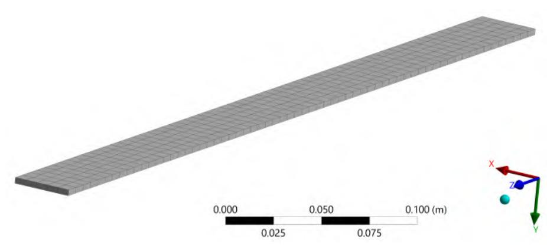

Figure 6.1 FEA model of a steel cantilever beam with detail mesh.

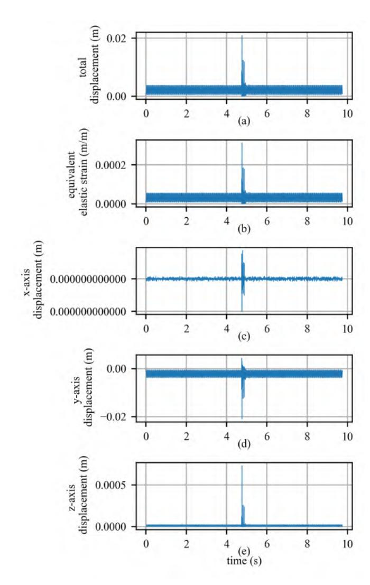

Figure 6.2 Physics informed data from FEA model showing: (a) total displacement; (b) equivalent elastic strain; (c) x-axis displacement; (d) y-axis displacement; and (e) z-axis displacement.

{73}------------------------------------------------

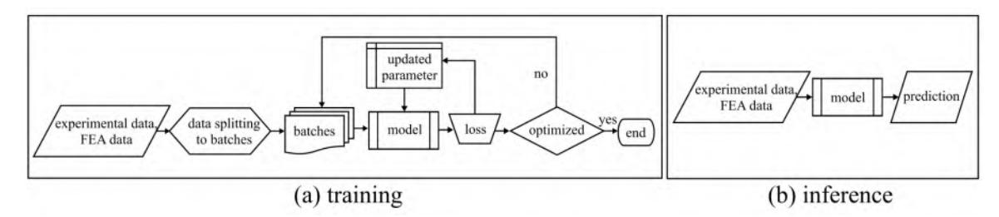

Figure 6.3 Simple overall architecture and workflow of the proposed model PISP (a) training; and (b) inference.

#### 6.3 Methodology

The proposed PISP model is a physics-informed data-augmented machine learning model for time-series prediction. Improving the temporal forecasting in the case of univariate data with data augmented physics-informed model is the main contribution of this model. This model is well enough to predict nonstationary events like high-rate dynamic events. This model is a combination of Bidirectional Long Short-Term Memory (Bi-LSTM) representation learning to digest raw information for feature engineering; where the generation of latent features and fully connected layers-based regression for time series prediction is evolved eventually. The simple model architecture based on training and inference are shown in the figure 6.3. The model architecture and detailed workflow of the overall model are shown in the figure 6.4 and the algorithm 1 respectively.

Let  $n$  represent the temporal span of the input acceleration data  $\mathbf{X}_a$  which can be written as:

$$\mathbf{X}_a = [x_{a,0}, x_{a,1}, x_{a,2}, \dots, x_{a,n}] \quad (6.1)$$

Next, consider the prediction acceleration to be  $\hat{\mathbf{Y}}_a$  and its horizon to be  $m$ . the corresponding output is denoted as:

$$\hat{\mathbf{Y}}_a = [\hat{y}_{a,0}, \hat{y}_{a,1}, \hat{y}_{a,2}, \dots, \hat{y}_{a,m}] \quad (6.2)$$

For physics-informed (PI) data augmentation problems, there exist more PI input features (e.g.  $\mathbf{X}_b$ ,  $\mathbf{X}_c$ , ...,  $\mathbf{X}_z$ ) along with the experimental input acceleration data,

{74}------------------------------------------------

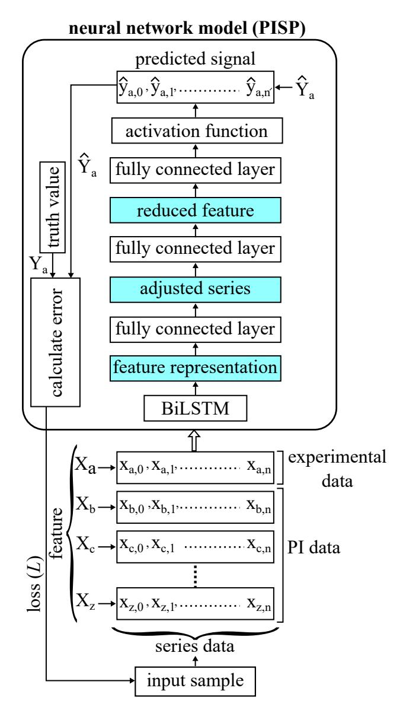

Figure 6.4 Overall detailed architecture and workflow of the proposed model PISP

 $\mathbf{X}_a$ . But the goal remains to predict a single output vector  $\hat{\mathbf{Y}}_a$ .

The PISP model starts with the feature representation function by using BiL-STM,  $\beta(\cdot)$  as below in equation 7.27. The input is the PI augmented data which is  $[\mathbf{X}_a, \mathbf{X}_b, \mathbf{X}_c, \mathbf{X}_d, \mathbf{X}_e, \mathbf{X}_f]$ .

$$H = \beta \left( [\mathbf{X}_a, \mathbf{X}_b, \mathbf{X}_c, \mathbf{X}_d, \mathbf{X}_e, \mathbf{X}_f] \right) \quad (6.3)$$

As the input length and the output length are not the same, the next step of this model is to adjust the series length. For that, a Fully Connected Layer,  $l_1$  is preferred

{75}------------------------------------------------

which includes the weight and bias of  $W_{l1}, b_{l1}$ . In the equation 6.4 the input is the  $\tau(H)$  which is the transpose of the  $H$  (the output from equation 7.27). The adjusted series,  $S$  is derived by the equation 6.5 via inverse transformed.

$$\delta = \tau(H) \cdot W_{l1} + b_{l1} \quad (6.4)$$

$$S = \tau'(\delta) \quad (6.5)$$

Now this adjusted series,  $S$  goes through two fully connected layers  $(l2, l3)$  and the activation function,  $\phi(\cdot)$  to derived the final output,  $\hat{\mathbf{Y}}_a$ .

$$R = S \cdot W_{l2} + b_{l2} \quad (6.6)$$

$$\mathbf{Y}_a = \phi(R \cdot W_{l3} + b_{l3}) \quad (6.7)$$

The training loss  $\mathcal{L}$  in Equation 6.8 is a Mean squared error loss which is between the truth value of acceleration  $\mathbf{Y}_a$  and final prediction value  $\hat{\mathbf{Y}}_a$ .

$$\mathcal{L} = \sum_{i=1}^m \left( \mathbf{Y}_a - \hat{\mathbf{Y}}_a \right)^2 \quad (6.8)$$

The overall flow of this proposed physics-informed knowledge transformation model is shown in algorithm 1 and Fig ??.

## **Algorithm 1** PISP workflow

| 1:  | X      | a | ←  | acceleration           | data                       |                        | ▷ figure.  | 2.5(  | a)   |
|-----|--------|---|----|------------------------|----------------------------|------------------------|------------|-------|------|
| 2:  | X      | b | ←  | total                  | displacement               | ▷                      | figure.    | 7.18( | a)   |
| 3:  | X      | c | ←  | equivalant             | elastic strain             | ▷                      | figure.    | 7.18( | b)   |
| 4:  | X      | d | ←  | x-axies                | displacement               | ▷                      | figure.    | 7.18( | c)   |
| 5:  | X      | e | ←  | y-axies                | displacement               | ▷                      | figure.    | 7.18( | d)   |
| 6:  | X      | f | ←  | z-axies                | displacement               | ▷                      | figure.    | 7.18( | e)   |
| 7:  | Y      | a | ←  | truth                  | value                      |                        |            |       |      |
| 8:  | repeat |   |    |                        |                            |                        |            |       |      |
| 9:  |        |   | H  | = get_BiLSTM_features  | ([ X a , X b , X c         | , X d , X e , X f ]) ▷ | equation   |       | 7.27 |
| 10: |        |   | S  | = get_adjusted_series  | ( H )                      | ▷ equation             |            | 6.4,  | 6.5  |
| 11: |        |   | R  | = get_reduced_features | ( S )                      |                        | ▷ equation |       | 6.6  |
| 12: |        |   | Yˆ | a =activation          | (get_final_features ( R )) | ▷ prediction,          | equation   |       | 6.7  |
| 13: |        |   | L  | =MSE                   | ( Y a , Yˆ a )             |                        | ▷ equation |       | 6.8  |
| 14: | until  |   |    | convergence            |                            |                        |            |       |      |

The data is standardized for all experiments and is split by 50%, and 50% into training, and test sets. Pytorch [52] is used as a learning framework for developing the

{76}------------------------------------------------

proposed model. Adam optimizer is used with a learning rate of 5E-04 and batch size of 2 for the PISP (Physics-informed series prediction model) model. For activation function 'Selu' [\[42\]](#page-143-7) is used. Each model is trained by the tuned hyperparameter stated in Table [7.6.](#page-117-1) All the experiments are conducted on a 64-bit machine with Intel(R) Xeon(R) Gold 6250 CPU 3.90 GHz (32 cores) and 96.0 GB memory and NVIDIA Quadro P400 GPU.

Table 6.1 Model Parameters used for PISP model.

| hyper-parameters    |                  |                  |               |  |
|---------------------|------------------|------------------|---------------|--|
| input window        | hidden dimension | number of layers | output window |  |
| 50                  | 32               | 2                | 5             |  |
| activation function | batch size       | epoch            | learning rate |  |
| 'Selu'              | 2                | 100              | 5E-04         |  |

#### 6.4 Results and Discussion

#### 6.4.1 Performance metrics:

Here are the expressions for various performance metrics including RMSE, MAE, SNRdb, and TRAC.

Root Mean Squared Error (RMSE) evaluates the average disparity between predicted values from a model and actual observations, while Mean Absolute Error (MAE) measures the absolute numerical difference between recorded and estimated states.

$$\text{RMSE} = \sqrt{\frac{1}{n} \sum_{i=1}^n (x_i - y_i)^2} \quad (6.9)$$

$$\text{MAE} = \frac{1}{n} \sum_{i=1}^n |x_i - y_i| \quad (6.10)$$

{77}------------------------------------------------

The signal-to-noise ratio (SNR) serves as a statistical gauge comparing the strength of a signal to the level of background noise. Higher SNR values suggest better signal quality, reflecting a stronger signal amidst lower noise levels. SNRdb is expressed in decibels (dB) owing to the broad dynamic range of involved signals.

$$\text{SNR}_{\text{db}} = 10 \cdot \log 10 \left( \frac{P_{\text{signal}}}{P_{\text{noise}}} \right) \quad (6.11)$$

One approach to assess the correlation between two time traces is the Time Response Assurance Criterion (TRAC). TRAC values range from 0 to 1, with values nearing 1 indicating a strong correlation between the two traces [\[3\]](#page-139-5). In the discussed scenarios, TRAC represents the correlation between truth data (x) and forecasted data (y) across one Degree of Freedom (DOF) over time.

$$\text{TRAC} = \frac{[x^T y]^2}{[x^T x] \cdot [y^T y]} \quad (6.12)$$

Here are the equations for different performance metrics such as RMSE, MAE, SNRdb, and TRAC.

Root Mean Squared Error (RMSE) measures the average difference between modelforecasted values and actual observations, while Mean Absolute Error (MAE) quantifies the absolute numerical difference between measured and estimated states.

$$\text{RMSE} = \sqrt{\frac{1}{n} \sum_{i=1}^n (x_i - y_i)^2} \quad (6.13)$$

$$\text{MAE} = \frac{1}{n} \sum_{i=1}^n |x_i - y_i| \quad (6.14)$$

The Signal-to-Noise Ratio (SNR) is a statistical measure that compares the strength of a signal to the amount of background noise. Higher SNR ratios indicate better 

{78}------------------------------------------------

signal quality, as they show a stronger signal among lower noise levels. The SNRdb is measured in decibels (dB) due to the wide dynamic range of the signals involved.

$$\text{SNR}_{\text{db}} = 10 \cdot \log_{10} \left( \frac{P_{\text{signal}}}{P_{\text{noise}}} \right) \quad (6.15)$$

One method used to determine how much two time traces correlate with one another is the Time Response Assurance Criterion (TRAC). The values obtained via TRAC fall between 0 and 1, with values closer to 1 denoting a strong correlation between the two traces [\[3\]](#page-139-5). The TRAC for the scenarios discussed here is the correlation between the truth data (x) and the forecast data (y) for one DOF overall time.

$$\text{TRAC} = \frac{[x^T y]^2}{[x^T x] \cdot [y^T y]} \quad (6.16)$$

#### 6.4.2 Feature selection:

Having a total of five PI features: total displacement, strain, x-axis displacement, y-axis displacement, and z-axis displacement; the data-augmented PISP model has been developed in four fashions with different PI features combination:

- 1. displacement
- 2. displacement + strain
- 3. strain + x-axis displacement + y-axis displacement
- 4. strain + x-axis displacement + y-axis displacement + z-axis displacement

Acceleration experimental data is included as well in the four configurations listed above. Only experimental data acceleration with no PI features is taken into consideration in the case of 0 PI feature configuration. The selection of the above four fashions with different PI feature combinations is based on best performance. As total displacement is an extracted feature from the x, y, and z-axis deformations, the need for another possible version (strain + x-axis displacement + y-axis displacement + z-axis displacement + total displacement) was not considered for this analysis.

{79}------------------------------------------------

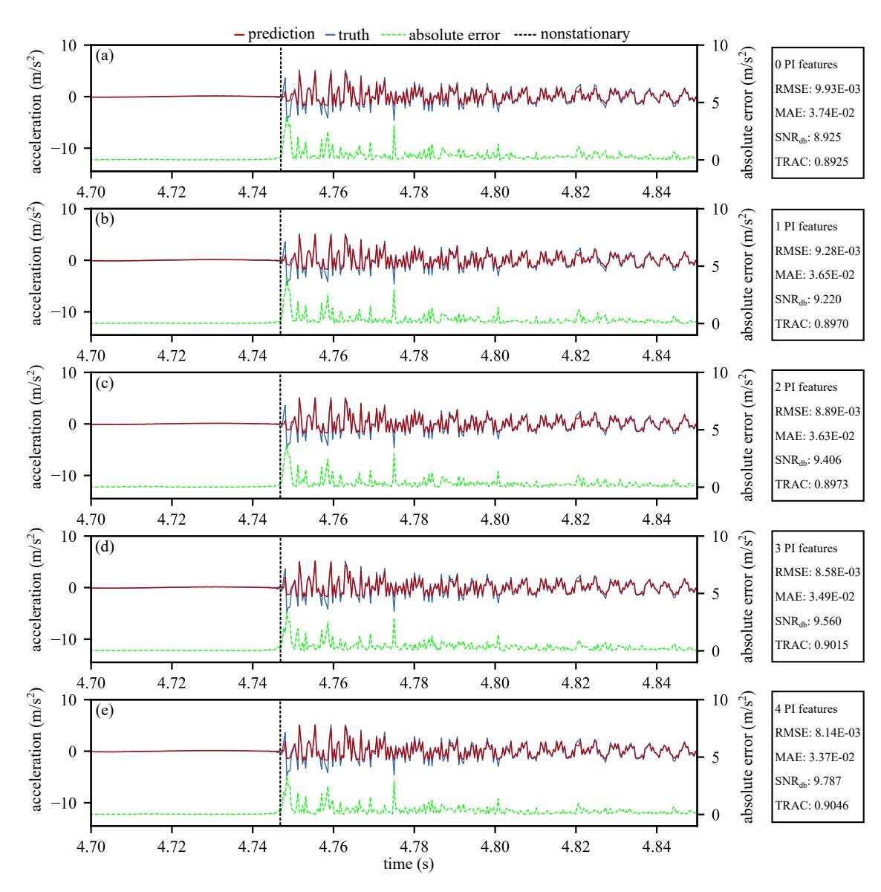

Figure 6.5 Different PI features are used for time series forecast from the estimator model, but all have experimental data acceleration: (a) no PI feature only acceleration; (b) PI feature strain; (c) PI feature y-axis displacement, and z-axis displacement; (d) PI feature strain, x-axis displacement, and y-axis displacement; (e) PI feature strain, x-axis displacement, y-axis displacement, and z-axis displacement; and all show a close look around nonstationary event. Second column shows RMSE, MAE, SNRdb, and TRAC for different PI features time series forecast.

{80}------------------------------------------------

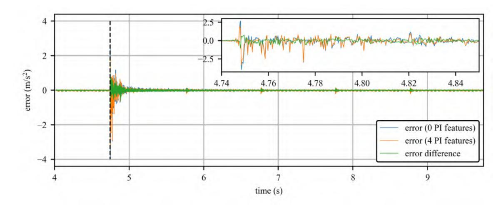

Figure 6.6 Combination of error plot for 0 PI features; 4 PI features; and error different between two.

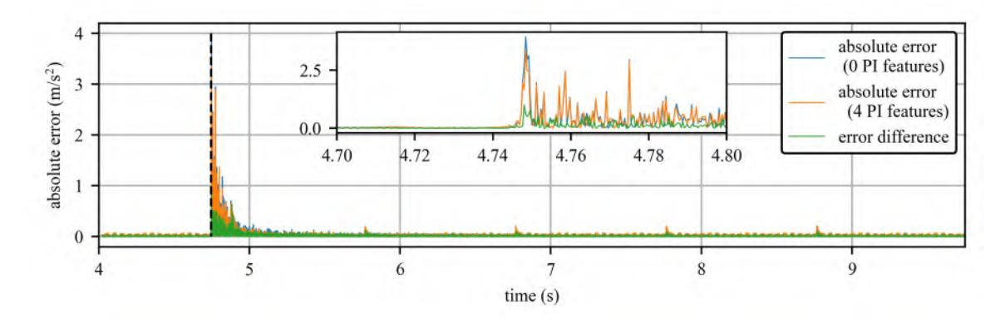

Figure 6.7 Combination of absolute error plot for 0 PI features; 4 PI features; and error different between two.

#### 6.4.3 Temporal prediction analysic:

Figure [6.5](#page-79-0) compares predictions made by a data-augmented PISP model with and without physics-informed features. Subfigure (a) shows the prediction without these features. Subfigures (b) through (e) progressively add one to four (1-4) physicsinformed features and show how the prediction accuracy improves with each addition. The table in the second column provides numerical data that confirms this improvement.

This study evaluates the performance of the prediction using four key metrics: Root Mean Squared Error (RMSE), Mean Absolute Error (MAE), signal-to-noise 

{81}------------------------------------------------

ratio (SNR), and Time Response Assurance Criterion (TRAC). Lower RMSE and MAE indicate better forecasts, while higher SNR and TRAC are desirable (with TRAC not exceeding 1). More details on these metrics can be found in a dedicated section (Section [6.4.1\)](#page-76-2). The specific values for all four metrics are provided in a table on the right side of Figure [6.5.](#page-79-0) Figures [6.6,](#page-80-0) and [6.7,](#page-80-1) illustrate the overall error and absolute error differences between the models without physics-informed features (0 PI features) and with physics-informed features (4 PI features), allowing for a closer examination of the impact of incorporating physics-informed knowledge. While the effect may not be immediately apparent in the plots, the numerical results indicate a significant improvement when using physics-informed features.

The trends in these metrics are further illustrated in Figure [6.8.](#page-82-0) This figure shows the results for five scenarios, using 0 to 4 physics-informed (PI) features. The case with 0 PI features is the baseline, where no physics information is included. As you can see in subfigures (a) and (b), both Root Mean Squared Error (RMSE) and Mean Absolute Error (MAE) decrease when PI methods are applied. Similarly, subfigures (c) and (d) show improvements in signal-to-noise ratio (SNR in decibels) and Time Response Assurance Criterion (TRAC).

Table [6.2](#page-83-0) dives deeper into the performance improvements achieved with different numbers of features. The table reveals a clear trend: the more features used in the data-augmented PISP model, the greater the improvement in the predicted signal. This increasing improvement, highlighted in the 'percentage improvement' column of the table, motivates a closer look at the impact of physics-informed (PI) features. To understand this better, need to compare the performance of PISP models enhanced with different PI feature sets. Figure [6.9](#page-83-1) provides a visual representation of this improvement.

To ensure the robustness of the PISP model and confirm that the observed improvements are not limited to a single dataset, try to extend the analysis by including

{82}------------------------------------------------

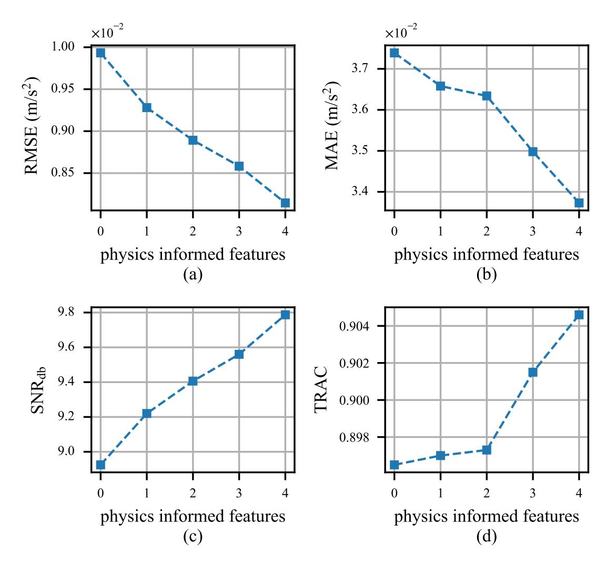

Figure 6.8 The performance analyses of the data-augmented PISP model using four key metrics: (a) Root Mean Squared Error (RMSE), (b) Mean Absolute Error (MAE), (c) signal-to-noise ratio in decibels (SNRdb), and (d) Time Response Assurance Criterion (TRAC). It compares the model's performance when incorporating different numbers of physics-informed (PI) features (1 to 4) against the baseline case with no PI features (considering only experimental acceleration data). The models with PI features are grouped as "with PI," while the one without them is labeled "without PI."

additional datasets. Table [6.3](#page-85-0) presents a comprehensive comparison of the performance with and without physics-informed features across multiple datasets. This broader analysis further highlights the significant impact of incorporating physicsinformed features on the model's accuracy and effectiveness. Figure [6.10,](#page-85-1) top 4 figures shows detail layout of with and without physics performance metrics for 9 data

{83}------------------------------------------------

Table 6.2 Performance analysis with and without physics information in terms of percentage improvement.

| metrics without physics informed physics informed | feature | percentage improvement |
|---------------------------------------------------|---------|------------------------|
| 9.28E-03                                          | 1       | 6.57%                  |
| 8.89E-03                                          | 2       | 10.48%                 |
| 8.58E-03 RMSE 9.93E-03                            | 3       | 13.60%                 |
| 8.14E-03                                          | 4       | 18.00%                 |
| 3.65E-02                                          | 1       | 2.17%                  |
| 3.63E-02                                          | 2       | 2.82%                  |
| 3.49E-03 MAE 3.74E-02                             | 3       | 6.46%                  |
| 3.37E-02                                          | 4       | 9.80%                  |
| 9.220                                             | 1       | 3.30%                  |
| 9.406                                             | 2       | 5.39%                  |
| 9.560 SNR db 8.925                                | 3       | 7.11%                  |
| 9.787                                             | 4       | 9.65%                  |
| 0.8970                                            | 1       | 0.06%                  |
| 0.8973                                            | 2       | 0.09%                  |
| 0.9015 TRAC 0.8965                                | 3       | 0.55%                  |
| 0.9046                                            | 4       | 0.91%                  |

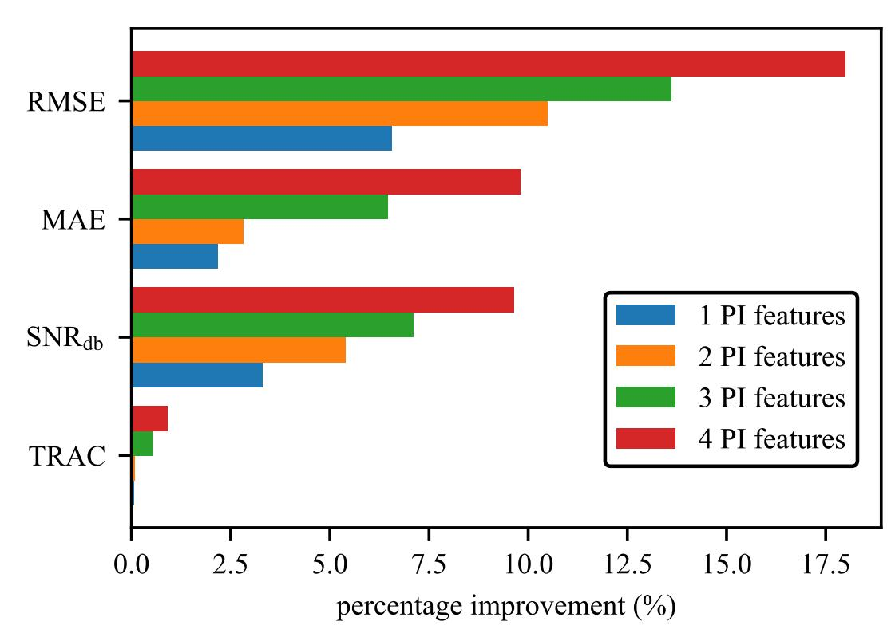

Figure 6.9 Percentage performance analysis with physics information for different features.

{84}------------------------------------------------

sets. For all data blue line is in top which is without PI and follows same trend for all data and all metrics. Below 4 figures, shows performance improvement compared with without physics in bar plots. Though in case of all data sets, adding physics improved the performance but this performance improvements numerical value doesn't same for all data. To deep down these, Figure [6.11,](#page-86-0) shows Hammering around time, and Hammer force along with all other performance metrics improvement in bar plot. All data are independent and unique from each other due to different hammer force and impact time. These could be a reason for the variation in performance.

Figure [6.10](#page-85-1) presents a detailed layout of performance metrics across nine (9) data sets, comparing results with and without physics-information. In the top four figures, the blue lines—representing performance without PI appear at the upper end across all data sets and metrics, showing a uniform trend. The subsequent four figures illustrate the relative performance improvements gained through with PI, displayed as bar plots. While all data sets demonstrate improved performance with PI, the magnitude of improvement varies across sets. To investigate this further, Figure [6.11](#page-86-0) examines the hammering timing and hammer force, alongside performance metrics depicted in bar plots. Each data set is unique, reflecting different hammer forces and impact times, potentially explaining the observed variability in performance enhancements.

## 6.5 Conclusion

The quiddities of PIML have drawn more attention in recent years for its performance over traditional machine learning algorithms. This study proposed a unique architecture of the PISP model is an effective physics-informed data-augmented technique. Improving the temporal forecasting in the case of univariate data with data augmented physics-informed model is the main contribution of this model. The experimental analysis has also been provided to evaluate the model performance. This work provided a way to utilize the experimental data and mesh analysis data dur-

{85}------------------------------------------------

Table 6.3 Comparison of data with and without physics-informed features

|                                                 | data 1    | data 2      | data 3     | data 4     | data 5     | data 6     | data 7     | data 8     | data 9     |
|-------------------------------------------------|-----------|-------------|------------|------------|------------|------------|------------|------------|------------|
| <b>data configuration</b>                       |           |             |            |            |            |            |            |            |            |
| hammering around                                | 4.74 sec. | 2.2809 sec. | 2.094 sec. | 2.356 sec. | 2.173 sec. | 2.365 sec. | 2.173 sec. | 2.173 sec. | 2.2977 sec |
| sample rate                                     | 2560      | 25600       | 25600      | 25600      | 25600      | 25600      | 25600      | 25600      | 25600      |
| data duration                                   | 9.75 sec  | 9.75 sec    | 9.75 sec   | 9.75 sec   | 9.75 sec   | 9.75 sec   | 9.75 sec   | 9.75 sec   | 9.75 sec   |
| hammer force                                    | 15.73 N   | 234.5 N     | 248 N      | 386 N      | 350 N      | 312 N      | 420 N      | 351.5 N    | 416 N      |
| <b>without physics informed (0 PI features)</b> |           |             |            |            |            |            |            |            |            |
| RMSE                                            | 9.97E-02  | 1.07E-01    | 7.10E-02   | 1.36E-01   | 1.13E-01   | 1.17E-01   | 1.70E-01   | 1.13E-01   | 1.14E-01   |
| MAE                                             | 3.74E-02  | 6.67E-02    | 3.08E-02   | 8.51E-02   | 4.82E-02   | 1.39E-01   | 1.12E-01   | 3.14E-02   | 6.25E-02   |
| SNR                                             | 8.9251    | 7.9368      | 10.2290    | 7.1858     | 8.010      | 3.3938     | 7.2590     | 9.0011     | 7.9931     |
| TRAC                                            | 0.8965    | 0.8439      | 0.096      | 0.8088     | 0.8758     | 0.6148     | 0.8138     | 0.8886     | 0.8371     |
| <b>with physics informed (4 PI features)</b>    |           |             |            |            |            |            |            |            |            |
| RMSE                                            | 9.03E-02  | 1.01E-01    | 6.95E-02   | 1.31E-01   | 1.05E-01   | 1.40E-01   | 1.61E-01   | 1.05E-01   | 1.20E-01   |
| MAE                                             | 3.37E-02  | 5.91E-02    | 2.76E-02   | 6.08E-02   | 2.50E-02   | 7.18E-02   | 9.23E-02   | 3.139E-02  | 7.02E-02   |
| SNR                                             | 9.787     | 8.3776      | 10.4153    | 7.5018     | 7.8486     | 4.8848     | 7.7097     | 9.2574     | 8.5974     |
| TRAC                                            | 0.9046    | 0.858       | 0.9091     | 0.8235     | 0.8914     | 0.6952     | 0.8337     | 0.8886     | 0.8371     |
| <b>percentage improvement</b>                   |           |             |            |            |            |            |            |            |            |
| RMSE                                            | 9.44%     | 4.95%       | 2.12%      | 3.57%      | 6.73%      | 15.42%     | 5.06%      | 7.28%      | 10.82%     |
| MAE                                             | 9.80%     | 11.42%      | 10.47%     | 28.46%     | 48.19%     | 48.46%     | 17.92%     | 0.08%      | 39.43%     |
| SNR                                             | 9.65%     | 5.55%       | 1.82%      | 4.40%      | 7.04%      | 43.87%     | 6.21%      | 2.85%      | 11.69%     |
| TRAC                                            | 0.91%     | 1.67%       | 0.35%      | 1.81%      | 1.78%      | 13.09%     | 2.45%      | 0.03%      | 3.88%      |

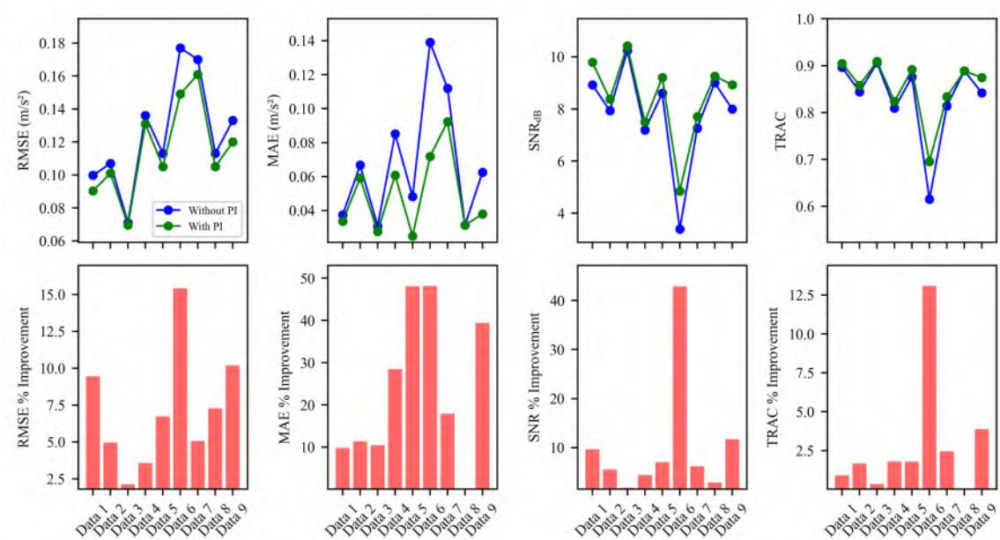

Figure 6.10 Performance analysis with physics information and without physics for 9 data sets.

{86}------------------------------------------------

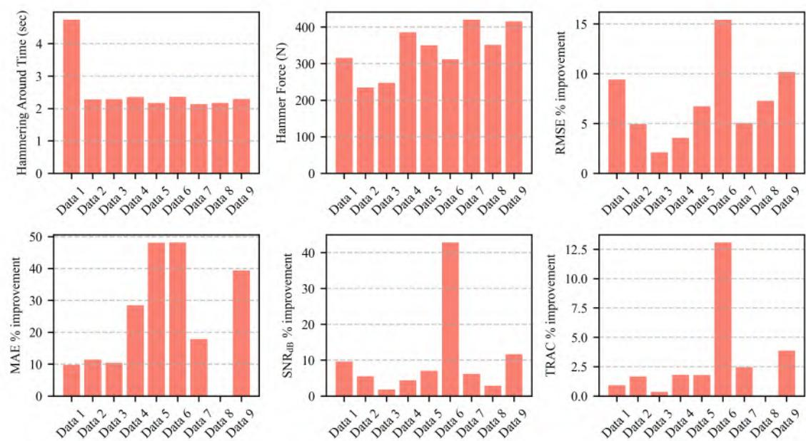

Figure 6.11 Performance analysis with physics information and without physics for 9 data sets along with hammering around time and hammer force.

ing the training phase. As a result, this model's performance is improved with an increased amount of physics-informed features compared to univariate experimental data acceleration and proves the accuracy improvement by using a physics-informed data-augmented PISP model.

{87}------------------------------------------------

# Chapter 7 Online Structural Responses Forecasting Using a Physics-informed Knowledge Transfer Model

( This chapter was partially published on the following:

"Physics informed machine learning part I: Different strategies to incorporate physics into engineering problems. In Conference Proceedings of the Society for Experimental Mechanics Series". Springer Nature Switzerland, 2024 [\[65\]](#page-145-1)

"Physics informed machine learning part II: Applications in structural response forecasting". In Conference Proceedings of the Society for Experimental Mechanics Series. Springer Nature Switzerland, 2024.[\[26\]](#page-141-2) )

For real-time model-predictive control, dynamic behavior during operation must be adequately represented by a modeling program that is sensitive to sudden damagerelated changes in (or active modifications to) the structure. The lack of access to data from damaged systems hinders effective diagnosis and predictions using supervised machine-learning techniques. This study shows how physics-informed machine learning increases the precision of a time series forecast of the dynamic response of a structural system experiencing a nonstationary event. This study's main objective is to evaluate the time series forecasting potential of a transfer learning approach that guides an encoder decoder-based neural network with physical knowledge obtained from numerical models. To generate experimental acceleration data, this work uses a test structure of a cantilever beam under continuous excitation that experiences a nonstationary event injected into its excitation input. The physics-informed features 

{88}------------------------------------------------

are gathered from the finite element analysis of the experimental structure subjected to the same excitation. The proposed model named PIMENTO[1](#page-88-1) (Physics Informed Machine lEarning for Nonstationary Temporal fOrecasting) is a combination of the estimator and corrector model. Improving the temporal forecasting in the case of univariate data with a physics-informed assistive model is the main contribution of this model. Concerning physics information, the improvement in the form of percentages is around 38.86% for RMSE, 29.48% for MAE, 20.78% for SNRdb, and 4.03% for TRAC.

## 7.1 Background

Real-time forecasting of structural responses holds potential to enhance the awareness, prognostics, and control of structural systems subjected to high-rate dynamics; such as shock. Quickly learning the structure's state following an impact can bolster survivability in extreme dynamic environments, enabling timely and adaptive responses to evolving conditions. Notable examples of structures susceptible to highrate dynamics include hypersonic vehicles, space infrastructure, and active blast mitigation systems [\[25\]](#page-141-0). The intricate nature of the high-rate challenge, as highlighted by Hong et al. [\[38\]](#page-142-2), encompasses factors such as uncertainties in external loads, pronounced nonstationarities, disruptive disturbances, and unmodeled dynamics arising from system configuration changes. In a broader context, structures undergoing highrate dynamics exhibit acceleration amplitudes surpassing 100 gn over intervals shorter than 100 milliseconds.

Structural response forecasting can be thought of as a time series analysis challenge. Time series analysis is crucial in various industries, including structural health monitoring [\[14\]](#page-140-3), healthcare [\[29\]](#page-141-4), aviation [\[40\]](#page-142-5), banking [\[58\]](#page-144-6), business [\[62\]](#page-144-7), meteorology [\[31\]](#page-142-6), entertainment [\[4\]](#page-139-6), etc. It involves collecting data over time to show

1[Source Code: https://github.com/ARTS-Laboratory/PIMENTO](https://github.com/ARTS-Laboratory/PIMENTO)

{89}------------------------------------------------

system evolution and changes. Time series forecasting is essential for predicting future trends, optimizing resource allocation, reducing risks, and creating real-time policies for problem-solving and identifying opportunities in constantly changing environments [\[2\]](#page-139-7). To deal with the complexity of time series forecasting, a variety of strategies have been developed. These include support vector machines, decision trees, and models like Autoregressive Integrated Moving Average (ARIMA) [\[36\]](#page-142-4).

Deep learning models can be readily adjusted to possess varying numbers of parameters or architectures for time series forecasting. This adaptability grants them a notable edge compared to conventional machine learning models, particularly when confronted with extensive, multidimensional, and diverse datasets [\[64\]](#page-144-4). Despite the achievements of deep learning, it faces challenges in data scarcity, interpretation, generability, and implementing physical constraints. These issues raise concerns related to reliability and system safety.

Implementing high-precision physics-based models to perform structural response forecasting following impacts would be a logical solution; however, the building of physics-based models brings their own challenges. For example, failure to build a proper numerical model leads to errors that compound with time and computational costs are often too high for practical real-world systems [\[33\]](#page-142-7).

To bridge physics-based modeling and machine learning approaches, a new direction of research is emerging under the umbrella of physics-informed machine learning (PIML) [\[65\]](#page-145-1). Through the injection of domain-specific information, machine learning models can create accurate predictions that are anchored in underlying physical realities. This synergy permits the model to adapt to developing settings and deliver strong predictions even in scenarios with minimal data. The details of PIML will be discussed in section [7.2.](#page-91-0)

This study introduces the physics-informed knowledge transfer model for structural response forecasting and experimentally validates it before, during, and after 

{90}------------------------------------------------

a nonstationary event. The proposed integration of physics-informed machine learning with a transfer learning model in this text is termed Physics Informed Machine lEarning for Nonstationary Temporal fOrecasting (PIMENTO); a reference to the state cheese of South Carolina. Enhancing temporal forecasting for univariate data through the integration of a physics-informed assistive model constitutes the primary contribution of this work. Most importantly the PIMENTO model does not require physics-informed features during its testing phase. For the generation of experimental acceleration data, this study employs a cantilever beam test structure subjected to continuous excitation [\[11\]](#page-140-0). This excitation includes a nonstationary event in the time-series loading profile to simulate a real-world change in the structure's dynamic loading conditions. Other noteworthy contributions of this research are enumerated below:

## 1. **Merging of data from experimental observations and finite element**

**analysis**: This study fuses multi-sourced data from experimental observation and traditional physics-based models (finite element models). Physics-informed features are extracted from finite element analyses conducted on the experimental structure under the same excitation conditions. This data generation addresses the issue of data scarcity to train a PIML model.

## 2. **Development of a sequence representation function**: Data coming from

multiple sources is complex and may be noisy. The nonstationary data encompasses a substantial number of frequencies. A traditional sequential model does not have the bandwidth to capture the sequence representation of the high-rate dynamic data. This study develops robust sequence representation functions that can handle univariate and multivariate time series data.

## 3. **Model Development**: A unique physics-informed knowledge transfer model

{91}------------------------------------------------

features. The proposed model integrates elements of transfer learning, particularly an encoder-decoder architecture, and introduces a distinctive sequence representation function.

## 4. **Experimental analysis of the proposed model**: This study showcases the

performance of PIMENTO under different analyses of physics priors stemming from using experimental univariate and multivariate data in conjunction with physics-based features.

The remainder of this paper is organized as follows. We provide relevant background in Section 7.2. The problem formulation of this study is developed first in Section 7.2.1. Section 7.4 discusses the details architecture of the proposed model. For better readability the sequence representation function  $(\S(\cdot))$  used in the corrector encoder, corrector decoder, and estimator decoder is explained in Appendix 7.10. Experimental analysis is provided in Section 7.5 and the summary in Section 7.9. Lastly, Table 7.1 contains all the notations and the descriptions used in this work.

#### 7.2 Relevant Background

PIML integrates principles from physics and domain expertise into data-driven models. The goal of this approach is to obtain models that are faster, more generalizable, and potentially more interpretable through the data-driven model being being forced to respect physical constraints. This approach has gained traction in engineering, where fundamental principles or physical laws are often expressed through partial differential equations (PDEs). For example, in computer-aided engineering, software packages formulate PDE-based models to simulate physical effects, aiding understanding of complex interactions across various fields [\[54\]](#page-144-8). Researchers are actively exploring diverse directions within the field of PIML. These directions encompass

{92}------------------------------------------------

Table 7.1 Important notations used in this work, with corresponding descriptions.

| Notation  | Description  | Details                              |
|-----------|--------------|--------------------------------------|
| n ⃗x      | input        | time span                            |
| n ⃗y      | forecasted   | time span                            |
| t         | time         | step                                 |
| z         | input        | features                             |
| PI        | physics      | informed                             |
| X         | original     | and physics-informed features z × n  |
| x a       | acceleration | 1 × n                                |
| x s       | equivalent   | elastic strain 1 × n                 |
| x d       | total        | displacement 1 × n                   |
| y a       | predicted    | acceleration 1 × n                   |
| § ( )     | sequence     | representation function              |
| I         | input        | sequence m × n                       |
| H         | final        | representation of the sequence r × n |
| r         | hidden       | dimension of LSTM cell               |
| h         | hidden       | state of LSTM cell r × 1             |
| ι         | input        | gate of LSTM cell                    |
|           | forget       | gate of LSTM cell                    |
| o         | output       | gate of LSTM cell                    |
| W         | weight       |                                      |
| b         | bias         |                                      |
| l         | fully        | connected layer                      |
| ϕ         | activation   | function                             |
| c         | cell state   | of LSTM cell r × 1                   |
| p         | forward      | layer of BiLSTM                      |
| q         | backward     | layer of BiLSTM                      |
| te        | corrector    | encoder                              |
| td        | corrector    | decoder                              |
| F ( )     | corrector    | model Using PI features              |
| F enc ( ) | corrector    | encoder function                     |
| ξ         | encoder      | output D e × n                       |
| D e       | encoder      | features                             |
| F dec ( ) | corrector    | decoder function                     |
| se        | estimator    | encoder                              |
| sd        | estimator    | decoder                              |
| f ( )     | estimator    | model using acceleration             |
| f enc ( ) | estimator    | encoder function                     |
| f dec ( ) | estimator    | decoder function                     |
| δ         | interim      | output of decoder                    |
| T         | transpose    |                                      |

data and feature engineering [\[74\]](#page-145-2), postprocessing [\[70\]](#page-145-3), initialization [\[55\]](#page-144-9), optimizer design [\[72\]](#page-145-4), architecture design [\[66\]](#page-145-5), loss function [\[69\]](#page-145-6), and hybrid models [\[43\]](#page-143-8).

Machine learning models require substantial training data. Transfer learning may enhance forecast outcomes by utilizing related data sets during the training process [\[68\]](#page-145-7). In essence, transfer learning is the use of knowledge acquired from one profession to enhance performance on a related but distinct one. This concept enables deep learning models to successfully adapt the complex representations and traits that have been acquired from large-scale datasets to a range of real-world scenarios. Acquiring ample labeled training instances is expensive, time-consuming, or infeasible. Semi-supervised learning offers a solution with a modest number of labeled 

{93}------------------------------------------------

instances and a substantial volume of unlabeled data. However, acquiring adequate unlabeled instances can be challenging, leading to sub-optimal performance. Transfer learning, based on educational psychology and C.H. Judd's generalization theory, aims to address these limitations and improve machine learning [\[75\]](#page-145-8).

Transfer learning may be roughly split into two varieties, namely homogeneous and heterogeneous transfer learning, based on the disparity across domains. For circumstances when the domains share the same feature space, homogeneous transfer learning techniques are created and recommended. When the domains have diverse feature spaces, the knowledge transfer process is referred to as heterogeneous transfer learning [\[75\]](#page-145-8). In certain transfer learning strategies, the incorporation of multi-view techniques has gained prominence. For instance, Zhang and colleagues introduced a multi-view transfer learning framework that enforces coherence across multiple perspectives [\[73\]](#page-145-9). Yang and Gao extended this concept by integrating multi-view information from diverse domains to facilitate knowledge transfer [\[71\]](#page-145-10). Another notable contribution is the work by Feuz and Cook, who devised a multi-view transfer learning approach specialized for activity learning [\[28\]](#page-141-5). Object identification or detection in photos, action recognition in videos, document categorization, or text sentiment analysis are examples of typical transfer learning applications [\[68\]](#page-145-7). However, transfer learning has not previously received much attention when applied to time series, such as sensor readings. According to Fawaz et al [\[27\]](#page-141-6). Additional research has been focused on transfer learning for issues with time series forecasting and other time series forecasts [\[34\]](#page-142-8), [\[68\]](#page-145-7).

Representation learning models serve as an automated feature engineering technique. By employing these models, it becomes possible to automatically identify and extract meaningful components from raw data. Since the models inherently learn from the data and provide meaningful representations, there is no need for manual feature selection or engineering. The efficiency and efficacy of many machine learning 

{94}------------------------------------------------

tasks are increased by this automated feature extraction technique, which eventually results in better performance and wider application across a variety of domains. The effectiveness of predicting causal links in situations with high-dimensional variables and treatments has been considerably improved attributed in large part to representation learning and dimensionality reduction such as Johansson et al [\[39\]](#page-142-9), Chowdhury et al [\[19\]](#page-140-4), Nabi et al [\[46\]](#page-143-9) etc.

#### 7.2.1 Formulation of a Generic Problem Setup

The overarching goal of this work is to forecast the acceleration response of a structure into the future by leveraging pre-defined knowledge of the structure's strain and displacement. To build up to this multi-input single-output (MISO) problem in the structural domain, a generic MISO problem will be used to define the mathematical notation used in this text.

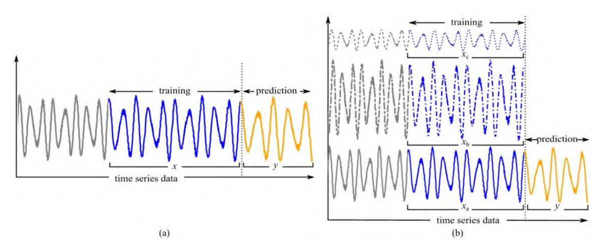

Figure 7.1 Generic time series forecast scenario that takes into account how, in the case of univariate data shown in (a),  $x$  input experimental acceleration data becomes the time series prediction  $y$  in future. Using different physics-informed feature data, such as  $x_a$ ,  $x_b$ , and  $x_c$  input is showing in (b) illustrates a general scenario for a time series forecast, with  $y$  as the predicted outcome. In general, the input is multivariate, but the forecast is identical to that of generic time series forecasting.

Figure [7.1\(](#page-94-0)a) depicts a generic single-input single-output (SISO) time series forecasting problem that can be conceptualized as predicting future values (orange line in

{95}------------------------------------------------

Figure 7.1(a) based on past observed values (blue line in Figure 7.1(a)). In this work, an arrow above a variable will be used to denote a vector; for example  $\vec{x}$  denotes a vector of the variable  $x$ . Let  $n_{\vec{x}}$  represent the temporal span of the input data  $x$  (i.e., past values, indicated in the blue line). Using this notation, the input acceleration data is written as

$$\vec{x} = [x_0, x_1, x_2, \dots, x_{n_{\vec{x}}}] \quad (7.1)$$

Next, consider the forecasted vector to be  $\vec{y}$  and its horizon to be  $n_{\vec{y}}$ , the corresponding output is denoted as

$$\vec{y} = [y_0, y_1, y_2, \dots, y_{n_{\vec{y}}}] \quad (7.2)$$

The learning function that takes  $\vec{x}$  and map it to  $\vec{y}$  can be represented as a *seq2seq* problem, defined by  $(f : \vec{x} \rightarrow \vec{y})$ . For the MISO problem, there exist more input features (e.g.  $\vec{x}_a$ ,  $\vec{x}_b$ ,  $\vec{x}_c$ , ...,  $\vec{x}_z$ ) but the goal still remains to forecast a single output vector  $\vec{y}$ . There can be any number of features involved, here  $z$  is used as a placeholder for the end of the last feature considered. A representation of the MISO problem is shown in Figure 7.1(b). In the multi-variate case, the output would still be,  $\vec{y} = [y_0, y_1, y_2, \dots, y_{n_{\vec{y}}}]$  but the input would change to the matrix  $\mathbf{X}$  defined as

$$\mathbf{X} = \begin{bmatrix} x_{a,0} & x_{a,1} & x_{a,2} & \cdots & x_{a,n} \\ x_{b,0} & x_{b,1} & x_{b,2} & \cdots & x_{b,n} \\ \vdots & \vdots & \vdots & \ddots & \vdots \\ x_{z,0} & x_{z,1} & x_{z,2} & \cdots & x_{z,n} \end{bmatrix} = [\vec{x}_0^T, \vec{x}_1^T, \vec{x}_2^T, \cdots, \vec{x}_{n_x}^T] \quad (7.3)$$

where a matrix is denoted by a bold capital letter. In equation 7.3,  $\vec{x}_0$  is a row-rise vector such that  $\vec{x}_0 = [x_{a,0}, x_{b,0}, \dots, x_{z,0}]$ . The dimension of  $\mathbf{X}$  is  $z \times n_{\vec{x}}$ . So, the MISO form of the learning function can be stated as  $(F : \mathbf{X} \rightarrow \vec{y})$  which becomes a *vec2seq* problem.

{96}------------------------------------------------

#### 7.3 Problem Statement

The goal of this work is to forecast univariate data directly following a non-stationary event. Data that is feature-rich will enable more efficient models. It follows that adding a corrector with sufficient physics-informed features will assist the univariate data forecasting model to improve efficiency over time. As a result, the main model  $f(\cdot)$  is a lightweight model (estimator model) and is trained on acceleration data only and cannot utilize the physics-informed features. To improve this an assistive model  $F(\cdot)$  with  $z$  features including physics-informed features is introduced as a corrector model where the corrector model's input is multivariate data.

Generating more physics-informed features ( $\mathbf{X}$ ) needs a detailed computational model; while modeling the  $f(\cdot)$  and  $F(\cdot)$  also comes with its challenges. The challenge is to formulate a learning solution to design  $f(\cdot)$ ; that utilizes knowledge from  $F(\cdot)$  and predict  $\vec{y}$  ( $\vec{y}_a$ ) while using only  $\vec{x}$  ( $\vec{x}_a$ ) as input features. The problem can be split into four subproblems; as discussed below:

- 1. **Generating Physics-informed data** : In this research, a cantilever beam serves as the experimental setup. The process for generating the initial acceleration data  $(\vec{x})/(\vec{x}_a)$  is explained in Section 7.7.1, and this dataset is publicly available [11]. However, acquiring other physics-informed data, such as strain and displacement, directly from the experimental setup poses challenges. Moreover, in practical real-world scenarios, it is often impractical to gather all system features. Therefore, the development of a computational model capable of extracting physics-informed features becomes necessary to enhance the model training process. The detailed solution to this challenge is discussed in Section 7.7.1.
- 

  ## 2. Designing estimator model, $f(\cdot)$ :

{97}------------------------------------------------

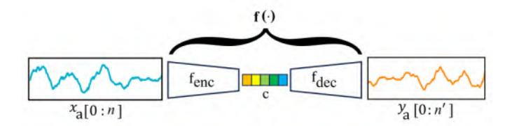

Figure 7.2 Estimator model problem formulation.

timator model as  $f : \vec{x} \rightarrow \vec{y}$  from equation 7.1 and 7.2, where  $z = 1$ ,  $z$  is acceleration data only and  $n_{\vec{x}} \neq n_{\vec{y}}$  ( $n \neq n'$ ). The design problem of  $f$  would be:  $f = f_{\text{enc}}(\vec{x}_a) \circ f_{\text{dec}}(\xi_{se})$ .

This model is a simple seq2seq model like  $f_{\text{enc}}(\vec{x}_a)$  where encodes the input sequence to a context vector  $\xi_{se}$  and  $f_{\text{dec}}(\xi_{se})$  gives the output sequence  $\hat{\vec{y}}$  ( $\hat{y}_a$ ) . The goal is to make this output sequence,  $\hat{\vec{y}}$  ( $\hat{y}_a$ ) similar to the original sequence  $\vec{y}$  ( $\vec{y}_a$ ) (see Figure 7.2).

- 3. **Designing corrector model**,  $F(\cdot)$ : Consider a corrector model which is an assistive model for the main estimator model as  $F : \mathbf{X} \rightarrow \vec{y}$  where  $n \neq n'$ . This is a vec2seq model that includes physics-informed features. To design  $F$  as composed of two functions:  $F = F_{\text{enc}}(\mathbf{X}) \circ F_{\text{dec}}(\xi_{\text{te}})$ . Here 1)  $F_{\text{enc}}(\mathbf{X})$  first encode the input sequence to a context vector  $\xi_{\text{te}}$ ; 2)  $F_{\text{dec}}(\xi_{\text{te}})$  utilizes the context vector  $\xi_{\text{te}}$  to get the output sequence  $\hat{\vec{y}}$  ( $\hat{\vec{y}}_a$ ). This can be formulated as an encoder-

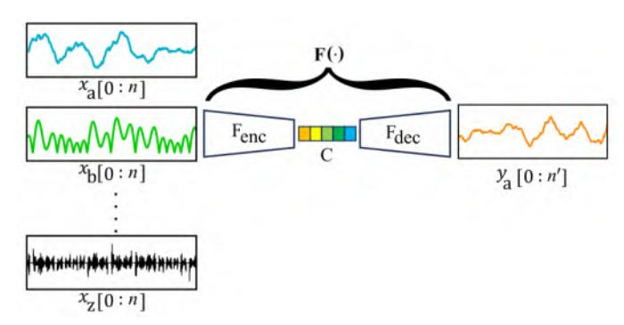

Figure 7.3 Corrector model problem formulation.

decoder problem [61] and the generic framework has been shown in Figure 7.3.

{98}------------------------------------------------

This overall model design is inspired by the student-teacher [30] model concept.

Figure 7.2 is acted like a student model and Figure 7.3 is assisted as a teacher.

4. **Learning and knowledge distillation** : The input dimension of  $f_{\text{enc}}(\cdot)$  is univariante and  $F_{\text{enc}}(\cdot)$  is multivariate. Estimator model Figure 7.2 improved itself by distillation of physics-informed knowledge from the corrector model Figure 7.3 model. By using the knowledge distillation concept from [30], the goal is to train the  $f(\cdot)$  in such a way that,  $f(\cdot)$  can make the physics-informed decision during inference session without using any extra physics-informed input features except the acceleration itself.

The solution of **Subproblem (1)** is provided in Section 7.7.1 as it is more related to experiments. In Section 7.4, proposing the details solution to **Subproblems (2 ~ 4)**.

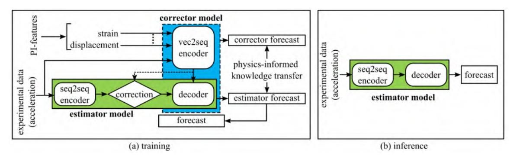

Figure 7.4 Preliminary layout of proposed model PIMENTO is showing:(a) training: estimator model’s encoder is tuned based on the correction from the corrector model. During training the decoder is replicated from the corrector decoder and then tuned during training; and (b) inference : as the encoder and the decoder have been tuned in the training phase, so no correction or involvement of the corrector model is needed.

#### 7.4 Methodology

The overall flow of the proposed physics-informed knowledge transformation model is shown in Figure 7.4. The PIMENTO model is a combination of estimator and

{99}------------------------------------------------

corrector models. Two types of data generation are used here (details discussed in Section [7.7.1\)](#page-117-3) for these two types of models.

The corrector model is structurally knowledge-enriched due to utilizing experimental acceleration data and physics-informed data as input. This multivariate data-based model serves as the assistive model that corrects the estimator model during the training phase and aids in training the estimator. The assistive model named as corrector model is a vec2seq encoder-decoder model.

In contrast, the estimator relies solely on experimental acceleration data. The estimator model is the forecasting model used in this work. The estimator model takes experimental data acceleration as its input and forecasts acceleration data. This model is a combination of seq2seq encoder-decoder.

Despite the corrector model handling data-intensive tasks while the estimator model deals with data-limited tasks, they share fundamental structural similarities. By structuring the corrector model and the estimator model into encoders and decoders, a structural resemblance is established between these two models. These structural similarities have been leveraged to transfer the knowledge from the corrector to the estimator. Given that both models aim for the same kind of time-series prediction, the corrector model's trained decoder can be used to initialize the estimator's decoder component. However, independent encoders are needed for the corrector and estimator models due to differences in input features. The estimator's encoder is trained from scratch to closely resemble the corrector model's encoder outputs (feature representation) in the Euclidean space. In summary, Physics-based knowledge is transferred from the corrector to the main estimator model in two stages: aligning encoder representations and duplicating decoder structures. Comprehending the corrector-estimator dynamics is similar to knowledge distillation of transfer-learning schema [\[30\]](#page-141-7). Here PI knowledge is distilled from corrector to estimator. During testing, the corrector model is not required, as the estimator has been trained with

{100}------------------------------------------------

transferred knowledge.

Section 7.4 illustrates the PIMENTO model's design and mathematical representation. The corrector model in Section 7.4.1, the estimator model in Section 7.4.2, and eventually the training method in Section 7.4.3.

#### 7.4.1 Corrector Model

This corrector model is an assistive model for the estimator model. The corrector model consists of two functions, encoder, and decoder:  $F = F_{\text{enc}}\mathbf{X} \circ F_{\text{dec}}(\xi_{\text{te}})$  and is shown in Figure 7.5.

The corrector encoder includes BiLSTM layers, a design originally based on LSTM cells, for its sequence representation. The finalized sequence representation function as below which is derived from Equation 7.24 to 7.27 in Appendix 7.10:

$$\left[ H_{te}, h_{pq,te}^n, c_{pq,te}^n \right] = \S \left( \mathbf{X}, [h_{pq}^0, c_{pq}^0] \right) \quad (7.4)$$

$$\xi_{\text{te}} = \phi_{\text{te}}(H_{\text{te}} \cdot W_{l1,\text{te}} + b_{l1,\text{te}}) \quad (7.5)$$

Here,  $[h_{pq}^0, c_{pq}^0]$  is the initialization parameters for BiLSTM layers which is zero for the corrector encoder. The complete architecture of the LSTM cells inside the BiLSTM is explained in Appendix 7.10. Where  $h$  is for hidden states,  $c$  is for cell state,  $p$  is for the forward layer, and  $q$  is for a backward layer of BiLSTM.  $\mathbf{X}$  is the input sequence with a matrix of  $z$  input features and  $n$  input time span. Where  $z$  has original and physics-informed features. From the sequence representation function  $\S(\cdot)$ ,  $H_{te}$  is the final representation of the sequence with hidden  $h_{pq,te}^n$  and cell  $c_{pq,te}^n$  state is input time span  $n$ . Final corrector encoder output  $\xi_{te}$  is in Equation 7.5. Initially  $H_{te}$  is combined with the weight  $W_{l1,te}$  and bias  $b_{l1,te}$  of a fully connected layer  $l1$  and finally adding an activation function  $\phi_{te}$  to recover the latent features like nonstationary events.

{101}------------------------------------------------

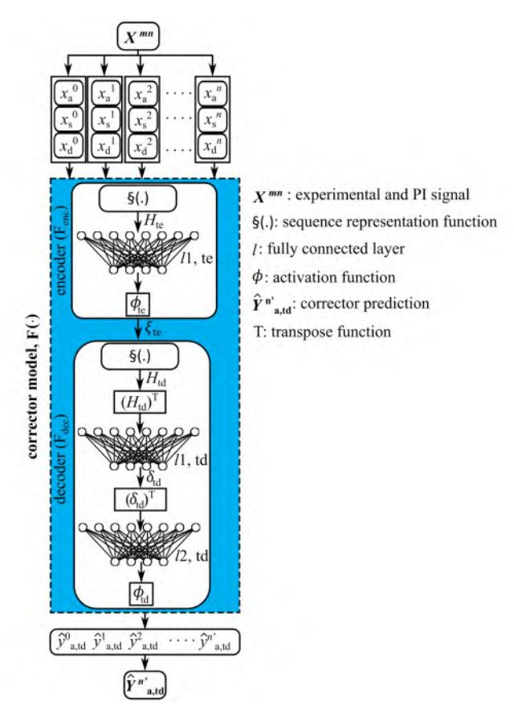

Figure 7.5 Corrector model complete architecture

The corrector decoder starts with the sequence representation function  $\S(\xi_{te}, [h_{pq,te}^n, c_{pq,te}^n])$  as below Equation 7.6. This is initialized from the corrector encoder Equation 7.5 parameters  $h_{pq,te}^n, c_{pq,te}^n$  and  $H_{td}$  is the final output of this sequence representation in Equation 7.6

$$\left[H_{\text{td}}, h_{pq,\text{td}}^n, c_{pq,\text{td}}^n\right] = \S\left(\xi_{\text{te}}, [h_{pq,\text{te}}^n, c_{pq,\text{te}}^n]\right) \quad (7.6)$$

$$\delta_{\text{td}} = (H_{\text{td}})^T \cdot W_{l1,\text{td}} + b_{l1,\text{td}} \quad (7.7)$$

$$\hat{y}_{\text{td}} = \hat{Y}'_{a,\text{td}} = \phi_{\text{td}}(\delta_{\text{td}})^T \cdot W_{l2,\text{td}} + b_{l2,\text{td}} \quad (7.8)$$

Equation 7.7 represents an intermediate stage of the corrector decoder. The decoder’s first fully connected layer  $l_1$ , which includes the weight and bias of  $W_{l_1,td}$ ,  $b_{l_1,td}$ , and transpose  $(H_{td})^T$  where  $H_{td}$  is the output from Equation 7.6 are combined to create  $\delta_{td}$ . Corrector forecast  $\hat{y}_{td}$  ( $\hat{Y}_{a,td}'$ ) is described in Equation 7.8. From Equation 7.7,  $\delta_{td}$ 

{102}------------------------------------------------

is transposed  $(\delta_{td})^T$  and passed through a decoder's second  $l2$  fully connected layer  $W_{l2,td}, b_{l2,td}$  and pass through an activation function  $\phi_{td}$  to generate the latent features. In a nutshell, Equation 7.4's multivariate  $\mathbf{X}$  including physics-informed features is the input for the corrector model, and Equation 7.8's univariate acceleration forecast is the output, which is  $\hat{y}_{td}$  ( $\hat{Y}_{a,td}'$ ).

#### 7.4.2 Estimator Model

The estimator model is the main model of this proposed model PIMENTO. The estimator model consists of two functions, encoder, and decoder:  $f = f_{\text{enc}}(\vec{x}_a) \circ f_{\text{dec}}(\xi_{se})$ , and show in Figure 7.6.

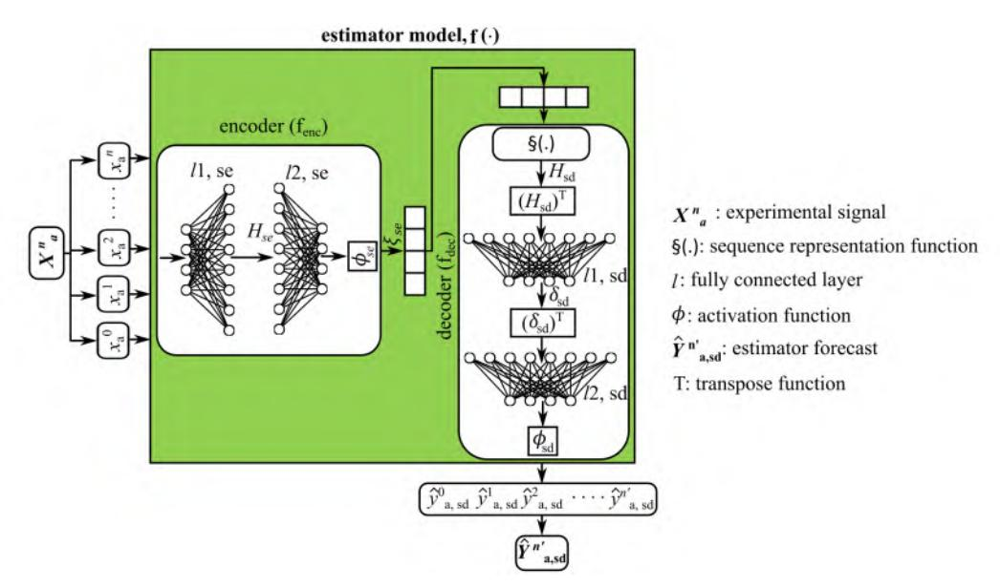

Figure 7.6 Estimator model complete architecture

The estimator encoder is implemented as a seq2seq representation. Beginning experimental acceleration data  $\vec{x}_a$  is delivered by a fully connected layer (l1) that has weights  $W_{l1,se}$ , and biases  $b_{l1,se}$  and an output  $H_{se}$  is explained in Equation 7.9.

$$H_{\text{se}} = \vec{x}_a \cdot W_{l1,\text{se}} + b_{l1,\text{se}} \quad (7.9)$$

$$\xi_{\text{se}} = \phi_{\text{se}}(H_{\text{se}} \cdot W_{l_2,\text{se}} + b_{l_2,\text{se}}) \quad (7.10)$$

{103}------------------------------------------------

The estimator encoder final output  $\xi_{\text{se}}$  is described by Equation 7.10. For the purpose of obtaining  $\xi_{\text{se}}$ ,  $H_{\text{se}}$  is the input of the second fully connected layer  $l_2$  of  $W_{l_2,\text{se}}$ ,  $b_{l_2,\text{se}}$ .Here, after the second fully connected layer ( $l_2$ ), an activation function  $\phi_{\text{se}}$  is applied to introduce the non-linearity.

The estimator decoders and corrector decoder 7.4.1 are identical. In case of main model estimator in Equation 7.11, the sequence representation function  $\S(\xi_{\text{se}}, [h_{pq, \text{te}}^n, c_{pq, \text{te}}^n])$  is initialized with estimator encoder output  $\xi_{\text{se}}$  and output is  $H_{\text{sd}}.\delta_{\text{sd}}$  is the intermediate stage Equation 7.12 output as like Equation 7.7.

$$\left[ H_{\text{sd}}, h_{pq,\text{sd}}^n, c_{pq,\text{sd}}^n \right] = \S \left( \xi_{\text{se}}, [h_{pq,\text{te}}^n, c_{pq,\text{te}}^n] \right) \quad (7.11)$$

$$\delta_{\text{sd}} = (H_{\text{sd}})^T \cdot W_{l1,\text{sd}} + b_{l1,\text{sd}} \quad (7.12)$$

$$\hat{y}_{\text{sd}} = \hat{Y}'_{a,\text{sd}} = \phi_{\text{sd}}((\delta_{\text{sd}})^T \cdot W_{l2,\text{sd}} + b_{l2,\text{sd}}) \quad (7.13)$$

Final forecast  $\hat{y}_{\text{sd}}$  ( $\hat{Y}_{a,\text{sd}}^{n'}$ ) is described in Equation 7.13. By the assistance of physics informed enriched corrector model 7.4.1, the main model estimator input  $\vec{x}_a$  ( $\mathbf{X}_a^n$ ) in Equation 7.9 and final forecast  $\hat{y}_{\text{sd}}$  ( $\hat{Y}_{a,\text{sd}}^{n'}$ ) from Equation 7.13 are both univariate acceleration.

#### 7.4.3 Training

This PIMENTO framework's ultimate purpose is to obtain an effectively fine-tuned estimator model with the assistance of a corrector model. The estimator model focuses on univariate time series forecasts, whereas the corrector model is focused on multivariate time series forecasts. The training procedure is divided into two parts, one for the physics-informed corrector model and the other for the estimator model.

The encoder and decoder are the two components of the corrector model as a whole. The corrector model uses mean average error (MAE), calculated using the Equation 7.14. Section 7.5 mentions the hyperparameter settings. This model is saved and will be used to adjust the estimator model later in the framework.

{104}------------------------------------------------

This MAE loss  $\mathcal{L}_{\text{corrector}}$  takes place between the corrector forecast  $\hat{y}_{\text{td}}$  ( $\hat{Y}_{a,\text{td}}^i$ ) from Equation 7.8 and the acceleration truth value  $\vec{y}$  ( $Y_a^i$ ).

$$\mathcal{L}_{\text{corrector}} = \sum_{i=1}^{n'} |Y_a^i - \hat{Y}_{a,\text{td}}^i| = \sum_{i=1}^{n'} |\vec{y} - \hat{y}_{\text{td}}| \quad (7.14)$$

At the second stage, the training of the estimator model begins with calculating the MAE loss in Equation 7.15 between the corrector encoder output  $\xi_{te}^{i,j}$  from the Equation 7.5 and the estimator encoder output  $\xi_{se}^{i,j}$  from Equation 7.10. Estimator decoder architecture is the pre-trained corrector decoder from Sections 7.4.1 and 7.4.2, therefore no tuning is required because both are sharing the same parameters. The estimator decoder is excluded from the computational graph during the training of the estimator as the decoder is already trained during the corrector model.

$$\mathcal{L}_{\text{enc}} = \sum_{i=1}^n \sum_{j=1}^{D_e} |\xi_{\text{te}}^{i,j} - \xi_{\text{se}}^{i,j}| \quad (7.15)$$

$$\mathcal{L}_{\text{so}} = \sum_{i=1}^{n'} \left( Y_a^i - \hat{Y}_{a,\text{sd}}^i \right)^2 = \sum_{i=1}^{n'} \left( \vec{y} - \hat{y}_{\text{sd}} \right)^2 \quad (7.16)$$

$$\mathcal{L}_{\text{estimator}} = \mathcal{L}_{\text{enc}} + \mathcal{L}_{\text{so}} \quad (7.17)$$

The second estimator training loss  $\mathcal{L}_{\text{so}}$  between initial estimator forecast  $\hat{y}_{\text{sd}}$  ( $\hat{Y}_{a,\text{sd}}^i$ ) from Equation 7.13 and truth value of acceleration  $\vec{y}$  ( $Y_a^i$ ) is explained by Equation 7.16.  $\mathcal{L}_{\text{so}}$  is a Mean squared error (MSE) loss. The final loss of the estimator is the sum of the two losses  $\mathcal{L}_{\text{enc}}$  and  $\mathcal{L}_{\text{so}}$  in Equation 7.17 as  $\mathcal{L}_{\text{estimator}}$ .

In summary, it has been proven that corrector model assistance occurs twice to generate a fine-tuned model estimator for the final forecast. The first assistance happens once the encoder training loss in 7.15 is  $\mathcal{L}_{\text{enc}}$ , and the second and most important assistance occurs when the pre-trained decoder from section 7.4.1 is shared with the estimator model in section 7.4.2. As a result, physics-based knowledge is transferred from the corrector 7.4.1 to the model estimator 7.4.2.

{105}------------------------------------------------

## 7.5 Experimental Validation

## 7.5.1 Data generation

We followed the same data generation process described in Chapter 2, Section 2.1. The composite signal comprises 50, 70, and 120 Hz sinusoidal signals. Two sine wave signals are concatenated together at around  $5s$  where a nonstationary is present due to a change of frequency. To achieve this, an input signal of 1V is used before  $5s$  while a signal of 1V is used after  $5s$ . The first half of the composite signal is built from 50, 70, and 120 Hz frequencies while the second half signal consists of 70 Hz frequency. The data is displayed at the top of Figure 7.7. This data is available in a public repository [11].

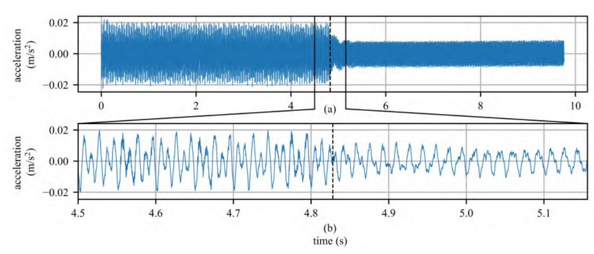

Figure 7.7 The full experimental acceleration data is shown in the upper plot (a) and the bottom (b) shows a close view around the nonstationarity.

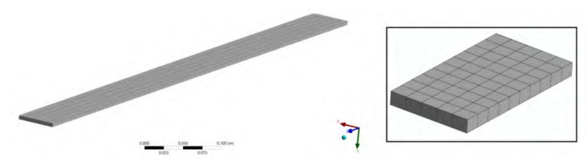

Figure 7.8 FEA model of a steel cantilever beam with detail mesh and an inset that shows close-up looks of the mesh.

{106}------------------------------------------------

The physical properties of a beam, including displacement and strain, play a crucial role in influencing a shaker's ability to move it up and down. Here's how these properties impact the interaction between the beam and the shaker:

- **displacement and Flexibility**: The displacement characteristics of the beam, particularly its flexibility, determine how much it can bend or deform when subjected to external forces. A more flexible beam will deform more easily, affecting the shaker's ability to induce controlled up-and-down movements. On the other hand, a rigid beam may resist displacement, requiring more force from the shaker.
- **Strain and Material Behavior**: Strain is a measure of the displacement of a material under stress. Different materials exhibit varying levels of strain in response to applied forces. The shaker needs to account for the material's strain behavior to effectively move the beam. Excessive strain may lead to permanent displacement or failure, impacting the shaker's control.

The model of a fixed-supported continuous cantilever beam has been designed in ANSYS for generating physics-informed features. The length (L), width (W), and depth (D) of the beam are considered 759, 50.66, and 5.14 mm respectively. The beam material is steel for the fixed supported continuous beam and its properties are taken as for steel Young's modulus as 2x1011Pa, Poisson's ratio set as 0.3, and density a 7850 kg/m3 .The fixed supported continuous beam considered for modeling in ANSYS is shown in Figure [7.8.](#page-105-2) This figure shows the overall mesh of 320 elements and 2588 Nodes.

The fixed support cantilever beam is excited as an experimental excitation force through the free end and fed as tabular data of forces. As a result, total displacement and equivalent elastic strain are generated as Figure [7.9](#page-107-0) (a), and (b). Along with x, 

{107}------------------------------------------------

y, and z three directional deformations are generated as figures [7.9](#page-107-0) (c), (d), (e). The overall physics-informed data from the FEA model have been shown in Figure [7.18.](#page-118-1)

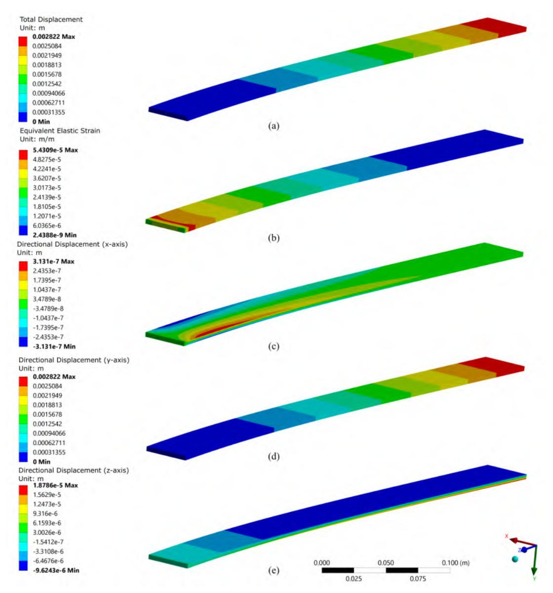

Figure 7.9 FEA model of the cantilever beam analysis showing: (a) total displacement; (b) equivalent elastic strain; (c) x directional displacement;(d) y directional displacement; and (e) z directional displacement of FEA model.

## 7.5.2 PIMENTO Setup

The data is standardized for all experiments and is split by 50%, and 50% into training, and test sets. Pytorch [\[52\]](#page-143-6) is used as a learning framework for developing

{108}------------------------------------------------

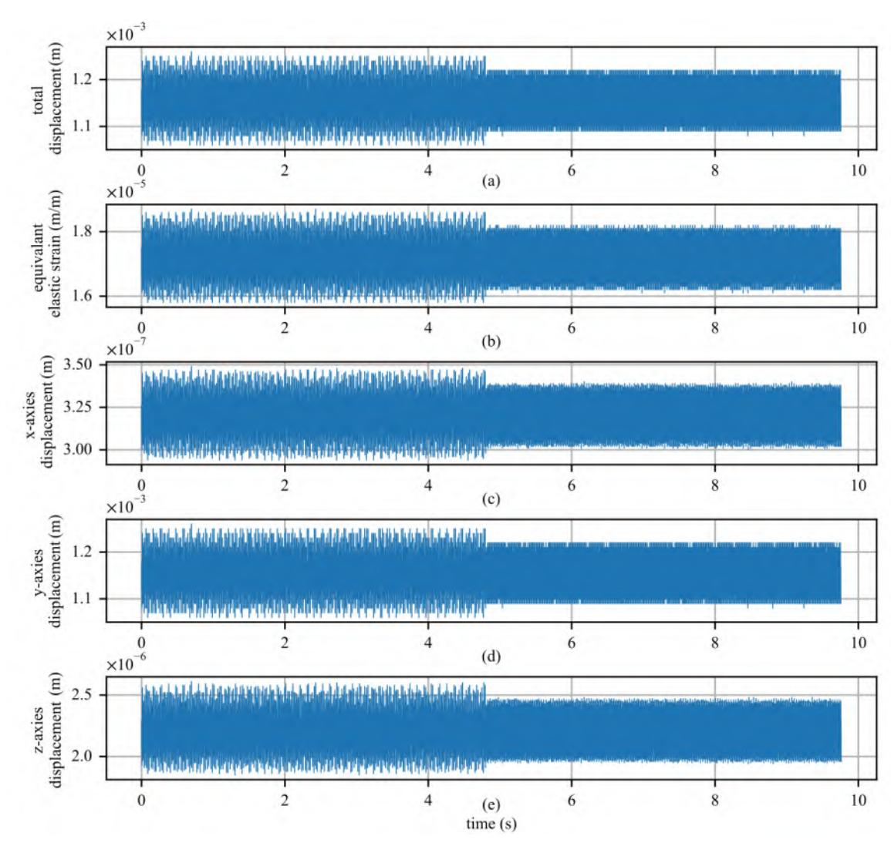

Figure 7.10 Physics informed data from FEA model showing: (a) total displacement; (b) equivalent elastic strain; (c) x-axis displacement; (d) y-axis displacement; and (e) z-axis displacement.

the proposed model. Adam optimizer is used with a learning rate of  $5 \times 10^{-5}$  and batch size of 8 for the corrector model. The model estimator uses the same optimizer Adam [42] with a learning rate of  $10^{-1}$ . For activation function ‘Selu’ [42] is used for the corrector encoder and decoder. The estimator model encoder uses ‘Elu’ as an activation function. Each model is trained by the tuned hyperparameter stated in Table 7.6. All the experiments are conducted on a 64-bit machine with Intel(R) Xeon(R) Gold 6250 CPU 3.90 GHz (32 cores) and 96.0 GB memory and NVIDIA Quadro P400 GPU.

{109}------------------------------------------------

Table 7.2 Model Parameters used for PIMENTO.

|           | Model   |       | Hyper-parameter |            |         |           |           |     |        |           |           |                   |
|-----------|---------|-------|-----------------|------------|---------|-----------|-----------|-----|--------|-----------|-----------|-------------------|
| corrector | encoder | input | dimension       | =          | 10000,  | hidden    | dimension |     | = 32,  | output    | dimension | = 16,             |
|           |         |       | activation      | function = | ‘Selu’, | batch     | size =    | 8,  | epoch  | = 60,     | learning  | rate = 5 × 10 − 5 |
| corrector | decoder | input | dimension=      | 16,        | hidden  | dimension | =         | 32, | output | dimension | =         | 500,              |
|           |         |       | activation      | function = | ‘Selu’, | batch     | size =    | 8,  | epoch  | = 60,     | learning  | rate = 5 × 10 − 5 |
| estimator | encoder | input | dimension=      |            | 10000,  | hidden    | dimension | =   | 16,    | output    | dimension | = 16,             |
|           |         |       | activation      | function = | ‘Selu’, | batch     | size =    | 8,  | epoch  | = 50,     | learning  | rate = 10 − 1     |
| estimator | decoder | input | dimension=      | 16,        | hidden  | dimension | =         | 16, | output | dimension | =         | 500,              |
|           |         |       | activation      | function = | ‘Elu’,  | batch     | size =    | 8,  | epoch  | = 50,     | learning  | rate = 10 − 1     |

#### 7.6 Results and Discussion

This section presents feature analysis, results for the PIMENTO algorithm for time series forecasting before and after a non-stationary as well as results from a sensitivity study. All the reported results in the paper are from test data. The corrector model itself can be an independent model as in Transfer Learning teacher model can do. But the corrector model needs PI data. However, the estimator model doesn't need the PI data. So, we posted all the results to show that, by only using acceleration data (without PI data) during the testing phase, the estimator is also powerful like the corrector model.

#### 7.6.1 Feature Analysis

As feature selection plays a vital role in the development phase, the first challenge of this work was to address the issue of choosing the best feature combination. Having a total of five PI features: total displacement, strain, x-axis displacement, y-axis displacement, and z-axis displacement; the experimental studies first focus on analyzing the effects of features as input, presented in Table 7.7. The best combination has been selected in the four setups (number of feature range:  $1 \sim 4$ ). For example, in the case of a single PI-feature, **strain** was chosen over the total displacement as it decreased the RMSE and MAE by 9.79% and 3.83% while improving the SNRdb and TRAC by 6.86% and 0.44% respectively. A similar strategy has been followed

{110}------------------------------------------------

for other setups as well. Finally, the PIMENTO model has been developed in four fashions with the best different PI features combination as input:

- 1. strain
- 2. y-axis displacement + z-axis displacement
- 3. strain + x-axis displacement + y-axis displacement
- 4. strain + x-axis displacement + y-axis displacement + z-axis displacement

Acceleration experimental data is included as well in the four configurations listed above. Only experimental data acceleration with no PI features is taken into consideration in the case of 0 PI feature configuration. The selection of the above four fashions with different PI feature combinations is explained in detail in Table [7.7](#page-119-0) with different metrics. As total displacement is an extracted feature from the x, y, and z-axis deformations, the need for another possible version (strain + x-axis displacement + y-axis displacement + z-axis displacement + total displacement) was not considered for this analysis.

Table 7.3 Selecting different PI feature combinations based on performance metrics.

| physics based features | feature | combinations         |                     |                      | RMSE                  | MAE      | SNR   | db TRAC |
|------------------------|---------|----------------------|---------------------|----------------------|-----------------------|----------|-------|---------|
| total 1                |         | displacement         |                     |                      | 3.62E-06              | 1.32E-03 | 11.69 | 0.935   |
| strain                 |         |                      |                     |                      | 3.26E-06              | 1.23E-03 | 12.14 | 0.939   |
| total                  |         | displacement, strain |                     |                      | 3.17E-06              | 1.22E-03 | 12.26 | 0.942   |
| x-axis                 |         | displacement,        | y-axis displacement |                      | 3.18E-06              | 1.23E-03 | 12.25 | 0.941   |
| y-axis 2               |         | displacement,        | z-axis              | displacement         | 3.17E-06              | 1.23E-03 | 12.27 | 0.941   |
| x-axis                 |         | displacement,        | z-axis displacement |                      | 3.20E-06              | 1.24E-03 | 12.22 | 0.941   |
| strain,                | x-axis  | displacement,        | y-axis              | displacement         | 3.09E-06              | 1.21E-03 | 12.38 | 0.942   |
| 3 strain,              | y-axis  | displacement,        | z-axis              | displacement         | 3.18E-06              | 1.24E-03 | 12.25 | 0.940   |
| strain,                | x-axis  | displacement,        | z-axis              | displacement         | 3.25E-06              | 1.27E-03 | 12.16 | 0.939   |
| 4 strain,              | x-axis  | displacement,        | y-axis              | displacement, z-axis | displacement 3.06E-06 | 1.19E-03 | 12.42 | 0.943   |

#### 7.6.2 Temporal Forecasting Results

The time series forecasts around the nonstationary for different numbers of PI features of PIMENTO are shown in Figure [7.19\(](#page-121-0)a) shows the forecast from PIMENTO without physics-informed features. Whereas the subfigures (b)-(e) show the timeseries forecast of PIMENTO with one - four physics-informed features; respectively.

{111}------------------------------------------------

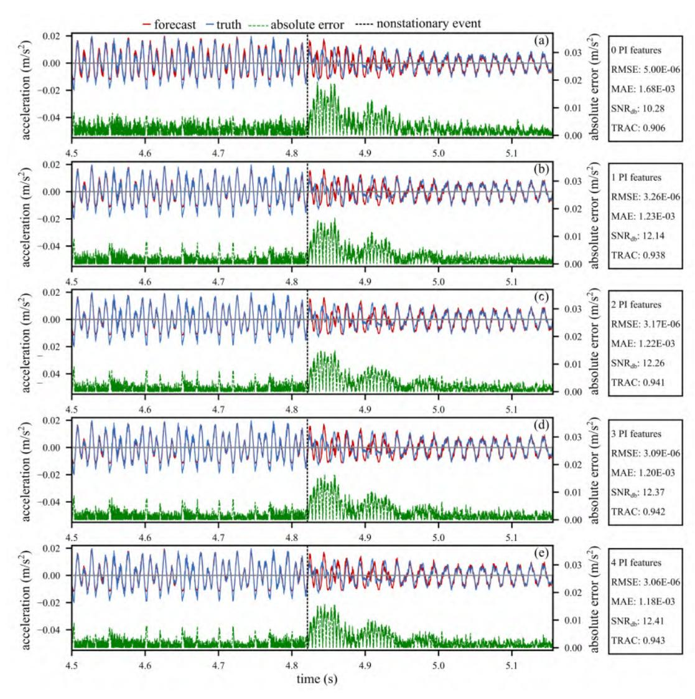

Figure 7.11 Different PI features are used for time series forecast from the estimator model, but all have experimental data acceleration: (a) no PI feature only acceleration; (b) PI feature strain; (c) PI feature y-axis displacement, and z-axis displacement; (d) PI feature strain, x-axis displacement, and y-axis displacement; (e) PI feature strain, x-axis displacement, y-axis displacement, and z-axis displacement; and all show a close look around nonstationary event. Second column shows RMSE, MAE, SNRdb, and TRAC for different PI features time series forecast.

{112}------------------------------------------------

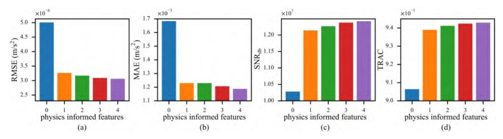

Figure 7.12 Various metrics analysis based on without PI features and with PI features showing:(a) RMSE; (b) MAE; (c) SNRdb; and (d) TRAC.

Figure [7.19](#page-121-0) provides an extensive summary of the forecast improvement both in terms of truth and absolute error. The numerical metrics value in the second column highlights how the PIMENTO model forecast results have been improved by adding more PI features.

Four performance metrics are considered in this work. They are Root Mean Squared Error (RMSE), Mean Absolute Error (MAE), signal-to-noise ratio (SNR), and Time Response Assurance Criterion (TRAC). For RMSE and MAE, lower values are better. For SNR and TRAC, higher is better with TRAC maxing out at 1.0. The performance metrics used are discussed in detail in Appendix [7.11.](#page-130-0) The four performance metrics considered throughout this work are tabulated on the right-hand side of Figure [7.19](#page-121-0) for the respective time series. These metrics are further visualized in Figure [7.20](#page-122-1) and are presented for the five considered cases, from 0 to 4 PI features. 0 PI feature is the baseline with no PI features. In Figure [7.20\(](#page-122-1)a) and (b), there is an observed decrease in RMSE and MAE when utilizing physics-informed (PI) methods. In the case of SNRdb and Time Response Assurance Criterion (TRAC), shown in Figure [7.20\(](#page-122-1)c) and (d), there are performance improvements.

In Table [7.8,](#page-122-0) a detailed comparison with different numbers of features shows the performance improvement. This table shows a trend that the improvement in the forecasted signal is proportional to the number of features used in the corrector model during training.

{113}------------------------------------------------

Table 7.4 Performance analysis with and without physics information in terms of percentage improvement.

| metrics without physics informed physics informed | feature | percentage improvement |
|---------------------------------------------------|---------|------------------------|
| 3.26E-06                                          | 1       | 34.82%                 |
| 3.17E-06                                          | 2       | 36.66%                 |
| 3.09E-06 RMSE 5.01E-06                            | 3       | 38.26%                 |
| 3.06E-06                                          | 4       | 38.86%                 |
| 1.23E-03                                          | 1       | 26.96%                 |
| 1.23E-03                                          | 2       | 26.97%                 |
| 1.21E-03 MAE 1.68E-03                             | 3       | 28.33%                 |
| 1.19E-03                                          | 4       | 29.48%                 |
| 12.14                                             | 1       | 18.07%                 |
| 12.27                                             | 2       | 19.29%                 |
| 12.38 SNR db 10.28                                | 3       | 20.36%                 |
| 12.42                                             | 4       | 20.78%                 |
| 0.939                                             | 1       | 3.59%                  |
| 0.941                                             | 2       | 3.84%                  |
| 0.942 TRAC 0.906                                  | 3       | 3.97%                  |
| 0.943                                             | 4       | 4.03%                  |

The trend from the 'percentage improvement' column in Table [7.8,](#page-122-0) creates the demand to analyze the effect of PI features and a comparative analysis among different PI feature-enhanced PIMENTO versions. The visual representation of this improvement is displayed in Figure [7.21.](#page-122-2)

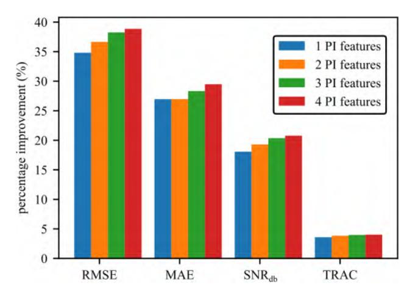

Figure 7.13 Percentage improvement over without physics-informed feature analysis with different numbers of physics information features.

## 7.6.3 Sensitivity Study

This study emphasizes the significance of the constituent PIML models, particularly addressing the challenges faced during their training and their sensitivity to their

{114}------------------------------------------------

Table 7.5 Different metrics analysis of corrector and estimator during various physics-based features.

| physics based features | corrector | RMSE estimator | corrector | MAE estimator | corrector | SNR db estimator | corrector | TRAC estimator |
|------------------------|-----------|----------------|-----------|---------------|-----------|------------------|-----------|----------------|
| 0                      | 6.655E-06 | 5.01E-06       | 2.01E-03  | 1.68E-03      | 9.05      | 10.28            | 0.884     | 0.906          |
| 1                      | 4.05E-06  | 3.26E-06       | 1.49E-03  | 1.23E-03      | 11.20     | 12.14            | 0.932     | 0.939          |
| 2                      | 3.24E-06  | 3.17E-06       | 1.22E-03  | 1.23E-03      | 12.17     | 12.27            | 0.946     | 0.941          |
| 3                      | 3.10E-06  | 3.09E-06       | 1.20E-03  | 1.21E-03      | 12.36     | 12.38            | 0.944     | 0.942          |
| 4                      | 3.27E-06  | 3.06E-06       | 1.27E-03  | 1.19E-03      | 12.13     | 12.42            | 0.940     | 0.943          |

input parameters. The training of heavily parameterized PIML models requires extensive data, and the lack of high-quality data can hinder effective model training. This issue is further illustrated in the study where a comparative performance of corrector and estimator models are shown about various PI features, highlighting the data-dependency challenges in PIML model development. This situation is shown in Figure [7.22](#page-123-1) where a comparison of the corrector and estimator models' concurrent performance concerning several PI features is reported.

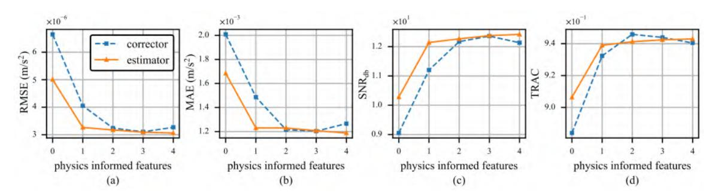

Figure 7.14 Performing sensitivity analysis using features to illustrate: (a) RMSE; (b) MAE; (c) SNRdb; and (d) TRAC.This figure compares the concurrent performance of the corrector and estimator models about four PI features (1-4) and also with 0 PI features, which only consider experimental acceleration.

In PIMENTO the corrector model is heavily parameterized compared to the lightweight estimator model. That's why when the number of features is low, that time the corrector model performance is worse compared to the estimator model; as shown in Figure [7.22.](#page-123-1) The corrector model performance starts to improve when the number of PI features is more than 1. The performance gap between these two models decreases. The numerical results are shown in Table [7.9.](#page-123-0) So, this PIMENTO model architecture can overcome the issue of data scarcity. In the absence of PI features, 

{115}------------------------------------------------

the estimator can overcome the corrector model and is not affected by the improperly trained corrector model. And when enough data is available to train the corrector model properly it improves the estimator model.

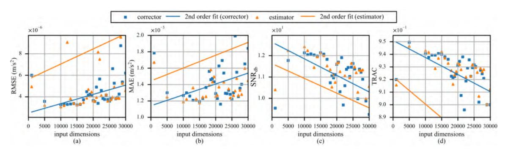

Figure 7.15 Sensitivity analysis varying the input dimension for 4 PI features, showing results for (a) RMSE; (b) MAE; (c) SNRdb; and (d) TRAC. This investigation helps in choosing the most suitable input dimensions for the proposed model when there are 4 PI features. To make decisions, values that are near between the corrector and estimator models are utilized.

Figure [7.23](#page-124-0) shows the sensitivity analysis with various input dimensions when four PI features are considered and a second-order model is fit over the data. For this analysis input dimension range is between 1000 to 51200 samples but Figure [7.23](#page-124-0) shows the range between 0 to 30000 which shows a zoom portion near the lowest error change for each metric.

The top lowest error for the estimator is displayed for 10000, 11000, and 5000. Concerning the corrector, the lowest errors happened for 15000, 10000, and 16000.

Within these, the input dimensions of 10000 are common to both the estimator and corrector. A detailed examination of these dimensions is presented in Figure [7.23.](#page-124-0)

The difference between the estimator and corrector RMSE for 10000 input dimensions is around  $0.21 \times 10^{-6}$  m/s2. Consequently, a 10000 input dimension is selected as the optimal model configuration as the estimator and corrector error are near to one another and need less testing time for the estimator around 2.71 seconds.

{116}------------------------------------------------

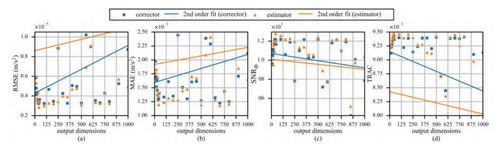

Figure 7.16 Sensitivity analysis varying the output dimensions for 4 PI features and an input dimension is 10000, showing: (a) RMSE; (b) MAE; (c) SNRdb; and (d) TRAC. This analysis decides the best output dimensions for the proposed model in the case of 4 PI features. Decisions are made upon close values between corrector and estimator models.

Figure [7.16](#page-116-0) reports the sensitivity analysis with various output dimensions when four PI features are used and input dimension is set to 10000. For this analysis output dimension range is between 5 to 5200 samples but Figure [7.16](#page-116-0) shows the range between 0 to 1000 where shows a zoom portion near lowest error change for each metrics. The second-order models show that error gradually increases concerning output dimension increase. Due to of memory issue below 5 was not considered for this analysis.

In the case of the estimator, the top lowest error shows for 45, 100, 500, 200, and 800. For the corrector, the top lowest error occurred for 40, 100, 45, 350, and 500. Within this range 45, 100, and 500 output dimensions are common for the estimator and corrector. The difference between estimator and corrector RMSE are  $0.41 \times 10^{-6}$  m/s2,  $0.26 \times 10^{-6}$  m/s2, and  $0.21 \times 10^{-6}$  m/s2 corresponding to output dimensions 45, 100, and 500. The lowest testing time for the estimator is around 2.71 s for 500 output dimension, 13.76 s for 100 output dimension, and 30.62 s for 45 output dimension. As a result, for the best model configuration, a 500 output dimension is chosen considering the lowest error and testing time.

More datasets and experimental analyses have been added as supplemental materials.

{117}------------------------------------------------

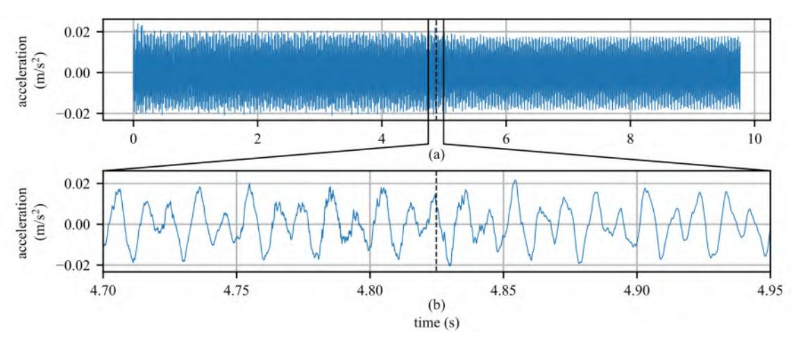

Figure 7.17 The full experimental acceleration data is shown in the upper plot (a) and the bottom (b) shows a close view around the nonstationarity.

Table 7.6 Model Parameters used for PIMENTO.

| Model                   | Hyper-parameter |    |         |        |           |           |    |       |        |        |           |           |      |    |    |     |
|-------------------------|-----------------|----|---------|--------|-----------|-----------|----|-------|--------|--------|-----------|-----------|------|----|----|-----|
| corrector encoder input | dimension       | =  | 25500,  | hidden |           | dimension |    | =     | 32,    | output |           | dimension | =    | 8, |    |     |
| activation              | function        | =  | ‘Selu’, | batch  | size      | =         | 8, | epoch | =      | 50,    | learning  | rate      | =    |    | 10 | − 3 |
| corrector decoder input | dimension=      | 8, | hidden  |        | dimension | =         |    | 32,   | output |        | dimension | =         | 500, |    |    |     |
| activation              | function        | =  | ‘Selu’, | batch  | size      | =         | 8, | epoch | =      | 50,    | learning  | rate      | =    |    | 10 | − 3 |
| estimator encoder input | dimension=      |    | 25500,  | hidden |           | dimension |    | =     | 64,    | output |           | dimension | = 8, |    |    |     |
| activation              | function        | =  | ‘Selu’, | batch  | size      | =         | 8, | epoch | =      | 50,    | learning  | rate      | =    |    | 10 | − 4 |
| estimator decoder input | dimension=      | 8, | hidden  |        | dimension | =         |    | 64,   | output |        | dimension | =         | 500, |    |    |     |
| activation              | function        | =  | ‘Elu’,  | batch  | size      | =         | 8, | epoch | =      | 50,    | learning  | rate      | =    | 10 | −  | 4   |

## 7.7 Supplement document for different data

## 7.7.1 Data generation

The composite signal comprises 50, 70, 100, and 120 Hz sinusoidal signals. Two sine wave signals are concatenated together at 5s where a nonstationary is present due to a change of frequency. To achieve this, an input signal of 1V is used before 5s while a signal of 1V is used after 5s. The first half of the composite signal is built from 50, 70, and 120 Hz frequencies while the second half signal consists of 70 and 100 Hz frequencies. The data is displayed at the top of Fig. 7.17. This data is available in a public repository [11].

The PI data generated by ANSYS model has been shown in the Figure [7.18.](#page-118-1)

{118}------------------------------------------------

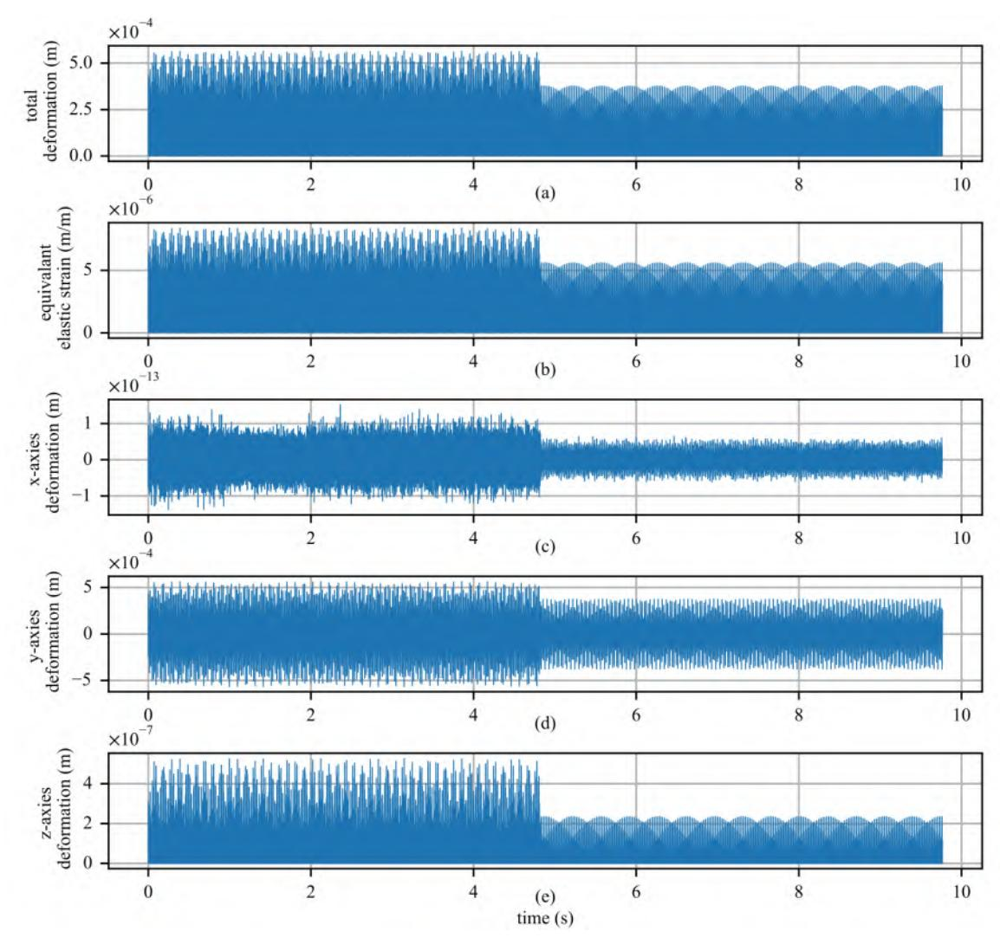

Figure 7.18 Physics informed data from FEA model showing: (a) total deformation; (b) equivalent elastic strain; (c) x-axis deformation; (d) y-axis deformation; and (e) z-axis deformation.

## 7.8 Results and Discussion

This section presents results for the PIMENTO algorithm for time series forecasting before and after a non-stationary as well as results from a sensitivity study.

## 7.8.1 Temporal Forecasting Results

Having a total of five PI features: total deformation, strain, x-axis deformation, yaxis deformation, and z-axis deformation; the PIMENTO model has been developed

{119}------------------------------------------------

Table 7.7 Selecting different PI features combination based on performance metrics.

| physics based features feature | combinations |              |                    |                     | RMSE                 | MAE      | SNR   | db TRAC |
|--------------------------------|--------------|--------------|--------------------|---------------------|----------------------|----------|-------|---------|
| total 1                        | deformation  |              |                    |                     | 4.14E-06             | 1.62E-03 | 13.04 | 0.9512  |
| strain                         |              |              |                    |                     | 3.85E-06             | 1.56E-03 | 13.36 | 0.9542  |
| total                          | deformation, | strain       |                    |                     | 4.01E-06             | 1.58E-03 | 13.18 | 0.9537  |
| x-axis                         | deformation, | y-axis       | deformation        |                     | 4.14E-06             | 1.58E-03 | 13.04 | 0.9718  |
| y-axis 2                       | deformation, | z-axis       | deformation        |                     | 3.54E-06             | 1.47E-03 | 13.73 | 0.9601  |
| x-axis                         | deformation, | z-axis       | deformation        |                     | 4.24E-06             | 1.60E-03 | 12.94 | 0.9730  |
| strain,                        | x-axis       | deformation, | y-axis             | deformation         | 3.29E-06             | 1.40E-03 | 14.04 | 0.9653  |
| 3 strain,                      | y-axis       | deformation, | z-axis deformation |                     | 4.29E-06             | 1.63E-03 | 12.89 | 0.9497  |
| strain,                        | x-axis       | deformation, | z-axis deformation |                     | 3.37E-06             | 1.43E-03 | 13.94 | 0.9613  |
| 4 strain,                      | x-axis       | deformation, | y-axis             | deformation, z-axis | deformation 3.11E-06 | 1.35E-03 | 14.29 | 0.9655  |

in four fashions with different PI features combination:

- 1. strain
- 2. y-axis deformation + z-axis deformation
- 3. strain + x-axis deformation + y-axis deformation
- 4. strain + x-axis deformation + y-axis deformation + z-axis deformation

Acceleration experimental data is included as well in the four configurations listed above. Only experimental data acceleration with no PI features is taken into consideration in the case of 0 PI feature configuration. The selection of the above four fashions with different PI feature combinations is explained in detail in the Table [7.7](#page-119-0) with different metrics.

From Table 7.7, analyzing lowest error when dealing with a 1 PI feature, strain rather than total deformation is used. Approximately  $3.85 \times 10^{-6}$  m/s2 is the RMSE for strain, and  $4.14 \times 10^{-6}$  m/s2 is the RMSE for total deformation. In case of selecting 2 PI feature, y-axis deformation + z-axis deformation combination shows lowest error compare to other combination. For selecting 3 PI features strain + x-axis deformation + y-axis deformation combination, shows lowest RMSE around  $3.29 \times 10^{-6}$  m/s2. As total deformation is an extracted feature from the x, y, and z-axis deformations, the need for another possible version (strain + x-axis deformation + y-axis deformation + z-axis deformation + total deformation) was not considered for this analysis.

{120}------------------------------------------------

The time series forecasts around the nonstationary for different numbers of PI features of PIMENTO are shown in Fig. [7.19\(](#page-121-0)a) shows the forecast from PI-MENTO without physics-informed features. Whereas the subfigures (b)-(e) show the time-series forecast of PIMENTO with one - four physics-informed features; respectively.Fig [7.19](#page-121-0) provides an extensive summary of the forecast improvement both in terms of truth and absolute error. The numerical metrics value in the second column highlights how the PIMENTO model forecast results have been improved by adding of more PI features.

In this work four performance metrics considered. They are Root Mean Squared Error (RMSE), Mean Absolute Error (MAE), signal-to-noise ratio (SNR), and Time Response Assurance Criterion (TRAC). For RMSE and MAE, lower values are better. For SNR and TRAC, higher is better with TRAC maxing out at 1.0. The performance metrics used are discussed in detail in Appendix in the main paper. The four performance metrics considered throughout this work are tabulated on the right hand side of Fig. [7.19](#page-121-0) for the respective time series. These metrics are further visualized in Fig. [7.20](#page-122-1) and are presented for the five considered cases, from 0 to 4 PI features. In Fig. [7.20\(](#page-122-1)a) and (b), there is an observed decrease in RMSE and MAE when utilizing physics-informed (PI) methods. In the case of SNRdb and Time Response Assurance Criterion (TRAC), shown in Fig. [7.20\(](#page-122-1)c) and (d), there are performance improvements.

In Table [7.8,](#page-122-0) a detailed comparison with different numbers of features shows the performance improvement. This table shows a trend that the improvement in forecasted signal is proportional to the number of features used in the corrector model during training.

The trend from the 'percentage improvement' column in Table [7.8,](#page-122-0) creates the demand to analyze the effect of PI features and a comparative analysis among different PI feature-enhanced PIMENTO versions. The visual representation of this

{121}------------------------------------------------

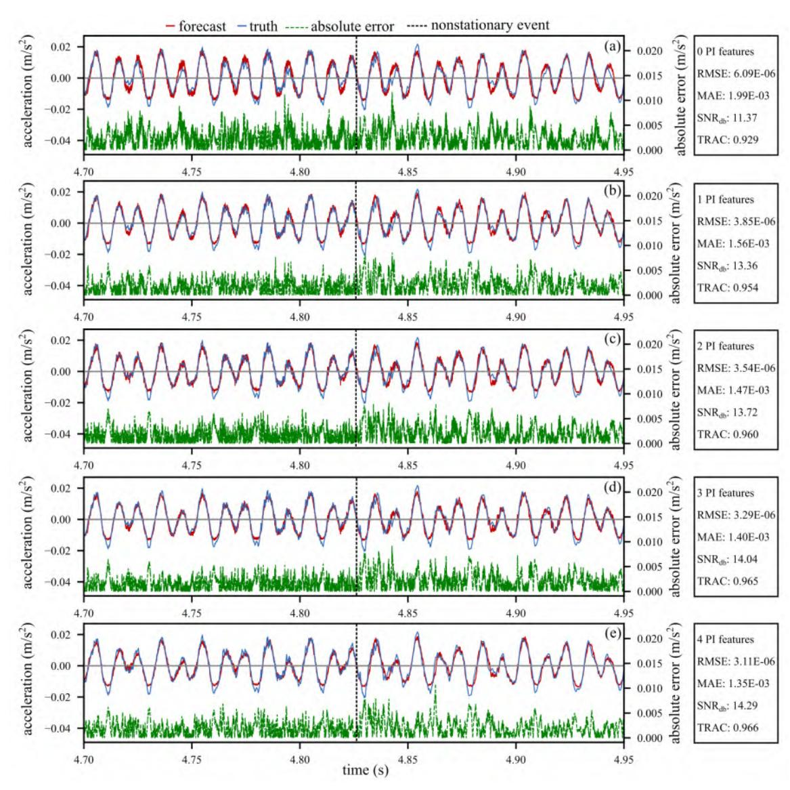

Figure 7.19 Different PI features are used for time series forecast from the estimator model, but all have experimental data acceleration: (a) no PI feature only acceleration; (b) PI feature deformation; (c) PI feature deformation, and strain; (d) PI feature strain, x-axis deformation, and y-axis deformation; (e) PI feature strain, x-axis deformation, y-axis deformation, and z-axis deformation; and all shows a close look around nonstationary event. Second column shows RMSE, MAE, SNRdb, and TRAC for different PI features time series forecast.

{122}------------------------------------------------

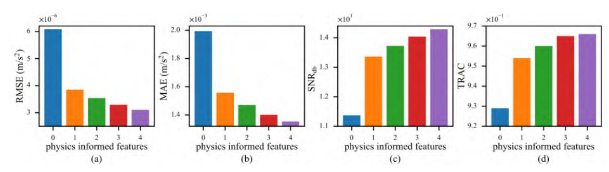

Figure 7.20 Various metrics analysis based on without PI features and with PI features showing:(a) RMSE; (b) MAE; (c) SNRdb; and (d) TRAC.

Table 7.8 Performance analysis with and without physics information in terms of percentage improvement.

| metrics without physics informed physics informed | feature | percentage improvement |
|---------------------------------------------------|---------|------------------------|
| 3.85E-06                                          | 1       | 36.79%                 |
| 3.54E-06                                          | 2       | 41.84%                 |
| 3.29E-06 RMSE 6.09E-06                            | 3       | 45.90%                 |
| 3.11E-06                                          | 4       | 48.97%                 |
| 1.56E-03                                          | 1       | 21.93%                 |
| 1.47E-03                                          | 2       | 26.24%                 |
| 1.40E-03 MAE 1.99E-03                             | 3       | 29.71%                 |
| 1.35E-03                                          | 4       | 32.09%                 |
| 13.36                                             | 1       | 17.54%                 |
| 13.73                                             | 2       | 20.72%                 |
| 14.04 SNR db 11.37                                | 3       | 23.49%                 |
| 14.29                                             | 4       | 25.72%                 |
| 0.954                                             | 1       | 2.71%                  |
| 0.960                                             | 2       | 3.35%                  |
| 0.965 TRAC 0.929                                  | 3       | 3.91%                  |
| 0.966                                             | 4       | 3.93%                  |

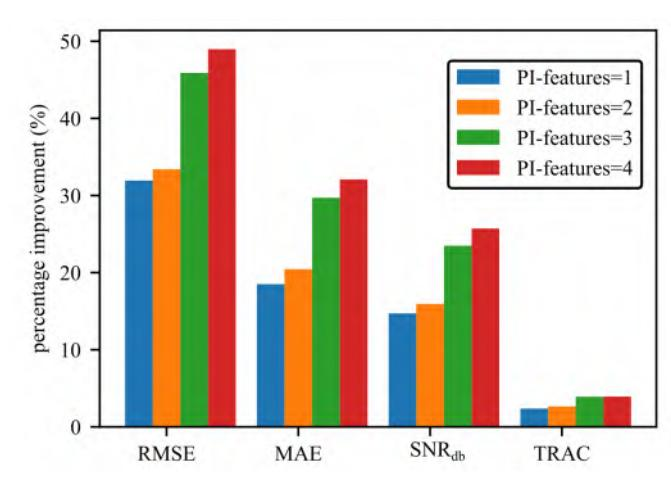

Figure 7.21 Percentage improvement over without physics informed feature analysis with different numbers of physics information features.

improvement is displayed in Fig. [7.21.](#page-122-2)

{123}------------------------------------------------

Table 7.9 Different metrics analysis of corrector and estimator during various physics-based features.

| physics based features | corrector | RMSE estimator | corrector | MAE estimator | corrector | SNR db estimator | corrector | TRAC estimator |
|------------------------|-----------|----------------|-----------|---------------|-----------|------------------|-----------|----------------|
| 0                      | 9.69E-06  | 6.09E-06       | 2.54E-03  | 1.99E-03      | 9.35      | 11.37            | 0.927     | 0.929          |
| 1                      | 4.67E-06  | 3.85E-06       | 1.79E-03  | 1.56E-03      | 12.52     | 13.36            | 0.956     | 0.954          |
| 2                      | 3.20E-06  | 3.54E-06       | 1.38E-03  | 1.47E-03      | 14.16     | 13.73            | 0.968     | 0.960          |
| 3                      | 3.19E-06  | 3.29E-06       | 1.42E-03  | 1.40E-03      | 14.17     | 14.04            | 0.962     | 0.965          |
| 4                      | 2.94E-06  | 3.11E-06       | 1.35E-03  | 1.35E-03      | 14.54     | 14.29            | 0.965     | 0.965          |

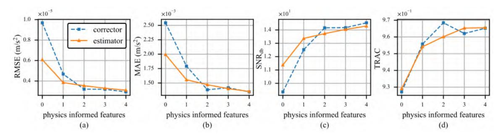

Figure 7.22 Performing sensitivity analysis using features to illustrate: (a) RMSE; (b) MAE; (c) SNRdb; and (d) TRAC.This figure compares the concurrent performance of the corrector and estimator models with regard to four PI features (1-4) and also with 0 PI features, which only take experimental acceleration into consideration.

#### 7.8.2 Sensitivity Study

This study emphasizes the significance of the constituent PIML models, particularly addressing the challenges faced during their training and their sensitivity to their input parameters. The training of heavily parameterized PIML models requires extensive data, and the lack of high-quality data can hinder effective model training. This issue is further illustrated in the study where a comparative performance of corrector and estimator models are shown in relation to various PI features, highlighting the data-dependency challenges in PIML model development. This situation is shown in Fig. [7.22](#page-123-1) where a comparison of the corrector and estimator models' concurrent performance with respect to several PI features is reported.

In PIMENTO the corrector model is heavily parameterized compared to the lightweight estimator model. That's why when the number of features is low, that time the corrector model performance is worse compared to the estimator model; as shown in Fig. [7.22.](#page-123-1) The corrector model performance starts to improve when the

{124}------------------------------------------------

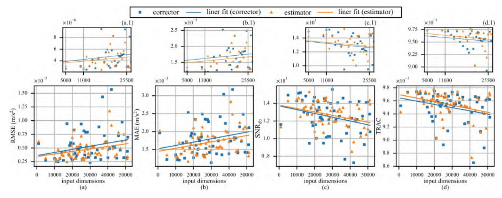

Figure 7.23 Sensitivity analysis varying the input dimension for 4 PI features, showing results for: (a) RMSE; (b) MAE; (c) SNRdb; and (d) TRAC. This investigation helps in choosing the most suitable input dimensions for the proposed model when there are 4 PI features. To make decisions, values that are near between the corrector and estimator models are utilized. Right top corner(a.1); (b.1); (c.1); and (d.1) shows a zoom portion near lowest error change for each metrics.

number of PI features is more than 1. The performance gap between these two models decreases. The numerical results are shown in Table [7.9.](#page-123-0) So, this PIMENTO model architecture can overcome the issue of data scarcity. In the absence of PI features, the estimator can overcome the corrector model and is not affected by the improperly trained corrector model. And when enough data is available to train the corrector model properly it improves the estimator model.

Fig. [7.23](#page-124-0) shows the sensitivity analysis with various input dimensions when four PI features are considered and a linear model is fit over the data. For this analysis input dimension range is between 1000 to 51200 samples. Selecting the optimal input dimension relies on four key criteria:

- 1. Identifying the lowest error values for both the estimator and corrector.
- 2. Determining the shared input dimensions within this optimal error range for both the estimator and corrector.
- 3. Comparing the estimator and corrector error differences for these shared input dimensions.

{125}------------------------------------------------

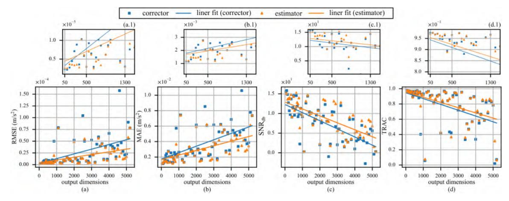

Figure 7.24 Sensitivity analysis varying the output dimensions for 4 PI features and an input dimension is 25500, showing: (a) RMSE; (b) MAE; (c) SNRdb; and (d) TRAC.This analysis decides the best output dimensions for proposed model in case of 4 PI features and input dimension 25500.Decisions are made upon close values between corrector and estimator models.Right top corner(a.1); (b.1); (c.1); and (d.1) shows a zoom portion near lowest error change for each metrics.

4. Minimum computation time must be verified. The selected one has the lowest error difference and the shortest computation time.

The top lowest error for the estimator is displayed for 17000, 26500, 11000, 26000, 10000, 51000, 22000, 21500, 25500, and so on. Concerning the corrector, the most and lowest errors happened for 30000, 12000, 11000, 5000, 15000, 20000, 36000, 25500, 13000, and so forth.

Within the shared range, the input dimensions of 11000 and 25500 are common to both the estimator and corrector. A detailed examination of these dimensions is presented in Fig. [7.23](#page-124-0) (a.1), (b.1), (c.1), and (d.1).

The difference between the estimator and corrector RMSE for 25500 input dimensions is around  $1.689 \times 10^{-7}$  m/s2, whereas for 11000 input dimensions it is  $3.42 \times 10^{-7}$  m/s2. Consequently, a 25500 input dimension is selected as the optimal model configuration as the estimator and corrector error are near to one another and need less computing time about 2.93 seconds for each iteration.

{126}------------------------------------------------

four PI features are used and input dimension is set to 25500. For this analysis output dimension range is between 50 to 5200 samples.The linear models show that error gradually increases with respect to output dimension increase. Due to out of memory issue below 50 was not considered for this analysis. The same four key criteria that determine the input dimension also determine how to select the optimal output dimension.

In case of estimator, top lowest error shows for 650, 100, 50, 350, 1300, 500 and so on. For corrector top lowest error occurred for 100, 50, 650, 150, 1300, 500 and so on.

Within this range 50, 100, 650, 500, and 1300 output dimension is common for estimator and corrector.

The difference between estimator and corrector RMSE are  $3.302 \times 10^{-7}$  m/s2,  $3.698 \times 10^{-7}$  m/s2,  $1.691 \times 10^{-7}$  m/s2,  $4.042 \times 10^{-7}$  m/s2, and  $1.546 \times 10^{-7}$  m/s2 corresponding to output dimensions 50, 100, 500, 650, and 1300. Lowest value are for 1300 and 500. Fig 7.24 (a.1), (b.1), (c.1), and (d.1), shows close look of 500, and 1300. Lowest computational time around 1.01 seconds per iteration for 500 output dimension and 2.93 seconds per iteration for 1300 output dimension. As a result, for the best model configuration, a 500 output dimension is chosen.

## 7.9 Conclusions

The qualities of PIML have drawn attention in recent years for its potential performance over traditional machine learning algorithms. This study proposed a unique PIML architecture Physics Informed Machine lEarning for Nonstationary Temporal fOrecasting (PIMENTO) consisting of data representation techniques, a physicsinformed corrector model, and a lightweight estimator model with an effective knowledge transfer technique. The goal of this work was to develop an easily optimizable model whether training the model parameter with physics-informed features from a

{127}------------------------------------------------

traditional FEA model. Experimental analysis also provides a method to evaluate the model performance. This work provided a way to utilize the experimental data and FEA mesh analysis data during the training phase. With the help of transfer learning this framework gets rid of physics data dependency during the testing phase. Moreover, this approach maximizes the efficiency of utilizing pre-trained models, minimizes data prerequisites in the target domain, which is particularly advantageous in real-world scientific and engineering challenges, and lowers computational expenses by enabling the same model to address multiple tasks with minimal adjustments tailored to the target dataset. As a result, this model does not need any physics-informed features during the testing phase, which makes this model more applicable to real-world applications where physics-informed data is not available.

## Appendix

## 7.10 Sequence Representation function §(·)

Due to the noisy nature of the data, this work focused on the lossless representation of the sequence. Because of that a unique type of sequence representation function  $\S(\cdot)$  is designed in this paper. Considering an input sequence  $\mathbf{I}$  with  $m \times n$  dimension with  $m$  features and  $n$  timesteps. So,  $\mathbf{I} = [I^0, I^1, I^2, \dots I^n]$  where  $I^t$  represents a timestep input with  $m$  features (dimension  $m \times 1$ ). This sequence representation utilizes BiLSTM layers which are based on LSTM cells. An LSTM cell is considered to process every time-step,  $I^t$  (Figure 7.25). This cell consists of an input gate ( $\iota$ ), a forget gate ( $\phi$ ), and an output gate ( $o$ ) with their weight ( $W$ ) and bias ( $b$ ). The output of a cell includes a hidden state ( $h$ ) and a cell state ( $c$ ). The cell uses input timestep data  $I^t$ , the previous cell's hidden state ( $h^{t-1}$ ) and cell state ( $c^{t-1}$ ) according

{128}------------------------------------------------

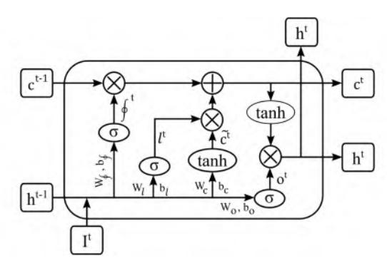

Figure 7.25 Diagram of an LSTM cell.

to Equations (7.18) to (7.20).

$$\iota^t = \sigma(W_\iota \cdot [h^{t-1}, I^t] + b_\iota) \quad (7.18)$$

$$\oint^t = \sigma(W_{\oint} \cdot [h^{t-1}, I^t] + b_{\oint}) \quad (7.19)$$

$$o^t = \sigma(W_o \cdot [h^{t-1}, I^t] + b_o) \quad (7.20)$$

$$\vec{c}^t = \tanh(W_c \cdot [h^{t-1}, X^t] + b_c) \quad (7.21)$$

$$c^t = \oint^t * c^{t-1} + \iota^t * \tilde{c}^t \quad (7.22)$$

$$h^t = o^t * \tanh(c^t) \quad (7.23)$$

After that, Hyperbolic tangent (*tanh*) replaces the memory cell with the new candidate ( $\tilde{c}$ ) by following Equation (7.21). Having updated gate values and candidates from (7.18) to (7.21), LSTM updates its own cell state ( $c^t$ ) and hidden state ( $h^t$ ) by (7.22) and (7.23) respectively. In the case of BiLSTM layers (Figure 7.26), each

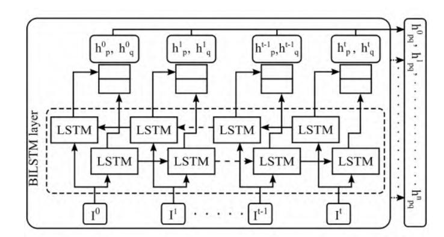

Figure 7.26 Sequence representation function denoted as  $\S(\cdot)$ .

{129}------------------------------------------------

timestep ( $I^t$ ) would yields forward hidden states ( $h_p^t$ ), backward hidden states ( $h_q^t$ ), forward cell states ( $c_p^t$ ) and backward hidden states ( $c_q^t$ )

$$h_{pq}^t = \text{concat}([h_p^t, h_q^t]) \quad (7.24)$$

$$c_{pq}^t = \text{concat}([c_p^t, c_q^t]) \quad (7.25)$$

Instead of considering the last cells' hidden states  $h_{pq}^n$  for the whole sequence representation, here chose to consider all the hidden states concatenated together as the sequence representation. This will help us to make a lossless representation of the sequence. So, our final representation of the sequence becomes:

$$H = \text{concat}([h_{pq}^0, h_{pq}^1, h_{pq}^2, \dots h_{pq}^n]) \quad (7.26)$$

Now the finalized sequence representation function as:

$$[H, h_{pq}^n, c_{pq}^n] = \S (\mathbf{I}^{mn}, [h_{pq}^0, c_{pq}^0]) \quad (7.27)$$

Here,  $[h_{pq}^0, c_{pq}^0]$  is the initialization parameters for BiLSTM layers which can be varied based on the usage either in encoder or decoder. So, the sequence representation function would be:  $\S : (\mathbf{I}^{mn}, [h_{pq}^0, c_{pq}^0]) \rightarrow [H, h_{pq}^n, c_{pq}^n]$  where  $h$  is for hidden states,  $c$  is for cell state,  $p$  is for forward layer, and  $q$  is for backward layer of BiLSTM.

Particularly in sequence-to-sequence tasks as encoder-decoder concepts bidirectional long-term memory (BiLSTM) networks are better than conventional long-term memory (LSTM) networks. Sequence-to-sequence tasks are an area in which Bidirectional Long Short-Term Memory (BiLSTM) networks perform well. These networks offer several benefits, including capturing bidirectional context, the ability to handle variable-length sequences with robustness, better comprehension of sequential patterns, enhanced information flow, and the ability to deal with the vanishing gradient problem. The selection between LSTM and BiLSTM, however, is contingent upon task-specific attributes, therefore scenarios may differ in terms of applicability. The choice of BiLSTM over traditional LSTM in this proposed work is motivated by the data's noisy nature and the sudden effect of uncertainty or nonstationary events.

{130}------------------------------------------------

#### 7.11 Performance evaluation metrics

Here are the equations for different performance metrics such as RMSE, MAE, SNRdb, and TRAC.

Root Mean Squared Error (RMSE) measures the average difference between modelforecasted values and actual observations, while Mean Absolute Error (MAE) quantifies the absolute numerical difference between measured and estimated states.

$$\text{RMSE} = \sqrt{\frac{1}{n} \sum_{i=1}^n (x_i - y_i)^2} \quad (7.28)$$

$$\text{MAE} = \frac{1}{n} \sum_{i=1}^n |x_i - y_i| \quad (7.29)$$

The Signal-to-Noise Ratio (SNR) is a statistical measure that compares the strength of a signal to the amount of background noise. Higher SNR ratios indicate better signal quality, as they show a stronger signal among lower noise levels. The SNRdb is measured in decibels (dB) due to the wide dynamic range of the signals involved.

$$\text{SNR}_{\text{db}} = 10 \cdot \log_{10} \left( \frac{P_{\text{signal}}}{P_{\text{noise}}} \right) \quad (7.30)$$

One method used to determine how much two time traces correlate with one another is the Time Response Assurance Criterion (TRAC). The values obtained via TRAC fall between 0 and 1, with values closer to 1 denoting a strong correlation between the two traces [\[3\]](#page-139-5). The TRAC for the scenarios discussed here is the correlation between the truth data (x) and the forecast data (y) for one DOF overall time.

$$\text{TRAC} = \frac{[x^T y]^2}{[x^T x] \cdot [y^T y]} \quad (7.31)$$

{131}------------------------------------------------

# Chapter 8

# Conclusions

The goal of this research work is to analyze temporal forecasting in structural health monitoring systems. This research aims to answer to research questions: 1) How to design hardware and software for real-time forecasting for SHM? 2) How to synergies between data-driven and rule-based system? In the first stage, the main focus is time series data of high-rate dynamics systems and developing models, and implementing those models on hardware. In next stage, the goal is to improve the data-driven model to a physics-informed model. For the preliminary study, this work develops a testbench structure (Chapter 2) that consists of a cantilever beam subjected to nonstationary inputs to generate experimental data.

For the first work on data-driven approaches, this work proposes numerical analysis and experimental results for the real-time implementation of a Fast Fourier Transform (FFT)-based approach for time series forecasting (Chapter 3 and 4). First, the data is de-trended, then the time series data is transferred into the frequency domain, and measures for frequency, amplitude, and phase are obtained. Thereafter, select frequency components are collected, transformed back to the time domain, recombined, and then the trend in the data is restored. Finally, the recombined signals are propagated into the future to the selected prediction horizon. This preliminary time series forecasting work is done offline using pre-recorded experimental data, and the FFT-based approach is implemented in a rolling window configuration. Here learning windows of 0.1, 0.5, and 1 s are considered with different computation times simulated. Results demonstrate that the proposed FFT-based approach can maintain a constant

{132}------------------------------------------------

prediction horizon at 1s with sufficient accuracy for the considered system. The performance of the system is quantified using a variety of metrics. Computational speed and prediction accuracy as a function of training time and learning window lengths are examined in this work. The algorithm configuration with the shortest learning window (0.1s) is shown to converge faster following the nonstationary when compared to algorithm configuration with longer learning windows.

For the second work on data-driven approaches (Chapter 5), this work proposes the development of a coupled software-hardware algorithm for deterministic and low-latency online time-series forecasting of structural vibrations that is capable of learning over nonstationary events and adjusting its forecasted signal following an event. The proposed algorithm uses an ensemble of Multi-Layer Perceptrons (MLP) trained offline on experimental and simulated data relevant to the structure. A dynamic attention layer is then used to selectively scale the outputs of the individual models to obtain a unified forecasted signal over the considered prediction horizon. The scalar values of the dynamic attention layer are continuously updated by quantifying the error between the signal's measured value and its previously predicted value. The deterministic timing of the proposed algorithm is achieved through its deployment on a field programmable gate array. The performance of the proposed algorithm is validated on experimental data taken on a test structure. Results demonstrate that a total system latency of  $25.76\mu\text{s}$  can be achieved on a Kintex-7 70T FPGA with sufficient accuracy for the considered system.

Historically used techniques such as FFT, which has a simpler design methodology, but performance is less accurate compared to hardcore latest machine learning approaches. Both techniques have merits and demerits. So, this work proposes a comparative study of both models proposed in the aforementioned paragraphs. The goal of this research is to build low-device-utilization, cost-effective hardware models that can be used to control active structures that encounter dynamic events at the

{133}------------------------------------------------

microsecond timeframe. Even though these two problems are separate yet related. The new strategy used in this project is to adjust hyper-parameters to make them more user-friendly with various data, particularly vibration, and acceleration, to reduce computational timing and latency. To store and update the parameters of the Fast Fourier Transform (FFT) and the ensemble of multilayer perceptrons (MLP), field programmable gate arrays (FPGAs) are proposed to utilize. The developed algorithm will increase real-time machine learning by increasing understanding of: (1) Comparing the FFT model with the ensemble model in the case of FPGA hardware implementation. (2) How timing and device utilization affect the complex and simple model. (3) A better way to learn dynamics such as modes, natural frequencies, and input frequencies. (4) The advantages of different non-stationary time series derived from sampled data in deterministic models of timing. (5) Maintaining adequate precision while adhering to microsecond-level real-time limitations. (6) If possible, make a hybrid model of FFT and MLP which will use the simplicity of FFT and use more accurate performance of ensemble MLPs. The main concept of this last task is to compare these two methods in the case of hardware and software.

To address the second research question, this study investigates physics-informed machine learning methods to enhance traditional data-driven approaches. In Chapter [6,](#page-66-0) real-world data was augmented with physics-informed computational data. A cantilever beam was subjected to a controlled vibration and then an unexpected impact to generate the real-world dataset. A finite element analysis of the beam was used to extract physics-informed features. This additional data enriched the machine learning model with valuable insights into the beam's physical behavior. The results demonstrate that incorporating more physics-informed features into the real-world data leads to improved model performance. Specifically, the RMSE and MAE (Root Mean Squared Error and Mean Absolute Error) decrease, while the SNR and TRAC (Signal-to-Noise Ratio and Time Response Assurance Criterion) increase.

{134}------------------------------------------------

While physics-informed features enhance performance, the scarcity of such data in real-world applications remains a significant challenge. To address this issue, this research utilizes transfer learning as presented in Chapter [7.](#page-87-0) A teacher model (corrector model) is trained using both real-world and physics-informed data. Employing an encoder-decoder architecture, the student model (estimator model) replaces the teacher model's encoder with a lightweight version. This transfer learning approach allows the student model to predict time series data using only real-world data while benefiting from the knowledge gained by the teacher model from the physics informed data. The student model's parameters are tuned based on the teacher model's encoder, ensuring that it retains some of the physics-informed properties. The results demonstrate that increasing the amount of physics-informed data used in the teacher model leads to a more knowledgeable student model and significantly improved performance in the lightweight estimator model.

In conclusion, this dissertation has made substantial contributions to the field of temporal forecasting within structural health monitoring systems. By addressing key challenges such as data generation, data model development, physics-based data generation, physics data integration, data enhancement, and knowledge transfer for lightweight model development, this research has advanced the state-of-the-art in this domain. While the primary focus has been on structures subjected to nonstationary inputs, the developed methodologies can be adapted to address stationary structures as well. This work has laid a strong foundation for future research and practical applications in structural health monitoring. Future studies may explore the integration of other types of physics-informed features, the development of more efficient data-driven models, and the application of these techniques to a wider range of structural systems.

{135}------------------------------------------------

## 8.1 Publications

## 8.1.1 Publications During Ph.D. Program

- 1. Chowdhury, Puja, Philip Conrad, Jason D. Bakos, and Austin Downey. "Time Series Forecasting for Structures Subjected to Nonstationary Inputs." In Smart Materials, Adaptive Structures and Intelligent Systems, vol. 85499, p. V001T03A008. American Society of Mechanical Engineers, 2021.[\[18\]](#page-140-1)
- 2. Singh, Ishrat, Philip Conrad, Puja Chowdhury, Jason D. Bakos, and Austin Downey. "Real-Time Forecasting of Vibrations with Non-stationarities." In Data Science in Engineering, Volume 9: Proceedings of the 39th IMAC, A Conference and Exposition on Structural Dynamics 2021, pp. 21-29. Springer International Publishing, 2022. [\[60\]](#page-144-11)
- 3. Chowdhury, Puja, Vahid Barzegar, Joud Satme, Austin RJ Downey, Simon Laflamme, Jason D. Bakos, and Chao Hu. "Deterministic and low-latency time-series forecasting of nonstationary signals." In Active and Passive Smart Structures and Integrated Systems XVI, vol. 12043, pp. 466-472. SPIE, 2022. [\[12\]](#page-140-2)
- 4. Chowdhury, Puja, Joud Satme, Ryan Yount, Austin R.J. Downey, Mohammad Sadik Khan, and Jasim Imran. "Spatial mapping of soil saturation levels using UAV deployable smart penetrometers". ASCE Geo-Institute 7th Annual Live Streaming Web Conference, 2022[\[16\]](#page-140-5).
- 5. Chowdhury, Puja, Austin RJ Downey, Jason D. Bakos, Simon Laflamme, and Chao Hu. " Hardware implementation of nonstationary structural dynamics forecasting." In Active and Passive Smart Structures and Integrated Systems XVII, SPIE, 2023. [\[14\]](#page-140-3)

{136}------------------------------------------------

- 6. Chowdhury, Puja, Joud N. Satme, Malichi Flemming, Austin R. J. Downey, Mohamed Elkholy, Jasim Imran, and Mohammad Sadik Khan. " Stand-alone geophone monitoring system for earthen levees." In Active and Passive Smart Structures and Integrated Systems XVII, SPIE, 2023. [\[17\]](#page-140-6)
- 7. Chowdhury, Puja, Joud N. Satme, Ryan Yount, Austin RJ Downey, Sadik Khan, Jasim Imran, and Laura Micheli. "Classifying Soil Saturation Levels Using a Network of UAV-Deployed Smart Penetrometers." In Smart Materials, Adaptive Structures and Intelligent Systems, vol. 87523, p. V001T05A002. American Society of Mechanical Engineers, 2023. [\[10\]](#page-140-7)
- 8. Eleonora Maria Tronci, Austin R.J. Downey, Azin Mehrjoo, Puja Chowdhury, and Daniel Coble. "Physics informed machine learning part I: Different strategies to incorporate physics into engineering problems. In Conference Proceedings of the Society for Experimental Mechanics Series". Springer Nature Switzerland, 2024 [\[65\]](#page-145-1)
- 9. Austin R.J. Downey, Eleonora Maria Tronci, Puja Chowdhury, and Daniel Coble. "Physics informed machine learning part II: Applications in structural response forecasting". In Conference Proceedings of the Society for Experimental Mechanics Series. Springer Nature Switzerland, 2024.[\[26\]](#page-141-2)
- 10. Chowdhury, P., Crews, J., Mokhtar, A., Oruganti, S. D. R., Van Wyk, R., Downey, A. R., Flemming, M., Bakos, J. D., Imran, J., Khan, S. "Distributed real-time soil saturation assessment in levees using a network of wireless sensor packages with conductivity probes". Proceedings of the ASME 2024 International Mechanical Engineering Congress and Exposition, IMECE2024-145950. [\[13\]](#page-140-8)
- 11. Nemnem, A.M., Chowdhury, P., Crews, C., Downey, A.R.J., Bakos, J., Khan,

{137}------------------------------------------------

M.S., Chaudhry, M.H., Imran, J. (2025). "Mapping Seepage Flow in Untreated and Biopolymer-Treated Soils Using Wireless Sensing Spikes". Submitted to the 2025 International Conference on Bio-mediated and Bio-inspired Geotechnics.[\[48\]](#page-143-10)

## 8.1.2 Publications Before Ph.D. Program

- 1. Nahian, Syed Abu, Dinh Quang Truong, Puja Chowdhury, Debdatta Das, and Kyoung Kwan Ahn. "Modeling and fault tolerant control of an electro-hydraulic actuator." International Journal of Precision Engineering and Manufacturing 17, no. 10 (2016): 1285-1297. [\[47\]](#page-143-11)
- 2. Das, Debdatta, Puja Chowdhury, B. N. M. Truong, and Kyoung Kwan Ahn. "A novel energy recuperation system for hybrid excavator using hybrid actuator." In 2015 15th International conference on control, automation and systems (ICCAS), pp. 1930-1935. IEEE, 2015. [\[22\]](#page-141-8)
- 3. Chowdhury, Puja, Dabdatta Das, B. N. M. Truong, and Kyoung Kwan Anh. "Research on energy regeneration and effect of dynamic characteristics of secondary control swing for hydraulic excavator system." In 2015 15th International Conference on Control, Automation and Systems (ICCAS), pp. 1936-1940. IEEE, 2015. [\[15\]](#page-140-9)
- 4. Ahmmad, Syed Masrur, Puja Chowdhury, and Sajal Chandra Banik. "Design and Experimental Analysis of a Lens Based Solar Collector." Journal of Thermal Energy Systems 5, no. 1 (2020): 25-31.[\[1\]](#page-139-8)
- 5. Das, Debdatta, Puja Chowdhury, Mohammad Wajih Alam, and SM Rifat Iftekher. "An Application of Neural-Fuzzy Adaptive PID Controller a Direct Dive Volume Control Hydraulic Press." In International conference on mechanical engineering and renewable energy. 2015. [\[24\]](#page-141-9)

{138}------------------------------------------------

- 6. Das, Debdatta, Puja Chowdhury, Mohammad Wajih Alam, SM Rifat Iftekher, and J. U. Ahamed. "A Study on an Energy Saving Method of Boom Cylinder in Electro-Hydraulic Excavator." In International conference on mechanical engineering and renewable energy. 2015[\[23\]](#page-141-10)
- 7. Chowdhury, Puja, Debdatta Das, and S. C. Banik. "A Combination System Model of Neural Network for Reducing Nonlinear Problem of a DC Servo Motor System." In International conference on mechanical engineering and renewable energy. 2015[\[9\]](#page-139-9)

{139}------------------------------------------------

## Bibliography

- [1] Syed Masrur Ahmmad, Puja Chowdhury, and Sajal Chandra Banik. "Design and Experimental Analysis of a Lens Based Solar Collector". In: *Journal of Thermal Energy Systems* 5.1 (2020), pp. 25–31. [2] Samaneh Aminikhanghahi and Diane J Cook. "A survey of methods for time series change point detection". In: *Knowledge and information systems* 51.2 (2017), pp. 339–367. [3] Peter Avitabile and Pawan Pingle. "Prediction of full field dynamic strain from limited sets of measured data". In: *Shock and vibration* 19.5 (2012), pp. 765–
- 785. [4] Michele Berno et al. "A machine learning-based approach for advanced monitoring of automated equipment for the entertainment industry". In: *2021 IEEE International Workshop on Metrology for Industry 4.0 & IoT (MetroInd4. 0&IoT)*. IEEE. 2021, pp. 386–391. [5] Peter J Brockwell, Richard A Davis, and Stephen E Fienberg. *Time series: theory and methods: theory and methods*. Springer Science & Business Media, 1991. [6] Peter J Brockwell et al. *Introduction to time series and forecasting*. Springer, 2016. [7] Tianfeng Chai and Roland R Draxler. "Root mean square error (RMSE) or mean absolute error (MAE)?–Arguments against avoiding RMSE in the literature". In: *Geoscientific model development* 7.3 (2014), pp. 1247–1250. [8] Andre Xian Ming Chang, Berin Martini, and Eugenio Culurciello. "Recurrent neural networks hardware implementation on FPGA". In: *arXiv preprint arXiv:1511.05552* (2015). [9] Puja Chowdhury, Debdatta Das, and SC Banik. "A COMBINATION SYSTEM MODEL OF NEURAL NETWORK FOR REDUCING NONLINEAR PROB-LEM OF A DC SERVO MOTOR SYSTEM". In: ICMERE2015 (Nov. 2015).

{140}------------------------------------------------

[10] Puja Chowdhury et al. "Classifying Soil Saturation Levels Using a Network of UAV-Deployed Smart Penetrometers". In: *Smart Materials, Adaptive Structures and Intelligent Systems*. Vol. 87523. American Society of Mechanical Engineers. 2023, V001T05A002. [11] Puja Chowdhury et al. *Dataset-4-Univariate-signal-with-non-stationarity*. Apr. 2021. url: [https://github.com/High-Rate-SHM-Working-Group/Dataset-](https://github.com/High-Rate-SHM-Working-Group/Dataset-4-Univariate-signal-with-non-stationarity)[4-Univariate-signal-with-non-stationarity](https://github.com/High-Rate-SHM-Working-Group/Dataset-4-Univariate-signal-with-non-stationarity). [12] Puja Chowdhury et al. "Deterministic and low-latency time-series forecasting of nonstationary signals". In: *Active and Passive Smart Structures and Integrated Systems XVI*. Vol. 12043. SPIE. 2022, pp. 466–472. [13] Puja Chowdhury et al. "Distributed Real-Time Soil Saturation Assessment in Levees Using a Network of Wireless Sensor Packages with Conductivity Probes". In: *Proceedings of the ASME 2024 International Mechanical Engineering Congress and Exposition*. IMECE2024 IMECE2024-145950. ASME. Portland, OR, USA: American Society of Mechanical Engineers (ASME), Nov. 2024. [14] Puja Chowdhury et al. "Hardware implementation of nonstationary structural dynamics forecasting". In: *Active and Passive Smart Structures and Integrated Systems XVII*. Vol. 12483. SPIE. 2023, pp. 363–372. [15] Puja Chowdhury et al. "Research on energy regeneration and effect of dynamic characteristics of secondary control swing for hydraulic excavator system". In: *2015 15th International Conference on Control, Automation and Systems (IC-CAS)*. IEEE. 2015, pp. 1936–1940. [16] Puja Chowdhury et al. "Spatial mapping of soil saturation levels using UAV deployable smart penetrometers". In: *The Geo-Institute Unsaturated Soils Technical Committee*. ASCE Geo-Institute 7th Annual Live Streaming Web Conference. 2022. [17] Puja Chowdhury et al. "Stand-alone geophone monitoring system for earthen levees". In: *Sensors and Smart Structures Technologies for Civil, Mechanical, and Aerospace Systems 2023*. Vol. 12486. SPIE. 2023, pp. 175–181. [18] Puja Chowdhury et al. "Time series forecasting for structures subjected to nonstationary inputs". In: *Smart Materials, Adaptive Structures and Intelligent Systems*. Vol. 85499. American Society of Mechanical Engineers. 2021, V001T03A008. [19] Tanmoy Chowdhury et al. "RAPTA: A hierarchical representation learning solution for real-time prediction of path-based static timing analysis". In: *Proceedings of the Great Lakes Symposium on VLSI 2022*. 2022, pp. 493–500.

{141}------------------------------------------------

- [20] Jerome Connor and Simon Laflamme. *Structural motion engineering*. Springer, 2014. [21] Thomas Daniel et al. "Data augmentation and feature selection for automatic model recommendation in computational physics". In: *Mathematical and Computational Applications* 26.1 (2021), p. 17. [22] Debdatta Das et al. "A novel energy recuperation system for hybrid excavator using hybrid actuator". In: *2015 15th International conference on control, automation and systems (ICCAS)*. IEEE. 2015, pp. 1930–1935. [23] Debdatta Das et al. "A Study on an Energy Saving Method of Boom Cylinder in Electro-Hydraulic Excavator". In: *International conference on mechanical engineering and renewable energy*. ICMERE2015. Chittagong, Bangladesh, Nov. 2015. [24] Debdatta Das et al. "An Application of Neural-Fuzzy Adaptive PID Controller a Direct Dive Volume Control Hydraulic Press". In: *International conference on mechanical engineering and renewable energy*. ICMERE2015. Chittagong, Bangladesh, Nov. 2015. [25] Jacob Dodson et al. "High-Rate Structural Health Monitoring and Prognostics: An Overview". In: *IMAC 39*. Feb. 2021. [26] Austin R.J. Downey et al. "Physics Informed Machine Learning Part II: Applications in Structural Response Forecasting". In: *Conference Proceedings of the Society for Experimental Mechanics Series*. Springer Nature Switzerland, 2024. [27] Hassan Ismail Fawaz et al. "Transfer learning for time series classification". In: *2018 IEEE international conference on big data (Big Data)*. IEEE. 2018, pp. 1367–1376. [28] Kyle D Feuz and Diane J Cook. "Collegial activity learning between heterogeneous sensors". In: *Knowledge and information systems* 53 (2017), pp. 337–
- 364. [29] Yuyang Gao et al. "Modeling Health Stage Development of Patients With Dynamic Attributed Graphs in Online Health Communities". In: *IEEE Transactions on Knowledge and Data Engineering* 35.2 (2022), pp. 1831–1843. [30] G GHinton, Oriol Vinyals, and Jeff Dean. "Distilling the knowledge in a neural network". In: *Proceedings of the NIPS Deep Learning and Representation Learning Workshop, Montreal, QC, Canada*. 2014, pp. 8–13.

{142}------------------------------------------------

- [31] Alexander Gluhovsky and Ernest Agee. "On the analysis of atmospheric and climatic time series". In: *Journal of applied meteorology and climatology* 46.7 (2007), pp. 1125–1129. [32] Yijin Guan et al. "FPGA-based accelerator for long short-term memory recurrent neural networks". In: *2017 22nd Asia and South Pacific Design Automation Conference (ASP-DAC)*. IEEE. 2017, pp. 629–634. doi: [10.1109/ASPDAC.](https://doi.org/10.1109/ASPDAC.2017.7858394) [2017.7858394](https://doi.org/10.1109/ASPDAC.2017.7858394). [33] Tareq Al-Hababi et al. "A critical review of nonlinear damping identification in structural dynamics: Methods, applications, and challenges". In: *Sensors* 20.24 (2020), p. 7303. [34] Qi-Qiao He, Patrick Cheong-Iao Pang, and Yain-Whar Si. "Transfer learning for financial time series forecasting". In: *PRICAI 2019: Trends in Artificial Intelligence: 16th Pacific Rim International Conference on Artificial Intelligence, Cuvu, Yanuca Island, Fiji, August 26–30, 2019, Proceedings, Part II 16*. Springer. 2019, pp. 24–36. [35] High-Rate-SHM-Working-Group. *Dataset-4 Univariate signal with nonstationarity*. https://github.com/High-Rate-SHM-Working-Group/Dataset-4-Univariatesignal-with-non-stationarity. url: [https : / / github . com / High - Rate - SHM -](https://github.com/High-Rate-SHM-Working-Group/Dataset-4-Univariate-signal-with-nonstationarity) [Working-Group/Dataset-4-Univariate-signal-with-nonstationarity](https://github.com/High-Rate-SHM-Working-Group/Dataset-4-Univariate-signal-with-nonstationarity). [36] Siu Lau Ho and Min Xie. "The use of ARIMA models for reliability forecasting and analysis". In: *Computers & industrial engineering* 35.1-2 (1998), pp. 213–
- 216. [37] Jonathan Hong, Simon Laflamme, and Jacob Dodson. "Study of input space for state estimation of high-rate dynamics". In: *Structural Control and Health Monitoring* 25.6 (2018), e2159. [38] Jonathan Hong et al. "Introduction to State Estimation of High-Rate System Dynamics". In: *Sensors* 18.2 (Jan. 2018), p. 217. doi: [10.3390/s18010217](https://doi.org/10.3390/s18010217). url: <https://doi.org/10.3390/s18010217>. [39] Fredrik D Johansson et al. "Generalization bounds and representation learning for estimation of potential outcomes and causal effects". In: *The Journal of Machine Learning Research* 23.1 (2022), pp. 7489–7538. [40] Andreas Kanavos et al. "Deep learning models for forecasting aviation demand time series". In: *Neural Computing and Applications* 33.23 (2021), pp. 16329– 16343.

{143}------------------------------------------------

- [41] Steven M Kay and Stanley Lawrence Marple. "Spectrum analysis—a modern perspective". In: *Proceedings of the IEEE* 69.11 (1981), pp. 1380–1419. [42] Günter Klambauer et al. "Self-normalizing neural networks". In: *Advances in neural information processing systems* 30 (2017). [43] Wendi Liu and Michael J Pyrcz. "Physics-informed graph neural network for spatial-temporal production forecasting". In: *Geoenergy Science and Engineering* 223 (2023), p. 211486. [44] Ryan Lowe, Jacob Dodson, and Jason Foley. "Microsecond prognostics and health management". In: *IEEE Reliab. Soc. Newsl* 60 (2014), pp. 1–5. [45] Pooja Deepak Mane et al. "Comparative analysis of natural frequency for cantilever beam through analytical and software approach". In: *International Research Journal of Engineering and Technology (IRJET)* 5.2 (2018), pp. 656–
- 671. [46] Razieh Nabi, Todd McNutt, and Ilya Shpitser. "Semiparametric causal sufficient dimension reduction of multidimensional treatments". In: *Uncertainty in Artificial Intelligence*. PMLR. 2022, pp. 1445–1455. [47] Syed Abu Nahian et al. "Modeling and fault tolerant control of an electrohydraulic actuator". In: *International Journal of Precision Engineering and Manufacturing* 17.10 (2016), pp. 1285–1297. [48] Ayman Mokhtar Nemnem et al. "Mapping Seepage Flow in Untreated and Biopolymer-Treated Soils Using Wireless Sensing Spikes". In: *2025 International Conference on Bio-mediated and Bio-inspired Geotechnics*. Submitted. 2025. [49] Amos R Omondi and Jagath Chandana Rajapakse. *FPGA implementations of neural networks*. Vol. 365. Springer, 2006. [50] JS Owen et al. "The application of auto–regressive time series modelling for the time–frequency analysis of civil engineering structures". In: *Engineering Structures* 23.5 (2001), pp. 521–536. [51] Yi-Hui Pang et al. "Analysis and Prediction of Hydraulic Support Load Based on Time Series Data Modeling". In: *Geofluids* 2020 (2020). [52] Adam Paszke et al. "Pytorch: An imperative style, high-performance deep learning library". In: *Advances in neural information processing systems* 32 (2019).

{144}------------------------------------------------

[53] Gopal Rai. "Challenges in Structural Health Monitoring and Rehabilitation". In: (). [54] Maziar Raissi, Paris Perdikaris, and George E Karniadakis. "Physics-informed neural networks: A deep learning framework for solving forward and inverse problems involving nonlinear partial differential equations". In: *Journal of Computational physics* 378 (2019), pp. 686–707. [55] Syamil Mohd Razak et al. "Embedding physical flow functions into deep learning predictive models for improved production forecasting". In: *Unconventional Resources Technology Conference, 20–22 June 2022*. Unconventional Resources Technology Conference (URTeC). 2022, pp. 2098–2117. [56] Manel Rhif et al. "Wavelet transform application for/in non-stationary timeseries analysis: a review". In: *Applied Sciences* 9.7 (2019), p. 1345. [57] Yan-Fang Sang et al. "The relation between periods' identification and noises in hydrologic series data". In: *Journal of Hydrology* 368.1-4 (2009), pp. 165–177. [58] Arjun Singh Saud and Subarna Shakya. "Analysis of look back period for stock price prediction with RNN variants: A case study on banking sector of NEPSE". In: *Procedia Computer Science* 167 (2020), pp. 788–798. [59] Pushan Sharma et al. "A Review of Physics-Informed Machine Learning in Fluid Mechanics". In: *Energies* 16.5 (2023), p. 2343. [60] Ishrat Singh et al. "Real-Time Forecasting of Vibrations with Non-stationarities". In: *Data Science in Engineering, Volume 9*. Springer, 2022, pp. 21–29. [61] Ilya Sutskever, Oriol Vinyals, and Quoc V Le. "Sequence to sequence learning with neural networks". In: *Advances in neural information processing systems* 27 (2014). [62] Jie Tao and Lina Zhou. "Can online consumer reviews signal restaurant closure: A deep learning-based time-series analysis". In: *IEEE Transactions on Engineering Management* (2020). [63] Ahmed Tealab. "Time series forecasting using artificial neural networks methodologies: A systematic review". In: *Future Computing and Informatics Journal* 3.2 (Dec. 2018), pp. 334–340. doi: [10.1016/j.fcij.2018.10.003](https://doi.org/10.1016/j.fcij.2018.10.003). [64] Adam Thelen et al. "A comprehensive review of digital twin—part 1: modeling and twinning enabling technologies". In: *Structural and Multidisciplinary Optimization* 65.12 (2022), p. 354.

{145}------------------------------------------------

- [65] Eleonora Maria Tronci et al. "Physics Informed Machine Learning Part I: Different Strategies to Incorporate Physics into Engineering Problems". In: *Conference Proceedings of the Society for Experimental Mechanics Series*. Springer Nature Switzerland, 2024. [66] Ziya Uddin et al. "Wavelets based physics informed neural networks to solve non-linear differential equations". In: *Scientific Reports* 13.1 (2023), p. 2882. [67] K. Ueda and A. Umeda. "Dynamic response of strain gages up to 300 kHz". In: *Experimental Mechanics* 38.2 (June 1998), pp. 93–98. doi: [10.1007/bf02321650](https://doi.org/10.1007/bf02321650). [68] Manuel Weber et al. "Transfer learning with time series data: a systematic mapping study". In: *Ieee Access* 9 (2021), pp. 165409–165432. [69] Yuanqing Wu and Shuyu Sun. "Removing the performance bottleneck of pressure– temperature flash calculations during both the online and offline stages by using physics-informed neural networks". In: *Physics of Fluids* 35.4 (2023). [70] Bicheng Yan et al. "A physics-constrained deep learning model for simulating multiphase flow in 3D heterogeneous porous media". In: *Fuel* 313 (2022),
- p. 122693. [71] Pei Yang YANG and Wei Gao. "Multi-view discriminant transfer learning". In: (2013). [72] Xinyu Yi et al. "Physical inertial poser (pip): Physics-aware real-time human motion tracking from sparse inertial sensors". In: *Proceedings of the IEEE/CVF Conference on Computer Vision and Pattern Recognition*. 2022, pp. 13167– 13178. [73] Dan Zhang et al. "Multi-view transfer learning with a large margin approach". In: *Proceedings of the 17th ACM SIGKDD international conference on Knowledge discovery and data mining*. 2011, pp. 1208–1216. [74] Tao Zhang, Shuyu Sun, and Hua Bai. "Thermodynamically-consistent flash calculation in energy industry: From iterative schemes to a unified thermodynamicsinformed neural network". In: *International Journal of Energy Research* 46.11 (2022), pp. 15332–15346. [75] Fuzhen Zhuang et al. "A comprehensive survey on transfer learning". In: *Proceedings of the IEEE* 109.1 (2020), pp. 43–76.