{0}------------------------------------------------

# *Research Article*

## **Static and Dynamic Strain Monitoring of Reinforced Concrete Components through Embedded Carbon Nanotube Cement-Based Sensors**

**Antonella D'Alessandro,1 Filippo Ubertini,1 Enrique García-Macías,2 Rafael Castro-Triguero,3 Austin Downey,4 Simon Laflamme,4 Andrea Meoni,1 and Annibale Luigi Materazzi1**

Correspondence should be addressed to Antonella D'Alessandro; antonella.dalessandro@unipg.it

Received 28 February 2017; Accepted 28 June 2017; Published 7 August 2017

Academic Editor: Marcello Vanali

Copyright © 2017 Antonella D'Alessandro et al. This is an open access article distributed under the Creative Commons Attribution License, which permits unrestricted use, distribution, and reproduction in any medium, provided the original work is properly cited.

The paper presents a study on the use of cement-based sensors doped with carbon nanotubes as embedded smart sensors for static and dynamic strain monitoring of reinforced concrete (RC) elements. Such novel sensors can be used for the monitoring of civil infrastructures. Because they are fabricated from a structural material and are easy to utilize, these sensors can be integrated into structural elements for monitoring of different types of constructions during their service life. Despite the scientific attention that such sensors have received in recent years, further research is needed to understand (i) the repeatability and accuracy of sensors' behavior over a meaningful number of sensors, (ii) testing configurations and calibration methods, and (iii) the sensors' ability to provide static and dynamic strain measurements when actually embedded in RC elements. To address these research needs, this paper presents a preliminary characterization of the self-sensing capabilities and the dynamic properties of a meaningful number of cement-based sensors and studies their application as embedded sensors in a full-scale RC beam. Results from electrical and electromechanical tests conducted on small and full-scale specimens using different electrical measurement methods confirm that smart cement-based sensors show promise for both static and vibration-based structural health monitoring applications of concrete elements but that calibration of each sensor seems to be necessary.

## **1. Introduction**

Structural health monitoring (SHM) is a topic of growing scientific interest in various fields of engineering, with potential to increase engineering systems' safety and lead to the optimization of repair, maintenance, and restoration activities [\[1](#page-8-0), [2\]](#page-8-1). Strategically designed monitoring systems can detect damage or variations of structural behavior during the service life of a structure [\[3](#page-9-0)[–5](#page-9-1)]. SHM is also useful for fast screening of structural conditions after severe events, such as blasts and earthquakes. The choice of the monitoring sensors and of their proper placement is critical for accurately analyzing the structural performance and for the measurement of damagesensitive features and their statistical investigation. A spatially distributed dense sensing system increases the probability of finding and characterizing a given amount of damage. An ideal solution is to transform the entire structure into a selfsensing system, analogous to the biological nervous system.

Recent developments in the field of nanotechnology have led to cement-based sensors doped with piezoresistive

*1 Department of Civil and Environmental Engineering, University of Perugia, Via G. Duranti 93, 06125 Perugia, Italy*

*Department of Continuum Mechanics and Structural Analysis, School of Engineering, University of Seville, Camino de los Descubrimientos s/n, 41092 Seville, Spain*

*3 Department of Mechanics, University of Cordoba, Campus de Rabanales, 14071 Cordoba, Spain*

*4 Department of Civil, Construction, and Environmental Engineering, Iowa State University, 394 Town Engineering, Ames, IA 50011, USA*

{1}------------------------------------------------

nanofillers, which can be used as a potential solution for distributed sensing in reinforced concrete (RC) structures [\[6](#page-9-2)[–8](#page-9-3)]. Nanomodified cement-based sensors can be easily fabricated and embedded in a structure at critical locations. In addition, they possess approximately the same durability as the materials to be monitored and exhibit lower maintenance costs with respect to traditional sensors. Promising conductive nanoinclusions for cement-based sensors are carbonbased particles [\[9](#page-9-4)[–12\]](#page-9-5). Among them, carbon nanotubes are particularly suitable owing to their particular aspect ratio. They consist of concentric cylindrical graphene sheets of nanometric diameters and lengths up to some micrometers [\[13](#page-9-6)[–15](#page-9-7)]. Their dispersion into a cementitious matrix enhances the electrical properties of the original materials, providing them with self-sensing capabilities [\[16](#page-9-8)[–18\]](#page-9-9). The self-monitoring ability is achieved through the correlation of strains or stresses of the material to electrical features, such as electrical resistance or impedance [\[19](#page-9-10)[–22](#page-9-11)]. Different electrical effects contribute to the strain-sensing mechanism: the piezoresistivity of the conductive nanofillers, the contact resistance of the electrodes, the intrinsic resistance of the different materials, and the tunneling and the field emission effects due to the nanosize of the fillers [\[16,](#page-9-8) [23\]](#page-9-12). Although several studies were recently devoted to investigating challenges related to the dispersion of the conductive nanoparticles in the cement matrix [\[24,](#page-9-13) [25](#page-9-14)], the fabrication of nanocomposites with different amounts of fillers [\[26,](#page-9-15) [27\]](#page-9-16), and electromechanical testing [\[28](#page-9-17)[–30\]](#page-9-18), the repeatability and accuracy of the electrical behavior upon dynamic sensing still require in-depth investigations. The authors have researched a new cement-based sensor doped with multiwalled carbon nanotubes, termed carbon nanotube cement-based sensor (CNTCS) [\[15](#page-9-7), [24,](#page-9-13) [31,](#page-9-19) [32\]](#page-9-20). The CNTCSs were fabricated with different types of cement matrices (pastes, mortars, and concretes) and various amounts of carbon nanoinclusions.

Building on previous work, the objective of this paper is to investigate the use of CNTCSs as smart embedded sensors for dynamic strain monitoring of RC elements. A meaningful number of samples are first characterized and the application to a full-scale RC beam is studied. The rest of the paper is organized as follows. Section [2](#page-1-0) presents materials and preparation procedures of the cementitious sensors with multiwalled carbon nanotubes (MWCNTs). Section [3](#page-1-1) describes the experimental methodologies. Section [4](#page-3-0) discusses results of electromechanical tests under application of slowly varying cyclical loads and sinusoidal dynamic loads with increasing frequencies. The sensitivity of the samples and their frequency response functions are analyzed and the electrical and electromechanical properties of the sensors are investigated through both two- and four-probe measurement methods. This section also includes test results from the embedment of CNTCSs in a full-scale RC beam. Section [5](#page-8-2) concludes the paper.

#### **2. Materials and Preparation of Samples**

Ten cube samples of 5 cm side were fabricated for the experimental campaign. The cementitious matrix was a cement paste doped with 1% of MWCNTs with respect to the weight of cement (Figure [1\)](#page-2-0). Before solidification, four stainless steel meshes were embedded symmetrically through the sample. The inner meshes were placed at a mutual distance of 2 cm, while the outer ones were at a distance of 4 cm. Figure [1](#page-2-0) shows the geometry of the samples and of the electrodes.

The carbon nanotubes were type Arkema Graphistrength C100. Their dispersion in the cementitious matrix was achieved using a physical dispersant, preliminary mechanical mixing, and sonication (Figures [2\(](#page-2-1)i)[–2\(](#page-2-1)iii)). A stable water suspension was obtained and then mixed with cement and 0.5% of a plasticizer with respect to the weight of cement (Figure [2\(](#page-2-1)iv)). The cement was type 42.5, pozzolanic. The water/cement ratio was 0.45.The smooth mixture was poured into oiled molds and the steel nets were embedded (Figure [2\(](#page-2-1)v)). After solidification, the samples were unmolded for curing in laboratory conditions for the next 28 days (Figure [2\(](#page-2-1)vi)). Each sample was then instrumented with two 2 cm long electrical strain gauges, with a gauge factor of 2.1, placed onto the center of opposite lateral sides, as shown in Figure [1.](#page-2-0)

#### **3. Methodology**

**3.1. Electrical Tests.** Electrical tests were performed on the ten sensors using a data acquisition system consisting of an NI PXIe-1073 chassis with dedicated modules. Both two-probe and four-probe measurement configurations in DC current were adopted. The chassis was equipped with two modules: the electric power was supplied through an NI PXI-4130, capable of providing a four-quadrant  $\pm 20$  V and  $\pm 2$  A output in a single isolated channel, while electrical measurements were conducted through a high speed digital multimeter, model NI PXI-4071. This last module acquired voltage in the two-probe measurement setup and current in the four-probe measurement setup. The temperature of the sensors was controlled before and during the tests using a climatic chamber to avoid temperature-induced drifts.

The electrical resistance of each sensor was evaluated after 6000 s of polarization in order to mitigate the signal drift due to the dielectric nature of the cementitious matrix. In the two-probe method, the sensors were subjected to an electrical voltage of 5 V with a current measurement range of 1.0 mA. The inner electrodes with a mutual distance of 20 mm were used as the active electrodes. In the four-probe configuration, the sensors were subjected to a current level equal to 15 mA with a voltage measurement range of 10 V. In this case, the current was applied to the external electrodes placed at a mutual distance of 40 mm, while the voltage drop was measured across the internal electrodes, as in the twoprobe method. The electrical resistance was calculated, in both cases, based on the first Ohm's law. Equations [\(1\)](#page-1-2) and [\(2\)](#page-1-3) refer to the computation of the electrical resistance for twoand four-probe configurations, respectively:

$$R_{2P}(t)|_{t=t_p} = \frac{V}{I(t)|_{t=t_p}}, \quad (1)$$

$$R_{4P}(t)|_{t=t_P} = \frac{V(t)|_{t=t_P}}{I}, \quad (2)$$

{2}------------------------------------------------

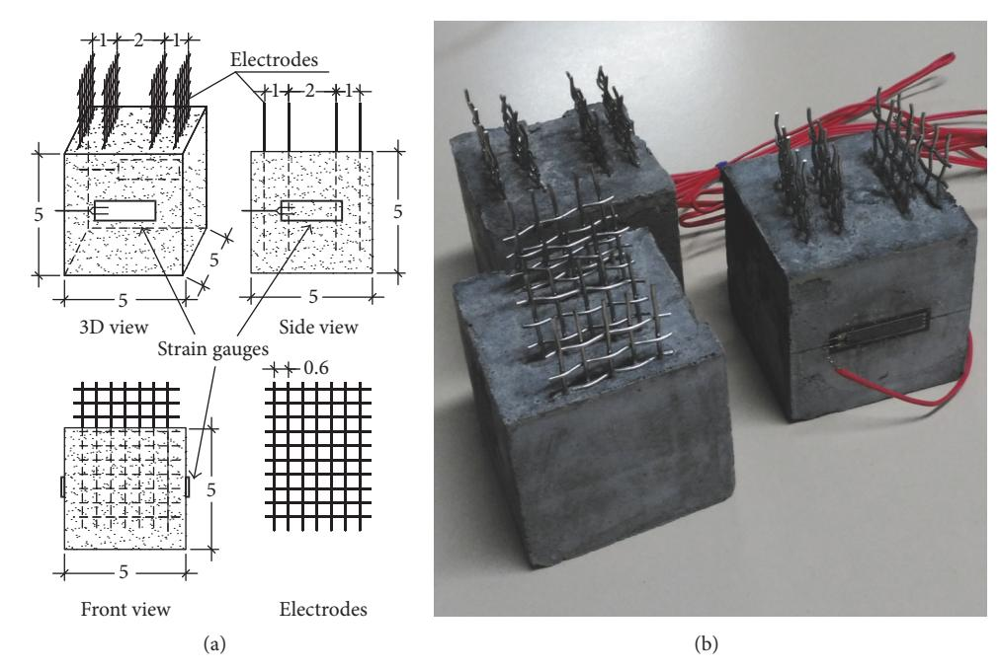

Figure 1: Geometry of the samples and electrodes (dimension in cm) (a); picture of the fabricated samples with strain gauges installed onto lateral surfaces (b).

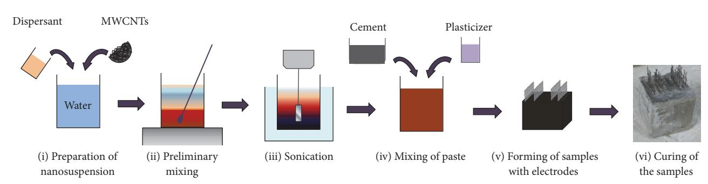

Figure 2: Preparation process of the cement paste samples with 1% of MWCNTs.

where  $V$  and  $I$  are the applied constant voltage and current,  $V(t)$  and  $I(t)$  are the measured variations of voltage and current intensity over time, and  $t_p$  is the polarization time.

#### *3.2. Electromechanical Tests.* Axial compression tests were

conducted to assess the strain-sensing capability and repeatability of the measurements taken from the cement paste samples. Cyclical and dynamic axial compression tests were performed on the ten sensors using the chassis NI PXIe-1073 for data acquisition. The chassis was equipped with three modules: the electric power generator, the multimeter used for the electrical tests, and the data acquisition system for the strain gauges, model PXIe-4330, 8 channels, 24-bit resolution, 25 kHz maximum sampling rate, antialiasing filters. The compression loads were applied using a servo-controlled pneumatic universal dynamic testing machine, model IPC Global UTM14P, with a controlled temperature chamber. For the electrical tests, both two-probe and four-probe measurement configurations were conducted at a controlled temperature of 20°C.

The cyclical loads varied from 0.5 to 2.0 kN with a 1 kN/s constant speed, while the dynamic loads varied from 0.5 to 1.5 kN with sinusoidal waveforms of increasing frequencies from 0.25 to 8.0 Hz. Each sensor was subjected to polarization for 10 minutes, applying a voltage of 5 V, before both types of electromechanical tests.

As for the electrical tests, in the two-probe configuration, the sensors were subjected to an electrical voltage equal to 5 V with a current measurement range equal to 1.0 mA, using internal electrodes for current measurement, while in the four-probe configuration a current of 15 mA with a voltage measurement range of 10 V was applied to the external electrodes and voltage drop was measured across the internal ones. The electrical measurements were carried out with a sample rate of 1000 Hz. In both cases, the resistance time series were derived using the first Ohm's law.

Figure [3](#page-3-1) shows the setup of the electromechanical dynamic tests for the two-probe configuration: the power source and the data acquisition system for the electrical measurements and the strain gauges (Figure [3\(](#page-3-1)a)), an

{3}------------------------------------------------

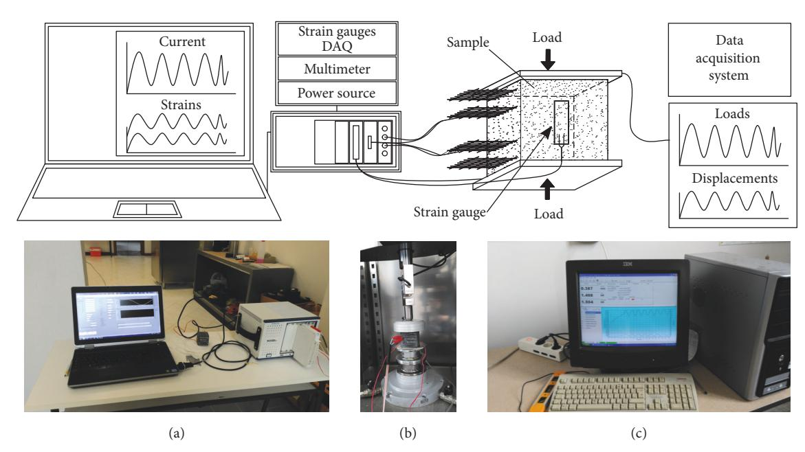

FIGURE 3: Sketch and pictures of the setup for the electromechanical tests on the cement-based samples with carbon nanotubes: power source and device for acquisition of strain gauges and electrical measurements (a); a sample during test (b); data acquisition system of the hydraulic actuator (c).

instrumented sample placed in the chamber with controlled temperature (Figure 3(b)), and the data acquisition system of the pneumatic testing machine, for loads and displacements (Figure 3(c)).

The gauge factor  $\lambda$  of the cement-based sensors with carbon nanotubes was calculated using the following equation:

$$\frac{\Delta R}{R_0} = -\lambda \epsilon, \quad (3)$$

where  $\Delta R$  is the incremental variation in electrical resistance,  $R_0$  is the unstrained electrical resistance, and  $\varepsilon$  is the axial strain (positive in compression).

**3.3. Full-Scale Tests.** The CNTCSs used for the full-scale tests were the same as the ones used for the electromechanical tests. The electrical outputs of the sensors and of the strain gauges were acquired using the 2-probe configuration with coaxial cables to highly reduce measurement noise [31]. Sensors previously tested were embedded in a full-scale reinforced beam during its molding. The midspan sample was instrumented for the measurements. The beam had a square cross section of  $25 \times 25 \text{ cm}^2$  and a length of 220 cm. It was simply supported by two steel supports installed at a distance of 200 cm. The beam was reinforced with 8 mm diameter longitudinal steel bars and stirrups as shown in Figure 4(a). Figure 4(b) shows the reinforced beam with the embedded sensors after 28 days of curing. A detailed view of a single cementitious sensor with carbon nanotubes is shown in Figure 4(c). Tests involving static loads and vibrations were performed after polarization of thirty minutes, applying a distributed static load of approximately 1 kN/m and random hits in time and space using an instrumented hammer, respectively. During the tests, a voltage of 2.5 V was provided

to the sensor, with a current measurement range equal to 1.0 mA. The sampling rate was 1000 Hz.

#### **4. Results and Discussion**

**4.1. Electrical Tests.** Figure 5 reports the electrical output of the ten cement-based sensors with carbon nanotubes obtained through the two-probe (Figure 5(a)) and the four-probe (Figure 5(b)) methods. The resistances obtained using 2-probe and 4-probe configurations had an average value of 609  $\Omega$  and 215  $\Omega$ , respectively, with corresponding coefficients of variation of 0.16 and 0.24. The lower values of resistance obtained through the 4-probe method are due to the particular electrical configuration that removes the electrical contact resistance [33]. Results demonstrate satisfactory repeatability of the electrical resistance of the sensors, particularly for the 2-probe method, whereby the obtained coefficient of variation is very similar to the coefficient of variation of other properties of concrete-like materials, such as its compressive strength [34]. The scatter of resistance values within the considered set of nominally identical sensors is conceivably due to the heterogeneous nature of the composites and to different degrees of uniformity of nanofillers dispersion, which cannot guarantee a perfect homogeneity.

**4.2. Electromechanical Tests.** Electromechanical tests were conducted applying both cyclical and dynamic compressive loads (Figure 6) adopting both the 2-probe and the 4-probe configurations. Figures 7 and 8 report the time histories of the average strain,  $\varepsilon(t)$ , measured by the strain gauges and of the normalized resistance,  $\Delta R(t)/R_0$ , as obtained under cyclical and dynamic tests, respectively, for one specific sample in the 4-probe configuration. As shown in these figures, the

{4}------------------------------------------------

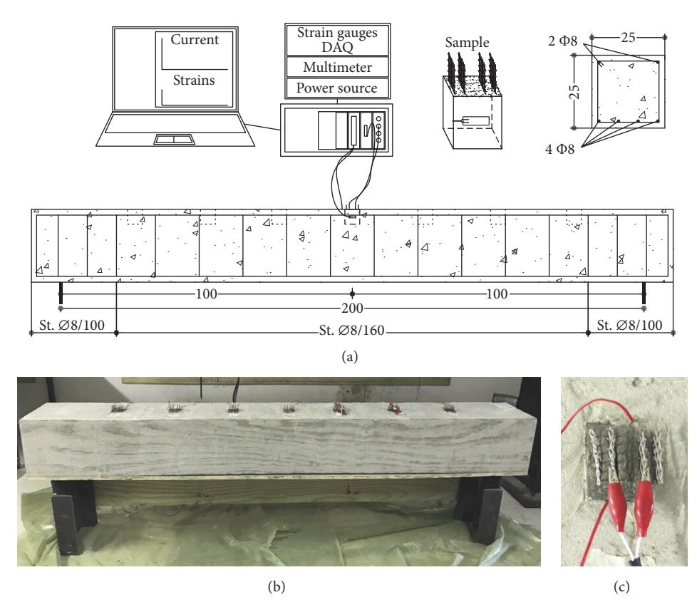

Figure 4: Sketch of the full-scale beam test setup (a); picture of the beam with the embedded sensors (b); detailed view of the sensors at the midspan (c).

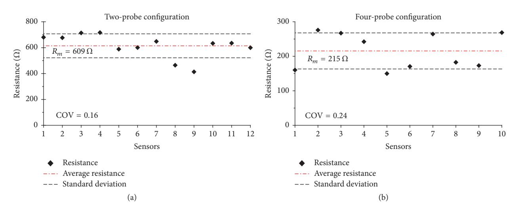

Figure 5: Results of the electrical measurements conducted on all of the CNCTSs (COV denotes the coefficient of variation) using two-probe (a) and four-probe (b) methods.

application of compression loads induced negative changes in electrical resistance,  $\Delta R(t)$ , in the sensors, due to an average reduction in the distance between nanotubes. This change in resistance was fully reversible, whereby a reduction in compressive load resulted in an increase of resistance that recovered from the previous decrease. All the graphs show a clear strain sensitivity of the sensors and a very low value

of noise. The gauge factors of the sensors were calculated considering the average resistance variation of each sample for all the different load frequencies. Figures [9](#page-5-3) and [10](#page-6-0) show the variation of GF and of the normalized change in resistance with increasing load frequencies (0.25, 0.5, and 1 Hz and from 2 to 8 Hz with steps of 2 Hz) using the 2-probe and the 4 probe methods, respectively. These curves can be considered

{5}------------------------------------------------

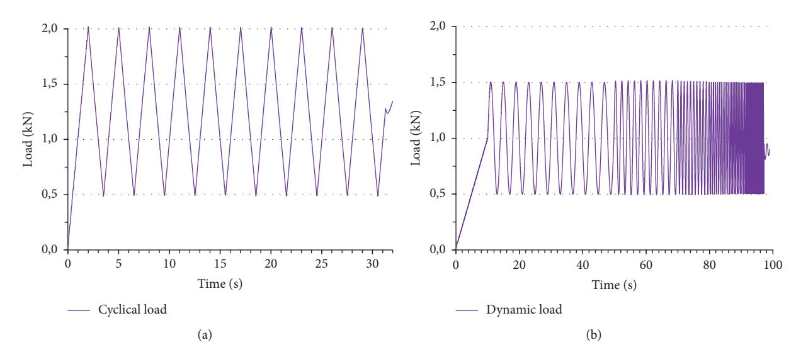

Figure 6: Applied cyclical (a) and dynamic (b) uniaxial loads for electromechanical tests.

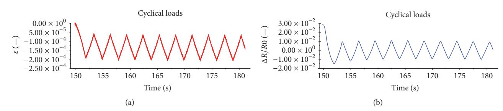

Figure 7: Results of electromechanical tests: measured average strain (a) and normalized variation of electrical resistance (b) on sample number 6 (typical) using the four-probe method under cyclical loads.

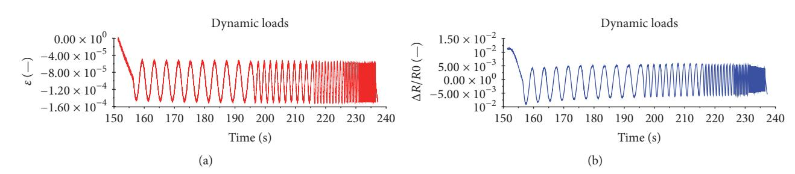

Figure 8: Results of electromechanical tests: measured average strain (a) and normalized variation of electrical resistance (b) on sample number 6 (typical) using the four-probe method under dynamic loads.

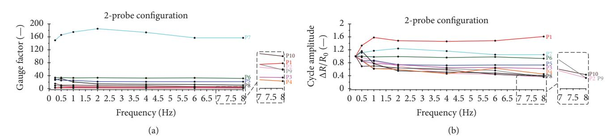

Figure 9: Plots of GFs (a) and of normalized resistance variation (b) with increasing frequency of applied load using the two-probe method.

{6}------------------------------------------------

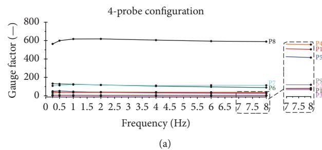

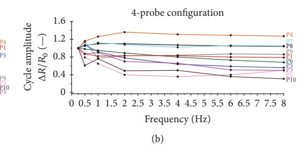

Figure 10: Plots of GF (a) and of normalized resistance variation (b) with increasing frequency of applied load using the four-probe method.

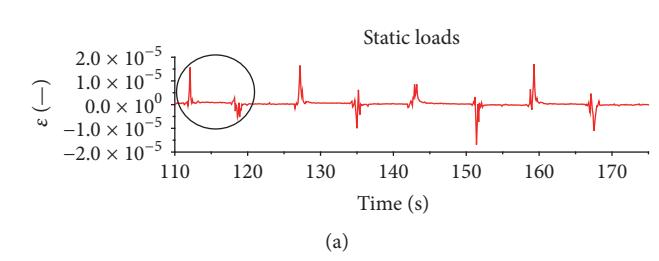

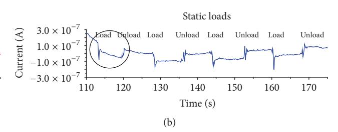

Figure 11: Time histories of average strain (a) and measured electrical current (b) during static loading and unloading of the full-scale reinforced beam.

as frequency response functions of the sensors and can be used to assess dynamic linearity in the investigated range of mechanical frequencies, whereby an ideally linear dynamic sensor would have a perfectly horizontal frequency response function.The presented results show that both two-probe and four-probe configurations yield similar results and highlight similar sensing behavior of the samples. It is noted, however, that GF values are remarkably more scattered than values of the unstrained electrical resistance, with a coefficient of variation of 1.72 and 1.79 for the 2-probe and 4-probe methods, respectively. This entails that each sensor needs to be individually calibrated before embedding, particularly if the precise values, and not only the waveforms, of strains are needed in the monitoring task. This scatter in the GF values can be attributed to the proximity of the 1% MWCNTs mix with the percolation threshold. Previous theoretical work by the authors [\[35,](#page-10-0) [36\]](#page-10-1) demonstrated that the GF is maximum, close to the percolation threshold [\[24](#page-9-13)], but is also very sensitive to small changes in the materials' parameters and to small changes in the nanofiller dispersion quality. Figures [8](#page-5-2) and [9](#page-5-3) also show an acceptable linearity of the outputs of the sensors, especially at higher frequencies, even if some samples exhibited an increasing frequency response function and others a decreasing frequency response function.

*4.3. Full-Scale Tests.* After the characterization of the single sensors, seven samples were embedded in a reinforced concrete beam for the full-scale experiment. First, static loads were applied on top of the beam. Then, vibration tests were performed. Figure [11](#page-6-1) plots the average strain measured through the electric strain gauges and the electrical current outputted by the embedded sample located at midspan under static loads. Loading and unloading of the beam are clearly visible in the time history of strain as well as in the time history of the output of the embedded sensor. The embedded sensor also clearly identifies the changes in strain occurring in the compression zone of the beam during the four applications of the static load.

In order to further the understanding of the strainsensing capabilities of the embedded nanocomposite sensors, vibration tests were carried out by randomly hitting the beam with a hammer. Figure [12](#page-7-0) shows the time history of the electrical current obtained through CNTCS sample number 6 placed at midspan whereby the signal has been filtered with a high-pass filter with a cutoff frequency of 5 Hz in order to eliminate the residual drift due to the polarization effect. The hammer hits show clearly in Figure [12\(a\).](#page-7-1) Figure [12\(b\)](#page-7-2) reports a detailed view of a single hammer hit, showing the waveform of the damped vibration of the beam.

The sensing capability of the embedded sensors was also analyzed through the comparison of the strain measured by strain gauges and the strain computed from the outputs of the cementitious samples. Figure 13(a) plots the overlapped filtered time histories obtained from the tests on the embedded sample at midspan. The measured strain is the average of the output of the two strain gauges placed on the lateral sides of the sample, while the estimated strain of the sensor  $\epsilon_{\text{sensor}}$  is calculated using (3). The results shown in Figure 13 demonstrate a very good correspondence between measured and estimated strains. The small difference between the two quantities is explained by the CNTCS measuring an average strain in its volume, while the strain gauges measure strain on the lateral surfaces of the sensor at a fixed depth from the top of the beam. The good agreement between CNTCS and strain gauges is especially observable in the detailed views of Figures 13(b) and 13(c). It is worth noting that measured strains are very small and, in particular, of the order of a few tens of microstrains. This level of strain corresponds to two

{7}------------------------------------------------

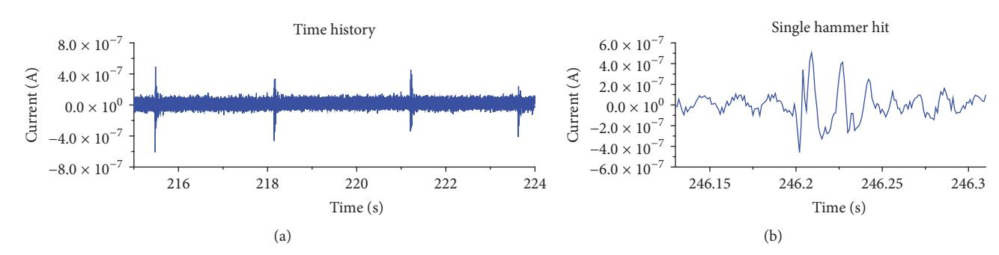

FIGURE 12: Section of the time history of the current during vibration tests (a) and detailed view of the output of a single hammer hit (b).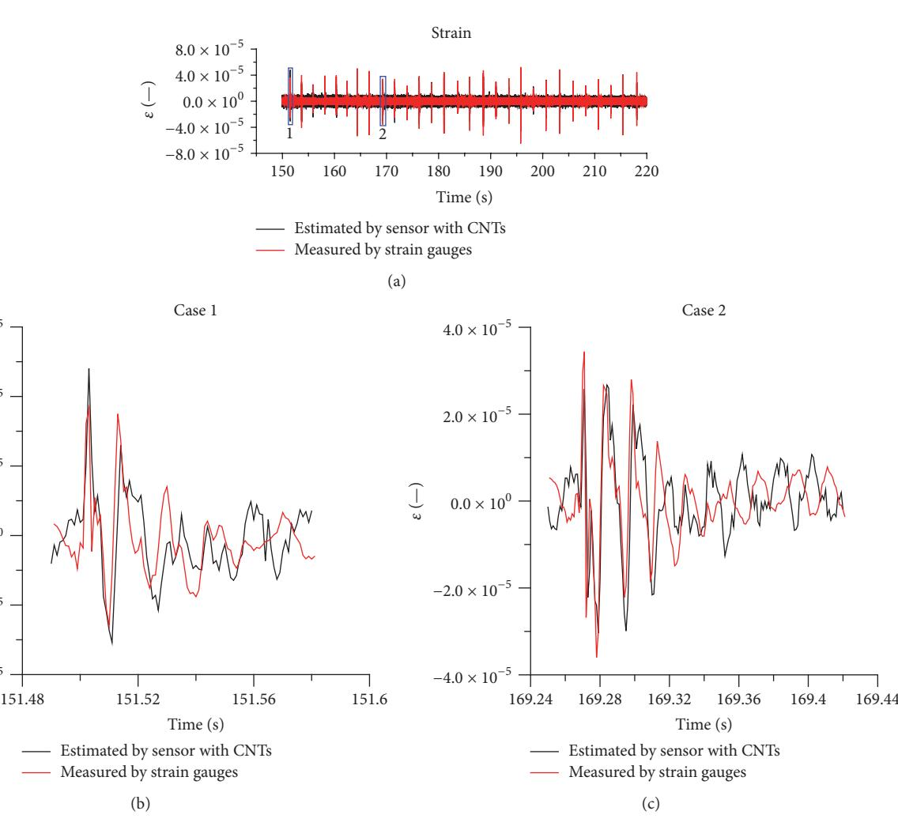

 $-4.0 \times 10^{-5}$ 

 $-2.0 \times 10^{-5}$ 

$$0.0 \times 10^0$$
 $2.0 \times 10^{-5}$ 

$$4.0 \times 10^{-5}$$
6.0 × 10−5

1. ↑

Case 2

Time (s)

FIGURE 13: Time histories of measured average strain from strain gauges and estimated strain from electrical measurements (a); enlarged view of measurements number 1 (b) and number 2 (c).

orders of magnitude less than the ultimate compressive strain of concrete. This result demonstrates that the embedded CNTCS can be used to monitor strain conditions within full-scale RC structures.

A spectral analysis of the strain gauges outputs and CNTCS as obtained in the vibration test was conducted in order to verify the potential of using the smart sensors for output-only modal identification and vibration-based SHM

of RC structures. Figure 14 shows the Power Spectral Density (PSD) functions of the acquired signals and, in particular, of the average strain measured through the two strain gauges applied on the embedded sample at midspan (Figure 13(a)) and of the electrical output of the same sensor (Figure 13(b)), after high-pass filtering both signals above 5 Hz. Both PSD functions shown in Figure 13 exhibit the same leading peak at a frequency of 64.45 Hz, conceivably associated with the

{8}------------------------------------------------

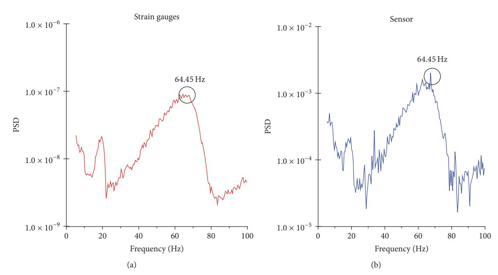

Figure 14: PSD of strain gauges measurements (a) and of electrical measurements (b) from the embedded sample placed at midspan.

first vertical mode of the beam, thus confirming the feasibility of using embedded CNTCS for dynamic monitoring and output-only modal identification of RC structures.

### **5. Conclusions**

The paper has presented an experimental research work on the use of cement-based sensors doped with multiwalled carbon nanotubes as smart embedded strain sensors for static and dynamic monitoring of reinforced concrete components. The experimental campaign started from the electrical and electromechanical characterization of a meaningful number of samples in order to investigate the repeatability and accuracy of sensors' behavior in unloaded conditions, as well as under the application of both static and dynamic mechanical loads. The frequency response functions, in particular, demonstrated a certain degree of linearity of the outputs of the sensors in the range from 0 to 8 Hz, although some scatter of the gauge factor was evidenced where the coefficient of variation was more than 1.7. After this preliminary characterization phase, the sensors were embedded at the top of a full-scale reinforced concrete beam. After curing, the beam was subjected to both static and dynamic impulse loads and the behavior of the novel nanomodified cement-based sensors was investigated by benchmarking their outputs against the outputs of traditional strain gauges. The novel cement-based sensors were observed to be able to (i) allow clear detection of static loads acting on the beam, (ii) provide accurate strain measurements, including strains caused by impulsive dynamic loads in the range of a few tens of microstrains, corresponding to two orders of magnitude below the ultimate compressive strain of concrete, and (iii) provide dynamic strain measurements allowing the identification of the natural frequencies of vibration of the

beam. Overall, the results presented in the paper further knowledge on the use of cementitious strain sensors doped with carbon nanotubes for the monitoring of reinforced concrete structural components, while also demonstrating the critical need to calibrate the sensor.

## **Conflicts of Interest**

The authors declare that there are no conflicts of interest regarding the publication of this paper.

#### **Acknowledgments**

This work was partially supported by Regione Umbria, within POR Umbria ESF 2007e2013, Axis II Employability-Objective and Axis IV Human-Capital Objective l, and by the Ministerio de Econom´ıa y Competitividad of Spain under Project DPI2014-53947-R. Enrique Garc´ıa-Mac´ıas was also supported by a FPU contract fellowship from the Spanish Ministry of Education (Ref. FPU13/04892). The support of the Italian Ministry of Education, University and Research (MIUR) through the funded project of relevant national interest "SMART-BRICK: Novel Strain-Sensing Nanocomposite Clay Brick Enabling Self-Monitoring Masonry Structures" is also gratefully acknowledged.

## **References**

[1] J. M. W. Brownjohn, "Structural health monitoring of civil infrastructure," *Philosophical Transactions of the Royal Society A*, vol. 365, no. 1851, pp. 589–622, 2007. [2] S. Laflamme, L. Cao, E. Chatzi, and F. Ubertini, "Damage detection and localization from dense network of strain sensors," *Shock and Vibration*, vol. 2016, Article ID 2562949, 13 pages, 2016.

{9}------------------------------------------------

- [3] F. Magalhaes, A. Cunha, and E. Caetano, "Vibration based ˜ structural health monitoring of an arch bridge: from automated OMA to damage detection," *Mechanical Systems and Signal Processing*, vol. 28, pp. 212–228, 2012. [4] V. Mosquera, A. W. Smyth, and R. Betti, "Rapid evaluation and damage assessment of instrumented highway bridges," *Earthquake Engineering and Structural Dynamics*, vol. 41, no. 4, pp. 755–774, 2012. [5] S. Laflamme, F. Ubertini, H. Saleem et al., "Dynamic characterization of a soft elastomeric capacitor for structural health monitoring," *Journal of Structural Engineering*, vol. 141, no. 8, 2015. [6] G. Y. Li, P. M. Wang, and X. Zhao, "Pressure-sensitive properties and microstructure of carbon nanotube reinforced cement composites," *Cement and Concrete Composites*, vol. 29, no. 5, pp. 377–382, 2007. [7] M. S. Konsta-Gdoutos and C. A. Aza, "Self sensing carbon nanotube (CNT) and nanofiber (CNF) cementitious composites for real time damage assessment in smart structures," *Cement and Concrete Composites*, vol. 53, pp. 162–169, 2014. [8] O. Galao, F. J. Baeza, E. Zornoza, and P. Garces, "Strain and dam- ´ age sensing properties on multifunctional cement composites with CNF admixture," *Cement and Concrete Composites*, vol. 46, pp. 90–98, 2014. [9] C. Camacho-Ballesta, E. Zornoza, and P. Garces, "Performance ´ of cement-based sensors with CNT for strain sensing,"*Advances in Cement Research*, vol. 28, no. 4, pp. 274–284, 2016. [10] Y. Ding, Z. Chen, Z. Han, Y. Zhang, and F. Pacheco-Torgal, "Nano-carbon black and carbon fiber as conductive materials for the diagnosing of the damage of concrete beam," *Construction and Building Materials*, vol. 43, pp. 233–241, 2013. [11] F. Azhari and N. Banthia, "Cement-based sensors with carbon fibers and carbon nanotubes for piezoresistive sensing," *Cement and Concrete Composites*, vol. 34, no. 7, pp. 866–873, 2012. [12] S. Wen and D. D. L. Chung, "Partial replacement of carbon fiber by carbon black in multifunctional cement-matrix composites," *Carbon*, vol. 45, no. 3, pp. 505–513, 2007. [13] X. Yu and E. Kwon, "A carbon nanotube/cement composite with piezoresistive properties," *Smart Materials and Structures*, vol. 18, no. 5, Article ID 055010, 2009. [14] K. J. Loh and J. Gonzalez, "Cementitious composites engineered with embedded carbon nanotube thin films for enhanced sensing performance," *Journal of Physics: Conference Series*, vol. 628, no. 1, Article ID 012042, 2015. [15] A. L. Materazzi, F. Ubertini, and A. D'Alessandro, "Carbon nanotube cement-based transducers for dynamic sensing of strain," *Cement and Concrete Composites*, vol. 37, no. 1, pp. 2– 11, 2013. [16] B. Han, X. Yu, and J. Ou, "Multifunctional and smart nanotube reinforced cement-based materials," in *In Nanotechnology in Civil Infrastructure. A Paradigm shift*, K. Gipalakrishnan, B. Birgisson, P. Taylor, and N. Attoh-Okine, Eds., pp. 1–48, Springer, 2011. [17] B. Han, X. Yu, and E. Kwon, "A self-sensing carbon nanotube/ cement for traffic monitoring," *Nanotechnology*, vol. 2, 2009. [18] B. Han, Y. Wang, S. Dong et al., "Smart concretes and structures: a review," *Journal of Intelligent Material Systems and Structures*, vol. 26, no. 11, pp. 1303–1345, 2015. [19] B. Han, S. Ding, and X. Yu, "Intrinsic self-sensing concrete and structures: a review," *Measurement*, vol. 59, pp. 110–128, 2015. [20] Z. H. Zhu, "Piezoresistive strain sensors based on carbon nanotube networks: Contemporary approaches related to electrical conductivity," *IEEE Nanotechnology Magazine*, vol. 9, no. 2, pp. 11–23, 2015. [21] S. Wansom, N. J. Kidner, L. Y. Woo, and T. O. Mason, "ACimpedance response of multi-walled carbon nanotube/cement composites," *Cement and Concrete Composites*, vol. 28, no. 6, pp. 509–519, 2006. [22] L. Coppola, A. Buoso, and F. Corazza, "Electrical properties of carbon nanotubes cement composites for monitoring stress conditions in concrete structures,"*Applied Mechanics and Materials*, vol. 82, pp. 118–123, 2011. [23] C. Rainieri, Y. Song, G. Fabbrocino, J. S. Mark, and V. Shanov, "CNT-cement based composites: Fabrication, selfsensing properties and prospective applications to Structural Health Monitoring," in *Proceedings of the 4th International Conference on Smart Materials and Nanotechnology in Engineering, SMN 2013*, aus, July 2013. [24] A. D'Alessandro, M. Rallini, F. Ubertini, A. L. Materazzi, and
  - J. M. Kenny, "Investigations on scalable fabrication procedures for self-sensing carbon nanotube cement-matrix composites for SHM applications," *Cement and Concrete Composites*, vol. 65, pp. 200–213, 2016. [25] J. Hilding, E. A. Grulke, Z. G. Zhang, and F. Lockwood, "Dispersion of carbon nanotubes in liquids," *Journal of Dispersion Science and Technology*, vol. 24, no. 1, pp. 1–41, 2003. [26] J. Luo, Z. Duan, T. Zhao, and Q. Li, "Hybrid effect of carbon fiber on piezoresistivity of carbon nanotube cement-based composite," *Advanced Materials Research*, vol. 143-144, pp. 639–643, 2011. [27] F. Ubertini, S. Laflamme, and A. D'Alessandro, "Smart cement paste with carbon nanotubes," *Innovative Developments of Advanced Multifunctional Nanocomposites in Civil and Structural Engineering*, pp. 97–120, 2016. [28] B. Han and J. Ou, "Embedded piezoresistive cement-based stress/strain sensor," *Sensors and Actuators A: Physical*, vol. 138, no. 2, pp. 294–298, 2007. [29] F. Ubertini, S. Laflamme, H. Ceylan et al., "Novel nanocomposite technologies for dynamic monitoring of structures: A comparison between cement-based embeddable and soft elastomeric surface sensors," *Smart Materials and Structures*, vol. 23, no. 4, Article ID 045023, 2014. [30] T.-C. Hou and J. P. Lynch, "Conductivity-based strain monitoring and damage characterization of fiber reinforced cementitious structural components," in *Proceedings of the Smart Structures and Materials 2005 - Sensors and Smart Structures Technologies for Civil, Mechanical, and Aerospace Systems*, pp. 419–429, usa, March 2005. [31] F. Ubertini, A. L. Materazzi, A. D'Alessandro, and S. Laflamme, "Natural frequencies identification of a reinforced concrete beam using carbon nanotube cement-based sensors," *Engineering Structures*, vol. 60, pp. 265–275, 2014. [32] A. D'Alessandro, F. Ubertini, A. L. Materazzi, S. Laflamme, and M. Porfiri, "Electromechanical modelling of a new class of nanocomposite cement-based sensors for structural health monitoring," *Structural Health Monitoring*, vol. 14, no. 2, pp. 137–147, 2015. [33] S. Wen and D. D. L. Chung, "Piezoresistivity-based strain sensing in carbon fiber-reinforced cement," *ACI Materials Journal*, vol. 104, no. 2, pp. 171–179, 2007. [34] NTC2008 Technical code for construction, DM 14 January 2008.

{10}------------------------------------------------

[35] E. Garc ´ıa-Mac ´ıas, A. D'Alessandro, R. Castro-Triguero, D. Perez-Mira, and F. Ubertini, "Micromechanics modeling of the ´ electrical conductivity of carbon nanotube cement-matrix composites," *Composites Part B: Engineering*, vol. 108, pp. 451–469, 2017. [36] E. Garc ´ıa-Mac ´ıas, A. D'Alessandro, R. Castro-Triguero, D. Perez-Mira, and F. Ubertini, "Micromechanics modeling of the ´ uniaxial strain-sensing property of carbon nanotube cementmatrix composites for SHM applications," *Composite Structures*, vol. 163, pp. 195–215, 2017.

{11}------------------------------------------------

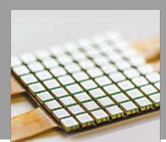

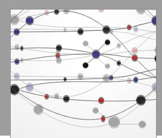

