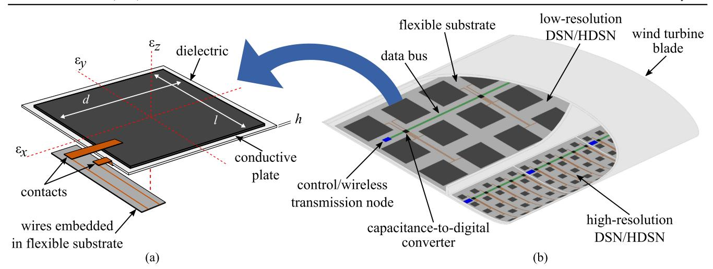
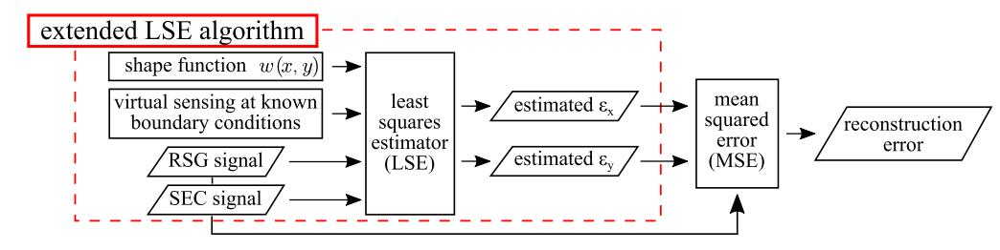
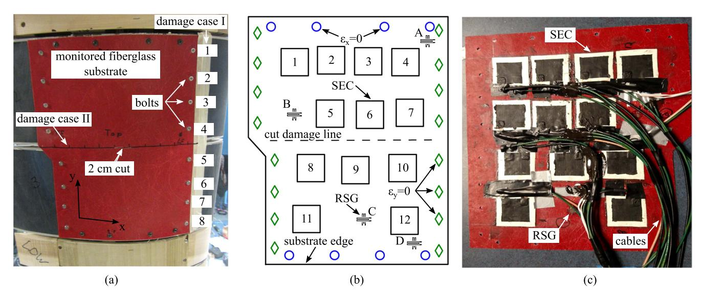
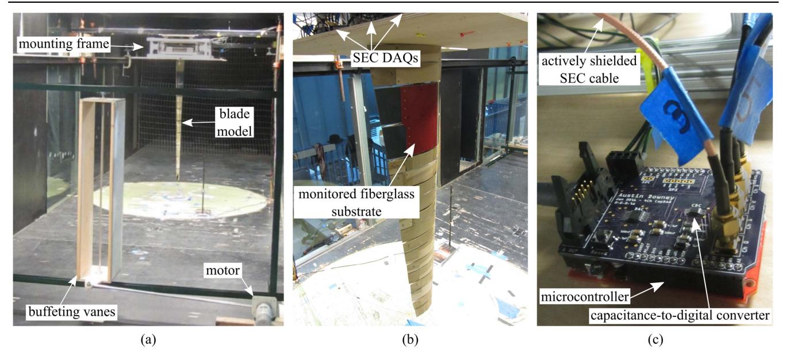
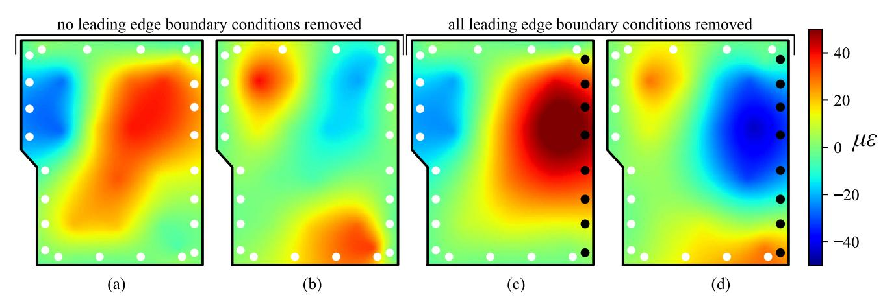
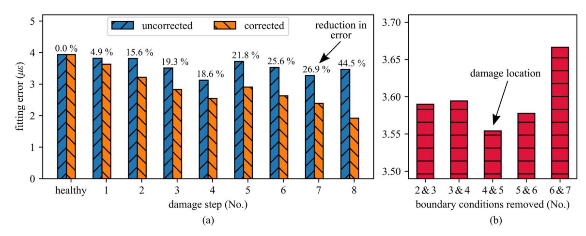
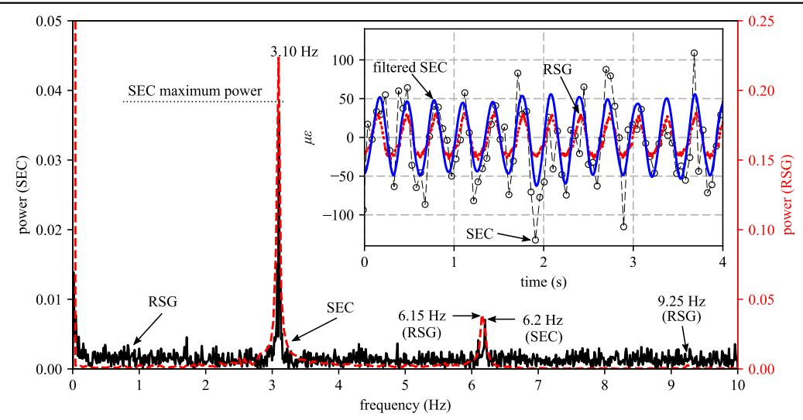
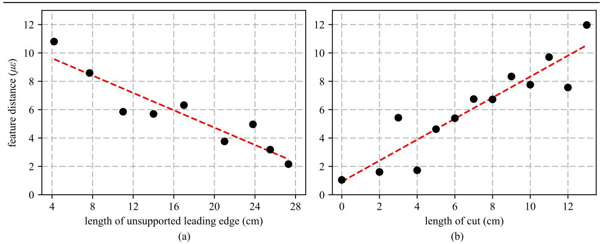

{0}------------------------------------------------

# Experimental wind tunnel study of a smart sensing skin for condition evaluation of a wind turbine blade

Austin Downey[1](https://orcid.org/0000-0002-5524-2416) , Simon Laflamme[1](https://orcid.org/0000-0002-0601-9664) and Filippo Ubertini[2](https://orcid.org/0000-0002-5044-8482)

1 Department of Civil, Construction, and Environmental Engineering, Iowa State University, Ames, IA, United States of America

2 Department of Civil and Environmental Engineering, University of Perugia, Italy

E-mail: [adowney2@iastate.edu](mailto:adowney2@iastate.edu)

Received 27 June 2017, revised 20 September 2017

Accepted for publication 13 October 2017

Published 30 October 2017

## Abstract

Condition evaluation of wind turbine blades is difficult due to their large size, complex geometry and lack of economic and scalable sensing technologies capable of detecting, localizing, and quantifying faults over a blade's global area. A solution is to deploy inexpensive large area electronics over strategic areas of the monitored component, analogous to sensing skin. The authors have previously proposed a large area electronic consisting of a soft elastomeric capacitor (SEC). The SEC is highly scalable due to its low cost and ease of fabrication, and can, therefore, be used for monitoring large-scale components. A single SEC is a strain sensor that measures the additive strain over a surface. Recently, its application in a hybrid dense sensor network (HDSN) configuration has been studied, where a network of SECs is augmented with a few off-the-shelf strain gauges to measure boundary conditions and decompose the additive strain to obtain unidirectional surface strain maps. These maps can be analyzed to detect, localize, and quantify faults. In this work, we study the performance of the proposed sensing skin at conducting condition evaluation of a wind turbine blade model in an operational environment. Damage in the form of changing boundary conditions and cuts in the monitored substrate are induced into the blade. An HDSN is deployed onto the interior surface of the substrate, and the blade excited in a wind tunnel. Results demonstrate the capability of the HDSN and associated algorithms to detect, localize, and quantify damage. These results show promise for the future deployment of fully integrated sensing skins deployed inside wind turbine blades for condition evaluation.

Keywords: structural health monitoring, capacitive-based sensor, soft elastomeric capacitor, flexible membrane sensor, sensor network, damage detection, damage localization

(Some figures may appear in colour only in the online journal)

# 1. Introduction

The profitability of industrial-scale wind energy projects is challenging due to their reliance on public subsidies, unpredictable energy source, and reliable technology. Additionally, varying operation and maintenance (O&M) costs add complexity and uncertainty to the management of wind energy projects [[1](#page-9-0)]. To achieve an increase in wind turbine system reliability and therefore decrease costs related to wind energy production, an O&M approach that utilizes condition-based maintenance (CBM) should be implemented [[2,](#page-10-0) [3](#page-10-0)]. The use of CBM is even more important for offshore farms where O&M costs may be up to three times higher than that of land-based systems [[4](#page-10-0)], due largely to higher transportation and site access costs [[5](#page-10-0)]. The current state of condition monitoring of wind turbine blades consists mainly of vibrations, and visual analyses [[2,](#page-10-0) [6](#page-10-0)]. Recently, interest has grown in the use of structural health monitoring (SHM) for the condition assessment of wind turbine blades, towers and other structural components due to their high replacement cost [[4](#page-10-0), [7](#page-10-0)], effect 

{1}------------------------------------------------

on system availability [[5](#page-10-0)], and maintenance complexity [[8](#page-10-0)]. Monitoring the mesostructures of wind turbines (e.g., towers and blades) is difficult due to the need to distinguish between faults in the structure's global (e.g. changing load paths, loss in global stiffness) and local (e.g. crack propagation, composite delamination) conditions [[9](#page-10-0)]. Recent attempts for the SHM of wind turbine blades have used a limited number of sensors and have applied a variety of post-processing techniques (e.g. statistical and modal-based) to localize damage [[10](#page-10-0), [11](#page-10-0)]. However, this approach lacks the capability to distinguish local failures from global events and has demonstrated a limited effectiveness at damage localization [[6,](#page-10-0) [12](#page-10-0)].

A solution to this local/global detection problem is to deploy a dense sensor network (DSN) inside the component that is capable of detecting local faults. These integrated sensing skins mimic biological skin in that they are capable of detecting and localizing damage over the blade's global area and with the objective to enable low-cost, direct sensing of large-scale structures. Sensing skins can be made of large area electronics [[13](#page-10-0)] or of rigid or semi-rigid cells mounted on a flexible sheet [[14](#page-10-0)]. Early work in the field of sensing skins consisted of capacitive- [[15](#page-10-0)] and resistance- [[16](#page-10-0)] based tactile force sensors. More recently, sensing skins with piezoceramic transducers (PZT) and receivers built into a flexible skin have been proposed [[17](#page-10-0)]. In certain cases, sensing skins with the integrated electronics for data acquisition (DAQ) and signal processing mounted directly onto the skin have been developed [[18](#page-10-0), [19](#page-10-0)]. Various researchers have proposed and experimentally validated sensing skin-type solutions for wind turbine blades. For instance, Song et al demonstrated through experimental validation in a wind tunnel that a network of PZT sensors can be used to detect damage in wind turbine blades [[20](#page-10-0)]. Schulz et al proposed the use of series-connected PZT nodes for the continuous monitoring of wind turbine blades, allowing for a finer localization of damage [[17](#page-10-0)]. Simulations were used to show that an array of these sensors, deployed on a 2D plate, could be used to detect and localize damage. Ryu et al demonstrated a self-sensing thin film fabricated from poly(3-hexylthiophene)(P3HT) and multiwalled carbon nanotubes that is capable of monitoring strain through the photocurrent generated by the photoactive nanocomposite [[21](#page-10-0)]. These sensors are capable of generating their own power, therefore eliminating their need for external power sources. Rumsey et al deployed a number of SHM systems on the outside of an experimental wind turbine blade at Sandia National Laboratories [[22](#page-10-0)]. Various sensor technologies were used, including PZT and strain-based sensors, to monitor the blade during a fatigue test. In general, successful damage detection was found to require an optimal sensor placement and synchronization of sampling between different sensor types.

In this work, the authors present the vision of a fully integrated DSN for the real-time SHM of wind turbine blades and experimentally validate a prototype skin that demonstrates the feasibility of the concept. This DSN consists of an inexpensive and robust large area electronic consisting of a highly elastic capacitor based on a styrene-co-ethylene-cobutylene-co-styrene (SEBS) block co-polymer. Termed the

soft elastomeric capacitor (SEC), the sensor is customizable in shape and size [23]. The SEC possesses the unique capability of measuring the substrate's additive strain ( $\varepsilon_x + \varepsilon_y$ ), and its static [24] and dynamic [25] behaviors have been well documented including numerical demonstrations for damage detection applications in wind turbine blades [26].

A particularly useful attribute of the SEC is its capability to measure additive in-plane strain. It follows that the signal must be decomposed into orthogonal directions in order to obtain unidirectional strain maps. A previously developed algorithm is used in this work to decompose the sensors' additive strain into estimated unidirectional strain maps [[27](#page-10-0)]. The algorithm, termed the extended least squares estimator (LSE) algorithm, leverages off-the-shelf sensors such as resistive strain gauges (RSGs), to form a hybrid DSN (HDSN). A deflection shape function for the monitored substrate is assumed along with boundary conditions (assumed or measured through the RSGs) and uses the LSE to solve for the shape function's coefficients. In this work, the reconstructed strain maps are inspected to investigate how damage induced into the monitored substrate changes the loading path of the blade. Thereafter, it is shown that damage in the form of leading edge faults (e.g. changing boundary conditions) can be localized through changing the assumed boundary conditions of the plate. Lastly, the quality of these unidirectional strain maps is measured in the form of a reconstruction error to develop a damage detecting feature for a predefined section of the HDSN [[28](#page-10-0)]. This network reconstruction feature (NeRF) algorithm allows the sensing skin to fuse the high-channel-count sensing skins data into a single damage detecting feature, therefore providing a high level of data compression and increasing the functionality of the proposed system.

This paper experimentally verifies the HDSN, deployed inside a model wind turbine blade excited by aerodynamic loading in a wind tunnel. The reported results are the first use of a large area electronic for damage detection in a wind turbine blade under aerodynamic loading. These tests validate the use of SECs in a wind turbine blade and demonstrate the potential utility of the concurrently proposed, fully integrated, SEC-based sensing skin. The contributions of this work are three-fold: (1) propose an integrated SEC-based sensing skin for the real-time SHM of wind turbine blades; (2) demonstrate the capability of the SECs to operate in the electromagnetically noisy environment of a wind tunnel, showing that the SEC would be capable of operating inside the similarly noisy environment of a wind turbine blade; (3) evaluate the HDSN data through previously developed algorithms showing that the SEC-based sensing skin is capable of detecting damage within an HDSN that is not directly monitored by an SEC.

# 2. Background on sensing skin

The SEC-based sensing skin is illustrated in figure [1,](#page-2-0) with the sketch of an individual SEC shown in figure [1](#page-2-0)(a). The fully integrated DSN system, as presented in figure [1](#page-2-0)(b), would

{2}------------------------------------------------

consist of SECs of varying geometries and densities along with the required electronics for power management, DAQs data processing, and communications, all mounted onto a flexible substrate (e.g. Kapton). The optimal placement of RSGs within a grid of SECs has been previously used by the authors to improve the accuracy of strain map reconstruction from SEC data [29]. These sensing skins would be deployed inside a wind turbine blade, either at the factory or in the field to monitor cases of interest, such as repair made at the root of a blade [8].

Data (capacitance) for a set of SECs in close proximity would be collected by a centrally located capacitance-to-digital converter, multiplexed to measure multiple SECs. These converters are located close to the SECs to allow for low noise measurements, while multiplexing allows the sensing skin to function with a reduced number of converters. Data would be transferred over a serial bus (e.g. CAN, I2C) to a control/wireless transmission node. This configuration allows multiple capacitance-to-digital converters per transmission node, therefore reducing the number of wireless channels needed. These control nodes collect, process, and parse the data for wireless transmission back to a wireless hub mounted inside the rotor hub. The use of wireless transmission nodes allows for the easy installation of a sensing skin, particularly in cases where a sensing skin is added to an inservice blade such as that needed to monitor a repair. Additionally, wireless transmission adds redundancy to the system when compared to a single serial bus being used to carry data over the entire length of the blade, a useful feature given the long service life of wind turbine blades. Power can be provided through a variety of methods, including energy harvesting (for sensing skins mounted inside a wind turbine blade), flexible solar cells embedded into the sensing skin (when mounted on the outside of a wind turbine blade) or batteries when only short-term monitoring is required.

In the rest of this section, the background on the SEC sensor is provided, which includes its electro-mechanical model, followed by a review of the extended LSE algorithm

and the NeRF algorithm for damage detection, localization, and quantification.

#### 2.1. Soft elastomeric capacitor (SEC)

The SEC used in the sensing skin is a robust large area electronic that is inexpensive, easy to fabricate, and customizable in shape and size. The sensor's fabrication procedure is described in [23]. Briefly, the sensor's dielectric is composed of a SEBS block co-polymer matrix filled with titania to increase both its durability and permittivity. Conductive plates are painted onto each side of the SEBS matrix using a conductive paint fabricated from the same SEBS, but filled with carbon black particles. Material, equipment and techniques used in the fabrication are readily available and the sensor's fabrication process is relatively simple, making the technology highly scalable.

The SEC transduces a change in a monitored substrate's geometry (i.e., strain) into a measurable change in capacitance. It is stretched during its application to enable tensile and compressive strain measurement and is adhered using commercial epoxy. Assuming a low sampling rate ( $< 1$  kHz), the SEC can be modeled as a non-lossy capacitor with capacitance  $C$  defined by the parallel plate capacitor equation,

$$C = e_0 e_r \frac{A}{h}, \quad (1)$$

where  $e_0 = 8.854 \text{ pF m}^{-1}$  is the vacuum permittivity,  $e_r$  is the polymer relative permittivity,  $A = d \cdot l$  is the sensor area of width  $d$  and length  $l$ , and  $h$  is the thickness of the dielectric as annotated in figure 1(a). Assuming small strain, an expression relating the sensor's change in capacitance to its signal can be expressed as [25]

$$\frac{\Delta C}{C} = \lambda(\varepsilon_x + \varepsilon_y), \quad (2)$$

where  $\lambda = 1/(1 - \nu)$  represents the gauge factor of the sensor, with  $\nu$  being the sensor material's Poisson ratio. For SEBS,  $\nu \approx 0.49$ , which yields a gauge factor  $\lambda \approx 2$ .

**Figure 1.** Conceptual layout of a fully integrated SEC-based sensing skin for a wind turbine blade: (a) SEC with connectors and annotated axis; and (b) proposed deployment inside a wind turbine blade.

{3}------------------------------------------------

Equation (2) shows that the signal of the SEC varies as a function of the additive strain  $\varepsilon_x + \varepsilon_y$ .

#### 2.2. Strain decomposition algorithm

The extended LSE algorithm was designed to decompose the SEC signal's additive strain measurement, as expressed in equation (2), by leveraging an HDSN configuration consisting of SECs and unidirectional strain sensors (e.g. RSGs). RSGs measure boundary conditions within the HDSN that can be used to increase the capability of the extended LSE algorithm to decompose strain maps. Boundary conditions on the edges of the structure are also introduced into the algorithm as virtual unidirectional sensors at locations where the unidirectional strain can be assumed within a high level of confidence. The extended LSE algorithm is presented in [27], diagrammed in the red dashed rectangle in figure 2, and summarized in what follows.

The extended LSE algorithm assumes a  $p$ th order polynomial displacement shape function ( $w$ ), selected due to its mathematical simplicity and its capability to develop a wide range of displacement topographies. The deflection  $w$  in the  $x$ - $y$  plane can be written

$$w(x, y) = \sum_{i=1, j=1}^p b_{ij} x^i y^j, \quad (3)$$

where  $b_{ij}$  are regression coefficients. Considering an HDSN with  $m$  sensors (SEC and RSGs in this case), displacement values at sensors locations can be collected in a vector  $\mathbf{W} \in \mathbb{R}^m$ . Equation (3) becomes

$$\mathbf{W} = [w_1 \quad \cdots \quad w_k \quad \cdots \quad w_m]^T = \mathbf{HB} \quad (4)$$

where the subscript  $k$  is associated with the  $k$ th sensor. Matrix  $\mathbf{H}$  contains sensor location information, and  $\mathbf{B}$  contains the  $f$  regression coefficients  $\mathbf{B} = \begin{bmatrix} b_1 & \cdots & b_f \end{bmatrix}^T$ .

Matrix  $\mathbf{H}$  is defined as  $\mathbf{H} = [\mathbf{\Gamma}_x \mathbf{H}_x | \mathbf{\Gamma}_y \mathbf{H}_y]$  where  $\mathbf{H}_x$  and  $\mathbf{H}_y$  account for the SEC's additive stream measurements, with  $\mathbf{\Gamma}_x$  and  $\mathbf{\Gamma}_y$  being diagonal weight matrices holding the scalar sensor weight values  $\gamma_{x,k}$  and  $\gamma_{y,k}$ . For instance, an RSG sensor  $k$  orientated so that it measures strain in the  $x$  direction will take the weight values  $\gamma_{x,k} = 1$  and  $\gamma_{y,k} = 0$ . Additionally, virtual sensors are used to enforce boundary conditions and are treated as RSG sensors with known signals, typically  $\varepsilon = 0$ . These virtual sensors are added into  $\mathbf{H}$  at locations where the boundary condition can be assumed to a high degree of certainty. The components of matrix  $\mathbf{H}$  can be

developed from equation (3):

$$\mathbf{H}_x = \mathbf{H}_y = \begin{bmatrix} y_1^n & x_1 y_1^{n-1} & \cdots & x_1^{n-1} y_1 & x_1^n \\ y_k^n & x_k y_k^{n-1} & \cdots & x_k^{n-1} y_k & x_k^n \\ y_m^n & x_m y_m^{n-1} & \cdots & x_m^{n-1} y_m & x_m^n \end{bmatrix}. \quad (5)$$

Using Kirchhoff's plate theory, unidirectional strain functions for  $\varepsilon_x$  and  $\varepsilon_y$  are obtained:

$$\varepsilon_x(x, y) = -\frac{c}{2} \frac{\partial^2 w(x, y)}{\partial x^2} = \Gamma_x \mathbf{H}_x \mathbf{B}_x, \quad (6)$$

$$\varepsilon_y(x, y) = -\frac{c}{2} \frac{\partial^2 w(x, y)}{\partial y^2} = \Gamma_y \mathbf{H}_y \mathbf{B}_y, \quad (7)$$

where  $c$  is the thickness of the plate and  $\mathbf{B} = [\mathbf{B}_x|\mathbf{B}_y]^T$ . Here,  $\mathbf{B}_x$  and  $\mathbf{B}_y$  hold the regression coefficients for strain components in the  $x$  and  $y$  directions, respectively.

A vector  $\mathbf{S} = [s_1 \quad \cdots \quad s_k \quad \cdots \quad s_m]^T$  containing the signal for each sensor in the HDSN is constructed from measurements with  $s_k = \varepsilon_x + \varepsilon_y$  for an SEC and  $s_k = \varepsilon_x$  or  $s_k = \varepsilon_y$  for an RSG. The regression coefficient matrix  $\mathbf{B}$  is estimated using the LSE:

$$\hat{\mathbf{B}} = (\mathbf{H}^T \mathbf{H})^{-1} \mathbf{H}^T \mathbf{S}, \quad (8)$$

where the hat denotes an estimation. It follows that the estimated strain maps can be reconstructed using

$$\hat{\mathbf{E}}_x = \mathbf{\Gamma}_x \mathbf{H}_x \hat{\mathbf{B}}_x \quad \hat{\mathbf{E}}_y = \mathbf{\Gamma}_y \mathbf{H}_y \hat{\mathbf{B}}_y, \quad (9)$$

where  $\hat{\mathbf{E}}_x$  and  $\hat{\mathbf{E}}_y$  are vectors containing the estimated strain in the  $x$  and  $y$  directions for sensors transducing  $\varepsilon_x(x, y)$  and  $\varepsilon_y(x, y)$ , respectively.

Without a sufficient number of unidirectional sensors in an HDSN, **H** will be multi-collinear because **H**x and **H**y will share multiple columns. This results in **H**T**H** being non-invertible. This is avoided by integrating a sufficient number of RSGs and virtual sensors into the HDSN.

#### 2.3. Network reconstruction feature (NeRF)

The NeRF algorithm [28] provides a method for damage detection and localization formulated for strain map measurements. It works through comparing the signal measured by an individual sensor with the estimated strain map (equation (9)) for a predefined HDSN. An error function defined as the mean square error between a sensor's measured and estimated strains can be used to associate a feature value with a given increase in the shape function's complexity ( $p$  in equation (3)). Consider an HDSN section similar to that

**Figure 2.** Network reconstruction feature (NeRF) algorithm, the previously developed extended LSE algorithm for strain map decomposition is enclosed inside the dashed red box.

{4}------------------------------------------------

shown in figure 1(b), consisting of a network of SECs in an array and a few optimally placed RSGs used at key locations. To establish the NeRF's theoretical foundation, we first consider an ideal situation where strain maps are easily approximated through the use of low order shape functions. The error in the approximation, calculated for the  $m$  sensors within the HDSN, can be quantified as:

$$V = \frac{1}{m} \sum_{k=1}^m (S_k - S'_k)^2, \quad (10)$$

where  $V$  is a scalar. For a given sensor location  $k$ ,  $S_k$  is the sensor signal, and  $S'_k$  is the estimated sensor signal using the reconstructed strain maps. The estimated sensor signals for RSG sensors measuring  $\varepsilon_x$  and  $\varepsilon_y$  are taken from  $\hat{\mathbf{E}}_x$  and  $\hat{\mathbf{E}}_y$ , respectively, while the estimated SEC signals are taken as the summation of  $\hat{\mathbf{E}}_x$  and  $\hat{\mathbf{E}}_y$  at given locations (equation (2)). The NeRF algorithm is diagrammed in figure 2, where the extended LSE algorithm used to develop the orthogonal strain maps is encapsulated inside the red dashed rectangle.

For an undamaged area of a structure, the strain field will have a simple strain topology, while damage will generally represent itself as a discontinuity in the surface's strain field which will develop a more complex strain topology. It follows that in general areas without damage, the strain field can be accurately estimated with low-order shape functions, while damaged areas will require higher-order shape functions to minimize reconstruction error. To quantify the level of strain map complexity in a section of the structure, and therefore whether it contains damage, NeRF uses the section's reconstruction error ( $V$ ) and how this reconstruction error responds to adding higher order shape functions. As higher-order terms are added to the shape function, the reconstruction error ( $V$ ) between the estimated and measured state will substantially reduce in the case of damaged sections, allowing the section's condition to be evaluated from the changing level of reconstruction error. This technique is capable of providing damage detection within an area monitored by an SEC-based sensing skin even at locations that are not directly covered by an SEC. Additionally, NeRF adds versatility to the sensing skin for monitoring wind turbine blades as it reduces the number and density of required sensors and is computationally light.

Building the binomial terms used in the NeRF algorithm as listed in table 1, requires starting with  $w(x, y) = \sum_{i=1, j=1}^2 b_{ij} x^i y^j$  as the most basic shape function. To build the following terms of increasing complexity, shape

function components are added in symmetric pairs from the outside of the Pascal's triangle, progressing inwards for a given row. For example, the value for feature No. 1 becomes the difference in reconstruction error,  $V$ , between the baseline shape function  $w_{\text{base}}(x, y) = \sum_{i=1,j=1}^2 b_{ij} x^i y^j$  and the baseline shape function with term No. 1 added  $w_1(x, y) = \sum_{i=1,j=1}^2 b_{ij} x^i y^j + x^3 + y^3$ . Expanding to feature No. 2, this value becomes the difference between  $w_1(x, y) = \sum_{i=1,j=1}^2 b_{ij} x^i y^j + x^3 + y^3$  and  $w_2(x, y) = \sum_{i=1,j=1}^2 b_{ij} x^i y^j + x^3 + y^3 + x^2 y + xy^2$ , and so forth. Note that no displacement-defined boundary conditions are enforced into the shape functions. Instead, all boundary conditions are enforced into strain topography through the use of unidirectional sensors (e.g. RSG) or assumed boundary conditions. A high level of data compression is provided through the fusion of all the sensing channels in the sensing skin into a single parameter, therefore reducing the computational effort required in analyzing and storing the extracted data. This level of compression could offer a great benefit to owners and operators of wind turbine blades given their complexity and relatively long design life of 10–30 years [8].

## 3. Methodology

This section discusses the experimental setup used in validating the concept of the SEC-based sensing skin and in verifying the capability of the skin to detect damage.

#### 3.1. Experimental setup

The SEC-based sensing skin is experimentally validated using an HDSN consisting of 12,  $3 \times 3$  cm2, SECs and 8 unidirectional RSGs, TML model #FCA-2 deployed onto the inside of a model wind turbine blade tested in a wind tunnel. The experimental setup, shown in figure 3(a), consisted of a 139 cm wind turbine blade model. It is modeled after the center third of a 30 m wind turbine blade, designed using NREL S-series airfoils that are aerodynamically efficient with high lift to drag ratios that generate low noise during operation. The model was 139 cm in length with airfoil cord lengths at the root and tip of 40 and 15 cm, respectively. Further details on the model's design and its experimental setup are presented in Sauder *et al* [30]. The model is mounted vertically with its root section attached to a 6 degree-of-freedom frame that allowed for the measurement of root forces. The model (figure 3(b)) consisted of an aluminum spar fixed at the root (blade root mounted up) and 10 wood/plastic airfoil sections mounted onto it [30]. Sections 2 and 3, if counted from the blade's root, are used to support a fiberglass substrate that is used in testing of the deployed HDSN. This substrate, shown in figure 3(b), could be removed through a series of 24 bolts mounted around its perimeter. DAQ systems were mounted above the blade model in the mounting frame. The SEC DAQs are shown in figures 3(b)–(c). Each SEC DAQ used a 24 bit capacitance-to-digital converter multiplexed over 4 channels that sampled at 22 samples/second

**Table 1.** Polynomial complexities used for condition assessment features.

| No. | Term added   | No. | Term added      |
|-----|--------------|-----|-----------------|
| 1   | x y , 3 3    | 8   | xy xy , 3 2 2 3 |
| 2   | x y xy , 2 2 | 9   | x y , 6 6       |
| 3   | x y , 4 4    | 10  | x y xy , 5 5    |
| 4   | x y xy , 3 3 | 11  | x y , 7 7       |
| 5   | xy 2 2       | 12  | x y xy , 6 6    |
| 6   | x y , 5 5    | 13  | xy xy , 5 2 2 5 |
| 7   | x y xy , 4 4 | 14  | xy xy , 4 3 3 4 |

{5}------------------------------------------------

(Ss−1 ). An actively shielded coaxial cable, used to remove the parasitic capacitance found in the cables, was used to connect the SEC sensors to the DAQs. RSG measurements were obtained using a National Instruments 24 bit 350 Ω quarter-bridge module (NI-9236) and sampled at 2000 S s−1 . Data for the SECs and RSGs were collected simultaneously through a LabVIEW code.

Experimental validation was carried out in the Aerodynamic and Atmospheric Boundary Layer wind and gust tunnel located in the Wind Simulation and Testing Laboratory (WiST Lab) at Iowa State University. The wind tunnel has an aerodynamic test section of 2.44 × 1.83 m2 dimensions and a design maximum wind speed of 53 m s−1 . The model blade was set at a 3-degree angle of attack and air turbulence was induced into the tunnel by forcing a set of buffeting vanes (figure 3(a)) to oscillate at the blade's characteristic frequency of 3.1 Hz. This turbulence created an almost sinusoidal buffeting load (lift and moment) along the span of the blade.

The HDSN was mounted onto the inside surface of the fiberglass substrate of dimensions 270 × 220 × 0.8 mm3 , shown in figure 4(a). The deployed HDSN is sketched in figure 4(b) and shown in figure 4(c). Due to the sectioned geometry of the blade, the majority of the bending and torsion induced strain developed in the gap between sections [2](#page-1-0) and [3](#page-4-0). The 24 bolts used to fasten the substrate onto the model were used as boundary conditions for the extended LSE algorithm, as annotated in figure 4(b). The thin fiberglass substrate was significantly less stiff than the aluminum frame that formed

Figure 3. Experimental setup: (a) wind turbine blade model mounted in the wind tunnel and buffeting vanes used for generating the turbulent airflow; (b) wind turbine blade showing the model's monitored fiberglass substrate; and (c) DAQ used for the SEC sensors.

Figure 4. Experimental HDSN configuration: (a) monitored fiberglass substrate with labeled bolts along the leading edge (right-hand side) of the substrate; (b) schematic with labeled SECs and RSGs, where virtual sensors in the x and y directions are denoted by blue circles and green diamonds, respectively; and (c) interior surface view of the HDSN (RSGs A and D are not shown, as they were added after the substrate was installed on the model).

{6}------------------------------------------------

the backbone of the model. For this reason, the strain along the axis of the bolts is assumed to be zero. Thus,  $\varepsilon_x = 0$  is taken at each bolt location along the top and bottom of the monitored substrate, and  $\varepsilon_y = 0$  is taken at each bolt location along the vertical edges of the monitored substrate. A picture of the HDSN before its installation onto the wind turbine blade model is shown in figure 4(c). In the picture, only 4 of the 8 RSGs are shown because the remaining 4 RSGs were installed after the substrate was attached to the model.

Two forms of damage were induced during the measurement campaign. Damage case I consisted of introducing a simulated delamination in the form of changing boundary conditions through removing the bolts on the leading edge (facing into the wind flow) of the blade. The removed bolts are annotated in figure [4](#page-5-0)(a) and their order of removal for 8 different damage steps are listed in table 2. The section's condition is expressed in terms of the length of the longest unsupported section (damage length) of the monitored substrate. Experimental data sets were acquired for the healthy case (where the leading edge had an unsupported length of 4.2 cm) and following each damage step, resulting in a total of nine data sets acquired. Damage case II consisted of cutting the skin in 1 cm increments after an initial 2 cm cut through the center of the skin along a predefined path as shown in figures [4](#page-5-0)(a)–(b). The induced cut damage was approximately 2 mm wide and went completely through the fiberglass substrate. Data was acquired for the healthy condition (no cut damage) and for the 12 damage steps (2–13 cm).

Signal interference between the SEC cables caused by the active shielding of SEC DAQs required that only one SEC DAQ was in operation at any given time. Therefore, experimental data for each test was obtained over 3 repeated test runs, each test recording 4 SECs and all eight RSGs. This superposition of data was possible because of the constant load provided by the buffeting machine, which was confirmed through the similarity of RSG data throughout the repeated tests. Using the RSG data as a reference, the final SEC experimental data was aligned to provide a complete data set of 12 SECs and 8 RSGs. To reduce sensor noise in the SEC and provide a common time stamp to simplify data analysis, the sensor signals were filtered as follows. A low pass Weibull filter with a cutoff frequency of 10 Hz was applied to remove any high-frequency noise. Next, a principal component analysis decomposition was applied on the SEC signals retaining the first four eigenvalues. Lastly, the SEC and RSG signals were resampled to 100 S s−1 with a common time stamp using a spline interpolation.

## 3.2. Verification of damage detection capability

The verification of the damage detection capability started with the investigation of the performance of the SEC to monitor the dynamic buffeting-induced strain in the wind turbine blade, that is investigated through an analysis in the frequency domain. Thereafter, unidirectional strain maps decomposed using the extended LSE algorithm presented in section 2.2 are used to track the changing load paths between a healthy state and the fully damaged leading edge case. Strain maps are computed from data taken when  $\varepsilon_y$  at RSG B was at the maximum compressive strain (i.e. when the tip of the model was at its maximum displacement). An empirical damage detection method is achieved through updating the assumed boundary conditions and monitoring of the error between the estimated unidirectional strain maps and the measured strain. Here, we leverage the concept of updating the assumed boundary conditions to detect and localize a damage caused by the change in boundary conditions for damage step 2. In total, five possible damage locations were investigated in an attempt to localize damage step 2. These attempts were the removal of boundary conditions (bolts) 2 and 3, 3 and 4, 4 and 5, 5 and 6 and 6 and 7. Assumptions containing bolts 1 and 8 were found to be unfeasible due to the complex interaction of the monitored substrate's edge effects and the assumed shape function. The leading edge damage consisting of damage step 2 (bolts 4 and 5 removed) was selected because it provided large enough damage to be trackable with the deployed HDSN, while still providing a relatively large search space of five possible damage locations.

Lastly, the NeRF algorithm is used to track the damage propagation over the entire section as a function of the unsupported leading edge (damage case I) and the length of the induced cut (damage case II). For damage case I, the features developed from adding polynomial complexities No. 5 and 7, as listed in table [1](#page-4-0), are used to track the growth of the unsupported leading edge damage of the monitored section as presented in table 2. Thereafter, the extent of the cut in damage case II is tracked using the features developed from adding polynomial complexities No. 5 and 6.

## 4. Validation

The capability of the SEC to track the dynamic buffetinginduced strain in the wind turbine blade is shown in figure [5](#page-7-0). Data extracted from SEC #5 and RSG B (figure [4](#page-5-0)(b)) are compared due to their proximity. It can be observed that the SEC captures the blade's excitation frequency of 3.1 Hz and

Table 2. Damage steps for boundary conditions (bolts) removed.

| Damage step        | Healthy | 1   | 2    | 3      | 4         | 5            | 6               | 7                  | 8                     |
|--------------------|---------|-----|------|--------|-----------|--------------|-----------------|--------------------|-----------------------|
| Bolts removed      | None    | 5   | 4.5  | 3.4, 5 | 3.4, 5, 6 | 3.4, 5, 6, 7 | 3.4, 4, 5, 6, 7 | 1.2, 3, 4, 5, 6, 7 | 1.2, 3, 4, 5, 6, 7, 8 |
| Damage length (cm) | 4.2     | 7.7 | 11.0 | 14.0   | 17.0      | 21.0         | 23.8            | 25.5               | 27.3                  |

{7}------------------------------------------------

**Figure 5.** Comparison of SEC and RSG signals: frequency domain showing the excitation harmonic as detected by the SEC and RSG; (insert) time series data for the SEC and RSG signals.

**Figure 6.** Reconstructed strain maps: (a) healthy condition  $\varepsilon_x$ ; (b) healthy condition  $\varepsilon_y$ ; (c) damage case 8  $\varepsilon_x$ ; (d) damage case 8  $\varepsilon_y$ .

**Figure 7.** Damage localization through updating the monitored substrate's assumed boundary conditions; (a) improvement in strain map reconstruction error obtained by updating boundary conditions to match the monitored substrate's measurements; (b) damage case 2 localized through updating the assumed boundary conditions of the monitored substrate.

{8}------------------------------------------------

tracks an additional excitation harmonic at 6.2 Hz. This compares well with the excitation frequency detected by the RSG and its additional harmonics, as denoted in figure [5](#page-7-0). The excitation frequency of 3.1 Hz was set to the blade's fundamental frequency, as shown by Sauder et al [[30](#page-10-0)]. Time series measurements for the SEC and the RSG are presented in figure [5](#page-7-0) (insert). An approximatively sinusoidal shape can be seen in both time series, albeit the SEC exhibits a slower sampling rate and a higher level of noise when compared to the RSG. Individual SEC strain samples are shown as black dots, and the filtered SEC signal is presented as the solid blue line. Overall, the SEC demonstrates an excellent capability at tracking the blade's response and frequency domain components while operating in the relatively noisy environment of a wind tunnel. Future deployment of an SEC-based sensing skin will require an increased precision and sampling rate of the capacitance-to-digital converter. The difference in the amplitude of the measured strain between the RSG and SEC sensors is a result of their different locations on the substrate, the torsion present in the substrate, and the the capability of the SEC to measure additive instead of uni-directional strain (as expressed in equation ([2](#page-2-0))).

Next, the performance of the HDSN at developing full field strain maps is experimentally validated. Results are shown in figure 6. The decomposed strain maps  $\varepsilon_x$  and  $\varepsilon_y$  (developed using equation (9)), for the healthy case (figures 6(a)–(b)) and the damaged case (figures 6(c)–(d)), demonstrate that the HDSN is capable of tracking changes in the monitored substrate's strain fields. For the undamaged test's reconstructed strain maps, the enforced boundary conditions ensure that  $\varepsilon_y = 0$  along the leading and trailing edges of the monitored substrate (figures 6(a)–(b)). As expected, when the boundary conditions on the leading edge are removed and the boundary conditions in the LSE are updated to reflect the monitored substrate's change in strain, a compressive strain energy moves into the leading edge due to the increased bending. Changes in the substrate's strain field can

be related to changes in its load path. Additionally, results demonstrate that the HDSN can reconstruct relatively complex strain fields, such as that caused by the torsional motion of the blade model, represented by the different parts of the substrate being under tension and compression. The blade torsion detected by the strain maps was corroborated through accelerometers, force transducers, and video captured during testing [[30](#page-10-0)].

Results from updating the enforced boundary conditions, as discussed in section [3.2,](#page-6-0) to match the damage state of the system are presented in figure [7.](#page-7-0) Here, the error between the estimated strain maps and the experimental RSG data is measured as a mean fitting error across all 8 RSGs for the two orthogonal strain map reconstruction cases. The mean error is obtained by averaging the error throughout six full vibration cycles of the model. A comparison in the measured error between uncorrected strain maps that maintain a constant set of boundary conditions throughout all the damage steps and the corrected strain maps that update the boundary conditions to match each damage step is presented in figure [7](#page-7-0)(a). Results show that updating the boundary conditions to match the damage state provides a consistently better fit than that obtained through the use of original boundary conditions. In the case of the damage step 8 (all the leading edge bolts removed), a 44.5% improvement in the measured error is obtained through updating the boundary conditions to match measurements. These results further validate the technique of updating of boundary conditions used to develop the strain maps presented in figure [6](#page-7-0). Results presented in figure [7](#page-7-0)(b) exhibit the fitting error as a function of the boundary conditions that are removed, here shown for damage step 2. Boundary conditions were removed in pairs to match the known damage size in damage step 2 (bolts 4 and 5 removed). The fitting error for the removal of bolts 4 and 5 results in a lower fitting error, therefore identifying damage step 2 correctly. This demonstrates the capability of the HDSN to localize damage.

Figure 8. NeRF algorithm results for: (a) changing boundary conditions on the leading edge of the monitored substrate; (b) cut damage induced into the center of the monitored substrate.

{9}------------------------------------------------

Lastly, we present results obtained from the NeRF algorithm, presented in section [2.3](#page-3-0), applied to damage cases I and II. Figure [8](#page-8-0) presents the extracted feature distances as a function of the length of unsupported leading edge in case I, and as a function of the length of the induced cut in case II. Figure [8](#page-8-0)(a) shows that the feature distance tends to decrease as the length of the unsupported section of the monitored substrate along the leading edge increases. This is to be expected as the removal of discrete boundary conditions (bolts) will reduce the complexity in the strain map topography, therefore reducing the error between the estimated strain maps and the measured strain. This reduction in strain map complexity manifests itself as a smaller feature distance, as computed by the NeRF algorithm. Here, the damage case with an unsupported length of 27.3 cm is the same damage case presented in figures [6](#page-7-0)(c)–(d). Conversely, the NeRF algorithm results for damage case II presented in figure [8](#page-8-0)(b) demonstrate that the damage induced into the center of the monitored substrate in the form of a cut results in the NeRF's feature distance increasing with the length of the cut. This can be justified by noticing that the damage introduces a discontinuity into the monitored substrate's strain map. These results show that the HDSN can accurately quantify damage.

### 5. Conclusion

This paper experimentally investigated the use of a novel sensing skin for condition evaluation of a wind turbine blade. The novel sensing skin consists of an array of SECs, each acting as a flexible strain gauge. The critical advantage of the sensing skin is its high scalability to its low cost and ease of fabrication. It can, therefore, be used to cover very large surfaces. We presented a specialized deployment of the sensing skin, which included a few off-the-shelf RSGs to enable the precise measurement of boundary conditions, therefore forming an HDSN. The resulting HDSN can be used to decompose the SEC's additive strain signal into unidirectional strain maps based on the previously developed extended LSE-based algorithm. These reconstructed strain maps were used with a damage detection algorithm termed NeRF, which provided damage detecting features to detect, localize, and quantify damage.

Experimental validation was conducted by deploying the HDSN inside a scaled model wind turbine blade excited in a wind tunnel to simulate an operational environment. The experimental HDSN consisted of 12 SECs and 8 RSGs. Two different damage cases were investigated: a delamination simulated by the removal of bolts, and a crack simulated by a cut. Results demonstrated that the HDSN could be used to track the model wind turbine blade's global condition through analysis of SECs outputs in the frequency domain, which yielded similar results to the analysis of the output data of RSGs. Both damage cases were successfully detected and quantified through the use of the NeRF algorithm. The delamination (bolt removal) was tracked through an increasingly simplified strain map with increasing damage due to the release of restraints on the boundaries, while the crack (cut)

was tracked through an increasingly complex strain map with increasing damage due to the created discontinuity in strain. The capability of the HDSN to locate damage was demonstrated with the identification of which bolts were removed. In the case of a crack, localization would be achieved through proper subdivisions of the HDSN, which was not possible with the current experimental configuration due to the relatively low number of SECs. Additionally, the NeRF algorithm was used to provide a high level of data compression through fusing the 20 channel HDSN into a single damage detecting feature.

Results showed the promise of the sensing skin technology for damage detection, localization, and quantification in a wind turbine blade under aerodynamic loading in a wind tunnel (i.e., operational environment). The high level of data fusion provided by the NeRF algorithm enhances the potential of the sensing skin through reducing the amount of data stored for operations. Given the demonstrated capability of the HDSN at measuring strain maps, the technology offers potential for updating computational models in real-time. These high fidelity models could then be used for the design of SHM strategies and research and development activities. Future work will include development of the sensing skin hardware and algorithms for updating of high fidelity models using sensor data collected by a distributed array of sensing skins.

# Acknowledgments

The development of the SEC technology was supported by grant No. 13-02 from the Iowa Energy Center. This work is also partly supported by the National Science Foundation Grant No. 1069283, which supports the activities of the Integrative Graduate Education and Research Traineeship (IGERT) in Wind Energy Science, Engineering and Policy (WESEP) at Iowa State University. Their support is gratefully acknowledged. The authors would also like to thank Dr Heather Sauder and Dr Partha Sarkar for their support regarding wind tunnel testing. Any opinions, findings, and conclusions or recommendations expressed in this material are those of the authors and do not necessarily reflect the views of the National Science Foundation.

## ORCID iDs

Austin Downe[y](https://orcid.org/0000-0002-5524-2416) [https:](https://orcid.org/0000-0002-5524-2416)//orcid.org/[0000-0002-5524-2416](https://orcid.org/0000-0002-5524-2416)

Simon Laflamme [https:](https://orcid.org/0000-0002-0601-9664)//orcid.org/[0000-0002-0601-9664](https://orcid.org/0000-0002-0601-9664)

Filippo Ubertini [https:](https://orcid.org/0000-0002-5044-8482)//orcid.org/[0000-0002-5044-8482](https://orcid.org/0000-0002-5044-8482)

# References

[1] Afanasyeva S, Saari J, Kalkofen M, Partanen J and Pyrhönen O 2016 Technical, economic and uncertainty modelling of a wind farm project Energy Convers. Manage. [107](https://doi.org/10.1016/j.enconman.2015.09.048) 22–33

{10}------------------------------------------------

[2] Yang W, Tavner P J, Crabtree C J, Feng Y and Qiu Y 2012 Wind turbine condition monitoring: technical and commercial challenges Wind Energy 17 [673](https://doi.org/10.1002/we.1508)–93 [3] Nilsson J and Bertling L 2007 Maintenance management of wind power systems using condition monitoring systems-life cycle cost analysis for two case studies IEEE Trans. Energy Convers. 22 [223](https://doi.org/10.1109/TEC.2006.889623)–9 [4] Kaldellis J K and Kapsali M 2013 Shifting towards offshore wind energy—recent activity and future development Energy Policy 53 [136](https://doi.org/10.1016/j.enpol.2012.10.032)–48 [5] Van Bussel G J W and Zaaijer M B 2003 Reliability, Availability and Maintenance Aspects of Large-Scale Offshore Wind Farms, A Concepts Study (Delft: Institute of Marine Engineers) [6] Adams D, White J, Rumsey M and Farrar C 2011 Structural health monitoring of wind turbines: method and application to a HAWT Wind Energy 14 [603](https://doi.org/10.1002/we.437)–23 [7] Ciang C C, Lee J-R and Bang H-J 2008 Structural health monitoring for a wind turbine system: a review of damage detection methods Meas. Sci. Technol. 19 [122001](https://doi.org/10.1088/0957-0233/19/12/122001) [8] Marín J C, Barroso A, París F and Cañas J 2008 Study of damage and repair of blades of a 300 kW wind turbine Energy 33 [1068](https://doi.org/10.1016/j.energy.2008.02.002)–83 [9] Ghoshal A, Sundaresan M J, Schulz M J and Frank Pai P 2000 Structural health monitoring techniques for wind turbine blades J. Wind Eng. Ind. Aerodyn. 85 [309](https://doi.org/10.1016/S0167-6105(99)00132-4)–24 [10] Ou Y, Chatzi E N, Dertimanis V K and Spiridonakos M D 2017 Vibration-based experimental damage detection of a small-scale wind turbine blade Struct. Health Monit. [16](https://doi.org/10.1177/1475921716663876) [79](https://doi.org/10.1177/1475921716663876)–[96](https://doi.org/10.1177/1475921716663876) [11] Oliveira G, Magalhães F, Cunha Á and Caetano E 2016 Development and implementation of a continuous dynamic monitoring system in a wind turbine J. Civ. Struct. Health Monit. 6 [343](https://doi.org/10.1007/s13349-016-0182-7)–53 [12] Zou Y, Tong L P S G and Steven G P 2000 Vibration-based model-dependent damage (delamination) identification and health monitoring for composite structuresa review J. Sound Vib. [230](https://doi.org/10.1006/jsvi.1999.2624) 357–78 [13] Kang I, Schulz M J, Kim J H, Shanov V and Shi D 2006 A carbon nanotube strain sensor for structural health monitoring Smart Mater. Struct. 15 [737](https://doi.org/10.1088/0964-1726/15/3/009)–48 [14] Lee H-K, Chang S-I and Yoon E 2006 A flexible polymer tactile sensor: fabrication and modular expandability for large area deployment J. Microelectromech. Syst. 15 [1681](https://doi.org/10.1109/JMEMS.2006.886021)–6 [15] Chase T A and Luo R C 1995 A thin-film flexible capacitive tactile normal shear force array sensor Proc. IECON 1995— 21st Annual Conf. on IEEE Industrial Electronics (IEEE) [16] Engel J, Chen J and Liu C 2003 Development of polyimide flexible tactile sensor skin J. Micromech. Microeng. [13](https://doi.org/10.1088/0960-1317/13/3/302) [359](https://doi.org/10.1088/0960-1317/13/3/302)–66 [17] Schulz M J and Sundaresan M J 2006 Smart Sensor System for Structural Condition Monitoring of Wind Turbines: 30 May, 2002–30 April, 2006 National Renewable Energy Laboratory [18] Yao Y and Glisic B 2015 Detection of steel fatigue cracks with strain sensing sheets based on large area electronics Sensors 15 [8088](https://doi.org/10.3390/s150408088)–108 [19] Burton A R, Lynch J P, Kurata M and Law K H 2017 Fully integrated carbon nanotube composite thin film strain sensors on flexible substrates for structural health monitoring Smart Mater. Struct. 26 095052 [20] Song G, Li H, Gajic B, Zhou W, Chen P and Gu H 2013 Wind turbine blade health monitoring with piezoceramic-based wireless sensor network Int. J. Smart Nano Mater. 4 [150](https://doi.org/10.1080/19475411.2013.836577)–66 [21] Ryu D and Loh K J 2012 Strain sensing using photocurrent generated by photoactive p3ht-based nanocomposites Smart Mater. Struct. 21 [065016](https://doi.org/10.1088/0964-1726/21/6/065016) [22] Rumsey M A and Paquette J A 2008 Structural health monitoring of wind turbine blades Proc. SPIE 6933 [69330E](https://doi.org/10.1117/12.778324) [23] Laflamme S, Kollosche M, Connor J J and Kofod G 2013 Robust flexible capacitive surface sensor for structural health monitoring applications J. Eng. Mech. [139](https://doi.org/10.1061/(ASCE)EM.1943-7889.0000530) 879–85 [24] Laflamme S, Saleem H S, Vasan B K, Geiger R L, Chen D, Kessler M R and Rajan K 2013 Soft elastomeric capacitor network for strain sensing over large surfaces IEEE/ASME Trans. Mechatronics 18 [1647](https://doi.org/10.1109/TMECH.2013.2283365)–54 [25] Laflamme S, Ubertini F, Saleem H, D'Alessandro A, Downey A, Ceylan H and Materazzi A L 2015 Dynamic characterization of a soft elastomeric capacitor for structural health monitoring J. Struct. Eng. 141 [04014186](https://doi.org/10.1061/(ASCE)ST.1943-541X.0001151) [26] Laflamme S, Cao L, Chatzi E and Ubertini F 2016 Damage detection and localization from dense network of strain sensors Shock Vib. [2016](https://doi.org/10.1155/2016/2562949) 1–13 [27] Downey A, Laflamme S and Ubertini F 2016 Reconstruction of in-plane strain maps using hybrid dense sensor network composed of sensing skin Meas. Sci. Technol. 27 [124016](https://doi.org/10.1088/0957-0233/27/12/124016) [28] Downey A, Ubertini F and Laflamme S 2017 Algorithm for damage detection in wind turbine blades using a hybrid dense sensor network with feature level data fusion J. Wind Eng. Ind. Aerodyn. [168](https://doi.org/10.1016/j.jweia.2017.06.016) 288–96 [29] Downey A, Hu C and Laflamme S 2017 Optimal sensor placement within a hybrid dense sensor network using an adaptive genetic algorithm with learning gene pool Struct. Health Monit. (https://doi.org/[10.1177](https://doi.org/10.1177/1475921717702537)/ [1475921717702537](https://doi.org/10.1177/1475921717702537)) [30] Sauder H S and Sarkar P P 2017 Real-time prediction of aeroelastic loads of wind turbine blades in gusty and turbulent wind using an improved load model Eng. Struct. [147](https://doi.org/10.1016/j.engstruct.2017.05.041) 103–13