{0}------------------------------------------------

# Smart bricks for strain sensing and crack detection in masonry structures

Austin Downey[1](https://orcid.org/0000-0002-5524-2416) , Antonella D'Alessandro[2](https://orcid.org/0000-0003-2928-1961) [,](https://orcid.org/0000-0003-2928-1961) Simon Laflamme1,[3](https://orcid.org/0000-0002-0601-9664) and Filippo Ubertini[2](https://orcid.org/0000-0002-5044-8482)

1 Department of Civil, Construction, and Environmental Engineering, Iowa State University, Ames, IA, United States of America

2 Department of Civil and Environmental Engineering, University of Perugia, Perugia, Umbria, Italy

3 Department of Electrical and Computer Engineering, Iowa State University, Ames, IA, United States of America

E-mail: fi[lippo.ubertini@unipg.it](mailto:filippo.ubertini@unipg.it)

Received 24 July 2017, revised 27 September 2017

Accepted for publication 7 November 2017

Published 1 December 2017

#### Abstract

The paper proposes the novel concept of smart bricks as a durable sensing solution for structural health monitoring of masonry structures. The term smart bricks denotes piezoresistive clay bricks with suitable electronics capable of outputting measurable changes in their electrical properties under changes in their state of strain. This feature can be exploited to evaluate stress at critical locations inside a masonry wall and to detect changes in loading paths associated with structural damage, for instance following an earthquake. Results from an experimental campaign show that normal clay bricks, fabricated in the laboratory with embedded electrodes made of a special steel for resisting the high baking temperature, exhibit a quite linear and repeatable piezoresistive behavior. That is a change in electrical resistance proportional to a change in axial strain. In order to be able to exploit this feature for strain sensing, high-resolution electronics are used with a biphasic DC measurement approach to eliminate any resistance drift due to material polarization. Then, an enhanced nanocomposite smart brick is proposed, where titania is mixed with clay before baking, in order to enhance the brick's mechanical properties, improve its noise rejection, and increase its electrical conductivity. Titania was selected among other possible conductive nanofillers due to its resistance to high temperatures and its ability to improve the durability of construction materials while maintaining the aesthetic appearance of clay bricks. An application of smart bricks for crack detection in masonry walls is demonstrated by laboratory testing of a small-scale wall specimen under different loading conditions and controlled damage. Overall, it is demonstrated that a few strategically placed smart bricks enable monitoring of the state of strain within the wall and provide information that is capable of crack detection.

Keywords: smart brick, structural health monitoring, masonry structures, self-sensing structural materials, damage detection, smart materials

(Some figures may appear in colour only in the online journal)

#### 1. Introduction

The preventive conservation of heritage masonry structures requires the availability of suitable monitoring technologies for structural assessment and damage detection. Generally, these technologies are aimed at optimizing maintenance and restoration activities in a context of limited budgets allocated to heritage preservation [[1](#page-12-0)]. Interest in monitoring of heritage masonry structures has grown in recent years, with the installation of various active monitoring systems. These systems include the monitoring of bridges [[2](#page-12-0)], bell towers [[3,](#page-12-0) [4](#page-12-0)], churches [[5](#page-13-0)], municipal buildings [[6](#page-13-0)] and other items of high cultural value, such as paintings and frescos [[3](#page-12-0)].

Global structural health monitoring (SHM) based on dynamic measurements has been recently proposed for slender masonry buildings, such as bell-towers [[4](#page-12-0)]. In this 

{1}------------------------------------------------

context, detecting changes in natural frequencies is achievable from long-term monitoring data in operational conditions [[7](#page-13-0)]. Additionally, changes in modal damping estimated from short term seismic response measurements [[8](#page-13-0)] have been acknowledged as damage sensitive features. Various methods and tools have also been proposed for the localization of damage using dynamic response data. Vibration and random impact analysis have been investigated for damage localization in masonry arches [[9](#page-13-0)]. Synthetic aperture radar interferometry has been used to monitor displacements in structures using both ground-based radar [[10](#page-13-0)] and more pioneering satellite-based radar for large area sensing [[11](#page-13-0)]. While effective in tracking the structure's global state, these approaches often lack the capability to localize damage [[4](#page-12-0)]. Linear variable differential transformers have proved to be successful in monitoring displacements in heritage structures. However, they provide only point-to-point displacement measurements for monitoring crack amplitudes and their variations in time [[12,](#page-13-0) [13](#page-13-0)]. Another contactless tool for measuring strain in masonry structures is represented by digital image correlation (DIC), or more broadly digital image processing [[2,](#page-12-0) [14](#page-13-0)]. DIC permits the tracking of cracks and damages in masonry structures [[15](#page-13-0)] and has been used to evaluate the effectiveness of composite reinforcements [[16](#page-13-0)].

Several nondestructive evaluation methods have been proposed for damage localization in masonry structures, with different purposes or desired outcomes [[14](#page-13-0)]. When the internal quality of a masonry element has to be inspected, including presence of inner voids and defects, ground penetrating radar is a popular choice that can achieve good resolution and depth [[2](#page-12-0), [17](#page-13-0)–[19](#page-13-0)]. Sonic tests are also often carried out for the same purpose and can achieve a first level estimation of the materials stiffness properties [[20](#page-13-0)]. Acoustic emissions [[21](#page-13-0)] and the related testing methods based on changes in velocity of elastic waves [[22](#page-13-0)] have also been proposed for damage detection and characterization of masonry structures. Terrestrial laser scanning is another very powerful technology to accurately reconstruct the geometry of masonry structures and precisely map surface crack patterns [[23](#page-13-0)–[25](#page-13-0)]. Thermographic imaging is another notable technology that can be used, with proper image processing, to reconstruct masonry patterns even behind plasters or frescos [[26](#page-13-0)]. Finally, static monitoring of masonry buildings can be conducted using flat jacks [[12](#page-13-0)]. However, these pose problems in terms of architectural invasiveness and long-term reliability.

The direct measurement of strain, often using resistive strain gauges (RSG), is a common measuring approach due to their simplicity of deployment [[12](#page-13-0)]. However, while popular in laboratory settings [[9](#page-13-0)], they require special attention to ensure that reliable sensor bonding to the structure is obtained, a task made more complicated when monitoring clay masonry structures [[5](#page-13-0), [27](#page-13-0)]. The use of large area electronics for the monitoring of masonry structures is of special interest to the authors. The larger sensors result in an increased bonding quality, an effect that has been demonstrated on a reinforced concrete beam [[28](#page-13-0)]. Another popular option is using fiber Bragg grating sensors that provide

distributed strain measurements. They are either mounted externally [[29](#page-13-0)] or along mortar joints or textile reinforcements [[30,](#page-13-0) [31](#page-13-0)].

An innovative approach for the direct measurement of strain is the utilization of the construction material itself for monitoring purposes, therefore producing a self-sensing structural material. This concept has been proposed for concrete structures, developing these so-called smart-concretes that are concretes doped with suitable nano- or micro-inclusions, capable of providing the material with electrical conductivity and piezoresistive strain-sensing properties [[32](#page-13-0)–[34](#page-13-0)]. Popular conductive fillers for smart concretes are often carbon-based, such as carbon black, carbon nanofibers and carbon nanotubes [[35](#page-13-0)–[39](#page-13-0)]. Self-sensing structural materials have the potential of enabling self-diagnostic civil structures, thus providing useful information for decision making in structural retrofitting [[40](#page-13-0)]. While the concept of using masonry bricks as a storage medium for traditional sensors has been explored in the context of SHM [[41](#page-13-0)], to the understanding of the authors, the concept of self-sensing structural masonry materials for SHM has never been proposed.

This paper proposes a new approach for strain sensing and crack detection in brick masonry, using special sensing bricks termed smart bricks. A smart brick is an electrically conductive and piezoresistive clay brick that outputs a measurable change in its electrical resistance under the application of an external load. This concept extends the potential of electrical resistance measurements within masonry elements. Currently, resistance tests are used to identify wetting and drying cycles along with structural inconsistencies in masonry structures [[13,](#page-13-0) [42](#page-13-0)].

In the first part of the paper, after introducing the smart brick concept in more details, the authors show that normal clay bricks without any conductive inclusion, termed neat bricks, already exhibit a smart piezoresistive behavior, provided that electrodes made of a material capable of resisting high temperature are embedded into the bricks before baking. A biphasic DC approach, developed by the authors in a recent work on smart concrete applications [[43](#page-14-0)], is proposed for application to smart bricks. This biphasic measurement method allows for the elimination of any resistance drift in the time domain that is caused by material polarization. After the biphasic measurement approach is selected, the electrical conductivity, noise rejection capabilities, mechanical properties and durability of smart bricks are enhanced by doping raw clay with a certain amount of titanium dioxide, often called titania (TiO2). Titania is a naturally occurring oxide of titanium. While it is considered a semiconductive filler, it is orders of magnitude more conductive than bricks and is stable to baking temperatures around 900 °C. It is noted that the use of carbon-based fillers in bricks pose challenges in terms of their resistance to high temperatures and might be unsuitable for applications to burned clay bricks. The second part of the paper is devoted to presenting experiments on a masonry wall specimen incorporating a few titania-based smart bricks. Results of the experiments clearly demonstrate the feasibility of using smart bricks for measuring strains and evaluating stresses within the masonry and for detecting changes in load

{2}------------------------------------------------

paths following a damage (load induced crack). Lastly, a conclusion is provided to further discuss the potential of the proposed smart brick technology.

## 2. Smart brick

This section introduces the smart brick concept, including its fabrication, the measurement approach used for monitoring the brick's piezoresistive properties, and its electro-mechanical characterization tests carried out at the Laboratory of Structural Dynamics of the University of Perugia (UniPG LabDyn).

#### 2.1. Definition

The concept of a smart brick is defined as an electrically conductive and piezoresistive clay brick that outputs a measurable change in its electrical resistance under the application of an external load. To enhance certain characteristics of a typical clay brick, a suitable conductive filler can be added to the brick during the manufacturing process. In this work, the use of clay bricks doped with titania is investigated as a potential filler. Titania was selected because its electrical resistivity is in the range of 0.1–10 Ωcm [[44](#page-14-0)], while that of commercial clay bricks is in the order of 1000 kΩm [[45](#page-14-0)]. It also performs well under high temperatures in the order of 1000 °C, as shown by thermo-gravimetric analysis [[46](#page-14-0)].

The research vision is that of inserting a few smart bricks at critical locations within a structure, so as to measure strain within the masonry and, more importantly, tracking local changes in strains due to structural modifications and incipient failure mechanisms, for instance following an earthquake. The smart brick technology outperforms existing monitoring solutions due to its potential at providing a very high fidelity measurement (the brick itself is used to monitor strains on the brick) and long-term reliability by having the sensor mimic the reliability of the structural material. Another notable feature of smart bricks is their architectural aspect, whereby the aesthetic appearance of smart bricks is essentially the same as of neat bricks, while electrodes can be hidden by arranging them in the inner face of the bricks. Various potential deployments for the newly proposed smart bricks are presented in figure 1. These include the placement of bricks in a continuous wall to monitor the load-path changes in the wall (figure 1(a)), positioning of bricks at key locations to monitor changes in concentrated loads such as that at connections or under lintels (figure 1(b)) and at key locations in an arch to monitor the position of the pressure line and the possible activation of a failure mechanism (figure 1(c)).

#### 2.2. Fabrication

The bricks were fabricated using wet clay coming from the first processing phase of an Italian brick manufacturing company (cfr. acknowledgments). Nanocomposite clay bricks are prepared by adding titania particles, 5% with respect to the

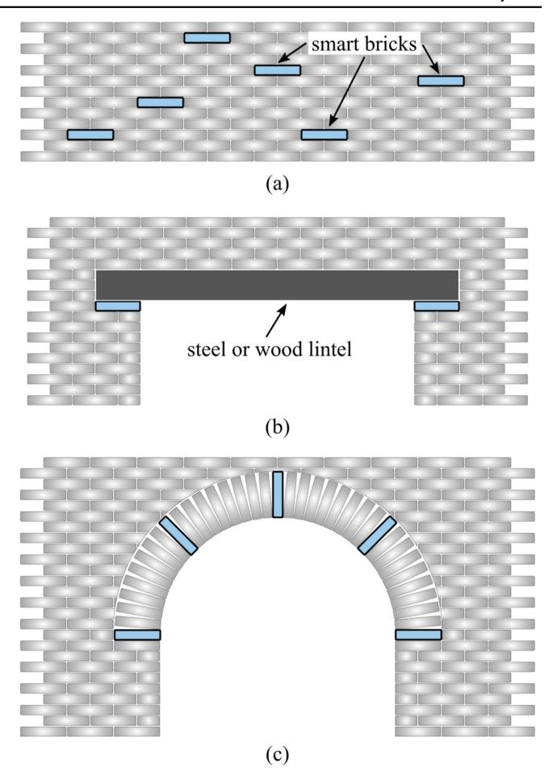

weight of the wet clay, to the clay (figure [2](#page-3-0)(a)). The filler was mechanically diffused into the clay using a 1000 watt mixing machine for 15 min (figures [2](#page-3-0)(b) and (c)). The composite was then poured into oiled and sanded prismatic steel molds and un-molded after smoothing (figure [2](#page-3-0)(d)). The samples consisted of 70 mm long prisms with a square base side of 50 mm. Four high temperature resistant Kanthal steel wire electrodes with a diameter of 2.2 mm were embedded symmetrically along the central axis of the samples with the spacing between electrodes set at 10, 20 and 10 mm (figure [2](#page-3-0)(e)). The clay elements were dried in an oven using two thermal increment steps: first at 50 °C for 150 min and then at 90 °C for 120 min (figure [2](#page-3-0)(f)). After being allowed to cool, the dried samples were burned at 900 °C over twelve hours (figure [2](#page-3-0)(g)). After baking, the bricks' color turned to red-brown (figure [2](#page-3-0)(h)). Lastly, the internal structure of neat and nanocomposite bricks was investigated through the use of a scanning electron microscope (SEM). The analysis of the material was done after burning and is shown in figure [3](#page-3-0). Figure [3](#page-3-0)(a) presents the neat brick while figure [3](#page-3-0)(b) shows the bricks doped with titania. The presence and good dispersion of the titania dioxide particles (small white spheres) are apparent from the SEM image of the smart brick.

Figure 1. Potential deployments for smart bricks: (a) scattered in walls; (b) under concentrated loading point (e.g. lintel loading points); (c) at key locations in an arch.

{3}------------------------------------------------

## 2.3. Measurement

Preliminary testing on burned brick specimens demonstrated that a smart brick exhibits a strong polarization effect that manifests itself in the form of increasing resistance in the time domain. This time drift is similar to what happens in conductive concretes. This same phenomenon has been encountered in other self-sensing structural materials, including carbon-doped cement pastes [32, 33, 47]. The polarization effect is a phenomenon that has been theorized to be a factor of various sources, including material polarization [32, 47], changes in a material's dielectric constants [48], direct piezoelectric effect [49] or a combination of these. To eliminate the effect of polarization on resistance measurements, the authors have adopted a biphasic DC approach that was developed for multi-channel monitoring of carbon-doped cement composites [43]. The measurement approach is adapted here for single channel acquisition using only the two external electrodes (two-probe measurement). Here, a voltage square wave with a 50% duty cycle ( $V_{pp}$  being the peak-to-peak voltage difference) is used to charge and discharge the sample, thus eliminating the polarization effect in the material. During the positive portion of the biphasic signal, a current sample ( $i$ ) is taken, as shown in figure 4. Knowing the applied voltage,  $V = 1/2V_{pp}$ , the smart brick resistance can be calculated,

$$R = \frac{V}{i}, \quad (1)$$

where R is the measured resistance. One current sample is taken per cycle at 80% of the total positive signal, as depicted in figure [4](#page-4-0). Therefore, the sampling rate in samples per second

Figure 2. Fabrication procedure of nanocomposite smart clay bricks.

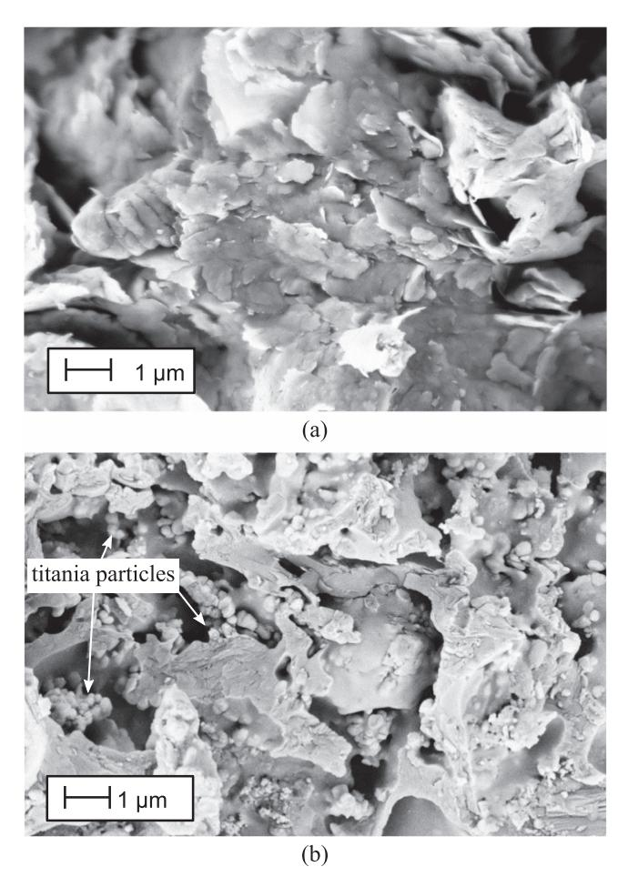

Figure 3. SEM image for a burned clay: (a) neat brick; (b) titania doped nanocomposite clay brick.

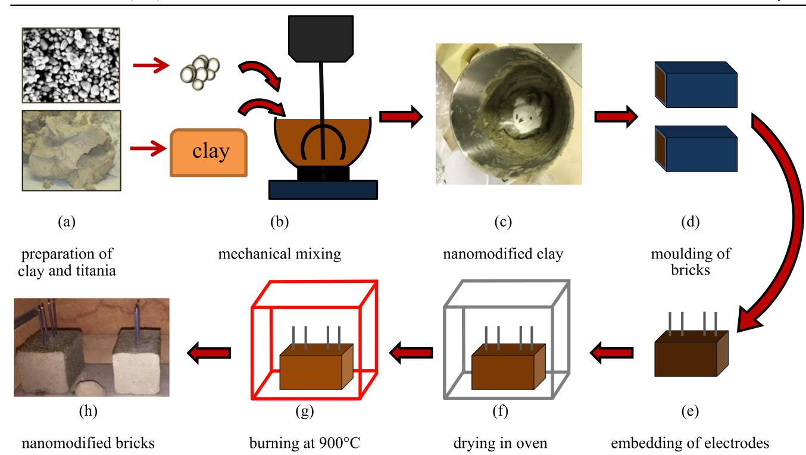

{4}------------------------------------------------

(S/s) is equal to the frequency of the applied voltage square wave (measured in Hz). In this work, a 1 Hz square wave with a correlating 1 S/s resistance measurement is used due to its low noise attribute [[43](#page-14-0)].

Figure 5(a) demonstrates how the biphasic DC measurement approach can be effective at eliminating time drift in electrical resistance measurement that affects DC measurement approaches. The measured resistances for both the neat and titania-doped bricks manifest an increasing trend in the time domain that is effectively removed through the continuous charging and discharging of the bricks provided by the biphasic measurement approach. Additionally, the biphasic measurement approach measures a lower resistance

because the material has less time for polarization, resulting in the apparent decrease in resistance. After eliminating the time drift through the biphasic approach, a time-independent electrical resistance of the material is obtained. Figure 5(b) shows how this electrical resistance is also a function of the voltage (peak-to-peak) demonstrating that the material is not ohmic. A notable result in figure 5(b) is that smart bricks with added titania are much more conductive than neat bricks. For instance, at  $V_{pp} = 20$  V titania decreases the brick's electrical resistivity by a factor of 2.2. This decrease is similar for all other voltage levels tested. This decreased resistivity facilitates simpler current reading and results in higher precision for a fixed resolution of the measurement hardware and, therefore, reduces the complexity of measurement hardware required.

#### 2.4. Characterization tests

In order to characterize the electromechanical properties of the smart bricks, a series of load-controlled (compression only) tests was conducted. Figure [6](#page-5-0)(a) shows the experimental test configuration comprising an electric-servo test machine, model Advantest 50-C7600 by Controls, with a servo-hydraulic control unit model 50-C 9842. Key components of the test setup are annotated, including a brick specimen and the resistive strain gauge. Two RSG (KYOWA KC-120-120-A1-11M2R) were adhered onto opposite sides of the smart brick specimens and axial strain was obtained as the average of the two measurements. A 2000 kg load cell (LAUMAS CL 2000) was installed to monitor the compressive force applied in the system. Figure [6](#page-5-0)(b) schematizes the electric circuit used in measuring the smart brick, where a function generator (Rigol DG1022a) was used to provide a square wave signal and a digital multimeter (NI PXI-4071)

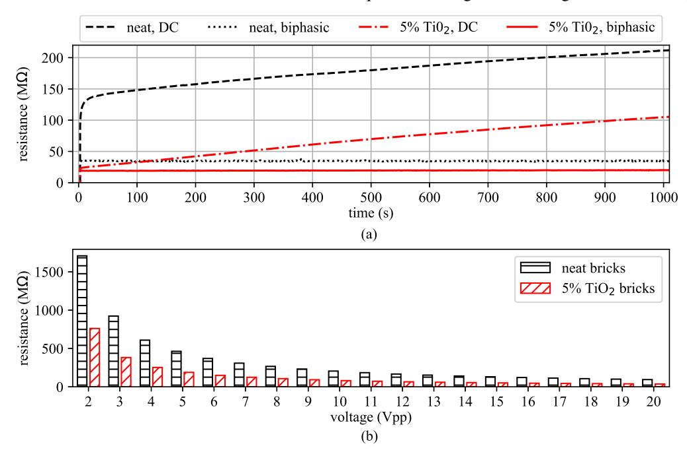

Figure 4. Data acquired with the biphasic measurement approach with key components annotated.

Figure 5. Investigation of resistance measurements techniques: (a) time-dependent resistance drift with DC measurement and non-drifting resistance measurement made with a biphasic (1 Hz) approach; (b) effect of increasing the applied 1 Hz biphasic voltage.

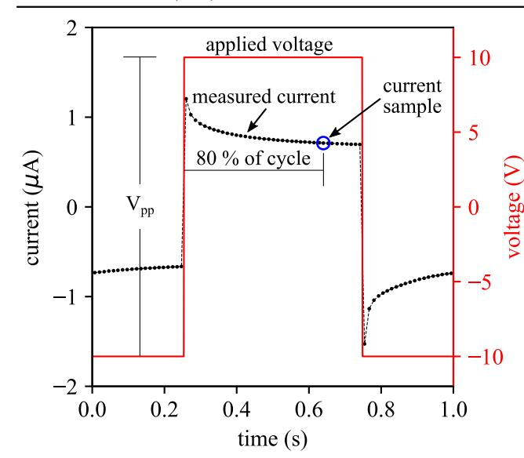

{5}------------------------------------------------

was used to measure and record the current. Lastly, an oscilloscope (Rigol DS-1054) was used during testing for validation purposes only. The measurement configuration consists of a biphasic DC two-probe measurement method, whereby the voltage input was a square wave of 20 Vpp (volts peak-to-peak) with a frequency of 1 Hz and a 50% duty cycle. Data for the current, load, and strain (two channels) were collected at 1000 S/s using a National Instruments PXIe-1071 mounting the following modules: PXI-4071 (current) and PXIe-4330 (load cell and strain gauges).

Results presented in figure 7 demonstrate that the decrease in resistivity achieved with titanium dioxide is consistently observed by comparing five neat bricks with five nanocomposite-doped bricks. Overall, the nanocomposite specimens exhibit a lower average and less scattered electrical resistance. Figure 7(a) presents the time series data for all 10 bricks, while figure 7(b) presents the same data in the form of fitted Gaussian probability density functions (PDFs) for both sets of specimens, where the observation marks along the bottom of the PDF functions are the individual observations made during testing.

Next, the specimens electro-mechanical characteristics under a constant load are inspected. Figure [8](#page-6-0)(a) shows the 3 kN loading case applied to all 10 bricks with the inspection region annotated. For the remainder of these tests, the sensors' resistance in the inspection area is used to validate the

Figure 6. Experimental test setup for validating smart bricks: (a) axial testing machine; (b) schematic for current measurement system with associated data acquisition hardware.

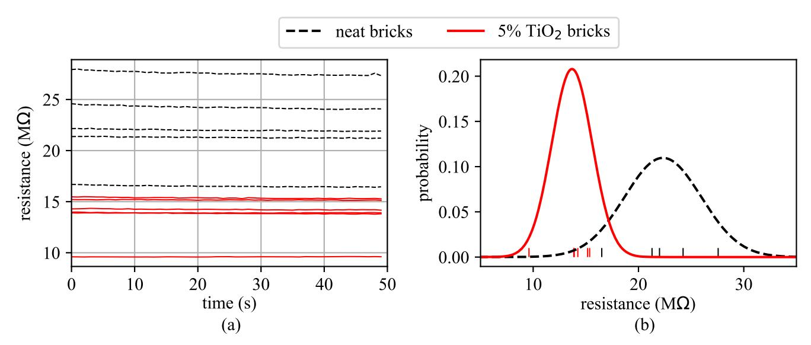

Figure 7. Resistance for neat and TiO2-doped bricks: (a) time series data; (b) fitted Gaussian probability density functions for resistance values.

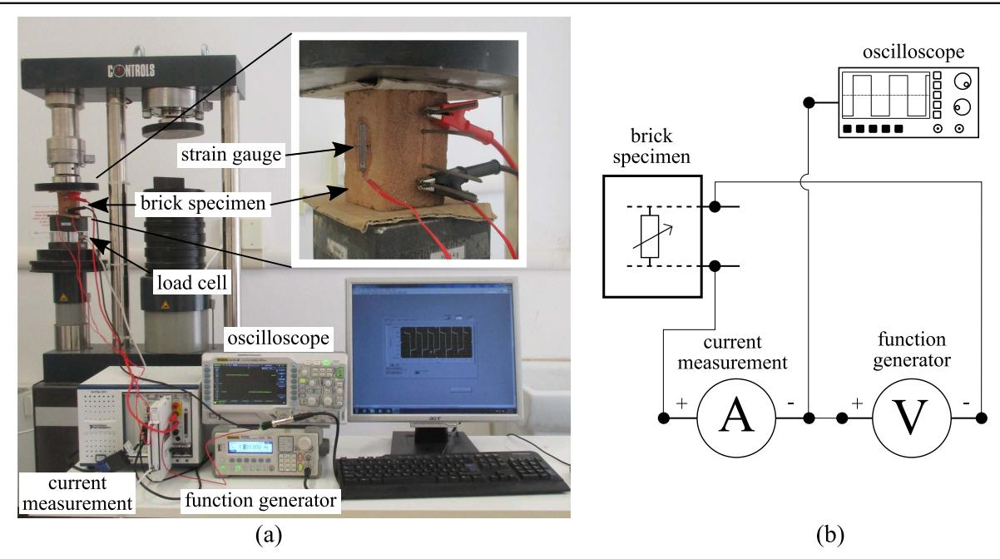

{6}------------------------------------------------

sensors under a constant load. A residual time drift (figure 8(b)) is noticed in the output of neat bricks that is greatly reduced in the output of nanocomposite ones. It can also be seen that the nanocomposite bricks are more linear with less variation when compared to normal bricks. To quantify these two aspects, PDFs were developed for the specimen's linearity (figure 8(c)) and variation (figure 8(d)). Here, linearity is expressed as the slope of the best fit line taken through the data and the variation is the standard deviation of data about that line. As shown in figure 8, both the linearity and variation improve with the addition of titanium dioxide to the brick.

The quasi-static strain sensing capabilities of the smart bricks are shown in figure [9](#page-7-0). Here, a 1.8 kN load is linearly applied and released over a 115 s test span, as shown in figure [9](#page-7-0)(a). The resistive strain gauge-measured strain and the brick's normalized resistance are presented in figures [9](#page-7-0)(b) and (c), respectively. From these results, it is noted that both normal and nanocomposite smart bricks are able to provide an electrical output that is very well correlated with their axial strain, where the electrical resistance decreases under an increasing compression load. However, upon unloading, the neat bricks do exhibit some residual changes in electrical resistance, while nanocomposite smart bricks recover their initial resistance after unloading (see figure [9](#page-7-0)(c)). The effect of repeated cyclic loading on the brick's self-sensing capabilities and on its related electrical characteristics is a topic that deserves its own in-depth work and is therefore not included in this work. A quite remarkable linearity of the response of all bricks in the resistance-strain plane is noted. However, the addition of titania does appear to cause an increase in the hysteresis of the brick when compared to the neat bricks. The hysteresis was quantified by computing the area inside the hysteresis curves in figure [9](#page-7-0)(d) and presented as PDFs in figure [9](#page-7-0)(e). It should be noted that the nanocomposite-doped sensor that exhibits the highest sensitivity in figure [9](#page-7-0)(c) is the same specimen that exhibits the highest level of hysteresis in figure [9](#page-7-0)(d). However, even with this outlier

removed, the nanocomposite-doped specimens still register a higher level of hysteresis as expressed by the observation marks along the bottom of figure [9](#page-7-0)(e). The hysteresis in the smart bricks is not large enough to challenge their intended application. Another feature of nanocomposite clay bricks when compared to neat ones is their increase in Young's modulus, as presented in figure [9](#page-7-0)(f), that anticipates their higher overall load carrying capability with respect to normal bricks. This can be an important aspect for SHM applications where the smart bricks should not fail in compression before other bricks in the structure, even though this feature cannot prevent failures in mortar joints. Overall, results demonstrate that some benefits are achievable with the addition of conductive inclusions in smart bricks. While there could be better alternatives to titania, the definition of the optimal type and amount of conductive doping for smart bricks is left to future work.

To investigate the smart brick's load sensing capability in various configurations, a specimen (titania-doped) was tested in a vertical configuration (with applied load aligned with the electrodes), as shown in figure [6](#page-5-0)(a), and in a horizontal position (with applied load orthogonal to the electrodes). Results for vertical and horizontal configurations, tested under the loading case presented in figure [9](#page-7-0)(a), are presented in figure [10](#page-7-0) and clearly demonstrate that the smart brick is capable of detecting loading conditions in either configuration. The specimen's changes in resistance could be mainly due to the reduction in brick's volume and not a change in the distance between contacts: this assumption is partially confirmed by the presented results because the resistance decreases in a similar behavior with an increase in loading, for both the horizontal and vertical configurations. These results are further corroborated by similar results for smart-concrete under various loading conditions [[50](#page-14-0)]. Future work will require the development of a micro-mechanics model [[51](#page-14-0)] to quantitatively predict the brick's electro-mechanical response and the relationship between electrical properties and strain state. However, based on the presented results, a linear

Figure 8. Investigation of stability for neat and TiO2-doped bricks for samples under 3 kN of load: (a) inspection area for cases presented; (b) time series resistance for inspection area; (c) fitted Gaussian probability density functions of the drift; and (d) fitted Gaussian probability density functions of the variation in resistance.

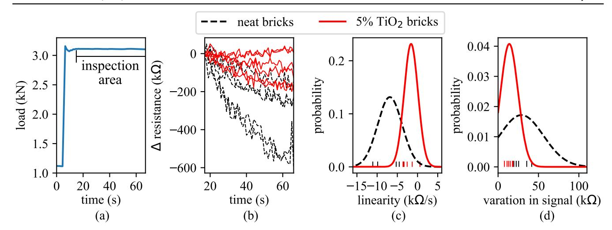

{7}------------------------------------------------

relationship between change in electrical resistance of the smart brick,  $\Delta R$ , and volumetric strain,  $\varepsilon_v$ , (positive for a volume reduction under compressive loading), can be assumed, at a first level of approximation, as follows:

$$\frac{\Delta R}{R} = -\lambda \varepsilon_v = -\lambda(\varepsilon_x + \varepsilon_y + \varepsilon_z) \quad (2)$$

with  $\lambda$  representing the gauge factor of the brick and  $\varepsilon_x, \varepsilon_y, \varepsilon_z$  representing linear strain in three orthogonal directions. The average gauge factor for the neat bricks in the vertical configuration, assuming uniaxial stress conditions ( $\sigma_x = \sigma_y = 0$ ,  $\sigma_z \neq 0$ ) and a brick's Poisson's ratio  $\nu_b = 0.22$  ( $\varepsilon_x = \varepsilon_y = -\nu_b \varepsilon_z$ ), was obtained from the slopes of the lines

in figure 9(d) and found to be 919, with all 5 samples being relatively close to this value as presented in table 1. However, the gauge factors for the titania-doped bricks were found to vary widely, ranging from 391 to 2955 (with an average of 1805) for the samples in this study. No correlation between a brick's gauge factor to its resistance, drift, or hysteresis was found. The investigation of the effects of the high variation in gauge factor will also need to be investigated in future work. However, it should be noted that all the bricks possess a gauge factor that is more than suitable for their intended application.

## 3. Structural testing

The deployment of smart bricks in a wall specimen under eccentric compression loading has been investigated through a second set of experiments carried out at UniPG LabDyn, which results are presented in this section. First, the smart

**Figure 9.** Electrical response of neat and nanocomposite smart bricks under compression loading: (a) load time history; (b) average axial strain in the bricks measured through resistive strain gauges; (c) measured relative change in electrical resistance of the smart bricks; (d) relative change in electrical resistance versus average strain; (e) Gaussian probability density function fitted on the hysteresis area of the resistance versus strain curves; and (f) Gaussian probability density function fitted on the measured Young’s moduli of the bricks.

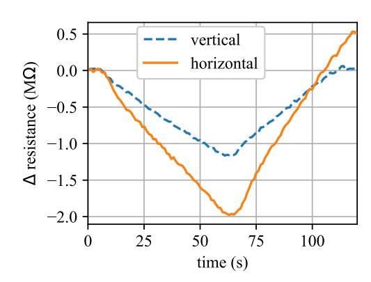

**Figure 10.** Results for a titania-doped smart brick tested in vertical and horizontal configurations.

**Table 1.** Gauge factors for neat and titania-doped bricks (assuming  $\nu_b = 0.22$ ).

|               |      |      | Samples |
|---------------|------|------|---------|
|               |      |      |         |
| Neat          | #1   | #2   | #3      |
| Titania-doped | 295  | 1196 | 832     |
|               | 2352 | 2186 | 2955    |
|               |      |      |         |

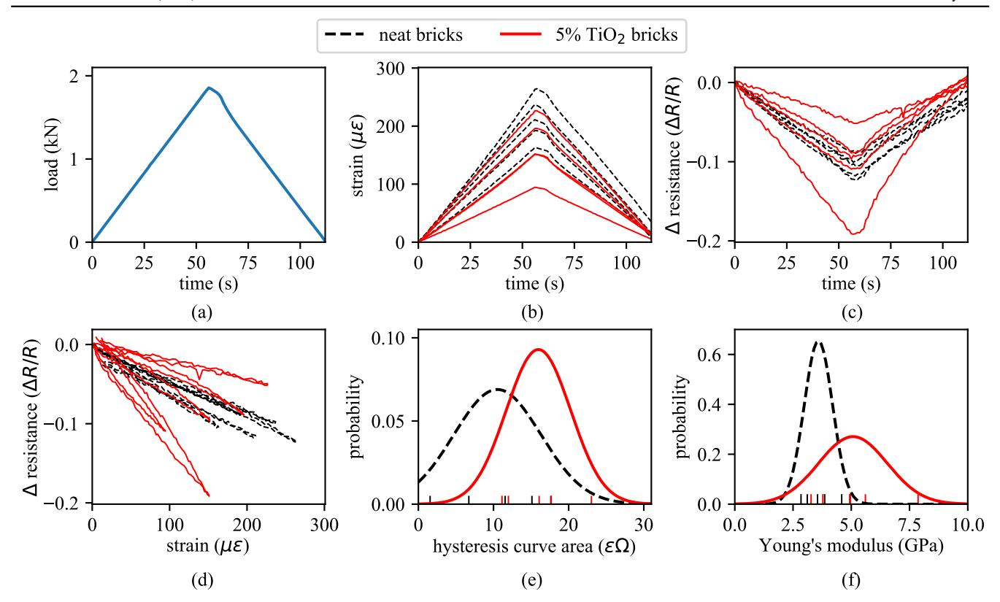

{8}------------------------------------------------

brick's capability to function as a self-sensing structural material within the wall is verified. Second, the distribution of electric potential through the wall is investigated. Third, the capability of three smart bricks embedded in the wall to measure strain distribution in elastic conditions and to track changes in loading paths due to cracking is studied.

#### 3.1. Methodology

A small-scale brick wall specimen consisting of 35 bricks, arranged five bricks wide and seven bricks high using cement mortar layers of approximately 0.5 cm thickness in both horizontal and vertical directions, was constructed to investigate the effects of embedding smart bricks into a wall. A Geolite mineral mortar with fine granulometry and semirapid settings was used for building the wall. The brick wall, of approximate dimensions 37 × 37 × 5 cm3 , mounted in a hydraulic press, is shown in figure 11. The hydraulic press was hand-operated, therefore only load-controlled tests were performed. Three titania-doped smart bricks (termed bricks 1, 2 and 3 in the figure) were embedded in the wall, with the electrodes protruding out the rear of the wall so that the front maintained the look of a typical brick wall. Steel I beams, set in place with mortar, were used on top and bottom of the wall to distribute the loading forces. Testing consisted of a centered loading and two eccentric loads for the wall (9 cm to the left and right of center) obtained by moving the position of the hydraulic ram. Eccentricity values were selected to have the center of pressure falling slightly outside of the kern of the cross-section of the wall, so as to anticipate cracking in bending at relatively low loading values. Three loading cases consisting of 20, 50 and 70 kN compressive loads were applied at each location. For each load location and magnitude, the resistance of the three bricks was measured. Each brick was measured individually to avoid any signal

interference between bricks, resulting in 27 total compressive loading tests being performed on the wall specimen. A vertical compression crack formed during the final loading case (brick 3, 70 kN), therefore, loading cases passed 70 kN were not considered. This crack will be discussed later. Resistance measurements were obtained using the same method presented above, using the biphasic DC approach with a sampling rate of 1 S/s. The black dots, observable in figure 11, were used for DIC. High-resolution digital images were shot using a Nikon 5100 in the uncompressed and compressed state for each loading case and eccentricity. The movements of the dots were then tracked using a custom Python script.

The measured resistance of a smart brick mounted in a wall greatly reduces with respect to the case of a free-standing brick. For example, brick 2 exhibited a pre-embedded resistance of 15.5–50 kΩ and a 99.66% reduction in resistance once embedded. This change in resistance is caused by the increase in the number of conductive pathways in the wall compared to the individual brick. This is due to current flowing out of the smart brick through mortar layers and bricks in its neighborhood. In order to closely investigate this aspect, once the compressive loads were completed, the wall was removed from the hydraulic press and placed on its side to allow for investigation of the distribution of the electrical potential in the wall. To simplify the investigation, brick 2 was selected as the sensing brick as it was mounted in the center of the wall. Investigation of the distribution of electrical potential throughout the entire wall required to postembed electrical contacts all through the wall. Thirty-two 3 mm holes were drilled, one in the center of each brick, plus additional holes in the center of the wall where more contacts were needed due to the higher complexity of the electrical field. A 1 mm copper wire was then inserted into each hole. The remainder of the holes were filled with molten solder that froze inside the holes. Thereafter, wires for measuring the voltage at each contact point were soldered to the copper contacts. As before, a biphasic DC approach with a 1 Hz, 20 *V*pp square wave signal was used to induce a current into the brick wall. This is the same setup used during the compressive loading of the wall. All 32 voltage sense channels were monitored using a 24 bit analog input module (PXIe-4302) mounted in a National Instruments PXIe-1071 chassis.

#### 3.2. Strain sensing through a smart brick deployed in a wall

Figure [12](#page-9-0) presents the change in measured resistance data for brick 2 under the three loading cases of 20, 50 and 70 kN. Results are presented in terms of change in resistance to account for a slight change in the sensors' nominal resistance, because tests were performed on different days. For the higher loading cases (50 and 70 kN), it can be seen that the change in resistance scales very well with the load, while for the lowest loading case (20 kN) the change in resistance does not. This disagreement between the loading and change in resistance is attributed to varying load paths in the wall, particularly when the wall is under relatively low loading states.

Figure 11. Brick wall with embedded smart bricks mounted in a hydraulic press for experimental validation.

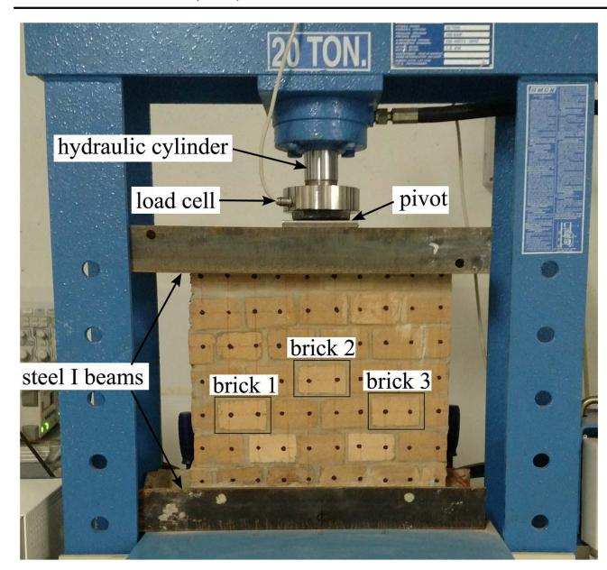

{9}------------------------------------------------

#### 3.3. Electrical current distribution in a wall

Figure 13(a) shows the thirty-two copper contacts used to investigate the current distribution through the wall. The voltage distribution over the entire wall, for a sensing current applied to brick 2, is shown in figure 13(b) along with the vertical compression crack produced after application of the 70 kN compression load. From these results, it can be seen that the lines of equal electrical potential circle outwards from the positive and negative contacts. The lines of equal current flow would be orthogonal to the lines of equal potential, but they are not shown here for clarity. Overall, the electrical potential is shown to disperse well throughout the entire wall. Therefore, it can be used to validate the hypothesis that the reduction in measured resistance is a factor of the electrical current flowing through the surrounding bricks. A distortion of the lines of equal potential in the cracked region is also

apparent from the presented results, which suggests the use of the proposed electrical measurement as a tool for the monitoring of brick masonry walls. This is left to future work.

#### 3.4. Eccentric compression tests on wall specimen

Results from a center and two eccentric compression loading tests on the wall specimen are presented in this section. The tests have the twofold purpose of demonstrating the capability of the smart bricks to effectively monitor the strain developing within the wall in the elastic range of deformation, as well as detecting changes in measured strain due to changes in the loading paths originating from a damage when the wall approaches the ultimate limit state condition. To remove the potential issue with varying gauge factors between the embedded sensors, each sensor's measurement values are taken as the change in resistance for a given load and normalized by that sensor's change in resistance for the center loading case. First, theoretical values for the normalized  $\Delta R/R$  are obtained through a simplified analytical model. Second, experimental data are presented and compared to analytical predictions.

At a first level of approximation for small compression loads, a linear elastic beam model with masonry elements resisting both tension and compression can be assumed in order to estimate strains in the wall, as sketched in figure 14. From this model (stage I), the axial strain distribution in the wall at a sufficient distance from the bases of the wall is

$$\varepsilon_z(x) = \frac{P}{EA} + \frac{Pe}{EI}x \quad (3)$$

with area  $A = b \cdot s$ ,  $E$  the Young's modulus of the masonry, and  $I = s \cdot b^3/12$  is the moment of inertia of the cross-section of the wall.

Using equations (2) and (3), assuming volumetric strain  $\varepsilon_v = \varepsilon_z(1 - 2\nu)$  for uniaxial stress,  $\nu$  being the Poisson's

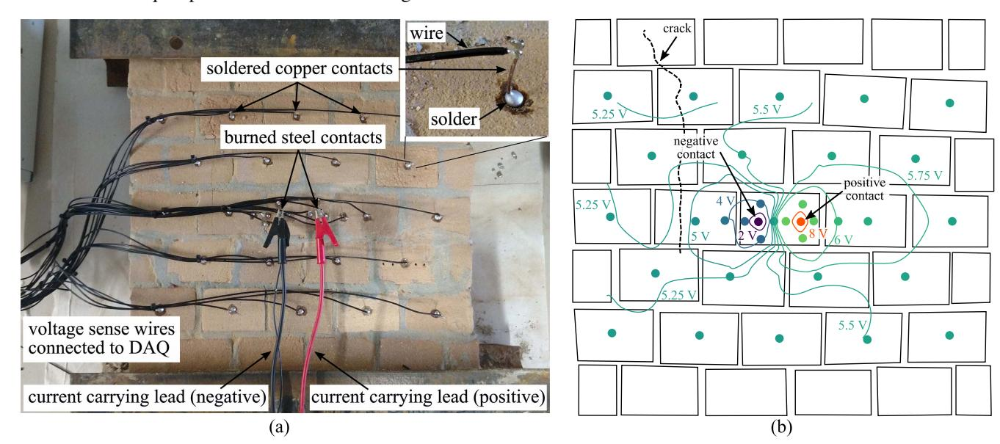

**Figure 12.** Resistance response for smart brick 2 embedded in the wall specimen, under a centered load of 20, 50 and 70 kN.

**Figure 13.** Electrical current distribution in the wall (the picture and its illustration viewed from the back of the wall): (a) experimental setup used to measure the voltage over the wall area with an embedded copper contact shown in the insert; (b) the distribution of electrical potential over the wall, with a sensing current being applied to brick 2 in the center of the wall.

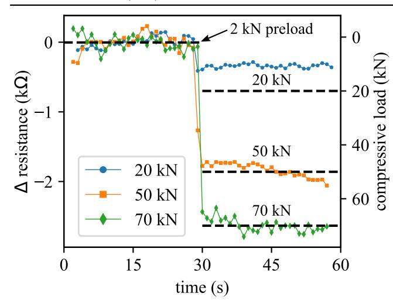

{10}------------------------------------------------

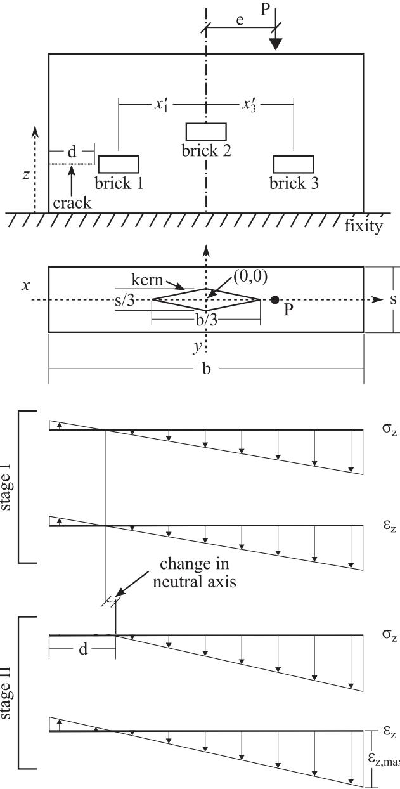

**Figure 14.** Simplified uncracked and cracked elastic beam models for the tested wall ( $\sigma_z$  representing the axial stress).

ratio of masonry, the expected fractional change in electrical resistance for a centered load ( $e = 0$ ) in the three smart bricks is equal to

$$\frac{\Delta R|_{e=0}}{R} = -\lambda(1 - 2\nu) \frac{P}{EA}. \quad (4)$$

Similarly, when the load is off-centered ( $e \neq 0$ ), the expected fractional change in electrical resistance of the smart bricks is equal to

$$\frac{\Delta R(x)}{R} = -\lambda(1 - 2\nu) \left( \frac{P}{EA} + \frac{Pe}{EI} x \right). \quad (5)$$

As previously discussed, the normalized change in electrical resistance for a given location ( $x$ ) on the wall, denoted as  $\Delta R(x)$ , is adopted as a metric for validating the capability of

smart bricks at monitoring strain.  $\Delta R(x)$  represents the ratio between the change in electrical resistance of a smart brick under an eccentric loading and the change in electrical resistance of the same smart brick under centered loading. According to equations (4) and (5), its expected value is equal to:

$$\Delta R(x) = \frac{\Delta R(x)}{\Delta R(x)|_{e=0}} = 1 + \frac{eA}{I} x = 1 + \frac{12e}{b^2} x, \quad (6)$$

where it is noted that  $\Delta R(x)$  is independent of the gauge factor of the smart brick and independent of the load.

Considering the very low tensile strength of the masonry, when the center of pressure is outside of the kern of the cross-section, tensile cracks develop under small loads and a partialization of the cross-section occurs, with the consequence that equation (3) is no longer valid. This is annotated as loading stage II in figure 14. For  $e \geq b/6$ , equation (3) is generalized by neglecting the tensile strength of masonry, maintaining Navier-Bernoulli hypothesis that plane cross-sections remain plane during bending, as follows:

$$\varepsilon_x(x) = \frac{\varepsilon_{x,\max}}{b - d} \left( \frac{b}{2} - d + x \right), \quad (7)$$

where  $\varepsilon_{x,\max}$  is the maximum compressive strain and  $d$  denotes the distance of the neutral axis from the edge on the opposite side with respect to the load. This distance is obtained from moment equilibrium as

$$d = 3e - \frac{b}{2} \quad (8)$$

while the maximum compressive strain,  $\varepsilon_{x,\max}$ , is obtained from axial equilibrium as

$$\varepsilon_{x,\max} = \frac{2P}{E(b - d)s}. \quad (9)$$

The fractional change in electrical resistance for an off-centered load ( $e \geq b/6$ ) is thus obtained as

$$\frac{\Delta R(x)}{R} = -\lambda(1 - 2\nu) \left( \frac{1}{E} \frac{2P}{(b - d)^2 s} \left( \frac{b}{2} - d + x \right) \right). \quad (10)$$

Dividing equation (10) by equation (4), the normalized change in electrical resistance for masonry cracked in bending is

$$\frac{\Delta R(x)}{(b - d)^2} = \frac{2b}{2} \left( \frac{b}{2} - d + x \right). \quad (11)$$

Solving for  $\Delta R(x)$  at the desired location of a smart brick is obtained by replacing  $x$  with the appropriate  $x'$ , as denoted in figure 14.

Figure 15 shows the measured and modeled, equation (11), normalized changes in electrical resistance of the smart bricks in the wall for centered and eccentric compression tests. These results show that for small loading cases  $P = 20 \text{ kN}$  and  $P = 50 \text{ kN}$ , experimental responses are very similar. Moreover, they exhibit a reasonable agreement with model predictions, given the simplification of the analytical model. In particular, no significant variations in normalized changes in electrical resistance under the two load intensities

{11}------------------------------------------------

and an almost linear variation of the bricks' outputs along the width of the wall are highlighted. Notably, the normalized change in electrical resistance of the centered smart brick (brick 2) for off-centered loads is smaller than 1 due to the partialization of the cross-section of the wall, as predicted by equation (11). Conversely, for a large eccentric load,  $P = 70$  kN and  $e = -9$  cm, the output of smart brick 3 significantly deviates from the cases with  $P = 20$  kN and  $P = 50$  kN and from the elastic beam model results, which is likely to be a consequence of two key aspects, both related to the vertical compression crack shown in figure 13(b). The first is the loss of mechanical linearity due to the material reaching the ultimate limit state conditions and of a strain concentration in the compressive zone following the formation of the crack. The second is the opening of the crack under high compressive loads, therefore increasing the measured resistance of the brick by decreasing the number of conductive paths in the wall, as discussed in section 3.3.

The afore-described strain concentration can be also qualitatively verified upon inspection of figure [16,](#page-12-0) showing the full field displacement results for the wall under a 70 kN loading condition obtained through DIC. During testing, the wall was found to have a higher stiffness on the right side when compared to the left side. This was determined using DIC for the 70 kN loading under the three loading conditions (left, center and right), as shown in figure [16.](#page-12-0) This higher level of stiffness on the right side helped to develop stress concentrations, leading to the formation of the vertical crack. This difference in stiffness, as illustrated in figure [16](#page-12-0)(a), is assumed to be due to variations in the mortar thicknesses. However, this asymmetry in the wall stiffness does not affect the smart brick's capability to function as a self-sensing structural component. Overall, results show that smart bricks can be used to monitor strains within masonry walls and detect damage.

#### 4. Conclusions

A new approach for strain monitoring within masonry structures has been proposed. It is based on the novel concept of smart bricks. These bricks are special piezoresistive clay bricks capable of providing measurable electrical output under the application of a mechanical load. They enable the measurement of strains at critical locations within a masonry structure with a high fidelity, and this information can profitably be used for stress evaluation, and crack and damage detection by identifying changes in loading paths and crosscorrelating the outputs of different smart bricks, for instance before and after an earthquake. An enhanced smart brick was proposed by doping raw clay with a suitable amount of titania, a filler that improves electrical conductivity, electromagnetic noise rejection capabilities, mechanical properties, and durability, while not modifying the aesthetic appearance of the bricks. This last point is of particular importance for the monitoring of heritage structures.

Results of an experimental campaign show that neat clay bricks fabricated in laboratory with embedded electrodes made of a special steel capable of resisting the high baking temperatures used during brick manufacturing, in the order of 900 °C, already exhibit a somewhat linear and repeatable piezoresistive behavior that makes them applicable as strain sensors.

After an extensive electromechanical characterization of normal and nanocomposite smart bricks, an experiment was conducted on a small-scale masonry wall equipped with three inserted smart bricks, whereby the wall was subjected to eccentric compression. The test was aimed at experimentally demonstrating the potential of the proposed technology in structural applications, both in small loading conditions and at the ultimate limit state. Results from the experiment showed that strain sensing capabilities of smart bricks are highly enhanced when they are inserted in a masonry wall, as the active volume, characterized by current flow, is not limited to

Figure 15. Measured and analytical (equation ([11](#page-10-0))) normalized changes in electrical resistance of the three smart bricks under eccentric and centered compression tests on the wall specimen: (a) P = 20 kN; (b) P = 50 kN (c) and P = 70 kN.

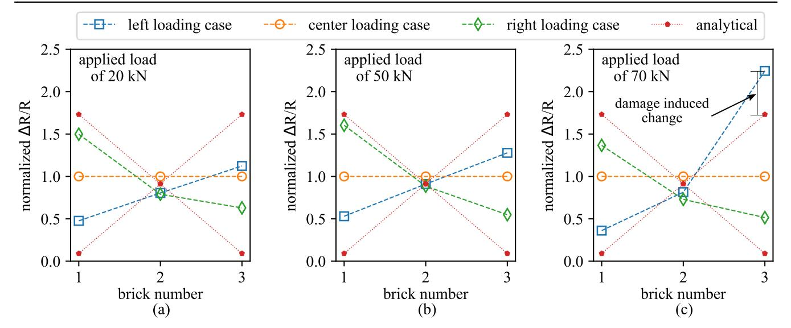

{12}------------------------------------------------

the smart brick itself, but also involves surrounding mortar layers and bricks. This results in a very large change in electrical resistance under the application of a mechanical load, that allows the brick to detect very small local changes in strain occurring within the wall. Furthermore, experimental results demonstrate that smart bricks can measure strain variations within the masonry due to changes in eccentricity of the load and that cross-comparison of the outputs of different smart bricks allows the detection of changes in strain following the formation of compression cracks when

approaching the ultimate limit state conditions. These features could be used to detect changes in loading paths after an earthquake, thus revealing the occurrence of a structural damage or the activation of a local failure mechanism.

Overall, it is concluded that the proposed smart bricks could represent a very effective and durable sensing technology for SHM of masonry structures, providing critical information for structural prognosis while maintaining structural and architectural integrity.

# Acknowledgments

This work was supported by the Italian Ministry of Education, University and Research (MIUR) through the funded Project of Relevant National Interest 'SMART-BRICK: Novel strainsensing nanocomposite clay brick enabling self-monitoring masonry structures' (protocol no. 2015MS5L27).

This work is also partly supported by the National Science Foundation Grant No. 1069283, which supports the activities of the Integrative Graduate Education and Research Traineeship (IGERT) in Wind Energy Science, Engineering and Policy (WESEP) at Iowa State University. Their support is gratefully acknowledged.

The authors are grateful to Fornaci Briziarelli Marsciano (FBM) SpA brick manufacturing company for providing technical support to this research.

Any opinions, findings, and conclusions or recommendations expressed in this material are those of the authors and do not necessarily reflect the views of the funding agencies (MIUR and National Science Foundation).

# ORCID iDs

Austin Downe[y](https://orcid.org/0000-0002-5524-2416) [https:](https://orcid.org/0000-0002-5524-2416)//orcid.org/[0000-0002-5524-2416](https://orcid.org/0000-0002-5524-2416) Antonella D'Alessandro [https:](https://orcid.org/0000-0003-2928-1961)//orcid.org/[0000-0003-](https://orcid.org/0000-0003-2928-1961) [2928-1961](https://orcid.org/0000-0003-2928-1961)

Simon Laflamme [https:](https://orcid.org/0000-0002-0601-9664)//orcid.org/[0000-0002-0601-9664](https://orcid.org/0000-0002-0601-9664) Filippo Ubertini [https:](https://orcid.org/0000-0002-5044-8482)//orcid.org/[0000-0002-5044-8482](https://orcid.org/0000-0002-5044-8482)

### References

[1] Masciotta M-G, Ramos L and Lourenço P B 2017 The importance of structural monitoring as a diagnosis and control tool in the restoration process of heritage structures: a case study in Portugal J. Cultural Heritage [27](https://doi.org/10.1016/j.culher.2017.04.003) 36–47 [2] Lubowiecka I, Armesto J, Arias P and Lorenzo H 2009 Historic bridge modelling using laser scanning, ground penetrating radar and finite element methods in the context of structural dynamics Eng. Struct. 31 [2667](https://doi.org/10.1016/j.engstruct.2009.06.018)–76 [3] Ceriotti M, Mottola L, Picco G P, Murphy A L, Guna S, Corra M, Pozzi M, Zonta D and Zanon P 2009 Monitoring heritage buildings with wireless sensor networks: the torre aquila deployment Proc. 2009 Int. Conf. on Information Processing in Sensor Networks (IEEE Computer Society) pp 277–88 [4] Ubertini F, Comanducci G and Cavalagli N 2016 Vibrationbased structural health monitoring of a historic bell-tower

Figure 16. Displacement fields for 70 kN eccentric load applied at: (a) 9 cm left of center; (b) center; and (c) 9 cm right of center, along with the developed crack.

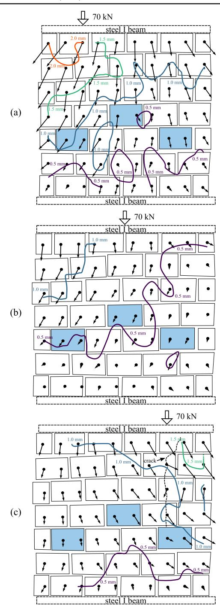

{13}------------------------------------------------

using output-only measurements and multivariate statistical analysis Struct. Health Monit. 15 [438](https://doi.org/10.1177/1475921716643948)–57 [5] Ramos L F, Marques L, Lourenço P B, De Roeck G, Campos-Costa A and Roque J 2010 Monitoring historical masonry structures with operational modal analysis: Two case studies Mech. Syst. Signal Process. 24 [1291](https://doi.org/10.1016/j.ymssp.2010.01.011)–305 [6] Aras F, Krstevska L, Altay G and Tashkov L 2011 Experimental and numerical modal analyses of a historical masonry palace Constr. Build. Mater. [25](https://doi.org/10.1016/j.conbuildmat.2010.06.054) 81–91 [7] Gentile C, Guidobaldi M and Saisi A 2016 One-year dynamic monitoring of a historic tower: damage detection under changing environment Meccanica 51 [2873](https://doi.org/10.1007/s11012-016-0482-3)–89 [8] Kouris L A S, Penna A and Magenes G 2017 Seismic damage diagnosis of a masonry building using short-term damping measurements J. Sound Vib. [394](https://doi.org/10.1016/j.jsv.2017.02.001) 366–91 [9] Ramos L F, De Roeck G, Lourenço P B and Campos-Costa A jan 2010 Damage identification on arched masonry structures using ambient and random impact vibrations Eng. Struct. 32 [146](https://doi.org/10.1016/j.engstruct.2009.09.002)–62 [10] Pieraccini M, Luzi G, Mecatti D, Fratini M, Noferini L, Carissimi L, Franchioni G and Atzeni C 2004 Remote sensing of building structural displacements using a microwave interferometer with imaging capability NDT & E Int. 37 [545](https://doi.org/10.1016/j.ndteint.2004.02.004)–50 [11] Costantini M, Bai J, Malvarosa F, Minati F, Vecchioli F, Wang R, Hu Q, Xiao J and Li J 2016 Ground deformations and building stability monitoring by COSMO-SkyMed PSP SAR interferometry: results and validation with field measurements and surveys 2016 IEEE Int. Geoscience and Remote Sensing Symp. (IGARSS) (Piscataway, NJ: IEEE) [12] Bartoli G, Betti M and Giordano S 2013 In situ static and dynamic investigations on the 'torre grossa' masonry tower Eng. Struct. 52 [718](https://doi.org/10.1016/j.engstruct.2013.01.030)–33 [13] Kamiński T and Bień J 2015 Condition assessment of masonry bridges in poland Proc. 2015 Conf. Concepcao, Conservacao e Reabilitacao de Ponts pp 126–35 [14] Moropoulou A, Labropoulos K C, Delegou E T, Karoglou M and Bakolas A 2013 Non-destructive techniques as a tool for the protection of built cultural heritage Constr. Build. Mater. 48 [1222](https://doi.org/10.1016/j.conbuildmat.2013.03.044)–39 [15] Ghorbani R, Matta F and Sutton M A 2014 Full-field deformation measurement and crack mapping on confined masonry walls using digital image correlation Exp. Mech. [55](https://doi.org/10.1007/s11340-014-9906-y) [227](https://doi.org/10.1007/s11340-014-9906-y)–43 [16] Ghiassi B, Xavier J, Oliveira D V and Lourenço P B 2013 Application of digital image correlation in investigating the bond between FRP and masonry Compos. Struct. [106](https://doi.org/10.1016/j.compstruct.2013.06.024) 340–9 [17] Binda L, Lenzi G and Saisi A 1998 Nde of masonry structures: use of radar tests for the characterisation of stone masonries NDT & E Int. 31 [411](https://doi.org/10.1016/S0963-8695(98)00039-5)–9 [18] Maierhofer C and Leipold S 2001 Radar investigation of masonry structures NDT & E Int. 34 [139](https://doi.org/10.1016/S0963-8695(00)00038-4)–47 [19] Santos-Assunçao S, Perez-Gracia V, Caselles O, Clapes J and Salinas V 2014 Assessment of complex masonry structures with GPR compared to other non-destructive testing studies Remote Sens. 6 [8220](https://doi.org/10.3390/rs6098220)–37 [20] Silva B, Benetta M D, da Porto F and Valluzzi M R 2013 Compression and sonic tests to assess effectiveness of grout injection on three-leaf stone masonry walls Int. J. Archit. Heritage 8 [408](https://doi.org/10.1080/15583058.2013.826300)–35 [21] Han Q, Xu J, Carpinteri A and Lacidogna G 2014 Localization of acoustic emission sources in structural health monitoring of masonry bridge Struct. Control Health Monit. 22 [314](https://doi.org/10.1002/stc.1675)–29 [22] Serra M, Festa G, Vassallo M, Zollo A, Quattrone A and Ceravolo R 2016 Damage detection in elastic properties of masonry bridges using coda wave interferometry Struct. Control Health Monit. 24 [e1976](https://doi.org/10.1002/stc.1976) [23] Schueremans L and Genechten B V 2009 The use of 3d-laser scanning in assessing the safety of masonry vaults—a case study on the church of saint-jacobs Opt. Lasers Eng. [47](https://doi.org/10.1016/j.optlaseng.2008.06.009) [329](https://doi.org/10.1016/j.optlaseng.2008.06.009)–35 [24] Riveiro B, Morer P, Arias P and de Arteaga I 2011 Terrestrial laser scanning and limit analysis of masonry arch bridges Constr. Build. Mater. 25 [1726](https://doi.org/10.1016/j.conbuildmat.2010.11.094)–35 [25] Laflamme S, Turkan Y and Tan L 2015 Bridge structural condition assessment using 3d imaging Proc. 2015 Conf. on Autonomous and Robotic Construction of Infrastructure [26] Cluni F, Costarelli D, Minotti A M and Vinti G 2015 Enhancement of thermographic images as tool for structural analysis in earthquake engineering NDT & E Int. [70](https://doi.org/10.1016/j.ndteint.2014.10.001) 60–72 [27] Capozucca R 2011 Experimental analysis of historic masonry walls reinforced by CFRP under in-plane cyclic loading Compos. Struct. 94 [277](https://doi.org/10.1016/j.compstruct.2011.06.007)–89 [28] Laflamme S, Ubertini F, Saleem H, D'Alessandro A, Downey A, Ceylan H and Materazzi A L 2015 Dynamic characterization of a soft elastomeric capacitor for structural health monitoring J. Struct. Eng. 141 [04014186](https://doi.org/10.1061/(ASCE)ST.1943-541X.0001151) [29] Inaudi D, Casanova N and Glisic B 2001 Long-term deformation monitoring of historical constructions with fiber optic sensors 3rd Int. Seminar on Structural Analysis of Historical Constructions vol 11 [30] Glisic B, Inaudi D, Posenato D, Figini A and Casanova N 2007 Monitoring of heritage structures and historical monuments using long-gage fiber optic interferometric sensors-an overview The 3rd Int. Conf. on Structural Health Monitoring of Intelligent Infrastructure-SHMII-3 [31] Valvona F, Toti J, Gattulli V and Potenza F 2017 Effective seismic strengthening and monitoring of a masonry vault by using glass fiber reinforced cementitious matrix with embedded fiber Bragg grating sensors Composites B [113](https://doi.org/10.1016/j.compositesb.2017.01.024) [355](https://doi.org/10.1016/j.compositesb.2017.01.024)–70 [32] Chung D D L 2002 Piezoresistive cement-based materials for strain sensing J. Intell. Mater. Syst. Struct. 13 [599](https://doi.org/10.1106/104538902031861)–609 [33] Azhari F 2008 Cement-based sensors for structural health monitoring PhD Thesis University of British Columbia [34] Han B, Ding S and Yu X 2015 Intrinsic self-sensing concrete and structures: a review Measurement 59 [110](https://doi.org/10.1016/j.measurement.2014.09.048)–28 [35] Li H, Xiao H G and Ou J p 2006 Effect of compressive strain on electrical resistivity of carbon black-filled cement-based composites Cement Concr. Compos. 28 [824](https://doi.org/10.1016/j.cemconcomp.2006.05.004)–8 [36] Han B, Zhang K, Yu X, Kwon E and Ou J 2012 Electrical characteristics and pressure-sensitive response measurements of carboxyl MWNT/cement composites Cement Concr. Compos. 34 [794](https://doi.org/10.1016/j.cemconcomp.2012.02.012)–800 [37] Materazzi A L, Ubertini F and D'Alessandro A 2013 Carbon nanotube cement-based transducers for dynamic sensing of strain Cement Concr. Compos. [37](https://doi.org/10.1016/j.cemconcomp.2012.12.013) 2–11 [38] Konsta-Gdoutos M S and Aza C A 2014 Self sensing carbon nanotube (CNT) and nanofiber (CNF) cementitious composites for real time damage assessment in smart structures Cement Concr. Compos. 53 [162](https://doi.org/10.1016/j.cemconcomp.2014.07.003)–9 [39] Gdoutos E E, Konsta-Gdoutos M S, Danoglidis P A and Shah S P 2016 Advanced cement based nanocomposites reinforced with MWCNTs and CNFs Frontiers Struct. Civil Eng. 10 [142](https://doi.org/10.1007/s11709-016-0342-1)–9 [40] Caterino N, Iervolino I, Manfredi G and Cosenza E 2009 Comparative analysis of multi-criteria decision-making methods for seismic structural retrofitting Comput.-Aided Civil Infrastruct. Eng. 24 [432](https://doi.org/10.1111/j.1467-8667.2009.00599.x)–45 [41] Engel J M, Zhao L, Fan Z, Chen J and Liu C 2004 Smart bricka low cost, modular wireless sensor for civil structure monitoring Int. Conf. on Computing, Communications and Control Technologies (CCCT 2004)(Austin, TX) [42] Sass O and Viles H A 2010 Wetting and drying of masonry walls: 2d-resistivity monitoring of driving rain experiments on historic stonework in oxford, UK J. Appl. Geophys. [70](https://doi.org/10.1016/j.jappgeo.2009.11.006) [72](https://doi.org/10.1016/j.jappgeo.2009.11.006)–[83](https://doi.org/10.1016/j.jappgeo.2009.11.006)

{14}------------------------------------------------

[43] Downey A, D'Alessandro A, Ubertini F, Laflamme S and Geiger R 2017 Biphasic DC measurement approach for enhanced measurement stability and multi-channel sampling of self-sensing multi-functional structural materials doped with carbon-based additives Smart Mater. Struct. 26 [065008](https://doi.org/10.1088/1361-665X/aa6b66) [44] Ju Y, Wang M, Wang Y, Wang S and Fu C 2013 Electrical properties of amorphous titanium oxide thin films for bolometric application Adv. Condens. Matter Phys. [2013](https://doi.org/10.1155/2013/365475) [1](https://doi.org/10.1155/2013/365475)[–](https://doi.org/10.1155/2013/365475)[5](https://doi.org/10.1155/2013/365475) [45] Kuranchie F A, Shukla S K and Habibi D 2014 Utilisation of iron ore mine tailings for the production of geopolymer bricks Int. J. Min., Reclamation Environ. [30](https://doi.org/10.1080/17480930.2014.993834) 92–[114](https://doi.org/10.1080/17480930.2014.993834) [46] Gao B, Chen G Z and Puma G L 2009 Carbon nanotubes/ titanium dioxide (CNTs/TiO2) nanocomposites prepared by conventional and novel surfactant wrapping sol–gel methods exhibiting enhanced photocatalytic activity Appl. Catalysis B 89 [503](https://doi.org/10.1016/j.apcatb.2009.01.009)–9 [47] Loh K J and Gonzalez J 2015 Cementitious composites engineered with embedded carbon nanotube thin films for enhanced sensing performance J. Phys.: Conf. Ser. [628](https://doi.org/10.1088/1742-6596/628/1/012042) [012042](https://doi.org/10.1088/1742-6596/628/1/012042) [48] Wen S and Chung D D L 2002 Cement-based materials for stress sensing by dielectric measurement Cement Concr. Res. 32 [1429](https://doi.org/10.1016/S0008-8846(02)00789-5)–33 [49] Sun M, Liu Q, Li Z and Hu Y 2000 A study of piezoelectric properties of carbon fiber reinforced concrete and plain cement paste during dynamic loading Cement Concr. Res. 30 [1593](https://doi.org/10.1016/S0008-8846(00)00338-0)–5 [50] Xiao H, Li H and Ou J 2010 Modeling of piezoresistivity of carbon black filled cement-based composites under multiaxial strain Sensors Actuators A [160](https://doi.org/10.1016/j.sna.2010.04.027) 87–93 [51] García-Macías E, D'Alessandro A, Castro-Triguero R, Pérez-Mira D and Ubertini F 2017 Micromechanics modeling of the electrical conductivity of carbon nanotube cement-matrix composites Composites B [108](https://doi.org/10.1016/j.compositesb.2016.10.025) 451–69