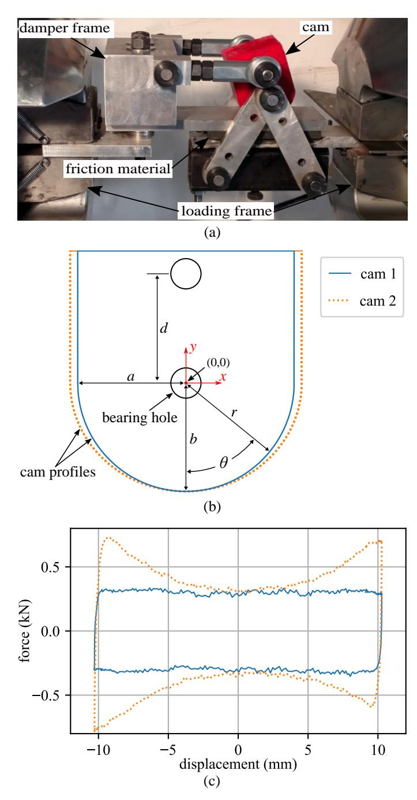
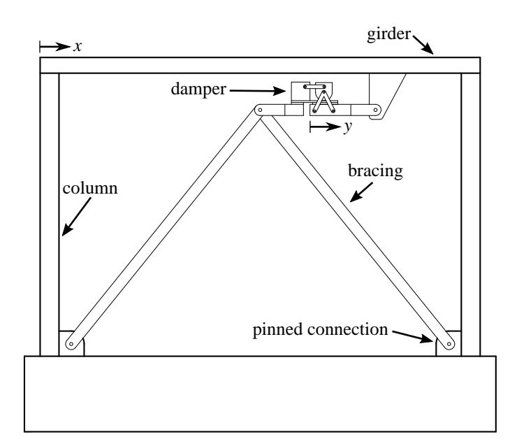
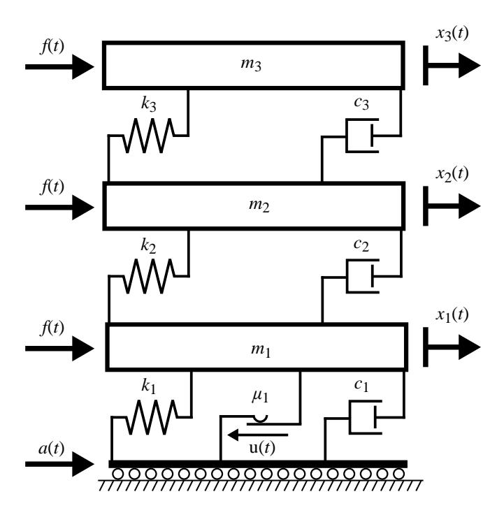
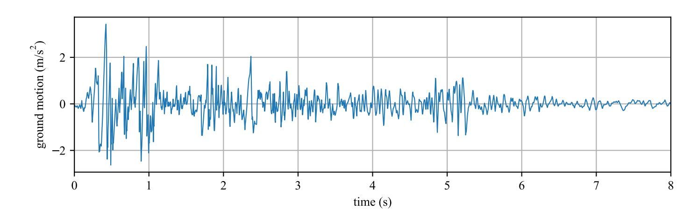
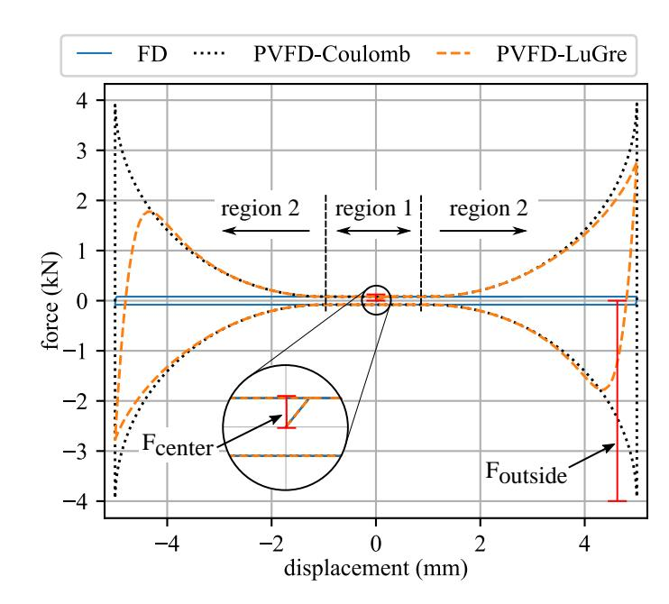
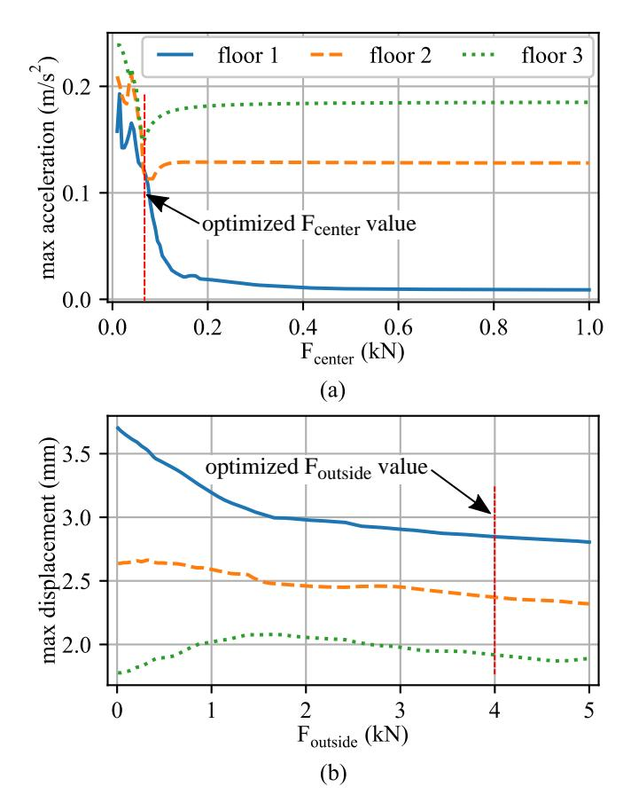
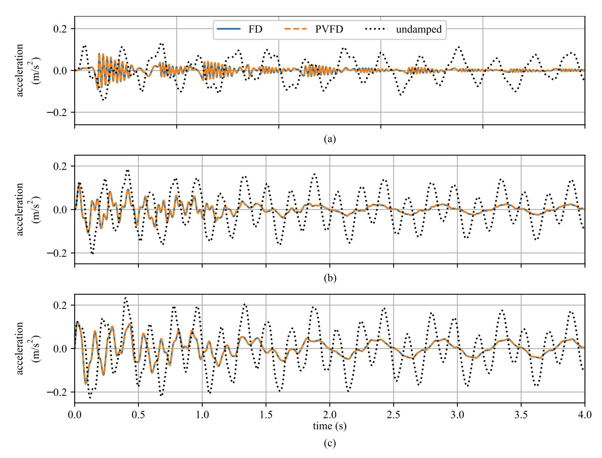
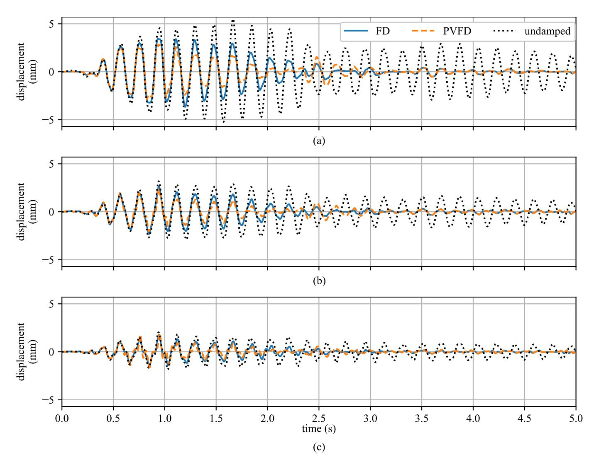

{0}------------------------------------------------

# **PASSIVE VARIABLE FRICTION DAMPER FOR INCREASED STRUCTURAL RESILIENCE TO MULTI-HAZARD EXCITATIONS**

**Austin Downey** \*  
Departments of Mech. Eng.  
and Civil, Const. and Env. Eng.,  
Iowa State University  
Ames, Iowa 50010  
Email:adowney2@iastate.edu

**MohammadKazem Sadoughi** Department of Mech. Eng., Iowa State University Ames, Iowa 50010

**Liang Cao** † ATLSS Eng. Research Center, Lehigh University Bethlehem, Pennsylvania 18015

**Simon Laflamme** Departments of Civil, Const. and Env. Eng. and Elect. and Compt. Eng., Iowa State University Ames, Iowa 50010

**Chao Hu** Departments of Mech. Eng. and Elect. and Compt. Eng., Iowa State University Ames, Iowa 50010

## **ABSTRACT**

*Structural control systems, including passive, semi-active and active damping systems, are used to increase structural resilience to multi-hazard excitations. While semi-active and active damping systems have been investigated for the mitigation of multi-hazard excitations, their requirement for real-time controllers and power availability limit their usefulness. This work proposes the use of a newly developed passive variable friction device for the mitigation of multi-hazard events. This passive variable friction device, when installed in a structure, is capable of mitigating different hazards from wind and ground motions. In wind events, the device ensures serviceability, while during earthquake events, the device reduces the building's inter-story drift to maintain strength-based motion requirements. Results show that the passive variable friction device performs better than a traditional friction damper during a seismic event while not compromising any performance during wind events.*

## **INTRODUCTION**

Strength and serviceability of civil structures can be enhanced through the incorporation of supplemental damping devices, also known as structural control devices, into the structural systems. Structural control devices for civil structures include active devices, semi-active, and passive devices. While literature has demonstrated that semi-active systems are particularly promising at mitigating natural hazards [1–4], they yet necessitate a closed-loop system configuration that includes sensors, actuators, and controllers, therefore adding a non-negligible level of uncertainty on reliability and performance [5]. Conversely, passive devices have been widely accepted by the field of structural engineering due to their simplicity and high reliability [6]. Examples of passive control devices include viscoelastic fluid dampers [7], base-isolation systems [8], and friction dampers (FD) including linear [9] and rotational [10] configurations. However, passive devices perform over a limited bandwidth, and are therefore typically designed to mitigate single types of excitations.

**DETC2018-85207**

\*Address all correspondence to this author.

†Previously affiliated with Iowa State University.

{1}------------------------------------------------

Recently, researchers have investigated altered versions of passive systems capable of higher controllability to enhance their applicability to multi-hazard mitigation. Of interest to the authors are passive variable friction device (PVFDs) that are capable of varying their damping forces without the need for external controllers. Panchal et al. [11] proposed a passive base isolation system that consisted of a concave surface where variations in the damping forces were generated through changing surface friction coefficients. Wang et al. [12] designed and tested a PVFD that used the arc profile of two plates with a polyurethane elastomer slider to generate an increase in damping force from an increase in displacement. Amjadian et al. [13] proposed a passive friction damper that combined a solid-friction and eddy current damping mechanism that reduced the damping force for a given increase in displacement and mitigated the undesirable effects of stickslip motion. The authors of this paper have recently proposed a cam-based PVFD that used the damper's displacement to vary the damping force [14]. This variation was provided through the selection of a cam profile that in turn applied a varying normal force on the sliding interface. As a consequence, the hysteresis profile of the damper was determined through the design of a cam. Experimental testing on a prototype device demonstrated that the device was capable of either reducing, increasing, or maintaining a damping force with an increase in displacement, dependent on the cam profile design.

In this paper, the cam-based PVFD developed by the authors is optimized and numerically investigated for mitigating two non-simultaneous different types of hazards. A single PVFD is mounted in the first floor of a three-story structure, and the design of its profile is accomplished through optimizing the hysteresis loop for both a wind and seismic events. The wind event is optimized for structural serviceability or occupant comfort, while the seismic event is optimized for building strength by minimizing inter-story motion. This multi-objective optimization is performed through a three-step process that first sets the dampers' total displacement based on the structural system under consideration. After this, the central portion of the damper's hysteresis loop is optimized to reduce building acceleration for the wind events. Lastly, the value of the damping force outside the central portion is optimized to limit the inter-story drift that occurs during the ground motion event considered. Throughout this work, the performance of the PVFD is compared against that of a traditional FD. Results show that the PVFD performs at the same level as a traditional FD for the wind event considered but outperforms it for the selected ground motion.

## **PASSIVE VARIABLE FRICTION DAMPER**

The previously proposed PVFD is a passive damper [14] whose damping force is dependent on the damper's displacement and its profile. The damper consists of a parallel plate friction damper with a cam added on top of the parallel plate to provide variations, as a function of the displacement, in the normal force applied to the plates. It results that the cam-based PVFD can generate a range of hysteresis behaviors, dependent on the cam profile selected. An image of a prototype of the damping device, two cam profiles, and two hysteresis behaviors (generated using the two different cam profiles) is presented in Fig. 1. The red cam in Fig. 1(a) is the only element that needs to be changed to alter the damper's hysteresis behavior. In Fig. 1(b), cam 1 is a cam with the profile of a circle (with the center of the circle about the bottom bearing hole) and therefore provides a constant normal force and damping force throughout the damper's range of motion. For this circular cam, the radius of the cam (*r*) is constant for any rotation of the cam (θ). Cam 2 has a profile whose radius increases as the cam rotates away from the center, and therefore generates a higher normal force on the friction material. This increase in the device's normal force results in an increase in its damping force as seen in Fig 1(c). For more detail, including schematics, device characterization, and experimental results for various cam profiles, the interested reader is referred to [14]. The simplicity of modifying the damper's hysteresis behavior through only changing the installed cam allows for a versatile, customized damping system that can be installed throughout a structure with cams individually tuned.

## **Implementation into a structural system**

The PVFD can be installed into almost any damping configurations where it is desired to dissipate energy leveraging lateral displacement. These include configurations that currently use traditional friction dampers or viscous fluid dampers. A potential configuration and the one used in this study is shown in Fig. 2, where the damper is mounted between the top of a chevron brace and the top girder. The chevron installation configuration is commonly utilized with fluid viscous dampers [15, 16]. In this configuration, any lateral displacement in the frame (*x*) is transferred directly to the lateral displacement in the device (*y*), with *x* = *y*. Other types of insulation configurations can be used with the cam-based PVFD including those that increase the damper's displacements over that of the inter-story drift [17].

# **Friction mechanism**

A mathematical model for the damping force generated by the device can be constructed for a known cam profile, friction material properties, and any preload applied to the cam. The change in normal force is a function of the cam's radius *r*:

$$r(\theta) = \frac{a \cdot b}{\sqrt{a^2 \sin^2\left(\theta - \frac{\pi}{2}\right) + b^2 \cos^2\left(\theta - \frac{\pi}{2}\right)}} \quad (1)$$

where θ is the cam's rotation. Radius *r* is measured from the

{2}------------------------------------------------

**FIGURE 1.** CAM-BASED PVFD SHOWING THE: (a) PROTOTYPE DEVICE MOUNTED IN A DYNAMIC TESTING MACHINE; AND (b) CAM PROFILES AND ANNOTATIONS AND (c) HYSTERESIS LOOPS FOR TWO DIFFERENT PROFILES.

origin of the polar coordinate system, as shown in Fig. 1(b). A  $\frac{\pi}{2}$  term is added to Eqn. (1) to allow for  $\theta$  to be measured from the vertical position of a centered cam. The parameters  $a$  and  $b$ ,

**FIGURE 2.** A CHEVRON CONFIGURATION FOR THE PVFD INSTALLED WITHIN A BUILDING'S LATERAL LOAD RESISTING SYSTEM.

also shown in Fig. 1(b), are the semi-major and semi-minor axes of the ellipse, respectively. These are used for characterizing the profiles detailed in Fig. 1(b). Considering that the distance between the bearing holes on the device is  $d$ ,  $\theta$  can be expressed in terms of damper displacement,  $y$ :

$$\theta = \tan^{-1} \left( \frac{y}{d} \right) \quad (2)$$

Starting with a circular cam ( $r_{\text{circle}}$ ) that will develop a constant normal force, a change in the normal loading force can be obtained from a change in the cam's radius  $\Delta r(\theta) = r(\theta) - r_{\text{circle}}$ . Assuming the stiffness of the device ( $k$ ) is known in the orientation of the normal force, the change in normal force is given by:

$$F_{\text{N,cam}}(\theta) = k\Delta r(\theta) \quad (3)$$

where  $F_{N,\text{cam}}$  is the normal force developed by the cam. Adding the preload force  $F_{N,\text{preload}}$  to  $F_{N,\text{cam}}$  the normal force acting on the damper as a function of the dampers rotation ( $F_N(\theta)$ ) is:

$$F_N(\theta) = F_{N,\text{preload}} + F_{N,\text{cam}}(\theta) \quad (4)$$

{3}------------------------------------------------

**FIGURE 3**. THREE-STORY SPRING-DASHPOT-MASS SYSTEM EQUIPPED WITH A SINGLE PVFD.

Next, the Coulomb friction model can be used to calculate the kinetic damping force (*F*kinetic) when the coefficient of kinetic friction (µ) for the friction material is known. Therefore, *F*kinetic(θ) is given as:

$$F_{\text{kinetic}}(\theta) = \mu F_{\text{N}}(\theta) \quad (5)$$

The LuGre friction model is used to capture the dynamic properties of the sliding friction interface, including the stick-slip motion and the Stribeck effect [18, 19]. The LuGre model is an integrated dynamic friction model derived from the elasticity at the contact surfaces of two sliding surfaces and assumes that the friction material is made up of an infinite number of bristles. The LuGre model has been previously applied to a wide range of friction systems due to its effectiveness and relative computational simplicity [20, 21]. First, the static friction force (*F*static) can be calculated by scaling *F*kinetic (a scaling value of 1.02 is used in this work). Next, the device's damping force (*F*damping) can be calculated using the LuGre model as:

$$F_{\text{damping}} = \sigma_0 z + \sigma_1 \dot{z} + \sigma_2 \dot{y} \quad (6)$$

where σ0 describes the stiffness of a bristle for small displace-

**TABLE 1**. DYNAMIC PROPERTIES OF THE THREE-STORY STRUCTURE.

| floor | mass (kg) | stiffness (kN/m) | damping (N s/m) |
|-------|-----------|------------------|-----------------|
| 3     | 98.3      | 684              | 50              |
| 2     | 98.3      | 684              | 50              |
| 1     | 98.3      | 516              | 125             |

ments with a spring-like behavior at the contact point and is called the aggregate bristle stiffness.  $\sigma_1$  represents the damping associated with micro-displacements and  $\sigma_2$  is a memoryless velocity-dependent term for the viscous friction component of the predicted friction force  $F_{\text{damping}}$ . For this work, The LuGre friction model parameters were determined using the experimental data presented in Fig. 1(c) and are  $\sigma_0 = 1 \times 10^7 \text{ m}^{-3}$ ,  $\sigma_1 = 1 \text{ N}\cdot\text{m}^{-1}$ , and  $\sigma_2 = 1 \text{ Pa}\cdot\text{s}\cdot\text{m}^{-1}$ . The variable  $z$  is an evolutionary variable that represents the friction state and can be interpreted as the mean bristle deflection between the two sliding surfaces.  $z$  can be obtained by solving the first order differential equation:

$$\dot{z} = \dot{y} - \sigma_0 \frac{|\dot{y}|}{g(\dot{y})} z \quad (7)$$

where *g*(*y*˙) models both the Coulomb friction and the Stribeck effect. An equation for *g*(*y*˙) that provides a good approximation of the Stribeck effect is:

$$g(\dot{y}) = F_{\text{kinetic}} + (F_{\text{static}} - F_{\text{kinetic}}) \exp(-(\dot{y}/\dot{y}_s)^2) \quad (8)$$

where  $\dot{y}_s$  is a constant representing the Stribeck velocity. A value of  $\dot{y}_s = 0.001$  m/s, obtained experimentally from the data presented in Fig. 1(c), was used in this work. For a more detailed investigation of the LuGre model, the interested reader is referred to [18].

# **METHODOLOGY**

Design for multi-hazard mitigation necessitates some knowledge of the event dynamics to be mitigated. For the purpose of this study, we consider two hazards. The first is a nonextreme wind loading event that is intended to develop accelerations similar to those normally encountered by the structure. The second excitation considered is a ground motion that is intended to develop forces similar to an earthquake with a high-damage potential. This study uses a numerical simulation to validate the proposed multi-hazard design mitigation approach for a threestory building equipped with a single PVFD mounted between

{4}------------------------------------------------

**FIGURE 4**. GROUND MOTION EXCITATION TAKEN FROM THE IMPERIAL VALLEY EARTHQUAKE, AS MEASURED AT THE EL CEN-TRO TERMINAL SUBSTATION, USED FOR VALIDATING THE CAM-BASED PVFD FOR A GROUND MOTION EXCITATION.

**FIGURE 5**. HYSTERESIS LOOPS FOR A TRADITIONAL FD AND THE CAM-BASED PVFD MODELED WITH BOTH THE COULOMB AND LUGRE FRICTION MODELS.

the ground and first floor as shown in Fig. 3. The three-story building, modeled as a spring-dashpot-mass system, was originally presented by Dyke et al. [22] and its dynamic properties are listed in Tab. 1. The wind load, annotated as *f*(*t*) in Fig. 3, used in this introductory work is a 2 Hz sinusoidal loading with a minimum loading of 0 N and a maximum loading of 50 N. The load is applied to all three floors as show in Fig. 3 and assumes a fixed boundary condition at the bottom of the structure.

**FIGURE 6**. OPTIMIZATION RESULTS FOR: (a) MAXIMUM AC-CELERATION UNDER THE WIND LOAD; AND (b) MAXIMUM INTER-STORY DRIFT FOR THE GROUND MOTION EXCITA-TION.

{5}------------------------------------------------

**FIGURE 7**. ACCELERATION RESULTS FOR THE SIMULATED 3 STORY BUILDING UNDER THE SINUSOIDAL WIND LOAD FOR: (a) FLOOR 1; (b) FLOOR 2; AND (c) FLOOR 3.

The acceleration data (*a*(*t*)) is applied to the base of the springdashpot-mass system in Fig. 3. For this work, the ground motion data is taken from the north-south component of the May 18th, 1940 Imperial Valley earthquake as measured at the El Centro Terminal Substation [23]. The ground motion, scaled to match the three-story building's dynamics, is shown in Fig. 4.

Since under wind loading the risk of severe building damage is low, the control objective is serviceability. This is achieved through the design of a PVFD that keeps the acceleration of the building under a desired threshold. In contrast to the wind event, an earthquake poses a severe threat to the strength of the building. During these events, a major threat to the building's structural integrity is the level of inter-story displacement experienced as this has the potential to yield connections, crack masonry, or overturn structural supporting members. Any of these conditions could lead to severe building damage or catastrophic collapse. Therefore, to mitigate this risk the PVFD is designed to minimize building's inter-story drift. However, as high levels of acceleration can cause damage to the building or injure occupants, the maximum allowed acceleration for any floor during the ground motion excitation was set to an arbitrarily selected 1.5 g.

Based on the aforementioned criteria, a hysteresis loop can be designed for the cam-based PVFD that considers both of these hazards and optimization conditions. This multi-hazard design process for the PVFD is best performed in the forcedisplacement phase space shown in Fig. 5. Here, region 1 is the portion of the PVFD hysteresis loop that is designed for the excitations that generate low displacement (i.e. wind loads) where

{6}------------------------------------------------

**FIGURE 8**. DISPLACEMENT RESULTS FOR THE SIMULATED 3 STORY BUILDING UNDER THE GROUND MOTION LOAD FOR: (a) FLOOR 1; (b) FLOOR 2; AND (c) FLOOR 3.

occupant comfort is the control objective while region 2 is designed for the higher-energy inputs where strength is the design objective. For the normal wind loading case, the building displacement should be completely restrained within region 1. In this scenario, the PVFD acts analogous to a traditional FD. During a ground motion event, the damper will displace further and, as a result, will develop the increasing damping forces present in region 2. This increase in the damping forces is to limit the building's inter-story displacements. Fig. 5 also shows the hysteresis loop for a traditional FD that extends the damping capacity of the PVFD in region 1 over the entire displacement. This traditional friction damper is used throughout the remainder of this work as a baseline comparison for the PVFD.

The hysteresis loop for the design process is calculated us-

ing a step-wise version of Eqn. (1 - 8) where region 1 uses a circular cam (i.e. *r* = *a* = *b*) and region 2 adjusts *a* and *b* as required to generate the desired hysteresis loop. Due to the LuGre friction model being dependent on the velocity of the damper, the damper parameters are designed using the Coulomb friction model. These parameters include the overall length of the damper displacement, the length of region 1, the damping force in region 1 (*F*center) and the maximum damping force in region 2 (*F*outside). The design process used in this work is as follows:

- 1. Set the length of region 1 and the total damper displacement based on the maximum expected displacements for the wind loading and earthquake excitations, respectively.
- 2. Minimize the maximum acceleration value for the building for the wind loading through optimizing the design parame-

{7}------------------------------------------------

- ter *F*center.
- 3. Determine the *F*outside value that reduces the maximum interstory drift in the building while ensuring that no location in the building experiences an acceleration of over 1.5 g.

#### **RESULTS**

This section reports the results from the numerical investigation of the PVFD installed in the three-story structure. First, the optimization results, as presented in Fig. 6, are discussed. Fig. 6(a) reports the maximum acceleration values for floors 1-3 for the wind loading. As floor 3 experiences the highest acceleration under these loads, it is used to set the optimized value for *F*center. In this case, a value of 80 N is selected. Next, Fig. 6(b) reports the max displacement for the range of *F*outside values investigated. For the investigated values, a *F*outside of 4 kN provided the lowest maximum inter-story displacement for the building (located in floor 1) while also ensuring that the maximum acceleration of any location in the building does not exceed 1.5 g. The hysteresis loop for the optimized damper is shown in Fig. 5.

Next, the building's temporal response for both loading cases in terms of the output parameters of interest are presented in Figs. 7 and 8. Fig. 7 shows the building's acceleration response to the wind loading for all three floors. Note that the response for the PVFD is identical to that provided by a traditional FD. This is as expected as the damper's total displacement stays within region 1. Also, the damped structure is capable of a reduction in acceleration throughout the entire event. The floor with the highest acceleration, floor 3, benefits the most from the installation of a friction damping device. The displacement results for the ground motion event are shown in Fig. 8. While all three floors experience a reduction in inter-story drift throughout the entire event, floor 1 experiences the greatest reduction in inter-story drift due to the presence of a damping device. While the traditional FD is capable of reducing the displacement at the first floor, as shown by the solid blue line in Fig. 8(a), the PVFD achieves a greater reduction in overall displacement without sacrificing any structural control performance during the wind event. While the increase in damping force provided by the PVFD does increase the acceleration present in the building during the ground motion event, this is considered acceptable as these events are rare and the structural control objective is based on strength. In this study, the highest acceleration experienced during the ground motion event excitation was 1.5 g and was experienced at floor 1.

#### **CONCLUSION**

This work proposed the use of a newly developed passive variable friction device for the mitigation of multi-hazard events. This cam-based passive variable friction device (PVFD) is installed in a building's lateral load carrying structural system and is capable of generating varying damping forces as a function of the damper's displacement. During normal wind loadings, the device is optimized to reduce the buildings acceleration, and therefore increase the comfort of the occupants. However, during ground motion events, the damper is capable of limiting the building inter-story drift and is, therefore, able to help prevent the yielding of critical structural members. A numerical investigation shows that the PVFD outperformed a traditional friction damper in terms of limiting inter-story drift during an earthquake while performing identically to the same traditional friction damper in a wind event. Avenues for future work include the investigation of an increased number of loading conditions and the deployment of multiple dampers within a structural system.

# **ACKNOWLEDGMENT**

This material is based upon work supported by the National Science Foundation under Grants No. 1300960, 1463252, and 1537626. This work is also partly supported by the National Science Foundation Grant No. 1069283, which supports the activities of the Integrative Graduate Education and Research Traineeship (IGERT) in Wind Energy Science, Engineering and Policy (WESEP) at Iowa State University. The support of the National Science Foundation is gratefully acknowledged. Any opinions, findings, and conclusions or recommendations expressed in this material are those of the authors and do not necessarily reflect the views of the National Science Foundation.

#### **REFERENCES**

- [1] Lu, L.-Y., Lin, T.-K., Jheng, R.-J., and Wu, H.-H., 2018. "Theoretical and experimental investigation of positioncontrolled semi-active friction damper for seismic structures". *Journal of Sound and Vibration, 412*, jan, pp. 184–
- 206. [2] Samani, H. R., Mirtaheri, M., and Zandi, A. P., 2015. "Experimental and numerical study of a new adjustable frictional damper". *Journal of Constructional Steel Research, 112*, sep, pp. 354–362. [3] Cao, L., Downey, A., Laflamme, S., Taylor, D., and Ricles, J., 2015. "Variable friction device for structural control based on duo-servo vehicle brake: Modeling and experimental validation". *Journal of Sound and Vibration, 348*, jul, pp. 41–56. [4] Downey, A., Cao, L., Laflamme, S., Taylor, D., and Ricles, J., 2016. "High capacity variable friction damper based on band brake technology". *Engineering Structures, 113*, apr, pp. 287–298. [5] Connor, J., and Laflamme, S., 2014. *Structural Motion Engineering*. Springer International Publishing. [6] Symans, M. D., Charney, F. A., Whittaker, A. S., Constantinou, M. C., Kircher, C. A., Johnson, M. W., and McNa-

{8}------------------------------------------------

- mara, R. J., 2008. "Energy dissipation systems for seismic applications: Current practice and recent developments". *Journal of Structural Engineering, 134*(1), jan, pp. 3–21. [7] Lu, L.-Y., Lin, C.-C., and Lin, G.-L., 2013. "Experimental evaluation of supplemental viscous damping for a sliding isolation system under pulse-like base excitations". *Journal of Sound and Vibration, 332*(8), apr, pp. 1982–1999. [8] Sato, E., Furukawa, S., Kakehi, A., and Nakashima, M., 2011. "Full-scale shaking table test for examination of safety and functionality of base-isolated medical facilities". *Earthquake Engineering & Structural Dynamics, 40*(13), jan, pp. 1435–1453. [9] Aiken, I. D., Nims, D. K., Whittaker, A. S., and Kelly,
- J. M., 1993. "Testing of passive energy dissipation systems". *Earthquake Spectra, 9*(3), aug, pp. 335–370. [10] Pall, A. S., and Marsh, C., 1982. "Response of friction damped braced frames". *Journal of Structural Engineering, 108*(9), pp. 1313–1323. [11] Panchal, V. R., and Jangid, R. S., 2008. "Variable friction pendulum system for near-fault ground motions". *Structural Control and Health Monitoring, 15*(4), pp. 568–584. [12] Wang, G., Wang, Y., Yuan, J., Yang, Y., and Wang, D., 2017. "Modeling and experimental investigation of a novel arc-surfaced frictional damper". *Journal of Sound and Vibration, 389*, feb, pp. 89–100. [13] Amjadian, M., and Agrawal, A. K., 2017. "A passive electromagnetic eddy current friction damper (PEMECFD): Theoretical and analytical modeling". *Structural Control and Health Monitoring, 24*(10), feb, p. e1978. [14] Downey, A., Theisen, C., Murphy, H., Anastasi, N., and amme, S. L., 2018 (submitted). "3d printed cam-based passive variable friction device for structural control". *Journal of Sound and Vibration*. [15] Guo, T., Xu, J., Xu, W., and Di, Z., 2015. "Seismic upgrade of existing buildings with fluid viscous dampers: Design methodologies and case study". *Journal of Performance of Constructed Facilities, 29*(6), dec, p. 04014175. [16] Polat, E., and Constantinou, M. C., 2017. "Openspace damping system description, theory, and verification". *Journal of Structural Engineering, 143*(4), apr,
- p. 04016201. [17] Constantinou, M. C., Tsopelas, P., Hammel, W., and Sigaher, A. N., 2001. "Toggle-brace-damper seismic energy dissipation systems". *Journal of Structural Engineering, 127*(2), feb, pp. 105–112. [18] Astrom, K., and de Wit, C. C., 2008. "Revisiting the Lu-Gre friction model". *IEEE Control Systems, 28*(6), dec, pp. 101–114. [19] Olsson, H., Astr ˚ om, K., de Wit, C. C., G ¨ afvert, M., and ¨ Lischinsky, P., 1998. "Friction models and friction compensation". *European Journal of Control, 4*(3), jan, pp. 176–
- 195. [20] Freidovich, L., Robertsson, A., Shiriaev, A., and Johansson, R., 2010. "LuGre-model-based friction compensation". *IEEE Transactions on Control Systems Technology, 18*(1), jan, pp. 194–200. [21] Lischinsky, P., de Wit, C. C., and Morel, G., 1999. "Friction compensation for an industrial hydraulic robot". *IEEE Control Systems, 19*(1), feb, pp. 25–32. [22] Dyke, S., and Spencer, B., 1999. "A comparison of semiactive control strategies for the MR damper". In Proceedings Intelligent Information Systems. IIS'97, IEEE Comput. Soc. [23] PEER, 2010. Peer, pacific earthquake engineering research center.