{0}------------------------------------------------

# Physics-based prognostics of lithium-ion battery using non-linear least squares with dynamic bounds

Austin Downey[a](#page-0-0) , Yu-Hui Lui[b](#page-0-1) , Chao Hu[⁎](#page-0-2)[,b,](#page-0-1)[c](#page-0-3) , Simon Laflamme[c](#page-0-3)[,d](#page-0-4) , Shan H[ub](#page-0-1)

#### ARTICLE INFO

#### Keywords:

Lithium-ion battery

#### Prognostics

Degradation mechanisms

Non-linear least squares

Dynamic bounds

#### ABSTRACT

Real-time health diagnostics/prognostics and predictive maintenance/control of lithium-ion (Li-ion) batteries are essential to reliable and safe battery operation. This paper presents a physics-based (or mechanistic) approach to Li-ion battery prognostics, which enables online prediction of remaining useful life (RUL) with consideration of multiple concurrent degradation mechanisms. In the proposed approach, robust online prediction of RUL is achieved by employing a non-linear least squares method with dynamic bounds that traces the evolution of individual degradation parameters. The novelty of this approach lies in its ability to incorporate mechanistic degradation analysis results into RUL predictions using nonlinear models. Results from a simulation study with eight Li-ion battery cells demonstrate that the mechanistic prognostics approach produces more accurate RUL predictions than a traditional capacity-based prognostics approach in 78 of the 80 cases considered (97.5% of the time). Additionally, it is shown that the use of dynamic bounds ensures a low level of uncertainty in the prediction throughout the entire life of a cell.

## 1. Introduction

Lithium-ion (Li-ion) batteries are widely used in consumer electronics, implantable medical devices, and transportation applications, however, with age the electrical performance of the cell decreases [1–[5\]](#page-11-0). The cell's capacity is the total amount of energy stored in the fully charged cell and is an important indicator of the state of health of the cell [6–[8\];](#page-11-1) remaining useful life (RUL) refers to the available service time or number of charge-discharge cycles left before the capacity fade reaches an unacceptable level [\[8,9\]](#page-11-2). Extensive research has been conducted on RUL assessment of general engineered systems. In general, three categories of approaches have been developed to estimate RUL distribution: (i) model-based approaches [10–[16\],](#page-11-3) (ii) data-driven approaches [17–[23\]](#page-11-4), and (iii) hybrid approaches [24–[26\].](#page-11-5) These approaches, although not developed specifically for Li-ion battery prognostics, can generally be adapted for RUL assessment of Li-ion batteries. One of the earliest studies on Li-ion battery prognostics proposed a Bayesian framework with particle filter for RUL prediction of Li-ion battery based on impedance measurements [\[27\].](#page-11-6) To eliminate need for impedance measurement equipment, researchers developed various model-based approaches that predict RUL by extrapolating a capacity

fade model [\[3,28](#page-11-7)–37]. Most of these approaches develop RUL prediction by simply modeling and extrapolating the capacity fade via the use of non-linear least squares (NLLS) [\[28,31\]](#page-11-8) or particle filter [3,28–31,33–[35,37\]](#page-11-7), without understanding the underlying degradation mechanisms (see the classical approach in [Fig. 1\)](#page-1-0). Such an extrapolation does not consider the degradation from any underlying mechanism and thus could result in an intolerably large prediction error [\[38\]](#page-11-9).

This research proposes a novel physics-based (or mechanistic) prognostics approach where robust prediction of RUL is achieved by leveraging quantitative degradation analysis in a model-based prognostics framework (see [Fig. 1](#page-1-0)). The proposed approach, termed mechanistic prognostics, captures the trends of degradation from three major mechanisms. These degradation parameters include the loss of active materials (LAMs) of the positive and negative electrodes, mp and mn, and the (relative) slippage of the positive electrode, δpn (i.e. loss of lithium inventory (LLI)). Post-mortem analyses of aged Li-ion cells have identified these mechanisms as major causes of capacity loss [\[39](#page-11-10)–41]. The frameworks and implementation details of the classical capacitybased prognostics approach and the proposed mechanistic prognostics approach are graphically presented in [Fig. 2.](#page-1-1) While the mechanistic

aDepartment of Mechanical Engineering, University of South Carolina, Columbia, SC, USA

bDepartment of Mechanical Engineering, Iowa State University, Ames, IA, USA

Department of Electrical and Computer Engineering, Iowa State University, Ames, IA, USA

dDepartment of Civil, Construction, and Environmental Engineering, Iowa State University, Ames, IA, USA

⁎ Corresponding author at: Iowa State University, Mechanical Engineering, 2026 Black Engineering Bldg., Ames, IA 50011, USA.

E-mail addresses: [chaohu@iastate.edu,](mailto:chaohu@iastate.edu) [huchaostu@gmail.com](mailto:huchaostu@gmail.com) (C. Hu).

{1}------------------------------------------------

prognostics approach proposed here is specifically formulated for the prognostics of Li-ion batteries, this approach could also be implemented in any other engineered system where the system can be decomposed into its constituent components and the system health is dependent on the health of each component [\[42\]](#page-11-11).

Modeling the trends of degradation from the three mechanisms requires the selection of an appropriate method. In this work, an NLLS method is selected due to its robustness, simplicity, and computational efficiency [\[31\]](#page-11-12). The use of NLLS for battery prognostics through tracking the trend of capacity fade has been well studied in the literature [\[28,31\].](#page-11-8) When a proper mathematical model is selected, NLLS is capable of providing an accurate representation of the data set. Once an appropriate model has been selected (in the offline phase) and the model's coefficients have been determined using the NLLS method (in the online phase), the fitted model can be used to extrapolate the data set into the future for online prognostics. In the proposed mechanistic prognostics approach, three mathematical models are used to capture the evolutions of the three degradation parameters (i.e. one model for each degradation parameter). These mathematical models are then used to extrapolate the degradation parameter estimates over future charge-discharge cycles to the point where the cell capacity reaches the failure limit. The parameter estimates at any given cycle are then used as inputs for a half-cell model, as shown in [Fig. 3,](#page-2-0) to provide an estimate of the cell capacity.

As mentioned before, NLLS requires the selection of a proper mathematical model. With only a limited number of observations from a testing (online) data set, the model coefficients solved for by the NLLS algorithm are generally unsatisfactory. Given additional information from training (offline) data sets, all or some of the coefficients can be constrained within predefined ranges of the coefficients solved for using the additional information. Various restrictions on the model coefficients are presented in this work, all of which are set through the use of

Fig. 1. Schematic diagrams of the existing and proposed battery prognostic approaches.

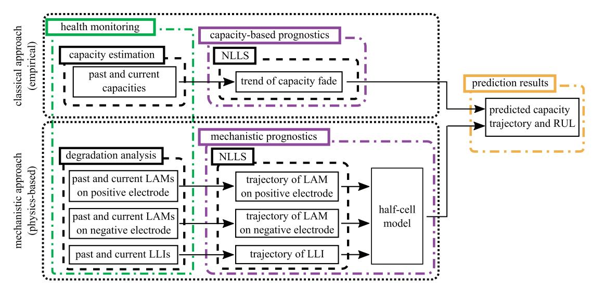

Fig. 2. Flowchart detailing the methods and sequence of steps in the implementations of the classical capacity-based prognostics approach and the proposed mechanistic prognostics approach.

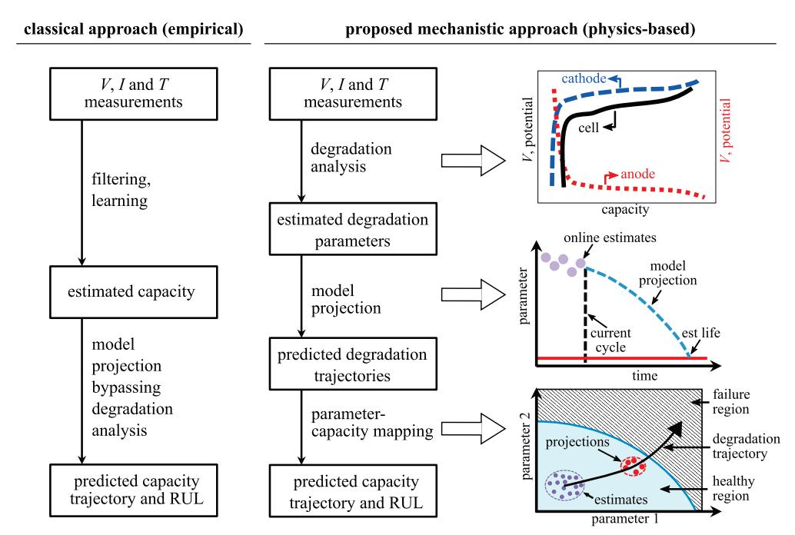

{2}------------------------------------------------

a training data set. Bounding the coefficients within a certain percentage of the "best-fit" coefficients obtained using a training set was found to be most accurate and convenient, within certain limitations. Models with tighter bounds tend to produce predicted RULs closer to those predicted by the training set while models with less stringent bounds were more capable of adapting to the true degradation behavior of the cell, particularly in cases where the true degradation trend of the cell greatly varies from those of the training cells. To compensate for this tradeoff between the tighter and losers bounds, this work introduces the concept of dynamic bounds. These dynamic bounds result in a prognostics approach that relies heavily on its training set in the early stage of the cell's life and slowly loses its reliance as the cell's life progresses.

#### 2. Review

This section provides a review of the analytical half-cell model, onboard estimation of degradation parameters, and the non-linear least squares method for battery prognostics.

## 2.1. Half-cell model

Half-cell curve analysis was first introduced by Bloom et al. and later popularized by Dahn's group as a non-destructive method to analyze the health of a battery cell by reproducing the full-cell curve through two half-cell curves, the positive electrode half-cell curve and the negative electrode half-cell curve [\[43,44\]](#page-11-13). The half-cell curve analysis is done by reconstructing the differential voltage/capacity (dVdQ/ dQdV) of the full-cell curve by taking the difference between those of the positive and negative electrodes. The dVdQ curves are used to reveal the electrodes phase transformation during charge and discharge as peaks, which are easier to visualize. These peaks serve as the characteristic features that facilitate the curve fitting during the half-cell curve analysis. Three important degradation parameters of a battery cell, LLI and LAMs on both electrodes, can be extracted from the analysis.

The mass of active material is used to adjust the width of the halfcell curve of each electrode. The LLI is analyzed through the relative movement of the two half-cell curves. Researchers have shown that a full-cell curve constructed through half-cell curve analysis by adjusting

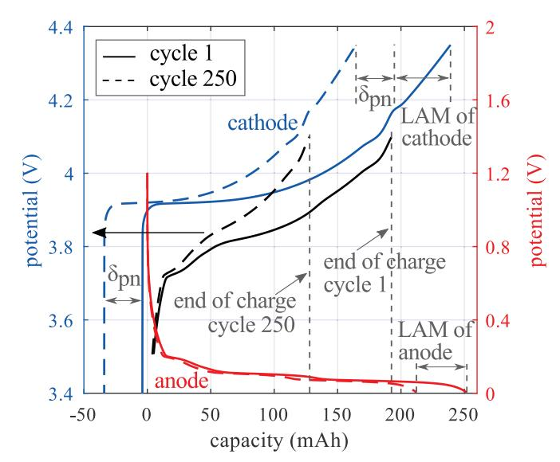

the three degradation parameters can achieve decent agreement with a measured full-cell curve [\[43,44\]](#page-11-13). An illustration of half-cell curve analysis is shown in [Fig. 4.](#page-2-1)

In this work, the three degradation parameters are assumed to evolve over time following certain rules that have been reported in the literature. Specifically, LLI grows proportionally to the square root of time (i.e. following the t 1/2 rule) [\[45\]](#page-11-14) and the growth of LAM on either electrode follows an exponential function [\[46\].](#page-11-15) The resulting capacity is calculated through a differential voltage analysis algorithm which used LiCoO2 and graphite half-cell curve data to calculate the full-cell curve data with cutoff voltage of 3.5 V for end-of-discharge voltage and 4.1 V for end-of-charge voltage. A flowchart depicting the half-cell model is shown in [Fig. 3.](#page-2-0)

## 2.2. On-board estimation of degradation parameters

Early identification of reliability issues and proactive prevention of failures require the capability of battery management system (BMS). More specifically, BMS should be capable of on-board estimation of the degradation parameters (i.e., LLI, and LAMs on both electrodes) of individual battery cells that quantify the degrees of degradation from the mechanisms. Most recent works have focused on offline estimation of the degradation parameters using the half-cell model [\[43,47\].](#page-11-13) Existing parameter estimation methods use either least-squares numerical optimization [\[44,48\]](#page-11-16) or stochastic optimization [\[49\]](#page-11-17) to determine optimum values of the degradation parameters that produce the best agreement between the measured and estimated full-cell V vs. Q or dV/dQ vs. Q curves. These methods are well suited for the diagnostics of degradation mechanisms in an offline environment, where a precise measurement of the V vs. Q curve (and thus the dV/dQ vs. Q curve) can be obtained using high-precision testing equipment. However, none of these offline methods consider the various noise sources in the on-board measurements of V and Q. To the authors' knowledge, the only work that attempted to make half-cell analysis applicable to on-board BMS adopted particle filtering to infer the degradation parameters from the measurement of the full-cell dV/dQ curve [\[50\]](#page-11-18). Nevertheless, this recent work did not consider noise in the on-board measurements of V and Q. The proposed methodology assumes that the estimation errors of the three degradation parameters all follow zero-mean Gaussian distributions with the following values of standard deviation: 0.25 mg for mp and mn and 0.05 mAh for δpn. These values are derived from preliminary investigations conducted by the authors. To ensure that the

Fig. 3. Flowchart detailing the half-cell model that is used to generate simulated cell data and produce capacity values for the proposed mechanistic prognostics approach.

Fig. 4. Half-cell curve analysis with the key components annotated.

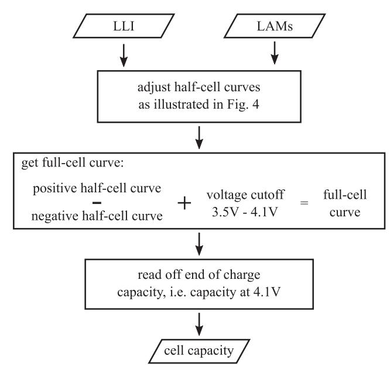

{3}------------------------------------------------

proposed mechanistic prognostics approach is capable of dealing with higher levels of uncertainty in parameter estimation, a noise investigation is carried out in this work.

#### 2.3. Non-linear least squares method

Non-linear least squares (NLLS) is a form of least squares analysis that is used to fit a nonlinear mathematical model with n unknown coefficients to m observations, such that m > n. Computationally, NLLS are solved through successive iterations of a two-step process. First, the selected nonlinear mathematical model is linearized around the initial guesses for the model coefficients using a first-order Taylor series and solved. Secondly, the error between the initial guess and the solved model is calculated. The two steps are repeated till a minimization of the error is obtained. This iterative process requires good initial guesses to enable short calculation times. The requirement can easily be met for the work presented here as the number of unknown coefficients (n) is relatively low, being only 3 or 4 as presented in the following section. Additionally, the same degradation parameters from different battery cells evolve in a similar manner, allowing for static initial guesses for any given parameter. For the duration of this work, the NLLS fitting is accomplished using the Symfit Python package [\[51\].](#page-11-19)

#### 3. Methodology

Investigation of the newly proposed mechanistic prognostics approach was performed using degradation parameter estimates synthetically generated for eight Li-ion battery cells. The synthetic data generation involved two steps. In the first step, the true degradation parameters for eight cells were generated using eight sets of model parameter data with each set depicting the evolution of the LAMs on the positive and negative electrodes and the relative slippage on the positive electrode [\[46\].](#page-11-15) The evolution of the LAM on the positive or negative electrode follows an exponential function in the following:

$$m(t) = m_0 - a \cdot e^{-b/t} \quad (1)$$

where m(t) is the mass of the positive or negative active material as a function of the number of cycles (t) and m0 is the initial active mass (g). The variables a and b are used as adjustable coefficients to introduce cell-to-cell variation. The equation used for the relative slippage follows the square root of time [\[45,46\]](#page-11-14) and takes the following form:

$$\delta_{\text{pn}}(t) = \delta_{\text{pn},0} - a \cdot t^{1/2} \quad (2)$$

where δpn(t) is the relative slippage as a function of the number of cycles (t), δpn, 0 is the initial slippage due to the formation of an initial solid electrolyte interface layer, and a is an adjustable parameter to introduce cell-to-cell variation. The true capacities of each cell were then calculated through the use of the half-cell model that takes the cell's degradation parameters as inputs. The capacity and parameter data sets span 250 charge-discharge cycles and are presented in [Fig. 5](#page-4-0) as data lines of various styles.

In the second step, a noise was introduced into the degradation parameter data as a normally distributed Gaussian noise and is intended to simulate the estimation error that would be present during the process of inferring the parameters from the full-cell V and Q measurements as discussed in [Section 2.2](#page-2-2). To investigate the effects of noise (or estimation error) on the performance of the mechanistic prognostics approach, integer multiples of the previously defined standard deviations were applied to the data sets. [Fig. 5](#page-4-0) presents the parameter estimates used for the eight cells, where the noisy parameter estimates (dots) are distributed about the true parameter values (lines). To improve readability, [Fig. 5](#page-4-0) presents every fourth data point for the highest level of noise tested, fifty times that defined in [Section 2.2](#page-2-2).

Mathematical models for the capacity and degradation parameters were chosen that were capable of accurately reproducing the non-linear shapes of a cell's capacity and degradation parameters, while still maintaining simple mathematical expressions. For consistency with previously published work in the field [\[28,31\]](#page-11-8), the following mathematical model was used for the implementation of the capacity-based prognostics approach:

$$M(t) = a \cdot e^{b \cdot t} + c \cdot e^{d \cdot t} \quad (3)$$

where M is the model output, t is the number of charge-discharge cycles and a, b, c, and d are the coefficients that need to be determined via online model fitting. Due to its versatility, [Eq. \(3\)](#page-3-0) was also used to model the evolution of the relative slippage on the positive electrode. A similar equation was developed for modeling the evolutions of the active masses (and thus LAMs) on the positive and negative electrodes:

$$M(t) = a \cdot e^{b \cdot t} + c \cdot (1 - e^{d \cdot t}) \quad (4)$$

 $a$ ,  $c$ , and  $d$  and are the coefficients that need to be determined online and  $b = 0$  is considered a constant. This formulation of the equation was chosen for its consistency with Eq. (3) in terms of the number of parameters, and their locations and relative effects on the final fitting results. Online degradation tracking was achieved by determining the model's best-fit coefficients based on the current and past observations. The fitted models were then used to infer the degradation parameters past the current observation point (or cycle). In this work, four model fitting strategies are used, and these include: i) fitting 1 coefficient ( $c$ ), ii) fitting 2 coefficients ( $c$  and  $d$ ), iii) fitting all coefficients unbounded (with  $b = 0$  for Eq. (4)), and iv) fitting all coefficients with various levels of percentage bounds. These model fitting strategies were selected for continuity with previously published work [28,31]. In all these cases, except fitting all coefficients, the remaining coefficients were set using training data. For each testing cell, its training set was formed from the data from the other seven cells. The cells, numbered #1 through 8 are ordered such that cell #1 is the cell with the least disagreement between itself and its training set, while cell #8 is the cell with the highest level of disagreement between itself and its training set. Therefore, the cells considered in this work consist of cells that act similar to the average of their respective training sets (e.g. cells #1, 2, and 3) and cells that can be considered as outliers (e.g. cells #6, 7, and 8).

For the bounded data sets, parameter bounds are set as a percentage of the coefficient's(a, b, c, and d) value, as determined by the cell's training set. A tighter bound will force the NLLS algorithm to maintain a prediction closer to the prediction generated by the training set, while a looser bound will allow the model to rely more on observation data as it becomes available. RUL predictions made in the early stages of the cell's life cycle benefit from the tighter bounds as they have a higher reliance on the training data set. However, as more observations become available the looser bounds allow the mechanistic prognostics approach to learn from the online observations. To leverage the benefits of both the tighter (early-stage benefits) and loser (late-stage benefits) bounds, the concept of dynamic bounds that shift throughout the life cycle of a battery cell is introduced, termed dynamic bounds. Here, the concept of dynamic bounds is investigated using three equations to control the dynamic bounds, as presented in [Fig. 6.](#page-5-0) These include linear, exponential, and logarithmic growth functions that were selected to demonstrate the effects of dynamic bounds under various situations. Functions used in developing the dynamic bounds, as presented in [Fig. 6,](#page-5-0) are unity functions that start with 0 at charge-discharge cycle 0 and scale to 1 at cycle 250, the last measurement point in the capacity and parameter data sets. This allows the bounds to be scaled to fit various final bound values following the different progression shapes presented in [Fig. 6](#page-5-0). For example, a dynamic bound with a final value set to 500% would start with 0 at cycle 0 (relying completely on the training set to select the model parameters) and finish as 500% at cycle 250. At 250 cycles, the model fitting for a testing cell relies completely on the cell's observations as a 500% difference from the training sets coefficients was found to be unobtainable at 250 cycles for all the data

{4}------------------------------------------------

sets tested here. As expected, the charge-discharge cycle where the bounds cease to affect the coefficient selection is dependent on a cell's capacity level, the level of agreement between that cell and its training set and the level of the bounds set. The effect of changing the final bound values on the prognostics results was investigated for 70 evenly spaced final bound values between 0 and 500%. Each final bound value was repeated three times, for all eight cells, at the noise levels discussed in [Section 2.2](#page-2-2) to obtain a clearer representation of a typical response. In total, 10,080 individual cell cases were investigated for the six dynamic bounds cases considered.

Comparison of the capacity-based and mechanistic prognostics approaches is achieved by calculating the mean RUL prediction error for each of the eight cells over five runs. The aforementioned model fitting strategies, 1 coefficient, 2 coefficients, all coefficients unbounded, and all coefficients bounded at 5, 10, 25, 50, and 75%, are investigated. Additionally, dynamic bounds for the linear, exponential and logarithmic control equations with a final bound value of 500% are also investigated.

A noise study was performed to investigate how the level of noise present in the online measurements (or estimates) of the capacity and degradation parameters manifests itself in the RUL predictions for both the capacity-based and mechanistic prognostics approaches. Noise was added as fifty integer multiples to the levels of noise assumed to be present in the online measurement of cell parameters, as discussed in [Section 2.2.](#page-2-2) These tests were again repeated 3 times to obtain a general representation of how noise affects prognostics and to limit the effect of any single sample points of high noise. The data is presented as the average error over all eight cells tested, for 5 model fitting strategists for both prognostics methods. In total, 12,000 noise cases for individual cell cases were investigated in this noise study. Lastly, the increase in online computational resources required by the proposed mechanistic approach over that by the classical capacity-based approach is

Fig. 5. Degradation cases for 8 cell models, generated with the highest level of measurement noise, showing the: (a-b) capacity data; (c-d) mass loss of the positive electrode; (e-f) mass loss of the negative electrode; and (g-h) positive electrode slippage where (a),(c),(e), and (g) report the results for cells #1-4 and (b),(d),(f), and (h) report the results for cells #5-8.

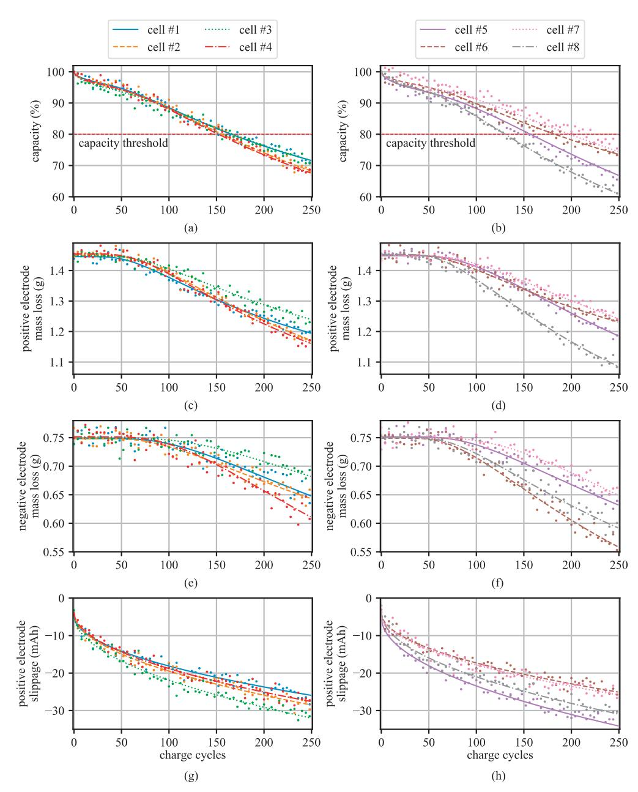

{5}------------------------------------------------

investigated.

### 4. Results

This section presents the results for the proposed mechanistic prognostics approach, including the proposed dynamic bounds used in selecting the mathematical model's coefficients.

#### 4.1. Remaining useful life predictions

Computation of the RUL can be made at any point, termed inspection point, in the life cycle of a battery cell. [Fig. 7](#page-6-0) presents the capacity predictions for cell #4 (testing cell) using the capacity-based ([Fig. 7](#page-6-0)(a)–(c)) and the mechanistic prognostics [\(Fig. 7\(](#page-6-0)d)–(f)) approaches for various coefficient fitting strategies. Cell #4 was selected because it provides a clear illustration of several key prognostics features. First, it can be observed that the testing cell and its training set, generated from the other 7 cells, do not strongly agree. More precisely, the training set estimates that the cell should reach its capacity threshold in 176 cycles versus the 152 cycles achieved by cell #4. Model fitting strategies that rely heavily on the training set (e.g. 1 coefficient and bounded 5%) produce capacity estimates for the testing cell that stay close to those of the training set. In contrast, fitting strategies that impose looser bounds on the parameters (e.g. 2 coefficients, all coefficients unbounded, and all coefficients bounded at 50%) can produce capacity estimates that vary greatly from those by the training set, allowing them to take advantage of new observation data as it becomes available. However, this feature means that the predictions made by these strategies can diverge from the data when a low number of observations are available as observable in [Fig. 7\(](#page-6-0)d) for the unbounded set. As presented in [Fig. 7,](#page-6-0) solving [Eqs. \(3\)](#page-3-0) and [\(4\)](#page-3-1) with unbounded coefficients results in solutions that can overfit the available data when a low number of testing data points are available. While it is not recommended to use unbounded coefficients for generating RUL predictions, they are included here for reference and comparison with the other bounded methods. With an increasing number of observations, the loosely bounded model fitting strategies are capable of accurately predicting the cell's future capacities. This attribute can be seen for the bounded 50% predictions in [Figs. 7](#page-6-0)(d)–(f) where an increase in the number of available observations results in the bounded 50% predictions converging onto the actual capacity observations from the cell. Provided that an appropriate coefficients estimation strategy is selected, the mechanistic approach is shown to provide better prediction accuracy than the capacity-based approach. In total, ignoring the unbounded coefficients fitting strategy, the mechanistic approach outperformed the capacity-based approach in 78 of the 80 cases considered, or 97.5% of the time. This increase in RUL predictions is mainly due to the inability of the capacity-based approach to account for the sharp change in capacity in the first few charge-discharge cycles. This disagreement in the first few cycles is represented in the RUL plots, provided later in this paper, as an overestimation of the cell's RUL.

The effect of changing inspection points is further expanded upon in [Fig. 8](#page-6-1) where the mechanistic capacity predictions, made at 15, 25, 50, and 100 charge-discharge cycles, are shown for cell #8 with the coefficients bounded at 50%. Here, cell #8 was selected because it exhibits the largest studied disagreement between its capacities and those estimated by its training set. In the early stages, as expected, the predictions vary widely due to the fact that the coefficients have only loose constraints provided by the 50% bounds. However, as the number of observations increases, the looser bounds result in the NLLS being able to track and predict the cell's true capacities. The capability of the mechanistic prognostics approach with loose bounds to track the timevarying fade behavior of a cell that strongly deviates from its training set is a great advance over the use of tight-fitting bounds. Furthermore, it should be noted that the unbounded coefficient fitting solution provides highly divergent predictions for both the capacity-based and mechanistic prognostics approaches. Due to its inability to provide useful RUL predictions, it is mostly neglected for the remainder of this work.

The RUL plots for each cell are provided in [Fig. 9,](#page-7-0) where [Fig. 9\(](#page-7-0)a) and (b) presents the RULs for each cell as predicted by the capacitybased and mechanistic prognostics approaches, respectively. Results are presented as RUL over life consumed, where a threshold of 80% of the initial capacity is used as the failure limit to determine the cell's end of life and RUL. Therefore, the cell's capacity data is presented as a straight line between maximum RUL and the maximum life consumed. For all the cases presented, the predicted RULs are zero for the first four charge-discharge cycles due to the NLLS algorithm needing at least 5 observation points for model fitting, as discussed in [Section 2.3](#page-3-2). This discontinuity is ignored in the remaining discussion. The RUL plots for both the capacity-based and mechanistic prognostics approaches demonstrate that the coefficients fitting strategies that rely on tighter bounds (1 coefficient and 5% bounded) tend to provide RUL estimations closer to the training sets, as would be expected. In contrast, fitting strategies that are loosely bound to the training sets (2 coefficients and 50% bounded) demonstrate a high level of noise until a sufficient number of observations become available. Thereafter, these fitting strategies demonstrate that they are capable of accurately predicting the RULs of cells that vary widely from their respective training sets, and this feature is seen in the prediction results on cells #6, 7, and 8. Overall, the capacity-based prognostics approach possesses a high level of overestimation in the early stages of a cell's life cycle. This is caused by the inability of the capacity-based prognostics approach to reproduce the highly nonlinear portion of the cells capacity fade in its early stages, as shown in [Fig. 7.](#page-6-0) After a sufficient number of observations are obtained the capacity-based RUL predictions converge onto the real data set after a sufficient number of observations come online. The number of observations needed is a function of the level of disagreement between the testing data set and its training set. The higher the level of disagreement, the more observations that are needed before the predicted RUL converges onto the true RUL. The RUL predicted by the mechanistic prognostics approach is characterized by having a high level of chaotic noise in the early stages of life and converging onto the cells' true RULs quicker than that by the capacity-based approach. The capability of the RUL estimated using the mechanistic approach to converge onto the cells' true RULs quicker than the capacity-based prognostics approach, for cells that diverge greatly from their training

Fig. 6. Linear, exponential, and logarithmic control equations for dynamic NLLS bounds, presented as a unit function.

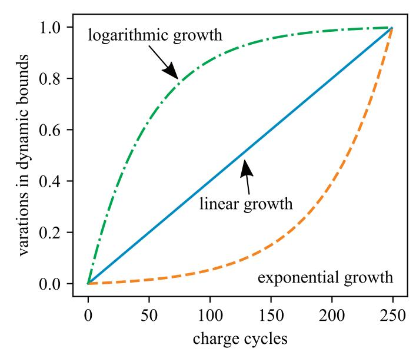

{6}------------------------------------------------

sets, is a marked improvement over the capacity-based prognostics approach. Again, cells #6, 7, and 8 show the difference between the capacity-based ([Fig. 9](#page-7-0)(a)) and mechanistic [\(Fig. 9](#page-7-0)(b)) approaches in the prediction of a cell's RUL for the case where the cell's true capacities greatly differ from those of its training set.

A further exploration of the RUL predictions is presented in [Table 1](#page-8-0). It lists the error measured as the root mean square error (RMSE) between each cell's predicted RUL and its true RUL for each charge cycle excluding the first 25 charge-discharge cycles. The first 25 charge-discharge cycles were ignored because these exhibited a high level of noise in both cases. [Table 1](#page-8-0) lists results for all the model fitting strategies investigated, including the dynamic bounds that are discussed later in this section. Results were obtained by running each cell five times, with the noise levels defined in [Section 2.2](#page-2-2), and taking the average of all the runs. This was done to obtain an accurate representation of the prognostics ability of each fitting strategy. The level of improvement for the mechanistic prognostics approach over that of the capacity-based prognostics approach is listed in [Table 2.](#page-8-1) These values were calculated by subtracting the mechanistic error results from the capacity-based results for each cell and fitting strategy investigated. Therefore, a positive number is associated with an improvement in RUL prediction accuracy while a negative number is associated with a decrease in the RUL prediction accuracy for that particular cell and fitting strategy. For clarity, the negative numbers are all highlighted in [Table 2](#page-8-1). Ignoring the unbounded coefficient fitting strategy, that already possessed a high level of prediction error, the mechanistic approach demonstrated an improvement over the capacity-based approach 97.5% of the time. In only two cases did the capacity-based prognostics approach outperform the mechanistic prognostics approach, however, these improvements were small and only achieved on cell cases that had a relatively strong agreement between its real capacities and those of its training set.

## 4.2. Dynamic bounds

Here, the concept of dynamic bounds is inspected. First a series of

Fig. 7. Capacity life prediction for cell #4 using (a) capacity-based prognostics inspected at 25; (b) 50; (c) 100 charge-discharge cycles; (d) mechanistic prognostics inspected at 25; (e) 50; and (f) 100 charge-discharge cycles.

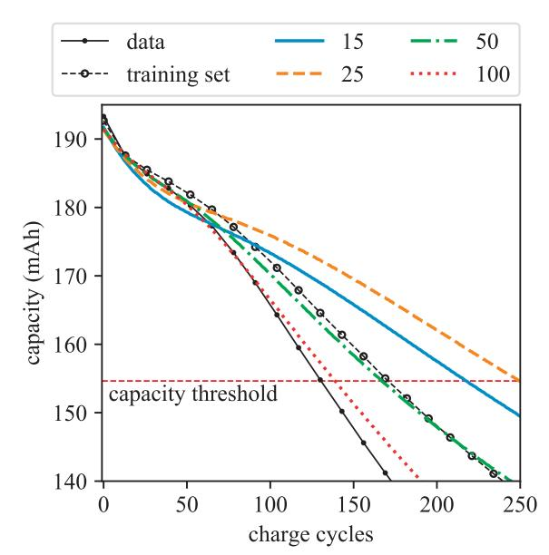

Fig. 8. Mechanistic capacity predictions for cell #8 with 50% bounded coefficients at inspections points of 15, 25, 50, and 100 charge-discharge cycles.

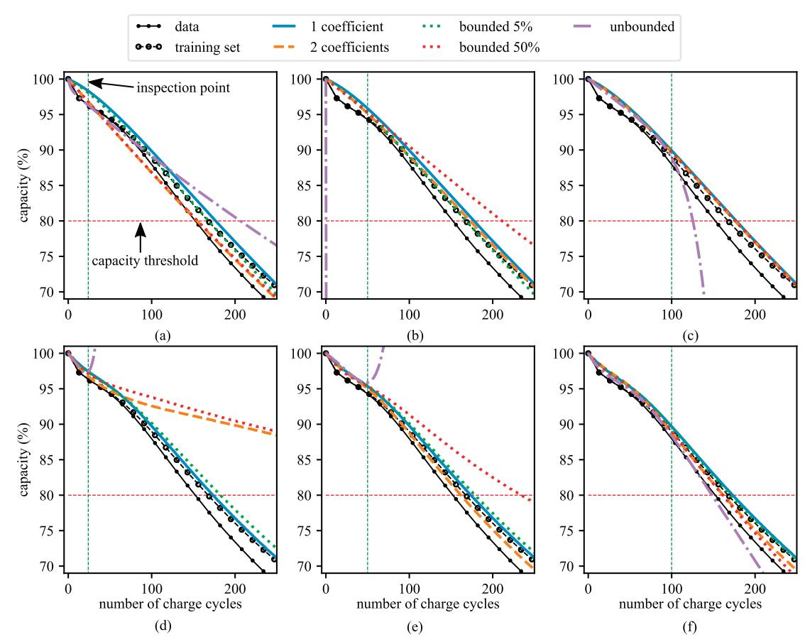

{7}------------------------------------------------

tests were performed to validate the performance of the three sets of previously proposed dynamic bounds, as shown in [Fig. 6,](#page-5-0) at various final bound levels. [Fig. 10\(](#page-9-0)a) shows the error results, again quantified as the RMSE for the charge-discharge cycles excluding the first 25 cycles. For both the capacity-based and mechanistic prognostics approaches, the exponential control equation for increasing the dynamic bounds demonstrated the most usable prognostics results. Here, usability is defined in terms of an RUL prediction that can be accurately used by a BMS to properly manage loads and/or schedule cell replacement. The high usability of the exponential control equation for the dynamic bounds is to be expected as it forces the model to rely heavily on the training set in the early stages and then quickly, in the later stages, switches to allow the RUL to be predicted using the online data. For low levels of the final dynamic bound value, the linear and logarithmic control equations were found to provide a low level of error. This low level of noise was mainly due to their capability to minimize the error in the early stages of a cell's life cycle rather than minimizing error in

the later portions of the cells life, as desired. Also, the linear and logarithmic control equations experience a relatively small range where these equations are at their minimum error values when compared to the exponential control equation. Therefore, it can be stated that the exponential control equation is better suited to providing reliable and repeatable prognostic results due to its capability to improve predictions over the cells entire life cycle and the simplicity in choosing a final bounded value.

[Fig. 11](#page-10-0) presents the RUL predictions by the capacity-based and mechanistic prognostics approaches. While in certain conditions the RULs predicted with the dynamic bounds controlled with the linear or logarithmic equation converged onto the true RULs sooner, these predictions always possessed a higher level of noise than the predictions obtained with the dynamic bounds using the exponential growth equation. This noise, while not detrimental to prognostics in the later stages of a cell's life, adds a level of uncertainty that may be unacceptable in cases where accurate RUL prediction is needed by BMSs

Fig. 9. RUL results for: (a) capacity-based prognostics approach; and (b) mechanistic prognostics approach.

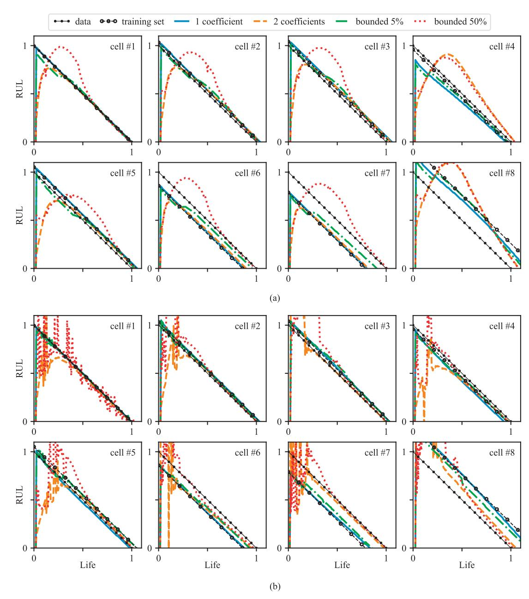

{8}------------------------------------------------

to properly manage loads and/or schedule replacement. In comparison, the dynamic bounds controlled with the exponential growth equation demonstrate a low level of noise in the early stages of the prognostics, therefore, resulting in a nice clean RUL prediction as presented in [Fig. 11](#page-10-0). Of particular interests are the RUL predictions of the dynamic bounds controlled by the exponential growth equation for the battery cells that strongly disagree with their training sets (cells #6, 7, and 8). Here, RUL calculated using the dynamic bounds method with the exponential growth equation starts out by following the training sets, then as more online observations become available the predicted RULs start to converge onto the cell's true RULs. This feature is observed in [Fig. 11\(](#page-10-0)b) for cell #6 and 7 where the dynamic bounds method with the exponential growth equation provides the RUL predictions with the least amount of noise and is capable of accurately predicting the cells' end-of-life conditions. Furthermore, as the training set of a cell starts to diverge more from the cell's real condition (e.g. cell #8), the RUL prediction made with the exponential growth equation starts to require a higher level of online observations to accurately predict the cell's RUL. It should be noted that for cell #8, the RULs predicted by the linear and logarithmic control equations converge onto the true RULs quicker than those by the exponential. However, their high level of uncertainty in the early stages makes their predictions less reliable from a load management or cell replacement point of view. The special case of cells that vary greatly from their training sets and the optimum

methods for their prognostics is beyond the scope of this introductory study.

## 4.3. Robustness to noise

To evaluate the robustness of the prognostics approaches presented here with respect to noise, an estimated noise signature for the onboard estimation of the degradation parameters is assumed, amplified, and added to the degradation parameter estimates as scalar multiples of the originally estimated noise. These results are presented in [Fig. 10\(](#page-9-0)bc) for a few selected model fitting strategies with [Fig. 10\(](#page-9-0)b) and (c) showing the results of the capacity-based and mechanistic approaches, respectively. Again, the error results are calculated as the RMSE for the charge-discharge cycles after ignoring the first 25 cycles. While some model fitting strategies demonstrate the majority of their errors in the early stages of development, this whole cycle error calculation approach allows for an accurate representation and comparison of each fitting strategy over the entire data set. As demonstrated in [Fig. 10\(](#page-9-0)b-c), the addition of higher levels of noise to the on-board parameter estimation is not highly detrimental to the mechanistic approach. Moreover, when comparing the mechanistic approach with the capacitybased approach, the mechanistic approach tends to provide a more stable error, and therefore, a more stable prognostics response. This is demonstrated by the more linear trend of the error for any given fitting

Table 1 Tabulated RUL RMSE for each cell using the capacity-based and mechanistic prognostics methods.

|              |         | capacity-based cell #1 | cell #2 | cell #3 | cell #4     | cell #5     | cell #6 | cell #7 | cell #8 |
|--------------|---------|------------------------|---------|---------|-------------|-------------|---------|---------|---------|
| 1 parameter  |         | 0.008                  | 0.035   | 0.061   | 0.055       | 0.045       | 0.122   | 0.193   | 0.224   |
| 2 parameters |         | 0.072                  | 0.130   | 0.113   | 0.045       | 0.103       | 0.149   | 0.209   | 0.179   |
| unbounded    |         | 0.281                  | 0.288   | 0.183   | 0.294       | 0.234       | 0.275   | 0.266   | 0.291   |
| bounded      | 5%      | 0.023                  | 0.041   | 0.053   | 0.049       | 0.034       | 0.070   | 0.131   | 0.159   |
| bounded      | 10%     | 0.035                  | 0.061   | 0.043   | 0.059       | 0.054       | 0.052   | 0.105   | 0.147   |
| bounded      | 25%     | 0.072                  | 0.119   | 0.079   | 0.092       | 0.106       | 0.058   | 0.059   | 0.165   |
| bounded      | 50%     | 0.142                  | 0.178   | 0.106   | 0.153       | 0.139       | 0.136   | 0.157   | 0.198   |
| bounded      | 75%     | 0.188                  | 0.217   | 0.132   | 0.195       | 0.169       | 0.189   | 0.209   | 0.225   |
| linear       | dynamic | 0.219                  | 0.218   | 0.108   | 0.344       | 0.186       | 0.195   | 0.202   | 0.257   |
| exponential  | dynamic | 0.058                  | 0.074   | 0.052   | 0.135       | 0.075       | 0.066   | 0.099   | 0.143   |
| logarithmic  | dynamic | 0.207                  | 0.205   | 0.107   | 0.269       | 0.176       | 0.198   | 0.201   | 0.227   |
|              |         |                        |         |         | mechanistic | prognostics |         |         |         |
|              |         | cell #1                | cell #2 | cell #3 | cell #4     | cell #5     | cell #6 | cell #7 | cell #8 |
| 1 parameter  |         | 0.005                  | 0.009   | 0.016   | 0.020       | 0.007       | 0.029   | 0.038   | 0.042   |
| 2 parameters |         | 0.056                  | 0.062   | 0.087   | 0.075       | 0.102       | 0.080   | 0.072   | 0.122   |
| unbounded    |         | 0.282                  | 0.307   | 0.258   | 0.322       | 0.297       | 0.281   | 0.294   | 0.267   |
| bounded      | 5%      | 0.011                  | 0.013   | 0.019   | 0.049       | 0.021       | 0.027   | 0.042   | 0.043   |
| bounded      | 10%     | 0.020                  | 0.018   | 0.028   | 0.056       | 0.027       | 0.023   | 0.041   | 0.041   |
| bounded      | 25%     | 0.040                  | 0.037   | 0.048   | 0.089       | 0.053       | 0.043   | 0.049   | 0.061   |
| bounded      | 50%     | 0.065                  | 0.063   | 0.092   | 0.112       | 0.097       | 0.078   | 0.083   | 0.092   |
| bounded      | 75%     | 0.097                  | 0.090   | 0.118   | 0.159       | 0.123       | 0.107   | 0.097   | 0.134   |
| linear       | dynamic | 0.091                  | 0.085   | 0.083   | 0.190       | 0.124       | 0.116   | 0.125   | 0.250   |
| exponential  | dynamic | 0.037                  | 0.026   | 0.043   | 0.057       | 0.036       | 0.050   | 0.068   | 0.118   |
| logarithmic  | dynamic | 0.120                  | 0.105   | 0.129   | 0.127       | 0.107       | 0.126   | 0.136   | 0.147   |

Table 2 Tabulated RUL improvements for each cell using the mechanistic prognostics method in comparison to the capacity-based prognostics method.

|              |         | improvement cell #1 | (mechanistic cell #2 | over capacity-based) cell #3 | cell #4 | cell #5 | cell #6 | cell #7 | cell #8 |
|--------------|---------|---------------------|----------------------|------------------------------|---------|---------|---------|---------|---------|
| 1 parameter  |         | 0.003               | 0.026                | 0.045                        | 0.035   | 0.038   | 0.093   | 0.155   | 0.182   |
| 2 parameters |         | 0.016               | 0.068                | 0.026                        | -0.030  | 0.001   | 0.069   | 0.137   | 0.057   |
| unbounded    |         | -0.001              | -0.019               | -0.075                       | -0.028  | -0.063  | -0.006  | -0.028  | 0.024   |
| bounded      | 5%      | 0.012               | 0.028                | 0.034                        | 0.000   | 0.013   | 0.043   | 0.089   | 0.116   |
| bounded      | 10%     | 0.015               | 0.043                | 0.015                        | 0.003   | 0.027   | 0.029   | 0.064   | 0.106   |
| bounded      | 25%     | 0.032               | 0.082                | 0.031                        | 0.003   | 0.053   | 0.015   | 0.010   | 0.104   |
| bounded      | 50%     | 0.077               | 0.115                | 0.014                        | 0.041   | 0.042   | 0.058   | 0.074   | 0.106   |
| bounded      | 75%     | 0.091               | 0.127                | 0.014                        | 0.036   | 0.046   | 0.082   | 0.112   | 0.091   |
| linear       | dynamic | 0.128               | 0.133                | 0.025                        | 0.154   | 0.062   | 0.079   | 0.077   | 0.007   |
| exponential  | dynamic | 0.021               | 0.048                | 0.009                        | 0.078   | 0.039   | 0.016   | 0.031   | 0.025   |
| logarithmic  | dynamic | 0.087               | 0.100                | -0.022                       | 0.142   | 0.069   | 0.072   | 0.065   | 0.080   |

{9}------------------------------------------------

strategy. The dynamically bounded mechanistic approach controlled by the exponential equation was found to possess an excellent ability to function in the various noise levels investigated.

## 4.4. Computational efficiency

The proposed mechanistic prognostics approach is expected to require more data and computational resources than that of the classical capacity-based prognostics approach, as annotated in [Fig. 2.](#page-1-1) To quantify the increase in computational resources, this study was analyzed the computational time and memory required to perform online prognostics for each of the eight cells. The analysis results are presented in [Table 3](#page-10-1). These results were obtained for both prognostic approaches at 100 charge-discharge cycles using the NLLS algorithm with 50% static bounds. The prognostic results for these cases are presented in [Figs. 7\(](#page-6-0)c) and (f). On average, the mechanistic prognostics approach required 13.3 times more computational time (running on a single thread of a 3.4 GHz Intel 4770) and 1.14 times more peak memory than the capacity-based prognostics approach that uses the same NLLS algorithm. No large variation in computational requirements was detected when different bounds were applied to the NLLS algorithm. Therefore, for brevity, these results are omitted.

## 5. Conclusion

This paper proposed a novel mechanistic approach to battery prognostics that achieves remaining useful life (RUL) prediction of a battery cell through tracking its degradation parameters and estimating the cell's capacity through the use of a half-cell model. In this mechanistic (pyhsics-based) approach, each degradation parameter is fitted to a mathematical model through the use of a non-linear least squares (NLLS) solver. In addition to the newly proposed mechanistic approach, this work also expands upon the use of NLLS for battery prognostics through the introduction of dynamic bounds. This is achieved through limiting the model coefficients solved for by NLLS to within a predefined percentage of the coefficient used in fitting the training data set, the predefined percentage is then allowed to increase as the cell progresses through its life cycle. This increase is controlled by a predefined function, here, an exponential function was shown to provide the best results in terms of usable and stable RUL predictions.

The mechanistic approach was demonstrated, through simulated data, to provide a marked improvement over a traditional capacitybased prognostics approach. Simulations demonstrated an improvement over the capacity-based approach 97.5% of the time when the same parameter bounds were considered for both cases. The mechanistic approach does require that three parameters be tracked and a surrogate model of the cell be solved and therefore requires 13.3 times more computational time and 1.14 times more memory than that required by capacity-based prognostics approach. Furthermore, when used in combination with the dynamic bounds for the NLLS solver, the mechanistic prognostics approach was demonstrated to be a reliable prognostics tool with a low level of uncertainty throughout the entire life of a cell.

The battery prognostics approach introduced here can be leveraged to equip existing battery management systems (BMSs) with the capability to explicitly consider the coupling effects of the major degradation mechanisms on battery degradation and RUL prediction. Future avenues for research include the use of other model-based

Fig. 10. Numerical investigations in terms of: (a) RUL prediction errors for the three dynamic bound equations, for capacity-based and mechanistic prognostics inspected for a final bound value ranging from 1–500%; (b) noise robustness for the capacity-based approach; and (c) noise robustness for the mechanistic prognostics approach.

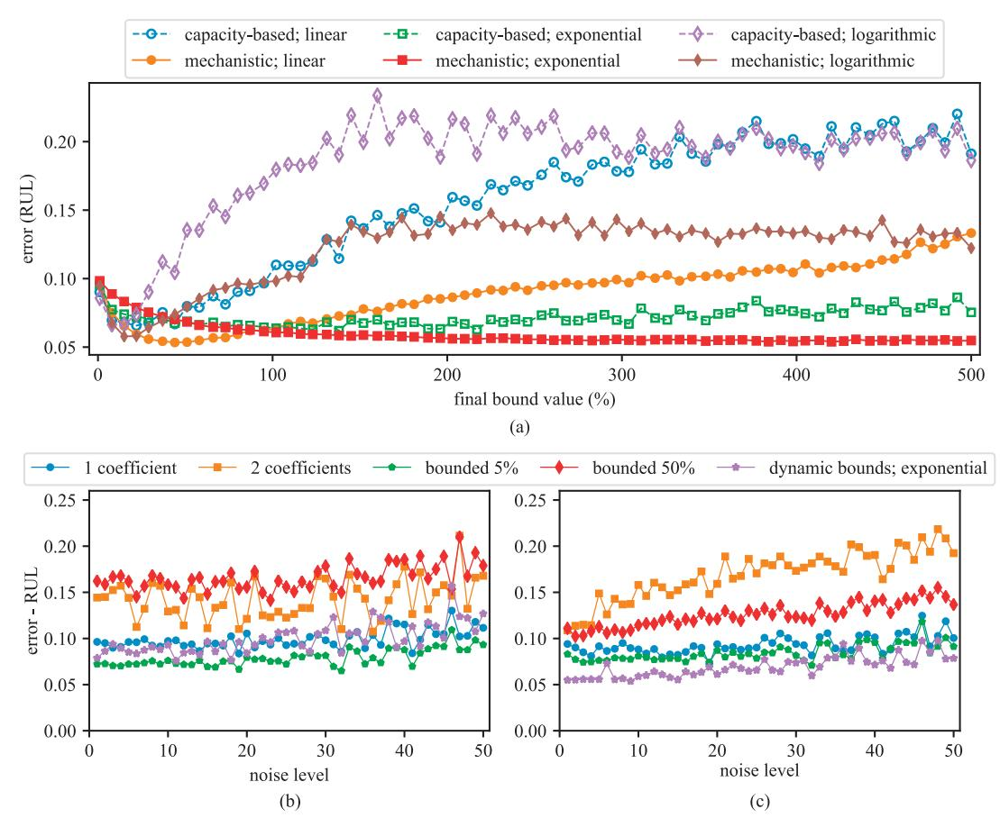

{10}------------------------------------------------

approaches already used for the capacity-based prognostics of battery cells including Kalman filters, support vector machines, and particle filters. Additionally, the analytical half-cell model used is this work could be replaced with a more advanced model (e.g. a reduced-order electrochemical model). Lastly, a long-term experimental validation of the proposed prognostics approach is currently being performed in the authors' group by running long-term aging tests on commercial Li-ion cells with a high-precision charger. These tests consider multiple different combinations of temperature and discharge rate. We plan to analyze the data from the experimental validation and report out the validation results in our future work.

## Acknowledgments

This work is supported by the National Science Foundation (NSF) grant nos. 1069283 and ECCS-1611333. It is also partly supported by the NSF grant no. 1069283, which supports the activities of the Integrative Graduate Education and Research Traineeship (IGERT) in Wind Energy Science, Engineering and Policy (WESEP) at Iowa State University. Their support is gratefully acknowledged. Any opinions,

Fig. 11. RUL results using a final dynamic bound value of 500% for the: (a) capacity-based prognostics approach; and (b) mechanistic prognostics approach.

Table 3 Computational time and memory usage analysis for both the classical capacitybased and the newly proposed mechanistic approach.

|      |    | time (s) classical | mechanistic | memory classical | (MB) mechanistic |
|------|----|--------------------|-------------|------------------|------------------|
| cell | #1 | 0.37               | 6.28        | 4.40             | 4.62             |
| cell | #2 | 0.47               | 6.90        | 4.31             | 4.69             |
| cell | #3 | 0.47               | 6.79        | 4.39             | 4.96             |
| cell | #4 | 0.40               | 6.99        | 3.99             | 5.01             |
| cell | #5 | 0.45               | 7.13        | 3.70             | 5.01             |
| cell | #6 | 1.13               | 7.88        | 3.91             | 4.67             |
| cell | #7 | 0.47               | 7.37        | 4.26             | 4.63             |
| cell | #8 | 0.43               | 6.51        | 4.70             | 4.90             |

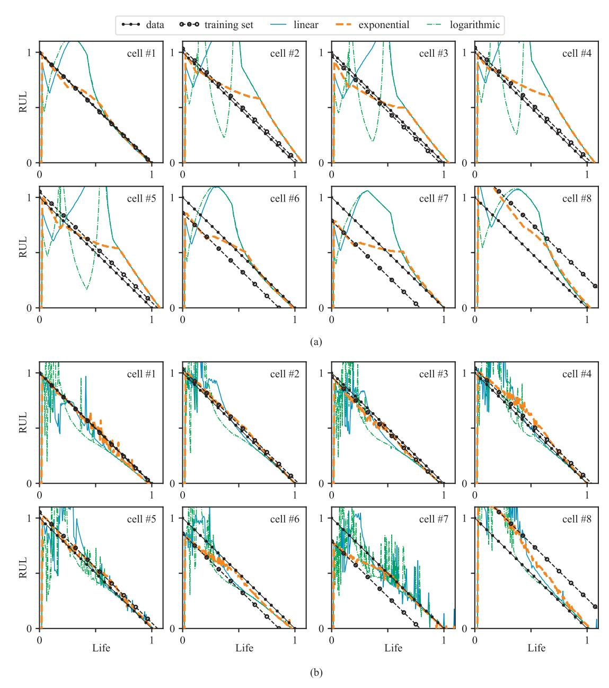

{11}------------------------------------------------

findings, and conclusions or recommendations expressed in this material are those of the authors and do not necessarily reflect the views of

- the NSF. References [1] Plett GL. Extended Kalman filtering for battery management systems of LiPB-based HEV battery packs. J Power Sources 2004;134(2):277–92. [https://doi.org/10.1016/](https://doi.org/10.1016/j.jpowsour.2004.02.033) [j.jpowsour.2004.02.033.](https://doi.org/10.1016/j.jpowsour.2004.02.033) [2] Plett GL. Sigma-point Kalman filtering for battery management systems of LiPBbased HEV battery packs. J Power Sources 2006;161(2):1369–84. [https://doi.org/](https://doi.org/10.1016/j.jpowsour.2006.06.004) [10.1016/j.jpowsour.2006.06.004.](https://doi.org/10.1016/j.jpowsour.2006.06.004) [3] Jin G, Matthews DE, Zhou Z. A Bayesian framework for on-line degradation assessment and residual life prediction of secondary batteries inspacecraft. Reliab Eng Syst Saf 2013;113:7–20. [https://doi.org/10.1016/j.ress.2012.12.011.](https://doi.org/10.1016/j.ress.2012.12.011) https://doi. [org/10.1016/j.ress.2012.12.011](https://doi.org/10.1016/j.ress.2012.12.011) [4] Xu X, Li Z, Chen N. A hierarchical model for lithium-ion battery degradation prediction. IEEE Trans Reliab 2016;65(1):310–25. [https://doi.org/10.1109/tr.2015.](https://doi.org/10.1109/tr.2015.2451074) 2451074. <https://doi.org/10.1109/tr.2015.2451074> [5] Mishra M, Martinsson J, Rantatalo M, Goebel K. Bayesian hierarchical model-based prognostics for lithium-ion batteries. Reliab Eng Syst Saf 2018;172:25–35. [https://](https://doi.org/10.1016/j.ress.2017.11.020) doi.org/10.1016/j.ress.2017.11.020. <https://doi.org/10.1016/j.ress.2017.11.020> [6] Waag W, Fleischer C, Sauer DU. Critical review of the methods for monitoring of lithium-ion batteries in electric and hybrid vehicles. J Power Sources 2014;258:321–39. [https://doi.org/10.1016/j.jpowsour.2014.02.064.](https://doi.org/10.1016/j.jpowsour.2014.02.064) [7] Lu L, Han X, Li J, Hua J, Ouyang M. A review on the key issues for lithium-ion battery management in electric vehicles. J Power Sources 2013;226:272–88. [https://doi.org/10.1016/j.jpowsour.2012.10.060.](https://doi.org/10.1016/j.jpowsour.2012.10.060) [8] Rezvanizaniani SM, Liu Z, Chen Y, Lee J. Review and recent advances in battery health monitoring and prognostics technologies for electric vehicle (EV) safety and mobility. J Power Sources 2014;256:110–24. [https://doi.org/10.1016/j.jpowsour.](https://doi.org/10.1016/j.jpowsour.2014.01.085) [2014.01.085.](https://doi.org/10.1016/j.jpowsour.2014.01.085) [9] Zhang J, Lee J. A review on prognostics and health monitoring of li-ion battery. J Power Sources 2011;196(15):6007–14. [https://doi.org/10.1016/j.jpowsour.2011.](https://doi.org/10.1016/j.jpowsour.2011.03.101) [03.101.](https://doi.org/10.1016/j.jpowsour.2011.03.101) [10] GEBRAEEL NZ, LAWLEY MA, LI R, RYAN JK. Residual-life distributions from component degradation signals: a bayesian approach. IIE Transactions 2005;37(6):543–57. [https://doi.org/10.1080/07408170590929018.](https://doi.org/10.1080/07408170590929018) [11] Luo J, Pattipati K, Qiao L, Chigusa S. Model-based prognostic techniques applied to a suspension system. IEEE Trans Syst ManCybern - Part A: Syst Hum 2008;38(5):1156–68. [https://doi.org/10.1109/tsmca.2008.2001055.](https://doi.org/10.1109/tsmca.2008.2001055) [12] Gebraeel N, Pan J. Prognostic degradation models for computing and updating residual life distributions in a time-varying environment. IEEE Trans Reliab 2008;57(4):539–50. [https://doi.org/10.1109/tr.2008.928245.](https://doi.org/10.1109/tr.2008.928245) [13] Si X-S, Wang W, Hu C-H, Chen M-Y, Zhou D-H. A wiener-process-based degradation model with a recursive filter algorithm for remaining useful life estimation. Mech Syst Signal Process 2013;35(1–2):219–37. [https://doi.org/10.1016/j.ymssp.2012.](https://doi.org/10.1016/j.ymssp.2012.08.016) [08.016.](https://doi.org/10.1016/j.ymssp.2012.08.016) [14] Son KL, Fouladirad M, Barros A, Levrat E, Iung B. Remaining useful life estimation based on stochastic deterioration models: a comparative study. Reliab Eng Syst Saf 2013;112:165–75. [https://doi.org/10.1016/j.ress.2012.11.022.](https://doi.org/10.1016/j.ress.2012.11.022) [15] Wang X, Balakrishnan N, Guo B. Residual life estimation based on a generalized wiener degradation process. Reliab Eng Syst Saf 2014;124:13–23. [https://doi.org/](https://doi.org/10.1016/j.ress.2013.11.011) [10.1016/j.ress.2013.11.011.](https://doi.org/10.1016/j.ress.2013.11.011) [16] Wang H-K, Li Y-F, Huang H-Z, Jin T. Near-extreme system condition and nearextreme remaining useful time for a group of products. Reliab Eng Syst Saf 2017;162:103–10. [https://doi.org/10.1016/j.ress.2017.01.023.](https://doi.org/10.1016/j.ress.2017.01.023) [17] Wang T, Yu J, Siegel D, Lee J. A similarity-based prognostics approach for remaining useful life estimation of engineered systems. 2008 International conference on prognostics and health management. IEEE; 2008. [https://doi.org/10.1109/phm.](https://doi.org/10.1109/phm.2008.4711421) [2008.4711421.](https://doi.org/10.1109/phm.2008.4711421) [18] Heimes FO. Recurrent neural networks for remaining useful life estimation. 2008 International conference on prognostics and health management. IEEE; 2008. [https://doi.org/10.1109/phm.2008.4711422.](https://doi.org/10.1109/phm.2008.4711422) [19] Hu C, Youn BD, Wang P, Yoon JT. Ensemble of data-driven prognostic algorithms for robust prediction of remaining useful life. Reliab Eng Syst Saf 2012;103:120–35. [https://doi.org/10.1016/j.ress.2012.03.008.](https://doi.org/10.1016/j.ress.2012.03.008) [20] Wang P, Youn BD, Hu C. A generic probabilistic framework for structural health prognostics and uncertainty management. Mech Syst Signal Process 2012;28:622–37. [https://doi.org/10.1016/j.ymssp.2011.10.019.](https://doi.org/10.1016/j.ymssp.2011.10.019) [21] Fink O, Zio E, Weidmann U. Predicting component reliability and level of degradation with complex-valued neural networks. Reliability Engineering & System Safety 2014;121:198–206. [https://doi.org/10.1016/j.ress.2013.08.004.](https://doi.org/10.1016/j.ress.2013.08.004) [22] Li Z, Wu D, Hu C, Terpenny J. An ensemble learning-based prognostic approach with degradation-dependent weights for remaining useful life prediction. Reliab Eng Syst Saf 2017. [https://doi.org/10.1016/j.ress.2017.12.016.](https://doi.org/10.1016/j.ress.2017.12.016) [23] Xi Z, Jing R, Wang P, Hu C. A copula-based sampling method for data-driven prognostics. Reliab Eng Syst Saf 2014;132:72–82. [https://doi.org/10.1016/j.ress.](https://doi.org/10.1016/j.ress.2014.06.014) [2014.06.014.](https://doi.org/10.1016/j.ress.2014.06.014) [24] Liu J, Wang W, Ma F, Yang Y, Yang C. A data-model-fusion prognostic framework for dynamic system state forecasting. Eng Appl Artif Intell 2012;25(4):814–23. [https://doi.org/10.1016/j.engappai.2012.02.015.](https://doi.org/10.1016/j.engappai.2012.02.015) [25] Goebel K, Eklund N, Bonanni P. Fusing competing prediction algorithms for prognostics. 2006 IEEE Aerospace Conference. IEEE; 2006. [https://doi.org/10.1109/](https://doi.org/10.1109/aero.2006.1656116) [aero.2006.1656116.](https://doi.org/10.1109/aero.2006.1656116) [26] Baptista M, Henriques E, de Medeiros I, Malere J, Nascimento C, Prendinger H. Remaining useful life estimation in aeronautics: combining data-driven and kalman filtering. Reliab Eng Syst Saf 2018. [https://doi.org/10.1016/j.ress.2018.01.017.](https://doi.org/10.1016/j.ress.2018.01.017) [27] [Saha B, Goebel K. Modeling li-ion battery capacity depletion in a particle](http://refhub.elsevier.com/S0951-8320(18)30292-8/sbref0027) filtering [framework. Proceedings of the annual conference of the prognostics and health](http://refhub.elsevier.com/S0951-8320(18)30292-8/sbref0027) [management society, San Diego, CA. 2009. p. 2909](http://refhub.elsevier.com/S0951-8320(18)30292-8/sbref0027)–24. [28] He W, Williard N, Osterman M, Pecht M. Prognostics of lithium-ion batteries based on Dempster–Sshafer theory and the Bayesian Monte Carlo method. J Power Sources 2011;196(23):10314–21. [https://doi.org/10.1016/j.jpowsour.2011.08.](https://doi.org/10.1016/j.jpowsour.2011.08.040)
  - [040.](https://doi.org/10.1016/j.jpowsour.2011.08.040) [29] Miao Q, Xie L, Cui H, Liang W, Pecht M. Remaining useful life prediction of lithiumion battery with unscented particle filter technique. Microelectron Reliab 2013;53(6):805–10. [https://doi.org/10.1016/j.microrel.2012.12.004.](https://doi.org/10.1016/j.microrel.2012.12.004) [30] Hu C, Jain G, Tamirisa P, Gorka T. Method for estimating capacity and predicting remaining useful life of lithium-ion battery. Appl Energy 2014;126:182–9. [https://](https://doi.org/10.1016/j.apenergy.2014.03.086) [doi.org/10.1016/j.apenergy.2014.03.086.](https://doi.org/10.1016/j.apenergy.2014.03.086) [31] Walker E, Rayman S, White RE. Comparison of a particle filter and other state estimation methods for prognostics of lithium-ion batteries. J Power Sources 2015;287:1–12. [https://doi.org/10.1016/j.jpowsour.2015.04.020.](https://doi.org/10.1016/j.jpowsour.2015.04.020) [32] Zheng X, Fang H. An integrated unscented kalman filter and relevance vector regression approach for lithium-ion battery remaining useful life and short-term capacity prediction. Reliab Eng Syst Saf 2015;144:74–82. [https://doi.org/10.1016/j.](https://doi.org/10.1016/j.ress.2015.07.013) [ress.2015.07.013.](https://doi.org/10.1016/j.ress.2015.07.013) [33] Wang D, Yang F, Tsui K-L, Zhou Q, Bae SJ. Remaining useful life prediction of lithium-ion batteries based on spherical cubature particle filter. IEEE Trans InstrumMeas 2016;65(6):1282–91. [https://doi.org/10.1109/tim.2016.2534258.](https://doi.org/10.1109/tim.2016.2534258) [34] Xu X, Chen N. A state-space-based prognostics model for lithium-ion battery degradation. Reliab Eng Syst Saf 2017;159:47–57. [https://doi.org/10.1016/j.ress.](https://doi.org/10.1016/j.ress.2016.10.026) [2016.10.026.](https://doi.org/10.1016/j.ress.2016.10.026) [35] Ma Y, Chen Y, Zhou X, Chen H. Remaining useful life prediction of lithium-ion battery based on Gauss-hermite particle filter. IEEE Trans Control Syst Technol 2018:1–8. [https://doi.org/10.1109/tcst.2018.2819965.](https://doi.org/10.1109/tcst.2018.2819965) [36] Richardson RR, Osborne MA, Howey DA. Gaussian process regression for forecasting battery state of health. J Power Sources 2017;357:209–19. [https://doi.org/](https://doi.org/10.1016/j.jpowsour.2017.05.004) [10.1016/j.jpowsour.2017.05.004.](https://doi.org/10.1016/j.jpowsour.2017.05.004) [37] Hu C, Ye H, Jain G, Schmidt C. Remaining useful life assessment of lithium-ion batteries in implantable medical devices. J Power Sources 2018;375:118–30. [https://doi.org/10.1016/j.jpowsour.2017.11.056.](https://doi.org/10.1016/j.jpowsour.2017.11.056) [38] Burns JC, Kassam A, Sinha NN, Downie LE, Solnickova L, Way BM, et al. Predicting and extending the lifetime of li-ion batteries. J Electrochem Soc 2013;160(9):A1451–6. [https://doi.org/10.1149/2.060309jes.](https://doi.org/10.1149/2.060309jes) [39] Zhang Q, White RE. Capacity fade analysis of a lithium ion cell. J Power Sources 2008;179(2):793–8. [https://doi.org/10.1016/j.jpowsour.2008.01.028.](https://doi.org/10.1016/j.jpowsour.2008.01.028) [40] Liu P, Wang J, Hicks-Garner J, Sherman E, Soukiazian S, Verbrugge M, et al. Aging mechanisms of lifepo[sub 4] batteries deduced by electrochemical and structural analyses. J Electrochem Soc 2010;157(4):A499. [https://doi.org/10.1149/1.](https://doi.org/10.1149/1.3294790) [3294790.](https://doi.org/10.1149/1.3294790) [41] Broussely M, Herreyre S, Biensan P, Kasztejna P, Nechev K, Staniewicz R. Aging mechanism in li ion cells and calendar life predictions. J Power Sources 2001;97–98:13–21. [https://doi.org/10.1016/s0378-7753\(01\)00722-4.](https://doi.org/10.1016/s0378-7753(01)00722-4) [42] [Daigle M, Bregon A, Roychoudhury I. A distributed approach to system-level](http://refhub.elsevier.com/S0951-8320(18)30292-8/sbref0042) [prognostics. Tech. Rep.. National Aeronautics And Space Administration Mo](http://refhub.elsevier.com/S0951-8320(18)30292-8/sbref0042)ffett Field [Ca Ames Research Center; 2012.](http://refhub.elsevier.com/S0951-8320(18)30292-8/sbref0042) [43] Smith AJ, Dahn HM, Burns JC, Dahn JR. Long-term low-rate cycling of licoo2/ graphite li-ion cells at 55c. J Electrochem Soc 2012;159(6):A705. [https://doi.org/](https://doi.org/10.1149/2.056206jes) [10.1149/2.056206jes.](https://doi.org/10.1149/2.056206jes) [44] Dahn HM, Smith AJ, Burns JC, Stevens DA, Dahn JR. User-friendly differential voltage analysis freeware for the analysis of degradation mechanisms in li-ion batteries. J Electrochem Soc 2012;159(9):A1405–9. [https://doi.org/10.1149/2.](https://doi.org/10.1149/2.013209jes) [013209jes.](https://doi.org/10.1149/2.013209jes) [45] Smith AJ, Burns JC, Xiong D, Dahn JR. Interpreting high precision coulometry results on li-ion cells. J Electrochem Soc 2011;158(10):A1136. [https://doi.org/10.](https://doi.org/10.1149/1.3625232) [1149/1.3625232.](https://doi.org/10.1149/1.3625232) [46] Honkura K, Takahashi K, Horiba T. Capacity-fading prediction of lithium-ion batteries based on discharge curves analysis. J Power Sources 2011;196(23):10141–7. [https://doi.org/10.1016/j.jpowsour.2011.08.020.](https://doi.org/10.1016/j.jpowsour.2011.08.020) [47] Dubarry M, Liaw BY, Chen M-S, Chyan S-S, Han K-C, Sie W-T, et al. Identifying battery aging mechanisms in large format li ion cells. J Power Sources 2011;196(7):3420–5. [https://doi.org/10.1016/j.jpowsour.2010.07.029.](https://doi.org/10.1016/j.jpowsour.2010.07.029) [48] Smith AJ, Burns JC, Dahn JR. High-precision differential capacity analysis of limn2o4/graphite cells. Electrochem Solid-State Lett 2011;14(4):A39. [https://doi.](https://doi.org/10.1149/1.3543569) [org/10.1149/1.3543569.](https://doi.org/10.1149/1.3543569) [49] Han X, Ouyang M, Lu L, Li J, Zheng Y, Li Z. A comparative study of commercial lithium ion battery cycle life in electrical vehicle: aging mechanism identification. J Power Sources 2014;251:38–54. [https://doi.org/10.1016/j.jpowsour.2013.11.029.](https://doi.org/10.1016/j.jpowsour.2013.11.029) [50] Hu C, Hong M, Li Y, Jeong H-L. On-board analysis of degradation mechanisms of lithium-ion battery using differential voltage analysis. Volume 2A: 42nd Design Automation Conference. ASME; 2016. [https://doi.org/10.1115/detc2016-59389.](https://doi.org/10.1115/detc2016-59389) [51] tBuLi, et al. symfit: open source fitting package Python. 2014. [Online; accessed July 27, 2017]; http://symfi[t.readthedocs.org](http://symfit.readthedocs.org).