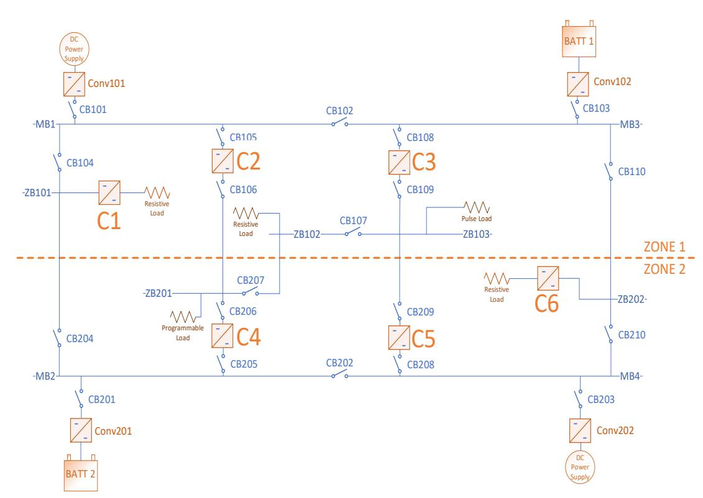
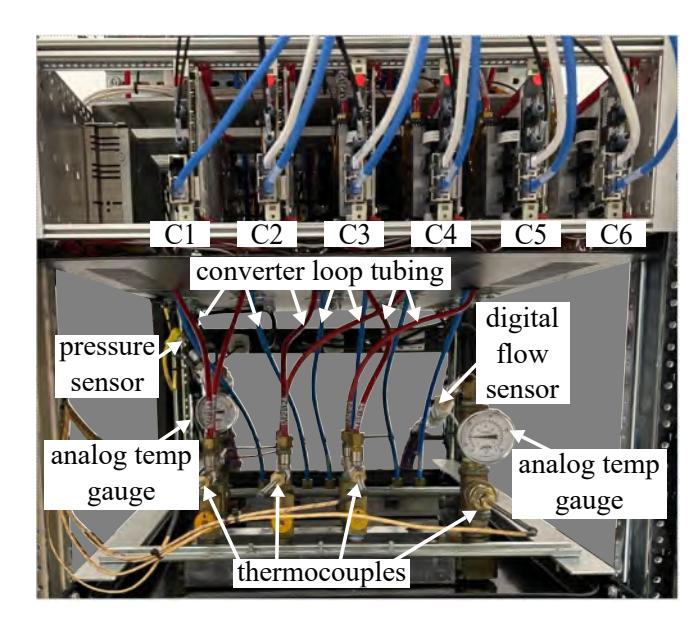
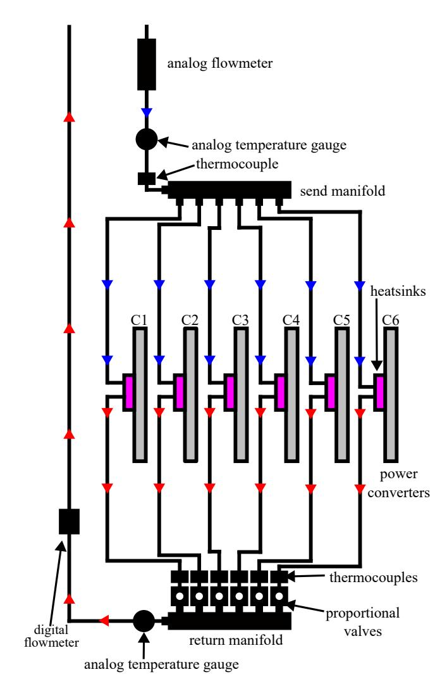
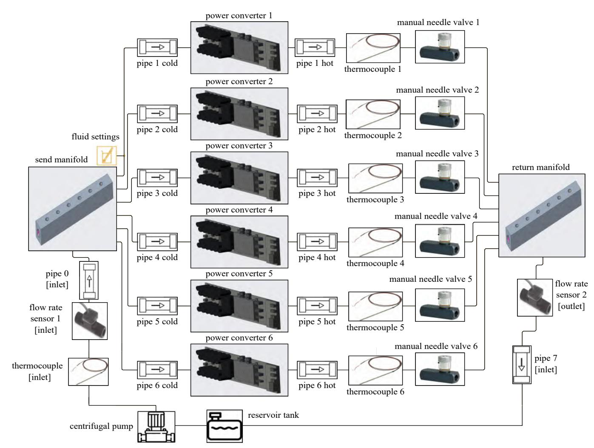
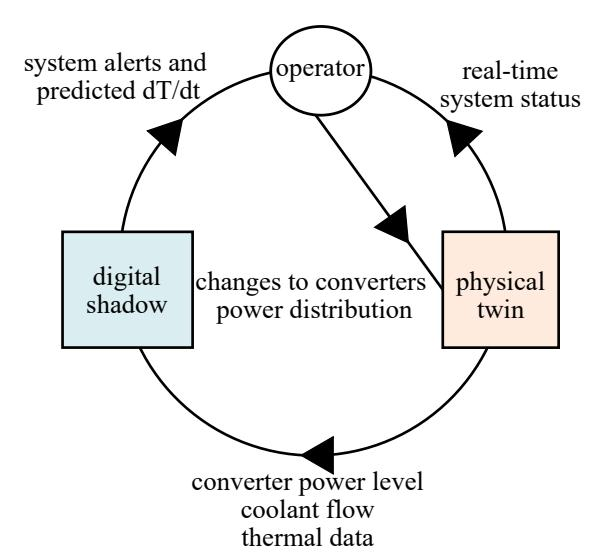
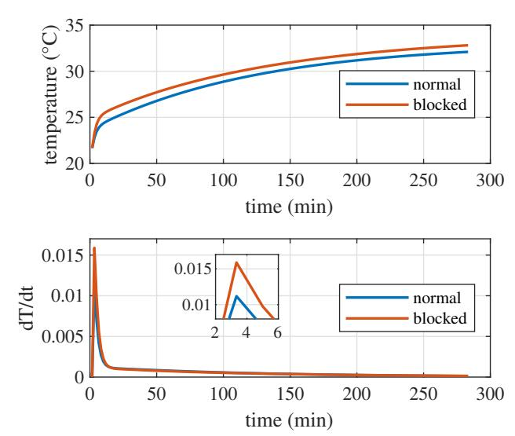
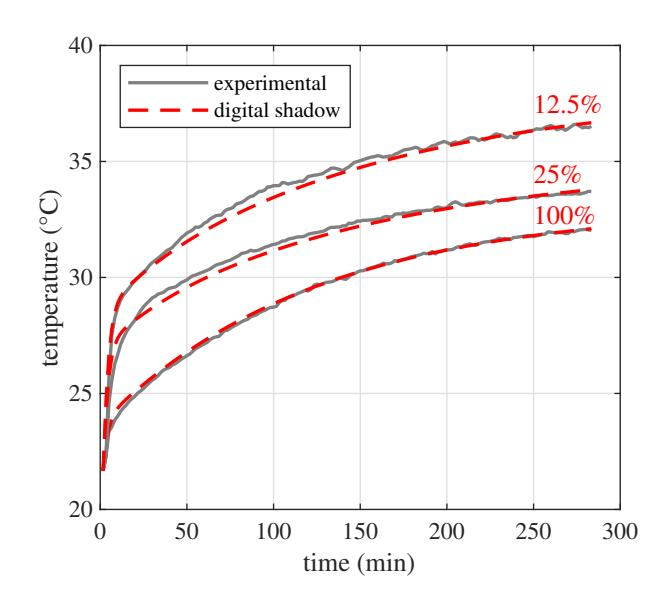

{0}------------------------------------------------

**IMECE2024-142271**

## **DIGITAL SHADOW-BASED DETECTION OF BLOCKAGE FORMATION IN WATER-COOLED POWER ELECTRONICS**

**Richard Hainey1 , Braden Priddy1 , Kerry Sado2 , Austin R.J. Downey1**,**3**,∗ **, Jamil Khan1 , H.J. Fought 2 , Kristen Booth2**

1University of South Carolina, Department of Mechanical Engineering, Columbia, South Carolina

2University of South Carolina, Department of Electrical Engineering, Columbia, South Carolina

3University of South Carolina, Department of Civil Engineering, Columbia, South Carolina

### **ABSTRACT**

*In maintaining the quality of coolant within water-cooled electronic systems, attention must be given to potential blockage formations. These blockages typically occur when suspended particulates form deposits within component chambers, leading to restricted flow, which can result in overheating issues, decreased performance, and cooling failure. To address this, a thermal digital shadow has been designed and validated to accurately simulate and detect blockage formation within the cooling system of a real-world physical twin. During operation, the digital shadow characterizes system parameters—flow rate, initial temperatures, individual components, and waste heat production—from the physical twin to more accurately replicate system characteristics. For validation, simulated blockages are created in the physical twin and digital shadow, and the results are compared. At 50% blockage, a significant temperature surge is observed, with subsequent surges increasing as the blockage develops, the largest occurring at 87.5% blockage formation. The data gathered shows how a digital shadow can support real-time monitoring and predictive maintenance, enabling proactive interventions to prevent thermal accumulation from damaging the affected components. Serving as the groundwork for future development, this digital shadow system can assist in creating a robust digital twin system for blockage detection and decision-making within water/liquid-cooled electronic systems.*

**Keywords: Digital twin, digital shadow, power converter, liquid-cooling, blockage formation, thermal management**

### **1. INTRODUCTION**

Power electronic converters are pivotal in the energy landscape, enabling the efficient conversion and control of electrical power across a wide array of applications. The thermal management of power electronic systems is critical for their efficiency and longevity [\[1\]](#page-5-0). While most commercial electronics typically utilize air cooling through finned heat sinks, an alternative approach involves water cooling. This method leverages water's superior thermal properties, including its higher thermal conductivity and specific heat capacity. As a result, water cooling achieves a higher convective heat transfer coefficient than air cooling. In the context of forced convection, these coefficients can range from 20 to 100 W/(m2 °C) for air cooling. In contrast, water cooling exhibits significantly higher values, ranging from 1000 to 15000 W/(m2 °C) [\[2\]](#page-5-1). This discrepancy highlights the enhanced cooling capability of water over air, offering a compelling option for managing the thermal loads of power electronics. Water cooling is achieved by circulating coolant through a heat sink attached to power electronic systems. This process effectively absorbs the heat generated during operation, helping to maintain temperatures within the operational limits. However, the effectiveness of this cooling method can be compromised by the presence of blockages within the cooling system. Such blockages impede the coolant flow, leading to heat being trapped within the power electronic components. As a result, temperatures to escalate, increasing the risk of system failure.

A blockage in the cooling loop particularly affects the semiconductor switching devices in the converter, preventing the swift dissipation of heat. This could accelerate the failure of these critical devices and possibly cause the converter to malfunction. Failure to address these issues promptly risks compromising the overall efficiency and reliability of the power system. Digital Twin (DT) technology emerges as a promising solution in addressing the challenge of blockage formation within cooling systems, a critical factor compromising the efficiency and reliability of power electronic converters. Defined as a faithful representation of a physical asset, a DT mirrors the life cycle of its physical counterpart and provides insights into the different behaviors of the counterpart under various conditions [\[3\]](#page-5-2). Digital twin tech-

\*Corresponding author: [austindowney@sc.edu](mailto:austindowney@sc.edu)

{1}------------------------------------------------

**FIGURE 1: Electrical diagram of power converter system within electrical setup.**

nology is applied in different applications including design, production, and health management [\[4\]](#page-5-3). The application of DTs in thermal management, as demonstrated through the development of a DT for predicting the thermal behavior of power system cables, showcases its potential in forecasting thermal conditions based on known load profiles [\[5\]](#page-5-4). Furthermore, DTs have demonstrated their efficacy in estimating the health indicators of power electronic components, thereby enhancing system reliability and efficiency [\[6,](#page-5-5) [7\]](#page-5-6). In the context of DT systems, a digital shadow can be developed in the early stages of developing a DT. The digital shadow receives data from the physical asset and replicates its life cycle. The digital shadow can be used to provide estimations and predictions regarding various key parameters affecting the behavior of the physical asset. This work proposes the use of a digital shadow-based method for detecting and quantifying blockages in coupled electro-thermal power electronic systems. The proposed method offers the ability to dynamically detect blockages in critical components of a cooling system, enabling automated decision-makers to provide corrective measures or divert power to other electrical components with adequate cooling capabilities. The contribution of this work lies in its application of digital twin and digital shadow technology to address a critical challenge in power electronic systems. By providing real-time monitoring and enabling automated decision-making, this proposed method is a step forward for efficient operation in coupled electro-thermal systems.

## **2. MATERIALS AND METHODS**

This section describes the experimental methods used in this work, including the Naval electro-thermal testbed, an example of a blockage, and the developed thermal digital shadow.

**FIGURE 2: Experimental testbed showing power converter cooling distribution system with manual control valves.**

## **2.1 Overview of Testbed Configuration**

The diagram of the electrical setup of this testbed consists of ten power electronic converters interfacing various loads, as shown in Figure [1.](#page-1-0) This work uses the six-power converters inside the ring bus of Figure [1.](#page-1-0) These power electronic converters are built using Imperix power electronic building blocks-PEB 8038 [\[8\]](#page-5-7). Each module consists of two metal–oxide–semiconductor field-effect transistor (MOSFET) switching devices mounted on a mutual heat sink. These six power converters are part of a larger coupled electro-thermal

{2}------------------------------------------------

**FIGURE 3: Diagram of power converter cooling loops showing converters and manifold networks with flow rate and temperature sensors.**

testbed developed at the University of South Carolina for testing and developing DT solutions for naval applications. The six converters are connected and installed inside a cabinet with their cooling distribution system, as shown in Figure [2.](#page-1-1) These converters form part of a microgrid that is designed to emulate the naval power and energy systems of a ship, effectively replicating the onboard power system of the ship [\[9\]](#page-5-8). Each module is designed to handle specific voltage inputs and outputs, while also supporting a load. Typically, the efficiency of these converters leads to a power loss that ranges from approximately 100 to 150 W [\[8\]](#page-5-7). These converters play a crucial role in distributing power across different sections, ensuring redundancy and reliability. They possess the capability to isolate and establish smaller grids within the main system, offering versatility in usage scenarios. The fluidflow paths for the power converters are shown in Figure [3.](#page-2-0) The converters are instrumented with thermocouples around the inlets, outlets, and on the heat sink of each power converter. Water flows from the inlet through the heat sink, where it absorbs heat from the electronic components, and then exits through the outlet. The cooling network consists of three aluminum manifolds with 9.53 mm (3/8 in) inlets and six 6.35 mm (1/4 in) outlets, with manual proportional control valves connected to each outlet on the hot leg manifold. Water flows into the cold leg manifold and out through 4 mm (inner diameter) nylon tubing into the power converters. Inside these power converters are two main chambers parallel to each other, with small chambers connecting them. The small chambers run coolant over the MOSFETs of the power module and absorb the heat. Heated water is then carried out of the cooling block and into the hot leg manifolds. Each manifold contains three 6.35 mm (1/4 in) inlets and one 9.53 mm (3/8 in) outlet due to the inclusion of flow-controlling manual proportional valves. These valves can be manually controlled to limit and redistribute flow to the power converters. Temperature is measured via thermocouples positioned on the hot leg portion and measures the coolant temperature leaving the individual converters. Additional thermocouples are incorporated in the converters to directly measure their temperature.

The power converters have a safe operating temperature up to 80°C; measured at the heatsink. Once the temperature on the power converter exceeds 80°C, an automatic shutdown of the power converter occurs. This is not ideal, as it can still damage the power converter itself and reduce its lifespan. If they were to begin operating above 80°C, serious damage to itself and the overall system can occur.

# **2.2 Example of Blockage Formulation**

During operation of this hardware for testing other DT related endeavors, it was discovered that blockages were forming due to the presence of precipitates in the water-glycol coolant, due to the use of water rich in minerals including calcium and iron; as well as small sediment. Additional organic growth and some minor scaling debris from the brass components in the system further contributed to blockage formation. Over time, these particles accumulated within the power converters' cooling chambers and flow control valves. This issue of blockage formation only becomes apparent when sufficient waste heat accumulates enough to raise the power converter temperature above 80°C therefore triggering the automatic shutdown safety and cutting off power to prevent overheating. For safety, the outlet coolant temperature is restricted to < 45°C, after which manual shutdown would be enacted. This coolant temperature of 45°C corresponding to roughly a 80°C temperature within the power module. This blockage issue and its cause were resolved by flushing the cooling system with fresh coolant. Filters capable of trapping any particles larger than 5 microns were installed to prevent particles building up again. However, the use of the 5-micron filter created excess head loss in the experimental loop, limiting the quantity of coolant circulating within the system. For systems with strict flow requirements, this solution may not be viable. This leads to the introduction of using a thermal simulation to help determine the progress of blockage formation within the power converters, allowing for preemptive repairs before serious problems occur.

# **2.3 Thermal Loop and Digital Shadow Modeling**

In the digital shadow modeling of the cooling system, the simulation captures the real-world dynamics of the power electronic components's cooling network. This comprehensive model incorporates both fluid dynamics and thermal properties, fully

{3}------------------------------------------------

**FIGURE 4: Simulation of electronic cabinet power converter with cooling network with 4** × **150-watt inputs from the power converters at 100% flow; two converters are inactive to mirror physical set up.**

representing the multi-physical nature of the system. At its core, the input parameters such as the coolant's temperature at 22°C and flow rate at 2.46 lpm are configured to mirror the operational conditions observed in the physical setup. The model separates the coolant flow into six parallel paths, each linked to a power converter, as depicted in Figure [4.](#page-3-0) As the coolant moves through each loop for each converter, it absorbs the heat generated by the semiconductor switching devices. These devices, crucial to the power conversion process, inherently incur power losses, which manifest as heat. Typically, these losses amount to approximately 150 W for each converter operating at full capacity.

To accurately simulate how blockages impact the system, the model includes adjustable proportional valves in the flow paths. These valves can be shifted from fully open to partially closed, thus representing various degrees of blockage. The thermal effects of these adjustments are directly observed in the thermal output of each path. Temperature sensors are placed at the exit of each converter provide real-time data, enabling the digital shadow to dynamically track and predict temperature rises that might signal blockage formations. Physical experiments, along with leveraging manufacturer data sheets, have been conducted to characterize the different components of the physical cooling system thoroughly. Parameters such as thermal resistances, masses, convection coefficients, and other properties have been obtained and replicated in the digital shadow using lookup tables. This allows the model to update based on the different operational environments of the system.

The digital shadow is designed to identify blockages in the system early, mitigating the risk of downtime or damage in the power electronics. Blockages are detected by monitoring abnormal rates of change in temperature, ���� ���� . If ���� ���� exceeds a threshold predefined by the algorithm; the operator is notified of a potential blockage. By continuously monitoring these temperature changes, the digital shadow serves as a predictive tool, alerting system operators to potential blockages before they reach critical levels that could jeopardize the system's integrity and functionality. This proactive capability is vital for maintaining optimal operation within safe thermal limits, thus safeguarding the longevity and reliability of the power converters. The integration of the digital shadow with the physical twin for informed decision-making is illustrated in Figure [5.](#page-4-0)

{4}------------------------------------------------

**FIGURE 5: Digital shadow integration for informed decisionmaking.**

### **3. RESULTS AND DISCUSSION**

An experiment was conducted using the hardware depicted in Figure [2](#page-1-1) to study the effects of partial blockages on the power converters under a heat load. The aim was to determine at what point a blockage significantly increases the temperature in a single power converter. To simulate blockage formation, the valve opening of the C2 power converter was progressively reduced by 12.5% over eight tests. Each test began with the pump circulating water coolant at a rate of 2.46 lpm at an ambient temperature of 22°C. Power converters C1, C2, and C3, C4, supplied 2 kW each, with C1, C3, and C4 serving as the control group, while C2's valve was manipulated to represent a blockage formation. The other power converters, C5, and C6 remained inactive during these tests. The testing lasted roughly five hours until the system reached a quasi-steady state. After each test, coolant temperature was returned to an ambient temperature [22°C] before the next reduction in valve position. The abnormal rate of temperature change is illustrated in Figure [6.](#page-4-1) To characterize the normal ���� ���� under operational conditions, experimental data from the power electronic converters were utilized. Figure [6](#page-4-1) displays the effect a forming blockage on the temperature rise and steady state temperature of the C2 power converter.

Upon test initiation, under no blockage conditions, the coolant temperature increases from approximately 22°C to approximately 24°C. As time passes, the rate of temperature change slows until a steady state is reached at approximately 33°C. Under blockage test conditions, such as with the valve open at approximately 37.5%, a sharper increase in coolant temperature occurs upon test initiation, rising to approximately 26°C, with a steady state reached at approximately 34°C. As can be seen in the second plot of Figure [6,](#page-4-1) the change in ���� ���� for both conditions is highlighted. Under normal conditions, the observed maximum temperature spike is approximately 0.011°C/s, whereas with the valve openness at 37.5%, this value increases to approximately 0.0155°C/s. This information can be used to determine the presence and severity of blockage formations in the coolant. In both tests, the coolant temperature remains well below the safety shut-

**FIGURE 6: Experimental results showing the effect on steady state temperature in converter C2 under full power [2 kW electrical input] at a valve openness of 100% vs 37.5%.**

**FIGURE 7: Comparison of simulation results vs experimental showing the effect of blockage formation via change in valve openness, for steady state temperature in converter 2 under full power [2 kW electrical input].**

down limit of 45°C due to limitations in sustained power load capability. For load balance and stability, a 2 kW limit was imposed, thus limiting the possible temperature increase from blockages. However, this increase in temperature is still sufficiently distinct to indicate possible blockage formation.

Figure [7](#page-4-2) displays the simulation and physical experiment results from reducing the C2 converter valve opening from 100 % [no blockage] to 12.5% under full power [2 kW electrical input]. The percentages representing the valve's openness, with lower percentages indicating increasing blockage formation. Results in both physical and simulation test show good congruity. With progressively larger increases in ���� ���� and steady state as valve % decreases, indicating a reduction in the ability to cool the power converter as blockage formation progresses.

{5}------------------------------------------------

### **4. CONCLUSION**

The results validate the accuracy of the thermal digital shadow by replicating the thermal behavior of the power converters' cooling system. This alignment lays a robust foundation for further exploration of the impacts of coolant blockage formation. With the demonstrated efficiency of the thermal model, there is potential to develop this into a real-time monitoring and prediction system, enhancing proactive management of coolant blockage issues and thereby increasing the reliability and performance of water-cooled electronic systems. ,

Building on the developed digital shadow, future work will focus on evolving this system into a fully operational digital twin that runs parallel to the hardware. This digital twin will monitor system conditions and could automate decision-making processes. It will be equipped to either make autonomous decisions or support human-in-the-loop interventions, depending on the complexity and criticality of the situation. This advancement will ensure that power is efficiently rerouted to other components with adequate cooling, thereby minimizing downtime and preventing damage due to overheating. Such developments promise to significantly enhance the operational reliability and efficiency of power electronic systems, marking a significant step forward in the integration of digital twins in industrial applications.

#### **ACKNOWLEDGMENTS**

This work was supported by the Office of Naval Research under contract NOs.N00014-22-C-1003, N00014-23-C-1012, and N00014-24-C-1301. The support of the ONR is gratefully acknowledged. Any opinions, findings, conclusions, or recommendations expressed in this material are those of the authors and do not necessarily reflect the views of the United States Navy. Approved 7/29/2024, DCN: 543-2100-24, C33\_0543-2100-24, DISTRIBUTION STATEMENT A. Approved for public release distribution unlimited.

### **REFERENCES**

[1] Peng Wang, Patrick McCluskey and Avram, Bar-Cohen. "Two-Phase Liquid Cooling for Thermal Management of IGBT Power Electronic Module." *Journal of Electronic Packaging* Vol. 135 No. 2 (2013): p. 021001. DOI [https://doi.org/10.1115/1.4023215.](https://doi.org/https://doi.org/10.1115/1.4023215)

[2] Manxuan Xiao, Xingxing Zhang Isaac Yu Fat Lun, Llewellyn Tang and Yuan, Yanping. "A Review on Recent Development of Cooling Technologies for Concentrated Photovoltaics (CPV) Systems." *Energies* Vol. 11 No. 12 (2018). DOI [10.3390/en11123416.](https://doi.org/10.3390/en11123416) URL [https:](https://www.mdpi.com/1996-1073/11/12/3416) [//www.mdpi.com/1996-1073/11/12/3416.](https://www.mdpi.com/1996-1073/11/12/3416) [3] Kerry Sado, Jack Hannum and Booth, Kristen. "Digital Twin Modeling of Power Electronic Converters." *2023 IEEE Electric Ship Technologies Symposium (ESTS)*: pp. 86–90. 2023. DOI [10.1109/ESTS56571.2023.10220465.](https://doi.org/10.1109/ESTS56571.2023.10220465) [4] Fei Tao, Ang Liu, He Zhang and Nee, A. Y. C. "Digital Twin in Industry: State-of-the-Art." *IEEE Transactions on IndustrialInformatics* Vol. 15 No. 4 (2019): pp. 2405–2415. DOI [10.1109/TII.2018.2873186.](https://doi.org/10.1109/TII.2018.2873186) [5] Kerry Sado, Jose Peralta Austin Downey, Richard Hainey and Booth, Kristen. "Digital Twin Model for Predicting the Thermal Profile of Power Cables for Naval Shipboard Power Systems." *2023 IEEE Electric Ship Technologies Symposium (ESTS)*: pp. 299–302. 2023. DOI [10.1109/ESTS56571.2023.10220549.](https://doi.org/10.1109/ESTS56571.2023.10220549) [6] Yingzhou Peng, Shuai Zhao and Wang, Huai. "A Digital Twin Based Estimation Method for Health Indicators of DC–DC Converters." *IEEE Transactions on Power Electronics* Vol. 36 No. 2 (2021): pp. 2105–2118. DOI [10.1109/TPEL.2020.3009600.](https://doi.org/10.1109/TPEL.2020.3009600) [7] Hang Shi, Qunfang Wu, Lan Xiao and Wang, Wanquan. "Digital Twin Approach for IGBT Parameters Identification of a Three-Phase DC-AC Inverter." *2022 IEEE Transportation Electrification Conference and Expo, Asia-Pacific (ITEC Asia-Pacific)*: pp. 1–4. 2022. DOI [10.1109/ITECAsia-Pacific56316.2022.9942105.](https://doi.org/10.1109/ITECAsia-Pacific56316.2022.9942105) [8] Imperix datasheet. "PEB8038 Half-Bridge SiCPower Module, Imperix Datasheet." (2023). Accessed: 2024-01-26. [9] JaredCronin, AndrewWunderlich, Enrico Santi and Knight, Joshua. "Fast System Level Model for Digital Twin Based Optimization of Naval Power and Energy System." *IEEE Electric Ship Technologies Symposium (ESTS)*: pp. 1–7. 2023.