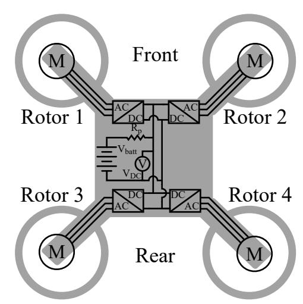
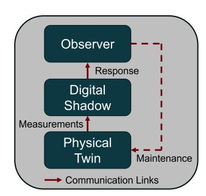
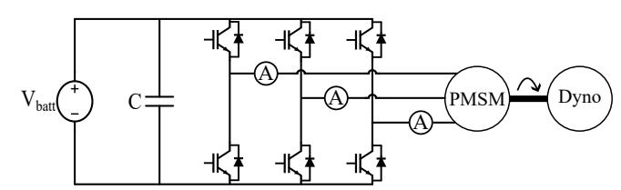
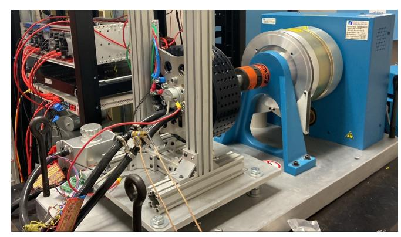
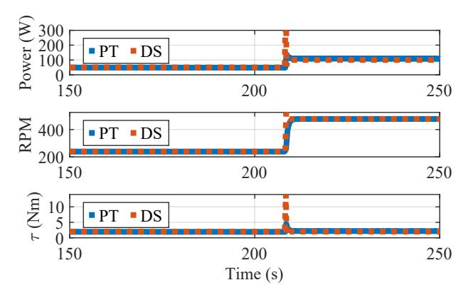
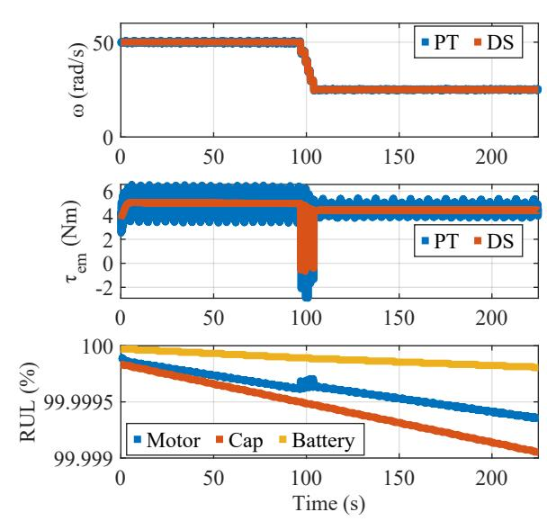

{0}------------------------------------------------

# Remaining Useful Life digital shadow for an eVTOL Powertrain

Jack Hannum\*, Kerry Sado, Aqarib Hussain, George Anthony,

Jason Bakos, Austin Downey, and Kristen Booth

*College of Engineering and Computing*

*University of South Carolina*

Columbia, USA

jhannum@sc.edu\*

*Abstract***—This study introduces a real-time digital shadow representation for an electric Vertical Takeoff and Landing (eVTOL) powertrain, aimed at estimating the Remaining Useful Life (RUL) of key components. Leveraging real-time operational data, the digital shadow dynamically updates RUL estimates. The objective of this digital shadow is to enhance the reliability and maintenance strategies for eVTOL systems. The implementation encompasses critical components, including DC link capacitors, the motor, and the battery. Experimental results demonstrate the capability of the digital shadow to adjust RUL estimates in real-time in response to operational condition changes.**

*Index Terms***—Remaining Useful Life (RUL), electric Vertical Takeoff and Landing (eVTOL) vehicle, electric aircraft, reliability, digital shadow, digital twin.**

### I. INTRODUCTION

Advancements in power electronics and energy storage technologies, driven by efforts to reduce operating costs and carbon emissions from commercial flights, have led to the emergence of various electrified aircraft concepts. The power systems of electric aircraft function as islanded DC microgrids in flight and connect to the terrestrial grid after landing to charge. The reduced size and cost of electric fan units enable their use in various locations on the aircraft in a distributed electric propulsion configuration, reducing noise emissions and fuel consumption [1]. A key example is the multi-rotor design in electric Vertical Take-off and Landing (eVTOL) aircraft [2]. A simplified four-rotor eVTOL power system is shown in Fig. 1 with four rotors powered by a shared battery.

Reliability is paramount in aviation applications and maintenance intervals for conventional engines are mandated by the Federal Aviation Administration [3]. These fixed maintenance intervals are enabled by decades of turbine development and informed by massive amounts of flight data from hundreds of millions of commercial flights. Thanks to these factors, commercial aircraft engines are extremely reliable. The CFM56 turbofan used in airliners lasts 30,000 hours before maintenance is required, and the fleet of CFM56 engines have accumulated over 800 million flight hours [4]. No electric propulsion technology has come close to matching the flight

This work is supported by National Aeronautics and Space Administration (NASA) under Grant No. 521536-SC.

Fig. 1: Four-rotor eVTOL power system.

time of these jet engines. However, data from test flights and early commercial operations can be used more effectively by integrating it into a digital shadow.

A digital shadow is a faithful representation of a physical object, receiving data on its conditions and mirroring the real-time behavior of the physical object [5]. It serves as a nominal baseline for comparison with its physical counterpart, identifying potential anomalies. For the purpose of this study, the digital shadow aids in dynamic Remaining Useful Life (RUL) estimation. The symmetry of the eVTOL powertrain enables the study of a single motor, motor drive, and its interconnection to the battery as the physical twin. This paper provides an overview of this physical twin, its digital shadow overlay, the RUL models used in the digital shadow, and the experimental results.

### II. DEVELOPMENT OF THE SINGLE-ROTOR TESTBED

To investigate the reliability and RUL of eVTOL powertrain components, a cyber-physical testbed featuring a single eVTOL rotor system was developed. This section dissects the various aspects of the cyber-physical system required for the RUL-focused digital shadow. The cyber-system can be considered as layered, shown in Fig. 2. The lowest layer

{1}------------------------------------------------

Fig. 2: Cyber-physical system depicting the RUL digital shadow overlay.

is the physical twin, the asset being monitored, which is a single-rotor powertrain. The middle layer is the digital shadow where the RUL studies are housed; this layer receives sensor measurements from the physical asset to enable real-time monitoring. In order to verify that the RUL is based on accurate sensor readings, this digital shadow also incorporates a transient model of powertrain operation. Finally, the sensor data is provided to the RUL models, and a graphical user interface of the RUL responses over time can be seen by an observer. The observer in this case can be a mechanic or the flight operations coordinator who can determine the expected maintenance schedule and incorporate the necessary downtime into the eVTOL flight schedule.

# *A. Physical Twin Hardware*

The powertrain schematic of this testbed, shown in Fig. 3, encompasses a power supply, a three-phase Variable Frequency Drive (VFD), and a permanent magnet synchronous motor loaded by a dynamometer.

The physical twin hardware of the eVTOL powertrain consisted of a VFD, a motor, a dynomometer, and a battery emulator. Constructed within the Imperix rapid prototyping environment, the VFD utilized PEB8032 IGBT half-bridge modules, each with 260  $\mu$ F of DC link capacitance and integrated current sensors for inductor current feedback. Optical gate signals were transmitted at 20 kHz from a B-Box controller, executing the field-oriented control algorithm for d- and q-axis current regulation, following a q-axis current reference from a PI speed controller. Rotor position and speed feedback were provided by an incremental rotary encoder mounted on the rotor shaft and decoded by the controller. The motor used was an Emrax 228, a medium voltage motor that is both air- and liquid-cooled. A bidirectional DC power supply emulated the battery. Figure 4 presents the physical twin hardware used for this study.

Fig. 3: Single-rotor eVTOL powertrain testbed schematic.

Fig. 4: Single-rotor eVTOL powertrain testbed hardware.

# *B. Digital Shadow Components*

The digital shadow computed the RUL of the DC bus capacitors, the battery, and the motor based on real-time operating data which was first verified with a transient powertrain model. The digital shadow components were implemented in Simulink and run in real-time at 20 kHz on an Opal-RT simulator. The necessary operating data, including controller setpoints and load measurements, are sent from the physical twin to the digital shadow over User Datagram Protocol (UDP). The operator can then monitor RUL and the digital-physical twin response comparison through a LabView panel. This subsection will focus on the digital shadow representations required to accomplish RUL monitoring.

**Powertrain Transient Modeling:** Basic transfer function models within a rotating reference frame simulated the motor. Under space vector modulation, an  $\alpha$ - $\beta$  domain reference voltage is provided, and the switches are commutated to synthesize the reference voltage through connection of each phase to the DC link voltage or ground [7]. Leveraging this action and the Park transformation permits the VFD to be modeled as a voltage source applying d- and q-axis stator voltages to the motor. The relationship between the d- or q-axis current induced in the motor,  $i_{sd,q}$ , and the axis-dependent voltage applied by the VFD,  $v_{sd,q}$ , is expressed as

$$H_{d,q}(s) = \frac{i_{sd,q}}{v_{sd,q}} = \frac{1/R_s}{1 + s L_{d,q}/R_s} \quad (1)$$

where  $L_{d,q}$  is the d- or q-axis stator inductance and  $R_s$  is the stator resistance [6]. In the digital shadow, (1) is used to generate feedback for the field-oriented control. The transfer function was also used to design the digital current controllers that enable field-oriented control in the digital shadow and physical asset.

Electromagnetic torque,  $\tau_{\text{em}}$ , was calculated using the q-axis current as

$$\tau_{\text{em}} = 1.5p\Psi_{pm}i_{sq} \quad (2)$$

with  $p$  denoting pole pairs and  $\Psi_{pm}$  the permanent magnet flux in the machine [6]. External loads on the motor shaft, like aerodynamic forces on an eVTOL propeller, subtract from the torque available to accelerate the rotor while regenerative

{2}------------------------------------------------

shaft loads accelerate the rotor and are modeled as negative torque loads. Net torque,  $\tau_{\text{net}}$ , can be calculated from the motor electromagnetic torque,  $\tau_{\text{em}}$ , and the load torque,  $\tau_{\text{load}}$ ,

$$\tau_{\text{net}} = \tau_{\text{em}} - \tau_{\text{load}}. \quad (3)$$

The rotor inertia,  $J$ , can be used to write a transfer function relating rotor speed,  $\omega_m$ , to the net shaft torque as

$$H_s(s) = \frac{\omega_m}{\tau_{\text{net}}} = \frac{1}{sJ}. \quad (4)$$

Equations (3) and (4) allow the rotor speed to be calculated from the torque derived from the q-axis current and the known external load. A digital speed regulator employed in the digital shadow and physical asset was designed using (4) by treating  $\tau_{\text{load}}$  as a disturbance. To enable real-time simulation, the continuous-time transfer functions of (1) and (4) were discretized using the trapezoidal approximation. The parameters of the Emrax 228 used in (1) and (4) are included in Table I. The speed reference and torque load provided to the hardware were also directed to the digital shadow, allowing it to mirror the operation of the physical asset using its model of the asset and its controller. The operator-provided set-points and the system state information generated by the digital shadow were also applied to the prediction of the RUL of key components.

TABLE I: Motor Transient Model Parameters

| Parameter |            | Symbol |   | Value  |    |     |
|-----------|------------|--------|---|--------|----|-----|
| Stator    | Resistance | R      | s | 1      | 1  | Ω   |
| d-axis    | Inductance | L      | d | 2      | 5  | µH  |
| q-axis    | Inductance | L      | q | 2      | 5  | µH  |
|           | Pole Pairs | p      |   |        | 10 |     |
|           | PM Flux    | Ψ pm   |   | 0 0355 |    | V s |

**Remaining Useful Life Estimation:** Remaining useful life for the motor, capacitors, and emulated battery was estimated using data from both the physical twin and the digital shadow. Since the objective of this work was to demonstrate the integration of RUL estimation into a responsive digital shadow, rather than the development of new component life estimation models, simplified RUL models were employed. Once the concept of RUL models integrated with transient models in a digital shadow is demonstrated and its utility ascertained, the accuracy of the underlying models can be improved.

**Capacitor RUL:** Since the capacitors comprising the DC link were aluminum electrolytic capacitors, the capacitor RUL was estimated using the model presented in [8],

$$L = L_0 \left( \frac{V}{V_0} \right)^{-n} 2^{\frac{T_0-T}{a}}, \quad (5)$$

where  $V$  is the voltage of the use case,  $V_0$  is the voltage of the test condition,  $n$  is the material-dependent voltage stress exponent,  $T_0$  and  $T$  are the use-case and test-condition temperatures, respectively, and  $a$  is a scaling factor employed to simulate accelerated aging.  $L_0$  is the expected lifetime of the capacitor. For the DC link capacitor bank used in the single-rotor testbed, the parameters of Table II were used to generate RUL estimates in real-time.

While the temperature of the capacitors could be predicted from real-time power consumption data from the digital shadow, treating the temperature as a parameter permits greater flexibility in the application of the model as component temperatures are not necessarily dominated by their own losses. For example, the temperature may drop significantly as the eVTOL ascends, especially as eVTOLs achieve higher maximum altitudes.

TABLE II: Capacitor RUL Estimate Parameters

| Parameter          | Symbol | Value                     |
|--------------------|--------|---------------------------|
| Expected Lifetime  | $L_0$  | 10 000 s                  |
| Use Voltage        | $V$    | 400 V                     |
| Test Voltage       | $V_0$  | 400 V                     |
| Voltage Stress     | $n$    | 4                         |
| Rated Temperature  | $T_0$  | 27 °C                     |
| Use Scaling Factor | $a$    | 29.4 °C + 0.005 °C/s Ramp |

**Motor RUL:** Motor RUL was calculated as a function of generated torque and time of operation. This approach was selected to allow the operator some freedom to preserve RUL by decreasing motor power while respecting current aviation industry practice of maintaining motors at fixed time intervals. The resulting model for motor RUL is

$$\text{RUL}(t) = \text{RUL}_0 - tK_m |\bar{\tau}_{em}|, \quad (6)$$

where  $\text{RUL}_0$  is the initial remaining useful life of the motor,  $t$  is the elapsed time since the motor started running,  $K_m$  is the motor aging factor, and  $|\bar{\tau}_{em}|$  is the average torque. The average torque signal is obtained by low-pass filtering the torque reference output by the speed controller and taking its absolute value.

The motor RUL model parameters are listed in Table III. The RUL model in (6) predicts that higher torque, slowing or accelerating the rotor, degrades the motor more quickly. This change in RUL aligns with the insulation failure mechanism wherein repeated voltage impulses degrade the inter-winding insulation within the motor. This degradation inevitably causes short circuit failures and motor damage. Increased voltage impulse amplitudes, as would be caused by higher motor currents, also degrade the insulation more quickly [9].

TABLE III: Motor RUL Estimate Parameters

|  | Parameter                   | Symbol | Value       |
|--|-----------------------------|--------|-------------|
|  | Initial Life                | RULo   | 10,000 s    |
|  | Aging Factor                | $K_m$  | 0,0001 1/Nm |
|  | Torque Filter Time Constant | $\tau$ | 0.5 s       |

**Battery RUL:** Battery RUL was derived from charge/discharge cycles and an aging factor, which also factored into the State of Charge (SoC) calculations to reflect battery degradation [10]. The calculation was performed iteratively such that

$$\text{RUL}[t] = \text{RUL}[t - 1] - \text{RUL}_{adj}. \quad (7)$$

{3}------------------------------------------------

The battery RUL adjustment was calculated as the product of the energy discharged,  $E_{dc}$ , the maximum battery capacity,  $E_{max}$ , and an aging factor,  $K_b$ ,

$$\text{RUL}_{adj} = \frac{K_b E_{dc}}{E_{max}}. \quad (8)$$

The RUL was then multiplied by the ideal capacity to get a degraded energy capacity which was then divided by the nominal capacity to get a state of health. The degraded energy capacity was used to update the SoC of the battery in addition to the energy consumed by the motor.

# III. EXPERIMENTAL RESULTS AND DISCUSSION

The digital shadow was able to successfully mimic the speed and q-axis current regulation of the motor. This accurate response ensured the digital shadow was supplying inputs to RUL models comparable to those experienced by the real components. The agreement between the transient model and the hardware response is shown in Fig. 5. From only a load and speed setpoint, the transient model was able to accurately predict the speed, torque and power responses of the motor. These calculated quantities were then used as inputs to determine RUL of key system components.

The digital shadow was able to dynamically update RUL estimations in response to operating conditions, as shown in Fig. 6. This alignment highlights the effectiveness of the digital shadow in mirroring real-time operations and estimating component lifespans under varied operational conditions. A significant aspect of this digital shadow was its dynamic adaptation of the RUL estimations for the motor, which showed high responsiveness to operational changes. This feedback was particularly evident when the motor changed speed at 100 s. This event was captured by the slope reduction observed in the RUL plot within Fig. 6 following the speed reduction, and the corresponding drop in motor torque in the second half of the plot. Such responsiveness is essential for real-time monitoring and decision-making regarding in maintenance and operational strategies, positioning the digital shadow as a valuable predictive tool for eVTOL powertrain management.

Fig. 5: Digital shadow transient model compared to hardware step response.

Fig. 6: RUL calculation for the motor, battery and DC link capacitors, and comparison of digital shadow to hardware.

## IV. CONCLUSIONS & FUTURE WORK

As eVTOLs approach commercialization, system reliability must be assured with far less flight data than has been accumulated for conventional aircraft. Rigorous system modeling applied in real-time as a digital shadow can help to bridge the gap. Digital shadows can protect people and property by warning system operators about degradation as a system operates in response to the actual operating condition of the aircraft and its historical utilization. This capability is a marked improvement over the fixed maintenance windows applied to conventional aircraft, which would be impossible to accurately specify for eVTOLs in the absence of more operational data.

To improve the reliability assessment of key powertrain components, this work introduced a digital shadow representation for a single-rotor eVTOL powertrain testbed. A single rotor of an eVTOL power system was modeled to predict both the transient behavior of the system and the degradation of key components. By replicating the motor control system and providing an average model of the motor and VFD, the speed, torque, and power load of the motor throughout a flight profile was predicted in real-time.

Using the results of the transient model, the digital shadow provided continuous RUL estimates for the motor, DC link capacitors, and the battery. These insights, essential for predictive maintenance, were made accessible to operators for informed real-time decision-making on system maintenance and operational adjustments.

Future efforts will refine degradation models for the capacitors and motor to enhance RUL prediction accuracy. Then, these updated models can be integrated with the physical twin to adjust operational limits based on RUL data, thus, improving performance and reliability. With this bidirectional communication, the digital shadow becomes a digital twin. Initial efforts to close the loop from the digital twin to the 

{4}------------------------------------------------

physical twin will allow variable motor power limits as a function of component degradation. Additional functionality will come from the integration of aerodynamic modeling and navigation systems. The forward-simulation of this enhanced digital twin can be used to predict range and component degradation as a function of airspeed, weather, and course diversions. Likely failure modes, such as phase-to-phase faults, DC bus collapse, and isolation faults, are also candidates for forward-simulation based contingency planning, wherein the digital twin is used to develop strategies for coping with what could be catastrophic faults. More mature digital twins can implement adaptive control of the VFDs for each rotor, reducing control bandwidth to reduce power pulse sharpness, in addition to improved forward-simulation fidelity and contingency coverage. These features will improve eVTOL power system reliability, drive safety for passengers, and improve management for system operators.

## REFERENCES

[1] M. T. Fard, J. He, H. Huang, and Y. Cao, "Aircraft distributed electric propulsion Technologies—A review," *IEEE Transactions on Transportation Electrification*, vol. 8, no. 4, pp. 4067–4090, Dec. 2022. [2] N. Swaminathan, S. R. P. Reddy, K. RajaShekara, and K. S. Haran, "Flying cars and eVTOLs—Technology advancements, powertrain architectures, and design," *IEEE Transactions on Transportation Electrification*, vol. 8, no. 4, pp. 4105–4117, Dec. 2022. [3] "14 CFR 91.409 – inspections," https://www.ecfr.gov/current/title-14/ chapter-I/subchapter-F/part-91/subpart-E/section-91.409, accessed: 2024-2-15. [4] "CFM56 fleet surpasses 800 million flight hours," Jun. 2016, accessed: 2024-1-26. [5] K. Sado, J. Peskar, A. Downey, H. L. Ginn, R. Dougal, and K. Booth, "Query-and-Response Digital Twin Framework using a Multi-domain, Multi-function Image Folio," *TechRxiv*, pp. 1–11, 2024. [6] N. P. Quang and J.-A. Dittrich, *Vector Control of Three-Phase AC Machines: System Development in the Practice*. Springer, May 2015. [7] S. Buso and P. Mattavelli, *Digital Control in Power Electronics: Second Edition*. Morgan & Claypool Publishers, May 2015. [8] H. Wang and F. Blaabjerg, "Reliability of capacitors for DC-link applications — an overview," in *2013 IEEE Energy Conversion Congress and Exposition*. IEEE, Sep. 2013, pp. 1866–1873. [9] P. Sun, W. Sima, X. Jiang, D. Zhang, J. He, and L. Ye, "Review of accumulative failure of winding insulation subjected to repetitive impulse voltages," *High Volt. Appar.*, vol. 4, no. 1, pp. 1–11, Mar. 2019. [10] G. Anthony, J. Peskar, A. R. Downey, and K. Booth, "Extending battery life via load sharing in electric aircraft," in *AIAA SCITECH 2024 Forum*, ser. AIAA SciTech Forum. American Institute of Aeronautics and Astronautics, Jan. 2024.