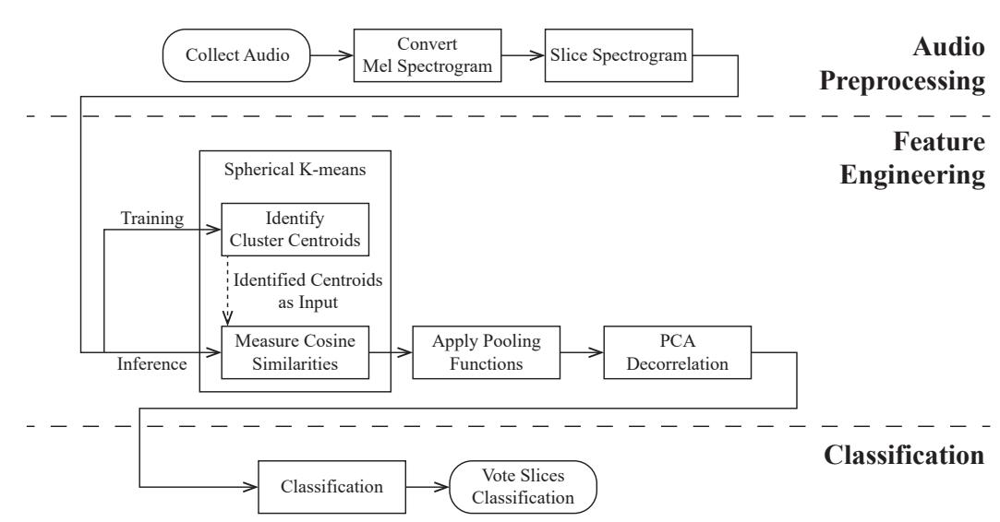
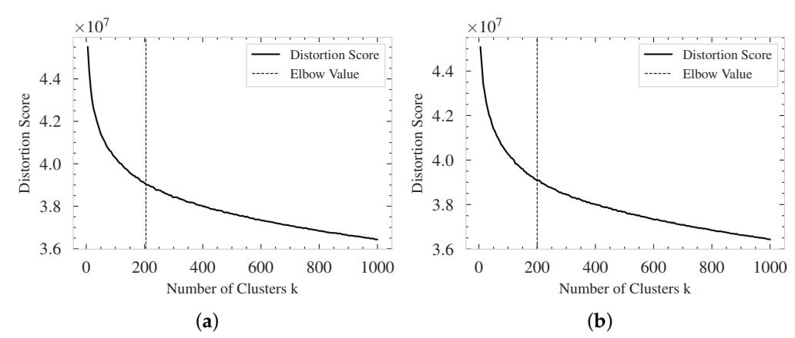
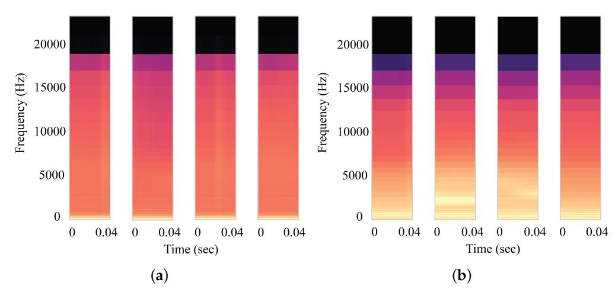
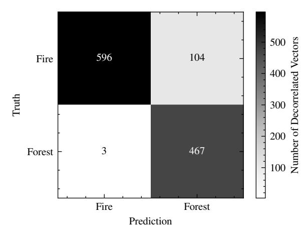
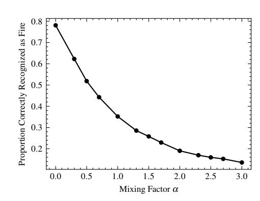

{0}------------------------------------------------

**Citation:** Huang, H.; Downey, A.;

Bakos, J. Audio-Based Wildfire

Detection on Embedded Systems.

*Electronics* **2022**, *11*, 1417.

[https://doi.org/10.3390/](https://doi.org/10.3390/electronics11091417)

[electronics11091417](https://doi.org/10.3390/electronics11091417)

Academic Editors: Deok-Hwan Kim and Mehdi Pirahandeh

Received: 9 April 2022

Accepted: 26 April 2022

Published: 28 April 2022

**Publisher's Note:** MDPI stays neutral with regard to jurisdictional claims in published maps and institutional affiliations.

**Copyright:** © 2022 by the authors. Licensee MDPI, Basel, Switzerland. This article is an open access article distributed under the terms and conditions of the Creative Commons Attribution (CC BY) license [\(https://](https://creativecommons.org/licenses/by/4.0/) [creativecommons.org/licenses/by/](https://creativecommons.org/licenses/by/4.0/) 4.0/).

## *Article*

# **Audio-Based Wildfire Detection on Embedded Systems**

**Hung-Tien Huang 1 [,](https://orcid.org/0000-0001-9046-3022) Austin R. J. Downey 2,3,[\\*](https://orcid.org/0000-0002-5524-2416) and Jason D. Bakos [1](https://orcid.org/0000-0002-0821-6258)**

> 1 Department of Computer Science and Engineering, University of South Carolina, Columbia, SC 29208, USA; hungtien@email.sc.edu (H.-T.H.); jbakos@cse.sc.edu (J.D.B.)

2 Department of Mechanical Engineering, University of South Carolina, Columbia, SC 29208, USA

3 Department of Civil and Environmental Engineering, University of South Carolina, Columbia, SC 29208, USA

**\*** Correspondence: austindowney@sc.edu

**Abstract:** The occurrence of wildfires often results in significant fatalities. As wildfires are notorious for their high speed of spread, the ability to identify wildfire at its early stage is essential in quickly obtaining control of the fire and in reducing property loss and preventing loss of life. This work presents a machine learning wildfire detecting data pipeline that can be deployed on embedded systems in remote locations. The proposed data pipeline consists of three main steps: audio preprocessing, feature engineering, and classification. Experiments show that the proposed data pipeline is capable of detecting wildfire effectively with high precision and is capable of detecting wildfire sound over the forest's background soundscape. When being deployed on a Raspberry Pi 4, the proposed data pipeline takes 66 milliseconds to process a 1 s sound clip. To the knowledge of the author, this is the first edge-computing implementation of an audio-based wildfire detection system.

**Keywords:** wildfire detection; acoustic signal detection; embedded system

# **1. Introduction**

The occurrence of wildfires often results in significant fatalities. In California, wildfires killed more than 30 people, destroyed more than 8500 structures, and torched 4 million acres of land in the period between January 2020 and mid-October 2020 [\[1\]](#page-8-0). The ability to identify wildfires at their early stage is important as wildfires are notorious for their high speed of spread [\[2\]](#page-8-1). However, the task of early detection of wildfires remains a challenging research question [\[3\]](#page-8-2).

Satellites and both occupied and unoccupied aerial vehicles equipped with infrared sensors or high-resolution cameras have been used to identify wildfires. Previously, Lin et al. [\[4\]](#page-8-3) proposed a Kalman filter based model running on a system of UAVs to monitor the heat generated by wildfire. Even though not explicitly stated, such a method would require a temperature sensor to measure the heat generated by the wildfire. However, infrared sensors and optical cameras are both susceptible to physical obstacles in the direct line of sight. Wildfires can be classified into three types according to the combustion materials: underground fire, surface fire, or crown fire [\[5\]](#page-8-4). Underground fire may not be detectable by cameras at its early stage, whereas the initial surface fire might be obstructed by the leaves and branches of trees. Attempts have been made to identify wildfire according to its acoustic characteristics. An in-depth acoustic spectral analysis on different types of fire has been conducted Zhang et al. [\[5\]](#page-8-4).

Previously, Internet of Things (IoT) devices that transmit collected acoustic signals with wireless sensor networks to a centralized data center for wildfire detection have been proposed [\[5](#page-8-4)[,6\]](#page-8-5). Specifically, Zhang et al. [\[5\]](#page-8-4) proposed to use LoRa to transmit collected acoustic signals. Such approaches rely on transmitting original acoustic signals efficiently and correctly. However, LoRa's transmission rate is bounded between 0.3 and 27 kbps depending on the environment and the transmission protocol [\[7\]](#page-8-6). Such limitations could be a significant drawback when transmitting acoustic signals from the forest to a remote 

{1}------------------------------------------------

computing center in a timely manner. Furthermore, continuously streaming data from the forest to a remote server would result in continuous high power consumption, which is undesirable in remote locations where access to electricity is limited.

In this paper, a machine learning data pipeline derived from the framework proposed by Salamon and Bello [\[8\]](#page-8-7) is implemented to distinguish wildfire sound from generic forest sounds. In addition, an edge computing device (Raspberry Pi 4) is utilized to run the data pipeline to demonstrate that the proposed data pipeline can be deployed on embedded systems in remote locations. The main idea of the original framework is to perform feature engineering with spherical k-means [\[9\]](#page-8-8), followed by classifying feature vectors with a classification algorithm. Different from the original framework, an additional PCA decorrelation is added to prevent the downstream classifier from overfitting. In this work, the support vector machine [\[10\]](#page-8-9) is the chosen classification algorithm. Even though deep neural networks are considered as general function approximators and have been demonstrated to perform well on time-series classification tasks, their expensive computational and memory requirements during inference make it difficult to fit on an embedded system [\[11](#page-8-10)[,12\]](#page-8-11).

The main contributions of this work are twofold. First, this is the first edge-computing implementation of an audio-based wildfire detection system to the knowledge of the authors. Second, the added PCA decorrelation step is demonstrated to enhance the generalization capability of the trained data pipeline. Moreover, the proposed method could be generalized to recognize underwater species, classify bird species, or detect unusual activities in cities [\[8,](#page-8-7)[13–](#page-8-12)[15\]](#page-8-13).

## **2. Preliminary**

This work uses a self-compiled dataset that consists of 5880 labeled sounds from two classes: fire and forest. The fire sounds are downloaded from the Forest Wild Fire Sound Dataset [\[16\]](#page-8-14), whereas the generic forest sounds are downloaded from the Internet. The current dataset is a mix of forest ecosystems throughout the world. The development of comprehensive datasets focusing on specific ecosystems (e.g., Sub-Saharan forests, tropical forests) is left to future work as the focus of this paper is on the development of a data pipeline that capable of being deployed to embedded systems. Previous research suggests that humans can recognize everyday scenes from 4 s audio clips with an 82% accuracy on average [\[17\]](#page-8-15). Therefore, all the audio in the dataset are chunked into 4 s duration audio files. Segments shorter than 4 s are dropped and not used in the training procedure. In addition, all the audio is re-sampled to 44.1 kHz; however, the selected sample rate was arbitrary. Due to the small sample size, the dataset is pre-sorted into 10 folds and the performance is reported with 10-fold cross validation. Moreover, an additional wildfire sound and another generic forest sound that are not included in the training dataset are used as a test dataset. The testing wildfire has a duration of 5 min and 25 s, while the testing forest sound has a duration of 3 min and 28 s.

### **3. Methodology**

The proposed sound classification pipeline is shown in Figure [1](#page-2-0) and follows the framework proposed by Salamon and Bello [\[8\]](#page-8-7). The main steps consist of audio preprocessing, feature engineering, and classification. The audio preprocessing step converts the timedomain sound wave into frequency-domain spectrograms. Next, the feature engineering step is used to recognize commonly observed patterns in spectrograms within each interested category of sound. Compare to the framework proposed by Salamon and Bello [\[8\]](#page-8-7), an additional PCA decorrelation is added after applying pooling functions to decorrelate similar cluster centroids and prevent downstream classifiers from overfitting. Lastly, the classification step classifies the input sound based on recognized spectrogram features.

{2}------------------------------------------------

**Figure 1.** Flowchart of the proposed data pipeline showing how collected audio is classified positively or negatively as wildfire.

## *3.1. Preprocessing*

# 3.1.1. Mel Spectrogram

Sound waves are unsuitable choice of input for classification algorithms due to the curse of dimensionality [14]. Therefore, sound waves are transformed into Mel spectrograms that resemble human hearing perceptions for further processing. Compared with short-time Fourier Transform (STFT) spectrograms, Mel spectrograms have lower dimensionality, which is beneficial to tackle the curse of dimensionality issue in machine learning. Note that a Mel spectrogram is a matrix in  $\mathbb{R}^{f \times t}$  space, where  $f$  is the number of frequency bins in the spectrogram and  $t$  is the number of time frames.

# 3.1.2. Shingled Vector

Feature engineering is applied to groups of consecutive frames in spectrograms. In other words, a spectrogram is sliced temporally into multiple spectrograms with shorter duration for further processing. The action of grouping  $s$  consecutive frames is termed shingle with shingle size  $s$ . The grouped frames are flattened into column vectors in  $\mathbb{R}^{s \cdot f}$  space and are termed shingled vectors. Shingling enables the temporal dynamics to be captured by the machine learning system and therefore increases the stability and performance of the system [8]. The total number of shingled vectors  $n$  for a spectrogram is determined by the stride size  $r$  and the number of time frames in the spectrogram.

# *3.2. Feature Engineering*

# 3.2.1. Projection Vector with Spherical k-Means

It is recognized that sounds within the same category have similar spectral characteristics. As shingled vectors are slices from spectrograms, shingled vectors within the same class will also share similar identifiable characteristics. Therefore, class-conditioned spherical k-means [9] was proposed by Salamon and Bello [8] to capture such structure, i.e., a system of  $c$  categories of sound will have  $c$  spherical k-means instances. Each spherical k-means instance will have  $k$  cluster centroids, where each cluster centroid entails a “meta-spectrogram” that is commonly observed in the training data. Salamon and Bello [8] previously demonstrated that the classification performance using the class-conditioned approach has slightly better performance compared to that of using a single gigantic k-means instance.

In the spherical k-means algorithm, a PCA instance is used to reduce the dimensionality of the input vectors prior to either fitting or projecting onto cluster centroids. The explanatory power of the PCA instance is determined by a hyperparameter termed ex-

{3}------------------------------------------------

plained variance. The explained variance controls the resolution of the “meta-spectrograms” entailed by the identified cluster centroids. During inference time, each shingled vector of a spectrogram is projected onto cluster centroids, and the cosine similarities between shingled vectors and cluster centroids are measured. Therefore, a spectrogram of  $n$  shingled vectors would have  $n$  vectors of cosine similarities. The vectors of cosine similarities is termed as the projection vectors and are vectors in  $\mathbb{R}^k$ , where  $k = \sum_{i=1}^c k_i$  is the total number of cluster centroids across all class-conditioned spherical k-means.

# 3.2.2. Pooled Vectors

Summarizing the projection vectors over the time axis is necessary as an audio recording has multiple projection vectors. It was previously demonstrated by Salamon and Bello [8] that the usage of mean and standard deviation as the pooling function has the best classification performance. Therefore, the same combination of pooling functions is adopted. The pooled vectors are the resulting vectors after the pooling functions are applied to the projection vectors. The pooling size  $p$  is the number of projection vectors to be evaluated by the pooling function and is a hyperparameter in this paper. The number of pooled vectors is  $o = \lfloor \frac{n}{p} \rfloor$  and the leftover projection vectors are dropped. Note that full pooling was used by Salamon and Bello [8], which means the pooling size is set to the total number of projection vectors of a spectrogram. Such an approach assumes the input signal was truncated to contain nothing except the sound of interest. However, when the system is being deployed to classify wildfire sounds in real time, sound waves are streamed from the microphone and the knowledge of when the event of interest begins is generally unavailable. Thus, truncating the sound to include only the events of interest are impossible.

## 3.2.3. Vector Decorrelation with PCA

Upon visual inspection, it is realized that some cluster centroids are highly correlated i.e., certain subsets of cluster centroids are extremely similar and cause certain dimensions in the projection and the pooled vector space to be activated at the same time. Such phenomena could cause the downstream classifier to overfit the training dataset. Even though removing highly correlated features from learned spherical k-means is possible, such an approach is neither scalable, nor time efficient. Therefore, a PCA decorrelation is applied on pooled vectors in the hope of eliminating highly correlated dimensions. The term decorrelated vectors is used to describe the pooled vectors after the PCA transformation.

## *3.3. Classification*

The classification algorithm takes a decorrelated vector as input and returns a class label or a vector of class probabilities as output. Since full pooling is not utilized, an input sound containing  $o$  pooled vectors would have  $o$  class predictions. Therefore, the voting scheme is used to determine whether a given input sound belongs to a particular category. In this work, the support vector machine [10] is the selected classification algorithm. Even though deep neural networks are considered as general function approximators and have been demonstrated to perform well on time series classification tasks, their expensive computational and memory requirements during inference make it difficult to fit on the target embedded system [11,12].

#### **4. Experimental Setup**

Sound waves are transformed into log-scaled Mel spectrograms with 40 components covering the audible frequency range (0–22,050 Hz) with window size and hop size of 5.8 ms (256 samples at 44.1 kHz). The shingle size is set to 16 frames. The explained variance associated with spherical k-means is set to 85%. The optimal number of clusters  $k_i$  is first roughly estimated with knee point algorithm [18] with respect to distortion score with  $k_i$ 's in the range of [5, 1000] and step size of 5. (Intuitively, the distortion score is the mean sum of squared distances between each shingled vector and its assigned cluster centroid. However, the PCA instance in spherical k-means transforms the shingled vectors

{4}------------------------------------------------

into a latent space in which are found the cluster centroids. Therefore, the distortion score is technically the mean sum of squared distance between each "latent" shingled vector and its assigned cluster centroid.) The actual  $k_i$ 's are then selected manually around the estimated  $k_i$ 's based on the trained pipeline's performance. For simplicity, the selected  $k_i$ 's are subject to the constraint of  $k_i = k_j, \forall i \neq j$ . The explained variance of the PCA between pooled vectors and classification is set to 99%. In this work, the support vector machine implemented in Scikit-learn [19] is the chosen classification algorithm. For RBF kernel, the parameter `gamma` is set to "scale", which is the default of Scikit-learn at the time of the work. (From Scikit-learn documentation, the value of `gamma` is calculated from the formula  $1/(n_{\text{features}} * X_{\text{var}}(\cdot))$ .) In this case, `n_features` is the dimensionality of the decorrelated vectors and  $X$  is a matrix of all the decorrelated vectors in the training dataset [19]. The trained models are serialized into the Open Neural Network Exchange (ONNX) format [20] and are deployed on Raspberry Pi 4 Model B 2GB with Ubuntu Mate 20.04.

As suggested by Zhu et al. [21], a smaller latent mixture model trained with a “clean” training dataset could outperform a bigger model trained with a noisy training dataset. In this work, the spherical k-means instance in the data pipeline serves as the latent mixture model and is trained on sound waves in the dataset without data augmentation. However, it is realized that sound waves streamed from the forest might contain different levels of noise. However, small datasets, such as the one used in this work, are notorious for their poor generalization capability. Hence, for each sound wave in the training dataset, the probability of the sound wave being augmented with white noise is set to 0.5. If the audio is selected for augmentation, the amount of noise to be injected is measured by the signal-to-noise ratio ( $\text{SNR}_{\text{dB}}$ ) and is determined by a sample from a uniform distribution within a prespecified range (0, 4.77). The  $\text{SNR}_{\text{dB}}$  formulation adopted in this work is:

$$\text{SNR}_{\text{dB}} = 10 \log_{10} \frac{\text{RMS}_{\text{signal}}^2}{\text{RMS}_{\text{noise}}^2} \quad (1)$$

When being deployed in real time at remote locations, it is realized that the collected sound wave would be the combination of both wildfire and forest sounds. Therefore, the testing wildfire sound is played back with different levels of forest sound in the background to test the pipeline's ability to identify wildfire in the stated scenario. The loudness of the background forest fire is determined by the mixing factor  $\alpha \in \mathbb{R}$ . Since the testing wildfire sound is longer than the testing forest sound, the testing wildfire sound is truncated to have the same duration. Let  $A_{\text{wildfire},t}$  denote the amplitude of wildfire at time step  $t$  and  $A_{\text{forest},t}$  denote the amplitude of forest at time step  $t$ , the amplitude of mixed sound wave at time step  $t$  is denoted as  $A_{\text{mixed},t}$  and is calculated as follows:

$$A_{\text{mixed},t} = A_{\text{wildfire},t} + \alpha A_{\text{forest},t} \quad (2)$$

#### **5. Result**

The average estimated optimal  $k$  identified by knee point algorithm across all 10 validation folds is  $k_{\text{fire}} = 142$  with sample standard deviation of 19.178 and  $k_{\text{forest}} = 164$  with sample standard deviation of 29.957. The elbow plots for cross-validation set 1 is presented in Figure 2. Selected spectrogram features learned by spherical k-means are presented in Figure 3. Note that the estimated optimal  $k$  for cross-validation set 1 is outside one sample standard deviation.

Based on the average estimated optimal  $k$ , the proposed data pipeline is trained with 4 different fixed  $k$ s in the range of [50, 200] with a step size of 50. The large range is selected due to the high standard deviation observed above. All the experimented classifiers reached 99% training and validation accuracy. However, the best-performing data pipeline can only reach 90% accuracy on the test dataset. The complete classification performance on the test dataset is presented in Table 1. It is observed that a data pipeline with a spherical

{5}------------------------------------------------

k-means of  $k = 100$ , SVM with  $C = 0.1$ , and RBF kernel has the best performance among the 16 experiments executed. The confusion matrix of the best-performing data pipeline classifying the test dataset is presented in Figure 4. The proportion of time the pipeline identifies wildfire occurs vs. the mixing factor  $\alpha$  is presented in Figure 5.

**Figure 2.** The elbow plots for cross-validation set showing: (**a**) the elbow plot for fire and (**b**) the elbow plot for forest.

**Figure 3.** Selected centroid plots identified by spherical k-means showing (**a**) the selected fire centroid plots and (**b**) the selected forest centroid plots.

**Figure 4.** The confusion matrix of the data pipeline trained at *k* = 100 with SVM using RBF kernel and data augmentation. Note that the presented confusion matrix is the average of the confusion matrix across all 10-validation fold rounded to the nearest integer.

{6}------------------------------------------------

**Figure 5.** The proportion of instances the data pipeline correctly recognizes as wildfire versus the mixing factor  $\alpha$ , the amount of forest sound being mixed in to the wildfire sound.

**Table 1.** Model Performance on Test Dataset with Data Augmentation.

|           | Kernel |       |       | RBF   |       |       |       | Linear |       |
|-----------|--------|-------|-------|-------|-------|-------|-------|--------|-------|
|           | C      |       |       | 0.1   |       |       |       | 0.3    |       |
|           | k      | 50    | 100   | 150   | 200   | 50    | 100   | 150    | 200   |
| Accuracy  | Mean   | 0.886 | 0.909 | 0.904 | 0.907 | 0.773 | 0.812 | 0.803  | 0.831 |
| Accuracy  | SD     | 0.012 | 0.006 | 0.006 | 0.006 | 0.028 | 0.026 | 0.032  | 0.023 |
| Precision | Mean   | 0.999 | 0.995 | 0.995 | 0.995 | 0.999 | 0.998 | 0.997  | 0.997 |
| Precision | SD     | 0.002 | 0.001 | 0.0   | 0.0   | 0.001 | 0.001 | 0.001  | 0.001 |
| Recall    | Mean   | 0.811 | 0.852 | 0.844 | 0.848 | 0.622 | 0.687 | 0.672  | 0.719 |
| Recall    | SD     | 0.019 | 0.011 | 0.009 | 0.010 | 0.047 | 0.044 | 0.053  | 0.039 |

The trained data pipeline is deployed to a Raspberry Pi 4 with 2 GB of RAM running Ubuntu Mate 20.04 with graphical user interface (GUI). A monitor and a keyboard are connected. Both Wi-Fi and Bluetooth are disabled. The memory profiler reported that the proposed data pipeline steadily consumes 275 MB when being used to stream and classify an input sound wave. Out of 326 experiments, processing one-second-long input audio takes 66 milliseconds on average, with sample standard deviation of 24 milliseconds and a maximum of 169 milliseconds. When the program is not being executed, the Raspberry Pi consumes 2.107 Watts on average. While the program is running, the power consumption of the Raspberry Pi is bounded between 2.91 and 3.59 Watts.

# **6. Discussion**

From the elbow plot shown in Figure [2,](#page-5-0) it can be observed that the distortion score decays exponentially with respect to the number of clusters *k* when *k* is less than the estimated optimal *k*, and linear decay is observed when *k* is larger than the estimated optimal *k*. Based on the observation, it is believed that the range of *k* values used to run the knee point algorithm is sufficient. If the range of *k* values is too small, the experiment may return an elbow plot that does not have such a distinctive pattern or even fail to converge. There is no practical benefits except increased experiment time if a larger range of *k* values is used.

The learned spectrogram features shown in Figure [3](#page-5-1) could correspond to a human's experience. In Figure [3a](#page-5-1), the vertical stripes might correspond to the sound of branches snapping while being torched by wildfire, whereas the bright horizontal bright peak at low frequency in Figure [3b](#page-5-1) might correspond to birds singing in the forest. It is worth noting that patterns such as vertical stripes become less obvious as the explained variance associated with spherical k-means decreases down to 80%.

Comparing test performance shown in Tables [1](#page-6-0) and [2,](#page-7-0) it can be observed that data augmentation makes a significant contribution to the generalization capability of the trained data pipeline. It is observed that a SVM with a RBF kernel outperforms a SVM with a linear 

{7}------------------------------------------------

kernel. In particular, the best-performing data pipeline (*k* = 100, SVM with *C* = 0.1, and RBF kernel) demonstrated 99% precision and 85% recall. These metrics have two meanings. First, whenever the data pipeline reports wildfire occurs, the fire agency could believe there really is a fire with 99% certainty. In other words, the best performing data pipeline is unlikely to trigger a false alarm. Second, when we know there is a wildfire happening and the data pipeline is deployed, it is expected that the data pipeline would recognize there is a wildfire 85% of the time, which means the best-performing data pipeline is very effective at detecting wildfire.

**Table 2.** Model Performance on Test Dataset without Data Augmentation.

|           | Kernel |       |       | RBF   |       |       |       | Linear |       |
|-----------|--------|-------|-------|-------|-------|-------|-------|--------|-------|
|           | C      |       |       | 0.1   |       |       |       | 0.3    |       |
|           | k      | 50    | 100   | 150   | 200   | 50    | 100   | 150    | 200   |
| Accuracy  | Mean   | 0.777 | 0.869 | 0.876 | 0.876 | 0.672 | 0.715 | 0.711  | 0.701 |
| Accuracy  | SD     | 0.009 | 0.005 | 0.003 | 0.005 | 0.024 | 0.033 | 0.024  | 0.024 |
| Precision | Mean   | 0.998 | 0.995 | 0.995 | 0.995 | 0.998 | 0.997 | 0.996  | 0.997 |
| Precision | SD     | 0.001 | 0.0   | 0.0   | 0.0   | 0.002 | 0.001 | 0.001  | 0.001 |
| Recall    | Mean   | 0.629 | 0.786 | 0.797 | 0.797 | 0.453 | 0.525 | 0.518  | 0.502 |
| Recall    | SD     | 0.014 | 0.008 | 0.006 | 0.008 | 0.039 | 0.056 | 0.041  | 0.040 |

From the result shown in Figure [5,](#page-6-1) it is observed that the data pipeline's ability to identify wildfire reduces exponentially as louder background forest sound is injected. The observation is as expected, since the sound of wildfire with forest sound playing in the background is not included in the training dataset. Future research is needed to address the issue of low-volume wildfire sounds.

The 10% difference between train and validation accuracy and test accuracy suggests that the dataset currently used might not be a comprehensive representation of real-world wildfire sounds. In addition, the assumption for the current dataset is that the trained data pipeline has to be deployed in a remote area where the input is only limited to either wildfire or natural forest sound. The behavior of the proposed data pipeline taking rock music as input is undetermined, not investigated, and beyond the scope of this investigation.

Raspberry Pi 4 was selected since it was convenient for our preliminary experiment. The theoretical lifespan of the system running on a three-cell, 11.1 Volts, 5000 mAh Li-Po battery can be calculated from the measured power consumption. It was assumed that the microphone consumes no energy and power losses to heat due to voltage conversion are negligible. It is estimated that the lifespan of the system is between 15 h 28 min and 19 h 5 min. To enable prolonged deployment, a solar-based battery-recharging system would need to be developed. Assuming 12 h of sun light and no more than 50% radiation loss due to foliage or atmospheric ash, a 10 Watt solar panel would be needed.

Even under optimistic assumptions, it is admitted that the energy requirements for the system might be too strenuous to be deployed in forests with dense foliage or continuous ash cover. However, based on the profiled memory consumption, the authors believe the short battery lifespan can be improved by deploying the pipeline on a more compact edge computing device such as the Raspberry Pi Zero 2 W with consumes less power. In this way, the size of the solar panel required for sustained operations could be reduced.

# **7. Conclusions**

In this paper, an audio-based machine learning system used to detect wildfire in forests is proposed. The proposed method is derived from the framework first introduced by Salamon and Bello [\[8\]](#page-8-7). The essential idea is to first build commonly seen patterns within the spectrograms of interested sounds; the similarity between the current input audio and all the learned patterns is then measured; the downstream classifier reports the category label based on the similarity measures. It is also demonstrated that the proposed data 

{8}------------------------------------------------

pipeline has the potential to identify wildfire with precision up to 99% accuracy and could identify wildfire up to 85% of the time. More importantly, the proposed data pipeline could be deployed onto an embedded system such as the Raspberry Pi 4 with 2GB of RAM, which allows the system to be squeezed into a sensor package and be deployed in remote locations.

**Author Contributions:** Conceptualization, H.-T.H., A.R.J.D. and J.D.B.; methodology, H.-T.H. and A.R.J.D.; software, H.-T.H.; validation, H.-T.H.; formal analysis, H.-T.H. and A.R.J.D.; investigation, H.-T.H. and A.R.J.D.; resources, A.R.J.D. and J.D.B.; data curation, H.-T.H.; writing—original draft preparation, H.-T.H.; writing—review and editing, H.-T.H., A.R.J.D. and J.D.B.; visualization, H.- T.H., A.R.J.D.; supervision, A.R.J.D. and J.D.B.; project administration, A.R.J.D.; funding acquisition, A.R.J.D. and J.D.B. All authors have read and agreed to the published version of the manuscript.

**Funding:** This research received no external funding.

**Institutional Review Board Statement:** Not applicable.

**Informed Consent Statement:** Not applicable.

**Data Availability Statement:** Not applicable.

**Conflicts of Interest:** The authors declare no conflict of interest.

#### **References**

- 1. Roman, J.; Verzoni, A.; Sutherland, S. The Wildfire Crisis: Greetings from the 2020 Wildfire Season. *NFPA J.* **2020**, *114*, 24–35.
- 2. Barmpoutis, P.; Papaioannou, P.; Dimitropoulos, K.; Grammalidis, N. A Review on Early Forest Fire Detection Systems Using Optical Remote Sensing. *Sensors* **2020**, *20*, 6442. [\[CrossRef\]](http://doi.org/10.3390/s20226442) [\[PubMed\]](http://www.ncbi.nlm.nih.gov/pubmed/33187292)
- 3. Vásquez, F.; Cravero, A.; Castro, M.; Acevedo, P. Decision Support System Development of Wildland Fire: A Systematic Mapping. *Forests* **2021**, *12*, 943. [\[CrossRef\]](http://dx.doi.org/10.3390/f12070943)
- 4. Lin, Z.; Liu, H.H.T.; Wotton, M. Kalman Filter-Based Large-Scale Wildfire Monitoring with a System of UAVs. *IEEE Trans. Ind. Electron.* **2019**, *66*, 606–615. [\[CrossRef\]](http://dx.doi.org/10.1109/TIE.2018.2823658)
- 5. Zhang, S.; Gao, D.; Lin, H.; Sun, Q. Wildfire Detection Using Sound Spectrum Analysis Based on the Internet of Things. *Sensors* **2019**, *19*, 5093. [\[CrossRef\]](http://dx.doi.org/10.3390/s19235093) [\[PubMed\]](http://www.ncbi.nlm.nih.gov/pubmed/31766431)
- 6. Khamukhin, A.A.; Demin, A.Y.; Sonkin, D.M.; Bertoldo, S.; Perona, G.; Kretova, V. An algorithm of the wildfire classification by its acoustic emission spectrum using Wireless Sensor Networks. *J. Phys. Conf. Ser.* **2017**, *803*, 012067. [\[CrossRef\]](http://dx.doi.org/10.1088/1742-6596/803/1/012067)
- 7. Adelantado, F.; Vilajosana, X.; Tuset-Peiro, P.; Martinez, B.; Melia-Segui, J.; Watteyne, T. Understanding the Limits of LoRaWAN. *IEEE Commun. Mag.* **2017**, *55*, 34–40. [\[CrossRef\]](http://dx.doi.org/10.1109/MCOM.2017.1600613)
- 8. Salamon, J.; Bello, J.P. Unsupervised feature learning for urban sound classification. In Proceedings of the 2015 IEEE International Conference on Acoustics, Speech and Signal Processing (ICASSP), South Brisbane, QLD, Australia, 19–24 April 2015; pp. 171–175. [\[CrossRef\]](http://dx.doi.org/10.1109/ICASSP.2015.7177954)
- 9. Coates, A.; Ng, A.Y. Learning feature representations with k-means. In *Neural Networks: Tricks of the Trade*; Springer: Berlin/Heidelberg, Germany, 2012; pp. 561–580.
- 10. Vapnik, V.; Guyon, I.; Hastie, T. Support vector machines. *Mach. Learn* **1995**, *20*, 273–297.
- 11. Hornik, K.; Stinchcombe, M.; White, H. Multilayer feedforward networks are universal approximators. *Neural Netw.* **1989**, *2*, 359–366. [\[CrossRef\]](http://dx.doi.org/10.1016/0893-6080(89)90020-8)
- 12. Liu, C.L.; Hsaio, W.H.; Tu, Y.C. Time Series Classification with Multivariate Convolutional Neural Network. *IEEE Trans. Ind. Electron.* **2019**, *66*, 4788–4797. [\[CrossRef\]](http://dx.doi.org/10.1109/TIE.2018.2864702)
- 13. Bonet-Solà, D.; Alsina-Pagès, R.M. A Comparative Survey of Feature Extraction and Machine Learning Methods in Diverse Acoustic Environments. *Sensors* **2021**, *21*, 1274. [\[CrossRef\]](http://dx.doi.org/10.3390/s21041274) [\[PubMed\]](http://www.ncbi.nlm.nih.gov/pubmed/33670096)
- 14. Stowell, D.; Plumbley, M.D. Automatic large-scale classification of bird sounds is strongly improved by unsupervised feature learning. *arXiv* **2014**, arXiv:1405.6524. [\[CrossRef\]](http://dx.doi.org/10.7717/peerj.488) [\[PubMed\]](http://www.ncbi.nlm.nih.gov/pubmed/25083350)
- 15. Lindseth, A.; Lobel, P. Underwater Soundscape Monitoring and Fish Bioacoustics: A Review. *Fishes* **2018**, *3*, 36. [\[CrossRef\]](http://dx.doi.org/10.3390/fishes3030036)
- 16. Organisation, F.P. Forest Wild Fire Sound Dataset. 2021. Available online: [https://www.kaggle.com/forestprotection/forest](https://www.kaggle.com/forestprotection/forest-wild-fire-sound-dataset)[wild-fire-sound-dataset](https://www.kaggle.com/forestprotection/forest-wild-fire-sound-dataset) (31 July 2020).
- 17. Chu, S.; Narayanan, S.; Kuo, C.C.J. Environmental Sound Recognition with Time–Frequency Audio Features. *IEEE Trans. Audio Speech Lang. Process.* **2009**, *17*, 1142–1158. [\[CrossRef\]](http://dx.doi.org/10.1109/TASL.2009.2017438)
- 18. Satopaa, V.; Albrecht, J.; Irwin, D.; Raghavan, B. Finding a "Kneedle" in a Haystack: Detecting Knee Points in System Behavior. In Proceedings of the 2011 31st International Conference on Distributed Computing Systems Workshops, Minneapolis, MN, USA, 20–24 June 2011. [\[CrossRef\]](http://dx.doi.org/10.1109/icdcsw.2011.20)
- 19. Pedregosa, F.; Varoquaux, G.; Gramfort, A.; Michel, V.; Thirion, B.; Grisel, O.; Blondel, M.; Prettenhofer, P.; Weiss, R.; Dubourg, V.; et al. Scikit-learn: Machine Learning in Python. *J. Mach. Learn. Res.* **2011**, *12*, 2825–2830.

{9}------------------------------------------------

- 20. Bai, J.; Lu, F.; Zhang, K. ONNX: Open Neural Network Exchange. 2019. Available online: <https://github.com/onnx/onnx> (accessed on 1 January 2020).
- 21. Zhu, X.; Vondrick, C.; Fowlkes, C.; Ramanan, D. Do We Need More Training Data? *arXiv* **2015**, arXiv:1503.01508. [\[CrossRef\]](http://dx.doi.org/10.1007/s11263-015-0812-2)