{0}------------------------------------------------

# Measurement Science and Technology

## ROADMAP

# Roadmap: Integrating artificial intelligence in structural health monitoring systems

RECEIVED  
10 April 2025

REVISED  
1 December 2025

ACCEPTED FOR PUBLICATION  
20 January 2026

PUBLISHED  
12 March 2026

Original content from this work may be used under the terms of the Creative Commons Attribution 4.0 licence.

Any further distribution of this work must maintain attribution to the author(s) and the title of the work, journal citation and DOI.

Simon Laflamme1,2,3,4,5,6,7,8,9,10,11,12,13,14,15,16,17,18,19,20,21,22,23,24,25,26,27,28,29,30,31,32,33,34,35,36,37,38,39,40,41,42,43,44,45,46,47,48,49,50,51,52,53,54,55,56,57,58,59,60,61,62,63,64,65,66,67,68,69,70,71,72,73,74,75,76,77,78,79,80,81,82,83,84,87,88,89,90,91,92,93,94,95,96,97,98,99,100,101,102,103,104,105,106,107,108,109,110,111,112,113,114,115,116,117,118,119,120,121,122,123,124,125,126,127,128,129,130,131,132,133,134,135,136,137,138,139,140,141,143,144,145,146,147,148,149,150,151,152,153,154,155,156,157,158,159,160,161,162,163,164,165,166,167,168,169,170,171,172,173,174,175,176,177,178,179,181,182,183,184,185,186,187,188,189,190,191,192,193,194,195,196,197,198,199,200,201,202,203,203,204,205,206,207,208,209,210,211,212,213,215,216,217,218,219,220,221,222,223,225,226,227,228,229,230,231,232,233,234,235,236,237,238,239,240,241,243,244,245,246,247,248,249,250,251,252,253,254,255,256,257,258,259,260,261,262,263,264,265,266,267,268,269,270,271,272,273,274,275,276,277,278,279,281,282,283,284,285,286,287,288,289,290,291,292,293,294,295,296,297,298,299,300,301,302,303,304,305,306,307,308,309,310,311,312,313,315,316,317,318,319,321,322,323,325,326,327,328,329,330,331,332,333,334,335,336,337,338,339,340,341,343,344,345,346,347,348,349,350,351,352,353,354,355,356,357,358,359,360,361,362,363,364,365,366,367,368,369,370,371,373,374,375,376,377,378,379,381,382,383,384,385,386,387,388,389,390,391,392,393,394,395,396,397,398,399,400,401,402,403,404,405,406,407,408,409,409,410,411,412,413,415,416,417,418,419,421,422,423,425,426,427,428,429,430,431,432,433,434,435,436,437,438,439,441,443,444,445,446,447,448,449,450,451,452,453,454,455,456,457,458,459,460,461,462,463,464,465,466,467,468,469,470,471,473,474,475,476,477,478,479,481,482,483,484,485,486,487,488,489,490,491,492,493,494,495,496,497,498,499,500,501,502,503,504,505,506,507,508,509,510,511,512,513,515,516,517,518,519,521,522,523,525,526,527,528,529,530,531,531,532,533,534,535,536,537,538,539,540,541,543,544,545,546,547,548,549,550,551,552,553,554,555,556,557,558,559,560,561,562,563,564,565,566,567,568,569,570,571,573,574,575,576,577,578,579,581,582,583,584,585,586,588,589,590,591,592,593,594,595,596,597,598,599,600,601,602,603,604,605,606,607,608,609,610,611,612,613,615,616,617,618,619,621,622,623,625,626,627,628,629,630,631,632,633,634,635,636,637,638,639,640,641,643,645,646,647,648,649,650,651,652,653,654,655,656,657,658,659,660,661,663,665,666,668,669,670,671,673,675,677,678,679,681,782,783,784,785,787,788,789,790,791,792,793,794,795,796,797,798,799,800,801,802,803,804,805,806,807,808,808,809,810,811,812,813,815,816,817,818,819,821,823,825,826,828,829,830,831,832,833,834,835,836,837,838,839,840,841,843,845,846,847,848,849,850,851,852,853,854,855,856,857,858,859,860,861,863,865,866,668,669,670,671,673,675,677,678,679,681,782,783,784,785,787,788,789,790,791,792,793,794,795,796,797,798,799,800,801,802,803,804,805,806,807,808,808,809,810,811,812,813,815,816,817,818,819,821,823,825,826,828,829,830,831,832,833,834,835,836,837,838,839,840,841,843,845,846,847,848,849,850,851,852,853,854,855,856,857,858,859,860,861,863,865,666,668,669,670,671,673,675,677,678,679,681,782,783,784,785,787,788,789,790,791,792,793,794,795,796,797,798,799,800,801,802,803,804,805,806,807,808,808,809,810,811,812,813,815,816,817,818,819,821,823,825,826,828,829,830,831,832,833,834,835,836,837,838,839,840,841,843,845,846,847,848,849,850,851,852,853,854,855,856,857,858,859,860,861,863,865,666,668,669,670,671,673,675,677,678,679,681,782,783,784,785,787,788,789,790,791,792,793,794,795,796,797,798,799,800,801,802,803,804,805,806,807,808,808,809,810,811,812,813,815,816,817,818,819,821,823,825,826,828,829,830,831,832,833,834,835,836,837,838,839,840,841,843,845,846,847,848,849,850,851,852,853,854,855,856,857,858,859,860,861,863,865,666,668,669,670,671,673,675,677,678,679,681,782,783,784,785,787,788,789,790,791,792,793,794,795,796,797,798,799,800,801,802,803,804,805,806,807,808,808,809,810,811,812,813,815,816,817,818,819,821,823,825,826,828,829,830,831,832,833,834,835,836,837,838,839,840,841,843,845,846,847,848,849,850,851,852,853,854,855,856,857,858,859,860,861,863,865,666,668,669,670,671,673,675,677,678,679,681,782,783,784,785,787,788,789,790,791,792,793,794,795,796,797,798,799,800,801,802,803,804,805,806,807,808,808,809,810,811,812,813,815,816,817,818,819,821,823,825,826,828,829,830,831,832,833,834,835,836,837,838,839,840,841,843,845,846,847,848,849,850,851,852,853,854,855,856,857,858,859,860,861,863,865,666,668,669,670,671,673,675,677,678,679,681,782,783,784,785,787,788,789,790,791,792,793,794,795,796,797,798,799,800,801,802,803,804,805,806,807,808,808,809,810,811,812,813,815,816,817,818,819,821,823,825,826,828,829,830,831,832,833,834,835,836,837,838,839,840,841,843,845,846,847,848,849,850,851,852,853,854,855,856,857,858,859,860,861,863,865,666,668,669,670,671,673,675,677,678,679,681,782,783,784,785,787,788,789,790,791,792,793,794,795,796,797,798,799,800,801,802,803,804,805,806,807,808,808,809,810,811,812,813,815,816,817,818,819,821,823,825,826,828,829,830,831,832,833,834,835,836,837,838,839,840,841,843,845,846,847,848,849,850,851,852,853,854,855,856,857,858,859,860,861,863,865,666,668,669,670,671,673,675,677,678,679,681,782,783,784,785,787,788,789,790,791,792,793,794,795,796,797,798,799,800,801,802,803,804,805,806,807,808,808,809,810,811,812,813,815,816,817,818,819,821,823,825,826,828,829,830,831,832,833,834,835,836,837,838,839,840,841,843,845,846,847,848,849,850,851,852,853,854,855,856,857,858,859,860,861,863,865,666,668,669,670,671,673,675,677,678,679,681,782,783,784,785,787,788,789,790,791,792,793,794,795,796,797,798,799,800,801,802,803,804,805,806,807,808,808,809,810,811,812,813,815,816,817,818,819,821,823,825,826,828,829,830,831,832,833,834,835,836,837,838,839,840,841,843,845,846,847,848,849,850,851,852,853,854,855,856,857,858,859,860,861,863,865,666,668,669,670,671,673,675,677,678,679,681,782,783,784,785,787,788,789,790,791,792,793,794,795,796,797,798,799,800,801,802,803,804,805,806,807,808,808,809,810,811,812,813,815,816,817,818,819,821,823,825,826,828,829,830,831,832,833,834,835,836,837,838,839,840,841,843,845,846,847,848,849,850,851,852,853,854,855,856,857,858,859,860,861,863,865,666,668,669,670,671,673,675,677,678,679,681,782,783,784,785,787,788,789,790,791,792,793,794,795,796,797,798,799,800,801,802,803,804,805,806,807,808,808,809,810,811,812,813,815,816,817,818,819,821,823,825,826,828,829,830,831,832,833,834,835,836,837,838,839,840,841,843,845,846,847,848,849,850,851,852,853,854,855,856,857,858,859,860,861,863,865,666,668,669,670,671,673,675,677,678,679,681,782,783,784,785,787,788,789,790,791,792,793,794,795,796,797,798,799,800,801,802,803,804,805,806,807,808,808,809,810,811,812,813,815,816,817,818,819,821,823,825,826,828,829,830,831,832,833,834,835,836,837,838,839,840,841,843,845,846,847,848,849,850,851,852,853,854,855,856,857,858,859,860,861,863,865,666,668,669,670,671,673,675,677,678,679,681,782,783,784,785,787,788,789,790,791,792,793,794,795,796,797,798,799,800,801,802,803,804,805,806,807,808,808,809,810,811,812,813,815,816,817,818,819,821,823,825,826,828,829,830,831,832,833,834,835,836,837,838,839,840,841,843,845,846,847,848,849,850,851,852,853,854,855,856,857,858,859,860,861,863,865,666,668,669,670,671,673,675,677,678,679,681,782,783,784,785,787,788,789,790,791,792,793,794,795,796,797,798,799,800,801,802,803,804,805,806,807,808,808,809,810,811,812,813,815,816,817,818,819,821,823,825,826,828,829,830,831,832,833,834,835,836,837,838,839,840,841,843,845,846,847,848,849,850,851,852,853,854,855,856,857,858,859,860,861,863,865,666,668,669,670,671,673,675,677,678,679,681,782,783,784,785,787,788,789,790,791,792,793,794,795,796,797,798,799,800,801,802,803,804,805,806,807,808,808,809,810,811,812,813,815,816,817,818,819,821,823,825,826,828,829,830,831,832,833,834,835,836,837,838,839,840,841,843,845,846,847,848,849,850,851,852,853,854,855,856,857,858,859,860,861,863,865,666,668,669,670,671,673,675,677,678,679,681,782,783,784,785,787,788,789,790,791,792,793,794,795,796,797,798,799,800,801,802,803,804,805,806,807,808,808,809,810,811,812,813,815,816,817,818,819,821,823,825,826,828,829,830,831,832,833,834,835,836,837,838,839,840,841,843,845,846,847,848,849,850,851,852,853,854,855,856,857,858,859,860,861,863,865,666,668,669,670,671,673,675,677,678,679,681,782,783,784,785,787,788,789,790,791,792,793,794,795,796,797,798,799,800,801,802,803,804,805,806,807,808,808,809,810,811,812,813,815,816,817,818,819,821,823,825,826,828,829,830,831,832,833,834,835,836,837,838,839,840,841,843,845,846,847,848,849,850,851,852,853,854,855,856,857,858,859,860,861,863,865,666,668,669,670,671,673,675,677,678,679,681,782,783,784,785,787,788,789,790,791,792,793,794,795,796,797,798,799,800,801,802,803,804,805,806,807,808,808,809,810,811,812,813,815,816,817,818,819,821,823,825,826,828,829,830,831,832,833,834,835,836,837,838,839,840,841,843,845,846,847,848,849,850,851,852,853,854,855,856,857,858,859,860,861,863,865,666,668,669,670,671,673,675,677,678,679,681,782,783,784,785,787,788,789,790,791,792,793,794,795,796,797,798,799,800,801,802,803,804,805,806,807,808,808,809,810,811,812,813,815,816,817,818,819,821,823,825,826,828,829,830,831,832,833,834,835,836,837,838,839,840,841,843,845,846,847,848,849,850,851,852,853,854,855,856,857,858,859,860,861,863,865,666,668,669,670,671,673,675,677,678,679,681,782,783,784,785,787,788,789,790,791,792,793,794,795,796,797,798,799,800,801,802,803,804,805,806,807,808,808,809,810,811,812,813,815,816,817,818,819,821,823,825,826,828,829,830,831,832,833,834,835,836,837,838,839,840,841,843,845,846,847,848,849,850,851,852,853,854,855,856,857,858,859,860,861,863,865,666,668,669,670,671,673,675,677,678,679,681,782,783,784,785,787,788,789,790,791,792,793,794,795,796,797,798,799,800,801,802,803,804,805,806,807,808,808,809,810,811,812,813,815,816,817,818,819,821,823,825,826,828,829,830,831,832,833,834,835,836,837,838,839,840,841,843,845,846,847,848,849,850,851,852,853,854,855,856,857,858,859,860,861,863,865,666,668,669,670,671,673,675,677,678,679,681,782,783,784,785,787,788,789,790,791,792,793,794,795,796,797,798,799,800,801,802,803,804,805,806,807,808,808,809,810,811,812,813,815,816,817,818,819,821,823,825,826,828,829,830,831,832,833,834,835,836,837,838,839,840,841,843,845,846,847,848,849,850,851,852,853,854,855,856,857,858,859,860,861,863,865,666,668,669,670,671,673,675,677,678,679,681,782,783,784,785,787,788,789,790,791,792,793,794,795,796,797,798,799,800,801,802,803,804,805,806,807,808,808,809,810,811,812,813,815,816,817,818,819,821,823,825,826,828,829,830,831,832,833,834,835,836,837,838,839,840,841,843,845,846,847,848,849,850,851,852,853,854,855,856,857,858,859,860,861,863,865,666,668,669,670,671,673,675,677,678,679,681,782,783,784,785,787,788,789,790,791,792,793,794,795,796,797,798,799,800,801,802,803,804,805,806,807,808,808,809,810,811,812,813,815,816,817,818,819,821,823,825,826,828,829,830,831,832,833,834,835,836,837,838,839,840,841,843,845,846,847,848,849,850,851,852,853,854,855,856,857,858,859,860,861,863,865,666,668,669,670,671,673,675,677,678,679,681,782,783,784,785,787,788,789,790,791,792,793,794,795,796,797,798,799,800,801,802,803,804,805,806,807,808,808,809,810,811,812,813,815,816,817,818,819,821,823,825,826,828,829,830,831,832,833,834,835,836,837,838,839,840,841,843,845,846,847,848,849,850,851,852,853,854,855,856,857,858,859,860,861,863,865,666,668,669,670,671,673,675,677,678,679,681,782,783,784,785,787,788,789,790,791,792,793,794,795,796,797,798,799,800,801,802,803,804,805,806,807,808,808,809,810,811,812,813,815,816,817,818,819,821,823,825,826,828,829,830,831,832,833,834,835,836,837,838,839,840,841,843,845,846,847,848,849,850,851,852,853,854,855,856,857,858,859,860,861,863,865,666,668,669,670,671,673,675,677,678,679,681,782,783,784,785,787,788,789,790,791,792,793,794,795,796,797,798,799,800,801,802,803,804,805,806,807,808,808,809,810,811,812,813,815,816,817,818,819,821,823,825,826,828,829,830,831,832,833,834,835,836,837,838,839,840,841,843,845,846,847,848,849,850,851,852,853,854,855,856,857,858,859,860,861,863,865,666,668,669,670,671,673,675,677,678,679,681,782,783,784,785,787,788,789,790,791,792,793,794,795,796,797,798,799,800,801,802,803,804,805,806,807,808,808,809,810,811,812,813,815,816,817,818,819,821,823,825,826,828,829,830,831,832,833,834,835,836,837,838,839,840,841,843,845,846,847,848,849,850,851,852,853,854,855,856,857,858,859,860,861,863,865,666,668,669,670,671,673,675,677,678,679,681,782,783,784,785,787,788,789,790,791,792,793,794,795,796,797,798,799,800,801,802,803,804,805,806,807,808,808,809,810,811,812,813,815,816,817,818,819,821,823,825,826,828,829,830,831,832,833,834,835,836,837,838,839,840,841,843,845,846,847,848,849,850,851,852,853,854,855,856,857,858,859,860,861,863,865,666,668,669,670,671,673,675,677,678,679,681,782,783,784,785,787,788,789,790,791,792,793,794,795,796,797,798,799,800,801,802,803,804,805,806,807,808,808,809,810,811,812,813,815,816,817,818,819,821,823,825,826,828,829,830,831,832,833,834,835,836,837,838,839,840,841,843,845,846,847,848,849,850,851,852,853,854,855,856,857,858,859,860,861,863,865,666,668,669,670,671,673,675,677,678,679,681,782,783,784,785,787,788,789,790,791,792,793,794,795,796,797,798,799,800,801,802,803,804,805,806,807,808,808,809,810,811,812,813,815,816,817,818,819,821,823,825,826,828,829,830,831,832,833,834,835,836,837,838,839,840,841,843,845,846,847,848,849,850,851,852,853,854,855,856,857,858,859,860,861,863,865,666,668,669,670,671,673,675,677,678,679,681,782,783,784,785,787,788,789,790,791,792,793,794,795,796,797,798,799,800,801,802,803,804,805,806,807,808,808,809,810,811,812,813,815,816,817,818,819,821,823,825,826,828,829,830,831,832,833,834,835,836,837,838,839,840,841,843,845,846,847,848,849,850,851,852,853,854,855,856,857,858,859,860,861,863,865,666,668,669,670,671,673,675,677,678,679,681,782,783,784,785,787,788,789,790,791,792,793,794,795,796,797,798,799,800,801,802,803,804,805,806,807,808,808,809,810,811,812,813,815,816,817,818,819,821,823,825,826,828,829,830,831,832,833,834,835,836,837,838,839,840,841,843,845,846,847,848,849,850,851,852,853,854,855,856,857,858,859,860,861,863,865,666,668,669,670,671,673,675,677,678,679,681,782,783,784,785,787,788,789,790,791,792,793,794,795,796,797,798,799,800,801,802,803,804,805,806,807,808,808,809,810,811,812,813,815,816,817,818,819,821,823,825,826,828,829,830,831,832,833,834,835,836,837,838,839,840,841,843,845,846,847,848,849,850,851,852,853,854,855,856,857,858,859,860,861,863,865,666,668,669,670,671,673,675,677,678,679,681,782,783,784,785,787,788,789,790,791,792,793,794,795,796,797,798,799,800,801,802,803,804,805,806,807,808,808,809,810,811,812,813,815,816,817,818,819,821,823,825,826,828,829,830,831,832,833,834,835,836,837,838,839,840,841,843,845,846,847,848,849,850,851,852,853,854,855,856,857,858,859,860,861,863,865,666,668,669,670,671,673,675,677,678,679,681,782,783,784,785,787,788,789,790,791,792,793,794,795,796,797,798,799,800,801,802,803,804,805,806,807,808,808,809,810,811,812,813,815,816,817,818,819,821,823,825,826,828,829,830,831,832,833,834,835,836,837,838,839,840,841,843,845,846,847,848,849,850,851,852,853,854,855,856,857,858,859,860,861,863,865,666,668,669,670,671,673,675,677,678,679,681,782,783,784,785,787,788,789,790,791,792,793,794,795,796,797,798,799,800,801,802,803,804,805,806,807,808,808,809,810,811,812,813,815,816,817,818,819,821,823,825,826,828,829,830,831,832,833,834,835,836,837,838,839,840,841,843,845,846,847,848,849,850,851,852,853,854,855,856,857,858,859,860,861,863,865,666,668,669,670,671,673,675,677,678,679,681,782,783,784,785,787,788,789,790,791,792,793,794,795,796,797,798,799,800,801,802,803,804,805,806,807,808,808,809,810,811,812,813,815,816,817,818,819,821,823,825,826,828,829,830,831,832,833,834,835,836,837,838,839,840,841,843,845,846,847,848,849,850,851,852,853,854,855,856,857,858,859,860,861,863,865,666,668,669,670,671,673,675,677,678,679,681,782,783,784,785,787,788,789,790,791,792,793,794,795,796,797,798,799,800,801,802,803,804,805,806,807,808,808,809,810,811,812,813,815,816,817,818,819,821,823,825,826,828,829,830,831,832,833,834,835,836,837,838,839,840,841,843,845,846,847,848,849,850,851,852,853,854,855,856,857,858,859,860,861,863,865,666,668,669,670,671,673,675,677,678,679,681,782,783,784,785,787,788,789,790,791,792,793,794,795,796,797,798,799,800,801,802,803,804,805,806,807,808,808,809,810,811,812,813,815,816,817,818,819,821,823,825,826,828,829,830,831,832,833,834,835,836,837,838,839,840,841,843,845,846,847,848,849,850,851,852,853,854,855,856,857,858,859,860,861,863,865,666,668,669,670,671,673,675,677,678,679,681,782,783,784,785,787,788,789,790,791,792,793,794,795,796,797,798,799,800,801,802,803,804,805,806,807,808,808,809,810,811,812,813,815,816,817,818,819,821,823,825,826,828,829,830,831,832,833,834,835,836,837,838,839,840,841,843,845,846,847,848,849,850,851,852,853,854,855,856,857,858,859,860,861,863,865,666,668,669,670,671,673,675,677,678,679,681,782,783,784,785,787,788,789,790,791,792,793,794,795,796,797,798,799,800,801,802,803,804,805,806,807,808,808,809,810,811,812,813,815,816,817,818,819,821,823,825,826,828,829,830,831,832,833,834,835,836,837,838,839,840,841,843,845,846,847,848,849,850,851,852,853,854,855,856,857,858,859,860,861,863,865,666,668,669,670,671,673,675,677,678,679,681,782,783,784,785,787,788,789,790,791,792,793,794,795,796,797,798,799,800,801,802,803,804,805,806,807,808,808,809,810,811,812,813,815,816,817,818,819,821,823,825,826,828,829,830,831,832,833,834,835,836,837,838,839,840,841,843,845,846,847,848,849,850,851,852,853,854,855,856,857,858,859,860,861,863,865,666,668,669,670,671,673,675,677,678,679,681,782,783,784,785,787,788,789,790,791,792,793,794,795,796,797,798,799,800,801,802,803,804,805,806,807,808,808,809,810,811,812,813,815,816,817,818,819,821,823,825,826,828,829,830,831,832,833,834,835,836,837,838,839,840,841,843,845,846,847,848,849,850,851,852,853,854,855,856,857,858,859,860,861,863,865,666,668,669,670,671,673,675,677,678,679,681,782,783,784,785,787,788,789,790,791,792,793,794,795,796,797,798,799,800,801,802,803,804,805,806,807,808,808,809,810,811,812,813,815,816,817,818,819,821,823,825,826,828,829,830,831,832,833,834,835,836,837,838,839,840,841,843,845,846,847,848,849,850,851,852,853,854,855,856,857,858,859,860,861,863,865,666,668,669,670,671,673,675,677,678,679,681,782,783,784,785,787,788,789,790,791,792,793,794,795,796,797,798,799,800,801,802,803,804,805,806,807,808,808,809,810,811,812,813,815,816,817,818,819,821,823,825,826,828,829,830,831,832,833,834,835,836,837,838,839,840,841,843,845,846,847,848,849,850,851,852,853,854,855,856,857,858,859,860,861,863,865,666,668,669,670,671,673,675,677,678,679,681,782,783,784,785,787,788,789,790,791,792,793,794,795,796,797,798,799,800,801,802,803,804,805,806,807,808,808,809,810,811,812,813,815,816,817,818,819,821,823,825,826,828,829,830,831,832,833,834,835,836,837,838,839,840,841,843,845,846,847,848,849,850,851,852,853,854,855,856,857,858,859,860,861,863,865,666,668,669,670,671,673,675,677,678,679,681,782,783,784,785,787,788,789,790,791,792,793,794,795,796,797,798,799,800,801,802,803,804,805,806,807,808,808,809,810,811,812,813,815,816,817,818,819,821,823,825,826,828,829,830,831,832,833,834,835,836,837,838,839,840,841,843,845,846,847,848,849,850,851,852,853,854,855,856,857,858,859,860,861,863,865,666,668,669,670,671,673,675,677,678,679,681,782,783,784,785,787,788,789,790,791,792,793,794,795,796,797,798,799,800,801,802,803,804,805,806,807,808,808,809,810,811,812,813,815,816,817,818,819,821,823,825,826,828,829,830,831,832,833,834,835,836,837,838,839,840,841,843,845,846,847,848,849,850,851,852,853,854,855,856,857,858,859,860,861,863,865,666,668,669,670,671,673,675,677,678,679,681,782,783,784,785,787,788,789,790,791,792,793,794,795,796,797,798,799,800,801,802,803,804,805,806,807,808,808,809,810,811,812,813,815,816,817,818,819,821,823,825,826,828,829,830,831,832,833,834,835,836,837,838,839,840,841,843,845,846,847,848,849,850,851,852,853,854,855,856,857,858,859,860,861,863,865,666,668,669,670,671,673,675,677,678,679,681,782,783,784,785,787,788,789,790,791,792,793,794,795,796,797,798,799,800,801,802,803,804,805,806,807,808,808,809,810,811,812,813,815,816,817,818,819,821,823,825,826,828,829,830,831,832,833,834,835,836,837,838,839,840,841,843,845,846,847,848,849,850,851,852,853,854,855,856,857,858,859,860,861,863,865,666,668,669,670,671,673,675,677,678,679,681,782,783,784,785,787,788,789,790,791,792,793,794,795,796,797,798,799,800,801,802,803,804,805,806,807,808,808,809,810,811,812,813,815,816,817,818,819,821,823,825,826,828,829,830,831,832,833,834,835,836,837,838,839,840,841,843,845,846,847,848,849,850,851,852,853,854,855,856,857,858,859,860,861,863,865,666,668,669,670,671,673,675,677,678,679,681,782,783,784,785,787,788,789,790,791,792,793,794,795,796,797,798,799,800,801,802,803,804,805,806,807,808,808,809,810,811,812,813,815,816,817,818,819,821,823,825,826,828,829,830,831,832,833,834,835,836,837,838,839,840,841,843,845,846,847,848,849,850,851,852,853,854,855,856,857,858,859,860,861,863,865,666,668,669,670,671,673,675,677,678,679,681,782,783,784,785,787,788,789,790,791,792,793,794,795,796,797,798,799,800,801,802,803,804,805,806,807,808,808,809,810,811,812,813,815,816,817,818,819,821,823,825,826,828,829,830,831,832,833,834,835,836,837,838,839,840,841,843,845,846,847,848,849,850,851,852,853,854,855,856,857,858,859,860,861,863,865,666,668,669,670,671,673,675,677,678,679,681,782,783,784,785,787,788,789,790,791,792,793,794,795,796,797,798,799,800,801,802,803,804,805,806,807,808,808,809,810,811,812,813,815,816,817,818,819,821,823,825,826,828,829,830,831,832,833,834,835,836,837,838,839,840,841,843,845,846,847,848,849,850,851,852,853,854,855,856,857,858,859,860,861,863,865,666,668,669,670,671,673,675,677,678,679,681,782,783,784,785,787,788,789,790,791,792,793,794,795,796,797,798,799,800,801,802,803,804,805,806,807,808,808,809,810,811,812,813,815,816,817,818,819,821,823,825,826,828,829,830,831,832,833,834,835,836,837,838,839,840,841,843,845,846,847,848,849,850,851,852,853,854,855,856,857,858,859,860,861,863,865,666,668,669,670,671,673,675,677,678,679,681,782,783,784,785,787,788,789,790,791,792,793,794,795,796,797,798,799,800,801,802,803,804,805,806,807,808,808,809,810,811,812,813,815,816,817,818,819,821,823,825,826,828,829,830,831,832,833,834,835,836,837,838,839,840,841,843,845,846,847,848,849,850,851,852,853,854,855,856,857,858,859,860,861,863,865,666,668,669,670,671,673,675,677,678,679,681,782,783,784,785,787,788,789,790,791,792,793,794,795,796,797,798,799,800,801,802,803,804,805,806,807,808,808,809,810,811,812,813,815,816,817,818,819,821,823,825,826,828,829,830,831,832,833,834,835,836,837,838,839,840,841,843,845,846,847,848,849,850,851,852,853,854,855,856,857,858,859,860,861,863,865,666,668,669,670,671,673,675,677,678,679,681,782,783,784,785,787,788,789,790,791,792,793,794,795,796,797,798,799,800,801,802,803,804,805,806,

{1}------------------------------------------------

38 Qatar University, Doha, Qatar

39 University of Texas at Austin, Austin, United States of America

40 MOVEJ Analytics, Dayton, OH, United States of America

41 Current address: Department of Civil, Urban, and Environmental Engineering, Center for Urban Science + Progress, New York

University

42 Guest Editors of the Roadmap.

\* Authors to whom any correspondence should be addressed.

**E-mail: laflamme@iastate.edu**, **erik.blasch@gmail.com**, **filippo.ubertini@unipg.it**, **zheng.liu@ubc.ca**, **john.wertz.1@us.af.milStatus**, **j.a.poole@sheffield.ac.uk**, **k.worden@sheffield.ac.uk**, **austindowney@sc.edu**, **jwei@ccny.cuny.edu**, **pmusgrave@ufl.edu**, **adrian.wong.ctr@us.af.mil**, **giuseppe.quaranta@uniroma1.it**, **marco.rosso@polito.it**, **giuseppe.marano@polito.it**, **ychen@binghamton.edu**, **erika.ardiles-cruz@us.af.mil**, **soleimanisam92@g.ucla.edu**, **onur.avci@mail.wvu.edu**, **daninman@umich.edu**, **etacir@g.ucla.edu**, **gchen@mst.edu**, **weimeng@whut.edu.cn**, **changzhu@whut.edu.cn**, **zeminliu@whut.edu.cn**, **zuojie@whut.edu.cn**, **quanliu@whut.edu.cn**, **sadik.khan@jsums.edu**, **ac685@cam.ac.uk**, **e.j.cross@sheffield.ac.uk**, **echatzi@ethz.ch**, **Yang.Weng@asu.edu**, **song.wen@rutgers.edu**, **hanligong@gmail.com**, **dnm@cs.rutgers.edu**, **qian.chen@ubc.ca**, **ng@kit.ac.jp**, **hackl@princeton.edu**, **gchen@intfusiontech.com**, **s.mitoulis@ucl.ac.uk**, **i.izonin@ucl.ac.uk**, **ivanizonin@gmail.com**, **giuseppina.uva@poliba.it**, **sergio.ruggieri@poliba.it**, **zmao2@wpi.edu**, **mkiranyaz@qu.edu.qa**, **ozer.devecioglu@tuni.fi**, **moncef.gabbouj@tuni.fi** and **javadm@utexas.edu**

**Keywords:** artificial intelligence, structural health monitoring, machine learning, roadmap, nondestructive evaluation, digital twin, physics informed

# **Abstract**

Advances in computing and machine learning (ML) methods have led to a rapid rise in artificial intelligence (AI) research and applications in many fields. AI research benefitted from advances in computation hardware, collection and distribution of large data sets, and proliferation of software techniques. AI techniques include ML for provable results, deep learning for data exploration, reinforcement learning for control, and active learning for adaptive systems. Likewise, AI algorithms can handle large amounts of data, construct unknown representations, and provide a direct link between data and classification for decision making. These unmatched capabilities have been seen as a path to solving hard engineering problems, including that of structural health monitoring (SHM). SHM consists of automating the condition assessment task of civil, health, mechanical, and aerospace systems using measurements obtained from temporary or permanently installed sensors. Often, the systems of interest are geometrically large and/or technically complex, which complicates the development and application of physics-based methods. It follows that AI is seen as a key potential contributor enabling SHM in field applications for data-driven analysis. As with many research endeavors, many concepts using AI for SHM have been explored in the literature. Nevertheless, very few AI methods have been deployed in the context of SHM, which may be due to the lack of available data supporting their capabilities, limited integrated AI-SHM systems capable of providing results to users and operators with decision-making capabilities, or certification of AI methods for safety-critical applications. The objective of this Roadmap publication is to discuss the integration of AI at the system level enabling SHM, including associated challenges and opportunities such as those found in common metrics of concern (e.g. transparency, interpretability, explainability, security, certifiability, etc), with a particular focus on providing a path to research and development efforts that could yield impactful field applications. The overview of available methods and directions will provide the readers with applicability of AI for certain SHM designs (software), availability of common data sets for further AI comparisons (data), and lessons learned in implementation (hardware).

{2}------------------------------------------------

# **Contents**

| 1.   |             | Introduction     |              |              |                 |            |                |                  |             |                       | 4             |
|------|-------------|------------------|--------------|--------------|-----------------|------------|----------------|------------------|-------------|-----------------------|---------------|
| 2.   | Artificial  |                  | intelligence | in           | structural      | health     | monitoring     | of civil         | engineering | systems               | 6             |
| 3.   |             | Integrating      | artificial   |              | intelligence in | structural | health         | monitoring       | systems     |                       | 10            |
| 4.   |             | Motivation for   |              | integration  | of AI           | with SHM   |                |                  |             |                       | 13            |
| 5.   | Transfer    | learning         | and          |              | multi-task      | learning   | as             | technologies     | applicable  | to populations/fleets | 15            |
| 6.   |             | Multimodal       |              | RAG-enhanced | LLMs            | and        | digital twins  | for              | advancing   | structural health     | monitoring 18 |
| 7.   | Physical    | reservoir        |              | computing    | for             | structural | health         | monitoring       |             |                       | 21            |
| 8.   | A new       | paradigm         | for          | existing     | transport       |            | infrastructure | management       |             | using artificial      | intelligence, |
|      | IoT,        | and digital      | twins        |              |                 |            |                |                  |             |                       | 24            |
| 9.   |             | Envisioning      | the future   | of           | structural      | health     | monitoring:    |                  | integrating | multimodal sensing,   | AI/ML,        |
|      | and         | Metaverse        |              | technologies | for             | enhanced   | data-driven    | smart            | and secure  | systems               | 27            |
| 10.  |             | Unlocking        | scalable     | SHM:         | towards         | developing | robust         | tools for        | large-scale | adoption              | 32            |
| 11.  | Real-time   |                  | learning     | for          | high-rate       | decisions  |                |                  |             |                       | 35            |
| 12.  | Machine     | learning         |              | control      | for artificial  |            | intelligence   | explainability   | in          | bridge inspection and | strength      |
|      |             | prediction       |              |              |                 |            |                |                  |             |                       | 38            |
| 13.  |             | Human-centered   |              | adaptive     | learning        | control    | for            | robot-assisted   | healthcare  |                       | 41            |
| 14.  | Strategic   | data             | collection   |              | and             | management | for            | enhanced SHM     | leveraging  | active learning       | 45            |
| 15.  |             | Incorporating    | physics      | into         | machine         | learning   | for            | structural       | health      | monitoring            | 48            |
| 16.  |             | Physics-enhanced |              | machine      | learning        | for        | twinning       | and structural   | health      | monitoring            | 51            |
| 17.  | Towards     |                  | AI-driven    | condition    |                 | monitoring | in power       | systems:         | bridging    | data and physics      | for           |
|      | intelligent |                  | diagnostics  |              |                 |            |                |                  |             |                       | 55            |
| 18.  | Digital     | twins            | for          | learning     | interacting     |            | dynamic        | systems          |             |                       | 58            |
| 19.  | Bayesian    | model            |              | inference    | for digital     | twinning   | and            | its applications | to          | SHM                   | 61            |
| 20.  | Digital     | model            | updating     | for          | AI-driven       |            | structural     | health           | monitoring  |                       | 65            |
| 21.  | CARES:      |                  | cloud-based  | aircraft     | readiness       |            | enhancement    | and              | sustainment | for SHM               | 69            |
| 22.  | AI for      | SHM in           | bridge       |              | engineering     |            |                |                  |             |                       | 73            |
| 23.  | Towards     |                  | integrated   | monitoring   | and             |            | comprehensive  | assessment       | for         | nondestructive        | evaluation 77 |
| 24.  |             | Computer         | vision in    | civil        | engineering     | for        | enhancing      | SHM of           |             |                       |               |
|      | bridges     |                  |              |              |                 |            |                |                  |             |                       | 80            |
| 25.  |             | Application of   | AI in        | wind         | turbine         | blade      | structural     | health           | monitoring  |                       | 84            |
| 26.  | Recent      | machine          |              | learning     | paradigms       | for        | efficient      | motor health     | monitoring  |                       | 88            |
| 27.  | Artificial  |                  | intelligence | for          | power grid      | resilience |                |                  |             |                       | 91            |
| Data |             | availability     | statement    |              |                 |            |                |                  |             |                       | 93            |
|      | References  |                  |              |              |                 |            |                |                  |             |                       | 94            |

{3}------------------------------------------------

# **1. Introduction**

*Simon Laflamme*1 *, Erik Blasch*2 *, Filippo Ubertini*3 *and Zheng Liu*4

1 Iowa State University, Ames, Iowa, United States of America

2Air Force Research Laboratory, Materials and Manufacturing Directorate, Composites, Ceramics, Metallics, and Materials Awareness Division, Materials State Awareness Branch, 2230 10th Street, B655, Ste 1, WPAFB, Dayton, Ohio 45433, United States of America

3University of Perugia, Perugia, Italy

4Department of Civil Engineering, School of Engineering, University of British Columbia, Kelowna, British Columbia, Canada

Our Roadmap publication assembles thoughts of a diverse set of experts on challenges and opportunities in deploying AI enabling SHM systems. The selected list of authors, though not exhaustive, represents key application areas poised to benefit greatly from AI-empowered SHM. In an effort to ensure a wellintegrated group of contributions, each section provides a discussion on status, current and future challenges, advances in science and technology to meet challenges, and concludes with authors' remarks. The content of the Roadmap has been organized logically into eight topics, each comprising three to four contributions, as described below. Our objective is to generate discussions on the integration of AI at the system level enabling SHM, including associated challenges and opportunities such as those found in common metrics of concern (e.g. transparency, interpretability, explainability, security, certifiability and more), with a particular focus on providing a path to research and development efforts that could yield impactful field applications. The overview of available methods and directions will provide the readers with applicability of AI for certain SHM designs (software), availability of common data sets for further AI comparisons (data), and lessons learned in implementation (hardware).

**Motivations**. The section presents critical challenges in applying AI to SHM, and comprises discussions on Civil, Aerospace, and Mechanical Engineering applications:

- (1) Artificial intelligence (AI) in structural health monitoring (SHM) of civil engineering systems
- (2) Integrating AI in SHM systems
- (3) Motivation for integration of AI with SHM.

**Architecture and methods**. The section examines how state-of-the-art AI technologies can be leveraged to address critical challenges raised in the previous section.

- (4) Transfer learning and multi-task learning (MTL) as technologies applicable to populations/fleets
- (5) Multimodal RAG-enhanced LLMs and digital twins (DTs) for advancing SHM
- (6) Physical reservoir computing (PRC) for SHM.

**Data integration**. The section discusses applications of AI technologies centered around large-scale and multi-modal data integration.

- (7) A new paradigm for existing transport infrastructure management using AI, IoT, and DTs
- (8) Envisioning the future of SHM: integrating multimodal sensing, AI/ML, and Metaverse technologies for enhanced data-driven smart and secure systems
- (9) Unlocking scalable SHM: towards developing robust tools for large-scale adoption.

**Learning & control**. The section discusses applications of AI technologies focused on adaptive mechanisms enabling decision-making.

- (10) Real-time learning for high-rate decisions
- (11) Machine learning (ML) control for AI explainability in bridge inspection and strength prediction
- (12) Human-centered adaptive learning control for robotic healthcare for robot-assisted health Care
- (13) Strategic data collection and management for enhanced SHM leveraging active learning.

{4}------------------------------------------------

- (14) Incorporating physics into ML for SHM
- (15) Physics-enhanced ML for twinning and SHM
- (16) Towards AI-driven condition monitoring in power systems: bridging data and physics for intelligent diagnostics.

**DTs**. This section presents how AI-empowered DT models can be leveraged towards SHM applications.

- (17) DTs for learning interacting dynamic systems
- (18) Bayesian model inference for digital twinning and its applications to SHM
- (19) Digital model updating for AI-driven SHM.

**Asset management & inspections**. This section examines applications of AI-based SHM to asset management and inspections.

- (20) CARES: cloud-based aircraft readiness enhancement and sustainment for SHM
- (21) AI for SHM in bridge engineering
- (22) Towards integrated monitoring and assessment for NDE
- (23) Computer vision (CV) in civil engineering for enhancing SHM of bridges.

**Application examples**. This section reviews specific examples of AI-based SHM, specifically applications to wind turbine, motor, and power grid SHM.

- (24) Application of AI in wind turbine blade SHM
- (25) Recent ML paradigms for efficient motor health monitoring (MHM)
- (26) AI for power grid resilience.

{5}------------------------------------------------

# **2. Artificial intelligence in structural health monitoring of civil engineering systems**

*Filippo Ubertini*1 *and Simon Laflamme*2

1University of Perugia, Perugia, Italy

Iowa State University, Ames, Iowa, United States of America

E-mail: filippo.ubertini@unipg.it and laflamme@iastate.edu

#### **Status**

SHM is the automated assessment of structural conditions based on data collected from sensor systems, conducted either continuously, periodically, or intermittently. Structural evaluation and prognosis is achieved by processing measurements through data-driven and/or physics-driven approaches. *Datadriven* methods are known to be fast but lack capabilities to provide informative feedback due to the lack of physical information. In contrast, *physics-driven* methods provide a more comprehensive assessment of conditions, but are more difficult and time-consuming to conduct. Hybrid methods have also been proposed, with the objective to provide both fast and informative data on the monitored components and structures. Although the SHM paradigm has existed for several decades, its development has accelerated significantly in recent years, fuelled by the global challenge of aging infrastructure and need to preserve historical and architectural heritage, and by the wide availability of sensors and measurements they produce.

AI was proposed for civil SHM (figure 1) applications a few decades ago due to its promise of providing a direct link between measurements and actionable information, thus combining the key advantages of both data- and physics-driven approaches. The benefits of AI in SHM are wellrecognized by the scientific community [1]: it can learn complex patterns in data, detect abnormal conditions, process vast amounts of information, and extract valuable insights from various sources. Most importantly, AI enhances the generalization capabilities of SHM systems, enabling their application across different structures with similar structural characteristics and degradation patterns. AI also facilitates the transfer of damage classifiers trained on purely synthetic data using archetypal models to real-world structures, following exposure to a limited amount of field data under normal conditions.

Early AI research in SHM primarily focused on model dimension reduction through surrogate modeling and anomaly detection. These early efforts were largely rooted in statistical inference that forms the foundation of ML. Following the seminal work of Farrar and Worden [2], the statistical pattern recognition paradigm became a standard framework for damage detection in civil engineering SHM. Common unsupervised learning techniques in this field include autoregressive modeling, principal component analysis, cointegration, multivariate statistical regressions, and control charts. For supervised learning, methods such as support vector machines (SVMs) and various optimization techniques for model calibration have been widely employed.

In recent years, deep learning (DL) has gained significant attention in SHM due to its ability to extract complex patterns from large, multivariate datasets—often beyond the reach of traditional methods. DL models are particularly effective in fusing diverse features [3, 4], thereby enhancing the robustness of damage classification. Current research explores a range of architectures, including convolutional neural networks (CNNs), recurrent neural networks (RNNs), and generative models such as generative adversarial networks (GANs) and variational GANs. Each paradigm offers distinct advantages: statistical learning provides interpretability for structured data, DL excels in pattern recognition across sensor networks, and reinforcement learning (RL) supports adaptive decision-making in dynamic maintenance contexts. Despite these advances, challenges remain—especially in mitigating overfitting, improving training stability, and ensuring model generalization. A deeper understanding of the theoretical foundations and limitations of these approaches is essential for their reliable application in engineering practice.

# **Current and future challenges**

While the potential of AI for civil SHM is well understood, the technology is generally limited at the research and experimentations level. Its field deployments have been constrained by the lack of concrete evidence that AI-based data processing can yield actionable information in a real-world environment, partly attributable to the following challenges:

{6}------------------------------------------------

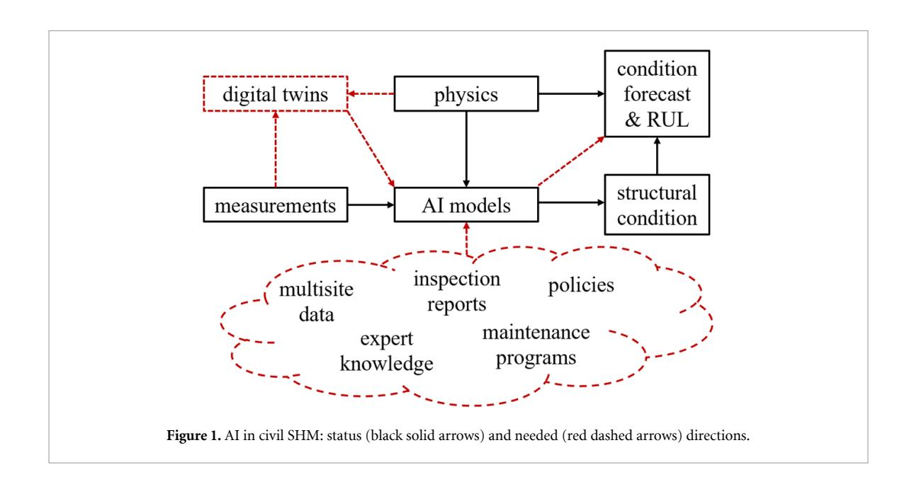

- AI-SHM methods have been developed and tested on components and/or models that do not scale well.
- There is a strong lack of labeled data that can be used to train an AI-based damage classifier.
  Transfer learning across similar structures is possible, but most structures are vastly structural
- Transfer learning across similar structures is possible, but most structures are vastly structurally different.
- The assessment of damage severity and its impact on the structure can only be done through supervised learning [5].
- On-chip computational costs can be important, and off-site signal processing is often preferred.
  There is a complex and non-unique man between data and actionable information
- There is a complex and non-unique map between data and actionable information.
  AI output must be interpretable and trusted by infrastructure owners and operators
- AI output must be interpretable and trusted by infrastructure owners and operators [6].
  Risks associated with the adoption of AI in SHM are yet to be systematically assessed and investigated.
- Risks associated with the adoption of AI in SHM are yet to be systematically assessed and effectively mitigated.

Among these challenges, the lack of readily available labeled data sets is likely the most important to surmount. A solution is to create and utilize high-fidelity DT models, which can be leveraged to create datasets and inverse models to assist the AI [6, 7]. To be successful, the creation and optimization of DTs should be automated, and their computation significantly accelerated. Surrogate models have been proposed to address this issue, but a persistent challenge lies in balancing model dimension reduction with the need for high-fidelity simulations. It should also be recognized that the automation of the DT creation process is a very complex task, because it will rely on the availability of available measurements, and its accuracy will therefore depend on observability.

To enhance the accuracy and practical relevance of AI models, it is essential to incorporate a human-in-the-loop (HIL) to support the process through effective data fusion. This involves integrating diverse sources such as inspection reports, expert judgment, field experience, and the set of feasible maintenance actions. The HIL approach plays a key role in translating actionable AI outputs into engineering insights by combining information from heterogeneous and large-scale data sources, including public policy frameworks. To ensure transparency and interpretability, AI outputs must be expressed in engineering-relevant terms rather than as opaque black-box predictions. This, in turn, calls for the integration of engineering models within AI algorithms, as exemplified by physics-informed neural networks (PINNs).

The deployment of AI-SHM systems must be accompanied by a thorough assessment of associated risks. Key concerns include the possibility of misdiagnosis due to black-box model behavior, challenges in verifying the authenticity and integrity of AI-generated outputs, and risks related to data privacy and cybersecurity. The mentioned adoption of interpretable AI models and integration of domain knowledge through hybrid modeling approaches, together with the implementation of secure data governance frameworks can help mitigating such risks. Additionally, validation protocols involving human oversight and continuous model auditing are recommended to ensure reliability, accountability, and alignment with engineering standards and regulatory requirements.

{7}------------------------------------------------

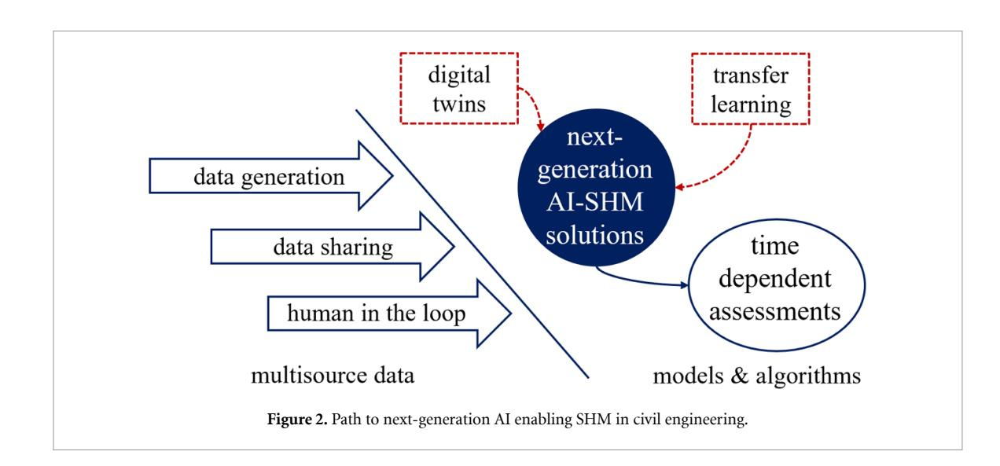

### **Advances in science and technology to meet challenges**

The successful deployment of AI empowering civil SHM will require the dedicated design of algorithms that consider the intertwined SHM components, including transducers, sensor placement, availability of physical knowledge, expert knowledge, and so on (figure 1). For example, future SHM measurement devices will include functionalized materials with complex electromechanical behaviors, autonomous drones, crowded sourced data, satellite imagery, etc [8]. The pairing of AI with advanced SHM systems will likely involve DL mechanisms capable of handling complex measurements, for example GNNs to streamline semantic segmentation of point clouds to assist in automating finite element modeling [9], CNNs to analyze banks of images [10], RNNs to process large time series [11], and transformers to prioritize measurements leading to for decision making [12].

Yet, because DL models typically require large, labeled training datasets, techniques will need to be developed to produce such datasets, likely involving high-fidelity DTs in the loop. Artificial data generation will thus be critical in empowering AI models, for example using GANs [13, 14] that learn to create synthetic data that the discriminator cannot distinguish from real data. GANs can be trained to extract damage-sensitive features, and these features can then be used to build a classifier that is domainindependent, allowing the model to generalize state detection across different structures. However, training GANs requires significant computational resources and time, which can be a barrier to their widespread adoption in SHM. As computing capabilities continue to advance, GANs hold great promises for enhancing the scalability and effectiveness of SHM systems across diverse structures.

The predictive capability of AI will also require substantial advances, for example by using probabilistic outputs. Such AI models can be particularly useful for time-dependent mechanisms, for example degradation phenomena such as corrosion and fatigue. These temporal predictions can be useful in a world where inspections are conducted mostly periodically over large time intervals, thus improving the accuracy and reliability of forecasts based on inspection data.

It is also anticipated that data sharing (figure 2) will be critical in enabling more accurate AI models. There exist some data sharing efforts in the field of SHM. Yet, these efforts are mostly arising from the research community, and it will be important to extend the initiative to the industry and various government agencies. Data security and privacy will likely become an issue and will require the implementation of mechanisms enabling data sharing trust, for example through federated learning.

# **Concluding remarks**

AI has the potential to transform SHM in civil engineering by enabling effective decision-making based on multisource, multivariate measurements collected across diverse structural assets. However, realizing this potential requires overcoming key challenges such as model interpretability, data labeling, privacy, and generalization across assets. This chapter presented a coherent roadmap, starting from the identification of research gaps to the development and validation of AI-based SHM methodologies, culminating in future implementation strategies. Central to this vision is the ability to translate raw measurements into actionable insights. Achieving this will involve integrating human expertise into the AI loop, developing technologies for labeled datasets, promoting data sharing across sites, embedding physics-based principles 

{8}------------------------------------------------

into algorithms, coupling AI with high-fidelity DTs, and applying transfer learning to broaden applicability at territorial scale. Only through these advancements can AI-driven SHM be fully integrated into infrastructure management practices.

# **Acknowledgments**

The authors would like to gratefully acknowledge the support of the Italian Ministry of University and Research (MUR) via the FIS2021 Advanced Grant 'SMS-SAFEST—Smart Masonry enabling SAFEty-assessing STructures after earthquakes' (FIS00001797), the Defense Established Program to Stimulate Competitive Research (DEPSCoR) award number FA9550-22-1-0303, the Air Force Office of Scientific Research (AFOSR) award number FA9550-23-1-0033, and the National Science Foundation award number CCF-2234919. Any opinions, findings, conclusions, or recommendations expressed in this material are those of the authors and do not necessarily reflect the views of the sponsors/organizations, the United States Air Force, or the US government.

{9}------------------------------------------------

# **3. Integrating artificial intelligence in structural health monitoring systems**

*John Wertz, Christine Knott, Matthew Cherry and Eric Lindgren*

Air Force Research Laboratory, Materials and Manufacturing Directorate, Composites, Ceramics, Metallics, and Materials Awareness Division, Materials State Awareness Branch, 2230 10th Street, B655, Ste 1, WPAFB, Dayton, Ohio 45433, United States of America

Email: john.wertz.1@us.af.milStatus

#### **Status**

The concept of integrating sensors with aircraft structure to detect damage has been explored since the late 1970's [15]. An initial surge of interest in the 1980's preceded a rapid decline within the decade resulting from practical complications encountered during application to USAF aircraft (figure 3), which included extensive false calls and potential missed calls in safety critical structures [16]. The exploration of SHM-based techniques was reinvigorated in the late 1990s. Since then, multiple international conferences and workshops have covered the work on these methods [17–19].

Algorithms to assist nondestructive evaluation (NDE) data analysis have been deployed in the USAF since the early 2000's: see [20] for an overview of engineering-level validation requirements and successful methods. To date, the most successful approaches combine at least two of the following: heuristics, model-based analysis, and data-driven (i.e. AI-based) algorithms. A successful demonstration of integrating all three is highlighted in [21], where results from over 3M physics simulation runs, 4K test samples, and several heuristics were combined to realize an algorithm that determines the length and depth of a fatigue crack from bolt-hole eddy current data with metrics of accuracy. Even with this massive amount of data, nuances such as outliers were not addressed robustly.

It is important to note that data-driven SHM methods for fixed wing aircraft differ from those successfully applied to rotary wing aircraft, which use control theory to detect changes in the resonant frequencies of rotating drive components. A data-driven SHM approach has been successful in guiding maintenance when frequencies shift from acceptable ranges.

# **Current and future challenges**

SHM technologies must overcome significant practical challenges before they can transition to safety critical applications. AI-based methods founded in statistics could enhance the quality of the information they provide but add unique challenges. This section explores a curated but non-exhaustive list of research challenges on **data, trust**, and the **holistic integration** of onboard sensor data.

The lack of **data** is a significant and persistent challenge for AI-based methods. Collection, formatting, and maintenance of data form the cornerstones of any successful data-driven application. These key elements are missing for most SHM methods. Data has been collected for a variety of SHM methods yet is often collected on simple geometries under constrained boundary conditions that lack the richness and variability of real structures, flaws, and operational environments—a critique that also applies to synthetic data. AI-based methods trained on this limited data will fail when confronted with unforeseen excursions that are routine in high performance, safety critical applications. The data challenge is addressed in other technical fields by crowdsourcing data in accessible, curated databases. Unfortunately, SHM data may be siloed due to sensitivity concerns, and there is no community standard for the formatting and maintenance of publicly available data.

**Trust** in the reliability of a prediction is key for AI-based methods in safety critical applications.

Predictions that are not trusted cannot be used as the sole decision authority and may be ignored. A simplistic, untenable requirement for a trusted algorithm would be for total accuracy. A more nuanced and realistic approach would require estimation of the uncertainty in the prediction, such that another agent (e.g. HIL) could weigh the risk of trusting the assessment relative to operational imperatives. A related requirement would be for traceability: if the algorithm makes the wrong prediction, how do we determine the root cause of failure? The answer to this question is crucial to improving algorithm performance and assessing liability in the event of failure.

**Holistic integration** represents a future challenge for AI-based methods applied to SHM technologies. Sensors for SHM will reside alongside existing sensors, and novel manufacturing technologies may enable development of multi-modal sensor networks. Data from these networks could be integrated to improve model predictions and reduce uncertainty. However, this information will face the same data

{10}------------------------------------------------

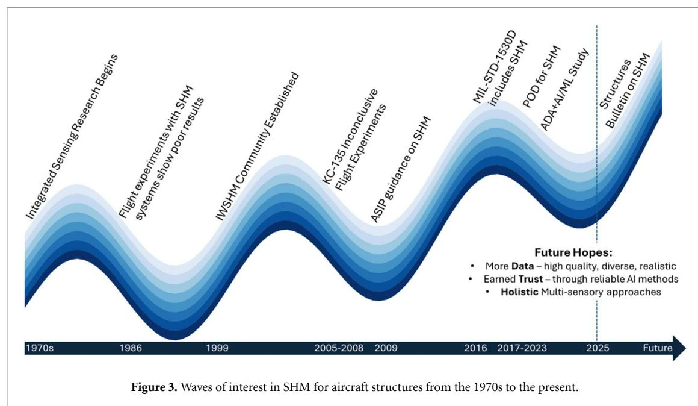

and trust challenges previously outlined, both individually and when fused. And the best practice for fusing diverse data remains an area of research.

# **Advances in science and technology to meet challenges**

Here we identify opportunity spaces which could resolve challenges related to **data, trust**, and **holistic integration. Data** can be addressed by several methods. Consider the type and availability of data. AIbased model predictions improve when trained on extensive data that includes both rare events and the complete expression of important variables. Early data collection will naturally include both important (i.e. those that decrease epistemic noise) and irrelevant (i.e. those that contribute to aleatory noise) variables; without studying the data in advance, variable effects remain theoretical. Different sources and quality levels of data are desirable, as some effects are best observed in a laboratory, while others are only found within the operational environment. Data quality may also differ with sensor type, where variables such as sensor weight, size, and accessibility may dictate feasibility. Fusing multiple sources or observations from a lower quality sensor could approximate higher-quality data if more observations are recorded. For detection of larger or lower-criticality defects, lower quality results may be sufficient.

Understanding the quality of data is critical to its use, and guidelines for interfaces and standards for assessing data quality must be developed. Here, data quality metrics include, but are not limited to, documentation of accepted calibration processes; independent estimates of noise and other confounding factors that may influence the observed response within the datasets; and details on the inspection configuration (e.g. the meta-data) used to generate the data. Ingestion and automatic processing of data is necessary to meet these rigorous demands. To deploy, such AI-SHM techniques must be seamless for vehicle maintainers.

New methods of evaluating data should also be examined. For example, statistical process control (SPC) could help predict when SHM system responses exceed expected variations and aid in determining which variables are useful in predicting relevant failure modes [22]. AI systems which focus on predicting average behavior are insufficient, but AI-based systems which detect when an observation differs from the expected response will be crucial to SHM applications.

Autonomous experimentation is an emerging field which could reduce uncertainty in training data. Already identified as a potential game-changing technology in other material science communities, autonomous experimentation enables dynamic probing of incomplete areas of the training data space and the inclusion of uncertainty sources **[**23]. This approach, combined with novel uncertainty quantification (UQ) methods for neural networks (e.g. Bayesian Neural Networks), could provide robust methods of damage detection using AI-based algorithms.

Regarding **trust**, the end-user experience is a crucial consideration. Useful graphics and statistics (including the confidence in the prediction) must be created to communicate the evolving performance of the system. Eventually, a subset of key indicators could be selected for regular use and displayed in a fast, legible visualization. These results could be used to predict defect severity and how quickly that

{11}------------------------------------------------

defect may become critical. The complete results should remain accessible in case of outliers. Finally, human factors studies could ascertain the optimal relationship between the human and the system. An AI-generated black-box answer which fails to quantify uncertainty carries unacceptable risk and will not earn the trust of the user.

The reliability of SHM systems and their algorithms defines how much they should be trusted. Statistical methods used to assess the reliability of a NDE system prior to application—probability of detection (POD)—could be extended to SHM. SHM systems observe defects as they grow, producing time-correlated observations that violate the assumptions of independence in current POD methods. However, newer methods have been shown to solve this challenge [24].

**Holistic integration** involves fusing information from different SHM methods to enhance the predictive capability of the data-driven model. Data fusion has been previously explored for NDE, albeit primarily for defect detection in the context of decision-level fusion. Recent work has successfully demonstrated data-level fusion for micro-scale materials characterization [25]. These techniques, combined with methods like meta-analysis and nonparametric fusion learning, may enable synthesis of data from diverse sources [26]. Data fusion holds four potential advantages for application of AI-based methods to SHM. First, multiple sources of information may alleviate the lack of extensive training data from any one source. Second, data from multiple sources may contain more complete information on key variables than a single source alone. Third, indications caused by excursions from the norm may be easier to identify in fused data. And fourth, predictions made from fused data could be compared against those from mono-modal models to improve explainability.

In situations where the collection of data is expensive (time, effort, or funds), SHM systems could guide end-users to which system to focus on first. For example, if a critical part is failing across a fleet of assets, SHM systems could aid decision makers in which assets to fix first. Data from SHM systems along with methods like adaptive Bayesian experimentation could also aid in deciding which NDE method would provide the most useful information when independently assessing a system.

### **Concluding remarks**

There are many remaining challenges in applying SHM technologies to safety critical systems that lie beyond the scope of this roadmap publication, which is also true of AI-based methods applied to other NDE techniques. The intersection of SHM and AI not only inherits those foundational challenges but also creates a host of new ones that must be addressed. The challenges identified by the authors—**data, trust**, and **holistic integration**—should thus be considered critical but necessarily incomplete. A comprehensive list would require considerably more ink and constant revision.

Emerging scientific advances have the potential to overcome many challenges, aided by the rapid improvements in AI methods. The authors believe that additional research and development in the following areas would benefit the SHM field: improving data collection and management, improving validated methods for simulating data to augment experiments, using adaptive experimentation, using statistical concepts to estimate the reliability and uncertainty within a SHM system and its associated algorithms, using statistical quality control to diagnose a failing structure or sensor when addressing highly variable data, and using data fusion approaches to combine multi-sensory data. These concepts will play a critical role in the path towards safe and reliable SHM systems being approved for use on critical structures.

{12}------------------------------------------------

# **4. Motivation for integration of AI with SHM**

*Fu-Kuo Chang*1 *and Amrita Kumar*2

1Department of Aeronautics and Astronautics, Stanford University, Stanford, CA, United States of America

2Acellent Technologies Inc., Sunnyvale, CA, United States of America

### **Status**

SHM is a multidisciplinary technology that generates vast amounts of structured and continuous data through sensor networks deployed on critical infrastructure, aerospace, and heavy machinery components. By leveraging advanced physics-based diagnostic techniques, SHM monitors structural conditions in real-time by collecting data on material/structural changes, strain, vibration, temperature, and other critical parameters. Over the past two decades, significant advancements have been made in maturation and usage of SHM systems by improving the reliability of sensor data, enhancing diagnostic capabilities, and developing robust hardware for field applications [27–36]. As a result, fielded data from SHM systems installed on aircraft, civil infrastructure, and heavy machinery are now being actively used for structural integrity assessments and damage detection.

For instance, Norwegian Sea King Search and Rescue (SAR) helicopters have implemented an acousto-ultrasound-based SHM system developed by Acellent Technologies [37] to detect fatigue cracks in rotorcraft housing. This system inspects helicopters for cracks in under 10 min without requiring major design modifications. As a result, the fleet maintained an impressive availability rate of 99.6% on a 15 minute notice, significantly reducing downtime and maximizing operational readiness. Similarly, SHM sensors [38] adopted by Valmet, a leading papermaking machine company, have been instrumental in monitoring nip loads on rolling machines, leading to a 50% reduction in sheet breaks and a 90% increase in operational efficiency. Furthermore, the integration of piezoelectric sensors, strain gauges, and temperature sensors within the wing structure of an unmanned aerial vehicle (UAV) has demonstrated real-time flight state awareness and SHM capabilities. This 'fly-by-feel' system mimics the biological nervous system of birds, offering transformative potential in aerospace applications [39].

# **Current and future challenges**

Despite these advancements, one of the most significant challenges in SHM system usage is managing environmental variability. Factors such as temperature fluctuations, dynamic loads, and unknown external influences introduce noise and uncertainty into sensor data, complicating accurate diagnostics. Ensuring high precision and reliability in SHM predictions is especially crucial for safety-critical applications in aerospace, civil infrastructure, and heavy machinery systems. This is where AI and ML have the potential to be transformative. AI/ML excels at analyzing vast amounts of sensor data, identifying hidden patterns, and distinguishing between structural anomalies and environmental effects. By leveraging data-driven models, AI/ML enhances the robustness of SHM by filtering out irrelevant variations, compensating for uncertainties, and improving real-time predictive capabilities.

Future SHM decision making software tools will need to utilize historical 'Big Data' from multiple sensor networks along with simulation data and use a suite of novel, automated data analysis tools with the integration of data-mining and physics-based models to quickly assess the state of structures, detect and address anomalies, make life-cycle predictions, and provide complete traceability for the monitored structure.

An example is future intelligent UAV's that will be able to 'feel', 'think', and 'react' in real time by incorporating high-resolution state-sensing, awareness, and self-diagnostic capabilities. They will be able to sense and observe phenomena at unprecedented length and time scales allowing for superior performance in complex dynamic environments, safer operation, reduced maintenance costs, and complete lifecycle management. As shown in figure 4, sensor network technologies are integrated with UAV structures to provide the ability for state sensing as well as operational and flight changes to enable Fly-by-Feel (FBF) sensing capability mimicking the biological bird flight. The FBF system consists of multifunctional sensor networks, AI-based state sensing software, and real-time data processing hardware for autonomous vehicles. The sensor network includes a network of sensors (PZT, Strain, RTD) integrated in a flexible thin film. The substrate is polyimide enabling it to withstand large strains and deformations. This enables the creation of multifunctional sensor networks that can cover large areas and have minimal parasitic effects on a host material. Once integrated with the structure, the sensors provide data for flight-state estimation and autonomous control.

{13}------------------------------------------------

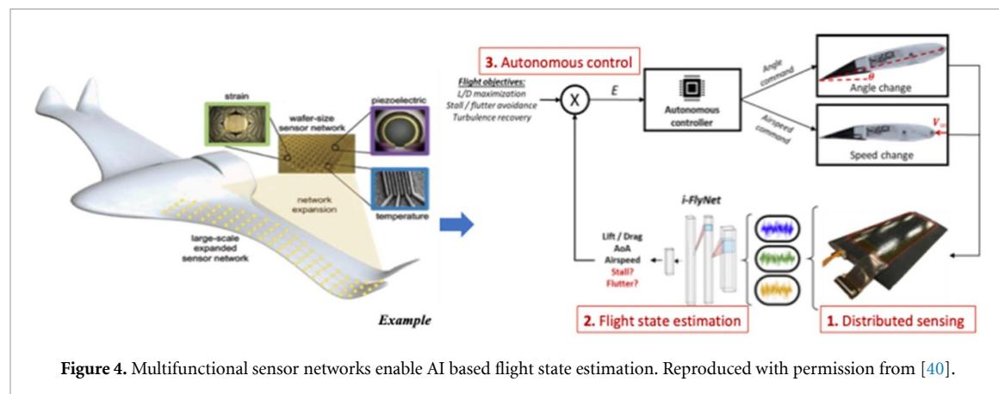

# **Advances in science and technology to meet challenges**

The integration of AI/ML with SHM creates a powerful synergy where AI improves SHM's diagnostic accuracy, while SHM provides AI with a continuous stream of high-quality data for learning and adaptation. The fusion of AI and SHM enables intelligent, self-learning and monitoring frameworks that evolve over time, leading to more reliable, automated, and efficient structural health assessments. AI-powered SHM facilitates timely maintenance decisions, extends the lifespan of structures, and enhances overall safety and operational efficiency. By bridging physics-based diagnostics with AI-driven data analytics, SHM can be transformed into a proactive and intelligent system capable of real-time health assessment and predictive maintenance.

One of the primary challenges in applying AI/ML to SHM is the extensive data requirement for training ML algorithms, which poses difficulties due to:

- (1) The significant time and effort required to collect sensor measurements (training datasets) from real-world structures.
- (2) The challenge of capturing a comprehensive range of environmental conditions and structural states under actual operating scenarios.

Since 2017, Airbus has developed its Skywise platform [41], which employs AI/ML techniques to interpret data from aircraft sensors, airline operations, maintenance records, and weather reports to provide a holistic view of aircraft performance. With over 10 000 aircraft connected, Skywise has gained significant traction. Similarly, Boeing has introduced predictive maintenance tools through its Boeing AnalytX platform [42], which applies advanced analytics and ML algorithms to process vast datasets from aircraft sensors, maintenance records, and historical performance data. These platforms enhance situational awareness and operational efficiency for airlines.

However, neither the Skywise nor AnalytX platforms are currently designed to integrate SHM sensor data or incorporate physics-based damage diagnostic techniques. Consequently, they lack the capability for quantitative damage and structural health assessments. To address these challenges, future SHM decision-making software must leverage historical 'Big Data' from multiple sensor networks alongside simulated data. Advanced fusion techniques combining AI/ML algorithms with physics-based diagnostics will be essential for enabling rapid structural assessment, anomaly detection, life-cycle predictions, and complete traceability of monitored structures.

# **Concluding remarks**

Future advancements will incorporate both real-world and synthetically generated (numerical or computational) data as training datasets for ML algorithms, enabling real-time health diagnostics of structural systems. For example, AI-enhanced SHM could detect and assess the severity of impacts from events such as bird strikes on aircraft, offering immediate recommendations for mitigation strategies. These innovations will be applicable across diverse domains, including commercial aviation, emerging air mobility vehicles, space exploration, and other critical structural applications. Ultimately, the integration of AI/ML with SHM will drive the evolution of next-generation intelligent monitoring systems, ensuring structural integrity, improving operational efficiency, and enhancing safety across multiple industries.

{14}------------------------------------------------

### **5. Transfer learning and multi-task learning as technologies applicable to populations/fleets**

*Jack Poole and Keith Worden*

University of Sheffield, Sheffield, United Kingdom

E-mail: j.a.poole@sheffield.ac.uk and k.worden@sheffield.ac.uk

#### **Status**

A critical challenge for the implementation of SHM systems in practice is the cost/feasibility of obtaining representative datasets to train data-based models. The data issue is particularly acute for SHM systems that provide contextual information—such as damage location, type and extent—as typically these tasks require supervised machine-learning algorithms, necessitating labeled data relating to each structural condition of interest [2]. One potential solution to address data limitations is to leverage data from related systems, which is the main objective of population-based SHM (PBSHM) [43, 44] and fleet-based monitoring [45].

When considering data across different systems, the generative processes of the data will inevitably differ. These discrepancies will invalidate a core assumption made by conventional machine-learning methods—that training and testing data were generated by the same underlying distribution [46]. Thus, to effectively use data across groups of different systems (often referred to as populations or fleets), specialized technologies that account for distribution shift are required [46].

Two sub-fields of ML that aim to learn under distribution shift are transfer learning (TL) [46] and MTL [47]. Both TL and MTL share similarities in their objectives, assuming there are differences between the data distributions of multiple datasets, but there is related information that can be used to improve predictive performance in sparse data scenarios. The main difference between TL and MTL is that TL assumes there exists one or more (source) domain(s) with more abundant information that can be used to improve the predictive performance in a (target) domain with sparse data, whereas MTL typically does not prioritize improvements in a single domain, but rather aims to improve predictive performance across all domains/tasks [47]. The flow of information for TL and MTL is illustrated in figures 5(a) and (b), respectively. The interested reader may refer to [46, 47] for a more in-depth overviews of TL and MTL, respectively.

The opportunity to reduce data requirements for training models has motivated the recent application of several forms of TL and MTL to various SHM scenarios. Applications of TL have mostly focused on unsupervised domain adaptation (DA) and fine-tuning. The application of un-supervised DA has largely been motivated by its ability to allow predictive models learnt using only labeled source data to generalize to the target domain in the absence of labeled target data [46]. Unsupervised DA has been demonstrated to transfer damage-state labels in several applications, including between numerical and experimental structures [44], heterogeneous aircraft wings [48], and between pre- and post-repair states in aircraft wings [49], as well as for damage detection [50, 51]. There have also been a number of applications of deep-DA architectures proposed to perform fault diagnosis in fleets of machines under changing loading conditions and rotation speeds [45, 52]. On the other hand, fine-tuning has been applied to use neural networks trained with source data and a relatively small quantity of labeled target data [53]; it has been applied for crack/surface defect detection using images [54, 55] and to unprocessed frequency response data [56, 57].

Meanwhile, research focused on MTL includes applications of Bayesian hierarchical modeling, metalearning, and shared regularization schemes. Hierarchical Bayesian models have been applied in several applications, such as to improve extrapolation to unseen temperature ranges in helicopter blades [58], power output forecasting in wind farms and truck-fleet survival analysis [59] and for damage detection and data imputation [60]. Meta-learning has been demonstrated to make fine-tuning efficient [61] and learn covariance functions for Gaussian processes to predict crack progression [62]. In addition, shared regularization schemes have been shown to alleviate issues related to high feature dimensions [63].

# **Current and future challenges**

While TL and MTL technologies present the opportunity to reduce costs and facilitate more informative SHM systems, their implementation also presents several unique challenges in comparison to conventional ML. These challenges can be broadly summarized as developing methods to assess when transfer is possible, what features and patterns can be shared, and identifying/developing algorithms that can reliably share information in SHM scenarios. Several key research challenges are summarized as follows:

{15}------------------------------------------------

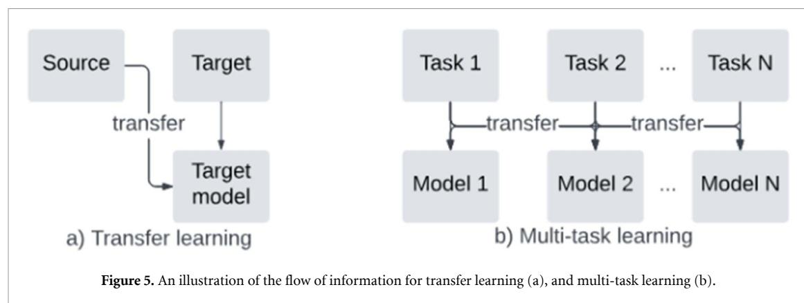

**Figure 5.** An illustration of the flow of information for transfer learning (a), and multi-task learning (b).

- There is a lack of established similarity measures that incorporate data, physical knowledge and domain expertise to determine when TL and MTL technologies are applicable.
- Identifying which features and tasks are transferable can be challenging in complex engineering systems.
- Determining the most effective transfer approach given data availability and structural similarity is not well understood.
- Many unsupervised TL methods suffer performance degradation in scenarios where data are sparse, imbalanced and are not representative of all structural conditions [46].
- In some cases suitable datasets may only be available from systems with significant differences. In some of these cases, it may also not be obvious how labels correspond between systems, i.e. when systems include different components or have different geometries.
- Validating models learnt using TL/MTL is challenging as representative testing data are often insufficient or unavailable.
- It is often challenging to interpret the results of TL/MTL methods, particularly for deep neural network-based models.
- TL/MTL methods typically rely on either labeled or unlabeled data, meaning it may be challenging to update models in an online setting as both new unlabeled and labeled data become available.

Solutions to several of these challenges are currently the focus of ongoing research. For example, there exists a series of studies developing the concept of an irreducible element (IE) models that allow for knowledge about a structure to be encoded into attributed graphs, on which principled graph-based similarity measures can be applied [43]. In addition, a risk-based framework has been proposed to use similarity measures to suggest when transfer should be conducted [64]. Furthermore, the issue of selecting transferable features has been demonstrated using MTL [63] and the modal assurance criterion for selecting frequency-based features [65]. Recently, a promising approach for transferring between less similar systems has been shown using interpolating structures [66]. Nevertheless, these studies either have outstanding limitations that must be addressed and/or require further validation using experimental data and/or in-service data.

# **Advances in science and technology to meet challenges**

The practical implementation of TL/MTL for SHM applications will require the development similarity measures to inform operates when to transfer, and potentially what features to use, as well as methods suited for sparse data scenarios with class imbalance, particularly for data relating to rare structural conditions such as damage. The integration of these technologies in a modeling pipeline is illustrated in figure 6, with red dashed arrows indicating a need for further research.

Given that data in many SHM scenarios are sparse and often unlabeled, measuring similarity using data alone will likely be challenging and may not be indicative of all types of distribution shifts [46]. To this end, research is needed to identify the structural information that influences transferability and determine how it can be encoded to enable the computation of similarity measures between domains. It will likely be beneficial to incorporate knowledge from various sources, including from measurements, physics, domain expertise and previous experience of applying TL/MTL in SHM. A related issue involves discerning how these similarity measure could be interpreted in relation to the predictive performance expected from applying TL/MTL. Furthermore, a key assumption of TL/MTL is that sets of features

{16}------------------------------------------------

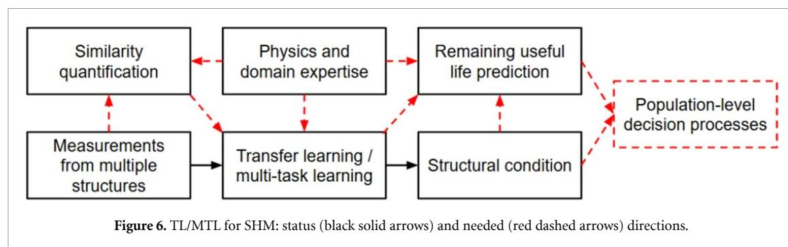

are related [46]; therefore, similarity measures should be investigated for identifying these related sets of features.

While TL/MTL can facilitate predictive models for SHM with fewer data, it will likely still be the case that data are a limiting factor for many SHM tasks. Thus, methods that can learn efficiently when data in some domains of interest are sparse and exhibits class imbalance—and perhaps not representative of all structural conditions—should be developed. A promising direction to further reduce data requirements would be to incorporate physics (and other prior knowledge) into TL/MTL methods to bias or constrain models.

Another issue relates to encoding information as labels that can be used across dissimilar (heterogeneous) systems. For example, two structures may have different geometries, meaning direct comparison of damage location is not possible; however, there may be equivalences that can be leveraged to allow for label transfer, such as non-dimensionalized damage locations. In these cases equivalent labels should be found, either using physical knowledge or selecting labels such that they have the same effect on upstream decision processes in each system.

Fundamentally, SHM systems are decision support tools. Therefore, extending their application the populations/fleets not only presents opportunities to implement more informative and cost effective systems, but also introduces challenges relating to how limited resources can be effectively allocated for the maintenance of multiple assets and how data should be acquired to optimally improve predictive capabilities across all systems. Methods for making optimal decisions across a population/fleet should be developed, perhaps using a risk-based approach incorporating probabilistic predictions and the cost of performing specific actions and their associated expected consequences.

### **Concluding remarks**

By considering data across populations/fleets of engineering systems, cheaper and more informative SHM systems may become feasible. Since data from different systems will lead to differences in the training and testing distributions, specialized machine-learning methods are required, such as TL and MTL. However, for these technologies to be reliably deployed, further research is needed to develop robust similarity measures, investigate what features and tasks can be transferred, and develop TL/MTL methods that are robust in sparse data scenarios where class imbalance is prevalent.

# **Acknowledgments**

The authors would like to acknowledge the support of the UK Engineering and Physical Sciences Research Council via Grants EP/R006768/1, EP/R003645/1, EP/R004900/1 and EP/W005816/1. For the purpose of open access, the authors have applied for a Creative Commons Attribution (CC-BY-ND) licence to any Author Accepted Manuscript version arising.

{17}------------------------------------------------

# **6. Multimodal RAG-enhanced LLMs and digital twins for advancing structural health monitoring**

*Austin Downey*1 *, Jie Wei*2 *and Erik Blasch*3

1University of South Carolina, Columbia, SC, United States of America

2Department of Computer Science, The City College of New York, New York, NY, United States of America

3Air Force Research Laboratory, Materials and Manufacturing Directorate, Composites, Ceramics, Metallics, and Materials Awareness Division, Materials State Awareness Branch, 2230 10th Street, B655, Ste 1, WPAFB, Dayton, Ohio 45433, United States of America

Email: austindowney@sc.edu

#### **Status**

Recent advances in large language models (LLMs) have led to transformative changes in how domain experts interact with and leverage AI for various tasks. SHM for civil infrastructure—like nearly all domains—is poised to benefit from LLM-based approaches. One particular AI method that may have a quantifiable impact on SHM for civil infrastructure is the rapidly growing technology of retrievalaugmented generation (RAG) which is designed to further enhance an LLM's response and query capabilities [67].

RAG allows an LLM to retrieve more relevant, recent, and authoritative documents, images, and data from extensive and proprietary knowledge bases and then integrate this information into its responses to render them more precise and up-to-date [68]. In the context of SHM, these sources may include specific (a) operational data: design plans, damage and maintenance logs, reports of successful repairs on similar structures, operational usage data, and relevant design codes or standards, (b) modeling and simulation: finite element analysis (FEA) results, weather and climate models, and (c) sensing data such as LiDAR or drone imagery, all of which could be too specific, new, or unique for any LLM to be trained on. As illustrated in figure 7, a user prompt is first analyzed by an index (or multiple indexes), which identifies and retrieves the most relevant documents from a local note store (or other external proprietary databases). The LLM then incorporates these retrieved documents into its response by forming an extended context (the user prompt plus the retrieved documents). As a result, the LLM's output is 'grounded' in factual data—reducing *hallucinations* and ensuring alignment with validated information such as design standards, sensor data, and FEA outputs. One of RAG's key strengths is its flexibility: it can be paired with any LLM (e.g. Google's Gemini [69], Meta's LLaMA [70], OpenAI's ChatGPT [71]) to provide domain-specific insights, making RAG ideal for integrating DTs into civil infrastructure applications. Although denoted by 'Language' models originally targeted for natural language processing (NLP) and understanding (NLU), knowledge also comes from signal and image processing, CV [72], ML, DL [73], and data fusion [74]. Current LLMs handle multimodal data (images, videos, voices), aiding users in understanding and reasoning about complex semantics. The ChatGPT o3 reasoning model [75], released in December 2024, can solve advanced mathematics and coding tasks beyond many experts' reach, offering powerful assistance to SHM researchers and practitioners. A multimodal RAG further extends these capabilities for practical use.

To illustrate the practical benefits of RAG, consider a bridge-deck monitoring scenario where vibration and strain are recorded under routine traffic. In conventional workflows, engineers manually reconcile anomalies against finite-element models, design drawings, and inspection reports, which can take days. In contrast, a retrieval-augmented workflow automatically surfaces the most relevant analyses, prior notes, and comparable case histories whenever an anomaly is flagged. The system is configured to draw only from trusted databases maintained by the asset owner and public authorities, and each response provides a pinpoint citation (document title, section, page or figure, and record link) so engineers can immediately open and verify the exact source.

Beyond the multimodal LLM and RAG layers, civil infrastructure deployments often require an endto-end ecosystem [76]—commonly conceptualized as a *DT*. As illustrated in figure 8, the physical asset (e.g. a bridge or embankment) continuously streams data from permanent sensors (strain gauges, temperature sensors, tiltmeters) and short-term devices (portable accelerometers, LiDAR scans) to update a virtual representation in real time. An *instrumentation reconfiguration loop* uses AI-driven analytics to adapt sensor placement in response to evolving structural conditions; enabling the 'active learning' that identifies the most informative [77], cost-effective sensor locations. A *query-response loop* [78], shown

{18}------------------------------------------------

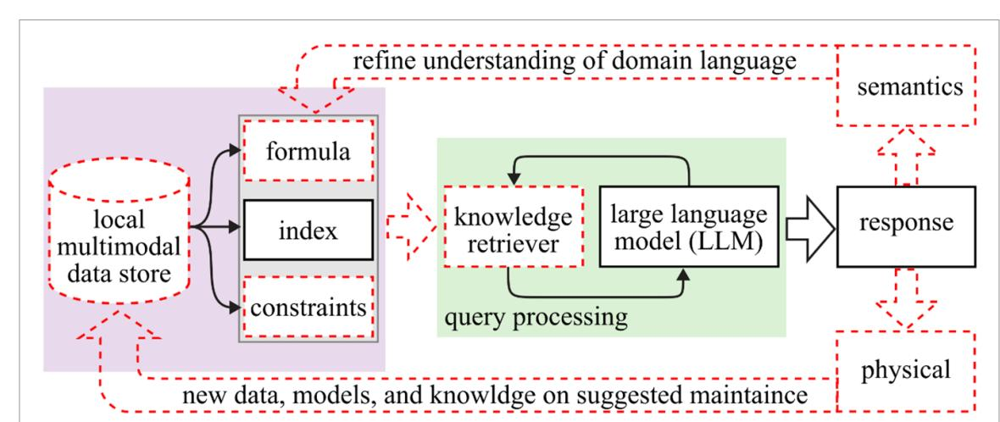

**Figure 7.** RAG-based architecture for SHM decision support. A multimodal user prompt (questions about sensor layout, maintenance strategies, etc) is passed to an index, which retrieves relevant documents from the knowledge base. The original query and retrieved documents form an extended context that is then processed by a large language model (LLM) to produce a more accurate and grounded response. Domain experts provide feedback to the responses which are then integrated to the local knowledge base. Notations: black solid boundaries: current/existing work; red dashed boundaries: needed directions.

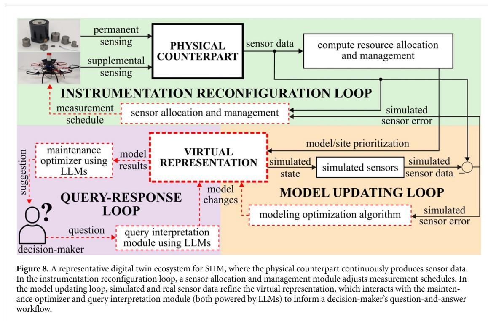

in the bottom-left of figure 8, leverages LLM-based reasoning to serve as an 'AI co-worker,' providing insights on design considerations, policy options, and predictive maintenance. Drawing on domain knowledge, simulation outputs, and live data, the system can propose new sensing layouts, run 'whatif' analyses (e.g. via RL), and rapidly assess potential impacts on structural integrity. The *model updating loop* refines the virtual representation by simulating deterioration, sensor errors, and shifting load demands; adjusting model parameters as needed. In the multimodal LLM-enabled DT ecosystem, AI collaborates with human engineers to explore and justify decisions, supported by a feedback mechanism (figure 7) within the RAG-LLM architecture.

{19}------------------------------------------------

- Need for robust AI integration in complex SHM environments. Integrating LLMs into large-scale SHM must address sparse, incomplete, or noisy data, as real-world structures operate under variable conditions that produce significant inconsistencies—demanding careful vector search strategies. Responses require transparency of data sources and explainability of decision results.
- Closing the loop with automated sensor placement. Bridging instrumentation and analytics for active management requires robust sensor placement strategies that account for cost, redundancy, and coverage. Error criteria and metric measures [79], supported by feedback loops, enable scalable, reconfigurable sensor networks.
- Ensuring security, reliability, and interpretability. Mission-critical applications demand transparent AI recommendations and robust cybersecurity to guard against compromised indexes or malicious data [80]. Multimodal RAG–LLM solutions strengthen interpretability by clarifying the rationale behind sensor placement.
- Computational and cross-platform constraints. Resource-limited environments, strict latency requirements, and cloud integration complicate SHM deployments. Hybrid approaches that combine local RAG-mini-LLMs with cloud systems remain an active research direction.

### **Advances in science and technology to meet challenges**

Several emerging technologies can be harnessed by RAG-LLMs to expand SHM capabilities, paving the way for more adaptive, efficient, and effective monitoring. Though many remain in early or loosely defined stages, they hold promise for integration if proper frameworks are established.

- Adaptive RAG pipelines. Recent RAG developments combine advanced retrieval (e.g. multimodal embeddings, knowledge graphs) with specialized local domain knowledge. By including structural engineering standards and validated models, RAG-LLMs can propose sensor placements informed by both historical and real-time data.
- • Integration of DTs with physics-informed models. Physics-informed ML (PIML) [81] reduces uncertainty by embedding real-world constraints in data-driven models. Coupled with RAG, DTs can retrieve logs, maintenance records, and design codes to guide constraint formulations [82].
- Feedback-driven sensor reconfiguration. Advances in wireless networks, IoT, and edge computing allow field devices to swap roles, adjust sampling, or change locations [83]. LLM-based ‘maintenance optimizers’ (figure 8) can recommend reconfigurations in real time by interpreting sensor data, predicted states, and reliability constraints.
- Policy-in-the-loop AI. Synergizing SHM and policymaking ensures that domain insights—like load testing regulations and equitable community outcomes—are honored by being encoded in RAG indexes [84]. RAG-LLMs help policymakers and engineers pose better questions, incorporate community needs, and reach decisions aligned with social and infrastructure goals.

# **Concluding remarks**

Integrating LLM-based RAG with DT ecosystems opens new possibilities for more effective, adaptive SHM of engineering infrastructures. By leveraging advanced AI methods, sensor networks can be dynamically reconfigured to capture critical data while remaining efficient and cost-effective. Near-term challenges include ensuring robust performance in diverse conditions. As technology matures, deeper integration of physics-based models, domain knowledge, and advanced data analytics with multimodal RAG-LLM frameworks will drive SHM systems that autonomously plan and adapt.

# **Acknowledgments**

This work is supported by the National Science Foundation Grant Nos. 2152896, 2237696 and 2324052. This work was also partially supported by the Air Force Research Laboratory Faculty Fellowship program which is gratefully acknowledged. Any opinions, findings, conclusions, or recommendations expressed in this material are those of the authors and do not necessarily reflect the views of the National Science Foundation, the United States Air Force, or the US government.

{20}------------------------------------------------

# **7. Physical reservoir computing for structural health monitoring**

*Patrick F Musgrave*1 *and Adrian S Wong*2

1University of Florida, Gainesville, FL, United States of America

2Air Force Research Lab, Materials and Manufacturing Directorate, Composites, Ceramics, Metallics, and Materials Awareness Division, Materials State Awareness Branch, 2230 10th Street, B655, Ste 1, WPAFB, Ohio 45433, United States of America

E-mail: pmusgrave@ufl.edu and adrian.wong.ctr@us.af.mil

#### **Status**

PRC is a computing paradigm in which the dynamics of a physical system perform information processing [85]. Using PRC, computation is offloaded from a digital computer to the nonlinear dynamics of a physical system to create a physical RNN. Unlike PIML approaches (such as Physics Informed Neural Networks) [86] which are digital in nature and incorporate knowledge of the physics into a digital neural network framework, a PRC has no digital neural network and instead uses the dynamics of a real-world physical object for computation.

PRCs are a subset of reservoir computing (RCs), where a PRC is a physical embodiment of a digital RC. Fundamentally, RCs are RNNs with fixed internal weights, where training only occurs on the readout layer. The fixed-weight dynamical network (i.e. the *reservoir*) is nonlinear and performs the computations, and the readout layer is linearly trained using least squares regression. The RC architecture is much smaller and faster than traditional RNNs [87], and different readout weights can correspond to different computational tasks. To create a PRC, the reservoir is replaced by the nonlinear dynamics of a physical system, 'hard coding' the RC into mechanical, optical, quantum, biological, chemical, or electrical dynamics.

PRC has significant potential for SHM to reduce the onboard computational burden and yield faster response times. SHM relevant computations such as damage detection and state estimation can be offloaded to the physical dynamics of the PRC. On an aircraft, the structural dynamics of the wing could be harnessed as a PRC to track stress concentrations and compute structural lifetime. In chemical and electric propulsion, the dynamics of the thruster can be tracked using a neuromorphic chip [88], which yields the plume distribution for identifying material erosion and crack formation.

Mechanical PRCs are particularly promising for SHM since the vibrations and nonlinear dynamics of the structure itself are used for information processing as shown in figure 9. In conventional SHM, the structure is monitored using sensors and the relevant SHM quantities are computed using computationally intensive digital algorithms (physics-based or AI methods). For SHM using PRC, the computationally intensive processing is done by the physical reservoir, where the reservoir dynamics come primarily from the structure and additional physical dynamics could be incorporated to achieve the appropriate information processing capacity. The only digital computation would be a simple linear regression, thus enabling the computation of the relevant SHM quantity with significantly less digital processing.

By using the structure itself for computation, mechanical PRCs can reduce the reliance on a centralized digital processor, avoid additional wiring, increase communication speed, and increase power efficiency—all of which contribute to lower computational times. Further, the embodied computation paradigm of PRC has direct synergy with DTs, where the structure is used as a PRC to compute and update a digital replica of the structure [89]. As a result, PRC is particularly promising for SHM in aerospace, automotive, or maritime systems, which have strict limitations on weight, power, and onboard computational capacity.

However, SHM using mechanical PRCs is still in its infancy. Previous work on mechanical PRCs has primarily focused on state estimation in robotics applications. This includes computing thrust of a soft robotic fish using fluid-structural dynamics [90], classifying wind direction on a bio-inspired wing using aeroelastic dynamics [91], estimating the payload on origami structures using mechanical dynamics [92], and autonomously adjusting a phonic bandgap using metamaterial dynamics [93]. These PRC state estimation tasks could be extended to SHM tasks such as computing aerodynamic loads and stress concentrations within a structure. A limited number of studies have used mechanical PRCs for damage detection. Using numerical models of mechanical PRCs, local stiffness changes can be detected to quantify the structure's health [94] and additional dynamics can be added to the structure to improve PRC processing performance [95].

{21}------------------------------------------------

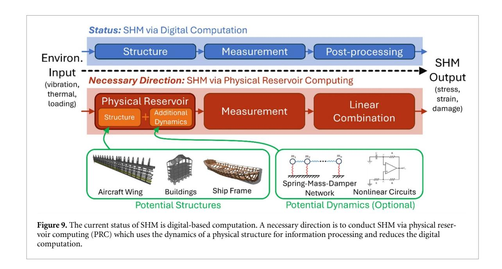

#### **Current and future challenges**

There are a number of challenges to address before PRC can be practically implemented to monitor and detect damage on structures. The primary challenges include:

- designing physical reservoirs that incorporate the structure and provide sufficient computation
  establishing computational tasks, training procedures, and PRC best practices specific to SHM
- establishing computational tasks, training procedures, and PRC best practices specific to SHM
  minimizing the size, weight, and cost of the PRC sensing framework
- minimizing the size, weight, and cost of the PRC sensing framework.

There is a need to understand the relationship between a physical reservoir design and its information processing capacity for given SHM tasks. A mechanical PRC requires a high-dimensional reservoir with sufficient nonlinear dynamics to effectively process information [85]. The reservoir dynamics map the environmental input to a higher-dimensional space and the linear regression computes the target SHM output signal. By using the structure itself as a mechanical PRC, the nonlinear stress and strain in the structure become the reservoir dynamics, and high dimensionality is achieved by using the appropriate sensor density (number and location) to capture the time-resolved dynamics. Thus, the challenge is to understand whether a structure has the necessary properties to perform the desired SHM task. This can be further broken down into the following questions.

- Does an as-built structure have the appropriate dynamics to be used as a PRC?
  Could the dynamics of a structure be enhanced, as shown in figure 9, to improve the dynamics of a structure?
- Could the dynamics of a structure be enhanced, as shown in figure 9, to improve the reservoirs information processing capacity?
- Could a multi-functional structure be designed from the onset as a PRC with the necessary dynamics and distributed sensor network?

It is necessary to understand the relationship between PRC implementation and the exact SHM application. Different structures (aircraft, ships, etc) will yield physical reservoirs with different computational capacities, affecting which SHM tasks the PRC can perform. A change in structural health will alter the PRC dynamics (stress concentrations, crack growth, delamination, etc), and this change in dynamics must be captured by training the PRC readouts to perform the SHM task. Further, the training procedure, required reservoir dynamics, and sensor density will vary with the SHM task.

Similar to conventional SHM methods, with PRC there is a need to maximize the measured information while minimizing the size, weight, and cost of sensors. To achieve optimal PRC performance, each sensor readout should be independent so that the combination of sensors captures the full (or relevant) dynamic content of the mechanical structure [96]. However, existing PRCs use a high sensor density that is simply not practical for SHM [85]. There is a need to understand the relationship between sensor density (number and placement) and PRC information processing performance while also accounting for variations in environmental inputs.

{22}------------------------------------------------

Finally, PRCs suffer from the same challenges that other ML and data-driven algorithms have faced, most notably with interpretability and trust, which it inherits from standard RC. Though PRCs are relatively efficient with training examples, it still requires a fair amount of data to empirically quantify the error bounds of the tasks.

#### **Advances in science and technology to meet challenges**

PRC-specific evaluation tools including information theoretic metrics, benchmark tasks, and training procedures should be developed that account for the unique physical constraints on PRCs. Unlike digital RCs that can use a common network topology, PRCs do not have a standard reservoir design and the physical topology is inherently tied to the SHM structure and computational task. The physical embodiment of a PRC introduces limitations on network connectivity, restrictions on realizable networks (fixed weights, nodes, types of nonlinearities), inability to normalize the input level, and simultaneous linear and nonlinear transformations. Existing evaluation tools were developed for digital RCs [97] and face challenges when extended to PRCs. Advances in PRC-specific metrics and benchmark tasks will allow better quantification of physical structures to determine their suitability as a physical reservoir for SHM.

To realize physical reservoirs with sufficient information processing capacity for SHM, there is a need to increase the dynamic complexity of existing SHM structures. Most structures for SHM are only weakly nonlinear and are unlikely to have the necessary dynamic complexity to compute the full range of desired SHM tasks. To realize a reservoir with sufficient information processing capacity, the structure can be modified with additional dynamics as shown in figure 9. This could include (1) additional mechanical dynamics such as nonlinear vibratory components attached to the structure, (2) additional electro-mechanical dynamics through nonlinear sensor transduction methods, or (3) additional electrical dynamics such as neuromorphic computing chips.

There is a significant opportunity to advance SHM using PRC by leveraging conventional SHM approaches. Sensor density has been addressed significantly across a number of SHM studies [98], and these approaches can be applied to sensor selection in PRCs. Further, previous research has identified the amount of information stored in SHM structures [99] and these techniques can be reevaluated through the information theoretic lens of PRC.

#### **Concluding remarks**

PRC has the potential to fundamentally change and augment how sensing and health estimation is conducted for SHM. Using PRC, the structure itself becomes a computer yielding a philosophical synergy with SHM and DTs. SHM using PRC could enable significant improvements in response time and reductions in onboard computational cost, which is particularly relevant for applications with limited onboard resources such as aerospace and automotive.

In the near term, research should focus on using existing structures as physical reservoirs for SHM and identifying whether additional dynamics are necessary to achieve the required information processing performance. In the future, multi-functional structures can be designed for PRC from the onset by incorporating the necessary dynamics and distributed sensor network. Practical application of PRC for SHM will require successful demonstration of PRC on existing structures, which would lead to a widespread acceptance of PRC's efficacy by the structure-specific engineers and PRC practitioners alike.

# **Acknowledgments**

We acknowledge the support provided by the Air Force Office of Scientific Research under Award Numbers FA9550-23-1-0519, FA9550-23RQCOR001, and FA9550-23RQCOR007.

{23}------------------------------------------------

# **8. A new paradigm for existing transport infrastructure management using artificial intelligence, IoT, and digital twins**

Giuseppe Quaranta1, Marco Martino Rosso2 and Giuseppe Carlo Marano2,31Department of Structural and Geotechnical Engineering, Sapienza University of Rome, Rome, Italy

2Department of Structural, Geotechnical and Building Engineering, Politecnico di Torino, Turin, Italy

3School of Civil and Architecture, Henan University of Technology, Zhengzhou, Henan, People's Republic of China

E-mail: giuseppe.quaranta@uniroma1.it, marco.rosso@polito.it and giuseppe.marano@polito.it

### **Status**

Many existing roadway infrastructures, including bridges and tunnels, continue to be in service despite surpassing their intended design lifespan and being built to outdated standards. Over time, these infrastructures can also be subjected to several forms of degradation (e.g. aging, corrosion, fatigue), as well as traffic volumes that exceed original threshold values. Furthermore, they often turn out to be very vulnerable to extreme events (e.g. impacts, earthquakes). These challenges, in combination with constrained financial resources, highlight the urgent need for effective management strategies to optimize maintenance efforts and ensure suitable performance levels [100].

Quantifying the economic scale of the challenges in this field can offer additional insight on their relevance. For instance, a 2021 report by American Society of Civil Engineering [101] revealed that 42% of the approximately 617 000 bridges in the United States are over 50 years old, with 7.5% classified as structurally deficient. The report also underscored the inadequacy of current funding for bridge maintenance and estimated that 125 billion USD would be required for necessary rehabilitation projects. Likewise, Hou *et al* [102] reported that as of 2014, about 4353 800 km of roads in China were under maintenance, with corrosion-related costs alone amounting to 10.89 billion RMB.

To date, both research and practice have primarily focused on defining and prioritizing interventions aimed at restoring or even enhancing the capacity [103, 104]. However, repairing or retrofitting all existing infrastructure within current transport networks in a cost-effective and timely manner, while fulfilling budget constraints, appears rather utopian. Therefore, exploring alternative strategies for managing existing transport infrastructure is essential.

#### **Current and future challenges**

To tackle current and future challenges, a new paradigm for managing existing infrastructure is proposed. It shifts from a traditional, purely capacity-focused strategy to an innovative, integrated capacity-demand approach, where infrastructure is repaired or retrofitted to enhance capacity while simultaneously managing transportation demand through traffic flow regulation. Figure 10 illustrates the key aspects of the proposed approach.

- Regular scenario R. Existing bridges (i.e. B1 and B2) and tunnels (i.e. T) within the transport infrastructure network are continuously monitored using smart sensors. Traffic data are also gathered from community-based traffic and navigation apps. In the control room (i.e. C), these data are used to update a DT of the network, enabling real-time assessment of performance levels.
- Alert scenario A. Due to degradation phenomena or extreme events, certain transport infrastructures (i.e. B1 and T) experience a decline in capacity without timely preventive actions. In such case, when the DT in the control room (i.e. C) detects an unacceptable performance level, traffic and navigation apps proactively redirect vehicles to an alternative, temporary main route (i.e. P1) so as to reduce transportation demand on the degrading infrastructure. This dynamic adjustment of the demand while the capacity is reducing helps maintain an acceptable performance level until a prioritized maintenance plan is implemented.
- Maintenance scenario M1. As degradation phenomena progress, certain transport infrastructures (e.g. B1) undergo repairing or retrofitting based on assigned priority and available budget. The DT in the control room (i.e. C) is continuously updated, while traffic and navigation apps redirect vehicles to a temporary main route (i.e. P2) to ensure an acceptable performance level across the network.
- Maintenance scenario M2. After repairing or retrofitting, certain transport infrastructures become fully operational (i.e. B1), while others are repaired or retrofitted based on priority and available budget (i.e. T ). Throughout this process, the DT in the control room (e.g. C) is continuously updated, whereas traffic and navigation apps redirect vehicles to an alternative main route (i.e. P3) to maintain

{24}------------------------------------------------

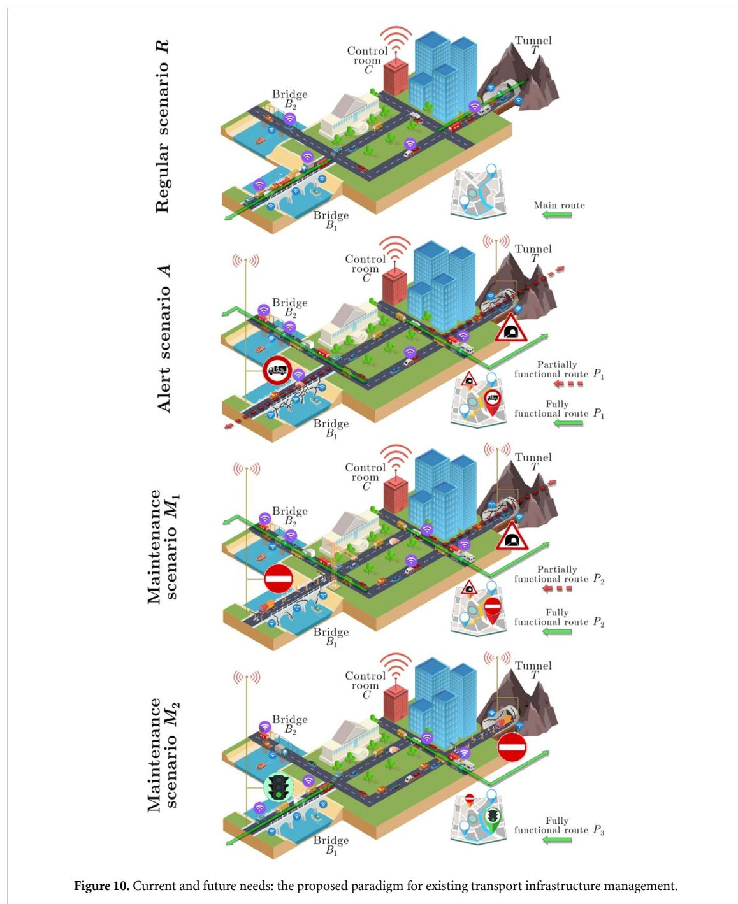

an acceptable performance level across the network. Once all maintenance interventions are completed, the transport network returns to a regular operational state (i.e. R).

# **Advances in science and technology to meet challenges**

A series of advancements in science and technology are required to implement the proposed paradigm for managing existing infrastructure. These include: (i) the development of smart solutions for pervasive monitoring of infrastructure; (ii) the implementation of automated approaches for structural identification and health monitoring; and (iii) the elaboration of DTs for transport networks.

Wireless technologies present promising solutions to the challenges associated with deploying large structural monitoring systems at territorial scale. In this regard, edge computing stands out as a particularly effective approach towards the development of wireless Internet-of-Things (IoT) monitoring systems [105]. Moreover, technologies able to convert ambient energy into electrical power [106] and/or leveraging passive sensors [107] offer viable solutions to eliminate the need for frequent battery replacements. Within this framework, aggregating traffic data from mobile devices and vehicles through crowdsourcing

{25}------------------------------------------------

systems can significantly contribute to the integration of wireless SHM systems with intelligent transportation systems [108], thus enhancing the accuracy and fidelity of a DT of the transportation network [109]. The deployment of pervasive sensing systems also calls for efficient solutions that automate data processing and interpretation, from system identification to structural diagnostics [110, 111]. In this context, unprecedented opportunities can arise from the latest advancements in AI algorithms [112–114].

### **Concluding remarks**

As transportation networks face both routine and extreme challenges that reduce their capacity, and as mobility demand grows due to increasing exchange volumes—while budgets for maintaining and replacing infrastructure continue face cuts—it has become increasingly clear that there is an urgent need to develop new strategies for transport infrastructure management. In this perspective, a potential new paradigm has been proposed. It attempts to enhance infrastructure capacity by strategically prioritizing repair and retrofitting plans, while ensuring target performance levels are met through adaptive, realtime traffic demand control. After presenting the core concept of the strategy, we identified key areas requiring significant advancement, namely: the development of smart solutions for pervasive infrastructure monitoring; the implementation of automated approaches for structural identification and health monitoring; the elaboration of DTs for transport networks.

# **Acknowledgments**

The work of Giuseppe Quaranta was carried out within the RETURN Extended Partnership funded by the European Union Next-GenerationEU (National Recovery and Resilience Plan—NRRP, Mission 4, Component 2, Investment 1.3—D.D. 1243 2/8/2022, PE0000005). Giuseppe Carlo Marano acknowledges the support from PNRR MUR project FAIR—Future Artificial Intelligence Research and received funding from the European Union Next-GenerationEU (Piano Nazionale di Ripresa e Resilienza (PNRR)— Missione 4 Componente 2, Investimento 1.3—D.D. 1555 11/10/2022, PE00000013).

{26}------------------------------------------------

### **9. Envisioning the future of structural health monitoring: integrating multimodal sensing, AI/ML, and Metaverse technologies for enhanced data-driven smart and secure systems**

*Jie Wei*1 *, Yu Chen*2 *, Erika Ardiles-Cruz*3 *and Erik Blasch*3

1Department of Computer Science, City College of New York, New York, NY, United States of America

2Department of Electrical and Computer Engineering, Binghamton University, Binghamton, NY, United States of America

3Air Force Research Laboratory, Materials and Manufacturing Directorate, Composites, Ceramics, Metallics, and Materials Awareness Division, Materials State Awareness Branch, 2230 10th Street, B655, Ste 1, WPAFB, Dayton, Ohio 45433, United States of America

E-mail: jwei@ccny.cuny.edu, ychen@binghamton.edu, erika.ardiles-cruz@us.af.mil and erik.blasch.1@us.af.mil

#### **Status**

SHM has substantially transformed from traditional single-sensor systems to sophisticated monitoring frameworks that integrate multiple technologies. The SHM evolution encompasses three primary technological pillars: multimodal sensing, AI/ML, and DTs, each contributing distinctively to modern SHM capabilities. One example is biomedical sensing for Metaverse applications.

*Multimodal sensing infrastructure***:** Current SHM implementations have expanded their data acquisition capabilities through diverse modalities such as medical sensing [115]. Modern SHM systems have advanced beyond singular measurement approaches to incorporate comprehensive sensing frameworks such as texts, voices/(ultra)sounds, time series for 1D vitals, 2D/3D/4D optical, magnetic resonance imaging (MRI), computational tomography (CT), or positron emission tomography (PET) images/videos. These modalities are fused and complemented to offer better knowledge and deeper insights for medical professionals to diagnose and treat patients. Using edge computing, innovative sensing, and analysis methods, the sensing infrastructure can be further enhanced by wearable or non-invasive sensor technologies using laser or image analysis methods, which enable continuous physiological and bio-sign monitoring through direct contact or remotely configured non-invasive measurements [116]. The multimodal approach provides a rich, multidimensional dataset that forms the foundation for advanced health monitoring applications.

*AI/ML integration status***:** The integration of AI/ML technologies in contemporary SHM systems has demonstrated significant progress in multimodal data processing and analysis capabilities. Supervised learning algorithms and insights from image processing and CV [72] have achieved notable success in pattern recognition and anomaly detection within health monitoring contexts. DL frameworks [117], such as convolution neural networks (CNN), U-Net [118], recurrent networks (RNN) [119], attentionbased transformers [120], Mamba [121], diffusion models [122], and Kolmogorov–Arnold networks (KANs) [123], have revolutionized the field by enabling automated feature learning from complex multimodal data streams, reducing the dependence on manual or ad hoc feature engineering [124, 125]. RL approaches are emerging as powerful tools for developing adaptive monitoring strategies that respond to changing and uncertain health conditions and environmental factors [126]. NLP techniques, by borrowing the immense power of transformers and LLMs such as ChatGPT [127] and Llama [128], bridge the gap between textual health records and acoustic data, enabling more comprehensive health assessments and enhanced communication between physicians and patients, e.g. in an National Institute of Health-sponsored project the authors are involved, the objective is to deliver *real-time simultaneous medical interpretation* so that the patients and physicians can communicate with their native language where an LLM based parallel processing system doing all the translations in real-time without any interruption thus achieving better cancer treatment results [129], which will computerize the special and expensive human simultaneous translators that are only available in rich medical institutions and thus making it possible for hospitals in remote and underdeveloped areas to have the valuable service.

Despite these advances, current AI/ML implementations often operate in isolation rather than leveraging the full potential of integrated multimodal analysis. Transfer Learning [129] across different data modalities remains largely unexplored, particularly in resource-constrained deployment scenarios. In SHM, Real-time or near-real-time (RT/NRT) monitoring and decision-making across multiple data

{27}------------------------------------------------

modalities are necessary, and special attention should be paid to improving the computing and data efficiency of the AI/ML algorithms. Furthermore, the black-box nature of most AI/ML methods, especially the most powerful DL-based ones, seriously limits their practical utility as justifications and interpretations are required in healthcare decision-making. Consequently, developing explainable AI (XAI) frameworks [130] tailored explicitly for SHM of healthcare equipment is critical for future development, especially given the high-stakes nature of healthcare monitoring decisions.

*DTs technology***:** DTs have emerged as a crucial component in modern SHM systems, introducing virtual representations that mirror physical health monitoring environments with unprecedented fidelity [131]. Current implementations demonstrate capabilities in real-time mirroring of physiological and behavioral parameters, enabling healthcare providers to monitor and analyze patient status through virtual interfaces. These systems support basic simulation capabilities for health status prediction, allowing for preliminary assessment of intervention strategies and treatment outcomes. Virtual testing environments facilitated by DT technology have also proven valuable for monitoring system optimization, enabling iterative improvement of monitoring protocols without risking patient well-being [132]. However, the present state of DT technology in SHM reveals several limitations that must be addressed in future developments [133, 134]. Integration with real-time sensor streams remains partially constrained, often operating with significant latency or reduced data fidelity. Visualization capabilities, while functional, have not yet achieved the level of sophistication necessary for truly intuitive interaction and analysis. Predictive modeling functionality employs relatively rudimentary approaches, lacking the sophistication that is necessary for highly accurate long-term health status forecasting. These systems typically operate in isolation, without comprehensive data fusion capabilities that could enable more holistic health assessment approaches by exploiting insights from multi-modal data.

### **Current and future challenges**

While recent technological advances have enabled significant progress in biomedical SHM capabilities, integrating multimodal sensing, AI/ML, and DT-enabled Metaverse technologies presents complex technical and operational challenges [115, 135, 136], as shown in figure 11. The convergence of these disparate technologies requires careful consideration of computational efficiency, data integrity and security, and system interoperability. Moreover, implementing these advanced monitoring systems in healthcare contexts introduces additional reliability, security, scalability, and real-time performance requirements. Several critical challenges must be addressed to advance SHM systems.

*Data integration and processing*: Integrating multiple sensing modalities generates massive heterogeneous datasets with significant processing challenges. Current systems struggle with real-time synchronization and meaningful fusion of diverse data streams, particularly when simultaneously handling highfrequency sensor data from multiple sources.

*Intelligent analysis*: While basic AI/ML/DL approaches are increasingly common in biomedical SHM, existing systems often lack the sophisticated AI capabilities necessary for (1) predictive health risk assessment, (2) contextual understanding of environmental factors, (3) adaptive learning from historical and contextual data, and (4) preserving medical and instrument data security and privacy, which is of utmost importance in viable medical applications.

*Visualization and interaction*: Traditional data visualization methods are inadequate for representing the complex, multimodal nature of modern SHM data. Current interfaces limit collaborative decisionmaking and RT/NRT interaction with monitoring data.

*Privacy and security*: The collection and processing of sensitive health data across multiple modalities raise significant security and privacy concerns that must be addressed through robust security frameworks and ethical guidelines, violation of which will have dire consequences.

*Ethical and responsible AI*: In addition to patient privacy, special care must be taken to observe the ethical responsibilities of the AI/ML system. Ethical AI means the training and validation data used in AI/ML should not be favored or biased toward any particular group of people (cohort). Once the bias is identified in the SHM, the methodology and the data must be readjusted/modified to correct these errors promptly.

The challenges mentioned above represent significant technological and operational hurdles that are deeply interconnected and mutually reinforcing. Their interdependent nature amplifies their complexity—advances in data integration capabilities, for instance, directly impact the requirements for privacy protection and visualization systems. Moreover, health monitoring applications' RT/NRT

{28}------------------------------------------------

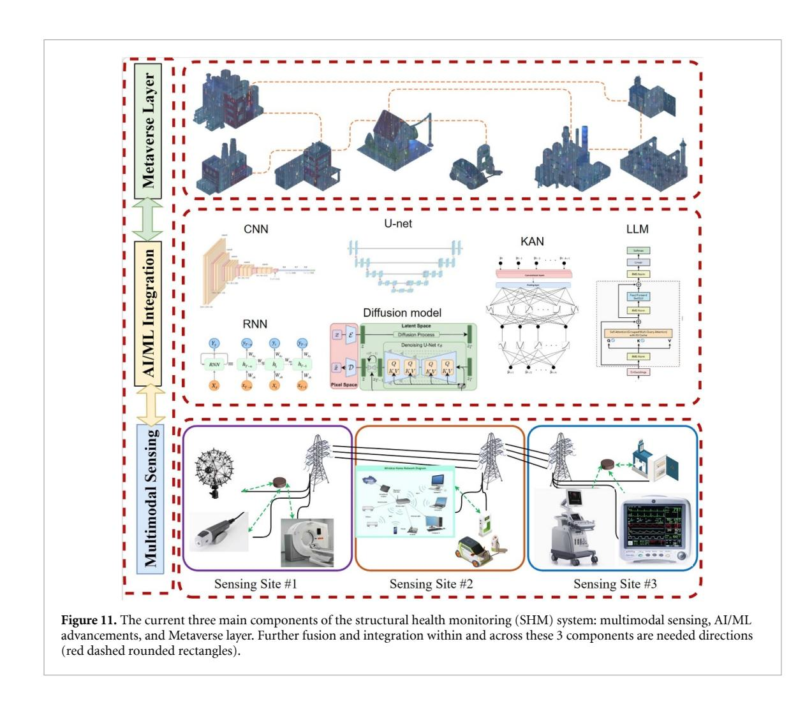

processing demands introduce strict performance constraints that must be satisfied while maintaining system reliability and security. Successfully addressing these challenges requires technological innovation and careful consideration of system architecture, computational resource allocation, deployment strategies, and data organization.

# **Advances in science and technology to meet challenges**

The advancement of SHM systems requires a coordinated evolution across multiple technological domains, with innovations in each domain supporting and enabling progress in others. Recent developments in embedded systems, edge computing, distributed computing architectures, and especially AI/ML hardware and algorithms have created a fertile ground for transformative and revolutionary solutions to current challenges. While individually significant, these technological advances achieve their full potential through careful integration and systematic deployment strategies considering technical capabilities and practical implementation requirements, as summarized in figure 11, where the fusion and integration within and across all three layers are needed to be explored for effective and efficient SHM.

*Multimodal sensing integration*: Future SHM systems will leverage advanced sensor data synchronization and fusion techniques to create coherent, multi-dimensional, personalized, and precise health profiles. Adaptive sensor synchronization and fusion algorithms form the foundation of these systems, enabling precise temporal and spatial alignment of diverse data streams. The enabling synchronization techniques include (1) *temporal data alignment* using dynamic programming and DL based encoders; and (2) *spatial and geometric data alignment* using CV and foundation models. Current AI/ML, especially various multimodal LLMs and specialized foundation models, have contributed immensely to the five levels of information fusion, ranging from early stages, such as source preprocessing and object assessment, to intermediate ones, including situation assessment and impact assessment, all the way up to decision-making user and process refinement [137]. Edge computing capabilities further enhance the sensing infrastructure by enabling distributed data processing at the collection point, significantly reducing latency and bandwidth requirements. Non-invasive sensing technologies can effectively protect 

{29}------------------------------------------------

the safety and privacy of physicians and patients while collecting valuable health-related information. Implementing smart sensor networks with self-calibration capabilities ensures sustained accuracy and reliability, while advances in low-power, high-precision sensing technologies extend deployment durations and improve measurement fidelity. These technological developments collectively enable comprehensive health monitoring and treatment with unprecedented accuracy, security, and reliability for future cloud and edge devices.

*AI/ML advancements*: Integrating sophisticated AI/ML technologies brings transformative capabilities to SHM systems through multiple complementary approaches. DL models optimized for multimodal data analysis enable sophisticated pattern recognition and identification across diverse data types. However, the inherent black-box nature of complex DL architectures presents significant challenges for critical infrastructure applications where understanding decision rationale is paramount. To address this limitation, XAI techniques, including attention mechanisms, feature importance visualization, and interpretable model architectures, are increasingly being incorporated to provide transparent insights into how monitoring systems arrive at structural health assessments. These approaches enhance trust and accountability by enabling engineers and stakeholders to validate AI-driven predictions against domain expertise and regulatory requirements. At the same time, transfer learning approaches facilitate crossdomain pattern recognition, enabling systems to leverage knowledge gained from one monitoring context in others and help those without access to large volumes of data to achieve acceptable results with limited data. Implementing RL enables adaptive monitoring strategies that evolve with changing and uncertain conditions and requirements. Federated learning approaches address privacy concerns by enabling distributed analysis without centralizing sensitive health data, marking a significant advance in secure, privacy-preserving, and scalable monitoring systems.

*Metaverse integration*: The Metaverse presents transformative possibilities for SHM through comprehensive virtual environment integration. Immersive 3D visualization of multimodal health data enables intuitive interpretation of complex health metrics, while virtual collaborative spaces facilitate real-time interaction among healthcare providers across physical locations. Real-time simulation and scenario analysis capabilities enable proactive health risk assessment and intervention planning. Interactive decision support systems leverage the Metaverse's visualization capabilities to present complex health data in accessible formats, enabling more informed and timely decision-making.

The convergence of these technological advances represents a significant leap forward in SHM capabilities, though their successful implementation requires careful orchestration and systematic validation. The synergistic interaction between improved sensing technologies, sophisticated AI/ML algorithms, and immersive Metaverse environments creates opportunities for unprecedented monitoring precision and operational efficiency. However, these virtual environments introduce substantial security challenges, particularly in authenticating users across distributed Metaverse platforms and maintaining the integrity of identity verification when multiple stakeholders access sensitive structural health data through various virtual interfaces. Furthermore, the immersive nature of Metaverse environments amplifies data privacy risks, as these platforms inherently collect extensive behavioral and interaction data beyond traditional monitoring metrics, potentially exposing patterns of professional practice, decision-making processes, and organizational vulnerabilities to unauthorized parties. Realizing these benefits demands rigorous attention to system integration, scalability considerations, ethical evaluations, and performance optimization. Robust cryptographic protocols and zero-knowledge proof mechanisms must be implemented to ensure that collaborative virtual spaces maintain data confidentiality while enabling necessary information sharing among authorized personnel. The practical implementation of these advances must balance technological sophistication with operational reliability, ensuring that theoretical capabilities translate effectively into real-world performance improvements. Thus, a careful balance is crucial in healthcare and military applications, where system reliability directly impacts human well-being and operational effectiveness.

# **Concluding remarks**

Integrating multimodal sensing, AI/ML, and Metaverse technologies, represents a paradigm shift in SHM capabilities. This convergence will enable unprecedented health monitoring and treatment accuracy, predictive capability, and collaborative and explainable decision-making. Future SHM systems will fully exploit different medical data modalities to provide comprehensive, real-time, or near-real-time health diagnosis and treatment results while maintaining privacy, security, and ethical responsibility. The success of this vision depends on continued advancement in sensor technologies, diversified data collections, effective explorative data analysis, AI/ML algorithms tailored for multimodal data, and Metaverse platforms. Critical attention must be paid to ethical considerations, data privacy, and system reliability as

{30}------------------------------------------------

these technologies evolve. The potential impact on healthcare delivery, particularly for vulnerable populations, justifies continued investment in research and development of integrated SHM solutions.

# **Acknowledgments**

The authors would like to gratefully acknowledge the support of AFRL FA950-21-1-0082, AFOSR FA9550-22-P-0011, AFOSR FA9550-23-2-0002, NSF IIS-2324052, and NIH 2U54CA132378, C22752733. Any opinions, findings, conclusions, or recommendations expressed in this material are those of the authors and do not necessarily reflect the views of the sponsors/organizations, the United States Air Force, or the US government.

{31}------------------------------------------------

# **10. Unlocking scalable SHM: towards developing robust tools for large-scale adoption**

*Mohammad Hesam Soleimani-Babakamali*1 *, Onur Avci*2 *, Daniel J Inman*3 *and Ertugrul Taciroglu*1

1University of California, Los Angeles, CA, United States of America

2West Virginia University, Morgantown, West Virgina, United States of America

3University of Michigan, Ann Arbor, MI, United States of America

E-mail: soleimanisam92@g.ucla.edu, onur.avci@mail.wvu.edu, daninman@umich.edu and etacir@g.ucla.edu

#### **Status**

The trend of keywords in published articles highlights a post-'AI-Winter' era marked by the large-scale, multidisciplinary adoption of AI models [138]. This surge is driven by groundbreaking advances in DL paradigms, including optimization techniques and architectural innovations. SHM is yet another domain experiencing significant progress as an inherently data-driven field. As with any parametric model, generalizability to unseen cases—affected by the training data's representativeness [139] and the model design—remains a primary challenge for real-world applications. The high-dimensional and noisy nature of SHM data has historically perplexed traditional ML and statistical models, often requiring expert knowledge and trial-and-error processes for effective data preprocessing and feature selection. Results were thus case-dependent and did not scale well across different structures [140]. Consequently, building models capable of generalizing across diverse systems was far beyond reach using traditional techniques. With the advent of DL, SHM models (*e.g.* for damage prognosis, detection, localization, and severity measurement) have now reached a pivotal point, especially for structures with sufficient historical data. Leveraging these capabilities, the SHM paradigm has shifted over the past two years towards developing generalizable SHM. Such models can support the next-generation SHM systems required to meet the large-scale application needs in smart cities, promoting resilience and sustainable urban environments.

The sought-after generalizability minimizes the need for labeled data acquisition and reduces computational demands for adapting these models to unseen cases. To eliminate the reliance on prior (damaged) data, novel strategies must be employed to train SHM models or adapt them for downstream applications. These strategies include synthesizing data (*e.g.* using DTs [141] or damaged data synthesis through Generative AI), transferring knowledge from a pre-trained SHM model through fine-tuning or aligning the target data with the feature space of pre-trained models via DA [142]. Considering the need for scalability across diverse systems, the former approach—due to the challenges of generating synthetic data and the high cost of fine-tuning—is less suitable for large-scale adoption. In contrast, DA aligns more effectively with these requirements. In this context, we introduce the term 'target-agnostic' SHM model as the foundational backbone of next-generation SHM systems for large-scale applications. A target-agnostic SHM model must satisfy two key criteria: first, it operates independently on incoming data at the start of SHM processes, and second, it requires no fine-tuning or model updates for specific structures across fundamental SHM tasks, including damage prognosis, detection, localization, and severity measurement. In light of these tasks, 'agnostic' notably refers to the design indifference to any data beyond the incoming signal from the target system at the onset of SHM processes. The design includes factors such as potential damage mechanisms, sensor configurations, environmental conditions, and other structural evidence that could influence the SHM process, apart from the incoming data. Figure 12 illustrates the current achievements and outlines the steps necessary to scale toward a target-agnostic SHM model.

### **Current and future challenges**

As abstractly illustrated in figure 12, the primary challenge in large-scale SHM lies in establishing a common ground for different structural systems to communicate, ideally through structure-agnostic tools. Domain knowledge can establish this common ground, often encompassing the physics of the domain it refers to while also extending beyond it to include contextual, experiential, or application-specific information. Ideally, deterministic solutions can be achieved if the physics of all agents involved in a phenomenon or process are precisely known. Otherwise, data-driven techniques can handle complex data patterns, with physics-based controls guiding the model to avoid overfitting to observed scenarios. The literature highlights the potential of leveraging domain knowledge and physics-based solutions to enhance the generalizability of data-driven approaches (*e.g.* [143]). Within SHM, the challenge lies in

{32}------------------------------------------------

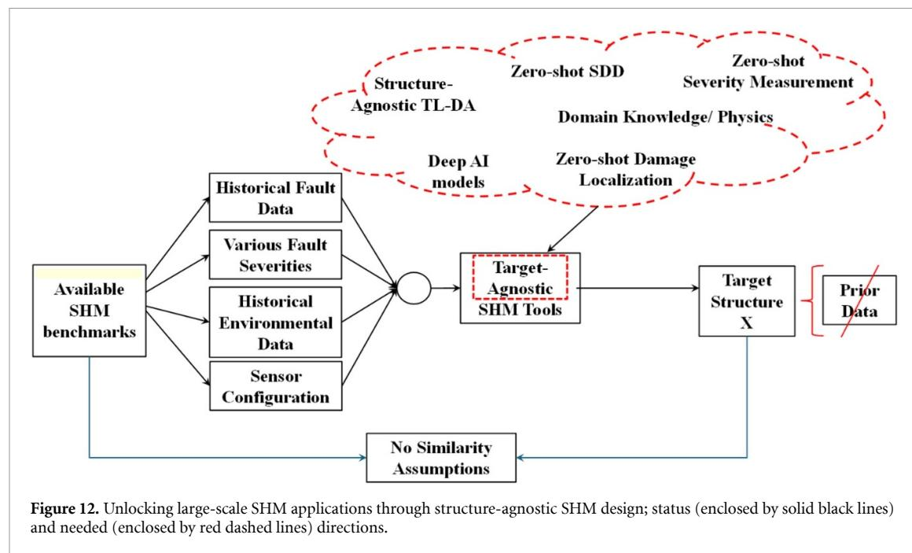

identifying appropriate domain knowledge and its niches to enable structure-agnostic DA methods. An example of such efforts is presented by Soleimani-Babakamali *et al* [144]. By constructing a structural damage detection (SDD) model using raw frequency-domain inputs and leveraging domain knowledge from digital signal processing (DSP)—such as matching the target structures' power spectral densities (PSDs)—the desired DA between heterogeneous domains can be achieved.

Still, for a complete SHM tool, damage localization and severity modules must accompany the SDD module. From a traditional SHM perspective, achieving damage severity estimation and localization requires prior knowledge of structures, as well as information as simple as sensor configuration and historical damage data. For instance, only supervised learning can assess damage severity and its impact on the structure [5]. However, Transfer Learning can address such complications. Supervised learning and labeled data are available for source systems, shifting the challenge to projecting the knowledge learned from the source system onto the target structure. Alternatively, strategies can be introduced for zeroshot damage localization and zero-shot (relative) severity measurement. Bypassing the requirements described in figure 12 allows for the development of target-agnostic SHM tools. However, this mechanism is necessary but insufficient to 'unlock large-scale SHM adoption'. Figure 13 depicts numerous challenges, including data acquisition, processing units, network configuration, sensing equipment, and the need to transition to simpler sensing systems, such as crowdsourcing IoT device outputs and datasharing systems. Additional considerations include HIL interventions, the decision-making system's architecture (whether federated or centralized), and the new challenges that may arise during pilot-testing phases.

# **Advances in science and technology to meet challenges**

In achieving large-scale SHM adoption (figure 13), advances in measurement and wireless communications, as well as in AI (specifically DL), are evident. From an instrumentation perspective, inexpensive sensors and edge computing devices are available for federated decision-making [145]. Advances in DL are also notable, progressing from simple vanilla RNNs to more sophisticated gated recurrent network architectures, such as Long Short-Term Memory (LSTM) units [146] and state-of-the-art Transformer architectures [147]. These architectures demonstrate exceptional capability in understanding SHM data.

For SHM, however, the primary challenge lies in the lack of comprehensive data sources, unlike fields such as NLP, which benefit from extensive resources like Wikipedia or the Internet Archive. If a comprehensive SHM database existed, encompassing numerous systems and long-term monitoring data, elevating towards such generalizability would be possible. Consequently, the available tools and technologies already exceed what SHM currently demands. As outlined in figure 12, achieving large-scale SHM adoption requires fundamental breakthroughs and innovative ideas to overcome the barriers between different systems and to create universally applicable models.

{33}------------------------------------------------

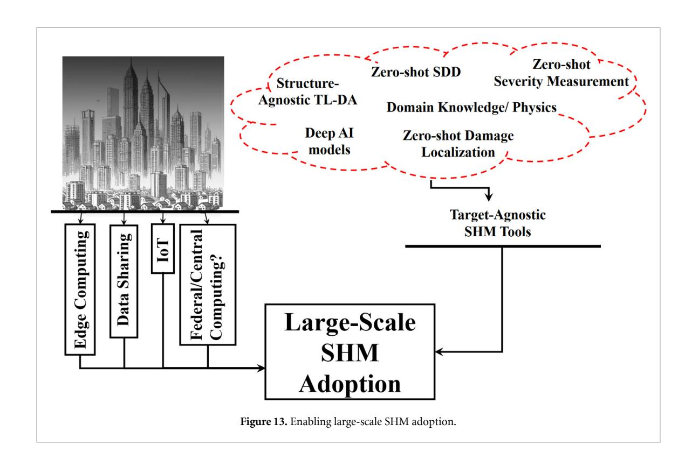

### **Concluding remarks**

Recent AI advancements present an unprecedented opportunity to extend SHM applications from individual structures to large-scale implementations, fostering sustainability and resilience in urban environments. To that end, leveraging innovative strategies, including Transfer Learning and DA with the inclusion of domain knowledge, can bridge the data availability, computational efficiency, and diversity demands of large-scale applications in next-generation SHM systems. These strategies must support SHM knowledge transferability across various infrastructure systems for complete damage prognosis, detection, localization, and severity measurement. Measurement technologies must also accompany innovations in accurate, scalable, and cost-effective sensing systems, which are essential for advancing large-scale SHM applications. Innovations in miniaturized sensors, edge computing, and wireless communication systems enable real-time data collection and processing, enhancing SHM's adaptability to diverse environments while maintaining precision. Ubiquitous systems such as IoT devices and crowdsourcing techniques can offer effective and affordable large-scale SHM solutions.

Ultimately, scalable SHM systems depend on AI, measurement innovations, and interdisciplinary collaboration to overcome implementation challenges. Effective communication protocols, large-scale sensing, and cost-efficient instrumentation will enable the development of scalable, target-agnostic SHM models, transforming SHM into a cornerstone of resilient, sustainable infrastructure management.

{34}------------------------------------------------

# **11. Real-time learning for high-rate decisions**

Simon Laflamme1, Austin Downey2 and Jacob Dodson31Iowa State University, Ames, Iowa, United States of America

2University of South Carolina, Columbia, SC, United States of America

3Air Force Research Laboratory, Materials and Manufacturing Directorate, Composites, Ceramics, Metallics, and Materials Awareness Division, Materials State Awareness Branch, 2230 10th Street, B655, Ste 1, WPAFB, Dayton, Ohio 45433, United States of America

Email: laflamme@iastate.edu

#### **Status**

Feedback mechanisms in engineering systems often require real-time state estimation to adapt to changes in the environment. Real-time state estimation is usually achieved by processing measurements through physics- and/or data-driven models, depending on the speed and accuracy constraints of the process. Some of these feedback mechanisms require or would require extreme processing speeds for successful deployment. This is the case of high-rate systems, for example active impact mitigation strategies, high speed systems and hypersonic systems, for which decision processes require sub-millisecond decision speeds [148]. The vast majority of high-rate systems have complex nonlinear and nonstationary dynamics, with large uncertainty on operating conditions and loads [149]. It results that their physical modeling is difficult, and state estimator would benefit from the capability to construct and adapt data-based models online.

Neural networks are defined as capable of learning in real-time (and online) if the time required for backpropagation and inference is less than the time requested by the system to make an updated state estimation [150]. It follows that the choice of their architecture is critical in enabling high-rate applications. For instance, while deep learners have shown promise in complex dynamic environments [151], their computation time is typically prohibitive [152]. Research on real-time neural networks has led to formidable strategies to accelerate computation through better design of the architecture, for instance by eliminating the backpropagation mechanism [153], integrating physical knowledge [154], and leveraging parallel integration [155], let alone various strategies for hardware integration through software-hardware co-design [156].

Another strategy is to minimize the inputs fed to the representation to both minimize the curse of dimensionality and promote efficient neural architectures. This can be done through various dynamic system dimensionality reduction techniques [157] to obtain features that inputs are sufficiently rich in information about the estimated system. These features can be used to accelerate both computation time and accuracy of the representations, as demonstrated in [158] by feeding dynamic features into a CNN. Despite the paramount research activities in the field of ML addressing computational speed issues, significant challenges remain in creating representations capable of real-time learning for high-rate decision-making. This is attributable to the very strict latency requirements, important trade-off that exists in adaptive modeling between model complexity and computation speed, and to the available training data populating only sparsely and locally the dynamic space of interest.

# **Current and future challenges**

To close the loop and enable active feedback of high-rate systems, there exists challenges related to online learning systems for high-rate applications that may be addressed (figure 14):

- Deterministic methods for structural prognostics: (state prediction) predictable structural health predictions with well-defined uncertainties under extreme environmental conditions.
- Edge computing and hardware co-design: (hardware and co-design implementation) on-device learning with constrained resources, parallelization via specialized accelerators, and secure federated data sharing.
- Data scarcity and uncertainty: (data sharing and testbeds) limited data from costly experiments, large uncertainties in real-world conditions, and the need for real-time confidence intervals.
- Extreme time computation constraints: (fast feature extraction) sub-millisecond inference requirements, trade-offs between accuracy and speed, and computationally efficient dimensionality reduction.
- Adaptive and robust online learning: (new architectures) real-time handling of nonstationarities and transients, integration of approximate physics, and stability under shocks and noise.

{35}------------------------------------------------

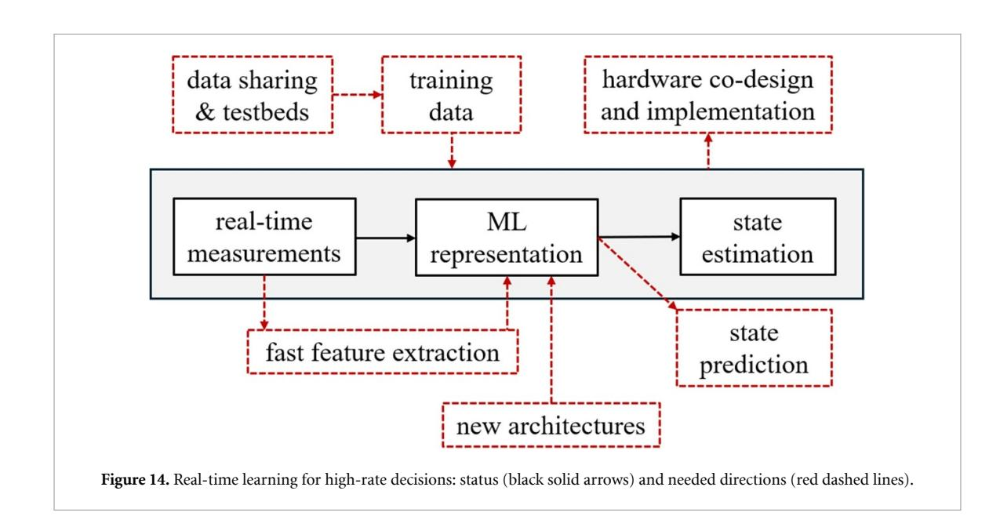

# **Advances in science and technology to meet challenges**

We will see a dramatic increase in field deployment of high-rate systems in the future, with a demand on high-rate decision systems to empower feedback mechanisms. A critical obstacle in the implementation of ML algorithms enabling high-rate systems is in the lack of available training data. Possible solutions include the implementation of GANs and pairing representations with DTs. However, the generation of representative datasets will still be impeded by large uncertainties on the dynamics. These large uncertainties will also make difficult the implementation of deterministic decision systems, and it will be necessary to assess, also in real-time, some confidence interval to capture the appropriate uncertainties on the state estimates.

With the foreseen increase in deployment of high-rate systems, we will see more training datasets be generated, yet on heterogeneous systems. Data sharing will be critical but difficult as some of these datasets will be seen as critical information, and it will be important to develop and integrate secure data sharing techniques, such as through federated learning. It will be important to develop appropriate extrapolators to cope with the lack of representative datasets.

ML architectures specifically dedicated to high-rate decision making will need to be developed. This includes a seamless integration of physics-based feature extraction and manipulation processes to promote lean and effective representations, and the parallel integration of different representations that will have the capacity to cope with the systems' nonstationarities. It is also anticipated that the use of windowing techniques will become important to reduce the size of datasets used by the representation at any given time. These windowing techniques will need to be combined with feature extraction methods that will preserve the essential dynamics of the system, often buried in a large number of datapoints. While there exist formal techniques to do so, for example based on topological data analysis [159], these techniques can have an appetite for computation, and it will be necessary to find strategies to empower their high-rate applicability. In particular, we may rely on algorithmic shortcuts to empower their highrate applicability, for example by sacrificing accuracy for the benefit of computation speed, but this important trade-off between accuracy and computation speed that will need to be quantified. Lastly, it will be important to develop testbeds to verify and validate the performance of algorithms before field implementation. Yet, constructing such testbeds is a difficult task, because tests will need to be reproducible.

# **Concluding remarks**

High-rate decisions require the sub-millisecond analysis of very complex dynamics. It is foreseen that implementation of AI will be critical in empowering high-rate systems, because of their capability to compute data-based decisions, a process often much faster than physics-based methods. Yet, because of the extreme computation time constraints, several technical challenges need to be addressed. In this paper, we provided, to the best of our capabilities, a roadmap to addressing these challenges, with the objective to empower the field deployment of high-rate systems.

{36}------------------------------------------------

# **Acknowledgments**

The authors would like to gratefully acknowledge the support from the Defense Established Program to Stimulate Competitive Research (DEPSCoR) award number FA9550-22-1-0303, the Air Force Office of Scientific Research (AFOSR) award numbers FA9550-21-1-0083 and FA9550-23-1-0033, the AFRL Regional Network—Midwest, and the National Science Foundation award numbers CCF-2234919, 2152896 and 2344357. Any opinions, findings, conclusions, or recommendations expressed in this material are those of the authors and do not necessarily reflect the views of the sponsors/organizations, the United States Air Force, or the US government.

{37}------------------------------------------------

# **12. Machine learning control for artificial intelligence explainability in bridge inspection and strength prediction**

*Genda Chen*

Missouri University of Science and Technology, 328 Butler-Carlton Hall, 1401 N. Pine Street, Rolla, MO 65401, United States of America

Email: gchen@mst.edu

#### **Status**

With the advent of advanced UAVs that can be interacted with structures to be monitored for increased operation duration and improved navigation autonomy [160], drone-based remote sensing and nondestructive testing are producing or will augment an unprecedented big dataset of both images and measurements for the assessment of structural behaviors. For example, a custom-built DJI M600 drone (INSPIRE UTC newsletter) is equipped with visible, infrared, and hyperspectral cameras and a light detection and ranging (LiDAR) scanner. Visible images include the color, pattern, shape, and texture of structural members; thermal images present the spatial variation of temperature on the surface of structural members affected by substrate defects in the process of heat transfer; hyperspectral images with microscopic data at each pixel embed material features on the surface of structural members because every material reacts with light differently; and LiDAR point clouds show the shape and standoff distance of structural members. A hybrid drone that can launch off a crawler for metal thickness measurement [160, 161] enables a rapid data acquisition from large-scale structures.

DL has been increasingly applied to extract useful information from imaging and measurement data. For structural behavior monitoring, this application involves interdisciplinary knowledge in computational intelligence and civil engineering (i.e. materials and structures). In computer science, AI algorithms can be treated as a black box and focused on a trade-off of predictability and generalizability. Their adoption in civil engineering, however, is likely pre-conditioned on the explainability of AI predictions. Civil engineers design, construct, and maintain capital infrastructure that are costly and, equally important, critical to the function of a society. Failure of engineering structures bears significant social, economic, and environmental consequences. To make informed and responsible decisions for technology adoption, civil engineers must know how AI derives segmentation, classification, and evaluation results based on engineering principles.

AI can be developed from unsupervised to supervised learning. For unsupervised learning, an AI model must discover patterns and relationships within unlabeled data without explicit guidance on what to look for. For supervised learning, an AI model can compare its predictions with the ground truths from labeled data. This synopsis introduces three learning protocols with increasing degrees of explainability in AI when applied to structural behavior monitoring in civil engineering.

The first learning protocol was demonstrated for elements segmentation and defect classification in highway bridges [162]. A Mask Region-based CNN pre-trained on a large public dataset was transferred and refined with a small bridge training dataset labeled by an inspector or inspectors. The trained network was applied to predict some unseen validation data. The inspector or inspectors either confirmed the prediction and then continued for other validation or corrected the wrong prediction and added the correction to the original training dataset for further network training until all validation data were reviewed. This training-reviewing-retraining process was referred to as a semi-supervised self-training method to engage experienced inspectors in refining the network iteratively. Temporal coherence analysis further recovered false negatives [162]. The proposed method can utilize a small amount of time and guidance from experienced inspectors (3.58 h for labeling 66 images) to build a network of excellent performance (91.8% precision, 93.6% recall, and 92.7% f1-score).

The first learning [162] protocol was demonstrated for elements segmentation and defect classification in highway bridges. With a small initial training dataset labeled by inspectors, a mask regionbased CNN pre-trained on a large public dataset was transferred to the new task of multiclass bridge element segmentation. Temporal coherence analysis recovered false negatives and identified the weakness that the neural network can learn to improve. Furthermore, a semi-supervised self-training method was developed to engage experienced inspectors in refining the network iteratively. The proposed method can utilize a small amount of time and guidance from experienced inspectors (3.58 h for labeling 66 images) to build the network of excellent performance (91.8% precision, 93.6% recall, and 92.7% f1-score) [162].

The *second approach* [163] is based on unsupervised learning between a target domain and a source domain through DA based on feature engineering. The performance of an AI model trained on the

{38}------------------------------------------------

source domain degrades when tested on the target domain that is visually distinct from the source domain in structural shape, size, color, texture, illumination, and other operational conditions. In such situations, rebuilding the model with labeled training data from the target domain becomes prohibitively expensive and time-consuming in practical applications [163]. Unsupervised DA based on specific knowledge in engineering disciplines provides a viable solution to this problem without requiring additional labeled data in the target domain.

The second learning protocol [163] was demonstrated in the case of bridge inspection for DL-based semantic segmentation. The feature engineering introduced in DA was three class-wise histogram matching between target and source domains. This comprehensive matching scheme did not only augment data but also advance the conventional adaptation strategy with an overall domain matching criterion. It leads to a significantly improved adaptation when there is no labeled data from the target domain. The proposed technique produced a mean intersection-over-union (IoU) of 21.2% and 21.3% higher than a benchmark DA method [163].

The *third approach* is based on supervised learning for a neural additive network by establishing oneto-one highly nonlinear relations between each input and an output and minimizing false prediction of the overall output from the combined effect of the inputs. Mathematically, the neural network includes significantly more hyperparameters (weights and biases) than the parameters in a pre-defined regression equation. As a result, the learning-based relation between all the inputs and the overall output is more adaptable to nonlinearity compared to the conventional regression analysis.

The third learning protocol was demonstrated in the determination of concrete-concrete shear strength [164]. The use of high-strength concrete and steel has depreciated the accuracy of the design equations based on normal-grade materials. Neural additive models (NAMs) were developed with geometric and material properties inputted to individual neural network blocks. The linear combination of all outputs of the individual blocks or their cubic power was optimized to produce minimum errors against ground truths during training. The trained models can identify and quantify the individual contributions of the input parameters. The DL-informed design scheme improves the prediction accuracy of the shear strength equation in the existing AASHTO LRFD Bridge Design Specifications [165] by over 32%.

#### **Current and future challenges**

Together, the three learning protocols are complete in learning control when applied in civil engineering. Their associated AI models are individualized, domain-specific, and domain-independent, respectively. The first approach results in an AI platform that is transparent to the specific expert that is involved during the development. The human-AI copiloting approach will reduce tremendous labor hours of a specific inspector in image labeling and processing for critical defect type and size. The second approach is transparent to a group of domain experts in subdisciplines, such as bridge engineering, through DA. The unsupervised approach will enable knowledge transferring between engineers, for example, for concrete vs. steel girder bridges. The third approach is completely transparent to all experts in civil engineering as it mimics the traditional statistical regression yet incorporates the learning approach in establishing highly nonlinear functions. The learning-based regression approach results in a concrete-concrete shear strength design equation that is recommended to the AASHTO for potential adoption as the new design equation is much more accurate than that in the AASHTO LRFD Bridge Design Specifications [165].

While effective in the above presented examples [162–164], the three learning protocols will face multiple challenges when extended to other applications in civil engineering:

- (1) AI model training requires the use of big data. However, field data involving structural failures are scarce and difficult to acquire due to owners' liability when managing public assets.
- (2) While widely available, images on the internet are of limited uses in engineering. Distorted images, both intentionally and unintentionally, do not preserve geometric features such as cracks and thus cannot be used in quantitative analysis.
- (3) Data interpretation for structural behavior co-evolves with the understanding of deterioration science. Deterioration in real world results from unexpected parameters that can only be simulated partially in laboratory tests.

{39}------------------------------------------------

- (1) With the advent of bridge inspection robot deployment systems (BIRDS) [160], automated collection of big data from bridges will be rapid and consistent. Remote sensing can be advanced to investigate some failure modes such as corrosion-induced fracture. Supplemented by laboratory parametric studies, the ability to understand failure modes is improved.
- (2) New images with a calibration scale implanted can be generated from sensor fusion technologies. Examples include a RGB camera and a clipped-on structural light system, a stereo camera with depth information, and a RGB camera and a LiDAR scanner.
- (3) As more field tests are conducted, more data becomes available to understand the mechanism of failure modes and thus associated deterioration science. For example, hyperspectral imaging with microscopic spectra at pixel levels include information to steel surface corrosion process. Spectral features must be correlated to corrosion conditions for better interpretation of corrosion processes.

# **Concluding remarks**

This synopsis presents a complete set of three protocols for control of ML to achieve individualized, domain-specific, and domain-independent AI with increasing explainability. On one hand, the participation of domain experts from machine training to test and validation enables the implanting of knowledge in their AI copilot. On the other hand, such a trained AI model is more receptive to end users and relatively easier to be adopted in practical applications.

These studies can be extended from element segmentation to other applications such as vision-based bridge defect classification and post-disaster structural reconnaissance. In these applications, the semisupervised self-training method can not only engage individual expertise but also include domain engineering knowledge between tasks to be classified. The latter approach results PIML, further improving AI explainability. NAMs can be applied to investigate different failure modes, particularly for the determination of fatigue strength and scour depth as these failure modes largely depend upon the geometric and material details of elements with a large range of uncertainties. These studies can also be extended from civil engineering to other engineering domains such as manufacturing process and vegetation-indicated gas leakage detection in underground pipelines.

# **Acknowledgments**

Financial support to complete this study was provided in part by U.S. National Science Foundation (NSF) under NSF Grant No. ECCS-2026357 and by the U.S. Department of Transportation, Office of the Assistant Secretary for Research and Technology (USDOT/OST-R) under Grant No. 69A3551747126 through INSPIRE University Transportation Center and under the auspices of Mid-America Transportation Center at the University of Nebraska–Lincoln (Grant No. 00065573). The views, opinions, findings and conclusions reflected in this publication are solely those of the authors and do not represent the official policy or position of the USDOT/OST-R, or any State or other entity.

{40}------------------------------------------------

# **13. Human-centered adaptive learning control for robot-assisted healthcare**

*Wei Meng, Chang Zhu, Zemin Liu, Jie Zuo and Quan Liu*

Wuhan University of Technology, Wuhan, People's Republic of China

E-mail: weimeng@whut.edu.cn, changzhu@whut.edu.cn, zeminliu@whut.edu.cn, zuojie@whut.edu.cn and quanliu@whut.edu.cn

#### **Status**

With the global demographic trend of an aging population, the prevalence of stroke-related cases is steadily increasing. Among the most common complications in such patients is motor dysfunction [166]. In recent years, robots have gained significant traction due to their demonstrated advantages in healthcare. These robots assist patients in performing rehabilitation exercises, thereby reducing the workload of therapists. Moreover, active training facilitated by healthcare robots aligns with the patient's movement intentions and physical condition, promoting neural recovery and expediting the restoration of motor functions [167]. Active rehabilitation benefits significantly from adaptive learning control strategies, which enable robots to adjust in real-time to the patient's specific needs and physical states. These strategies allow for personalized therapy regimens, thereby enhancing the overall effectiveness of rehabilitation [168].

Recently, human-centered adaptive learning technologies have garnered considerable attention and experienced rapid advancements [169, 170]. Supervised learning, a commonly used approach in robotassisted healthcare, optimizes robot control strategies by leveraging large datasets of labeled information, such as surface electromyography (sEMG) signals, joint angles, and accelerometer data. For instance, Menner *et al* [171] introduced a method to tailor controller parameters based on human evaluations using supervised learning with minimal input adaptation. Similarly, supervised learning algorithms have been employed to train models where joint angles serve as input and compensation torques as output, achieving effective control by compensating for gravitational effects [172]. While these methods rely on extensive datasets, the dependence on large quantities of high-quality labeled data introduces challenges, including increased complexity and resource demands during the training process. Furthermore, the effectiveness of personalized treatment is intrinsically tied to the quality and quantity of the labeled data, posing additional hurdles for deploying supervised learning in complex clinical environments. In contrast, semi-supervised learning offers an alternative by enabling models to leverage large amounts of unlabeled data, guided by a smaller labeled dataset. Semi-supervised learning facilitates the identification of user behavior patterns while utilizing unlabeled data to achieve user-friendly human-robot interaction. Unsupervised learning, on the other hand, identifies intrinsic structures and patterns within unlabeled data without relying on predefined labels. By uncovering natural user behavior patterns, unsupervised learning enhances the personalization of interactive experiences. Both semi-supervised and unsupervised learning methodologies are well-suited for dynamically changing environments due to their capacity for continuous learning, thereby advancing human-centered robot-assisted healthcare [173, 174]. Figure 15 illustrates the architecture and needs of the human-centered adaptive learning control system.

### **Current and future needs**

As patients progressively regain function during rehabilitation, static control strategies are often insufficient to address the evolving demands of different recovery stages, which may hinder rehabilitation outcomes. Dynamic and intent-sensitive control methods are required to provide adaptive, individualized training that aligns more closely with the patient's recovery trajectory. Adaptive learning control adjusts the exoskeleton's auxiliary torque based on users' physical capabilities and needs, enabling personalized customization. Despite its advantages in exoskeleton applications, human-centered adaptive learning control faces notable challenges and limitations (figure 15).

Supervised learning control relies heavily on data labeling, which may cause training data to fail to reflect patients' real-time needs and dynamic changes, making the training process time-intensive for real-time control. Because supervised learning depends on pre-labeled data, its ability to adapt is limited when encountering special conditions or sudden changes during the rehabilitation process. This reliance on historical labeled data leads to poor adaptability to new data patterns, making it difficult to quickly achieve personalization or optimization. Semi-supervised learning control combines environmental perception information and motion control strategies, allowing robots to adjust treatment plans adaptively. The unlabeled motion data from different patients may carry information about varying rehabilitation progress, but identifying which unlabeled data is valuable for adjusting personalized rehabilitation plans

{41}------------------------------------------------

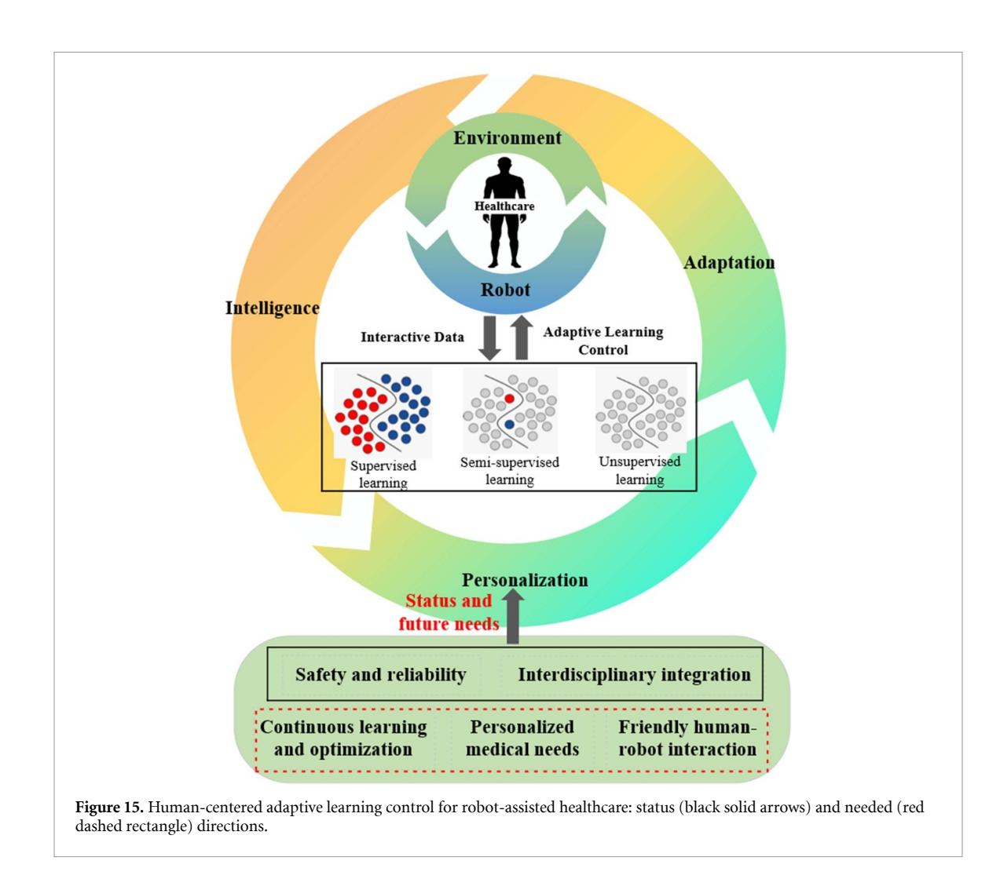

poses a significant challenge. Furthermore, designing a universal optimization strategy is difficult, as the process is susceptible to noise interference, which impacts the algorithm's convergence speed and accuracy. Na *et al* [175] proposed a semi-supervised DA approach to minimize the discrepancy between source and target features, but semi-supervised learning still struggles to effectively fuse labeled and unlabeled data. Additionally, in dynamic rehabilitation environments, the model update speed of semisupervised learning often fails to meet real-time requirements, limiting its adaptability.

With advances in DL and RL, unsupervised learning has gained increasing attention. Unsupervised learning does not require labeled data and can automatically learn and adjust control strategies by analyzing feedback signals during patients' natural movements, offering greater adaptability and flexibility for patients with significant individual differences. Trigili *et al* [176] developed an unsupervised ML algorithm to detect upper limb movement intent, identifying task initiation and termination in exoskeleton systems. The algorithm employs a two-component Gaussian mixture model to represent the probability distribution of EMG signals during rest and motion phases, accommodating changes in noise levels or fluctuations in EMG amplitudes caused by muscle fatigue or adaptation. RL, a key form of unsupervised learning, determines optimal control strategies through trial-and-error interactions between the robot and its environment. Its application in lower limb robots enables real-time adaptation to patient conditions and automatic control adjustments [177, 178]. For instance, an assist-as-needed controller based on RL was developed [179], reshaping the force field in real-time based on subjects' training performance, thereby maximizing active patient participation in gait training.

While unsupervised learning addresses issues of adaptability, it also presents challenges. It may struggle to capture subtle differences in patients' rehabilitation needs, baseline physical conditions, and recovery goals, resulting in inaccuracies when formulating personalized rehabilitation plans. This limitation is particularly pronounced in the early stages of rehabilitation, where significant trial and error is needed to determine effective control strategies. Deviations in the learning direction can lead to unstable adaptive performance, potentially hindering rehabilitation progress. Additionally, the limited intelligence of current control methods constrains their effectiveness in complex, dynamic rehabilitation

{42}------------------------------------------------

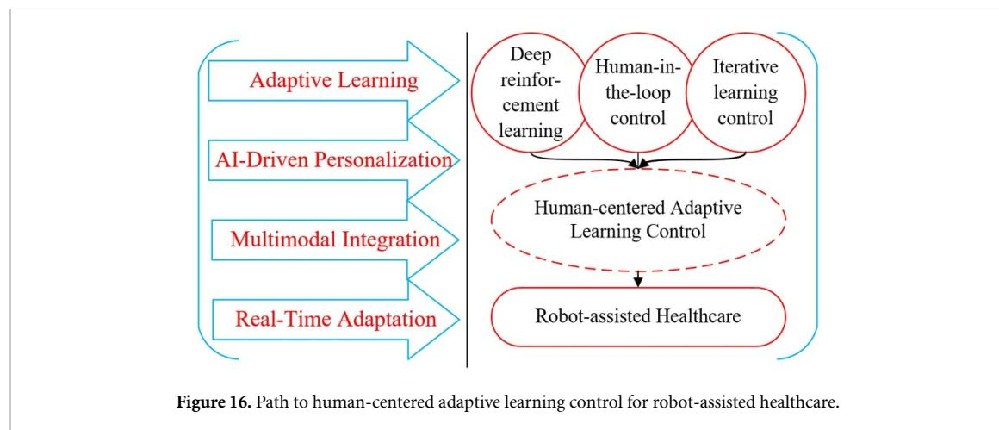

environments. Most methods rely on predefined trajectories or fixed parameters, lacking the flexibility to respond to patient condition changes and failing to incorporate adaptive adjustments or real-time decision-making.

# **Advances in science and technology to meet challenges**

To address the challenges mentioned above, this paper highlights several recent advancements in the field of healthcare robotics, as shown in figure 16. Currently, the algorithms widely used in humancentered adaptive learning control primarily encompass deep RL, HIL control, and iterative learning control (ILC). These approaches integrate key concepts such as adaptive learning, AI-driven personalization, multimodal integration, and real-time adaptation to dynamically adjust the timing and magnitude of robot assistance. Deep RL (DRL) offers a novel control strategy for lower limb robots, enabling the identification of optimal control paths in complex, dynamic environments [180]. By combining the strengths of neural networks and RL, this approach not only significantly enhances the intelligence of robots but also reduces the computational time required for training. DRL enables automatic optimization of the interaction between the robot and the patient. For instance, Vree and Carloni [181] developed a human gait optimization control method based on deep RL, which uses an evolving reward function to adjust the control strategy, achieving improved gait symmetry. Similarly, Yang *et al* [182] proposed an optimal admittance control strategy for a cable-driven robot. This method allows smooth transitions between passive and active modes by optimizing admittance parameters and dynamically adjusting cost function weights based on the patient's voluntary effort, thereby enabling adaptive mode switching.

ILC provides a powerful framework for iteratively refining control parameters using sensor feedback to achieve desired outcomes. Sun *et al* [183] introduced an adaptive ILC method that integrates a HIL approach. ILC employs a neural network model to estimate real-time desired trajectories from sEMG signals, iteratively optimizing the tracking trajectory and reducing errors rapidly. Furthermore, Yang *et al* [184] developed a spatial repetitive impedance learning controller that leverages spatial periodicity, formulating an iterative learning law to estimate time-varying impedance in the spatial domain. By adapting to dynamic changes in patients' needs, ILC enhances the precision and personalization of rehabilitation training, gradually converging to an optimal control strategy through iterative parameter adjustments based on real-time feedback.

The integration of multimodal sensing, including vision, force, and electromyographic data, significantly enhances the adaptive capabilities of healthcare robots. Multimodal data not only improves the performance of HIL control and unsupervised learning but also facilitates real-time adaptation to patients'dynamic needs. For example, the fusion of ultrasonic and electromyographic signals has been used to optimize understanding of patients' volitional activities, enabling real-time ankle joint assistance in variable modes. She *et al* [185] proposed a hierarchical semi-supervised extreme learning machine to classify motor imagery tasks, allowing robots to adjust assistance levels dynamically based on real-time intent recognition. By incorporating HIL control, healthcare robots can provide personalized support, fostering patient autonomy and initiative. Current human-centered adaptive learning control carry three key risks: misdiagnosis due to 'black box' opacity, security authentication challenges, and data privacy threats. To address these, the control framework should adopt XAI, build simulation platforms for prototype testing, and promote algorithm-specific authentication during industrialization.

{43}------------------------------------------------

In addition, the integration of biomechanical models and neuroscience theories has laid a foundation for precise control frameworks in lower limb robots. Combining biomechanical modeling with ML has been shown to improve control accuracy and promote natural motion recovery. This approach not only enhances the effectiveness of healthcare robots but also supports smoother and more natural movement patterns, paving the way for widespread clinical applications.

### **Concluding remarks**

Robot-assisted healthcare hold great potential for stroke patient rehabilitation. However, current adaptive learning control strategies, whether supervised, semi-supervised, or unsupervised, still face significant challenges. Key issues include the need for improved personalization and adaptability to better meet the dynamic needs of individual patients. Additionally, the high time cost associated with training particularly for supervised learning—impedes efficiency. Accurate assistance planning and optimization also remain elusive. Recent advancements, such as deep RL, ILC, HIL control, multimodal sensing, and the integration of biomechanical and neuroscience models, represent promising steps forward. Nevertheless, continued efforts are necessary. Future work should focus on enhancing these key areas to achieve more effective and human-centered robot-assisted healthcare, ultimately benefiting stroke patients and others requiring rehabilitation.

# **Acknowledgments**

This work was supported in part by the National Natural Science Foundation of China under Grant 52275029 and in part by the Open Funds from Key Laboratory of Intelligent Sensing System and Security, Ministry of Education (Hubei University), China.

{44}------------------------------------------------

# **14. Strategic data collection and management for enhanced SHM leveraging active learning**

*Austin Downey*1 *and Sadik Khan*2

1University of South Carolina, Columbia, SC, United States of America

Jackson State University, Jackson, FL, United States of America

E-mail: austindowney@sc.edu and sadik.khan@jsums.edu

#### **Status**

Data collection and management are central to effective SHM in civil infrastructure to evaluate the performance to minimize risk of the system. Usually, for SHM, data are needed to understand the loaddeformation behavior, which can be collected in terms of the strain and deformation monitoring. In addition, imaging based techniques are available to determine the cracks and integrity of the structural system. Modern approaches employ a diverse array of sensing strategies, incorporating both longterm (permanent) sensors—such as strain gauges, tiltmeters, and corrosion sensors, which are installed to monitor structures throughout their service life—and short-term (temporary) sensor deployments that are activated on-demand or installed/deployed during specific maintenance periods [186]. These temporary deployments may include portable accelerometers, drone-based LiDAR, and thermal cameras that provide targeted, high-resolution data capture of particular areas or conditions. Additionally, SHM systems may use sub-surface sensors to monitor underground conditions or changes in geotechnical properties [187], and invasive techniques to assess internal structural integrity. For sub-structures, the monitoring of moisture content, ground water table, shear stress, pore water pressure and ground movement are crucial. The comprehensive blend of sensor technologies ensures continuous monitoring of baseline conditions and enables detailed examination of structural health during critical periods or after significant events, maintaining a holistic view of a structure's stability and safety.

In parallel, robust data management practices have grown increasingly important, driven by the proliferation of large, multimodal datasets [188]. Sensor data must be ingested, cleaned, fused, and securely stored, which calls for effective quality assurance/quality control (QA/QC) workflows and metadata curation. Advanced frameworks such as DTs further highlight the need for well-organized datasets, as these virtual representations adapt their models using near-real-time sensor feeds. In response, many organizations have begun to adopt formal levels of curation, from basic archival ('distributed as deposited') to thorough file and data-level reviews that ensure interoperability, documentation completeness, and long-term utility.

The next generation of AI-driven SHM data management systems will use active learning [189] to dynamically optimize sensor deployment and maximize the impact of monitoring, as illustrated in figure 17. Active learning integrates continuous feeds from permanent sensors (e.g. strain gauges, tiltmeters) with targeted data from on-demand instruments (e.g. drone-based LiDAR, portable accelerometers). All sensor readings are then fed into a centralized system where quality control, curation, and secure storage take place. Advanced analyses—including model-based diagnostics and ML—translate these data streams into actionable insights that guide critical maintenance decisions, such as scheduling inspections or retrofits. Leveraging active learning, the system continuously evaluates when, where, and how to add or reposition sensors, ensuring that data collection remains both efficient and relevant for real-time structural assessments.

Data curation is an essential aspect of SHM, ensuring that collected sensor data is properly managed, analyzed, and utilized for infrastructure monitoring and maintenance. Effective curation enhances the findability, accessibility, interoperability, and reusability (FAIR) of datasets [190]. This process is critical for maximizing the value of both long-term (permanent) sensor data and short-term (temporary) sensor campaigns. Together, these data sources provide baseline conditions and targeted insights during maintenance or critical events, as outlined in figure 18. High-quality, curated data supports ongoing maintenance strategies and enhances the capabilities of predictive analytics. This not only allows for preemptive infrastructure interventions that save costs but also extends the lifespan of civil infrastructures by enabling accurate and timely decision-making.

As SHM continues to integrate a diverse range of sensing technologies, it encounters significant challenges that complicate effective monitoring and management of civil infrastructure. These challenges range from the technical aspects of sensor deployment to broader implications of data management

{45}------------------------------------------------

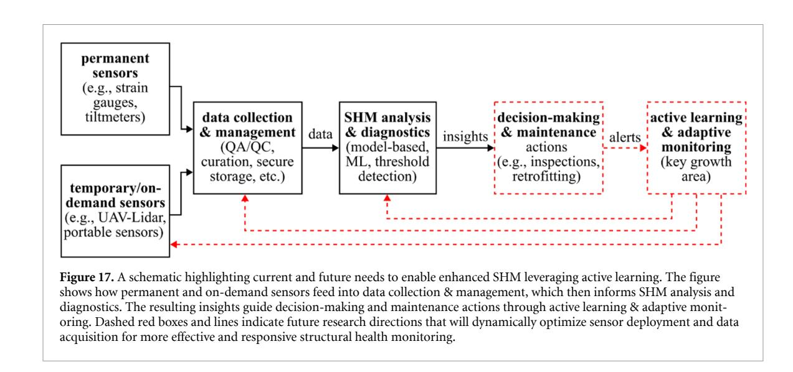

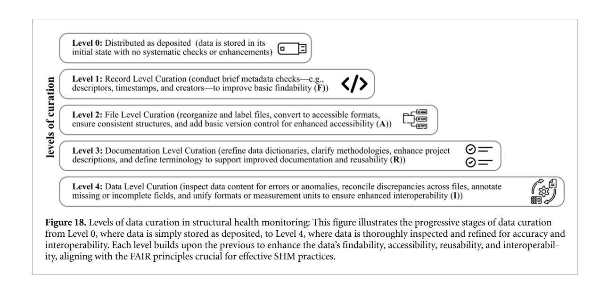

and system scalability. Addressing these issues is critical to enhancing the reliability and efficacy of SHM practices:

- **Sensor network complexity and cost:** The expanding scope of structures and diversity in sensor technologies make it daunting to find the right balance between permanent and temporary instrumentation. Budget constraints, variable sensor lifespans, and the logistics of deploying and maintaining short-term campaigns add layers of complexity. The higher cost of the sensor and limited data loggers restricts the large scale adaptability of the SHM to many agencies.
- **Data quality and standardization:** Noise, incomplete readings, and inconsistent metadata frequently obstruct effective SHM. Ensuring consistent data formats and adopting standardized naming conventions are crucial but often overlooked, impeding data sharing and long-term analyses. Currently, the civil infrastructure is managed in a segregated way within the sub-discipline which limits the adaptation of the standardized data format across the disciplines.
- **Big data and scalability issues:** The volume of high-frequency or multimodal measurements (e.g. strain, temperature, vibration, imagery) can overwhelm storage systems and data pipelines. Infrastructure capable of processing and archiving terabytes of sensor data without losing fidelity or timeliness is required.
- **Interoperability and integration:** Successful SHM often integrates data from multiple sources—ranging from numerical simulations to inspection logs and environmental records. Harmonizing these diverse datasets demands careful documentation-level curation and, ideally, common or mappable ontologies for improved search and retrieval.

{46}------------------------------------------------

- **Security and governance:** In mission-critical settings like bridges and dams, data breaches or compromised readings can undermine public safety and erode trust. Developing clear protocols around data ownership, user access permissions, and cyber-physical security is an evolving area of concern.
- **Active learning and adaptive monitoring:** While short-term sensor campaigns offer flexible and targeted insights, deciding where, when, and how to deploy these sensors requires advanced algorithms. Identifying the hotspots within the Civil Infrastructure is also a big unknowns as it requires period inspections and monitoring of the assets. Active learning frameworks are crucial for this dynamic sensor placement but require expert oversight to avoid false positives or missed damage states.

### **Advances in science and technology to meet challenges**

Addressing the outlined challenges of data collection and management in SHM for civil infrastructure requires leveraging cutting-edge scientific and technological advancements. These innovations not only enhance the efficiency and effectiveness of monitoring systems but also ensure the reliability and scalability necessary for large-scale infrastructure projects:

- **Active learning for optimized sensor deployment:** Active learning algorithms streamline sensor placement by iteratively analyzing data to pinpoint areas of highest informational value, enabling dynamic adjustments to sensor networks. This strategic deployment significantly enhances monitoring precision and responsiveness.
- **Enhanced data fusion techniques:** Integrating data from permanent sensors, temporary deployments, and external sources such as weather models and traffic data through advanced data fusion techniques provides a comprehensive view of structural health. Methods like Bayesian fusion and ML-based integration improve the accuracy of assessments and facilitate proactive maintenance.
- **Next-generation sensor technologies:** Innovations in sensor technology, including wireless networks and smart sensors with onboard processing capabilities, minimize maintenance needs and data transmission overhead. Multimodal sensors capture various data types simultaneously, enriching the dataset and providing more thorough monitoring.
- **DT integration:** Integrating DTs with SHM systems revolutionizes infrastructure monitoring by updating DTs in real time with sensor data. This allows for sophisticated simulations and predictive analyses, preempting potential structural issues and improving decision-making processes.
- **AI-driven data curation and quality control:** AI plays a pivotal role in automating data curation and quality control, streamlining the cleaning, annotation, and organization of sensor data. This efficiency boosts metadata management through NLP, enhancing data accessibility and usability.
- **Scalable cloud and edge computing solutions:** Advances in cloud and edge computing technologies enhance the scalability of SHM systems. Cloud platforms manage extensive datasets, while edge computing reduces latency by processing data closer to its source, supporting efficient real-time data analysis and dynamic modeling across growing infrastructure networks. Moreover, the application of the LLM in the cloud system can automate the warning process and reporting.
- **Standardization and interoperability frameworks:** Establishing standardized protocols and interoperability frameworks is essential for the effective integration of various data sources and technologies within SHM. These frameworks facilitate data sharing and collaboration, enhancing the collective ability to monitor and maintain civil infrastructure effectively.

### **Concluding remarks**

Quality data collection and management are cornerstones of a successful SHM strategy, determining not only how effectively infrastructure is monitored but also how well stakeholders can adapt to emerging threats or changes in structural health. By combining permanent sensor networks with well-planned temporary instrumentation campaigns, infrastructure managers gain both long-term trend data and high-fidelity snapshots of critical events. Continued advances—such as active learning for sensor placement, standardized curation protocols, and integrative DT ecosystems—promise to make SHM more responsive, efficient, and impactful. As these technologies mature and best practices become more defined, SHM practitioners will be better equipped to safeguard and optimize critical civil infrastructure for the long run.

# **Acknowledgments**

This work is supported by the National Science Foundation Grant Nos. 2152896, 2237696, and 2046054. Any opinions, findings, conclusions, or recommendations expressed in this material are those of the authors and do not necessarily reflect the views of the National Science Foundation.

{47}------------------------------------------------

# **15. Incorporating physics into machine learning for structural health monitoring**

*Chao Hu*1 *and Zhen Hu*2

1 School of Mechanical, Aerospace, and Manufacturing Engineering, University of Connecticut, Storrs, CT, United States of America

2Department of Industrial and Manufacturing Systems Engineering, University of Michigan-Dearborn, Dearborn, MI, United States of America

#### **Status**

In the past decade, ML algorithms have been increasingly adopted to solve various SHM problems for engineering structures [191]. These adoptions have been summarized in recent review articles focusing on damage detection [10, 192], damage localization and quantification [192], and damage prognostics [193]. These advancements have been largely driven by (1) the rapid growth of ML algorithms in everyone's toolbox, (2) the fast increase of computational power both in the cloud and on the edge, (3) the proliferation of large-scale datasets from computer simulations, physical experiments, and field monitoring (e.g. using increasingly affordable IoT devices [194]).

Data-driven ML models excel in learning complex patterns within measurement data, especially when large quantities of high quality, labeled data are available. Data availability makes ML models advantageous over physics-based models in cases where the underlying physical laws or principles are poorly understood or difficult to model [195]. However, purely data-driven models have three limitations.

- *First*, ML models function as black boxes that lack physical explainability. While these models can produce predictions based on input data, they typically cannot provide end users with physically meaningful explanations of why these predictions are made. Visualization techniques such as gradient-weighted class activation mapping (Grad-CAM) [196] offer insights into sample-wise feature importance [197]. Yet, it is very difficult to derive physically meaningful explanations backing ML model predictions.
- A *second* issue associated with building ML models for SHM is a lack of access to large, labeled datasets with diverse faulty samples. This data scarcity constrains model performance to narrow usage and health conditions, as ML models often struggle to generalize beyond the distribution of their training data. The lack of extensive labeled datasets is a well-documented challenge across various application systems of prognostics and health management (PHM) [198].
- *Lastly*, unlike physics-based models, ML models do not inherently enforce physical laws or principles, which can lead to physically unrealistic predictions. Due to their lack of physical constraints and extrapolation capability, ML models—especially DL models—could fail ungracefully, producing predictions that are not physically meaningful without a warning sign [199].

As shown in figure 19, PIML for SHM has emerged as a promising paradigm to address the above limitations of purely data-driven ML models while retaining the ability to leverage data to reduce discrepancies and computational demands associated with physics-based models. In SHM, PIML integrates physical knowledge into ML models in several forms:

- (1) PINNs—embedding (soft) physical constraints into the loss functions of neural networks, often using governing equations (e.g. partial differential equations (PDEs)) as penalty terms [115, 200, 201]. Note that PINNs have been further classified into different categories in the literature [202]. In one such classification, the approach of enforcing physical constraints during training is referred to as physics-constrained neural networks (PCNNs). This distinguishes it from PINNs, where the neural network is used as a solver for PDEs. Here, we use the term PINNs to refer broadly to neural networks that incorporate physics into the loss function.
- (2) Data augmentation—running physics-based models to generate synthetic data that augments experimental training sets [203].
- (3) Delta learning (residual learning)—training ML models to correct residual errors of physics-based models [204, 205].
- (4) Physics-informed signal processing—incorporating physics-informed feature extraction layers (e.g. wavelet transforms and frequency-domain feature weighting) at the initial stages of neural networks, preceding data-driven feature extraction layers [206, 207].
- (5) Input learning—using ML models to predict unmeasurable (latent) inputs or parameters of physics-based models [208].

{48}------------------------------------------------

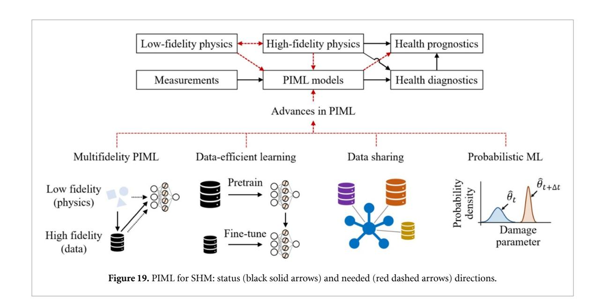

- (6) Physics learning—using ML models to fill in missing physics within physics-based models (see the effort of embedding an ML model inside a state-space model in [202, 204, 209]).
- (7) Architectural design—embedding governing equations directly into the network architecture as physics-based layers [208].

# **Current and future challenges**

While PIML has demonstrated the potential to improve generalization and reduce data requirements, its applications have largely been confined to academic studies. Several challenges still hinder the widespread adoption of PIML. Due to these challenges, many PIML methods in SHM may remain within the research community and face significant barriers to real-world deployment.

- (1) *Imperfect physics*—physics-based models used in SHM often rely on simplifications such as linear elasticity or idealized boundary conditions. These assumptions may not hold in real-world structures subjected to complex loading and environmental conditions. Such models can introduce bias or lead to inaccurate predictions if they are naively integrated into ML frameworks. The challenge lies in developing *multifidelity PIML frameworks* that can incorporate low-fidelity physics while accounting for or even learning to correct deviations from real-world observations.
- (2) *Limited labeled data and sparse failure cases*—as mentioned earlier, a long-standing challenge in SHM is the limited availability of labeled training data. Structural failures are rare, meaning there is often an imbalance in datasets, with substantially more examples of 'healthy' structures than those that are faulty or approaching failure. Standard ML methods struggle in such small-data regimes, particularly when generalizing across various operational and environmental conditions.
- (3) *Generalization across structures and domains*—a key barrier in SHM, and PHM in general, is the need for models that generalize across structural types, operational conditions, and environmental variations. A model trained on data from one bridge or aircraft should ideally be transferable to a population of similar but different bridges or aircraft without requiring extensive retraining. This is commonly referred to as PBSHM [210]. However, the reality is that standard ML pipelines lack this generalization capability and require retraining for each new structure.
- (4) *UQ*—for health diagnostics and prognostics systems to be useful in practice, they must quantify uncertainty in each prediction and communicate this uncertainty as a measure of model confidence to end users. Many ML models generate deterministic outputs, which can be misleading when dealing with incomplete, noisy, or out-of-distribution data. Without proper UQ, decision-makers may place excessive confidence in unreliable predictions. Therefore, it is essential to quantify predictive uncertainty on a per-sample basis [198], enabling risk-based decision making and improving trustworthiness.

{49}------------------------------------------------

- (1) *Multifidelity PIML frameworks*—as discussed earlier, a practical difficulty in PIML lies in dealing with imperfect physics, which initially motivated the rise of ML. One way to mitigate this difficulty is by developing *multifidelity* PIML frameworks that integrate low-fidelity physics-based models while either strategically choosing where to apply them or learning corrections from real-world data. Multifidelity modeling has been studied for some time [211], and its synergies with PIML present promising opportunities to extend physics-data fusion to cases where the governing physics is incomplete or inaccurate.
- (2) *Data-efficient learning, synthetic data generation, and open data sharing*—data scarcity in SHM can be addressed in several ways. *First*, one can explore using data-efficient learning techniques such as few-shot, transfer, and self-supervised learning (SSL). The choice of technique depends on data sources, quantities, and labeling quality. *Second*, one can utilize physics-based simulations or generative models (e.g. GANs) to create synthetic faulty or run-to-failure data, augmenting scarce experimental datasets. A critical step is ensuring that synthetically generated failure data realistically capture degradation patterns and sensor measurements in practice. One approach, in the case of GAN-based data generation, is to embed known physical constraints into the GAN to promote plausible behavior, thereby creating a physics-informed GAN [212]. Other solutions include (1) benchmarking synthetic data against field or laboratory measurements through statistical analyses,
  - (2) testing ML models trained with such augmented datasets on small but independently collected experimental datasets to evaluate performance gains, and (3) engaging domain experts to identify and flag artifacts that are not physically meaningful. *Third*, the SHM community should promote coordinated data-sharing efforts, e.g. by forming focused working groups [213].
- (3) *Transfer learning and DA*—the ML community has spent tremendous effort developing learning techniques to improve model generalization. Three well-known techniques are transfer learning, DA, and meta-learning, all of which can be adopted to improve generalization across structures and domains. These techniques allow models trained on one structure (e.g. a specific bridge or aircraft) to adapt to new structures with minimal retraining. For example, DA ensures that models learn invariant feature representations across varying operational and environmental conditions and thus generalize better [214].
- (4) *Probabilistic ML and UQ*—advances in probabilistic ML, such as Bayesian DL, ensemble methods, and evidential learning, address the need for UQ in ML [198]. These techniques enable ML models to express confidence in their predictions, allowing for risk-aware maintenance/control actions. They quantify predictive uncertainty on a per-sample basis, ensuring that decision makers clearly understand model confidence before acting on predictions.

### **Concluding remarks**

The future of SHM lies in the seamless integration of physics-based insights with ML advancements. While traditional PIML methods struggle with incomplete physics, limited data, and poor generalization, new approaches are emerging to bridge these gaps. By making ML models more data-efficient and physics-aware, we can create health management systems that are not only smarter but also more trustworthy and scalable. For these PIML techniques to make a real-world impact, they need to work not just in controlled lab environments but across diverse structures and conditions. Real-world verification requirements means models can learn from one bridge or aircraft and still perform well on another, produce reliable long-term forecasting of damage progression, and convey confidence in making each prediction to decision makers. The goal is not just to make structures smarter by being able to predict to ensure that every prediction is grounded in physics, backed by an explanation, accompanied by a confidence measure, and trusted in high-stakes maintenance/control decisions.

{50}------------------------------------------------

# **16. Physics-enhanced machine learning for twinning and structural health monitoring**

*Alice Cicirello*1 *, Elizabeth Cross*2 *and Eleni Chatzi*3

1University of Cambridge, Cambridge, United Kingdom

2University of Sheffield, Sheffield, United Kingdom

3ETH Zurich, Zurich, Switzerland

E-mail: ac685@cam.ac.uk, e.j.cross@sheffield.ac.uk and echatzi@ethz.ch

#### **Status**

Digital twinning and SHM have emerged as critical tools for guiding high-consequence decision making on complex engineering systems and critical infrastructure by understanding and predicting their behavior in operation [202, 215–220]. These tools require the integration of information that is typically extracted from **real-world data, physics-based models** and **domain and expert knowledge**. This reflects a nontrivial task owing to the challenges associated with the nature and fidelity of the data and models at hand. Real-world data is often expensive to acquire and difficult to measure, small in volume, heterogeneous, gappy, noisy, multimodal—in the form of images, time series, lab test measurements, historical data, inspection documents—and multi-fidelity, with different spatial and temporal resolutions, quality and noise. On the other hand, physics-based models come in various flavors of complexity and associated uncertainty, e.g. multi-fidelity, multi-scale, high-dimensional, coupled, deterministic or stochastic models, often compromised by errors [218, 221]. The fusion of data, physics and domain knowledge within a common learning framework offers new opportunities to enhance predictive accuracy (including UQ), model adaptability, and computational efficiency, while enabling closed-loop digital twin workflows that couple monitoring, model updating, and decision-making (figure 20). While purely data-driven methods excel at identifying patterns in large datasets, they often struggle with generalization beyond observed conditions. Conversely, physics-based models provide interpretable and theoretically grounded insights but can be computationally demanding and sensitive to modeling assumptions [202, 218, 219].

Physics-enhanced ML (PEML) (also referred to as hybrid, grey-box modeling or scientific ML [218]) bridges this gap by embedding **data, physics, domain and expert knowledge into ML frameworks**, constraining the space of admissible solutions and therefore enabling robust and interpretable models even with limited data. These hybrid approaches can allow for real-time model updating, improved forecasting, and the ability to infer system behavior in the presence of sparse or noisy measurements. Multiple hybrid approaches have been developed (see [202, 218, 219] for an overview), with their construction depending on the available information (physics and domain knowledge on the dynamical system vs informative data), engineering task (e.g. accelerating solvers, identification of unknown physics/terms of a model, or development of a time-evolving DT model based on a two-way interaction between the physical system and the digital counterpart, that can account for uncertainty, nonlinearity, different systems interactions, and it is used for policy and decision making) [216–218, 222–224], and complexity of the system/problem (e.g. real-world systems that cannot be approximated as Linear Time Invariant systems, but need to be modeled as nonlinear time-varying systems [225]).

The idea of assimilation of data, physics and knowledge has long existed within the context of System Identification and SHM, as it forms a main aim of the so called model updating and parameter identification tasks [221, 226]. The earliest works that harnessed learning from both physics and data in a hybrid construct starting explicitly from a data-driven model to improve generalization, were probably those that considered bias correction [227], that were later extended in [86]. More recently in [202, 218, 219] the biases have been considered in a broader context and in application to dynamical systems. Here a machine learner accounts for unmodeled physics, or corrects incorrectly modeled physics. The bias correction idea lives on in many applications of PEML today [202, 218, 219, 228] and will continue to be pervasive as a pragmatic means of fusing model types of many forms.

Another notable step in bringing the physical and ML worlds together comes from equation and solution discovery [220, 229, 230], where the constituents of governing equations (depicting either the problem statement or its solution) are learned through a (sparse) regression problem. In any situation

{51}------------------------------------------------

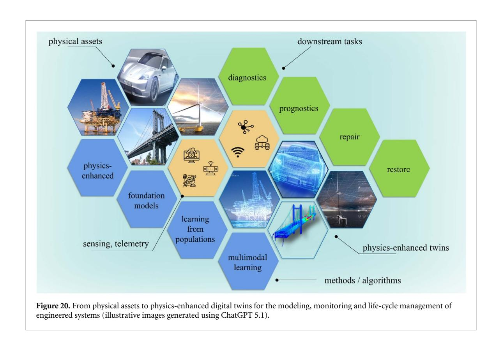

where parsimony and interpretability are a priority, these methods will continue to play an important role. In both of these approaches, the physics-based model forms the foundation of the predictive machine. Many newer methods, however, focus on a data-driven foundation, particularly in order to benefit from the great advances the field of ML has seen in the last few years. Here, typically, physical insights can be incorporated into the learner, either explicitly within the ML architecture or more loosely within the loss [202]; PINNs [86] form a primary such instance.

# **Current and future challenges**

It is an exciting time to be a researcher with interests in both engineering and ML, and there is now a wealth of methodologies available for considering learning and models from both sides (see also [202, 216–223, 225, 229, 230]). Despite its promise, the full potential of PEML for Digital Twinning and SHM remains hindered by several challenges:

- **Data, physics and knowledge fusion:** Effectively integrating data, physics, domain and expert knowledge into ML frameworks requires strategies that balance fidelity, UQ, and computational feasibility for a specific engineering task. Here, access to data and models of the system is important, but often hard to impose due to proprietary rights (e.g. transport and energy infrastructure) and decentralized operations. It is, thus, important to foster an open attitude to data and knowledge exchange and to ensure the existence of benchmarks that can serve for corroborating the efficacy of developed tools. Equally, the integration of data, physics, domain and expert knowledge into ML should enhance, rather than obscure, model transparency, fostering trust among engineers and decision-makers. This requires the automatic identification and correction of errors in the data (e.g. caused by sensor failures [218]), physics and knowledge biases and/or in the chosen PEML model architecture.
- **Ensuring sufficient training data for robust model performance:** The reliability of predictive models depends on both the underlying knowledge and the availability of diverse observations (simulated and/or field data) for training. A well-trained model must have encountered a sufficiently broad spectrum of inputs reflecting real-world conditions, including environmental and operational variations, system degradation, maintenance activities, manufacturing variability, and sensor drift. If training data fail to capture these complexities, different PEML algorithms may exhibit similar performance on training data but struggle to generalize to unseen conditions, impacting their real-world reliability.

{52}------------------------------------------------

- **Computational bottlenecks:** Scalable solutions for complex problems. The implementation of high-fidelity time-evolving DT models that can account for uncertainty, nonlinearity, and different systems interactions remains a limiting factor, necessitating the development of reduced-order models, surrogate approaches, and adaptive learning techniques. Moreover, there is the need to develop strategies for high-precision learning from small informative datasets and/or large, heterogeneous, and (spatially or temporally) correlated data.
- **Cross-domain generalization:** Many models are tailored to specific engineering structures or datasets, limiting their ability to generalize across different engineering systems without significant changes in the architecture.

#### **Advances in science and technology to meet challenges**

The number of PEML models and approaches available are rapidly increasing and many in the vein of those discussed in the history to current day section above. As we look to the future, a number of emerging advances look very promising for the field:

- **Physics enhanced foundation models:** Directly of benefit to the cross-domain generalization challenge, physics-Enhanced Foundation Models (PEFMs) are models that can be pre-trained on large-scale multimodal structural datasets and then fine-tuned for specific monitoring tasks using limited field data. Inspired by recent advances in LLMs, such constructs can further be adopted within the SHM context, by incorporating physics-informed loss functions, contrastive embeddings, and structure-aware tokenization, to learn universal representations of structural behavior across diverse loading and environmental conditions. Such models hold potential for zero-shot or few-shot adaptation, enabling rapid deployment in unseen scenarios with minimal retraining, also offering routes for ameliorating computational bottlenecks, addressed more directly in the next paragraph.
- • **Real time adaptation tools:** Since a main challenge stems from operation of physical assets under varying loads and environments, adaptive, and—when relevant—real-time learning frameworks that can identify new measurements/tests to obtain new informative data and that can continuously update models in response to new data are required. Key in this respect is the development of physics based models that are fast to compute; a task taken on by reduced order modeling schemes. Once such fast computing constructs are available, Active Learning techniques identify the most informative data points for efficient model retraining, reducing the need for extensive labeled datasets. Meanwhile, RL enables adaptive decision-making in damage detection, sensor placement, and control strategies, allowing SHM systems to dynamically adjust to evolving structural conditions. These self-improving, closed-loop approaches are crucial for real-time structural assessment, anomaly detection, and maintenance planning, particularly in environments with high uncertainty and non-stationary dynamics.
- **Multimodal learning approaches:** Integrating diverse data sources—such as structural response, load/environment data, inspection data and visual imagery (challenge one above)—enhances the robustness of SHM models by capturing complementary information from multiple sensing modalities [231]. Multimodal fusion techniques, including attention-based architectures and contrastive learning, enable the extraction of shared and modality-specific features, improving damage detection and structural assessment. Recent advances in physics-informed multimodal models and SSL have further improved generalization, reducing reliance on large labeled datasets while ensuring physically consistent predictions.
- **Learning from fleets/populations:** Harnessing data from multiple structures (e.g. bridges, wind turbines, aircrafts) to improve SHM models through population-based learning have significant potential in reducing the burden of data access (challenge two) [210]. By leveraging fleet-wide statistical patterns and shared latent representations, models can adapt across structures with varying operational and environmental conditions. Approaches relying on suitable representations, such as *Graph Neural Networks* [232], facilitate knowledge transfer between structures, enabling more scalable and data-efficient SHM methodologies.

# **Concluding remarks**

PEML bridges the gap between purely data-driven and physics-based approaches, enabling robust and interpretable models even with limited data. By embedding physics-based constraints or knowledge into data-driven (ML) frameworks, we have the opportunity to both reduce the burden on expensive data collection, and enhance our ability to make predictions in difficult to measure circumstances. In this whistle stop tour, we have attempted to trace the evolution of PEML from early bias correction

{53}------------------------------------------------

techniques and equation discovery to the now ubiquitous PINNs, while acknowledging the outstanding challenges for our field which include access to models and data from across a structures' operational envelope, adaptability during operation/lifetime, and how adaptable/applicable these new methods are across multiple domains.

# **Acknowledgments**

We used *chatgpt* to amalgamate the main messages of the three cited papers [215–217] written by the authors, and proceeded to thoroughly rewrite the original version with original content.

{54}------------------------------------------------

# **17. Towards AI-driven condition monitoring in power systems: bridging data and physics for intelligent diagnostics**

Yang Weng and Jingyi YuanArizona State University, Tempe, AZ, United States of AmericaE-mail: Yang.Weng@asu.edu

#### **Status**

SHM in power systems enables automated asset health assessment through multi-source measurements, facilitating fault/failure diagnostics and predictive maintenance. Traditional SHM relies on periodic inspections and threshold-based alarms, limiting its ability to detect incipient failures. Data-driven SHM improves this process by integrating ML with sensor networks to enable real-time fault detection, degradation analysis, and maintenance optimization.

Power system assets experience dynamic electrical, thermal, and mechanical stresses, requiring AI models to process diverse monitoring data, including partial discharge signals, vibration analysis, infrared imaging, and dissolved gas analysis. AI has been applied to transformers for detecting insulation aging, winding deformation, and overheating, to circuit breakers for anomaly detection in coil currents and contact resistance, and to underground cables for fault localization using data and analytics of Supervisory Control and Data Acquisition (SCADA) [233, 234]. Renewable energy systems also benefit from AI-based SCADA analytics for turbine and photovoltaic fault detection [235, 236].

AI methodologies in SHM include supervised learning models such as decision trees and SVMs for fault classification, unsupervised approaches like one-class SVMs for anomaly detection, and DL for time-series fault pattern recognition [237–239]. Hybrid AI-physics models enhance prediction reliability by incorporating electromechanical and thermal degradation principles into AI-driven diagnostics [240].

Despite advancements, AI-driven SHM faces challenges, including a lack of standardized frameworks for integrating multi-modal data, the complexity of fault localization in interconnected grid components, and model generalization issues due to limited labeled failure datasets [241, 242]. As AI adoption in SHM grows, addressing these challenges through physics-informed learning, real-time deployment, and XAI will be key to achieving widespread implementation.

### **Current and future challenges**

Despite advancements, several challenges (figure 21) hinder AI-driven SHM deployment in power systems. These challenges stem from the need for AI models to integrate multi-source data, localize faults in interconnected grids, and ensure reliable real-time operation.

- Multi-source data integration: SHM data from electrical, mechanical, thermal, and chemical indicators lacks a unified AI framework for effective fusion.
- Fault localization in interconnected systems: grid failures propagate dynamically, making root cause identification and predictive diagnostics difficult.
- Data limitations and quality: sparse sensor coverage and inconsistencies across SCADA, PMUs, and IoT systems introduce noise and missing data.
- Computational scalability: AI models require significant resources for real-time deployment in legacy grid infrastructure.
- Data imbalance and generalization: limited failure data challenges AI model adaptation across diverse assets and operating conditions.
- AI interpretability and trustworthiness: black-box AI models hinder adoption in mission-critical applications where explainability is essential.
- Hybrid AI-physics models: purely data-driven AI lacks alignment with physical constraints, requiring physics-informed learning.

Power system SHM requires AI models to process diverse sensor data while maintaining physical consistency. Unlike structured datasets in fields like CV, SHM data is fragmented across different assets, each requiring specialized processing techniques [243, 244]. Without a standardized approach, AI-driven diagnostics remain fragmented, limiting reliability and generalization.

Fault localization is particularly complex due to cascading failures and system-wide dependencies. Anomalies detected in one location may originate from upstream disturbances, making it difficult for AI

{55}------------------------------------------------

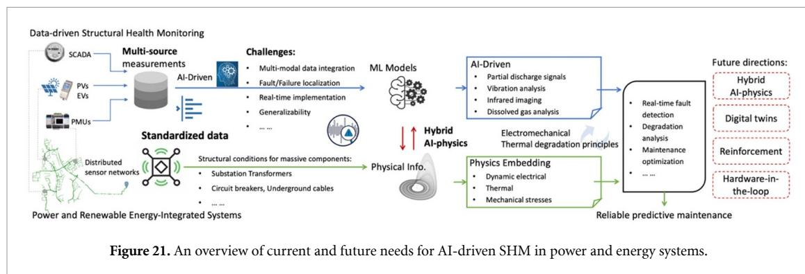

models to distinguish primary faults from secondary effects [241, 242]. Graph neural networks (GNNs) have been explored for this purpose, but real-time scalability remains a challenge [245].

Data availability remains a barrier, as many power grid assets lack dedicated sensors, leading to sparse datasets. SSL and synthetic data generation are being investigated to mitigate this issue, though further validation is required for deployment [246]. Additionally, real-time AI deployment must integrate with legacy SCADA systems, which were not originally designed for AI-driven analytics. Edge AI and federated learning offer potential solutions by decentralizing AI processing while improving scalability and security [244], but their adaptation for power system applications remains an ongoing challenge.

AI interpretability remains essential for trust in AI-driven SHM. Attention-based AI models and hybrid rule-based frameworks are improving explainability [245, 247], but further refinement is needed for practical deployment. Hybrid AI-physics models are also being explored to ensure AI forecasts align with power system constraints. PIML incorporates electromechanical degradation models to enhance reliability [239], but challenges in training efficiency and real-time inference persist.

Future advancements will require collaboration among power engineers, AI researchers, and industry stakeholders. Developing physics-informed learning, federated AI, and RL will make AI-driven SHM scalable, interpretable, and operationally viable for real-time power grid applications.

### **Advances in science and technology to meet challenges**

AI-driven SHM advancements begin to address challenges in multi-source data fusion, fault localization, and real-time deployment. Unlike traditional AI applications, SHM in power systems must handle diverse sensor inputs while ensuring accurate predictions remain aligned with physical system behavior.

PIML is making progress by embedding physical principles, such as electromechanical and thermal degradation, into AI models. Approaches such as PINNs have shown early success in transformer aging and cable diagnostics [239], while Bayesian methods are improving how uncertainty is quantified in failure progression [240]. These methods, however, still face challenges in efficiency and scalability for field deployment.

Recent work in multi-source data fusion is enabling AI models to integrate complementary monitoring signals, such as electrical discharges, thermal images, and vibration patterns. Transformer-based architectures originally used in language processing are being adapted for sensor fusion, and cross-asset learning approaches are beginning to reduce retraining needs across different equipment types.

Interpretability remains essential for trust in SHM applications. Attention-based AI and hybrid rulebased frameworks are helping link model outputs to engineering reasoning [247], though further development is needed to ensure operators can trace AI recommendations back to concrete asset conditions.

Specifically, fault/failure localization continues to be difficult because of the interconnected nature of power grids. Graph-based AI methods have improved the ability to trace failures across network topologies [245], but scalability to large and dynamic grid conditions remains a major obstacle. For deployment, edge computing and federated learning offer pathways to integrate AI into existing infrastructures. Edge AI allows localized processing at substations, while federated approaches support distributed training without centralizing sensitive data [244]. Both show potential for scalability and security, though practical efficiency and adaptability in field environments are still open challenges.

Looking ahead, AI-driven SHM is expected to move beyond isolated asset monitoring toward coordinated, system-level intelligence. Current learning methods can detect patterns in individual data streams, but they still fall short in capturing multi-scale dependencies, handling data scarcity, and providing actionable guidance for operators. To address these gaps, several directions are emerging.

{56}------------------------------------------------

Specifically, DTs offer a way to build hierarchical models that mirror asset and system behavior, allowing faults to be tested virtually before actions are taken in the field. Moreover, unlike approaches that rely only on passive data, RL provides a framework for adapting maintenance and inspection schedules under changing operating conditions, where decisions must balance cost, reliability, and risk. In addition, generative AI and LLMs may assist engineers by synthesizing heterogeneous monitoring data, linking alarms with historical cases, and grounding diagnostic recommendations in manuals and prior incidents. Finally, HIL validation will be critical for bridging algorithms and real deployment, ensuring that AI-driven recommendations are reviewed and adapted through expert oversight before operational decisions are executed [245]. Taken together, these directions point toward SHM that is not only predictive but also prescriptive, enabling power systems to anticipate failures, evaluate options, and support human operators with transparent, physics-aligned intelligence.

#### **Concluding remarks**

AI-driven SHM is reshaping power system maintenance by moving from corrective inspections toward predictive and prescriptive strategies. Key challenges remain, including fault propagation across interconnected assets, limited and uneven data availability, and the need for transparent model explanations. Addressing these issues will require scalable deployment strategies and advances in XAI, where physics-informed learning provides a pathway to predictions that remain consistent with system behavior. Emerging directions such as DTs, RL, and generative AI are now being developed to extend SHM from single-asset diagnostics toward coordinated, system-level decision support. Continued collaboration between power engineers, AI researchers, and industry stakeholders will be essential to ensure these approaches are interpretable, reliable, and fully embedded in grid operations.

{57}------------------------------------------------

# **18. Digital twins for learning interacting dynamic systems**

*Song Wen, Ligong Han and Dimitris Metaxas*

Rutgers University, New Brunswick, NJ, United States of America

E-mail: song.wen@rutgers.edu, hanligong@gmail.com and dnm@cs.rutgers.edu

#### **Status**

SHM plays an important role in data acquisition from physical infrastructures such as vehicles, aircraft, and civil structures. Recently, AI has emerged as a promising tool for modeling and analyzing interacting dynamical systems, enabling the construction of DTs that combine sensing, prediction, and control. Broadly, AI approaches include sequence models such as RNNs and Transformers for temporal dependencies, GNNs for modeling interactions among agents, physics-based neural networks that embed governing equations into the models, PINNs that learn how to solve equations, and generative models for capturing multimodal behaviors and uncertainty. The paradigm of dynamic data driven applications systems (DDDAS), provides adaptivity by continuously integrating sensor data into dynamically evolving computational models. Together, ML and DDDAS offer a pathway to SHM DTs which are data-driven and dynamically adaptive to changes in the data and the respective model.

An illustrative example of such an SHM DT is shown in figure 22, where the state of each dynamic agent is influenced by the states of other agents over time. This highlights a central challenge in current AI systems which are based on static data-based learning and are unable to account for large model changes: how to accurately model and analyze networks of dynamically interacting agents with complex, time-evolving behaviors (DT). ML provides the expressive capacity to learn nonlinear patterns from data, while a physics-based DDDAS paradigm ensures robustness by adapting the DT in real time as new measurements arrive. The synergy of these approaches (AI, physics and DDDAS) has the potential to form the foundation for next-generation SHM systems.

To construct a high-fidelity DT of real-world dynamic SHMs, it is essential to jointly model spatial and temporal agent interactions that are physics-based. Early data-driven methods such as Social LSTM [248] and Social GAN [249] captured social interactions through RNNs and adversarial training. More recently, Transformer-based models such as AgentFormer [250] have leveraged attention mechanisms to capture long- and short-term dependencies. These approaches demonstrate the power of AI in trajectory forecasting and interaction modeling. However, most current methods [250–256] remain limited by their lack of explicit physics, their difficulty in handling multimodal decisions, their sensitivity to out-of-distribution spatio-temproral agent interactions and their inability without expensive retraining to account for them. Addressing these limitations necessitates the need for integration of physics-based modeling with AI methods within a DDDAS framework.

#### **Current and future challenges**

Creating DTs of interacting non-stationary dynamic systems poses several overarching challenges for AI and SHM research:

**Multi-modal behavior.** In interacting dynamic systems, each agent often has multiple plausible choices for future actions. For instance, an agent may choose various directions to avoid collisions or follow different trajectories to reach its destination. This requirement of multimodal decisions complicates model optimization during training, as the objective function must account for several potential decisions simultaneously. As a result, the learned models tend to average over these possibilities, leading to reduced accuracy and often unrealistic predictions. Furthermore, models may overlook some reasonable options due to the diverse intentions and goals among agents, further reducing prediction reliability. Finally, the nature of the agent interactions and the individual agent dynamics may change dynamically.

**Interpretable trajectory.** Data-driven methods, such as RNNs and Transformers, which have achieved remarkable successes when the pattern of interactions is learned directly from data. However, they do not consider any underlying physics-based governing dynamics of agent motion and are unable to adapt to nonstationary data or changing agent models. As a result, such models can predict unrealistic trajectories with abrupt and erroneous velocity changes. Furthermore, these models also cannot generalize well

{58}------------------------------------------------

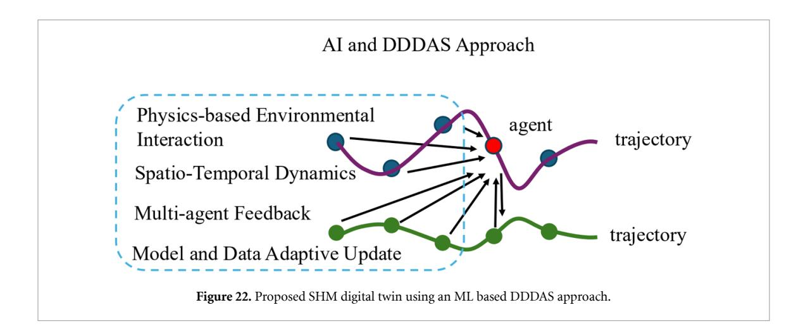

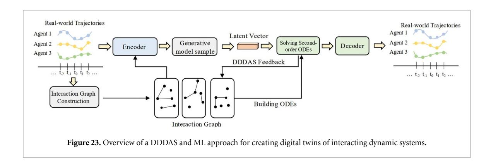

to unseen or rare scenarios, particularly those involving sudden or unexpected events not included in the training data. In these cases, their performance would be severely reduced.

**Complex interaction modeling.** Modeling in real-time and accurately the interaction dynamics among agents is inherently challenging because the nature of the relationships is highly non-linear, contextdependent, and dynamically evolving. Additionally, capturing such complex interactions will require their explicit modeling in a unified DDDAS framework using ML to enhance multi-agent, multi-goal modeling accuracy, including interactions. The essential factors include inter-agent distances, relative velocities, behavioral dynamics, and the ability to avoid obstacles while pursuing target objectives.

**Adaptivity and robustness.** Real-world SHM systems face nonstationary environments, sensor noise, and unexpected events. DDDAS provides online adaptation to enhance the robustness of AI models beyond their training distribution.

# **Advances in science and technology to meet challenges**

Several scientific and technological directions are being pursued to meet these challenges. The ML, physics, and DDDAS principle integration framework is shown in figure 23:

- (a) **Graph-based interaction modeling.** Graph representations allow encoding of inter-agent distances, velocities, goals, and behaviors, enabling accurate modeling of complex interaction structures [257, 258].
- (b) **Physics-based temporal dynamics.** Inspired by Newton's second law, introducing second-order ODEs yields physically consistent trajectories in which interactions modeled as forces drive acceleration [259].
- (c) **Generative modeling for multimodality.** VAEs and diffusion models learn the complete distribution of future trajectories, thus yielding diverse yet plausible predictions [259].
- (d) **Adaptive updating through DDDAS.** Updating the terms or parameters of the ODE upon arrival of new data allows the models to retain their accuracy under changing conditions without retraining [257].

{59}------------------------------------------------

These developments demonstrate the potential of integrating AI, physics, and DDDAS to further propel SHM DTs. While we have focused on trajectory modeling and adaptive learning, high-level decisionmaking and system-scale deployment will be other aspects of future developments. RL for decisionmaking under uncertainty and active control, scalable graph learning for large infrastructure network modeling, and UQ for reliability and safety in real-world applications are promising research directions.

### **Concluding remarks**

This roadmap presents the opportunities and challenges of AI-driven DTs for SHM and interacting dynamical systems. The other directions are multimodal prediction, improved interpretability from physics, complex interaction modeling, and robust adaptation under realistic scenarios. Combining AI methods, physics-inspired modeling, and adaptive feedback from DDDAS, we can create DTs which will be accurate, interpretable, and resilient. This approach has the potential to pave the way for intelligent next generation SHM systems.

# **Acknowledgments**

Research funded by FA9550-23-1-0417 research Grant to Metaxas.

{60}------------------------------------------------

# **19. Bayesian model inference for digital twinning and its applications to SHM**

*Eleonora Maria Tronci*2,3 *and Babak Moaveni*1

1Department of Civil and Environmental Engineering, Tufts University, Medford, MA, United States of America

2Department of Civil and Environmental Engineering, Northeastern University, Boston, MA, United States of America

3Current address: Department of Civil, Urban, and Environmental Engineering, Center for Urban Science + Progress, New York University

E-mail: emt377@nyu.edu

#### **Status**

DTs have emerged as a successful tool for SHM of dynamical systems [82, 260]. They create virtual representations of physical structures by integrating real-time sensor data with physics-based or data-driven models. However, data uncertainties and modeling assumptions related to material behavior, boundary conditions, and environmental influences often limit their predictive power. Bayesian inference can provide a probabilistic representation of a calibrated model or DT that accounts for different sources of uncertainty and variability [261]. A probabilistic DT provides confidence in model predictions by quantifying model parameter estimation uncertainty and modeling errors [262]. The ability to propagate uncertainty through model predictions is particularly valuable for large-scale and complex infrastructures where fluctuating environmental and operational conditions make using simplified deterministic linear models insufficient. More importantly, these methods elevate updated models from deterministic to adaptive, uncertainty-aware tools capable of real-time risk-informed maintenance planning and decision-making under uncertainty [263].

Bayesian inference for digital twinning in SHM includes diverse modeling approaches (figure 24), each addressing different aspects of UQ, model updating, and data assimilation. The selection of an appropriate Bayesian framework depends on the available data type, computational constraints, and the level of model fidelity required for real-time monitoring and decision-making. The following approaches define the current state of the art in Bayesian model updating or digital twinning for SHM.

*Batch vs. Recursive:* Batch and recursive approaches define how Bayesian inference is implemented for model, state, or input estimation. Batch methods [264] process all available data simultaneously, making them suitable for offline model calibration, structural assessments at discrete time intervals, and largescale model updating. However, they can be computationally intensive and lack real-time adaptability. On the other hand, recursive methods [265], such as Bayesian filtering, including Kalman-based filters and particle filters, update model parameters sequentially as new data arrives, enabling real-time adaptation of DTs. This evolving representation improves damage prognosis and predictive accuracy, making recursive methods ideal for structures under dynamic, time-varying loads.

*Input-output vs. output-only:* Bayesian inference applies to input–output and output-only models based on data availability. Input–output methods, incorporating measured external forces and structural responses, lead to high-fidelity system identification [266] but require well-characterized inputs like earthquakes, traffic, or wind. In many SHM applications, measuring inputs is impractical, making output-only models preferable. These infer structural parameters from response data, supporting operational vibration monitoring and unknown input estimation [267]. Bayesian inference integrates prior knowledge to refine parameter estimates for robust predictions, even with unknown inputs.

*Hierarchical vs. classical models:* Bayesian inference can be implemented using classical or hierarchical formulations, depending on how uncertainty is modeled across different levels of the system. Classical Bayesian models [267] assume a single layer of parameter uncertainty, where a single set of optimal model parameters exist, and the uncertainty is entirely associated with estimation. While compelling for smaller linear time-invariant systems with controlled test environments, classical models can struggle with complex structural behavior where uncertainties exist across multiple scales. Hierarchical Bayesian models [268] introduce additional levels of uncertainty, allowing models or DTs to incorporate variability across modeling parameters such as material properties, environmental conditions, and modeling

{61}------------------------------------------------

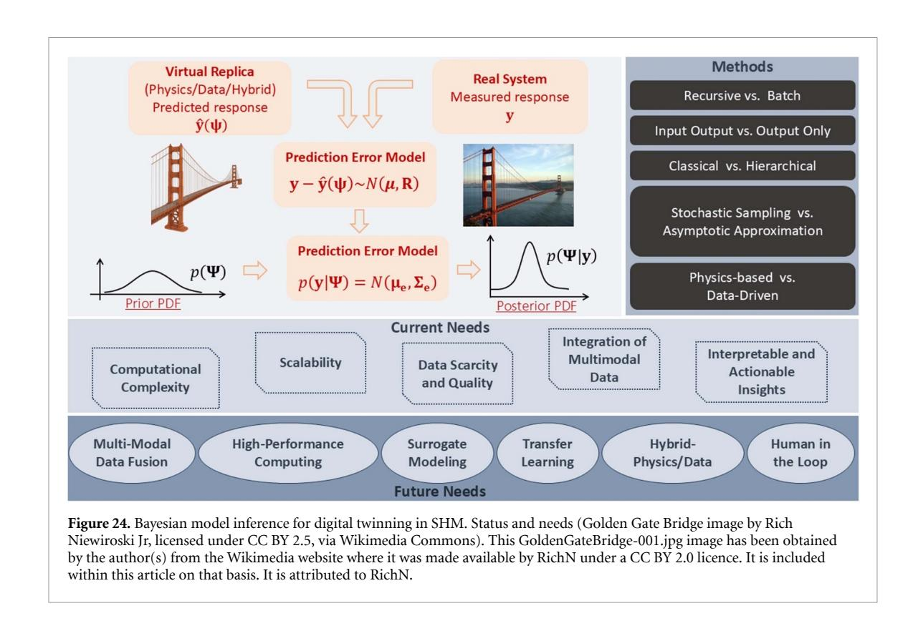

errors. A multi-level approach offers more flexible and realistic model updating, particularly in cases where uncertainty propagates from local to global structural behavior.

*Stochastic sampling vs. asymptotic approximation:* Bayesian inference relies on different computational strategies to approximate posterior distributions. Stochastic sampling methods, such as Markov Chain Monte Carlo (MCMC) [269], particle filters, or Gibbs sampling, provide accurate estimates and handle complex parameter dependencies but can be computationally demanding, limiting their use in large-scale or real-time applications. Asymptotic approximation techniques [270], like variational Bayesian inference and Laplace approximations, offer computationally efficient alternatives by approximating posterior distributions with simplified probability functions. These methods trade off some accuracy for speed, making them useful for complex and/or real-time DT updates. The choice between the two depends on the balance between computational feasibility and the level of precision required for SHM applications.

*Data-driven vs. physics-based models*: Bayesian inference in DTs can be performed on physics-based or data-driven models. Physics-based models, such as finite element models, use Bayesian inference to calibrate parameters with sensor data [265], offering interpretability but high computational costs and potential challenges with unmodeled dynamics. Data-driven models [271] rely on statistical and ML techniques to infer behavior directly from data, capturing complex patterns but requiring large datasets and lacking extrapolation capability.

### **Focus applications in SHM**

By continuously updating structural models through Bayesian inference, DTs become more adaptive to evolving conditions under changing environments and operations, delivering uncertainty-aware predictions for the core SHM objectives: from virtual sensing, input (force) estimation and reconstruction, damage identification, fatigue prognosis, and parameter identification (e.g. modal properties or soil–structure parameters). A key use is the estimation of structural properties such as stiffness, damping, and mass by fusing informative priors with real-time measurements. Unlike deterministic methods, Bayesian approaches capture uncertainties from model assumptions, environmental exposure, and operational variability, yielding more reliable structural representations [272]. Tracking parameter deviations over time refines probability distributions, enables early damage detection, and supports targeted maintenance—critical for preventing failures in safety-critical systems [273]. Degradation models

{62}------------------------------------------------

assimilated with streaming data improve remaining-useful-life forecasts and strengthen predictive maintenance and failure probability estimation. Finally, Bayesian inference is essential for input estimation [265] in systems where external forces like earthquakes, wind, or traffic cannot be directly measured, allowing force reconstruction from structural responses to enhance model fidelity [265]. Virtual sensing extends model prediction coverage by inferring unmeasured quantities, such as stresses and displacements, from sparse instrumentation [274]. These capabilities are now deployed on large structural systems, for example on long-span bridges to separate temperature and traffic effects from genuine stiffness loss while estimating cable forces and deck stresses [275]; in offshore wind farms to recover wind– wave loads, track stiffness/damping drifts, characterize soil properties, and forecast fatigue hot spots at turbine and farm scales [265, 274]; in buildings at high seismic zones to produce credible residualcapacity bounds for damage assessment [267]; in railway infrastructure to drive maintenance planning under quantified uncertainty [276]; and in dams and heritage masonry to translate sparse, noisy measurements into calibrated demands, degradation trajectories, and uncertainty-aware maintenance windows [277, 278].

#### **Current and future challenges**

Despite significant advancements, implementing Bayesian inference in model updating and digital twinning for SHM remains challenging. However, these challenges drive innovation, with emerging advancements offering more scalable, robust, and practical solutions.

*Computational complexity and scalability.* Bayesian inference is computationally intensive, especially for high-dimensional models and large-scale structures. While powerful, MCMC and variational inference techniques often struggle with real-time processing demands, particularly when integrated with DTs that require high-fidelity simulations. Computational scalability remains a bottleneck, limiting the ability to deploy Bayesian inference in continuously evolving DT environments.

*Data scarcity and quality.* Bayesian models require high-quality, labeled datasets for training and validation, but many SHM systems suffer from sparse, noisy, or incomplete sensor data. This limitation affects the generalizability of Bayesian inference, as models trained on specific structures may not transfer well to different conditions or structural types. The scarcity of domain-specific datasets further restricts the development of Bayesian DTs capable of capturing complex degradation patterns.

*Integration of multi-modal data.* SHM systems collect data from diverse sources, including strain sensors, accelerometers, LiDAR, thermal imaging, and satellite observations. Each data stream carries unique uncertainties, spatial and temporal resolutions, and noise characteristics, making their integration into a unified framework complex. Without proper fusion techniques, inconsistencies between datasets can introduce biases in model predictions and degrade the reliability of DT outputs.

*Interpretable and actionable insights.* While Bayesian models excel at quantifying uncertainty and providing probabilistic assessments, infrastructure operators and decision-makers require interpretable and actionable outputs. Probabilistic predictions—such as confidence intervals, posterior distributions, and risk estimates—are not always intuitive for engineers managing real-world structures. Translating Bayesian inference results into clear recommendations remains a major challenge.

# **Advances in science and technology to meet challenges**

Emerging advancements in Bayesian digital twinning are driving more efficient, scalable, and adaptive solutions while overcoming key limitations. Computational techniques, surrogate modeling, and parallelized algorithms accelerate Bayesian updating, enabling real-time DTs without sacrificing accuracy [263, 279]. Surrogate models reduce computational costs by approximating complex simulations, while parallel computing and high-performance cloud platforms enhance scalability for continuous monitoring and predictive analytics.

Synthetic data generation and transfer learning [277] help overcome data limitations by simulating diverse structural scenarios, including extreme loading and progressive damage. GANs enhance the realism of synthetic data, ensuring accurate structural representation. Transfer learning enables Bayesian models trained on limited or synthetic datasets to generalize across structures, improving adaptability while reducing reliance on labeled data. Hybrid approaches bridge physics and data gaps by integrating Bayesian inference with physics-based and data-driven models, combining interpretability with adaptability. When physical knowledge is incomplete, data-driven methods refine predictions, while Bayesian inference quantifies uncertainties.

{63}------------------------------------------------

Multi-modal data fusion [280] leverages probabilistic graphical models like Bayesian networks (BNs) to integrate heterogeneous data while preserving UQ. DL fusion, particularly with attention mechanisms, dynamically prioritizes sensor inputs, enhancing model robustness. These approaches enable Bayesian DTs to deliver more comprehensive and reliable structural assessments.

To improve interpretability and decision support, HIL systems and probabilistic reasoning interfaces present Bayesian model outputs intuitively [276]. Uncertainty-aware dashboards and probabilistic risk maps help operators explore maintenance strategies under varying uncertainty levels, ensuring Bayesianenhanced DTs support informed and effective decision-making.

#### **Concluding remarks**

Integrating Bayesian inference with DTs advances SHM by enabling real-time, probabilistic structural assessments while addressing uncertainties inherent in model predictions. Overcoming computational, data-driven, and integration challenges through high-performance computing, synthetic data generation, and multi-modal fusion will enhance the accuracy and scalability of these methods. Continued innovation in Bayesian methods and DTs will establish SHM as a predictive, scalable discipline, providing a robust framework for safeguarding critical infrastructure in the face of increasing complexity and uncertainty.

{64}------------------------------------------------

# **20. Digital model updating for AI-driven structural health monitoring**

*Qian Chen*1 *, Ming Shan Ng*2 *and Jurgen Hackl*3

1Department of Civil Engineering, School of Engineering, University of British Columbia, Kelowna, British Columbia, Canada

2Center for the Possible Futures, Kyoto Institute of Technology, Kyoto, Japan

3Department of Civil and Environmental Engineering, Princeton University, NJ, United States of America

E-mail: qian.chen@ubc.ca, ng@kit.ac.jp and hackl@princeton.edu

### **Status**

Digital parametric design methods and concepts such as building information modeling (BIM) have received increasing attention in infrastructure asset management, which provide stakeholders with improved data management and three-dimensional visualizations on structural performance to improve SHM [281, 282]. Current practices have shown that BIMs are widely used as a centralized digital platform to continuously integrate sensor data with asset designs and visualize structural conditions [283]. The dynamically enriched BIM reflects the up-to-date information on the state of the structure, and allows the AI algorithms to identify risk areas and predict potential failures [284, 285]. The status quo digital model updating methods in the context of SHM mainly include (1) middleware to translate diverse data formats into BIM-compatible platforms, (2) open data standards for uniform data exchange, and (3) automated Scan-to-BIM integration with sensor data. AI algorithms have been investigated in the meantime to ensure the updated BIMs seamlessly interpret sensor data, such as strain measurements, temperature fluctuations, and vibration to improve intervention decisions. These updates ensure that the BIM representation of assets remains accurate to describe the physical structure and provide a reliable basis for asset managers' decision making to enable proactive maintenance and interventions on infrastructure assets. Figure 25 shows three model updating approaches.

Models with updated infrastructure assets in BIMs for SHM can be conducted in a manual, semiautomated or fully-automated way, depending on the available computational resources and labor resources the agency or organization has.

- (1) *Manual model updating* involves human operators inputting data from SHM systems (e.g. survey geometry monitoring, non-destructive testing (NDT) systems), inspection reports, or as-built changes into the BIMs. This method is widely used in current practices but is labor-intensive and prone to errors, particularly for large or complex structures [281, 286]. For example, the bridge maintenance team updates geometry and condition states via multiple exchange of spreadsheets and pdf drawings collected from visual assessments, periodic surveys and reporting processes. While being effective for small-scale projects, manual updates are impractical for real-time SHM integration due to their slow pace and dependency on human intervention.
- (2) *Semi-automated model updating* methods integrate manual tasks with computational tools and sensor data integration to streamline model revisions. These tools include the use of laser scanning and photogrammetry to align as-built models with existing as-designed geometries in BIMs to highlight discrepancies. Human intervention is still required to interpret the differences between as-designed and as-built models. SHM sensors are also used together with the scanning tools [286] to feed data into BIM-compatible databases, which allow users to update specific model parameters such as load-bearing capacity or vibration frequencies of the structural components [281, 283]. Some asset management agencies have already used parameterized models in BIMs where predefined rules adjust elements automatically based on SHM data thresholds. For instance, excessive displacement may trigger a red-flag in beam connections (e.g. red color for critical status, yellow for caution status) so that the engineers are reminded of the recalibration of load factors. Semi-automated methods strike a balance between accuracy and efficiency but are potentially limited by their reliance on user oversight and predefined parameters.
- (3) *Fully automated updating* methods aim to reduce human intervention by directly integrating SHM data, advanced computational tools, and AI algorithms into the BIM platform (or environment). Sophisticated Scan-to-BIM [287, 288] software applications were developed to help asset managers and engineers not only update the geometries and structural properties but also train the collected SHM data in the AI algorithms to expedite workflows such as the recognition of damage patterns or structural inconsistencies. The SHM sensors continuously integrate data to BIMs, mostly through cloud-based systems. These systems then host the advanced learning algorithms (e.g. CNNs, RNNs,

{65}------------------------------------------------

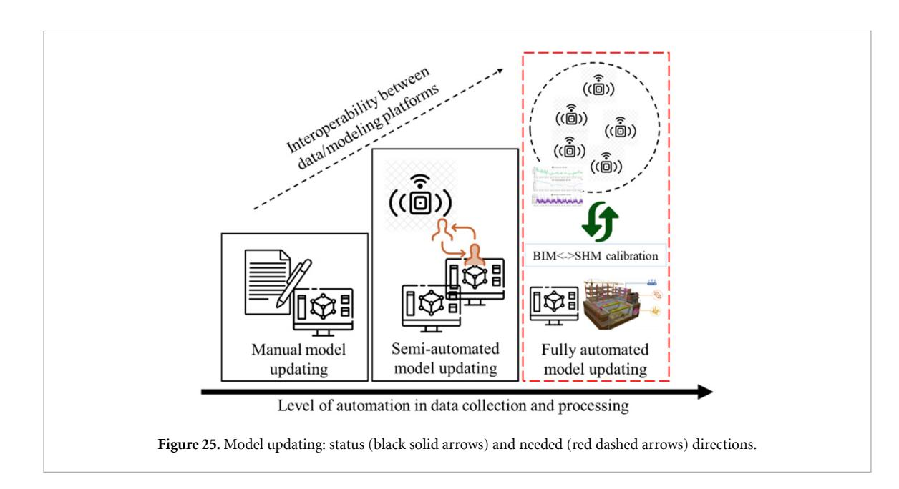

and RL to analyze historical and real-time data together to predict potential damage or failures. These insights are fed back into the BIMs to adjust structural properties like load limits, material conditions, or structural stability. Fully automated model updates represent cutting-edge solutions to integrating BIM and SHM. However, challenges such as interoperability among various software platforms [289], data standardization [290], and computational security and intensity still face challenges its widespread adoption in real-world cases.

### **Current and future challenges**

While a number of studies have focused on novel methods and processes to integrate BIM and SHM for automatic model updating, several challenges remain and new ones emerge as technologies evolve, including interoperability issues, cyber security issues, and the barriers to system adoption and scalability.

- *Incompatible data formats and lack of unified data standards:* The absence of standardized protocols for data exchange between BIM and SHM systems leads to inconsistencies and errors during data integration, which can prevent the development of cohesive models. Current standards such as ISO 19650 do not prescribe explicit integration mechanisms for sensor data integration with BIM. The use of proprietary data formats [289] by various SHM and BIM software vendors hinders interoperability.
- *Inaccurate and inefficient sensor data mapping to parametric elements in BIMs:* Accurately linking SHM sensor data to specific structural components in BIM requires precise mapping protocols. Differences and complexity in terminology and data semantics between SHM and BIM domains create barriers to automated and reliable data interpretation and mapping.
- *Data security issues and vulnerability of data infrastructure:* Most infrastructure assets monitored with BIM-SHM integrated systems are often part of critical national infrastructure. Cyberattacks on these systems could inject false readings or delay sensor data transmission for weeks to further undermine the reliability of BIMs updates. The lack of role-based access control in a, for example, cloud-based, BIM platform can lead to unauthorized modifications of model parameters (e.g. sensitive structural data).

# **Advances in science and technology to meet challenges**

Advancements to integrating BIM and SHM to support AI-driven decision-makings on assets can be visioned in the following pathways (figure 26), including new data and computational methods, to help engineers reduce manual data handling effort and potential errors in managing assets.

- • *Ontology-based interoperability solutions:* Building topology ontology (BOT) is a lightweight and standardized semantic framework (and graph databases) to represent the spatial, structural, and functional relationships of structural components [291]. For example, the strain gauge monitoring a column can

{66}------------------------------------------------

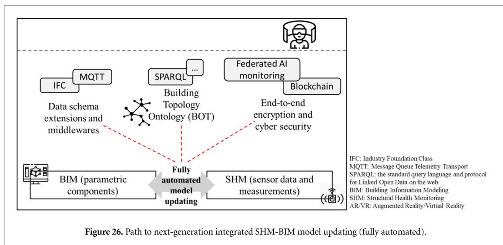

**Figure 26.** Path to next-generation integrated SHM-BIM model updating (fully automated).

be semantically linked to that column in BIM through its BOT identifier showing engineers to obtain the real-time updates of the column's condition in a virtual interface. Queries using SPARQL protocol [291] can help engineers retrieve at-risk areas for structural inspection via the ontology to prioritize maintenance schedules. After sensors are active in use, the datasets of labeled sensor-to-component mappings can be created and trained in GNNs, so that as new SHM sensor data streams in, the BIM automatically updates SHM info for the corresponding BIM element by using the learned patterns where GNN functions as a surrogate model to translate SHM data into accurately calibrated condition states of the structural elements. The trained semantic context also allows BIM to propagate alerts to related elements (e.g. beams supported by a stressed column).

- • *Data schema extensions and middleware (API) applications to translate and link multi-domain data:* Extensions to the prevalent data schemas such as Industry Foundation Classes (IFCs) schema [290] and middleware (data translation) applications can be developed for existing BIM software to include SHM-specific attributes (e.g. IfcSensorData to store device details and data streams). AI-augmented middleware can be developed to classify and translate multi-domain SHM sensor data into BIM-compatible formats and then pass them into visual overlays for AR/VR applications to support engineers' immersive monitoring experience. MQTT (Message Queuing Telemetry Transport) is considered as an emerging messaging protocol to publish sensor data to a central server and deliver it to AI models.
- *Cybersecurity measures:* Robust cybersecurity would be focused on end-to-end encryption to protect data during transmission and role-based access controls to prevent unauthorized modifications. Federated learning for distributed monitoring allows multiple structures to participate in a distributed learning framework without sharing their raw data, which substantially improves the privacy and scalability of the SHM tasks. For example, emerging structural weaknesses of one specific structure are detected by learning from patterns observed across many structures. Generative spatiotemporal AI models can be used in federated learning models to simulate structural behavior and forecast maintenance. Another safe way is the use of blockchain [292]. For example, each BIM-SHM model update references a transaction ID on the blockchain to maintain traceability.

Collectively, these technological advancements, particularly the development and application of inter-operability, will help overcome existing barriers and pave the way for scalable, efficient, and secured integration of BIM and SHM systems for automatic model updates in infrastructure asset management.

# **Concluding remarks**

The integration of BIM and SHM systems offers improved data accessibility, visualization, and decision making capabilities in infrastructure asset management. Current methods, from manual to fully automated model updating, demonstrate the potential of dynamically enriched BIMs to provide up-to-date structural insights and support proactive maintenance strategies. However, challenges such as interoperability, data standardization, and cybersecurity highlight the complexity of achieving seamless

{67}------------------------------------------------

integration. Advances in science and technology, including ontology-based solutions, data schema extensions, and federated learning of distributed systems, will possibly address these challenges by enhancing data mapping, automating workflows, and securing data transmission. As these technological innovations mature, they not only bridge existing computational efficiency gaps but also set the basis for scalable, reliable, and secure integration of BIM and SHM systems. The future of AI-driven SHM lies in model data integration to create reliable systems that allow stakeholders to make up-to-date decisions for asset management.

{68}------------------------------------------------

# **21. CARES: cloud-based aircraft readiness enhancement and sustainment for SHM**

*Genshe Chen*1 *, Sixiao Wei*1 *and Erik Blasch*2

1 Intelligent Fusion Technology, Inc, Germantown, MD, United States of America

2Air Force Research Laboratory, Materials and Manufacturing Directorate, Composites, Ceramics, Metallics, and Materials Awareness Division, Materials State Awareness Branch, 2230 10th Street, B655, Ste 1, WPAFB, Dayton, Ohio 45433, United States of America

Email: gchen@intfusiontech.com

### **Status**

The rapid evolution of SHM technologies has underscored the critical role of DT systems in ensuring mission readiness and sustainment, particularly for complex machinery such as aircraft engines [293]. DT technologies represent a transformative approach to SHM, enabling virtual replicas of physical systems that integrate real-time data with advanced analytics. These systems simulate operational conditions and predict future states, offering actionable insights for maintenance and optimization. The underlying concept of a DT extends beyond simple simulation; it incorporates real-time sensor data, historical maintenance records, and advanced modeling techniques to create a dynamic, high-fidelity representation of the system.

In recent years, SHM methods leveraging DTs have emerged as a cornerstone of modern fleet management strategies. For instance, NASA's Commercial Modular Aero-Propulsion System Simulation (C-MAPSS) [294] has become a benchmark for engine health monitoring and degradation analysis, combining physics-based models with ML approaches to predict remaining useful life (RUL) [295, 296]. The benefits of DT systems are particularly apparent in their ability to enhance condition-based maintenance (CBM), reduce operational downtime, and optimize resource allocation. However, achieving the full potential of DTs in SHM demands overcoming challenges in data integration, model fidelity, and decision-making under uncertainty.

CARES (Cloud-Based Aircraft Readiness Enhancement and Sustainment) exemplifies the state-of-theart in DT technology, combining physics-based models with advanced ML techniques to monitor and sustain aircraft systems. Our efforts focus on creating high-fidelity models, developing robust predictive analytics, and implementing global optimization frameworks that enhance mission readiness while minimizing life cycle costs. A central enabler of the CARES system is its hierarchical data and information fusion engine, which transforms raw multivariate sensor data into high-level, actionable insights through a tiered computational architecture. This engine operates across three distinct levels: (1) datalevel fusion, which focuses on enhancing signal quality, filtering noise, and synchronizing heterogeneous sensor streams; (2) model-level fusion, where outputs from physics-based simulations and data-driven ML models (e.g. RUL predictions) are integrated to provide a more holistic understanding of system states; and (3) decision-level fusion, which synthesizes diagnostic and prognostic outputs to support maintenance decision-making under uncertainty. From a computational science perspective, such fusionbased engines are instrumental to DT systems, as they ensure the seamless flow of information from low-level measurements to higher-level situational awareness and operational decisions [297]. CARES incorporates three levels of fusion (i.e. *Data, Model*, and *Decision*) into its computational design. At each processing level, the data-information fusion techniques contribute to high-quality signals, distinctive features, and optimal decisions. The IIoTs carry out real-time data acquisition from on-mission aircraft through smart gateway and cloud. The online sensory data will be fused to feed the DT model. The offline data such as maintenance are processed with text*/*data mining algorithms to be imported to update the DT model. The offline computing resources can be utilized to train the DL models employed by the DT. CARES combines modeling and analytics techniques to create a digital model of a specific product (e.g. aircraft engine) and derives an actionable outcome from the model. These insights can be obtained by fusing the outputs from physics-based models and data-driven analytics. The fusion results enable the delivery of accurate assessments, which will be used in a customized predictive maintenance workflow with data continuously acquired from embedded sensors (e.g. vibration, pressure, and temperature from the turbine of a propulsion engine). Figure 27 present the operational concept of CARES in civil SHM.

Despite the significant progress in DT technologies, numerous challenges remain in their implementation for SHM, particularly in the context of aircraft readiness and sustainment. One primary challenge lies in achieving high-fidelity modeling of complex systems like turbofan engines [298]. Aircraft engines

{69}------------------------------------------------

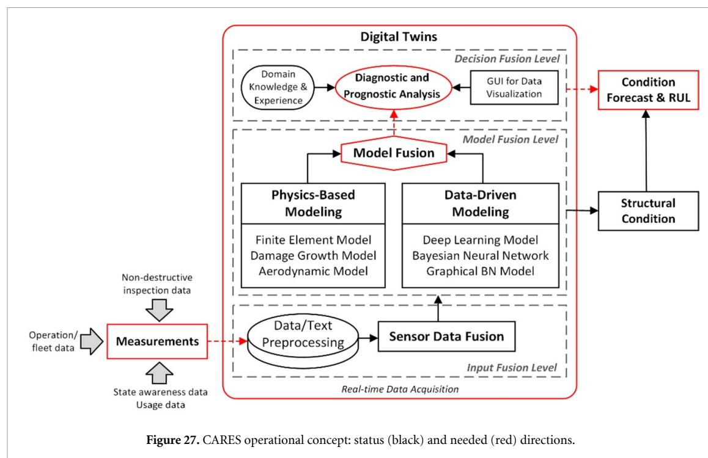

operate under dynamic conditions, and replicating these conditions in DTs requires accurate representations of thermal, mechanical, and aerodynamic behaviors. The integration of these physics-based models with real-time sensor data further complicates the task. Data scarcity and quality pose additional hurdles. While real-time sensor data is increasingly available, it often lacks the consistency and breadth needed for comprehensive analysis. Historical maintenance data, critical for training ML models, is frequently fragmented or incomplete. Furthermore, the diversity of operational conditions across different missions introduces variability that challenges the generalizability of predictive models [299].

The adoption of AI-enabled SHM systems such as CARES also faces organizational, regulatory, and cultural barriers. In aerospace domains, predictive maintenance models must not only demonstrate high accuracy but also offer transparent, explainable, and certifiable reasoning paths. Seamless integration into legacy maintenance information systems and alignment with Department of Defense acquisition frameworks remain non-trivial. Additionally, alignment with airworthiness certification requirements for safety-critical systems adds another layer of regulatory complexity.

As AI-enabled SHM systems scale to fleet-level deployments, computational scalability and resource efficiency emerge as critical considerations. The CARES framework is designed to operate across multiple levels of abstraction from real-time edge inference on individual aircraft to centralized fleet-level maintenance optimization, which is posing distinct computational challenges. At the component and system level, the integration of deep neural networks and hybrid physics-informed models demands substantial processing power and memory, particularly when handling long-duration high-frequency sensor data. To address this, inference models are optimized via compression techniques (e.g. pruning, quantization) and deployed on hardware-accelerated edge platforms for near-real-time execution. At fleet optimization layer, the CBM global scheduling problem is computationally intensive, involving combinatorial decisionmaking under uncertainty. We leverage parallel solvers and cloud-based distributed architectures to support large-scale simulations and optimization. The system architecture also embraces containerization (e.g. Docker, Kubernetes) to enable scalable, modular deployment across heterogeneous environments. Looking forward, additional challenges include balancing model fidelity against edge resource constraints, ensuring robustness under intermittent connectivity, and enabling asynchronous coordination among distributed DTs, particularly for contested or low-bandwidth mission environments.

Future challenges also include scaling DT systems to fleet-wide operations while addressing the computational demands of real-time analytics. Ensuring cybersecurity and data privacy in cloud-based implementations, such as CARES, will be critical as these systems become increasingly interconnected. Moreover, the incorporation of UQ in decision-making processes will be essential for fostering trust and reliability in automated maintenance recommendations.

{70}------------------------------------------------

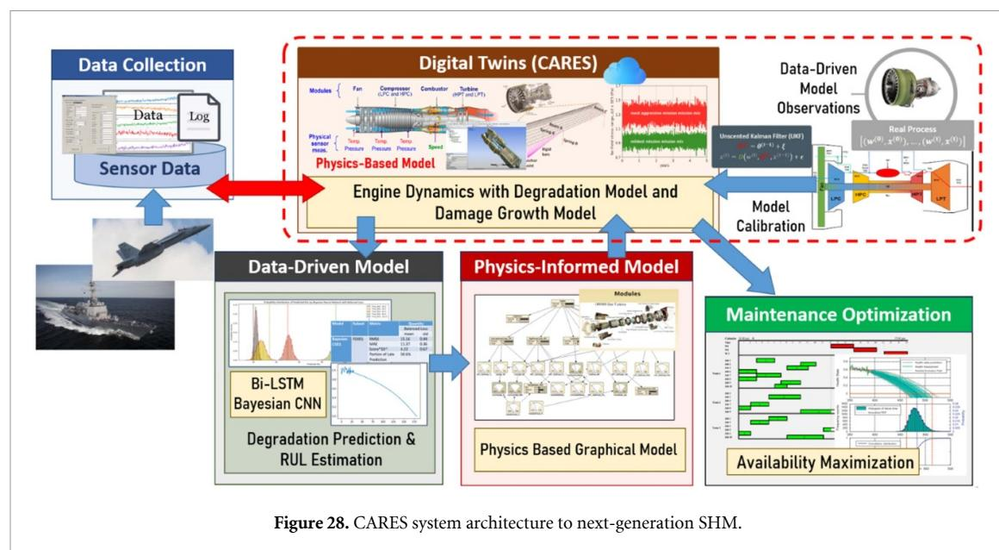

### **Advances in science and technology to meet challenges**

To address these challenges, CARES employs a multi-faceted approach integrating advanced modeling, ML, and optimization techniques. The system operational concept consists of five modules corresponding to the five layers in the system architecture as shown in figure 28: (1) the data collection layer, (2) the DT layer, (3) data-driven layer, (4) physics-informed layer, and (5) maintenance optimization layer.

*High-fidelity DT modeling*: At the core of CARES is a high-fidelity DT model that replicates the dynamic behavior of a turbofan engine across its operational lifecycle. This DT model is constructed using physics-based simulations grounded in fundamental thermodynamic, mechanical, and fluid dynamic principles, capturing the intricate couplings between engine subcomponents such as the fan, compressor, combustor, turbine, and nozzle. Leveraging platforms like MATLAB/Simulink and Simscape, we developed a modular framework that supports the simulation of key degradation phenomena, including erosion, fouling, thermal fatigue, and bearing wear. To ensure model realism, we performed parameter tuning and calibration using empirical data from NASA's C-MAPSS dataset, which provides run-tofailure time series sensor readings under diverse fault modes. A data assimilation approach incorporating state estimation techniques and regression-based residual minimization was adopted to fine-tune model behavior to closely match observed degradation trajectories. This continuous model updating mechanism enables the DT to not only mirror current system states but also to simulate future fault progression scenarios and evaluate 'what-if' maintenance policies within a virtual experimentation environment, serving as a digital testbed for sustainment strategies [297].

*ML for predictive analytics*: To complement the physics-based core, CARES integrates advanced datadriven ML architectures to forecast the RUL of critical components. We implemented LSTM and gated recurrent unit (GRU) neural networks which excel at capturing temporal dependencies and degradation trends from sequential sensor data such as temperature, vibration, and pressure [299, 300]. To model prediction uncertainty and improve trustworthiness of outputs, we employed a Bayesian CNN framework. This approach treats the neural network weights as probability distributions rather than fixed values, allowing the generation of RUL probability density functions (PDFs) instead of single-point estimates [301]. Using variational inference and Monte Carlo dropout, the Bayesian CNN produces a quantified uncertainty range for each RUL prediction, supporting risk-aware decision-making under varying mission profiles and fault conditions. These probabilistic predictions enable operators to balance proactive maintenance against operational demands, thus minimizing both false alarms and missioncritical failures.

*Physics-based BN for diagnostics*: To provide interpretability and leverage expert knowledge, CARES also incorporates a physics-based BN model for diagnostic reasoning and probabilistic health assessment. The BN is structured as a directed acyclic graph (DAG) where nodes represent component states, measurable symptoms, and fault modes, while edges encode causal-influence relationships derived from technical

{71}------------------------------------------------

manuals, engineering schematics, and subject matter expertise. This diagnostic engine fuses static knowledge (e.g. known failure paths, component interdependencies) with real-time sensor inputs, enabling probabilistic inference of latent fault states and posterior estimation of component health indices. The BN also supports reasoning under uncertainty by propagating beliefs across the network. The resulting engine health condition index (EHCI) serves as a key indicator in the maintenance decision loop, and the BN structure also facilitates 'explainable AI', which is crucial for maintenance crew trust and regulatory compliance. By coupling this framework with continuous input from sensor and DT outputs, CARES achieves hybrid prognostics that are both interpretable and data-driven [302].

*Global optimization for CBM*: Recognizing the importance of fleet-level maintenance decisions, CARES incorporates a global optimization framework for CBM. This framework formulates maintenance scheduling as an optimization problem, balancing availability, operational readiness, and life cycle costs under risk constraints. By leveraging predicted RUL distributions and repair time estimates, the optimization algorithm determines the optimal timing for preventive and corrective actions. This approach maximizes fleet availability while minimizing disruptions, offering a scalable solution for managing large aircraft fleets.

# **Concluding remarks**

The CARES initiative represents a significant step forward in integrating DT technologies with SHM for aircraft readiness and sustainment. By combining high-fidelity physics-based models, advanced ML techniques, and optimization frameworks, CARES addresses key challenges in predictive maintenance and operational decision-making. These advancements pave the way for more reliable, efficient, and costeffective fleet management strategies.

As aerospace industry continues to embrace digital transformation, the insights and methodologies developed through CARES will serve as a foundation for future innovations. The integration of AIdriven analytics, hybrid modeling, and real-time data processing will not only enhance the performance of aircraft systems but also set new standards for mission readiness and sustainment. Through continued collaboration among researchers, industry stakeholders, and regulatory bodies, the potential of DTs in SHM can be fully realized, ensuring safer and more efficient operations across the aviation sector.

# **Acknowledgments**

The authors would like to gratefully acknowledge the support of the Naval Air Warfare Center Aircraft Division (NAWCAD) of Navy with award number N68335-20-C-0944. Any opinions, findings, conclusions, or recommendations expressed in this material are those of the authors and do not necessarily reflect the views of the sponsors/organizations.

{72}------------------------------------------------

# **22. AI for SHM in bridge engineering**

*Stergios-Aristoteles Mitoulis*1,2 *and Ivan Izonin*1,3

1The Bartlett School of Sustainable Construction, University College London, London, United Kingdom 2MetaInfrastructure.org, London, United Kingdom

3Department of Artificial Intelligence, Institute of Computer Science and Information Technologies, Lviv Polytechnic National University, Lviv, Ukraine

E-mail: s.mitoulis@ucl.ac.uk, i.izonin@ucl.ac.uk and ivanizonin@gmail.com

### **Status**

Bridges are key assets of our transportation networks. They contribute to economic development, reducing transportation costs, and shortening travel times, particularly for remote regions. They connect different economic zones, facilitating trade and attracting investments, which stimulates business and manufacturing.

Bridge damage and failure can lead to disproportionate cascading losses, see for example the recent collapse of the Francis Scott Key Bridge resulted in regional disruption, spurring failures of regional and global economic and social significance and a 15 million USD daily loss for nearly 3 months. Thus bridge damage can lead to devastating impacts on transport flows, the economy, people's safety, and the environment. The causes of bridge destruction can vary, and each case requires careful analysis and consideration. To minimize the risk of destruction and extend the lifespan of bridges, a comprehensive approach is needed, which includes technical measures, monitoring of the condition of structures, and regular maintenance.

Methods for preventing bridge destruction include regular monitoring of structural conditions through visual inspections, sensor systems, drones, and satellite imagery to detect deformations and defects at early stages [303, 304]. Timely repair works, such as sealing cracks, corrosion protection, and replacing deteriorated elements, are also critical. In addition, using load monitoring systems and transportation restrictions, as well as considering environmental conditions and climate changes such as exacerbating floods and snowfalls, helps reduce the risk of damage and failure.

In the context of modern post-industrial society, where the demands for infrastructure efficiency and safety are increasing, NDE methods for diagnosing the condition of bridge structures have become key to the timely identification of defects and preventing potential disasters. The NDE methods allow for minimizing financial, time, and human resources spent on bridge inspections while maintaining high accuracy and reliability of results. NDEs provide detailed information about the internal condition of structures without the need for disassembly or significant damage, significantly reducing the risk of losses and ensuring the continuity of bridge operation.

Emerging technologies are revolutionizing the traditional way of gathering data for management purposes. To achieve collection, traditional management or inspection methods are being steadily replaced by modern techniques, e.g. IoT, DTs, augmented and virtual reality, AI, and ML [305].

In particular, the development of AI and automation opens new opportunities for improving existing diagnostic methods and creating innovative approaches (figure 29). AI not only automates the data collection process but also analyzes both small and large volumes of information, identifying patterns and anomalies that may be invisible to the human eye. Learning patterns enables more accurate forecasting of the remaining service life of bridges, timely detection of hidden defects, and adaptation of monitoring systems to changes in load or external conditions.

# **Current and future challenges**

Traditional methods of assessing bridge health often rely on visual inspection techniques that may not capture subtle issues such as early fatigue cracks, corrosion of embedded reinforcement or localized damage effectively [306]. For example, in the United States, the National Bridge Inspection Standards (NBIS), published by the Federal Highway Administration (FHWA), acts as a guide, establishing specific standards for the inspection processes of both federal and state-owned bridges. It includes discussions on quality control and assurance related to visual inspection and recommends a maximum inspection frequency of 24 months. This approach is common to other Bridge Inspection Manuals, such as the CS455 in the United Kingdom [307]. The FHWA report on Reliability of Visual Inspection for Highway Bridges by [308] raises concerns about bridge inspection outcomes, highlighting the subjective nature of assessments and the limitations of visual inspections in capturing continuous structural issues like crack propagation. Accessibility is a significant challenge for visual inspection, as it relies on

{73}------------------------------------------------

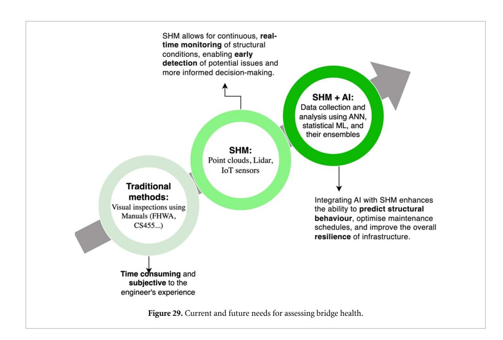

a clear line of sight and may miss internal issues not visible from surface irregularities. SHM techniques have emerged in civil engineering to track the health state of structures, including bridges [309]. SHM involves methods to assess a structure's condition through measurement, modeling, and analysis [310]. It integrates non-destructive evaluation (NDE) techniques to detect hidden defects like corrosion or crack propagation [311]. While NDE focuses on material-level flaws, SHM offers a broader assessment of civil structures, that are complex and substantial structures. SHM systems use sensor data to analyze structural responses, identify anomalies, and monitor known issues [312]. The aim is to collect data on the bridge damage condition, process them and put in place well-informed maintenance and adaption plans [303]. As we move towards smart and resilient infrastructure, a data-driven approach for decisionmaking is crucial [191, 313] However, acquiring big data from SHM requires powerful and intelligent computational techniques opening the door to AI and ML. Nevertheless, only recently AI has attracted the attention of civil engineers despite emerged as soon as the 1950s [314].

The integration of AI tools and methods in bridge engineering faces several critical challenges, particularly in the realm of research and development (R&D). One major hurdle lies in the slow pace at which structural engineering codes and guidelines adapt to advancements. Bridges, like other structures, are designed and maintained according to traditional methods codified in standards that can take decades to amend. These changes require extensive vetting, testing, and approval by a range of stakeholders, including designers, academics, and standardization bodies. In contrast, AI models and tools are being developed at a much faster pace, creating a disconnect between technological progress and its practical application in bridge engineering. Furthermore, decision-makers, such as legislators, standardization committees, and senior bridge assessors, often lack familiarity with AI and its potential, while younger engineers who understand these tools are not yet in positions of influence. This generational gap exacerbates the challenges of vetting and adopting AI-driven solutions. However, pilot case studies and targeted research can pave the way for integrating AI into SHM. These initiatives could facilitate maintenance and adaptation strategies to address the risks posed by aging infrastructure and changing climate conditions. A key future priority is the development of a transparent roadmap, supported by clear policies, to test, vet, and streamline the adoption of AI technologies, ultimately enabling smarter and more resilient SHM and bridge management systems.

One of the partial cases of possible bridge damage that is not considered during the design stage of the bridge structure is its geometric changes. Specifically, excessive deflections, distortions, or foundation settlements can significantly impact the operational characteristics of the bridge [315]. Existing nondestructive diagnostic methods for such damage are mainly focused on image processing techniques

{74}------------------------------------------------

based on sets of images obtained through various means. However, such methods only provide a general picture of the geometric changes in the bridge, which is not tied to an assessment of its actual level of damage, reducing the practical value of this approach when solving real-world problems. In [316], the authors proposed a new methodology for assessing the level of bridge damage using AI tools. Specifically, the authors in [316] managed to combine measured deflections of the bridge structure in different zones of the bridge with the level of bridge damage. The resulting tabular dataset, containing four input attributes and three output ones (damage in three bridge zones), which are interdependent, enabled the application of ML methods for predicting the level of damage in different zones of the bridge. Furthermore, this approach allowed for a numerical assessment of the level of damage to the bridge structure based on information about its geometric changes.

From a ML perspective, this task has several peculiarities, the main ones being the small dataset available for implementing ML training procedures and the need to predict multiple output attributes that, in addition, are interdependent. Given this, the use of existing single ML algorithms, ensemble methods, or artificial neural networks with several outputs is not suitable for effectively solving the task. Therefore, in [315], a partial case of solving this problem, conditioned by the aforementioned limitations, is considered. Specifically, the authors in [315] developed a new ensemble ML method to solve the posed problem. Since the dataset for training is quite small, the developed cascade method is based on using generalized regression neural networks (GRNN) as weak predictors of the model. Since there were three output attributes, the ensemble method for non-destructive diagnostic evaluation of the bridge structure used three GRNNs at each level of the cascade. Moreover, considering that the three output attributes are interdependent, the composition of the cascade ensemble involved the use of two cascade levels (figure 30). At the first level, an independent prediction of each output attribute is made, and the obtained values form a new dataset. This new dataset (Dataset2) is then passed to the next level of the cascade, which accounts for their interdependence and generates the final prediction results.

In [317], a modification of this approach was proposed, which is primarily due to the short dataset for training. Therefore, it is based on the use of an augmentation and prediction method for extremely small datasets. The improved model involved using input-doubling methods [318] as weak predictors at the first level of the cascade. This approach significantly improved the accuracy of predictions. However, it also considerably increased the duration of the training procedure due to the specifics of the method from [318] and the use of GRNN as the basic element of the cascade, which becomes slow and large when analyzing large volumes of data.

Overall, the use of methods from [315–317] for non-destructive diagnostic evaluation of the bridge structure demonstrated high accuracy and practical applicability. However, given the limited dataset for implementing the training procedure, they are only partial cases of the methodology for solving the posed task. Despite this, and considering the results of their performance, there are numerous prospects for future research in this field, including:

- (1) The use of generative AI tools, specifically variational autoencoders, for artificially expanding the initial data sample, which, according to the results in [305], will significantly improve the accuracy of the developed cascade.
- (2) Implementing the first condition, i.e. increasing the dataset for training procedures, can make it possible to use classical ML methods or artificial neural networks as weak regressors in the cascade structure. Therefore, among the prospects for future work, it is essential to explore the effectiveness of using such methods as weak predictors in the cascade model to enhance both its accuracy and speed.
- (3) Generalizing the developed model to predict any number of interdependent output attributes, which would make the model more versatile and provide broader applicability for diagnosing various types of bridges.
- (4) The use of nonlinear methods for expanding input data, both at the first step of the cascade (Dataset1) and at the second (Dataset2). This approach could improve prediction accuracy and allow the use of linear, high-speed ML methods as weak regressors in the cascade ensemble.
- (5) Developing a procedure for refining the regression model parameters through iterative adjustment of the final prediction results by replacing them in Dataset2, enabling iterative re-training of the second level of the cascade ensemble with predefined stopping criteria.

At the same time, the application of AI in SHM, and particularly of two-level cascade ensembles, involves the risk of the so-called 'black box' problem, where the reasoning of complex models is difficult to explain and verify. This can undermine trust and limit acceptance in engineering practice. To mitigate this challenge, the proposed cascade explicitly combines nonlinear input expansion with linear methods,

{75}------------------------------------------------

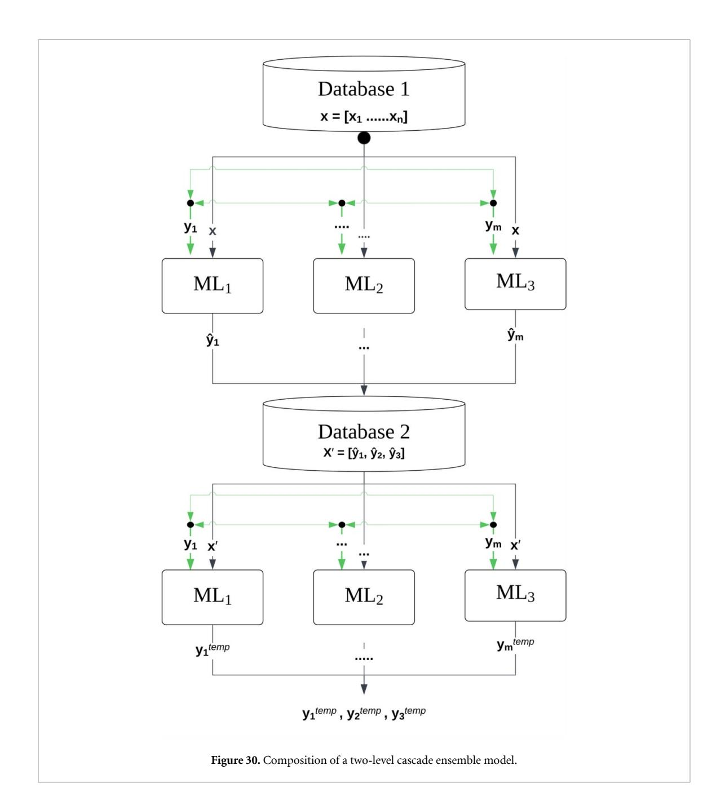

ensuring that predictions remain accurate while becoming more transparent and interpretable. Such a balance reduces the black box risk and strengthens the alignment of AI-driven SHM with engineering standards and industry implementation.

### **Concluding remarks**

Traditional bridge inspection methods relying on visual assessments are increasingly supplemented by SHM and AI-driven techniques that enable the detection and evaluation of subtle structural issues, as demonstrated by recent approaches harnessing small yet high-value datasets. Despite challenges such as limited training data and multiple interdependent outputs, the introduction of cascade ensemble models, GRNNs, and input-doubling methods has shown high accuracy and practical feasibility. Future research aims to broaden these capabilities by exploring generative AI, strengthening ensemble accuracy through nonlinear data augmentation and alternative weak regressors, and expanding the model to accommodate more complex interdependencies. Such efforts hold promise for advancing non-destructive diagnostics and enabling more reliable, data-rich decision-making in bridge management and maintenance.

{76}------------------------------------------------

# **23. Towards integrated monitoring and comprehensive assessment for nondestructive evaluation**

Zheng Liu1 and Erik Blasch21Faculty of Applied Science, The University of British Columbia, 1137 Alumni Avenue, Kelowna, BC V1V1V7, Canada

2MOVEJ Analytics, Dayton, OH, United States of America

### **Status**

NDE, also known as non-destructive inspection or testing (NDI/NDT), uses the measurement to learn about an object without causing any damage and is more quantitative in nature [319]. The offline testing and inspection can be conducted by a trained inspector or engineer manually or by a custom-designed robot automatically. Usually, an NDE technique will identify a defect/crack, characterize its size, shape, and orientation, and determine material properties. The quantitative size information can be used in fracture mechanics and structural integrity analysis to predict failure under a specific load or crack growth rate under cyclic loading. The probability of detecting cracks of various lengths and depths under various inspection conditions, known as the POD, is used to measure the capability of an NDE method [320]. The POD quantifies the likelihood that a specific inspection method will detect a flaw of a given size.

There are two main types of POD models, i.e. hit/miss POD and signal response ( $\hat{a}$  vs  $a$ ) PoD. The purpose of the POD is to quantify the uncertainty of the flaw detectability. POD measures how likely the flaw will be detected in the case of hit/miss or how likely the signal will be above a rejectable threshold in the case of  $\hat{a}$  vs  $a$  in an inspection. POD is a key factor in varied NDE applications, such as NDE system reliability assessment, risk-based inspection, QA and QC, etc. However, creating a POD model is costly. The POD model must be tailored to a particular inspection technique, material, and defect type with the data collected from designed experiments.

Quantitative NDE information is critical to industrial applications, so calibration and data processing algorithms are essential to derive such information. However, the results cannot be characterized by the original POD model. In other words, the POD curve must be updated or recreated to reflect the algorithms' impact on the detection performance. This is because data processing can alter defect detectability, measurement accuracy, and signal- to-noise characteristics, leading to changes in the POD curve shape and reliability.

# **Current and future challenges**

Industrial advances require timely information from NDE for condition monitoring and assessment. Thus, real-time or near-real-time inspection techniques to assess materials, components, or systems during operation and production have become paramount to modern industry. Unlike conventional offline NDE, which requires halting operations, online NDE provides continuous monitoring and immediate feedback to support the engineering decision-making process.

The current NDE challenges stem from the industry's need for quantitative results to support analysis and decision-making. The conventional NDE system is usually conducted offline by an inspector or engineer. The NDE technique's capability is featured by its POD, where the human factor is a key variable associated with the NDE process. The NDE results are presented in varied formats, including:

- binary (defect present/not present)
  signal magnitude (amplitude frequency)
- signal magnitude (amplitude, frequency, phase Shift)
  quantitative (size, depth, position)
- quantitative (size, depth, position)
  2D image (scans, mans)
- 2D image (scans, maps)
  probability classification
- probability, classification, and prediction.

The quantitative results regarding the structural discontinuities are preferred for structural analysis [321].

In the first scenario, as illustrated in figure 31, the offline NDE data need calibration or processing algorithms to obtain the quantitative results. The extra uncertainty will be introduced by the quantification process. How the result agrees with the POD of the specific NDE technique remains a question, although the quantitative results can be characterized by data quality metrics, such as accuracy and signal-to-noise ratio etc. The NDE’s POD will not represent the uncertainty of the quantitative results, which are the outputs of the NDE system. From the system perspective, the processing algorithm is part of the NDE system. Thus, the POD of the overall NDE system comprises the NDE’s POD and

{77}------------------------------------------------

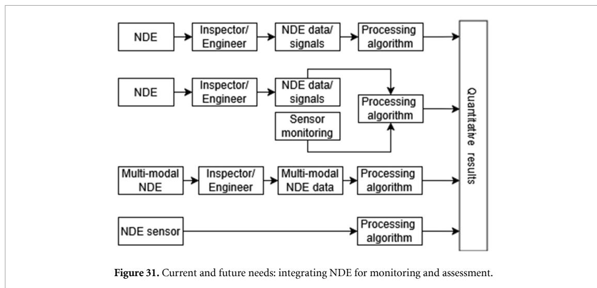

**Figure 31.** Current and future needs: integrating NDE for monitoring and assessment.

the algorithm's POD. The ‘intelligence’ of an NDE system is featured by the processing algorithms. Data or signal processing algorithms are usually characterized by accuracy and precision metrics instead of a POD, however there is no report on the POD of such an intelligent NDE system.

More complicated scenarios include using NDE results with online sensing data and involving multiple NDE techniques. NDE and sensor monitoring data can be input into a Bayesian model to predict crack growth [322]. Although the NDE is offline, it provides solid information about the crack and thus helps reduce the uncertainty with the prediction. In this case, the NDE data, when available, are used to update the model periodically. There are multiple factors contributing to the system's performance, including data sources, models, and processing algorithms. It is inadequate to only focus on the processing algorithms. The multi-modal NDE scenario is similar. When a single NDE technique is insufficient, multiple NDE techniques or configurations will be employed. The model-assisted POD (MAPOD) highlights the improved detection capabilities of multi-modal NDE [323]. In [324], Peng *et al* proposed a feature-based POD to assess the performance of multiple magnetic flux leakage (MFL) inspections, where the product of the probability of two MFL tools is used as their joint probability in POD calculation.

The future NDE challenges come from the industry's need for its integration into the dynamic industry processes for timely engineering decision-making. Thus, there is a trend to build NDE sensors for real-time inspection. NDE sensors, such as flexible ultrasonic sensors, can be permanently installed to measure the metal thickness loss due to corrosion. Like other NDE techniques, NDE sensors must be characterized by their POD models as well. The POD for the overall NDE sensing system, including the processing algorithm, needs to be established accordingly.

#### **Advances in science and technology to meet challenges**

The conventional POD focuses on binary results and signal magnitudes. However, when the dimension of the NDE results or flaw feature parameter is larger than two, the POD model should consider multiple dimensions, such as crack depth and length [325, 326]. The defect orientation and volume inspected by the magnetic flux leakage along oil and gas pipelines were modeled with a feature-based POD [324].

The online NDE is being enabled by DT technologies and will play a crucial role in the cyber-physical or DT ecosystem. The ‘new’ NDE has been coined as the concept of NDE 4.0 [327]. The key features of NDE 4.0 include [328]:

- Smart & connected NDE: utilizes IoT sensors for continuous monitoring and remote inspection.
  AI & MI: automates defect detection, classification, and predictive maintenance.
- AI & ML: automates defect detection, classification, and predictive maintenance.
  DTs: creates virtual models of structures or components, enabling simulation-based analysis.
- DTs: creates virtual models of structures or components, enabling simulation-based NDE.
  Big data & cloud computing: centralizes inspection data for better analysis, trend detection.
- Big data & cloud computing: centralizes inspection data for better analysis, trend detection, and AI training.
- Augmented reality (AR) & virtual reality (VR): enhances inspector training and real-time guidance in complex inspections.

{78}------------------------------------------------

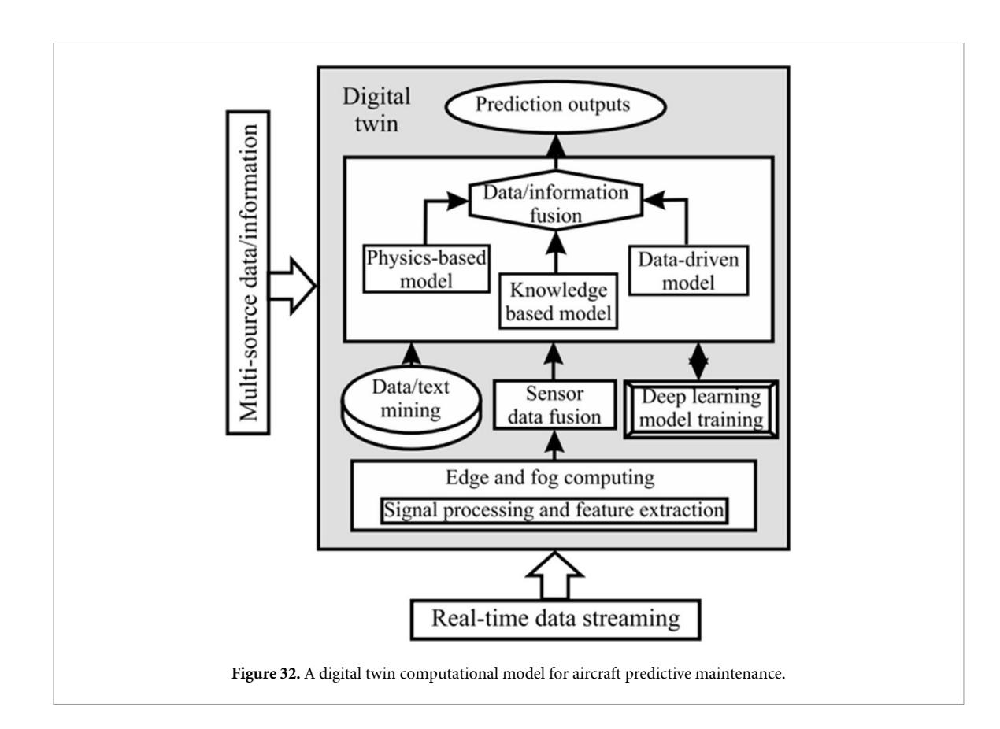

- Blockchain for data integrity: ensures tamper-proof records of NDE inspections for compliance and traceability.

The IoT will hook the NDE as one 'thing' in the network. As a critical piece of information, NDE results will be integrated into the DT ecosystem as illustrated in figure 32, which demonstrates a DT computational framework for aircraft predictive maintenance [329]. The NDE results are available online but do not need to be in real-time. The results can be used with all other information as input to the computational models.

The trend to use AI and ML in NDE is becoming practical. Recent advances in data engineering are enabling automated data processing and quantification. However, the metrics of the AI/ML algorithms only highlight the relative performance based on the experiments on a specific benchmark dataset and do not tell the reliability of the AI/ML empowered NDE system. Thus, applications still look for information about the reliability of the results from the application's perspective or the overall system's performance. A POD updating procedure should be explored and established for the intelligent NDE system.

# **Concluding remarks**

Industrial advances require comprehensive monitoring solutions. NDE is a component of such a solution. The NDE technique's capability is characterized by its POD, which provides insights into the likelihood of detecting a defect of a given size under specific conditions. As single- or multi-modal NDE techniques reveal multiple flaw parameters, a POD that considers multiple flaw parameters and signal features should be investigated further. When NDE is integrated with AI/ML, the original POD is no longer applicable. After applying AI/ML, a new POD curve must be created to validate detection reliability. Model-assisted POD, Bayesian models, and uncertainty analysis should be conducted to assess AI-driven NDE reliability. In the context of an integrated solution, such as a DT, a new dynamic POD model is expected.

{79}------------------------------------------------

# **24. Computer vision in civil engineering for enhancing SHM of bridges**

*Giuseppina Uva and Sergio Ruggieri*

DICATECH Department, Polytechnic University of Bari, Bari, Italy

Email: giuseppina.uva@poliba.it and sergio.ruggieri@poliba.it

# **Status**

The term SHM is generally referred to all those techniques aimed at evaluating damage evolution of structures and infrastructures over time, in order to assess structural integrity and prevent unexpected failures. Structural damage, in the context of SHM, can be defined as a variation of the original conditions of the structure (e.g. mechanical properties), which are usually assessed through non-destructive approaches [330]. The simplest and more intuitive SHM technique is the visual inspection, in which a well-trained surveyor is tasked to accurately observe the structure and its elements, for visually defining the presence of damages (e.g. cracks, concrete spalling, corrosion of steel) and classify them according to an evaluation scale. The idea behind visual inspections is to periodically repeat onsite surveys for tracking damage evolution through photos or videos as a proof for documenting the structural decay, and then for planning suitable risk mitigation strategies. According to national and international guidelines (e.g. [331]), the performance of onsite surveys is a common practice for existing bridges, which are structures of high importance and often subjected to environmental conditions accelerating natural deterioration of structural materials. If from one hand, visual inspections represent a safe harbor for private and public road management companies, which entrust on the reliable judice of domain experts, on the other hand this practice is not cheap. First, considering the high number of bridges managed by road management companies, a proportional number of well-trained inspectors is required, which represent a large share of the costs intended for maintenance. This usually leads to reduce the number of active surveyors, causing in turn several issues due to overload and influencing the reliability of the final damage evaluation, such as the experience degree, lapses in attention, mental weariness. Additional bias in the overall evaluation is added by external factors, such as weather conditions, lighting, distance between the surveyor and the inspected element, inaccessibility of the elements. The abovementioned problems indicate the necessity of developing new smart tools for assisting and supporting bridge inspectors in this crucial phase for bridges maintenance [332].

In this view, a valuable support can be given by the recent advances in CV technologies, which can be used for automating defect detection and recognition in existing bridges. According to the scientific literature, CV techniques can be categorized in four main families, as shown in figure 33 [1]: (a) classification; (b) segmentation; (c) feature detection; and (d) object detection.

*Classification* allows to categorize images into predefined classes by analyzing patterns and features within the images and assigning a label. An example of classification is provided in [6], where authors employed eight CNNs and transfer learning for characterizing seven classes of defects in a dataset of more than ten thousand images. The results were evaluated using new metrics to show pros and cons of each CNN. In [333], authors used CNNs to assess and classify different types of in-service damages in laminated composite bridges.

*Segmentation* consists of subdividing an image into multiple segments to identify objects in a specific region within the image, allowing both localization and boundary definition. An example is provided in [334], in which authors used instance segmentation via Mask Region-based CNN to localize and classify cracks in images collected during bridge inspections. In [335], authors proposed a bridge inspection system supported by data analytics tool for characterizing and identifying defects through segmentation. In [336], authors used semantic segmentation via deep neural network to identify fine and coarse defects in different structural materials.

*Feature detection* consists of identifying and localizing features within images (from simple lines to complex figures), allowing to assess the variation of the considered pattern over time. In [337], authors used feature detection to monitor the variation of cable tension measurement, accounting for different effects, such as fatigue damage due to environmental vibrations. In [338], authors used feature detection to evaluate structural displacements from images of damages captured by multiple cameras.

*Object detection* consists of identifying and localizing objects of interest within the image. Two main typologies of object detectors exist: (i) two-stages detector, consisting of two deep neural networks, one

{80}------------------------------------------------

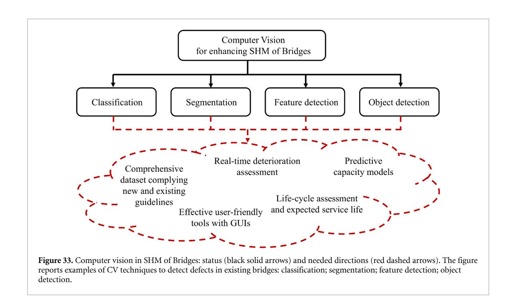

for localization and one for classification; (ii) single-stage detector, consisting of one deep neural network for both localization and classification tasks. Single-stage detectors are usually preferred, due to the computational advantages, despite lower accuracy. A popular detector is YOLO [339], particularly suitable for multi-class prediction. In [340], authors used YOLOv3 and transfer learning to identify four defect classes in concrete bridges (crack, pop-out, spalling, exposed rebars). In [341], authors improved YOLOv8 with attention mechanisms to detect cracks in concrete structures. Similarly, in [342], authors employed YOLOv11 with attention mechanisms for improving detection of seven classes of defects.

### **Current and future challenges**

The abovementioned CV techniques present several potentialities but, at the same time, some limitations, which characterize current and future challenges for their application to existing bridges [1]. Firstly, although classification techniques can achieve high accuracy in the task of categorizing surface defects when the CNN is trained on extensive datasets, they are still lacking in information about location and extension of the defects. Alternatively, classification can be employed also after that defects are localized. In any cases, this methodology is not suitable when referring to a global inspection of existing bridges, due to incompleteness. Concerning segmentation, this technique can be very useful in accurately identifying and classifying several types of defects. On the other hand, its effectiveness is strongly dependent on the quality and diversity of training data, besides to consider that foundational algorithms are difficulty extendable to specific defects. In fact, using small datasets, the generalizability of the approach cannot be ensured (modifications and retraining are often required), and neither it is suitable for classifying multiples classes of defects. Regarding feature detection, it offers the possibility to perform a real-time monitoring of defects, achieving high accuracy. Nevertheless, feature detection is sensitive to environmental factors such as brightness and camera positioning, especially for handcrafted features different from the foundational algorithm. Still, image resolution represents the main issue, which limits the detection especially for the fine defects (e.g. thin cracks). Finally, object detectors like YOLO offers a significant opportunity for real-time visual inspections, but as for segmentation, they require a large amount of data, with the related need of annotations by domain experts. Moreover, if not well trained, object detectors could not be efficient in detecting fine defects, which is imperative for thorough onsite inspections.

Regardless of the specific CV technique selected, the real challenge in the field of damage detection is to develop approaches able to comply the requirements of national and international guidelines. In fact, as for the Italian case, which is ruled by [331], for each type of structural element, a list of defects with different importance in the overall evaluation is typically defined.

In addition, for each defect, parameters about extension and intensity must be attributed by inspectors. The current state-of-the-art in CV focuses on some few specific defects, e.g. cracks, steel corrosion,

{81}------------------------------------------------

neglecting other features that are important for a correct SHM, e.g. crack orientation, level of corrosion. Concerning extension, the current CV techniques are trained and tested on datasets made by specific images, which lead to the impossibility of considering the extension of the specific defect on the entire structural element, unless a process of image stitching is performed. Regarding intensity, the matter becomes complex, because for each defect and related intensity, the examples provided by national and international guidelines should be considered as reference. Hence, the CV algorithms should be trained according to the reference examples and, at the same time, should be aseptic from other practical aspects, such as quality of the image, distance of the photo, lighting, weather conditions. The last issue is related to specific defects, like cracks, in which the intensity is determined by thickness. This implies that a universal convention to quantify this parameter in the images should be defined, characterized in a way to be independent on the type of image and on the distance from the device to the surface. A viable solution resides in a specific design of the dataset, which must be extended according to the desired prediction target.

Finally, one of the main current challenges regards the possibility of combining CV approaches with new SHM technologies, both for improving automatization in damage predictions and for extracting structural features from images and videos. One of the current trends is to exploit the handling of UAVs, which allow to systematize inspections by ensuring a complete survey also for those parts of bridges difficult to inspect (e.g. supports), and then, to strongly increment the dataset. Different inspection protocols via UAV exist (e.g. [343]), while several works exploit the potentialities of UAVs for processing images through CV. Some examples are provided in [335] and [344], in which defects detection was performed. In more recent applications, the combination of CV and UAVs surveys has been also exploited for retrieving structural information from the inspected bridge, as in the case of [345], in which authors proposed a new method to extract main frequencies of an infrastructure from an UAV video.

### **Advances in science and technology to meet challenges**

The current status of research suggests that, although CV techniques represent a tangible option for supporting bridge inspections, some substantial improvements are required for enhancing SHM of bridges. In particular, the definition of sub-optimal solutions for defect detection-localization-classification should be framed within the current national and international guidelines, in order to make these approaches directly accessible to bridge inspectors of road management companies (figure 33).

The first step toward this direction is an informed *data collection*, in which the dataset at the base of CV algorithm training should be characterized including each defect typology prescribed by the guidelines, with the related parameters of extension and intensity. Features like quality and quantity of data strongly influence the success of the prediction, since potential bias could characterize the dataset. Concerning quality, the images could be characterized by several uncertainties due to the subjectivity in labeling, the lighting conditions, the resolution of devices used for taking images. Regarding quantity, a dataset characterized by a consistent variety of defects with different features represents an advantage, then preventing overfitting phenomena. In this context, the use of CV should be oriented to evaluate problems with multiple classes of objects, in which the proposed algorithms are able to truly support the inspection phases.

Another research direction to support the current practice in bridge inspection with CV is represented by the development of suitable *user-friendly tools*, which can be used onsite or remotely after data collection. This goal can be easily addressed, especially by proposing simple graphical user interfaces (GUIs), which allow to take or upload an image and to apply the CV algorithm for identifying the type of defect, its intensity and its extension. As for example, when dealing with cracks, the tool should be able to recognize in an image the number of cracks, their orientation, and their extension. Figure 34 reports a proof-of-concept of a possible GUI addressing the above aspects, in which the functionalities of sub-modules at the base of the GUI are reported. After image uploading, the tool performs the defect detection, counting and subsequently identifies the related features.

As additional key aspect, a specific module to assess the *reliability of predictions* is strongly suggested for supporting inspectors' needs. In fact, the final user should be supported not only in the defect recognition, but also in assessing that the obtained CV-based prediction is reliable. To this end, explainability techniques based on deep visual representation approaches can be implemented. Some examples can be found in [346], such as heatmaps, activation visualization, Grad-CAM and saliency maps. The main aim of the above techniques is to visually observe the accuracy of the prediction and establish if the employed CV algorithm is effective or needs further developments.

A final potentiality of CV is the *automatic identification* of defects, which can be exploited for improving the prediction of the structural behavior of existing bridges, accounting for deterioration effects. In fact, the performance of periodical visual inspections provides insights about the evolution of

{82}------------------------------------------------

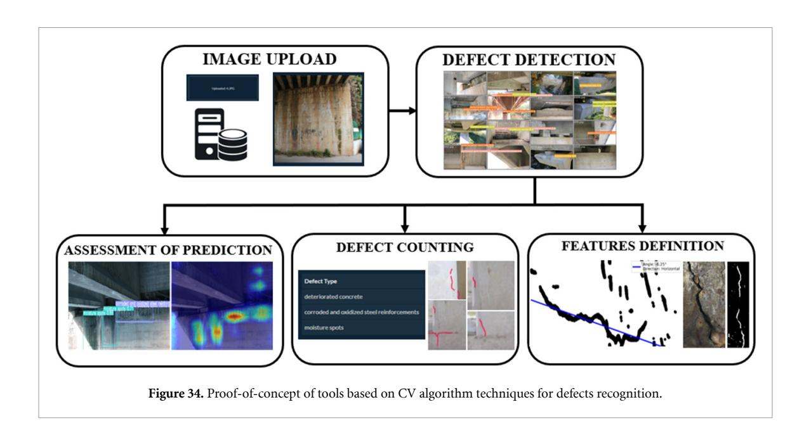

the damages, which represents a source of information to quantify the expected service life of the structure and then, can be considered for planning mitigation strategies. The state-of-the-art about this topic is still immature, as shown in [1]. An example of this potentiality is provided in [347], where authors developed a life-cycle assessment framework, accounting for the influence of concrete cracks due to corrosion in steel reinforcement, in order to drive maintenance interventions. Future works about the topic shall address two main aspects: (a) automatic definition of the influence of progressive deterioration effects on the structural performance under different hazards; (b) definition of scalable and generalizable predictive models, which consider different bridge typologies in different environments.

# **Concluding remarks**

One of the more intuitive and direct SHM techniques for existing bridges is visual inspection, in which the observation of surface defects is the most immediate non-destructive approach to recognize the structural damage evolution and thus the health of the structure. To support the common practice in visual inspection, a valuable support is provided by CV, which allows to detect, classify, and localize defects in images or extract information from videos. Although several techniques exist with the related pros and cons, still much room for improvements exist, as highlighted in this text. First, CV techniques should aim to align with the current guidelines, by increasing the number of predictable defects (multiclass algorithms) and related features (e.g. extent and intensity). To make accessible the potentialities of CV, new user-friendly tools with simple GUIs are necessary, which can support human domain experts in onsite or offsite surveys. Finally, several research opportunities exist in the field of using CV for predicting the structural behavior of bridges, and then to derive the expected service life and consequently to plan reliable mitigation strategies.

# **Acknowledgments**

The authors thank Angelo Cardellicchio for the inputs, contributions, and fruitful discussions for this document.

{83}------------------------------------------------

# **25. Application of AI in wind turbine blade structural health monitoring**

*Zhu Mao*

Department of Mechanical and Materials Engineering, Worcester Polytechnic Institute, Worcester, United States of America

E-mail: zmao2@wpi.edu

#### **Status**

The application of AI in the SHM of wind turbine blades (figure 35) has gained significant importance in recent years. These technologies provide innovative solutions to the ongoing challenges of ensuring the longevity and operational reliability of turbine critical components, as well as improving maintenance strategies, reducing operational downtime, and lowering total costs for the wind energy industry [348].

One of the common AI-based SHMs on wind turbine blades involves using ML algorithms to detect structural damages through signal processing at an early stage. ML models are trained to recognize subtle changes in vibration/acoustic signals that might not be visible to human inspectors using traditional signal processing techniques [349]. Among all the state-of-the-art sensing techniques, piezoelectric sensors, fiber optic sensors, and acoustic emission sensors are the most widely used. Data from these sensors are processed, and features are extracted to reflect the structural deterioration. In real applications, the damage may not be visible, such as internal cracks or material fatigue, which are common concerns for wind turbine blades. The use of AI in processing these signals may significantly improve the accuracy and efficiency of SHM practice [350, 351].

There are many DL algorithms developed in the past decade to reduce the dimension of SHM data and extract damage-sensitive features. For instance, autoencoder and its numerous variants have been applied to detect operational anomalies and failures in wind turbine blades. GANs advance AI-based SHM, especially in situations where data is limited or scarce. By generating synthetic data, GANs can augment existing datasets, and improve the AI models when there is limited real data. This capability helps overcome one of the major challenges in SHM—insufficient labeled data for training robust ML models. CNNs have been employed in AI-based SHM, which are particularly effective for localizing damages on the surface of the blades. This damage localization not only improves the precision of fault identification but also helps prioritize maintenance, thereby optimizing the use of resources and minimizing turbine downtime. For many SHM applications, the time-dependent features will provide more damage-specific features for decision-making, and RNNs, such as LSTM, are another family of major AI algorithms applied to the wind turbine blade SHM. The integration of data analytics algorithms into SHM systems, as figure 35 illustrates, allows for a more detailed, real-time understanding of the condition of each blade, which is crucial for ensuring the long-term performance and safety of wind turbines [352–355]. In figure 35, the SHM challenges are categorized by different sources, namely, testing data ambiguity, simulation difficulties, and operational and environmental variabilities that exist in field data. AI techniques have drastically improved the SHM feature extraction performance, and the emerging algorithms leveraging transfer learning and physics will be even more powerful in tackling those challenges depicted in figure 35.

AI also advances wind turbine blade SHM via the integration of heterogeneous data from different sources and eliminates the influence of environmental and operational fluctuations. Wind turbine performance and health are influenced by a wide range of factors, including sensor measurements, operational data (such as rotational speed and load), and environmental conditions (such as wind speed and temperature). AI-based systems that combine these various data streams can provide a more comprehensive and holistic assessment of the blade's structural health. By analyzing these multiple data sources simultaneously, AI models can uncover complex patterns and correlations that would be difficult to detect with traditional methods. To deal with scenarios where limited labeled data is available for training AI models, transfer learning has been adopted in the community of wind infrastructure assessment. Transfer learning involves adapting pre-trained AI models to new domains, which can significantly reduce the need for extensive data collection and labeling. Transfer learning is particularly useful in wind turbine SHM, where labeled data for training models may be scarce due to the high costs of collecting and labeling damaged data, as well as the large variation between turbines and blades [355–358].

Among the state-of-the-art practices of AI in SHM, there are oftentimes some core techniques applied, among which, surrogate models, DTs, PIML, and AI-based model updating are interconnected concepts, but each serves different purposes. Surrogate models provide rapid (usually in near real-time)

{84}------------------------------------------------

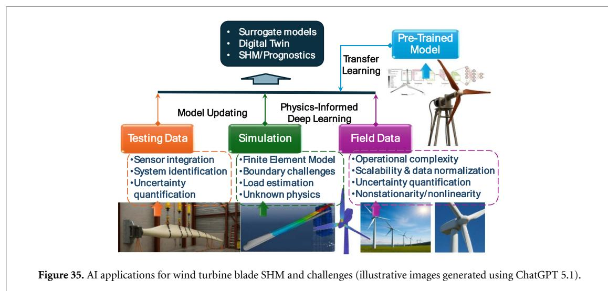

and efficient predictions of system behavior by approximating complex simulations, and can be created using either pure data-driven approaches or enhanced with physical laws, which may be as simple as modal expansion or as complicated as physics-informed DL. While surrogate models emphasize the model order reduction, PIML focuses more on the data analytics while processing SHM signals, especially in data-sparse scenarios, by embedding real-world physics into neural network training, enabling better generalization and extrapolation. DTs leverage surrogate models, continuously syncing real-time data from physical assets to update a high-fidelity virtual representation that predicts performance and future states. Lastly, AI-based model updating, usually only referring to finite element models, uses AI techniques to refine models, ensuring their accuracy with evolving real-world conditions. All these concepts are closely related to SHM, applying AI to tackle engineering challenges from different aspects [348, 349, 354, 355].

# **Current and future challenges**

While the application of AI in the SHM of wind turbine blades has garnered significant attention in recent years, there are challenges and new opportunities for more intelligent and reliable techniques to assess the structural integrity of wind turbine blades [359].

The *current challenges* of AI applied to wind turbine blade SHM include the following aspects:

Damage detection and localization: a primary challenge in SHM of wind turbine blades is the accurate detection and localization of structural damage. Traditional NDT methods are often time-consuming and labor-intensive, limiting their suitability for continuous monitoring. AI-based data mining has shown potential for identifying and localizing cracks and other forms of damage. However, developing reliable and robust AI models for damage identification remains a challenge.

Scalability and *in-situ* SHM: effective wind turbine blade SHM faces significant challenges when it goes to *in-situ* fashion. These include the need for large, diverse datasets, the ability to manage complex and nonlinear data relationships, and ensuring model interpretability to provide actionable insights. Additionally, developing physically-interpretable AI algorithms for active turbines, particularly in remote or offshore locations, is difficult. The black-box nature further complicates decision-making, emphasizing the need for more XAI techniques and standardized datasets for validation.

Sensor integration: managing and analyzing large volumes of heterogeneous data still presents significant challenges. While AI assists automatic data processing, feature extraction, and decision-making, integrating these techniques with sensor infrastructure and data management systems remains a complex undertaking.

UQ and reliability: another big challenge for AI-based SHM is the lack of high-fidelity UQ and reliability models. This is particularly true when facing high dimensional SHM datasets and the complex nature 

{85}------------------------------------------------

of data fluctuation at multiple time scales. Normalizing the data under different loading/environmental situations is also part of the challenge.

Despite the challenges, AI has the potential to advance SHM with *future opportunities*:

XAI: As AI-based techniques become more prevalent in SHM, there is an increasing need for XAI models that offer transparent and interpretable insights into decision-making processes. This is particularly critical in the wind turbine infrastructure and its operations, where operators require a clear understanding of the mechanisms and rationale behind AI-driven recommendations.

Hybrid modeling approaches: combining physics-based models with data-driven AI techniques can enhance the robustness and reliability of SHM systems. By integrating domain-specific knowledge with AI's learning capabilities, hybrid approaches can mitigate the limitations of purely data-driven models, improving the overall performance and trustworthiness of SHM solutions.

Adaptive and autonomous monitoring: the development of adaptive and autonomous SHM systems, capable of continuously learning and adjusting to evolving environmental and operational conditions, presents a key challenge for the future. AI techniques, such as RL and meta-learning, can be pivotal in enabling these self-learning and self-optimizing systems.

Multimodal data fusion: given the complexity of wind turbine blades, SHM often requires the integration of diverse data sources, including high-dimensional sensor measurements, operational input, and environmental factors. AI-based multimodal data mining and fusion techniques can facilitate the extraction of comprehensive and insightful information, resulting in more accurate and reliable SHM outcomes.

Advanced networks and distributed intelligence: as the number of sensors and data generated by SHM systems continues to increase, the need for edge/federated computing and distributed intelligence becomes more critical. AI-driven approaches can enable real-time data processing and decision-making at the edge, reducing reliance on centralized systems and improving the responsiveness and resilience of SHM operations.

### **Advances in science and technology to meet challenges**

Addressing the aforementioned challenges may lead to significant technological progress, with collaboration from academia, industry, and government playing a critical role [360–363].

#### Advances in DL models and algorithms

DL models, such as CNNs, RNNs, and GANs, have made great strides in detecting and localizing damage in wind turbine blades. Hybrid models that combine data-driven modeling with physics-based approaches have proven particularly promising in handling the complicated nonlinear behavior and deterioration of turbine blades. To overcome the challenge of limited labeled data, especially in damage detection at an early stage, transfer learning has emerged as a valuable tool. For prognostics, LSTM and related variants demonstrate great value in modeling time-dependent features.

# Sensor technologies and data integration

In addition to traditional sensors like fiber-optic, piezoelectric, and accelerometers, advancements in CV, camera photogrammetry, and laser-based noncontact measurement technologies are significantly enhancing monitoring capabilities. These techniques provide high-resolution and full-filed imagery data, enabling precise analysis of blade conditions without permanently installed sensors. Via a multimodal data fusion, DL models can create a comprehensive view of the blade's health. This fusion improves damage diagnosis, enabling the early detection of issues that may not be evident from homogenous data. Additionally, data preprocessing and feature extraction methods, like RL and multimodal CNN, further optimize model performance by extracting meaningful features from raw data, enhancing the overall effectiveness of SHM systems [364, 365].

# Stakeholder interactions: academia, industry, and government

Collaboration between academia, industry, and government is important to advancing AI techniques in wind turbine SHM. Academia plays a central role in model development, system testing, and validation for SHM systems. Partnerships between academia and industry help bridge the gap between fundamental science and practical implementation.

The integration of AI algorithms into the SHM of wind turbine blades presents both significant challenges and exciting opportunities for energy resilience. Overcoming these challenges will require efforts 

{86}------------------------------------------------

in multiple disciplines: combining advancements in sensing technology, data analytics, and AI to reach more robust, reliable, and intelligent SHM systems for the wind energy sector. The adoption of DTs virtual models of wind turbines developed largely from AI—paired with predictive maintenance powered by DL will be the next-generation standard practice.

# **Acknowledgments**

The author would like to acknowledge the support from the Army Research Laboratory (Cooperative Agreement W911NF-17-2-0211) and the US Air Force Office of Scientific Research (Award FA95501810491). The views and conclusions contained in this document are those of the author and should not be interpreted as representing the official policies, either expressed or implied, of the Army Research Lab, Air Force Office of Scientific Research, or the U.S. Government. The U.S. Government is authorized to reproduce and distribute reprints for government purposes, notwithstanding any copyright notation herein.

{87}------------------------------------------------

# **26. Recent machine learning paradigms for efficient motor health monitoring**

*Serkan Kiranyaz*1 *, Ozer Can Devecioglu*2 *, Onur Avci*3 *, Ertugrul Taciroglu*4 *, Daniel J Inman*5 *and Moncef Gabbouj*2

E-mail: mkiranyaz@qu.edu.qa, ozer.devecioglu@tuni.fi, moncef.gabbouj@tuni.fi, onur.avci@mail.wvu.edu, etacir@g.ucla.edu and daninman@umich.edu

# **Status**

The main objective of MHM is accurate and instantaneous fault detection, which is required across various industries, including mass production lines, manufacturing, aerospace, and energy. The bearings and gears, the most critical components of any rotating machinery, are prone to failure over time, leading to unexpected downtime, high maintenance costs, and potentially catastrophic accidents if not detected and mitigated.

Numerous methodologies have been developed to detect and identify bearing faults through vibration signals. These methodologies can be categorized into model-based methods [366], signal-processing approaches [367–370], conventional ML, and recent DL methods [371–377]. DL-based methods utilizing vibration signals have grown significantly in the past decade. This trend is expected, as vibration signals can quickly reveal changes in the mechanical behavior of bearings, making them a *de facto* standard in this field.

#### **Current and future challenges**

It is undeniable that obtaining reliable and high-quality vibration signals necessitates using good-quality sensors, which require periodic maintenance. This maintenance can incur significant costs and pose risks of malfunction over time. A fundamental issue is that vibration signals are sensitive to the sensor's location and mounting characteristics on the machinery. Additionally, installing wired sensors near rotating bearings and gears presents specific challenges and operational drawbacks. Vibration signals are also susceptible to corruption from various background noise types, including ambient vibrations, electrical interference from the motor, and sensor variations. Many studies have overlooked these variations, evaluating their proposed methods under limited working conditions with early benchmark datasets with restricted vibration data and fixed sensor locations. In practice, assuming sufficient fault data for all working conditions to train the fault detector effectively may be infeasible. In fact, acquiring any fault data may be a cumbersome option for a new machine just being operational.

In contrast, sound signals do not suffer from these drawbacks. They do not require additional sensors, eliminating the need for maintenance and installation, as sound data can be easily acquired using a mobile phone from any location without affecting the sound signal pattern. Furthermore, sound signals are immune to electrical or sensor noise. Despite these significant advantages, only a few soundbased fault detection methods have been proposed in the literature over the past two [378–386]. These methods typically utilize conventional ML techniques, such as K nearest neighbors (KNNs) and SVM classifiers, applied to manually extracted or selected features. Two possible reasons for this limited focus are: (1) the absence of a benchmark dataset that provides extensive vibration and sound data across various working conditions for different motors and sensor locations, and (2) an early study [383], reported certain limitations of sound signals in identifying gearbox defects. This study concluded that soundbased gear defect detection requires improvement, particularly for fault identification. Consequently, researchers may have been discouraged from pursuing this direction, instead focusing on vibrationbased approaches. As a result, only a few DL methods utilizing sound signals have been proposed [378–381, 387].

One of the most critical challenges (figure 37) is that all prior fault detection methods assume the availability of both healthy and faulty data for the target machine. However, expecting faulty data for any target machine under health monitoring, especially across all its working conditions (e.g. motor type, speed, load, etc) and sensor locations, is unrealistic, particularly when a new (healthy) machine becomes operational. In the absence of faulty data, these supervised methods cannot be employed to monitor the health of a new machine. Even if faulty data is available, variations in speed and/or load,

1Qatar University, Doha, Qatar

2Tampere University, Tampere, Finland

3West Virginia University, Morgantown, West Virgina, United States of America

4University of California, Los Angeles, CA, United States of America

5University of Michigan, Ann Arbor, MI, United States of America

{88}------------------------------------------------

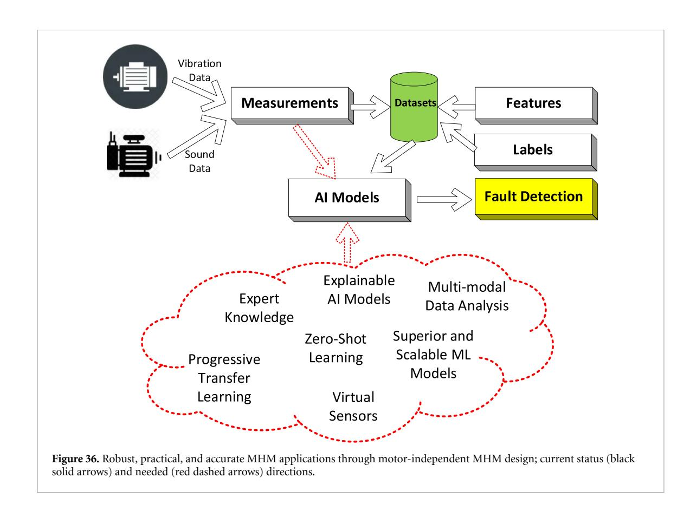

different sensor locations, and different fault types or severities can significantly degrade the detection performance [376].

For bearing and gear fault detection, the most common DL method is convolutional neural networks (CNNs) [373, 374]. However, numerous recent studies [388–390] have highlighted that CNNs with a homogeneous network configuration based on a first-order neuron model struggle to effectively learn problems with complex and highly nonlinear solution spaces [388–390] unless they incorporate sufficient network depth and complexity (such as variants of CNNs). To address this, self-organized operational neural networks (Self-ONNs) have been introduced, offering a high level of heterogeneity and self-organized operator optimization to enhance learning performance [389]. Recent research [374–376] has demonstrated the superior regression capabilities of Self-ONNs in tasks such as image segmentation, restoration, and denoising. Consequently, 1D Self-ONNs and novel Transfer Learning techniques have recently been applied to motor fault detection [374–376] to achieve state-of-the-art fault detection and health monitoring. Although fault detection accuracy has improved significantly with such lightweight network models, the aforementioned limitations and drawbacks still persist.

In brief, no AI method is readily available to address all these challenges and limitations yet. For a complete and reliable MHM, anomaly severity estimation with accurate localization is still an open problem, which requires prior knowledge of the machine, such as sensor setup and configuration, as well as historical anomaly data. Moreover, both the DL model and the DA approach should be dynamic, evolving, and multi-modal, which can use all possible data sources with the necessary transformations. Finally, AI-driven virtual sensors are an emerging need to boost sensorial data quality and resolution to perform cost-efficient and accurate MHM operations in real-time. Figure 36 presents the current and needed research directions to achieve this objective.

# **Advances in science and technology to meet challenges**

Recent DA approaches have attempted zero-shot learning (ZSL) for anomaly detection by transferring knowledge from the source domain (motor) data, where labeled fault data is available, to the target domain (motor) data, assuming a related distribution. Ironically, most of these approaches were still evaluated on the same machine, typically altering only a single working condition at a time to maintain the assumption of a related distribution. However, in some cases, significantly low fault detection

{89}------------------------------------------------

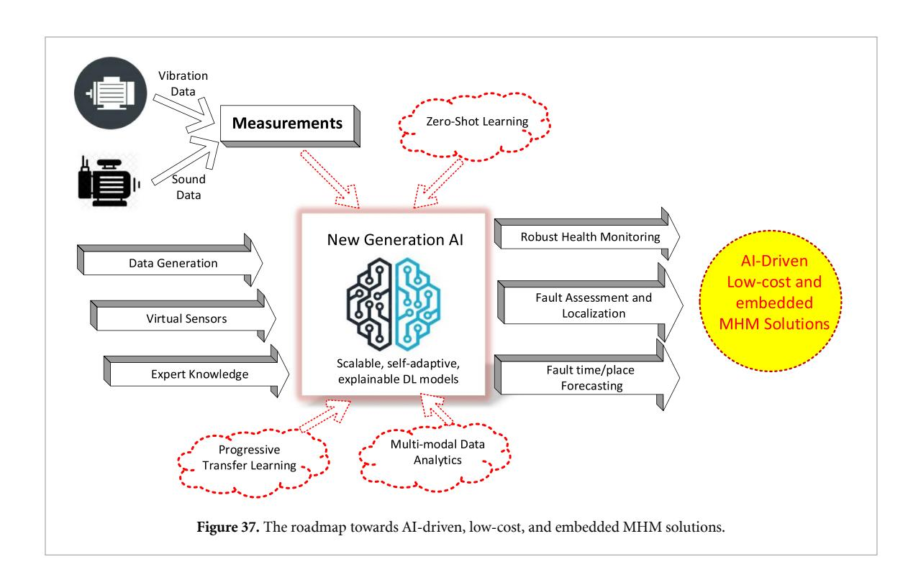

accuracies were still observed. Furthermore, regardless of the DA method employed, performance significantly deteriorated when compact or shallow classifiers were used for detection. On the other hand, training a deep and complex network not only increases the computational complexity but also requires large data for training, which might be infeasible. Kiranyaz *et al* [376] recently proposed the first ZSL with compact classifiers to detect anomalies in two different motors, each with a very high number of working conditions (e.g. 540). In the same study, the blind domain transition (DT) paradigm was introduced as an alternative to traditional DA methods. DT differs from other traditional DA methods since the source domain knowledge has been transferred to the *target* domain, and thus, the classifier can be trained directly in the *target* domain. However, it can only detect the existence of an anomaly, neither localize nor quantify it. Moreover, it is still susceptible to the earlier problems of the vibration signal, and its detection performance significantly deteriorates when those issues surface.

For elaborating on the use of sound information in MHM, a recent method [387] compared sound and vibration signals for MHM and concluded that sound can indeed offer a more robust anomaly detection performance, and issues encountered in the analysis of the vibration signal can be avoided. Another recent study [377] presented a pioneering approach that can transform sound into vibration, and thus, the aforementioned issues and drawbacks of the vibration signal can be avoided by such an interesting alternative.

# **Concluding remarks**

As illustrated in figure 37, beyond the recent advancements in ZSL and DA, achieving robust and accurate MHM still necessitates fundamental breakthroughs and innovative ideas to bridge the gaps between different systems and develop universally applicable models. This requires the creation of advanced algorithms capable of processing diverse data sources and sensorial configurations, ensuring consistent performance across various working conditions on different motors. Additionally, the integration of state-of-the-art sensor technologies and the application of big data analytics will be essential in enhancing the accuracy and reliability of MHM solutions. Collaboration among academia, industry, and government agencies will be crucial in driving R&D efforts and fostering the establishment of standardized protocols and frameworks. Ultimately, these advancements will lead to more efficient, cost-effective, and scalable MHM methodologies, significantly improving the safety and longevity of the critical lifespan of rotating machinery and motors.

{90}------------------------------------------------

# **27. Artificial intelligence for power grid resilience**

*Javad Mohammadi*1 *, Erika Ardiles-Cruz*2 *and Erik Blasch*2

1University of Texas at Austin, Austin, United States of America

2Air Force Research Laboratory, Materials and Manufacturing Directorate, Composites, Ceramics, Metallics, and Materials Awareness Division, Materials State Awareness Branch, 2230 10th Street, B655, Ste 1, WPAFB, Dayton, Ohio 45433, United States of America

Email: javadm@utexas.edu

#### **Status**

The electric power grid is the largest man-made machine, spanning from homes to cities and even continents [391]. The resilient operation of this critical infrastructure is key to our society and national security. The main functionality of the power grid, like any other supply-chain system, is to meet electricity demand. Unlike other supply chains, electric demand must be satisfied without delay. Hence, the supply-demand balance is the essence of power grid operation from which today's multifaceted operational procedures are built [392]. Power system operators manage their grids for normal and anticipated contingencies and failures. However, ensuring the resilience of power system operation is becoming increasingly challenging. From climate-triggered events, ever-increasing generation/demand intermittency, increased data center and consumer loads, and potential adversarial interventions; the electric network is facing unprecedented challenges. AI can significantly advance today's inference and decision-making tools used for managing the health of power grid operations [393]. In what follows, we will overview a few current and future challenges and then discuss how AI can help address these limitations.

### **Current and future challenges**

Key challenges that threaten the physical, cyber, and operational health of power systems include the infrastructure design, market demand and supply, as well as the data and analysis.

*External forces*: major components of every power system include electricity generation facilities, consumers, and transmission and distribution systems. The electricity delivery infrastructure (comprising transmission and distribution systems) is aging and suffers from underinvestment [394]. It is also exposed to physical and cyber threats and intrusions. Windstorms, wildfires, and extreme temperatures are stressing the structural health of the electric delivery system.

*Ever-increasing electricity demand*: at the same time, the grid is expected to support the ever-increasing electricity demand stemming from crypto mining, climate-induced events (e.g. heat waves), electrification trends (e.g. the adoption of electric vehicles), and energy-hungry data centers (supporting the development of the latest LLMs) [395].

*Regulation and supply challenges:* on the supply side, generation facilities are struggling to keep up with demand. The increased adoption of intermittent generation resources has increased the uncertainty of power grid operation and placed a high premium on fast-responding, flexible resources [396]. In addition, policy and regulatory barriers are limiting investments in the expansion of electricity delivery and generation infrastructure. Examples of these obstacles include the time-consuming and expensive process of permitting new transmission lines. Long waitlists for the interconnection of new generation facilities are another well-known issue.

*Data availability*: information comes from measurements which are dependent on acquisition methods, quality (accuracy, completeness, timeliness, consistency, etc), and accessibility. Data governance policies and regulations require privacy-preserving technologies (such as differential privacy, homomorphic encryption) and data sharing standards (such as IEEE P2810, IEEE 2030.5, etc). With the advent of generative data approaches, verification and validation of high-quality synthetic data from models (especially for simulating rare high-impact events) could be utilized for SHM.

*Deployment of AI:* integrating AI with legacy power systems raises standardization and compatibility challenges and often requires modernizing operation and maintenance models as well as regulatory guidelines [393]. Also, limited access to high-quality, time-synchronized data hinders the training and deployment of AI-based monitoring and control solutions. Caution should be utilized on where,

{91}------------------------------------------------

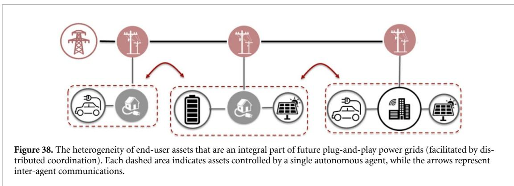

when, and how to leverage AI to minimize potential risks associated with a data-only responses for unobserved situations. AI standardizations could facilitate cost-benefit comparisons, operational transformations for maintenance that guides policy and regulatory support.

### **Advances in science and technology to meet challenges**

Efficient, fast, scalable, and secure monitoring and decision-making across the power grid are the foundation for enhancing power grid resilience and health. The grid's evolution is progressing from its two ends: bottom-up (from end-users and consumers) and top-down (from the generation side of the grid). The bottom-up transition of the grid is driven by connectivity and autonomy. Distributed and smallscale energy storage (e.g. batteries) and production assets (e.g. rooftop solar panels) are reshaping the distribution side of the power grid. The orchestration of these resources is key to the resilient operation of today's and future power systems. The top-down transition is fueled by the adoption of largescale intermittent renewable generation, the integration of state-of-the-art control hardware and adaptive operating software, as well as the hardening of cyber protections. All of these advances include operational and SHM IoT sensors to identify system performance.

Bottom-up perspective: small-scale energy assets (generation and flexible resources) are the bedrock of the end-user-led revolution in the power system. These assets come in different forms and shapes, with varying energy capacities and response rates. Their true power comes at scale [397]. Put differently, at scale, they will be a powerful asset ready to deploy at a moment's notice. Connectivity and autonomy (supported by AI/ML) are the two pillars necessary for creating a plug-and-play setup to orchestrate these geographically distributed (figure 38), heterogeneous assets that can connect or disconnect from the grid at a moment's notice (e.g. electric vehicles). Despite recent advancements (such as utilization of RL to adjust peer-to-peer communication parameters [398]), on-device computation load and the communication burden of IoT-connected energy assets have been hindering the deployment of plug-andplay coordination solutions [399]. AI-human teaming can adjust computation and communication parameters to reduce the computational load, speed up processing, and alleviate the communication burden [398, 400].

*Top-down approach*: power system operating software needs to be upgraded to address ongoing and future challenges in power systems. Despite recent efforts by the Department of Energy to showcase the performance of power systems' operating software to utilities and system operators, adoption has been slow. The complexity of power grid operation is ever-increasing and solving the energy dispatch decision-making problems are becoming more difficult. To this end, recent efforts have focused on integrating AI with energy optimization procedures (e.g. learning to optimize, figure 39) [401, 402] and utilizing LLMs [403] to process unstructured data for power grid optimization. Monitoring the health of power grid operation and preparing for viable contingencies (asset failures) is another area benefiting from AI integration [404]. Using the LOOP (Learning to Optimize the Optimization Process) framework offers a method of optimization for a utility u assessment over the system S states X.

Enabling AI-based solutions requires upgrading data collection infrastructure and adopting privacypreserving techniques along with transparent data governance standards and protocols, such as IEEE 3006.8 [405] and differential privacy [406]. The generation and verification of high-quality synthetic data (such as Texas A&M's synthetic dataset [407]) can help bridge this gap.

{92}------------------------------------------------

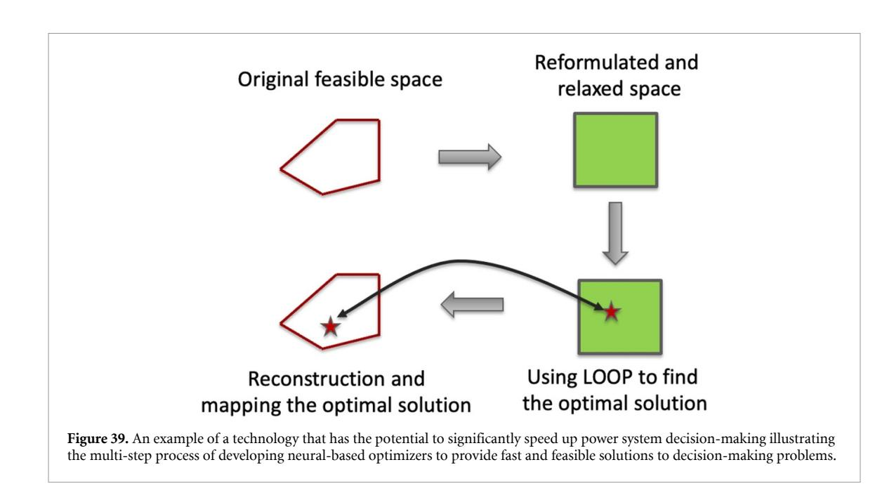

# **Concluding remarks**

- Electric system operators and utilities tend to be conservative—and for good reason. The lack of transparency and explainability in today’s AI solutions hinders their adoption in power grid control rooms. AI limitations, such as hallucinations and decision-making shortfalls, do not reassure them which requires further verification and validation experiments.
- Power system datasets are often locked due to security concerns. Except for a few publicly available examples, synthetic datasets fail to meet the needs of today's data-hungry AI tools. Bridging this gap requires partnerships, open datasets, and realistic testbeds to facilitate deployment AI bounds, standardizations, and certifications.
- The aging physical infrastructure of the power system demands continuous and advanced SHM, and the utilization of DL methods to analyze time series and imagery data are only expected to increase.
- Cyber hardening is another critical area where AI can play a transformative role. The growing number of small-scale energy assets increases the attack surface, making cybersecurity a greater challenge. AI offers essential tools for real-time threat detection, intrusion flagging, and boosting overall grid resilience and health.
- AI advancements, including improved explainability, performance guarantees, and computational efficiency, can facilitate their adoption by power system stakeholders.

# **Acknowledgments**

This work is supported by the NSF (2313768 and 2442420) and the AFOSR (FA9550-20-F-0005 and FA9550-24-1-0099). Opinions and conclusion do not reflect views of these organizations.

Certain images in this publication have been obtained by the author(s) from the Wikipedia/Wikimedia website, where they were made available under a Creative Commons licence or stated to be in the public domain. Please see individual figure captions in this publication for details. To the extent that the law allows, IOP Publishing disclaim any liability that any person may suffer as a result of accessing, using or forwarding the image(s). Any reuse rights should be checked and permission should be sought if necessary from Wikipedia/Wikimedia and/or the copyright owner (as appropriate) before using or forwarding the image(s).

# **Data availability statement**

{93}------------------------------------------------

# **ORCID iDs**

Simon Laflamme 0000-0002-0601-9664 Filippo Ubertini 0000-0002-5044-8482 Christine Knott 0009-0007-3474-6520 Amrita Kumar 0009-0008-9609-1424 Austin Downey 0000-0002-5524-2416 Patrick F Musgrave 0000-0003-1673-9929 Adrian S Wong 0000-0003-1199-3290 Marco Martino Rosso 0000-0002-9098-4132 Mohammad Hesam Soleimani-Babakamali 0000-0002-8792-5246 Onur Avci 0000-0003-0221-7126 Daniel J Inman 0000-0001-6195-1334 Genda Chen 0000-0002-0658-4356 Alice Cicirello 0000-0002-6556-2149 Eleni Chatzi 0000-0002-6870-240X Jingyi Yuan 0000-0002-2850-1582 Song Wen 0000-0002-8635-2458 Ligong Han 0000-0003-3166-0848 Genshe Chen 0000-0002-2656-9380 Sixiao Wei 0000-0003-1552-5232 Giuseppina Uva 0000-0001-6408-167X Sergio Ruggieri 0000-0001-5119-8967 Serkan Kiranyaz 0000-0003-1551-3397 Moncef Gabbouj 0000-0002-9788-2323 Javad Mohammadi 0000-0003-0425-5302

# **References**

[1] Di Mucci V M, Cardellicchio A, Ruggieri S, Nettis A, Ren`o V and Uva G 2024 Artificial intelligence in structural health management of existing bridges *Autom. Constr.* **167** 105719 [2] Farrar C R and Worden K 2013 *Structural Health Monitoring: A Machine Learning Perspective* (Wiley) [3] Martakis P, Reuland Y, Stavridis A and Chatzi E 2023 Fusing damage-sensitive features and domain adaptation towards robust damage classification in real buildings *Soil Dyn. Earthq. Eng.* **166** 107739 [4] Yan J, Cheng Y, Zhang F, Li M, Zhou N, Jin B, Wang H, Yang H and Zhang W 2025 Research on multimodal techniques for arc detection in railway systems with limited data *Struct. Health Monit.* **24** 14759217251336797 [5] Worden K, Farrar C R, Manson G and Park G 2007 The fundamental axioms of structural health monitoring *Proc. R. Soc. A* **463** 1639–44 [6] Cardellicchio A, Ruggieri S, Nettis A, Ren`o V and Uva G 2023 Physical interpretation of machine learning-based recognition of defects for the risk management of existing bridge heritage *Eng. Fail. Anal.* **149** 107237 [7] Li Z, Weng S, Xia Y, Yu H, Yan Y and Yin P 2024 Cross-domain damage identification based on conditional adversarial domain adaptation *Eng. Struct.* **321** 118928 [8] Laflamme S *et al* 2023 Roadmap on measurement technologies for next generation structural health monitoring systems *Meas. Sci. Technol.* **34** 093001 [9] Yang X, del Rey Castillo E, Zou Y, Whaterspoon L and Tan Y 2022 Automated semantic segmentation of bridge components from large-scale point clouds using a weighted superpoint graph *Autom. Constr.* **142** 104519 [10] Azimi M, Eslamlou A D and Pekcan G 2020 Data-driven structural health monitoring and damage detection through deep learning: state-of-the-art review *Sensors* **20** 2778 [11] Barzegar V, Laflamme S, Hu C and Dodson J 2022 Ensemble of recurrent neural networks with long short-term memory cells for high-rate structural health monitoring *Mech. Syst. Signal Process.* **164** 108201 [12] Cha Y J, Ali R, Lewis J and Büyüköztürk O 2024 Deep learning-based structural health monitoring *Autom. Constr.* **161** 105328 [13] Luleci F, Catbas F N and Avci O 2022 A literature review: generative adversarial networks for civil structural health monitoring *Front. Built Environ.* **8** 1027379 [14] Marano G C, Rosso M M, Aloisio A and Cirrincione G 2024 Generative adversarial networks review in earthquake-related engineering fields *Bull. Earthq. Eng.* **22** 3511–62 [15] Hutton P H *et al* 1981 Develop in-flight acoustic emission monitoring of aircraft to detect fatigue crack growth *Rev. Prog. QNDE* **V1** 459 [16] Bakse C 1996 *Airlift Tanker: History of U.S. Airlift and Tanker Forces* (Turner Publishing) [17] Chang F–K (ed) 2013 *Structural Health Monitoring 2013: A Roadmap to Intelligent Structures: Proceedings of the Ninth International Workshop on Structural Health Monitoring, September 10–12, 2013* (DEStech Publications Inc) [18] Güemes A (ed) 2006 *Structural Health Monitoring 2006: Proceedings of the Third European Workshop* (DEStech Publications, Inc) [19] Rajic N, Chiu W K, Veidt M, Mita A and Takeda N (eds) 2023 *Structural Health Monitoring: 9APWSHM* (Materials Research Forum LLC) [20] Lindgren E A 2023 Validated and deployable AI/ML for NDT data diagnostics *Mater. Eval.* **81** 35 [21] Lindgren E A, Aldrin J C and Motes D Nondestructive bolt hole eddy current crack characterization *Proc. 2024 Aircraft Structural Integrity Program Conf.*

{94}------------------------------------------------

[22] Ramirez B and Ramirez J 2018 *Douglass Montgomery's Introduction to Statistical Quality Control* (SAS Press) [23] Stach E *et al* 2021 Autonomous experimentation systems for materials development: a community perspective *Matter* **4** 2702–26 [24] Knott C E, Kabban C S and Lindgren E A 2024 Probability of detection for dependent observations: the repeated measures method *IEEE Trans. Reliab.* **74** 3152–65 [25] Wertz J, Homa L, Cherry M, O'Rourke S, Flournoy C and Blasch E 2024 A novel method for segmentation of titanium microtexture regions via sensor data fusion *Mater. Charact.* **210** 113770 [26] Liu D, Liu R and Xie M 2022 Nonparametric fusion learning: synthesize inferences from diverse sources using depth confidence distribution *J. Am. Stat. Assoc.* **117** 2086–104 [27] Chang F K and Guemes A *Proc. Int. Workshop for Structural Health Monitoring (IWSHM), 2013–2023* [28] Girard W, Tucker B, Bordick N, Lee S J, Kumar A, Zhang D, Li F, Chung H and Beard S 2013 Flight demonstration of a SHM system on an OH-58 aircraft *Structural Health Monitoring 2013* pp 1437–44 [29] Lindgren E, Buynak C, Aldrin J, Medina E and Derriso M 2009 Model-assisted methods for validation of structural health monitoring systems *7th Int. Workshop on Structural Health Monitoring* (*Stanford, USA*) [30] Rulli R, Dotta F, Prado G, Roach D and Rice T 2017 Advancements on the adoption of SHM damage detection technologies into embraer aircraft maintenance procedures (https://doi.org/10.12783/shm2017/13843) [31] SAE AIR 6892 *Structural Health Monitoring Considerations and Guidance Specific to Rotorcraft* [32] SAE ARP6461A *Guidelines for Implementation of Structural Health Monitoring on Fixed Wing Aircraft* [33] Chung H, Li F and Singhal T 2019 Sensor reliability in extreme environments for asset monitoring *Proc. 12th Int. Workshop on Structural Health Monitoring* (*Stanford, USA*) [34] Airbus 2014 Structural Health Monitoring: From the lab to the aircraft *FAST: Airbus Technical Magazine* pp 24–31 [35] Kumar A, Yadav S, Stephens D, Swindell P and Piotrowski D 2025 Evaluation of SMART layer sensor inspection for cracking around chemical milled area under simulated environment for commercial airplane *AIAA SCITECH 2025 Forum* p 1221 [36] Piotrowski D 2023 A look at the future NDT inspector—training, AI, & more *A4A NDT Forum* [37] Vooren A N, Fagerhus K B, Korsvik K, Joseph R, Yadav S and Kumar A 2023 Fielding a SHM system for an aged military aircraft *Proc. Int. Workshop for Structural Health Monitoring* (*Stanford CA*, *12–14 September*) [38] Valmet Corporation 2015 *iRoll: The Intelligent Roll* [39] Topac T, Ha S Y S, Chen X, Gamble L L, Inman D J and Chang F K 2022 Flight state monitoring of a morphing wing using multimodal distributed sensors-informed prediction models *AIAA* 2022-1473*. AIAA SCITECH* 2022 *Forum* [40] Topac T 2024 Bio-inspired flight awareness from distributed multimodal sensing *Doctoral dissertation* Stanford University (https://doi.org/10.3390/s24113441) [41] Airbus 2024 Skywise Core X: Accelerating digital transformation in aviation *Airbus Services: Digital Solutions* [42] Boeing 2024 *Optimized Maintenance Program (OMP): Statistical Analysis for Scheduled Maintenance Optimization* (Boeing Global Services: Maintenance & Engineering Consulting) [43] Gosliga J, Gardner P, Bull L A, Dervilis N and Worden K 2021 Foundations of population-based SHM, part II: heterogeneous populations—graphs, networks, and communities *Mech. Syst. Signal Process.* **148** 107144 [44] Gardner P, Bull L, Gosliga J, Dervilis N and Worden K 2021 Foundations of population-based SHM, part III: heterogeneous populations—mapping and transfer *Mech. Syst. Signal Process.* **149** 107142 [45] Michau G and Fink O 2019 Domain adaptation for one-class classification: monitoring the health of critical systems under limited information (arXiv:1907.09204) [46] Pan S J 2020 Transfer learning *Learning* **21** 1–2 [47] Zhang Y and Yang Q 2018 An overview of multi-task learning *Natl Sci. Rev.* **5** 30–43 [48] Gardner P, Bull L, Gosliga J, Poole J, Dervilis N and Worden K 2022 A population-based shm methodology for heterogeneous structures: transferring damage localisation knowledge between different aircraft wings *Mech. Syst. Signal Process.* **172** 108918 [49] Gardner P, Bull L, Dervilis N and Worden K 2021 Overcoming the problem of repair in structural health monitoring: metricinformed transfer learning *J. Sound Vib.* **510** 116245 [50] Figueiredo E, Omori Yano M, Da Silva S, Moldovan I and Adrian Bud M 2023 Transfer learning to enhance the damage detection performance in bridges when using numerical models *J. Bridge Eng.* **28** 04022134 [51] Marasco G, Moldovan I, Figueiredo E and Chiaia B 2024 Unsupervised transfer learning for structural health monitoring of urban pedestrian bridges *J. Civ. Struct. Health Monit.* **14** 1–17 [52] Li Y, Song Y, Jia L, Gao S, Li Q and Qiu M 2020 Intelligent fault diagnosis by fusing domain adversarial training and maximum mean discrepancy via ensemble learning *IEEE Trans. Ind. Inform.* **17** 2833–41 [53] Yosinski J, Clune J, Bengio Y and Lipson H 2014 How transferable are features in deep neural networks? *Advances in Neural Information Processing Systems* vol 4 pp 3320–8 [54] Dorafshan S, Thomas R J and Maguire M 2018 Comparison of deep convolutional neural networks and edge detectors for image-based crack detection in concrete *Constr. Build. Mater.* **186** 1031–45 [55] Zhang S, Zhang Q, Gu J, Su L, Li K and Pecht M 2021 Visual inspection of steel surface defects based on domain adaptation and adaptive convolutional neural network *Mech. Syst. Signal Process.* **153** 107541 [56] Cao P, Zhang S and Tang J 2018 Preprocessing-free gear fault diagnosis using small datasets with deep convolutional neural network-based transfer learning *IEEE Access* **6** 26241–53 [57] Teng S, Chen X, Chen G and Cheng L 2023 Structural damage detection based on transfer learning strategy using digital twins of bridges *Mech. Syst. Signal Process.* **191** 110160 [58] Dardeno T, Bull L, Mills R, Dervilis N and Worden K 2023 Hierarchical Bayesian modelling of a family of FRFs *Structural Health Monitoring 2023* (Destech Publications, Inc) pp 2897–905 [59] Bull L A, Di Francesco D, Dhada M, Steinert O, Lindgren T, Parlikad A K, Duncan A B and Girolami M 2023 Hierarchical Bayesian modeling for knowledge transfer across engineering fleets via multitask learning *Comput.-Aided Civ. Infrastruct. Eng.* **38** 821–48 [60] Huang Y, Beck J L and Li H 2019 Multitask sparse Bayesian learning with applications in structural health monitoring *Comput.- Aided Civ. Infrastruct. Eng.* **34** 732–54 [61] Xu Y, Bao Y, Zhang Y and Li H 2021 Attribute-based structural damage identification by few-shot meta learning with inter-class knowledge transfer *Struct. Health Monit.* **20** 1494–517 [62] Tsialiamanis G, Sbarufatti C, Dervilis N and Worden K 2024 On a meta-learning population-based approach to damage prognosis *Mech. Syst. Signal Process.* **209** 111119 [63] Bee S, Poole J, Worden K, Dervilis N and Bull L 2024 Multitask feature selection within structural datasets *Data-Centric Eng.* **5** e4

{95}------------------------------------------------

- [64] Hughes A J, Delo G, Poole J, Dervilis N and Worden K 2024 Quantifying the value of positive transfer: an experimental case study (arXiv:2407.14342) [65] Poole J, Gardner P, Hughes A, Mills R, Dardeno T, Dervilis N and Worden K 2023 Physics-informed transfer learning in pbshm: a case study on experimental helicopter blades *Structural Health Monitoring 2023* (DEStech Publications, Inc.) [66] Dardeno T A, Bull L A, Dervilis N and Worden K 2024 When does a bridge become an aeroplane? (arXiv:2411.18406) [67] Fan W *et al* 2024 A survey on rag meeting LLMs: towards retrieval-augmented large language models *Proc. 30th ACM SIGKDD Conf. on Knowledge Discovery and Data Mining* pp 6491–501 [68] Lewis P *et al* 2020 Retrieval-augmented generation for knowledge-intensive NLP tasks *Advances in Neural Information Processing Systems* vol 33 pp 9459–74 [69] Team G *et al* 2023 Gemini: a family of highly capable multimodal models (arXiv:2312.11805) [70] Li Y, Li Z, Zhang K, Dan R, Jiang S and Zhang Y 2023 Chatdoctor: a medical chat model fine-tuned on a large language model meta-ai (llama) using medical domain knowledge *Cureus* **15** e36304 [71] Kalla D, Smith N, Samaah F and Kuraku S 2023 Study and analysis of chat GPT and its impact on different fields of study *Int. J. Innovative Sci. Res. Technol.* **8** 827–33 [72] Szeliski R 2022 *Computer Vision: Algorithms and Applications* (Springer Nature) [73] LeCun Y, Bengio Y and Hinton G 2015 Deep learning *Nature* **521** 9 [74] Blasch E, Bossé E and Lambert D A 2012 ´ *High-level Information Fusion Management and Systems Design* (Artech House) [75] Xie S *et al* 2024 Utilizing ChatGPT as a scientific reasoning engine to differentiate conflicting evidence and summarize challenges in controversial clinical questions *J. Am. Med. Inf. Assoc.* **31** ocae100 [76] Tomar A and Burton H V 2021 Active learning method for risk assessment of distributed infrastructure systems *Comput.-Aided*
- *Civ. Infrastruct. Eng.* **36** 438–52 [77] Downey A *et al* 2024 Earthen embankment monitoring using LiDAR data by randomized consensus of topological data analysis *DDDAS'24* (*New Brunswick, NJ*) [78] Sado K, Peskar J, Downey A R, Ginn H L, Dougal R and Booth K 2024 Query-and-response digital twin framework using a multi-domain, multi-function image folio *IEEE Trans. Transp. Electrif.* **10** 7873–85 [79] Friel R and Sanyal A 2023 Chainpoll: a high efficacy method for LLM hallucination detection (arXiv:2310.18344) [80] Rahman M *et al* 2024 *Retrieval Augmented Generation for Robust Cyber Defense* (Pacific Northwest National Laboratory (PNNL)) [81] Darema F, Blasch E, Ravela S and Aved A J 2023 *Handbook of Dynamic Data Driven Applications Systems* (Springer) [82] Thelen A *et al* 2022 A comprehensive review of digital twin—part 1: modeling and twinning enabling technologies *Struct. Multidiscip. Optim.* **65** 354 [83] Satme J N, Yount R, Goujevskii N, Jannazzo L and Downey A R 2024 Sensor package deployment and recovery cone with integrated video streaming for rapid structural health monitoring *Smart Materials, Adaptive Structures and Intelligent Systems* vol 88322 (American Society of Mechanical Engineers) p V001T04A016 [84] Shuster L 2021 What does infrastructure have to do with social justice and equity? *Civ. Eng.* **91** 50–55 [85] Tanaka G, Yamane T, Héroux J B, Nakane R, Kanazawa N, Takeda S, Numata H, Nakano D and Hirose A 2019 Recent advances in physical reservoir computing: a review *Neural Netw.* **115** 100–23 [86] Karniadakis G E, Kevrekidis I G, Lu L, Perdikaris P, Wang S and Yang L 2021 Physics-informed machine learning *Nat. Rev. Phys.* **3** 422–40 [87] Lukoˇsevicˇius M and Jaeger H 2009 Reservoir computing approaches to recurrent neural network training *Comput. Sci. Rev.* **3** 127–49 [88] Markovi´c D, Mizrahi A, Querlioz D and Grollier J 2020 Physics for neuromorphic computing *Nat. Rev. Phys.* **2** 499–510 [89] National Academies of Sciences, E. and Medicine 2023 *Foundational Research Gaps and Future Directions for Digital Twins* (The National Academies Press) [90] He S and Musgrave P 2025 Physical reservoir computing on a soft bio-inspired swimmer *Neural Netw.* **181** 106766 [91] Tanaka K, Yang S-H, Tokudome Y, Minami Y, Lu Y, Arie T, Akita S, Takei K and Nakajima K 2021 Flapping-wing dynamics as a natural detector of wind direction *Adv. Intell. Syst.* **3** 2000174 [92] Wang J and Li S 2023 Building intelligence in the mechanical domain—Harvesting the reservoir computing power in origami to achieve information perception tasks *Adv. Intell. Syst.* **5** 2300086 [93] Zhang Y, Deshmukh A and Wang K W 2023 Embodying multifunctional mechano-intelligence in and through phononic metastructures harnessing physical reservoir computing *Adv. Sci.* **10** 2305074 [94] Masuda A, Takashima K and Sakai R 2023 Physical reservoir-based structural health monitoring: a preliminary study *Proc. SPIE* **12488** 124880L [95] Masuda A and Takashima K 2023 Physical reservoir-based health monitoring of a structure with nonlinear attachments *PHM Society Asia-Pacific Conf.* [96] Carroll T L 2023 *Computing with Dynamical Systems: Reservoir Computers* [97] Wringe C, Trefzer M and Stepney S 2025 Reservoir computing benchmarks: a tutorial review and critique *Int. J. Parallel Emergent Distrib. Syst.* **40** 1–39 [98] Ostachowicz W, Soman R and Malinowski P 2019 Optimization of sensor placement for structural health monitoring: a review *Struct. Health Monit.* **18** 963–88 [99] Deraemaeker A, Reynders E, De Roeck G and Kullaa J 2008 Vibration-based structural health monitoring using output-only measurements under changing environment *Mech. Syst. Signal Process.* **22** 34–56 [100] Brighenti F, Caspani V F, Costa G, Giordano P F, Limongelli M P and Zonta D 2024 Bridge management systems: a review on current practice in a digitizing world *Eng. Struct.* **321** 118971 [101] ASCE 2021 2021 *American Infrastructure Report Card: Bridges* [102] Hou B, Li X, Ma X, Du C, Zhang D, Zheng M, Xu W, Lu D and Ma F 2017 The cost of corrosion in China *npj Mater. Degrad.* **1** 4 [103] Zhou S, Demartino C, Xu J and Xiao Y 2021 Effectiveness of CFRP seismic-retrofit of circular RC bridge piers under vehicular lateral impact loading *Eng. Struct.* **243** 112602 [104] Pelle A, Briseghella B, Fiorentino G, Giaccu G F, Lavorato D, Quaranta G, Rasulo A and Nuti C 2023 Repair of reinforced concrete bridge columns subjected to chloride-induced corrosion with ultra-high performance fiber reinforced concrete *Struct. Concr.* **24** 332–44 [105] Wang X, Wu W, Du Y, Cao J, Chen Q and Xia Y 2024 Wireless IoT monitoring system in Hong Kong–Zhuhai–Macao bridge and edge computing for anomaly detection *IEEE Internet Things J.* **11** 4763–75

{96}------------------------------------------------

[106] Maruccio C, Quaranta G, De Lorenzis L and Monti G 2016 Energy harvesting from electrospun piezoelectric nanofibers for structural health monitoring of a cable-stayed bridge *Smart Mater. Struct.* **25** 085040 [107] Bhadra S, Thomson D J and Bridges G E 2013 A wireless embedded passive sensor for monitoring the corrosion potential of reinforcing steel *Smart Mater. Struct.* **22** 075019 [108] Khan S M, Atamturktur S, Chowdhury M and Rahman M 2016 Integration of structural health monitoring and intelligent transportation systems for bridge condition assessment: current status and future direction *IEEE Trans. Intell. Transp. Syst.* **17** 2107–22 [109] Kuˇsi´c K, Schumann R and Ivanjko E 2023 A digital twin in transportation: real-time synergy of traffic data streams and simulation for virtualizing motorway dynamics *Adv. Eng. Inf.* **55** 101858 [110] Ubertini F, Gentile C and Materazzi A L 2013 Automated modal identification in operational conditions and its application to bridges *Eng. Struct.* **46** 264–78 [111] Li T, Hou R, Zheng K, Zhang Z and Liu B 2024 Automated method for structural modal identification based on multivariate variational mode decomposition and its applications in damage characteristics of subway tunnels *Eng. Fail. Anal.* **163** 108499 [112] Rosso M M, Aloisio A, Parol J, Marano G C and Quaranta G 2023 Intelligent automatic operational modal analysis *Mech. Syst. Signal Process.* **201** 110669 [113] Rosso M M, Marasco G, Aiello S, Aloisio A, Chiaia B and Marano G C 2023 Convolutional networks and transformers for intelligent road tunnel investigations *Comput. Struct.* **275** 106918 [114] Joseph H, Quaranta G, Carboni B and Lacarbonara W 2024 Deep learning architectures for data-driven damage detection in nonlinear dynamic systems under random vibrations *Nonlinear Dyn.* **112** 20611–36 [115] Yuan F-G, Zargar S A, Chen Q and Wang S 2020 Machine learning for structural health monitoring: challenges and opportunities *Proc. SPIE* **11379** 1137903 [116] Scuro C, Lamonaca F, Porzio S, Milani G and Olivito R 2021 Internet of Things (IoT) for masonry structural health monitoring (SHM): overview and examples of innovative systems *Constr. Build. Mater.* **290** 123092 [117] Hinton G 2018 Deep learning—a technology with the potential to transform health care *JAMA* **320** 1101 [118] Krizhevsky A, Sutskever I and Hinton G E 2012 Imagenet classification with deep convolutional neural networks *Advances in Neural Information Processing Systems* pp 1097–105 [119] Sak H, Senior A W and Beaufays F 2014 Long short-term memory recurrent neural network architectures for large scale acoustic modeling [120] Vaswani A *et al* 2017 Attention is all you need *Advances in Neural Information Processing Systems* pp 5998–6008 [121] Gu A and Dao T 2023 Mamba: linear-time sequence modeling with selective state spaces (arXiv:2312.00752) [122] Croitoru F-A, Hondru V, Ionescu R T and Shah M 2023 Diffusion models in vision: a survey *IEEE Trans. Pattern Anal. Mach. Intell.* **45** 10850–69 [123] Liu Z *et al* 2024 Kan: Kolmogorov-Arnold networks (arXiv:2404.19756) [124] Chao M, Wei J and Lo Y 2018 Randomized deep segmentation net committee based on transfer learning to track the lung tumor target noninvasively in real time and to facilitate lung cancer stereotactic body radiation therapy delivery *USA Patent Pending Patent Appl. Pending* [125] Wei J, Deng J and Chao M 2024 3177: non-invasive motion tracking in radiotherapy of lung cancer via transfer learning networks *Radiother. Oncol.* **194** S4401–3 [126] Silver D *et al* 2016 Mastering the game of Go with deep neural networks and tree search *Nature* **529** 484–9 [127] Biswas S S 2023 Role of chat GPT in public health *Ann. Biomed. Eng.* **51** 868–9 [128] Touvron H *et al* 2023 Llama 2: open foundation and fine-tuned chat models (arXiv:2307.09288) [129] Shao L, Zhu F and Li X 2015 Transfer learning for visual categorization: a survey *IEEE Trans. Neural Netw. Learn. Syst.* **26** 1019– 34 [130] Xu F, Uszkoreit H, Du Y, Fan W, Zhao D and Zhu J 2019 Explainable AI: a brief survey on history, research areas, approaches and challenges *Natural Language Processing and Chinese Computing: 8th CCF Int. Conf., NLPCC 2019, Proc., Part II 8* (*Dunhuang, China*, *9–14 October 2019*) (Springer) pp 563–74 [131] Hielscher T, Khalil S, Virgona N and Hadigheh S 2023 A neural network based digital twin model for the structural health monitoring of reinforced concrete bridges *Structures* vol 57 (Elsevier) p 105248 [132] Dang H V, Tatipamula M and Nguyen H X 2021 Cloud-based digital twinning for structural health monitoring using deep learning *IEEE Trans. Ind. Inform.* **18** 3820–30 [133] Parida L and Moharana S 2024 Current status and future challenges of digital twins for structural health monitoring in civil infrastructures *Eng. Res. Express* **6** 022102 [134] Sakr M and Sadhu A 2024 Recent progress and future outlook of digital twins in structural health monitoring of civil infrastructure *Smart Mater. Struct.* **33** 033001 [135] Luleci F 2024 *Investigating Emerging Technologies In Civil Structural Health Monitoring: Generative Artificial Intelligence And Virtual Reality* [136] Hatami M, Qu Q, Chen Y, Kholidy H, Blasch E and Ardiles-Cruz E 2024 A survey of the real-time metaverse: challenges and opportunities *Future Internet* **16** 379 [137] Blasch E *et al* 2010 High Level Information Fusion developments, issues, and grand challenges: fusion 2010 panel discussion *Int. Conf. on Information Fusion* [138] Nikolenko S I 2021 *Synthetic Data for Deep Learning* vol 174 (Springer) [139] Devlin J, Chang M-W, Lee K and Toutanova K 2018 Bert: pre-training of deep bidirectional transformers for language understanding (arXiv:1810.04805) [140] Abdeljaber O, Avci O, Kiranyaz M S, Boashash B, Sodano H and Inman D J 2018 1-D CNNs for structural damage detection: verification on a structural health monitoring benchmark data *Neurocomputing* **275** 1308–17 [141] Zhang Y, Li Z, Hao R, Lin W, Li L and Su D 2023 High-fidelity time-series data synthesis based on finite element simulation and data space mapping *Mech. Syst. Signal Process.* **200** 110630 [142] Giglioni V, Poole J, Mills R, Venanzi I, Ubertini F and Worden K 2025 Transfer learning in bridge monitoring: laboratory study on domain adaptation for population-based SHM of multispan continuous girder bridges *Mech. Syst. Signal Process.* **224** 112151 [143] Liu S, Wang L, Zhang W, Sun W, Wang Y and Liu J 2024 Physics-informed optimization for a data-driven approach in landslide susceptibility evaluation *J. Rock Mech. Geotech. Eng.* **16** 3811–24 [144] Soleimani-Babakamali R, Soleimani-Babakamali M H, Heravi M A, Askari M, Avci O and Taciroglu E 2024 Transferring damage detection knowledge across rotating machines and framed structures: harnessing domain adaptation and contrastive learning *Mech. Syst. Signal Process.* **221** 111743

{97}------------------------------------------------

[145] Peng Z, Li J, Hao H and Zhong Y 2024 Smart structural health monitoring using computer vision and edge computing *Eng. Struct.* **319** 118809 [146] Soleimani-Babakamali M H, Soleimani-Babakamali R, Nasrollahzadeh K, Avci O, Kiranyaz S and Taciroglu E 2023 Zero-shot transfer learning for structural health monitoring using generative adversarial networks and spectral mapping *Mech. Syst. Signal Process.* **198** 110404 [147] Wang X, Chen Z, Sun W, Shao N, You Z, Xu J and Yan R 2024 A small sample piezoelectric impedance-based structural damage identification using signal reshaping-based enhance attention transformer *Mech. Syst. Signal Process.* **208** 111067 [148] Dodson J, Downey A, Laflamme S, Todd M D, Moura A G, Wang Y, Mao Z, Avitabile P and Blasch E 2022 High-rate structural health monitoring and prognostics: an overview *Data Science in Engineering, Volume 9: Proc. 39th IMAC, A Conf. and Exposition on Structural Dynamics 2021* (Springer International Publishing) pp 213–7 [149] Hong J, Laflamme S, Dodson J and Joyce B 2018 Introduction to state estimation of high-rate system dynamics *Sensors* **18** 217 [150] Huang G B, Zhu Q Y and Siew C K 2024 Real-time learning capability of neural networks *IEEE Trans. Neural Netw.* **17** 863–78 [151] Ismail Fawaz H, Forestier G, Weber J, Idoumghar L and Muller P A 2019 Deep learning for time series classification: a review *Data Min. Knowl. Discovery* **33** 917–63 [152] Thompson N C, Greenewald K, Lee K and Manso G F 2020 The computational limits of deep learning (arXiv:2007.05558) [153] Huang G B, Chen Y Q and Babri H A 2000 Classification ability of single hidden layer feedforward neural networks *IEEE Trans. Neural Netw.* **11** 799–801 [154] Misyris G S, Venzke A and Chatzivasileiadis S 2020 Physics-informed neural networks for power systems *2020 IEEE Power & Energy Society General Meeting (PESGM)* (IEEE) pp 1–5 [155] Alam K M R, Siddique N and Adeli H 2020 A dynamic ensemble learning algorithm for neural networks *Neural Comput. Appl.* **32** 8675–90 [156] Guo K, Sui L, Qiu J, Yao S, Han S, Wang Y and Yang H 2016 From model to FPGA: software-hardware co-design for efficient neural network acceleration *2016 IEEE Hot Chips 28 Symp. (HCS)* (IEEE) pp 1–27 [157] Jia W, Sun M, Lian J and Hou S 2022 Feature dimensionality reduction: a review *Complex Intell. Syst.* **8** 2663–93 [158] Shen S, Lu H, Sadoughi M, Hu C, Nemani V, Thelen A, Webster K, Darr M, Sidon J and Kenny S 2021 A physics-informed deep learning approach for bearing fault detection *Eng. Appl. Artif. Intell.* **103** 104295 [159] Razmarashooli A, Chua Y K, Barzegar V, Salazar D, Laflamme S, Hu C, Downey A, Dodson J and Schrader P T 2025 Real-time state estimation of nonstationary systems through dominant fundamental frequency using topological data analysis features *Mech. Syst. Signal Process.* **224** 112048 [160] Nguyen S, Shang B, Reven A and Chen G 2024 BIRDS: bridge inspection robot deployment systems *Final Report No.* INSPIRE-024*, INSpecting and Preserving Infrastructure through Robotic Exploration (INSPIRE)* (USDOT Tier 1 University Transportation Center, Missouri University of Science and Technology) (available at: https://inspire-utc.mst.edu/researchprojects/) [161] Otsuki Y, Nguyen S, La H and Wang Y 2023 Autonomous ultrasonic thickness measurement of steel bridge members using a climbing bicycle robot *ASCE J. Eng. Mech.* **149** 04023051 [162] Karim M M, Qin R, Yin Z and Chen G 2021 A semi-supervised self-training method to develop assistive intelligence for segmenting multiclass bridge elements from inspection videos *Struct. Health Monit.* **21** 835–52 [163] Mondal T G, Shi Z, Zhang H and Chen G 2025 Class-wise histogram matching-based domain adaptation in deep learning-based bridge element segmentation *J. Civ. Struct. Health Monit.* Accepted for publication 15(1), p 1–18 [164] Mondal T G, Edgmond N, Sneed L and Chen G 2013 A deep learning-informed design scheme for shear friction at concrete-toconcrete interface: recommendations for inclusion in AASHTO LRFD guidelines *J. Transp. Res. Board* **2678** 66–74 [165] AASHTO 2020 *AASHTO LRFD Bridge Design Specifications* 9th edn (American Association of State Highway and Transportation Officials) (available at: https://downloads.transportation.org/aashto\_catalog.pdf) [166] Ai Q, Liu Z, Meng W, Liu Q and Xie S Q 2024 Uncertainty compensated high-order adaptive iteration learning control for robotassisted upper limb rehabilitation *IEEE Trans. Autom. Sci. Eng.* **21** 7004–15 [167] Du Y, Wang H, Qiu S, Yao W, Xie P and Chen X 2018 An advanced adaptive control of lower limb rehabilitation rob*ot Front. Robot. AI* **5** 116 [168] Brown D F and Xie S Q 2024 Effectiveness of intelligent control strategies in robot-assisted rehabilitation–a systematic review *IEEE Trans. Neural Syst. Rehabil. Eng.* **32** 1828–40 [169] Luo S, Androwis G, Adamovich S, Nunez E, Su H and Zhou X 2023 Robust walking control of a lower limb rehabilitation exoskeleton coupled with a musculoskeletal model via deep reinforcement learning *J. Neuroeng. Rehabil.* **20** 34 [170] Alsubaie H and Alotaibi A 2023 A model-free control scheme for rehabilitation robots: integrating real-time observations with a deep neural network for enhanced control and reliability *Mathematics* **11** 4791 [171] Menner M, Neuner L, Lünenburger L and Zeilinger M 2020 Using human ratings for feedback control: a supervised learning approach with application to rehabilitation robotics *IEEE Trans. Robot.* **36** 789–801 [172] Ugartemendia A, Rosquete D, Gil J J, Díaz I and Borro D 2020 Machine learning for active gravity compensation in robotics: application to neurological rehabilitation systems *IEEE Robot. Autom. Mag.* **27** 78–86 [173] Samuel T, Armin L, Johannes F, Alejandro J, Ordóñez C and Sandra H 2021 Personalized rehabilitation robotics based on online learning control (arXiv:2110.00481 [cs.LG]) [174] Qian K, Li Z, Zhang Z, Li G and Xie S Q 2022 Data-driven adaptive iterative learning control of a compliant rehabilitation robot for repetitive ankle training *IEEE Robot. Autom. Lett.* **8** 656–63 [175] Na J, Kim H, Lee G and Nam W 2023 Deep domain adaptation, pseudo-labeling, and shallow network for accurate and fast gait prediction of unlabeled datasets *IEEE Trans. Neural Syst. Rehabil. Eng.* **31** 2448–56 [176] Trigili E, Grazi L, Crea S, Accogli A, Carpaneto J, Micera S, Vitiello N and Panarese A 2019 Detection of movement onset using EMG signals for upper-limb exoskeletons in reaching tasks *J. Neuroeng. Rehabil.* **16** 45 [177] Li M H, Wen Y, Gao X, Si J and Huang H 2021 Toward expedited impedance tuning of a robotic prosthesis for personalized gait assistance by reinforcement learning control *IEEE Trans. Robot.* **38** 407–20 [178] Wen Y, Si J, Brandt A, Gao X and Huang H 2019 Online reinforcement learning control for the personalization of a robotic knee prosthesis *IEEE Trans. Cybern.* **50** 2346–56 [179] Zhang Y F, Li S, Nolan K and Zanotto D 2020 Reinforcement learning assist-as-needed control for robot assisted gait training *8th BioRob Conf.* pp 785–90 [180] Han J, Lee J, Choi H, Kim J and Choi J 2022 Policy design for an ankle-foot orthosis using simulated physical human–robot interaction via deep reinforcement learning *IEEE Trans. Neural Syst. Rehabil. Eng.* **30** 2186–97

{98}------------------------------------------------

[181] Vree L and Carloni R 2021 Natural walking with musculoskeletal models using deep reinforcement learning *IEEE Robot. Autom. Lett.* **6** 4156–62 [182] Yang R, Zheng J and Song R 2022 Continuous mode adaptation for cable-driven rehabilitation robot using reinforcement learning *Front. Neurorobot.* **16** 1068706 [183] Sun Z, Li F, Duan X, Jin L, Lian Y, Liu S and Liu K 2021 A novel adaptive iterative learning control approach and human-in-theloop control pattern for lower limb rehabilitation robot in disturbances environment *Auton. Robots* **45** 595–610 [184] Yang J, Sun T, Cheng L and Hou Z 2022 Spatial repetitive impedance learning control for robot-assisted rehabilitation *IEEE/ASME Trans. Mechatronics* **28** 1280–90 [185] She Q, Hu B, Luo Z, Nguyen T and Zhang Y 2019 A hierarchical semi-supervised extreme learning machine method for EEG recognition *Med. Biol. Eng. Comput.* **57** 147–57 [186] Satme J, Yount R N, Smith J and Downey A R J 2023 Case study for using open-source UAV-deployable wireless sensor nodes for modal-based monitoring of civil infrastructure *Proc. 14th Int. Workshop on Structural Health Monitoring* (Destech Publications, Inc) (https://doi.org/10.12783/shm2023/36832) [187] Chowdhury P, Crews J, Mokhtar A, Oruganti S D R, Van Wyk R, Downey A R J, Flemming M, Bakos J D, Imran J and Khan S 2024 Distributed real-time soil saturation assessment in levees using a network of wireless sensor packages with conductivity probes *Proc. ASME 2024 Int. Mechanical Engineering Congress and Exposition (IMECE2024)* (*Portland, OR, USA*) [188] Algiriyage N, Prasanna R, Stock K, Doyle E E H and Johnston D 2022 Multi-source multimodal data and deep learning for disaster response: a systematic review *SN Comput. Sci.* **3** 92 [189] Yang L, Pang Y, Xiwang H, Wang Y, Kan Z and Song X 2024 An active learning-driven optimal sensor placement method considering sensor position distribution toward structural health monitoring *Struct. Multidiscip. Optim.* **67** 1–23 [190] Reiser L, Lisa Harper M F, Han B and Luan S 2018 FAIR: a call to make published data more findable, accessible, interoperable, and reusable *Mol. Plant* **11** 1105–8 [191] Malekloo A, Ozer E, AlHamaydeh M and Girolami M 2022 Machine learning and structural health monitoring overview with emerging technology and high-dimensional data source highlights *Struct. Health Monit.* **21** 1906–55 [192] Avci O, Abdeljaber O, Kiranyaz S, Hussein M, Gabbouj M and Inman D J 2021 A review of vibration-based damage detection in civil structures: from traditional methods to machine learning and deep learning applications *Mech. Syst. Signal Process.* **147** 107077 [193] Li H, Zhang Z, Li T and Si X 2024 A review on physics-informed data-driven remaining useful life prediction: challenges and opportunities *Mech. Syst. Signal Process.* **209** 111120 [194] Cho S, Yun C B, Lynch J P, Zimmerman A T, Spencer B F Jr and Nagayama T 2008 Smart wireless sensor technology for structural health monitoring of civil structures *Steel Struct.* **8** 267–75 [195] Wu Y, Sicard B and Gadsden S A 2024 Physics-informed machine learning: a comprehensive review on applications in anomaly detection and condition monitoring *Expert Syst. Appl.* **255** 124678 [196] Selvaraju R R, Cogswell M, Das A, Vedantam R, Parikh D and Batra D, 2017. Grad-CAM: visual explanations from deep networks via gradient-based localization *Proc. IEEE Int. Conf. on Computer Vision* pp 618–26 [197] Arrieta A B *et al* 2020 Explainable artificial intelligence (XAI): concepts, taxonomies, opportunities and challenges toward responsible AI *Inf. Fusion* **58** 82–115 [198] Nemani V, Biggio L, Huan X, Hu Z, Fink O, Tran A, Wang Y, Zhang X and Hu C 2023 Uncertainty quantification in machine learning for engineering design and health prognostics: a tutorial *Mech. Syst. Signal Process.* **205** 110796 [199] Su J, Vargas D V and Sakurai K 2019 One pixel attack for fooling deep neural networks *IEEE Trans. Evol. Comput.* **23** 828–41 [200] Ni P, Sun L, Yang J and Li Y 2022 Multi-end physics-informed deep learning for seismic response estimation *Sensors* **22** 3697 [201] Di Lorenzo D, Champaney V, Marzin J, Farhat C and Chinesta F 2023 Physics informed and data-based augmented learning in structural health diagnosis *Comput. Methods Appl. Mech. Eng.* **414** 116186 [202] Haywood-Alexander M, Liu W, Bacsa K, Lai Z and Chatzi E 2024 Discussing the spectrum of physics-enhanced machine learning: a survey on structural mechanics applications *Data-Centric Eng.* **5** e30 [203] Miele S, Karve P and Mahadevan S 2023 Multi-fidelity physics-informed machine learning for probabilistic damage diagnosis *Reliab. Eng. Syst. Saf.* **235** 109243 [204] Cross E J, Gibson S J, Jones M R, Pitchforth D J, Zhang S and Rogers T J 2022 Physics-informed machine learning for structural health monitoring *Structural Health Monitoring Based on Data Science Techniques* (Springer Nature Switzerland) pp 347–67 [205] Jiang C, Vega M A, Todd M D and Hu Z 2022 Model correction and updating of a stochastic degradation model for failure prognostics of miter gates *Reliab. Eng. Syst. Saf.* **218** 108203 [206] Li T, Zhao Z, Sun C, Cheng L, Chen X, Yan R and Gao R X 2021 WaveletKernelNet: an interpretable deep neural network for industrial intelligent diagnosis *IEEE Trans. Syst. Man Cybern.* **52** 2302–12 [207] Lu H, Nemani V P, Barzegar V, Allen C, Hu C, Laflamme S, Sarkar S and Zimmerman A T 2023 A physics-informed feature weighting method for bearing fault diagnostics *Mech. Syst. Signal Process.* **191** 110171 [208] Nascimento R G and Viana F A 2019 Fleet prognosis with physics-informed recurrent neural networks (arXiv:1901.05512) [209] Hu Z, Hu C, Mourelatos Z P and Mahadevan S 2019 Model discrepancy quantification in simulation-based design of dynamical systems *J. Mech. Des.* **141** 011401 [210] Bull L A, Gardner P A, Gosliga J, Rogers T J, Dervilis N, Cross E J, Papatheou E, Maguire A E, Campos C and Worden K 2021 Foundations of population-based SHM, Part I: homogeneous populations and forms *Mech. Syst. Signal Process.* **148** 107141 [211] Peherstorfer B, Willcox K and Gunzburger M 2018 Survey of multifidelity methods in uncertainty propagation, inference, and optimization *SIAM Rev.* **60** 550–91 [212] Li Z, Ruan D, Chen X, Qian Y, Yan J and Gühmann C 2025 Mutually complementary: physics-informed GAN based on simulated model for fault diagnosis *2025 IEEE Int. Conf. on Prognostics and Health Management (ICPHM)* (IEEE) pp 1–8 [213] Nelson M, Laflamme S, Hu C, Moura A G, Hong J, Downey A, Lander P, Wang Y, Blasch E and Dodson J 2022 Generated datasets from dynamic reproduction of projectiles in ballistic environments for advanced research (DROPBEAR) testbed *IOP SciNotes* **3** 044401 [214] Zeng Y, Zhao Z, Qian G, Todd M and Hu Z 2025 Enhancing Bayesian inference-based damage diagnostics through domain translation with application to miter gates *J. Mech. Des.* **147** 1–19 [215] Farrar C R and Worden K 2012 *Structural Health Monitoring: A Machine Learning Perspective* (Wiley) [216] Kapteyn M G and Willcox K E 2020 From physics-based models to predictive digital twins via interpretable machine learning (arXiv:2004.11356) [217] Liang H *et al* 2025 Harnessing hybrid digital twinning for decision-support in smart infrastructures *Data-Centric Eng.* **6** 6e43

{99}------------------------------------------------

[218] Cicirello A 2024 Physics-enhanced machine learning: a position paper for dynamical systems investigations *J. Phys.: Conf. Ser.* **2909** 1–12 [219] Cross E J, Rogers T J, Pitchforth D J, Gibson S J, Zhang S and Jones M R 2024 A spectrum of physics-informed Gaussian processes for regression in engineering *Data-Centric Eng.* **5** e8 [220] Brunton S L, Proctor J L and Kutz J N 2016 Discovering governing equations from data by sparse identification of nonlinear dynamical systems *Proc. Natl Acad. Sci.* **113** 3932–7 [221] Kamariotis A *et al* 2025 On the consistent classification and treatment of uncertainties in structural health monitoring *ASCE-ASME J. Risk Uncertain. Eng. Syst. B* **11** [222] Chen Y-P *et al* 2025 Uncertainty-aware digital twins: robust model predictive control using time-series deep quantile learning (arXiv:2501.10337) [223] Kessels B *et al* 2024 Uncertainty quantification in real-time parameter updating for digital twins using Bayesian inverse mapping models *Nonlinear Dyn.* **113** 7613–37 [224] Torzoni M, Tezzele M, Mariani S, Manzoni A and Willcox K E 2024 A digital twin framework for civil engineering structures *Comput. Methods Appl. Mech. Eng.* **418** 116584 [225] Hao W *et al* 2022 Deep Koopman learning of nonlinear time-varying systems (arXiv:2210.06272) [226] Kennedy M C and O'Hagan A 2001 Bayesian calibration of computer models *J. R. Stat. Soc. B* **63** 425–64 [227] Mitchell T M 1980 *The Need for Biases in Learning Generalizations CBM-TR 5-110* (Rutgers University) [228] Aykol M, Gopal C B, Anapolsky A, Herring P K, van Vlijmen B, Berliner M D, Bazant M Z, Braatz R D, Chueh W C and Storey B D 2021 Perspective—combining physics and machine learning to predict battery lifetime *J. Electrochem. Soc.* **168** 030525 [229] Fuentes R, Nayek R, Gardner P, Dervilis N, Rogers T, Worden K and Cross E J 2021 Equation discovery for nonlinear dynamical systems: a Bayesian viewpoint *Mech. Syst. Signal Process.* **154** 107528 [230] Kissas G, Mishra S, Chatzi E and De Lorenzis L 2024 The language of hyperelastic materials *Comput. Methods Appl. Mech. Eng.* **428** 117053 [231] Dong H, Liu M, Zhou K, Chatzi E, Kannala J, Stachniss C and Fink O 2025 Advances in multimodal adaptation and generalization: from traditional approaches to foundation models (arXiv:2501.18592) [232] Faghih Niresi K, Bissig H, Baumann H and Fink O 2024 Physics-enhanced graph neural networks for soft sensing in industrial internet of things *IEEE Internet Things J.* **11** 34978–90 [233] Razi-Kazemi A A and Shariatnasab M 2019 A new approach on prioritization of the circuit breakers for installation of online monitoring systems *IEEE Trans. Power Deliv.* **34** 1569–77 [234] Bastos A F and Santoso S 2019 Condition monitoring of circuit switchers for shunt capacitor banks through power quality data *IEEE Trans. Power Deliv.* **34** 1499–507 [235] Long H, Xu S, Cai H and Gu W 2024 Wind turbine condition monitoring based on scada data–image conversion *IEEE Trans. Instrum. Meas.* **73** 1–11 [236] Kuo C-L, Chen J-L, Chen S-J, Kao C-C, Yau H-T and Lin C-H 2017 Photovoltaic energy conversion system fault detection using fractional-order color relation classifier in microdistribution systems *IEEE Trans. Smart Grid* **8** 1163–74 [237] Chang G W, Hong Y-H and Li G-Y 2019 A hybrid intelligent approach for classification of incipient faults in transmission network *IEEE Trans. Power Deliv.* **34** 1785–94 [238] Hong K, Jin M and Huang H 2021 Transformer winding fault diagnosis using vibration image and deep learning *IEEE Trans. Power Deliv.* **36** 676–85 [239] Zhang W, Jiang J, Li B, Shen S, Lu Y, Tao Y and Fan L 2023 Residual lifetime evaluation of power transformers based on data fusion and wiener model *IEEE Trans. Power Deliv.* **38** 4189–99 [240] Mogos A S, Liang X and Chung C Y 2023 Distribution transformer failure prediction for predictive maintenance using hybrid one-class deep svdd classification and lightning strike failures data *IEEE Trans. Power Deliv.* **38** 3250–62 [241] Jannati M, Vahidi B and Hosseinian S H 2019 Incipient faults monitoring in underground medium voltage cables of distribution systems based on a two-step strategy *IEEE Trans. Power Deliv.* **34** 1647–56 [242] Yeganejou M, Ryan T, Reshadi M, Dick S and Lipsett M G 2024 Condition monitoring of underground power cables via powerline modems and anomaly detection *IEEE Trans. Power Deliv.* **39** 3–14 [243] Firuzi K, Vakilian M, Phung B T and Blackburn T R 2019 Partial discharges pattern recognition of transformer defect model by lbp & hog features *IEEE Trans. Power Deliv.* **34** 542–52 [244] Hussain G A, Hassan W, Mahmood F, Shafiq M, Rehman H and Kay J A 2023 Review on partial discharge diagnostic techniques for high voltage equipment in power systems *IEEE Access* **11** 51382–99 [245] Salimian M R and Aghamohammadi M R 2018 A three stages decision tree-based intelligent blackout predictor for power systems using brittleness indices *IEEE Trans. Smart Grid* **9** 5123–33 [246] Moghaddass R and Wang J 2018 A hierarchical framework for smart grid anomaly detection using large-scale smart meter data *IEEE Trans. Smart Grid* **9** 5820–9 [247] Ou J, Wang J, Xue J, Wang J, Zhou X, She L and Fan Y 2023 Infrared image target detection of substation electrical equipment using an improved faster r-cnn *IEEE Trans. Power Deliv.* **38** 387–98 [248] Alahi A, Goel K, Ramanathan V, Robicquet A, Fei-Fei L and Savarese S 2016 Social lstm: human trajectory prediction in crowded spaces *Proc. IEEE Conf. on Computer Vision and Pattern Recognition* pp 961–71 [249] Gupta A, Johnson J, Fei-Fei L, Savarese S and Alahi A 2018 Social gan: socially acceptable trajectories with generative adversarial networks *Proc. IEEE Conf. on Computer Vision and Pattern Recognition* pp 2255–64 [250] Yuan Y, Weng X, Ou Y and Kitani K M 2021 Agentformer: agent-aware transformers for socio-temporal multi-agent forecasting *Proc. IEEE/CVF Int. Conf. on Computer Vision* pp 9813–23 [251] Gao J, Sun C, Zhao H, Shen Y, Anguelov D, Li C and Schmid C 2020 Vectornet: encoding hd maps and agent dynamics from vectorized representation *Proc. IEEE/CVF Conf. on Computer Vision and Pattern Recognition* pp 11525–33 [252] Graber C and Schwing A 2020 Dynamic neural relational inference for forecasting trajectories *Proc. IEEE/CVF Conf. on Computer Vision and Pattern Recognition Workshops* pp 1018–9 [253] Gu J, Sun C and Zhao H 2021 Densetnt: end-to-end trajectory prediction from dense goal sets *Proc. IEEE/CVF Int. Conf. on Computer Vision* pp 15303–12 [254] Kipf T, Fetaya E, Wang K C, Welling M and Zemel R 2018 Neural relational inference for interacting systems *Int. Conf. on Machine Learning* (PMLR) pp 2688–97 [255] Li J, Yang F, Tomizuka M and Choi C 2020 Evolvegraph: multi-agent trajectory pre- diction with dynamic relational reasoning *Advances in Neural Information Processing Systems* vol 33 pp 19783–94

{100}------------------------------------------------

- [256] Salzmann T, Ivanovic B, Chakravarty P and Pavone M 2020 Trajectron++: dynamically-feasible trajectory forecasting with heterogeneous data *European Conf. on Computer Vision* (Springer) pp 683–700 [257] Wen S, Wang H and Metaxas D 2022 Learning interacting dynamic systems with neu- ral ordinary differential equations *Int. Conf. on Dynamic Data Driven Applications Systems* (Springer) pp 217–26 [258] Wen S, Wang H and Metaxas D 2022 Social ode: multi-agent trajectory forecasting with neural ordinary differential equations *European Conf. on Computer Vision* (Springer) pp 217–33 [259] Wen S, Wang H, Liu D, Zhangli Q and Metaxas D 2024 Second-order graph odes for multi-agent trajectory forecasting *Proc. IEEE/CVF Winter Conf. on Applications of Computer Vision* pp 5101–10 [260] Thelen A, Zhang X, Fink O, Lu Y, Ghosh S, Youn B D, Todd M D, Mahadevan S, Hu C and Hu Z 2023 A comprehensive review of digital twin—part 2: roles of uncertainty quantification and optimization, a battery digital twin, and perspectives *Struct. Multidiscip. Optim.* **66** 1 [261] Papadimitriou C and Katafygiotis L S 2004 Bayesian modeling and updating *Engineering Design Reliability Handbook* (CRC Press) pp 525–44 [262] Huang Y, Shao C, Wu B, Beck J L and Li H 2019 State-of-the-art review on Bayesian inference in structural system identification and damage assessment *Adv. Struct. Eng.* **22** 1329–51 [263] García-Macías E and Ubertini F 2022 Real-time Bayesian damage identification enabled by sparse PCE-Kriging meta-modelling for continuous SHM of large-scale civil engineering structures *J. Build. Eng.* **59** 105004 [264] Ebrahimian H, Astroza R, Conte J P and de Callafon R A 2017 Nonlinear finite element model updating for damage identification of civil structures using batch Bayesian estimation *Mech. Syst. Signal Process.* **84** 194–222 [265] Mehrjoo A, Tronci E M, Moynihan B, Moaveni B, Rüdinger F, McAdam R and Hines E 2025 Recursive Bayesian estimation of wind load on a monopile-supported offshore wind turbine using output-only measurements *Mech. Syst. Signal Process.* **224** 112183 [266] Sun H, Mordret A, Prieto G A, Toksöz M N and Büyüköztürk O 2017 Bayesian characterization of buildings using seismic interferometry on ambient vibrations *Mech. Syst. Signal Process.* **85** 468–86 [267] Ebrahimian H, Astroza R, Conte J P and Papadimitriou C 2018 Bayesian optimal estimation for output-only nonlinear system and damage identification of civil structures *Struct. Control Health Monit.* **25** e2128 [268] Behmanesh I, Moaveni B, Lombaert G and Papadimitriou C 2015 Hierarchical Bayesian model updating for structural identification *Mech. Syst. Signal Process.* **64** 360–76 [269] Beck J L and Au S-K 2002 Bayesian updating of structural models and reliability using Markov chain Monte Carlo simulation *J. Eng. Mech.* **128** 380–91 [270] Wang X, Hou R, Xia Y and Zhou X 2020 Laplace approximation in sparse Bayesian learning for structural damage detection *Mech. Syst. Signal Process.* **140** 106701 [271] Rogers T J, Worden K and Cross E J 2020 On the application of Gaussian process latent force models for joint input-stateparameter estimation: with a view to Bayesian operational identification *Mech. Syst. Signal Process.* **140** 106580 [272] Wang X, Li L, Beck J L and Xia Y 2021 Sparse Bayesian factor analysis for structural damage detection under unknown environmental conditions *Mech. Syst. Signal Process.* **154** 107563 [273] Kamariotis A, Chatzi E and Straub D 2022 Value of information from vibration-based structural health monitoring extracted via Bayesian model updating *Mech. Syst. Signal Process.* **166** 108465 [274] Moynihan B, Tronci E M, Hughes M C, Moaveni B and Hines E 2024 Virtual sensing via Gaussian Process for bending moment response prediction of an offshore wind turbine using SCADA data *Renew. Energy* **227** 120466 [275] Luo L, Song M, Zhong H, He T and Sun L 2024 Hierarchical Bayesian model updating of a long-span arch bridge considering temperature and traffic loads *Mech. Syst. Signal Process.* **210** 111152 [276] Arcieri G, Hoelzl C, Schwery O, Straub D, Papakonstantinou K G and Chatzi E 2023 Bridging POMDPs and Bayesian decision making for robust maintenance planning under model uncertainty: an application to railway systems *Reliab. Eng. Syst. Saf.* **239** 109496 [277] Ierimonti L, Cavalagli N, Venanzi I, García-Macías E and Ubertini F 2021 A transfer Bayesian learning methodology for structural health monitoring of monumental structures *Eng. Struct.* **247** 113089 [278] Sevieri G and De Falco A 2020 Dynamic structural health monitoring for concrete gravity dams based on the Bayesian inference
- *J. Civ. Struct. Health Monit.* **10** 235–50 [279] Zeng J, Todd M D and Hu Z 2023 Probabilistic damage detection using a new likelihood-free Bayesian inference method *J. Civ. Struct. Health Monit.* **13** 319–41 [280] Ierimonti L, Mariani F, Venanzi I and Ubertini F 2024 A Bayesian network-based framework for SHM data fusion supporting bridge management *Proc. Struct. Integr.* **62** 832–9 [281] Fawad M, Salamak M, Chen Q, Uscilowski M, Koris K, Jasinski M, Lazinski P and Piotrowski D 2025 Development of immersive bridge digital twin platform to facilitate bridge damage assessment and asset model updates *Comput. Ind.* **164** 104189 [282] Ng M S, Bock T, Kastner F and Langenberg S 2024 Digital transformation, sustainability and construction 5.0 *ISARC. Proc. Int. Symp. on Automation and Robotics in Construction* (IAARC Publications) vol 41 pp 1222–9 [283] Lu R and Brilakis I 2019 Digital twinning of existing reinforced concrete bridges from labelled point clusters *Autom. Constr.* **105** 102837 [284] Hackl J and Kohler J 2016 Reliability assessment of deteriorating reinforced concrete structures by representing the coupled effect of corrosion initiation and progression by Bayesian networks *Struct. Saf.* **62** 12–23 [285] Fan X and Hackl J 2024 Modeling of spatially embedded networks via regional spatial graph convolutional networks *Comput.- Aided Civ. Infrastruct. Eng.* **40** 427–44 [286] Hackl J, Adey B T, Wo´zniak M and Schümperlin O 2018 Use of unmanned aerial vehicle photogrammetry to obtain topographical information to improve bridge risk assessment *J. Infrastruct. Syst.* **24** 04017041 [287] Esfahani M E, Rausch C, Sharif M M, Chen Q, Haas C and Adey B T 2021 Quantitative investigation on the accuracy and precision of Scan-to-BIM under different modelling scenarios *Autom. Constr.* **126** 103686 [288] Bosché F, Ahmed M, Turkan Y, Haas C T and Haas R 2015 The value of integrating Scan-to-BIM and Scan-vs-BIM techniques for construction monitoring using laser scanning and BIM: the case of cylindrical MEP components *Autom. Constr.* **49** 201–13 [289] Chen Q, Harmanci Y E, Ou Y and Garcia de Soto B 2017 Robust IFC files to improve information exchange: an application for thermal energy simulation *2017 Proc. of ISEC* (International Structural Engineering and Construction Society) pp 1–6 [290] Theiler M and Smarsly K 2018 IFC Monitor–An IFC schema extension for modeling structural health monitoring systems *Adv. Eng. Inf.* **37** 54–65

{101}------------------------------------------------

[291] Rasmussen M H, Lefrançois M, Schneider G F and Pauwels P 2021 BOT: the building topology ontology of the W3C linked building data group *Semant. Web* **12** 143–61 [292] Zhang D M, Nie C, Zhang J Z, Huang H W and Huang X 2024 Consortium blockchain-based tunnel data bank for traceable sharing and treatment of structural health monitoring data *Autom. Constr.* **167** 105720 [293] Sanghavi S 2016 Aviation's predictive maintenance challenge [294] Decastro J A, Litt J S and Frederick D K A modular aero-propulsion system simulation of a large commercial aircraft engine *NASA/TM—*2008-215303 [295] Bell J 2018 *Condition–Based Maintenance Plus (CBM*+*) Guidebook* [296] Miller S 2019 Predictive maintenance using a digital twin *MathWorks* [297] Liu Z, Meyendorf N, Blasch E, Tsukada K, Liao M and Mrad N 2025 The role of data fusion in predictive maintenance using digital twins *Handbook of Nondestructive Evaluation 4.0 (Proc. AIP Conf.)* vol 1949 p 020023 [298] Gros X E 2001 *Applications of NDT Data Fusion* (Kluwer Academic Publishers) [299] Zhang J, Wang P, Yan R and Gao R X 2018 Long short-term memory for machine remaining life prediction *J. Manuf. Syst.* **48** 78–86 [300] Blundell C, Cornebise J, Kavukcuoglu K and Wierstra D 2015 Weight uncertainty in neural networks *32nd Int. Conf. on Machine Learning* (*Lille, France*) [301] Saxena A, Goebel K, Simon D and Eklund N 2008 Damage propagation modeling for aircraft engine run-to-failure simulation *2008 Int. Conf. on PHM* [302] Cozar J, Puerta J M and Gamez J A 2017 An application of dynamic BNs to condition monitoring and fault predication: a case study *Int. J. CIS* **10** 176–95 [303] Achillopoulou D V, Mitoulis S A, Argyroudis S A and Wang Y 2020 Monitoring of transport infrastructure exposed to multiple hazards: a roadmap for building resilience *Sci. Total Environ.* **746** 141001 [304] He Z, Li W, Salehi H, Zhang H, Zhou H and Jiao P 2022 Integrated structural health monitoring in bridge engineering *Autom. Constr.* **136** 104168 [305] Argyroudis S A *et al* 2022 Digital technologies can enhance climate resilience of critical infrastructure *Clim. Risk Manage.* **35** 100387 [306] An Y, Chatzi E, Sim S, Laflamme S, Blachowski B and Ou J 2019 Recent progress and future trends on damage identification methods for bridge structures *Struct. Control Health Monit.* **26** e2416 [307] National Highways (formerly Highways England) 2022 *CS 455: The Assessment of Concrete Highway Bridges and Structures* (Design Manual for Roads and Bridges (DMRB)) [308] Moore M, Phares B M, Graybeal B, Rolander D and Washer G ( Wiss, Janney, Elstner, and Associates) 2001 Reliability of visual inspection for highway bridges, volume i: final report, FHWA-RD-01-105 (available at: https://rosap.ntl.bts.gov/view/dot/33883) (Accessed 16 January 2025) [309] Brownjohn J M W 2007 Structural health monitoring of civil infrastructure *Phil. Trans. R. Soc. A* **365** 589–622 [310] Markogiannaki O, Xu H, Chen F, Mitoulis S A and Parcharidis I 2022 Monitoring of a landmark bridge using SAR interferometry coupled with engineering data and forensics *Int. J. Remote Sens.* **43** 95–119 [311] Worden K and Dulieu-Barton J M 2004 An overview of intelligent fault detection in systems and structures *Struct. Health Monit.* **3** 85–98 [312] Webb G T, Vardanega P J and Middleton C R 2015 Categories of SHM deployments: technologies and capabilities *J. Bridge Eng.* **20** 04014118 [313] Rodrigues M, Miguéis V L, Felix C and Rodrigues C 2024 Machine learning and cointegration for structural health monitoring of a model under environmental effects *Expert Syst. Appl.* **238** 121739 [314] Flah M, Nunez I, Chaabene W B and Nehdi M L 2021 Machine learning algorithms in civil structural health monitoring: a systematic review *Arch Comput. Methods Eng.* **28** 2621–43 [315] Izonin I, Kazantzi A K, Tkachenko R and Mitoulis S-A 2024 GRNN-based cascade ensemble model for non-destructive damage state identification: small data approach *Eng. Comput.* **41** 723–738 [316] Kazantzi A K, Moutsianos S, Bakalis K and Mitoulis S-A 2024 Cause-agnostic bridge damage state identification utilising machine learning *Eng. Struct.* **320** 118887 [317] Izonin I, Nesterenko I, Kazantzi A K, Tkachenko R, Muzyka R and Mitoulis S A 2024 Enhanced ANN-based ensemble method for bridge damage characterization using limited dataset *Sci. Rep.* **14** 24395 [318] Izonin I, Tkachenko R, Berezsky O, Krak I, Kovácˇ M and Fedorchuk M 2024 Improvement of the ANN-based prediction technology for extremely small biomedical data analysis *Technologies* **12** 112 [319] Iowa State University Nondestructive testing and evaluation (NDT&E) education (available at: www.nde-ed.org/) (Accessed January 2025) [320] Gandaneau W D, Harris D O and Harris G R [321] Komorowski J P, Forsyth D S, Bellinger N C and Hoeppner D W 2001 Life and damage monitoring-using NDI data interpretation for corrosion damage and remaining life assessments *Ageing Mechanisms and Control. Specialists' Meeting on LifeManagement Techniques for Ageing Air Vehicles, no. RTO-MP-*079 *(II)* pp 13–1–13 [322] Wang T, Feng K, Ling J, Liao M, Yang C, Neubeck R and Liu Z 2024 Pipeline condition monitoring towards digital twin system: a case study *J. Manuf. Syst.* **73** 256–74 [323] Meyer R M, Lareau J P, Crawford S L and Anderson M T 2014 Review of literature for model assisted probability of detection *Pacific Northwest National Laboratory, Richland, Washington* 99352*, USA, Techreport PNNL-*23714 [324] Peng X, Siggers K and Liu Z 2021 Performance assessment of multi-MFL inspection using feature-based POD *Insight-Non-Destr. Test. Cond. Monit.* **63** 592–6 [325] Yusa N, Chen W and Hashizume H 2016 Demonstration of probability of detection taking consideration of both the length and the depth of a flaw explicitly *NDT&E Int.* **81** 1–8 [326] Baskaran P, Pasadas D, Ramos H and Ribeiro A 2021 Integration of multiple response signals into the probability of detection modelling in eddy current NDE of flaws *NDT&E Int.* **118** 102401 [327] Singh R and Vrana J 2022 *The World of NDE 4.0: Let the Journey Begin* 1st edn (The American Society for Nondestructive Testing) [328] Meyendorf N, Ida N, Singh R and Vrana J 2023 NDE 4.0: progress, promise, and its role to industry 4.0 *NDT&E Int.* **140** 102957 [329] Liu Z, Meyendorf N, Blasch E, Tsukada K, Liao M and Mrad N 2025 Handbook of nondestructive evaluation 4.0 *Role of Data Fusion in Predictive Maintenance Using Digital Twins* 2nd edn (Springer Nature Switzerland) pp 1–23

{102}------------------------------------------------

[330] Gharehbaghi V R, Noroozinejad Farsangi E, Noori M, Yang T Y, Li S, Nguyen A, Málaga-Chuquitaype C, Gardoni P and Mirjalili S 2022 A critical review on structural health monitoring: definitions, methods, and perspectives *Arch. Comput. Methods Eng.* **29** 2209–35 [331] MIT 2021 Linee guida per la gestione del rischio dei point esistenti e delle Istruzioni operative per l'applicazione delle Linee Guida stesse (in Italian) [332] Spencer B F Jr, Hoskere V and Narazaki Y 2019 Advances in computer vision-based civil infrastructure inspection and monitoring *Engineering* **5** 199–222 [333] Fotouhi S, Pashmforoush F, Bodaghi M and Fotouhi M 2021 Autonomous damage recognition in visual inspection of laminated composite structures using deep learning *Compos. Struct.* **268** 113960 [334] Saleem M R, Park J W, Lee J H, Jung H J and Sarwar M Z 2021 Instant bridge visual inspection using an unmanned aerial vehicle by image capturing and geo-tagging system and deep convolutional neural network *Struct. Health Monit.* **20** 1760–77 [335] Perry B J, Guo Y, Atadero R and van de Lindt J W 2020 Streamlined bridge inspection system utilizing unmanned aerial vehicles (UAVs) and machine learning *Measurement* **164** 108048 [336] Hoskere V, Narazaki Y, Hoang T A and Spencer B F Jr 2020 MaDnet: multi-task semantic segmentation of multiple types of structural materials and damage in images of civil infrastructure *J. Civ. Struct. Health Monit.* **10** 757–73 [337] Jana D and Nagarajaiah S 2021 Computer vision-based real-time cable tension estimation in Dubrovnik cable-stayed bridge using moving handheld video camera *Struct. Control Health Monit.* **28** e2713 [338] Kromanis R and Kripakaran P 2021 A multiple camera position approach for accurate displacement measurement using computer vision *J. Civ. Struct. Health Monit.* **11** 661–78 [339] Redmon J 2016 You only look once: unified, real-time object detection *Proc. IEEE Conf. on Computer Vision and Pattern Recognition* [340] Zhang C, Chang C C and Jamshidi M 2020 Concrete bridge surface damage detection using a single-stage detector *Comput.- Aided Civ. Infrastruct. Eng.* **35** 389–409 [341] Xiong C, Zayed T and Abdelkader E M 2024 A novel YOLOv8-GAM-Wise-IoU model for automated detection of bridge surface cracks *Constr. Build. Mater.* **414** 135025 [342] Ruggieri S, Cardellicchio A, Nettis A, Ren`o V and Uva G 2025 Using attention for improving defect detection in existing RC bridges *IEEE Access* **13** 18994–9015 [343] Wang X, Demartino C, Narazaki Y, Monti G and Spencer B F Jr 2023 Rapid seismic risk assessment of bridges using UAV aerial photogrammetry *Eng. Struct.* **279** 115589 [344] Lei B, Wang N, Xu P and Song G 2018 New crack detection method for bridge inspection using UAV incorporating image processing *J. Aerosp. Eng.* **31** 04018058 [345] Hoskere V, Park J W, Yoon H and Spencer B F Jr 2019 Vision-based modal survey of civil infrastructure using unmanned aerial vehicles *J. Struct. Eng.* **145** 04019062 [346] Zhou B, Bau D, Oliva A and Torralba A 2018 Interpreting deep visual representations via network dissection *IEEE Trans. Pattern Anal. Mach. Intell.* **41** 2131–45 [347] Chen S, Duffield C, Miramini S, Raja B N K and Zhang L 2021 Life-cycle modelling of concrete cracking and reinforcement corrosion in concrete bridges: a case study *Eng. Struct.* **237** 112143 [348] Khazaee M, Derian P and Mouraud A 2022 A comprehensive study on SHM of wind turbine blades by instrumenting tower using machine learning methods *Renew. Energy* **199** 1568–79 [349] Kong K, Dyer K, Payne C, Hamerton I and Weaver P M 2023 Progress and trends in damage detection methods, maintenance, and data-driven monitoring of wind turbine blades—a review *Renew. Energy Focus* **44** 390–412 [350] Sasinthiran A, Gnanasekaran S and Ragala R 2024 A review of artificial intelligence applications in wind turbine health monitoring *Int. J. Sustain. Energy* **43** 2326296 [351] Yang Y, Liang F, Zhu Q and Zhang H 2024 An overview on structural health monitoring and fault diagnosis of offshore wind turbine support structures *J. Mar. Sci. Eng.* **12** 377 [352] Astolfi D, De Caro F and Vaccaro A 2023 Condition monitoring of wind turbine systems by explainable artificial intelligence techniques *Sensors* **23** 5376 [353] Zhao Z, Zhang J and Jiang D 2021 A deep learning-based approach for fault diagnosis of wind turbine blades using vibration signals *Renew. Energy* **164** 1591–603 [354] Liu Y, Xu X and Liu Z 2019 Data-driven health monitoring of wind turbine blades using machine learning algorithms *J. Renew. Sustain. Energy* **11** 043302 [355] Guan Z, Liu J and Zhang Y 2020 Structural health monitoring of wind turbine blades using deep learning: a review *Renew. Sustain. Energy Rev.* **134** 110370 [356] Chen X and Zhang L 2022 Transfer learning for wind turbine blade fault diagnosis in structural health monitoring systems *IEEE Trans. Ind. Electron.* **69** 4136–45 [357] Li Y and Wang X 2018 Multimodal sensor fusion for wind turbine blade health monitoring using machine learning *J. Mech. Sci. Technol.* **32** 2209–19 [358] Dizaji M S, Mao Z and Haile M 2023 A hybrid-attention-ConvLSTM-based deep learning architecture to extract modal frequencies from limited data using transfer learning *Mech. Syst. Signal Process.* **187** 109949 [359] Hosseini S and Soudani A 2020 Artificial intelligence techniques for wind turbine blade fault detection: a review and future directions *Mech. Syst. Signal Process.* **141** 106621 [360] Chen X, Ma M, Zhao Z, Zhai Z and Mao Z 2022 Physics-informed deep neural network for bearing prognosis with multisensory signals *J. Dyn. Monit. Diagn.* **1** 200–7 [361] Valente N A, Sarrafi A, Mao Z and Niezrecki C 2022 Streamlined particle filtering of phase-based magnified videos for quantified operational deflection shapes *Mech. Syst. Signal Process.* **177** 106948 [362] Ma M and Mao Z 2021 Deep wavelet sequence-based gated recurrent units for the prognosis of rotating machinery *Struct. Health Monit.* **20** 1794–804 [363] Ma M and Mao Z 2021 Deep-convolution-based LSTM network for remaining useful life prediction *IEEE Trans. Ind. Inform.* **17** 1658–67 [364] Sarrafi A, Mao Z, Poozesh V, Avitabile P and Niezrecki C 2018 Vibration-based damage detection in wind turbine blades using phase-based motion estimation and motion magnification *J. Sound Vib.* **421** 300–18 [365] Sheiati S and Chen X 2025 Advances in computer vision-based structural health monitoring techniques for wind turbine blades *Renew. Sustain. Energy Rev.* **224** 116078

{103}------------------------------------------------

[366] Gao Z, Cecati C and Ding S X 2015 A survey of fault diagnosis and fault-tolerant techniques—part I: fault diagnosis with modelbased and signal-based approaches *IEEE Trans. Ind. Electron.* **62** 3757–67 [367] Schoen R R, Habetler T G, Kamran F and Bartheld R G 1995 Motor bearing damage detection using stator current monitoring *IEEE Trans. Ind. Appl.* **31** 1274–9 [368] Do V T and Chong U-P 2011 Signal model-based fault detection and diagnosis for induction motors using features of vibration signal in two-dimension domain *Strojni*ˇ*ski Vestn.* **57** 655–66 [369] Qiao Z, He Y, Liao C and Zhu R Noise-boosted weak signal detection in fractional nonlinear systems enhanced by increasing potential-well width and its application to mechanical fault diagnosis *Chaos Solitons Fractals* **175** 2023 [370] Bellini A, Filippetti F, Tassoni C and Capolino G A 2008 Advances in diagnostic techniques for induction machines *IEEE Trans. Ind. Electron.* **55** 4109–25 [371] Lou X S and Loparo K A 2004 Bearing fault diagnosis based on wavelet transform and fuzzy inference *Mech. Syst. Signal Process.* **18** 1077–95 [372] Zhang S, Zhang S, Wang B and Habetler T G 2020 Deep learning algorithms for bearing fault diagnostics—a comprehensive review *IEEE Access* **8** 29857–81 [373] Avci O, Abdeljaber O, Kiranyaz S, Sassi S, Ibrahim A and Gabbouj M 2022 One-dimensional convolutional neural networks for real-time damage detection of rotating machinery *Rotating Machinery, Optical Methods & Scanning LDV Methods, Volume 6: Proc. 39th IMAC, A Conf. and Exposition on Structural Dynamics 2021* pp 73–83 [374] Ince T, Kiranyaz S, Eren L, Askar M and Gabbouj M 2016 Real-time motor fault detection by 1-D convolutional neural networks *IEEE Trans. Ind. Electron.* **63** 7067–75 [375] Ince T, Malik J, Devecioglu O C, Kiranyaz S, Avci O, Eren L and Gabbouj M 2021 Early bearing fault diagnosis of rotating machinery by 1D self-organized operational neural networks *IEEE Access* **9** 139260–70 [376] Kiranyaz S, Devecioglu O C, Alhams A, Sassi S, Ince T, Abdeljaber O, Avci O and Gabbouj M 2024 Zero-shot motor health monitoring by blind domain transition *Mech. Syst. Signal Process.* **210** 111147 [377] Devecioglu O C *et al* 2023 Sound-to-vibration transformation for sensorless motor health monitoring (arXiv:2305.07960) [378] Altaf M, Uzair M, Naeem M, Ahmad A, Badshah S, Shah J A and Anjum A 2019 Automatic and efficient fault detection in rotating machinery using sound signals *Acoust. Aust.* **47** 125–39 [379] Zhang D, Stewart E, Entezami M, Roberts C and Yu D 2020 Intelligent acoustic-based fault diagnosis of roller bearings using a deep graph convolutional network *Measurement* **156** 107585 [380] Nakamura H, Asano K, Usuda S and Mizuno Y 2021 A diagnosis method of bearing and stator fault in motor using rotating sound based on deep learning *Energies* **14** 1319 [381] Lu J, Wang K, Chen C and Ji W 2023 A deep learning method for rolling bearing fault diagnosis based on attention mechanism and graham angle field *Sensors* **23** 5487 [382] Kim E, Tan C A, Mathew J, Kosse V and Yang B-S 2007 A comparative study on the application of acoustic emission technique and acceleration measurements for low speed condition monitoring *Proc. 12th Asia Pacific Vibrat. Conf.* pp 1–11 [383] Mba D 2001 The detection of shaft-seal rubbing in large-scale turbines using acoustic emission *Proc. 14th Int. Congress Condition Monitoring Diagnostic Engineering Management (COMADEM)* (*Manchester, UK*) pp 21–28 [384] Tan C K and Mba D 2005 Limitation of acoustic emission for identifying seeded defects in gearboxes *J. Nondestruct. Eval.* **24** 11–28 [385] Tran T and Lundgren J 2020 Drill fault diagnosis based on the scalogram and MEL spectrogram of sound signals using artificial intelligence *IEEE Access* **8** 203655–66 [386] Gundewar S K and Kane P V 2022 Rolling element bearing fault diagnosis using supervised learning methods- artificial neural network and discriminant classifier *Int. J. Syst. Assur. Eng. Manage.* **13** 2876–94 [387] Kiranyaz S, Devecioglu O C, Alhams A, Sassi S, Ince T, Avci O and Gabbouj M 2024 Exploring sound vs. vibration for robust fault detection on rotating machinery *IEEE Sens. J.* **24** 23255–64 [388] Kiranyaz S, Ince T, Iosifidis A and Gabbouj M 2017 Generalized model of biological neural networks: progressive operational perceptrons *Int. Joint Conf. on Neural Networks (IJCNN)* [389] Kiranyaz S, Malik J, Gabbouj M, Gabbouj M and Gabbouj M 2021 Self-organized operational neural networks with generative neurons *Neural Netw.* **140** 294–308 [390] Malik J, Kiranyaz S and Gabbouj M 2021 Self-organized operational neural networks for severe image restoration problems *Neural Netw.* **135** 201–11 [391] Kar S, Hug G, Mohammadi J and Moura J M F 2014 Distributed state estimation and energy management in smart grids: a consensus+innovations approach *IEEE J. Sel. Top. Signal Process.* **8** 1022–38 [392] Wood A J, Wollenberg B F and Sheblé G B 2013 *Power Generation, Operation, and Control* (Wiley) [393] Xie L, Weng Y and Rajagopal R 2023 *Data Science and Applications for Modern Power Systems* (Springer) [394] Vilaplana L, Angel J, Yang G, Monaco R, Bergaentzlé C, Ackom E and Morais H 2024 Digital versus grid investments in electricity distribution grids: informed decision-making through system dynamics *Available at SSRN* p 4971423 [395] Seyyedi A Z G, Akbari E, Rashid S M, Nejati S A and Gitizadeh M 2024 Application of robust optimized spatiotemporal load management of data centers for renewable curtailment mitigation *Renew. Sustain. Energy Rev.* **204** 114793 [396] Wang Y, Tieshi L, Yinghui L, Shao N and Wang Y 2024 Spot market clearing model and flexibility premium assessment method considering flexible regulation of virtual power plants *IEEE Access* **12** 54843–54 [397] Mathieu J 2022 Enabling the operation of future grids using new tools in control theory and AI *Winter Issue of The Bridge on Frontiers of Engineering* vol 51 [398] Yuhan D, Meiyi L, Mohammadi J, Blasch E, Aved A, Ferris D, Morrone P and Cruz E A 2022 Learning assisted agent-based energy optimization: a reinforcement learning based consensus+ innovations approach *North American Power Symposium (NAPS)* (IEEE) pp 1–6 [399] Joshi A, Capezza S, Alhaji A and Chow M-Y 2023 Survey on AI and machine learning techniques for microgrid energy management systems *IEEE/CAA J. Autom.* **10** 1513–29 [400] Meiyi L and Mohammadi J 2023 Machine learning infused distributed optimization for coordinating virtual power plant assets (arXiv:2310.17882) [401] Amos B 2023 Tutorial on amortized optimization *Found. Trends® Mach. Learn.* **16** 592–732 [402] Li M, Kolouri S and Mohammadi J 2023 Learning to solve optimization problems with hard linear constraints *IEEE Access* **11** 59995–60004

{104}------------------------------------------------

[403] Choi S L *et al* 2024 eGridGPT: trustworthy AI in the control room *No. NREL/TP-*5D00-87740 (National Renewable Energy Laboratory (NREL)) [404] Velloso A and Van Hentenryck P 2021 Combining deep learning and optimization for preventive security-constrained DC optimal power flow *IEEE Trans. Power Syst.* **36** 3618–28 [405] IEEE Std 3006.8–2021 2021 *IEEE Standard for Design and Methodology of Reliability Analysis for Industrial and Commercial Power Systems* pp 1–61 [406] Yang M, Guo T, Zhu T, Tjuawinata I, Zhao J and Lam K-Y 2024 Local differential privacy and its applications: a comprehensive survey *Comput. Stand Interfaces* **89** 103827 [407] Texas A&M University Electric Grid Datasets (available at: https://electricgrids.engr.tamu.edu/)