{0}------------------------------------------------

# **Online Cyber-Physical Neural Network Model for Real-Time Hybrid Simulation**

Faisal Nissar Malik1 | Liang Cao1 | James Ricles1 | Austin Downey2,3

1Civil and Environmental Engineering, Lehigh University, Bethlehem, Pennsylvania, USA | 2Mechanical Engineering, University of South Carolina, Columbia, South Carolina, USA | 3Civil and Environmental Engineering, University of South Carolina, Columbia, South Carolina, USA

**Correspondence:** James Ricles ([jmr5@lehigh.edu](mailto:jmr5@lehigh.edu))

**Received:** 8 May 2025 | **Revised:** 18 July 2025 | **Accepted:** 29 July 2025

**Keywords:** banded rotary friction damper | constrained unscented Kalman filter | cyber-physical simulation | LSTM neural network | online model updating | physics-based neural network | real-time hybrid simulation

# **ABSTRACT**

Real-time hybrid simulation (RTHS) is an experimental testing methodology that divides a structural system into an analytical and an experimental substructure. The analytical substructure is modeled numerically, and the experimental substructure is modeled physically in the laboratory. The two substructures are kinematically linked together at their interface degrees of freedom, and the coupled equations of motion are solved in real-time to obtain the response of the complete system. A key challenge in applying RTHS to large or complex structures is the limited availability of physical devices, which makes it difficult to represent all required experimental components simultaneously. The present study addresses this challenge by introducing Online Cyber-Physical Neural Network (OCP-NN) models–neural network-based models of physical devices that are integrated in real-time with the experimental substructure during an RTHS. The OCP-NN framework leverages real-time data from a single physical device (i.e., the experimental substructure) to replicate its behavior at other locations in the system, thereby significantly reducing the need for multiple physical devices. The proposed method is demonstrated through RTHS of a two-story reinforced concrete frame subjected to seismic excitation and equipped with Banded Rotary Friction Dampers (BRFDs) in each story. BRFDs are challenging to model numerically due to their complex behavior which includes backlash, stick-slip phenomena, and inherent device dynamics. Consequently, BRFDs were selected to demonstrate the proposed framework. In the RTHS, one BRFD is modeled physically by the experimental substructure, while the other is represented by the OCP-NN model. The results indicate that the OCP-NN model can accurately capture the behavior of the devic

# **1 Introduction**

Real-time hybrid simulation (RTHS), also known as cyber-physical simulation, is an experimental testing methodology that integrates numerical modeling and physical testing to evaluate the dynamic response of structural systems subjected to realistic loading scenarios such as earthquakes, wind and tsunami. In an RTHS, the structural system is divided into an analytical and an experimental substructure. The analytical substructure is

modeled numerically, such as through finite element modeling, while the experimental substructure is physically present in a laboratory. The two substructures are kinematically linked at their interface degrees-of-freedom (DOF), and the resulting equations of motion are solved in real-time, allowing an accurate evaluation of the systems’ performance under dynamic loading. RTHS offers a cost-effective alternative to traditional experimental approaches such as shake table testing. By combining physical testing and numerical modeling, it achieves high accuracy in

This is an open access article under the terms of the [Creative Commons Attribution License](https://creativecommons.org/licenses/by/4.0/), which permits use, distribution and reproduction in any medium, provided the original work is properly cited.

{1}------------------------------------------------

assessing the performance of a structural system and the response modification devices, including dampers, base isolation systems, and others, at a significantly reduced cost.

A significant challenge in RTHS occurs when the number of experimental components installed in a structure exceeds the number of physical devices available in the laboratory. To address this issue, researchers have incorporated numerical models of such devices leveraging Online Model Updating (OMU) techniques to enhance the accuracy of the models. OMU dynamically adjusts the parameters of the numerical model based on the measured real-time response of the experimental substructure, thereby improving the accuracy of the simulation. Hashemi et al. [1] implemented OMU in a hybrid simulation of an elastic frame, where the left column was represented experimentally and the right column was modeled numerically. Moment-rotation measurements at the base of the physical column were used to update the spring coefficients at the base of the numerically modeled column. Shao et al. [2] extended this approach by employing an Unscented Kalman Filter (UKF) for parameter estimation in an RTHS of a small-scale three-story shear frame. The bottom story was represented physically and the remaining stories were modeled numerically. The UKF was employed for OMU of the numerically modeled stories based on the real-time response of the experimentally modeled story. Mei et al. [3] utilized a UKF for OMU in a hybrid simulation of a reinforced concrete bridge with tall piers. The UKF was used to identify concrete constitutive parameters in real-time, improving the accuracy of the numerical substructure and enhancing the prediction of damage evolution. The results from the aforementioned studies indicated that OMU enhances the accuracy of the numerical models in comparison to pre-calibrated models without OMU. Al-Subaihawi et al. [4] utilized a UKF for OMU of the nonlinear Maxwell model to accurately represent nonlinear viscous dampers in an RTHS of a two-story reinforced concrete frame subjected to strong ground motions. The study demonstrated that the UKF can effectively capture the nonlinear behavior of the viscous damper with high accuracy.

Although the UKF and its variants are widely used for OMU in RTHS, its performance is fundamentally constrained by the accuracy of the underlying constitutive routine. Specifically, if the constitutive routine when incorporated into a numerical model cannot adequately capture the complex behavior of a device, even when parameters are updated in real-time, the UKF's estimations remain inaccurate. Moreover, the UKF may suffer from numerical instability or reduced accuracy when applied to systems exhibiting strong nonlinearities. It also struggles to track system dynamics effectively when the system's parameters evolve rapidly in time.

Neural networks (NNs) have been recognized as universal function approximators [5, 6] making them suitable candidates for surrogate modeling in various applications. Consequently, several researchers have used NNs as surrogate models for the dynamic response analysis of nonlinear structural systems through data-driven [7] or physics-informed [8–10] models. These studies used NNs, trained on simulated data, to predict structural responses under dynamic excitations, highlighting their ability to effectively learn and represent the complex behavior of structural systems from the training data.

Several researchers have explored the potential of NNs in RTHS. For instance, Mucha [11] used artificial NNs to replace the analytical substructure in an RTHS of a bicycle frame, where a nonlinear shock absorber was used as the experimental substructure. Bas and Moustafa [12] used a Long Short-Term Memory (LSTM) based model to replace the analytical substructure in an RTHS of a one-story steel frame, where a linear brace was the experimental substructure. Although these studies demonstrated that NNs could serve as a viable alternative to finite element modeling to represent the analytical substructure, their application remains constrained because of several limitations. First, these studies primarily replaced simple analytical substructures, which could otherwise be effectively modeled using conventional FEA, offering limited impact. Second, complete substitution of analytical substructures with NNs does not allow a detailed evaluation of structural performance, particularly at the member level. Finally, extending these approaches to larger multi degree-of-freedom (MDOF) systems, where member-level performance evaluation is critical, would require obtaining response from the NN at multiple DOFs. This would require large NN models, substantial training data, and complex architectures, which may not achieve real-time computational performance. Recent studies have employed NNs to partially replace complex analytical substructures to enhance computational efficiency in soil-foundation-structure interaction problems under wind [13] and earthquake [14] loadings.

Although several studies have investigated the use of NNs as alternatives to finite element models, significant gaps remain in their application to augment experimental substructures in an RTHS. To the best of authors' knowledge, no prior work has integrated NNs in an RTHS to complement the experimental substructure under insufficient availability of physical devices. This study introduces a novel approach that combines physical devices and NNs to develop accurate online NN-based models for RTHS. The proposed method is validated on a two-story reinforced concrete special moment-resisting frame (RC-SMRF) equipped with Banded Rotary Friction Dampers (BRFDs) as the experimental substructure. In this setup, the first-story damper is represented by a physical device, while the second-story damper is modeled using an Online Cyber-Physical Neural Network (OCP-NN) model. The OCP-NN model leverages real-time measurements from the physical device during an RTHS to replicate its behavior at the second-story. Two OCP-NN modeling strategies are proposed: (a) a data-driven model that directly predicts the output force and (b) a physics-based model that estimates the parameters of a numerical model of the device in real-time. The physics-based OCP-NN model is further used to investigate the impact of shortcomings in the constitutive routine formulation, which results in the numerical model's inability to fully capture the device's dynamic behavior. To assess the relative performance of the proposed approach, both OCP-NN models are benchmarked against a Constrained Unscented Kalman Filter (CUKF), typically used for OMU in RTHS. Although the validation is performed using a BRFD, the proposed framework is generalizable and applicable to a broad class of experimental substructures within the RTHS paradigm.

The paper is organized as follows. Section 2 introduces the prototype building, the proposed RTHS framework, and the OCP-NN models. Section 3 presents the results of a validation study

{2}------------------------------------------------

**FIGURE 1** | Floor plan of the prototype building and the detailing of the beams and columns.

and compares the performance of OCP-NN models relative to conventional techniques. Section 4 presents and assesses the results of the RTHS experiments. Section 5 summarizes the procedure and discusses its implementation to other RTHSs. Finally, Section 6 summarizes the key findings and conclusions of the study.

### **2 Proposed RTHS Framework With OCP-NN models**

Section 2.1 outlines the prototype structure employed to demonstrate the proposed framework, followed by a detailed description of the RTHS configuration incorporating the OCP-NN models in Section 2.2. The architecture and training methodology of OCP-NN models are presented in Section 2.3. Section 2.4 describes OMU using a CUKF, which serves as a baseline for benchmarking the performance of the OCP-NN models.

# **2.1 Prototype Structure**

The prototype structure used in this study is a two-story RC-SMRF designed by Kolay and Ricles [15]. The prototype structure is assumed to be an office building located in Los Angeles, California on a stiff soil (soil type D). The floor plan and detailing of beams and columns are shown in Figure 1. The RC-SMRF without the dampers was designed according to ASCE 7-10 [16], and the beams and columns were designed and detailed according to ACI 318 [17]. The columns are  $457 \times 416$  mm in cross section and designed using 27.5 MPa compressive strength concrete. Each column has a total of eight #9 bars of 414 MPa yield strength as shown in Figure 1. The floor and roof beams are  $305 \times 559$  mm and  $305 \times 457$  mm in cross section, respectively, and are designed using concrete of 27.5 MPa compressive strength. The beams of the first floor are reinforced with two #8 bars in the top and bottom of their cross section and the roof beams are reinforced with two #7 bars in the top and bottom of their cross sections. Note that the objective of the study is not to

assess the performance of the structure but to assess the accuracy of the OCP-NN models. To this end, the north-south RC-SMRF in the middle of the floor plan is used as the analytical substructure and is fitted with BRFDs [18] in each story.

The BRFD features a rotating drum with three steel bands, lined with a ceramic friction material (GGA-Cured, Rigid), wrapped around the drum. The pretension force in the bands is applied through two Tolomatic RSA50 BN02 electric actuators with a stroke of  $\pm 89$  mm. When subjected to external excitation, the rotation of the drum produces an increasing contact pressure profile, which is minimum at the slack end and maximum at the taut end of the bands. As the drum rotates, a frictional torque is produced to counteract the applied force. This phenomenon, known as the self-energizing mechanism, allows the damper to achieve a high friction capacity with minimal energy input. The BRFD has a stroke of  $\pm 45$  mm and a variable force capacity that depends on the applied pretension force.

The maximum force capacity of the damper can be regulated by adjusting the pretension in the bands using the electric actuators. For the study reported herein, the damper was operated in passive mode, where the electric actuator pretension forces are defined before each test. The pretension force is achieved using displacement control, where the displacement is held fixed in each electric actuator after achieving the target pretension force. In their fixed displaced positions, the electric actuator forces undergo changes as the drum rotates. Under the drum rotation, the maximum damper force achieved is the target damper force capacity. The BRFD features a large amplification ( $\approx 140$ ) of the electric actuator pretension forces and produces exceptional energy dissipation [19]. However, its complex force-deformation behavior presents significant challenges for accurate numerical modeling.

The BRFD is shown in Figure 2a, and its force-deformation behavior for a harmonic excitation is shown in Figure 2b. The device exhibits a characteristic reduction in stiffness during

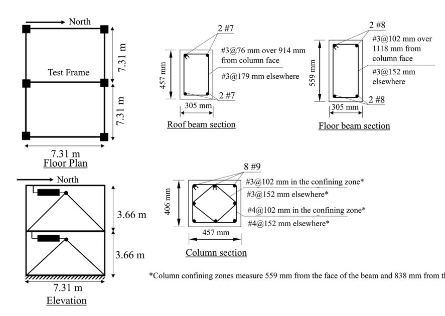

{3}------------------------------------------------

**FIGURE 2** | The experimental substructure test setup used in the study; (a) Banded Rotary Friction Damper (BRFD), (b) force-deformation, and (c) force-velocity behavior of the damper under a sinusoidal excitation of amplitude 16.5 mm and frequency 0.5 Hz.

**TABLE 1** | Coefficients of LuGre dry friction model obtained from characterization test at a damper output force of 23 kN.

| Coefficient | $\sigma_0$  | $\sigma_1$  | $\sigma_2$ | $F_{c,neg}$ | $F_{c,pos}$ | $F_{s,neg}$ | $F_{s,pos}$ | $v_s$     |
|-------------|-------------|-------------|------------|-------------|-------------|-------------|-------------|-----------|
| Value       | 6442.5 kN/m | 29.61 kNs/m | 0 kNs/m    | 19.75 kN    | 22.91 kN    | 21.93 kN    | 24.43 kN    | 0.025 m/s |

load reversals, commonly referred to as backlash, as shown in the figure. The force-deformation response of the damper also exhibits chattering, which is more pronounced in the second and third quadrants after the device reaches its peak force, a phenomenon labeled as “*Device Dynamics*” in the figure. This chattering is attributed to the dynamic interaction between the drum and the bands. Although a detailed investigation of this phenomenon is outside the scope of this study, modeling it is critical for RTHS as it can affect the total energy dissipated by the damper [20] and consequently, the response of the structure. These complex characteristics make BRFDs an ideal choice for validating the accuracy of the OCP-NN framework.

The LuGre dry friction model [21] is generally used to model the hysteretic behavior of friction devices, including BFRDs, [18, 22], due to its ability to capture the general hysteretic response of such devices. The output force from the LuGre dry friction model is given by:

$$F = \sigma_0 z + \sigma_1 \dot{z} + \sigma_2 v \quad (1)$$

where  $v$  is the velocity at the interface between the drum and the bands,  $\sigma_0$  represents the aggregate bristle stiffness,  $\sigma_1$  represents the microdamping,  $\sigma_2$  is the viscous friction, and  $z$  is an evolutionary variable given by:

$$\dot{z} = v - \sigma_0 \frac{|v|}{g(v)} z \quad (2)$$

$$g(v) = F_c + (F_s - F_c)e^{-\frac{v}{v_s}} \quad (3)$$

In Equation (3)  $F_c$ ,  $F_s$ , and  $v_s$  are the Coulomb friction, the static friction, and the Stribeck velocity, respectively. The coefficients of the LuGre dry friction model for the given damper are estimated using Particle Swarm Optimization and are provided in Table 1. The damper force-deformation behavior predicted by the LuGre dry friction model using these coefficients is shown in Figure 2b,c. The LuGre dry friction model is able

to capture the general hysteretic response; however, it fails to capture the aforementioned backlash effect and the inherent device dynamics. Coble et al. [22] proposed a combined NN-LuGre model which enhanced the prediction accuracy of the conventional LuGre model by using a multi-layer perceptron to approximate  $\sigma_0$ . Although the enhanced model was able to model backlash under harmonic oscillations, the model did not perform adequately under dynamic loading and was unable to capture the aforementioned device dynamics.

The experimental substructure comprises the BRFD, an MTS-hydraulic actuator, a foundation beam, and a load cell positioned between the BRFD and the actuator to measure the restoring force, as shown in Figure 2a. The damper frame, connections, and electric actuators are considered to be a part of the experimental substructure. To minimize delay and amplitude error in the actuator-imposed displacement and ensure precise actuator control, the adaptive time series (ATS) compensation algorithm [23] is used.

The analytical substructure consists of the structure without the dampers. Since the experimental substructure is a one-half scale damper with a maximum force capacity of 25 kN, the analytical substructure is scaled down by a value of two. The scaling of the analytical substructure followed the similarity law where acceleration and stress are both preserved in the full-scale and reduced-scale models, as often done in experimental structural testing. Consequently, by dimensional analysis, for a scale factor  $\Lambda$  associated with the dimensions of the model, the time axis is scaled by  $\sqrt{\Lambda}$  and the mass by  $\Lambda^2$ .

In the reduced-scale model, four dampers are installed in parallel at each story, providing a maximum combined damper capacity of 100 kN per story. Since the dampers act in parallel, the total restoring force at each story is obtained by summing the individual contributions from each damper. Accordingly, the measured force from a single damper is scaled by a factor of four to represent the total restoring force at the story level. For instance, in the first story, the restoring force is obtained by multiplying

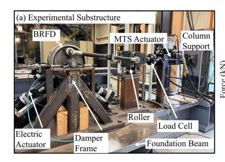

{4}------------------------------------------------

**TABLE 2 |** Natural periods and participation factors for the first two modes.

| Mode   | Period (s) | Participation factor (%) |
|--------|------------|--------------------------|
| First  | 0.39       | 92                       |
| Second | 0.12       | 8                        |

the measured force from the experimental substructure by four. Similarly, at the second-story, the output of the NN model is scaled by the same factor to simulate the contribution of the four parallel dampers.

The beams and columns of the analytical substructure are modeled using explicit force-based fiber elements (FBE) [15], and the reinforced concrete sections are modeled using the modified Kent-Park concrete model with degrading linear unloading and reloading paths and zero tensile strength. The gain in concrete strength due to confinement is captured by using different concrete stress-strain relationships for the core and the cover of the cross sections. The reinforcing bars are modeled using the modified Giuffre-Menegotto-Pinto model with kinematic hardening. To obtain objective element and section responses in the FBE elements, the plastic hinge integration method proposed by Scott and Feneves [24] is used. The sections at each integration point are divided into 5, 5, and 10 fibers for the top cover, bottom cover, and core, respectively, over the depth of the cross section. The beam-column joints are assumed to be rigid and are modeled with a 5.7% rigid offset at the end of the element adjacent to the column face. Geometric nonlinearities are accounted through a lean-on  $P - \Delta$  column. The mass of the structure is calculated based on the tributary seismic mass area and is lumped at the node located at the center of the floor and roof beams in the horizontal direction. It was observed that the dampers do not undergo large deformation due to the analytical substructure being a stiff RC frame. Therefore, the mass of the structure is increased by a factor of two to introduce a greater extent of damage in the structure and, consequently, increasing the deformation demand in the dampers. The benefits of the increased mass are twofold: (a) higher deformations are observed in the test specimen, and (b) the natural period of the structure increases, resulting in lower vibration frequencies and reduced structural velocities. The latter is particularly advantageous given the velocity limitation of the hydraulic actuator, which has a maximum capacity of 330 mm/s. The natural periods and the participation factors for the first two modes are provided in Table 2. Since a half-scale model of the analytical substructure is used, the time axis is scaled down by a factor of  $\sqrt{0.5}$  during the RTHS to maintain similarity.

## 2.2 | RTHS Configuration with the OCP-NN Model

The RTHS configuration with the integrated OCP-NN model is shown in Figure 3, and a flowchart of the RTHS simulation is shown in Figure 4. The system is divided into an analytical substructure that is modeled numerically using HyCoM-3D [25], an experimental substructure that physically models the first-story damper, and the OCP-NN model that numerically models the second-story damper using real-time data from the experimental substructure. The simulation coordinator conducts the

simulation and maintains synchronization across all substructures. Synchronization is maintained on the servo-hydraulic actuator controller at a frequency of 1024 Hz. The explicit dissipative model-based MKR- $\alpha$  integration algorithm developed by Kolay and Ricles [26] is used to solve the coupled equations of motion. This integration algorithm solves the following weighted equations of motion:

$$\mathbf{M} \hat{\mathbf{X}}_{i+1} + \mathbf{C} \hat{\mathbf{X}}_{i+1-\tau_f} + \mathbf{R} \mathbf{I}_{i+1-\tau_f} = \mathbf{F}_{i+1-\tau_f}^{\text{ext}} \quad (4)$$

where  $(\cdot)_{i+1-\tau_f} = (1 - \alpha_f)(\cdot)_{i+1} + \alpha_f(\cdot)_{\mathbf{M}}$ ,  $\mathbf{M}$  and  $\mathbf{C}$  are the mass and damping matrices, respectively, and  $\hat{\mathbf{X}}_{i+1-\tau_f}$ ,  $\mathbf{R} \mathbf{I}_{i+1-\tau_f}$ , and  $\mathbf{F}_{i+1-\tau_f}$  are the weighted velocity, restoring force, and external applied load vectors, respectively.  $\hat{\mathbf{X}}$  in Equation (4) is defined as:

$$\hat{\mathbf{X}}_{i+1} = (\mathbf{I} - \alpha_3) \hat{\mathbf{X}}_{i+1} + \alpha_3 \hat{\mathbf{X}}_i \quad (5)$$

In Equation (5)  $\mathbf{I}$  is the identity matrix, while  $\hat{\mathbf{X}}_{i+1}$  and  $\hat{\mathbf{X}}_i$  are the acceleration vectors at the  $(i+1)$  and  $i^{\text{th}}$  timestep, respectively. The kinematic relationships for calculating the displacement vector  $\hat{\mathbf{X}}_{i+1}$  and the velocity vector  $\hat{\mathbf{X}}_{i+1}$  for the subsequent timestep are:

$$\hat{\mathbf{X}}_{i+1} = \mathbf{X}_i + \Delta t \hat{\mathbf{X}}_i + \Delta t^2 \alpha_2 \hat{\mathbf{X}}_i \quad ; \quad \hat{\mathbf{X}}_{i+1} = \hat{\mathbf{X}}_i + \Delta t \alpha_1 \hat{\mathbf{X}}_i \quad (6a,b)$$

and the acceleration vector  $\hat{\mathbf{X}}_{i+1}$  for the next timestep is calculated as:

$$\hat{\mathbf{X}}_{i+1} = (\mathbf{M} - \mathbf{M} \alpha_3)^{-1} (\mathbf{F}_{i+1-\tau_f}^{\text{ext}} - \mathbf{C} \hat{\mathbf{X}}_{i+1-\tau_f} - \mathbf{R} \mathbf{I}_{i+1-\tau_f} - \mathbf{M} \alpha_2 \hat{\mathbf{X}}_i) \quad (7)$$

where  $\alpha_1$ ,  $\alpha_2$ , and  $\alpha_3$  are the model-dependent integration parameter matrices of size  $N_{dof} \times N_{dof}$ , where  $N_{dof}$  is the total number of DOFs of the system, and are calculated as:

$$\alpha_1 = \alpha^{-1} \mathbf{M} \quad ; \quad \alpha_2 = (0.5 + \gamma) \alpha_1 \quad (8a,b)$$

$$\alpha_3 = \alpha^{-1} (\alpha_m \mathbf{M} + \alpha_f \gamma \Delta t \mathbf{C}_{\text{min}} + \alpha_f \beta \Delta t^2 \mathbf{K}_{\text{min}}) \quad (9)$$

where,  $\alpha = \mathbf{M} + \gamma \Delta t \mathbf{C}_{\text{min}} + \beta \Delta t^2 \mathbf{K}_{\text{min}}$ ,  $\gamma = 0.5 - \alpha_m + \alpha_f$ ,  $\beta = 0.25(1 - \alpha_m + \alpha_f)^2$ , and

$$\alpha_m = \frac{2 \rho_\infty^3 + \rho_\infty^2 - 1}{\rho_\infty^3 + \rho_\infty^2 + \rho_\infty + 1} \quad \alpha_f = \frac{\rho_\infty}{\rho_\infty + 1} \quad (10a,b)$$

 $\mathbf{K}_{\text{min}}$  and  $\mathbf{C}_{\text{min}}$  are the initial stiffness and damping matrices of the complete system, and  $\rho_\infty \in [1, 0]$ ,  $\rho_\infty$  controls the amount of numerical energy dissipation, where  $\rho_\infty = 1$  and 0 indicate zero and the maximum numerical energy dissipation, respectively [27]. The restoring force vector for the  $(i+1)^{\text{th}}$  timestep ( $\mathbf{R} \mathbf{I}_{i+1}$ ) is calculated as:

$$\mathbf{R} \mathbf{I}_{i+1} = \mathbf{R} \mathbf{I}_{i+1}^* + \mathbf{R} \mathbf{I}_{i+1}^c + \mathbf{R} \mathbf{I}_{i+1}^{\text{NN}} \quad (11)$$

where  $\mathbf{R}_{i+1}^*$ ,  $\mathbf{R}_{i+1}^c$ ,  $\mathbf{R}_{i+1}^{\text{NN}}$  are the restoring force vectors of the analytical, the experimental substructure, and the OCP-NN model, respectively.

The RTHS simulation begins by selecting the timestep  $\Delta t$ , the high-frequency spectral radius  $\rho_\infty$ , and the number of steps  $N$  in the simulation. The model-dependent integration parameter

{5}------------------------------------------------

**FIGURE 3** | RTHS configuration showing the one-half scale analytical substructure, the corresponding experimental substructure and the OCP-NN model.

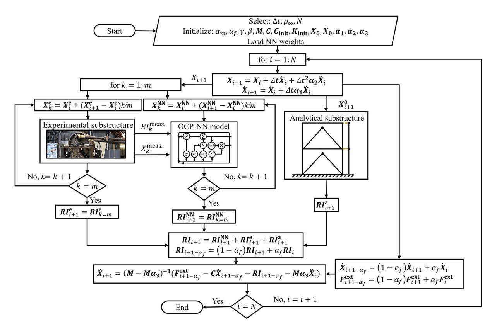

**FIGURE 4** | Proposed RTHS framework with the OCP-NN model.

matrices are then defined, and the initial acceleration vector  $\ddot{\mathbf{X}}_0 = \mathbf{M}^{-1}(\mathbf{F}_0^{\text{ext}} - \mathbf{C}_{\text{init}}\dot{\mathbf{X}}_0 - \mathbf{K}_{\text{init}}\mathbf{X}_0)$  is calculated. At the beginning of each timestep, the displacement vector  $\mathbf{X}_{i+1}$  and the velocity vector  $\dot{\mathbf{X}}_{i+1}$  at the end of the timestep are calculated using Equation (6a,b). The displacement  $X_{i+1}^e$  of the experimental substructure is imposed using a hydraulic actuator. Since the

servo-hydraulic actuator controller timestep ( $\delta t = 1/1024$  s) is smaller than the simulation timestep ( $\Delta t$ ),  $X_{i+1}^e$  is divided into  $m = \Delta t / \delta t$  substeps and imposed in  $m$  substeps. The OCP-NN model receives the data from the experimental substructure every 1/1024 s, therefore, the displacement of the OCP-NN model is also divided into  $m$  substeps for input to the OCP-NN model.

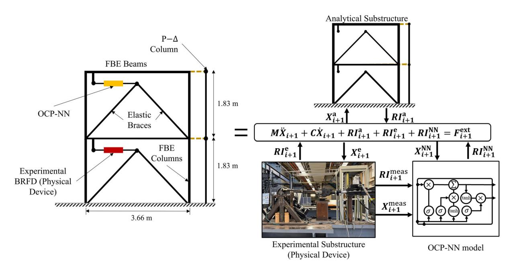

{6}------------------------------------------------

Simultaneously, the displacement vector  $\mathbf{X}_{i+1}^a$  and velocity vector  $\dot{\mathbf{X}}_{i+1}^a$  are input to the analytical substructure to obtain its restoring force vector. Once the restoring forces are obtained from the three substructures, the global restoring force vector is assembled as shown in Equation (11), and the acceleration vector at the end of the timestep is calculated using Equation (7). Therefore, the integration of the current timestep is completed, and the algorithm proceeds to the next timestep. This iterative process is repeated until the simulation is complete.

#### **2.3 OCP-NN Model Architecture**

As discussed earlier, the OCP-NN model uses the measured response of the physical device and the damper deformation at the second-story to provide an accurate prediction of the damper force in the second-story. The measured response from the physical device includes the measured device force and deformation. The response may include additional measurements from the device, depending on its configuration. For example, in this study, to enhance prediction accuracy, the OCP-NN model also incorporated the forces from the two electric actuators as additional inputs.

An LSTM model [28] is used to create the OCP-NN model due to its ability to utilize past input data for calculations at the current timestep. Furthermore, LSTM networks incorporate a memory cell designed to retain information over extended time intervals. An LSTM cell consists of three gates and a candidate cell state given by the following equations:

$$f_i = \sigma(\mathbf{W}_f \mathbf{X}_i + \mathbf{U}_f \mathbf{h}_{i-1} + \mathbf{b}_f) \quad (\text{Forget gate}) \quad (12)$$

$$\mathbf{i}_i = \sigma(\mathbf{W}_i \mathbf{X}_i + \mathbf{U}_i \mathbf{b}_{i-1} + \mathbf{b}_i) \quad (\text{Input gate}) \quad (13)$$

$$\vec{C}_i = \tanh(\mathbf{W}_c \mathbf{X}_i + \mathbf{U}_c \mathbf{h}_{i-1} + \mathbf{b}_c)$$
 (Candidate cell state) (14)

$$\mathbf{o}_i = \sigma(\mathbf{W}_o\mathbf{X}_i + \mathbf{U}_o\mathbf{h}_{i-1} + \mathbf{b}_o) \quad (\text{Output gate}) \quad (15)$$

where,  $\sigma$  is the sigmoid function,  $\tanh$  is the hyperbolic tangent function,  $\mathbf{W}_k, \mathbf{U}_k$  are the input and recurrent weights for gate  $k$ , respectively, and  $\mathbf{b}_k$  is the bias for gate  $k$ . The cell and hidden states for the current timestep are then calculated as:

$$\mathbf{C}_i = \mathbf{f}_i \odot \mathbf{C}_{i-1} + \mathbf{i}_i \odot \tilde{\mathbf{C}}_i \quad (\text{Cell state update}) \quad (16)$$

$$\mathbf{h}_i = \mathbf{o}_i \odot \tanh(\mathbf{C}_i)$$
 (Hidden state update) (17)

where  $\odot$  is the Hadamard product. As shown in Equation (16), the cell state of the current timestep depends on the cell state of the previous timestep through an element-wise operation (Hadamard product) without passing through any activation function. This property enables the preservation of gradients during backpropagation over time, effectively addressing the vanishing gradient problem. Moreover, the recurrent nature of the forward pass ensures that the outputs at the current timestep are influenced by the inputs and outputs from the previous timesteps. These characteristics allow LSTM networks to leverage past input data when making predictions at the current timestep, making them an ideal choice for modeling nonlinear hysteretic materials.

As discussed earlier, two distinct OCP-NN models are introduced: (i) a data-driven OCP-NN model that directly predicts the output force, and (ii) a physics-based OCP-NN model that updates the coefficients of a numerical model of the device in real-time, following an approach similar to that used in OMU.

#### **2.3.1 Data-Driven OCP-NN Model**

The architecture of the LSTM model used for the data-driven OCP-NN model is shown in Figure 5. At each timestep (e.g.,  $i + 1$ ), the measured response from the experimental substructure (physical device), which includes: (a) the measured damper force  $F_{i+1}^{\text{meas}}$ , (b) the measured damper deformation  $X_{i+1}^{\text{meas}}$ , and (c) the tension force  $\mathbf{T}_{i+1}^{\text{meas}}$  in the two electric actuators, is used as input to an LSTM layer consisting of 16 neurons. The deformation  $X_{i+1}^{\text{NN}}$  of the second-story damper is used as input to a second LSTM layer, also consisting of 16 neurons, to produce a hidden state representation. The outputs from these layers are concatenated and input to two consecutive LSTM layers of 48 neurons each, followed by a dense layer to reduce the output to the desired dimension to predict the force  $R_{i+1}^{\text{NN}}$  of the OCP-NN model. The number of layers and the number of neurons per layer are the network hyperparameters and were optimized through a grid search. The selected configuration was found to perform satisfactorily and execute in real-time, as shown later.

To train the model, a suite of ground motion records is selected from the PEER NGA-West2 database [29]. The selection of the ground motion records is guided by a seismic hazard disaggregation for the location of the building, i.e., Los Angeles, California, that targets the uniform hazard curve associated with the design basis earthquake (DBE) having a return period of 475 years. The ground motions are scaled to the DBE hazard level based on the uniform hazard spectrum (UHS) for the location of the building. The ground motion scaling procedure used in this study is described in detail by Malik and Kolay [30] and is summarized here. The scale factors for the  $i^{\text{th}}$  ground motion pair are determined by minimizing a weighted sum of squares between the target spectrum and the geometric mean of the spectrum of the ground motion pair. Ground motions with scale factors less than three are used for subsequent analysis. A total of 20 ground motion records are selected to form the dataset, comprising 14 for the training dataset, four for the validation dataset, and two for the RTHS. The response spectrum and statistics for the selected ground motion records are shown in Figure 6.

The training dataset for the OCP-NN model is generated by imposing predefined damper deformation time histories from the first and second stories onto the physical device to record the measured responses. These predefined deformation time histories are derived from numerical simulations of the structure, where the dampers in the first and second stories are modeled using a LuGre dry friction model of the damper. This approach is deemed appropriate, as the training data is ultimately sourced from the damper itself. As previously noted, the output force from the BRFD varies with the pretension force applied by the electric actuators. To account for this variability, the training dataset is augmented by generating output forces from the BRFD at three

{7}------------------------------------------------

**FIGURE 5** | Architecture of the LSTM model used for the data-driven OCP-NN model showing the real-time link with the physical device.

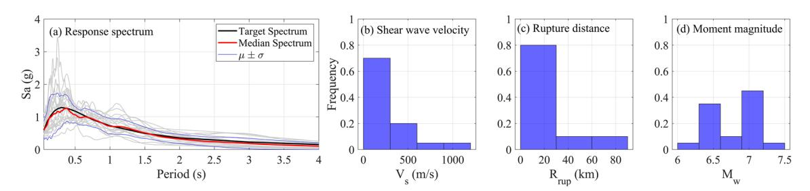

**FIGURE 6** | Statistics of the ground motion dataset; (a) response spectrum, (b) shear wave velocity, (c) rupture distance, and (d) moment magnitude.

different damper force capacities: (a) 13 kN, (b) 18 kN, and (c) 23 kN. Thus a total of  $N_{\text{train}} = N_{\text{rec}} \times 3 = 42$  time histories are used for training the model. It is important to note that during an RTHS, the OCP-NN model receives noisy data from the physical device due to the inherent noise in the load cell and displacement sensor measurements. Therefore, the OCP-NN model is trained using unfiltered data, ensuring it can accurately learn and operate under realistic conditions. A MinMax Scaler is used to normalize the training data, and the scaled data is given as:

$$X_{\text{scaled}} = \frac{X - \min(X)}{\max(X) - \min(X)} \quad Y_{\text{scaled}} = \frac{Y - \min(Y)}{\max(Y) - \min(Y)} \quad (18a,b)$$

where,  $\mathbf{X}$ , and  $\mathbf{Y}$  represent the inputs and outputs of the OCP-NN model. As shown by Malik et al. [14], regularization is important when training a NN model for RTHS, therefore a 10% dropout [31] is used after each LSTM layer to regularize the NN model and avoid overfitting. A batch size of ten is used for training the OCP-NN model, and the Adam optimizer [32] is used for updating the gradients. The learning rate is set to  $10^{-3}$  and is decreased every 10 epochs by a factor of 0.99. The mean square error (MSE) between the predicted force and measured force is used as the loss function. The training hyperparameters, i.e., the dropout rate, the batch size, and the learning rate decay were optimized through a grid search.

In an RTHS, the damper restoring force is sampled at the servo hydraulic actuator controller rate, typically 1024 Hz. Consequently, the timestep for the OCP-NN model is also set to 1/1024 s. Ground motions typically span durations of 30–50 s, resulting in training time histories for the OCP-NN model comprising 3.07 ×

 $10^4$  to  $5.12 \times 10^4$  timesteps. Although LSTM models are well-suited for processing long time series, training on such extensive sequences can hinder convergence. To address this, truncated backpropagation through time (TBPTT) procedure as described in Algorithm 1 is utilized [33]. For each batch, the time histories are divided into smaller sub-sequences of 6000 timesteps. The hidden and cell states of the LSTM network are initialized to zero. A forward pass is performed, the loss is calculated, and gradients are updated. The hidden and cell states at the end of each sub-sequence are stored and used as the initial states for the next sub-sequence. This process is repeated until the entire batch is processed.

### **2.3.2 Physics-Based OCP-NN Model**

The physics-based OCP-NN model predicts, in real-time, the coefficients of the LuGre dry friction model, which are then used to compute the damper force. The physics-based OCP-NN model is inherently constrained by the constitutive routine (i.e., the LuGre equation for the BRFD), embedding physical knowledge into the model.

For the BRFD, an explicit form of the LuGre force equation is derived using forward difference. An explicit formulation is utilized as it does not require any iteration and can be readily implemented within the physics-based OCP-NN model routine. Rewriting  $\dot{z}$  from Equation (2) using forward difference:

$$\frac{z_{i+1} - z_i}{dt} = v_{i+1} - \sigma_0 \frac{|v_{i+1}|}{g(v_{i+1})} z_{i+1} \quad (19)$$

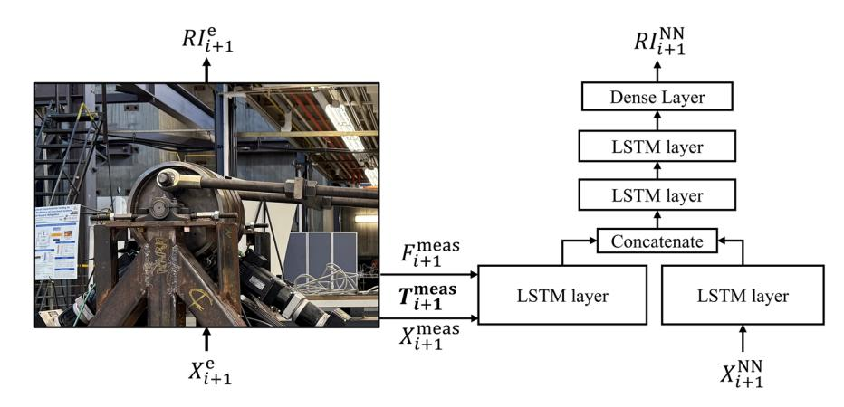

{8}------------------------------------------------

- 1: **Input:** Training data  $\mathbf{X}_{\text{train}}, \mathbf{Y}_{\text{train}}$
- 2: **Output:** Optimal network parameters  $\theta$
- 3: Initialize network parameters  $\theta$
- 4: Set truncation length  $\mathbf{Y}_{\text{trunc}}$
- 5: **for each epoch do**
- 6:     Shuffle the training data and divide into batches  
       $\mathbf{X}_{\text{batch}}, \mathbf{Y}_{\text{batch}}$
- 7:     **for each batch**  $\mathbf{X}_{\text{batch}}, \mathbf{Y}_{\text{batch}}, \mathbf{do}$
- 8:         Divide the batch into sub-sequences each with a  
          length  $\mathbf{Y}_{\text{trunc}}$
- 9:         Initialize  $\mathbf{h} = 0$  and  $\mathbf{c} = 0$
- 10:         **for each sub-sequence** ( $\mathbf{k}$ ) in the batch **do**
- 11:             Perform forward pass: Calculate  $\hat{\mathbf{y}}, \mathbf{h}_{\text{trunc}}$  and  $\mathbf{c}_{\text{trunc}}$
- 12:             Compute loss:  $L = \mathcal{L}(\mathbf{y}, \hat{\mathbf{y}})$
- 13:             Compute gradients:  $\frac{\partial L}{\partial \mathbf{y}}$
- 14:             Update network parameters:  $\theta \leftarrow \theta - \eta \nabla_{\mathbf{y}} L$
- 15:             Set  $\mathbf{h} = \mathbf{h}_{\text{trunc}}$  and  $\mathbf{c} = \mathbf{c}_{\text{trunc}}$
- 16:             **end for**
- 17:         **end for**
- 18:     **end for**

where  $dt$  is the size of the timestep. This equation can be rearranged to provide  $z_{t+1}$  as:

$$z_{i+1} = \frac{g(v_{i+1})(v_{i+1}dt + z_i)}{g(v_{i+1}) + \sigma_0|v_{i+1}|dt} \quad (20)$$

Therefore, the force  $F_{i+1}$  at time  $t_{i+1}$  can be calculated as:

$$F_{i+1} = \sigma_0 z_{i+1} + \sigma_1 \left( v_{i+1} - \sigma_0 \frac{|v_{i+1}|}{g(v_{i+1})} z_{i+1} \right) + \sigma_2 v_{i+1} \quad (21)$$

Equations (20) and (21) calculate the evolutionary variable  $z_{i+1}$  and damper force  $F_{i+1}$  from the evolutionary variable at previous timestep  $z_i$  in a non-iterative manner, and are therefore explicit in nature. To facilitate the stability analysis of the explicit LuGre model, Equation (20) can be reformulated as:

$$z_{i+1} = z_i \frac{g(v_{i+1})}{g(v_{i+1}) + \sigma_0|v_{i+1}|dt} + v_{i+1} \frac{g(v_{i+1})dt}{g(v_{i+1}) + \sigma_0|v_{i+1}|dt} \quad (22)$$

In this formulation, for a given input velocity  $v_{i+1}$  and a timestep  $dt$ ,  $g(v_{i+1}) > 0$ ,  $\sigma_0 \geq 0$ , and  $\sigma_0 \gg g(v_{i+1})$ . Consequently, the coefficient of  $z_i$  in Equation (22) satisfies the following bound:

$$\frac{g(v_{i+1})}{g(v_{i+1}) + \sigma_0|v_{i+1}|dt} < 1 \quad (23)$$

This constraint prevents unbounded growth of  $z$  and consequently making the explicit LuGre model stable.

the peak damper capacity, which is proportional to the applied pretension force in the electric actuators [18, 34]. Therefore, these parameters can readily be determined from the applied electric actuator pretension force as shown in Figure 7.

Additionally, since viscous friction is negligible for the BRFD, the parameter  $\sigma_2$  is assumed to be zero. Therefore, in the present study, the physics-based OCP-NN model identifies only  $\sigma_0$  and  $\sigma_1$  in real time.

To this end, a custom physics layer was developed in TensorFlow using the *Keras Subclassing API* [35]. This custom layer facilitates scamless integration of any constitutive model into the physics-based OCP-NN model. The architecture of the physics-based OCP-NN model, including the custom physics layer, is shown in Figure 8. The physics-based OCP-NN model consists of a LSTM-based model, which has the same architecture as that of the data-driven OCP-NN model described previously. The LSTM network in the physics-based OCP-NN model predicts the coefficients  $\sigma_0$  and  $\sigma_1$ , which are then passed through the physics layer. The physics layer operates analogously to a recurrent neural network layer, maintaining a hidden state. For the LuGre dry friction model, the hidden state corresponds to the evolutionary variable  $z$ . The forward pass through the physics layer is governed by the equations of the constitutive model, specifically the LuGre dry friction model for the behavior of the BRFD, and is outlined in Figure 8. At the beginning of the input sequence, the hidden state  $z$  is initialized to zero and evolves over time according to the governing equations of the constitutive model. This architecture ensures that the evolutionary state variable  $z$  evolves in compliance with the underlying physics without affecting the gradient backpropagation. The custom physics layer does not contain any trainable parameters, as it serves to enforce the physical constraints of the model. While the forward pass provided is specific to the LuGre dry friction model, the custom physics layer can integrate any constitutive model.

The loss function is based on the MSE between the true and predicted damper force. The model is trained with a batch size of five. The Adam optimizer is used to update the gradients. The initial learning rate is set to  $10^{-3}$  and is decreased every 10 epochs by a factor of 0.99.

## 2.4 | Constrained Unscented Kalman Filter Based Online Model Updating

A CUKF-commonly used for OMU in RTHS- is employed as a baseline for benchmarking the performance of the OCP-NN models. To identify the parameters of the LuGre dry friction model using the CUKF, the output force  $F$  from the damper is considered as a nonlinear transformation of the state variables  $\mathbf{x} = [\sigma_0, \sigma_1]^T$ .  $\mathbf{x}$  is treated as a set of stochastic variables with a mean  $\bar{\mathbf{x}}$  and a covariance  $\mathbf{P}_{\mathbf{x}}$ , where the mean values are determined from characterization tests. To calculate the statistics of  $F$ , a matrix  $\chi$  of  $2L + 1$  sigma points  $\chi_i$  and their corresponding weights  $W_i$  are formed as [36]:

$$\chi_i = \bar{\mathbf{x}} \quad (24)$$

{9}------------------------------------------------

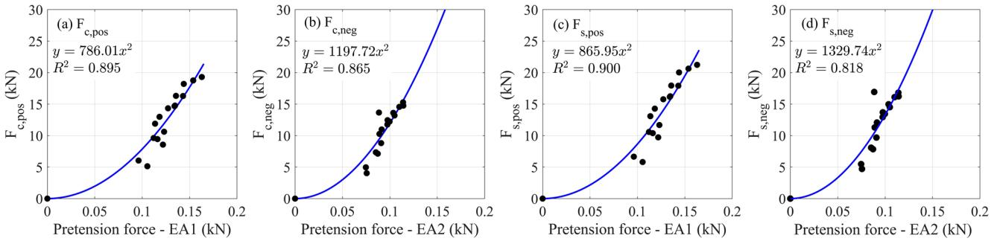

**FIGURE 7** | Variation of friction parameters  $F_c$  and  $F_g$  with applied pretension force, based on damper characterization tests performed at different pretension forces in the two electric actuators (EA1 and EA2).

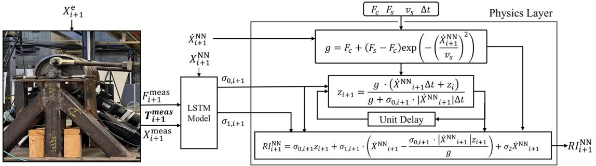

**FIGURE 8** | Architecture of the physics-based OCP-NN showing a block diagram of the physics layer.

$$\chi_i = \begin{bmatrix} \bar{x} + \left(\sqrt{(L+\lambda)P_{x_i}}\right)_i & i = 1, \dots, L \\ \bar{x} - \left(\sqrt{(L+\lambda)P_{x_i}}\right)_{i-L} & i = L+1, \dots, 2L \end{bmatrix} \quad (25)$$

$$W_0^{(m)} = \frac{1}{L+\lambda} \quad (26)$$

$$W_0^{(c)} = \frac{\lambda}{L+\lambda} + (1 - \alpha^2 + \beta) \quad (27)$$

$$W_i^{(m)} = W_i^{(c)} = \frac{1}{2(L+\lambda)^i}, \quad i = 1, \dots, 2L \quad (28)$$

where,  $L = 2$  is the dimension of the state variables,  $\alpha$  determines the spread of the sigma points around  $\bar{x}$  and is usually set to a small positive value ( $10^{-3}$ ) [36],  $\lambda = \alpha^2(L+\kappa)$ ,  $\kappa$  is a secondary scaling parameter which is usually set to zero [36],  $\beta$  is used to incorporate prior knowledge of the distribution of  $\bar{x}$  where a value of 2 is used in accordance with Wan and van der Merwe [36], and  $(\sqrt{(L+\lambda)P_{x_i}})_i$  is the  $i$ th column of the matrix square root. The covariance matrix in the CUKF is scaled by a factor  $\gamma \in (0, 1)$  to enforce the constraints on the state variables [37]. Therefore, the sigma point matrix from Equation (25) is written as:

$$\chi_i = \begin{bmatrix} \bar{x} + \gamma \left(\sqrt{(L+\lambda)P_{x_i}}\right)_i & i = 1, \dots, L \\ \bar{x} - \gamma \left(\sqrt{(L+\lambda)P_{x_i}}\right)_{i-L} & i = L+1, \dots, 2L \end{bmatrix} \quad (29)$$

The steps for estimating the parameters of the LuGre during friction model of the BRFD in the first story at each timestep  $k$  during a RTHS are as follows:

**1. Define the Matrix of Sigma Points:** The sigma points  $\chi_{k-1|k-1}$  are defined based on the mean state variables as:

$$\chi_{k-1|k-1} = \begin{bmatrix} \bar{x} & (\bar{x} + \gamma \left(\sqrt{(L+\lambda)P_{k-1|k-1}}\right)_{i=1,\dots,L}) \\ & \times \left(\bar{x} - \gamma \left(\sqrt{(L+\lambda)P_{k-1|k-1}}\right)_{i=L+1,\dots,2L}\right) \end{bmatrix} \quad (30)$$

where, the initial covariance matrix  $P_{0|0}$  is taken as  $(\sigma_N \text{diag}(\bar{x}))^2$  as recommended by Al-Subaihawi et al. [37], where  $\sigma_N$  is the process noise. The value of  $\gamma$  is initialized at 1.0 and the sigma points are calculated. If any sigma point falls outside its bounds, the value of  $\gamma$  is incrementally decreased by a factor of 0.1 until all sigma points are within their bounds [37]. In this study,  $\sigma_N$  was set equal to  $3 \times 10^{-4}$  based on a comprehensive sensitivity analysis. The selection was guided by minimizing the root mean square error (RMSE) between the measured and predicted force responses.

**2. Predict the State Vector:** The predicted state vector  $\bar{x}_{k|k-1}$  and its covariance  $P_{k|k-1}^{\text{tex}}$  are computed as:

$$\chi_{k|k-1} = \chi_{k-1|k-1} \quad (31)$$

$$\bar{x}_{k|k-1} = \sum_{j=0}^{2L} W_j^{(m)}(\chi_{k|k-1})_j \quad (32)$$

$$P_{k|k-1}^{\text{tex}} = \sum_{j=0}^{2L} W_j^{(c)} [(\chi_{k|k-1})_j - \bar{x}_{k|k-1}] [(\chi_{k|k-1})_j - \bar{x}_{k|k-1}]^T + \mathbf{Q} \quad (33)$$

{10}------------------------------------------------

where  $Q$  is the process noise covariance which controls the degree of change in the state variables throughout the estimation process. For this study,  $Q$  is taken to be equal to  $(\sigma N diag(\vec{x}))^{\frac{1}{2}}$ . [37].

3. **Calculate the Predicted Damper Force:** The predicted damper force  $\bar{y}_k$  and its variance  $P_{k|k-1}^{vy}$  are computed as:

$$(\boldsymbol{\nu}_{k|k-1})_J = \mathbf{f}^\top (\boldsymbol{\chi}_{k|k-1})_J \sigma_2, \mathbf{F}_c, \mathbf{F}_s, \mathbf{v}_s, \mathbf{v}_k, dt \quad (34)$$

$$\bar{y}_k = \sum_{j=0}^{2l} \mathbf{W}_{j=0}^{(m)} (\boldsymbol{\nu}_{k|k-1})_j \quad (35)$$

$$P_{k|k-1}^{vy} = \sum_{j=0}^{2l} \mathbf{W}_{j=0}^{(c)} [(\boldsymbol{\nu}_{k|k-1})_j - \bar{y}_k]^2 + R \quad (36)$$

where  $\mathbf{f}^\top$  represents the nonlinear LuGre equation (see Equation (21)), while  $R$  denotes the measurement noise covariance, quantifying the uncertainty associated with the measurement noise. A small value of  $R$  causes the CUKF to rely heavily on the measured force, increasing the risk of overfitting to noise in the data. Conversely, a large value of  $R$  leads the CUKF to favor the predicted force, potentially underfitting the data. In this study, the measurement noise covariance  $R$  is determined based on the standard deviation of the noise in the load cell measurements and is set equal to  $1.0 \text{ kN}^2$ .

4. **Calculate the Kalman Gain Vector:** The Kalman gain vector  $\mathbf{K}_k$  is calculated as:

$$\mathbf{K}_k = \left( \sum_{j=0}^{2l} \mathbf{W}_{j=0}^{(c)} [(\boldsymbol{\chi}_{k|k-1})_j - \bar{\mathbf{x}}_{k|k-1}] [(\boldsymbol{\nu}_{k|k-1})_j - \bar{y}_k] \right) \left( P_{k|k-1}^{vy} \right)^{-1} \quad (37)$$

5. **Update the State Variables and Covariance Matrix:** Finally, the state variables  $\mathbf{x}_{k|k}$  and covariance matrix  $\mathbf{P}_{k|k}$  are updated as:

$$\mathbf{x}_{k|k} = \bar{\mathbf{x}}_{k|k-1} + \mathbf{K}_k (\mathbf{y}_k - \bar{y}_k) \quad (38)$$

$$\mathbf{P}_{k|k} = \mathbf{P}_{k|k-1}^{vy} - \mathbf{K}_k \mathbf{P}_{k|k-1}^{vy} \mathbf{K}_k^T \quad (39)$$

In Equation (38),  $y_k$  is the measured damper force of the experimental substructure, i.e.,  $RI_{i+1}^{vy}$  at timestep  $i + 1 = k$ . Once the state variables at the current timestep are estimated, they are used to compute the damper force in the second-story damper.

The covariance matrix  $\mathbf{P}_{k|k-1}$  must remain positive semi-definite throughout the RTHS; otherwise, it may result in complex values for  $\boldsymbol{\chi}_{k-1|k-1}$ . To ensure this condition, the procedure recommended by Al-Subaihawi et al. [37] is employed. In this approach, any negative eigenvalues are shifted to match the eigenvalues of the nearest positive definite matrix, thereby preventing  $\mathbf{P}_{k|k-1}$  from becoming ill-conditioned during a timestep. Due to round-off errors during matrix reconstruction, some zero eigenvalues may appear as small negative values. To address this, any negative eigenvalues are shifted by a small value,  $\epsilon = 10^{-11}$ , towards the positive side of the real axis [37]. Complete details of this procedure can be found in Al-Subaihawi et al. [37].

Figure 9 presents the results from the CUKF and the physics-based OCP-NN model, respectively, applied for the OMU of the LuGre dry friction model under a sinusoidal excitation

with an amplitude of 16.5 mm and a frequency of 0.5 Hz. The CUKF captures the trend in force during load reversal (backlash) to some extent, whereas the physics-based OCP-NN model more accurately represents this behavior. The Backlash region consists of a *de-energizing* phase [22], where  $\sigma_0$  decreases between 0.5–0.7 s, followed by a *re-energizing* phase between 0.7–0.8 s, where  $\sigma_1$  increases. However, both models fail to capture the chattering observed in the force-deformation response–an inherent physical phenomenon not represented in the LuGre model formulation. Based on Figure 9, the physics-based OCP-NN model offers two main advantages over the CUKF: (i) it yields more accurate parameter estimates, and (ii) it eliminates the need for manual parameter tuning, as these relationships are learned automatically during backpropagation while training the model.

### 3 | Performance Assessment of the OCP-NN Models

This section evaluates the framework using a validation dataset and discusses the advantages and limitations of the two OCP-NN models. To this end, the prerecorded damper force-deformation data and the electric actuator forces from the first-story damper, and deformation of the second-story damper are provided as inputs to the OCP-NN model. The predicted force response at the second-story is then compared to the corresponding measured force to assess the accuracy of the OCP-NN models. The validation dataset consists of four earthquake ground motion records: (a) Tabas, Iran, recorded at Tabas; (b) Loma Prieta, recorded at the Gilroy Array; (c) Loma Prieta, recorded at the Hollister Differential Array; and (d) Kobe, Japan, recorded at Kobe University.

## 3.1 | Results on the Validation Dataset

Figure 10 compares the measured force-deformation response of the physical damper with predictions from the models discussed previously under the Kobe earthquake. Among these, the data-driven OCP-NN model demonstrates the best performance, achieving a normalized root mean square error (NRMSE) of 1.46%, and effectively capturing the dynamic behavior of the physical device. The physics-based OCP-NN model also provides satisfactory predictions, albeit with slightly higher errors. Conversely, the CUKF performs least accurately, notably failing to reproduce key nonlinear phenomena such as the backlash effect. This limitation is clearly evident from the time evolution of  $\sigma_1$  and  $\sigma_1$  depicted in Figure 11. Specifically, the  $\sigma_1$  estimated by the physics-based OCP-NN model aligns well with observed trends in Figure 9c, showing a decrease during the de-energizing phase and an increase during re-energizing. However, the CUKF fails to capture these rapid variations under sensitive excitation, limiting its ability to accurately represent the observed backlash effect.

It is important to emphasize that both the physics-based OCP-NN model and the CUKF employ OMU within the constitutive routine of the numerical model. Consequently, if the underlying constitutive relationship is insufficient to describe the full complexity of the physical system, even an accurate parameter estimation may not yield an adequate representation of system behavior. This limitation is evident in the present study.

{11}------------------------------------------------

**FIGURE 9** | OMU of the LuGre dry friction model using CUKF and the physics-based OCP-NN model for a sinusoidal excitation of amplitude 16.5 mm and frequency 0.5 Hz: (a) damper force-deformation, (b) damper force time history, and (c) time evolution of  $\sigma_0$ .

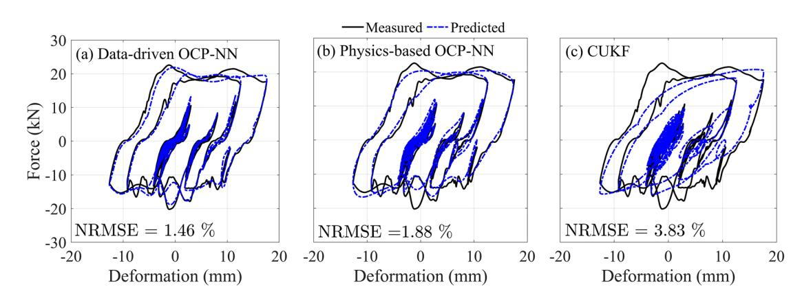

**FIGURE 10** | Force-deformation response of the physical damper compared to (a) data-driven OCP-NN model, (b) physics-based OCP-NN model, and (c) CUKF during the Kobe earthquake from the validation dataset.

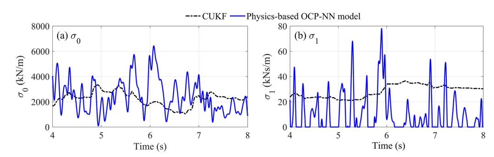

**FIGURE 11** | Time evolution of the LuGre parameters (a)  $\sigma_0$  and (b)  $\sigma_1$  estimated by the physics-based OCP-NN model and the CUKF from time  $t = 4.0$  s to  $t = 8.0$  s during the Kobe earthquake from the validation dataset.

Although the physics-based OCP-NN model successfully captures variations of  $\sigma_0$  and  $\sigma_1$ , essential to modeling the Backlash effect, it cannot fully replicate all observed dynamic phenomena in the BRFD, such as the chattering that emerges once the device reaches its frictional force capacity. These dynamics are influenced by additional components of the experimental setup—including the damper frame, clevises, electric actuators, and connection elements—which are not explicitly represented in the LuGre dry friction model.

Despite its slightly lower predictive accuracy compared to the data-driven OCP-NN model for the studied device, the physics-based OCP-NN model provides significant advantages, notably enhanced physical interpretability and deeper insights into

system behavior. Thus, choosing between physics-based and data-driven OCP-NN model depends on both the fidelity of the available constitutive routine and the objective of the analysis. If a reliable numerical model is available and the objective is to obtain deeper insights into device dynamics during an RTHS, the physics-based OCP-NN model is preferable. Conversely, the data-driven OCP-NN model, unconstrained by assumptions inherent to a specific numerical formulation, can deliver superior predictive accuracy in cases where the constitutive routine of the numerical model fails to capture essential system behaviors.

To quantify the performance of the aforementioned models, the following error indices are used: (a) NRMSE, (b) Mean Absolute Error (MAE), (c) Coefficient of Determination ( $R^2$ ), and (d) Time

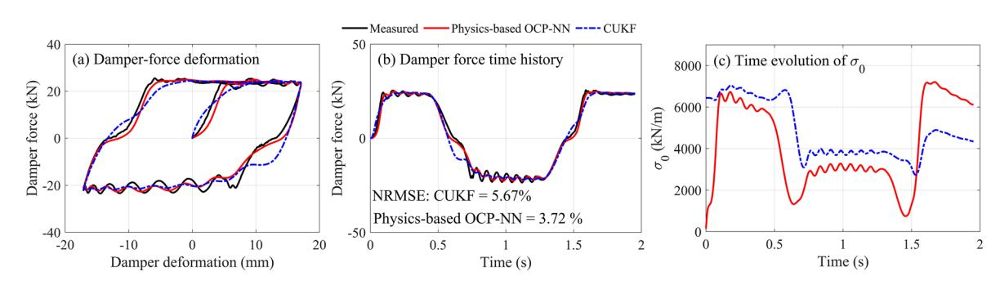

{12}------------------------------------------------

**TABLE 3** | Mean  $\pm$  standard deviation values of the error metrics on the validation dataset for the studied models.

| Model                | NRMSE (%)   | MAE (kN)    | R 2 | TRAC        |
|----------------------|-------------|-------------|----------------|-------------|
| Data-driven OCP-NN   | 1.87 ± 0.28 | 0.51 ± 0.14 | 0.97 ± 0.01    | 0.99 ± 0.00 |
| Physics-based OCP-NN | 2.61 ± 0.62 | 0.76 ± 0.19 | 0.95 ± 0.04    | 0.97 ± 0.02 |
| CUKF                 | 4.53 ± 0.57 | 1.35 ± 0.28 | 0.84 ± 0.07    | 0.92 ± 0.03 |

**TABLE 4** | Error metrics for the data-driven and physics-based OCP NN models on the validation dataset under varying delays in the real-time data from the physical device.

|    | Delay |      | NRMSE  | model (%) | OCP-NN MAE (kN) |      | NRMSE  | model (%) | MAE OCP-NN (kN) |
|----|-------|------|--------|-----------|-----------------|------|--------|-----------|-----------------|
| 0  | ms    | 1.87 | ± 0.28 | 0.51      | ± 0.14          | 2.61 | ± 0.62 | 0.76      | ± 0.19          |
| 5  | ms    | 1.88 | ± 0.33 | 0.51      | ± 0.14          | 2.72 | ± 0.60 | 0.77      | ± 0.19          |
| 10 | ms    | 1.93 | ± 0.32 | 0.52      | ± 0.14          | 2.94 | ± 0.58 | 0.82      | ± 0.19          |
| 15 | ms    | 2.00 | ± 0.33 | 0.54      | ± 0.14          | 3.19 | ± 0.56 | 0.87      | ± 0.20          |
| 20 | ms    | 2.12 | ± 0.36 | 0.56      | ± 0.14          | 3.43 | ± 0.53 | 0.92      | ± 0.20          |

Response Assurance Criteria (TRAC). These metrics are defined as follows:

$$\text{NRMSE} = 100 \times \frac{\sqrt{\frac{1}{N} \sum_{i=1}^N (y_i - \hat{y}_i)^2}}{\max(y) - \min(y)} \text{MAE} = \frac{1}{N} \sum_{i=1}^N |y_i - \hat{y}_i|$$

$$\text{R}^2 = 1 - \frac{\sum_{i=1}^N (y_i - \hat{y}_i)^2}{\sum_{i=1}^N (y_i - \bar{y})^2} \quad \text{TRAC} = \frac{\left( \sum_{i=1}^N y_i \hat{y}_i \right)^2}{\left( \sum_{i=1}^N y_i^2 \right) \left( \sum_{i=1}^N \hat{y}_i^2 \right)}$$

where,  $y_i$  is the measured value at  $i^{\text{th}}$  timestep,  $\hat{y}_i$  is the predicted value at  $i^{\text{th}}$  timestep,  $\bar{y}$  is the mean of measured value and  $N$  is the total number of timesteps. Table 3 presents the mean and standard deviation of these error metrics calculated on the validation dataset. Among the evaluated models, the data-driven OCP-NN model demonstrates the highest predictive accuracy, exhibiting the lowest mean NRMSE and MAE values as well as minimal variation across these metrics. Furthermore, the  $R^2$  and TRAC values of 0.97 and 0.99, respectively, highlight the excellent match between predicted and measured force in terms of both magnitude and phase.

### **3.2 Effect of Measurement Delay and Phase Difference on the Prediction Accuracy of the OCP-NN Models**

Investigating the influence of measurement delay and phase shift between the physical device and the OCP-NN models on prediction accuracy is crucial for a reliable RTHS. To this end, artificial delays ranging from 0 ms to 20 ms at increments of 5 ms are introduced into the measured response of the physical device at the first story and their effect on the performance of the OCP-NN models is evaluated. Table 4 summarizes the corresponding error statistics computed for the validation dataset.

As expected, increasing the measurement delay leads to a decline in model accuracy; however, this reduction remains marginal within delays typically acceptable for RTHS (i.e., less than 5 ms).

It is important to highlight that delays inherent to the experimental setup or phase differences between the input deformation of the physical device and the OCP-NN model–potentially arising from damper placement or higher mode contributions–are implicitly captured in the training dataset of the OCP-NN models. This advantage stems from the fact that the training datasets are generated using deformation histories derived from numerical simulations of the structure intended for the RTHS, which are then experimentally imposed on the physical device. Consequently, the trained OCP-NN models inherently accommodate these realistic operational variations.

This approach confers a notable advantage over traditional methodologies, such as the CUKF, where phase shift can significantly impair performance [37]. The CUKF estimates the parameters of the numerical model based solely on the current force and deformation measurements from the physical device, without explicitly accounting for differences arising due to device placement or structural dynamics. In contrast, the OCP-NN models' predictive capabilities remain robust against these discrepancies due to their training procedure, which inherently includes the aforementioned variations.

### **3.3 Comparison With an Offline Neural Network Model**

To highlight the advantages of the real-time data integration from the physical device, an offline NN model-trained and deployed without any real-time input from the physical system-is compared against the OCP-NN model. In essence, the offline NN model predicts the second-story damper force exclusively from the corresponding damper deformation, without utilizing additional real-time measurements from the physical device which includes the first story damper force, deformation and the forces in the two electric actuators. The offline NN architecture consists of a single input, one output, and three LSTM layers, each comprising 48 neurons. The training employs a batch size of ten, a dropout rate of 10% per layer, and the Adam optimizer for gradient updates. Figure 12 compares the measured force with the predictions obtained from the data-driven OCP-NN and the offline NN models during the Kobe earthquake from the validation dataset. The offline NN model exhibits significantly inferior performance compared to the data-driven OCP-NN model due to the fact that unlike the data-driven OCP-NN model, the offline NN model omits the additional real-time measurements from the physical device described above.

{13}------------------------------------------------

**FIGURE 12** | Force-deformation response of the physical damper compared to (a) data-driven OCP-NN model and (b) offline NN model with no connection to the physical device during the Kobe earthquake from the validation dataset.

# **4 RTHS Results and Discussion**

This section assesses the performance of the OCP-NN models in RTHS under two ground motion records: (a) Northern Calif-03 event recorded at the Ferndale City Hall, and (b) Loma Prieta event recorded at the Emeryville Pacific Park. For benchmarking, results obtained using the CUKF-a widely used OMU technique in RTHS [14, 37]-are reported alongside those from both data-driven and physics-based OCP-NN models.

Figures 13(a) and (b) present the time histories of the roof displacement and second-story damper deformation, respectively, obtained from the RTHS using the Northern Calif-03 ground motion recorded at Ferndale City Hall. The choice of model for the second-story damper has a marked influence on the global response. RTHS using the data-driven and physics-based OCP-NN models yield peak roof displacements of 45.6 and 44.0 mm, respectively, for the prototype structure. However, the CUKF model underestimates the peak roof displacement at 40 mm—an underestimation of 12.2% compared to the data-driven OCP-NN model. A similar trend is observed in the damper deformation response: using the CUKF in the structure underestimates the demand, with peak deformation of approximately 15 mm, compared to 18.5 and 18 mm for the data-driven and physics-based OCP-NN models, respectively – an underestimation of about 19%. Figure 14 compares the hysteretic force–deformation behavior obtained by imposing each model’s deformation history onto the physical damper. The CUKF’s inability to capture key nonlinear features—most notably the Backlash effect—becomes evident in this figure, corroborating the limitations discussed in Section 3. Table 5 summarizes the error metrics for both the Northern Calif-03 and Loma Prieta records. In both cases, the data-driven OCP-NN model achieves the lowest NRMSE and MAE and the highest  $R^2$  and TRAC values, followed by the physics-based OCP-NN model; the CUKF trails both.

To assess the influence of damper modeling on local structural behavior, the moment-curvature relationships at the base of the first-story column and the end of the first-floor beam adjacent to the column face are examined. Figure 15 shows these responses for the Northern Calif-03 motion. The OMU of the LuGre dry friction model via the CUKF underestimates the ductility demand of the first-floor beam under positive moment, while the data-driven and physics-based OCP-NN produce almost similar results. The

CUKF also shows deviation from the OCP-NN models in the first-story column moment-curvature, particularly in the third quadrant of the moment-curvature plot.

# **5 Application to General RTHS**

The proposed framework can be extended to general RTHS applications through the following procedure:

- 1. **Problem Formulation:** For a given structural configuration, the locations at which devices will be physically modeled and those represented by OCP-NN models should be identified. As a general guideline, the physical device should be assigned to the location expected to experience the highest demand, as suggested in prior studies [4, 14].
- 2. **Training Data Generation:** Conduct numerical simulations of the complete system to obtain the deformation time histories at the relevant locations. These deformation histories are then imposed as predefined inputs to the physical device to acquire the corresponding training data.
- 3. **OCP-NN Model Selection and Training:** The selection between a physics-based or a data-driven OCP-NN model depends on the fidelity of the available constitutive model and the objectives of the simulation, as described previously. Upon selection, the chosen OCP-NN model should be trained and validated to ensure satisfactory performance prior to deployment. This process includes a systematic hyperparameter tuning, where parameters such as the number of layers, number of neurons per layer, learning rate, batch size, and regularization are optimized.
- 4. **Execution of RTHS:** Finally, the RTHS is conducted using the OCP-NN model. Following the simulation, the deformation history associated with the OCP-NN model can be imposed onto the physical device to obtain the corresponding forces, thereby enabling an evaluation of the model's predictive accuracy during the RTHS.

# **6 Summary, Conclusions, and Future Work**

This section provides a comprehensive overview of the research conducted in this study, synthesizes the key findings, and outlines potential directions for future work.

# **6.1 Summary**

This paper presents NN models that are coupled in real-time with an experimental substructure to enable accurate numerical modeling in RTHS when insufficient physical devices are available in the laboratory. The proposed framework is validated using a two-story RC-SMRF equipped with BRFDs at each story. A BRFD is selected as the experimental substructure by virtue of its complex force-deformation behavior that is difficult to model numerically. The analytical substructure consists of the frame modeled using explicit force-based fiber elements, reinforced concrete sections, with 2nd order nonlinear geometric effects. In the RTHS configuration, the first-story damper is physically tested in the laboratory,

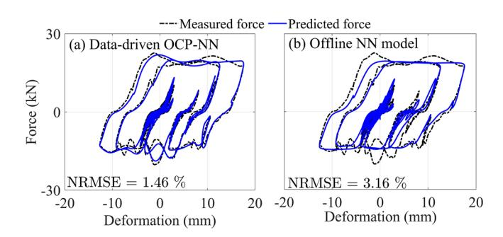

{14}------------------------------------------------

**FIGURE 13** | RTHS response of the prototype building for the Northern Calif-03 recorded at Ferndale City Hall: (a) Roof displacement and (b) 2nd story damper deformation.

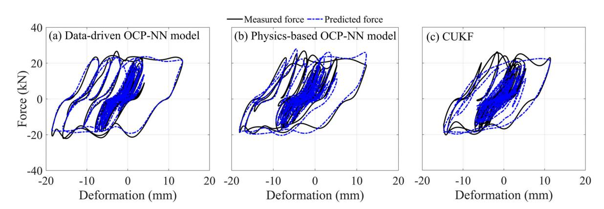

**FIGURE 14** | Force-deformation hysteresis of (a) data-driven OCP-NN model, (b) physics-based OCP-NN model, and (c) CUKF compared to the measured force-deformation of the damper from the RTHS of the Northern Calif-03 recorded at Ferndale City Hall.

**TABLE 5** | Error metrics of the predicted damper force from the RTHS of the selected ground motion records.

| Model                | Northern NRMSE (%) | Calif-03 recorded Hall MAE (kN) | at Ferndale R2 | City TRAC | Loma Prieta NRMSE (%) | recorded at Park MAE (kN) | Emeryville R2 | Pacific TRAC |
|----------------------|--------------------|---------------------------------|----------------|-----------|-----------------------|---------------------------|---------------|--------------|
| Data-driven OCP-NN   | 2.45               | 0.80                            | 0.97           | 0.98      | 2.72                  | 0.90                      | 0.96          | 0.98         |
| Physics-based OCP-NN | 4.84               | 1.54                            | 0.89           | 0.95      | 3.76                  | 1.11                      | 0.92          | 0.96         |
| CUKF                 | 5.54               | 2.02                            | 0.86           | 0.93      | 5.17                  | 1.71                      | 0.90          | 0.95         |

while the second-story damper is modeled using the proposed Online Cyber-Physical Neural Network (OCP-NN) framework. Two OCP-NN models are developed: (i) a data-driven model that uses the training data to learn the relation between the inputs and outputs, and (ii) a physics-based model that embeds a constitutive routine within a custom differentiable physics layer, using the training data to identify its parameters. The physics-based model supports gradient backpropagation while enforcing physical constraints. The OCP-NN models are linked to the physical device in real-time and receive data from the latter every 1/1024 s during the RTHS to accurately represent its behavior at a different location in the structure. The OCP-NN models are compared to the conventional OMU technique for RTHS utilizing a CUKF.

A suite of ground motion records is obtained from the PEER NGA-West2 database, and numerical simulations are conducted

by using a LuGre dry friction model in the RC-SMRF to obtain an ensemble of damper deformation time histories, which are then imposed on the physical device to obtain the respective force time histories. These measured damper deformation and force time histories at the two stories are then used to train the OCP-NN models. The OCP-NN models are based on an LSTM architecture, where the network hyperparameters are optimized through a grid search.

The models are trained and validated using a set of 14 and four ground motions, respectively. The validation also included assessing the effect of delay in the measured response of the physical device on the accuracy of the models. The RTHS are conducted using two ground motion records to assess the OCP-NN models in an actual RTHS framework. The approach presented herein was utilized for a device which did not accumulate damage.

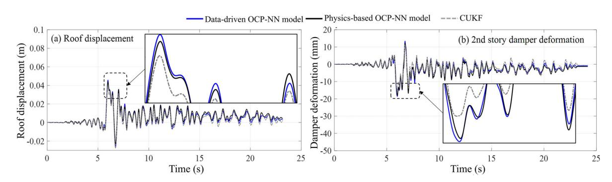

{15}------------------------------------------------

**FIGURE 15** | Moment curvature behavior of the (a) base of first-story column and (b) end of first-floor beam adjacent to column face obtained from the RTHS under the Northern Calif-03 ground motion recorded at the Ferndale City Hall.

Applying the method to devices that accumulate damage would require testing a large set of initially undamaged experimental substructures in order for the NN model to effectively learn the evolution of damage in the device.

# **6.2 Conclusions**

The findings of this study highlight the use of OCP-NN models in conducting RTHS of structural systems when the number of physical devices is limited and must be accurately numerically modeled. The conclusions from the results of the study are the following:

- The data-driven OCP-NN model is able to more accurately capture the device dynamics and outperform the physics-based OCP-NN model in terms of the predicted output force accuracy for the studied device. The inferior performance OCP-NN is attributed to the use of an inadequate available constitutive routine. On the contrary, the physics-based OCP-NN model provides a better interpretability of the underlying physics, such as explaining the Backlash by the variation of the aggregate bristle stiffness  $\sigma_0$ .
- 2. Unlike an offline NN model, the data-driven OCP-NN model is able to adapt to changes in the experimental substructure characteristics in real-time due to its data link with the latter, thereby enabling it to achieve a higher level of accuracy than the offline NN model.
- 3. The CUKF employed for OMU is inferior to the OCP-NN models due to its inability to model the time variation of the constitutive routine model parameters. Although the CUKF faces limitations when applied to systems exhibiting strong nonlinearities, nevertheless, it remains a practical but less accurate option for RTHS when collecting the required amount of NN training data is impractical.

# **6.3 Future Work**

models for different experimental substructures, constitutive routines, and RTHS configurations, and further assessing the advantages and limitations of the physics-based and data-driven OCP-NN models. Additional studies on the OCP-NN models are recommended, but not limited to:

- Extending the approach to semi-actively and actively controlled devices.
- 2. Investigating the generalizability of the trained OCP-NN models for application in other structures.
- 3. Extending the OCP-NN approach to model responses at multiple locations within a structural system.
- Extending the OCP-NN approach to utilize data from more than one experimental substructure.

### **Acknowledgments**

The research reported herein was performed at the NHERI Lehigh Experimental Facility, whose operation is supported by a grant from the National Science Foundation (NSF) under Cooperative Agreement No. CMMI-2037771. This work is also partially supported by the National Science Foundation, United States Grant numbers CCF - 2234921, CPS - 2237696, and CMMI - 1463497. Additional support is provided by the MTS Corporation, and the Commonwealth of Pennsylvania, Department of Community and Economic Development, through the Pennsylvania Infrastructure Technology Alliance (PITA). The authors are grateful for the support of the sponsors and acknowledge the effort of the NHERI Lehigh Experimental Facility staff. Any opinions, findings, conclusions, or recommendations expressed in this material are those of the authors and do not necessarily reflect the views of the sponsors.

### **Conflicts of Interest**

The authors declare no conflicts of interest.

### **Data Availability Statement**

The data that support the findings of this study are available from the corresponding author upon reasonable request.

### **Supporting Information**

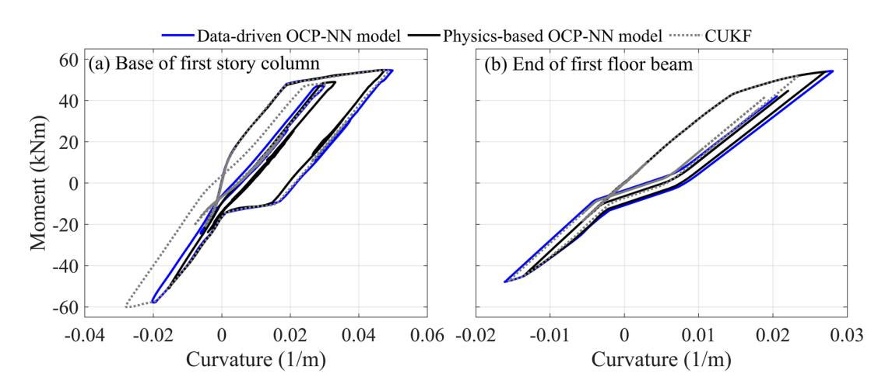

{16}------------------------------------------------

- 

  ## References
- 1. M. J. Hashemi, A. Masroor, and G. Mosqueda, “Implementation of Online Model Updating in Hybrid Simulation,” *Earthquake Engineering & Structural Dynamics* 43, no. 3 (2014): 395–412, <https://doi.org/10.1002/eqe.2350>.
- 2. X. Shao, A. Mueller, and B. A. Mohammed, “Real-Time Hybrid Simulation with Online Model Updating: Methodology and Implementation,” *Journal of Engineering Mechanics* 142, no. 2 (2016): 04015074, [https://doi.org/10.1061/\(ASCE\)EM.1943-7889.0000987](https://doi.org/10.1061/(ASCE)EM.1943-7889.0000987).
- 3. Z. Mei, B. Wu, O. S. Bursi, et al., “Hybrid simulation with online model updating: Application to a reinforced concrete bridge endowed with tall piers,” *Mechanical Systems and Signal Processing* 123 (2019): 533–553, <https://doi.org/10.1016/j.ymssp.2019.01.009>.
- 4. Al-Subaihawi S, J. M. Ricles, and S. E. Quiel, “Online Explicit Model Updating of Nonlinear Viscous Dampers for Real Time Hybrid Simulation,” *Soil Dynamics and Earthquake Engineering* 154 (2022): 107108, <https://doi.org/10.1016/j.soildyn.2021.107108>.
- 5. K. Hornik, M. Stinchcombe, and H. White, “Multilayer Feedforward Networks are Universal Approximators,” *Neural Networks* 2, no. 5 (1989): 359–366.
- 6. H. T. Siegelmann and E. D. Sontag, "On the computational power of neural nets," *Journal of Computer and System Sciences* 50, no. 1 (1992), 132–150.
- 7. Y. Xu, X. Lu, C. Barbaros, and E. Taciroglu, “Real-Time Regional Seismic Damage Assessment Framework Based on Long Short-Term Memory Neural Network,” *Computer-Aided Civil and Infrastructure Engineering* 36, no. 4 (2020): 504–521.
- 8. F. N. Malik, J. Ricles, and M. Yari, "Physics Informed Neural Network Architecture for Dynamic Response Analysis of Nonlinear Structural Systems," *Proceedings of the 18th World Conference on Earthquake Engineering* (2024).
- 9. F. N. Malik, J. Ricles, M. Yari, and M. A. Nissar, "Physics Informed Recurrent Neural Networks for Seismic Response Evaluation of Nonlinear Systems," arXiv preprint arXiv (2023): 2308–08655,.
- 10. R. Zhang, Y. Liu, and H. Sun, "Physics-Informed Multi-LSTM Networks for Metamodeling of Nonlinear Structures," *Computational Methods in Applied Mechanics and Engineering* 369 (2020): 113226.
- 11. W. Mucha, "Application of Artificial Neural Networks in Hybrid Simulation," *Applied Sciences* 9, no. 21 (2019), <https://doi.org/10.3390/app9214495>.
- 12. E. E. Bas and M. A. Moustafa, "Communication Development and Verification for Python-Based Machine Learning Models for Real-Time Hybrid Simulation," *Frontiers in Built Environment* 6 (2020): 574965, <https://doi.org/10.3389/fbuil.2020.574965>.
- 13. S. Al-Subaihawi, J. Ricles, S. Quiel, T. Marullo, and F. Malik, “Real-Time Hybrid Simulation of Structural Systems With Soil-Foundation Interaction Effects Using Neural Networks,” Earthquake Engineering & Structural Dynamics 53 no. 15 (2024): 4688–4718 , <https://doi.org/10.1002/eqe.4236>.
- 14. F. N. Malik, D. N. Gorini, J. Ricles, and M. Rahnemoonfar, "Multi-Physics Framework for Seismic Real-Time Hybrid Simulation of Soil-Foundation-Structural Systems," *Engineering Structures* 334 (2025): 120247, <https://doi.org/10.1016/j.engstruct.2025.120247>.
- 15. C. Kolay and J. M. Ricles, "Force-Based Frame Element Implementation for Real-Time Hybrid Simulation Using Explicit Direct Integration Algorithms," *Journal of Structural Engineering* 144, no. 2 (2018): 04017191, [https://doi.org/10.1061/\(ASCE\)ST.1943-541X.0001944](https://doi.org/10.1061/(ASCE)ST.1943-541X.0001944).
- 16. American Society of Civil Engineers, *Minimum Design Loads for Buildings and Other Structures*, 7th ed. (American Society of Civil Engineers, 2010), 7–10.
- 17. American Concrete Institute, *Building Code Requirements for Structural Concrete (ACI 318-19) and Commentary* (American Concrete Institute, 2019).
- 18. A. Downey, L. Cao, S. Laflamme, D. Taylor, and J. Ricles, “High Capacity Variable Friction Damper Based on Band Brake Technology,” *Engineering Structures* 113 (2016): 287–298, <https://doi.org/10.1016/j.engstruct.2016.01.035>.
- 19. L. Cao, F. N. Malik, S. Al-Subhaihawi, et al., "Real-Time Hybrid Simulation of a 2-Story Building Equipped With Novel Base Isolation Systems," Proceedings of the 18th World Conference on Earthquake Engineering (2024).
- 20. L. Cao, A. Downey, S. Laflamme, D. Taylor, and J. Ricles, "Variable Friction Device for Structural Control Based on Duo-Servo Vehicle Brake: Modeling and Experimental Validation," *Journal of Sound and Vibration* 348 (2015): 41–56, <https://doi.org/10.1016/j.jsv.2015.03.011>.
- 21. d. C. C. Wit, H. Olsson, K. Åström, and P. Lischinsky, “A New Model for Control of Systems With Friction,” *IEEE Transactions on Automatic Control* 40, no. 3 (1995): 419–425, <https://doi.org/10.1109/9.376053>.
- 22. D. Coble, L. Cao, A. R. Downey, and J. M. Ricles, "Physics-Informed Machine Learning for Dry Friction and Backlash Modeling in Structural Control Systems," *Mechanical Systems and Signal Processing* 218 (2024): 111522, <https://doi.org/10.1016/j.ymssp.2024.111522>.
- 23. Y. Chae, K. Kazemibidokhti, and J. M. Ricles, “Adaptive Time Series Compensator for Delay Compensation of Servo-Hydraulic Actuator Systems for Real-Time Hybrid Simulation,” *Earthquake Engineering & Structural Dynamics* 42, no. 11 (2013): 1697–1715, <https://doi.org/10.1002/eqe.2294>.
- 24. M. H. Scott and G. L. Fenves, "Plastic Hinge Integration Methods for Force-Based Beam-Column Elements," *Journal of Structural Engineering* 132, no. 2 (2006): 244–252, [https://doi.org/10.1061/\(ASCE\)0733-9445\(2006\)132:2\(244\)](https://doi.org/10.1061/(ASCE)0733-9445(2006)132:2(244)).
- 25. J. Ricles, C. Kolay, and T. Marullo, "HyCoM-3D: A Program for 3D Multi-Hazard Nonlinear Analysis and Real-Time Hybrid Simulation of Civil Infrastructure Systems," Technical Report 20-02, ATLSS Engineering Research Center (Lehigh University, 2020).
- 26. C. Kolay and J. M. Ricles, "Improved Explicit Integration Algorithms for Structural Dynamic Analysis With Unconditional Stability and Controllable Numerical Dissipation," *Journal of Earthquake Engineering* 23, no. 5 (2019): 771–792, <https://doi.org/10.1080/13632469.2017.1326423>.
- 27. C. Kolay, J. Ricles, T. Marullo, A. Mahvashmohammadi, and R. Sause, "Implementation and Application of the Unconditionally Stable Explicit Parametrically Dissipative KR- $\alpha$  Method for Real-Time Hybrid Simulation," *Earthquake Engineering and Structural Dynamics* 44, no. 5 (2014): 735–755, <https://doi.org/10.1002/eqe.2484>.
- 28. S. Hochreiter and J. Schmidhuber, "Long Short-Term Memory," *Neural Computation* 9, no. 8 (1997): 1735–1780, <https://doi.org/10.1162/neco.1997.9.8.1735>.
- 29. T. D. Ancheta, R. B. Darragh, J. P. Stewart, et al., "NGA-West2 Database," *Earthquake Spectra* 30, no. 3 (2014): 989–1005, <https://doi.org/10.1193/070913EQS197M>.
- 30. F. N. Malik and C. Kolay, "Optimal Parameters for Tall Buildings With a Single Viscously Damped Outrigger Considering Earthquake and Wind Loads," *The Structural Design of Tall and Special Buildings* 32, no. 7 (2023): e2003, <https://doi.org/10.1002/tal.2003>.
- 31. N. Srivastava, G. Hinton, A. Krizhevsky, I. Sutskever, and P. Salakhutdinov, "Dropout: A Simple Way to Prevent Neural Networks from Overfitting," *Journal of Machine Learning Research* 15, no. 56 (2014): 1929–1958.
- 32. D. P. Kingma and J. Ba, Adam: A Method for Stochastic Optimization (2017).
- 33. R. J. Williams and J. Peng, "An Efficient Gradient-Based Algorithm for On-Line Training of Recurrent Network Trajectories," *Neural computation* 2, no. 4 (1990): 490–501, <https://doi.org/10.1162/neco.1990.2.4>.
- **490.**
- 34. P. Huggins, L. Cao, A. R. J. Downey, J. Ricles, and S. Laflamme, “Semi-Active Control of a Banded Rotary Friction Device,” in *Dynamics of Civil*

1998/95 J. Downloaded from https://onlinelibrary.wiley.com/doi/10.1002/journal.csb.2010.002 by Austin Downey - University of South Carolina, Wiley Online Library on [24/08/2025]. See the Terms and Conditions (https://onlinelibrary.wiley.com/terms-and-conditions) on Wiley Online Library for rules of use; OA articles are governed by the applicable Creative Commons License

{17}------------------------------------------------

- *Structures*, vol. 2, Conference Proceedings of the Society for Experimental Mechanics Series, ed., M. Whelan, P. S. Harvey, and F. Moreu, (Springer Nature Switzerland, 2024), 133–139. IMAC 2024.
- 35. M. Abadi, A. Agarwal, P. Barham, et al., TensorFlow: Large-Scale Machine Learning on Heterogeneous Systems, <https://www.tensorflow.org/> (2015), Software available from tensorflow.org.
- 36. E. Wan and R. V. D. Merwe, "The Unscented Kalman filter for Nonlinear Estimation," *Proceedings of the IEEE 2000 Adaptive Systems for Signal Processing, Communications, and Control Symposium (Cat. No.00EX373)* (2000): 153–158, <https://doi.org/10.1109/ASSPCC.2000.882463>.
- 37. S. Al-Subaihawi, J. Ricles, S. Quiel, and T. Marullo, “Development of Multi-Directional Real-Time Hybrid Simulation for Tall Buildings Subject to Multi-Natural Hazards,” *Engineering Structures* 315 (2024): 118348, <https://doi.org/10.1016/j.engstruct.2024.118348>.