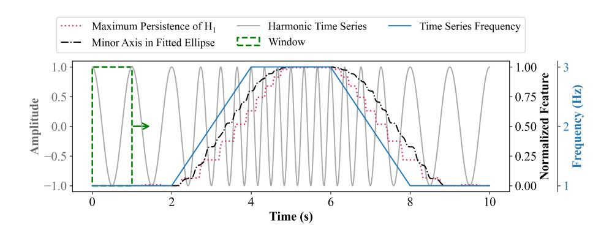
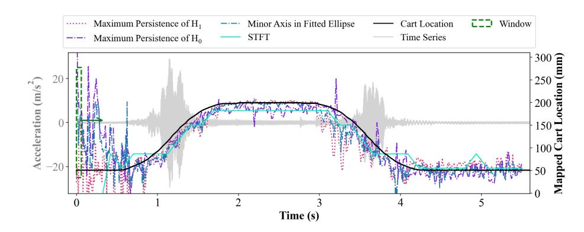
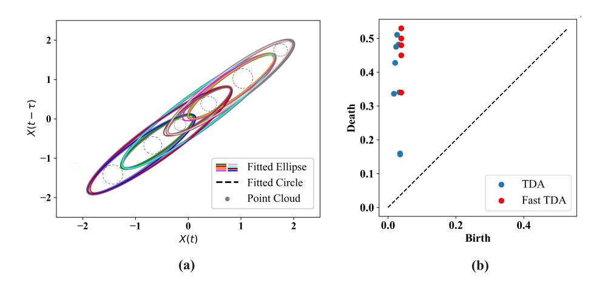

{0}------------------------------------------------

# Fast Topological Data Analysis Feature for Nonstationary Time Series

Daniel A. Salazar Martinez1, Arman Razmarashooli1, Yang Kang Chua2, Simon Laflamme1,3, Chao Hu2, Paul T. Schrader4, Austin R.J. Downey5, Jason D. Bakos6, Gurcan Comert7, Negash Begashaw7, and Jacob Dodson8

1 Department of Civil, Construction, and Environmental Engineering, Iowa State University, Ames, IA, USA

2 Department of Mechanical Engineering, University of Connecticut, Storrs, CT, USA

3 Department of Electrical and Computer Engineering, Iowa State University, Ames, IA, USA

4 Air Force Research Laboratory, Information Directorate, Information Exploitation Branch, NY, USA

5 Department of Mechanical Engineering, University of South Carolina, Columbia, SC, USA

6 Department of Computer Science and Engineering, University of South Carolina, Columbia, SC, USA

7 School of Science and Engineering, Benedict College, Columbia, SC, USA

8 Air Force Research Laboratory, Munitions Directorate, Fuzes Branch, Eglin Air Force Base, FL, USA

**Abstract.** Topological Data Analysis (TDA) combines methods from algebraic topology and modern mathematics to provide features enabling the characterization of point clouds. Often, these features are used with a machine learning algorithm to resolve classification problems. While results in the literature show that TDA features can be powerful in analyzing complex systems, their extraction requires the construction of persistence diagrams or charts that are computationally demanding. Our primary focus is the real-time identification of nonstationary time series in the sub-millisecond or high-rate realm, where TDA is difficult to apply. Here, we propose a novel approach to TDA feature extraction termed "Fast TDA." Fast TDA consists of extracting features from time series inspired by traditional TDA methods. Our method discovers 0-dimensional holes ( $H_0$ ) through the Euclidean distances between consecutive neighbors in the point cloud, and 1-dimensional holes ( $H_1$ ) from the minor axis of ellipses fitted to the point cloud. This reduces computational time compared to conventional TDA by 90%. Our method's accuracy and computing cost are analyzed using laboratory datasets extracted from the Dynamic Reproduction of Projectiles in Ballistic Environments for Advanced Research (DROPBEAR) testbed, a dynamic system compromising a single dominating frequency. Results show a high correlation between ( $H_1$ ) and Fast TDA features in detecting the location of a moving boundary condition. We also provide an initial framework for two dominating frequencies implementing synthetic data. We found that Fast TDA outperforms tradit

{1}------------------------------------------------

as those from DROPBEAR, by reducing the mean response error by 40% and performing adequately over a dual harmonic signal by identifying 6 out of 7 key features. Lastly, the computing time for this algorithm is approximately 1900 times faster than for traditional TDA.

**Keywords:** High-rate systems · nonlinear time series · topological data analysis · persistence homology · machine learning · topological features.

# 1 Introduction

Topological data analysis (TDA) is a data analysis tool that combines concepts of algebraic topology and modern mathematics. It is often used to extract key features from images or dynamic measurements to solve classification problems [10, 11, 7]. Specific to time series analysis, TDA is applied to the study of point clouds, whereas time series under study require embedment into a phase-space. This is done typically based on Taken's Embedding Theorem, where data is embedded in a time delay vector of appropriate size [2]. Of interest is the application of TDA for the study of time series in real-time. While TDA has shown particular promise at handling complex and/or noisy systems [3, 4, 12], a key obstacle is the large computation time required in forming persistent diagrams from which TDA features can be extracted.

Previous research has studied real-time application of TDA for high-rate dynamic systems, here defined as engineering systems that undergo rapid changes in dynamics over very short durations, with computing requirements in the sub-millisecond realm [5]. In particular, Razmarashooli et al. [9] showed that the maximum persistence of  $H_1$  can be used in a machine learning model to track a moving boundary condition. Yet, the technique still required the construction of persistent diagrams which impeded its application to high-rate systems.

In this paper, we introduce the concept of Fast TDA, motivated by deploying TDA-based methods to high-rate systems. Fast TDA includes methods that approximate TDA features of interest, without having to construct a persistence diagram. Based on results presented in [9], we study how the maximum persistence of  $H_1$  can be estimated directly from a point cloud. Our algorithm consists of identifying the persistence of holes in a point cloud ( $H_1$ ) through the fitting of ellipses and relating the length of the minor axis to  $H_1$ . In this introductory work, we study the simple case of a single harmonic system, consistent with the high-rate dynamics studied in our prior work [9]. After, we extend the application to two-harmonic dynamics also embedded in a two-dimensional space, and identify opportunities and limitations to generalize the algorithm with applications to higher dimensional spaces and numbers of dominating harmonics.

The remainder of the paper is organized as follows. Section 2 presents the Fast TDA algorithm to estimate  $H_1$ , and describes the synthetic and laboratory datasets used in this study. Section 3 presents and discusses the results. Section 4 concludes the paper.

{2}------------------------------------------------

# 2 Methodology

This section outlines the methodology employed in our study. It starts with a presentation of the Fast TDA algorithm, followed by a description of the datasets used for studying the performance of the algorithm.

#### 2.1 Algorithm

Using the concept of TDA, we aim to find the birth and death times of topological features without creating a persistent simplicial complex, here targeting two-dimensional point clouds in Euclidean space. In traditional TDA, the  $H_1$  feature is quantified by continuously dilating the radii of each data point, producing disks whose intersections from edges between points are based on their mutual distances. At certain radii, these edges can form cycles or one-dimensional "holes" ("birth" of  $H_1$  feature), which eventually fill in ("death" of  $H_1$  feature). The duration of  $H_1$ , or death – birth, is the persistence of  $H_1$  [1]. In two dimensions, feature  $H_0$  also exists and relates to the connected data points in the points cloud. The estimation of  $H_0$  is straightforward and can be obtained by computing the distance between neighboring points.

In our Fast TDA approach, we estimate the persistence of  $H_1$  by computing the maximum distance between neighboring points to determine the birth time. After, we fit an ellipse through the point cloud, and the length of the minor axis corresponds to the death of  $H_1$ . Many computing techniques exist to fit an ellipse through points [13]; here, we use the least square fitting of an ellipse.

In the case of a single harmonic signal, embedding measurements in a two-dimensional delay vector gives rise to a two-dimensional point cloud. Assuming low noise, such a point cloud will include a single ellipse, and the problem reduces to fitting all points through a single ellipse. Once the number of dominating harmonic increases, a two-dimensional point cloud will feature crossings, and thus, the point cloud needs to be partitioned into regions that can be fitted using a single ellipse.

Consider the dual harmonic signal

$$x(t) = \cos(2\pi f_1(t)) + \cos(2\pi f_2(t)) \quad (1)$$

where  $f_1$  and  $f_2$  are the frequencies of the system, with  $f_1 > f_2$ . The phase-space will exhibit different elliptical-like shapes that depend on the choice of time delay and on  $f_1$  and  $f_2$ . However, for a time delay below  $0.25/f_2$ , the reconstructed state space will form semi-elliptical shapes. Here, we introduce multi-resolution windowing methods to identify the ellipses. First, a low-resolution window is used of a size sufficiently large to cover one entire period, ideally corresponding to a value close to the least common multiple of  $2/f_1$  and  $2/f_2$ . A higher-resolution window slides within the low-resolution window to find local ellipses. The size of this high-resolution window can vary based on identified crossings in the point cloud. A crossing is identified when the distance between neighboring points is

{3}------------------------------------------------

less than a predefined threshold. At this stage of the algorithm, the full point cloud is simplified as a set of ellipses.

Once the ellipses are extracted, we identify their intersections. The diameter of the largest circle that can fit inside a given intersection, termed the incircle [6], corresponds to the death of the corresponding  $H_1$ . This is found by calculating the centroid of the shape formed by the intersecting ellipses, and setting its radius as the minimum distance to an edge. For non-convex shapes, the process involves breaking down the shape into smaller convex components, calculating the convex hull, and finding the largest incircle of the convex hull. This circle's radius can be refined by iterating over potential centers within the non-convex shapes.

#### 2.2 Datasets

Our datasets consist of synthetic harmonic signals Eq. (1) and laboratory data. For the case of the single harmonic (Case Study 1), the synthetic signal takes  $f_1 = f(1)(t)$ ,  $f_2 = 0$  varying between 1 and 3 Hz every 2-second intervals. These values are selected based on laboratory data from the DROPBEAR testbed described later. The frequency stats at 1 Hz initially, climbs to 3 Hz in the subsequent period, stabilizes at 3 Hz for the next 2 s, drops to 1 Hz for another period, and holds at 1 Hz for the final segment. The size of the moving window is  $1/f_{\min} + \tau = 1 + 0.03 = 1.03$  s, with data embedded using a time delay of  $\tau = 0.03$  s. The signal is plotted in Figure 1.

Laboratory data are extracted from the DROPBEAR testbed (Case Study 2). See Reference [8] for a complete description of the testbed and datasets. Briefly, DROPBEAR consists of a cantilever beam with a fast moving boundary condition. The task consists of locating the boundary condition, also known as "car", using acceleration measurement. Our dataset corresponds to Dastaset-6 test 9 to benchmark with previous research [8]. Here, data is embedded using  $\tau = 0.004$  s with a moving window size of 0.06 s that slides every 0.001 s.

For the case of the dual harmonic (Case Study 3), the synthetic signal arbitrarily takes  $f_1 = 7$  and  $f_2 = 2$ . The size of the first window is selected to be 2 s. The sampling frequency is set at 1000 Hz, and the time delay is 0.03 s. We use a threshold of 0.02 for the consecutive Euclidean distance between points to identify relevant data points. The computing time of our Fast TDA algorithm is approximately 50  $\mu$ s, compared to 980 ms for yielding a speed-up of 1900 times.

# 3 Results

#### 3.1 Case Study 1: synthetic single harmonic signal

Figure 1 compares the evolution of the minor axis length (estimate  $H_1$ ) against the maximum persistence of  $H_1$ . It can be observed that the minor axis provides a more stable representation of the system changes compared to the maximum persistence of  $H_1$ . However, there is a time delay between the maximum persistence of  $H_1$  and the fitted ellipse caused by the sliding window's size and thus the sampling rate.

{4}------------------------------------------------

**Fig. 1.** Comparison of Fast TDA with TDA features for a non-stationary synthetic harmonic signal.

### 3.2 Case Study 2: DROPBEAR

Figure 2 plots the time series acceleration signal obtained from DROPBEAR. The length of the minor axis of the fitted ellipse is compared against the maximum persistence of  $H_1$  and the frequency obtained from a short-time Fourier transform (STFT). Results are mapped using linear regression to the cart location to facilitate the comparison. The mean response error is 8.5 mm for the Fast TDA feature, 14.1 mm for the TDA feature, and 11.9 mm for the STFT. The feature provides an estimation within  $\pm 10$  mm 90% of the time using the Fast TDA feature, 75% of the time for the TDA feature, and 86% of the time for the STFT feature. The better performance of the Fast TDA feature is attributable to better robustness with respect to noise. Here, less lag is observed with respect to the synthetic datasets, because of the significantly smaller size of the sliding window.

**Fig. 2.** Comparison of Fast TDA features with TDA and STFT features in predicting DROPBEAR's cart location.

{5}------------------------------------------------

#### 3.3 Case Study 3: synthetic dual harmonic signal

Figure 3(a) shows the best-fitted ellipses in the point cloud and the largest incircles. Figure 3(b) compares the key persistence of  $H_1$  obtained from Fast TDA and traditional TDA. The results from the persistence diagrams reveal that the Fast TDA method effectively identifies 6 points with maximum persistence out of 7 key persistence features. This high precision demonstrates that Fast TDA can reliably capture significant topological features in the data. Table 1 provides a detailed comparison between Fast TDA and traditional TDA, listing the birth and death times of the persistent  $H_1$  features identified by both methods. Traditional TDA shows variability in birth times ranging from 0.017 to 0.033, while Fast TDA consistently detects features with a slightly higher and more uniform birth time of 0.039. However, with higher resolution, the birth times for Fast TDA are expected to converge to values close to zero, similar to traditional TDA. The death times of features are almost similar for both methods, confirming that Fast TDA captures the essential topological features with comparable accuracy.

Table 1. Results from the persistence diagram

| Method   | Feature | Point1 | Point2 | Point3 | Point4 | Point5 | Point6 |
|----------|---------|--------|--------|--------|--------|--------|--------|
| TDA      | Birth   | 0.026  | 0.03   | 0.023  | 0.020  | 0.033  | 0.017  |
| ( H 1 )  | Death   | 0.51   | 0.48   | 0.47   | 0.43   | 0.34   | 0.34   |
| Fast TDA | Birth   | 0.039  | 0.039  | 0.039  | 0.039  | 0.039  | 0.039  |
| ( H 1 )  | Death   | 0.53   | 0.50   | 0.48   | 0.45   | 0.34   | 0.34   |

**Fig. 3.** Comparison of persistence diagram for Fast TDA and TDA

{6}------------------------------------------------

# 4 Conclusion

In this paper, we proposed the concept of Fast TDA, which estimates TDA features directly from a point cloud of data without necessitating the computation of persistence diagrams. The development of the Fast TDA approach was motivated by the deployment of TDA at the sub-millisecond realm, targeting applications to high-rate systems. The results showed that Fast TDA could be a powerful method to extract topological features inspired by TDA, significantly improving computing time, and outperforming traditional TDA in a noisy environment.

Future research is to generalize the  $H_1$  estimation algorithm to point clouds of higher dimensional space, and to systems exhibiting a larger number of dominating frequencies and noise. From our findings, we anticipate upcoming research steps to include 1) comprehensive analysis of Fast TDA feature extraction from multi-frequency systems; 2) extension through higher-dimensional space through ellipsoids; and 3) the extension of Fast TDA to other metrics via the adaptation of other distance metrics.

Acknowledgments. The authors would like to acknowledge the financial support from the Defense Established Program to Stimulate Competitive Research (DEPSCoR) award number FA9550-22-1-0303,the Air Force Office of Scientific Research (AFOSR) award number FA9550-23-1-0033, and the National Science Foundation awards numbers CCF-1937460 and CCF-2234919. Any opinions, findings, conclusions, or recommendations expressed in this material are those of the authors and do not necessarily reflect the views of the sponsors.

Disclosure of Interests. The authors declare that they have no known competing financial interests or personal relationships that could have appeared to influence the work reported in this paper.

# References

- 1. Alexander, Z.: A topology-based approach for nonlinear time series with applications in computer performance analysis. Ph.D. thesis, University of Colorado at Boulder (2012)
- 2. Barzegar, V., Laflamme, S., Hu, C., Dodson, J.: Ensemble of recurrent neural networks with long short-term memory cells for high-rate structural health monitoring. Mechanical Systems and Signal Processing 164, 108201 (2022)
- 3. Gidea, M., Katz, Y.: Topological data analysis of financial time series: Landscapes of crashes. Physica A: Statistical Mechanics and its Applications 491, 820–834 (2018). https://doi.org/https://doi.org/10.1016/j.physa.2017.09.028, https://www.sciencedirect.com/science/article/pii/S0378437117309202
- 4. Hadadi, A., Guillet, C., Chardonnet, J.R., Langovoy, M., Wang, Y., Ovtcharova, J.: Prediction of cybersickness in virtual environments using topological data analysis and machine learning. Frontiers in Virtual Reality 3, 973236 (2022)
- 5. Hong, J., Laflamme, S., Dodson, J., Joyce, B.: Introduction to state estimation of high-rate system dynamics. Sensors 18(1), 217 (2018)

{7}------------------------------------------------

- 6. Kortenkamp, U.: Foundations of dynamic geometry. Journal für Mathematikdidaktik 21, 161–162 (01 2000)
- 7. Munch, E.: A user's guide to topological data analysis. Journal of Learning Analytics 4(2), 47–61 (2017)
- 8. Razmarashooli, A., Chua, Y.K., Barzegar, V., LIU, H., Laflamme, S., Hu, C., Downey, A.R., Dodson, J.: Topological data analysis for real-time extraction of time series features. Structural Health Monitoring (2023)
- 9. Razmarashooli, A., Martinez, D.A.S., Chua, Y.K., Laflamme, S., Hu, C.: Realtime state estimation using recurrent neural network and topological data analysis. In: Gyekenyesi, A.L., Shull, P.J., Wu, H.F., Yu, T. (eds.) Nondestructive Characterization and Monitoring of Advanced Materials, Aerospace, Civil Infrastructure, and Transportation XVIII. vol. 12950, p. 129500C. International Society for Optics and Photonics, SPIE (2024). https://doi.org/10.1117/12.3010900, https://doi.org/10.1117/12.3010900
- 10. Schrader, P.T.: Topological multimodal sensor data analytics for target recognition and information exploitation in contested environments. In: Signal Processing, Sensor/Information Fusion, and Target Recognition XXXII. vol. 12547, pp. 114–143. SPIE (2023)
- 11. Sizemore, A.E., Phillips-Cremins, J.E., Ghrist, R., Bassett, D.S.: The importance of the whole: Topological data analysis for the network neuroscientist. Network Neuroscience 3(3), 656–673 (07 2019). https://doi.org/10.1162/netn\_a\_00073, https://doi.org/10.1162/netn\_a\_00073
- 12. Wang, Y., Ombao, H., Chung, M.K.: Topological data analysis of single-trial electroencephalographic signals. The annals of applied statistics 12(3), 1506 (2018)
- 13. Wong, C.Y., Lin, S.C.F., Ren, T., Kwok, N.M.: A survey on ellipse detection methods. In: 2012 IEEE International Symposium on Industrial Electronics. pp. 1105– 1110. IEEE (2012)