{0}------------------------------------------------

## Reduced Order Model-based Framework for Microsecond Model Updating of Two-Dimensional Structural Systems Using the Local Eigenvalue Modification Procedure

by

Emmanuel Abiodun Ogunniyi

Bachelors of Engineering Federal University of Technology, Akure 2018

Masters of Science University of South Carolina, Columbia, 2023

Submitted in Partial Fulfillment of the Requirements

for the Degree of Doctor of Philosophy in

Mechanical Engineering

Molinaroli College of Engineering and Computing

University of South Carolina

2025

Accepted by:

Austin Downey, Director of Thesis

Jason Bakos, Reader

Yi Wang, Reader

Junsoo Lee, Reader

Ann Vail, Dean of the Graduate School

{1}------------------------------------------------

© Copyright by Emmanuel Abiodun Ogunniyi, 2025 All Rights Reserved.

{2}------------------------------------------------

# Dedication

This dissertation is dedicated to God Almighty, whose grace and guidance have sustained me throughout this journey.

To my family and friends: You stand as the foundational pillars of my strength, guiding beacons during my bleakest moments, and the unwavering wellspring of my determination. It's your boundless love and support that has propelled me through this academic odyssey, shining a light towards my aspirations.

To my mentors, teachers, and colleagues who inspired and challenged me, your insights and guidance have shaped this work in more ways than words can express.

To my advisor and committee members , Your sagacious guidance, invaluable mentorship, and deep-rooted knowledge have acted as my compass in the vast sea of research. Your unwavering belief in my potential has elevated my ambitions and spurred me onwards. Your support has been an integral part of this journey.

And to all those who strive for knowledge, even in the face of uncertainty—may this work serve as a small contribution to the pursuit of understanding.

With heartfelt gratitude and a profound sense of purpose,

Emmanuel Abiodun Ogunniyi

{3}------------------------------------------------

# Acknowledgments

This material is based upon work supported by the Air Force Office of Scientific Research (AFOSR) through award no. FA9550-21-1-0083. This work is also partly supported by the National Science Foundation grant numbers 1850012, 1937535, and 1956071 and by the United States Air Force. This material is partially based upon work supported by the University of South Carolina through grant number 80003212. Any opinions, findings, and conclusions or recommendations expressed in this material are those of the authors and do not necessarily reflect the views of the University of South Carolina, the National Science Foundation, or the United States Air Force (Distribution A. Approved for public release; distribution unlimited (96TW-2021- 0061)).

{4}------------------------------------------------

## Abstract

Real-time model updating is crucial for active structures and electronic assemblies subjected to high-rate dynamic events. High-rate dynamic events refer to events that occur at high speeds and with rapid changes in the forces and energy involved. These events can include explosions, impacts, and crashes. These systems are characterized by a high dynamic response with a high rate ( $< 100$  ms), high amplitude ( $> 100$  g<sub>n</sub>), highly nonlinear, meaning that the response is not proportional to the applied force, and involve complex interactions between multiple objects or materials. A system exposed to high-rate dynamic environments is frequently prone to rapid plastic deformation, involving violent and destructive effects, such as shockwaves, fragmentation, and deformation of structures, which can cause structural, electrical, and sensor damage. Understanding these characteristics is crucial for predicting and mitigating high-rate dynamic events' effects and designing materials and structures that can withstand these extreme conditions. Challenges associated with estimating and updating the state of high-rate dynamic events in real-time include (1) adequate sensing, (2) lack of system knowledge, (3) high variability in loads, and (4) limited resources for algorithm implementation. The state estimator must be quick and resilient to the significant uncertainties, non-stationarities, and strong disturbances associated with high-rate dynamic systems.

This work proposes and implements the Local Eigenvalue Modification Procedure (LEMP) as an efficient method for updating real-time structural models to address these challenges. LEMP simplifies the computational process by using a single generalized eigenvalue solution from the system's baseline state and reducing subsequent

{5}------------------------------------------------

computations into a set of second-order secular equations. These equations isolate only the degrees of freedom associated with structural changes, transforming the updating problem into a localized one that avoids re-solving the full eigenvalue problem. A divide-and-conquer algorithm is introduced to solve these secular equations efficiently, achieving state update times well below the 1 ms threshold required for real-time performance. The methodology is validated first on 1D beam structures using the DROPBEAR experimental testbed and later extended to 2D plate models and complex PCBs undergoing damage. Across all tested configurations, LEMP consistently achieved sub-millisecond state update times and high accuracy, with signal-to-noise ratios exceeding 30 dB in most modes and mean absolute errors under 1 Hz for lower modes.

Furthermore, this work advances LEMP's applicability to reduced-order models (ROMs) and more complex 2D systems. An optimized 25-node cantilever plate configuration was developed and validated as the optimal reduced mesh for capturing local stiffness changes. A single and four-state perturbation was introduced, and the corresponding frequency responses were evaluated. Results show that LEMP maintained less than 10% error compared to full generalized eigenvalue (GE) computations while being 20 to 22 times faster for state changes. For instance, a four-state local stiffness change took only 1.62 ms to compute using LEMP versus 36.04 ms with GE, confirming its real-time viability. These contributions are supported by robust parametric studies involving mode selection, nodal reduction, and error profiling, all of which informed the development of a practical, deployable framework for high-rate environments.

This work advances the field of structural health monitoring by delivering a computationally efficient, accurate, and scalable model updating strategy capable of tracking high-rate structural dynamics in real-time. Modal reduction, algorithmic optimization, and application-specific modeling offer a powerful tool for adaptive sys

{6}------------------------------------------------

tem control, especially in mission-critical domains. Through the LEMP framework, this dissertation lays the foundation for smarter, faster, and more resilient structural monitoring and response systems under extreme dynamic conditions.

{7}------------------------------------------------

# Table of Contents

| DEDICATION . . . . .                                                                                                                              | iii  |
|---------------------------------------------------------------------------------------------------------------------------------------------------|------|
| ACKNOWLEDGMENTS . . . . .                                                                                                                         | iv   |
| ABSTRACT . . . . .                                                                                                                                | v    |
| LIST OF TABLES . . . . .                                                                                                                          | xi   |
| LIST OF FIGURES . . . . .                                                                                                                         | xiii |
| CHAPTER 1 INTRODUCTION . . . . .                                                                                                                  | 1    |
| CHAPTER 2 DEVELOPMENT OF REAL-TIME SOLVER USING LOCAL EIGENVALUE MODIFICATION PROCEDURE . . . . .                                                 | 4    |
| 2.1 Introduction . . . . .                                                                                                                        | 5    |
| 2.2 Background studies . . . . .                                                                                                                  | 7    |
| 2.3 Methodology . . . . .                                                                                                                         | 10   |
| 2.4 Results and Discussion . . . . .                                                                                                              | 17   |
| 2.5 Conclusion . . . . .                                                                                                                          | 23   |
| CHAPTER 3 REAL-TIME STRUCTURAL MODEL UPDATING USING LOCAL EIGENVALUE MODIFICATION PROCEDURE FOR APPLICATION IN HIGH-RATE DYNAMIC EVENTS . . . . . | 26   |
| 3.1 Introduction . . . . .                                                                                                                        | 27   |

{8}------------------------------------------------

| 3.2     | Background                      | 31                        |
|---------|---------------------------------|---------------------------|
| 3.3     | Results and Discussion          | 56                        |
| 3.4     | Summary and Conclusion          | 65                        |
| Chapter | 4 Microsecond Model Updating    | for 2D Structural         |
|         | Systems Using the Local         | Eigenvalue Modification   |
|         | Procedure                       | 67                        |
| 4.1     | Introduction                    | 68                        |
| 4.2     | Methodology                     | 70                        |
| 4.3     | Conclusion                      | 77                        |
| Chapter | 5 Online Model-based Structural | Damage Detection          |
|         | in Electronic Assemblies        | 78                        |
| 5.1     | Introduction                    | 79                        |
| 5.2     | Methodology                     | 81                        |
| 5.3     | Results                         | 83                        |
| 5.4     | Conclusion                      | 84                        |
| Chapter | 6 Reduced Order Model-based     | Framework for Mi         |
|         | crosecond Model Updating        | of Two-Dimensional Struc |
|         | tural Systems Using the Local   | Eigenvalue Modifi        |
|         | cation Procedure                | 86                        |
| 6.1     | Introduction                    | 88                        |
| 6.2     | Background Studies              | 91                        |
| 6.3     | Methodology                     | 99                        |
| 6.4     | Results and Discussion          | 102                       |
| 6.5     | Conclusion                      | 124                       |

{9}------------------------------------------------

| Chapter  | 7            | Conclusion             | 126                        |
|----------|--------------|------------------------|----------------------------|
|          | Bibliography |                        | 128                        |
| Appendix | A            | Matrices               | 141                        |
| Appendix | B            | Mechanical Systems and | Signal Processing persmis |
|          |              | sion to republish      | 143                        |
| B.1      | Open         | Access Licences        | 143                        |

{10}------------------------------------------------

# List of Tables

| Table | 2.1 | Major      | operations   | in          | the        | LEMP         | algorithm            | and their complexity. | 16         |
|-------|-----|------------|--------------|-------------|------------|--------------|----------------------|-----------------------|------------|
| Table | 2.2 | Properties | of           | the         | beam used  | in           | state-estimation     | process.              | 17         |
| Table | 2.3 | Ω          |              |             |            |              |                      |                       |            |
|       |     | 2          | values using | D&C         | and        | Sympy        | function             | “solveset”.           | 20         |
| Table | 2.4 | Mean       | absolute     | error       | and        | signal to    | noise ratio          | for the LEMP          | and        |
|       |     | GE.        |              |             |            |              |                      |                       | 24         |
| Table | 3.1 | Material   | and          | geometric   |            | properties   | of the               | DROPBEAR testbed.     | 33         |
| Table | 3.2 | Counts     | and          | percentages | for        |              | contributing initial | modes.                | 49         |
| Table | 3.3 | Assessment | of           | the         | error      | minimization | comparison           | method                | when       |
|       |     | solving    | for 3        | FEA         | models     | 26 nodes.    |                      |                       | 57         |
| Table | 3.4 | Assessment | of           | the         | bounded    | regression   | comparison           | method                | when       |
|       |     | solving    | for 3        | FEA         | models     | 26 nodes.    |                      |                       | 59         |
| Table | 3.5 | Time,      | MEA,         | and SNR     | for        | LEMP         | and LEMP             | with Bayesian         | using      |
|       |     | error      | minimization |             | and        | bounded      | regression           | for three FEA         | models. 62 |
| Table | 4.1 | Material   |              | properties  |            |              |                      |                       | 73         |
| Table | 4.2 | Base       | state        | frequency   |            | extraction   |                      |                       | 74         |
| Table | 4.3 | Single     | state        | change      | calculated |              | using the LEMP       | and generalized       |            |
|       |     | eigenvalue |              | process     |            |              |                      |                       | 76         |
| Table | 5.1 | Material   |              | properties  | used to    | model        | the PCB.             |                       | 82         |
| Table | 5.2 | Frequency  | of           | vibration   | from       | FEA          | of the PCB.          |                       | 82         |

{11}------------------------------------------------

| Table | 5.3 | Showing    |               | frequencies  | obtained    | using       | FEA and | GE,      | and the    | cor        |
|-------|-----|------------|---------------|--------------|-------------|-------------|---------|----------|------------|-------------|
|       |     | responding |               | single state | change      | frequencies |         | computed | using      | GE          |
|       |     | and        | LEMP for      | the          | PCB.        |             |         |          |            | 83          |
| Table | 6.1 | Percentage | error         | between      | reduced     | models      | and     | perfect  | mesh       | for         |
|       |     | modes      | 7 to 12       | (Free        | Plate)      |             |         |          |            | 104         |
| Table | 6.2 | Percentage | error         | between      | reduced     | models      | and     | perfect  | mesh       | for         |
|       |     | modes      | 1 to 12       | (Cantilever  | Plate)      |             |         |          |            | 107         |
| Table | 6.3 | Percentage | error         | for          | modes 1     | to 15 at    | nodes   | 6 to 10. |            | 115         |
| Table | 6.4 | Percentage | error         | for          | modes 1     | to 15 at    | nodes   | 11 to    | 15.        | 116         |
| Table | 6.5 | Percentage | error         | for          | modes 1     | to 15 at    | nodes   | 16 to    | 20.        | 116         |
| Table | 6.6 | Percentage | error         | for          | modes 1 to  | 15 at       | nodes   | 21 to    | 25 along   | with        |
|       |     | cumulative |               | counts of    | appearances | in the      | top     | three    | lowest     | errors. 121 |
| Table | 6.7 |            | Comparison of | GE and       | LEMP        | computation |         | times    | on 25-node | plate 122   |

{12}------------------------------------------------

# List of Figures

| Figure 2.1       | Flowchart  |            | detailing      | the          | for making |            | a single-state  |                 | change  | to a           |
|------------------|------------|------------|----------------|--------------|------------|------------|-----------------|-----------------|---------|----------------|
|                  | structural |            | system.        |              |            |            |                 |                 |         | 9              |
| Figure 2.2       | Pseudocode |            | for            | LEMP         | Algorithm. |            |                 |                 |         | 16             |
| Figure 2.3       | Initial    | state      | of             | the system   | (beam).    |            |                 |                 |         | 17             |
| Figure 2.4       | Altered    | state      | of             | the system   | where      | the        | spring          | is added        | to      | the system. 18 |
| Figure 2.5 The   |            | system’s   | Ω              |              |            |            |                 |                 |         |                |
|                  |            |            |                | root         | space      | showing    | (a) the         | five            | roots   | of the         |
|                  | system,    | solved     | for            | using        | divide     | and        | conquer,        | and; (b)        | the     | error          |
|                  | values     | between    |                | the roots    | found      | using      | divide          | and             | conquer | and            |
|                  | Sympy      | function   |                | “solveset”.  |            |            |                 |                 |         | 20             |
| Figure 2.6       | Timing     | for        | (a)            | each step    | in LEMP    |            | algorithm       | for             | state   | estima        |
| tion,            | and;       | (b)        | the            | distribution | of         | 1000       |                 | simulations     | of the  | state          |
|                  | estimation |            | process        | using        | divide     | and        | conquer         | in the          | LEMP    | algorithm. 21  |
| Figure 2.7       | Maximum    |            | time           | required     | for state  |            | estimation      | using           | beam    | with           |
|                  | element    | number     |                | 4 to 30.     |            |            |                 |                 |         | 22             |
| Figure 2.8 State |            | estimation |                | using        | LEMP       | and        | general         | eigenvalue      |         | for the        |
| first            | five       | modes      |                | of the five  | node       |            | Euler-Bernoulli | beam            | in      | figure 2.3. 23 |
| Figure 2.9       | Figure     | showing    |                | the (a)      | signal     | to         | noise ratio     | for the         |         | GE and         |
|                  | LEMP       | state      |                | estimation,  | and; (b)   | the        | error           | in percent      |         | between        |
| the              | two        |            | approaches.    |              |            |            |                 |                 |         | 24             |
| Figure 3.1       | DROPBEAR   |            |                | testbed as   | configured |            | for this        | work.           |         | 31             |
| Figure 3.2       | Roller     | testing    |                | parameters   | used in    | this       | work.           |                 |         | 32             |
| Figure 3.3       | DROPBEAR   |            |                | modeled as   | a          | cantilever |                 | Euler-Bernoulli |         | beam. 33       |
| Figure 3.4       | Modal      |            | representation | of           | initial    | system.    |                 |                 |         | 36             |
| Figure 3.5       | Modal      |            | representation | of           | altered    | system.    |                 |                 |         | 36             |

{13}------------------------------------------------

| Figure 3.6  | Flowchart     | of              | LEMP          |           | algorithm.    |            |               |              | 37                  |
|-------------|---------------|-----------------|---------------|-----------|---------------|------------|---------------|--------------|---------------------|
| Figure 3.7  | Modal         |                 | participation | factors   | for           | the        | altered state | with         | roller at n 2 44    |
| Figure 3.8  | Modal         |                 | participation | factors   | for           | the        | altered state | with         | roller at           |
| n           | 3 (b),        | n 4 (c),        | n 5 (d),      | and       | n 6 (e)       |            |               |              | 45                  |
| Figure 3.9  | Modal         |                 | participation | factors   | for           | the        | altered state | with         | roller at           |
| n           | 7 (f),        | n 8 (g),        | n 9 (h)       | and       | n 10 (i)      |            |               |              | 46                  |
| Figure 3.10 | Participating |                 | mode          | shapes    | and           | natural    | frequencies.  |              | 49                  |
| Figure 3.11 | First         | four            | frequency     | responses |               | for a 26   | node          | model solved | using               |
| the         |               | LEMP            | process       | along     | with the      | reference  | 101           | node         | model and           |
| the         | error.        |                 |               |           |               |            |               |              | 51                  |
| Figure 3.12 | Analytical    |                 | application   | of        | the           | likelihood | function      | and          | Bayes algorithm. 52 |
| Figure 3.13 | Roller        | estimations     |               | solved    | using         | error      | minimization  | by:          | (a) the             |
|             | traditional   | GE              |               | approach; | (b)           | LEMP       | estimations,  | and;         | (c) LEMP            |
|             | estimations   |                 | using a       | Bayesian  |               | search     | space.        |              | 58                  |
| Figure 3.14 | Roller        | estimations     |               | solved    | using         | bounded    | regression    | by:          | (a) the             |
|             | traditional   | GE              |               | approach; | (b)           | LEMP       | estimations,  | and;         | (c) LEMP            |
|             | estimations   |                 | using a       | Bayesian  |               | search     | space.        |              | 60                  |
| Figure 3.15 | Solver        | time for        | the           | GE and    | LEMP          |            | showing: (a)  | the time     | taken               |
| by          | both          | solver          | to            | solve     | for new       | state      | frequency,    | and;         | (b) the             |
|             | ratio         | between         | the           | GE and    | LEMP          | solver     | representing  |              | the speed           |
| up          | of            | the GE.         |               |           |               |            |               |              | 61                  |
| Figure 3.16 |               | Iteration(state | update)       |           | time          | comparison | between       | the          | error min          |
|             | imization     |                 | technique     | and       | bounded       | regression | when          | using:       | (a) the             |
|             | traditional   | GE,             | and;          | (b)       | LEMP          | and        | LEMP with     | Bayesian.    | 61                  |
| Figure 3.17 | Iteration     | (state          |               | update)   | time          | using      | different     | comparison   | meth               |
| ods         |               | showing:        | (a)           | error     | minimization, |            | and; (b)      | bounded      | regression. 61      |
| Figure 3.18 | Figure        | showing         | the           | effect    | number        | of         | nodes and     | number       | of sam             |
|             | pled          | roller          | locations     | has       | on (a)        | the        | mean          | absolute     | error, and;         |
| (b          | the           | iteration       | time          | using     | the           | LEMP       | algorithm     | with         | bounded             |
|             | regression    |                 | comparison    |           | methods.      |            |               |              | 62                  |

{14}------------------------------------------------

| Figure 4.1    | Shell      | element        |             | formation  | and            | its        | coordinate |            | system     | where;     | (a)        |
|---------------|------------|----------------|-------------|------------|----------------|------------|------------|------------|------------|------------|------------|
|               | represents | the            | nodal       |            | construction   |            | on the     | element;   |            | (b)        | shows the  |
|               | coordinate |                | system      | of a       | 2D             | solid      | element    | with 2     | DOFs;      | (c)        | shows      |
| the           |            | transformation |             | of the     |                | coordinate | system     | with       |            | dimension; | (d)        |
|               | depicts    | a plate        |             | structure, | and;           | (e)        | is the     | shell      | coordinate |            | system     |
|               | that       | combines       | the         | 2D         | solid          | element    | and        | plate      |            | structure. | 71         |
| Figure 4.2    | Mode       | shapes         | of a        | 2D         | plate          | shown      | in figure  | 1.         |            |            | 74         |
| Figure 4.3    | Frequency  | of             | the         | first      | eight          | modes      | of the     | 2D         | plate      | for a      | change     |
| of            | 1e100      | N/m            |             | stiffness  |                | introduced | to the     | system     |            | at one     | of he      |
|               | nine       | nodes in       | the         | system.    | The            |            | frequency  | response   |            | of the     | system     |
| is            | calculated |                | using       | both       | GE             | and        | LEMP       | and        | the        | error      | between    |
| the           | two        | is             | reported.   |            |                |            |            |            |            |            | 75         |
| Figure 4.4    | Frequency  |                | response    |            | calculated     | for:       | (a)        | the        | first      | elastic    | mode       |
|               | using      | GE and         | LEMP        | on         | a              | plate of   | 9 nodes    | up         | to         | 169        | nodes as   |
|               | tabulated  | in             | table       | 4.3,       | and;           | (b) time   | taken      | to         | solve      | the        | system     |
|               | equation   | at             | each        | number     | of             | nodes      | tested     | shown      | in         | Table      | 4.3. 76    |
| Figure 5.1 FE | mesh       |                | profile,    | showing    | the            | baseline   | state      |            | (healthy   |            | PCB) 81    |
| Figure 5.2    | Vibration  |                | mode        | shapes     | from           | the        | finite     | element    |            | analysis   | of the     |
|               | PCB        | where          | (a) is      | first      | mode;          | (b)        | second     | mode;      | (c)        | third      | mode,      |
|               | and; (d)   | fourth         |             | mode.      |                |            |            |            |            |            | 82         |
| Figure 5.3    | Vibration  |                | frequencies | of         | the            | undamaged  |            | PCB        | for        | (a) the    | initial    |
|               | state      | computed       | using       |            | FEA            | and GE,    | and;       | (b)        | single     | state      | change     |
|               | computed   |                | using GE    | and        |                | LEMP.      |            |            |            |            | 84         |
| Figure 6.1    | Reduced    | finite         |             | element    | models         | with       |            | increasing | nodal      |            | densities: |
| (a)           | 9          | nodes;         | (b) 16      | nodes;     |                | (c) 25     | nodes;     | (d)        | 36         | nodes;     | (e) 49     |
|               | nodes;     | and (f)        | 64          | nodes.     |                |            |            |            |            |            | 101        |
| Figure 6.2    | Boundary   |                | condition   |            | configurations |            | for        | reduced    |            | models:    | (a) free   |
|               | plate,     | and; (b)       |             | cantilever |                | plate.     |            |            |            |            | 103        |
| Figure 6.3    | Mode       | shapes         | of the      |            | perfectly      |            | meshed fee |            | plate:     | (a)        | Mode 7     |
|               | through    | (d)            | Mode        | 10.        |                |            |            |            |            |            | 105        |
| Figure 6.4    | Mode       | shapes         | of the      |            | perfectly      | meshed     | free       | plate:     |            | (i)        | Mode 11,   |
|               | and; (j)   | Mode           | 12.         |            |                |            |            |            |            |            | 106        |

{15}------------------------------------------------

| Figure | 6.5  | Percentage | error           | in natural     |           | frequencies | of          |             | reduced-order | models             |
|--------|------|------------|-----------------|----------------|-----------|-------------|-------------|-------------|---------------|--------------------|
|        |      | compared   | to              | perfect mesh   | for       | free plate. |             |             |               | 106                |
| Figure | 6.6  | Mode       | shapes of       | the perfectly  |           | meshed      | cantilever  |             | plate:        | (a) Mode           |
|        |      | 1          | through (d)     | Mode 4.        |           |             |             |             |               | 108                |
| Figure | 6.7  | Mode       | shapes of       | the            | perfectly | meshed      | cantilever  |             | plate:        | (i) Mode           |
|        |      | 5          | through (l)     | Mode 8.        |           |             |             |             |               | 109                |
| Figure | 6.8  | Mode       | shapes of       | the perfectly  |           | meshed      | cantilever  |             | plate:        | (q) Mode91         |
|        |      | through    | (t) Mode        | 12.            |           |             |             |             |               | 110                |
| Figure | 6.9  | Percentage | error           | in natural     |           | frequencies | of          |             | reduced-order | models             |
|        |      | compared   | to              | perfect mesh   | for       | cantilever  |             | plate.      |               | 111                |
| Figure | 6.10 |            | Transformation  | of 25-node     |           | reduced     | model       | from        | free          | plate to           |
|        |      | cantilever | plate           | by applying    |           | boundary    |             | conditions. |               | 111                |
| Figure | 6.11 | Nodal      | configuration   | for            | optimal   | mode        | selection:  |             | fixed         | nodes 1–5          |
|        |      | and        | highlighted     | nodes          | 6–25 for  | localized   |             | stiffness   |               | modifications. 113 |
| Figure | 6.12 | Frequency  |                 | comparisons    | and error | profiles    | for         | local       | stiffness     | per               |
|        |      | turbations | at              | nodes 6, 7,    | and 8     |             |             |             |               | 117                |
| Figure | 6.13 | Frequency  |                 | comparisons    | and error | profiles    | for         | local       | stiffness     | per               |
|        |      | turbations | at              | nodes 13,      | 14, and   | 15.         |             |             |               | 118                |
| Figure | 6.14 | Frequency  |                 | comparisons    | and error | profiles    | for         | local       | stiffness     | per               |
|        |      | turbations | at              | nodes 16,      | 17, and   | 18.         |             |             |               | 119                |
| Figure | 6.15 | Frequency  |                 | comparisons    | and error | profiles    | for         | local       | stiffness     | per               |
|        |      | turbations | at              | nodes 23,      | 24, and   | 25.         |             |             |               | 120                |
| Figure | 6.16 | Histogram  | showing         | number         | of        | times       | each        | mode        | appears       | in the             |
|        |      | three      | lowest-error    | positions      |           | across all  | nodes.      |             |               | 121                |
| Figure | 6.17 |            | Frequencies of  | Mode 7         | from GE   | and         | LEMP        | at          | local         | perturba          |
|        |      | tion       | from node       | 6 to node      | 25.       | Error       | percentages |             | remain        | below              |
|        |      | 10%        | at all nodes.   |                |           |             |             |             |               | 122                |
| Figure | 6.18 |            | Illustration of | four local     | stiffness |             | changes     |             | introduced    | at nodes           |
|        |      | 6, 14,     | 18, and 22      | on the         | 25-node   |             | cantilever  | plate.      |               | 123                |
| Figure | 6.19 | Side       | view            | representation | showing   | the         | vertical    |             | spring        | supports           |
|        |      | simulating | stiffness       | changes        | at        | the same    | four        |             | nodes.        | 123                |

{16}------------------------------------------------

# Chapter 1 Introduction

The integration of real-time model updating in structures exposed to high-rate dynamics is increasingly recognized as vital within several crucial sectors, including aerospace, automotive, defense, and infrastructure. These sectors often rely on the integrity of systems such as printed circuit boards (PCBs) and structural components, which are integral to the functionality and safety of electronic assemblies and critical infrastructures. High-rate dynamics are defined by rapid responses (under 100 milliseconds) and high-amplitude accelerations (exceeding 100 g), typically resulting from extreme events like blasts, impacts, seismic activities, or accidents. The complexities inherent in these events introduce substantial uncertainties, including non-stationarity, severe disruptions, and the advent of unmodeled dynamics due to instantaneous changes in system conditions [1, 2].

The essence of tracking and updating the state of structures during such high-rate dynamic events lies in its capacity to predict and mitigate potential failures, enhancing the resilience and reliability of critical systems. This requirement is particularly pronounced in safety-critical applications where the failure of a single component, such as an electronic part in a vehicle or aircraft, could have catastrophic consequences. Consequently, understanding the behavior of structures under these extreme conditions is crucial for designing systems that can withstand such events, making the development of reliable real-time tracking and model updating mechanisms essential [3, 4, 5].

{17}------------------------------------------------

structures under dynamic loads and uncertain environmental conditions. It encompasses techniques ranging from data-driven methods, exemplified by the deployment of LSTM models for high-rate state estimation, to model-based approaches requiring updates at microsecond timescales for effective structural control [6, 7]. The unpredictable nature of high-rate dynamic events, coupled with abrupt changes in loading conditions, accentuates the need for model updating techniques that are flexible and capable of adapting to changing external load conditions without relying on historical data, thereby enabling real-time decision-making within stringent latency constraints [8, 9].

Among the methodologies explored for real-time model updating, the Local Eigenvalue Modification Procedure (LEMP) stands out for its computational efficiency and the ability to streamline the process of tracking and updating structural models. LEMP simplifies the calculation of system states by reducing the complexity of equations needed to determine the structure's state, leading to significantly faster computation times. This approach, coupled with the error minimization technique, facilitates the real-time tracking and updating of structures, offering a scalable solution for structural dynamic modification by focusing on the contributing vibrational modes and circumventing the need to solve the generalized eigenvalue problem [10, 11].

Real-time model updating capabilities are further enhanced by introducing a Bayesian probabilistic approach to refine the process by reducing the search space for potential structural states. This innovative approach utilizes current state information, given initial uncertainty about the estimate itself, to minimize the computational effort involved in tracking and updating the state of structures undergoing high-rate dynamic events [12, 13]. This methodological advancement reflects a significant stride in structural model updating techniques, catering to the exigent demands of real-time applications with a latency constraint in the sub-millisecond range.

{18}------------------------------------------------

This study underscores the evolution of real-time model updating technologies, highlighting the pivotal role of LEMP in reducing the number and complexity of calculations required for accurate and rapid updating of structural models. These advancements are instrumental in safeguarding the integrity and enhancing the resilience of structures critical to various sectors, particularly when subjected to extreme events that necessitate immediate corrective actions. Through the meticulous development of models designed for real-time applications, with an emphasis on reducing latency to meet the stringent requirements imposed by high-rate dynamics, this body of work marks a significant advancement in the pursuit of safer, more reliable structural systems capable of enduring most challenging conditions [14, 15, 16]. The contributions of this works are (1) Reformulated the Local Eigenvalue Modification Procedure (LEMP) using divide-and-conquer techniques, modal reduction, and Bayesian sampling to achieve millisecond to microsecond update speeds, (2) Experimentally validated the proposed methodology using real-world testbeds such as DROPBEAR, demonstrating both high performance and real-time feasibility, (3) Extended the applicability of the framework to a wide range of structures including 1D beams, 2D plates, and printed circuit boards (PCBs), highlighting its versatility across aerospace, defense, and electronics domains, and (4) Demonstrated edge-readiness through successful deployment on hardware-in-the-loop (HIL) systems, enabling use in embedded and cyber-physical system environments.

{19}------------------------------------------------

# Chapter 2 Development of real-time solver using Local Eigenvalue Modification Procedure1

## Abstract

Real-time model updating for active structures experiencing high-rate dynamic events such as; hypersonic vehicles, active blast mitigation, and ballistic packages require that continuous changes in the structure's state be updated on a timescale of 1 ms or less. This requires the development of real-time model updating techniques capable of tracking the structure's state. The Local Eigenvalue Modification Procedure (LEMP) is a structural dynamic modification procedure that converts the computationally intensive global eigenvalue problem used in modal analysis into a set of second-order equations that are more readily handled. Implementation of LEMP for tracking a structure's state results in secular equations that must be solved to obtain the modified eigenvalues of the structure's state. In this work, the roots of the secular equations are solved iteratively using a divide and conquer approach, leading to faster root convergence. The present study reports on developing a real-time computing module to perform LEMP in the context of real-time model updating with a stringent timing constraint of 1 ms or less. In this preliminary work, LEMP is applied to tracking the condition of a numerical cantilever beam structure, which depicts changes

<sup>1</sup>Ogunniyi, Emmanuel A., Austin RJ Downey Jr, and Jason D. Bakos. "Development of a real-time solver for the local eigenvalue modification procedure." Sensors and Smart Structures Technologies for Civil, Mechanical, and Aerospace Systems 2022. Vol. 12046. SPIE, 2022. doi: https://doi.org/10.1117/12.2613208. Reprinted here with copyright for manuscript provided by publisher

{20}------------------------------------------------

in a structure's state as a change in the roller position. A discussion of variations in timing results and accuracy are discussed.

Keywords: real-time model updating, high-rate dynamics, eigenvalue modification, state estimation.

## 2.1 Introduction

Real-time updating of structures experiencing high-rate dynamics is significant in predicting the behavior of the structures. High-rate dynamics systems such as hypersonic vehicles, impact protection systems, ballistic, and active blast mitigation systems operate at timescales of less than 100 ms with a high amplitude of over 100 gn. These high-rate dynamic structures are characterized by large uncertainty in external loads, high levels of non-stationarity, severe disruptions, and the formation of unmodeled dynamics from changes in system events [17]. The ability to measure, estimate, and predict these structures' varying states overtime is beneficial for the development of next-generation control systems [18]. One way to track the state of structures operating in high-rate dynamic environments is to use structural model updating to update the system state in real-time [19, 20]. A system that can track the state of a structure undergoing high-rate dynamic events must have a model updating technique that is flexible in order to adapt and learn changing external load conditions without relying on pre-trained data. The system must also be capable of updating within a 1 ms timescale to allow real-time data-driven decisions to be made online [18].

For civil and aeronautical structures, real-time model updating approaches have been established, primarily using Finite Element Analysis (FEA) [21, 22, 23, 24]. However, due to the computing expenses associated with solving FEA models, the execution time requirements in these initiatives were from hours to months, and they were frequently done offline. Furthermore, the implementation of a finite ele-

{21}------------------------------------------------

ment analysis with pre-calculated databases of structural conditions for this type of structure is limited due to the system's unmodeled dynamics, which are common in high-rate dynamic events [17]. Resolving the difficulty of accounting for unmodeled dynamics involves the development of online model updating systems that can track the system's state with minimal offline training.

The authors previously showed that by utilizing a simplified Euler-Bernoulli beam model and updating the model in the frequency domain, real-time model updating could be achieved for a structure undergoing a simulated high-rate event with a latency limit of 1 ms [20]. However, the FEA model had to be reduced to 23 nodes to achieve the 1 ms constraint. The generalized eigenvalue problem took 0.6 ms to solve in this arrangement, accounting for most of the computational load. Furthermore, due to its  $O(n^3)$  complexity, the generalized eigenvalue formulation scales poorly for larger FEA models.

In this paper, real-time modeling is performed utilizing the local eigenvalue modification process (LEMP) to simplify state equations on an Euler-Bernoulli beam of five nodes undergoing a single-state change. [25, 26]. All variables for the altered state are specified in terms of the initial state and changes made between the current and initial state. Only information for the degrees of freedom (DOF) at which changes occur is required when using LEMP. Since the solutions to the initial state equations are constant, this decreases the number of calculations required. Furthermore, LEMP reduces the initial eigenvalue solution to a collection of second-order equations that can be easily solved. The resulting set of secular equations of complexity  $O(n^2)$  as compared to the general eigenvalue problem of complexity  $O(n^3)$  is then solved using the divide and conquer approach. Li Ren-Cang developed an efficient approach to solve the secular equation using divide and conquer which takes less than four iterations to arrive at the expected root of the equation [27]. The divide and conquer approach solves for each root sequentially; hence, reducing computational require-

{22}------------------------------------------------

ments. The divide and conquer algorithm is less complex than other functions for solving the roots of equations.

The contributions of this work are 1) Introduction of the divide and conquer approach in the LEMP algorithm to solve the resulting secular equation, leading to faster root convergence, and; 2). Validation of the LEMP algorithm accuracy using a simple Euler-Bernoulli beam against the full-rank generalized eigenvalue approach. Also, algorithm timing, complexity, and error induced by the replacement of the Sympy function "solveset" with the divide and conquer approach in the LEMP algorithm are investigated and discussed.

#### 2.2 Background studies

This section provides background information on solving the generalized eigenvalue problem in addition to the use of LEMP for solving a single state change for a system.

#### 2.2.1 Generalized Eigenvalue

Neglecting damping effects, the equation of motion for a system's initial state, can be found in Eq. 2.1 below.

$$\mathbf{M}_1\ddot{x} + \mathbf{K}_1x = 0 \quad (2.1)$$

 $\dot{x}$  and  $x$  represent the acceleration and displacement in physical space, respectively. Moreover,  $\mathbf{M}_1$  and  $\mathbf{K}_1$  are the system's mass and stiffness matrices in physical space where the subscript 1 represents that they are in their initial state. Both matrices are square symmetric and have dimensions of  $n \times n$ , with  $n$  being the system's degree of freedom. The generalized eigenvalue problem for Eq. 2.1 is defined as  $\mathbf{K}_1 \mathbf{U}_1 = \mathbf{M}_1 \mathbf{U}_1 \boldsymbol{\lambda}$ , Eq. 2.2 and Eq. 2.3 below can be used to solve the GE problem.

$$\det[\mathbf{K}_1 - \boldsymbol{\lambda}\mathbf{M}_1] = 0 \quad (2.2)$$

$$[\mathbf{K}_1 - \boldsymbol{\lambda}\mathbf{M}_1]\mathbf{U}_1 = 0 \quad (2.3)$$

{23}------------------------------------------------

The eigenvalues  $\boldsymbol{\lambda}$  and eigenvectors  $\mathbf{U}_1$  are shown in Eq. 2.4 and Eq. 2.5, which are the squares of the first  $n$  natural frequencies and the first  $n$  modal vectors for the system respectively. It is important to note that the modal matrix in eq 2.5 is not the same as mode shapes, although it can be used to calculate them.

$$\boldsymbol{\lambda} = \begin{bmatrix} \omega_1^2 & 0 & 0 & 0 \\ 0 & \omega_2^2 & 0 & 0 \\ 0 & 0 & \ddots & 0 \\ 0 & 0 & 0 & \omega_n^2 \end{bmatrix} \quad (2.4)$$

$$\mathbf{U}_1 = \begin{bmatrix} \vec{u}_1^1 & \vec{u}_2^1 & \cdots & \vec{u}_n^1 \end{bmatrix} \quad (2.5)$$

#### 2.2.2 Local Eigenvalue Modification Procedure

By monitoring changes in the system’s dynamic response, such as frequencies and mode shapes, structural dynamic modification (SDM) identifies physical alterations made to the system parameters such as mass, stiffness, or damping [28, 29, 30]. SDM is performed by using mass, stiffness, or damping matrices to model the altered state as a mixture of the initial state and the changes made to the initial state in the EOM for the altered system. SDM employs the modal synthesis principle, which states that any dynamic response of a vibrating structure can be decomposed into a set of individual contributions of single frequencies [31, 32], effectively defining the initial system of  $n$  DOF as a collection of  $n$  independent single DOF systems. Each independent DOF corresponds to one natural frequency of the modal system with a modal mass and stiffness value which are related to the physical system response through modal transformation. The changes made to the initial system results in an altered modal system.

Weissenburger created LEMP in 1968 to avoid eigenvalue solutions in SDM when just one change is made to the system. The goal was to make state calculations easier because computers at the time had limited processing capability [25, 33, 34].

{24}------------------------------------------------

To do this, LEMP uses a single GE solution for the initial system and simplifies altered state equations by translating them into modal space, isolating the DOFs that contribute to state changes, and formulating equations in terms of the initial state, as explained in SDM. However, additional simplifications are achieved by truncating the  $n$  independent single degree of systems to include the  $m$  modes of interest. This yields a matrix with dimensions of  $m \times m$  and a modal matrix  $\mathbf{U}_1$  with dimensions of  $n \times m$ .

This modal reduction further simplifies the altered state equations. Figure 2.1 depicts an overview of the LEMP algorithm, which will be expanded upon using a numerical system later in this work. The GE equation is reduced to a set of second-order equations whose roots are determined by the system's initial frequencies, resulting in a smaller domain over which the problem can be solved [25]. These simplifications lower the number and complexity of equations required to compute the structure's state, leading to shorter computation times.

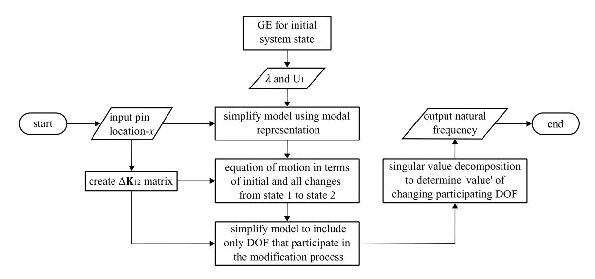

Figure 2.1 Flowchart detailing the for making a single-state change to a structural system.

{25}------------------------------------------------

#### 2.3 Methodology

#### 2.3.1 LEMP Process Algorithm

The technique for applying LEMP is depicted in Figure 1. After obtaining the GE solution for the initial state, the EOM for the altered state will be built using Eq. 2.6 while ignoring the damping effects [26].

$$\mathbf{M}_2\ddot{x} + \mathbf{K}_2x = 0 \quad (2.6)$$

 $\mathbf{M}_2$  and  $\mathbf{K}_2$  are the altered state's mass and stiffness matrices in physical space, both with dimensions of  $n \times n$ . The addition of a roller boundary condition at a node along the beam results in a change in the system state. This restricts bending in the beam at that position with FEA, leading to row and column cancellation. There is only change to the stiffness matrix, which is indicated by  $\Delta\mathbf{K}_{12}$  and has dimensions of  $n \times n$ . As illustrated in Eq. 2.7, mass and stiffness of the altered state are defined in terms of the initial state and variations between the two.

$$M_2 = M_1, \quad K_2 = K_1 + \Delta K_{12} \quad (2.7)$$

Eq. 2.8 is obtained by substituting Eq. 2.7 into the initial EOM for the altered state.

$$\mathbf{M}_1\ddot{x} + (\mathbf{K}_1 + \Delta\mathbf{K}_{12})x = 0 \quad (2.8)$$

The  $m$  modes of the initial state's  $n$  independent single DOF systems are reduced to only include the  $m$  modes of interest to ease calculations. This yields a matrix with  $m \times m$  dimensions and a corresponding modal matrix  $\mathbf{U}_1$  with  $n \times m$  dimensions. The system response is transformed from physical to modal space using Eq. 2.9, where  $q_1$  and  $\ddot{q}_1$  are the system displacement and acceleration vectors in modal space, respectively.

$$x = \mathbf{U}_1 q_1, \quad \ddot{x} = \mathbf{U}_1 \ddot{q}_1 \quad (2.9)$$

{26}------------------------------------------------

Eq. 2.10 is obtained by converting the EOM to modal space using Eq. 2.9.

$$\mathbf{M}_1\mathbf{U}_1\ddot{q}_1 + \left(\mathbf{K}_1 + \Delta\mathbf{K}_{12}\right)\mathbf{U}_1q_1 = 0 \quad (2.10)$$

The mass and stiffness matrices are normalized in modal space by multiplying each term by  $\mathbf{U}_1^T$ , yielding diagonal matrices shown in Eq. 3.15.

$$\text{diag}(\overline{\mathbf{M}}_1)\vec{q}_1 + [\text{diag}(\overline{\mathbf{K}}_1) + \Delta \overline{\mathbf{K}}_{12}]\vec{q}_1 = 0 \quad (2.11)$$

 $\mathbf{M}_1$  and  $\mathbf{K}_1$  are the modal mass and stiffness matrices, respectively, and  $\Delta\mathbf{K}_{12}$  is the difference in modal space between the initial and altered states. After modal truncation, these matrix dimensions are reduced from  $n \times n$  to  $m \times m$ . Eq. 3.16 is obtained by scaling Eq. 3.15 to unit modal mass, where  $\mathbf{I}$  is the identity matrix with dimensions of  $m \times m$ .

$$\mathbf{I}\vec{q}_1 + [\boldsymbol{\lambda} + \Delta \mathbf{K}_{12}] q_1 = 0 \quad (2.12)$$

The following approach is used to solve for the updated natural frequencies that occur as a result of system changes. The GE solution of Eq. 3.16 is first obtained, but not solved, as shown in Eq. 2.13.

$$\det [(\boldsymbol{\lambda} + \Delta \bar{\mathbf{K}}_{12}) - \boldsymbol{\Lambda} \mathbf{I}] = 0, \quad [(\boldsymbol{\lambda} + \Delta \bar{\mathbf{K}}_{12}) - \boldsymbol{\Lambda} \mathbf{I}]_{q_{12}} = 0 \quad (2.13)$$

**A** is a  $m \times m$ -dimensional matrix with the squares of the updated frequencies as diagonals and  $q_{12}$  as the modal change between states. Eq. 2.14 is then obtained by rearranging the terms.

$$[(\mathbf{A} - \mathbf{A}) + \Delta \mathbf{K}_{12}] q_{12} = 0 \quad (2.14)$$

Due to the applied nodal boundary condition, stiffness change occurs between the state, hence only the diagonal values of the  $\mathbf{K}_1$  and  $\mathbf{K}_2$  matrices will be changed. Furthermore, the diagonal value associated with the DOF where the roller is placed is the only non-zero term in the  $\Delta\mathbf{K}_{12}$  matrix. The equation for  $\Delta\mathbf{K}_{12}$  is then simplified to contain information from the contributing nodes, noting that the only non-zero

{27}------------------------------------------------

values in  $\Delta\bar{\mathbf{K}}_{12}$  are those connected with the DOF(s) that undergo a change in stiffness from the initial to a changed state. Eq. 2.15 is used for spectral decomposition of  $\Delta\mathbf{K}_{12}$ .

$$\Delta \bar{K}_{12} = \mathbf{T}\text{diag}(\boldsymbol{\alpha})\mathbf{T}^{\text{T}} \quad (2.15)$$

**T**, Eq. 2.16 is a tie matrix, **T** is a vector with an over-right arrow to denote it as a vector and  **$\alpha$**  is a  $m \times m$  matrix. Eq. 2.17 shows how to convert Eq. 2.15 to modal space.

$$\mathbf{T} = \begin{bmatrix} \vec{t}_1 & \vec{t}_2 & \cdots & \vec{t}_n \end{bmatrix} \quad (2.16)$$

$$\Delta\bar{K}_{12} = \mathbf{U}_1^T \mathbf{T} \text{diag}(\boldsymbol{\alpha}) \mathbf{T}^T \mathbf{U}_1 \quad (2.17)$$

By reducing  $\Delta\bar{\mathbf{K}}_{12}$  to just contain non-zero values denoted by  $\Delta\mathbf{k}_{12}$ , the contributing values of  $\Delta\bar{\mathbf{K}}_{12}$  can be redefined. The tie vector and alpha value of the affected DOF, represented by  $t_c$  and  $\alpha$  respectively, are used to do this. These reduced matrices are constructed using the relation in Eq. 2.18 where  $v$  is the one-dimensional contribution vector.

$$\vec{v} = \mathbf{U}_{1c}^T \vec{t}_c, \quad \vec{v} = \begin{bmatrix} v_1 & v_2 & \cdots & v_m \end{bmatrix} \quad (2.18)$$

To solve for  $\Delta\bar{\mathbf{k}}_{12}$ , Eq. 2.18 is combined with the alpha value associated with the affected DOF as shown in Eq. 2.19, which gives the modal stiffness change equation for contributing nodes.

$$\Delta \bar{\mathbf{k}}_{12} = \vec{v}\alpha \vec{v}^T \quad (2.19)$$

Since  $\Delta\bar{\mathbf{k}}_{12}$  is the same as  $\Delta\bar{\mathbf{K}}_{12}$ , Eq. 2.19 can be substituted for  $\Delta\bar{\mathbf{K}}_{12}$  in the initial GE shown in Eq. 2.13, yielding the following equations:

$$[(\mathbf{A} - \mathbf{A}) + \vec{v}\alpha\vec{v}^T]_{q_{12}} = 0, \quad (\mathbf{A} - \mathbf{A})q_{12} + \vec{v}\alpha\vec{v}^Tq_{12} = 0 \quad (2.20)$$

**S** is defined as an arbitrary variable in Eq. 2.21 to further simplify the state equations.

$$\mathbf{S} = \bar{v}^T q_{12} \quad (2.21)$$

{28}------------------------------------------------

The result is Eq. 2.22, which is obtained by substituting Eq. 2.21 into Eq. 2.20.

$$(\boldsymbol{\lambda} - \boldsymbol{\Lambda})q_{12} + \vec{v}\alpha\boldsymbol{S} = 0 \quad (2.22)$$

Eq. 2.22 can be rearranged to solve for  $q_{12}$ , as demonstrated in Eq. 2.23. Eq. 2.23 is then multiplied by  $\vec{v}^T$  to give Eq. 2.24.

$$q_{12} = -(\boldsymbol{\lambda} - \boldsymbol{\Lambda})^{-1} \vec{v} \boldsymbol{\alpha} \mathbf{S} \quad (2.23)$$

$$\vec{v}^T q_{12} = -\vec{v}^T (\boldsymbol{\Lambda} - \boldsymbol{\Lambda})^{-1} \vec{v} \boldsymbol{\Lambda} \mathbf{S} \quad (2.24)$$

Using the relation from Eq. 2.21, this may be expressed as Eq. 2.25.

$$\mathbf{S} = -\vec{v}^T(\boldsymbol{\lambda} - \boldsymbol{\Lambda})^{-1}\vec{v}\boldsymbol{\alpha}\mathbf{S} \quad (2.25)$$

Both  $\mathbf{S}$  matrices are eliminated by multiplying each side by  $\mathbf{S}^{-1}$ , leaving the matrix equation presented in Eq. 2.26.

$$\alpha^{-1} = -\vec{v}^\Gamma(\boldsymbol{\Lambda} - \boldsymbol{\Lambda})^{-1}\vec{v} \quad (2.26)$$

 $\vec{v}$  is element-wise equal to  $\vec{v}^T$  because it is a one-dimensional vector. As a result, decomposing Eq. 2.26 into its constituents components produces Eq. 2.27, with the sole unknown being  $\Omega_r^2$ , or the natural frequency of the altered state. The number of modes used to characterize the system is  $m$ , and  $r$  ranges from 1 to  $m$ .

$$\frac{-1}{\alpha} = \sum_{r=1}^m \frac{v_r^2}{\omega_r^2 - \Omega_r^2} \quad (2.27)$$

In summary, LEMP is made up of a single general eigenvalue solution for the system's initial state and an eigenvalue modification process that is updated for each change in the state. The eigenvalue modification method simplifies state equations by characterizing the system in terms of the initial state and modifications made to the altered state.

{29}------------------------------------------------

## 2.3.2 Solving the secular equation

The secular equation is defined as

$$0 = \frac{1}{\alpha} + \sum_{k=1}^m \frac{v_k^2}{\omega_k^2 - x} \quad (2.28)$$

Eq. 2.28 has  $m$  possible values of  $x$  that will be obtained using the divide and conquer approach. The divide and conquer approach solves for each eigenvalue separately. It start by selecting an initial guess ( $y$ ) for the first eigenvalue [27] where  $y$  is the starting value for  $x$ . The selected value lies between  $\omega_k$  and  $\omega_{k+1}$ . To make a correct decision, the sign of  $f(\frac{\omega_k + \omega_{k+1}}{2})$  must be checked, if positive,  $\lambda_k$  lies closer to  $\omega_k$  than to  $\omega_{k+1}$ . First, consider the case where  $1 \leq k < n$ . The secular function Eq. 2.28 is rewritten as Eq. 2.29.

$$g(x) = \frac{1}{\alpha} + \sum_{r=1, r \neq k, k+1}^m \frac{v_r^2}{\omega_r^2 - x}, \quad \text{and} \quad h(x) = \frac{v_k^2}{\omega_k^2 - x} + \frac{v_{k+1}^2}{\omega_{k+1}^2 - x} \quad (2.29)$$

Then choose the right initial guess  $y$  from the two root of Eq. 2.30

$$g\left(\frac{\omega_k + \omega_{k+1}}{2}\right) + h(y) = 0 \quad (2.30)$$

In the case where  $\frac{\omega_k + \omega_{k+1}}{2} \geq 0$ , solve for  $\tau = y - \omega_k$ , else solve for  $\tau = y - \omega_{k+1}$ .

Define 
$$\Delta = \omega_{k+1} - \omega_k$$
 and  $c = g\left(\frac{\omega_k + \omega_{k+1}}{2}\right)$ 

$$\tau = y - \omega_k = \frac{a - \sqrt{a^2 - 4bc}}{2c} \quad \text{if } a \leq 0 \quad (2.31)$$

$$= \frac{2b}{a + \sqrt{a^2 - 4bc}} \quad \text{if } a > 0 \quad (2.32)$$

where if  $f\left(\frac{\omega_k + \omega_{k+1}}{2}\right) \geq 0$ ,

$$K = k, a = c\Delta + (v_k^2 + v_{k+1}^2), \quad b = v_k^2\Delta \quad (2.33)$$

{30}------------------------------------------------

where if  $f\left(\frac{\omega_k + \omega_{k+1}}{2}\right) < 0$ ,

$$K = k + 1, a = -c\Delta + (v_k^2 + v_{k+1}^2), \quad b = -v_{k+1}^2\Delta \quad (2.34)$$

After obtaining the initial guess for  $y$ , compute a correction  $\eta$  to  $y$  for a “better” next approximation  $y + \eta$  to  $\lambda_k$  using Eq. 2.35 and Eq. 2.36.

$$\Delta_k = \omega_k - y, \quad \Delta_{k+1} = \omega_{k+1} - y, \quad x = y + \eta \quad (2.35)$$

$$\begin{aligned} a &= (\Delta_k + \Delta_{k+1})f(y) - \Delta_k \Delta_{k+1} f'(y), & b &= \Delta_k \Delta_{k+1} f(y) \\ c &= f(y) - \Delta_k \psi'_k(y) - \Delta_{k+1} \phi'_k(y) & (2.36) \\ &= f(y) - \Delta_{k+1} f'(y) - \psi'_k(y)(v_k^2 + v_{k+1}^2) \\ &= f(y) - \Delta_k f'(y) - \phi'_k(y)(v_k^2 + v_{k+1}^2) \end{aligned}$$

where  $\psi_k(x)$  and  $\phi_k(x)$  are obtained using Eq. 2.37

$$\psi_k(x) = \sum_{r=1}^k \frac{v_r^2}{\omega_r^2 - x}, \quad \phi_k(x) = \sum_{r=k+1}^m \frac{v_r^2}{\omega_r^2 - x} \quad (2.37)$$

$$\begin{aligned}\eta &= \frac{a - \sqrt{a^2 - 4bc}}{2c} \quad \text{if } a \leq 0, \\ &= \frac{2b}{a + \sqrt{a^2 - 4bc}} \quad \text{if } a > 0\end{aligned}\tag{2.38}$$

For case where  $k = m$ , obtain  $\omega_{k+1}$  using Eq. 2.39,

$$\omega_{k+1} = \omega_k + \frac{v^T v}{\rho} \quad (2.39)$$

After obtaining  $\omega_{k+1}$ , repeat the rest of the steps same as when  $k < \text{mode}$ . Iteration stopping criteria is given as,

$$\eta^2 \leq \epsilon_m \min |\omega_k - x|, |\omega_{k+1} - x|(|\eta_0| - |\eta|) \quad (2.40)$$

{31}------------------------------------------------

---

**Algorithm 1** Pseudocode for the LEMP algorithm.

---

```
1: procedure LEMP
2:   Define spring node  $(n)$ 
3:   Build  $\Delta\mathbf{K}$  matrix
4:   Spectral decomposition of  $\Delta\mathbf{K} \rightarrow \mathbf{T} \ \& \ \alpha$ 
5:   Set truncation to contributing nodes :  $\vec{v} \leftarrow \vec{v}$  [0:mode],  $\omega_\tau^2 \leftarrow \omega_\tau^2$  [0:mode]
6:   Solve the secular equation to obtain  $\Omega_k^2$ 
7:   for i in range (mode) do
8:     if k < mode then
9:       solve for a, b, c and  $\tau$  using Eqs. 31, 32, 33 and 34
10:        $y \leftarrow \tau + \omega_k$ 
11:       Compute correction  $\eta$  to y to obtain  $\lambda_k$ 
12:       else if k = mode then
13:          $\omega_{k+1} \leftarrow \omega_k + \frac{v_{k+1}}{v_k}$ 
14:         solve for a, b, c and  $\tau$  using Eqs. 31, 32, 33 and 34
15:          $y \leftarrow \tau + \omega_k$ 
16:         Compute correction  $\eta$  to y to obtain  $\lambda_k$ 
17:       end if
18:     end for
19:     solve for the altered state frequency
20: end procedure
```

---

Figure 2.2 Pseudocode for LEMP Algorithm.

The steps of the LEMP algorithm used for the state estimation through this paper are presented as Pseudocode in Algorithm 2.2.

Table 2.1 shows the major operations in the LEMP algorithm and their complexity level. These operations are those employed by the divide and conquer approach to solve for the altered state frequencies. Other operations in the LEMP algorithm are of  $O(n)$  complexity, however, the divide and conquer approach is of complexity  $O(n^2)$ , hence, resulting in an overall LEMP algorithm complexity of  $O(n^2)$ .

Table 2.1 Major operations in the LEMP algorithm and their complexity.

| Outermost loop | Innermost loop       | Operation                                               | Lines  | Complexity       |
|----------------|----------------------|---------------------------------------------------------|--------|------------------|
| $i = 1$ : mode | $k \leq \text{mode}$ | Solve for $a, b, c$ , and $\tau$                        | 9, 14  | $\xi_1 = O(n^2)$ |
| $i = 1$ : mode | $k \leq \text{mode}$ | Solve for initial $y$                                   | 10, 15 | $\xi_2 = O(n)$   |
| $i = 1$        | $k = \text{mode}$    | Solve for $\omega_{k+1}$ required for $k = \text{mode}$ | 13     | $\xi_3 = O(n^2)$ |

To determine the viability of LEMP, the estimated states using the GE and LEMP are compared using mean absolute error (MAE) and signal to noise ratio where the GE is the measured value, and the LEMP is the estimated value. The MAE value measures the numerical error between the GE and LEMP estimated states. [35, 36].

{32}------------------------------------------------

Eq. 2.41 and Eq. 3.46 show the formula for MAE and SNR, respectively.

$$\text{MEA} = \frac{\sum_{i=1}^z |x_{\text{true}_i} - x_{\text{est}_i}|}{z} \quad (2.41)$$

$$\text{SNR}_{\text{dB}} = 10 \log_{10}\left(\frac{P_{\text{signal}}}{P_{\text{noise}}}\right) \quad (2.42)$$

## 2.4 Results and Discussion

## 2.4.1 Single-state change updating with LEMP

To estimate the state change, a beam of 5 nodes which corresponds to 10 DOF for Euler-Bernoulli beam ( $n = 10$ ) as shown in figure 2.3 with properties shown in table 2.2 was used. Only the first five modes to determine state changes to the system (beam).

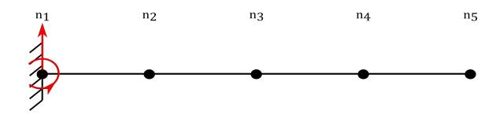

Figure 2.3 Initial state of the system (beam).

Table 2.2 Properties of the beam used in state-estimation process.

|  | Properties                                     | value    |
|--|------------------------------------------------|----------|
|  | Density - $\rho$ (kg/m <sup>3</sup> )          | 7900     |
|  | Cross-sectional area - $A_c$ (m <sup>2</sup> ) | 0.000306 |
|  | Total length - $l$ (m)                         | 0.35     |
|  | Elemental length - $l_i$ (m)                   | 0.35     |
|  | Young's Modulus - $E$ (Pa)                     | 2e11     |

Construct the elemental mass and stiffness matrices (**M1** and **K1**) which are Eq. A.2 and Eq. A.4 written in the appendix of this paper using the Euler-Bernoulli formular. Then solve the general eigenvalue problem to obtain the squares of the first  $n$  natural frequencies, and the first  $n$  modal vectors for the initial state.

{33}------------------------------------------------

| $\lambda =$ | (60237   | 2682286  | 21391038 | 82438554  | 286161e3 | 748103e3 |
|-------------|----------|----------|----------|-----------|----------|----------|
|             | 189786e4 | 442507e4 | 152856e6 | 448821e10 |          |          |

State equations are simplified by reducing the initial state to just include the modes of interest, as described in section 3.1. The square root of each eigenvalue is used to calculate the natural frequency in rad/s, and thereafter converted to Hz.  $f_1$  shows first five natural frequencies for the initial system in Hz.

$$\lambda = \left( 60237 \quad 2682286 \quad 21391038 \quad 82438554 \quad 286161582 \right)$$

$$\mathbf{U}_1 = \left( \begin{array}{ccccc} -0.000005 & 0.00011 & 0.00051 & 0.00138 & -0.00340 \\ -0.000001 & 0.000008 & 0.000023 & 0.000046 & -0.000088 \\ -0.184749 & 0.862567 & 1.521322 & 1.535297 & -0.796654 \\ -3.95962 & 13.68743 & 10.37102 & -17.27622 & 68.83187 \\ -0.64779 & 1.52565 & 0.15321 & -1.53923 & 0.260667 \\ -6.37642 & -1.72852 & -3.28287 & -6.21277 & -80.17702 \\ -1.26088 & 0.420824 & -1.25908 & 1.14986 & 0.176068 \\ -7.43893 & -2.20332 & 13.1159 & 21.2392 & 76.3001 \\ -1.92314 & -1.86050 & 1.94283 & -1.87065 & -1.9711 \\ -7.61313 & -27.5937 & 46.6347 & -63.1058 & -96.1961 \end{array} \right)$$

$$f_1 = \left( 39 \quad 261 \quad 736 \quad 1445 \quad 2692 \right)$$

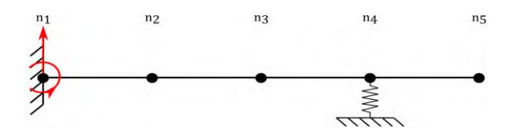

Figure 2.4 Altered state of the system where the spring is added to the system.

{34}------------------------------------------------

The inclusion of a roller at node 4 means implementing a boundary condition at DOF 8 according to the specification of an Euler-Bernoulli beam.  $\Delta\mathbf{K}_{12}$  depicts the changes in physical space from the initial state to the altered state, where diagonal values shown reflect spring stiffness changes with only the 8th diagonal value as the sole nonzero term with a value of  $1e10$  N/m. The changes in modal space from the initial to the altered state are represented by  $\Delta\overline{\mathbf{K}}_{12}$  which is Eq. A.6 in the appendix.

$$\Delta \mathbf{K}_{12} = \begin{pmatrix} 0 & 0 & 0 & 0 & 0 & 0 & 0 & 1e10 & 0 & 0 \end{pmatrix}$$

## **Step 2: Spectral decomposition of** ∆**K**12

The next step is the spectral decomposition of the  $\Delta\mathbf{K}_{12}$  matrix using Eq. 2.15 to obtain the tie and alpha matrix.

$$T = \begin{pmatrix} 1 & 1 & 1 & 1 & 1 & 1 & 1 & 1 & 1 & 1 \\ 0 & 0 & 0 & 0 & 0 & 0 & 0 & 0 & 0 & 1e10 & 0 & 0 \end{pmatrix}, \quad \alpha = \begin{pmatrix} 0 & 0 & 0 &$$

## **Step 3: Set truncation: include only contributing nodes**

The contributing vectors are reduced to only those values in the 8th row of each matrix. As a result, Eqs.  $\mathbf{U}_c^T$  and  $\vec{t}$  can be used to write the contributing modal and tie vectors, resulting in a change vector  $v$  as illustrated in Eq. 2.18.

$$\mathbf{U}_c^T = \begin{pmatrix} -7.4389 & -22.033 & 13.1159 & 21.2392 & 76.3000 \end{pmatrix}$$

$$\vec{t} = \begin{pmatrix} 0 & 0 & 0 & 0 & 0 & 0 & 0 & 1 & 0 & 0 \end{pmatrix}$$

$$\vec{v} = \begin{pmatrix} -7.439 \\ -22.03 \\ 13.12 \\ 21.24 \\ 76.30 \end{pmatrix}$$

{35}------------------------------------------------

#### **Step 4: Obtain** Ω <sup>2</sup> **using Divide and Conquer**

With the application of LEMP, the original 10th order GE problem was reduced to a set of 5 second order equations that could be solved using Eq. 2.27, reducing the complexity of the associated state equation. The squares of the updated natural frequencies are obtained by solving for Ω 2 in Eq. 2.27.

$$\Omega^2 = \begin{pmatrix} 293497 & 0 & 0 & 0 & 0 \\ 0 & 13405181 & 0 & 0 & 0 \\ 0 & 0 & 33185095 & 0 & 0 \\ 0 & 0 & 0 & 101330615 & 0 \\ 0 & 0 & 0 & 0 & 69856604350042 \end{pmatrix}$$

Table 2.3 Ω <sup>2</sup> values using D&C and Sympy function "solveset".

| mode | D&C frequency      | (Hz) Solveset frequency | (Hz) error |     | (Hz) |
|------|--------------------|-------------------------|------------|-----|------|
| 1    | 293496.95719048503 | 293496.95719048500      | 58.21      | E   | − 12 |
| 2    | 13405184.4772621   | 13405181.1772621        | 33.00      | E   | − 1  |
| 3    | 33185211.781733    | 33185095.485877         | 11.63      | E+1 |      |
| 4    | 101330615.342713   | 101330615.250119        | 92.59      | E   | − 3  |
| 5    | 69856604350042.539 | 69856604350042.500      | 39.06      | E   | − 3  |

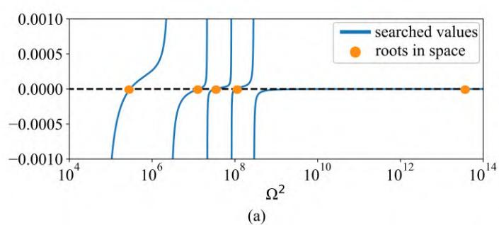

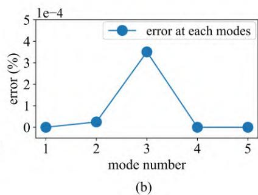

Figure 2.5 The system's Ω 2 root space showing (a) the five roots of the system, solved for using divide and conquer, and; (b) the error values between the roots found using divide and conquer and Sympy function "solveset".

Figure 2.5(a) shows the root value for Ω <sup>2</sup> obtained from the root space using the divide and conquer approach; its values are represented at points where the plots

{36}------------------------------------------------

pass through zero. The Ω <sup>2</sup> values obtained using divide and conquer are compared to the Sympy function "solveset" [37] as shown in Table 2.3, similar output is obtained from both methods. Figure 2.5(b) shows a low percent error between Ω <sup>2</sup> obtained using divide and conquer and the Sympy function "solveset".

# **Step 5: Solve for new frequencies**

The new natural frequencies  $f_2$  in Hz are then calculated for the five modes in the model utilized.

$$f_2 = \begin{pmatrix} 86 & 583 & 917 & 1602 & 1330221 \end{pmatrix}$$

# **Step 6: Update roller position**

The final step of the process is to use the obtained frequency value to determine the position of the added roller on the beam. This can be done through an error minimization approach, as previously demonstrated by Downey et al. [20].

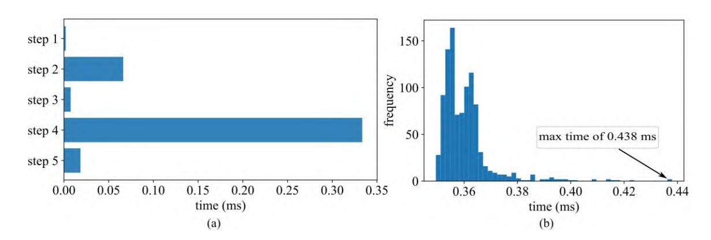

Figure 2.6 Timing for (a) each step in LEMP algorithm for state estimation, and; (b) the distribution of 1000 simulations of the state estimation process using divide and conquer in the LEMP algorithm.

Figure 2.6(a) shows the timing of each steps above using the algorithm described in section 3, step 1 takes approximately 0.0019 ms, step 2, 0.0662 ms, step 3, 0.0074 ms, step 4, 0.3353 ms and step 5, 0.0184 ms. A computer with processor Intel(R), Core(TM) i7-10700K CPU 3.80GHz was used for running the test. The total time for a single state estimation using LEMP is approximately 0.4296 ms. Step four in 

{37}------------------------------------------------

the LEMP process, where divide and conquer is used to solve for the altered state frequencies, took the most time at 0.335 ms. This step accounts for approximately 84% of total LEMP time. While the scope of this preliminary work does not contain a full-fledged comparison for the use of the divide and conquer solver against other numerical methods; the divide and conquer solver has proven to be significantly faster than the Sympy "solveset" function which takes about 40 ms to solve the same equation. Figure 2.6(b) reports a detailed investigation of the timing for step 4. Here, 1000 simulations were performed using the same beam parameters. The min process time is 0.349 ms, while the max is 0.438 ms, and with an average time of 0.361 ms.

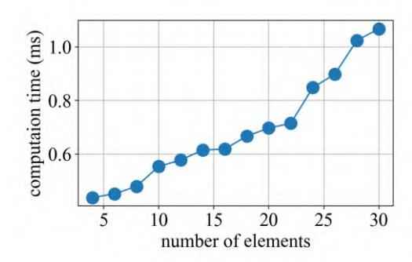

Figure 2.7 Maximum time required for state estimation using beam with element number 4 to 30.

Figure 2.7 show the maximum time in 1000 simulations required to achieve single state change estimation using the divide and conquer solver in the LEMP algorithm for different number of elements on the Euler-Bernoulli beam. With a beam of element number 28 and lower, the algorithm easily achieve a state estimation time of less than 1 ms.

## 2.4.2 State estimation comparison using LEMP and GE

With the inclusion of a roller support at node four on the Euler-Bernoulli beam in figure 2.3, an effective comparison between the LEMP algorithm and the reference GE algorithm is carried out for tracking the system state. Figure 2.8(a) - (e) shows the state of the beam after the addition of a roller support at node four. A close

{38}------------------------------------------------

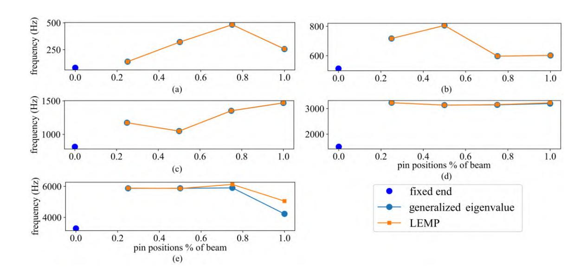

Figure 2.8 State estimation using LEMP and general eigenvalue for the first five modes of the five node Euler-Bernoulli beam in figure 2.3.

system state estimation is seen using the Local eigenvalue modification algorithm when compared to the reference general eigenvalue algorithm. Here, the frequencies obtained using the generalized eigenvalue approach is assumed to be the true value, while the LEMP is the estimated frequency value and Eq. 2.41 and Eq. 3.46 are used to calculate the error and SNR,. Table 2.4 show the mean absolute error in Hz and the signal to noise ratio. Small deviations are seen in the fifth mode; however, the percentage error observed is low, and a considerable high SNR is seen in the first four modes as shown in figure 2.9(a) and (b). This result demonstrates the feasibility of the of the LEMP algorithm with the divide and conqure solver for simple structure. It's viability for more complex state estimations are topic for future works.

## 2.5 Conclusion

The paper demonstrated the potential of using the local eigenvalue modification procedure (LEMP) to estimate the state of a system. The sample five node Euler-Bernoulli beam was used to investigate the timing of each step in the LEMP process for a single-state change. Initial investigation of the LEMP algorithm using the

{39}------------------------------------------------

Table 2.4 Mean absolute error and signal to noise ratio for the LEMP and GE.

| mode | mean absolute error | (Hz) SNR dB |
|------|---------------------|-------------|
| 1    | 0.2989              | 30.02       |
| 2    | 0.3193              | 33.38       |
| 3    | 0.5575              | 33.54       |
| 4    | 9.8136              | 25.10       |
| 5    | 262.80              | 13.18       |

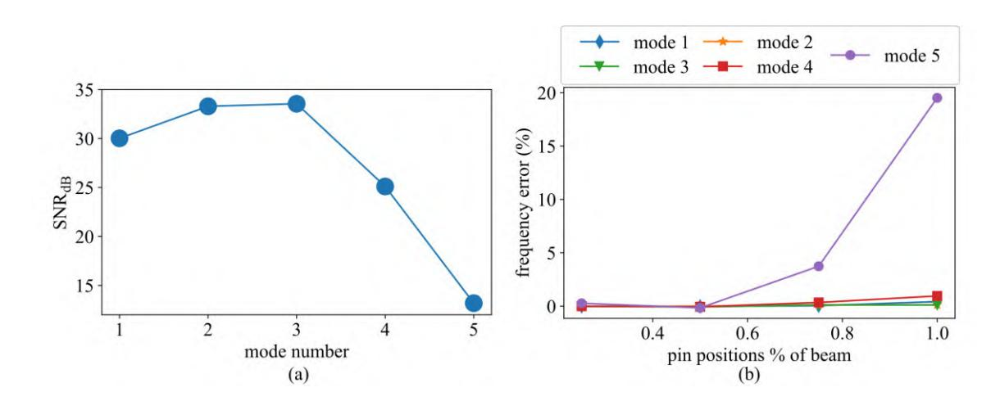

Figure 2.9 Figure showing the (a) signal to noise ratio for the GE and LEMP state estimation, and; (b) the error in percent between the two approaches.

Sympy function "solveset" to solve the resulting secular equation in the LEMP algorithm showed that it took about 40 ms to perform a single-state change update, making it impossible to achieve the the 1 ms time step required for real-time model updating of structures operating in high-rate dynamic environments.

The introduction of the divide and conquer approach to solve the secular equation in the LEMP process formulated a solver that significantly reduced the time taken to solve the system's secular equation. Experimental results demonstrated an average time of 0.361 ms for single state change updating was achieved using the five nodes beam. Using the same 5-nodes beam, an accuracy investigation between the reference general eigenvalue algorithm and LEMP with the divide and conquer solver was undertaken. Results showed that the frequencies obtained for state estimation at the 

{40}------------------------------------------------

nodes from both approaches are close. Signal to noise ratios SNRdB above 20 and low mean absolute error is observed in the first four modes, however, the fifth mode has a lower SNRdB around 14 and higher error. The error at the last node is expected to reduce as the number of nodes in the beam increases. With the addition of the secular equation solver; divide and conquer approach at extremely low latencies, the LEMP algorithm has the potential to enable real-time frequency-based model updating of complex systems that would not be achievable using the general eigenvalue approach.

## ACKNOWLEDGMENTS

This material is based upon work supported by the Air Force Office of Scientific Research (AFOSR) through award no. FA9550-21-1-0083. This work is also partly supported by the National Science Foundation Grant numbers 1850012 and 1956071. The support of these agencies is gratefully acknowledged. Any opinions, findings, conclusions, or recommendations expressed in this material are those of the authors, and they do not necessarily reflect the views of the National Science Foundation or the United States Air Force.

{41}------------------------------------------------

# Chapter 3 Real-time Structural Model Updating using Local Eigenvalue Modification Procedure for Application in High-Rate Dynamic Events1

#### Abstract

Estimating the state of structures that experience high-rate dynamics requires realtime model updating capabilities. High-rate dynamic events are characterized by 1) large uncertainties in the external loads, 2) high levels of non-stationarities and heavy disturbances, and 3) unmodeled dynamics generated from changes in system configurations. In order to achieve real-time model updating for high-rate dynamics, an algorithm should be able to update the structure's state on a timescale of 1 ms or less while circumventing pre-calculations to enable its operation over un-modeled event. This work formulates an algorithm to meet the stringent latency requirements using the local eigenvalue modification procedure (LEMP). In doing so, the model is transformed from the physical domain into the modal space which numerically simplifies the calculations needed to determine the state of a complex structure. To track the system through time, the structure's state is continuously updated by adjusting the associated model through online modal analysis. Its future states are

<sup>1</sup>Ogunniyi, E.A., Drnek, C., Hong, S.H., Downey, A.R., Wang, Y., Bakos, J.D., Avitabile, P. and Dodson, J., 2023. Real-time structural model updating using local eigenvalue modification procedure for applications in high-rate dynamic events. Mechanical Systems and Signal Processing, 195, p.110318. doi:https://doi.org/10.1016/j.ymssp.2023.110318. Reprinted here copyright for manuscript provided by publisher

{42}------------------------------------------------

estimated using a Bayesian search algorithm to compare the measured signals with selected modal models. New modal models are built based on the enhanced estimate of the structure's state and used for subsequent state estimations. The methodology is applied to an experimental testbed experiencing varying dynamics to update a surrogate model. Results show that the LEMP algorithm could update the state of the high-rate dynamics system within 1 ms for up to 250 nodes, a speed up of 125 times when compared to solving for the systems state using the generalized eigenvalue approach. The timing, accuracy, and computational resources are discussed in this paper and compared to the baseline generalized eigenvalue approach. An example problem and code are provided in a public repository.

Keywords: real-time model updating, high-rate dynamics, model reduction, eigenvalue modification, modal analysis, adaptive structures .

#### 3.1 Introduction

High-rate dynamics are defined as the dynamic responses of a system that are high-rate ( $< 100$  ms) and high-amplitude (acceleration  $> 100$  g<sub>n</sub>), such as those caused by a blast or impact [1]. Such events are complicated by instantaneous and unpredictable changes in the loading conditions acting upon a system, which alters the magnitude and location of internal and external forces experienced by the structure throughout the event. Because the changes experienced by the structure are sudden and unknown, tracking the state of the structure throughout the event remains a challenge.

One approach to tracking the state of such structures through a high-rate dynamic event is to utilize structural model updating techniques to update a digitized representation of the system state with real-time constraints. For accurate state estimations of structures experiencing high-rate dynamics, the model updating technique must: (1) be flexible to adapt to changing external load conditions without relying on pre-trained data and; (2) be capable of updating structural models within a 1 ms 

{43}------------------------------------------------

real-time latency constraints to enable real-time decision-making [5]. Model updating of structures using frequency-based methods is achieved using error minimization techniques [38, 8]. In addition, frequency-based methods do not require exact knowledge of the input [7]. However, better performance and stability can be achieved when the input characteristics are either known or estimated [9].

Real-time model-updating enables tracking complex structures experiencing highrate dynamic events such as in-flight monitoring systems and impact mitigation systems. In-flight monitoring can be applied to manned and unmanned aerial vehicles and spacecraft. In the case of an unmanned vehicle, where a pilot is not present to monitor the aircraft, operators on the ground must rely on sensor readings to determine the system's condition. Real-time model updating would allow the operating software to receive state data almost instantaneously, enhancing the knowledge of the system and its surroundings allowing for mission-critical actions [39]. In the case of manned vehicles, real-time model updating would allow for the incorporation of decision-making software that will respond to changing environments faster than human occupants can in a time of stress such as system or component failure [39].

Impact mitigation technology can be found in the defense and automotive industry, with examples including active blast mitigation systems and airbag deployment systems. Active blast mitigation systems minimize the blast's impact or counter the blast's effects after impact. Large forces associated with an incoming blast and closerange threats require the system to detect the presence of a blast threat, determine the magnitude and location of an incoming threat, and deploy countermeasures on a millisecond timescale [3]. Airbags are an essential safety component in vehicles; however, in some cases, the deployment of airbags can cause additional injuries to passengers. The Delphi Dual Depth airbag is an adaptive airbag that controls the extent of inflation based on factors such as the size and seated position of the passenger as well as the crash severity and location [40]. Real-time model updating would allow

{44}------------------------------------------------

for additional adaptive measures, such as modifying the shape of an inflated airbag or adjusting the inflation rate to maximize protection within the latency constraints (i.e., allotted response time). In each application, real-time model updating would prioritize occupant's safety and mitigate the damage experienced by the system by providing users with the system's current state, thereby preventing further losses or failure.

Real-time model updating methodologies for structures have been developed for civil and aerospace structures by leveraging the Finite Element Analysis (FEA) [41, 42, 43, 44, 45, 46, 47]. However, the execution time requirements in these efforts were on the order of hours to months and often executed offline due to the computational costs associated with solving FEA models. Additionally, unmodeled dynamics characteristic of high-rate dynamic events limit the application of an FEA approach with pre-calculated databases of structural conditions for this class of structures [1]. The challenge of accounting for unmodeled dynamics necessitates the formulation of online model updating techniques that can track the system's state while requiring only a limited amount of offline training (e.g., the initial state of the structure). In prior work, the authors have experimentally demonstrated that real-time model updating can be accomplished for a structure undergoing a simulated high-rate event with a latency constraint of 1 ms using a simplified Euler-Bernoulli beam model and updating the model in the frequency domain [7]. However, to obtain the 1 ms latency constraint, the FEA model was limited to 23 nodes. In this configuration, 0.6 ms were required to solve the generalized eigenvalue problem, accounting for most of the computational load. Furthermore, the generalized eigenvalue formulation scales poorly for larger FEA models due to its  $\mathcal{O}(n^3)$  complexity.

Real-time modeling in this work is accomplished using the local eigenvalue modification procedure (LEMP), which simplifies state calculations when only one change is made to the system [10] and a Bayesian probabilistic approach that reduces the

{45}------------------------------------------------

search space. Advantages to applying LEMP are that all variables for the altered state are defined in terms of the initial state and changes made between the two. They only require information for the degrees of freedom (DOF) at which changes occur, which reduces the number of calculations required since the solution for the initial state equations is constant. Additionally, the original eigenvalue solution is reduced to a set of second-order equations through LEMP. Additional search space reduction is achieved by applying a Bayesian probabilistic approach that considers the current state of the structure given an initial uncertainty about the estimate itself [12]. A similar approach proposed by Madarshahian et al. [13] utilized a twolayer Bayesian approach to minimize the computational cost of estimating prior and posterior distributions. Huang et al. used the Bayesian learning to reconstruct signal from a compressive sensor to reduce the cost of signal transfer and storage [48], while Bayesian theory is used to produce the posterior joint probability distribution of the structure's physical properties in [49]. Moreover, Kurata et al. implemented a Bayesian approach conjointly with branch and bound search techniques to model the crack growth within aluminum hull structures [50].

The key contributions of this work are 1) the formulation of a real-time model updating technique that leverages an eigenvalue modification procedure to reduce the original eigenvalue problem to a set of second-order equations, and 2) the introduction of a Bayesian probabilistic approach for the sampling of potential structural states. Together, these advantages reduce the number and complexity of equations needed to compute the state of the structure and advance state-of-the-art structural model updating techniques for real-time applications with a latency constraint in the sub 1 ms range.

{46}------------------------------------------------

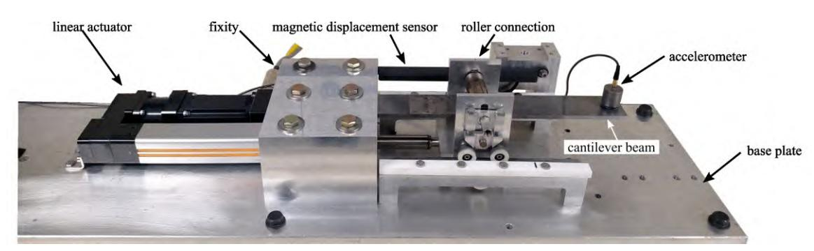

Figure 3.1 DROPBEAR testbed as configured for this work.

## 3.2 Background

## 3.2.1 DROPBEAR Experimental Testbed

This work uses the DROPBEAR testbed, which was initially developed by Joyce et al. [51]. The DROPBEAR was constructed specifically for simulating high-rate dynamic events in the laboratory. It features two programmable changes: a detachable mass secured using an electromagnet and a movable roller boundary condition attached to a linear actuator, both used to simulate damage to the structure. The DROPBEAR testbed is advantageous when modeling high-rate dynamic cases because the setup is capable of repeatedly altering test parameters. These parameters can be changed during a test instead of between test runs, allowing researchers to gain insight into the system's real-time response. In this work, only the movable roller is utilized, and the algorithm is focused on its capability to model the nonstationary boundary conditions of the system. The experimental configuration used here is shown in Fig. 3.1.

The experimental configuration features an accelerometer (PCB Piezotronics model 393B04) mounted at the free end of a  $51 \times 6 \times 350$  mm steel cantilever beam with a density of  $7800$  kg/m<sup>3</sup>, Young's Modulus of  $2e11$  N/m<sup>2</sup> and Poisson's Ratio of 0.26. The design also features a sliding roller cart on a linear actuator that constrains vertical beam displacement between 48-17 mm from the fixed end and a magnetic displacement sensor that measures the roller's displacement throughout the test. Adjusting the roller location during tests simulates damage to the system by producing

{47}------------------------------------------------

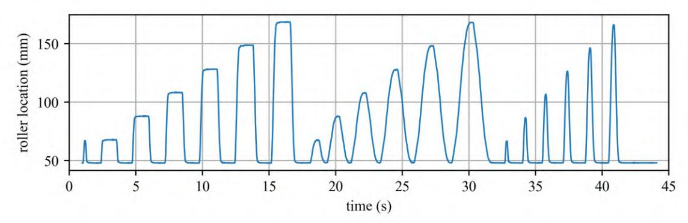

Figure 3.2 Roller testing parameters used in this work.

a user-defined change to the system input, which results in a change to a measured system output (e.g., acceleration). The use of rollers ensures the repeatability of each test, as the damage is simulated. This study investigates the reference data set initially presented in Downey et al. [7]. In this preliminary work, all results are obtained using the previously recorded sensor data. The measured test profile of the roller locations used in this work is presented in Fig. 3.2 and is open sourced; provided via a public repository [52].

#### 3.2.2 Model development for the DROPBEAR Experimental Testbed

Initial state calculations are made using a finite element model and the Euler-Bernoulli beam theory. As shown in Fig. 3.3, the modified DROPBEAR testbed is modeled as a cantilever beam with the far-left end fixed and no additional support (i.e., no roller present). Each element has two nodes and 4 degrees of freedom (two rotation  $\theta$  and two displacements  $v$ ). The beam is split into  $N$  elements of equal length resulting in  $N+1$  evenly spaced nodes along the beam. Two forces and two moments characterize an Euler-Bernoulli element, also shown in Fig. 3.3, resulting in  $2(N+1)$  DOF for the system.

The mass ( $\mathbf{M}_i$ ) and stiffness ( $\mathbf{K}_i$ ) matrices for an Euler-Bernoulli beam element can be found using Eq. 3.1 and Eq. 3.2 as well as Table 3.1 which lists the material and geometric properties of the DROPBEAR testbed. These elemental matrices are

{48}------------------------------------------------

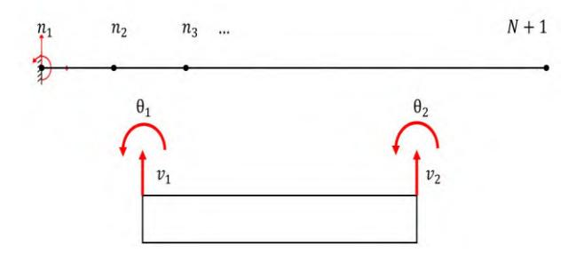

Figure 3.3 DROPBEAR modeled as a cantilever Euler-Bernoulli beam.

combined to construct the global mass (**M**1) and stiffness (**K**1) matrices for the initial sate.

$$\mathbf{M}_i = \frac{\rho_i A_i l_i}{420} \begin{bmatrix} 156 & 22l_i & 54 & -13l_i \\ 22l_i & 4l_i^2 & 13l_i & -3l_i^2 \\ 54 & 13l_i & 156 & -22l_i \\ -13l_i & -3l_i^2 & -22l_i & 4l_i^2 \end{bmatrix} \quad (3.1)$$

$$\mathbf{K}_i = \frac{E_i I_i}{l_i} \begin{bmatrix} 12/l_i^2 & 6/l_i & -12/l_i^2 & 6/l_i \\ 6/l_i & 4 & -6/l_i & 2 \\ -12/l_i^2 & -6/l_i & 12/l_i^2 & -6/l_i \\ 6/l_i & 2 & -6/l_i & 4 \end{bmatrix} \quad (3.2)$$

Table 3.1 Material and geometric properties of the DROPBEAR testbed.

| Density $- \rho$ (kg/m <sup>3</sup> )          | 7800     |
|------------------------------------------------|----------|
| Cross-sectional area $- A_c$ (m <sup>2</sup> ) | 0.000306 |
| Total length $- l$ (m)                         | 0.35     |
| Elemental length $- l_i$ (m)                   | 0.35/N   |
| Young's Modulus $- E$ (Pa)                     | 2e11     |

The equation of motion (EOM) for the entire system modeled as an Euler-Bernoulli beam is shown in Eq. 3.3 where  $\mathbf{M}_1\ddot{x}$  and  $\mathbf{K}_1x$  are the mass and stiffness terms, respectively, for the initial system. The damping term ( $\mathbf{C}\dot{x}$ ) can be ignored as its effect on the frequency of vibration is insignificant. The critical damping ratio ( $\zeta$ ) for the

{49}------------------------------------------------

case when the roller is 48 mm distant from the support was found to be 0.0076 in experimental testing in Downey et al. [7]. As a result, the theoretical resonant frequency of the beam may be calculated using an impact excitation that excites all of the beam's frequencies equally. The predicted resonant frequency differs from the undamped natural frequency by only 0.005%. As a result, a simplified expression of the equation of motion that does not include the damping term can be utilized as follows:

$$\mathbf{M}_1\ddot{x} + \mathbf{K}_1x = 0 \quad (3.3)$$

Here,  $\ddot{x}$  and  $x$  are the acceleration and displacement vectors in physical space of length  $n$ . Additionally,  $\mathbf{M}_1$  and  $\mathbf{K}_1$  are the mass and stiffness matrices that are square symmetric and have dimensions of  $n \times n$ , where  $n$  is the DOF for the system.

By definition, the generalized eigenvalue (GE) problem for Eq. 3.3 is  $\mathbf{K}_1\mathbf{U}_1 = \mathbf{M}_1\mathbf{U}_1\mathbf{\lambda}$ , where  $\mathbf{\lambda}$  is a matrix of eigenvalues and  $\mathbf{U}_1$  is the matrix of eigenvectors, both having dimensions of  $n \times n$ . The GE problem can be solved using Eq. 3.4 and Eq. 3.5 below.

$$\det[\mathbf{K}_1 - \boldsymbol{\lambda}\mathbf{M}_1] = 0 \quad (3.4)$$

$$[\mathbf{K}_1 - \lambda \mathbf{M}_1]\mathbf{U}_1 = 0 \quad (3.5)$$

Solutions to the previous equations yield eigenvalues and eigenvectors according to Eq. 3.6 and Eq. 3.7 respectively. Eigenvalues are related to the natural frequency of the system, while eigenvectors are related to mode shapes of the system and are assembled in matrix form as:

{50}------------------------------------------------

$$\boldsymbol{\lambda} = \begin{bmatrix} \omega_1^2 & 0 & 0 & 0 \\ 0 & \omega_2^2 & 0 & 0 \\ 0 & 0 & \ddots & 0 \\ 0 & 0 & 0 & \omega_n^2 \end{bmatrix} \quad (3.6)$$

$$\mathbf{U}_1 = \begin{bmatrix} \vec{u}_1 & \vec{u}_2 & \dots & \vec{u}_n^1 \end{bmatrix} \quad (3.7)$$

where  $\omega_n$  and  $\vec{u}_n^1$  are the  $n^{\text{th}}$  frequency and modal vector for the initial state of the system where the arrow denotes a vector. Although the modal matrix does not represent system mode shapes, it can be used to calculate them.

#### 3.2.3 Local Eigenvalue Modification Procedure

Structural dynamic modification (SDM) identifies physical modifications made to system properties such as mass, stiffness, or damping by monitoring changes in the system's dynamic response such as frequencies and mode shapes or vice versa [53, 54, 55, 56]. SDM is accomplished by modeling the altered state as a combination of the initial state and the changes between the states using changes to mass, stiffness, or damping matrices in the EOM for the altered system. SDM also utilizes the principle of modal synthesis, which states that any dynamic response of a vibrating structure can be decomposed into a set of individual contributions of single frequencies [57, 58]. Also, it effectively defines the initial system of  $n$  DOF as a set of  $n$  independent single DOF systems, as illustrated in Fig. 3.4. This is done by utilizing the relationship between the modal properties and spatial properties of a structure, which simplifies state estimations for complex systems by transforming equations from physical space to modal space using the GE solution of the initial state [53, 54].

In Fig. 3.4, each DOF responds to one natural frequency of the physical system with a modal mass and stiffness value related to physical system response through modal transformations. Any changes made to this initial system result in an altered

{51}------------------------------------------------

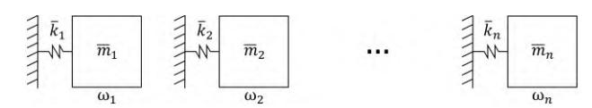

Figure 3.4 Modal representation of initial system.

modal system. These changes (e.g., mass and stiffness) can be transformed into modal space where matrix values on the diagonal represent a mass or stiffness change from the initial system (i.e., Fig. 3.4) to ground, and off-diagonal values in the matrix couple individual systems together as shown in Fig. 3.5 by the connecting springs.

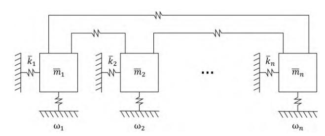

Figure 3.5 Modal representation of altered system.

One advantage of operating in modal space is that the model for the initial structure only needs to contain information for the DOF where modifications are made, thereby reducing the size of the matrices in the EOM, and the number of corresponding calculations required [59, 60]. Therefore, solving the reduced EOM in modal space requires processing a smaller GE solution to find the model's new frequencies and mode shapes. While this reduces the computational cost compared to solving the original GE, it still requires solving a GE problem which may still be too computationally expensive given the stringent timing constraints demanded by the high-rate dynamics problem [61].

Weissenburger originally developed LEMP in 1968 to avoid eigenvalue solutions in SDM when the system undergoes a single change. The idea was to simplify state calculations to meet the limited processing power of computers at the time [10, 62, 63, 64]. Following the initial modification, the system equations had to be updated, and other additional modifications had to be performed; this was a time-consuming

{52}------------------------------------------------

procedure. LEMP utilizes a single GE solution for the initial system and simplifies altered state equations by transforming them into modal space, isolating the DOFs that contribute to the changes between states, and defining equations in terms of the initial state as discussed in SDM. However, additional simplifications occur by truncating the  $n$  independent single degree of systems to only include the  $m$  modes of interest. This results in a  $\lambda$  matrix with dimensions  $m \times m$  and a corresponding modal matrix  $\mathbf{U}_1$  of dimensions  $n \times m$ . This modal truncation further simplifies the altered state equations. An overview of the LEMP is shown in Fig. 3.6 and will be discussed further in the following sections.

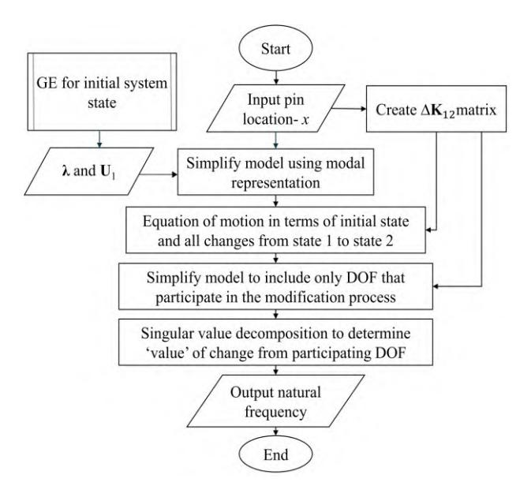

Figure 3.6 Flowchart of LEMP algorithm.

The benefit of applying LEMP is that the GE equation is reduced to a set of second-order equations whose frequency roots are bounded by the initial frequencies of the system, thereby reducing the domain over which the equation is solved [10]. These simplifications reduce the number and complexity of equations needed to compute the structure's state, equating to less computing time than the previously mentioned GE solutions.

{53}------------------------------------------------

with additional nodes or various element types. More complex models would significantly enhance the usefulness of physics-informed state estimation of structures experiencing high-rate dynamic events. Moreover, these high-quality models are critical to performing prognostics and enabling decision-making for these structures.

## LEMP algorithm

LEMP is applied according to the process illustrated in Fig. 3.6. After the GE solution is obtained for the initial system, the EOM for the altered state is created according to Eq. 3.8 while ignoring the effects of damping.

$$\mathbf{M}_2\ddot{x} + \mathbf{K}_2x = 0 \quad (3.8)$$

where  $\mathbf{M}_2$  and  $\mathbf{K}_2$  are the mass and stiffness matrices of the altered state in physical space, both with dimensions of  $n \times n$ . In this work, the change between system states results from adding a roller boundary condition at a node location along the beam. In traditional FEA approaches, the application of a roller limiting bending in the beam at that location allows for row and column cancellation. Instead, here we assume a large numerical stiffness ( $K=10,000$  N/m) for the roller at a given node position, allowing for calculations using a full matrix without varying the resulting state calculations. Therefore, there is no change made to the mass matrix, only a change made to the stiffness matrix, denoted by  $\Delta\mathbf{K}_{12}$  with dimensions of  $n \times n$ . The mass and stiffness of the altered state are defined in terms of the initial state and changes between the two as shown in Eqs. 3.9 and 3.10 respectively.

$$\mathbf{M}_2 = \mathbf{M}_1 \quad (3.9)$$

$$\mathbf{K}_2 = \mathbf{K}_1 + \Delta \mathbf{K}_{12} \quad (3.10)$$

{54}------------------------------------------------

Substituting Eqs. 3.9 and 3.10 into the original EOM for the altered state yields Eq. 3.11.

$$\mathbf{M}_1\ddot{x} + (\mathbf{K}_1 + \Delta\mathbf{K}_{12})x = 0 \quad (3.11)$$

To simplify future calculations, the  $n$  modes of the  $n$  independent single DOF systems of the initial system are truncated to only include the  $m$  modes of interest. This results in  $\boldsymbol{\lambda}$  matrix with dimensions  $m \times m$  and a corresponding modal matrix  $\mathbf{U}_1$  of dimensions  $n \times m$ . This modal truncation further simplifies the altered state equations. Additional simplifications occur by transforming the system response from physical space to modal space using the relations shown in Eqs. 3.12 and 3.13, where  $p_1$  and  $\ddot{p}_1$  are the system displacement and acceleration vectors in modal space whose length is reduced from  $n$  to  $m$  after modal truncation occurs.

$$x = \mathbf{U}_1 p_1 \quad (3.12)$$

$$\ddot{x} = \mathbf{U}_1 \ddot{p}_1 \quad (3.13)$$

Converting the EOM to modal space utilizing Eqs. 3.12 and 3.13 yields Eq. 3.14 below.

$$\mathbf{M}_1\mathbf{U}_1\ddot{p}_1 + (\mathbf{K}_1 + \Delta\mathbf{K}_{12})\mathbf{U}_1p_1 = 0 \quad (3.14)$$

By multiplying each term by **<sup>U</sup>**<sup>T</sup> 1 the mass and stiffness matrices are normalized in modal space which yields diagonal matrices as shown in Eq. 3.15.

$$\text{diag}(\overline{\mathbf{M}}_1)\vec{p}_1 + [\text{diag}(\overline{\mathbf{K}}_1) + \Delta \overline{\mathbf{K}}_{12}]p_1 = 0 \quad (3.15)$$

where **M**1 and **K**1 represent the modal mass and stiffness matrices and ∆**K**12 represents the changes made in modal space between the initial and altered state. These

{55}------------------------------------------------

matrix dimensions are reduced from  $n \times n$  to  $m \times m$  after modal truncation occurs. Diagonal values of  $\Delta\overline{\mathbf{K}}_{12}$  represent ground connections and off-diagonal values couple the single DOF systems as shown between Figs. 3.4 and 3.5. Note the overline on  $\Delta\overline{\mathbf{K}}_{12}$  in Eq. 3.15 which is the change made in modal space is different from  $\Delta\mathbf{K}_{12}$  in Eq. 3.14 which is the change made in physical space.

Scaling Eq. 3.15 to unit modal mass yields Eq. 3.16, where  $\mathbf{I}$  is the identity matrix with dimensions of  $m \times m$ . The benefit of scaling to modal mass is that the state equation for the altered state in modal space can be written in terms of the initial eigenvalues, which were already obtained by Eq. 3.6. Also note that the  $\Delta\bar{\mathbf{K}}_{12}$  in Eq. 3.16 is different from that in Eq. 3.15 as it has been scaled to unit modal mass.

$$\mathbf{I}\ddot{p}_1 + [\boldsymbol{\lambda} + \Delta \bar{\mathbf{K}}_{12}]p_1 = 0 \quad (3.16)$$

To solve for the updated natural frequencies that occur as a result of system changes, the following procedure is implemented. First, the GE solution of Eq. 3.16 is set up, but not solved according to Eqs. 3.17 and 3.18 below.

$$\det[(\boldsymbol{\lambda} + \Delta \bar{\mathbf{K}}_{12}) - \boldsymbol{\Lambda} \mathbf{I}] = 0 \quad (3.17)$$

$$[(\boldsymbol{\lambda} + \Delta \bar{\mathbf{K}}_{12}) - \Delta \mathbf{I}]_{p12} = 0 \quad (3.18)$$

 $\mathbf{A}$  is a matrix with dimensions of  $m \times m$  whose the diagonals are the squares of the updated frequencies and  $p_{12}$  is the modal change between the states. The terms are then rearranged to yield Eq. 3.19.

$$[(\boldsymbol{\Lambda} - \boldsymbol{\Lambda}) + \Delta \bar{\mathbf{K}}_{12}]p_{12} = 0 \quad (3.19)$$

Because the stiffness change between states occurs as a result of applying a nodal boundary condition, only diagonal values will be affected between the  $\mathbf{K}_1$  and  $\mathbf{K}_2$ 

{56}------------------------------------------------

matrices. Furthermore, the only non-zero term in the  $\Delta\mathbf{K}_{12}$  matrix is the diagonal value associated with the DOF where the roller is located. Noting that the only non-zero values in  $\Delta\mathbf{K}_{12}$  are those associated with the DOF(s) that experience a change in stiffness from the initial to an altered state. The equation for  $\Delta\overline{\mathbf{K}}_{12}$  is then simplified to only contain information from the contributing nodes. This is accomplished through spectral decomposition of  $\Delta\mathbf{K}_{12}$  as shown in Eq. 3.20.

$$\Delta \mathbf{K}_{12} = \mathbf{T}\text{diag}(\boldsymbol{\alpha})\mathbf{T}^{\text{T}} \quad (3.20)$$

where  $\mathbf{T}$  is the  $n \times n$  tie matrix consisting of a set of row tie vectors as shown in Eq. 3.21 and  $\boldsymbol{\alpha}$  is a matrix of size  $n$  obtained from the single value decomposition of  $\Delta\mathbf{K}_{12}$ . The tie matrix represents connections between the two system's states while the alpha value is the singular change in the stiffness.

$$\mathbf{T} = \begin{bmatrix} \vec{t}_1 & \vec{t}_2 & \cdots & \vec{t}_n \end{bmatrix}^T \quad (3.21)$$

Equation 3.20 is then transformed to modal space by multiplying each side by  $\mathbf{U}_1^T$  and  $\mathbf{U}_1^T$  as shown in Eq. 3.22.

$$\Delta \bar{\mathbf{K}}_{12} = \mathbf{U}_1^{\text{T}} \mathbf{T} \text{diag}(\boldsymbol{\alpha}) \mathbf{T}^{\text{T}} \mathbf{U}_1 \quad (3.22)$$

The contributing values of  $\Delta\bar{\mathbf{K}}_{12}$  can be redefined by reducing  $\Delta\mathbf{K}_{12}$  to only include non-zero values which is denoted by  $\Delta\mathbf{k}_{12}$ . This is done by using the tie vector and alpha value associated with the affected DOF, denoted by  $t_c$  and  $\alpha$  respectively.  $\Delta\mathbf{k}_{12}$  can then be transformed to modal space utilizing the corresponding rows of  $\mathbf{U}_1$ , denoted by  $\mathbf{U}_{1_c}$ . These reduced matrices only include information associated with the DOF(s) experiencing a stiffness change and are obtained using the relation in Eq. 3.23 where  $\vec{v}$  is the one-dimensional contribution vector, of length  $m$ , associated with the affected DOF as noted in Eq. 3.24.

{57}------------------------------------------------

$$\vec{v} = \mathbf{U}_{1c}^T \vec{t}_c \quad (3.23)$$

$$\vec{v} = \begin{bmatrix} v_1 & v_2 & \dots & v_m \end{bmatrix}^T \quad (3.24)$$

The relation from Eq. 3.23 is then used along with the alpha value associated with the affected DOF to solve for  $\Delta\bar{\mathbf{k}}_{12}$ . This is done according to Eq. 3.25 which yields the equation for the modal stiffness change in terms of contributing nodes only.

$$\Delta \bar{\mathbf{k}}_{12} = \vec{v} \alpha \vec{v}^T \quad (3.25)$$

Noting that  $\Delta\bar{\mathbf{K}}_{12}$  is equivalent to  $\Delta\bar{\mathbf{K}}_{12}$ , and of dimension  $n \times n$ , Eq. 3.25 can be substituted for  $\Delta\bar{\mathbf{K}}_{12}$  in the original GE problems shown in Eqs. 3.17 and 3.18 which yields the following equations:

$$[(\boldsymbol{\Lambda} - \boldsymbol{\Lambda}) + \vec{v}\alpha\vec{v}^T]p_{12} = 0 \quad (3.26)$$

$$(\boldsymbol{\lambda} - \boldsymbol{\Lambda})p_{12} + \vec{v}\alpha\vec{v}^Tp_{12} = 0 \quad (3.27)$$

To further simplify state equations, **S** is defined as an arbitrary variable according to Eq. 3.28.

$$\mathbf{S} = \vec{v}^T p_{12} \quad (3.28)$$

Eq. 3.28 is then substituted into Eq. 3.27 to yield Eq. 3.29.

$$(\boldsymbol{\lambda} - \boldsymbol{\Lambda})p_{12} + \vec{v}\boldsymbol{\alpha}\mathbf{S} = 0 \quad (3.29)$$

Which can be rearranged to solve for  $p_{12}$  as shown in Eq. 3.30

$$p_{12} = -(\boldsymbol{\lambda} - \boldsymbol{\Lambda})^{-1} \vec{v} \alpha \mathbf{S} \quad (3.30)$$

{58}------------------------------------------------

Then, Eq. 3.30 is multiplied by  $\vec{v}^T$  to yield Eq. 3.31

$$\vec{v}^T v_{12} = -\vec{v}^T (\boldsymbol{\lambda} - \boldsymbol{\Lambda})^{-1} \vec{v} \alpha \mathbf{S} \quad (3.31)$$

Which can be rewritten as Eq. 3.32 using the relation from Eq. 3.28

$$\mathbf{S} = -\vec{v}^T(\boldsymbol{\lambda} - \boldsymbol{\Lambda})^{-1}\vec{v}\alpha\mathbf{S} \quad (3.32)$$

By multiplying each side by  $\mathbf{S}^{-1}$ , both  $\mathbf{S}$  matrices are eliminated leaving the matrix equation shown in Eq. 3.33.

$$\alpha^{-1} = -\vec{v}^T(\boldsymbol{\lambda} - \boldsymbol{\Lambda})^{-1}\vec{v} \quad (3.33)$$

Since  $\vec{v}$  is a one-dimensional vector,  $\vec{v}$  is element-wise equal to  $\vec{v}^T$ . Therefore, breaking Eq. 3.33 into components yields the following equation, where the only unknown is  $\Omega_r$  or the natural frequency of the altered system. Here,  $r$  ranges from 1 to  $m$ , where  $m$  is the number of modes used to describe the system. The LEMP algorithm results in a secular equation of Eq 3.34 solved using the divide and conquer approach described in [14].

$$\frac{-1}{\alpha} = \sum_{r=1}^m \frac{v_r^2}{\omega_r^2 - \Omega_r^2} \quad (3.34)$$

In summary, LEMP consists of two main parts: a single GE solution for the initial state of the system and an eigenvalue modification process for the altered system state that is updated for each roller position. The eigenvalue modification process consists of simplifications to state equations accomplished by defining the system in terms of the initial state and changes made between the two states, utilizing modal representation, and isolating contributing nodes.

{59}------------------------------------------------

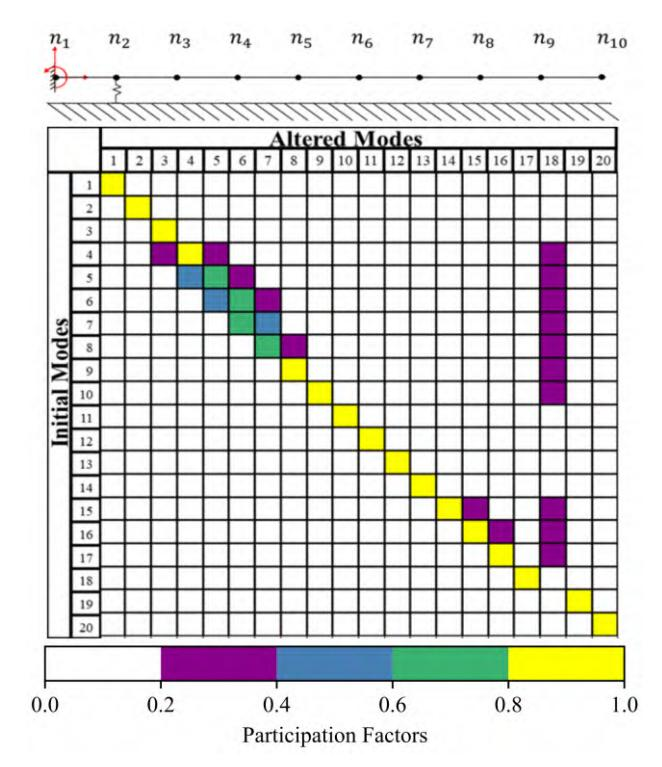

Figure 3.7 Modal participation factors for the altered state with roller at  $n_2$ .

#### Model creation

As previously noted, additional simplifications occur within LEMP by truncating the  $n$  independent single DOF systems to only include the  $m$  modes of interest. However, this process requires the creation of a pre-selected surrogate model, which includes determining the number of modes and nodes to use when modeling the system. The goal is to include enough information about the system to ensure the state estimate contains a minimal error without including excess information that negatively affects computation time.

Not all initial modes will contribute equally to altered frequencies, but missing modes that do contribute will drastically increase the estimation error due to truncation. Therefore, predetermining which initial modes contribute and how much each contributes to the altered states is essential. This is accomplished by solving for modal transformation matrix  $\mathbf{U}_{12}$ , of dimensions  $n \times n$ , which uncouples the modification between states. Recall from the altered EOM in modal space, as shown by Eq.

{60}------------------------------------------------

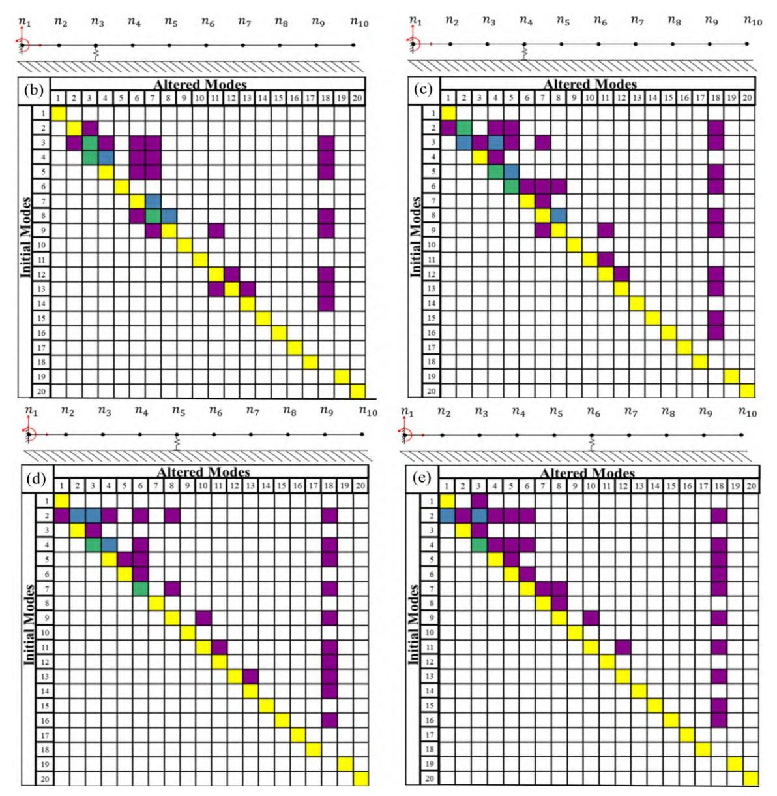

Figure 3.8 Modal participation factors for the altered state with roller at  $n_3$  (b),  $n_4$  (c),  $n_5$  (d), and  $n_6$  (e)

{61}------------------------------------------------

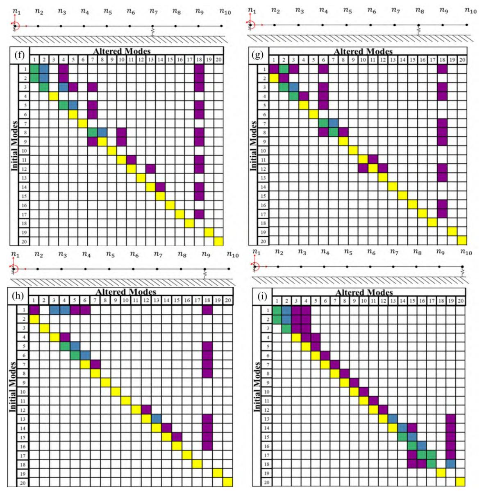

Figure 3.9 Modal participation factors for the altered state with roller at  $n_7$  (f),  $n_8$  (g),  $n_9$  (h) and  $n_{10}$  (i)

{62}------------------------------------------------

3.15, that  $p_1$  and  $\vec{p}_1$  are initial system displacement and acceleration in modal space of initial length  $n$ . The initial modal response can also be rewritten as a function of the modal response of the altered state and the modal transformation matrix according to the following relations:

$$p_1 = \mathbf{U}_{12}p_2 \quad (3.35)$$

$$\ddot{p}_1 = \mathbf{U}_{12}\ddot{p}_2 \quad (3.36)$$

Where  $p_2$  and  $p_2$  are also of length  $n$ . If LEMP were not applied, the GE solution of Eq. 3.15 given the transformation shown in Eqs. 3.35 and 3.36 could be solved using Eq. 3.37 below.

$$\{[\text{diag}(\overline{\mathbf{K}}_1) + \Delta \overline{\mathbf{K}}_{12}] - \boldsymbol{\lambda}_{12} \text{diag}(\overline{\mathbf{M}}_1)\} \mathbf{U}_{12} = 0 \quad (3.37)$$

Where Eq. 3.37 is generalized eigenvalue solution for equation Eq. 3.15 and  $\lambda_{12}$  is the eigenvalue. The eigenvectors of Eq. 3.37 are the columns of matrix  $\mathbf{U}_{12}$  and are called participation factors. These values offer insight into each initial mode's weight in defining the altered modes. Values range between -1 and 1, where absolute values closer to 1 correspond with a larger modal contribution.

In the case of this work, the modal response of the initial system is that of a cantilever beam, and the addition of a roller alters modal responses. To determine the participation factors of the system used here, the number of nodes was initially set to 10, which corresponds to 20 DOFs due to the characterization of the system as an Euler-Bernoulli beam (yielding a  $20 \times 20$   $\mathbf{U}_1$  matrix). The participation factors were calculated at each node along the beam, excluding the fixed end, and plotted according to the key in Fig. 3.7. The participation factors were not calculated for the node at the fixed end because the system is already constrained in the bending and

{63}------------------------------------------------

rotational DOF due to the boundary condition; therefore, adding a roller would not change the system response.

Figures 3.7-3.9 illustrate the modal participation factors for a roller located at nodes ranging along the beam. The initial modes of the cantilever beam are listed on the vertical axes, and altered modes of the cantilever beam with a roller placed at a node are listed along the horizontal axes. Boxes are color-coded based on the value of the participation factor, where white boxes represent little to no contribution and yellow represents high levels of contribution. For example, in Fig. 3.7, the altered modes (horizontal axis) are the modes for the system when the pin is at the second node. In this case, the fifth mode for the altered shape can be represented as a combination of modes 4, 5, and 6 from the initial cantilever beam with participation factors of 0.2383, 0.7717, and 0.5489, respectively. Future analysis will focus on contributions greater than 0.2 from initial modes.

Using Figs. 3.7-3.9, the contributions from initial modes were tallied based on participation factors. The total counts and contribution percentage for initial modes whose contribution factors were greater than 0.2 are summarized in Table 3.2.

Participating modes were selected if their contribution percentage was significant (5 % or greater). Therefore, initial modes 1-9 and 12 were selected. Additional limitations due to the experimental setup and accelerometer selection further reduced the selected modes. In order to utilize a mode in state estimations, the data acquisition system must be capable of measuring that mode experimentally. Therefore, each mode type and frequency must be considered when selecting modes. Mode shapes and natural frequencies are shown for all participating modes in Fig. 3.10.

The experimental setup in this work utilizes a single-axis accelerometer mounted at the far end of the beam, which limits measurable modes to those of bending in the Y direction. Additionally, the maximum frequency range of the accelerometer was ( $\pm 3$  dB) 0.02 - 1700 Hz [65]. Therefore, the modes used to describe the system were

{64}------------------------------------------------

Table 3.2 Counts and percentages for contributing initial modes.

| Contributing Mode | Yellow (0.8-1) | Green (0.6-0.8) | Blue (0.4-0.6) | Purple (0.2-0.4) | Total | Counts Contribution Percentage ( % ) |
|-------------------|----------------|-----------------|----------------|------------------|-------|--------------------------------------|
| 1                 | 5              | 2               | 6              | 13               | 26    | 6.3725                               |
| 2                 | 4              | 4               | 4              | 18               | 30    | 7.3529                               |
| 3                 | 4              | 3               | 6              | 20               | 33    | 8.0882                               |
| 4                 | 6              | 2               | 1              | 14               | 23    | 5.6372                               |
| 5                 | 2              | 7               | 7              | 15               | 31    | 7.5980                               |
| 6                 | 4              | 5               | 3              | 18               | 30    | 7.3529                               |
| 7                 | 8              | 1               | 2              | 10               | 21    | 5.1470                               |
| 8                 | 5              | 4               | 4              | 13               | 26    | 6.3725                               |
| 9                 | 9              | 0               | 1              | 18               | 28    | 6.8627                               |
| 10                | 9              | 0               | 0              | 1                | 10    | 2.4509                               |
| 11                | 9              | 0               | 0              | 8                | 17    | 4.1666                               |
| 12                | 9              | 0               | 0              | 12               | 21    | 5.1470                               |
| 13                | 9              | 0               | 2              | 8                | 19    | 4.6568                               |
| 14                | 9              | 0               | 0              | 9                | 18    | 4.411                                |
| 15                | 9              | 0               | 0              | 11               | 20    | 4.9019                               |
| 16                | 9              | 0               | 0              | 7                | 16    | 3.9215                               |
| 17                | 9              | 0               | 0              | 3                | 12    | 2.9411                               |
| 18                | 9              | 0               | 0              | 0                | 9     | 2.2058                               |
| 19                | 9              | 0               | 0              | 0                | 9     | 2.2058                               |
| 20                | 9              | 0               | 0              | 0                | 9     | 2.2058                               |

limited to modes 1-4.

| Mode | Frequency (Hz) | Mode type | Shape     |
|------|----------------|-----------|-----------|
| 1    | 37.6956        | Bending-Y | 2d shape  |
| 2    | 248.561        | Bending-Y | 3d shape  |
| 3    | 713.463        | Bending-Y | 4d shape  |
| 4    | 1416.40        | Bending-Y | 5d shape  |
| 5    | 2353.62        | Bending-Y | 6d shape  |
| 6    | 3519.66        | Bending-Z | 7d shape  |
| 7    | 4918.50        | Torsional | 8d shape  |
| 8    | 6569.90        | Bending-Y | 9d shape  |
| 9    | 8422.02        | Bending-Y | 10d shape |
| 12   | 15420.6        | Torsional | 11d shape |

Figure 3.10 Participating mode shapes and natural frequencies.

The number of nodes determines how refined the solution is, with more nodes offering a more accurate estimation but requiring a longer calculation time and fewer nodes saving time but offering rougher estimates. The first four natural frequency

{65}------------------------------------------------

responses are plotted as the roller moves along the beam for models with varying node numbers to determine the number of nodes required. The true frequency is defined using LEMP with 101 nodes, then compared to reduced models containing 51, 26, and 21 nodes. The relative error between the true and reduced models increases as the number of nodes decreases and exceeds the maximum allowable error of 10 mm when the number of nodes is reduced to 21. Therefore, the reduced model with 26 nodes is selected to represent the system. The first four natural frequencies of the system plotted using the selected 26-node reduced model are shown in Fig. 3.11. Fig. 3.11 represents a horizontal error (mm) between the two models estimated roller position, and as observed, the 26 nodes model lags the 101 nodes model, as opposed to a vertical error (Hz), on which the 26-node model consistently overestimates the frequency when the roller is located near the fixed end, jumps in error levels out as the roller moves along the beam. Furthermore, it was shown in Downey et al. in Ref. [7] that a 26 node FEA model could be solved in 2 ms using the GE approach, and Ogunniyi et al. also showed in ref. [14] that a 26 node FEA model could be solved in less than 1 ms using the LEMP approach.

#### Roller location selection

In this work, the high-rate dynamic system is represented by the FEA model. Three roller locations are sampled using a normal probability density function according to figure 3.12, where the mean of the distribution is the center of the beam before the estimation process starts. After each successive iteration process, the mean of the distribution changes to the previous roller location. The mean,  $\mu$ , and the standard deviation,  $\sigma$ , are used to sample the three roller locations. The two remaining roller locations are selected above the mean since the roller is assumed to be always moving to the right. Three FEA models are built using these roller locations, then all three models' first natural frequencies are obtained by doing a modal analysis on them

{66}------------------------------------------------

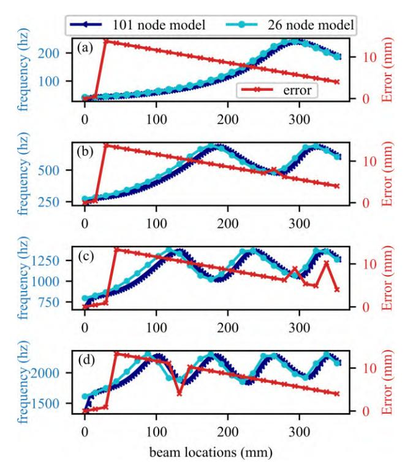

Figure 3.11 First four frequency responses for a 26 node model solved using the LEMP process along with the reference 101 node model and the error.

simultaneously  $(\omega_1, \omega_2, \omega_3)$ . In order to determine the location of the roller, the measured frequency  $(\omega_{true})$  of the real system, which was derived from the FFT of the accelerometer data, is compared with  $(\omega_1, \omega_2, \omega_3)$ . The PDF algorithm that was used to sample the sites is then modified considering comparisons between the estimated roller location and frequency. By contrasting the natural frequencies derived from the experiments and the FEA models and creating new FEA models based on the improved estimate of the position, it is possible to narrow down the determination of the roller position constantly.

#### Bayesian search space for roller location selection

The function of the Bayesian probabilistic approach is to select the most probable roller locations at which to apply LEMP. This selection improves initial estimations and reduces the number of comparison points selected and the required error calcu-

{67}------------------------------------------------

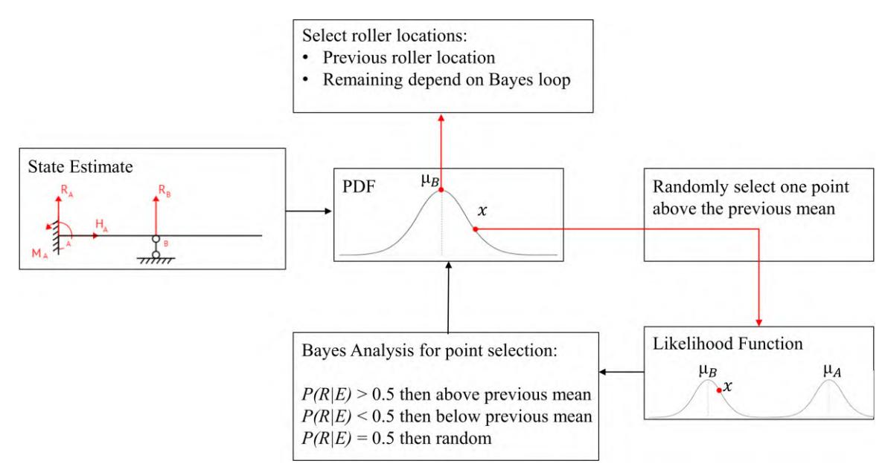

Figure 3.12 Analytical application of the likelihood function and Bayes algorithm.

lations. Fig. 3.12 illustrates the Bayesian procedure applied in this work.

Let  $R$  denote the hypothesis that the roller is moving from left to right along the beam. It is initially assumed that the roller is located at the center of the beam and is moving right with a probability  $P(R) = .6$  (therefore  $P(L) = .4$ ); all future calculations assess the probability that the roller will continue to move right. Weighting initial directional probabilities is equivalent to making predictions about how a system will degrade based on previous knowledge. For example, when modeling structures, the equivalent stiffness will decrease over time as the structure degrades; therefore, the initial weighted prediction and future estimations would assess a decrease in stiffness.

Three roller locations are sampled as comparison points given a PDF of normal distribution centered on the previous roller position. The first location is taken to be the previous mean ( $\mu_B$ ), assuming that there is no damage occurring between the two estimations. A random location ( $x$ ) is chosen above the mean value. The likelihood functions for the selected point ( $x$ ) are calculated according to the two previous distributions, Eq. 3.38 and Eq. 3.39 respectively. Here  $B$  represents the previous distribution, and  $A$  represents the distribution prior to that. As the roller

{68}------------------------------------------------

is assumed to always move to the right, the distribution prior to the previous is always to the left of the previous distribution; except when the posterior distribution  $P(R | E) > 0.5$ .

$$P(E \mid R) = \frac{1}{\sqrt{2\pi}\sigma^2} \exp \frac{-1}{2} \frac{(x - \mu_B)^2}{\sigma^2} \quad (3.38)$$

$$P(E \mid L) = \frac{1}{\sqrt{2\pi}\sigma^2} \exp \frac{-1}{2} \frac{(x - \mu_A)^2}{2\sigma^2} \quad (3.39)$$

Here,  $\sigma$  is the standard deviation of the position distribution,  $\mu_B$  is the last estimated roller location,  $\mu_A$  is the estimated roller location from two iterations ago. If  $\mu_B > \mu_A$ , the roller was last moving right. If  $\mu_A > \mu_B$ , then the roller was last moving left. The likelihood function is then used in the Bayes' theorem as follows:

$$P(R | E) = \frac{P(R)P(E | R)}{P(R)P(E | R) + P(L)P(E | L)} \quad (3.40)$$

The output of Eq. 3.40 is the posterior or updated distribution for the roller location after information regarding the previous location selections and likelihoods are taken into consideration [66]. If  $P(R | E) > 0.5$ , then it is assumed that the roller is currently moving to the right; therefore, the remaining two sample locations are selected from above the previous mean value. If  $P(R | E) < 0.5$ , then it is assumed that the roller is currently moving to the left; therefore, the remaining two sample locations are selected from below the previous mean value. If  $P(R | E) = 0.5$ , then the remaining two sample locations are selected at random.

In summary, the Bayes procedure refines roller positions to select probable locations based on past estimates and uncertainty. The selected points are then used as input for LEMP, which calculates the analytical frequency at each point. The analytical frequencies are then compared to the true experimental frequency to make state estimations, and the analytical loop repeats itself.

{69}------------------------------------------------

#### 3.2.4 Real-time model updating and model assessment

Real-time model updating can be completed in two steps: 1) calculating the analytical frequency at selected roller positions and 2) choosing the best estimation to represent the current system state using comparison methods. Analytical solutions for system states in this work are calculated using three methods: GE, LEMP, and LEMP with a Bayesian search space. The analytical solutions are used to estimate system states by two methods: error minimization and bounded regression, each using three comparison points. The error minimization method compares the true (measured) frequency with the frequency at the three testing points and selects the location that minimizes absolute error. The bounded regression approach was adopted from Hong et al. [67], where the linear model by least-squares method is given in its general form by Eq. 3.41 [? ].

$$\begin{bmatrix} a \\ b \end{bmatrix} = (X^T X)^{-1} X^T Y \quad (3.41)$$

When three locations selected for comparison of frequency based on roller location, X and Y are defined as below:

$$X = \begin{bmatrix} x_1 & 1 \\ x_2 & 1 \\ x_3 & 1 \end{bmatrix} \quad (3.42)$$

$$Y = \begin{bmatrix} \omega_1 - \omega_{true} \\ \omega_2 - \omega_{true} \\ \omega_3 - \omega_{true} \end{bmatrix} \quad (3.43)$$

Where  $a$  and  $b$  are regression parameters such that  $\omega - \omega_{true} = ax + b$ . Therefore,  $\omega = \omega_{true}$  when  $x = -b/a$ . However, because errors in the regression model propagate

{70}------------------------------------------------

where sample data is limited, the estimated roller location is bound between the minimum and maximum comparison locations as shown:

$$x_c = \begin{cases} x_{\min} & -b/a < x_{\min} \\ x_{\max} & -b/a > x_{\max} \\ -b/a & \text{elsewhere} \end{cases} \quad (3.44)$$

The estimated roller displacements are compared to the measured values by mean absolute error (MAE), signal-to-noise ratio (SNR) and Time Response Assurance Criterion (TRAC) to assess the viability of each method. While MAE quantifies the numerical error between the measured and estimated states, the TRAC value quantifies the similarity between time traces [68, 69, 70] by comparing the numerical error and time delay of each estimation. The equations for MAE, SNR, and TRAC are shown in Eqs. 3.45 and 3.47 respectively.

$$\text{MAE} = \frac{\sum_{i=1}^z |x_{\text{true}_i} - x_{\text{est}_i}|}{z} \quad (3.45)$$

$$\text{SNR}_{\text{dB}} = 10 \log_{10}\left(\frac{P_{\text{signal}}}{P_{\text{noise}}}\right) \quad (3.46)$$

$$\text{TRAC} = \frac{[\{t_m\}^T \{t_e\}]^2}{[\{t_m\}^T \{t_m\}][\{t_e\}^T \{t_e\}]} \quad (3.47)$$

Where  $z$  is the in Eq 3.45 is the number of samples used for the state estimation, and  $t_m$  and  $t_e$  are time traces of the measured and estimated data, respectively. A TRAC value of one indicates perfect time alignment, and a value of zero indicates that the signals have no temporal synchronization (i.e. signals not in phase). Therefore, the ideal model would yield a low MAE value and a TRAC value near one.

In this experimental investigation, the objective is to optimize two parameters; estimation error and iteration time. The number of nodes and the number of FEA 

{71}------------------------------------------------

models needed to obtain optimum objective parameters can be obtained using the single objective optimization problem formulated as shown in eq 3.48:

$$\text{minimize } \text{fit} = (1 - \alpha) \frac{e(\mathbf{P})}{e'} + \alpha \frac{t(\mathbf{P})}{t'} \quad (3.48)$$

$$\text{subject to } \mathbf{P} = [p_{\text{nodes}}, p_{\text{models}}] \in \mathbb{P}$$

Where  $\mathbf{P}$  is the combination of  $p_{\text{nodes}}$  and  $p_{\text{models}}$  which are the number of nodes and the number of models used, respectively, and  $\mathbb{P}$  is the parameter search space. In this formulation,  $e$  is the estimation error, and  $e'$  is the maximum desired error, while  $t$  and  $t'$  are the iteration time and maximum desired time, respectively.  $\alpha$  is the scalarization factor and can be selected based on the characteristics of the dynamic environment it is applied to. For a problem with error an minimization focus,  $\alpha$  is selected as 0; for an iteration time focus,  $\alpha$  would be set to 1. In this manuscript, a value of  $\alpha = 0.5$  is selected, along with  $e' = 10$  mm and  $t' = 1$  ms. An example problem and code are provided in a public repository [71].

## 3.3 Results and Discussion

This section presents the results and provides a discussion on key considerations.

#### 3.3.1 Model Updating Results

Fig. 3.13 illustrates results for the estimated roller position of the DROPBEAR testbed using the error minimization technique for a 26 node beams with 3 FEA models solved in parallel. Fig. 3.13(a) presents the estimated roller position using the traditional GE formulation, while Fig. 3.13(b) shows the results obtained using LEMP. Lastly, Fig. 3.13(c) reports the estimated roller position obtained using LEMP with Bayesian search space. Initially, it is assumed that the roller is located at the midpoint of the beam and is moving to the right. This assumption accounts for the spike in error at the start of each estimation process. The fluctuation in estimations

{72}------------------------------------------------

Table 3.3 Assessment of the error minimization comparison method when solving for 3 FEA models 26 nodes.

| Solution | Type |                |       | Mean Absolute | Error (mm) TRAC | SNR dB |
|----------|------|----------------|-------|---------------|-----------------|--------|
| GE       |      |                |       | 10.280        | .959            | 8.755  |
| LEMP     |      |                |       | 10.286        | .957            | 8.752  |
| LEMP     | with | Baysian search | space | 10.320        | .959            | 8.730  |

between Fig. 3.13(a) and (b) are similar; therefore, it cannot be concluded that LEMP alone provides smooth estimates. However, as seen in Fig. 3.13(c), implementing a Bayesian search space with LEMP solutions allows for less fluctuation and smoothens the estimates since comparison points are not selected at random but rather by using a probabilistic approach. This is most advantageous when the roller is stationary, as estimates remain constant for the most part.

The mean absolute error between the estimated and true position and the TRAC values obtained using error minimization are shown in table 3.3. The GE method has a mean absolute error of 10.280 mm with a TRAC value of 0.9596 compared to LEMP with an error of 10.286 mm with a TRAC value of 0.9577 and LEMP with a Bayesian search space has an error of 10.320 mm, and TRAC value of 0.9592. Figure 3.13 shows that the estimated data is improved. However, higher MAE and lower SNR is observed in both LEMP approaches compared to the GE approach because of the overshoot in estimated data when the roller is stationary. Accounting for the overshoot observed in LEMP with Bayesian estimated data will result in a better estimate than GE as the MAE is reduced to 5.65 mm. Therefore, it's concluded that LEMP with Bayesian somewhat improves the estimated value, with the Bayesian approach offering a slightly better estimate.

Fig. 3.14 illustrates the estimated roller pin location results obtained for the GE, LEMP, and LEMP with a Bayesian search space for a bounded regression approach used as the comparison method. Again, the fluctuation in estimations between Fig. 3.14(a)-(c) are similar, but there is slightly less fluctuation in the LEMP ap-

{73}------------------------------------------------

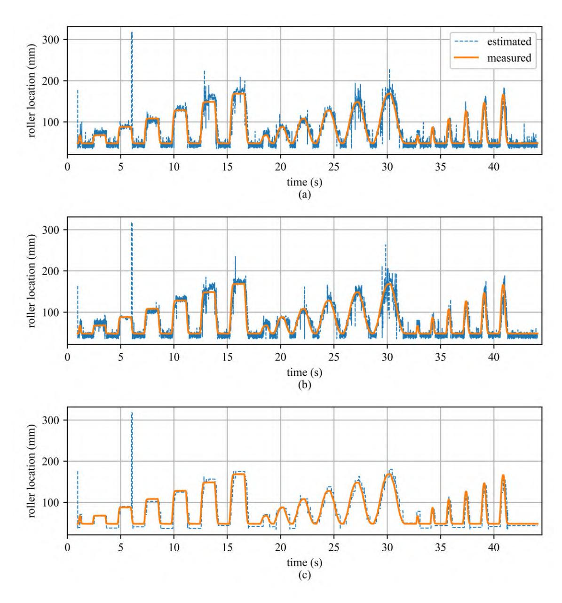

Figure 3.13 Roller estimations solved using error minimization by: (a) the traditional GE approach; (b) LEMP estimations, and; (c) LEMP estimations using a Bayesian search space.

{74}------------------------------------------------

Table 3.4 Assessment of the bounded regression comparison method when solving for 3 FEA models 26 nodes.

| Solution | Type |          |        |       | Mean Absolute | Error (mm) TRAC) | SNR dB |
|----------|------|----------|--------|-------|---------------|------------------|--------|
| GE       |      |          |        |       | 8.54          | .963             | 9.555  |
| LEMP     |      |          |        |       | 11.17         | .958             | 8.392  |
| LEMP     | with | Bayesian | search | space | 10.85         | .957             | 8.518  |

proach that utilizes a Bayesian search space. The MAE between the estimates using the bounded regression technique and true position, SNR, and the TRAC values for each method are shown in Table 3.4. The GE method has a mean absolute error of 8.54 mm and TRAC value of 0.9637 compared to LEMP with an error of 11.17 mm and TRAC value of 0.9580 and LEMP with a Bayesian search space with an error of 10.85 mm and TRAC value of 0.9575. As mentioned earlier, the LEMP algorithm will offer better estimation after accounting for the overshoot when the roller is stationary.

Note that the error for LEMP with a Bayesian search space is greater when linear regression is applied than when the error minimization technique is applied. This is due to the conflicting approaches of Bayes and linear regression when the roller is stationary. When minimizing error, the previous location is selected as a roller location and chosen as a state estimation when the roller is stationary. However, for linear regression, the approach creates a line of best fit which might not contain the previous location.

While the error minimization approach yields lower MAE values, there are significant fluctuations in the estimates, which are reduced by applying a Bayesian search space as shown in Fig. 3.13. The bounded regression method allows estimations of roller locations not located on pre-selected nodes, yielding smoother estimation curves. The one exception is the LEMP estimates using a Bayesian search space for linear regression because of their conflicting nature. In summary, a LEMP approach using a Bayesian search space would perform best using an error minimization technique, while LEMP alone would perform best using a linear regression technique.

{75}------------------------------------------------

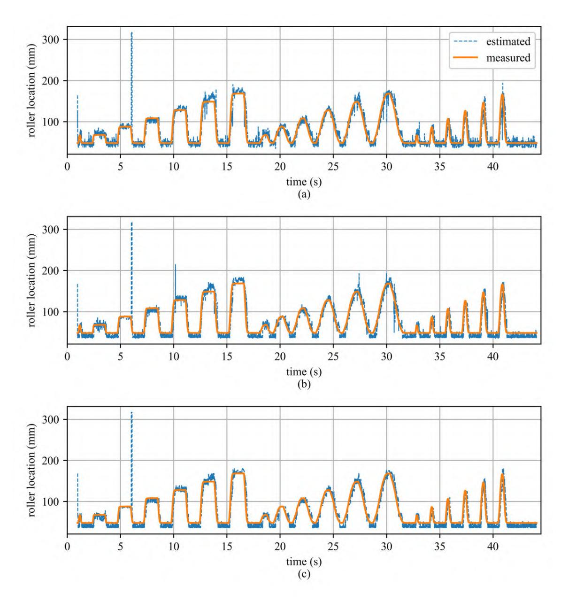

Figure 3.14 Roller estimations solved using bounded regression by: (a) the traditional GE approach; (b) LEMP estimations, and; (c) LEMP estimations using a Bayesian search space.

{76}------------------------------------------------

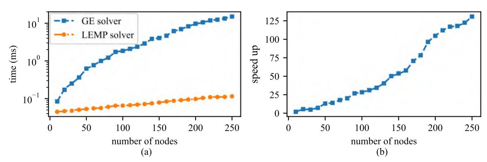

Figure 3.15 Solver time for the GE and LEMP showing: (a) the time taken by both solver to solve for new state frequency, and; (b) the ratio between the GE and LEMP solver representing the speed up of the GE.

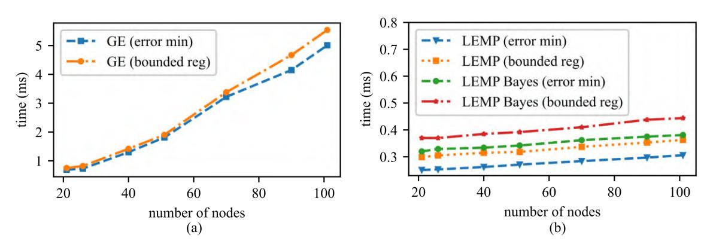

Figure 3.16 Iteration(state update) time comparison between the error minimization technique and bounded regression when using: (a) the traditional GE, and; (b) LEMP and LEMP with Bayesian.

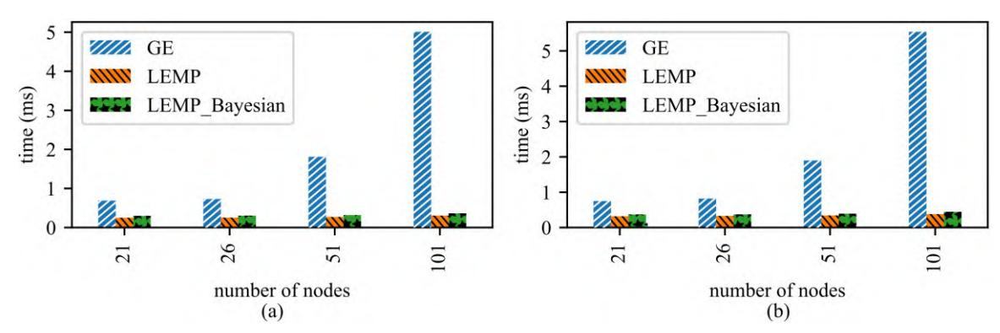

Figure 3.17 Iteration (state update) time using different comparison methods showing: (a) error minimization, and; (b) bounded regression.

{77}------------------------------------------------

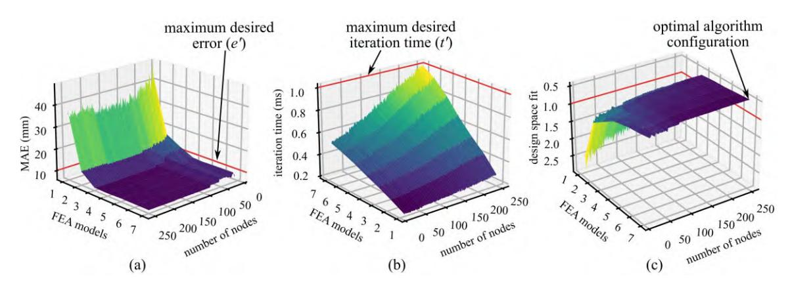

Figure 3.18 Figure showing the effect number of nodes and number of sampled roller locations has on (a) the mean absolute error, and; (b the iteration time using the LEMP algorithm with bounded regression comparison methods.

Table 3.5 Time, MEA, and SNR for LEMP and LEMP with Bayesian using error minimization and bounded regression for three FEA models.

|        |       | error | minimization |       | LEMP  | bounded | regression |       |       | error | minimization | LEMP  | Bayesian | bounded | regression |       |
|--------|-------|-------|--------------|-------|-------|---------|------------|-------|-------|-------|--------------|-------|----------|---------|------------|-------|
|        | 21    | 26    | 51           | 101   | 21    | 26      | 51         | 101   | 21    | 26    | 51           | 101   | 21       | 26      | 51         | 101   |
| time   | 0.251 | 0.253 | 0.271        | 0.306 | 0.320 | 0.329   | 0.342      | 0.381 | 0.299 | 0.305 | 0.318        | 0.363 | 0.370    | 0.372   | 0.392      | 0.444 |
| MEA    | 12.77 | 10.28 | 10.01        | 9.71  | 11.72 | 11.17   | 10.31      | 10.20 | 13.52 | 10.32 | 9.97         | 9.62  | 12.48    | 10.85   | 10.21      | 9.66  |
| SNR dB | 7.811 | 8.75  | 9.01         | 9.52  | 8.18  | 8.39    | 9.23       | 9.62  | 7.56  | 8.73  | 9.12         | 9.77  | 7.90     | 8.52    | 9.45       | 10.12 |
| TRAC   | 0.954 | 0.957 | 0.961        | 0.972 | 0.956 | 0.958   | 0.960      | 0.978 | 0.957 | 0.959 | 0.971        | 0.984 | 0.956    | 0.957   | 0.962      | 0.971 |

#### 3.3.2 State estimation update time

The LEMP approach offers a lower computational time when compared to solving the GE problem as the structure is simplified through its modal space representation. The state update time for GE, LEMP, and LEMP with the Bayesian search space for several numbers of nodes are investigated in this work; using a computer with a Intel® , Core© i7-10700K processor with a base clock of 3.80 GHz and 64 GB of RAM.

There is a significant difference in timing between the GE solver and the LEMP solver; this is expected as the LEMP algorithm has the new state roots (eigenvalues) bounded to the previous state frequencies, therefore avoiding having to find eigensolutions; which reduces the computational cost and therefore makes it faster. Figure 3.15 presents the solver time details for GE and LEMP up to 250 nodes. Figure 3.15(a) shows the time it takes both solvers to solve for a new state frequency for a model with 10 to 250 nodes. The solver here is exclusive to other state update procedures 

{78}------------------------------------------------

like comparison methods and the addition of Bayesian search space. As presented in figure 3.15(a), the generalized eigenvalue solver takes more time than the LEMP solver. In figure 3.15(b), the data shows the speed up offered by the LEMP solver compared to GE. Between 10 to 250 nodes, the GE solver's time is seen to increase exponentially with a speedup of about 125 times at the 250 node model, which roughly relates to the largest model that can be updated within the 1 ms timing constraint using LEMP. As the number of nodes increases beyond 250, the speedup offered by LEMP will continue to increase.

For the focus nodes of 21, 26, 51, and 101, the GE had a timing of 0.19, 0.24, 0.64, and 1.86 ms, respectively. This result shows that the GE approach would not meet the stringent real-time constraints set by the high-rate dynamic system challenge as the number of nodes increases. On the other hand, the LEMP solver had a timing of 0.045, 0.046, 0.050, and 0.061 ms for 21, 26, 51, and 101 nodes, respectively. This significant time difference is also due to the prioritization of the contributing nodes.

There was no significant difference in timing between the two comparison methods (error minimization and bounded regression) as shown in figure 3.16(a) and (b). For the GE and LEMP solver, the error minimization technique can perform slightly faster than bounded regression. This is expected as the regression process takes more time than mere error calculations. However, both comparison methods offer advantages when considering the approach to use. Moreover, figure 3.16(b) reports the timing results for LEMP with Bayes estimator. As expected, the addition of the Bayes calculation adds computation cost and, therefore, time to its calculations.

The solver's time alone does not determine how long it will take to update the system's current state. The number of FEA models solved in parallel at each time step, and the comparison method influences the time taken to update the system's state. Figure 3.17 shows the time data for three FEA models for both the error minimization technique in figure 3.17(a) and bounded regression in figure 3.17(b). 

{79}------------------------------------------------

The timing for both approaches is similar; however, the time performance of LEMP against GE is not. The figures show that the time constraint of 1 ms is only met at 21 and 26 nodes when using the GE, whereas, for both LEMP and LEMP with Bayesian, the state update time of 1 ms can be achieved for models with more than 101 nodes.

Figure 3.18 reports the performance space for the model updating scheme. Figure 3.18(a) shows how the mean absolute error of state estimation is affected by the number of nodes used to build the FEA model of the beam and the number of FEA models solved in parallel. The data shows that the number of FEA models selected will cause the estimation to exceed the allowable error if it is one or two. There is no noticeable reduction in error if the number of FEA models selected is beyond three for nodes between 51 and 101. However, the error when using fewer nodes can be reduced by selecting a higher number of FEA models during the state update process. Figure 3.18(b) displays data on how the number of nodes and the number of FEA models solved in parallel affect the iteration time. As the number of nodes increases, the iteration time increases, and the same is seen for the number of FEA models used. Since selecting three FEA models allows the state estimation to stay within the allowable error, it is reasonable to discard the usage of the higher FEA models to reduce computation time. Parameter optimization is carried out as earlier described and shown in figure 3.18(c); an optimal algorithm configuration is seen to be at around 250 nodes with seven FEA models. This optimal algorithm configuration may change on different hardware.

Detailed data on time, mean absolute error, signal-to-noise ratio, and TRAC values on the state estimation results for the LEMP and LEMP with Bayesian with three FEA models solved in parallel for 21, 26, 51, and 101 nodes is presented in table 3.5. The data shows that error is decreased as the number of nodes increases, whereas time increases as the number of nodes increases.

{80}------------------------------------------------

#### 3.4 Summary and Conclusion

In this work, a real-time model updating technique that leverages the local eigenvalue modification procedure (LEMP) to reduce the original eigenvalue solution to a set of second-order equations is formulated. Experimental validation was undertaken using data from the DROPBEAR testbed, and the proposed algorithm was implemented offline. For the relatively simplistic structure considered here, modeling errors in the initial formulation of the system were not found to be a challenge.

Roller estimations were calculated by GE solutions, LEMP solutions, and LEMP solutions utilizing a Bayesian search space using both error minimization and linear regression as comparison methods. The error minimization technique generally resulted in sharp transient errors during roller movement and fluctuation when the roller remained stationary. Both of which were improved with the application of a Bayesian search space. Applying the bounded regression technique generally reduced estimation fluctuation during roller movement but not during stationary periods.

The GE and LEMP solutions offered similar accuracy; the LEMP solutions with a Bayesian search space yielded smoother results with less fluctuation during roller movements and stationary periods, which is advantageous when tracking an unchanging system as false reports of damage would be minimal. However, the results also showed that GE would scale poorly with the higher node when time is a critical factor being considered. Therefore, the LEMP algorithm is used on the DROPBEAR data to update its state under 1 ms for up to 250 nodes.

From this work, it can be inferred that LEMP solutions reduce the number and complexity of calculations required for state estimations. Furthermore, it is shown that LEMP performs best using a linear regression method, while LEMP approaches using a Bayesian search space perform best using an error minimization method. It is concluded from this work that the LEMP approach yields state estimations that are comparable to those found using a GE solution and provide a viable method for 

{81}------------------------------------------------

updating models in real-time. An example problem and code are provided in a public repository.

## Acknowledgments

This material is based upon work supported by the Air Force Office of Scientific Research (AFOSR) through award no. FA9550-21-1-0083. This work is also partly supported by the National Science Foundation grant numbers 1850012, 1937535, and 1956071 and by the United States Air Force. This material is partially based upon work supported by the University of South Carolina through grant number 80003212. Any opinions, findings, and conclusions or recommendations expressed in this material are those of the authors and do not necessarily reflect the views of the University of South Carolina, the National Science Foundation, or the United States Air Force (Distribution A. Approved for public release; distribution unlimited (96TW-2021- 0061)).

## Declaration of competing interest

The authors declare no conflict of interests

{82}------------------------------------------------

# Chapter 4 Microsecond Model Updating for 2D Structural Systems Using the Local Eigenvalue Modification Procedure1

## Abstract

Systems that experience high-rate dynamics, such as blast or impact, are susceptible to rapid alterations that could result in loss of life and financial investments. These systems are characterized by a high dynamic response with a high-rate ( $< 100$  ms) and high amplitude ( $> 100$  g<sub>n</sub>). A system exposed to high-rate dynamic environments is frequently prone to rapid plastic deformation, which can cause structural, electrical, and sensor damage. A feedback loop of fast-acting actuators empowered with rapid state estimates can be utilized to stop further harm. The state estimator must be quick and resilient to the significant uncertainties, non-stationarities, and strong disturbances associated with high-rate dynamic systems. A model for 2Dimensional systems is developed to demonstrate high-rate tracking or estimation of a structure where a change in stiffness at locations on the system represents damage. The Local Eigenvalue Modification Procedure (LEMP) algorithm is applied to solve the system's equation quickly and efficiently within a set latency for state estimation. LEMP utilizes a single generalized eigenvalue solution for the initial system

<sup>1</sup>OGUNNIYI, E.A., VEREEN, A.B. and DOWNEY, A.R., 2023. Microsecond model updating for 2d structural systems using the local eigenvalue modification procedure. STRUCTURAL HEALTH MONITORING 2023. doi:<https://doi.org/10.12783/shm2023/36937>. Reprinted here copyright for manuscript provided by publisher

{83}------------------------------------------------

and simplifies altered state equations by transforming them into modal space, isolating the DOFs that contribute to the changes between states, and defining equations in terms of the initial state, thereby reducing computational time. This preliminary work develops a 2D finite element model using classical plate theory. A 2D model simulation of the plate's initial state is carried out on Abaqus and compared to the analytical model formulated solved using the generalized eigenvalue approach to test the formulated model. The changes made to the plate are then solved using LEMP to avoid solving the time-consuming eigenvalue solution. In this work, the change in the system is demonstrated by change in stiffness at different locations on the plate. Results report the performance metrics for the considered case. The approach's applicability to deployment on edge computing systems for real-time model updating of structures operating in high-rate dynamic environments is discussed.

Keywords: real-time model updating, high-rate dynamics, model reduction, eigenvalue modification, modal analysis, adaptive structures .

## 4.1 Introduction

High-rate structural dynamics is a field of study concerned with the response of structures to dynamic loading at high high-amplitude accelerations ( $> 100 \text{ g}_n$ ) and occur at high-rates ( $< 100 \text{ ms}$ ) such as those experienced during impacts, explosions, or seismic events. The behavior of structures under these extreme conditions can be significantly different from their response under static or low-rate loading [1]. This makes it essential to understand the behavior of structures under high-rate loading to design safe and reliable structures that can withstand extreme events. These events are complex and unpredictable, as the loading conditions on the structure change abruptly and unexpectedly, altering the internal and external forces experienced by the system. As a result, tracking the state of the structure throughout the event poses a significant challenge due to the sudden and uncertain nature of the changes. High-

{84}------------------------------------------------

rate structural dynamics has numerous applications, including designing protective structures, such as blast-resistant buildings and nuclear power plants, and developing new materials for high-speed transportation systems. [3, 40].

Model updating is essential for ensuring the safety and integrity of structures, especially those subject to dynamic loads and uncertain environmental conditions. Model updating can be either data-driven or model-based. For example, Samte et al. in [6] deployed LSTM models in real-time, a data-driven approach for high-rate state estimation. Downey et al. also applied a model-based approach to update the state of high-rate dynamic events generated on the DROPBEAR experimental testbed [7]. Model-driven real-time control of structures operating in high-rate dynamic environments requires models updated on the microsecond timescale. Model updating is a critical process in model-driven structural control as the model determines the control decisions to be executed by the active structures. Without model updating, the control system may not function as expected, leading to reduced effectiveness in mitigating vibrations or preventing damage to the structure.

The local eigenvalue modification procedure method simplifies a system state calculations by truncating the number of independent systems with a single degree of freedom to include only the most significant modes [10, 54]. Doing so transforms the generalized eigenvalue equation into a set of second-order equations that can be solved based on the system's initial frequencies. This reduces the number and complexity of equations required to determine the structure's state, leading to faster computation times. The LEMP approach is advantageous because it does not require solving the generalized eigenvalue problem, making it a more efficient method for calculating the dynamic response of a structure.

The authors previously used LEMP to solve the system's equation for a 1D system undergoing a single change [14, 15]. In this work, the authors investigate the performance of LEMP on 2D systems formulated using the Mindlin plate theory. The 

{85}------------------------------------------------

LEMP algorithm is used alongside the generalized eigenvalue procedure to calculate the change in frequency when a single change is applied to the system. The contributions of this work are 1) formulation of a model for a 2D system, 2) applying LEMP to solve for a single change in the system, and 3) evaluation of the performance of LEMP against GE using the error and time as criteria.

## 4.2 Methodology

The 2D model is created by employing the Mindlin plate theory to develop shell elements for rectangular plates. This involves superposing a 2D solid element onto a 2D plate element. The solid element addresses in-plane effects like membrane behavior, and the plate element manages off-plane effects like bending. Figure 4.1 shows the shell element formation and its coordinate system, where Figure 4.1(a) shows how an element is broken into nodes, Figure 4.1(b) and (c) shows the coordinate system of a 2D solid element with 2 DOFs. Figure 4.1(d) depicts a plate structure, and Figure 4.1(e) is the shell coordinate system that combines the 2D solid element and plate structure.

The 2D plate model development process can be summarized into Three steps:

- 1. Construction of shape functions matrix **N** that satisfies Eqs. 4.1
- 2. Formulation of the strain matrix for 2D element **<sup>B</sup>**, Eq. 4.3 and 2D plate, **<sup>B</sup>**<sup>I</sup> and **B<sup>O</sup>** shown in Eqs. 4.4 and 4.5.
- 3. Calculation of **k**e and **m**e using shape functions **N** and strain matrix in step 2 to obtain Eqs. 5 and 6.

**Step 1**: Construction of shape functions for the 2D elements and plate is obtained in Eq. 4.1 where **N**e is shape function for 2D element and **N**p is for 2D plate. This study uses the Mindlin plate theory to develop rectangular elements for the 2D plate.

{86}------------------------------------------------

When analyzing the plate structure, it is assumed that the element has a uniform thickness, denoted as  $h$ .

$$\mathbf{N}_e = \begin{bmatrix} N_1 & 0 & N_2 & 0 & N_3 & 0 & N_4 & 0 \\ 0 & N_1 & 0 & N_2 & 0 & N_3 & 0 & N_4 \end{bmatrix} \quad (4.1)$$

$$\mathbf{N}_p = \begin{bmatrix} N_1 & 0 & 0 & N_2 & 0 & 0 & N_3 & 0 & N_4 & 0 & 0 \\ 0 & N_1 & 0 & 0 & N_2 & 0 & 0 & N_3 & 0 & N_4 & 0 \\ 0 & 0 & N_1 & 0 & 0 & N_2 & 0 & 0 & N_3 & 0 & N_4 \end{bmatrix} \quad (4.2)$$

**Step 2**: Formulation of the strain matrix **B**. The 2D solid element has one strain matrix Eq. 4.3, while the 2D solid plate has two strain, **B**I and **B**O as shown in Eqs. 4.4 and 4.5.

The strain matrix **B**I represents the strain energy associated with the in-plane stress and strain while **B**O relates to the strain energy associated with the off-plane shear

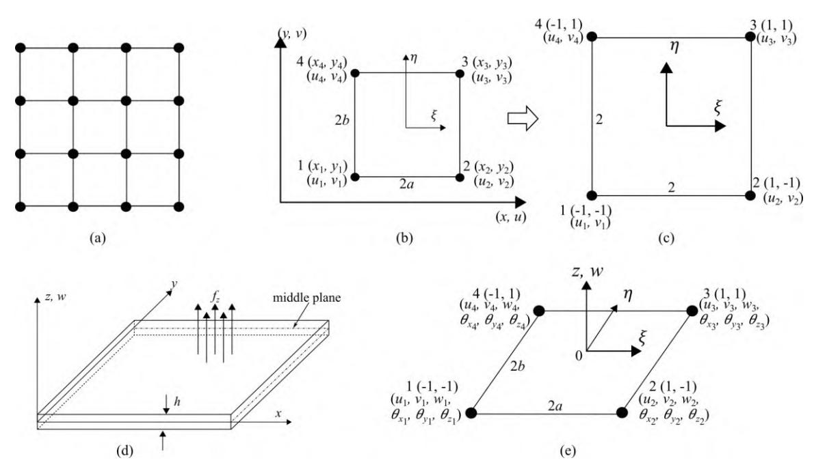

Figure 4.1 Shell element formation and its coordinate system where; (a) represents the nodal construction on the element; (b) shows the coordinate system of a 2D solid element with 2 DOFs; (c) shows the transformation of the coordinate system with dimension; (d) depicts a plate structure, and; (e) is the shell coordinate system that combines the 2D solid element and plate structure.

{87}------------------------------------------------

stress and strain.

$$\mathbf{B} = \mathbf{LN} = \frac{1}{4} \begin{bmatrix} -\frac{1-\eta}{a} & 0 & \frac{1-\eta}{a} & 0 & \frac{1+\eta}{a} & 0 & -\frac{1+\eta}{a} & 0 \\ 0 & -\frac{1-\xi}{b} & 0 & -\frac{1+\xi}{b} & 0 & \frac{1+\xi}{b} & 0 & -\frac{1-\xi}{b} \\ -\frac{1-\xi}{a} & -\frac{1-\eta}{a} & -\frac{1+\xi}{b} & \frac{1-\eta}{a} & \frac{1+\xi}{b} & \frac{1+\eta}{a} & -\frac{1-\xi}{b} & -\frac{1+\eta}{a} \end{bmatrix} \quad (4.3)$$

$$\mathbf{B}^I = \begin{bmatrix} \mathbf{B}_1^I & \mathbf{B}_2^I & \mathbf{B}_3^I & \mathbf{B}_4^I \end{bmatrix}, \quad \mathbf{B}_j^I = \begin{bmatrix} 0 & 0 & -\partial N_j/\partial x \\ 0 & \partial N_j/\partial x & 0 \\ 0 & \partial N_j/\partial y & -\partial N_j \partial y \end{bmatrix} \quad (4.4)$$

$$\mathbf{B}^O = \begin{bmatrix} \mathbf{B}_1^O & \mathbf{B}_2^O & \mathbf{B}_3^O & \mathbf{B}_4^O \end{bmatrix}, \quad \mathbf{B}_j^O = \begin{bmatrix} \partial N_j / \partial x & 0 & N_j \\ \partial N_j / \partial y & -N_j & 0 \end{bmatrix} \quad (4.5)$$

This work uses a plate represented by a two-dimensional domain in the  $x - y - z$  plane, as shown in Figure4.1(d). As depicted in Figure4.1(a), the plate has been divided into rectangular sections appropriately. Each of these sections comprises four nodes and four straight edges. At a node, the degrees of freedom (DOFs) include the deflection  $u, v$ , and  $w$ , as well as the rotation about the  $x$ -axis ( $\theta_x$ ),  $y$ -axis ( $\theta_y$ ) and  $z$ -axis ( $\theta_z$ ), resulting in a total of six DOFs per node. Thus, for a rectangular section with four nodes, the total number of DOFs for that section would be 24.

**Step 3:** Calculation of  $\mathbf{k}_e$  and  $\mathbf{m}_e$  using shape functions  $N$  and strain matrix to obtain Eqs. 4.6 and 4.7.

The element matrices can be obtained using the shape function and nodal variables. Similar matrices can be obtained for 2D elements and plates; however, in 2D plates, 3 DOFs are used for defining the system, while 2 DOFs are used for the 2D element. The mass and stiffness matrices can be obtained using the energy functions, and Hamilton's principle described in Liu et al. [72]. Eq 4.6 is the mass matrix where  $I$  is a diagonal matrix.

{88}------------------------------------------------

Table 4.1 Material properties

| Type  | Poisson's ratio | Young's modulus | density                | thickness |
|-------|-----------------|-----------------|------------------------|-----------|
| steel | 0.3             | 200e9           | 7700 kg/m <sup>3</sup> | 0.006 m   |

$$\mathbf{I} = \begin{bmatrix} \rho h & 0 & 0 \\ 0 & \rho h^3/12 & 0 \\ 0 & 0 & \rho h^3/12 \end{bmatrix}, \quad \mathbf{m}_e = \int_A h \rho \mathbf{N}^T \mathbf{N} dA, \quad \mathbf{m}_p = \int_{A_p} \mathbf{N}^T \mathbf{I} \mathbf{N} dA \quad (4.6)$$

where  $\rho$  and  $h$  are the density and thickness of the plate respectively.

$$\mathbf{k}_e = \int_A h \mathbf{B}^T \mathbf{c} \mathbf{B} dA, \quad \mathbf{k}_p = \int_{A_p} \frac{h^3}{12} [\mathbf{B}^I]^T \mathbf{c} \mathbf{B}^I dA + \int_{A_p} \kappa h [\mathbf{B}^O]^T \mathbf{c}_s \mathbf{B}^O dA \quad (4.7)$$

The integration in the stiffness matrix **k**e, can be evaluated analytically, however, the Gauss integration scheme is used to evaluate the integration numerically.

To validate the 2D model formulated above, a frequency analysis of a 2D system was conducted using Abaqus. The analysis was carried out according to the following procedure:

First, a 2D plate model is created, which includes defining the plate's geometry, thickness, and material properties based on Table 4.1. For preliminary validation of the model, no boundary conditions were defined. Material properties such as density, Young's modulus, and Poisson's ratio were assigned to the plate material to enable accurate simulation of the plate's mechanical behavior. The plate was meshed using finite element analysis techniques built in Abaqus. In this analysis, only four elements were generated, corresponding to nine nodes and 54 DOFs on the plate. The frequency range of interest was set to a maximum of 2000 Hz. The frequency and mode shapes of the model were then generated, with the first elastic mode of the plate observed at mode 7, with a frequency of 232 Hz. The simulated results for each mode up to mode 12 were shown in Figure 4.2.

{89}------------------------------------------------

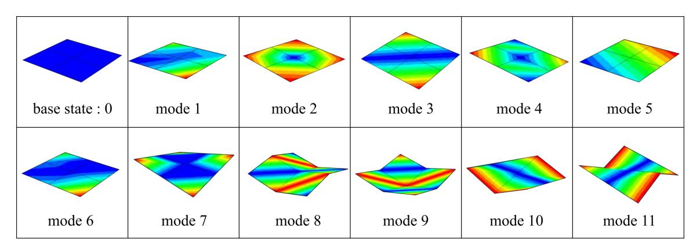

Figure 4.2 Mode shapes of a 2D plate shown in figure 1.

Table 4.2 Base state frequency extraction

| mode               | 7       | 8       | 9       | 10      | 11      | 12     |
|--------------------|---------|---------|---------|---------|---------|--------|
| Abaqus Generalized | 232.12  | 378.77  | 515.89  | 598.64  | 594.64  | 944.72 |
| Eigenvalue         | 232.027 | 379.044 | 515.983 | 598.768 | 598.768 | 945.03 |
| error (abs)        | 0.093   | 0.274   | 0.0093  | 0.128   | 4.128   | 0.31   |

The formulated 2D model's initial state (base state) frequencies were calculated using the generalized eigenvalue approach. The frequencies from the simulated model (Abaqus) and the GE at modes 7 to 11 were then compared and tabulated in Table 4.2. The system frequencies were calculated with the generalized eigenvalue approach closely aligned with those from the Abaqus model. The low error between both frequencies obtained indicates that the 2D model developed is correct.

## **RESULTS**

A local change is applied to a 9-node plate as a form of increased stiffness at the nodes. Before a stiffness change is applied at each node, the four corners of the plate are fixed by increasing the stiffness by 5e100 N/m of both the deflection and rotation on the z-axis. This nodal change is then applied at at each node, from node 1 to 9. The first eight modal frequencies are obtained using generalized eigenvalue and LEMP approaches. The performance of the LEMP algorithm compared to the

{90}------------------------------------------------

generalized eigenvalue procedure on the 2D system is recorded. Figure 4.3 shows similarity in frequencies calculated using both approaches for nodes 1-9. A notable change in frequency is only observed in the second mode, where the error value is higher than at other modes; however, the difference is less than 10 Hz at most nodes.

The generalized eigenvalue and LEMP solver were also tested on 2D plates with increasing numbers of nodes numbers of nodes. As opposed to the 1-D system, where the matrix of the system grows gradually, the 2D system grows exponentially quicker as the system has 6 DOFs per node in the 2D system compared to just 2 DOFs in the 1-D system. To expand, the system matrix is  $54 \times 54$  as compared to  $18 \times 18$  for a 1-D system. Also, at 100 nodes, the 2D system has a matrix of size  $600 \times$ 

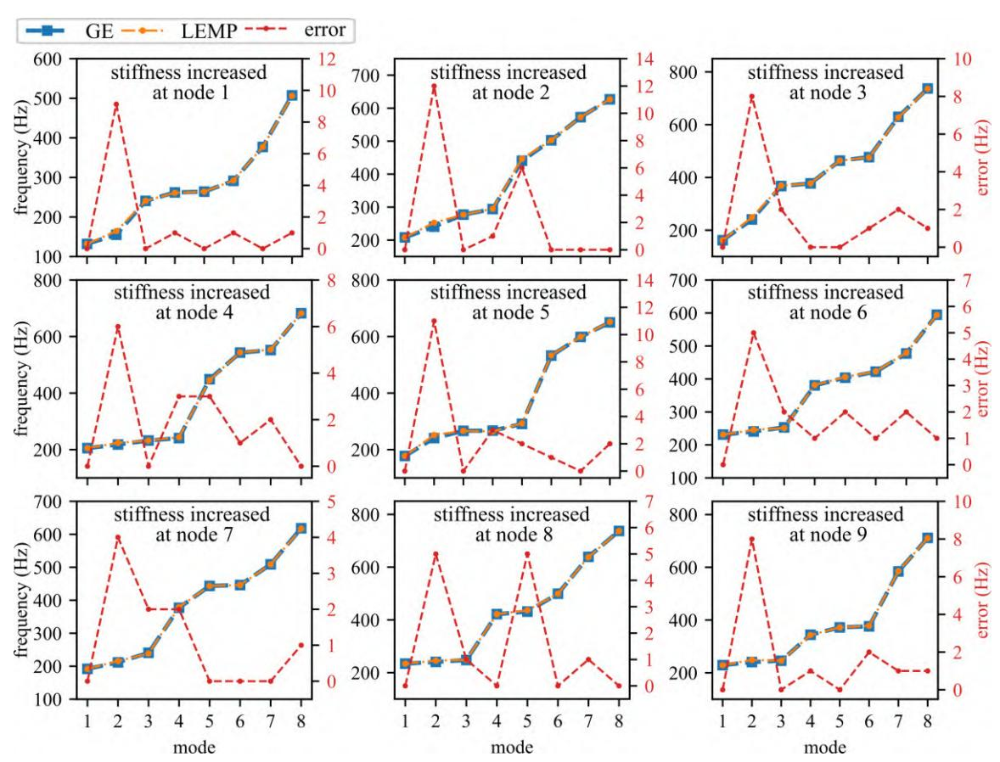

Figure 4.3 Frequency of the first eight modes of the 2D plate for a change of 1e100 N/m stiffness introduced to the system at one of the nine nodes in the system. The frequency response of the system is calculated using both GE and LEMP and the error between the two is reported.

{91}------------------------------------------------

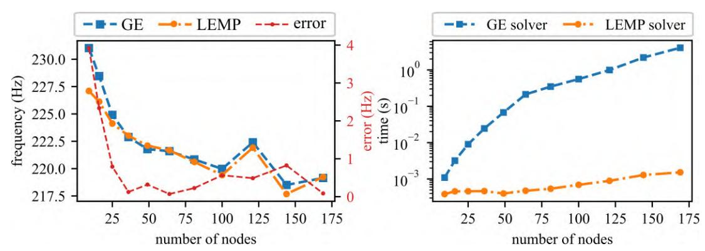

Figure 4.4 Frequency response calculated for: (a) the first elastic mode using GE and LEMP on a plate of 9 nodes up to 169 nodes as tabulated in table 4.3, and; (b) time taken to solve the system equation at each number of nodes tested shown in Table 4.3.

600, whereas the 1-D system has a size  $200 \times 200$ . Table 4.3 reports how the matrix size grows as the number of nodes increases. This matrix size growth also shows the need for a faster algorithm for solving the system equation. The first elastic mode frequency calculated using GE and LEMP for nine nodes up to 169 nodes is shown in Figure 4.4(a). A closer frequency value between the two approaches is achieved as the number of nodes increases. The system equation solving time is expanded upon in Figure 4.1(b). Up to 100 nodes, the LEMP algorithm can still achieve  $691 \mu\text{s}$  while GE is already at 0.56 s. At 169 nodes, the LEMP algorithm stands at 1.5 ms and the GE at 4 s which defiles the microsecond constraint investigated.

Table 4.3 Single state change calculated using the LEMP and generalized eigenvalue process

| no. of nodes | single change no. of element | calculated DOF | using: | matrix | size | freq    | generalized eigenvalue (Hz) time GE | (s) freq | LEMP (Hz) time LEMP | (s) error (Hz) |
|--------------|------------------------------|----------------|--------|--------|------|---------|-------------------------------------|----------|---------------------|----------------|
| 9            | 4                            | 54             | 54     | x      | 54   | 232.027 | 0.001093                            | 227.099  | 0.000384            | 4.928          |
| 16           | 9                            | 96             | 96     | x      | 96   | 228.458 | 0.00320                             | 226.120  | 0.000456            | 2.338          |
| 25           | 16                           | 150            | 150    | x      | 150  | 224.914 | 0.009031                            | 224.123  | 0.000458            | 0.791          |
| 36           | 25                           | 216            | 216    | x      | 216  | 222.886 | 0.024529                            | 223.01   | 0.000464            | -0.124         |
| 49           | 36                           | 294            | 294    | x      | 294  | 221.78  | 0.067579                            | 222.1    | 0.000399            | -0.32          |
| 64           | 49                           | 384            | 384    | x      | 384  | 221.599 | 0.212773                            | 221.67   | 0.000475            | -0.071         |
| 81           | 64                           | 486            | 486    | x      | 486  | 220.837 | 0.348656                            | 220.610  | 0.000539            | 0.227          |
| 100          | 81                           | 600            | 600    | x      | 600  | 219.975 | 0.559744                            | 219.41   | 0.000691            | 0.565          |
| 121          | 100                          | 726            | 726    | x      | 726  | 222.409 | 0.994675                            | 221.919  | 0.000890            | 0.488          |
| 144          | 121                          | 864            | 864    | x      | 864  | 218.505 | 2.197694                            | 217.68   | 0.001285            | 0.825          |
| 169          | 144                          | 1014           | 1014   | x      | 1014 | 219.147 | 4.075451                            | 219.234  | 0.001523            | -0.087         |

{92}------------------------------------------------

## 4.3 Conclusion

This work demonstrated the potential of using the local eigenvalue modification procedure (LEMP) to estimate the state of a 2D system formulated using the Mindlin plate theory. The model developed accuracy was compared to 2D shell simulation on Abaqus, where the base state frequencies obtained were compared to ones from the generalized eigenvalue approach. A nine-node 2D element is then used to investigate the performance and timing of the LEMP process for a single-state change in the system. A singular change is applied to the system in the form of a change in stiffness at each node from one to nine, and the corresponding change in frequencies due to the change is calculated using GE and LEMP. The obtained frequencies from both approaches were close; however, the timing performance is different. As the system matrix grows, the GE fails the time constraint, while the LEMP still achieves a single state change update of 1.5 ms at 169 nodes.

## Acknowledgement

This material is based upon work supported by the Air Force Office of Scientific Research (AFOSR) through award no. FA9550-21-1-0083. This work is also partly supported by the National Science Foundation grant numbers 1850012, 1937535, and 1956071. This material is partially based upon work supported by the University of South Carolina through grant number 80003212. Any opinions, findings, and conclusions or recommendations expressed in this material are those of the authors and do not necessarily reflect the views of the University of South Carolina, the National Science Foundation, or the United States Air Force.

{93}------------------------------------------------

# Chapter 5 Online Model-based Structural Damage Detection in Electronic Assemblies1

## Abstract

Electronic assemblies are subjected to damaging impact and shock loadings in various scenarios, including aerospace, automotive, and military applications. In safetycritical situations, the online detection, quantification, and localization of damage within the electronic assembly would enable intelligent systems to take corrective actions to mitigate or circumvent the effects of damage within the electronic assemblies. This preliminary work investigates a reduced-order model-based method for online damage detection, quantification, and localization of printed circuit boards (PCBs). The local eigenvalue modification procedure (LEMP) is used to accelerate the computational processing time of the model, thereby enabling its use in online damage detection during an impact or shock event. The proposed method tracks changes in the model's state using an error minimization technique in the frequency domain. A baseline state is established by creating and simulating a numerical model that accurately represents a healthy PCB response. Potential reduced-order models with varying stiffness matrices are developed online and compared to the system's current state. These reduced-order models introduce a single change in stiffness to the

<sup>1</sup>Ogunniyi, E., Satme, J.N. and Downey Jr, A.R., 2024, May. Online model-based structural damage detection in electronic assemblies. In Active and Passive Smart Structures and Integrated Systems XVIII (Vol. 12946, pp. 283-287). SPIE. doi:https://doi.org/10.1117/12.3010987. Reprinted here copyright for manuscript provided by publisher

{94}------------------------------------------------

system. LEMP calculates the overall change in the system to obtain the new systemlevel dynamic response. Incorporating LEMP within the frequency-based analysis demonstrates the potential for effective damage detection on PCBs. This work validates the proposed methodology using a rectangular PCB with induced damage. The PCB is modeled pinned at each corner, and its dynamic response is simulated using ABAQUS and processed with the generalized eigenvalue procedure. LEMP is used to update a single change in the system while obtaining a 587 times speed up when compared to the generalized eigenvalue approach. The LEMP algorithm performance and reliability for updating the model state are discussed in the paper.

Keywords: real-time model updating, high-rate dynamics, eigenvalue modification, state estimation.

## 5.1 Introduction

In electronic assemblies utilized across critical sectors such as aerospace, automotive, and military, the integrity of printed circuit boards (PCBs) is paramount. Electronic assemblies, intricate in design and vital in function, are frequently exposed to harsh conditions that may precipitate impact and shock loadings [2]. The consequences of such stressors can be catastrophic, particularly in safety-critical applications where the failure of an electronic component could result in severe outcomes. The ability to detect, quantify, and localize damage within an electronic assembly in real-time could dramatically enhance the resilience and reliability of these systems [4, 73]. By facilitating immediate corrective actions, such an online detection system would act as a guardian, mitigating the ramifications of any inflicted damage. This work delves into the preliminary stages of the reduced-order model-based method for online damage detection for PCBs. The research gap identified by this study revolves around the lack of methods that can perform real-time model updating with the requisite speed and accuracy in an online setting, particularly for PCBs subjected to shock 

{95}------------------------------------------------

and impulse loading [74].

Tracking a structure's state online and in real-time will be crucial for maintaining safety and stability in next-generation active structures [75, 76]; particularly when exposed to changing loads and unpredictable environmental factors. Real-time structural tracking can follow a data-driven methodology or rely on model-based strategies. An introductory investigation into real-time high-rate state estimation was demonstrated by Hong et al [77]. In the context of this work, high-rate is defined as a rapid ( $> 100$  ms) change in response behaviors of a system when subjected to events such as blasts or impacts depicted here by a change in mass and stiffness. Similarly, Downey et al [78] applied a model-based technique to update the status of rapid dynamic events observed in the DROPBEAR experimental setup model as a 1D system and achieved a model update every 4.04 ms with an accuracy of 2.9%.

The local eigenvalue modification procedure (LEMP) offers a computationally efficient method to perform Structural Dynamic Modification (SDM) [11]. By analyzing its dynamic behavior, SDM has traditionally been used as a tool for engineers and researchers to discern the impact of alterations in a system's physical properties—such as mass, stiffness, or damping. LEMP introduces a more efficient approach by narrowing the focus to the most relevant vibrational modes. One of the compelling advantages of LEMP is its ability to cut down computation times drastically. By circumventing the need to solve the generalized eigenvalue problem, LEMP enables a swift prediction of the structure's dynamic response to modifications [79]. Ogunniyi et al. have proposed the use of LEMP for real-time applications by developing a computing module designed for high-speed model updating on 1D [80] and 2D [16] system, achieving latency requirements—as tight as one millisecond for a Finite Element (FE) derived model with 121 nodes.

The study focuses on a PCB tailored to the recommended standard, without any electronic packages, and subjected to modal analysis through the FE method. In the

{96}------------------------------------------------

Finite Element Analysis (FEA), ABAQUS software is used to model the entire PCB, extracting natural frequencies and mode shapes from this model for the PCB's base line (without damage) model and a second model of the PCB with nodal decreased stiffness to represent damage. For the PCB model, a single alteration stiffness within the system is added, and the resulting change in the system is calculated using generalized eigenvalue (GE) and LEMP. The work showed that LEMP could calculate the overall change and deduce a new system-level dynamic response with a similar level of accuracy as the GE and with faster model updating time. The contributions of this work are 1) FEA of a standard PCB, 2) implementing LEMP to solve for a single change in the system, and 3) evaluation of the performance of LEMP against GE using the error and time as criteria.

## 5.2 Methodology

The PCB's FE model was developed using the ABAQUS CAE 2021 tool. The design of the PCB for this investigation is based on the standard PCB layout, consisting of a rectangular board with a length and width of 76 mm and 38 mm, respectively, with a thickness of 1.6 mm. For this study, No electronic modules were mounted on the PCB. The mesh PCB profile for the baseline state (healthy PCB) is depicted in Figure 5.1(a). For this study, the PCB was constrained for displacement and rotation on all four corners. The healthy PCB was meshed with 50 elements, corresponding to 66 nodes and a matrix size of  $396 \times 396$ .

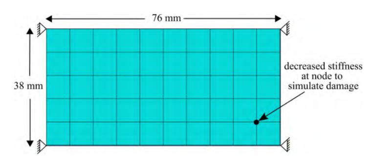

Figure 5.1 FE mesh profile, showing the baseline state (healthy PCB)

{97}------------------------------------------------

A critical premise for conducting modal analysis using the FE method is the consideration that it exhibits linear isotropic behavior. This assumption is fundamental as it allows for treating the system as linear, a necessary condition for the execution of modal analysis. Table 5.1 presents the material properties of the PCB used to define the model.

Table 5.1 Material properties used to model the PCB.

| Component | Poisson's ratio, $\nu$ | Young's modulus, $E$ (Pa) | density, $\rho$ (kg/m <sup>3</sup> ) | thickness (m) | length (m) | width (m) |
|-----------|------------------------|---------------------------|--------------------------------------|---------------|------------|-----------|
| PCB       | 0.35                   | 1.7 e10                   | 2200                                 | 0.00159       | 0.0762     | 0.0381    |

The maximum frequency of analysis was set to 10000 Hz, and the first vibrating frequency was found to be in mode 1 at 484.15 Hz. Mode 1 to 17 fall under the 10000 Hz maximum frequency set in the analysis. Figure 5.2(a)-(d) shows the vibrating mode 1-14 for the baseline state (without damage) of the PCB while the modal frequencies presented in Table 5.2 show vibrating frequencies of the first four modes in Figure 5.2(a)-(d).

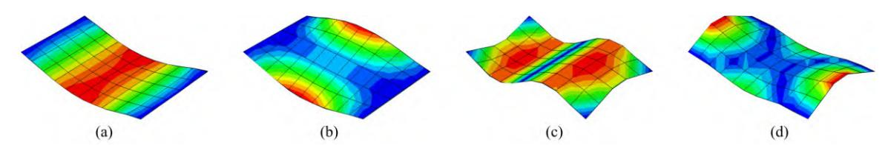

Figure 5.2 Vibration mode shapes from the finite element analysis of the PCB where (a) is first mode; (b) second mode; (c) third mode, and; (d) fourth mode.

Table 5.2 Frequency of vibration from FEA of the PCB.

| mode | frequency (Hz) |
|------|----------------|
| 1    | 484.15         |
| 2    | 1094.7         |
| 3    | 1542.1         |
| 4    | 2396.5         |

{98}------------------------------------------------

## 5.3 Results

From the finite element analysis carried out in section 5.2 using ABAQUS, the mass ( $M$ ) and stiffness ( $K$ ) matrices were extracted from the model results. The extracted  $M$  and  $K$  matrices were solved using the GE procedure detailed in Downey et al. [78] to obtain the eigenvalues and eigenvectors of the vibrating PCB. The corresponding frequencies for each mode are calculated from the eigenvalues and tabulated in Table 5.3, representing the frequencies of the initial PCB.

Table 5.3 Showing frequencies obtained using FEA and GE, and the corresponding single state change frequencies computed using GE and LEMP for the PCB.

| mode | FEA    | initial state GE | error (Hz) | PCB single change with GE | final state single change with LEMP | error(Hz) |
|------|--------|------------------|------------|---------------------------|-------------------------------------|-----------|
| 1    | 484.15 | 799.66           | 315.51     | 97.333                    | 192.70                              | 95.367    |
| 2    | 1094.7 | 958.00           | 136.70     | 291.45                    | 292.65                              | 1.2000    |
| 3    | 1542.1 | 2141.1           | 599.00     | 1121.4                    | 1625.3                              | 503.87    |
| 4    | 2396.5 | 2310.9           | 85.600     | 2613.4                    | 2675.8                              | 62.400    |
| 5    | 2607.3 | 3446.0           | 838.70     | 2741.6                    | 2756.6                              | 15.000    |
| 6    | 3120.4 | 3807.8           | 687.40     | 3957.3                    | 4059.4                              | 102.10    |
| 7    | 4150.4 | 4012.9           | 137.50     | 4556.6                    | 4351.3                              | 205.30    |
| 8    | 4841.7 | 4845.8           | 4.1000     | 6547.2                    | 6582.4                              | 35.20     |
| 9    | 5125.3 | 5551.1           | 425.80     | 8470.4                    | 8171.5                              | 298.90    |
| 10   | 6113.7 | 6277.2           | 163.50     | 9632.9                    | 9738.6                              | 105.70    |

Figure 5.3(a) graphically presents the vibration frequency for modes 1-10 obtained from the FEA and GE methods and the error between the two approaches. The finite element analysis and the generalized eigenvalue procedure produce increasing frequencies for higher modes, typical behavior for structural dynamic analyses. The frequencies obtained from both methods are quite close, as indicated by the proximity of the two lines representing them. However, there are discrepancies, as shown by the error line. The error could be due to the difference between the numerical methods and algorithms used to solve the finite element analysis and generalized eigenvalue

{99}------------------------------------------------

problems, which can also introduce errors, especially as the frequency increases and the calculations become more complex.

Figure 5.3(b) depicts the data from a single state change from the initial state presented in Table 5.3. The single change in the system is achieved by decreasing a single node stiffness by a large number (10e100) and computing the final state frequencies using GE and LEMP. The updated stiffness on the undamaged PCB by GE and LEMP are significantly similar, with low errors in each vibrating mode. Even though the two methods achieved similar results, the first vibration mode frequency was solved at 270 ms via GE and 0.46 ms through LEMP. The 587X speedup in timing suggests a preference for using LEMP modal updating for more nodes.

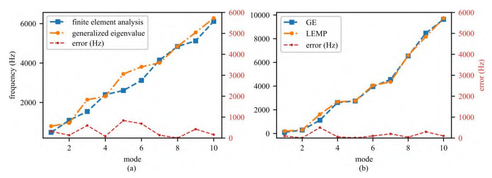

Figure 5.3 Vibration frequencies of the undamaged PCB for (a) the initial state computed using FEA and GE, and; (b) single state change computed using GE and LEMP.

## 5.4 Conclusion

The paper uses a reduced-order model-based method to detail a study on online damage detection, quantification, and localization in printed circuit boards (PCBs). The local eigenvalue modification procedure (LEMP) is applied to enable rapid computational processing that is suitable for real-time applications. This study demonstrated the use of LEMP for efficient and accurate model updating in PCBs subject to damage. This was accomplished through comparative analysis against the traditional 

{100}------------------------------------------------

generalized eigenvalue procedure (GE), showing LEMP's superior speed with comparable accuracy.

A finite element analysis of a standard PCB, both in a baseline healthy state and with simulated damage, was conducted. GE and LEMP were then utilized to detect changes in system dynamics and update the model accordingly. LEMP can achieve model updating with millisecond latency, meeting the tight latency requirements necessary for real-time applications. The time for LEMP to solve for a single change in the system was 0.46 ms, as opposed to 270 ms using GE. The findings suggest that the LEMP method can potentially be employed in a real-time control framework for safety-critical applications where PCBs experience shock and impact events, enhancing system resilience by allowing immediate corrective actions following damage detection.

The potential limitations include the complexity of implementing the method in various real-world scenarios or the challenges in integrating this approach with existing electronic systems for diverse applications. However, the method has potential applications in the aerospace, automotive, and military sectors, where PCBs are integral to system operations, and real-time damage assessment is crucial for maintaining functionality and safety. Future research will focus on scaling the LEMP approach for complex systems with multiple damage sites, enhancing the method's robustness against a variety of real-world variables.

This material is based upon work supported by the Air Force Office of Scientific Research (AFOSR) through award no. FA9550-21-1-0083. This work is also partly supported by the National Science Foundation (NSF) grant numbers 1937535, 1956071, and 2237696. Any opinions, findings, conclusions, or recommendations expressed in this material are those of the authors and do not necessarily reflect the views of the National Science Foundation or the United States Air Force.

{101}------------------------------------------------

# Chapter 6 Reduced Order Model-based Framework for Microsecond Model Updating of Two-Dimensional Structural Systems Using the Local Eigenvalue Modification Procedure

## Abstract

Structural Health Monitoring (SHM) plays a vital role in ensuring the integrity and safety of critical engineering systems, particularly in high-rate dynamic environments such as those found in aerospace, defense, and electronics. In these scenarios, structures like printed circuit boards (PCBs) are frequently subjected to shock, impact, and vibrational loads that can induce rapid changes in structural characteristics. Traditional SHM techniques rely heavily on the Generalized Eigenvalue Procedure (GEP) to determine natural frequencies and mode shapes. While GEP remains a foundational structural analysis tool, its real-time monitoring application is limited due to the high computational cost associated with solving large-scale eigenvalue problems after every structural change. This makes GEP inefficient for applications that demand continuous and immediate updates.

This study introduces and validates a two-dimensional extension of the Local Eigenvalue Modification Procedure (LEMP) for real-time structural model updating. Unlike GEP, LEMP can efficiently compute eigenvalue changes by locally modifying the system matrices without solving the full eigenvalue problem. A reduced-order

{102}------------------------------------------------

finite element model (FEM) of a cantilever plate with 25 nodes was developed and selected based on an optimal trade-off between computational speed and frequency accuracy. Modal analysis was conducted using both free and cantilever boundary conditions to identify key elastic modes. To simulate structural changes, a high stiffness value was introduced at specific nodes in the  $U_z$  degree of freedom, and the updated modal frequencies were calculated using both LEMP and GEP. The percentage error between the two methods was analyzed to assess LEMP's accuracy.

The results revealed that the 25-node plate maintained frequency prediction errors within 10% for all tested nodes, validating its use as a reduced model for real-time analysis. Among all modes, mode seven consistently exhibited the lowest prediction error and was selected as the optimal mode for characterizing the cantilever plate. Further validation showed that LEMP executed updates significantly faster than GEP—approximately 20 times faster for a single structural change and 22 times faster for four concurrent changes. This speed improvement highlights LEMP’s potential for deployment in environments where rapid and repeated model updates are essential.

This work builds upon existing applications of LEMP in one-dimensional systems and successfully extends its functionality to two-dimensional structures. The study not only demonstrates the feasibility of applying LEMP to reduced-order FEM models but also provides a comprehensive framework for selecting optimal modal parameters for model updating. The contribution is significant because it enables accurate, real-time structural monitoring with minimal computational burden, overcoming the key limitations of traditional GEP-based methods. The developed methodology can be readily applied to SHM in PCBs and other mission-critical systems, with potential integration into digital twin platforms, edge computing units, and adaptive maintenance systems.

{103}------------------------------------------------

#### 6.1 Introduction

Structural Health Monitoring (SHM) has become increasingly vital in maintaining the reliability and safety of complex engineering systems operating under high-rate dynamic environments [5, 81], such as those encountered in aerospace, automotive, defense, and electronics. Systems like printed circuit boards (PCBs) are often exposed to dynamic events—shocks, impacts, and vibrations, that can lead to rapid, unpredictable structural changes or failures [82]. These events require a continuous and accurate real-time assessment of the system's dynamic state. Classical approaches to model updating in SHM have relied on the Generalized Eigenvalue Procedure (GEP), which involves solving the full eigenvalue problem defined by the mass and stiffness matrices of the structure [83]. While this method provides accurate modal characteristics, it is computationally expensive and unsuitable for real-time applications where quick adaptation to structural changes is essential. The demand for faster, scalable, and more localized model updating procedures has led to the exploration of alternatives like the Local Eigenvalue Modification Procedure (LEMP), which provides a more efficient means of updating structural models by modifying only the local regions affected by change [11, 15].

The Local Eigenvalue Modification Procedure (LEMP) has been proposed and developed in response to the growing need for more efficient model updating tools. LEMP is a physics-based model updating method that efficiently modifies only portions of the eigenvalue structure in response to localized changes, such as the introduction of damage or stiffness loss at discrete locations [36]. Previous work on LEMP has demonstrated its effectiveness in 1D systems, particularly in beam-like structures [15, 14]. However, for broader adoption in real-world applications, there is a compelling need to expand this method to 2D systems, such as plates and PCBs, which present more complex boundary conditions, higher degrees of freedom, and intricate dynamic behaviors. The transition to two-dimensional systems is nontrivial and in

{104}------------------------------------------------

troduces challenges in model formulation, computational load, and mode selection for tracking localized changes.

This study presents a comprehensive framework for implementing LEMP in twodimensional structures, specifically focusing on a reduced-order model of a cantilever plate. The methodology includes constructing a finite element model (FEM) of a square steel plate using quadrilateral elements and realistic material properties. A mesh refinement study is conducted, leading to the selection of a 25-node reducedorder model that balances computational efficiency with frequency accuracy. The plate is initially modeled as a free structure, after which cantilever boundary conditions are imposed by constraining the degrees of freedom of five nodes along one edge. This transformation allows for the simulation of more realistic structural configurations found in PCB-like applications.

To simulate localized structural changes, a high-stiffness perturbation ( $1 \times 10^{10} N/m$ ) is introduced sequentially at the out-of-plane ( $U_z$ ) degree of freedom of selected nodes. A mirror symmetry assumption is applied to reduce the computational domain, leading to perturbations at twelve unique nodes. For each perturbation, modal frequencies from Mode 1 to Mode 15 are computed using the GEP and the formulated LEMP. The percentage error between LEMP and GEP results is evaluated to assess LEMP's accuracy in tracking frequency shifts resulting from local changes. The analysis identifies Mode 7 as the most robust and sensitive mode for real-time tracking, as it consistently appears among the three lowest error modes across all perturbation locations. A detailed error count reveals that Mode 7 ranks highest in frequency sensitivity and prediction consistency.

In addition to accuracy assessment, the study performs a comparative timing analysis to evaluate the computational efficiency of LEMP relative to GEP. LEMP completes the update in 0.43 ms for a single local change, while GEP takes 9.01 ms. When four structural changes are applied simultaneously, LEMP requires only 1.62 

{105}------------------------------------------------

ms, compared to GEP's 36.04 ms. These results confirm that LEMP achieves significant computational speedups, over 20 times faster, without compromising accuracy, thereby validating its suitability for real-time structural monitoring in environments with rapid or multiple structural changes.

The contributions of this work to scientific and engineering practice are multifold. 1) it extends the application of LEMP from 1D to 2D structural systems, demonstrating its robustness and accuracy in plate-like configurations. 2) it introduces a methodology for reduced-order modeling and mode selection in real-time SHM frameworks. 3) it provides empirical validation through extensive simulations, showing that LEMP can accurately track localized changes while achieving significant computational gains. 4) the proposed framework lays the foundation for future research integrating LEMP with probabilistic filtering techniques and data-driven learning models. This advancement supports the development of adaptive, scalable, and real-time SHM systems suitable for deployment in edge devices, digital twins, and predictive maintenance systems, thereby contributing to the next generation of intelligent structural monitoring technologies.

{106}------------------------------------------------

#### 6.2 Background Studies

#### 6.2.1 High-rate Dynamics

High-rate dynamics refers to the structural response of materials and systems subjected to extreme, rapidly applied loads such as shocks, impacts, and sudden accelerations [5, 1]. These dynamic phenomena are common in aerospace structures, defense systems, automotive crash events, and electronic assemblies, where traditional static or low-frequency dynamic models are inadequate for capturing rapid structural changes. The study of high-rate dynamics is essential for predicting failure mechanisms and ensuring the reliability and performance of critical systems operating in demanding environments.

Structural analysis focused on static or quasi-static conditions until the advent of high-speed applications revealed the need for models that could handle transient, high-strain-rate events [84]. This led to the development of specialized experimental methods, such as Hopkinson bar and drop tower tests [85], and the evolution of computational models capable of capturing complex dynamic behavior. Finite Element Analysis (FEA), particularly through explicit dynamic solvers in tools like ANSYS and ABAQUS, has been instrumental in simulating stress wave propagation, deformation, and failure under high-rate loading. However, such simulations remain computationally intensive, especially when accounting for large degrees of freedom and nonlinear material behaviors.

Material modeling is a central challenge in high-rate dynamics, as many materials exhibit strain-rate-dependent responses [86]. Constitutive models such as Johnson-Cook and Cowper-Symonds have been developed to accurately represent the rate-sensitive behavior of metals, polymers, and composites under extreme loading conditions. Complementing these models, high-speed sensors and advanced data acquisition systems—such as digital image correlation and laser vibrometry have en

{107}------------------------------------------------

abled more detailed experimental validation and real-time monitoring of transient events. In electronic systems like printed circuit boards (PCBs), high-rate dynamics pose unique challenges due to solder joints and components' intricate, layered structure and vulnerability. Specialized shock testing protocols and FEA models for PCBs help predict failures under mechanical shock and support the design of more robust electronic hardware.

As the field advances, researchers are integrating machine learning and real-time simulation techniques with high-performance computing to overcome the limitations of conventional modeling. Hybrid approaches that fuse experimental data with adaptive simulation are being explored to support real-time structural health monitoring and predictive maintenance in high-rate environments.

## 6.2.2 Real-Time Structural Health Monitoring

Real-time Structural Health Monitoring (SHM) has evolved into a critical technology across aerospace, civil engineering, energy, and electronics industries, where continuous structural integrity assessment is essential [87, 88]. Traditional SHM relied on manual inspections and periodic non-destructive testing (NDT) [89], which, while effective in detecting visible damage, could not provide continuous monitoring or respond to sudden structural changes. This limitation led to the development of automated, sensor-based SHM systems that deliver real-time insights.

Integrating sensor technologies marked a transformative phase in SHM [90, 91]. Initial implementations focused on vibration monitoring using accelerometers and strain gauges, providing operational insights but often in a reactive manner. Sensors, such as fiber-optic, piezoelectric, and MEMS sensors, combined with wireless sensor networks (WSNs), enabled continuous monitoring with higher precision and flexibility, even in remote or difficult-to-access structures. These improvements laid the foundation for scalable, real-time SHM solutions for bridges, aircraft, offshore 

{108}------------------------------------------------

platforms, and more.

Despite these advancements, real-time model updating remains a key challenge due to the computational load in processing high-frequency data and adapting complex structural models in real time. Physics-based approaches like FEM updating offer accuracy but are computationally intensive. At the same time, data-driven methods using machine learning provide faster alternatives but depend heavily on high-quality training data and can suffer from reduced generalizability [92]. Both methods face limitations in achieving efficient, accurate, and scalable real-time implementation.

A major bottleneck in real-time SHM is the reliance on global eigenvalue-based procedures, which require solving large-scale eigenvalue problems for every structural change. While accurate, these methods are time-consuming and impractical for rapid updates. Reduced-order modeling techniques offer some relief but often at the cost of accuracy, an unacceptable trade-off in critical applications [93]. Finite element analysis (FEA) remains a key tool for modeling and validating SHM responses. However, its integration with real-time data poses challenges regarding computational speed and model recalibration.

The rise of the Internet of Things (IoT), cloud computing, and edge computing is now reshaping the landscape of real-time SHM [94]. IoT-enabled SHM systems facilitate remote monitoring, cloud storage, and parallel processing, while AI-driven analytics improve anomaly detection and predictive maintenance. Edge computing further enhances responsiveness by enabling on-device processing, reducing latency, and supporting faster decision-making. Digital twin technologies, which maintain real-time virtual counterparts of physical structures, are also gaining traction as tools for predictive simulation and failure prevention.

{109}------------------------------------------------

The Generalized Eigenvalue Procedure (GEP) is a core analytical method in structural dynamics, often employed in vibration analysis and structural health monitoring (SHM) to extract the dynamic characteristics of a system. The standard mathematical representation of this procedure is given by the equation:

$$K\phi = \lambda M\phi \quad (6.1)$$

where  $K$  is the global stiffness matrix,  $M$  is the global mass matrix,  $\lambda$  are the eigenvalues (which correspond to the square of the natural frequencies), and  $\phi$  are the eigenvectors (representing the mode shapes).

This equation arises from the free vibration analysis of linear time-invariant systems, assuming the system undergoes small deformations. The eigenvalues  $\lambda_i$  yield the natural frequencies  $\omega_i$  by  $\omega_i = \sqrt{\lambda_i}$ . The solution of the generalized eigenvalue problem provides insight into the vibrational response of the structure, which is crucial for understanding its integrity under operational and environmental conditions.

The matrices  $K$  and  $M$  can be large and sparse, particularly for fine finite element meshes used in realistic structural models. Solving the GEP in such cases becomes computationally demanding. The computational effort typically involves:

- Assembly of global matrices from element-level contributions.
- Application of boundary conditions.
- Numerical solution of the eigenvalue problem.

There are two broad categories of numerical techniques for solving GEPs:

- 1. Direct Methods: These include the QR algorithm and inverse iteration techniques. They offer high accuracy but are computationally intensive, making them suitable for small to moderate-sized problems.

{110}------------------------------------------------

- 2. Iterative Methods: Methods such as Lanczos and Arnoldi algorithms approximate a few dominant eigenvalues and eigenvectors efficiently [95]. These are suitable for large-scale systems where only a subset of modes is required.

In the context of SHM, the need for real-time computation introduces several challenges. A structure experiencing operational loads, environmental influences, or local damages requires continuous monitoring. GEP must be solved repeatedly as the stiffness and mass distributions evolve. Unfortunately, this re-solving step is computationally expensive due to matrix factorizations and inversions. A significant limitation is the global dependency of the eigenvalues. Even minor local modifications to a structure, such as a reduction in stiffness at a single location, require re-evaluation of the entire system matrix. Thus, GEP-based solvers may not be well-suited for localized damage detection or real-time updating unless optimized.

To address this, reduced-order modeling (ROM) techniques have been introduced. Techniques like Component Mode Synthesis (CMS) and Proper Orthogonal Decomposition (POD) aim to represent the dynamic behavior of large structures using a limited number of dominant modes [96, 97]:

$$\mathbf{u}(t) \approx \sum_{i=1}^r \alpha_i(t) \phi_i \quad (6.2)$$

where  $\phi_i$  are selected mode shapes and  $\alpha_i(t)$  are time-varying modal coordinates. ROMs significantly reduce the size of the eigenvalue problem while maintaining accuracy in modal predictions.

Further improvements stem from advancements in high-performance computing. Parallel solvers and GPU-based implementations enable faster solutions of large eigenvalue problems [98]. These tools are gradually making real-time GEP solvers feasible for practical SHM. Machine learning (ML) has also emerged as a supplementary tool. For example, neural networks can be trained to map structural parameter variations to modal frequencies, effectively bypassing the need for repeated GEP solutions [99].

{111}------------------------------------------------

While these data-driven models lack the rigor of physics-based solvers, their speed and adaptability are advantageous in real-time settings. Despite these advances, hybrid approaches combining physics-based solvers and data-driven prediction are considered the most promising path forward. These methods allow for real-time inference while maintaining a physical foundation for model correction and validation.

## 6.2.4 Local Eigenvalue Modification Procedure (LEMP)

The Local Eigenvalue Modification Procedure (LEMP) is a computationally efficient method developed for real-time structural model updating, particularly suitable for structural health monitoring (SHM) applications. Unlike traditional methods that require solving the full generalized eigenvalue problem, LEMP focuses on updating only the affected eigenvalues and mode shapes due to localized changes in the structure, significantly reducing computational cost.

## Classical Eigenvalue Problem

The undamped equation of motion for an  $n$ -DOF system is:

$$M\ddot{x}(t) + Kx(t) = F(t) \quad (6.3)$$

where  $M$  is the mass matrix,  $K$  is the stiffness matrix,  $x(t)$  is the displacement vector, and  $F(t)$  is the force vector. The classical eigenvalue problem for free vibration is obtained by assuming  $F(t) = 0$ :

$$K\phi = \lambda M\phi \quad (6.4)$$

where  $\phi$  are the eigenvectors and  $\lambda = \omega^2$  are the eigenvalues.

{112}------------------------------------------------

#### Modal Transformation

The transformation to modal coordinates is achieved by:

$$x = U_{1p} \qquad (6.5)$$

where  $U_1$  is the modal matrix of eigenvectors and  $p$  is the vector of modal coordinates.

Substituting into the equation of motion and premultiplying by  $U_1^T$  leads to the modal form:

$$\ddot{p} + \Omega^2 p = U_1^T F(t) \quad (6.6)$$

assuming unit modal mass and diagonal stiffness matrix  $\Omega^2 = \text{diag}(\omega_1^2, \dots, \omega_m^2)$ .

#### Structural Modification and Projection to Modal Space

When the structure is modified, the mass and stiffness matrices become:

$$M_2 = M_1 + \Delta M, \quad K_2 = K_1 + \Delta K \quad (6.7)$$

The changes projected into modal space are:

$$\Delta M_{\text{modal}} = U_1^T \Delta M U_1, \quad \Delta K_{\text{modal}} = U_1^T \Delta K U_1 \quad (6.8)$$

The modified eigenvalue problem becomes:

$$(\Omega^2 + \Delta K_{\text{modal}} - \omega^2(I + \Delta M_{\text{modal}}))p = 0 \quad (6.9)$$

#### Local Eigenvalue Modification via SVD Decomposition

Using Singular Value Decomposition (SVD), the change in stiffness (or mass) is expressed as:

$$\Delta K = \sum_{i=1}^r \alpha_i t_i t_i^T \quad (6.10)$$

The change is projected into modal space as:

$$\Delta K_{\text{modal}} = \sum_{i=1}^r \alpha_i u_i u_i^T, \quad u_i = U_1^T t_i \quad (6.11)$$

{113}------------------------------------------------

The eigenvalue shift is then computed using the secular equation:

$$\sum_{i=1}^r \frac{\alpha_i(u_i^T u_i)}{\omega^2 - \omega_i^2} = 1 \quad (6.12)$$

This yields a set of scalar equations that are significantly easier to solve than recomputing the full eigenvalue problem. For multiple local changes, this equation must be solved for each affected mode individually.

#### Updated Mode Shapes

The updated modal matrix  $U_2$  is computed as a linear combination of the original modes:

$$\phi_i^{(2)} = \sum_{j=1}^m a_{ij} \phi_j^{(1)} \quad (6.13)$$

where the coefficients  $a_{ij}$  are determined during the solution process. This approach maintains consistency with the original modal basis and ensures that updates reflect physically plausible changes.

LEMP offers significant computational advantages, particularly in real-time applications, by reducing a high-order eigenvalue problem to a set of second-order scalar equations. However, it assumes only one localized change at a time and may introduce approximation errors if structural changes significantly alter the global dynamics.

{114}------------------------------------------------

## 6.3 Methodology

## 6.3.1 Finite Element Model (FEM) Development

2D numerical model is developed using finite element analysis (FEA) in ANSYS to simulate and validate structural responses. The model is based on a steel square plate with predefined dimensions and material properties, ensuring a realistic representation of structural behavior under dynamic loading conditions.

## Geometry

The study uses a steel square plate with the following dimensions:

- **Length:** 0.3 m
- **Width:** 0.3 m
- **Thickness:** 0.006 m

This plate represents a simplified structural component to analyze modal responses, stress wave propagation, and vibration characteristics.

## Material Properties

The steel plate is modeled using elastic material properties, ensuring an accurate simulation of structural behavior. The key material parameters are:

- **Young's modulus** (E): 200 GPa
- **Density** ( $\rho$ ): 7850 kg/m<sup>3</sup>
- Poisson's ratio ( $\nu$ ): 0.3

These properties are standard for steel and will be used to compute stiffness and mass matrices in the FEA model.

{115}------------------------------------------------

#### Boundary Conditions

Appropriate boundary conditions are applied, to replicate real-world constraints:

- **Fixed Edges:** Certain edges may be fully constrained to represent clamped conditions, preventing displacement and rotation.
- **Free Edges:** Other edges may remain unconstrained, allowing for natural vibration modes to develop.
- **Applied Loads:** Dynamic loads such as impact forces, harmonic excitations, or point loads will be introduced to simulate high-rate dynamic events.
- **Imposed Constraints:** Additional nodal boundary conditions may be introduced based on the specific simulation scenario, ensuring realistic loading conditions.

## 6.3.2 Simulation procedure

**Modal analysis:** The natural frequencies and corresponding mode shapes of the baseline structure are extracted. This analysis provides critical insights into the vibrational characteristics of the plate and serves as a reference for evaluating changes due to structural modifications. To ensure numerical accuracy, an optimal mesh study is performed, refining the finite element model until convergence is achieved in the computed eigenvalues. This step is essential in verifying that the finite element model accurately captures the true dynamic behavior of the steel plate.

**Structural modification simulation:** Targeted changes in mass or stiffness are introduced at specific locations on the plate. These modifications simulate potential damage scenarios, manufacturing variations, or material degradation effects, allowing for a direct evaluation of how structural alterations influence the eigenvalues and mode shapes. The resulting shifts in natural frequencies and changes in vibrational 

{116}------------------------------------------------

patterns are monitored to assess the structure's sensitivity to localized modifications. By systematically varying the structural properties and observing their impact, the effectiveness of LEMP in capturing and updating the altered dynamic state is validated.

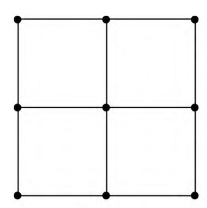

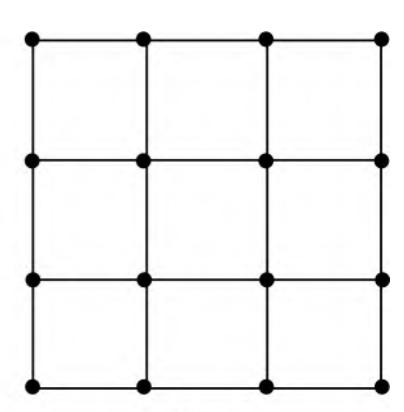

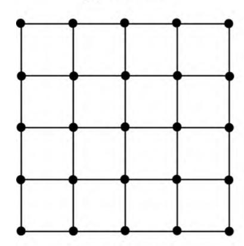

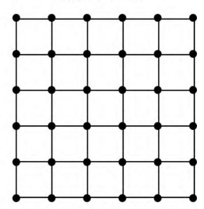

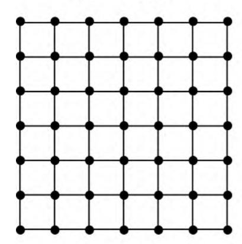

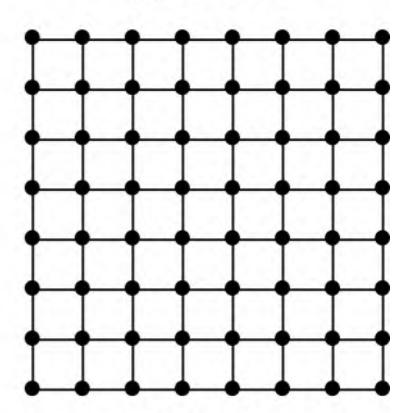

Figure 6.1 Reduced finite element models with increasing nodal densities: (a) 9 nodes; (b) 16 nodes; (c) 25 nodes; (d) 36 nodes; (e) 49 nodes; and (f) 64 nodes.

{117}------------------------------------------------

## 6.4 Results and Discussion

This section presents the results and provides a discussion on key considerations

## 6.4.1 Optimal reduced model

Figure 6.1 presents a series of reduced-order finite element models for a square plate, constructed using different levels of nodal discretization. The models vary in complexity, with configurations including 9, 16, 25, 36, 49, and 64 nodes, as illustrated in Figures 6.1(a)-(f). Each configuration represents a simplified approximation of the full plate geometry, enabling analysis of the system's dynamic characteristics with varying computational effort.

For each reduced model, the global mass and stiffness matrices are formulated based on the corresponding nodal arrangement and finite element discretization. These matrices are then used to solve the generalized eigenvalue problem:

$$K\phi = \lambda M\phi \quad (6.14)$$

where  $K$  is the stiffness matrix,  $M$  is the mass matrix,  $\lambda$  represents the eigenvalues, and  $\phi$  denotes the mode shapes. The solution yields the natural frequencies and associated mode shapes for each reduced model.

To evaluate the accuracy of these reduced-order models, the first 12 natural frequencies of each configuration are compared against those obtained from a finely meshed reference plate model, considered the benchmark. The comparison is performed by computing the percentage error between the predicted frequencies from each reduced model and those of the reference model. This analysis helps quantify the impact of mesh resolution on the accuracy of modal predictions.

The results provide valuable insights into the trade-off between computational cost and accuracy. Lower node configurations result in faster computations but higher 

{118}------------------------------------------------

approximation errors, while finer models improve accuracy at the expense of computational resources. The study seeks for identification of an optimal discretization strategy for applications requiring efficient yet accurate vibration analysis, such as real-time structural health monitoring or model updating frameworks.

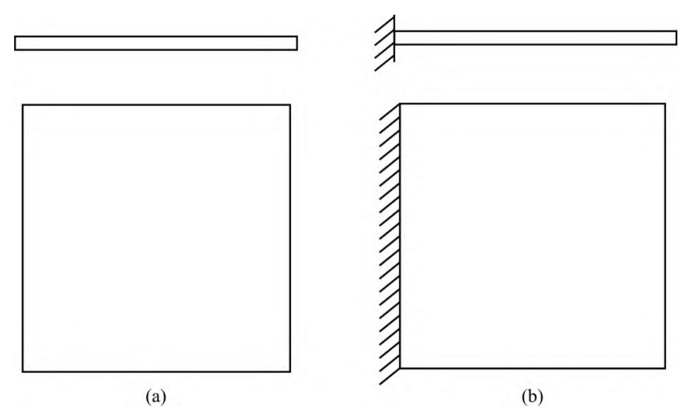

Figure 6.2 Boundary condition configurations for reduced models: (a) free plate, and; (b) cantilever plate.

Figure 6.2 shows two distinct boundary condition configurations used in this analysis: a free plate and a cantilever plate. For each reduced-order model, simulations are conducted under both boundary conditions. In the free plate case, the plate is unconstrained, allowing free vibration along all edges. In the cantilever case, one edge of the plate is fully fixed while the remaining edges are free to vibrate. This setup introduces asymmetry in the stiffness distribution and affects the resulting mode shapes and frequencies.

Each reduced model configuration, ranging from 9 to 64 nodes, is analyzed separately for both the free and cantilever conditions. The computed natural frequencies from the reduced models are compared with those obtained from a finely meshed ref

{119}------------------------------------------------

erence plate for each boundary condition type. This comparative study allows for the evaluation of how the reduced models perform under different physical constraints and provides insights into their generalizability and robustness. The results also help identify how boundary conditions influence the trade-off between model resolution and accuracy.

#### 6.4.2 Modal Analysis and Error Evaluation for the Free Plate

Figure 6.3(a)-(d) and Figure 6.3(i)-(j) illustrates the results of the modal analysis conducted for the finely meshed free plate. The figure captures mode shapes from mode 7 to mode 12, which are identified as the elastic modes of interest in this study. It is important to note that the first elastic mode for the free plate occurs at mode 7. Thus, the subsequent analysis and error evaluations focus exclusively on modes 7 through 15.

To assess the accuracy of the reduced-order models, the natural frequencies obtained from each reduced model are compared with those of the perfect mesh for modes 7 to 12. The percentage error between these frequencies is presented in Table 6.1.

Table 6.1 Percentage error between reduced models and perfect mesh for modes 7 to 12 (Free Plate)

| Mode | 9 nodes | 16 nodes | 25 nodes | 36 nodes | 49 nodes | 64 nodes |
|------|---------|----------|----------|----------|----------|----------|
| 7    | 0.9     | 0.5      | 0.5      | 0.5      | 0.5      | 0.8      |
| 8    | 1.0     | 0.8      | 0.9      | 1.0      | 1.0      | 0.9      |
| 9    | 1.0     | 0.9      | 0.9      | 0.9      | 1.0      | 0.9      |
| 10   | 7.6     | 2.4      | 1.0      | 0.3      | 0.0      | 0.2      |
| 11   | 7.6     | 2.4      | 1.0      | 0.3      | 0.0      | 0.2      |
| 12   | 24.2    | 7.2      | 3.8      | 2.2      | 1.3      | 0.7      |

The percentage errors are further visualized in Figure 6.5, which presents a line plot of the error distribution across modes 7 to 12 for each reduced nodal configuration.

{120}------------------------------------------------

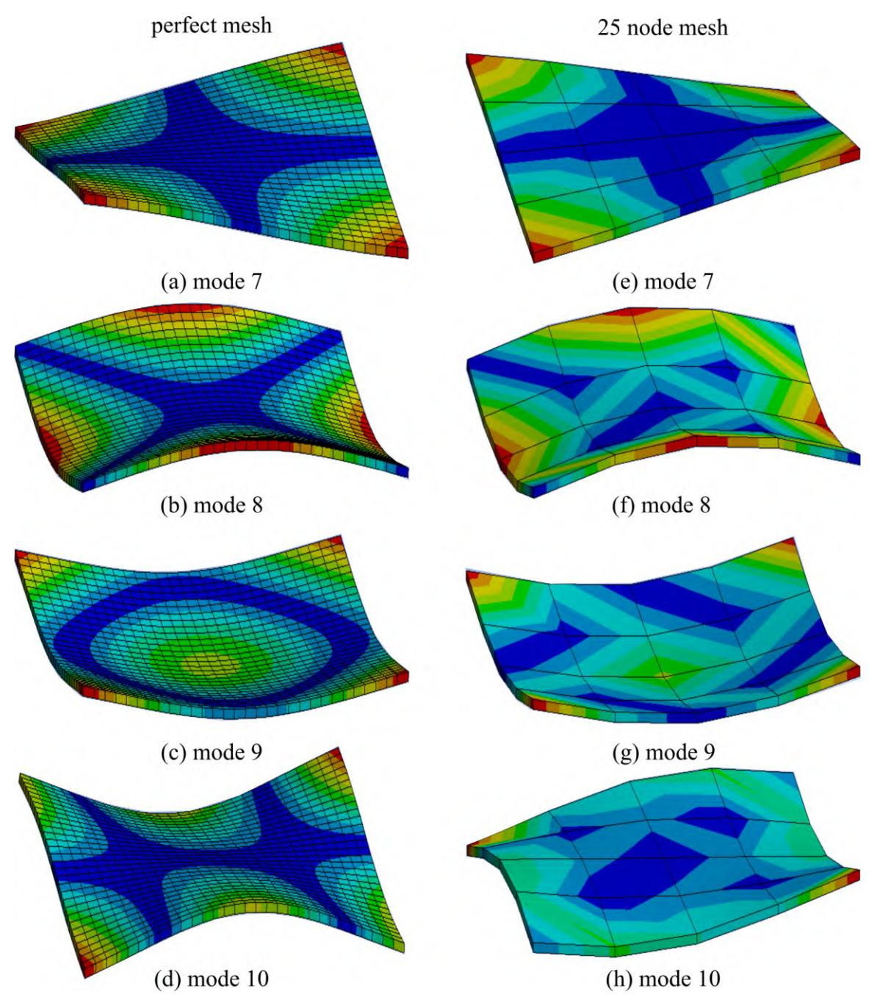

Figure 6.3 Mode shapes of the perfectly meshed fee plate: (a) Mode 7 through (d) Mode 10.

From the error plot, it is evident that only the 9-node reduced model exceeds the acceptable error threshold of 10%, particularly in modes 10 through 12. This renders the 9-node model unsuitable for use in this study as an optimal reduced-order representation. In contrast, all other reduced models maintain percentage errors well

{121}------------------------------------------------

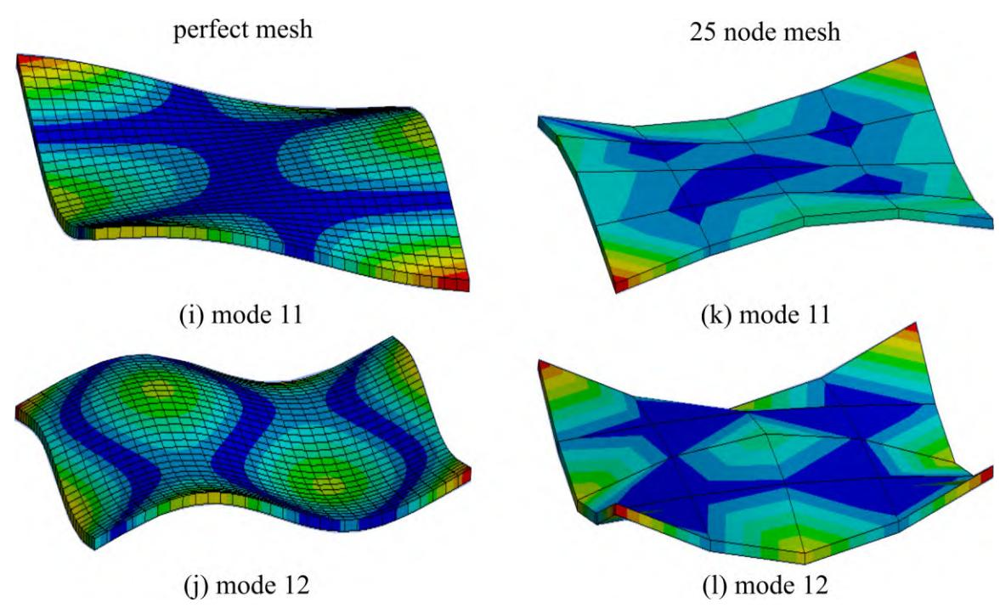

Figure 6.4 Mode shapes of the perfectly meshed free plate: (i) Mode 11, and; (j) Mode 12.

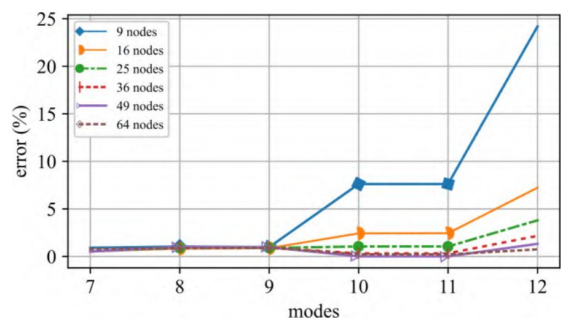

Figure 6.5 Percentage error in natural frequencies of reduced-order models compared to perfect mesh for free plate.

below the 10% limit across the considered modes. Therefore, these configurations can be considered acceptable for applications requiring reduced computational cost while preserving modal accuracy.

{122}------------------------------------------------

#### 6.4.3 Modal Analysis and Error Evaluation for the Cantilever Plate

Figure 6.6(a)-(d), Figure 6.7(i)-(l) and Figure 6.8(q)-(t) shows the modal deformation shapes of a finely meshed cantilever plate for modes 1 through 12. These modes represent the key elastic response characteristics used in evaluating the reduced of the reduced-order models developed in this study.

To evaluate the performance of the reduced models under cantilever boundary conditions, the first 12 natural frequencies obtained from each reduced nodal configuration are compared to the results of the perfect mesh model. Table 6.2 presents the percentage error for each mode and model configuration.

Table 6.2 Percentage error between reduced models and perfect mesh for modes 1 to 12 (Cantilever Plate)

| Mode | 9 nodes | 16 nodes | 25 nodes | 36 nodes | 49 nodes | 64 nodes |
|------|---------|----------|----------|----------|----------|----------|
| 1    | 0.5     | 1.2      | 0.1      | 1.2      | 3.0      | 4.6      |
| 2    | 3.4     | 1.1      | 0.5      | 0.2      | 0.2      | 0.8      |
| 3    | 5.2     | 0.7      | 0.4      | 0.7      | 0.7      | 0.8      |
| 4    | 1.1     | 0.4      | 0.1      | 0.2      | 0.4      | 0.6      |
| 5    | 11.1    | 3.3      | 1.5      | 0.7      | 0.6      | 0.2      |
| 6    | 28.5    | 9.4      | 4.9      | 2.7      | 1.6      | 0.9      |
| 7    | 3.6     | 1.6      | 0.5      | 0.1      | 0.2      | 0.7      |
| 8    | 1.6     | 2.7      | 0.9      | 0.8      | 0.9      | 0.6      |
| 9    | 18.5    | 16.5     | 4.8      | 1.5      | 0.6      | 0.6      |
| 10   | 27.4    | 15.0     | 0.6      | 3.7      | 2.3      | 1.0      |
| 11   | 14.2    | 17.4     | 5.2      | 0.3      | 1.4      | 2.0      |
| 12   | 59.8    | 14.7     | 9.9      | 5.4      | 1.8      | 0.3      |

Figure 6.9 shows the graphical representation of the error data in Table 6.2, clearly illustrating the relative performance of each reduced model across the twelve analyzed modes.

From the error results, it is observed that both the 9-node and 16-node reduced models exceed the 10% allowable error threshold in several modes, notably in higherorder modes such as 6, 9, 10, 11, and 12. Consequently, these two configurations are considered unsuitable for use in this study.

{123}------------------------------------------------

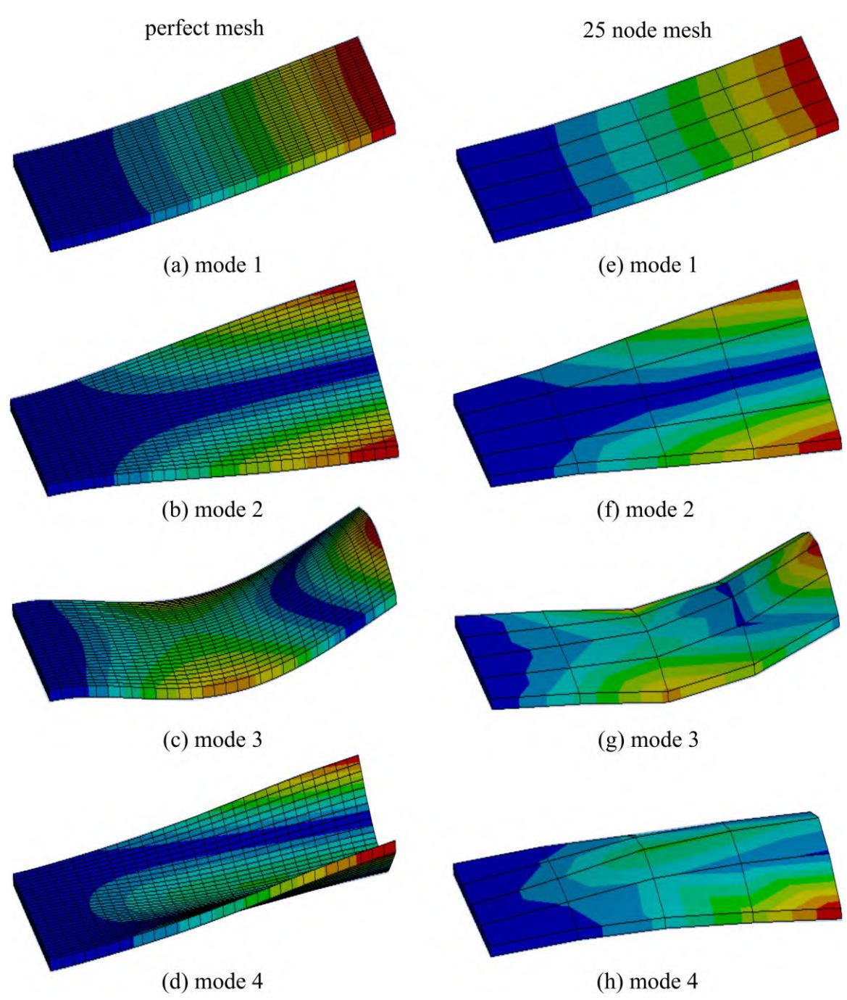

Figure 6.6 Mode shapes of the perfectly meshed cantilever plate: (a) Mode 1 through (d) Mode 4.

Among the reduced-order models evaluated, the 25-node model is identified as the smallest configuration that remains within the 10% error limit for all modes for both the free and cantilever plate cases. This makes the 25-node model the most optimal balance between accuracy and computational efficiency and is therefore selected for

{124}------------------------------------------------

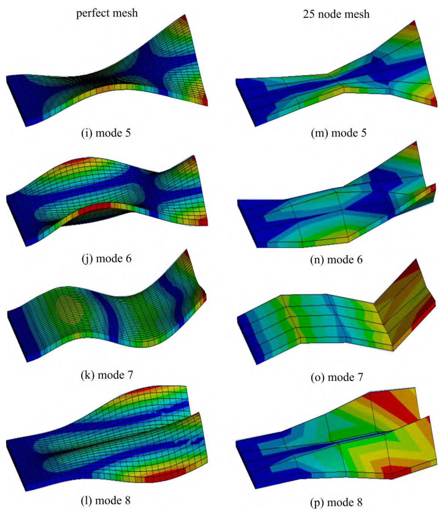

Figure 6.7 Mode shapes of the perfectly meshed cantilever plate: (i) Mode 5 through (l) Mode 8.

further analysis and validation throughout the remainder of this study.

{125}------------------------------------------------

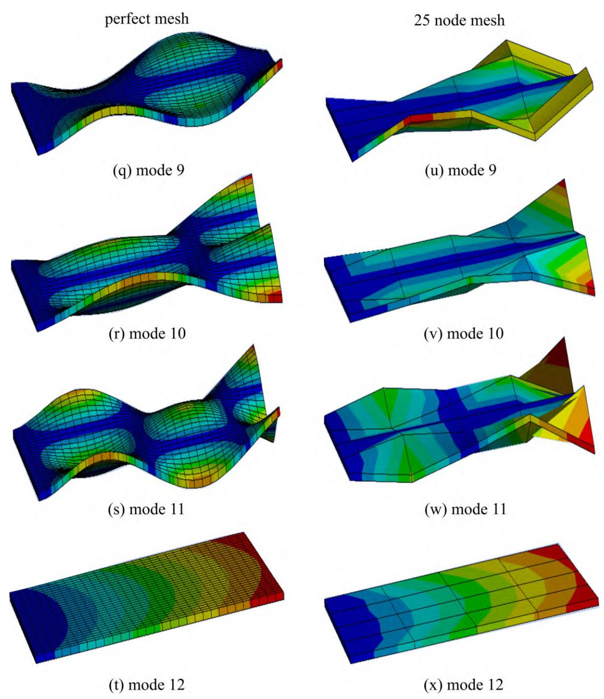

Figure 6.8 Mode shapes of the perfectly meshed cantilever plate: (q) Mode91 through (t) Mode 12.

# 6.4.4 Development of Cantilever Mass and Stiffness Matrices from Free Plate Matrices

Figure 6.10(a) and (b) illustrates the transformation of a free plate finite element model into a cantilever plate by imposing boundary conditions. The figure shows

{126}------------------------------------------------

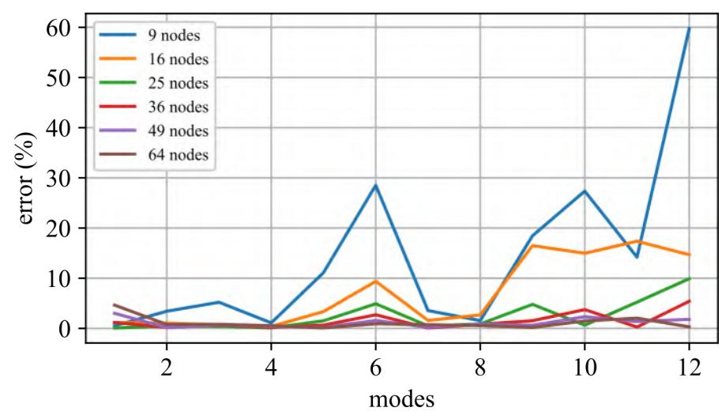

Figure 6.9 Percentage error in natural frequencies of reduced-order models compared to perfect mesh for cantilever plate.

the nodal construction of the 25-node reduced-order plate model, which has been previously selected as the optimal reduced model based on modal accuracy and computational efficiency.

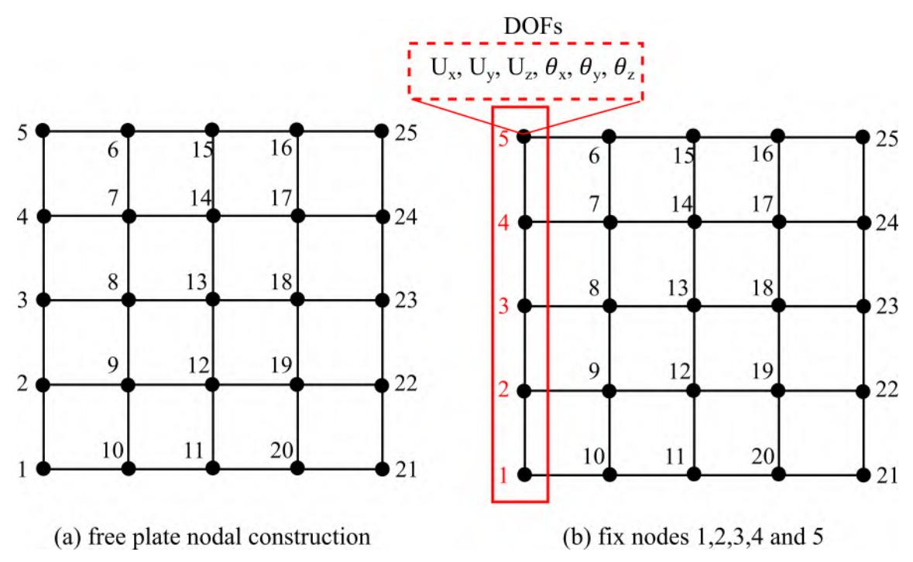

Figure 6.10 Transformation of 25-node reduced model from free plate to cantilever plate by applying boundary conditions.

{127}------------------------------------------------

 $K_{\text{free}}$  and mass matrix  $M_{\text{free}}$  that represent the unconstrained vibrational behavior of the structure. Each of the 25 nodes possesses six degrees of freedom (DOFs): three translational ( $U_x, U_y, U_z$ ) and three rotational ( $\theta_x, \theta_y, \theta_z$ ). Therefore, the size of both  $K_{\text{free}}$  and  $M_{\text{free}}$  is  $150 \times 150$ .

To convert the free plate into a cantilever plate, boundary conditions are applied by constraining all six DOFs of nodes 1, 2, 3, 4, and 5 along the left edge of the plate, as highlighted in red in Figure 6.10. This constraint eliminates the corresponding rows and columns in the global stiffness and mass matrices, effectively removing the associated DOFs from the system.

The resulting matrices,  $K_{\text{cantilever}}$  and  $M_{\text{cantilever}}$ , represent the constrained system and have reduced dimensions. Specifically, the removal of five nodes each with six DOFs leads to a reduction of 30 DOFs. Hence, the final size of the cantilever matrices becomes  $120 \times 120$ .

The transformation process can be mathematically described using a Boolean transformation matrix  $T$ :

$$K_{\text{cantilever}} = T^T K_{\text{free}} T, \quad M_{\text{cantilever}} = T^T M_{\text{free}} T \quad (6.15)$$

where  $T$  is a selection matrix that eliminates the DOFs corresponding to the fixed nodes.

The application of these boundary conditions modifies the dynamic behavior of the structure, as the vibrational freedom along the fixed edge is suppressed. This modeling step is essential for accurately simulating the cantilever condition in both the finite element analysis and in the implementation of model updating procedures like LEMP. The cantilever matrices developed here are used in subsequent analyses, including modal extraction, error comparison, and validation of reduced-order modeling strategies.

{128}------------------------------------------------

To effectively characterize the dynamic behavior of the cantilever plate using reducedorder modeling, an optimal vibration mode must be selected. This mode should be sensitive enough to detect localized changes in stiffness, which represent structural modifications or damage. The selection process is illustrated in Figure 6.11, which shows the nodal layout of the 25-node reduced model with fixed boundary conditions applied to nodes 1 through 5 at the base.

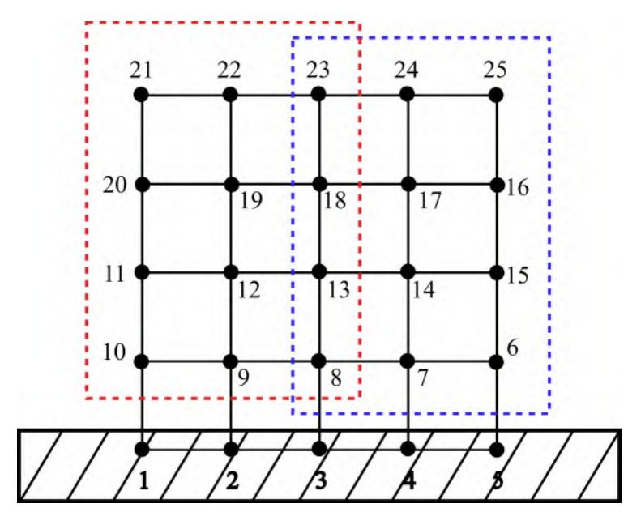

Figure 6.11 Nodal configuration for optimal mode selection: fixed nodes 1–5 and highlighted nodes 6–25 for localized stiffness modifications.

The approach involves systematically introducing a local stiffness change to the remaining nodes of the plate, one at a time, at the out-of-plane degree of freedom  $U_z$ . Specifically, a stiffness perturbation of magnitude  $1 \times 10^{10}$  N/m is applied to each node from node 6 through node 25. These nodes span the entire active region of the plate not fixed at the base.

However, due to the geometric and dynamic symmetry of the cantilever plate, only one half of the structure needs to be investigated for efficiency. The frequency shifts induced by local stiffness changes on one side of the plate can be assumed to reflect 

{129}------------------------------------------------

the response on the symmetric side. Therefore, local modifications are introduced to the following subset of nodes:

- Lower edge nodes: 6, 7, 8
- Mid-region nodes: 13, 14, 15, 16, 17, 18
- Top edge nodes: 23, 24, 25

For each perturbation at these nodes, a modal analysis is conducted to compute the change in natural frequencies. This frequency shift serves as a sensitivity indicator, showing how responsive each vibration mode is to local structural changes at specific locations. By comparing the frequency changes across multiple modes, the mode that exhibits the highest sensitivity across the considered nodes is identified as the optimal mode for use in real-time model updating and damage detection.

This strategy ensures that the selected mode provides sufficient spatial coverage and sensitivity to local variations, allowing it to serve as a reliable descriptor of the plate's global dynamic behavior under the cantilever boundary condition. The identified optimal mode will be utilized in subsequent sections for validating the Local Eigenvalue Modification Procedure (LEMP) and performing structural model updates based on limited modal data.

The evaluation involves applying a local stiffness perturbation to the plate model. A stiffness value of  $1 \times 10^{10}$  N/m is introduced individually at the out-of-plane degree of freedom ( $U_z$ ) of nodes 6 through 25. These nodes are chosen because they cover the upper surface of the cantilever plate while also reflecting one side of the plate due to the structure's mirror symmetry. This allows for a computationally efficient yet representative analysis.

For each perturbation, the modal frequencies are recalculated using both the generalized eigenvalue (GE) approach and the LEMP algorithm. Frequencies corresponding to the first fifteen vibration modes are extracted from both solvers. The accuracy

{130}------------------------------------------------

Table 6.3 Percentage error for modes 1 to 15 at nodes 6 to 10.

|      |          |          | % error at | nodes    |          |
|------|----------|----------|------------|----------|----------|
| mode | 6        | 7        | 8          | 9        | 10       |
| 1    | 2.532117 | 1.987089 | 2.686049   | 2.039476 | 2.574719 |
| 2    | 1.748493 | 2.466974 | 2.074156   | 2.063405 | 1.719738 |
| 3    | 0.953186 | 1.316698 | 0.813959   | 1.117853 | 0.946491 |
| 4    | 0.521762 | 1.485406 | 2.826987   | 1.614323 | 0.552273 |
| 5    | 4.700076 | 6.679389 | 3.521589   | 6.013716 | 4.744664 |
| 6    | 5.323287 | 6.451122 | 4.052768   | 6.503801 | 5.323287 |
| 7    | 0.766019 | 0.979711 | 1.636351   | 0.986735 | 0.801727 |
| 8    | 0.615614 | 3.333333 | 3.5367     | 3.298704 | 0.708041 |
| 9    | 7.734375 | 3.905734 | 5.084374   | 3.62077  | 7.997004 |
| 10   | 7.12605  | 3.78518  | 2.77063    | 3.562164 | 7.038741 |
| 11   | 5.682823 | 10.78792 | 7.697923   | 10.6093  | 5.700386 |
| 12   | 16.41868 | 13.98043 | 16.83436   | 14.0326  | 16.50432 |
| 13   | 10.00126 | 16.19612 | 18.27292   | 16.28644 | 9.983127 |
| 14   | 12.15216 | 7.737914 | 5.404227   | 7.856141 | 12.17155 |
| 15   | 12.0695  | 12.4493  | 12.30422   | 12.37868 | 12.09239 |

of LEMP is then quantified by computing the percentage error for each mode at each perturbation site, comparing LEMP-predicted frequencies to those obtained from the benchmark GE solver.

For each case, frequencies obtained using the Generalized Eigenvalue (GE) solver and LEMP are plotted side-by-side. Additionally, a red error curve is overlaid, representing the percentage error between LEMP and GE for each mode. Across the test range, it can be observed that LEMP maintains a consistent and acceptable accuracy margin.

The resulting errors are presented in Table 6.3 through Table 6.6, highlighting the performance of LEMP across all modes and nodes. In each table, the three modes with the lowest percentage errors at a given node are highlighted in green, denoting superior agreement between LEMP and GE. This visual method aids in quickly identifying modes with consistently low errors.

To quantify which mode most reliably tracks structural changes using LEMP, a count is performed to determine how many times each mode appears in the top three

{131}------------------------------------------------

Table 6.4 Percentage error for modes 1 to 15 at nodes 11 to 15.

|      |          |          | % error at | nodes    |          |
|------|----------|----------|------------|----------|----------|
| mode | 11       | 12       | 13         | 14       | 15       |
| 1    | 5.890645 | 7.965409 | 7.192803   | 8.101189 | 5.912551 |
| 2    | 4.619095 | 7.172105 | 9.368445   | 6.82218  | 4.638922 |
| 3    | 1.622843 | 3.017837 | 0.802334   | 2.8354   | 1.606298 |
| 4    | 3.596503 | 7.637173 | 4.136615   | 7.63092  | 3.629259 |
| 5    | 7.170588 | 9.990671 | 4.552547   | 9.260694 | 7.141813 |
| 6    | 3.910083 | 7.563697 | 4.103226   | 7.73393  | 3.9568   |
| 7    | 3.834675 | 4.717042 | 5.510132   | 4.827965 | 3.864438 |
| 8    | 7.865297 | 2.171119 | 5.033873   | 1.990343 | 7.854778 |
| 9    | 6.362704 | 11.00658 | 16.736     | 10.7485  | 6.453861 |
| 10   | 15.00322 | 10.56295 | 15.25906   | 10.64363 | 14.99295 |
| 11   | 17.08992 | 11.37399 | 9.440886   | 11.26693 | 17.09602 |
| 12   | 18.69787 | 18.48873 | 13.96      | 18.58958 | 18.63622 |
| 13   | 5.86878  | 17.09173 | 16.32266   | 17.25441 | 5.889439 |
| 14   | 17.33568 | 7.093032 | 7.79415    | 7.11567  | 17.34773 |
| 15   | 17.03949 | 22.45205 | 22.63504   | 22.4595  | 17.26478 |

Table 6.5 Percentage error for modes 1 to 15 at nodes 16 to 20.

|      |          |          | % error at | nodes    |          |
|------|----------|----------|------------|----------|----------|
| mode | 16       | 17       | 18         | 19       | 20       |
| 1    | 9.497408 | 11.3315  | 22.76656   | 11.47762 | 9.488718 |
| 2    | 10.38528 | 7.715702 | 2.41712    | 7.677894 | 10.38767 |
| 3    | 2.176486 | 19.31973 | 11.59083   | 18.66725 | 2.193322 |
| 4    | 8.734441 | 12.74896 | 1.519571   | 12.62904 | 8.707256 |
| 5    | 6.561462 | 4.950766 | 6.674359   | 5.247573 | 6.607372 |
| 6    | 10.35219 | 5.378282 | 10.129     | 5.434294 | 10.38407 |
| 7    | 3.524868 | 2.327415 | 6.722739   | 2.226873 | 3.543342 |
| 8    | 3.76996  | 2.219439 | 9.296427   | 2.279138 | 3.821924 |
| 9    | 9.132671 | 9.428189 | 5.873433   | 9.418856 | 9.002907 |
| 10   | 7.980973 | 10.4069  | 7.539742   | 10.28782 | 8.098754 |
| 11   | 17.397   | 14.18785 | 18.35887   | 14.21432 | 17.44371 |
| 12   | 26.12778 | 24.16503 | 18.38648   | 24.10023 | 26.1124  |
| 13   | 10.39051 | 14.89921 | 21.69847   | 15.00948 | 10.35073 |
| 14   | 9.475202 | 11.05434 | 11.52126   | 11.05639 | 9.475202 |
| 15   | 8.317759 | 20.35461 | 12.34558   | 20.46007 | 8.32779  |

{132}------------------------------------------------

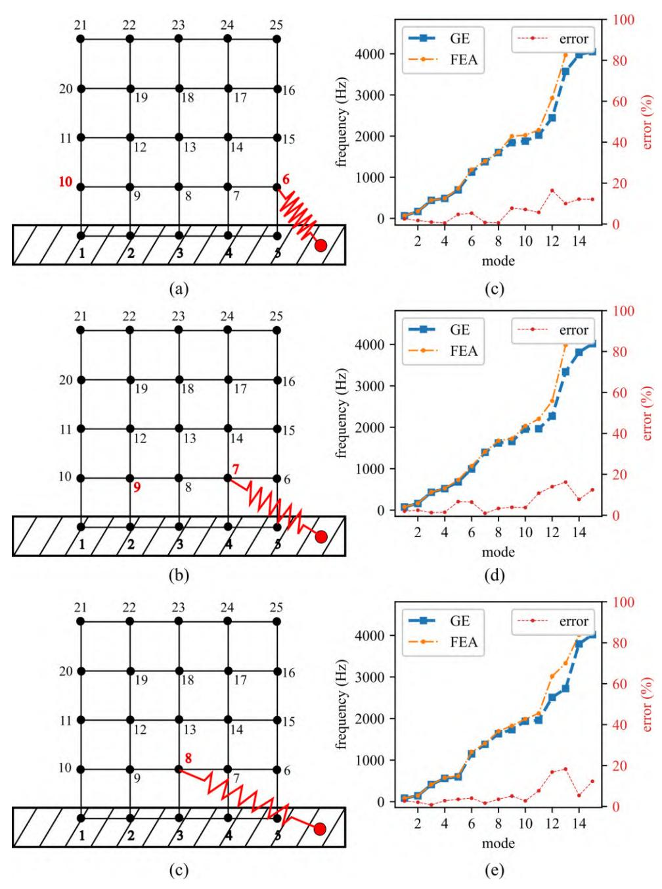

Figure 6.12 Frequency comparisons and error profiles for local stiffness perturbations at nodes 6, 7, and 8

lowest error slots across all perturbation nodes. The result of this frequency-based evaluation is displayed as a histogram in Figure 6.16.

The histogram analysis reveals the following:

- Mode 3 appears in the top three lowest-error modes 15 times.

{133}------------------------------------------------

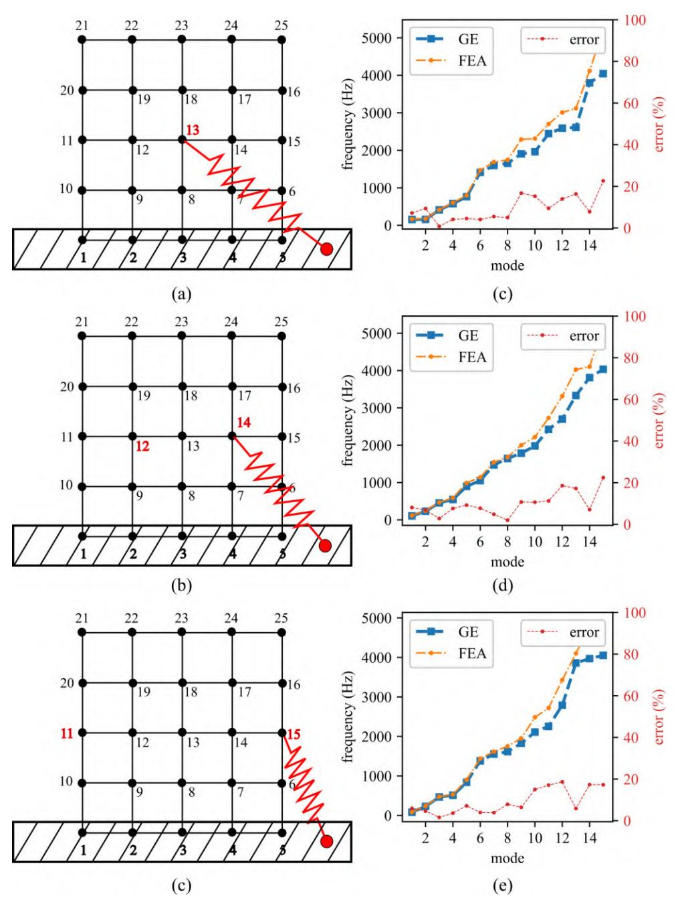

Figure 6.13 Frequency comparisons and error profiles for local stiffness perturbations at nodes 13, 14, and 15.

- Mode 7 appears 17 times, the highest among all modes.
- Mode 8 appears 11 times.

Mode 7 emerges as the most accurate and consistent in capturing frequency shifts due to local changes, demonstrating superior robustness and minimal deviation when

{134}------------------------------------------------

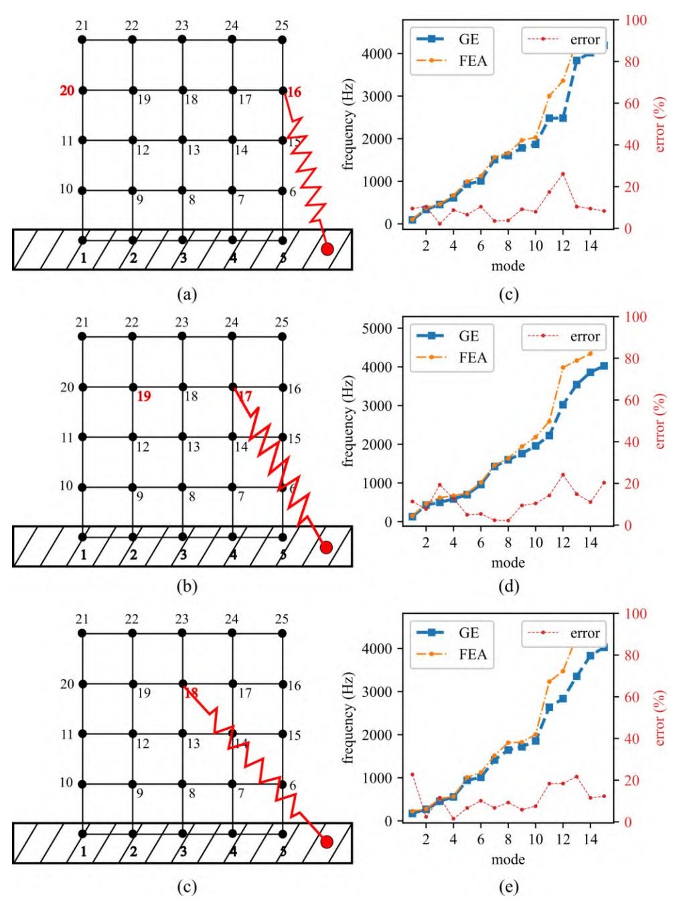

Figure 6.14 Frequency comparisons and error profiles for local stiffness perturbations at nodes 16, 17, and 18.

LEMP is used as a solver. This consistency suggests that Mode 7 provides the best compromise between sensitivity to local perturbations and overall numerical accuracy.

As a result, Mode 7 is selected as the optimal mode for real-time structural assessment using LEMP. All subsequent validation tasks, error tracking, and simula-

{135}------------------------------------------------

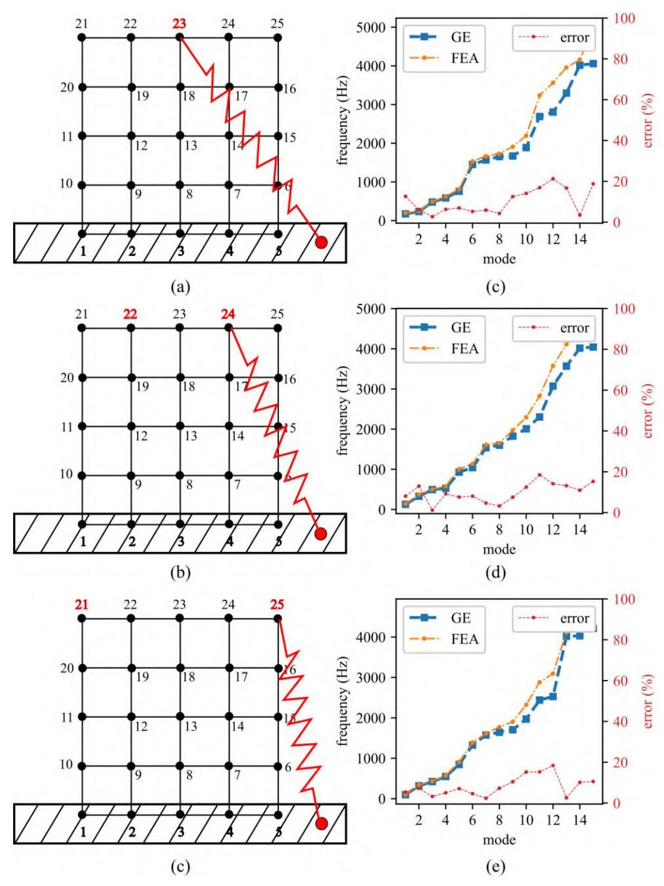

Figure 6.15 Frequency comparisons and error profiles for local stiffness perturbations at nodes 23, 24, and 25.

tion analyses will reference this mode, ensuring accurate, computationally efficient model updating within dynamic and uncertain environments. This suggests that the LEMP solution for mode 7 is especially robust to structural changes introduced at this location. Figure 6.17 compares GE and LEMP frequencies for mode 7 at each

{136}------------------------------------------------

Table 6.6 Percentage error for modes 1 to 15 at nodes 21 to 25 along with cumulative counts of appearances in the top three lowest errors.

|      |          |          | % error at | nodes    |          |       |
|------|----------|----------|------------|----------|----------|-------|
| mode | 21       | 22       | 23         | 24       | 25       | count |
| 1    | 5.442432 | 8.088518 | 12.67039   | 8.049198 | 5.424116 | 0     |
| 2    | 7.161676 | 12.92952 | 6.074223   | 12.94797 | 7.218211 | 2     |
| 3    | 3.166835 | 1.183541 | 2.701019   | 1.199321 | 3.237814 | 15    |
| 4    | 5.018165 | 9.199682 | 6.276045   | 9.173027 | 5.037879 | 9     |
| 5    | 7.077355 | 7.587955 | 6.927779   | 7.587955 | 7.083466 | 2     |
| 6    | 4.592651 | 8.067761 | 5.231131   | 8.051535 | 4.599511 | 2     |
| 7    | 2.234841 | 4.55528  | 5.883271   | 4.655953 | 2.35604  | 17    |
| 8    | 7.067435 | 3.274497 | 4.274147   | 3.215992 | 7.256163 | 11    |
| 9    | 10.38084 | 7.378596 | 12.53273   | 7.524065 | 10.44199 | 0     |
| 10   | 15.11541 | 12.33968 | 14.06895   | 12.4735  | 15.21763 | 0     |
| 11   | 15.27005 | 18.39393 | 16.90804   | 18.48926 | 15.27005 | 0     |
| 12   | 18.29072 | 14.16208 | 21.24383   | 14.14289 | 18.4094  | 0     |
| 13   | 2.5435   | 13.18581 | 16.70431   | 13.16257 | 2.571872 | 1     |
| 14   | 10.13109 | 10.91125 | 3.439656   | 10.95864 | 10.1351  | 0     |
| 15   | 10.62872 | 15.2532  | 18.76341   | 15.25852 | 10.55855 | 0     |

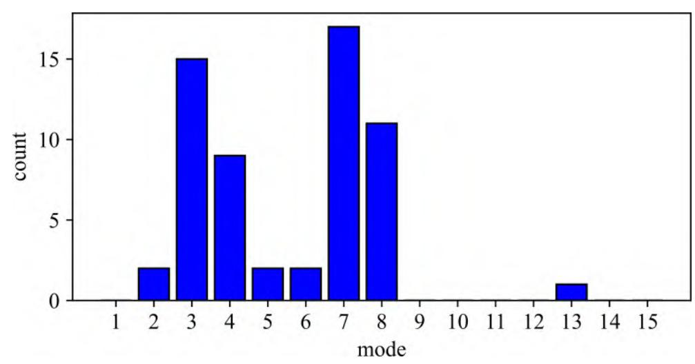

Figure 6.16 Histogram showing number of times each mode appears in the three lowest-error positions across all nodes.

perturbation node from 6 to 25.

From the plot, it is evident that across all tested nodes, the deviation in LEMPpredicted frequencies remains consistently within a 10% error threshold when compared with the GE results. This reinforces the reliability of mode 7 in capturing

{137}------------------------------------------------

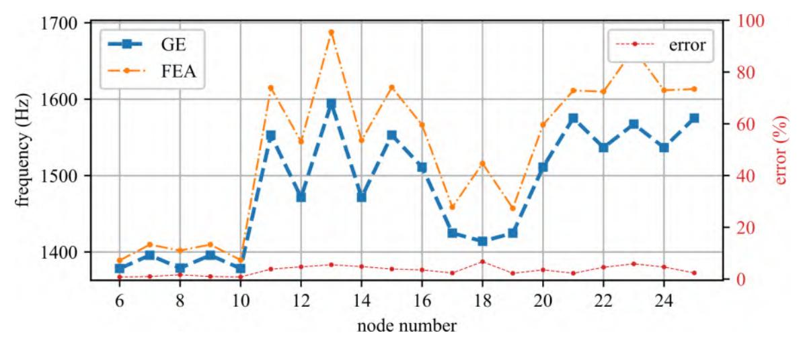

Figure 6.17 Frequencies of Mode 7 from GE and LEMP at local perturbation from node 6 to node 25. Error percentages remain below 10% at all nodes.

system dynamics under local perturbation and confirms its appropriateness as the optimal mode for tracking and real-time model updating tasks.

# 6.4.6 Multiple State Change Timing: GE vs LEMP on 25-Node Cantilever Plate

To evaluate the computational performance of the proposed Local Eigenvalue Modification Procedure (LEMP) compared to the traditional Generalized Eigenvalue (GE) approach, timing study were carried out under scenarios involving both single and multiple state changes. These simulations were performed on the 25-node cantilever plate model previously identified as the optimal reduced-order model based on modal accuracy.

Table 6.7 Comparison of GE and LEMP computation times on 25-node plate

| Scenario            | GE       | LEMP    | Speed |
|---------------------|----------|---------|-------|
| Single state change | 9.01 ms  | 0.43 ms | 20x   |
| Four state changes  | 36.04 ms | 1.62 ms | 22x   |

First, a single local stiffness change was introduced to one node of the cantilever plate. Both GE and LEMP were used to compute the updated modal frequencies following this single state change. The timing result, shown in Table 6.7, indicates

{138}------------------------------------------------

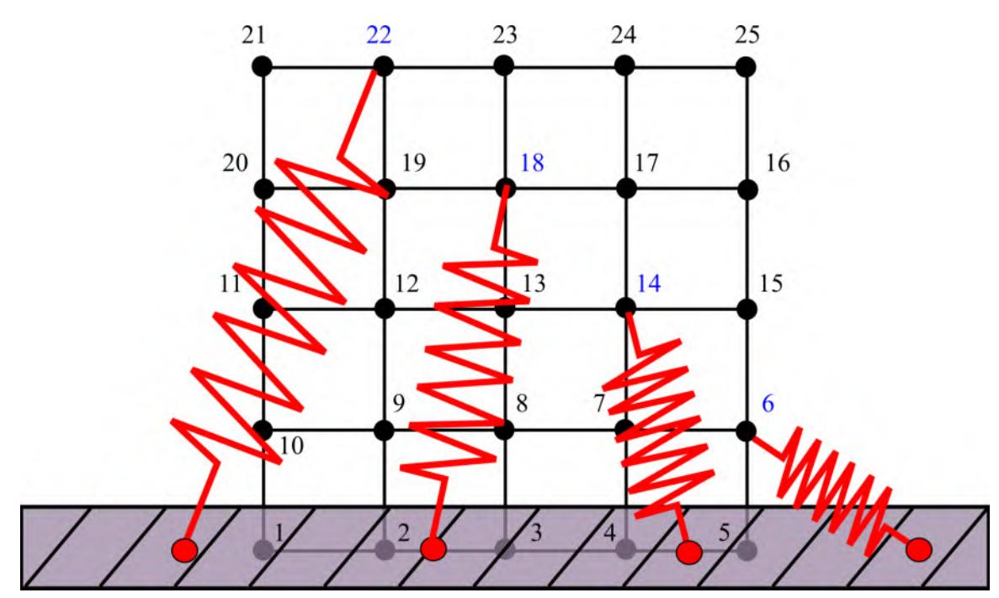

Figure 6.18 Illustration of four local stiffness changes introduced at nodes 6, 14, 18, and 22 on the 25-node cantilever plate.

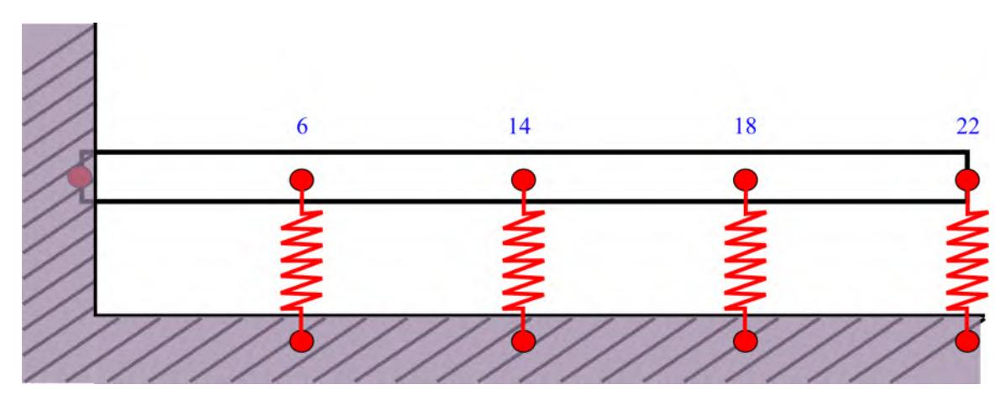

Figure 6.19 Side view representation showing the vertical spring supports simulating stiffness changes at the same four nodes.

that LEMP required only 0.43 ms to compute the change, whereas the GE approach took 9.01 ms. This demonstrates that LEMP is approximately 20 times faster in single update scenarios.

For a scenario involving four local state changes. The stiffness changes were introduced consecutively at four different nodal locations (nodes 6, 14, 18, and 22), 

{139}------------------------------------------------

as illustrated in the attached figures. This configuration simulates a more realistic structural damage case where multiple parts of the structure undergo rapid modifications.

The GE solver required 36.04 ms to perform the updates and solve for the new frequencies across all four modified nodes. In contrast, the LEMP approach completed the same task in just 1.62 ms. This yields a performance boost of approximately 22 times, which becomes increasingly beneficial in real-time structural health monitoring systems where time sensitivity is crucial.

## 6.5 Conclusion

This work presented a computationally efficient framework for real-time structural model updating using the Local Eigenvalue Modification Procedure (LEMP), applied to a 2D cantilever plate model with 25 nodes. The study aimed to overcome the computational limitations of conventional generalized eigenvalue (GE) methods by introducing a reduced-order model capable of rapid updates during high-rate dynamic events. The key achievement lies in extending LEMP from 1D systems to 2D plate structures while ensuring microsecond-level computation and maintaining modal accuracy.

The methodology involved selecting the optimal reduced-order plate model through mesh convergence analysis and modal error evaluation. A systematic nodal stiffness modification approach was used to evaluate the frequency response and identify the most sensitive mode for damage detection—Mode 7—based on its minimal error across localized perturbations. The study employed a modal projection strategy to update only the affected degrees of freedom, allowing for efficient computation without solving the full eigenvalue problem.

Results demonstrated that LEMP consistently maintained error levels below 10% across all tested scenarios, with significantly improved computational speed. In timing 

{140}------------------------------------------------

study, LEMP achieved speedups of 20x and 22x over GE for single and four-node stiffness changes, respectively. These outcomes validate LEMP's suitability for realtime applications and its ability to provide fast, localized structural assessments.

The implications of these results are substantial for structural health monitoring (SHM) systems in high-demand fields such as aerospace and electronics. The method supports integration with real-time sensors and model-based diagnostics for continuous monitoring. However, the current study assumes linear behavior and ideal structural modifications, suggesting a need for future extension to nonlinear or multiphysics contexts.

{141}------------------------------------------------

# Chapter 7

# Conclusion

This work presents a comprehensive investigation into real-time model updating of structures undergoing high-rate dynamic events, culminating in the development and validation of a reduced-order model-based framework using the Local Eigenvalue Modification Procedure (LEMP). The research was driven by the increasing demand for accurate, rapid, and computationally efficient structural health monitoring (SHM) solutions in critical sectors such as aerospace, electronics, and defense, where highrate events pose significant risks to structural integrity.

In-depth exploration of the challenges associated with high-rate dynamics, including the need for microsecond-level updates, computational limitations of traditional finite element methods, and the unpredictable nature of structural changes due to localized stiffness or mass perturbations necessitate this work. LEMP was proposed as a viable solution, capable of drastically reducing computational load by transforming the global eigenvalue problem into a set of second-order secular equations that target only the degrees of freedom affected by structural changes.

Methodologically, this work introduces a suite of mathematical tools and algorithmic enhancements, notably the divide-and-conquer solver integrated into the LEMP framework, enabling rapid convergence of frequency estimations. The framework was first applied and validated on simple beam models, then scaled to twodimensional structural systems such as square steel plates and reduced-order printed circuit boards. Modal reduction strategies were employed to identify optimal node configurations—specifically, a 25-node cantilever plate was selected as the most ac

{142}------------------------------------------------

curate and computationally efficient model for further analysis. Key steps in this development included performing modal analysis, introducing sequential and multiple local changes, and identifying optimal tracking modes based on error minimization across multiple perturbation cases.

In terms of results, the proposed framework consistently achieved sub-millisecond update speeds, with timing for multiple state changes recorded as low as 1.62 ms using LEMP, compared to 36.04 ms using the conventional generalized eigenvalue method. Frequency tracking errors were kept below 10% across nearly all tested configurations, and the signal-to-noise ratios remained above 30 dB in lower modes. Mode 7, in particular, was identified as the optimal tracking mode due to its consistency in yielding the lowest errors under various stiffness perturbations. Moreover, this work extended the application of LEMP to more complex 2D plate systems, establishing the practical feasibility of microsecond-level structural updates in real-world scenarios.

The contributions of this research are multifaceted. First, it reformulates the traditional LEMP framework to support divide-and-conquer strategies and modal truncation for enhanced performance. Second, it introduces a robust reduced-order modeling methodology tailored for real-time applications. Third, it provides a validated implementation pathway from 1D to 2D structural systems, demonstrated through both numerical simulations and algorithmic benchmarks. Fourth, it opens the door for future integration of probabilistic filters and machine learning for adaptive tracking under uncertainty.

{143}------------------------------------------------

# Bibliography

[1] Jonathan Hong, Simon Laflamme, Jacob Dodson, and Bryan Joyce. Introduction to state estimation of high-rate system dynamics. *Sensors*, 18(2):217, jan 2018. [2] B Esser and D Huston. Active mass damping of electronic circuit boards. *Journal of sound and vibration*, 277(1-2):419–428, 2004. [3] F.J. Mostert. Challenges in blast protection research. *Defence Technology*, 14(5):426–432, oct 2018. [4] Zhisheng Lu, Qinqin He, Xinguang Xiang, and Hong Liu. Defect detection of pcb based on bayes feature fusion. *The Journal of Engineering*, 2018(16):1741–1745, 2018. [5] Jacob Dodson, Austin Downey, Simon Laflamme, Michael D. Todd, Adriane G. Moura, Yang Wang, Zhu Mao, Peter Avitabile, and Erik Blasch. High-rate structural health monitoring and prognostics: An overview. In *Data Science in Engineering, Volume 9*, pages 213–217. Springer International Publishing, oct 2021. [6] Joud Satme, Daniel Coble, Braden Priddy, Austin R. J. Downey, Jason D. Bakos, and Gurcan Comert. Progress towards data-driven high-rate structural state estimation on edge computing devices. In *Volume 10: 34th Conference on Mechanical Vibration and Sound (VIB)*. American Society of Mechanical Engineers, aug 2022. [7] Austin Downey, Jonathan Hong, Jacob Dodson, Michael Carroll, and James Scheppegrell. Millisecond model updating for structures experiencing unmod

{144}------------------------------------------------

eled high-rate dynamic events. *Mechanical Systems and Signal Processing*, 138:106551, apr 2020.

[8] Gabriele Comanducci, Filipe Magalhães, Filippo Ubertini, and Álvaro Cunha. On vibration-based damage detection by multivariate statistical techniques: Application to a long-span arch bridge. *Structural Health Monitoring*, 15(5):505– 524, aug 2016. [9] Xi Liu, Yang Wang, and Erik I. Verriest. Simultaneous input-state estimation with direct feedthrough based on a unifying MMSE framework with experimental validation. *Mechanical Systems and Signal Processing*, 147:107083, jan 2021. [10] J. T. Weissenburger. Effect of local modifications on the vibration characteristics of linear systems. *Journal of Applied Mechanics*, 35(2):327–332, jun 1968. [11] Peter Avitabile. Twenty years of structural dynamic modification-a review. *Sound and Vibration*, 37(1):14–27, 2003. [12] Yong Huang, Changsong Shao, Biao Wu, James L. Beck, and Hui Li. Stateof-the-art review on bayesian inference in structural system identification and damage assessment. *Advances in Structural Engineering*, 22(6):1329–1351, nov 2018. [13] Ramin Madarshahian and Juan M. Caicedo. Reducing MCMC computational cost with a two layered bayesian approach. In *Model Validation and Uncertainty Quantification, Volume 3*, pages 291–297. Springer International Publishing, 2015. [14] Emmanuel Ogunniyi, Austin R. J. Downey, and Jason Bakos. Development of a real-time solver for the local eigenvalue modification procedure. page 51. SPIE, 4 2022.

{145}------------------------------------------------

[15] Emmanuel A Ogunniyi, Claire Drnek, Seong Hyeon Hong, Austin RJ Downey, Yi Wang, Jason D Bakos, Peter Avitabile, and Jacob Dodson. Real-time structural model updating using local eigenvalue modification procedure for applications in high-rate dynamic events. *Mechanical Systems and Signal Processing*, 195:110318, 2023. [16] Emmanuel A Ogunniyi, Alexander B Vereen, and Austin RJ Downey. Microsecond model updating for 2d structural systems using the local eigenvalue modification procedure. *Structural Health Monitoring Iwshm 2023*, 2023. [17] Jonathan Hong, Simon Laflamme, Jacob Dodson, and Bryan Joyce. Introduction to state estimation of high-rate system dynamics. *Sensors (Switzerland)*, 18, 1 2018. [18] Jacob Dodson, Austin Downey, Simon Laflamme, Michael Todd, Adriane G Moura, Yang Wang, Zhu Mao, Peter Avitabile, and Erik Blasch. High-rate structural health monitoring and prognostics: An overview, 2021. [19] Seong Hyeon Hong, Claire Drnek, Austin Downey, Yi Wang, and Jacob Dodson. Real-time model updating algorithm for structures experiencing high-rate dynamic events, 2020. [20] Austin Downey, Jonathan Hong, Jacob Dodson, Michael Carroll, and James Scheppegrell. Millisecond model updating for structures experiencing unmodeled high-rate dynamic events. *Mechanical Systems and Signal Processing*, 138, 4 2020. [21] Zhichun Yang and Le Wang. Structural damage detection by changes in natural frequencies. volume 21, pages 309–319, 2 2010.

{146}------------------------------------------------

[22] C. Rainieri, G. Fabbrocino, and E. Cosenza. Near real-time tracking of dynamic properties for standalone structural health monitoring systems. *Mechanical Systems and Signal Processing*, 25:3010–3026, 11 2011. [23] Ellen Simoen, Guido De Roeck, and Geert Lombaert. Dealing with uncertainty in model updating for damage assessment: A review, 5 2015. [24] Wei Ming Li and Jia Zhen Hong. New iterative method for model updating based on model reduction. *Mechanical Systems and Signal Processing*, 25:180–192, 1 2011. [25] Effect of local modifications on the vibration characteristics of linear systems 1, 1968. [26] Claire Rae Drnek. Local eigenvalue modification procedure for real-time model updating of structures experiencing high-rate dynamic events, 2020. [27] Li Ren-Cang. Solving secular equations stably and efficiently. Technical Report UCB/CSD-94-851, EECS Department, University of California, Berkeley, Dec 1994. [28] J. He. Structural modification. *Philosophical Transactions of the Royal Society A: Mathematical, Physical and Engineering Sciences*, 359:187–204, 2001. [29] A Sestieri. Structural dynamic modification, 2000. [30] Peter Avitabile. Twenty years of structural dynamic modification – a review, 2021. [31] S. D. Bilbao. Numerical sound synthesis, 1st edition. 2009. [32] Stefan Bilbao, Charlotte Desvages, Michele Ducceschi, Brian Hamilton, Reginald Harrison-Harsley, Alberto Torin, and Craig Webb. Physical modeling, algorithms, and sound synthesis: The ness project. 43:15–30, 2019.

{147}------------------------------------------------

[33] John Hallquist and Virgil Snyder. Synthesis of two discrete vibratory systems using eigenvalue modification. *AIAA Journal*, 11:247–249, 1973. [34] Randall J Allemang, David L Brown E'e 'te, and Mohan L Soni. Experimental modal analysis and dynamic component synthesis vol iv-system modeling techniques d t ic, 1998. [35] Tracy Van Zandt. Development of efficient reduced models for multi-body dynamics simulations of helicopter wing missile configurations a-ul, 2006. [36] Peter Avitabile and Pawan Pingle. Prediction of full field dynamic strain from limited sets of measured data. *Shock and Vibration*, 19:765–785, 2012. [37] Aaron Meurer, Christopher P. Smith, Mateusz Paprocki, Ondřej Čertík, Sergey B. Kirpichev, Matthew Rocklin, AMi T. Kumar, Sergiu Ivanov, Jason K. Moore, Sartaj Singh, Thilina Rathnayake, Sean Vig, Brian E. Granger, Richard P. Muller, Francesco Bonazzi, Harsh Gupta, Shivam Vats, Fredrik Johansson, Fabian Pedregosa, Matthew J. Curry, Andy R. Terrel, Štěpán Roučka, Ashutosh Saboo, Isuru Fernando, Sumith Kulal, Robert Cimrman, and Anthony Scopatz. Sympy: Symbolic computing in python. *PeerJ Computer Science*, 2017, 2017. [38] Dan Li and Yang Wang. Modal dynamic residual-based model updating through regularized semidefinite programming with facial reduction. *Mechanical Systems and Signal Processing*, 143:106792, sep 2020. [39] Jonathan Hong, Simon Laflamme, and Jacob Dodson. Study of input space for state estimation of high-rate dynamics. *Structural Control and Health Monitoring*, 25(6):e2159, apr 2018.

{148}------------------------------------------------

[40] J Richert, D Coutellier, C Götz, and W Eberle. Advanced smart airbags: The solution for real-life safety? *International Journal of Crashworthiness*, 12(2):159– 171, aug 2007. [41] Wei-Ming Li and Jia-Zhen Hong. New iterative method for model updating based on model reduction. *Mechanical Systems and Signal Processing*, 25(1):180–192, jan 2011. [42] Ellen Simoen, Guido De Roeck, and Geert Lombaert. Dealing with uncertainty in model updating for damage assessment: A review. *Mechanical Systems and Signal Processing*, 56-57:123–149, may 2015. [43] Jin Yan, Xiaosong Du, Austin Downey, Alessandro Cancelli, Simon Laflamme, Leifur Leifsson, An Chen, and Filippo Ubertini. Surrogate model for condition assessment of structures using a dense sensor network. In Hoon Sohn, editor, *Sensors and Smart Structures Technologies for Civil, Mechanical, and Aerospace Systems 2018*, volume 10598, pages 10598–9. SPIE, mar 2018. [44] C. Rainieri, G. Fabbrocino, and E. Cosenza. Near real-time tracking of dynamic properties for standalone structural health monitoring systems. *Mechanical Systems and Signal Processing*, 25(8):3010–3026, nov 2011. [45] Zhichun Yang and Le Wang. Structural damage detection by changes in natural frequencies. *Journal of Intelligent Material Systems and Structures*, 21(3):309– 319, oct 2009. [46] Rodrigo Astroza, Hamed Ebrahimian, and Joel P. Conte. Performance comparison of kalman-based filters for nonlinear structural finite element model updating. *Journal of Sound and Vibration*, 438:520–542, jan 2019.

{149}------------------------------------------------

[47] Zhiming Zhang, Chao Sun, and Vahid Jahangiri. Structural damage identification of offshore wind turbines: A two-step strategy via fe model updating. *Structural Control and Health Monitoring*, 29(2):e2872, 2022. [48] Yong Huang, James L Beck, Stephen Wu, and Hui Li. Robust bayesian compressive sensing for signals in structural health monitoring. *Computer-Aided Civil and Infrastructure Engineering*, 29(3):160–179, 2014. [49] Yinan Zhao, Maosheng Gong, Zhanxuan Zuo, and Yanbin Gao. Bayesian estimation approach based on modified scam algorithm and its application in structural damage identification. *Structural Control and Health Monitoring*, 28(1):e2654, 2021. [50] Masahiro Kurata, Jun-Hee Kim, Jerome P. Lynch, Kincho H. Law, and Liming W. Salvino. A probabilistic model updating algorithm for fatigue damage detection in aluminum hull structures. In *ASME 2010 Conference on Smart Materials, Adaptive Structures and Intelligent Systems, Volume 2*. ASMEDC, jan 2010. [51] Bryan Joyce, Jacob Dodson, Simon Laflamme, and Jonathan Hong. An experimental test bed for developing high-rate structural health monitoring methods. *Shock and Vibration*, 2018:1–10, jun 2018. [52] Austin Downey, Jonathan Hong, Jacob Dodson, Michael Carroll, and James Scheppegrell. Dataset-2-dropbear-acceleration-vs-roller-displacement, April 2020. [53] Jimin He. Structural modification. *Philosophical Transactions of the Royal Society of London. Series A: Mathematical, Physical and Engineering Sciences*, 359(1778):187–204, jan 2001.

{150}------------------------------------------------

[54] A. Sestieri. Structural dynamic modification. *Sadhana*, 25(3):247–259, June 2000. [55] E Lofrano, A Paolone, and G Ruta. Dynamic damage identification using complex mode shapes. *Structural Control and Health Monitoring*, 27(12):e2632, 2020. [56] Chun-Xu Qu, Ting-Hua Yi, Xiao-Jun Yao, and Hong-Nan Li. Complex frequency identification using real modal shapes for a structure with proportional damping. *Computer-Aided Civil and Infrastructure Engineering*, 36(10):1322–1336, 2021. [57] Stefan D Bilbao. *Numerical sound synthesis*. John Wiley & Sons, Ltd, West Sussex, UK, first edition, 2009. [58] Stefan Bilbao, Charlotte Desvages, Michele Ducceschi, Brian Hamilton, Reginald Harrison-Harsley, Alberto Torin, and Craig Webb. Physical modeling, algorithms, and sound synthesis: The NESS project. *Computer Music Journal*, 43(2-3):15–30, jun 2020. [59] David Formenti and Mark Richardson. Modal modeling and structural dynamics modification. Technical report, Vibrant Technology, Inc., 2020. [60] Wentao Dai, Chih Peng Yu, and Jose M Roesset. Dynamic stiffness matrices for analyses in the frequency domain. *Computer-Aided Civil and Infrastructure Engineering*, 22(4):265–281, 2007. [61] Peter Avitabile. Twenty years of structural dynamic modification- a review. *Sound and Vibration*, 37(1):14–25, 2003. [62] John Hallquist and Virgil Snyder. Synthesis of two discrete vibratory systems using eigenvalue modification. *AIAA Journal*, 11(2):247–249, feb 1973. [63] John Hallquest. Modification and synthesis of large dynamic structural systems[ph. d. thesis]. 1974.

{151}------------------------------------------------

[64] Randall J Allemang and David L Brown. *Experimental modal analysis and dynamic component synthesis*, volume 1. Flight Dynamics Laboratory, Air Force Wright Aeronautical Laboratories, 1987. [65] PCB Piezotronics. *PCB Model 393B04*, 2019. [66] Ming Li and William Q. Meeker. Application of bayesian methods in reliability data analyses. *Journal of Quality Technology*, 46(1):1–23, jan 2014. [67] Seong Hyeon Hong, Claire Drnek, Austin Downey, Yi Wang, and Jacob Dodson. Real-time model updating algorithm for structures experiencing high-rate dynamic events. In *ASME 2020 Conference on Smart Materials, Adaptive Structures and Intelligent Systems*. American Society of Mechanical Engineers, sep 2020. [68] Tracy Van Zandt. Development of efficient reduced models for multi-body dynamics simulations of helicopter wing missile configurations. Master's thesis, Department of Mechanical Engineering, 2006. [69] Peter Avitabile and Pawan Pingle. Prediction of full field dynamic strain from limited sets of measured data. *Shock and Vibration*, 19:765–785, 2012. [70] Tracy Van Zandt, N Wirkkala, and P Avitabile. Development of efficient reduced models for rigid body dynamics simulation for helicopter missile wing combinations. In *Proceedings of the Twenty-Fourth International Modal Analysis Conference, St. Louis, Missouri*, 2006. [71] Emmanuel Ogunniyi, Claire Drnek, Seong Hyeon Hong, Austin R.J. Downey, Yi Wang, Peter Avitabile Jason D. Bakos, and Jacob Dodson. Repository for realtime structural model updating using local eigenvalue modification procedure for application in high-rate dynamic events. GitHub, 2022.

{152}------------------------------------------------

- [72] G.R. Liu and S.S. Quek. Chapter 8 fem for plates and shells. In G.R. Liu and S.S. Quek, editors, *The Finite Element Method (Second Edition)*, pages 219–247. Butterworth-Heinemann, Oxford, second edition edition, 2014. [73] Venkat Anil Adibhatla, Huan-Chuang Chih, Chi-Chang Hsu, Joseph Cheng, Maysam F Abbod, and Jiann-Shing Shieh. Defect detection in printed circuit boards using you-only-look-once convolutional neural networks. *Electronics*, 9(9):1547, 2020. [74] Faical Arabi, Alexandrine Gracia, J-Y Delétage, and Hélène Frémont. Vibration test and simulation of printed circuit board. In *2018 19th International Conference on Thermal, Mechanical and Multi-Physics Simulation and Experiments in Microelectronics and Microsystems (EuroSimE)*, pages 1–7. IEEE, 2018. [75] André Preumont. *Vibration control of active structures: an introduction*, volume
- 246. Springer, 2018. [76] B. Chomette, S. Chesné, D. Rémond, and L. Gaudiller. Damage reduction of on-board structures using piezoelectric components and active modal control—application to a printed circuit board. *Mechanical Systems and Signal Processing*, 24(2):352–364, February 2010. [77] Jonathan Hong, Simon Laflamme, Jacob Dodson, and Bryan Joyce. Introduction to state estimation of high-rate system dynamics. *Sensors*, 18(1):217, 2018. [78] Austin Downey, Jonathan Hong, Jacob Dodson, Michael Carroll, and James Scheppegrell. Millisecond model updating for structures experiencing unmodeled high-rate dynamic events. *Mechanical Systems and Signal Processing*, 138:106551, 2020. [79] JT Weissenburger. Effect of local modifications on the vibration characteristics of linear systems. 1968.

{153}------------------------------------------------

[80] Emmanuel A Ogunniyi, Claire Drnek, Seong Hyeon Hong, Austin RJ Downey, Yi Wang, Jason D Bakos, Peter Avitabile, and Jacob Dodson. Real-time structural model updating using local eigenvalue modification procedure for applications in high-rate dynamic events. *Mechanical Systems and Signal Processing*, 195:110318, 2023. [81] Yingtao Liu and Subhadarshi Nayak. Structural health monitoring: State of the art and perspectives. *Jom*, 64(7):789–792, 2012. [82] P Lizunov, O Pogorelova, and T Postnikova. Forecasting and diagnostics of critical states in platform-vibrator with shock. *Chaos: An Interdisciplinary Journal of Nonlinear Science*, 32(12), 2022. [83] Yao Chen and Jian Feng. Generalized eigenvalue analysis of symmetric prestressed structures using group theory. *Journal of Computing in Civil Engineering*, 26(4):488–497, 2012. [84] Sheng-En Fang, Ji-Yuan Huang, and Xiao-Hua Zhang. Quasi-static testing based structural modal parameter estimation. *Nondestructive Testing and Evaluation*, 39(8):2774–2797, 2024. [85] Rateb Adas and Majed Haiba. Development of a new testing equipment that combines the working principles of both the split hopkinson bar and the drop weight testers. *SpringerPlus*, 5:1–13, 2016. [86] S Janbaz, K Narooei, T Van Manen, and AA Zadpoor. Strain rate–dependent mechanical metamaterials. *Science advances*, 6(25):eaba0616, 2020. [87] Yavuz Kaya and Erdal Safak. Real-time analysis and interpretation of continuous data from structural health monitoring (shm) systems. *Bulletin of Earthquake Engineering*, 13:917–934, 2015.

{154}------------------------------------------------

[88] Alireza Entezami, Ali Nadir Arslan, Carlo De Michele, and Bahareh Behkamal. Online hybrid learning methods for real-time structural health monitoring using remote sensing and small displacement data. *Remote Sensing*, 14(14):3357, 2022. [89] Mridul Gupta, Muhsin Ahmad Khan, Ravi Butola, and Ranganath M Singari. Advances in applications of non-destructive testing (ndt): A review. *Advances in Materials and Processing Technologies*, 8(2):2286–2307, 2022. [90] Simon Laflamme, Filippo Ubertini, Alberto Di Matteo, Antonina Pirrotta, Marcus Perry, Yuguang Fu, Jian Li, Hao Wang, Tu Hoang, Branko Glisic, et al. Roadmap on measurement technologies for next generation structural health monitoring systems. *Measurement Science and Technology*, 34(9):093001, 2023. [91] Sahar Hassani and Ulrike Dackermann. A systematic review of advanced sensor technologies for non-destructive testing and structural health monitoring. *Sensors*, 23(4):2204, 2023. [92] Peng Liu, Lizhe Wang, Rajiv Ranjan, Guojin He, and Lei Zhao. A survey on active deep learning: From model driven to data driven. *ACM Computing Surveys (CSUR)*, 54(10s):1–34, 2022. [93] Marc P Mignolet, Adam Przekop, Stephen A Rizzi, and S Michael Spottswood. A review of indirect/non-intrusive reduced order modeling of nonlinear geometric structures. *Journal of Sound and Vibration*, 332(10):2437–2460, 2013. [94] Nitin Rane. Integrating leading-edge artificial intelligence (ai), internet of things (iot), and big data technologies for smart and sustainable architecture, engineering and construction (aec) industry: Challenges and future directions. *Engineering and Construction (AEC) Industry: Challenges and Future Directions (September 24, 2023)*, 2023.

{155}------------------------------------------------

[95] Jane Cullum and Tong Zhang. Two-sided arnoldi and nonsymmetric lanczos algorithms. *SIAM Journal on Matrix Analysis and Applications*, 24(2):303–319, 2002. [96] Lars Hinke, F Dohnal, Brian R Mace, Timothy P Waters, and NS Ferguson. Component mode synthesis as a framework for uncertainty analysis. *Journal of Sound and Vibration*, 324(1-2):161–178, 2009. [97] YC Liang, HP Lee, SP Lim, WZ Lin, KH Lee, and CG1237 Wu. Proper orthogonal decomposition and its applications—part i: Theory. *Journal of Sound and vibration*, 252(3):527–544, 2002. [98] Cristobal A Navarro, Nancy Hitschfeld-Kahler, and Luis Mateu. A survey on parallel computing and its applications in data-parallel problems using gpu architectures. *Communications in Computational Physics*, 15(2):285–329, 2014. [99] Ido Ben-Shaul, Leah Bar, Dalia Fishelov, and Nir Sochen. Deep learning solution of the eigenvalue problem for differential operators. *Neural Computation*, 35(6):1100–1134, 2023.

{156}------------------------------------------------

## Appendix A

# Matrices

$$\mathbf{M}_1 = (\mathbf{A}.1)$$

 0*.*0828 0*.*0010 0*.*02866 −0*.*0006 0*.*0000 0*.*0000 0*.*0000 0*.*0000 0*.*0000 0*.*0000 0*.*0010 0*.*00002 0*.*0006 −0*.*00001 0*.*0000 0*.*0000 0*.*0000 0*.*0000 0*.*0000 0*.*0000 0*.*0287 0*.*0006 0*.*16564 0*.*0000 0*.*0287 −0*.*0006 0*.*0000 0*.*0000 0*.*0000 0*.*0000 −0*.*0006 −0*.*00001 0*.*0000 0*.*00003 0*.*0006 −0*.*00001 0*.*0000 0*.*0000 0*.*0000 0*.*0000 0*.*0000 0*.*0000 0*.*0287 0*.*0006 0*.*1656 0*.*0000 0*.*0287 −0*.*0006 0*.*0000 0*.*0000 0*.*0000 0*.*0000 −0*.*0006 −0*.*00001 0*.*0000 0*.*00003 0*.*0006 −0*.*00001 0*.*0000 0*.*0000 0*.*0000 0*.*0000 0*.*0000 0*.*0000 0*.*0287 0*.*0006 0*.*1916 0*.*0003 0*.*0377 −0*.*0008 0*.*0000 0*.*0000 0*.*0000 0*.*0000 −0*.*0006 −0*.*00002 0*.*0004 0*.*00004 0*.*0008 −0*.*00002 0*.*0000 0*.*0000 0*.*0000 0*.*0000 0*.*0000 0*.*0000 0*.*0037 0*.*0008 0*.*1088 −0*.*0013 0*.*0000 0*.*0000 0*.*0000 0*.*0000 0*.*0000 0*.*0000 −0*.*0008 −0*.*00001 −0*.*0013 0*.*00002 (A.2)

$$\mathbf{K}_1 = (\mathbf{A.3})$$

<sup>10</sup><sup>10</sup> <sup>177960</sup> −4067661 177960 0 0 0 0 0 0 177960 10<sup>10</sup> −177960 5191 0 0 0 0 0 0 −4067661 −177960 8135322 0 −40676616 177960 0 0 0 0 177960 5191 0 20762 −177960 5191 0 0 0 0 0 0 −4067661 −177960 8135322 0 4067661 177960 0 0 0 0 177960 5191 0 20762 −177960 5191 0 0 0 0 0 0 −4067661 −177960 8135322 0 −4067661 177960 0 0 0 0 177960 5191 0 20762 −177960 5191 0 0 0 0 0 0 −4067661 −177960 4067661 −177960 0 0 0 0 0 0 177960 5191 −177960 10381 (A.4)

$$\Delta \bar{\mathbf{K}}_{12} = \quad \quad \quad (\text{A.5})$$

{157}------------------------------------------------

 −5e-6 −1e-6 −0*.*1847 −3*.*9596 −0*.*6478 −6*.*3764 −1*.*2609 −7*.*4389 −1*.*9231 −7*.*6131 0*.*00011 0*.*000008 0*.*8626 13*.*6874 1*.*5256 −1*.*7285 0*.*4208 −2*.*2033 −1*.*8605 −27*.*5937 0*.*00051 0*.*000023 1*.*5213 10*.*3710 0*.*1532 −3*.*2829 −1*.*2591 13*.*1159 1*.*9428 46*.*6347 0*.*00138 0*.*000046 1*.*5353 −17*.*2762 −1*.*5392 −6*.*2128 1*.*1499 21*.*2392 −1*.*8707 −63*.*1058 −0*.*00340 −0*.*000088 −0*.*7967 68*.*8319 0*.*2607 −80*.*1770 0*.*1761 76*.*3001 −1*.*9711 −96*.*1961 0*.*00733 0*.*00016 −0*.*1412 −121*.*432 1*.*4114 31*.*5312 −0*.*9034 95*.*7498 −2*.*1300 −145*.*1654 0*.*0132 0*.*00028 −0*.*8507 −136*.*014 0*.*4113 −177*.*991 1*.*1859 −26*.*0798 2*.*3692 2*.*2162 −0*.*0084 −0*.*00017 0*.*3836 45*.*9726 0*.*4752 119*.*004 0*.*5243 208*.*532 4*.*3617 510*.*2967 

(A.6)

{158}------------------------------------------------

# Appendix B Mechanical Systems and Signal Processing persmission to republish

## B.1 Open Access Licences

#### B.1.1 User rights

All articles published gold open access will be immediately and permanently free for everyone to read and download, copy and distribute. We offer authors a choice of user licenses, which define the permitted reuse of articles. We currently offer the following license(s) for this journal:

## B.1.2 Creative Commons Attribution (CC BY)

Allows users to: distribute and copy the article; create extracts, abstracts, and other revised versions, adaptations or derivative works of or from an article (such as a translation); include in a collective work (such as an anthology); and text or data mine the article. These uses are permitted even for commercial purposes, provided the user: gives appropriate credit to the author(s) (with a link to the formal publication through the relevant DOI); includes a link to the license; indicates if changes were made; and does not represent the author(s) as endorsing the adaptation of the article or modify the article in such a way as to damage the authors' honor or reputation.