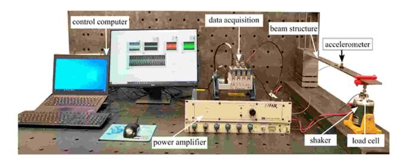
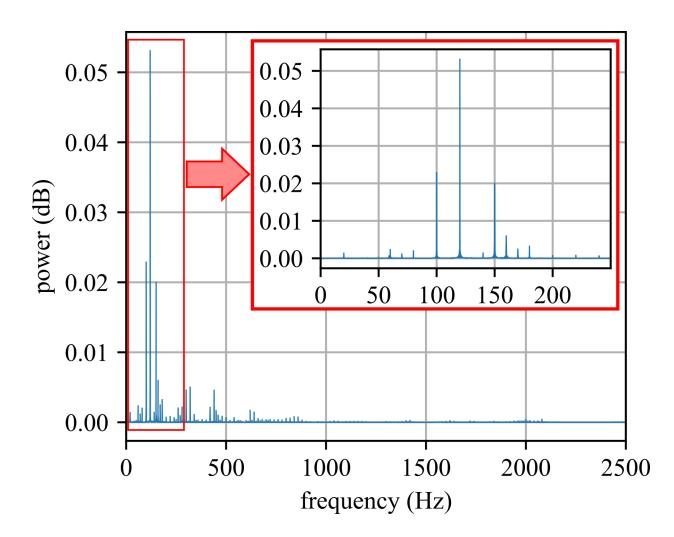
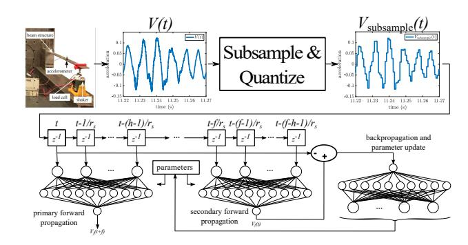
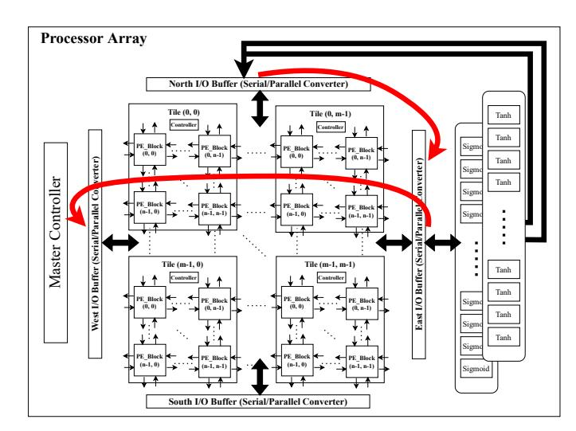
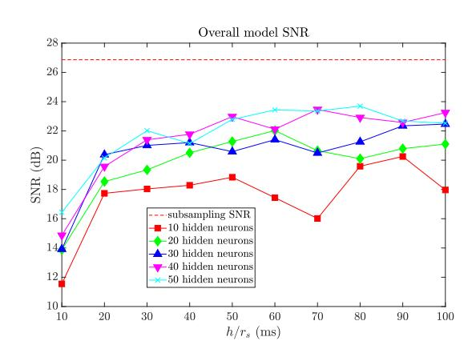
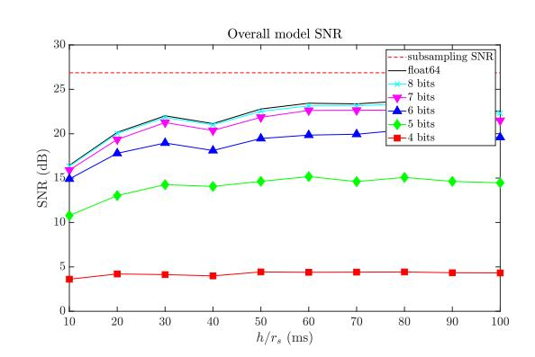
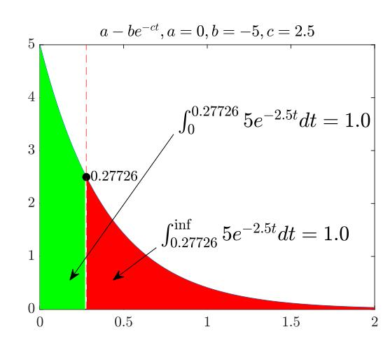
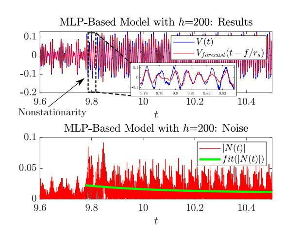
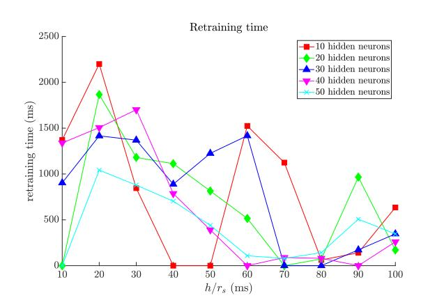
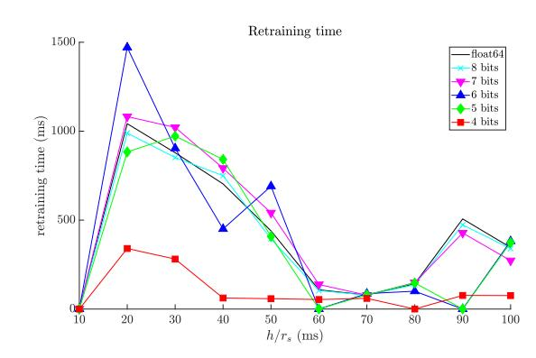

{0}------------------------------------------------

# High-Rate Machine Learning for Forecasting Time-Series Signals

Atiyehsadat Panahi\*, Ehsan Kabir\*, Austin Downey†, David Andrews\*, Miaoqing Huang\*, Jason D. Bakos‡

*Department of Computer Science and Computer Engineering*

\*University of Arkansas, §University of South Carolinaapanahi@uark.edu, ekabir@uark.edu, austindowney@sc.edu, dandrews@uark.edu, mhuang@uark.edu, jbakos@cse.sc.edu

*Abstract*—“Active structures” are physical structures that incorporate real-time monitoring and control. Examples include active vibration damping or blast mitigation systems. Evaluating physics-based models in real-time is generally not feasible for such systems having high-rate dynamics which require microsecond response times, but data-driven machine-learning-based models can potentially offer a solution. This paper compares the cost and performance of two FPGA-based implementations of real-time, continuously-trained models for forecasting time-series signals with non-stationarities, with one using High-Level Synthesis (HLS) and the other a programmable overlay architecture. The proposed model accepts a uni-variate vibration signal and seeks to forecast future samples to inform high-rate controllers. The proposed forecasting method performs two concurrent neural inference operations. One inference forecasts the state of the signal  $f$  samples into the future as a function of the most recent  $h$  samples, while the other forecasts the current sample given  $h$  samples starting from  $h + f - 1$  samples into the past. The first forecast produces the forecast while the second forecast allows the system to calculate the model’s loss and perform an immediate model update before the next sample period.

*Index Terms*—real-time learning, high-rate machine learning (HRML), neural network, multi-level perceptron, overlay, SIMD, high-level synthesis (HLS), control theory, high-rate dynamics, high-rate structural health monitoring

# I. INTRODUCTION

High-rate dynamic systems experience accelerations of high amplitude over durations of less than 100 ms. Examples include blast mitigation mechanisms, advanced hypersonic weaponry and vehicles, and adaptive airbag deployment systems. Monitoring high-rate systems requires state estimation capable of providing actionable information for preemptive measures in the sub-millisecond range [1], [2]. These systems typically exhibit 1) large uncertainties in the external loads, 2) high levels of non-stationarity and heavy disturbances, and 3) unmodeled dynamics generated from changes in the system's configuration [3].

The structural state (i.e., health) of a structure is encoded in its time-series vibration signal. Proper and timely knowledge on the state of a structure are important factors in providing closed-loop control of the structure. Changes to its state, either

from damage or changes in its environment, will result in changes to how the structure responds to an input that can be measured as changes in its measured vibration signal. The ability to maintain a continuously-updated vibration model has the potential to enable real-time decision-making at the  $\mu$ s timescale.

Among the many data-driven methods proposed for highrate system modeling, neural networks have shown promise in learning unknown, complex dynamics [4], [5]. The universal approximation capability of neural networks makes them a suitable candidate for modeling the complex behavior of highrate systems. Recurrent neural networks–specifically Long Short Term Memory (LSTM)–are generally preferred for modeling time-series sensor measurements [6]. However, recurrent neural networks require extremely long training times, making them unsuitable for real-time model updating.

In this paper, we propose an algorithmic approach for constructing a model that supports real-time learning of a uni-variate vibration signal that contains non-stationarities. The model uses two concurrent feed-forward neural networks whose inputs are read in parallel from two phases of a shared shift register that stores the most recent samples from an accelerometer. One of the feed-forward neural networks is used to forecast future samples while the other is used to calculate the forecast loss and enable real-time model updating using back-propagation and parameter update logic.

The model is evaluated using a data set consisting of a 20-second vibration signal collected in our lab [7]. The data set contains a non-stationarity (an unexpected change in the signal) at 9.775 s, where the signal changes as a result of an instantaneous change in the external excitation of the system being instrumented.

We evaluate the precision of the proposed model by computing the error between the original signal and the forecasted signal in terms of a signal-to-noise ratio. The sources of noise in the forecasted signal are from the quantization error, subsampling error, and model error. We also evaluate the model's "re-training time"; the time required for the model to reach its steady-state prediction accuracy after a nonstationarity event occurs.

We built and evaluated two implementations of our neural network-based model. The objective of both is to perform all the workload needed for both forward passes, the backward 978-1-6654-8332-2/22/\$31.00 ©2022 IEEE pass, and parameter update within one sample time of the

{1}------------------------------------------------

targeted sampling frequency. As the sample rate increases the latency between samples decreases, which imposes stricter real time schedules for both implementations.

The first implementation is a “pure custom” design expressed in Vivado HLS C++ code generated from our model compiler. The model compiler customizes the design for the required number of inputs (the  $h$  parameters), number of hidden neurons (the  $s$  parameter), and precision. Using this approach, all targeted model configurations met and far exceeded the real-time latency constraints.

The second implementation was based on an open source 2-D SIMD programmable processor array overlay [8]. The processor array contained 100 x 100 (10,000) processors. All eight models were compiled and run on the single overlay implementation. The use of both a custom implementation and an overlay allowed us to explore if the overlay could bridge the best of both worlds; allow all models to be compiled while still meeting all real time requirements. Results showed the real-time requirements using this overlay were met for seven of the eight models. The overlay did not meet the real time requirement for the most aggressive 20 KHz sample rate due to the size of the matrix-vector operations that required a divide and conquer approach to map large matrix-vector operations onto the array.

The remainder of this paper is organized as follows. Section 2 is a brief review of related work, Section 3 describes our test data set, Section 4 describes the proposed algorithm, Section 5 describes the HLS implementation of the HLS model, Section 6 describes the overlay implementation of the HLS model, Section 7 describes performance metrics, Section 8 lists the performance results, and Section 9 concludes the paper.

# II. RELATED WORK

Lindemann *et al.* discussed the applicability of the RNN, and specifically, the long short-term memory (LSTM) network in its ability to accurately predict nonlinear time-varying systems [9]. The authors found that LSTMs have excellent nonlinear and time-varying prediction capabilities and excel at multi-modal and multi-step ahead predictions.

In the high-rate realm, Salmela *et al.* designed an LSTM to accurately perform real-time predictions for nonlinear, high power pulse compression and broadband supercontinuum generation [10].

Barzegar *et al.* [11] parallelized multiple LSTM cells in an ensemble to perform multi-step ahead predictions for high-rate systems. The ensemble learning architecture allowed each LSTM to specialize over different temporal features identified in the input, yielding a leaned architecture and thus faster computation time, with a reported average computation time of 25  $\mu$ s per step. While these techniques showed particular promises, they typically did not yield actionable information, unless intensive pre-training was performed on labeled data.

Research on implementing various machine learning overlays has become popular to bring programmability and portability into the FPGA design [12]–[20]. The software programmability of overlays eliminates the HLS bottleneck of

Fig. 1. Experimental setup for collecting benchmark data set.

having to re-synthesize a custom design each time the ML algorithm is updated or when network parameters change within an existing design. Overlays achieve programmability and portability at the cost of increased resources and slower clock frequencies. We have further explored this by comparing our HLS-based design versus an existing ML accelerator overlay. The overlay reported in this work indicates that overlays are viable across ML applications and have comparable performance to custom designs.

# III. TEST DATA SET

Fig. 1 depicts the experimental setup used to obtain our test data set. A steel cantilever beam measuring  $759 \times 51 \times 5 \text{ mm}^3$  is utilized, and an electromagnetic shaker (model V203R from LDS) is used to drive a forced excitation into the beam. The electromagnetic shaker has a useful frequency range of 5-13,000 Hz and a peak sinusoidal force of 17.8 N, itself powered by a power amplifier (LDS model PA25E-CE). The excitation is initially comprised of frequencies of 100, 120, and 150 Hz. At the  $t=9.775 \text{ s}$  point, the 150 Hz component is dropped.

A single Integrated Electronics Piezo-Electric (IEPE) accelerometer (model J352C33 produced by PCB Piezotronics) is positioned near the beam's edge to measure the beam's response to the excitation. This accelerometer has a sensitivity of 100 mV/g with a frequency measurement range from 0.5 to 9 kHz. Using a 24-bit IEPE signal conditioner (NI-9234 developed by National Instruments), the sensor data is digitized. The accelerometer is 0.46 m from the fixed point of the cantilever beam to ensure that the sensor does not lie at a node or anti-node for the first 5 frequencies of the beam. This data is available in a public repository [21].

The spectrum of the measured signal is shown in Fig. 2. As shown in the Figure, the three excitation frequencies 100, 150, and 200 Hz are the most energetic, but there are several other components resulting from various aspects of the test bed. Our goal is to forecast all components of the signal from 0 to  $N/2$  Hz, where  $N$  is the chosen sampling frequency.

# IV. PROPOSED REAL-TIME FORECASTING MODEL

For the proposed forecasting models, the accelerometer is sampled at its native sample rate  $r$  and produces a discrete signal  $V(t)$ ,  $V(t - 1/r)$ ,  $V(t - 2/r)$ , .... In our current data set, the highest-power components are in the lower frequency bands, so we re-sample the signal to a rate  $r_s$ , ensuring that  $r_s$ 

{2}------------------------------------------------

Fig. 2. Spectrum of the data set (all samples, prior and after non-stationarity). Note the peaks at 100, 120, and 150 Hz.

is sufficient to capture the dynamics of interest (i.e. frequencies below  $r_s/2$ ). Since  $r_s$  may not be an integral factor of  $r$ , we use bilinear interpolation to synthesize this new signal,  $V_{\text{subsample}} = V(t)$ ,  $V(t - 1/r_s)$ ,  $V(t - 2/r_s)$ , ....

The proposed forecasting model accepts a set of the most recent samples and produces an estimate for a future sample. The model must learn the input signal in real-time and adapt to unexpected changes in the signal, with the adaptation time (“re-training time”) an optimization target.

In contrast to purely data-driven methods, frequency estimation is a common method for learning time-series data [22] but this approach requires a sampling window that matches the signal period. This is a significant weakness, because the signal period is generally not known in forecasting applications. Even if it is known, the sampling window comprises the minimum time needed to adapt to changes to the signal, causing unacceptably-long delays adapting to nonstationarities. For these reasons, utilizing the frequency domain is especially challenging in the sub-millisecond realm [23]. Scheppegrell *et al.* [24] and Yan *et al.* [25] examined the use of short-term Fourier transforms and other modal techniques and discussed challenges for applications in high rate machine learning for structural health monitoring.

# *A. MLP-Based Forecast Model*

Fig. 3 shows an overview of our proposed MLP based approach, in which  $V_{\text{subsample}}(t)$  is used to perform two concurrent inference operations. One inference forecasts the sample  $V_{\text{subsample}}(t + f/r_s)$ , the signal state  $f$  samples into the future given the prior  $h$  samples:  $V_{\text{subsample}}(t), V_{\text{subsample}}(t - 1/r_s), \dots, V_{\text{subsample}}(t - (h - 1)/r_s)$ .

Another instance of a forward pass using the same parameters (weights and biases) is deployed to perform continuous online model retraining. This second inference forecasts the current sample,  $V_{\text{subsample}}(t)$ , given  $h$  samples ending with the sample read  $f$  samples into the past,  $V_{\text{subsample}}(t -$ 

Fig. 3. Neural network-based approach for real-time learning and forecasting of time series data.

$$f/r_s), V_{\text{subsample}}(t - (f - 1)/r_s), \dots, V_{\text{subsample}}(t - (f - h - 1)/r_s).$$
The second inference allows the system to calculate the loss of the current model parameters. From this, a back-propagation calculates the gradients and from these the weights and biases for both forward passes are updated after every sample.

# V. HIGH-LEVEL SYNTHESIS IMPLEMENTATION

In this section we describe the design of the MLP-based forecast model. The core design is described in C++ and synthesized with Vivado HLS 2019.1.

# *A. Forward Passes*

Each of the two deployed forward passes are built as fully-connected multilayer perceptrons (MLP) with one hidden layer and linear activation functions. For  $h$  inputs and  $s$  hidden neurons, the forward pass performs the operation shown in eq. (1), where  $\vec{I}$  is a  $1 \times h$  vector,  $\mathbf{H}$  is an  $h \times s$  matrix,  $\vec{O}$  is a  $s \times 1$  vector (there is only one output neuron), and  $\vec{b}_h$  and  $\vec{b}_o$  are the  $1 \times s$  and  $1 \times 1$  hidden and output layer bias vectors, respectively.

$$V_f(t + f/r_s) = (\vec{I} \times \mathbf{H} + b_h) \times \vec{O} + b_o \quad (1)$$

Each forward pass can be realized as a single two-level nested loop, since each dot product produced in the hidden layer can be subsequently multiplied by a single entry in the output layer vector. The workload for this operation is  $h \times s$  multiply-accumulates and  $s + 1$  additions.

# *B. Back Propagation*

We compute the loss of the output neuron using mean squared error using the output of the secondary forward pass as shown in eq. (2). Note that the forecasted sample is  $f$  samples ahead of the current sample due to it being a forecast.

$$loss_{\text{output}} = \frac{(V_f(t - f/r_s) - V_{\text{subsample}}(t))^2}{2} \quad (2)$$

The gradient of the loss function with respect to each output neuron weight is computed as in eq. (3), where  $i$  corresponds to each of the  $s$  hidden neurons and  $N_i^{\text{hidden}}$  is the previous output of the hidden neuron  $i$ .

{3}------------------------------------------------

$$\frac{\partial loss_{\text{output}}}{W_i^{\text{out}}} = (V_f(t - f/r_s) - V_{\text{subsample}}(t)) \times W_i^{\text{out}} \quad (3)$$

The loop that calculates loss of each hidden neuron is unrolled completely and requires a third port to the output neuron weights, necessitating a third instance of the weight RAM. The workload for this operation is  $s+1$  multiples, which is small enough that we do not include it in our workload calculations.

### *C. Weight Update*

The output neuron weights are updated as shown in eq. (4). The loop that performs this update is pipelined.

$$W_{\text{out}}^i = W_{\text{out}}^i - \alpha \times V_f(t - f/r_s) \times N_i^{\text{hidden}} \quad (4)$$

The output bias is updated as shown in eq. (5). The workload for this operation is one multiply, which is small enough that we do not include it in our throughput calculations.

$$bias_{out} = bias_{out} - \alpha \times V_f(t - f/r_s) \quad (5)$$

Each hidden neuron input weight is updated as shown in eq. (6), where  $i$  is the neuron number and  $j$  is the input number. This loop is pipelined and its inner loop, which processes each neuron's input, is unrolled. As with the forward pass, the II of this loop is  $\lceil \frac{h}{1024} \rceil$ .

$$W_i^j = W_i^j - \alpha \times \text{gradient}(i) \times \text{input}_j \quad (6)$$

The hidden neuron bias is updated as shown in eq. (7). The workload for this operation is  $2 \times h \times s$  multiplies and  $h \times s$  additions, which is small enough that we do not include it in our throughput calculations.

$$bias_i = bias_i - \alpha \times gradient_i \quad (7)$$

# *D. Compiler*

We developed a tool that generates a C++-based description of the system as shown in Fig. 3 suitable for high level synthesis. The generated system is customized according to the following parameters, selected by the user:

- 1) *h*, the number of input samples for the inference operations
- 2)  $f$ , forecast time in samples
- 3) *s*, number of hidden neurons
- 4) datatype to be used for all inputs, weights, internal values, and the output (float or fixed point and its width in bits)

The generated C description includes a random normal initialization for all weights as well as the shift register needed to buffer inputs for both forward passes.

### VI. OVERLAY IMPLEMENTATION

The target user base of this real-time forecasting of time-series signals includes domain experts and software developers with no hardware design expertise. Additional considerations included reuse and portability issues of this real time forecasting accelerator. This broadened our research agenda from just determining if an FPGA based system could meet the real time requirements to encompass software programmable and portable solutions. The custom-designed accelerator verified the feasibility meeting the real time requirements on an FPGA under ideal conditions. This was then augmented with the investigation to determine if a portable and programmable accelerator would meet real time requirements and allow programmers to modify and port the accelerator across different application domains.

For this investigation, we started with the SPAR-2 customizable programmable SIMD Processor Array Overlay [8], [26]. A high level block diagram of the overlay is shown in Fig. 4. The array is composed of variable sized PE\_blocks. Each PE\_Block is a processor in memory architecture that tightly integrates bit-serial PEs with a BRAM. This allows all PE's to concurrently access data stored in each BRAM. The size of a PE\_block for this work was  $4 \times 4 = 16$  PEs per PE\_block. PE\_blocks are composed to form Tiles. Each Tile contained  $5 \times 5 = 25$  PE blocks. An array of  $5 \times 5$  Tiles formed the  $100 \times 100 = 10,000$  PEs processor array.

The 2-D processor array is connected to an I/O buffer on each *North-East-West-South* (*NEWS*) side. The I/O buffers include serial-to-parallel and parallel-to-serial cornerturn registers to translate between the bit-serial registers of the edge PEs and external parallel modules such as DRAM and the activation functions modules. These I/O buffers are also used to move data between the different edges of the 2-D processor array.

# *A. Modification for Back-Propagation*

The SPAR-2 array was designed for forward inferencing. The internal data paths and arithmetic logic units of the forward inference architecture within the 2-D processor array did not require modification to support back-propagation. A new *copy* instruction and sequence of Micro Operations ( $\mu$ ops) was added within the controller software to back-propagate data through the original data paths in the hidden layers. These modifications were all that were required to enable back-propagation through the original 2-D processor array. However, initial benchmarking pointed to the need for two additional data path connections to be added between the I/O buffers and the PEs to reduce the overhead time of data transfers during back-propagation. The first data path added enabled the processor array to directly move data from the first row of PEs to the last column of PEs. The second data path was added to directly move data from the last column of PEs to the first column of PEs. These connections eliminated the overhead of moving data from one end of the array to the other through a series of step-by-step *Move* instructions between nearest-neighbor PEs across the width of the array.

{4}------------------------------------------------

Fig. 4. Processor Array Overlay Design [26]These additional connections are shown using the red arrows in Fig. 4.

The additional resource added for back-propagation resulted in a 24.4% increase in Look-up Tables (LUTs) and 9.3% increase in Flip-Flops (FFs) on the Virtex UltraScale+ VU9P FPGA.

# VII. PERFORMANCE METRICS

In the proposed system there are four performance metrics: 1) *Forecast accuracy*: A model's forecast accuracy depends on its number of model inputs ( $h$ ), number of hidden neurons, data type, and subsample rate ( $r_s$ ).

We measure forecast accuracy as shown in eqs. (8) and (9) where  $ZOH(\cdot)$  is the zero order hold, used to convert the forecasted signal back to the data set's original sample rate. SNR is the ratio of original signal power to the power of the noise, which is the difference between the original signal and the forecasted signal in the data set's original sample rate. A portion of the noise is caused by the subsampling and quantization of the original input signal and the remaining portion is caused by the model's forecast error.

As shown in eq. (8), the model forecasts the future state of the signal and the forecasted signal must be appropriately phase-shifted by  $f/r_s$  relative to the original signal before computing the difference.

$$N(t) = \text{ZOH}(V_{\text{forecast}}(t - f/r_s)) - V(t) \quad (8)$$

$$\text{SNR}_{\text{db}} = \log_{10} \frac{rms(V(t))^2}{rms(N(t))^2} \times 20 \quad (9)$$

Fig. 5 plots the SNR for 50 different MLP-based model configurations with  $s_r = 2500 \text{ Hz}$ ,  $f = 50$  (20 ms), and while sweeping  $h \in 25, 50, \dots, 250$ , and sweeping the number of hidden neurons  $s \in 10, 20, \dots, 50$ .

At  $s_r = 2500$  Hz, the subsampled signal SNR is 26.9 dB, which comprises the upper bound for forecast accuracy.

Fig. 5. Signal-to-noise ratio of MLP-based model versus input size  $h$ ; for 10 to 50 hidden neurons, learning rate 0.1, and double precision floating point.

Fig. 6. Signal-to-noise ratio of MLP-based model versus input size  $h$ ; 50 hidden neurons, learning rate 0.1, and 4- to 8-bit fixed point and double-precision floating point.

Networks with 20 to 50 hidden neurons achieve roughly the same accuracy. Accuracy improves with increased values of  $h$  but with an approximate point of diminishing returns at  $h = 100$  (or  $100/2500 = 40$  ms). Note that the period of the three summed excitation signals, 100 Hz, 120 Hz, and 150 Hz, is 100 ms ( $\text{lcm}(\frac{1}{100}, \frac{1}{120}, \frac{1}{150}) = \frac{1}{10} = 100$  ms), which corresponds to window size needed if the forecaster based its predictions on a replay of the most recent period.

Fig. 6 plots the SNR for 60 MLP-based model configurations for sample rate  $s_r = 2500\text{Hz}$ ,  $f = 50$  (20 ms),  $h \in 25, 50, \dots, 250$ , hidden neurons  $s = 50$ , and using 4 to 8-bit fixed point as well as double precision floating point as a point of comparison. As shown, 7- and 8-bit configurations perform nearly as well as double precision floating point. For this reason we target 8-bit precision on our hardware deployments.

**2) *Retraining time*:** The forecast model architecture performs continuous online retraining, allowing for the model to adapt to nonstationarities in the signal for which it is forecasting. Our results report the retraining time for the nonstationarity that occurs at  $t = 9.775$  s by fitting the absolute noise signal to an exponential curve, as shown in Fig. 7

The noise signal and fitted exponential function are shown

{5}------------------------------------------------

An

example fitted error curve showing the center of gravity, which is the point at which we consider the error to have stabilized after retraining the network in response to a nonstationarity. In this example, the total area under the curve is 2.0, and the point  $x = 0.27726$  evenly divides both halves.

in eq. (10) and eq. (11). After fitting, the fitted value of  $c$  corresponds to the error floor,  $a+b$  corresponds to the decrease in error between the point of the nonstationarity and when the model re-converges onto a trained state, and the fitted value of  $c$  corresponds to the error decay rate (i.e. learning rate).

In order to estimate the time needed for the model to retrain after a nonstationarity, we compute the “center of gravity” of the fitted error; specifically the point on the x-axis where the area to the left of that point under the fitted error curve equals that of the area under the curve to the right, as shown in Fig. 2. To compute the center of gravity, we first adjust the noise curve by subtracting the noise floor  $a$  and then solve for the value of  $m$ , which divides the area under the adjusted noise curve in half, as shown in eq. (12)-eq. (14).

Retraining time widely varies depending on the model configuration and learning rate, but when measured with the method described above, it generally scales down with the value of  $h$  to a minimal value of less than 1000 sample periods.

$$|N(t)| = \sqrt{N(t)^2} \quad (10)$$

$$N_{fit}(t) = fit(|N(t)|) = a - be^{-ct}, \text{ where } a > 0, b < 0, c > 0 \quad (11)$$

$$\int_0^m (a - be^{-ct} - a) dt = \int_m^{\inf} (a - be^{-ct} - a) dt \quad (12)$$

$$\frac{b}{c}e^{-ct} \bigg|_0^m = \frac{b}{c}e^{-ct} \bigg|_m^{\inf} \quad (13)$$

$$m = -\frac{\ln \frac{1}{2}}{c} \quad (14)$$

Fig. 7. Retraining time for 2500 Hz signal with  $h=200$ .

Fig. 8. Retraining time versus input size  $h$ ; 50 hidden neurons, learning rate 0.1, and 4- to 8-bit fixed point and double-precision floating point.

Fig. 8 plots the retraining time vs input size for 50 different MLP-based model configurations for sample rate  $s_r = 2500Hz$ ,  $f = 50$  (20 ms),  $h \in 25, 50, \dots, 250$ , hidden neurons  $s \in 10, 20, \dots, 50$ , and learning rate  $= 0.1$ . Retraining time generally improves with  $h$  and there is no obvious trend in retraining time as the number of hidden neurons is varied.

Fig. 9 plots the retraining time vs input size for 4- to 8-bit fixed-point and double precision floating point for 50 hidden neurons and learning rate of 0.1. Precision appears to have negligible effect for models having  $h/r_s \geq 50$  ms.

3) **Forecast latency:** All forecasts must be performed within the sample time of the subsampled input signal for the system to meet its real-time constraint. Forecast latencies for both architectures are reported below. We attempt to minimize forecast time to maximize the amount of slack available for other application-level requirements, such as evaluating controller transfer functions or computing objective scores for potential controller decisions.

**4) *Deployment cost:*** The proposed framework includes a compiler that lowers the MLP based models into a low level description suitable for conversion to hardware using a high-

{6}------------------------------------------------

Fig. 9. Retraining time versus input size  $h$ ; 50 hidden neurons, learning rate 0.1, and 4- to 8-bit fixed point and double-precision floating point.

level synthesis compiler. The cost of the deployed hardware is FPGA real estate and power consumption. We report these costs below.

The model re-training time can be computed as the first moment of  $N_{fit}(t)$  after adjusting its baseline to 0 by subtracting the error floor  $a$ , as shown in eq. (12)-eq. (14).

# VIII. PERFORMANCE RESULTS

Table I examines eight example models, each having  $s$  specified sample rate ( $r_s$ ) of 2500 Hz to 20 KHz and history size ( $h$ ) of 80 ms to 176 ms, with all models have 50 hidden neurons ( $s$ ).

For each sample rate, the subsampled signal's accuracy relative to the original signal is reported as the "subsample SNR". This value comprises the upper bound for the forecast accuracy.

We simulated the real-time training of each model and reported its overall accuracy of each model are is reported as “end-to-end SNR  $t > 9.775$ ” and are evaluated for forecasts made after the nonstationarity at  $t = 9.775$ .

The rightmost four columns give the minimum performance requirements of a deployed model to meet the real-time constraint. The column labeled “real-time constraint” is the period of the corresponding sample rate and the upper limit for the latency of the model. The column labeled “workload” gives the total operations required per sample. The rightmost two columns give the minimum sustained throughput and memory bandwidth to meet the real-time performance constraint.

# *A. MLP Deployment Results for HLS*

The HLS implementation of the model is comprised of five loops:

- 1) forward pass 1: the first forward pass loop (two level nest), shown in eq. (1)
- 2) forward pass 2: the second forward pass loop (two level nest), shown in eq. (1)
- 3) back propagation: the back propagation loop (one level nest), shown in eq. (3)
- 4) the output neuron weight loop (one level nest) and bias update, shown in eq. (4), eq. (5)

- 5) weight update: the hidden layer weight update loop (two level nest), and bias update loop (one level nest), shown in eq. (6), eq. (7)

These loops are dependant and are performed serially. The single level loops are all unrolled completely. The cycles required for the three remaining pipelined two-level loops are shown in eq. (15).

$$\begin{aligned} II_{\text{forward pass } 1} \times s + II_{\text{forward pass } 1} + \\ II_{\text{forward pass } 2} \times s + II_{\text{forward pass } 2} + \\ II_{\text{weight update}} \times s + II_{\text{weight update}} \end{aligned} \quad (15)$$

Pipelining the outer loop of the three nested loops causes the inner loop to be unrolled completely, which in this case has  $h$  iterations. This inner loop, if it were to be executed with a throughput of one iteration per cycle (ideally), would require parallel access to the inputs and  $h$  BRAM banks. The number of BRAM banks is limited to 1024 (the maximum supported by Vivado HLS 2019.1), which forces the iteration interval (II) of the outer loop to be  $\lceil \frac{h}{1024} \rceil$ . This loop uses only one port of each BRAM, with other port used for concurrent weight update. Since there are two forward passes sharing the same weights, we must duplicate the weight memory to allow each forward pass one read port and the weight update logic to have one write port.

We synthesized several configurations of the MLP-based model on the Xilinx Virtex UltraScale+ (xcvu9p-flgb2104-2-i). The results are shown in Table II. Each of the configurations beyond the first row achieve equivalent throughout of approximately 150 operations per cycle, with the latency requirement being linear with the relationship  $0.0047 \times h \mu\text{s}$ .

# *B. MLP Deployment Results for Overlay*

Table III shows the latencies and resource utilization for the overlay. All benchmarks were run on the  $100 \times 100$  (10k) PE processor array shown by the single listing for resource utilization in Table III. The latencies for the processor array are reported for an achieved clock frequency of 330 MHz. The objective of the processor in memory architecture is to operate at the maximum frequency of the BRAMs ( 450 MHz). Two critical paths limit the achieved clock frequency. The first was the delay when reading data out of the BRAMs and passing through the bit-serial ALUs. The second resulted from large fanouts of control signals issued by the centralized Finite State Machine (FSM) controller to the 10,000 bit-serial PE's. As an example, the op\_code was fanned out from the controller to approximately 625 blocks of PEs. The data paths between BRAMs and PEs were redesigned and fanouts reduced by intermediate registering of signals. These two optimizations allowed the design to be clocked at 400 MHz, nearing the limit set by the BRAMs. However these modifications have not been fully tested for the  $100 \times 100$  processor array used and were not used for comparisons. Interestingly a 400 MHz clock could would not have significantly altered the results.

The results shown in Table III show that the higher 400 MHz clock frequency would provide more slack for the seven of

{7}------------------------------------------------

TABLE I  
ANALYTICAL RESULTS FOR SELECTED MLP MODELS (HIDDEN NEURONS = 50, LEARNING RATE = 0.1, DOUBLE PRECISION FLOATING-POINT)

| Subsample rate; r (Hz) | s Subsample SNR w/ZOH (dB) | History size; (samples) | h History size (ms) | End-to-end SNR ( t > 9 775 (dB) | ) Real-time constraint; 1 /r s ( µ s) | Workload/sample (Multiples and adds) | Required sustained throughput (Gops/s) | Required sustained memory b/w (GB/s) |
|------------------------|----------------------------|-------------------------|---------------------|---------------------------------|---------------------------------------|--------------------------------------|----------------------------------------|--------------------------------------|
| 2500                   | 26.9                       | 200                     | 80                  | 24.4                            | 400                                   | 70604                                | 0.2                                    | 0.07                                 |
| 5000                   | 37.7                       | 700                     | 140                 | 32.9                            | 200                                   | 245604                               | 1.2                                    | 0.49                                 |
| 7500                   | 42.9                       | 1100                    | 147                 | 39.4                            | 133                                   | 385604                               | 2.9                                    | 1.15                                 |
| 10000                  | 46.8                       | 1300                    | 130                 | 42.1                            | 100                                   | 455604                               | 4.6                                    | 1.82                                 |
| 12500                  | 48.9                       | 2200                    | 176                 | 46.8                            | 80                                    | 770604                               | 9.6                                    | 3.84                                 |
| 15000                  | 50.7                       | 2200                    | 147                 | 48.9                            | 67                                    | 770604                               | 11.6                                   | 4.61                                 |
| 17500                  | 52.1                       | 2200                    | 126                 | 50.1                            | 57                                    | 770604                               | 13.5                                   | 5.38                                 |
| 20000                  | 54.1                       | 3200                    | 160                 | 46.6                            | 50                                    | 1120604                              | 22.4                                   | 8.94                                 |

TABLE II  
HIGH LEVEL SYNTHESIS RESULTS (8-BIT FXP, 484 MHz, VIRTEX ULTRASCALE+ VU9P,  $f=50$ ,  $s=50$ , AND MIN(1024, $h$ ) MEMORY BANKS

| History size; (samples) | h Total latency (cycles) | Workload/sample (Multiplies and | Effective adds) ops/cycle | Fmax (MHz) | Effective throughput (Gop/s) | Effective memory b/w (GB/s) | Latency µs | BRAM (%) | DSP (%) | LUTs (%) |
|-------------------------|--------------------------|---------------------------------|---------------------------|------------|------------------------------|-----------------------------|------------|----------|---------|----------|
| 200                     | 581                      | 70604                           | 122                       | 474        | 58                           | 22.9                        | 1.2        | 4        | 3       | 8        |
| 700                     | 1630                     | 245604                          | 151                       | 484        | 73                           | 29.1                        | 3.4        | 16       | 10      | 24       |
| 1100                    | 2580                     | 385604                          | 149                       | 484        | 72                           | 28.9                        | 5.3        | 23       | 14      | 39       |
| 1300                    | 2980                     | 455604                          | 153                       | 484        | 74                           | 29.5                        | 6.2        | 23       | 14      | 49       |
| 2200                    | 4911                     | 770604                          | 157                       | 484        | 76                           | 30.3                        | 10.1       | 23       | 14      | 70       |
| 2200                    | 4911                     | 770604                          | 157                       | 484        | 76                           | 30.3                        | 10.1       | 23       | 14      | 70       |
| 2200                    | 4911                     | 770604                          | 157                       | 484        | 76                           | 30.3                        | 10.1       | 23       | 14      | 70       |
| 3200                    | 7335                     | 1120604                         | 153                       | 484        | 74                           | 29.5                        | 15.2       | 23       | 14      | 95       |

TABLE III  
PROCESSOR ARRAY OVERLAY RESULTS (8-BIT FXP, 330 MHz, VIRTEX ULTRASCALE+ VU9P)

| MLP history size (h) | Forward Latency ( $\mu$ s) | Backward Latency ( $\mu$ s) | Manual Instruction |      |       |        | Resource Utilization *** |       |       | Number of PEs |
|----------------------|----------------------------|-----------------------------|--------------------|------|-------|--------|--------------------------|-------|-------|---------------|
|                      |                            |                             | ADD                | SUB  | MULT  | MOVE   | LUTs                     | FFs   | BRAMs |               |
| 200                  | 5.25                       | 4.55                        | 36+7               | 0    | 3+9   | 117+74 |                          |       |       |               |
| 700                  | 13.4                       | 7.4                         | 91+12              | 0+11 | 32+9  | 197+74 |                          |       |       |               |
| 1100                 | 19.29                      | 9.95                        | 138+16             | 0+15 | 12+27 | 408+83 | 61322                    | 83659 | 625   | 0             |
| 1300                 | 23.56                      | 11.15                       | 184+18             | 0+17 | 14+31 | 474+85 |                          |       |       |               |
| 2200                 | 36.45                      | 16.55                       | 236+27             | 0+16 | 23+49 | 617+94 |                          |       |       |               |
| 3200                 | 73.89                      | 22.55                       | 284+37             | 0+36 | 33+69 | 512+80 |                          |       |       |               |

\* For training, each epoch's latency is the sum of one forward and one backward iteration.

\*\*\* All MLP networks are run on the same processor array and therefore have the same resource utilization.

eight benchmarks that already met the real time requirements and narrowly reduce the gap between the overlay and the custom design. However, the higher clock frequency would still not be sufficient to allow the overlay to meet the real time requirements for the last benchmark. Scaling the results for 400 MHz would yield a latency of 79.5  $\mu$ s, well short of the 50  $\mu$ s real time constraint. Processor array architectures reduce latency through concurrent execution of the matrix-vector operations. The large history size of the biggest MLP networks prevent all matrix-vector operations to be concurrently executed in the  $100 \times 100 = 10k$  PEs. A classic divide-and-conquer approach was employed to partition the matrices/vectors into multiple sub-matrices/sub-vectors such that they fit into the array. For example, history sizes of 2200 and 3200 samples required 22 and 32 submatrices respectively to be sequentially processed on the  $100 \times 100$  PE array. Sufficient BRAM storage was available to store all 8-bit weights on-chip for the complete matrices.

# IX. CONCLUSIONS AND FUTURE WORK

In this paper we presented a Multilayer Perception (MLP)-based approach for real-time forecasting and learning of univariate time-series data. A custom High-Level Synthesis (HLS) and programmable overlay design were developed to implement the MLP based approach.

Performance comparisons between the HLS and overlay implementations of the MLP yielded expected performance versus productivity tradeoffs between customization and generalization. The HLS design exceeded all real-time requirements but required each model to be redesigned and synthesized.

The overlay incurred longer latencies than the custom designs in all cases but did met real time requirements for seven out of eight models. The performance of the largest and most challenging models were degraded due to the need to divide and conquer the matrix-vector operations on the 100 x 100 PE array.

{8}------------------------------------------------

- REFERENCES [1] J. Dodson, B. Joyce, J. Hong, S. Laflamme, J. Wolfson, Microsecond state monitoring of nonlinear time-varying dynamic systems, in: Volume 2: Modeling, Simulation and Control of Adaptive Systems; Integrated System Design and Implementation; Structural Health Monitoring, American Society of Mechanical Engineers, 2017. doi:10.1115/smasis2017-3999. [2] J. Dodson, A. Downey, S. Laflamme, M. D. Todd, A. G. Moura, Y. Wang, Z. Mao, P. Avitabile, E. Blasch, High-rate structural health monitoring and prognostics: An overview (2021) 213– 217doi:10.1007/978-3-030-76004-5 23. [3] J. Hong, S. Laflamme, J. Dodson, B. Joyce, Introduction to state estimation of high-rate system dynamics, Sensors 18 (2) (2018) 217. doi:10.3390/s18010217. [4] L. Cheng, Z. Wang, F. Jiang, J. Li, Adaptive neural network control of nonlinear systems with unknown dynamics, Advances in Space Research 67 (3) (2021) 1114–1123. doi:10.1016/j.asr.2020.10.052. [5] A. A. Kaptanoglu, J. L. Callaham, A. Aravkin, C. J. Hansen, S. L. Brunton, Promoting global stability in data-driven models of quadratic nonlinear dynamics, Physical Review Fluids 6 (9) (2021) 094401. doi:10.1103/physrevfluids.6.094401. [6] A. D. Santo, A. Galli, M. Gravina, V. Moscato, G. Sperli, Deep learning for HDD health assessment: An application based on LSTM, IEEE Transactions on Computers 71 (1) (2022) 69–80. doi:10.1109/tc.2020.3042053. [7] P. Chowdhury, A. Downey, J. D. Bakos, P. Conrad, Dataset-4-univariatesignal-with-non-stationarity (Apr. 2021). URL https://github.com/High-Rate-SHM-Working-Group/ Dataset-4-Univariate-signal-with-non-stationarity [8] S. Basalama, A. Panahi, A.-T. Ishimwe, D. Andrews, Spar-2: A simd processor array for machine learning in iot devices, in: 2020 3rd International Conference on Data Intelligence and Security (ICDIS), 2020, pp. 141–147. doi:10.1109/ICDIS50059.2020.00025. [9] B. Lindemann, T. Muller, H. Vietz, N. Jazdi, M. Weyrich, A survey on ¨ long short-term memory networks for time series prediction, Procedia CIRP 99 (2021) 650–655. doi:10.1016/j.procir.2021.03.088. [10] L. Salmela, N. Tsipinakis, A. Foi, C. Billet, J. M. Dudley, G. Genty, Predicting ultrafast nonlinear dynamics in fibre optics with a recurrent neural network (Apr. 2020). arXiv:2004.14126. [11] V. Barzegar, S. Laflamme, C. Hu, J. Dodson, Ensemble of recurrent neural networks with long short-term memory cells for high-rate structural health monitoring, Mechanical Systems and Signal Processing 164 (2022) 108201. doi:10.1016/j.ymssp.2021.108201. [12] S. M. Abdelfattah, D. Han, A. B. R. DiCecco, S. O'Connell, N. Shanker,
- J. C. et al, Dla: Compiler and fpga overlay for neural network inference acceleration, 28th International Conference on Field Programmable Logic and Applications (FPL) (2018) 411–417. [13] Y. Yu, C. Wu, T. Zhao, K. Wang, L. He, Opu: An fpga-based overlay processor for convolutional neural networks, IEEE Transactions on Very Large Scale Integration (VLSI) Systems (2019). [14] Y. Yu, T. Zhao, K. Wang, L. He, Light-opu: An fpga-based overlay processor for lightweight convolutional neural networks, In The 2020 ACM/SIGDA International Symposium on Field-Programmable Gate Arrays (2020) 122–132. [15] A. M. Abdelsalam, F. Boulet, G. Demers, J. P. Langlois, F. Cheriet, An efficient fpga-based overlay inference architecture for fully connected dnns, In 2018 International Conference on ReConFigurable Computing and FPGAs (ReConFig) (2018) 1–6. [16] Z. Aklah, D. Andrews, A flexible multilayer perceptron co-processor for fpgas, In Proceedings of the 11th International Symposium on Applied Reconfigurable Computing, Bochum, Germany (2015). [17] X. Zhang, J. Wang, C. Zhu, Y. Lin, J. Xiong, W. mei Hwu, D. Chen, Dnnbuilder: an automated tool for building high-performance dnn hardware accelerators for fpgas, In 2018 IEEE/ACM International Conference on Computer-Aided Design (ICCAD) (2018) 1–8. [18] Y. Guan, H. Liang, N. Xu, W. Wang, S. Shi, X. Chen, G. Sun,
- W. Zhang, J. Cong, Fp-dnn: An automated framework for mapping deep neural networks onto fpgas with rtl-hls hybrid templates, In 2017 IEEE 25th Annual International Symposium on Field-Programmable Custom Computing Machines (FCCM) (2017) 152–159. [19] C. Zhang, G. Sun, Z. Fang, P. Zhou, P. Pan, J. Cong, Caffeine: Toward uniformed representation and acceleration for deep convolutional neural networks, IEEE Transactions on Computer-Aided Design of Integrated Circuits and Systems 38 (2018) 2072–2085. [20] D. H. Noronha, R. Zhao, Z. Que, J. Goeders, W. Luk, S. Wilton, An overlay for rapid fpga debug of machine learning applications, In 2019 International Conference on Field-Programmable Technology (ICFPT) (2019) 135–143. [21] H. R. S. W. Group, Dataset-4 univariate signal with nonstationarity, https://github.com/High-Rate-SHM-Working-Group/Dataset-4- Univariate-signal-with-non-stationarity. [22] P. Inci, C. Goksu, E. Tore, A. Ilki, Effects of seismic damage and retrofitting on a full-scale substandard RC buildingambient vibration tests, Journal of Earthquake Engineering (2021) 1– 28doi:10.1080/13632469.2021.1887009. [23] D. Zografos, M. Ghandhari, R. Eriksson, Real time frequency response assessment using regression, in: 2020 IEEE PES Innovative Smart Grid Technologies Europe (ISGT-Europe), IEEE, 2020. doi:10.1109/isgteurope47291.2020.9248783. [24] J. Scheppegrell, A. G. Moura, J. Dodson, A. Downey, Optimization of rapid state estimation in structures subjected to high-rate boundary change, in: ASME 2020 Conference on Smart Materials, Adaptive Structures and Intelligent Systems, American Society of Mechanical Engineers, 2020. doi:10.1115/smasis2020-2306. [25] J. Yan, S. Laflamme, P. Singh, A. Sadhu, J. Dodson, A comparison of time-frequency methods for real-time application to high-rate dynamic systems, Vibration 3 (3) (2020) 204–216. doi:10.3390/vibration3030016. [26] A. Panahi, S. Balsalama, A.-T. Ishimwe, J. M. Mbongue, D. Andrews, A customizable domain-specific memory-centric fpga overlay for machine learning applications, in: 2021 31st International Conference on Field-Programmable Logic and Applications (FPL), 2021, pp. 24–27. doi:10.1109/FPL53798.2021.00012.