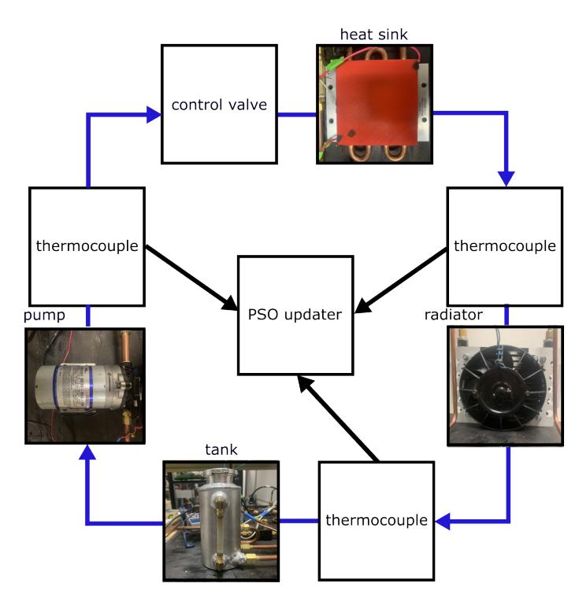
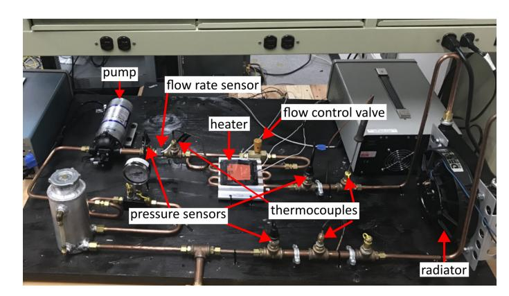
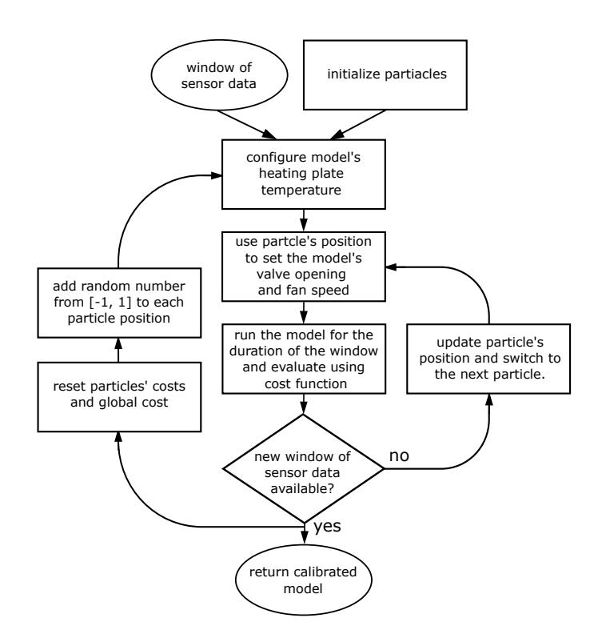
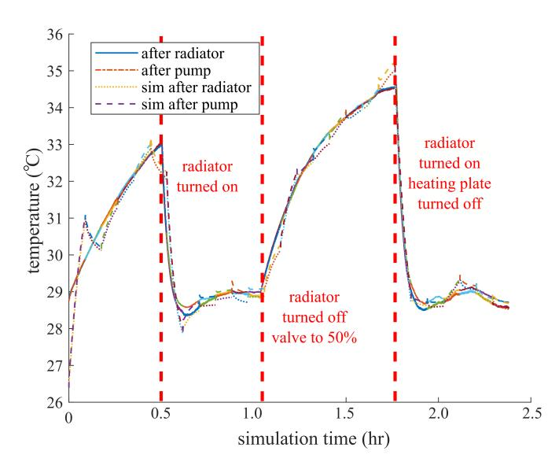
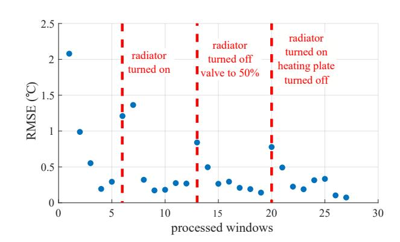
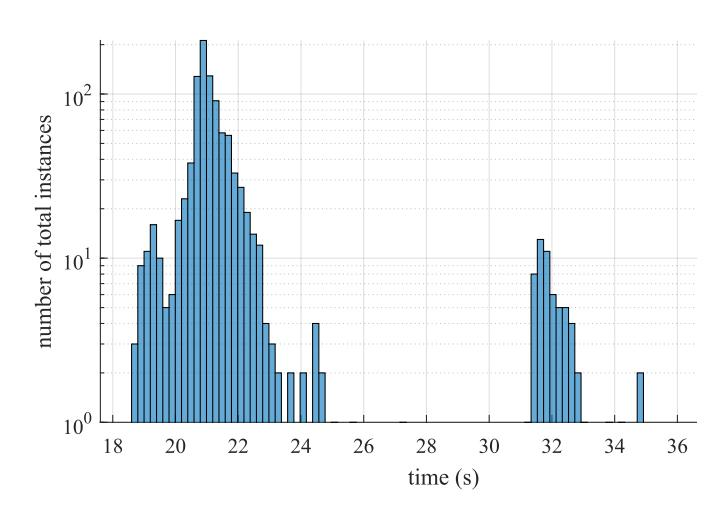

{0}------------------------------------------------

**IDETC2024-141697**

# **REAL-TIME THERMAL DATA ASSIMILATION FOR POWER ELECTRONICS AT THE EDGE**

**Braden Priddy1 , Richard Hainey1 , Tyler Deese2 , Austin R.J. Downey1,3**∗ **, Jamil Khan1 , Herbert L. Ginn2**

1University of South Carolina Dept. of Mechanical Engineering, Columbia, SC

2University of South Carolina Dept. of Electrical Engineering, Columbia, SC

3University of South Carolina Dept. of Civil Engineering, Columbia, SC

# **ABSTRACT**

*Physical systems are often far too complex for a virtual model to fully encapsulate the behavior of a system. Requiring the user to fine tune parameters of the virtual model over the course of a system's life cycle. Data assimilation addresses this problem by continuously updating the model with sensor data to construct a personalized model of the physical system. This personalized model is known as a digital twin. Digital twins of ship systems can provide insight into the future state of the ship to enable operators to make informed decisions to increase health of the ship. However, there are a few key challenges that need to be overcome while updating a model. The first problem is reducing latency between the physical system and the digital twin. While ensuring that the digital twin has enough time and data to update. The second problem is verifying the model is an accurate representation of the physical system. This paper proposes a methodology that uses real-time sensor data and a particle swarm optimization algorithm to update model parameters for an instrumented thermal loop developed as a stand-in for liquid-cooled power electronics. The swarm of particles represent different configurations of a multi-domain model that constitutes the digital twin of the thermal loop. All computations are done on the edge to emulate a real world system. Results demonstrate that the particle swarm algorithm can reliably update a digital twin of the thermal loop as external changes are made to the system (radiator turned on and off) with a root mean squared error of under 0.35* ◦*C over the whole system. All models are updated in real-time with a maximum compute time of 38.4 s; demonstrating the proposed methodologies applicability for real-time data assimilation within a digital-twin framework.*

**Keywords: digital twin, particle swarm optimization, edge computing, data assimilation, thermal modeling**

\*Address all correspondence to this author.

# **1. INTRODUCTION**

Model-driven solutions play a critical role in the development of next generation autonomous and semi-autonomous naval systems. Digital twins are one tool investigated by researchers to link physical and virtual spaces [\[1\]](#page-4-0). By using knowledge of the physical system and processing real-time (online) sensor data, digital twins can increase the efficiency of a system while providing the operator/user an accurate representation of the system. One of the main benefits of having a digital twin is its look ahead capabilities [\[2\]](#page-4-1). With the ability to accurately predict the behavior of a system, a user can make informed changes to the system [\[3\]](#page-4-2). However, problems arise as the physical system ages or changes over its life cycle and the model is no longer an accurate representation of the system. To overcome this challenge, the model's parameters must be continuously updated to ensure that the model is an accurate representation of the physical system.

Real-time model updating is a cornerstone of digital twin technologies and has been demonstrated by various researchers [\[4\]](#page-4-3). For example, researchers have used the particle swarm optimization algorithm for quick and easy parameter estimation of a resistance capacitance (RC) thermal model. The results demonstrate the approximation of RC parameters by the particle swarm optimization method took only 1.8 s to 10 minutes, depending on the resistance capacitance configuration, and a model estimation error of +1.2 ◦C the junction temperature in the steady state. Additionally, the script was able to be used by staff with low technical qualification, allowing anyone to update the models thermal properties [\[5\]](#page-4-4). Other researchers have taken advantage of particle swarm optimization method and implemented the algorithm into real-time model updating. The particle swarm optimization algorithm has been implemented into a bridge's structural health monitoring system. The group created a finite element model of a large composite plate composed of several materials working together to support a bridge. They demonstrated that the particle swarm optimization can be used to update parameters in real time of the finite element model. By updating this model

{1}------------------------------------------------

continuously, a digital twin of the composite plate structure was created. When the base finite element model was compared to the model tuned by particle swarm optimization, the error between the simulation and experimental data was reduced from 7.67% to 0.12%. The increase in model accuracy will aid in predicting the deterioration of the structure [\[6\]](#page-4-5). Moreover, the particle swarm optimization algorithm has a low computational cost, making it desirable when dealing with real-time constraints. This idea is explored further in research done on the system health monitoring on naval ship structures. Where a mixture of physics-based and data-driven models utilize the particle swarm optimization algorithm to identify the probability of failure in a cantilever beam. A variety of different particle swarm optimization hyper-parameters were explored to find the global minimum while also considering real-time constraints [\[7\]](#page-4-6). The development of real-time model updating will aid the management of next-generation structures and systems.

All the previously mentioned examples utilized particle swarm optimization as the parameter updating technique. Particle swarm optimization is a meta-heuristic algorithm that utilizes simple mathematical rules to minimize error of a given costfunction. In a study comparing the most popular meta-heuristic algorithms, differential evolution and particle swarm optimization had the lowest costs on 30 different benchmark tests. While differential evolution did get closer to the global minimum than particle swarm optimization, it did it much slower [\[8\]](#page-5-0). In the context of real-time model updating particle swarm optimization is the best option. For this reason it was chosen as the parameter updating algorithm in this work.

In this work, a digital twin of a liquid cooled thermal loop intended to mimic that used to cool a power converter in an electric ship application was developed. The digital twin was represented by a physics-based model being updated continuously in real-time on a edge computing device. Particle swarm optimization is used to select the candidate model parameters for testing. The physical system for this study is a recirculating liquid thermal loop cooling a simulated electrical load; where an air-cooled radiator serves as the final heat sink. The loop is instrumented with thermocouples, flow sensors, and pressure sensors for data collection. To initiate changes in the experiment, the radiator fan speed and the liquid flow valve were adjusted during runtime. The digital twin in this work consists of a physics-based model of the experiment that is updated in real-time using an error-minimization technique. All computations are done on an Windows edge-computing device with a Intel i5-7200U processor collecting data from the physical experiment in real-time.

While the collection of data happens continuously, the particle swarm algorithm updates the model using a sliding window. Here, the particle swarm optimization algorithm waits for a designated amount of time. The time-series data collected during this time is known as a window. The particles then attempt to fit the outputs of the physics-based model to the acquired window, until a new window is collected. The selection of an appropriate data window length is important.If the window is too small, the particles may not have sufficient time to find the global minimum in the search-space, thus producing a digital twin that never fully converges. Conversely, a large window will increase latency between the physical system and the digital twin. Rendering the model useless to the user, especially in highly dynamic systems. A key challenge in this work is ensuring that the updated model is accurate and represents the current behavior of the system (the thermal loop). If the model is not an accurate representation of the system, no optimizer will be able to fit a digital twin to the physical system.

The contributions of this work are two-fold, first a numerical approach for the updating of thermal models within a digital twin for power electronics is presented. Second, an experimental validation is carried out demonstrating that the proposed method can update a digital twin within a reasonable time period. By adjusting the model's parameters to minimize the RMSE error between experimental sensor data and the simulation data.

#### **2. MATERIALS AND METHODS**

This section presents the verification of the model and methodology behind the particle swarm optimization algorithm.

#### **2.1 Thermal Loop Experiment**

The physical system modeled in this work is a thermal Loop. It is a simple thermal loop outfitted with a centrifugal pump, heating plate, air-cooling radiator and an expansion tank, with sensors placed throughout the experiment, shown in Figure [1.](#page-2-0) Each sensor is connected to a National Instruments data acquisition system (NI-DAQ) to acquire the temperature, pressure, and flow rate measurements. This NI-DAQ then transmits the data to the x64 edge-computing device running alongside the experiment. The particle swarm optimization algorithm running on the computer uses this data to update the digital twin. Figure [2](#page-2-1) shows how the sensors are linked to the particle swarm optimization algorithm. The centrifugal pump pumps water throughout the copper piping. The temperature and flow rate at the exit of the pump is recorded by a thermocouple and a turbine flow sensor directly after the pump. Water then flows through a manually controlled valve and into the heating plate. The water absorbs heat from heating plate with a rise in liquid temperature. Thermocouples are placed on top of the heating plate, as well as in the copper pipe after the heating plate. The radiator is a fan that cools the water passing through the pipe. The heating plate, radiator and control valve are controllable parameters that are changed during the runtime. The final component of the thermal loop is the expansion tank, this ensures that the pressure of the loop is kept at the desired level for safe operation during the experiment.

# **2.2 Model Verification**

The physics-based model has numerous parameters that can significantly change the outcome of the model. There are two different methods through which these model parameters were determined. The first way is by solving for them directly. Parameters such as the cross-sectional area, mass, and length of the pipe can easily calculated, but some of the parameters cannot be easily solved for. The second way was using experimental data to characterize component thermal resistances, masses, convection coefficients, and other properties. Multiple experiments involving varying run times, valve openings, heat from the heating plate, and radiator fan speeds were performed. A grid search

{2}------------------------------------------------

### **2.3 Particle Swarm Optimization Online Updating**

Figure [3](#page-3-0) illustrates the data flow of the proposed algorithm. The edge device acquires a window of sensor data and the particles' positions are initialized. The particles' positions represent the model's radiator fan speed and the valve opening. The window of time series data is not a sliding window. Instead, the window is a user defined amount of time. The data for each window never overlaps with the prior or succeeding window. Once the window is acquired by the edge device, the main loop of the algorithm begins. The newly acquired window is held and the model is updated by the particle swarm for the duration of that window. Meanwhile, new data is collected for the next window.

When a new window of sensor data becomes available, temperature data from the heating plate is obtained. After the model's heating plate temperature is set, the particles positions are updated for the duration of the window. First, a particle's position is configured to be the model's valve opening and radiator fan speed. Then the model is ran for a simulation time equal to the duration of the window. After the simulation, the acquired temperature data is evaluated by a cost function. The cost function calculates the root mean squared error (RMSE) between the simulation data and the acquired sensor data. The particle's cost is then used to calculate the velocity to update the particle's next position, as shown in equation [1.](#page-2-2)

$$X_i^{t+1} = V_i^{t+1} + X_i^t \quad (1)$$

If a particle has a high-cost relative to the other particles, its next velocity and position will change dramatically. On the contrary, if a particle's cost is low, its next velocity and position will remain largely unaffected. The velocity is influenced by three components, shown in equation [2.](#page-2-3) The first component is Inertia ������ �� . The particle's velocity is inherited from the previous step and influences the particles next position. The second component is the cognitive component��1��1 (���� − �� �� ). The cognitive component is the difference between a particle's personal best position and its current position. This difference is multiplied by a user defined acceleration constant ��1 and a uniformly random number

**FIGURE 1: Labeled picture of tabletop thermal loop experiment.**

**FIGURE 2: Diagram of the thermal loop experiment.**

��1, between zero and one. The final component is the social component��2��2 (���� − �� �� ). The social component finds the difference between the particle's current position and global best position. Then the difference is multiplied by a user defined acceleration constant ��2 and a uniformly random number ��2, between zero and one [\[9\]](#page-5-1).

$$V_i^{+1} = wV_i^t + r_1\phi_1(P_i - X_i^t) + r_2\phi_2(P_g - X_i^t) \quad (2)$$

The particles' positions will continue to be updated until a new window of sensor data is available. Once a new window is available, the model with the lowest cost is returned to the user and the particles' global cost and personal costs are reset. A random number between [-1, 1] is added to each of the particles' positions, before a new window of sensor data is assessed. This is an essential step to continuously update the model of a dynamic physical system. When the physical system changes the optimal model parameters to reach a global minimum also change. Introducing another degree of randomness at the beginning of a new window will prevent the particles from getting trapped at the local/global minimum of a previous window. The calibrated digital twin can then be used to gain insight on the behavior of the system. The variables used in this work for the particle swarm optimization are:

- �� : Position of particle �� at time ��
- �� �� : Velocity of particle �� at time ��
- ���� : Personal best position of particle �� at time ��
- ����: Global best position found by any particle in the swarm at time ��

{3}------------------------------------------------

- ��: Inertia weight, damping the impact of the previous velocity
- ��1: Cognitive coefficient, controlling the influence of the personal best position
- ��2: Social coefficient, controlling the influence of the global best position
- ��1, ��2: Random values in the range [0,1] used to introduce stochasticity in the velocity update equation

**FIGURE 3: Particle swarm optimization digital twin calibration flow chart.**

# **3. RESULTS AND DISCUSSION**

To test the ability of the particles to calibrate the digital twin to the thermal loop. The experiment was run alongside the digital twin for two and a half hours while changes to the experiment were made periodically. Before the edge device began sampling data, the pump was turned on and power was supplied to the heating plate. After a couple of seconds, the edge device began acquiring data. The experiment was ran uninterrupted without any changes for 30 minutes. Until the radiator was turned on and the water began to cool. After another 30 minutes, the temperature of the water converged to about 29◦C. Then the radiator was turned off and the control valve was adjusted to be 50% open. Finally, the power to the heating plate was turned off and the radiator was turned back on until the temperature converged. The edge device stopped acquiring data and the experiment was turned off. Figure [4](#page-3-1) shows the results from the particle swarm optimization

**FIGURE 4: Particle swarm optimization updating a digital twin every 5 minutes using online temperature data.**

**FIGURE 5: Particles positional improvement over time.**

algorithm running alongside the experiment for two and a half hours.

The swarm consists of five particles updating on a fiveminute window. Each particle updated an average of five times per window. Initially, the particles' representation of the thermal loop experiment results in an unfitted model. This is to be expected, as all the particles are initialized with random radiator fan speeds and valve openings. The starting temperature of the Simscape model is unknown and assumed to be ambient temperature. These initial guesses skew the starting parameters of the particles, producing an inaccurate model initially. However, the information gained from the previous window is then used to improve the initial guess on the next window. The recovery from bad guesses is shown in Figure [5.](#page-3-2)

The particles' parameters are also able to recover from changes during the thermal loop experiment. As the components are turned on and off, the forecast of the model changes. This results in more initial bad guesses, as the information gained from the last window skews the results of the latest window. Despite the changes throughout the experiment, the particles can recover in about two windows of data.

{4}------------------------------------------------

**TABLE 1: Performance metrics of the concatenated windows.**

| thermocouple location | SNR (dB) | RMSE (°C) | MAE (°C) |
|-----------------------|----------|-----------|----------|
| after pump            | 39.60    | 0.323     | -0.031   |
| after radiator        | 39.07    | 0.342     | 0.070    |

An investigation into the consistency of the simulation times was performed and reported on in Figure [6.](#page-4-7) For this test, 1000 simulations were run on the same five-minute window. The recorded results demonstrate an average runtime of 21.76 seconds and a standard deviation of 2.8 seconds. As expected from a windows OS the timing distribution is heavily skewed to the left with large outliers. The max simulation time was 38.4 seconds. The max time limiting factor for how many particles can be used, while ensuring each particles' parameters converge.

**FIGURE 6: Logarithmic timing distribution of a 1000 simulations.**

**TABLE 2: 1000 simulation timing report.**

| metrics  |           | time (s) |
|----------|-----------|----------|
| mean     |           | 21.76    |
| standard | deviation | 2.8      |
| max      | time      | 38.4     |

# **4. CONCLUSION**

As naval systems become increasingly complex, the need for data driven solution will become essential in maintaining the overall health of a ship. In this research, a thermal loop experiment was modeled in Simscape to act as a digital twin. The model was updated by using online sensor data to inform a particle swarm algorithm. Where five particles would find the optimal radiator fan speed and valve opening to fit the model to a window of temperature data. The results demonstrate the ability of the particle swarm to return an accurate representation of the experiment every five minutes in the form of a digital twin.

# **5. ACKNOWLEDGMENT**

This work was supported by the Office of Naval Research under contract nos. N00014-20-C-1106, N00014-22-C-1003, and N00014-23-C-1012. The support of the ONR is gratefully acknowledged. Any opinions, findings, conclusions, or recommendations expressed in this material are those of the authors and do not necessarily reflect the views of the United States Navy.

Approved, DCN# 543-1868-24 DISTRIBUTION STATE-MENT A on 05/30/2024. Approved for public release: distribution unlimited.

### **REFERENCES**

[1] Thelen, Adam, Zhang, Xiaoge, Fink, Olga, Lu, Yan, Ghosh, Sayan, Youn, Byeng D., Todd, Michael D., Mahadevan, Sankaran, Hu, Chao and Hu, Zhen. "A comprehensive review of digital twin — part 1: modeling and twinning enabling technologies." *Structural and Multidisciplinary Optimization* Vol. 65 No. 12 (2022). DOI [10.1007/s00158-022-03425-4.](https://doi.org/10.1007/s00158-022-03425-4) URL [http://dx.doi.org/10.](http://dx.doi.org/10.1007/s00158-022-03425-4) [1007/s00158-022-03425-4.](http://dx.doi.org/10.1007/s00158-022-03425-4) [2] Sado, Kerry, Hainey, Richard, Peralta, Jose, Downey, Austin and Booth, Kristen. "Digital Twin Model for Predicting the Thermal Profile of Power Cables for Naval Shipboard Power Systems." *2023 IEEE Electric Ship Technologies Symposium (ESTS)*. 2023. IEEE. DOI [10.1109/ests56571.2023.10220549.](https://doi.org/10.1109/ests56571.2023.10220549) URL [http://dx.doi.org/](http://dx.doi.org/10.1109/ESTS56571.2023.10220549) [10.1109/ESTS56571.2023.10220549.](http://dx.doi.org/10.1109/ESTS56571.2023.10220549) [3] Zhu, Yi-Chen, Wagg, David, Cross, Elizabeth and Barthorpe, Robert. *Real-Time Digital Twin Updating Strategy Based on Structural Health Monitoring Systems*. Springer International Publishing (2020): p. 55–64. DOI [10.1007/978-3-030-47638-0\\_6.](https://doi.org/10.1007/978-3-030-47638-0_6) URL [http://dx.doi.org/10.](http://dx.doi.org/10.1007/978-3-030-47638-0_6) [1007/978-3-030-47638-0\\_6.](http://dx.doi.org/10.1007/978-3-030-47638-0_6) [4] Wagg, DJ, Worden, Keith, Barthorpe, RJ and Gardner, Paul. "Digital twins: state-of-the-art and future directions for modeling and simulation in engineering dynamics applications." *ASCE-ASME Journal of Risk and Uncertainty in Engineering Systems, Part B: Mechanical Engineering* Vol. 6 No. 3 (2020): p. 030901. [5] Baba, Sebastian, Zelechowski, Marcin and Jasinski, Marek. "Estimation of thermal network models parameters based on particle swarm optimization algorithm." *2019 IEEE 13th International Conference on Compatibility, Power Electronics and Power Engineering (CPE-POWERENG)*: pp. 1–6. 2019. IEEE. [6] Tran, Minh Q., Sousa, Hélder S., Matos, José, Fernandes, Sérgio, Nguyen, Quyen T. and Dang, Son N. "Finite Element Model Updating for Composite Plate Structures Using Particle Swarm Optimization Algorithm." *Applied Sciences* Vol. 13 No. 13 (2023): p. 7719. DOI [10.3390/app13137719.](https://doi.org/10.3390/app13137719) URL [http://dx.doi.org/10.3390/app13137719.](http://dx.doi.org/10.3390/app13137719) [7] Smith, Jason, Huang, Hung-Tien, Downey, Austin R. J., Mondoro, Alysson, Grisso, Benjamin and Banerjee, Sourav. "Multi-event model updating for ship structures with resource-constrained computing." Zonta, Daniele, Su, Zhongqing and Glisic, Branko (eds.). *Sensors and Smart Structures Technologies for Civil, Me-* 

{5}------------------------------------------------

[8] Ab Wahab, Mohd Nadhir, Nefti-Meziani, Samia and Atyabi, Adham. "A comprehensive review of swarm optimization algorithms." *PloS one* Vol. 10 No. 5 (2015): p. e0122827. [9] Kennedy, James and Eberhart, Russell. "Particle swarm optimization." *Proceedings of ICNN'95-international con-*

- [10] Zhang, He, Qi, Qinglin, Ji, Wei and Tao, Fei. "An update method for digital twin multi-dimension models." *Robotics and Computer-Integrated Manufacturing* Vol. 80 (2023):
  - p. 102481. DOI [10.1016/j.rcim.2022.102481.](https://doi.org/10.1016/j.rcim.2022.102481) URL [http:](http://dx.doi.org/10.1016/j.rcim.2022.102481) [//dx.doi.org/10.1016/j.rcim.2022.102481.](http://dx.doi.org/10.1016/j.rcim.2022.102481)