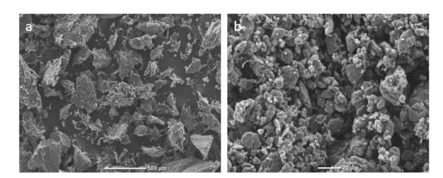
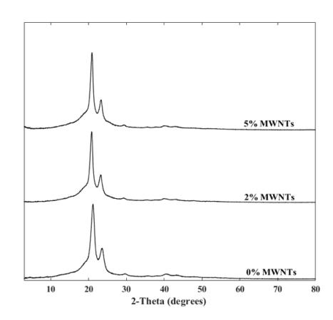
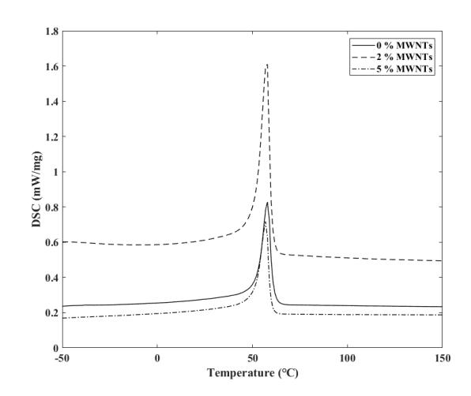
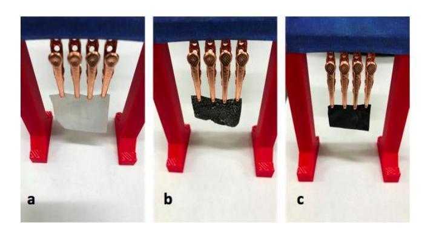

{0}------------------------------------------------

# **Solventless Fabrication of Biodegradable Sensors for Measuring Soft Tissue Deformation**

**Abstract ID: 1833**

**Srikanthan Ramesh, Iris V. Rivero Department of Industrial and Manufactuirng Systems Engineering Iowa State University, Ames, IA 50011, USA**

**Jin Yan, Austin Downey, Simon Laflamme Department of Civil, Construction and Environmental Engineering Iowa State University, Ames, IA 50011, USA**

**Eric Zellner Veterinary Clinical Sciences, College of Veterinary Medicine Iowa State University, Ames, IA 50011, USA**

**Abstract**

This research presents the development of flexible, biodegradable strain-sensors intended for monitoring the healing process of the skin. Biocompatible composites consisting of polycaprolactone (PCL) and multi-walled carbon nanotubes (MWNTs) were generated to be used in the fabrication of sensors to quantify strain. The composites were fabricated using cryomilling, a solid-state mechanical milling process that induces physicochemical changes to bring inherently dissimilar materials together. This processing technique obviates the need for solvents and high-temperature processing thereby avoiding undesirable chemical reactions that could negatively influence the fabrication and performance of the composites. X-ray diffraction (XRD) was used to characterize the molecular structure of the composites while differential scanning calorimetry (DSC) was used to record changes in thermal properties of the mixture, which describe the blending properties of the composite powders. Scanning electron microscopy (SEM) was utilized for morphological characterization of the cryomilled composites. Compression molding was utilized to fabricate flexible sensors that consisted of PCL loaded with MWNTs ranging from 0, 2, and 5 wt.%. The electrical resistance of the sensors decreased considerably with the incorporation of 5 wt.% MWNTs.

# **Keywords**

Solid-state processing, Cryomilling, Biodegradable sensors, Polycaprolactone, Multi-walled Carbon Nanotubes

# **1. Introduction**

Sutures, glues, staples, flaps and grafts are commonly used surgical techniques to hold together soft tissues that were separated as a result of an injury or a surgery [1]. During the recovery period, as a result of the patient's physical activity, tensile forces can act upon the site of repair and cause dehiscence which can subsequently lead to an infection [2]. In-depth characterization of the tissue is required to devise effective strategies to overcome such challenges. Although there have been studies published on this subject, most, if not all, use standardized samples under laboratory settings that may not fully mimic the actual movements of the patient [3-6]. Therefore, there is a need to develop sensors that can extract information about the mechanical demands on soft tissues during the healing process. To date, there does not exist a commercially available sensor technology capable of monitoring large strain on tissues. Nevertheless, soft electronics have been proposed in literature for the monitoring of biomedical movements, but research generally focuses on the development of the technology than on the medical applications [7-10].

{1}------------------------------------------------

As a first step in addressing the above-mentioned problem, this study aims to use a biodegradable polymer, polycaprolactone (PCL) to develop a sensor that is capable of being attached to skin for monitoring strain. PCL being non-toxic, easy to process, and biodegradable, was chosen to be an ideal polymer to be modified to suit the requirements of the sensor [11-13]. To enhance the electrical conductivity of the otherwise non-conducting PCL, multi-walled carbon nanotubes (MWNTs) were identified to be a suitable choice. Inferior mechanical and electrical properties of polymers have previously been modified by the incorporation of MWNTs [14-18]. However, as a result of van der Waals forces and their inherent high surface area, the dispersion of MWNTs in polymeric systems has always remained a challenge [19]. This study uses cryomilling, a solid-state processing technique, to generate a fine powder blend of PCL and MWNTs which can then be used to fabricate thin film sensors. Cryomilling has been proven to improve the blending intimacy and compatibility of multicomponent polymer blends by reducing and narrowing the particle size distribution, as well as by improving the degree of dispersion in polymer composites [20, 21]. Cryomilling overcomes problems associated with conventional blending methods such as thermal degradation due to excessive heating in the melting process, or the difficulty in removing the polymer from the solvent if the solution method is used [22]. Upon generation of cryomilled blends, compression molding was used to fabricate thin film sensors of thickness 0.1 mm. Scanning electron microscopy (SEM), X-ray diffraction (XRD) and differential scanning calorimetry (DSC) were utilized for visual, structural and thermal characterization of the powder blends. The electrical resistance of the generated thin films was measured using an LCR meter. In this manner, this study presents a simple yet repeatable method to fabricate thin film sensors whose resistance measurements can be used to create a one-to-one map to strain, due to the piezo-resistive properties of MWNTs.

# **2. Materials and Methods**

### **2.1 Fabrication of PCL/MWNTs Composites**

PCL (Capa 6500, Perstorp Ltd, UK,) and MWNTs (Nanostructured & Amorphous Materials Inc., TX, USA) were cryomilled to generate fine powdered composites using a freezer mill (SPEX, NJ, USA). Specifically, particular amounts of PCL and MWNTs were transferred into a vial and then placed in the freezer mill maintained at -196 °C using liquid nitrogen. The contents in the vial were initially precooled for 15 minutes before the milling process was initiated for temperature homogenization. The materials were processed in 5 minute cycles for a total of 20 minutes with a dwell time of 1 minute between consecutive cycles [23]. The loading content of MWNTs were 0, 2 and 5 wt.%.

### **2.2 Scanning Electron Microscopy**

The particle morphology produced by cryomilling was analyzed using a benchtop scanning electron microscope (SEM) (JCM-6000Plus Neoscope-JEOL, Peabody, MA, USA). Accelerating voltages of 10-15kV were used depending on the samples' requirements.

#### **2.3 X-Ray Diffraction**

X-ray diffraction (XRD) was used to assess the molecular structure of the cryomilled powders. A Rigaku Miniflex 600 XRD analysis unit (TYO, Japan) with a Cu-K $\alpha$  radiation ( $\lambda = 0.154$  nm) source was used with a voltage of 30 kV and a current of 15 mA.

#### **2.4 Differential Scanning Calorimetry**

Thermal characterization of the cryomilled PCL/MWNTs was performed using differential scanning calorimetry (DSC) (NETZSCH Instruments, MA, USA). Briefly, 10 mg of the sample was heated to 150 °C followed by an isothermal step at 150 °C for 5 min to erase any thermal history. The sample was then quenched at a rate of 10 °C/min to -80 °C. In the second heating cycle, the samples were once again heated to 150 °C. The melting, crystallization temperature and the percent crystallinity was measured for the cryomilled samples.

### **2.5 Fabrication of PCL/MWNTs Films**

Neat PCL and two PCL/MWNTs composites containing 2 and 5 wt.% MWNTs were pressed into films using a benchtop laboratory press (Model #4386, Carver, IN, USA). The mold was preheated to 100 °C (above the melting temperature of PCL) and the cryomilled powders were then compressed into films of 0.1 mm thickness. A pressure of 10 Mpa was held for 15 minutes and the films were allowed to cool down to room temperature.

### **2.6 Electrical Resistance**

{2}------------------------------------------------

The electrical resistance of the compression molded films was measured using an LCR meter (Model #4263B, Agilent, CA, USA) with four-point probe configuration. The four-point probe method is often used to measure sheet resistance of thin films by eliminating contact resistance, allowing for more accurate measurements. The samples were clamped in a custom support (see Figure 4(a-c)), thus held at constant mutual distances for each measured film.

# **3. Results and Discussion**

### **3.1 Scanning Electron Microscopy**

SEM was used to observe the morphology of the cryomilled particle morphology of PCL/MWNTs composites and the as-received MWNTs. Since cryomilling is performed at cryogenic temperatures, the specific energy required for milling is drastically reduced due to the embrittlement of the material which then facilitates the propagation of cracks [24]. As seen in Figure 1a, the cryomilled PCL/MWNTs consisted of sharp edged particles with an upper particle size limit of 50  $\mu\text{m}$  which was considerably smaller than the as-received PCL pellets. The use of liquid nitrogen facilitates a steep reduction in particle size by improving the particle fracture process [25]. Dry agglomeration was observed in the composites as the particles generated during cryomilling have high surface area, increased free energy and reduced thermodynamic stability [26]. van der Waals and other electrostatic forces were also seen as prominent factors that could have caused the agglomeration [27]. Figure 1b shows the agglomeration of as-received non-cryomilled MWNTs as a result of their high surface area [19].

Figure 1: Micrographs of a) cryomilled PCL/MWNTs (2%) composite and b) as-received non-cryomilled MWNTs.

# **3.2 X-Ray Diffraction**

Figure 2 displays the diffractograms of the cryomilled powders with varying loading levels of MWNTs. As can be seen, all the materials showed two strong diffraction peaks at  $2\theta$  values of  $21^\circ$  and  $23.5^\circ$  that were consistent with the findings previously reported in literature [28]. The semi-crystalline nature of PCL was evident due to the presence of both crystalline peaks and amorphous domains. The presence of the peak at  $21^\circ$  was attributed to the diffraction of the (110) lattice plane and corresponded to a d-spacing value of 0.42 nm. The diffraction of the (200) lattice plane was responsible for the presence of a peak at  $23.5^\circ$  that corresponded to a d-spacing value of 0.38 nm [29]. With the incorporation of MWNTs, the composites retained the characteristic peaks of PCL indicating that their addition did not significantly modify the crystalline structure of pure PCL [30].

Figure 2: X-ray diffraction profiles of cryomilled powders.

{3}------------------------------------------------

### **3.3 Differential Scanning Calorimetry**

Figure 3 displays the DSC thermograms obtained from the second heating scan while Table 1 reports the melting and crystallization temperatures of the analyzed samples. The melting temperature of pure cryomilled PCL was observed to be 57.9 °C and was consistent with the values previously reported in literature [31]. With the addition of MWNTs in different amounts, there were no significant changes observed in the melting temperature. However, the addition of MWNTs visibly increased the crystallization temperature as there was an increase in the available nucleating sites due to the presence of MWNTs [32, 33].

Figure 3: DSC thermograms of cryomilled powders.

Table 1: DSC data for cryomilled powders.

| Material           | Melting Temperature ( ℃ ) | Crystallization Temperature ( ℃ ) |
|--------------------|---------------------------|-----------------------------------|
| PCL                | 57.9                      | 26.3                              |
| PCL + 2 wt.% MWNTs | 57.6                      | 27.2                              |
| PCL + 5 wt.% MWNTs | 57.2                      | 28.4                              |

#### **3.4 Electrical Resistance**

The resistance of PCL/MWNTs composite films was measured using the test configuration discussed above and shown in Figure 4(a-c). The resistance values for the three samples are listed in Table 2, along with the resistance when no sample is present in the fram to account for the electrical bias created by the test configuration. Results show that the samples at 0 and 2 wt.% MWNTs have a resistance equal to the bias (no sample) which indicated a very high resistivity. The 5 wt.% MWNTs thin film exhibited a significant decrease in resistance (by 71.6%). This demonstrates that MWNTs can be utilized to decrease the resistivity of PCL considerable which was in accordance with previously reported results in literature [34].

Figure 4: Resistance measurement configurations of a) pure PCL, b) 2 wt.% and c) 5 wt. % PCL/MWNTs films.

{4}------------------------------------------------

Table 2: Resistance measurements of PCL/MWNTs films.

| MWNTs (%) Air | Electrical Resistance (mΩ) 9.5 |
|---------------|--------------------------------|
| 0             | 9.5                            |
| 2             | 9.5                            |
| 5             | 2.7                            |

# **4. Conclusions**

In this work, cryomilling was utilized to generate homogeneous powder blends of PCL and MWNTs, which were to be the basis for the fabrication of biodegradable strain-sensors. SEM showed reduced particle size disparity between PCL and MWNTs enabling the fabrication of films devoid of fusion defects during compression molding. XRD and DSC results indicated that the inclusion of MWNTs did not significantly alter the crystal structure of PCL, but facilitated the faster nucleation of PCL by providing additional nucleation sites. The 5 wt.% addition of MWNTs decreased the resistance of PCL films by 71.6%. These results indicated that conductive composites films were producible with the incorporation of MWNTs. The further characterization of the electrical percolation threshold would enable the development of soft sensors.

# **References**

1 Al-Mubarak, L., and Al-Haddab, M., 2013, "Cutaneous wound closure materials: An overview and update", Journal of Cutaneous and Aesthetic Surgery, 6 (4), 178-188. 2 Ireton, J. E., Unger, J. G., and Rohrich, R. J., 2013, "The role of wound healing and its everyday application in plastic surgery: A practical perspective and systematic review", Plastic and Reconstructive Surgery, 1 (1), e10-e19. 3 Regier, P. J., Smeak, D. D., and McGilvray, K. C., 2016, "Security and biomechanical strength of three End-Pass configurations for the terminal end of intradermal closures performed with unidirectional barbed suture material in dogs", American Journal of Veterinary Research, 77 (12), 1392–1400. 4 Regier, P. J., Smeak, D. D., Coleman, K., and McGilvray, K. C., 2015, "Comparison of volume, security, and biomechanical strength of square and Aberdeen termination knots tied with 4–0 polyglyconate and used for termination of intradermal closures in canine cadavers", Journal of American Veterinary Medical Association, 247 (3), 260–266. 5 Richey, M. L., and Roe, S. C., 2005, "Assessment of knot security in continuous intradermal wound closures", Journal of Surgical Research, 123 (2), 284–288. 6 Zellner, E. M., Hedlund, C. S., Kraus, K. H., Burton, A. F. and Kieves, N. R., 2016 "Comparison of tensile strength among simple interrupted, cruciate, intradermal, and subdermal suture patterns for incision closure in ex vivo canine skin specimens", Journal of American Veterinary Medical Association, 248 (12), 1377– 1382. 7 Dagdeviren, C., Shi, Y., Joe, P., Ghaffari, R., Balooch, G., Usgaonkar, K., Gur, O., Tran, P. L., Crosby, J. R., Meyer, M., Su, Y., Webb, R. C., Tedesco, A. S., Slepian, M. J., Huang, Y., and Rogers, J. A., 2015 "Conformal piezoelectric systems for clinical and experimental characterization of soft tissue biomechanics", Nature Materials, 14 (7), 728–736. 8 Klosterhoff, B. S., Tsan, M., She, D., Ong, K. G., Allen, M. G., Willett, N. J., and Guldberg, R. E., 2017 "Implantable Sensors for Regenerative Medicine", Journal Biomechanical Engineering, 139 (2), 21009. 9 Yamada, T., Hayamizu, Y., Yamamoto, Y., Izadi-Najafabadi, A., Futaba, D. N., and Hata, K., 2011, "A stretchable carbon nanotube strain sensor for human-motion detection", Nature Nanotechnology, 6 (5), 296–301. 10 Zens, M., Ruhhammer, J., Goldschmidtboeing, F., Feucht, M. J., Bernstein, A., Niemeyer, P., Mayr, H. O., and Woais, P., 2015, "Polydimethylsiloxane strain gauges for biomedical applications", 18th International Conference on Solid-State Sensors, Actuators and Microsystems, 1763–1766. 11 Yang, Q., Wang, L., Xiang, W., Zhou, J. and Li, J., 2007, "Grafting polymers onto carbon black surface by trapping polymer radicals", Polymer, 48 (10), 2866–2873. 12 Castro, M., Lu, J., Bruzaud, S., Kumar, B. and Feller, J. F., 2009, "Carbon nanotubes/poly(ε-caprolactone) composite vapour sensors", Carbon, 47 (8), 1930–1942. 13 Yang, Q., Wang, L., Xiang, W., Zhou, J., Deng, L., and Li, J., 2007, "Preparation of core-shell carbon black nanoparticles and their crystallization-induced orientation", European Polymer Journal, 43 (5), 1718– 1723.

{5}------------------------------------------------

14 Amezcua, R., Shirolkar, A., Fraze, C., and Stout, D., 2016, "Nanomaterials for Cardiac Myocyte Tissue Engineering", Nanomaterials, 6 (7), 133. 15 Davis, H., and Leach, J., 2008, "Hybrid and Composite Biomaterials in Tissue Engineering", Topics in Multifunctional Biomaterials and Devices, 530, 1–26. 16 Generali, M., Dijkman, P. E., and Hoerstrup, S. P., 2014, "Bioresorbable Scaffolds for Cardiovascular Tissue Engineering", EMJ Interventional Cardiology, 1, 91–99. 17 Balint, R., Cassidy, N. J., and Cartmell, S. H., 2014, "Conductive polymers: Towards a smart biomaterial for tissue engineering", Acta Biomaterilia, 10 (6), 2341–2353. 18 NIOSH, 2013 "Occupational Exposure to Carbon Nanotubes and Nanofibers", Current Intelligence Bulletin, 65, 184. 19 Saeed, K. and Park, S., 2006, "Preparation and Properties of Multiwalled Carbon Nanotube / Polycaprolactone Nanocomposites", Polymer, 104, 1957–63. 20 Zhu, Y. G., Li, Z. Q., Zhang, D., and Tanimoto, T., 2006, "ABS/iron nanocomposites prepared by cryomilling", Journal of Applied Polymer Science, 99 (2), 501–505. 21 Zhu, Y. G., Li, Z. Q., Zhang, D. and Tanimoto, T., 2006, "PET/SiO2 nanocomposites prepared by cryomilling", Journal of Polymer Science Part B: Polymer Physics, 44 (8), 1161–1167. 22 Fecht, H. J., 1995, "Nanostructure formation by mechanical attrition", Nanostructured Materials, 6 (1-4), 33–42. 23 Jonnalagadda, J., and Rivero, I., 2014, "Influence of cryomilling times on the resultant properties of porous biodegradable poly (e-caprolactone)/poly (glycolic acid) scaffolds for articular cartilage tissue engineering", Journal of Mechanical Behavior of Biomedical Materials*,* 40, 33–41. 24 Ye, J., and Schoenung, J. M., 2004, "Technical Cost Modeling for the Mechanical Milling at Cryogenic Temperature (Cryomilling)", Advanced Engineering Materials, 6 (8), 656–664. 25 Saleem, I. Y., and Smyth, H. D. C., 2010 "Micronization of a Soft Material: Air-Jet and Micro-Ball Milling", AAPS PharmSciTech, 11 (4), 1642–1649. 26 Loh, Z. H., Samanta, A. K., and Sia Heng, P. W., 2014, "Overview of milling techniques for improving the solubility of poorly water-soluble drugs," Asian Journal of Pharmaceutical Sciences, 10 (4), 255–274. 27 Hogg, R., 2009, "Mixing and segregation in powders: Evaluation, mechanisms and processes", KONA Powder and Particle Journal, 27, 3–17. 28 Jana, R. N., and Im, C., 2009, "Isothermal crystallization behavior of polycaprolactone diol/functionalizedmultiwalled carbon nanotube composites", International Journal of Polymer Analysis and Characterization, 14 (5), 418–436. 29 Jana, R. N., and Cho, J. W., 2010, "Non-isothermal crystallization of poly(-caprolactone)-grafted multiwalled carbon nanotubes", Composites Part A: Applied Science Manufacturing, 41 (10), 1524–1530. 30 Wang, S.F., Shen, L., Zhang, W. D., and Tong, Y. J., 2005, "Preparation and mechanical properties of chitosan/carbon nanotubes composites", Biomacromolecules, 6 (6), 3067–72. 31 Sanchez-Garcia, M. D., Lagaron, J. M., and Hoa, S. V., 2010, "Effect of addition of carbon nanofibers and carbon nanotubes on properties of thermoplastic biopolymers", Composites Science Technology, 70 (7), 1095–1105. 32 Yang, S., Castilleja, J. R., Barrera, E. V., and Lozano, K., "Thermal analysis of an acrylonitrile-butadienestyrene/SWNT composite", Polymer Degradation and Stability, 83 (3), 383–388. 33 Tibbetts, G. G., Lake, M. L., Strong, K. L., and Rice, B. P., 2007, "A review of the fabrication and properties of vapor-grown carbon nanofiber/polymer composites", Composites Science Technology, 67 (7- 8), 1709–1718. 34 Crowder, S. W., Liang, Y., Rath, R., Park, A. M., Maltais, S., Pintauro, P. N., Hofmeister, W., Lim, C. C., Wang, X., and Sung, H. J., 2013, "Poly(ε-caprolactone)-carbon nanotube composite scaffolds for enhanced cardiac differentiation of human mesenchymal stem cells", Nanomedicine, 8 (11), 1763–76.