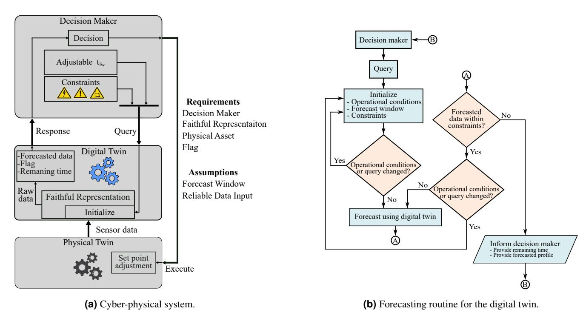
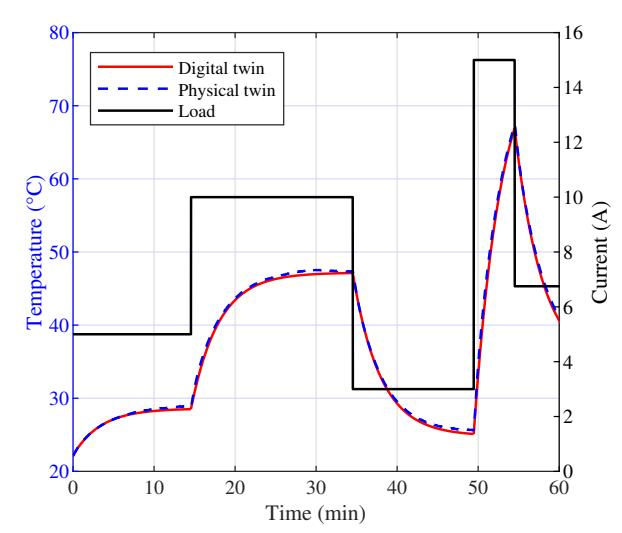
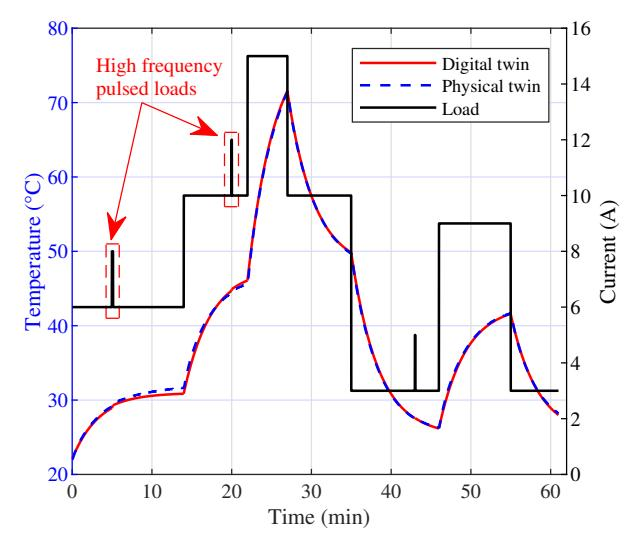
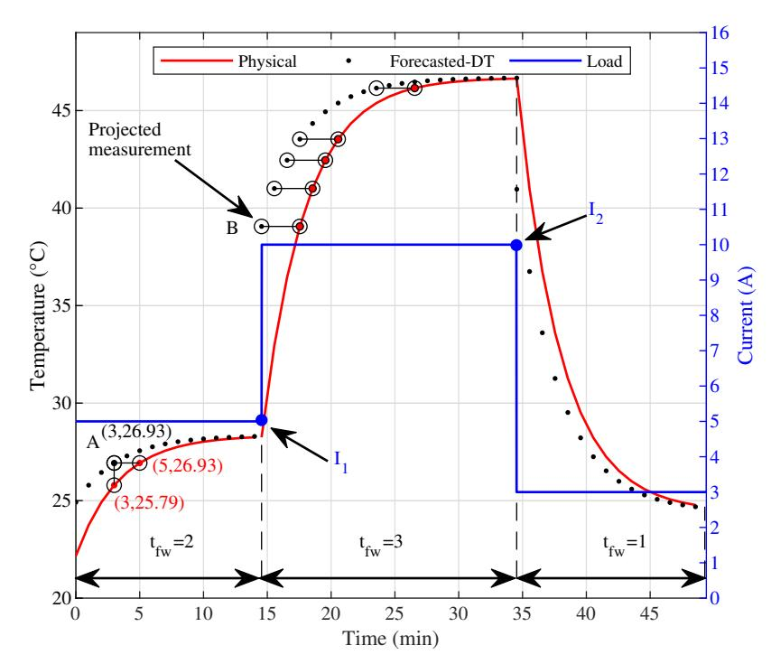
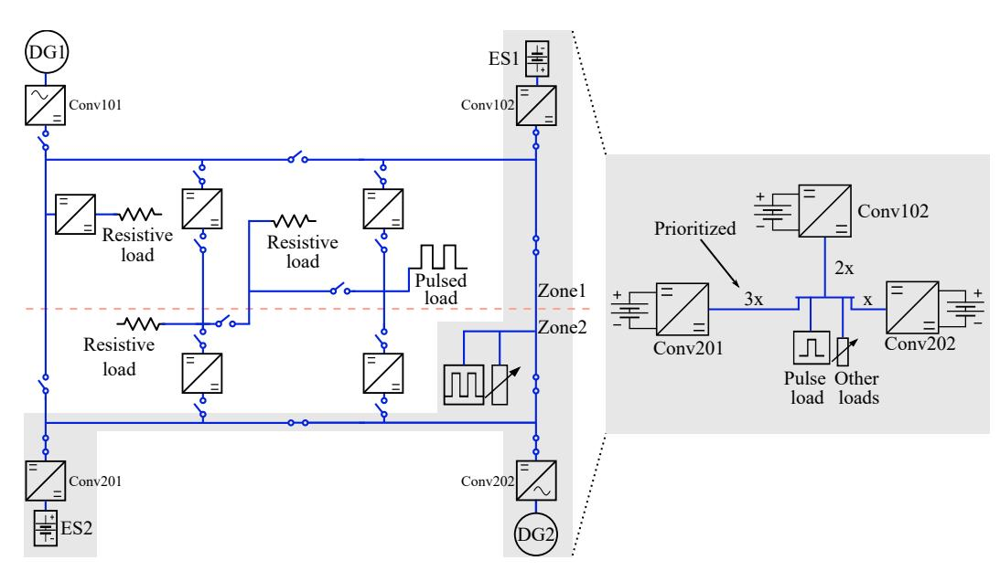
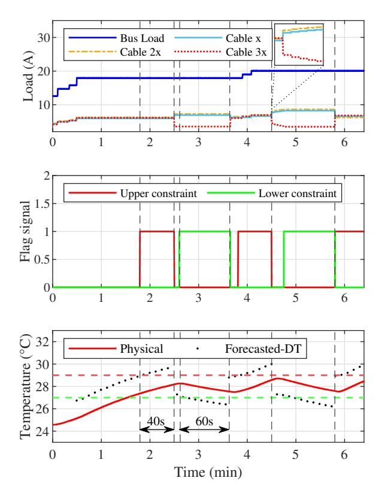

{0}------------------------------------------------

# **A Digital Twin Based Forecasting Framework for Power Flow Management in DC Microgrids**

**Kerry Sado**1,\***, Jarrett Peskar**2 **, Austin Downey**2,3**, Jamil Khan**2,3**, and Kristen Booth**1

1University of South Carolina, Department of Electrical Engineering, Columbia, SC, USA

2University of South Carolina, Department of Mechanical Engineering, Columbia, SC, USA

3University of South Carolina, Department of Civil and Environmental Engineering, Columbia, SC, USA \*ksado@email.sc.edu

This work was supported by the Office of Naval Research under contracts N00014-22-C-1003 and N00014-23-C-1012. "The views expressed are those of the authors and do not reflect the official policy or position of the Department of Defense or the U.S. Government. DISTRIBUTION STATEMENT A. Approved for public release distribution unlimited. Approved, DCN# 2025-1-31-562"

### **ABSTRACT**

The ability to forecast system conditions is integral to the definition and functionality of digital twins. While forecasting methods have been explored for use in digital twin systems, the integration of feedback mechanisms for real-time forecasting and in-situ decision-making in DC microgrids has not been extensively investigated. This research develops a modular forecasting framework tailored for digital twins in DC microgrids to enable real-time monitoring, online forecasting, and decision-making. DC microgrids, characterized by dynamic load variations, benefit from advanced predictive capabilities to maintain stability and operational efficiency. The proposed digital twin-based forecasting framework addresses these challenges by providing real-time predictive insights based on dynamic system conditions and a forecasting window defined by a decision-maker, facilitating proactive management strategies. Leveraging real-time sensor data, the digital twin forecasts system behavior under varying load conditions, enabling proactive management through real-time decision-making within operational constraints. As a proof of concept, the framework incorporates an electro-thermal digital twin designed to manage power flow based on thermal constraints in power distribution cables. Experimental validation using a simplified three-bus DC microgrid testbed demonstrates the effectiveness of the framework in enabling timely adjustments to power flows and preventing thermal overloads.

## **Introduction**

A Digital Twin (DT) is a comprehensive digital replica of a physical asset that integrates multiphysics, various scales, and probabilities to mirror and forecast the life-cycle of its counterpart[1](#page-10-0) . Essentially, the digital twin acts as a comprehensive and faithful representation of a physical system or subsystem, referred to as the physical twin[2](#page-10-1) . In this context, a physical twin refers to an actual real-world entity which can vary in complexity. It might be a machine, a piece of infrastructure, a single system component, or an entire complex system. The physical twin encapsulates specific attributes, characteristics, and functionalities that define the entity. The definition of digital twins is often misused in the literature with many studies failing to emphasize the feedback loop that differentiates digital twins from traditional models. The bidirectional flow of data between the physical asset and its digital counterpart is integral to the digital twin paradigm as it provides real-time insights, updates, and enabling dynamic decision-making[3,](#page-10-2) [4](#page-10-3) . This mechanism enables the digital twin to adaptively update its state in real-time, driven by sensor data from the physical twin. Furthermore, the bidirectional nature of the feedback loop allows the digital twin to receive information about the current operational parameters from the physical twin, enabling synchronized adjustments in the virtual representation. The bidirectionality also allows the decision-making entity within the digital twin to execute instructions on the physical twin based on forecasted insights generated by the virtual representation. This capability ensures synchronized operations and dynamic adjustments. Without the bidirectionality, a model cannot be considered a true digital twin but rather a static digital representation. The omission of this crucial aspect in research undercuts the potential benefits and applications of digital twin technology[5](#page-10-4) .

The significance of digital twins is rapidly gaining recognition from both academic and industrial sectors[6](#page-10-5) . In the automotive industry, digital twins are used to monitor, simulate, and optimize production and operational performance[7](#page-10-6) . In the energy sector, General Electric (GE) has implemented a digital twin for a wind farm, enhancing reliability by gathering real-time data on weather, performance, and service[8](#page-10-7) . Similarly, Siemens developed a digital twin for the Finnish power grid, leading to improved safety, reliability, and resource savings[9](#page-10-8) . Digital twin technology has applications beyond industrial and infrastructure sectors. In healthcare, digital twins are being explored to model cancer patients, providing patient-specific clinical decision 

{1}------------------------------------------------

support and enabling large-scale virtual clinical trials[10](#page-11-0). In manufacturing, digital twin-driven systems facilitate the integration of cyber-physical systems for smart workshops, enhancing efficiency and customization capabilities[11](#page-11-1). Recent studies also highlight the role of digital twins in renewable energy. For example, Sehrawat *et al.*[12](#page-11-2) proposed a machine learning-based digital twin framework for solar irradiance forecasting, demonstrating its capability to enhance operational efficiency and predict performance in renewable energy systems. Similarly, Guo *et al.*[13](#page-11-3) presented a digital twin framework integrating fuzzy logic for wind energy forecasting, offering high accuracy and robust predictions over long-term horizons. These studies illustrate the adaptability of digital twin frameworks to address dynamic challenges in energy systems.

Several studies, including those by Nwoke *et al*. [14](#page-11-4) and Di Nezio *et al*. [15](#page-11-5), commend digital twins for their effectiveness in monitoring and predictive maintenance, specifically for power electronic converters. These studies focus on reducing data latency and enhancing system parameter estimation through sensor data. However, they primarily address component-level applications and fall short of extending their findings to system-wide forecasting or proactive power management. Wileman *et al*. [16](#page-11-6) developed a component-level digital twin to monitor the health of power converters using physics-based models. This demonstrates the precision that digital twins can achieve at the component-level. However, it also highlights a significant research gap in applying digital twin technology to broader, system-wide applications, where the ability to forecast across the entire system remains unfulfilled.

Digital twins can forecast the future states and behaviors of physical assets by combining historical data and real-time sensor readings, utilizing cyber-physical data exchange[17](#page-11-7). Digital twins update forecasts as needed in response to changes in operational conditions of the physical asset, driven primarily by real-time data and feedback mechanisms. This adaptability enhances the precision of digital twins in forecasting future states. Leveraging forecasted data, the decision-making entity can ensure that the most effective operational state is always active, thereby enhancing the operational performance of the asset. Serving as crucial decision aids, digital twins enable the selection of the most suitable operational conditions for the represented physical asset. Although the definition of digital twins inherently includes forecasting capabilities, the literature indicates a significant gap in the actual implementation of this feature for real-time forecasting and comprehensive system integration.

Recent advancements in forecasting methods for digital twin systems also show promise for addressing these gaps. Xie *et al.*[18](#page-11-8) proposed a neural ordinary differential equations-based framework for load forecasting in power grids. This approach integrates machine learning with physics-based modeling to improve scalability and accuracy, highlighting the potential for advanced forecasting in electrical digital twins. Additionally, Jiao *et al.*[19](#page-11-9) introduced a motion forecasting framework leveraging cloud-edge collaboration, emphasizing preemptive risk monitoring by predicting future trajectories with high accuracy through deep learning mechanisms. Furthermore, Maior *et al.*[20](#page-11-10) conducted a comparative study of various forecasting methods in digital twin applications, emphasizing the critical role of preprocessing and model selection in achieving reliable predictions. Santos *et al.*[21](#page-11-11) further explored simulation-integrated digital twin systems, where forecasting techniques such as exponential smoothing were combined with discrete event simulations for decision support, enhancing the adaptability of digital twins in industrial contexts. Similarly, Henzel *et al.*[22](#page-11-12) developed a digital twin model for residential energy consumption forecasting, employing long-short term memory models to predict energy usage and optimize energy storage and consumption strategies. Xiang *et al.*[23](#page-11-13) proposed a digital twin-based framework for short-term photovoltaic power prediction using bi-directional long short-term memory models. This approach combines mechanism and data-driven models with a sliding time window update method to achieve high accuracy in real-time forecasts of photovoltaic output power. Zeb *et al.*[24](#page-11-14) investigated surrogate models in mineral processing, applying CNN-based multistep forecasting within a digital twin framework to predict operational metrics, emphasizing its potential for optimizing real-world processes. These contributions highlight the diverse and rapidly evolving landscape of forecasting methodologies in digital twin research. However, many of these approaches lack in-situ projection capabilities and have not been cyberphysically integrated, limiting their applicability to real-time operational challenges in dynamic systems like DC microgrids.

A report by the National Academies of Sciences, Engineering, and Medicine identifies significant challenges in the practical use of digital twins for predictive purposes[3](#page-10-2) . This gap highlights the need for further research and development to enable digital twins to provide reliable predictive insights across diverse applications. Gu *et al*. [25](#page-11-15) proposed a digital load forecasting method using a digital twin on the Opal-RT platform, simulating the operation and maintenance of the actual power grid. This approach marks a significant attempt to utilize digital twins for forecasting and operational management. Nonetheless, it reveals a gap in providing a clear explanation and demonstration of the integration of digital twins with hardware. This gap highlights the need for research that moves beyond conceptual models to validate digital twin applications in real-world scenarios.

A study on wind and photovoltaic power forecasting highlights the use of digital twins for predicting renewable energy outputs[26](#page-11-16). However, despite its innovative approach, the study lacks a clear framework that can be generalized across different applications. Similarly, in healthcare, digital twin models have been developed to forecast disease progression and predict clinical measurement trajectories in stroke patients[27](#page-11-17). While these models demonstrated high accuracy and potential for clinical decision support, they also lack a standardized framework that can be broadly applied across various applications. This further highlights the need for standardized methodologies and integration strategies, as well as research that moves beyond conceptual

{2}------------------------------------------------

**Figure 1.** The forecasting-focused digital twin for a cyber-physical system.

models to validate digital twin applications in real-world scenarios.

Recent studies have explored digital twins for predictive maintenance and component-level thermal monitoring. For example, Paldino *et al*. [28](#page-12-1) proposed a black-box digital twin for conductor temperature estimation, while Kupart *et al*. [29](#page-12-2) developed a thermal digital twin for power electronics modules emphasizing on real-time monitoring of thermal impedance. However, these works primarily target component-level scenarios. There remains a gap in system-level forecasting frameworks tailored for DC microgrids, particularly ones that enable real-time decision-making and proactive management across varying operational conditions.

Overall, the body of research shows great promise for digital twins in component-level monitoring and predictive maintenance. These applications typically involve predictions based on models and remaining time estimations. However, they are generally not focused on forecasting in the sense of projecting future states and modifying system controls to achieve optimal outcomes. Therefore, there is a clear need for further research leveraging the true forecasting capabilities of digital twins. Establishing a standard forecasting procedure is essential to validate this technology in practical, real-world applications. This work introduces a modular forecasting framework for digital twins, specifically designed for DC microgrids. An electro-thermal model serves as a proof of concept, demonstrating the adaptability and effectiveness of the framework. Unlike prior studies that focus predominantly on component-level analysis, this approach demonstrates system-level forecasting capabilities validated through experimental results in a DC microgrid testbed.

#### **Forecasting Requirements and Assumptions for Digital Twins in DC Microgrids**

Physical assets, whether operating independently or as part of larger networks, face dynamic challenges where unexpected changes in the operational environment can suddenly arise. By utilizing digital twins for forecasting, these assets can proactively adjust their operations, facilitating seamless transitions between different operational states. In the context of DC microgrids, these challenges often involve dynamic load variations, fluctuations in renewable energy generation, and the need to maintain thermal and electrical stability. The forecasting capability of digital twins is particularly valuable in this domain, enabling real-time decision-making to ensure operational efficiency and responsiveness despite the inherent variability in such systems. As illustrated in Figure [1a,](#page-2-0) the digital twin system requires a decision-making entity to study the insights provided by the digital twin. The decision-making entity uses the forecasting projections provided by the digital twin, based on certain constraints, to make informed decisions. These decisions are then executed on the physical twin, closing the loop between data collection, analysis, and action. The flowchart in Figure [1b](#page-2-0) further details the forecasting framework within the digital twin, illustrating the process of updating forecasts and making adjustments based on real-time data.

{3}------------------------------------------------

For digital twins to effectively serve the forecasting function, certain design requirements should exist:

- a) A physical asset to monitor: An entity where specific operational parameters, represented as a matrix X, are monitored within the digital twin framework. These parameters, which may include internal constraints or external environmental factors, are critical for maintaining optimal performance of the asset under varying conditions. The boundaries of these parameters define the safe operational limits of the asset. Forecasting the behavior of the asset within these boundaries allows for proactive management, mitigating risks before leading to failures or inefficiencies. This continuous monitoring and adjustment keep parameters within set boundaries, avoiding situations that could compromise functionality. These parameters are set according to the decision makers specifications and include upper and lower thresholds to ensure safe operation. Mathematically, the operational parameters can be represented as

$$\mathbf{X} = \begin{bmatrix} x_{11} & x_{12} & \cdots & x_{1j} \\ x_{21} & x_{22} & \cdots & x_{2j} \\ \vdots & \vdots & \ddots & \vdots \\ x_{i1} & x_{i2} & \cdots & x_{ij} \end{bmatrix} \quad (1)$$

where *xi j* represents the *j*-th parameter of the *i*-th operational aspect. In the context of DC microgrids, the physical asset to monitor may include cables, energy storage units, or power converters. Specific operational parameters such as current, voltage, temperature, and state-of-charge for batteries are represented within the digital twin framework. These parameters are essential for maintaining microgrid stability under dynamic conditions and ensuring that components operate within predefined safe limits. Monitoring and forecasting of these variables enable microgrids to adapt to load fluctuations, and prevent system disruptions caused by thermal or electrical stresses.

- b) Faithful system representation: An accurate and detailed representation of the physical asset being monitored is essential to mirror its behaviors and complexities. This representation is the core of the digital twin of Figure [1a.](#page-2-0) Creating a representation involves focusing on the specifications and operational dynamics of critical components, particularly those that affect the monitored constraints. Various methods exist for creating faithful system representations, including AI-developed models such as neural networks, look-up tables, physics-based modeling, frequency domain modeling, and empirical characterizations. Each method offers unique insights and is selected based on system complexity, computational requirements, and specific application needs.
- c) Forecasting window, *t*fw: The timeframe within which the digital twin anticipates future states of the physical twin. This window must adhere to defined limits based on the nature of the asset and operational requirements

$$0 \leq t_{\text{fw}} \leq t_{\text{fw,max}} \quad (2)$$

where *t*fw,max represents the maximum allowable forecasting window. This maximum is defined by considering factors such as the operational dynamics and characteristics of the asset, the desired accuracy of the forecast, and the computational resources available. A *t*fw set to zero indicates no forecasting; the digital twin will then provide a real-time reflection of the behavior of the physical twin or serve as a reactive operational tool.

- d) Decision maker: The decision-making entity could be a control algorithm, AI, a human-in-the-loop, or a combination of these elements. It acts as the intermediary between the digital twin and the physical asset. The process initiates with the decision maker querying the digital twin for essential data and insights into the behavior of the physical asset. In response, the digital twin provides detailed data projections and insights. With this information, the decision maker performs an in-depth analysis, taking into account operational and environmental factors. Each potential impact of various alternatives is evaluated to ensure that the selected actions are timely and accurate. Final decisions, derived from this comprehensive analysis, are then conveyed as instructions to be executed on the physical twin. This process ensures the most effective alignment with operational requirements and thereby enhancing desired system functions. In DC microgrids, decisionmaking plays a critical role in maintaining stability and optimizing performance. Advanced control algorithms or human operators leverage in-situ measurements, such as current, voltage, temperature, and state-of-charge, along with digital twin forecasts, to implement proactive strategies like dynamic load shedding, battery dispatch optimization, and power rerouting. These strategies ensure the system operates efficiently under varying load and renewable energy conditions while maintaining key parameters within safe operational thresholds. Real-time insights from in-situ measurements, combined with projections and analysis from the digital twin, enable timely interventions that prevent disruptions and ensure the continued stability of the microgrid.

{4}------------------------------------------------

- e) Countdown via flagging mechanism: The response of the digital twin must include a flagging mechanism, an essential feature designed to alert the decision maker to the time at which a constraint will be violated. This proactive alert mechanism enables timely interventions before operational thresholds are breached, thereby preventing potential issues. When monitoring both upper, Xmax, and lower, Xmin, constraint boundaries which represent the maximum and minimum values of the parameters in the previously mentioned matrix, the digital twin calculates the time to reach a constraint based on the rate of change, ( *d*X *dt* ), of the operational parameters X. If the rate of change is positive, the digital twin activates the upper flag, Flagupper(*t*), when the constraint reaches the upper boundary. Conversely, if the rate of change is negative, the digital twin activates the lower flag, Flaglower(*t*) when approaching the lower boundary. This dual-flagging mechanism can be adapted based on specific application needs, ensuring the digital twin can effectively alert the decision maker to potential issues regardless of the type of operational constraints being monitored. The functionality of this dual-flagging mechanism can be mathematically expressed as

$$\text{Flag}(t) = \begin{cases} \text{Flag}_{\text{upper}} = 1 & \text{if } \frac{d\mathbf{X}}{dt} \geq 0 \text{ and } \mathbf{X} \geq \mathbf{X}_{\text{max}} \\ \text{Flag}_{\text{lower}} = 1 & \text{if } \frac{d\mathbf{X}}{dt} < 0 \text{ and } \mathbf{X} \leq \mathbf{X}_{\text{min}} \\ 0 & \text{otherwise} \end{cases} \quad (3)$$

When the operational parameters exceed Xmax or fall below Xmin the corresponding flags are triggered. In addition to signaling an alert, the digital twin is required to estimate the time remaining before a constraint is breached. This estimation is given by

$$t_r = \left| \frac{\mathbf{X} - \mathbf{X}(t)}{\frac{d}{dt} \mathbf{X}(t)} \right| \quad (4)$$

where t*r* is the estimated time until the parameter reaches the constraint, X, whether it is a lower or upper boundary, and X(*t*) is the parameter value at time *t*. Estimating the remaining time ensures timely alerts, enabling immediate and effective responses to potential system overloads or critical state exceedances. This capability of the digital twin is particularly useful in managing potential system failures.

Addressing the detailed design requirements necessitates overcoming specific challenges inherent in the development and integration of digital twins. To avoid uncertainty in the proposed forecasting framework due to the accuracy of the digital twin response, the following assumptions are made:

- i) Reliable sensor measurements: The digital twin requires accurate and regularly calibrated real-time sensor data from the monitored physical twin. Additionally, the infrastructure supporting data flow from the physical twin to the digital twin must be robust, ensuring minimal transmission delays and packet losses. The precision and effectiveness of the digital twin heavily depend on maintaining high standards of sensor accuracy and transmission reliability. Both metrics must meet or exceed their respective thresholds to minimize data interpretation errors and enhance decision-making. These thresholds are tailored according to the dynamics and criticality of the specific application.
- ii) Adaptable forecasting window: The forecasting window is dynamically adjustable, providing for specific needs with varied look-ahead periods. Adaptability ensures the system is equipped for both short-term predictions for immediate actions and long-term forecasts for strategic planning. The forecasting window can be modified either through decision maker queries or automated system triggers, ensuring best system responsiveness and preparedness.

Figure [1b,](#page-2-0) shows a generic flowchart detailing the modeling sequence of the digital twin. To illustrate the principles of the proposed framework, the following example demonstrates the application of digital twins in forecasting the behavior of an electro-thermal system, highlighting the implementation of design requirements and assumptions in practice.

#### **Forecasting Example**

Building on the outlined assumptions and requirements, this section describes the simplified example used to demonstrate the forecasting framework. This digital twin case study, although simplistic and not representative of typical workloads, validates the foundational assumptions and requirements for detailed forecasting and proactive management strategies. These strategies are crucial for effective power system operation, especially in mission-critical applications like naval ships. This simple case study monitors the temperature of power cables to proactively manage power supplied to a mission-critical load. This illustrative example is not meant to be a realistic application; however, it is simple enough to clearly demonstrate the proposed forecasting framework. The temperature of these cables can vary significantly under different load conditions and operational environments, making it an ideal parameter for testing the effectiveness of real-time forecasting and proactive management.

{5}------------------------------------------------

#### **Faithful Representation of the Physical Twin: An Illustrative Example Using Electro-thermal Modeling of Power Transmission Cables**

To develop a digital twin with real-time forecasting capabilities, it is essential to first design and validate the accuracy of a real-time digital twin. Serving as the faithful representation of the asset, this real-time digital twin lays the foundation for the forecasting digital twin, ensuring accurate time synchronization and initialization. Characterizing the physical twin is essential for creating a faithful representation that can be effectively integrated into the digital twin framework. The power distribution cabling is utilized here as an example to demonstrate the forecasting capabilities of the digital twin and to validate the assumptions and requirements previously outlined. In the development of the digital twin, a combination of physics-based modeling and lookup tables was employed to ensure a detailed and reliable representation[30](#page-12-3). The characterization assumes that each cable functions independently. Although this assumption does not fully capture the interconnected nature of cables in a real-world scenario, it provides a valuable foundation for demonstrating the effective implementation of forecasting using digital twins. This approach allows for a clear understanding of individual component behavior under various conditions, which is crucial for developing robust forecasting methodologies. Once the forecasting framework is validated in this simpler context, it can be expanded to more complex, real-world systems. As long as the digital twin maintains a faithful representation of the actual asset, it can be utilized to predict future states and provide decision aids to manage system dynamics proactively.

The electro-thermal behavior of the cable is considered in the development of its faithful representation. Therefore, a comprehensive understanding of power losses and heat transfer mechanisms is required. The interdependencies of the electrical and thermal properties of the cable must be documented within the developed faithful representation in order to monitor thermal thresholds. The faithful representation being used in this demonstration of the forecasting framework was previously developed[30](#page-12-3) and summarized here for completeness. To estimate the temperature of the cable, the principle of energy conservation is employed[31](#page-12-4). Based on the law of conservation of energy and incorporating the heat generation and cooling mechanisms, the energy balance equation is formulated as

$$\frac{d}{dt}(\rho V c T) = I^2 R l - h A_s (T_{\text{ss}} - T_{\text{amb}}). \quad (5)$$

where ρ is the mass density, *V* is the volume, *c* is the specific heat, *T* is the temperature of the cable, *h* is the convection coefficient, *As* is the surface area of the cable, *T*ss is the steady-state temperature, and *T*amb is the ambient temperature. Given known values for *R* and *l*, experimental data on the cable was acquired, enabling the computation of *h* at various current levels. Accordingly, the steady-state temperature of the cable for a given current can be estimated as

$$T_{\text{ss}} = \frac{l^2 Rl}{hA_s} + T_{\text{amb}}. \quad (6)$$

With the steady-state temperature determined, the transient response is derived using an equivalent thermal RC circuit, allowing the cable temperature at time *t* after a change in current to be described as

$$T(t) = (T_{\text{ss}} - T_i) \left(1 - e^{-\frac{t}{T_i}}\right) + T_i \quad (7)$$

where  $T_i$  is the temperature of the cable just before the application of current and represents the previous real-time temperature before any change in the load occurred, and  $\tau$  is the time constant. The governing equation for the digital twin is based on (7) where  $\tau$  was determined experimentally. The equivalent thermal RC circuit utilized in this study assumes a single time constant, which is sufficient for the simplified example considered here. However, for more complex scenarios involving non-linear thermal behaviors, advanced multi-time constant models, as suggested by De Tommasi *et al.*32, and Dhayalan *et al.*33 could be incorporated within this framework. These models can enhance accuracy for systems where thermal dynamics are governed by multiple interacting time constants. The experimental testbed for extracting the convection coefficient,  $h$ , and thermal time constant,  $\tau$  used thermocouples to record ambient and cable temperatures with an NI-cDAQ system for data acquisition. The cable, rated at 13.5 A and a jacket surface temperature limit of 80 °C, was tested with currents up to 110 % of its rating. A detailed experimental study was performed under natural cooling by incrementally increasing the current through the cable, allowing the system to stabilize and reach a steady state after each step change in current. This procedure was repeated to gather robust data, allowing for the determination of  $h$  and  $\tau$  values which were integrated into the dFollowing the successful development and characterization of the electro-thermal digital twin, its functionality was tested with different load profiles. Serving as a real-time, faithful representation of the cable, the digital twin processed inputs and generated corresponding thermal profiles in various scenarios. The performance of the developed digital twin was evaluated under two different load profile scenarios. The first scenario, depicted in Figure [2a,](#page-6-0) involves operations without pulsed loads, while the second, illustrated in Figure [2b,](#page-6-0) includes pulsed loads. These specific profiles were applied to the actual hardware to facilitate a direct comparison between the simulated results provided by the digital twin and the experimentally gathered temperature measurements.

{6}------------------------------------------------

**(a)** Thermal profile for scenario 1 test.

**(b)** Thermal profile for scenario 2 test with pulsed loads.

**Figure 2.** Thermal profiles of physical and digital twins for two different scenarios[30](#page-12-3) .

To quantify the differences between the outcomes of the digital twin and the actual results from the physical twin, the Mean Absolute Percentage Error (MAPE) metric was employed. MAPE assesses the average deviation of the predictions of the digital twin from the actual measurements, providing a clear percentage indication of accuracy. This metric is calculated as

$$\text{MAPE} = \text{mean} \left( \left| \frac{X_{\text{exp}} - X_{\text{sim}}}{X_{\text{exp}}} \right| \right) 100\% \quad (8)$$

where  $X_{\text{exp}}$  represents the experimental output data of the physical twin and  $X_{\text{sim}}$  represents the corresponding simulated data from the digital twin. The results from Figures 2a and 2b confirm the capability of the digital twin to faithfully mirror the thermal profile of the cable with a MAPE of 2.25 % which correlates to 97.75 % representation accuracy for scenario 1 and 97.5 % for scenario 2. This capability remains consistent amid varied fluctuations in load current and remains consistent regardless of the presence or absence of pulsed loads.

#### **A Simple Demonstration of the Forecasting Framework for Digital Twins**

After establishing a faithful representation of the physical asset and verifying its accuracy, the next phase involves implementing real-time forecasting. To forecast the thermal behavior of the cable in real-time, the forecasting window, *t*fw, is incorporated into [\(7\)](#page-5-0) as

$$T(t + t_{\text{fw}}) = (T_{\text{ss}} - T_i) \times \left(1 - e^{-\frac{t + t_{\text{fw}}}{t}}\right) + T_i. \quad (9)$$

The proposed forecasting approach leverages the mathematical principles of time-shifting combined with constraint management. By responding to queries with forecasted data and constraint flags, the digital twin enables decision-makers to adjust control strategies to maintain operation within defined safe limits. This intentionally simple approach enhances computational efficiency and ensures broad applicability to various digital twin systems. The digital twin incorporates instantaneous measurements from the hardware in response to event-driven changes or upon receiving a new query from the decision maker. Such queries may involve adjustments to the forecasting window or modifications to the constraints. In response, the digital twin responds with revised predictions to reflect these changes. The closed-loop system depicted in Figure [1a](#page-2-0) is utilized for enabling the forecasting and decision-making processes.

The forecasting process begins with the digital twin initializing essential parameters, such as the load and temperature, while setting flag signals to 0 to indicate that no constraints have been exceeded during the first iteration. The digital twin then awaits the input of the forecasting window and the thermal constraint, *T*cons, provided by the decision maker. Thermal constraints may include multiple boundaries, such as the upper boundary, *T*up, and the lower boundary, *T*low. The digital twin monitors the current *I*, and the current temperature, *T*i(*t*), through the conductor. It also checks for new queries from the decision maker, comparing the current *I* with the previously measured value, *I*prev. Based on whether the current has changed or

{7}------------------------------------------------

**Figure 3.** Forecasting results of an ideal scenario. This figure illustrates the in-situ, instantaneous forecasting information provided to the decision-maker, based on the forecasting window and real-time data from the physical twin. It shows the instantaneous state of the physical twin (red line) and the forecasted future states (black dots) predicted by the digital twin.

remained the same, the digital twin decides whether to reinitialize with the updated data or use the previous one. This action ensures that changes in current are accurately reflected and resets the timer for precise transient analysis. This detailed process corresponds to the flowchart in Figure [1b](#page-2-0) which shows the steps of initializing operational conditions, checking for changes, and updating forecasts to inform the decision maker, illustrating the specific application of the digital twin in this scenario.

The digital twin assesses the rate of change of the temperature. If the rate is positive and the forecasted temperature is greater than or equal to the constraint, *T*up, the digital twin signals an upper flag to the decision maker and provides an estimated time, *t*r , until the constraint is reached. Conversely, if the rate is negative and the forecasted temperature is less than or equal to the lower constraint, the digital twin signals a lower flag. At each iteration, the digital twin calculates the steady-state temperature based on the applied load and compares it with the thermal constraint. If the steady-state temperature is within the boundaries of *T*cons, forecasting is considered unnecessary which conserves computational resources. However, if the temperature meets or exceeds the constraint, the digital twin initiates forecasting for the provided window and compares the forecasted temperature with the constraints. If the forecasted temperature is greater than or equal to the constraint, then the digital twin signals a flag and provides an estimated time until the constraint is reached. Otherwise, it will forecast for the next window unless there is a change in load or a new query is received. Upon receiving the forecasted projections from the digital twin, the decision maker can then determine the necessary course of action that aligns with the predefined objectives for a proactive system management.

#### **Simulation Results**

To graphically portray the forecasted data versus the sensor information collected from the physical twin, a purely idealized scenario of the integrated digital and physical twins (cyber-physical system) was simulated. The ideal scenario assumes clean sensor measurements and no modeling error in the digital twin as a faithful representation, based on the assumptions outlined earlier. Such assumptions set the stage for a controlled environment that facilitates accurate comparative analysis. A variable current load profile was applied to both the digital twin and the corresponding physical asset to demonstrate the methodology for analyzing the projections and adaptability of the digital twin in alignment with the physical changes. Results from this scenario are illustrated in Figure [3.](#page-7-0) In the initial 15 min, the forecasting window, *t*fw, is set to project 2 min ahead of the physical cable. Point A at 3 min represents a projected data point provided by the digital twin forecast for the 5-minute mark based on the system state when the prediction was made. The horizontal line denotes the forecasting window and the vertical line represents the instantaneous difference between the measured data and the projection. Drawing a horizontal line from any data point on

{8}------------------------------------------------

**Figure 4.** Notional shipboard power system topology and the subset studied in the simplified forecasting demonstration.

the projection of the digital twin, extending to the right over the duration of the forecasting window, indicates the projected temperature for the physical cable. The emulated physical measurement indicates a temperature of 25.79 °C. Assuming a constant load, the digital twin forecasts that the cable will reach a temperature of 26.93 °C by the 5-minute mark. This projected value aligns with the measured temperature at the 5-minute mark due to the idealization of the scenario. Realistically, there is likely to be some error between the predicted and actual data caused by sensor tolerances, representation accuracy, or difference between the forecasted scenario and the realized scenario.

When the load increases to 10 A at point  $I_1$ , the forecasting window adjusts to 3 min, prompting an updated response from the digital twin due to the change in scenario. This adjustment results in a rapid change in the forecasted response, demonstrating the ability of the digital twin to adapt to dynamic changes in load conditions and the forecasting window. After the change in forecasting window, Point B is the digital twin prediction that the temperature will reach 39.05 °C at 17.55 min. This prediction aligns precisely with the emulated physical measurement at that time. The number of projected data points in a given amount of time required for forecasting varies with the system being analyzed.

The simulation results of the ideal scenario demonstrate the ability of the digital twin to project the temperature of the cable accurately. These results validate the capacity of the digital twin for thermal forecasting under controlled conditions, highlighting its potential for proactive power management. Building on this foundation, the following section explores the application of the forecasting framework in a physical hardware demonstration.

#### **A Simplified Demonstration of the Forecasting Framework**

To demonstrate the forecasting capabilities of digital twins, a simplified example of power flow management within a shipboard power system is used. The assumptions and boundaries applied in this demonstration are arbitrarily chosen to demonstrate the effectiveness of using digital twins for forecasting and proactive power management. Figure 4 depicts a notional architectural design of such a shipboard power system, featuring DC sources, batteries, and loads interconnected through a multi-zone bus structure with main and zonal buses. The portion of the system replicated within a laboratory environment is highlighted in the shaded area of the diagram, corresponding to the configuration shown on the right side of Figure 4. This reduced-scale setup, far simpler than real-world applications, includes three power sources connected to a load bus via distribution cables of varying lengths, represented as x, 2x, and 3x, where x represents a specific unit length. The differing lengths of these cables result in varying resistances although the resistance per unit length remains consistent across all cables. These variations in cable length significantly influence the energy losses and thermal behavior of the system, particularly under different current load conditions. This example serves to demonstrate the forecasting framework raPower flow is managed through resistive droop control, achieving load sharing based on power ratings using the droop control technique34. Virtual resistors control the current contribution of each source. Replacing these virtual resistors with variable ones enable control over current contribution of each converter and facilitates dynamic adjustments to converter reference voltages in real-time. As a result, each converter independently manages the current flow through its respective cable,

{9}------------------------------------------------

**Figure 5.** Proactive power flow adjustment using forecasting capabilities of the digital twin.

guided by the decision maker and based on thermal forecasts provided by the digital twin of the cable. This demonstration focuses on the simple example of power flow through cables to highlight the forecasting framework. By using such a straightforward scenario, the results can be clearly predicted and understood, ensuring the demonstration effectively showcases the forecasting-capable digital twin without the complexity of a real-world application. For proactive power flow management, integrating the decision maker, digital twin, and physical twin is essential to fully leverage the forecasting capabilities of the digital twin. This integration enables the system to use real-time and forecasted data to preemptively adjust operational parameters, thereby avoiding reaching arbitrary thermal constraints. A decision-making mechanism with clearly defined objectives is required for such integration. In this context, the third cable, designated as 3x in the right configuration of Figure 4, is prioritized over others to operate within specific thermal boundaries, key to the requirements of the experiment. This prioritization ensures focused management of its power flow, which is essential for the demonstration. Based on practical considerations, in a maritime scenario, a cable or power converter serving a critical load may be prioritized to ensure focuseThe digital twin forecasts the thermal behavior of the prioritized cable, aiding the decision maker in proactive power flow management. This strategy ensures the cable operates within arbitrary upper and lower thermal boundaries of  $29^{\circ}\text{C}$  and  $27^{\circ}\text{C}$ , respectively, by forecasting its future temperature in real-time, thereby maintaining it within prescribed operational limits. To enable the use of the digital twin for proactive system management, a decision-making framework has been established. This framework integrates human-in-the-loop, allowing for real-time adjustments to the forecasting window and thermal constraints. It also includes predefined control instructions to modify the droop values of converters based on forecasting outcomes provided by the digital twin.

At the start of the demonstration, the decision maker sends a query that sets the forecasting window to 2 min with upper and lower thermal constraints set at 29 °C and 27 °C, respectively. Upon receiving this query, the digital twin updates the forecast either at the end of the forecasting window or if a change in load occurs. The digital twin monitors the rate of change of the thermal behavior, checking the upper boundary when the rate is positive and the lower boundary when it is negative. Whenever the digital twin detects a forecasted breach of the upper boundary, it sends a flag signal indicating that this constraint will be reached. Additionally, it informs the decision maker of the remaining time before the breach occurs. The decision maker reduces the load on the 3x cable when the remaining time to the upper constraint drops to 80 s. Specifically, 40 s after detecting a projected data point that exceeds the desired constraint, instructions are sent to the controller of the physical converters to adjust the droop values. Consequently, the interfacing converter to the 3x

{10}------------------------------------------------

the other two converters to maintain system balance. These adjustments are arbitrarily chosen instructions to showcase the forecasting capabilities of the digital twin and serve as an example. Instructions can be adjusted to make the best use of the forecasting abilities of the digital twin according to the goals and requirements of system management.

When the decision maker initiates adjustments to the droop values via the hardware controller to reduce the load through cable 3x, the digital twin detects the resulting change in load and the rate of temperature change, prompting an updated study to monitor for the lower thermal boundary. If this boundary is not imminent, the digital twin informs the decision maker. Subsequently, the decision maker sends new droop values to the controller to gradually reduce the load on the cable, as detailed in the zoomed area of the first plot in Figure [5.](#page-9-0) This controlled reduction process continues until the digital twin signals an impending approach to the lower boundary within the designated forecasting window. Upon this alert, the digital twin provides an estimate of the remaining time before reaching this boundary, enabling the decision maker to take further necessary actions to maintain system stability and efficiency. Once notified, the decision maker sends instructions to increase the load on the cable 60 s later, allowing the cooled cable to resume contributing power to the bus.

#### **Conclusions**

This research outlined the essential design requirements and foundational assumptions for effectively using digital twins to forecast the behaviors of physical assets. Each assumption and requirement was thoroughly explained. The practical application of this framework was demonstrated through a simple demo using an electro-thermal digital twin designed for power distribution cables. By utilizing real-time sensor data, was able to forecast the thermal behavior of the cable and provide decision aids for proactive power flow management. By addressing the integration of forecasting capabilities in digital twins, this study fills a critical gap in current research. The developed forecasting procedure, assumptions, and requirements can be adapted to a wide range of digital twin applications, enhancing both theoretical understanding and practical utility in diverse fields. Future work should focus on refining these frameworks and exploring their integration with other emerging technologies, such as machine learning and AI, to enhance the predictive accuracy and operational efficiency of digital twins.

#### **References**

- 1. Glaessgen, E. & Stargel, D. The Digital Twin Paradigm for Future NASA and U.S. Air Force Vehicles. In *53rd AIAA/ASME/ASCE/AHS/ASC Structures, Structural Dynamics and Materials Conference* (2012). URL [https://](https://arc.aiaa.org/doi/abs/10.2514/6.2012-1818) [arc.aiaa.org/doi/abs/10.2514/6.2012-1818](https://arc.aiaa.org/doi/abs/10.2514/6.2012-1818). DOI https://doi.org/10.2514/6.2012-1818. [https://arc.](https://arc.aiaa.org/doi/pdf/10.2514/6.2012-1818) [aiaa.org/doi/pdf/10.2514/6.2012-1818](https://arc.aiaa.org/doi/pdf/10.2514/6.2012-1818).
- 2. Sado, K., Hannum, J., Skinner, E., Ginn, H. L. & Booth, K. Hierarchical Digital Twin of a Naval Power System. In *IEEE Energy Conversion Congress & Exposition (ECCE)*, 1514–1521 (2023). DOI https://doi.org/10.1109/ECCE53617.2023.10361999.
- 3. National Academy of Engineering and National Academies of Sciences, Engineering, and Medicine. *Foundational Research Gaps and Future Directions for Digital Twins* (The National Academies Press, Washington, DC, 2023). URL [https://nap.nationalacademies.org/catalog/26894/](https://nap.nationalacademies.org/catalog/26894/foundational-research-gaps-and-future-directions-for-digital-twins) [foundational-research-gaps-and-future-directions-for-digital-twins](https://nap.nationalacademies.org/catalog/26894/foundational-research-gaps-and-future-directions-for-digital-twins).
- 4. Sado, K. *et al.* Query-and-Response Digital Twin Framework using a Multi-domain, Multi-function Image Folio. *IEEE Transactions on Transp. Electrification* 1–1 (2024). DOI https://doi.org/10.1109/TTE.2024.3425276.
- 5. Wooley, A., Silva, D. F. & Bitencourt, J. When is a simulation a digital twin? a systematic literature review. *Manuf. Lett.* 35, 940–951 (2023). URL [https://www.sciencedirect.com/science/article/pii/](https://www.sciencedirect.com/science/article/pii/S2213846323000718) [S2213846323000718](https://www.sciencedirect.com/science/article/pii/S2213846323000718). DOI https://doi.org/10.1016/j.mfglet.2023.08.014. 51st SME North American Manufacturing Research Conference (NAMRC 51).
- 6. Tao, F., Zhang, H., Liu, A. & Nee, A. Y. C. Digital Twin in Industry: State-of-the-Art. *IEEE Transactions on Ind. Informatics* 15, 2405–2415 (2019). DOI https://doi.org/10.1109/TII.2018.2873186.
- 7. Mendi, A. F. A Digital Twin Case Study on Automotive Production Line. *Sensors* 22 (2022). URL [https://www.](https://www.mdpi.com/1424-8220/22/18/6963) [mdpi.com/1424-8220/22/18/6963](https://www.mdpi.com/1424-8220/22/18/6963). DOI 10.3390/s22186963.
- 8. Energy, G. R. Digital Wind Farm: THE NEXT EVOLUTION OF WIND ENERGY. [https://www.ge.com/news/](https://www.ge.com/news/press-releases/ge-launches-next-evolution-wind-energy-making-renewables-more-efficient-economic) [press-releases/ge-launches-next-evolution-wind-energy-making-renewables-more-efficient-economic](https://www.ge.com/news/press-releases/ge-launches-next-evolution-wind-energy-making-renewables-more-efficient-economic) (2016).
- 9. Siemens. For a Digital Twin of the Grid: Siemens Solution Enables a Single Digital Grid Model of the Finnish Power System. [https://assets.new.siemens.com/siemens/assets/api/uuid:](https://assets.new.siemens.com/siemens/assets/api/uuid:09c20834-4ed4-49d8-923d-ebcc541cab37/inno2017-digitaltwin-e.pdf) [09c20834-4ed4-49d8-923d-ebcc541cab37/inno2017-digitaltwin-e.pdf](https://assets.new.siemens.com/siemens/assets/api/uuid:09c20834-4ed4-49d8-923d-ebcc541cab37/inno2017-digitaltwin-e.pdf) (2017).

{11}------------------------------------------------

- 10. Jensen, J. & Deng, J. Digital Twins for Radiation Oncology. In *Companion Proceedings of the ACM Web Conference 2023*, 989–993 (Association for Computing Machinery, New York, NY, USA, 2023). URL [https://doi.org/10.](https://doi.org/10.1145/3543873.3587688) [1145/3543873.3587688](https://doi.org/10.1145/3543873.3587688). DOI https://doi.org/10.1145/3543873.3587688.
- 11. Leng, J. *et al.* Digital twin-driven manufacturing cyber-physical system for parallel controlling of smart workshop. *J. Ambient Intell. Humaniz. Comput.* 10, 1155–1166 (2019). URL [https://link.springer.com/article/10.](https://link.springer.com/article/10.1007/s12652-018-0881-5) [1007/s12652-018-0881-5](https://link.springer.com/article/10.1007/s12652-018-0881-5). DOI https://doi.org/10.1007/s12652-018-0881-5.
- 12. Sehrawat, N., Vashisht, S. & Singh, A. Solar irradiance forecasting models using machine learning techniques and digital twin: A case study with comparison. *Int. J. Intell. Networks* 4, 90–102 (2023). URL [https://www.sciencedirect.](https://www.sciencedirect.com/science/article/pii/S2666603023000064) [com/science/article/pii/S2666603023000064](https://www.sciencedirect.com/science/article/pii/S2666603023000064). DOI https://doi.org/10.1016/j.ijin.2023.04.001.
- 13. Guo, J., Wan, Z. & Lv, Z. Digital Twins Fuzzy System Based on Time Series Forecasting Model LFTformer. In *Proceedings of the 31st ACM International Conference on Multimedia*, MM '23, 7094–7100 (Association for Computing Machinery, New York, NY, USA, 2023). URL <https://doi.org/10.1145/3581783.3612936>. DOI 10.1145/3581783.3612936.
- 14. Nwoke, J., Milanesi, M., Viola, J. & Chen, Y. FPGA-Based Digital Twin Implementation for Power Converter System Monitoring. In *2023 IEEE 3rd International Conference on Digital Twins and Parallel Intelligence (DTPI)*, 1–6 (2023). DOI https://doi.org/10.1109/DTPI59677.2023.10365466.
- 15. Di Nezio, G., Di Benedetto, M., Lidozzi, A. & Solero, L. Digital Twin based Real-Time Analysis of DC-DC Boost Converters. In *2022 IEEE Energy Conversion Congress and Exposition (ECCE)*, 1–7 (2022). DOI https://doi.org/10.1109/ECCE50734.2022.9947394.
- 16. Wileman, A. J., Aslam, S. & Perinpanayagam, S. A Component Level Digital Twin Model for Power Converter Health Monitoring. *IEEE Access* 11, 54143–54164 (2023). DOI https://doi.org/10.1109/ACCESS.2023.3243432.
- 17. Segovia, M. & Garcia-Alfaro, J. Design, Modeling and Implementation of Digital Twins. *Sensors* 22 (2022). URL <https://www.mdpi.com/1424-8220/22/14/5396>. DOI https://doi.org/10.3390/s22145396.
- 18. Xie, X., Parlikad, A. K. & Puri, R. S. A Neural Ordinary Differential Equations Based Approach for Demand Forecasting within Power Grid Digital Twins. In *2019 IEEE International Conference on Communications, Control, and Computing Technologies for Smart Grids (SmartGridComm)*, 1–6 (2019). DOI 10.1109/SmartGridComm.2019.8909789.
- 19. Jiao, Y. *et al.* A digital twin-based motion forecasting framework for preemptive risk monitoring. *Adv. Eng. Informatics* 59, 102250 (2024). URL [https://www.sciencedirect.com/science/article/pii/](https://www.sciencedirect.com/science/article/pii/S1474034623003786) [S1474034623003786](https://www.sciencedirect.com/science/article/pii/S1474034623003786). DOI https://doi.org/10.1016/j.aei.2023.102250.
- 20. Maior, J., Bezerra, B., Leal, L., Lopes Junior, C. & Zanchettin, C. A Comparative Study of Forecasting Methods in the Context of Digital Twins. *Revista de Engenharia e Pesquisa Apl.* 9, 28–40 (2023). DOI 10.25286/repa.v9i1.2771.
- 21. Santos, C. H. d. *et al.* A decision support tool for operational planning: a Digital Twin using simulation and forecasting methods. *Production* 30, e20200018 (2020). URL <https://doi.org/10.1590/0103-6513.20200018>. DOI 10.1590/0103-6513.20200018.
- 22. Henzel, J., Wrobel, L., Fice, M. & Sikora, M. Energy Consumption Forecasting for the Digital-Twin Model of the Building. *Energies* 15 (2022). URL <https://www.mdpi.com/1996-1073/15/12/4318>. DOI 10.3390/en15124318.
- 23. Xiang, C., Li, B., Shi, P., Yang, T. & Han, B. Short-Term Photovoltaic Power Prediction Based on a Digital Twin Model. *J. Mar. Sci. Eng.* 12 (2024). URL <https://www.mdpi.com/2077-1312/12/7/1219>. DOI 10.3390/jmse12071219.
- 24. Zeb, A., Linnosmaa, J., Seppi, M. & Saarela, O. Developing deep learning surrogate models for digital twins in mineral processing – A case study on data-driven multivariate multistep forecasting. *Miner. Eng.* 216, 108867 (2024). URL <https://www.sciencedirect.com/science/article/pii/S0892687524002966>. DOI https://doi.org/10.1016/j.mineng.2024.108867.
- 25. Gu, Y., Wang, F., Li, M., Zhang, L. & Gong, W. A Digital Load Forecasting Method Based on Digital Twin and Improved GRU. In *2022 Asian Conference on Frontiers of Power and Energy (ACFPE)*, 462–466 (2022). DOI https://doi.org/10.1109/ACFPE56003.2022.9952254.
- 26. Wang, Y. *et al.* The Wind and Photovoltaic Power Forecasting Method Based on Digital Twins. *Appl. Sci.* 13 (2023). DOI https://doi.org/10.3390/app13148374.
- 27. Allen, A. *et al.* A Digital Twins Machine Learning Model for Forecasting Disease Progression in Stroke Patients. *Appl. Sci.* 11 (2021). URL <https://www.mdpi.com/2076-3417/11/12/5576>. DOI https://doi.org/10.3390/app11125576.

{12}------------------------------------------------

- 28. Paldino, G. M. *et al.* A Digital Twin Approach for Improving Estimation Accuracy in Dynamic Thermal Rating of Transmission Lines. *Energies* 15 (2022). URL <https://www.mdpi.com/1996-1073/15/6/2254>. DOI 10.3390/en15062254.
- 29. Kuprat, J., Debbadi, K., Schaumburg, J., Liserre, M. & Langwasser, M. Thermal Digital Twin of Power Electronics Modules for Online Thermal Parameter Identification. *IEEE J. Emerg. Sel. Top. Power Electron.* 12, 1020–1029 (2024). DOI 10.1109/JESTPE.2023.3328219.
- 30. Sado, K., Hainey, R., Peralta, J., Downey, A. & Booth, K. Digital Twin Model for Predicting the Thermal Profile of Power Cables for Naval Shipboard Power Systems. In *2023 IEEE Electric Ship Technologies Symposium (ESTS)*, 299–302 (2023). DOI https://doi.org/10.1109/ESTS56571.2023.10220549.
- 31. Bergman, T., Lavine, A. & Incropera, F. *Fundamentals of Heat and Mass Transfer, 7th Edition* (John Wiley & Sons, Incorporated, 2011).
- 32. De Tommasi, L., Magnani, A. & de Magistris, M. Advancements in the identification of passive RC networks for compact modeling of thermal effects in electronic devices and systems. *Int. J. Numer. Model. Electron. Networks, Devices Fields* 31, e2296 (2018). URL <https://onlinelibrary.wiley.com/doi/abs/10.1002/jnm.2296>. DOI https://doi.org/10.1002/jnm.2296. E2296 jnm.2296, [https://onlinelibrary.wiley.com/doi/pdf/10.](https://onlinelibrary.wiley.com/doi/pdf/10.1002/jnm.2296) [1002/jnm.2296](https://onlinelibrary.wiley.com/doi/pdf/10.1002/jnm.2296).
- 33. Dhayalan, S. & Reddy, C. C. Simulation of Electro-Thermal Runaway and Thermal Limits of a Loaded HVDC Cable. *IEEE Transactions on Power Deliv.* 37, 2621–2628 (2022). DOI 10.1109/TPWRD.2021.3112558.
- 34. Ma, T., Cintuglu, M. H. & Mohammed, O. Control of hybrid AC/DC microgrid involving energy storage, renewable energy and pulsed loads. In *IEEE Industry Applications Society Annual Meeting*, 1–8 (2015). DOI https://doi.org/10.1109/IAS.2015.7356857.

#### **Acknowledgements**

This work was supported by the Office of Naval Research under contracts N00014-22-C-1003 and N00014-23-C-1012. The views expressed are those of the author and do not reflect the official policy or position of the Department of Defense or the U.S. Government. DISTRIBUTION STATEMENT A. Approved for public release distribution unlimited. Approved, DCN# 2025-1-31-562.

#### **Author contributions statement**

K. Sado designed and conducted the experiments and wrote the paper. J. Peskar analyzed the thermal data and figures. A. Downey and J. Khan analyzed the results and theoretical aspects. K. Booth proposed the idea and assisted in writing the paper. All authors reviewed the manuscript.

#### **Competing interests**

The authors declare no competing interests.

#### **Data availability**

The datasets generated and/or analyzed during the current study are not publicly available due funding resource but are available from the corresponding author on reasonable request.