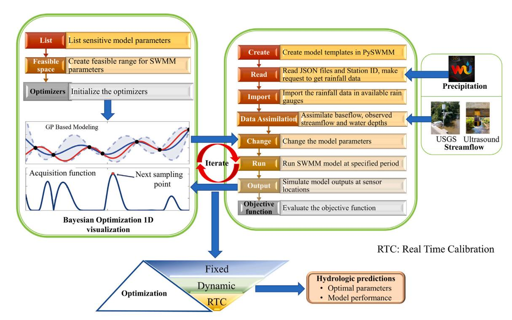
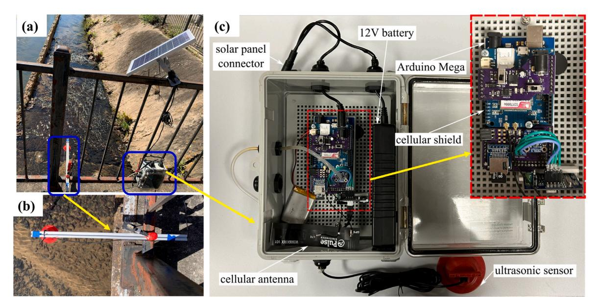
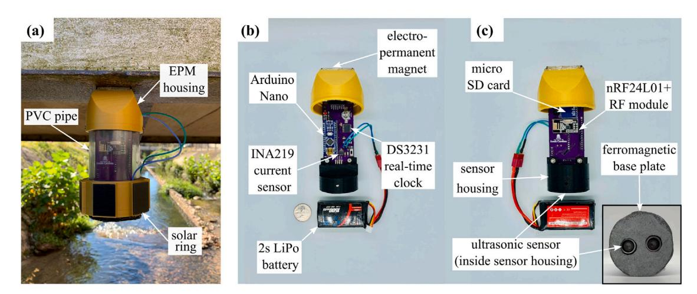
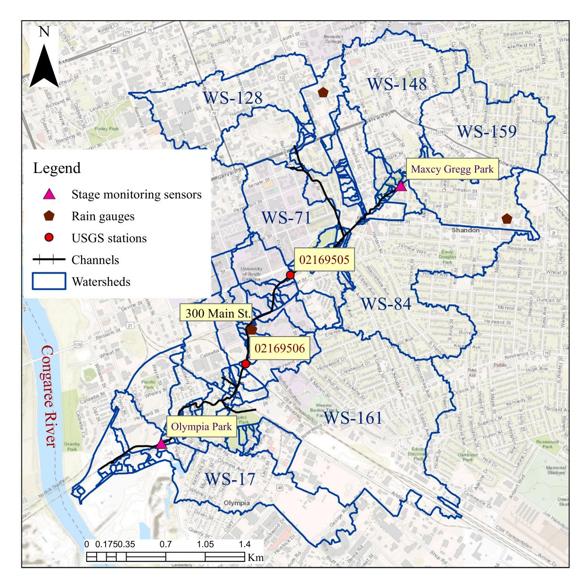
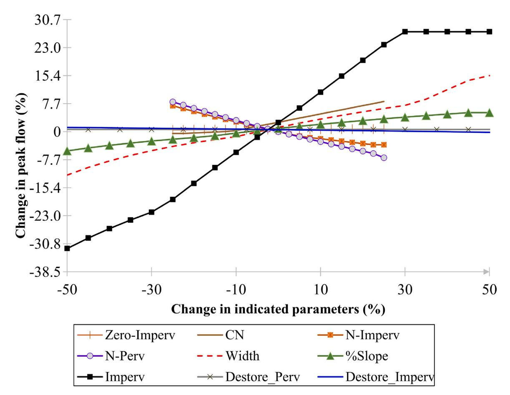
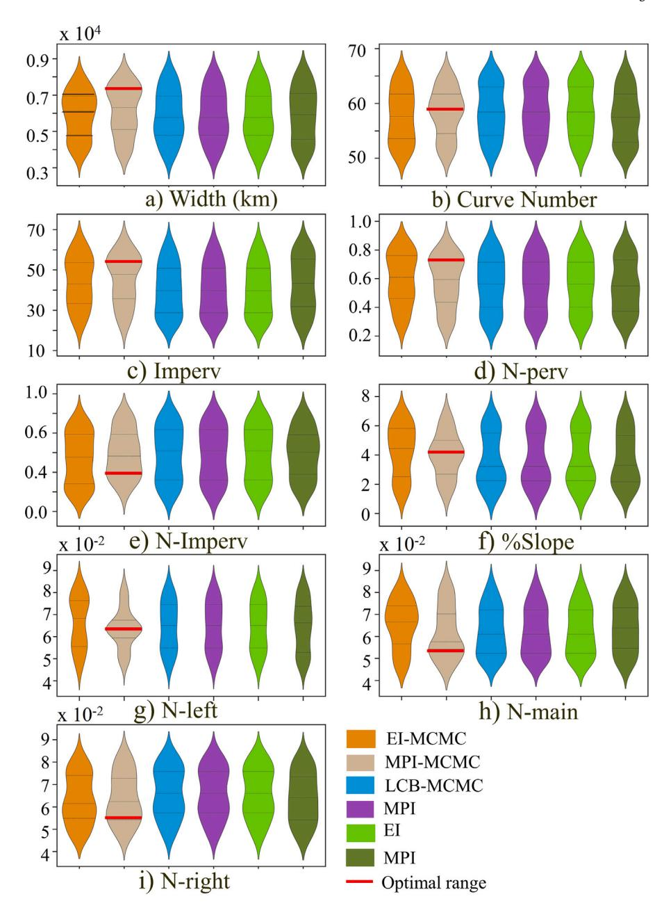
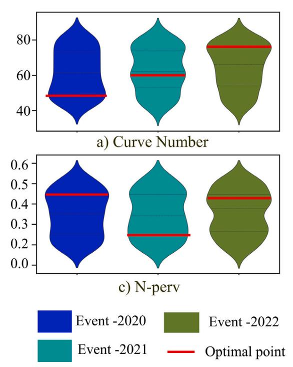
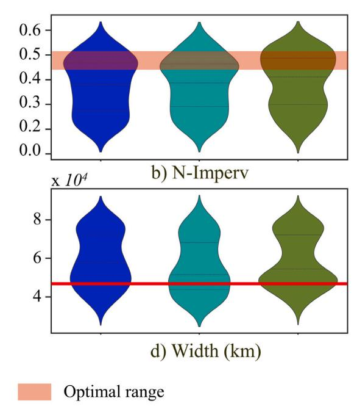
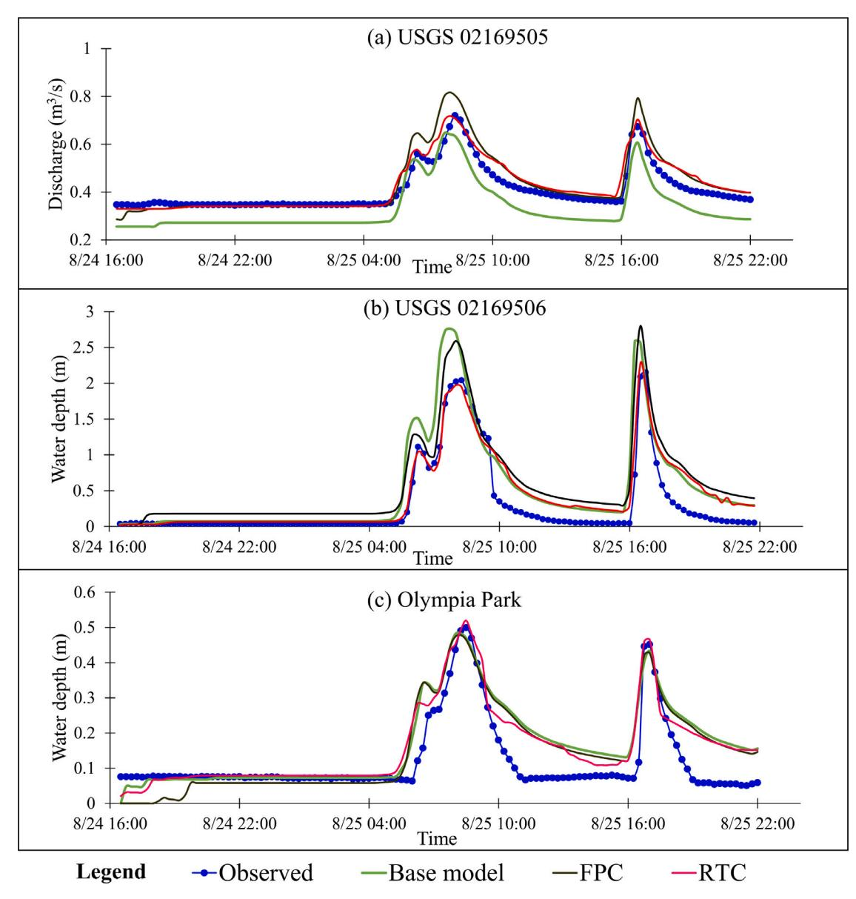

{0}------------------------------------------------

# Position Paper

# Bayes\_Opt-SWMM: A Gaussian process-based Bayesian optimization tool for real-time flood modeling with SWMM

Ahad Hasan Tanim a,c, Corinne Smith-Lewis b, Austin R.J. Downey a,b, Jasim Imran a, Erfan Goharian a,\*

# A R T I C L E I N F O

#### *Keywords:*

Bayesian optimization

SWMM

Hyperparameter

Gaussian process model

Sensor

# A B S T R A C T

Real-time flood model plays a pivotal role in averting urban flood damage, particularly when there is minimal lead time for preparatory measures. However, urban flood modeling in real-time often contends with inherent uncertainties arising from input data uncertainty and parameter ambiguities. This study introduces a real-time calibration (RTC) tool called Bayes\_Opt-SWMM , specifically tailored for real-time urban flood modeling and uncertainty optimization. This tool leverages the Gaussian process-based Bayesian optimization algorithm and interfaces seamlessly with the Stormwater Management Model (SWMM). It integrates real-time model forcing data and flood monitoring collected through sensors and gauges which are strategically placed within critical locations of urban drainage systems. Our approach hinges on the Surrogate Model based Uncertainty Optimization (SMUO) concept, providing an avenue for enhancing real-time flood modeling. Bayes\_Opt-SWMM runs the optimization process using a surrogate model called Gaussian Process emulator with two inference methods: (1) the Gaussian Process (GP) model and (2) Markov Chain Monte Carlo (MCMC) algorithm in GP model (GP\_MCMC). Furthermore, three acquisition functions, namely Expected Improvement (EI), Maximum Probability of Improvement (MPI), and Lower Confidence Bound (LCB), facilitate optimal parameter fitting within the surrogate models. The efficiency of GP-based surrogate models in learning SWMM model parameters, leads to an improved uncertainty quantification and accelerated real-time flood modeling in urban areas. Overall, Bayes\_Opt-SWMM emerges as a cost-effective and valuable tool for real-time flood modeling and monitoring, with significant potential for managing intelligent storm water systems in urban environments.

# **Data and code availability statement**

All data and codes are licensed and available in the following repositories.

*Repositories title:* Bayes\_opt-SWMM codes are available at [https:](https://github.com/Ahad-Hasan-Tanim10/Bayes_opt-SWMM) [//github.com/Ahad-Hasan-Tanim10/Bayes\\_opt-SWMM](https://github.com/Ahad-Hasan-Tanim10/Bayes_opt-SWMM) and the codes for developing Real time streamflow monitoring sensor are available at separate Githib repository namely IOT-Cellular-Dam-Water-Level-Sensor at [https://github.com/ARTS-Laboratory/IoT-Cellular-Dam-Wat](https://github.com/ARTS-Laboratory/IoT-Cellular-Dam-Water-Level-Sensor) [er-Level-Sensor](https://github.com/ARTS-Laboratory/IoT-Cellular-Dam-Water-Level-Sensor)

*Language:* C++ or Python Questions and bugs reports should be submitted using that website or e-mailed to the corresponding author.

*Software:* The Python wrappers for the Stormwater Management Model (SWMM5) have been used for stormwater modeling, sourced from the GitHub repository <https://github.com/pyswmm/pyswmm>. This repository has been developed by McDonnell, Bryant E., Ratliff, Katherine M., Tryby, Michael E., Wu, Jennifer Jia Xin, and Mullapudi, Abhiram. (2020). PySWMM: The Python Interface to Stormwater Management Model (SWMM). Journal of Open Source Software, 5(52), 2292, <https://doi.org/10.21105/joss.02292>.

# **1. Introduction**

The urban hydrologic process exhibits substantial uncertainty in rainfall-runoff response owing to its intricate nature [\(Fletcher et al.](#page-15-0), [2013\)](#page-15-0). Hydrological changes in urbanized watersheds result in heightened flow variability, increased flood frequency, and greater runoff volume with reduced time of concentration [\(Gao et al.](#page-15-1), [2018;](#page-15-1) [Pros](#page-16-0)[docimi et al.,](#page-16-0) [2015](#page-16-0)). The prevalence of impervious land cover in urban watersheds diminishes infiltration while amplifying surface runoff, frequently leading to flooding incidents. Numerical hydrological models

a *Department of Civil & Environmental Engineering, University of South Carolina, Columbia, SC 29208, USA*

b *Department of Mechanical Engineering, University of South Carolina, Columbia, SC 29208, USA*

c *Environmental Sciences Division, Oak Ridge National Laboratory (ORNL), Oak Ridge, TN 37831, USA*

\* Corresponding author.

*E-mail address:* [goharian@cec.sc.edu](mailto:goharian@cec.sc.edu) (E. Goharian).

{1}------------------------------------------------

have been extensively employed for managing urban stormwater, analyzing runoff quantity and quality ([Asgari et al.,](#page-15-2) [2022](#page-15-2); [Salvadore et al.](#page-16-1), [2015\)](#page-16-1).

Among these numerical hydrological models, the Storm Water Management Model (SWMM), developed by the US Environmental Protection Agency (EPA), stands out as a widely used tool for simulating urban hydrological processes, modeling runoff quantity and quality, and facilitating performance analysis, design, urban flood simulation, and the implementation of low-impact development strategies [\(Ross](#page-16-2)[man,](#page-16-2) [2015\)](#page-16-2). Typically, lumped hydrologic models rely on simplified hydrological process representation, ignoring spatially distributed, and highly nonlinear hydrological processes of a watershed ([Vrugt et al.](#page-16-3), [2005\)](#page-16-3). Moreover, uncertainty in the modeling process can manifest in various aspects, including model structure, modeling data, input (forcing), calibration data, and modeling parameters. Often, model parameters introduce considerable uncertainty and exhibit a high degree of freedom ([Liu and Gupta,](#page-15-3) [2007](#page-15-3)). In the pursuit of enhancing model accuracy and robustness for diverse types of watersheds in hydrologic forecasting, the incorporation of data assimilation, calibration, and uncertainty quantification becomes pivotal approaches to improve model performance.

In urban hydrological modeling, uncertainty persists in observations, model parameterization, inputs, and process representation. This uncertainty stems from inaccuracies in hydro-meteorological variable quantification, insufficient spatiotemporal resolution of observations for watershed processes, non-stationary behavior of processes, and complex non-linear interactions among hydrological components (*e.g.*, overland flow, drainage, groundwater recharge, evaporation, precipitation). For instance, in SWMM, some lumped parameters (*e.g.*, imperviousness, sub-catchment width, slope) are considered deterministic based on physical surface and subsurface properties, although physical representation of these parameters often debates while calculation. Consequently, model parameters require frequent calibration due to their inability to be pre-assumed. Literature outlines two primary calibration approaches: manual and automatic calibration procedures ([Gao](#page-15-4) [et al.,](#page-15-4) [2020](#page-15-4)). Manual calibration often relies on subjective ''trial and error'' methods, introducing bias from expert judgments and practitioner experience ([Shahed Behrouz et al.,](#page-16-4) [2020](#page-16-4)). Given the time-consuming nature of manual calibration and computational burdens, automatic calibration tools offer a more efficient option for SWMM calibration.

In recent years, the proliferation of streamflow monitoring sensors and advancements in computational capabilities have expanded opportunities to address hydrological process uncertainty through optimization algorithms ([Salvadore et al.,](#page-16-1) [2015\)](#page-16-1). Leveraging computational speed, automatic calibration methods help to optimize model parameters through extensive trial and error, mitigating the limitations of manual calibration. Various automatic calibration tools have emerged, including the Gauss Marquardt–Levenberg (GML) gradient search algorithm-based Parameter estimation method (PEST) ([Perin](#page-16-5) [et al.](#page-16-5), [2020](#page-16-5)), Bayesian frameworks ([Gao et al.,](#page-15-1) [2018\)](#page-15-1), spatial allocation algorithms ([Yu et al.](#page-16-6), [2022\)](#page-16-6), model predictive control (MPC) ([Sadler](#page-16-7) [et al.,](#page-16-7) [2019](#page-16-7)), Optimization Software Toolkit for Research Involving Computational Heuristics (OSTRICH) for SWMM ([Macro et al.,](#page-15-5) [2019](#page-15-5); [Shahed Behrouz et al.,](#page-16-4) [2020\)](#page-16-4), RSWMM ([Alamdari,](#page-15-6) [2016\)](#page-15-6), genetic parameter optimization [\(Krebs et al.](#page-15-7), [2013\)](#page-15-7), genetic algorithms ([Ghodsi](#page-15-8) [et al.,](#page-15-8) [2020](#page-15-8)), process-oriented real-time correction tools ([Ma et al.](#page-15-9), [2022\)](#page-15-9), and Shuffled Complex Evolution University of Arizona (SCE-UA) ([Kang and Lee,](#page-15-10) [2014](#page-15-10)). These tools finely adjust model parameters, enhancing hydrological forecasting accuracy. However, uncertainty extends beyond parameters and encompasses model structures, inputs, and forcing data.

In hydrological modeling, addressing uncertainty involves tackling three key aspects: identifying uncertainty sources, quantifying uncertainty, and optimization [\(Liu and Gupta](#page-15-3), [2007\)](#page-15-3). Uncertainty optimization in hydrological models primarily revolves around updating process states and estimating parameters through data assimilation ([Morad](#page-16-8)[khani et al.,](#page-16-8) [2005\)](#page-16-8). Sequential data assimilation strategies offer a promising avenue for event-specific model performance adjustments and probabilistic real-time flood mapping ([Jafarzadegan et al.](#page-15-11), [2021](#page-15-11)). Recent studies [\(Baroni et al.](#page-15-12), [2019;](#page-15-12) [Demirel et al.,](#page-15-13) [2018;](#page-15-13) [Feigl et al.](#page-15-14), [2020,](#page-15-14) [2022;](#page-15-15) [Francke et al.](#page-15-16), [2018](#page-15-16)) highlights the significance of incorporating real-time spatially distributed flux and storage component observations, including streamflow data, for parameter calibration in distributed hydrologic models. Given the rapid onset of intense rainfall leading to flash floods in urbanized catchments, real-time flood modeling necessitates hourly or sub-daily scale data assimilation and simultaneous optimization algorithms. However, existing SWMM calibration tools typically optimize model parameters based on long-term hydrologic behavior, lacking simultaneous data assimilation capabilities except for Bayesian approaches [\(Gao et al.](#page-15-1), [2018](#page-15-1)), which update posterior probability density functions based on prior knowledge of model parameters and observations. Therefore, the concept of Bayesian Optimization [\(Vrugt et al.](#page-16-3), [2005](#page-16-3)) holds promise for Real Time Calibration (RTC) thereby, real-time flood monitoring and modeling in urbanized watersheds. Leveraging dense observations from sensor networks, this method extends data assimilation by synergizing simultaneous optimization for SWMM model performance enhancement.

Urban floods typically result from intense rainfall within a short timeframe. Consequently, RTC algorithms must prioritize computational efficiency to complete optimization tasks within the flood forecasting window. Efficiency also hinges on the choice of optimization algorithms. Previous automatic calibration methods have employed various algorithms, including single-objective meta-heuristics (*e.g.*, genetic algorithms), deterministic approaches (gradient descent, stochastic gradient descent), heuristic optimization techniques (Shuffled Complex Evolution, Genetic Algorithm), and uncertainty-based search methods (Markov Chain Monte Carlo). Gradient-based methods often converge to local rather than global optima and are sensitive to initial parameter approximations ([Perin et al.,](#page-16-5) [2020](#page-16-5)). For SWMM automatic calibration, the Complex method ([Barco et al.,](#page-15-17) [2008](#page-15-17)) fails when initial parameter approximations encompass non-convex areas within the optimization function, impeding convergence to optimal solutions. These optimization approaches involve lengthy convergence procedures and are impractical for developing RTC algorithms for real-time hydrologic forecasting. While process-oriented parameter calibration using gradient descent algorithms ([Ma et al.](#page-15-9), [2022](#page-15-9)) can optimize forecasting uncertainty, it restricts data assimilation applicability. When dealing with extensive parameter spaces, narrowing down the search space through deterministic optimization rules becomes computationally taxing and time-intensive. As the number of parameters grows and optimization constraints become more complex, the convergence of stochastic gradient descent algorithms slows down, challenging their application in RTC without substantial computational resource enhancement. Hence, a swift and efficient RTC algorithm is essential for real-time urban flood modeling and monitoring in SWMM.

Gaussian Process based Bayesian optimization (BO) is a powerful tool for automating hyperparameter selection in large-scale Machine Learning (ML) problems ([Shahriari et al.](#page-16-9), [2015\)](#page-16-9). This surrogate modeling using BO has been effectively applied in diverse domains, including environmental monitoring ([Marchant and Ramos,](#page-16-10) [2012\)](#page-16-10), automatic machine learning ([Bergstra et al.](#page-15-18), [2011](#page-15-18)), interfaces automation [\(Seeger](#page-16-11), [2004\)](#page-16-11), robotics, and sensor networking ([Garnett et al.,](#page-15-19) [2010](#page-15-19)). BO relies on Gaussian Process (GP)-based algorithms, which assume an infinitedimensional feature map and approximate sample parameters with a *d*-dimensional multivariate Gaussian distribution. BO's probabilistic optimization model computes the objective function more efficiently than deterministic models, making it suitable for SMUO algorithms. Two key design features align GP-based BO with SMUO: (1) it employs a multivariate Gaussian distribution for prior parameter approximation, preserving multivariate relationships with spatially distributed watersheds, and (2) an acquisition function guides the next iteration's 

{2}------------------------------------------------

sampling points, speeding up the optimization process. Furthermore, BO algorithms leverage Bayesian probability theory to converge to optimal solutions while maintaining an exploration–exploitation balance ([Martinez-Cantin et al.](#page-16-12), [2009](#page-16-12)), rendering GP-based BO a suitable technique for RTC.

Urban flooding emerges as an urgent issue among various extreme flooding events, representing a significant global concern that affects millions of city dwellers worldwide. Real-time urban flood modeling and monitoring are essential for timely flood forecasting and to reduce damage and fatalities during urban floods. Given the rising urban flood frequency, research has intensified to enhance flood forecasting skills and provide better flood hazard risk information to residents. However, previous optimization methods for urban flood modeling mostly perform post-event model calibration that lacks simultaneous parameter optimization and real-time monitoring capacity ([Fava et al.](#page-15-20), [2020\)](#page-15-20). In addition, when applying existing approaches, challenges also remains handling and transferring flood observation data to update modeling, particularly with limited sensor networks, and sensor communication failures during storms, impeding real-time modeling performance. Moreover, real-time uncertainty optimization in urban flood modeling demands more robust and faster optimization processes that underscores the potential of surrogate model-based uncertainty optimization. Additionally, previous research has not adequately implemented robust streamflow monitoring sensors, which are essential for obtaining high-resolution streamflow monitoring, a crucial requirement for real-time model calibration.

Addressing these research gaps, leveraging the potential of GP-based Bayesian optimization, this study aims to create an RTC algorithm for SWMM modeling enhancing the forecasting skills by employing flood monitoring sensors. The development of an RTC tool enhancing real-time streamflow monitoring from sensor data can significantly benefit urban flood modeling in urban watersheds. To achieve this goal, a streamflow monitoring sensor that communicates at minute intervals with the SWMM model, a SMUO based RTC algorithm has been introduced in the current study which enhances flood forecasting skills through SMUO based optimization process. The hypothesis is that employing a SMUO-based automatic calibration tool with a real-time sensor network of stream gauge can facilitate real-time flood modeling and monitoring. Accordingly, the main objective of this study is to develop a RTC package employing real-time streamflow monitoring sensors for the SWMM model using Bayesian optimization with a GPbased surrogate model. This research contribution focuses on creating a real-time flood monitoring sensors along with computationally efficient algorithm for real-time flood modeling, thereby advancing the existing SWMM literature on urban flood modeling with a RTC tool and compatible streamflow monitoring sensor.

In order to achieve this, we introduce an RTC package developed for the SWMM model, namely Bayes\_Opt-SWMM. Moreover, a realtime streamflow monitoring sensor is introduced in the current study which is uniquely suited for RTC. Section [2](#page-2-0) outlines the design features of Bayes\_Opt-SWMM, including the incorporation of streamflow monitoring sensors which are designed to capture RTC needs. Section [3](#page-5-0) presents a case study in the Rocky Branch Watershed, South Carolina, USA, demonstrating the application of Bayes\_Opt-SWMM. Section [4](#page-8-0) provides the performance assessment of the RTC package, followed by a discussion section focusing on potential avenues for future improvement. In the Conclusions section, we underscore the advantages of Bayes\_Opt-SWMM compared to other existing SWMM model calibration packages.

# **2. Design of Bayes\_Opt-SWMM**

In this methodology section, we will delve into the design and implementation of the Bayes\_Opt-SWMM tool for RTC in urban flood modeling using the Stormwater Management Model (SWMM). Surrogate Machine learning based RTC framework consists of three major design features as illustrated in [Fig.](#page-3-0) [1.](#page-3-0)

- 1. **Retrieving real-time sensor data:** This study integrates realtime precipitation data and streamflow monitoring data, which includes baseflow, water depth, and discharge. Precipitation data is sourced from the online platform Weather Underground ([Fig.](#page-3-0) [1](#page-3-0)). Real-time streamflow monitoring sensors (as discussed in Section [2.3\)](#page-4-0) are deployed to monitor water depth during storms. These sensors transmit streamflow monitoring data to the SWMM model through a web-based platform called 'Adafruit IO' at specified time intervals. Additionally, available USGS streamflow measuring stations in the study area are also utilized to retrieve streamflow information [\(Fig.](#page-3-0) [1](#page-3-0)). Real-time data assimilation is conducted at 3-hour intervals during the intended simulation event in the SWMM model.
- 2. **Updating SWMM input files:** SWMM control is facilitated using a Python-based SWMM package called PySWMM, [\(McDonnell](#page-16-13) [et al.](#page-16-13), [2020\)](#page-16-13). A flexible SWMM model template is designed to support rainfall and streamflow data assimilation in the model input. This template also accommodates observed streamflow and perturbed model parameters. The PySWMM is employed to execute rainfall-runoff simulations. The Bayes\_Opt-SWMM tool utilizes the swmm\_api package to configure the SWMM model, specifically the meteorological inputs and forcing data, including precipitation and baseflow information. Following proper model configuration, the input-SWMM file is simulated using the 'PySWMM' package, and model results are exported in surrogate model.
- 3. **SMUO:** The surrogate model based uncertainty optimization tasks ([Fig.](#page-3-0) [1\)](#page-3-0) in Bayes\_Opt-SWMM use a Gaussian process (surrogate model)-based BO package called 'sherpa'. Sherpa ([Hertel](#page-15-21) [et al.](#page-15-21), [2020](#page-15-21)), a hyperparameter optimization library of machine learning, is engaged in this study to optimize the SWMM parameters. Sherpa package uses the 'GPyOpt' package ([https://](https://sheffieldml.github.io/GPyOpt/) [sheffieldml.github.io/GPyOpt/\)](https://sheffieldml.github.io/GPyOpt/) to perform the Bayesian Optimization. The uncertainty analysis and parameter optimization in BO is guided by a probabilistic machine learning model namely Gaussian Process Regression that seeks input–output representation of the model through a surrogate response function ([Fig.](#page-3-0) [1](#page-3-0)). Subsequent sections will provide more in-depth exploration of the Bayes\_Opt-SWMM tool's design and functionality.

# *2.1. Bayesian optimization model*

Existing uncertainty optimization algorithms in machine learning systems encompasses three fundamental methods for hyperparameter search: grid search, random search, and stochastic optimization. Grid search and random search method, often characterized as black-box functions, lack systematic way of dealing with the optimization problems of large parameter matrices. In contrast, the Bayesian Optimization (BO) algorithms, leveraging Gaussian Processes (GP) as employed in this study, primarily fall under the category of stochastic optimization. This approach was developed for hyperparameter optimization in machine learning models, particularly suited for large-scale ML systems ([Shahriari et al.,](#page-16-9) [2015](#page-16-9)). As the number of unknown parameters and search space expand, computational time significantly escalates in parameter optimization, rendering it impractical for RTC tasks in SWMM. Therefore, BO is adopted to mitigate the computational cost in optimization. In this algorithm, Gaussian Process emulator serves as a surrogate model, assimilating different parameter sets based on the prior probability density function. BO employs a probabilistic approach during the sequential search to optimize expensive black-box functions for parameter tuning, ultimately striving for the global optima of an objective function [\(Wang et al.,](#page-16-14) [2017\)](#page-16-14).

This technique, guided by the Bayesian theorem, constructs a surrogate model based on the initial probabilistic distribution guess for parameters. The Bayesian posterior belief iteratively updates to maximize the model's predictive capacity, aided by various acquisition

{3}------------------------------------------------

**Fig. 1.** The SMUO framework for SWMM model using Bayes\_Opt-SWMM.

functions. The BO strategy dynamically balances exploration, aimed at reducing uncertainty in unknown search spaces in global optima, and exploitation, focused on capitalizing on the current best solution to identify optimal parameters during data assimilation in local optima. In summary, Bayes\_Opt-SWMM optimizes model performance by : 1. Establishing a surrogate model grounded in the relationship between input parameters and output objective values. 2. Utilizing an acquisition function to formulate the parameter search process, aided by different kernel functions that enable parameter sampling in a non-parametric manner.

## *2.1.1. Gaussian process emulator*

Gaussian process (GP) models represent a probabilistic and nonparametric modeling technique used for constructing the surrogate models. They captures the uncertain and time-variant nonlinear dynamics within a system using a surrogate response function, particularly when the relationship between parameters and model outcomes is complex. BO-based GP modeling combines Gaussian stochastic regression and Bayesian learning theory to achieve its objectives. In this study, two distinct parameter sampling approaches are employed: (1) the standard GP model and (2) Markov Chain Monte Carlo (MCMC) algorithms for inference within GP models, hereafter referred to as GP\_MCMC. In scenarios involving extensive model runs, MCMC offers an advantage over deterministic approximation, as it allows for the approximation of prior parameter inferences through a multivariate Gaussian distribution.

The model parameters' prior are sampled using Latin hypercube (McKay et al., 2000) sampling which provides faster convergence rate. When optimizing with multiple variables, GP modeling follows the multivariate Gaussian distribution in multivariate relationship. This process presumes the existence of a relationship between model parameters and output  $y$ , formulated as  $y \approx f(x)$ , where model outputs are denoted as  $y^1, y^2, \dots, y^n \sim \mathcal{N}(\mu, \Sigma)$ . The GP model adopts a stochastic process to define the functions of mean ( $\mu$ ) and covariance ( $\Sigma$ ). The GP model can be expressed as a multivariate and infinite-dimensional Gaussian distribution of  $f(x)$ , as outlined below:

$$f(x) = GP(m(q), k(q, q')) \quad (1)$$

$$\begin{bmatrix} f(x_1) \\ \vdots \\ f(x_n) \end{bmatrix} \sim \mathcal{N} \left( \begin{bmatrix} \mu(q_1) \\ \vdots \\ \mu(q_n) \end{bmatrix}, \begin{bmatrix} k(q_1, q_1) & \cdots & k(q_1, q_1) \\ \vdots & \ddots & \vdots \\ k(q_n, q_1) & \cdots & k(q_n, q_n) \end{bmatrix} \right) \quad (2)$$

In the stochastic process represented by  $f$  and the index  $x$  denoting a sequence of random variables in Eq. (1)  $m(q)$  defines a mean function. In Eq. (1),  $k(q, q')$  corresponds to a covariance function or positive-definitive kernel function. The GP\_MCMC model employs an MCMC algorithm to sample parameters from a pre-defined normal distribution.

# *2.1.2. Optimization process*

An acquisition function in BO serves the crucial role of iteratively evaluating the next parameter to be searched. It guides the sampling of new parameter sets from the most promising probability space during the sequential search process. As the total number of iterations increases, the surrogate model learns from more data, leading to improved predictions and a more accurate representation of the target function. This iterative process enhances the surrogate model's understanding of the relationship between input variables and their corresponding output values.

The primary objective of acquisition functions is to steer the search process towards the optimal solution. The choice of the acquisition function significantly influences RTC performance. These functions estimate the utility of different candidate parameters while balancing exploration and exploitation. Typically, higher acquisition values correspond to potentially higher objective function values. Combined with the posterior probability in BO, the acquisition function aids in evaluating the objective function by maximizing the acquisition value. Three commonly used acquisition functions are: (1) expected improvement (EI; [\(Wu et al.,](#page-16-16) [2019](#page-16-16)), 2) maximum probability of improvement (MPI; [\(Brochu et al.,](#page-15-22) [2010\)](#page-15-22)), (3) Lower Confidence Bound (LCB; [Brochu et al.](#page-15-22) [\(2010](#page-15-22))). Additional details about these acquisition functions can be found in [Brochu et al.](#page-15-22) ([2010\)](#page-15-22) and [Wu et al.](#page-16-16) ([2019](#page-16-16)). By combining two Gaussian approaches, GP and GP-MCMC, with these three acquisition functions, a total of six optimization strategies are obtained ([Table](#page-4-1) [1](#page-4-1)). When these acquisition functions are applied in the

{4}------------------------------------------------

**Table 1**  
Description of the Bayesian optimizers engaged in SWMM parameter tuning.

| Optimizer’s name | Prior Acquisition | function | Description |      |             |          |                    |
|------------------|-------------------|----------|-------------|------|-------------|----------|--------------------|
|                  | MPI               | GP       | model       | with | acquisition | function | MPI                |
| GP-EI            | LCB               | GP       | model       | with | acquisition | function | EI                 |
| GP-LCB           | EI                | GP       | model       | with | acquisition | function | LCB                |
| GP_ MCMC-MPI     |                   |          |             |      |             |          |                    |
|                  | MPI_MCMC          | GP       | model       | with | MCMC        | sampling | and MPI            |
|                  |                   |          | acquisition |      | function    |          |                    |
| GP_ MCMC-LCB     | LCB_MCMC          | GP       | model       | with | MCMC        | sampling | and LCB            |
|                  |                   |          | acquisition |      | function    |          |                    |
| GP_ MCMC-EI      | EI_MCMC           | GP       | model       | with | MCMC        | sampling | and EI acquisition |

context of GP\_MCMC, they are denoted as EI\_MCMC, MPI\_MCMC, and LCB\_MCMC, respectively (Table 1).

The calibration and uncertainty analysis in Bayes\_Opt-SWMM are executed using the ‘sherpa’ python package, which also enables parallel computation. This parallel computing capability allows the Bayesian Optimization algorithm for hyperparameter tuning of the surrogate model to run multiple threads concurrently in a parallel computing environment. To thoroughly test efficient automated machine learning algorithms, a range of optimization algorithms is evaluated, as described in Table 1. Each of these optimization algorithms holds significant potential for calibrating SWMM model parameters, contingent upon the behavior of the surrogate response function. The number of parameters considered in SWMM calibration is linked to hydrological characteristics and hydraulic routing elements, including open channels and underground sewers.

## *2.2. Objective functions*

In this Bayesian Optimization (BO) approach, the SWMM model parameters are represented as a set of parameters  $q_{ij} = q_{11}, q_{21}, q_{31}, \dots, q_{ij}$ , and they vary within the feasible space  $\mathbb{Q} \subset \mathbb{R}^{nd}$ . Here,  $\mathbb{R}$  denotes the set of rational numbers for searching SWMM parameters. The objective function in this study is a single objective function defined as Eq. (3), where the objective is consistently aimed at maximizing the accuracy of the urban flood model performance. The goal of the BO is to identify the optimal parameter sets  $q_{ij}$  for the objective function  $Z(q_{ij})$  that maximize model accuracy. The  $\mathbb{Q}$  domain has finite lower and upper bounds for each  $q_{ij}$  parameter.

$$q_{opt} = \frac{\arg \max_{q_{ij} \in \mathbb{Q}} Z(q_{ij})}{q_{ij} \in \mathbb{Q}} \quad (3)$$

where  $q_{opt}$  is the optimal set of parameters,  $Z(q_{ij})$  is the objective function that runs a SWMM model by updating the  $q_{ij}$  parameter and results from the output provides model accuracy. As per the response function  $q_{opt}$ , the optimal set of parameters is determined that maximizes the model accuracy in terms of a statistical measure. In the current study, the Nash–Sutcliffe efficiency (NSE) is used to quantify the accuracy of model performance at a particular location  $k$  of a drainage system (Eq 4). It is considered that  $\widetilde{f}(q_{ij})$  is constructed in a non-intrusive approach in which the SWMM model simulator is involved as a black box model. In every iteration, the surrogate model,  $\widetilde{f}(q_{ij})$  responds with an output objective function  $Z(q_{ij})$ . The objective function  $Z(q_{ij})$  of the surrogate model is expressed as model efficiency in Eq. (4).

$$Z(q_{ij}) = \frac{1}{\sum_{k=1}^k W_k} \sum_{k=1}^k W_k z_k \quad (4)$$

Where  $Z(q_{ij})$  yields the objective values after iterating sampled  $q_{ij}$  sets of parameters from the probability distribution. In Eq. (4)  $z_k$  indicates the magnitude of the accuracy matrices e.g., Nash–Sutcliffe Efficiency (NSE) values which is obtained comparing observed and simulated values at location  $k$ . In Eq. (4),  $W_k$  denotes the weight of the accuracy

matrices at observation points,  $k$ . Here, the measurement of any sensor is treated by equal weight weights. Therefore, the sum of weights is equal to 1.

#### *2.3. Real-time stage monitoring sensor*

In this study, real-time water level sensors (see Fig. 2) are utilized to continuously update observation datasets at specified time intervals. These sensors are open-source, providing a cost-effective solution for real-time flood monitoring. Each sensor is mounted on a structure, typically a bridge, with an ultrasonic sensor attached to an extending arm that reaches over the water surface to measure the distance from the sensor's transducers to the water's surface. The recorded distance is then converted into a water elevation based on the initial sensor elevation. To ensure accurate measurements, the sensor must be positioned on an unobstructed arm, as ultrasonic sensors have a defined spreading angle that creates a measurement cone, and any lateral obstructions can lead to erroneous readings. Additionally, a solar panel is integrated to extend the sensor's deployment period (Fig. 2a). During the initialization process, cellular communication is employed to program the sensors with the initial water elevation and the desired sampling time. This is achieved by modifying parameters through the graphical user interface (GUI) hosted by Adafruit IO. Adafruit IO serves as an open-source cellular broker that facilitates data transmission to and from the sensors, displaying the data for user access. For each data collection cycle, various parameters, including package temperature, battery voltage, ambient pressure, and water level, are transmitted from the sensor package to the GUI via cellular communication enabled by the botletics SIM7000 A cellular shield (see Fig. 2). Data collected over a span of up to 30 days are stored in the GUI feeds and updated in real-time, enabling real-time data capture and manipulation. Furthermore, past data can be downloaded by the user for further analysis. Additional details on the sensor development used can be found in Smith et al. (2022a).

## *2.4. Post-event stage monitoring sensor*

In addition to the real-time stage monitoring sensor, stage monitoring sensor packages were also employed for gathering water level data collection during the event. The working principle of these sensor packages is similar to that of the real-time sensor, except data is extracted after deployment rather than transmitted in real time. These sensor packages employ an electropermanent magnet on the top that allows them to be mounted via unmanned aerial vehicle under ferrous structures, such as bridges (Fig. 3a). This design permits a more discrete deployment than the real-time sensor and is useful for places where mounting area is limited. An ultrasonic sensor (Fig. 3c) is located at the base of the sensor package to record water level and is subject to the same working principle and constraints as the ultrasonic sensor in the real-time stage monitoring sensor. Data is recorded on an SD card and post-processed after deployment, which allows the sensor package to conserve power and operate at a 5 min sampling rate for up to

{5}------------------------------------------------

**Fig. 2.** (a) Installation of the sensor for streamflow monitoring, (b) the ultrasonic sensor placed on top of the channel (c) the schematic of the sensor and different components of it.

**Fig. 3.** (a) Installation of the post-event stage monitoring sensor, (b) the front and (c) back of the internal components.

6 days without an additional power supply. **Fig. 3** shows the sensor package deployed and its relevant internal components. Additional details regarding the stage monitoring sensor packages can be found in Smith et al. (2022b).

# **3. Case study**

# *3.1. Urban flood modeling in the rocky branch watershed*

The Rocky Branch Watershed (RBW) (Fig. 4) was selected as the case study due to its frequent urban flooding issues. Flash flooding is common in the RBW, primarily caused by its highly urbanized surfaces, steep slopes, and a dense storm sewer system lacking adequate open channels. Limited stormwater management through Low Impact Development exacerbates the flood risks. Moreover, the RBW faces increased flooding challenges due to extensive impervious surfaces near the central business district of Columbia, where the RBW originates.

The RBW is situated in downtown Columbia, South Carolina, covering an area of approximately 10.75 km2 with a total drainage length of 7.35 km. The SWMM model used in this study, originally obtained from (Morsy et al., 2016), includes 131 sub-catchments, 188

conduits, 177 nodes, and 3 rainfall measuring gauges (Fig. 4). The storm sewer system consists of both open channels and closed conduits, with sub-catchment sizes ranging from  $10.47 \times 10^{-4}$  to  $0.02 \text{ km}^2$ . Two USGS streamflow monitoring stations (USGS 02169505 and USGS 02169509) report water depth and discharge at 15-minute intervals in the RBW. Additionally, two sensor packages are deployed: one at Maxcy Gregg Park (Fig. 4) to collect baseflow information and another near Olympia Park (Fig. 4) to monitor streamflow. The deployment of sensors, whether real-time or post-event stage monitoring sensors, depends on the intended analysis type as listed in Table 3. For the purpose of sensitivity analysis and calibration, post-event stage monitoring sensors are used. On the other hand, for real-time flood modeling and simulation, real-time stage monitoring sensor is employed. Extensive validation experiments for streamflow sensors are conducted at various locations in the RBW. Ultrasound sensors installed on bridges record water levels at 5-minute intervals during flooding events. Meteorological data, collected at 5-minute intervals by rain gauges, is instantly integrated into SWMM via the Weather Underground web-based platform. Model's base flow conditions are periodically updated with field observed data when simulating a discrete event. A streamflow monitoring sensor was deployed at the headwater (Maxcy Gregg Park) of the watershed to monitor base flow. In this study, Bayes\_Opt-SWMM is

{6}------------------------------------------------

**Fig. 4.** The location of Rocky Branch Watershed in Columbia, South Carolina. The watershed label 'WS-84' is marked as an example.

designed to run iteratively every three hours, even if this duration can be adjusted based on optimization needs. Moreover, the event duration in Bayes\_Opt-SWMM can be expanded according to simulation needs and thereby the event duration for RTC is not constrained.

This study employs the SWMM model for real-time flood modeling using the RTC algorithm. The model simulates three primary hydrological processes: rainfall-runoff, infiltration, and flow routing. Flow routing uses the dynamic wave routing method, allowing ponding over nodes. Rainfall-runoff is simulated using Manning's equation, while infiltration employs the National Resource Conservation Service Curve Number approach. For a more detailed description of the hydrological processes and SWMM model setup, readers are referred to [Morsy et al.](#page-16-19) ([2016\)](#page-16-19).

# *3.2. Parameter sensitivity analysis*

The urban flood simulation in SWMM does not exhibit sensitivity to all runoff parameters. In this study, a total of 14 runoff parameters are considered in SWMM modeling to represent the hydrological processes associated with flooding in the RBW. [Table](#page-7-0) [2](#page-7-0) provides a description of these selected SWMM parameters and their corresponding notations used in this research. When dealing with a large number of model parameters during the calibration process, optimization procedures take complex form. Therefore, it is advantageous to identify the most sensitive parameters and exclude non-sensitive parameters to effectively characterize sensitive parameters for performing the RTC task.

To accomplish this, a pre-calibration sensitivity analysis was conducted to identify the most sensitive parameters for flood modeling in rainfall-runoff process, following the methodology outlined for SWMM in [Shahed Behrouz et al.](#page-16-4) ([2020\)](#page-16-4). This approach involves changing one parameter's value at a time using a one-at-a-time method to observe the impact of parameter changes on the total peak flow in rainfallrunoff modeling. The purpose of conducting a one-at-a-time sensitivity analysis is to comprehend the effect of choosing a parameter range on the relative change of peak flows corresponds to given watershed. The one-at-a-time sensitivity analysis approach involves changing one parameter's value at a time to observe the impact of changed values on the total peak flow in observed watershed. In this approach, each parameter is individually perturbed, and the resulting change in peak flow is determined. The larger the output peak flow changes, the

{7}------------------------------------------------

**Table 2**

Selected SWMM rainfall-runoff and flow routing parameters chosen for the sensitivity analysis.

| Hydrological process | Deterministic parameters and their notation | Uncertain parameters and their notation | Description                           |
|----------------------|---------------------------------------------|-----------------------------------------|---------------------------------------|
|                      | Imperv                                      | Impermeability (%) of the sub-catchment | CN                                    |
| Watershed            | %Slope                                      | Slope of the sub-catchment              | N-perv                                |
|                      | Zero-Imperv                                 | No depression and impermeability rate   | Manning coefficient in permeable area |
|                      | Area                                        | Sub-catchment area                      | Destore_Imperv                        |
|                      | Width                                       | Sub-catchment width                     | Destore_Perv                          |
| Flow routing         | Max. depth                                  | Maximum depth                           | N-left                                |
|                      |                                             |                                         | N-main                                |
|                      |                                             |                                         | N-right                               |
|                      |                                             |                                         | Conduit roughness at left bank        |
|                      |                                             |                                         | Conduit roughness at main channel     |
|                      |                                             |                                         | Conduit roughness at right bank       |

stronger the sensitivity of the parameters. The perturbation range for the SWMM runoff parameters is detailed in [Table A.1](#) ([Appendix A](#)). In other words, the sensitivity analysis evaluates the relative change in peak flow of a watershed's hydrograph after parameter perturbation and then compares it to similar base model estimate. If the relative change in peak flow of a watershed's hydrograph remains within  $\pm 5\%$  of the base model's peak flow, the parameter is classified as "not sensitive". The threshold is established through a trial-and-error method to ensure that the selected threshold does not deal with non-sensitive parameters for further calibration. The threshold may vary when applied to different study areas depending on the peak flow response of the hydrograph and flood volume. Here, a  $\pm 5\%$  threshold is allowed for separating 'non-sensitive' parameters, since their low tolerance in peak flow yield insignificant improvements in modeling accuracy. Otherwise, the parameter is considered as sensitive and included in the subsequent parameter optimization process.

In SWMM rainfall-runoff modeling, certain model parameters are deterministic in nature, while others lack a straightforward method of estimation because they are not solely determined by the physical properties of sub-catchments and drainage systems ([Table](#page-7-0) [2](#page-7-0)). The identified runoff parameters for sensitivity analysis in this study include Imperv, %Slope, Zero-Imperv, Area, Width, CN, N-perv, N-Imperv, Destore\_Imperv, and Destore\_Perv [\(Table](#page-7-0) [2](#page-7-0)). Additionally, sensitivity analysis and calibration include three channel routing parameters, *i.e.*, the Manning's roughness coefficients of the main channel, left bank, and right bank.

# *3.3. Processing the SWMM parameter for SMUO task*

GP based optimization process is guided by GP models (GP or GP-MCMC) and acquisition functions in optimization process. Additionally, In real-time flood model optimization, computational efficiency is constrained by the data assimilation window which is considered as 3 h in the current study. Therefore, the uncertainty optimization of realtime flood forecasting must be finished within the defined timeframe which requires computationally faster optimizers and less complexity in computation. To accelerate the optimization process it is important to determine the fastest optimizers among six SMUO optimizers. To compare the SMUO optimizers initially all sensitive model parameters were used to run the GP model. It is noted that no partitioning of fixed and dynamic parameters is applied when comparing the SMUO optimizers because performance is evaluated for uncertainty optimization of postevent [\(Table](#page-8-1) [3](#page-8-1)). In contrast, the real-time parameter calibration has several constraints including data gathering, data assimilation window, performing the optimization task within the forecasting timeframe. Therefore, to reduce the computational complexity few parameters are fixed within optimal ranges and remaining parameters are allowed to vary within the specified range throughout the optimization process.

In this study, two distinct categories of model parameters have been identified based on their temporal behavior during the optimization process to ease the optimization complexity. Some parameters demonstrate stable behavior, converging to consistent optimal ranges throughout the optimization runs. These parameters, whose optimal ranges remain unchanged across different flood events, are referred to as ''fixed parameters'' in the calibration process. Conversely, there are another type of parameters that exhibit variable convergence with respect to their optimal values across different optimization runs across different events. These parameters are termed as ''dynamic parameters'' in this study. To classify fixed and dynamic parameters to run RTC the optimization is run separately across three different flooding events. The purpose of this analysis is to determine whether each parameter converges to a fixed optimal point or varies within a different range. Their performance was evaluated across flooding events respectively Event IDs 24-Jun-20, 7-Dec-21, and 6-Jun-22 as described in [Table](#page-8-1) [3](#page-8-1). In a RTC run, dynamic parameters are considered only during real-time calibration, while fixed parameters remain constant.

To classify a parameter as fixed or dynamic, three rainfall events were tested in this study. The primary objective of identifying fixed parameters is to reduce the number of parameters involved in real-time calibration. By calibrating a reduced set of parameters, the Bayes\_Opt-SWMM performance is accelerated for real-time flood modeling and model performance optimization. Therefore, the categorization of model parameters into fixed and dynamic parameters significantly enhances the computational efficiency of the optimization process.

# *3.4. Monitoring data and model simulation events*

Five distinct storm events that occurred between 2020 and 2022 were selected for model calibration in this study. Field campaigns were organized during these storms, involving the deployment of stage measuring sensors and rain gauges to collect the necessary data for SWMM modeling. Each storm event is identified by its Event-ID, as presented in [Table](#page-8-1) [3.](#page-8-1) The storm event ''06Jun22'' [\(Table](#page-8-1) [3](#page-8-1)) was used for sensitivity analysis. Another storm event, ''07Dec21'', served as an experiment with various BO optimizers ([Table](#page-8-1) [3\)](#page-8-1). In addition, three storm events were utilized for the calibration experiment, and one

{8}------------------------------------------------

**Table 3**

The storm events considered in the study and their properties and purposes in the analysis.

| Analysis type        | Event-ID  | Storm date a                     | Purpose                                           | Duration (hrs) | Temporal step of rainfall records | Cumulative rainfall depth (mm) |
|----------------------|-----------|---------------------------------------------|---------------------------------------------------|----------------|-----------------------------------|--------------------------------|
| Sensitivity analysis | 6-Jun-22  | 06/16/2022 00:00 -06/18/2022 00:00 | Identify the sensitive parameters for calibration | 48             | 5 min                             | 84.93                          |
|                      | 7-Dec-21  | 12/07/2021 00:00 -12/09/2021 00:00 | Compare the optimizers' efficiency                | 48             | 5 min                             | 19                             |
|                      | 24-Jun-20 | 06/24/2020 00:00 -06/26/2020 00:00 | Identify the fixed parameters                     | 48             | 5 min                             | 58.42                          |
| Calibration          | 7-Dec-21  | 12/07/2021 00:00 -12/09/2021 00:00 | Identify the fixed parameters                     | 48             | 5 min                             | 19                             |
|                      | 6-Jun-22  | 06/16/2022 00:00 06/18/2022 00:00  | Identify the fixed parameters                     | 48             | 5 min                             | 84.93                          |
|                      | 8-Aug-22  | 08/24/2022 16:30 -08/25/2022 22:00 | Run the model with dynamic parameters             | 29.5           | 5 min                             | 31.2                           |

a Storm date time format is MM/DD/YYYY HH:MM

storm event, ''08Aug22'', was chosen for real-time flood modeling and monitoring.

The temporal resolution for precipitation measurements was set at 5-minute intervals, matching the frequency of remote water level measurements obtained from sensors during the storm. Additionally, USGS streamflow gauge measurements, which reported streamflow data at 15-minute intervals, were included in the modeling. Notably, the deployed sensors provided more continuous and high frequency (5 min) streamflow measurements compared to the USGS sensors.

## *3.5. Surrogate model based optimization tasks*

Once the dynamic parameters and required state variables are identified, the RTC framework is deployed for real-time flood modeling. In this study, a RTC cycle with a duration of t = 3 h is implemented, indicating that real-time streamflow (water depth, discharge, and baseflow) and rainfall data are updated at 3-hour intervals. Consequently, the modeling framework is refreshed with new boundary conditions and streamflow information during each RTC cycle. The method is designed to dynamically assimilate rainfall and sensor network data, prompting the Bayes\_Opt-SWMM model to complete the RTC cycle simultaneously. For each SMUO cycle, the following steps, numbered 1 through 6, are iterated to update the SMUO framework, as previously described in Section [2](#page-2-0):

- 1. Initiate the RTC cycle via a routine SWMM simulation when streamflow (water depth and discharge) and rainfall observations for a RTC cycle at time step *t* are available.
- 2. Adjust objective function (Eq. [\(4\)](#page-4-3)) based on the number of sensor gauges observations.
- 3. Initiate the surrogate model GP or GP-MCMC and set the perturbation range of the dynamic parameters.
- 4. Choose the optimizers for parameter calibration and model performance optimization.
- 5. Find the optimal model parameters and report the best matrix of dynamic parameters,  $q_{opt}$  (Eq. (3)).
- 6. Proceed to model forecast for the next RTC cycle.

# *3.6. Efficiency criteria for model evaluation*

The current study employs three goodness-of-fit measures to assess modeling performance: (1) Kling–Gupta efficiency (KGE, Eq. (5), (Gupta et al., 2009)), (2) Nash–Sutcliffe efficiency (NSE, Eq. (6), (Nash and Sutcliffe, 1970), and 3) Root Mean Squared Error (RMSE, Eq. (7)). These metrics provide a comprehensive evaluation of model performance. NSE normalizes performance on a scale from  $-\infty$  to 1, with values of 1 indicating a perfect agreement between observed and simulated data. KGE further decomposes NSE into three components: correlation, bias variability, and mean bias, capturing multiple error characteristics in a single metric (Knoben et al., 2019). The KGE value also ranges from  $-\infty$  to 1, with 1 indicating a perfect agreement. RMSE (Eq. (7)) quantifies the mean square error between simulated and observed values.

$$KGE = 1 - \sqrt{\left(\left(\frac{\text{Cov}_{y_{it}'}}{\sigma\sigma'}\right) - 1\right)^2 + \left(\left(\frac{\sigma'}{\sigma}\right) - 1\right)^2 + \left(\left(\frac{\mu'}{\mu}\right) - 1\right)^2} \quad (5)$$

$$NSE = 1 - \frac{\sum_{t=1}^T (y_t - y'_t)^2}{\sum_{t=1}^T (y_t - \bar{y})^2} \quad (6)$$

$$RMSE = \sqrt{\frac{1}{T} \sum_{i=1}^T (y'_i - y_i)^2} \quad (7)$$

In Eq. (5),  $y_i$  and  $y'_i$  represent the observed and simulated values, respectively. The pairs  $(\mu, \sigma)$  and  $(\mu', \sigma')$  correspond to the first two statistical moments, i.e., the mean and standard deviation of  $y_i$  and  $y'_i$ , respectively.  $Cov_{y_i, y'_i}$  denotes the covariates of the rank variables. KGE, NSE, and RMSE stand for Kling–Gupta efficiency, Nash–Sutcliffe efficiency, and Root Mean Squared Error, respectively.

## **4. Results**

# *4.1. Sensitivity tests*

In the sensitivity analysis of the watershed WS-84, which is shown in [Fig.](#page-10-0) [5](#page-10-0), we explored the impact of nine parameters, namely Imperv, %Slope, Zero-Imperv, Width, CN, N-perv, N-Imperv,

{9}------------------------------------------------

**Table 4** Description of sensitive parameters in SMUO framework.

| categories for            |                        |
|---------------------------|------------------------|
| SWMM Objects Parameters a | Number of spatially    |
|                           | distributed parameters |
| Fixed Watershed           |                        |
| Width                     | 7                      |
| %Slope                    | 7                      |
| N-Imperv                  | 7                      |
| N-Perv                    | 7                      |
| Imperv                    | 7                      |
| CN                        | 7                      |
| N-left                    | 4                      |
| N-main b                  | 7                      |
| N-right                   | 4                      |
| Total                     | 57                     |

a Parameters notation are described in Table 1, at Column 2 and 5.

b N-main includes open channels and closed conduits parameters.

Destore\_Imperv, and Destore\_Perv, on peak flow. This analysis provides valuable insights into parameter sensitivity within the WS-84 model (Fig. 5). Notably, the results highlight that Imperv stands out as the most influential parameter for the WS-84 model in terms of its impact on peak flow runoff. Perturbations in Imperv result in a substantial  $\pm 30\%$  change in peak flow of the runoff hydrograph (Fig. 5). Furthermore, the sensitivity analysis unveils the relative order of parameter sensitivity within the watershed. Following Imperv, Width emerges as the second most sensitive parameter, followed by N-perv, N-Imperv, and CN, as depicted in Fig. 5.

By applying a predefined sensitivity tolerance of  $\pm 5\%$  for WS-84, two parameters, Destore\_Imperv and Zero\_Imperv, are deemed less sensitive as their perturbations result in peak flow changes below the specified threshold. Following a similar approach, we compiled a list of sensitive parameters across the RBW. In total, approximately 57 sensitive parameters were identified for SWMM model calibration (Table 4).

These sensitive parameters are distributed across seven watersheds, collectively contributing to 60%–70% of the total runoff generation in the RBW. Additionally, the sensitivity analysis pinpointed three sensitive parameters, namely N-left, N-main, and N-right, associated with the channel routing process ([Table](#page-9-2) [4\)](#page-9-2). These channel parameters are spatially distributed across seven conduits, encompassing both open channels and underground sewers [\(Table](#page-9-2) [4\)](#page-9-2).

# *4.2. Performance of the SMUO optimizer*

To optimize the SWMM model's parameters for rainfall-runoff modeling, six SMUO optimizer were enlisted: GP-MPI, GP-EI, GP-LCB, GP\_MCMC-MPI, GP\_MCMC-LCB, and GP\_MCMC-EI. These probabilistic optimization algorithms have distinct convergence behaviors towards global optima, which we evaluated based on their performance using the rainfall event ID: 07Dec21 ([Table](#page-8-1) [3](#page-8-1)). We also assessed the average time taken to complete 100 iterations of the optimization process [\(Table](#page-10-1) [5\)](#page-10-1).

Among the optimizers, the GP model with the acquisition function EI displayed the fastest convergence to the optimal solution, completing the optimization process in approximately 23 min ([Table](#page-10-1) [5\)](#page-10-1). However, all six optimizers successfully converged to similar global optima, with performance in the range of 0.82 to 0.83. To gain further insights into their performance, we examined the posterior probability distributions of six watershed parameters within sub-catchment 'WS-84' ([Fig.](#page-11-0) [6](#page-11-0)). These parameters include Width, CN, Imperv, N\_perv, N-Imperv, and Slope %, as well as three conduit parameters within conduit 'c67', which are N-left, N-main, and N-right.

The violin plots in [Fig.](#page-11-0) [6](#page-11-0) provide a visual representation of the distribution and probability density of posterior parameters. Notably, the expected posterior distribution of GP-based optimizers should exhibit a double-lobed shape in the violin plot due to the parameter sampling process progressing with both exploration and exploitation. However, it is evident that most optimizers display irregular performance in targeting the global optima of the objective function, as indicated by the uniform probability distribution. This suggests that their prior probability distributions involved random sampling.

An exception to this pattern is observed with GP\_MCMC-MPI, which executed a targeted searching process to locate the global optima. The red line marked on each violin plot of GP\_MCMC-MPI represents the highest accuracy achieved during parameter tuning. This margin is found over the highest probability density on the violin plot ([Fig.](#page-11-0) [6](#page-11-0)). Consequently, we have chosen GP\_MCMC-MPI as the optimizer to further optimize across three other events' performances to assess the temporal characteristics of parameters, both fixed and dynamic.

## *4.3. Calibration of fixed parameters*

To assess the assumption of fixed and dynamic parameters, we examined their posterior probability density using violin plots [\(Fig.](#page-12-0) [7](#page-12-0)). A violin plot is employed to identify the optimal parameter range characterized by a high-density distribution of optimized parameters. Broad sections of the plot signify areas with a high density of optimal data points, indicating that these ranges frequently yield the best results. These optimal ranges were obtained using the GP\_MCMC-MPI optimizer, and the optimization was performed for three different events to determine whether parameters exhibit fixed or dynamic behavior ([Fig.](#page-12-0) [7\)](#page-12-0).

Among the parameters analyzed, the violin plots for four parameters—CN, N-Imperv, N-Perv, and Width—revealed interesting insights regarding their fixed or dynamic nature ([Fig.](#page-12-0) [7](#page-12-0)). Based on the analysis, we identified that Width and N-Imperv in subcatchment 'WS-84' are fixed parameters because their optimal ranges remained relatively stable across different events ([Fig.](#page-12-0) [7\)](#page-12-0). On the other hand, CN and N-Perv exhibited dynamic behavior, as their optimal ranges varied between events [\(Fig.](#page-12-0) [7](#page-12-0)). Additionally, we reported the best-fit distribution functions of the posterior parameters in [Table](#page-10-2) [6](#page-10-2). These probability distribution functions can be applied to reproduce the fixed parameters of the SWMM model for calibration purposes. However, the dynamic parameters do not follow a fixed probability

{10}------------------------------------------------

**Fig. 5.** The sensitivity test of runoff parameters of sub-catchment 'WS-84'.

**Table 5** Performance summary of different Bayesian Optimizers in SWMM parameter optimization.

| Specification of computational resources | Prior sampling approach | Acquisition function | Average elapsed time (hh:mm:ss) to perform | Global optima |
|------------------------------------------|-------------------------|----------------------|--------------------------------------------|---------------|
| Intel i7-9700 CPU@3.00 GHz               | GP                      | MPI                  | 0:34:52                                    | 0.82          |
|                                          |                         | LCB                  | 0:33:22                                    | 0.82          |
|                                          |                         | EI                   | 0:23:15                                    | 0.83          |
|                                          |                         | MPI_MCMC             | 1:13:46                                    | 0.83          |
|                                          |                         | LCB_MCMC             | 1:21:10                                    | 0.82          |
| GP_MCMC                                  | EI_MCMC                 | 1:00:01              | 0.82                                       |               |

**Table 6** Best fit probability distribution function of the fixed parameters.

| Parameter name | Fitted distribution function 3 | Rank order = 2       | Rank order = 3    |
|----------------|-------------------------------------------|----------------------|-------------------|
| N-imp          | Johnson Special Bounded                   | Beta                 | Mielke Beta-Kappa |
| %Slope         | Gauss hypergeometric                      | Uniform              | Power law         |
| Width          | Johnson Special Bounded                   | Gauss hypergeometric | Beta              |

distribution function since their posterior probability density functions change from one event to another.

In total, our analysis identified 21 fixed parameters and 36 dynamic parameters (as shown earlier at [Table](#page-9-2) [4\)](#page-9-2), contributing to a comprehensive understanding of parameter behavior and aiding in the calibration of the SWMM model.

# *4.4. SMUO tool performance*

In order to assess the performance of the SMUO tool, we engaged the Bayes\_Opt-SWMM for real-time flood monitoring during the storm event that occurred on August 8, 2022 (08Aug22). We compared the observed and simulated streamflow at three gauges, as shown in [Fig.](#page-13-0) [8](#page-13-0).

{11}------------------------------------------------

**Fig. 6.** Posterior parameters' distribution of six optimizers shown using violin plots. Six runoff parameters (a-f) are associated with watershed 'WS-84': (a) Width, (b) Curve Number, (c) Imperviousness (%), (d) Manning's roughness coefficient (N) for pervious area, (e) Manning's roughness coefficient (N) for impervious area, and (f) Slope (%). Three channel parameters (g-i) are associated with conduit 'c67': (g) Manning's roughness coefficient (N) for the left bank, (h) Manning's roughness coefficient (N) for the main channel, (i) Manning's roughness coefficient (N) for the right bank. The optimal parameter ranges traced by MPI-MCMC are marked by the red line.

One of these gauges, Olympia Park ([Fig.](#page-13-0) [8c](#page-13-0)), was placed near the Rocky Branch Watershed for validation purposes. We conducted three different parameter configurations of the SWMM model to understand the impact of the SMUO technique on overall modeling performance:

*Scenario 1 (Base Model):* In this scenario, we simulated the storm event 08Aug22 using the base model without changing any parameters. The base model is based on the SWMM model developed by [Morsy et al.](#page-16-19) ([2016\)](#page-16-19).

*Scenario 2 (Fixed Parameter Calibration (FPC)):* The storm event 08Aug22 is simulated fitting all 21 fixed parameters in the SWMM model, as described in Section [4.3.](#page-9-3)

*Scenario 3 (RTC):* Here, we initiated an RTC by first setting the fixed parameters to their optimal ranges. Subsequently, during the subsequent SMUO cycle, the dynamic parameters were allowed to be calibrated to further optimize flood simulation performance. The SMUO cycle was specified at 3 h, meaning that observed data were updated at 3-hour intervals, and the SWMM model was optimized simultaneously once new observation data became available. Input forcing data (rainfall and baseflow) and available streamflow observations at USGS 02169505 and 02169506 (see [Fig.](#page-6-0) [4](#page-6-0) for their locations) were assimilated in this scenario.

Across all three gauges, the baseflow data assimilation showed an improvement in RTC simulation compared to the base model case (Scenario 1). Notably, [Fig.](#page-13-0) [8c](#page-13-0) (Olympia Park) indicated that the base model simulation initially missed the baseflow in the first three hours of model execution. In contrast, the RTC approach (Scenario 3) effectively captured flood peaks at all three different gauges.

When simulating the streamflow at USGS 02169505, the base model underestimated the streamflow, while the FPC (Scenario 2) overestimated it ([Fig.](#page-13-0) [8](#page-13-0)a). Similarly, the streamflow simulation at USGS

{12}------------------------------------------------

**Fig. 7.** The fixed parameters, including, Width and N-Imperv and dynamic parameters, including, CN and N-Perv, are sorted using the MPI\_MCMC optimizer. The optimization result is presented for four parameters of the sub-catchment, 'WS-84'.

02169506 showed that both the base model and FPC (Scenarios 1 and 2) overestimated the streamflow ([Fig.](#page-13-0) [8](#page-13-0)b). In the case of Olympia Park [\(Fig.](#page-13-0) [8c](#page-13-0)), the simulated depth appeared insensitive to any model scenario. Furthermore, KGE statistics ([Table](#page-13-1) [7](#page-13-1)) for the FPC and RTC scenarios were 0.65 and 0.64, respectively. These values indicate good model performance for both scenarios. However, the base model exhibited performance deviations due to baseflow underestimation.

In all modeling scenarios, errors were observed at the recession limbs of the hydrographs, as shown in [Fig.](#page-13-0) [8a](#page-13-0), 8b, and 8c. The source of these errors, which caused a slower recession of floodwater, was associated with the formulation of the hydrograph in the base model rather than the model parameters. These results demonstrate the potential benefits of real-time calibration through SMUO in improving flood modeling accuracy and capturing the dynamics of flood events.

[Table](#page-13-1) [7](#page-13-1) presents the performance metrics for the three modeling scenarios: the base model, Fixed Parameter Calibration (FPC), and Real-Time Calibration (RTC). The models were evaluated using three statistics: Kling–Gupta Efficiency (KGE), Nash–Sutcliffe Efficiency (NSE), and Root Mean Squared Error (RMSE), which are reported for three different gauges of streamflow observation.

At gauges USGS 02169505, USGS 02169506, and Olympia Park, the KGE values for the RTC scenario were 0.82, 0.57, and 0.64, respectively ([Table](#page-13-1) [7\)](#page-13-1). For the FPC scenario, the KGE values were 0.56, 0.09, and 0.65, respectively. In contrast, the base model yielded KGE values of 0.78, 0.21, and 0.58 at these three gauges. These results clearly indicate that the SMUO approach implemented in the RTC scenario significantly improved the model's performance in terms of KGE. The NSE values also showed a gradual improvement in model performance from the base model simulation (Scenario 1) to the RTC scenario (Scenario 3). For example, at Olympia Park, the NSE values for the base model and FPC scenarios were 0.51 and 0.50, respectively ([Table](#page-13-1) [7\)](#page-13-1). In contrast, the RTC scenario achieved an NSE of 0.62, indicating a substantial enhancement in model performance. Regarding RMSE, the base model and FPC scenarios at Olympia Park resulted in RMSE values of 0.076 m for both. However, the RTC scenario reduced the RMSE to 0.067 m, indicating a reduction in simulation error.

In summary, the evaluation of model performance using KGE, NSE, and RMSE metrics consistently demonstrated that the RTC scenario, which employed real-time calibration through SMUO, outperformed both the base model and the FPC scenario. This suggests that the realtime calibration approach can significantly improve flood modeling accuracy and overall performance during flood events.

## **5. Discussions**

Real-time flood modeling plays a crucial role in flood risk management by enabling faster decision-making. Damages in flood events can escalate rapidly, and in order to minimize flood damage timely and accurate flood risk information is essential for effective response and mitigation. However, operational flood models often suffer from high uncertainty due to model parameters and state variables. To address these challenges, this study introduced the use of the surrogate based uncertainty optimization approach, implemented through the Bayes\_Opt-SWMM tool, for real-time streamflow modeling. The results of this research demonstrated the potential for significant improvements in real-time flood modeling performance. One of the key advantages of the SMUO approach is its ability to establish surrogate response function that can provide computationally efficient optimization through surrogate modeling since ML model can learn complex model structures efficiently. By using surrogate models, the optimization process becomes faster and more responsive, which is critical in real-time flood modeling. However, there is still room for further improvement in the SMUO approach by exploring computationally faster and more accurate acquisition functions within the optimization algorithm. In addition, non-gaussian assumption on SMUO can be tested in future studies.

Recent advancements in urban drainage management, such as smart stormwater systems, offer promising solutions for minimizing overflow, addressing water pollution, and enhancing flood monitoring in urban areas. However, the prediction horizon for urban flood events has typically been limited to short-term forecasts, ranging from 15 to 90 min. In this study, it was observed that flood peaks took approximately 30 to 40 min to propagate from the headwater of the RBW to downstream

{13}------------------------------------------------

**Fig. 8.** Simulation results of Bayes\_Opt-SWMM for the experiment during storm event 08Aug22 are shown at (a) USGS 02169505, (b) USGS 02169506, (c) Olympia Park.

**Table 7** Performance summary of the parameter optimization for three different model scenarios.

| Station a Streamflow variable Statistics b | Base model (Scenario 1) | FPC (Scenario 2) | RTC (Scenario 3) |
|--------------------------------------------|-------------------------|------------------|------------------|
| USGS 02169505 Discharge                    |                         |                  |                  |
| KGE                                        | 0.78                    | 0.56             | 0.82             |
| NSE                                        | 0.21                    | 0.68             | 0.83             |
| RMSE (m 3 /s)                              | 0.08                    | 0.05             | 0.036            |
| USGS 02169506 Depth                        |                         |                  |                  |
| KGE                                        | 0.27                    | 0.09             | 0.57             |
| NSE                                        | 0.56                    | 0.59             | 0.83             |
| RMSE (m)                                   | 0.36                    | 0.34             | 0.22             |
| Olympia Park Depth                         |                         |                  |                  |
| KGE                                        | 0.58                    | 0.65             | 0.64             |
| NSE                                        | 0.51                    | 0.5              | 0.62             |
| RMSE (m)                                   | 0.076                   | 0.076            | 0.067            |

a Parameters notation are described in [Table](#page-4-1) [1](#page-4-1), at Column 2 and 5.

b The statistics are calculated as per Section [3.5](#page-8-6).

areas before discharging into the Congaree River. The computational time required for the SMUO task, although valuable, can be a limiting factor in delivering real-time flood information when operating in slow computational systems. To address this, two potential strategies were discussed: increasing computational resources and applying computationally efficient optimization algorithms.

{14}------------------------------------------------

In the current study, a prior experiment is designed to identify sensitive model parameters. The computational efficiency was enhanced through a prior experiment because the flood simulation process is not sensitive to all SWMM parameters. The optimization tools developed in this study assume limited computational resources at the user end. Additionally, partitioning fixed and dynamic parameters saved computational time, as the study mainly focused on real-time flooding event simulations with 3-hour nowcasting windows. Designing such prior experiments by selecting optimal optimizers and defining more certain parameter behaviors can conserve computational resources. This computational advantage makes Bayes\_Opt-SWMM accessible and affordable for flood-prone cities in undeveloped countries. Bayes\_Opt-SWMM sorts the desired list of parameters using one-at-a-time sensitivity analysis. This method may underestimate the individual contribution of random parameters when continuing for long term operation. To better assess the relative importance of different parameters, global sensitivity analysis techniques such as variancebased and variogram-based methods can be utilized ([Alipour et al.](#page-15-26), [2022\)](#page-15-26).

The study also highlighted the importance of probabilistic optimization in real-time flood modeling. Unlike deterministic optimization, which seeks a single best solution, probabilistic optimization aims to estimate a probability distribution over the solution space. This distribution provides valuable insights into the uncertainty associated with model parameters and predictions, enhancing decision-making in flood risk management. Moreover, the SMUO approach introduced a novel concept of distinguishing between fixed and dynamic parameters in the SWMM model. This differentiation reduced the computational burden in real-time calibration (RTC) and facilitated faster decisionmaking during flood events. The Bayes\_Opt-SWMM tool offers several advantages, such as generating initial parameter sampling using multivariate Gaussian distribution and Markov Chain Monte Carlo (MCMC) sampling. This approach aligns well with the assumptions of Gaussian Process (GP) regression and contributes to efficient optimization and uncertainty quantification. Additionally, the study highlighted the potential applications of Bayes\_Opt-SWMM in various hydrological optimization problems, including low-impact development design and implementation in urban watersheds.

Finally, this research demonstrates the potential of novel sensor application, synchronized through Bayes\_Opt-SWMM, for improving real-time flood modeling and flood risk management. The study emphasizes the importance of efficient optimization algorithms, probabilistic optimization, and the differentiation of fixed and dynamic parameters in enhancing flood modeling accuracy and decision-making processes. Furthermore, the application of this approach extends to other hydrological optimization problems, contributing to more effective urban watershed management.

# **6. Summary and conclusions**

In this study, we introduced and applied the Bayes\_Opt-SWMM framework for real-time optimization of the Stormwater Management Model (SWMM) within the context of the RBW. Our focus was on enhancing real-time flood modeling through a novel Surrogate model-based Uncertainty Optimization (SMUO) approach. Bayes\_Opt-SWMM offers six compatible parameter optimization algorithms, including GP-MPI, GP-EI, GP-LCB, GP\_MCMC-MPI, GP\_MCMC-LCB, and GP\_MCMC-EI, designed to improve real-time flood modeling and parameter uncertainty estimation.

One of the key contributions of this study is the utilization of GP\_MCMC-MPI to distinguish between fixed and dynamic parameters in the SWMM model. This differentiation provides a critical advantage for real-time calibration (RTC) by reducing computational overhead. The analysis revealed that the optimal range of dynamic parameters varies from one flood event to another, highlighting the importance of adaptive modeling. Compared to other automatic calibration packages, Bayes\_Opt-SWMM offers several distinct advantages. First, it provides flexibility of sensor networks or streamflow gauges for data retrieval, enhancing adaptability to evolving monitoring needs. Second, the framework significantly reduces computational complexity during real-time optimization by focusing on dynamic parameters, ensuring efficient model updates. Third, unlike deterministic optimization algorithms, Bayes\_Opt-SWMM employs probabilistic optimization, enabling the identification of the most probable sets of parameter search for optimal model performance while considering a set of constraints. This probabilistic approach aligns well with the inherent uncertainties in real-time flood modeling and provides valuable insights into parameter uncertainty. Moreover, Bayes\_Opt-SWMM offers a cost-effective solution for real-time flood modeling and monitoring. The open-source nature of the software and sensor development codes ensures accessibility and affordability for a wide range of users, facilitating its adoption in various hydrological applications.

To further enhance the Bayes\_Opt-SWMM framework, future studies can focus on improving non-Gaussian process and incorporating more robust acquisition functions. Additionally, ongoing advancements in sensor technologies and computational resources will continue to enhance the capabilities of real-time flood modeling and monitoring systems.

In conclusion, the Bayes\_Opt-SWMM framework, coupled with the SMUO approach, represents a significant step forward in real-time flood modeling and risk management. Its flexibility, efficiency, and probabilistic nature make it a valuable tool for decision-makers and researchers alike, offering a powerful means to address the complex challenges associated with urban flood forecasting and mitigation.

# **CRediT authorship contribution statement**

**Ahad Hasan Tanim:** Writing – original draft, Validation, Methodology, Formal analysis, Data curation. **Corinne Smith-Lewis:** Writing – original draft, Visualization, Formal analysis, Data curation. **Austin R.J. Downey:** Writing – review & editing, Resources, Investigation, Conceptualization. **Jasim Imran:** Writing – review & editing, Supervision, Resources, Funding acquisition, Conceptualization. **Erfan Goharian:** Writing – review & editing, Supervision, Resources, Project administration, Methodology, Investigation, Funding acquisition, Conceptualization.

# **Declaration of competing interest**

The authors declare that they have no known competing financial interests or personal relationships that could have appeared to influence the work reported in this paper.

# **Data availability**

We have shared all data and codes used for this paper online.

# **Acknowledgments**

This work is partially supported by an ASPIRE grant from the Office of the Vice President for Research at the University of South Carolina. Ahad Hasan Tanim is an employee of UT-Battelle, LLC, under contract DE-AC05-00OR22725 with the US DOE. Accordingly, the US government retains and the publisher, by accepting the article for publication, acknowledges that the US government retains a nonexclusive, paid-up, irrevocable, worldwide license to publish or reproduce the published form of this manuscript or allow others to do so, for US Government purposes.

# **Appendix A**

See [Table](#page-15-23) [A.1](#page-15-23).

{15}------------------------------------------------

**Table A.1**

The perturbation range defined to test parameters sensitivity in SWMM model.

| Modeling components Parameters name a | Perturbation | range |             |
|---------------------------------------|--------------|-------|-------------|
|                                       | Lower        | bound | Upper bound |
| Width                                 | −            | 50%   | 50%         |
| %Slope                                | −            | 50%   | 50%         |
| CN                                    | −            | 25%   | 25%         |
| N-perv                                | −            | 25%   | 25%         |
| N-Imprv                               | −            | 25%   | 25%         |
| Destore_Imperv                        | −            | 50%   | 50%         |
| Destore_Perv                          | −            | 75%   | 75%         |
| Zero-Imperv                           | −            | 25%   | 25%         |
| Combined sewers                       |              |       |             |
| N-left                                | −            | 25%   | 25%         |
| N-main b                              | −            | 50%   | 75%         |
| N-right                               | −            | 25%   | 25%         |

a Parameters notation are described in [Table](#page-4-1) [1,](#page-4-1) at Column 2 and 5.

b N-main includes open channels and closed conduits parameter.

**Table B.1** List of acronyms.

| Acronym | Description                                    | Acronym | Description                     |
|---------|------------------------------------------------|---------|---------------------------------|
| SWMM    | Stormwater Management Model                    | GUI     | graphical user interface        |
| RTC     | Real-Time Calibration                          | RBW     | Rocky Branch Watershed          |
| SMUO    | Surrogate Model based Uncertainty Optimization | KGE     | Kling-Gupta efficiency          |
| GP      | Gaussian Process                               | RMSE    | Root Mean Squared Error         |
| EI      | Expected Improvement                           | NSE     | Nash-Sutcliffe efficiency       |
| MCMC    | Markov Chain Monte Carlo                       | FPC     | Fixed Parameter Calibration     |
| MPI     | maximum probability of improvement             | PySWMM  | Python-based SWMM package       |
| LCB     | Lower Confidence Bound                         | EPA     | Environmental Protection Agency |

# **Appendix B**

See [Table](#page-15-29) [B.1.](#page-15-29)

# **References**

[Alamdari, N., 2016. Development of a robust automated tool for calibrating a SWMM](http://refhub.elsevier.com/S1364-8152(24)00183-X/sb1) [watershed model. In: World Environmental and Water Resources Congress 2016.](http://refhub.elsevier.com/S1364-8152(24)00183-X/sb1) [pp. 221–228.](http://refhub.elsevier.com/S1364-8152(24)00183-X/sb1) [Alipour, A., Jafarzadegan, K., Moradkhani, H., 2022. Global sensitivity analysis in](http://refhub.elsevier.com/S1364-8152(24)00183-X/sb2) [hydrodynamic modeling and flood inundation mapping. Environ. Model. Softw.](http://refhub.elsevier.com/S1364-8152(24)00183-X/sb2) [152, 105398.](http://refhub.elsevier.com/S1364-8152(24)00183-X/sb2) [Asgari, M., Yang, W., Lindsay, J., Tolson, B., Dehnavi, M.M., 2022. A review of par](http://refhub.elsevier.com/S1364-8152(24)00183-X/sb3)[allel computing applications in calibrating watershed hydrologic models. Environ.](http://refhub.elsevier.com/S1364-8152(24)00183-X/sb3) [Model. Softw. 151, 105370.](http://refhub.elsevier.com/S1364-8152(24)00183-X/sb3) [Barco, J., Wong, K.M., Stenstrom, M.K., 2008. Automatic calibration of the US EPA](http://refhub.elsevier.com/S1364-8152(24)00183-X/sb4) [SWMM model for a large urban catchment. J. Hydraul. Eng. 134 \(4\), 466–474.](http://refhub.elsevier.com/S1364-8152(24)00183-X/sb4) [Baroni, G., Schalge, B., Rakovec, O., Kumar, R., Schüler, L., Samaniego, L., Simmer, C.,](http://refhub.elsevier.com/S1364-8152(24)00183-X/sb5) [Attinger, S., 2019. A comprehensive distributed hydrological modeling intercompar](http://refhub.elsevier.com/S1364-8152(24)00183-X/sb5)[ison to support process representation and data collection strategies. Water Resour.](http://refhub.elsevier.com/S1364-8152(24)00183-X/sb5) [Res. 55 \(2\), 990–1010.](http://refhub.elsevier.com/S1364-8152(24)00183-X/sb5) [Bergstra, J., Bardenet, R., Bengio, Y., Kégl, B., 2011. Algorithms for hyper-parameter](http://refhub.elsevier.com/S1364-8152(24)00183-X/sb6) [optimization. Adv. Neural Inf. Process. Syst. 24.](http://refhub.elsevier.com/S1364-8152(24)00183-X/sb6) Brochu, E., Cora, V.M., De Freitas, N., 2010. A tutorial on Bayesian optimization of expensive cost functions, with application to active user modeling and hierarchical reinforcement learning. arXiv preprint [arXiv:1012.2599](http://arxiv.org/abs/1012.2599).

[Demirel, M.C., Mai, J., Mendiguren, G., Koch, J., Samaniego, L., Stisen, S., 2018.](http://refhub.elsevier.com/S1364-8152(24)00183-X/sb8) [Combining satellite data and appropriate objective functions for improved spatial](http://refhub.elsevier.com/S1364-8152(24)00183-X/sb8) [pattern performance of a distributed hydrologic model. Hydrol. Earth Syst. Sci. 22](http://refhub.elsevier.com/S1364-8152(24)00183-X/sb8) [\(2\), 1299–1315.](http://refhub.elsevier.com/S1364-8152(24)00183-X/sb8) [Fava, M.C., Mazzoleni, M., Abe, N., Mendiondo, E.M., Solomatine, D.P., 2020. Improv](http://refhub.elsevier.com/S1364-8152(24)00183-X/sb9)[ing flood forecasting using an input correction method in urban models in poorly](http://refhub.elsevier.com/S1364-8152(24)00183-X/sb9) [gauged areas. Hydrol. Sci. J. 65 \(7\), 1096–1111.](http://refhub.elsevier.com/S1364-8152(24)00183-X/sb9) [Feigl, M., Herrnegger, M., Klotz, D., Schulz, K., 2020. Function space optimization:](http://refhub.elsevier.com/S1364-8152(24)00183-X/sb10) [A symbolic regression method for estimating parameter transfer functions for](http://refhub.elsevier.com/S1364-8152(24)00183-X/sb10) [hydrological models. Water Resour. Res. 56 \(10\), e2020WR027385.](http://refhub.elsevier.com/S1364-8152(24)00183-X/sb10) [Feigl, M., Thober, S., Schweppe, R., Herrnegger, M., Samaniego, L., Schulz, K., 2022.](http://refhub.elsevier.com/S1364-8152(24)00183-X/sb11) [Automatic regionalization of model parameters for hydrological models. Water](http://refhub.elsevier.com/S1364-8152(24)00183-X/sb11) [Resour. Res. e2022WR031966.](http://refhub.elsevier.com/S1364-8152(24)00183-X/sb11) [Fletcher, T.D., Andrieu, H., Hamel, P., 2013. Understanding, management and mod](http://refhub.elsevier.com/S1364-8152(24)00183-X/sb12)[elling of urban hydrology and its consequences for receiving waters: A state of the](http://refhub.elsevier.com/S1364-8152(24)00183-X/sb12) [art. Adv. Water Resour. 51, 261–279.](http://refhub.elsevier.com/S1364-8152(24)00183-X/sb12) [Francke, T., Baroni, G., Brosinsky, A., Foerster, S., López-Tarazón, J.A., Sommerer, E.,](http://refhub.elsevier.com/S1364-8152(24)00183-X/sb13) [Bronstert, A., 2018. What did really improve our mesoscale hydrological model? A](http://refhub.elsevier.com/S1364-8152(24)00183-X/sb13) [multidimensional analysis based on real observations. Water Resour. Res. 54 \(11\),](http://refhub.elsevier.com/S1364-8152(24)00183-X/sb13) [8594–8612.](http://refhub.elsevier.com/S1364-8152(24)00183-X/sb13) [Gao, J., Kirkby, M., Holden, J., 2018. The effect of interactions between rainfall](http://refhub.elsevier.com/S1364-8152(24)00183-X/sb14) [patterns and land-cover change on flood peaks in upland peatlands. J. Hydrol.](http://refhub.elsevier.com/S1364-8152(24)00183-X/sb14) [567, 546–559.](http://refhub.elsevier.com/S1364-8152(24)00183-X/sb14) [Gao, X., Yang, Z., Han, D., Huang, G., Zhu, Q., 2020. A framework for automatic](http://refhub.elsevier.com/S1364-8152(24)00183-X/sb15) [calibration of SWMM considering input uncertainty. Hydrol. Earth Syst. Sci. Discuss.](http://refhub.elsevier.com/S1364-8152(24)00183-X/sb15) [1–25.](http://refhub.elsevier.com/S1364-8152(24)00183-X/sb15) [Garnett, R., Osborne, M.A., Roberts, S.J., 2010. Bayesian optimization for sensor](http://refhub.elsevier.com/S1364-8152(24)00183-X/sb16) [set selection. In: Proceedings of the 9th ACM/IEEE International Conference on](http://refhub.elsevier.com/S1364-8152(24)00183-X/sb16) [Information Processing in Sensor Networks. pp. 209–219.](http://refhub.elsevier.com/S1364-8152(24)00183-X/sb16) [Ghodsi, S.H., Zahmatkesh, Z., Goharian, E., Kerachian, R., Zhu, Z., 2020. Optimal design](http://refhub.elsevier.com/S1364-8152(24)00183-X/sb17) [of low impact development practices in response to climate change. J. Hydrol. 580,](http://refhub.elsevier.com/S1364-8152(24)00183-X/sb17) [124266.](http://refhub.elsevier.com/S1364-8152(24)00183-X/sb17) [Gupta, H.V., Kling, H., Yilmaz, K.K., Martinez, G.F., 2009. Decomposition of the](http://refhub.elsevier.com/S1364-8152(24)00183-X/sb18) [mean squared error and NSE performance criteria: Implications for improving](http://refhub.elsevier.com/S1364-8152(24)00183-X/sb18) [hydrological modelling. J. Hydrol. 377 \(1–2\), 80–91.](http://refhub.elsevier.com/S1364-8152(24)00183-X/sb18) [Hertel, L., Collado, J., Sadowski, P., Ott, J., Baldi, P., 2020. Sherpa: Robust](http://refhub.elsevier.com/S1364-8152(24)00183-X/sb19) [hyperparameter optimization for machine learning. SoftwareX 12, 100591.](http://refhub.elsevier.com/S1364-8152(24)00183-X/sb19) [Jafarzadegan, K., Abbaszadeh, P., Moradkhani, H., 2021. Sequential data assimilation](http://refhub.elsevier.com/S1364-8152(24)00183-X/sb20) [for real-time probabilistic flood inundation mapping. Hydrol. Earth Syst. Sci. 25](http://refhub.elsevier.com/S1364-8152(24)00183-X/sb20) [\(9\), 4995–5011.](http://refhub.elsevier.com/S1364-8152(24)00183-X/sb20) [Kang, T., Lee, S., 2014. Modification of the SCE-UA to include constraints by embedding](http://refhub.elsevier.com/S1364-8152(24)00183-X/sb21) [an adaptive penalty function and application: application approach. Water Resour.](http://refhub.elsevier.com/S1364-8152(24)00183-X/sb21) [Manag. 28, 2145–2159.](http://refhub.elsevier.com/S1364-8152(24)00183-X/sb21) [Knoben, W.J., Freer, J.E., Woods, R.A., 2019. Inherent benchmark or not? Comparing](http://refhub.elsevier.com/S1364-8152(24)00183-X/sb22) [Nash–Sutcliffe and Kling–Gupta efficiency scores. Hydrol. Earth Syst. Sci. 23 \(10\),](http://refhub.elsevier.com/S1364-8152(24)00183-X/sb22) [4323–4331.](http://refhub.elsevier.com/S1364-8152(24)00183-X/sb22) [Krebs, G., Kokkonen, T., Valtanen, M., Koivusalo, H., Setälä, H., 2013. A high resolution](http://refhub.elsevier.com/S1364-8152(24)00183-X/sb23) [application of a stormwater management model \(SWMM\) using genetic parameter](http://refhub.elsevier.com/S1364-8152(24)00183-X/sb23) [optimization. Urban Water J. 10 \(6\), 394–410.](http://refhub.elsevier.com/S1364-8152(24)00183-X/sb23) [Liu, Y., Gupta, H.V., 2007. Uncertainty in hydrologic modeling: Toward an integrated](http://refhub.elsevier.com/S1364-8152(24)00183-X/sb24) [data assimilation framework. Water Resour. Res. 43 \(7\).](http://refhub.elsevier.com/S1364-8152(24)00183-X/sb24) [Ma, B., Wu, Z., Hu, C., Wang, H., Xu, H., Yan, D., et al., 2022. Process-oriented SWMM](http://refhub.elsevier.com/S1364-8152(24)00183-X/sb25) [real-time correction and urban flood dynamic simulation. J. Hydrol. 605, 127269.](http://refhub.elsevier.com/S1364-8152(24)00183-X/sb25) [Macro, K., Matott, L.S., Rabideau, A., Ghodsi, S.H., Zhu, Z., 2019. OSTRICH-SWMM:](http://refhub.elsevier.com/S1364-8152(24)00183-X/sb26) [A new multi-objective optimization tool for green infrastructure planning with](http://refhub.elsevier.com/S1364-8152(24)00183-X/sb26) [SWMM. Environ. Model. Softw. 113, 42–47.](http://refhub.elsevier.com/S1364-8152(24)00183-X/sb26)

{16}------------------------------------------------

- [Marchant, R., Ramos, F., 2012. Bayesian optimisation for intelligent environmental](http://refhub.elsevier.com/S1364-8152(24)00183-X/sb27) [monitoring. In: 2012 IEEE/RSJ International Conference on Intelligent Robots and](http://refhub.elsevier.com/S1364-8152(24)00183-X/sb27) [Systems. IEEE, pp. 2242–2249.](http://refhub.elsevier.com/S1364-8152(24)00183-X/sb27) [Martinez-Cantin, R., De Freitas, N., Brochu, E., Castellanos, J., Doucet, A., 2009. A](http://refhub.elsevier.com/S1364-8152(24)00183-X/sb28) [Bayesian exploration-exploitation approach for optimal online sensing and planning](http://refhub.elsevier.com/S1364-8152(24)00183-X/sb28) [with a visually guided mobile robot. Auton. Robots 27 \(2\), 93–103.](http://refhub.elsevier.com/S1364-8152(24)00183-X/sb28) [McDonnell, B.E., Ratliff, K., Tryby, M.E., Wu, J.J.X., Mullapudi, A., 2020. PySWMM:](http://refhub.elsevier.com/S1364-8152(24)00183-X/sb29) [the python interface to stormwater management model \(SWMM\). J. Open Source](http://refhub.elsevier.com/S1364-8152(24)00183-X/sb29) [Softw. 5 \(52\), 2292.](http://refhub.elsevier.com/S1364-8152(24)00183-X/sb29) [McKay, M.D., Beckman, R.J., Conover, W.J., 2000. A comparison of three methods for](http://refhub.elsevier.com/S1364-8152(24)00183-X/sb30) [selecting values of input variables in the analysis of output from a computer code.](http://refhub.elsevier.com/S1364-8152(24)00183-X/sb30) [Technometrics 42 \(1\), 55–61.](http://refhub.elsevier.com/S1364-8152(24)00183-X/sb30) [Moradkhani, H., Sorooshian, S., Gupta, H.V., Houser, P.R., 2005. Dual state–parameter](http://refhub.elsevier.com/S1364-8152(24)00183-X/sb31) [estimation of hydrological models using ensemble Kalman filter. Adv. Water Resour.](http://refhub.elsevier.com/S1364-8152(24)00183-X/sb31) [28 \(2\), 135–147.](http://refhub.elsevier.com/S1364-8152(24)00183-X/sb31) [Morsy, M.M., Goodall, J.L., Shatnawi, F.M., Meadows, M.E., 2016. Distributed stormwa](http://refhub.elsevier.com/S1364-8152(24)00183-X/sb32)[ter controls for flood mitigation within urbanized watersheds: case study of Rocky](http://refhub.elsevier.com/S1364-8152(24)00183-X/sb32) [Branch watershed in Columbia, South Carolina. J. Hydrol. Eng. 21 \(11\), 05016025.](http://refhub.elsevier.com/S1364-8152(24)00183-X/sb32) [Nash, J., Sutcliffe, J., 1970. River flow forecasting through conceptual models part I](http://refhub.elsevier.com/S1364-8152(24)00183-X/sb33)
- [— A discussion of principles. J. Hydrol. 10 \(3\), 282–290.](http://refhub.elsevier.com/S1364-8152(24)00183-X/sb33) [Perin, R., Trigatti, M., Nicolini, M., Campolo, M., Goi, D., 2020. Automated calibration](http://refhub.elsevier.com/S1364-8152(24)00183-X/sb34) [of the EPA-SWMM model for a small suburban catchment using PEST: a case study.](http://refhub.elsevier.com/S1364-8152(24)00183-X/sb34) [Environ. Monit. Assess. 192, 1–17.](http://refhub.elsevier.com/S1364-8152(24)00183-X/sb34) [Prosdocimi, I., Kjeldsen, T.R., Miller, J.D., 2015. Detection and attribution of urban](http://refhub.elsevier.com/S1364-8152(24)00183-X/sb35)[ization effect on flood extremes using nonstationary flood-frequency models. Water](http://refhub.elsevier.com/S1364-8152(24)00183-X/sb35) [Resour. Res. 51 \(6\), 4244–4262.](http://refhub.elsevier.com/S1364-8152(24)00183-X/sb35) [Rossman, L., 2015. Storm Water Management Model User's Manual, Version 5.1.](http://refhub.elsevier.com/S1364-8152(24)00183-X/sb36) [National Risk Management Research Laboratory, Office of Research and . .. .](http://refhub.elsevier.com/S1364-8152(24)00183-X/sb36) [Sadler, J.M., Goodall, J.L., Behl, M., Morsy, M.M., Culver, T.B., Bowes, B.D., 2019.](http://refhub.elsevier.com/S1364-8152(24)00183-X/sb37) [Leveraging open source software and parallel computing for model predictive](http://refhub.elsevier.com/S1364-8152(24)00183-X/sb37) [control of urban drainage systems using EPA-SWMM5. Environ. Model. Softw. 120,](http://refhub.elsevier.com/S1364-8152(24)00183-X/sb37) [104484.](http://refhub.elsevier.com/S1364-8152(24)00183-X/sb37) [Salvadore, E., Bronders, J., Batelaan, O., 2015. Hydrological modelling of urbanized](http://refhub.elsevier.com/S1364-8152(24)00183-X/sb38) [catchments: A review and future directions. J. Hydrol. 529, 62–81.](http://refhub.elsevier.com/S1364-8152(24)00183-X/sb38) [Seeger, M., 2004. Gaussian processes for machine learning. Int. J. Neural Syst. 14 \(02\),](http://refhub.elsevier.com/S1364-8152(24)00183-X/sb39) [69–106.](http://refhub.elsevier.com/S1364-8152(24)00183-X/sb39) [Shahed Behrouz, M., Zhu, Z., Matott, L.S., Rabideau, A.J., 2020. A new tool for](http://refhub.elsevier.com/S1364-8152(24)00183-X/sb40) [automatic calibration of the storm water management model \(SWMM\). J. Hydrol.](http://refhub.elsevier.com/S1364-8152(24)00183-X/sb40) [581, 124436.](http://refhub.elsevier.com/S1364-8152(24)00183-X/sb40) [Shahriari, B., Swersky, K., Wang, Z., Adams, R.P., De Freitas, N., 2015. Taking the](http://refhub.elsevier.com/S1364-8152(24)00183-X/sb41) [human out of the loop: A review of Bayesian optimization. Proc. IEEE 104 \(1\),](http://refhub.elsevier.com/S1364-8152(24)00183-X/sb41) [148–175.](http://refhub.elsevier.com/S1364-8152(24)00183-X/sb41) [Smith, C., McCain, J., Downey, A.R., Imran, J., 2022a. An open-source IoT remote](http://refhub.elsevier.com/S1364-8152(24)00183-X/sb42) [monitoring system for high-hazard dams. In: 2022 IEEE Sensors. IEEE, pp. 1–4.](http://refhub.elsevier.com/S1364-8152(24)00183-X/sb42) [Smith, C., Satme, J., Martin, J., Downey, A.R., Vitzilaios, N., Imran, J., 2022b. UAV](http://refhub.elsevier.com/S1364-8152(24)00183-X/sb43) [rapidly-deployable stage sensor with electro-permanent magnet docking mechanism](http://refhub.elsevier.com/S1364-8152(24)00183-X/sb43) [for flood monitoring in undersampled watersheds. HardwareX 12, e00325.](http://refhub.elsevier.com/S1364-8152(24)00183-X/sb43) [Vrugt, J.A., Diks, C.G., Gupta, H.V., Bouten, W., Verstraten, J.M., 2005. Improved](http://refhub.elsevier.com/S1364-8152(24)00183-X/sb44) [treatment of uncertainty in hydrologic modeling: Combining the strengths of global](http://refhub.elsevier.com/S1364-8152(24)00183-X/sb44) [optimization and data assimilation. Water Resour. Res. 41 \(1\).](http://refhub.elsevier.com/S1364-8152(24)00183-X/sb44) [Wang, H., van Stein, B., Emmerich, M., Back, T., 2017. A new acquisition function](http://refhub.elsevier.com/S1364-8152(24)00183-X/sb45) [for Bayesian optimization based on the moment-generating function. In: 2017 IEEE](http://refhub.elsevier.com/S1364-8152(24)00183-X/sb45) [International Conference on Systems, Man, and Cybernetics. SMC, pp. 507–512.](http://refhub.elsevier.com/S1364-8152(24)00183-X/sb45) [Wu, J., Chen, X.-Y., Zhang, H., Xiong, L.-D., Lei, H., Deng, S.-H., 2019. Hyperparameter](http://refhub.elsevier.com/S1364-8152(24)00183-X/sb46) [optimization for machine learning models based on Bayesian optimization. J.](http://refhub.elsevier.com/S1364-8152(24)00183-X/sb46) [Electron. Sci. Technol. 17 \(1\), 26–40.](http://refhub.elsevier.com/S1364-8152(24)00183-X/sb46) [Yu, Y., Zhou, Y., Guo, Z., van Duin, B., Zhang, W., 2022. A new LID spatial allocation](http://refhub.elsevier.com/S1364-8152(24)00183-X/sb47) [optimization system at neighborhood scale: Integrated SWMM with PICEA-g using](http://refhub.elsevier.com/S1364-8152(24)00183-X/sb47)

[MATLAB as the platform. Sci. Total Environ. 831, 154843.](http://refhub.elsevier.com/S1364-8152(24)00183-X/sb47)