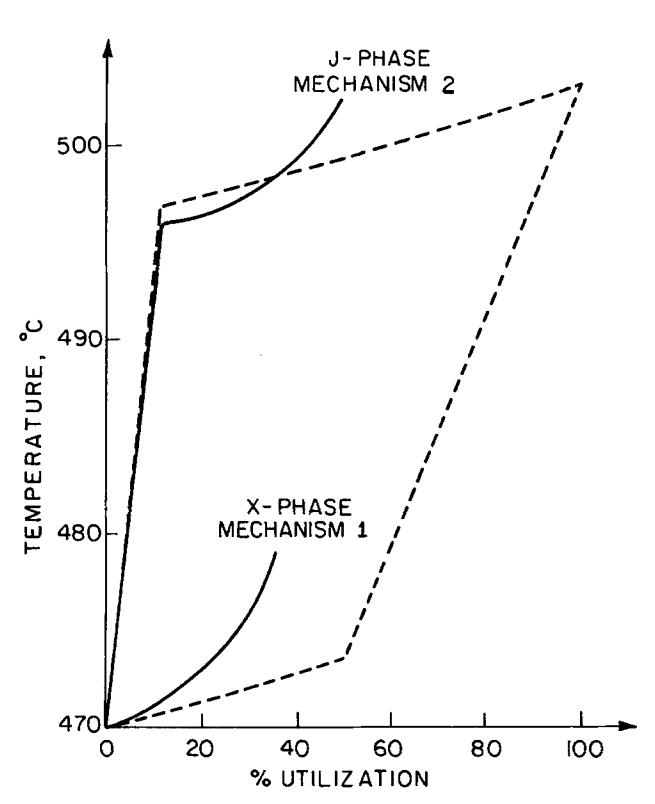
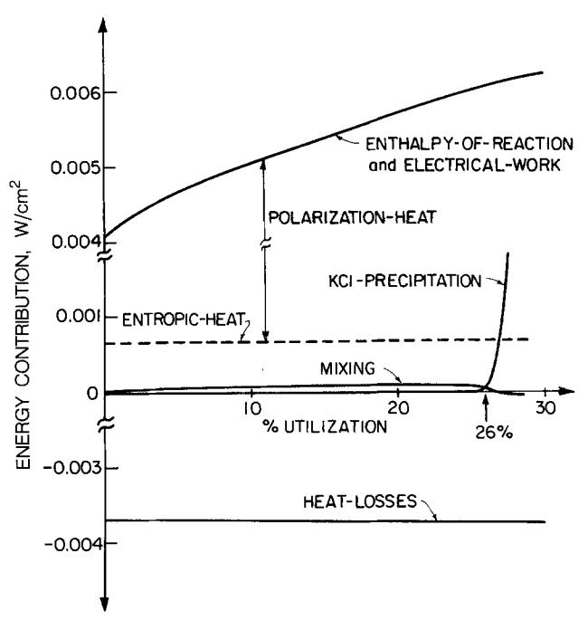

{0}------------------------------------------------

# A General Energy Balance for Battery Systems

To cite this article: D. Bernardi et al 1985 J. Electrochem. Soc. 132 5

View the <u>article online</u> for updates and enhancements.

# 

# ECS membership connects you to the electrochemical community:

- Facilitate your research and discovery through ECS meetings which convene scientists from around the world;
- Access professional support through your lifetime career:
- $\bullet$  Open up mentorship opportunities across the stages of your career;
- Build relationships that nurture partnership, teamwork—and success!

Join ECS! Visit electrochem.org/join

{1}------------------------------------------------

tity. Fabrication and sampling methods have no significant effect on any of the performance parameters measured. The geometric area of an electrode also shows a null effect. However, if the area is excessively reduced, a detrimental effect will result. Based on our results, mix repeatability, mix uniformity, and cell assembly are the areas in which improvements can be made for more consistent test results. Factors like uniformities of CFr, cathode mix and electrode in both composition and morphology, good electrical contact in the cell, and thorough wetting of the electrode would likely yield a significant improvement. Indeed, we have made progress along these lines and have now been able to reduce the standard deviation of  $V_1$  to below 10 mV.

#### Acknowledgments

The authors thank Acheson Colloid and RAI Research Corporation for their respective gifts, the Electrodag® and the initial Permion® A-1260 separator.

Manuscript submitted July 5, 1984; revised manuscript received Sept. 11, 1984. This was Paper 3 presented at the San Francisco, California, Meeting of the Society, May 8-13, 1983.

Allied Corporation assisted in meeting the publication costs of this article.

#### REFERENCES

- 1. N. Watanabe and M. Fukuda, U.S. Pat. 3,536,532 (1970).
- 2. H. F. Hunter and G. J. Heymach, This Journal, 120, 1161
- 3. R. G. Hunter, in "Power Sources 5," D. H. Collins, Editor, p. 729 (1975).
- 4. A. Morita, T. Iijima, T. Fujii, and H. Ogawa, J. Power Sources, 5, 111 (1980).
- 5. N. Watanabe, M. Endo, and K. Ueno, Solid State Ionics, 1.501 (1980)
- 6. M. Fukuda and T. Iijima, 12th Symposium on Batteries, Japan (1971).
- 7. C. A. Hicks, Ind. Quality Control, 12, 1 (1956).
- 8. W. J. Dixon, Editor, "BMDP Statistical Software," University of California Press (1981).

- 12. G. E. P. Box, W. G. Hunter, and J. S. Hunter, "Statistics For Experimenters," John Wiley & Sons, New York
- 13. P. I. Feder, J. Quality Technol., 6, 98 (1974).

# A General Energy Balance for Battery Systems

D. Bernardi, \*\* E. Pawlikowski, \* and J. Newman\*

Department of Chemical Engineering, University of California, Berkeley, California 94720

#### ABSTRACT

characteristics. Reliable predictions of cell temperature and heat-generation rate are required for the design and thermal management of battery systems. The temperature of a cell changes as a result of electrochemical reactions, phase changes, mixing effects, and joule heating. The equation developed incorporates these effects in a complete and general manner. Simplifications and special cases are discussed. The results of applying the energy balance to a mathematical model of the LiAl/FeS cell discharged through two different reaction mechanisms are given as examples. The examples izila, complex and that the application of a sufficiently general energy equation is advantageous.

Energy balance calculations are required for the design and thermal management of battery systems. A proper cell energy balance will give reliable predictions of thermal characteristics such as heat generation and temperature-time profiles. In this work, we present a general energy-balance equation for battery systems. This equation includes energy contributions from mixing, phase changes, and simultaneous electrochemical reactions with composition-dependent open-circuit potentials. Such a thorough treatment has not appeared in the literature.

The problem of determining heat effects with simultaneous electrochemical reactions was first addressed by Sherfey and Brenner in 1958 (1). They presented an equation for the rate of thermal energy generation in terms of the current fraction, the entropy change, and the overpotential for each reaction. Later, Gross (2) presented essentially the same equation, but introduced a quantity called the enthalpy voltage for each reaction. The enthalpy voltage is the enthalpy of reaction per coulomb of charge, and it may be derived from the overpotential and the entropy change terms in Sherfey and Brenner's equation. These treatments are restricted in their application to cell reactions in which every reactant is present in a single, pure phase. Gibbard (3) discussed the calculation of thermodynamic properties of battery systems when some of the reactants are dissolved in solution; however, his treatment of the energy balance considers the case of a single reaction without mixing effects.

\*Electrochemical Society Active Member.

\*\*Electrochemical Society Student Member.

Numerous researchers (1, 2, 4-8) have adopted experimental approaches and used calorimetry to determine heat output directly. Dibrov and Bykov (5) used calorimetric data and enthalpy voltages to determine current fractions of the reactions of cadmium-silver-oxide and zincsilver-oxide cells.

The formulation of a general energy balance is useful in developing a fundamental understanding of the processes involved in cell heat generation. However, in its most rigorous form, the energy balance presented is difficult to apply without a detailed mathematical model because instantaneous composition profiles and current fractions are required. For example, Tiedemann and Newman (9) have developed such a model for the lead-acid cell. A model for the lithium-aluminum iron-sulfide battery was presented by Pollard and Newman. (10, 11) These models do provide the necessary information needed to calculate the thermal characteristics from an energy balance such as the one presented in this work; however, these works utilize a relatively simple energy equation in which mixing effects are ignored and a single cell reaction occurs. Pollard's model calculates current fractions of the two simultaneously occurring reactions, but the fractions are not utilized in the energy balance. In practice, it is difficult to obtain concentration profiles and to predict the partitioning of current among possible reactions. However, applying an energy equation that includes the effects of simultaneous reactions to experimental measurements will allow the calculation of the current fractions. In this work, simplifications and special cases of the general energy equation are discussed. The results of

{2}------------------------------------------------

# The Energy Balance

·

- (1) reactions
- (2) changes in the heat capacity of the system
- (3) phase changes
- (4) mixing
- (5) electrical work
- (6) heat transfer with the surroundings

$$\frac{dH_{\text{tot}}}{dt} = q - IV$$
 [1]

where  $H_{\text{tot}}$  is the sum of the enthalpies of the phases expressed as

>/E

$$\left(\frac{\partial \overline{H}_{ij}^{\text{avg}}}{\partial T}\right)_{p} = \overline{C}_{p_{i,j}^{\text{avg}}}$$
[4]

we obtain

for the first term in Eq. [3].

It is assumed that there are several simultaneous electrode reactions of the form

$$\sum_{i} s_{i,l} M_i^{z_i} = n_l e^-$$
 [6]

ita,

A species balance may be written as

"是单位。 第一章,是一个是一个是一个是一个是一个是一个是一个是一个是一个是一个是一个是一个是一个是 We may express partial molar enthalpies in the form

in,

i

Using Eq. [9] and [11], we may write this contribution in terms of the electrode reaction potentials

できまった。

The quantity multiplying  $I_1$  on the right and left sides of Eq. [14] is sometimes termed the enthalpy voltage of reaction I

Table I. Model discharge mechanisms in the FeS electrode

| Reaction                                                                                                                                                                                           | $\alpha_{l^{a}}\left[V\right]$ | $b_1 \times 10^3  {\rm a} \ [{\rm V/K}]$ |
|----------------------------------------------------------------------------------------------------------------------------------------------------------------------------------------------------|--------------------------------|------------------------------------------|
| Mechanism 1 (X-phase intermediate)                                                                                                                                                                 |                                |                                          |
| 1) $2\text{FeS} + 2\text{Li} + 2e^{-} \rightarrow \text{Li}_2\text{FeS}_2 + \text{Fe}$ (X-phase)                                                                                                   | 1.367                          | -0.022                                   |
| 2) $\text{Li}_2\text{FeS}_2 + 2\text{Li}^+ + 2e^- \rightarrow 2\text{Li}_2\text{S}^- + \text{Fe}$                                                                                                  | 1.454                          | -0.178                                   |
| Mechanism 2 (J-phase intermediate) 3) $26\text{FeS} + \text{Li}^+ + \text{Cl}^- + 6\text{K}^+ + 6\text{e}^- \rightarrow \text{LiK}_{\text{N}}\text{Fe}_{24}\text{S}_{26}\text{Cl} + 2\text{Fe}$ | 1.955                          | -0.680                                   |
| (J-phase) 4) J + $51\text{Li}^+$ + $46e^- \rightarrow 26\text{Li}_2\text{S}$ + $24\text{Fe}$ + $6\text{K}^+$ + $C1^-$                                                                        | 1.440                          | -0.024                                   |

&quot; $\alpha_i$  and  $b_i$  were obtained from Ref. (13).

{3}------------------------------------------------

where

$$\Delta C_{p_l} \equiv \sum_{i} s_{i,l} \bar{C}_{p_{i,m}}^{avg}$$
 [16]

and

$$\Delta H^{\circ}_{\mathbf{i} \to \mathbf{m}} \equiv H^{\circ}_{\mathbf{i}, \mathbf{m}} - H^{\circ}_{\mathbf{i}, \mathbf{j}} \tag{17}$$

It should be recognized that all the composition dependence of Eq. [15] may be expressed in terms of activity coefficients ( $a_{i,j} = x_{i,j}\gamma_{i,j}$ ). This is a reflection of the fact that the composition dependence of any thermodynamic quantity is completely determined if the activity coefficient behavior of the species is known. This analysis does not include enthalpy changes associated with nonfaradaic reactions. However, reactions such as self-discharge or corrosion may be divided into anodic and cathodic components and included in the enthalpy-of-reaction term (other reactions must be accounted for and included as an additional term). Also, the heat capacities of the battery support materials should be understood to be included in Eq. [15]. Actually, in most practical applications, the heat capacity of a battery module does not change substantially during operation. In such cases, the heat-capacity term may be replaced by some average value. Also, the rate of heat transfer q between the battery and surroundings may be expressed as

where the heat-transfer coefficient h is based on separator area and is estimated from the heat losses for a battery module.

>/ när

± 75. | Sippoin

a. ウェール・リール・リール・リール・リール・リール・リール・リール・リール・リール・リ

#### Discussion of Terms

During discharge, the chemical energy of the cell is directly converted into work in the form of electricity. The work that the cell delivers is maximum when the cell op-

{4}------------------------------------------------

erates reversibly. This reversible work, expressed as a rate, can be written as

$$IV_{\text{rev}} = \sum_{l} I_{l} [U_{l,\text{avg}}]$$
 [22]

Also housed in this enthalpy-of-reaction term is the entropic-heat

n. √

Equations [22] and [23] have allowed the enthalpy-of-reaction and electrical work terms in Eq. [21] to be combined and restated as irreversible and reversible heat effects. This form is most convenient when dealing with reversible conditions because the polarization heat,  $IV - \sum_{\mathbf{i}} I_{\mathbf{i}} U_{\mathbf{i}.avg}$  is zero in that case. Furthermore, Eq. [24] is the form of the energy balance that is most commonly encountered in the literature. The composition dependence of the open-circuit potential is contained in  $U_{\mathbf{i}.avg}$  (see Eq. [10]). The original form (Eq. [21]) has an advantage in that a strong composition dependence of the two terms separately may partially capacitates.

$$-\sum_{l}I_{l}\alpha_{l}$$
 [25]

Notice that the temperature coefficients,  $b_1$ , are not needed and that the enthalpy voltage of reaction 1 is  $-a_1$ .

>

>

can be shown that the integral in the mixing term may be minimized if the average concentration is defined as

where

This will be shown as follows. For a binary system, the integral in the mixing term in Eq. [15] may be written as

where the molar enthalpy is defined as

and  $\overline{H}_{i}^{avg}$  is the partial molar enthalpy of species i at the average composition. It should be recognized that in this development it is assumed that the spatial variation of composition is fixed and that Eq. [27] is only a function of  $x_1^{\text{avg}}$ . By writing the mixing integral in this form, we may obtain a clearer interpretation of the mixing term. The sum subtracted from H is the tangent line to the enthalpy-vs.-composition  $(H - x_1)$  plot at the average composition. The integral may be considered to be a measure of the ability to approximate the H curve with a tangent, in the range of composition variation throughout the cell. Therefore, if the enthalpy curve is linear in this range, then  $\overline{H}_1$  and  $\overline{H}_2$  are independent of composition, and the integral is zero regardless of the value of  $x_1^{\text{avg}}$ . Also, if the activity coefficients are independent of temperature (see Eq. [9]), then mixing effects can be ignored. Different choices of the tangent, corresponding to different values of the average composition may give better or worse approximations of the enthalpy curve. Equation [27] may be minimized with respect to the average composition by solving the following equation for  $x_1^{\text{avg}}$ 

響道。 小声

The Gibbs-Duhem equation

may be applied, and Eq. [29] may be solved for  $x_1^{\text{avg}}$  as given in Eq. [26]. The corresponding development for multicomponent mixtures is given in Appendix A. Equation [26] is guaranteed to be the choice of the average composition that will minimize Eq. [27] only if the integral has simple behavior. The behavior is said to be simple if the second derivative of the integral is nonzero for all possible values of  $x_1^{\text{avg}}$  (in range of concentration variation throughout the cell). For example, if the integral has a point of inflection such that its value may be either positive or negative depending upon  $x_i^{\text{avg}}$ , then  $x_i^{\text{avg}}$  may be chosen so that the integral is zero. In this case, the best choice of the  $x_i^{\text{avg}}$  is not necessarily defined by Eq. [26]. Regardless of the behavior of the integral, Eq. [26] is the most convenient definition of the average composition. It has physical significance, and it is usually a simple function of state-of-charge. It is the final uniform composition of a concentration profile that is allowed to relax, and the energy effect associated with this process, in this case, is

{5}------------------------------------------------

proportional to the value of the integral for the initial profile

e

The right side of Eq. [31] is linear in  $x_1$ . If Eq. [31] is differentiated twice with respect to  $x_1$ , we obtain

$$\frac{d^2H}{dx_1^2} > 0 \tag{32}$$

In other words, if in the range of concentration variation throughout the cell the enthalpy curve is always concave upward, then the integral will be positive. Conversely, the integral will be negative if the enthalpy curve is everywhere concave downward. For example, in the lead-acid cell, the sulfuric acid-water system has an enthalpy curve that is always concave upward. Consequently, the temperature of a well-insulated lead-acid cell will always increase after current interruption during operation due to relaxation of concentration profiles. To illustrate this, in Appendix A, Eq. [15] is used to estimate this temperature rise. The temperature rise, after full discharge, is approximately 1.6 K. It is also important to investigate the consequence of neglecting mixing effects in thermal calculations. For the lead-acid cell, the temperature during operation (generation of concentration profiles) is overestimated if calculations are made by neglecting the mixing term. The situation is reversed for a high-temperature cell employing LiCl-KCl electrolyte. In the range of concentration variation throughout this cell, the enthalpy curve is always concave downward and the cell temperature will decrease due to mixing effects after current interruption. Calculations that neglect mixing will give underestimations of temperature when concentration profiles are being generated (during cell operation). This will be investigated in greater detail later.

<

#### **Description of Examples**

The results of applying Eq. [15] to the existing model of the LiAl/LiCl, KCl/FeS cell will be given. The purpose of these examples is to illustrate how the energy-balance equation may be applied to a specific system and to examine the relative contributions corresponding to the terms in this equation. The use of Eq. [15] is best illustrated by application to a mathematical model of a battery in which concentration profiles can be used to calculate energy contributions from mixing, and current fractions can be used to calculate energy contributions from simultaneous reactions. This model was originally developed by Pollard and Newman in 1981, and the details of the theoretical analysis are given in their publications (10, 11). The model gives the galvanostatic discharge behavior of a one-dimensional cell sandwich consisting of a porous LiAl negative electrode, porous FeS positive electrode, electrolyte reservoir, and separator. The model simulates the discharge processes in the positive by the two simultaneously occurring reactions given as mechanism 1 in Table I. Pawlikowski (12) in 1982 developed a model of the cell with mechanism 2 as the positive electrode discharge reactions. Mechanisms 1 and 2 yield the same overall reaction and differ mainly in the intermediate phase (X-phase or J-phase).

>Pagrina

>/ Li

#### Results

Figure 1 gives the cell temperature as a function of utilization for both mechanisms. The dashed lines show the temperature profile for adiabatic and reversible discharge. Under these conditions the two mechanisms yield the same temperature at 100% depth of discharge because the overall reaction is the same. In both cases, the reactions are exothermic, so that the cell temperature increases throughout discharge. Though the adiabaticreversible profile of mechanism 1 appears linear, there is actually a slight amount of curvature, due to the logarithmic dependence of the cell temperature. The composition dependencies associated with the J-phase reactions result in the more discernible curvature of each portion of the adiabatic-reversible profile of mechanism 2. The criterion of reversibility allows the stoichiometry of the reactions to yield the discontinuities in slope located at 50% and 12% for mechanism 1 and mechanism 2, respectively. For example, with mechanism 1 up to 50% utilization, only reaction 1 occurs, and after this point reaction 2 occurs. The dashed curve in Fig. 2 is the heat generation rate for reaction 1. It is approximately constant because the temperature is not changing substantially, and this is responsible for the apparent linearity in Fig. 1. With the J-phase reactions, the stoichiometry dictates that the transition from reaction 3 to reaction 4 occurs at 12% utili-

ej

{6}------------------------------------------------

i, a,i, Pi

nism are given in Appendix B. In these simulations, the irreversibilities associated with ohmic losses, migration effects, mass-transfer, and charge-transfer overpotentials cause electrode polarization. The onset of the second reaction of each mechanism may occur before the prediction based on reversibility, because of the resulting potential distribution in the porous, positive electrode. Compared to the values of 50% and 12% utilization, the second reaction begins at 30% and 11% utilization for mechanisms 1 and 2, respectively. At these operating conditions, the reaction potential difference  $U_{3,avg}-U_{4,avg}$  for the J-phase mechanism is always about four times larger than the difference  $U_{1,\mathrm{avg}}-U_{2,\mathrm{avg}}$  for the X-phase mechanism. We see that the onset of the second reaction occurs closer to the reversible prediction in the case of the J-phase mechanism because a larger positive electrode polarization is required to promote the onset of the second reaction as compared with the X-phase mechanism.

The solid lines in Fig. 2 are plots of the terms in Eq. [B-1] as functions of utilization for the X-phase mechanism up to 30% utilization. The dashed line in Fig. 2 is called the entropic-heat and has the value of  $-i_1b_1T$ . It would be the only term on the right side of Eq. [B-1] if the equation were written for the adiabatic-reversible case. The polarization heat,  $i_1(U_{1,avg}-V)$ , and the entropic heat add up to the enthalpy-of-reaction and electrical-work term. The heat-loss contribution does not change markedly because the cell is well insulated and the overall cell temperature does not change substantially. The profile for the X-phase mechanism in Fig. 1 follows the adiabatic-reversible profile up to about 5% utilization because the heat-loss contribution tends to cancel the polarization heat. The polarization heat is mainly responsible for the increasing departure of the cell temperature from the reversible case throughout discharge. With increasing utilization, the polarization heat increases because the opencircuit potential ( $U_{1,\mathrm{avg}}$ ) is approximately constant and the cell voltage drops.

·ing.

Fig. 2. Terms comprising the energy balance for a LiAl/FeS cell [Eq. B-1] as a function of utilization.

>i

Although the mixing term offers a negligible contribution to the energy balance, it is interesting to investigate the processes that determine its behavior. As we mentioned earlier, for the molten LiCl-KCl system, the value of the integral in Eq. [B-1] is always negative. Therefore, if the heat losses are made negligible, the cell temperature will decrease after current interruption. Prior to the onset of precipitation, this is entirely a mixing effect. At 25% utilization in Fig. 2, this temperature decline is only about 0.2 K. Before precipitation, the concentration of LiCl steadily decreases in the positive electrode and increases in the negative electrode, and the average composition,  $x_{\text{LiCl}}^{\text{avg}} = 0.58$  (defined by Eq. [26]), is constant. The mixing term (the time derivative of the integral) also increases, and the cell temperature would be slightly underestimated if mixing effects were ignored. The concentration throughout the separator and reservoir volumes remains close to the average composition, so that their contributions to the integral are two orders of magnitude smaller than the contributions from integration through the electrodes. Figure 2 shows that the integral increases in magnitude to the point where the mixing term is zero (26.5% utilization). After this point, the mixing term is slightly negative, corresponding to a decrease in the magnitude of the integral with time. The mixing term decreases when KCl precipitates because, in the region of precipitation, the electrolyte composition is approximately constant at its saturation value. Following the onset of precipitation, the adiabatic temperature decline after current interruption is determined by the more complex processes of simultaneous melting of KCl and electrolyte mixing. We present the breakdown of contributions only up to 30% utilization, because when the second reaction begins simultaneously, reaction heat effects and 

{7}------------------------------------------------

<u>. </u>

#### Conclusions

The examples presented help to illustrate that the processes involved in cell heat generation may be complex and that the application of a sufficiently general energy equation is advantageous. Equation [23], written for a single cell reaction, is the energy equation most com-monly used in battery applications. The use of this form of an energy balance is justified only if phase-change effects, mixing effects, and simultaneous reactions are not important. An energy equation including the effects mentioned above is, of course, most easily applied to modeling studies. However, applying an energy equation that includes the effects of simultaneous reactions to experimental measurements may help elucidate reaction mechanisms. For example, if heat generation rates and cell voltage measurements are made on LiAl/FeS cells under isothermal operating conditions, an energy equation may be fit to the experimental data to determine the current fractions of simultaneously occurring reactions. The experiments performed under truly isothermal conditions have the advantage that an estimate of the mean cell heat capacity is not required. However, if experimental cells are not kept isothermal, then heat capacity effects or the effects of nonuniform temperature may obscure the relationship of the experimental results to the energy balance.

<

## Acknowledgment

・

Manuscript submitted May 4, 1984; revised manuscript received Sept. 4, 1984.

University of California assisted in meeting the publication costs of this article.

#### APPENDIX A

#### Choice of the Average Composition for a Multicomponent System

For a multicomponent phase, the integral in Eq. [15] may be written as

į

$$H = \sum_{i} x_{i} \overline{H}_{i}$$
 [A-2]

Eq. [A-1] may be written as

In certain cases, Eq. [A-1] is minimized with respect to the average composition by equating the total differential

to zero. Recognizing that the enthalpy is independent of the choice of the average composition, we may write

$$d\biggl[\sum_{\mathbf{i}}\int_{\mathbf{v}}\overline{H}_{\mathbf{i}}^{\mathrm{avg}}\,cx_{\mathbf{i}}dv\biggr]$$

$$= \sum_{i} \left( \int_{v} cx_{i} dv \right) d\overline{H}_{i}^{\text{avg}} = 0 \qquad [A-4]$$

If we multiply and divide each term in Eq. [A-4] by  $x_i^{\text{avg}}$ 

and compare this to the Gibbs-Duhem equation

$$\sum_{i} x_{i}^{\text{avg}} d\overline{H}_{i}^{\text{avg}} = 0$$
 [A-6]

we see that the bracketed quantity in Eq. [A-5] must be equal to a constant. This constant

must be independent of  $x_1^{\text{avg}}$  in order to satisfy the Gibbs-Duhem equation. If we apply a mole fraction balance

we may solve for this constant

$$K = \int_{v} c dv$$
 [A-9]

Substituting this into Eq. [A-7], we obtain the final form for the average composition

Equation [A-10] is guaranteed to be the average composition that minimizes Eq. [A-1] only if its second total differential is positive for all possible values of  $x_i^{\text{avg}}$ .

## Estimate of the Temperature Rise in a Lead-Acid Cell Following Current Interruption

taille

ii,

{8}------------------------------------------------

final uniform concentration after relaxation, and the temperature rise is proportional to the value of the integral when the current is interrupted (8630J or 6.5 J/g of electrolyte). Using the data available in Ref. (14) (for 298 K), we calculate the temperature rise to be about 1.6 K (if we allow 1.25 mol of PbO2 for discharge, the concentrations in the cathode and anode space drop to 0.05 and 2.23 molal, respectively, and the temperature rise is 2.9 K). We recognize that the assumed concentration jumps at the interfaces are artificial and that, realistically, diffusion tends to equalize the concentrations. The estimated temperature rise would be slightly lower if the above effect were taken into account. We must also, however, recognize the effects of nonuniform reaction distribution in porous electrodes and that this will tend to make the concentration distribution nonuniform. Reference (9) gives spatial distributions of concentration and reaction for a one-dimensional model of a lead-acid cell.

#### APPENDIX B

#### **Energy Equations for Model Studies**

Mechanism 1 (the number subscripts refer to the reactions in Table I)

KCl-precipitation [B-1]

#### Mechanism 2

The energy equation for mechanism 2 differs only in the enthalpy-of-reaction and electrical-work term, which may

### Relevant Input Data

| Quantity                      | Value                                      | Quantity                       | Value                     |
|-------------------------------|--------------------------------------------|--------------------------------|---------------------------|
| $x^{_{0}}$ LiCl    | 0.58 (eutectic)                            | $MC_{p}^{m}/A$                 | 1.89 J/cm 2 -K |
| $\Delta H^{\rm o}_{\rm KClf}$ | 26,530 J/mol                               | i                              | 0.0416 A/cm 2  |
| h                             | 8.25*10 -6 W/cm 2 -K | $T_{\scriptscriptstyle \rm A}$ | 273.15 K                  |
| Capacity                      | 835.27 C/cm 2                   | $\epsilon^{o}_{\mathrm{FeS}}$  | 0.555                     |

 $T \ln \gamma_{\text{Licl}} = 723.15 (0.52628x_{\text{KCI}} - 1.2738x_{\text{KCI}}^2 - 2.9783x_{\text{KCI}}^3)$ 

 $T \ln \gamma_{\rm KCl} = 723.15 \; (-0.52628 x_{\rm LiCl} - 5.7413 x^2_{\rm LiCl} \ + 2.9783 x^3_{\rm LiCl} - 0.52628 \; {\rm ln} \; x_{\rm KCl})$ 

# LIST OF SYMBOLS

activity of species i in phase j

 $\substack{\alpha_{i,j} \\ {a_i}^{RE}}$ activity of species i in the reference electrode À

separator area, cm2

constant in the expression for the open-circuit potential of reaction l, V  $a_1$ 

 $b_1$ temperature coefficient in the expression for the open-circuit potential of reaction  $l,\,V/K$ 

concentration of species i in phase j, mol/cm3 mean heat capacity at constant pressure, J/g-K partial molar constant pressure heat capacity of

species i in phase j, J/mol-K differential volume element of phase j, cm3  $dv_{i}$ 

symbol for an electron

Faraday's constant, 96,487 C/eq heat transfer coefficient, W/cm²-K

 $H_{\mathrm{tot}}$ enthalpy, J

molar enthalpy, J/mol H`

 $H^{o}_{i,m}$ molar enthalpy of species i in the secondary reference state corresponding to phase m, J/mol

 $\overline{H}_{\mathrm{i,j}}$ partial molar enthalpy of species i in phase j, J/mol partial current density of electrode reaction 1, A/cm²

cell current, A

 $\bar{l}_1 \ K \ L$ partial current of electrode reaction 1, A

constant in Eq. [A-7], mol

length of cell, cm M mass of the cell, g

 $M_i$ symbol for the chemical formula of species i

 $n_{\rm l}$ number of electrons involved in reaction l

 $n_{RE}$ number of electrons involved in the reference electrode reaction

moles of species i in phase j, moles  $n_{\mathrm{i,j}}$ 

heat-transfer rate, W

 $\stackrel{q}{R}$ universal gas constant, 8.3143 J/mol-K

stoichiometric coefficient of species i in reaction l  $s_{i,l}$ 

T

absolute temperature, K

 $U_{\rm l,avg}$ theoretical open-circuit potential for reaction l at the average composition relative to a reference electrode of a given kind, V standard electrode potential for reaction l, V

 $II_{i^0}$ 

 $U^{\rm o}_{\rm RE}$ standard electrode potential for the reference electrode reaction, V

see  $dv_i$  $V_{\rm j}$ 

cell potential, V

mole fraction of species i in phase j  $x_{\scriptscriptstyle i,j}$ 

distance from electrode, cm

 $z_{\rm i}$ charge number of species i

#### Greek

porosity

activity coefficient of species i in phase i  $\gamma_{i,i}$ 

#### Subscripts

A ambient

f heat of fusion

refers to a species

j,m l refer to phases

refers to a reaction

rev reversible

REreference electrode reaction

tot

## Superscripts

avg average

eut eutectic composition

m

refers to secondary reference state or initial

RE reference electrode composition

#### REFERENCES

1. J. M. Sherfey and A. Brenner, This Journal, 105, 665

- i, Vi
- 5. I. A. Dibrov and V. A. Bykov, J. Appl. Chem., 49, 2025
- 6. L. D. Hansen and R. M. Hart, This Journal, 125, 842 (1978).

a, and Optimization," S. Gross, Editor, pp. 23-38, The Electrochemical Society Softbound Proceedings Series, Princeton, NJ (1979).

10. Richard Pollard and John Newman, This Journal, 128, 491 (1981).

11. Richard Pollard and John Newman, ibid., 128, 502 (1981).

 E. Pawlikowski, Postdoctoral research, unpublished, Department of Chemical Engineering, University of California, Berkeley, CA (1982).

13. Z. Tomczuk, S. K. Preto, and M. F. Roche, This Journal, **128**, 760 (1981).