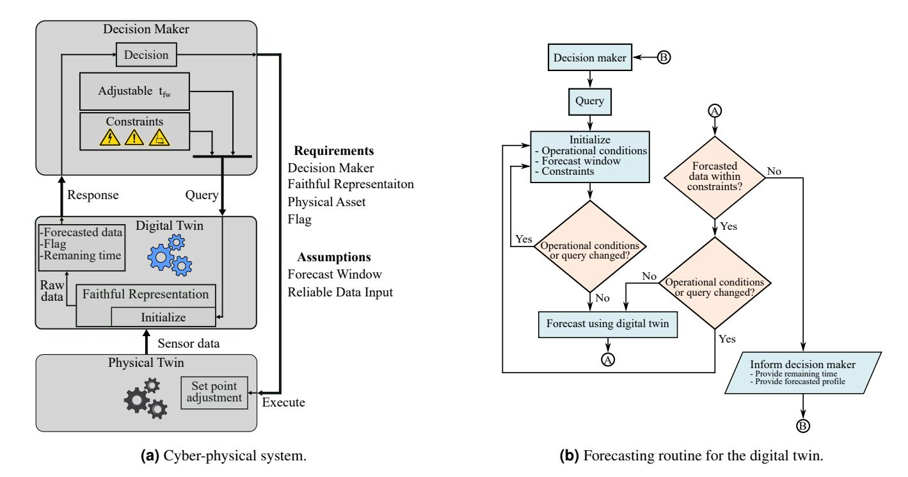
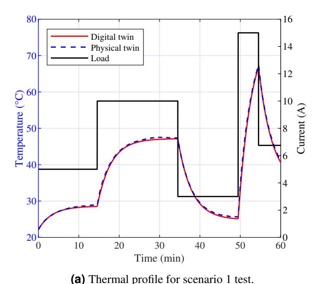
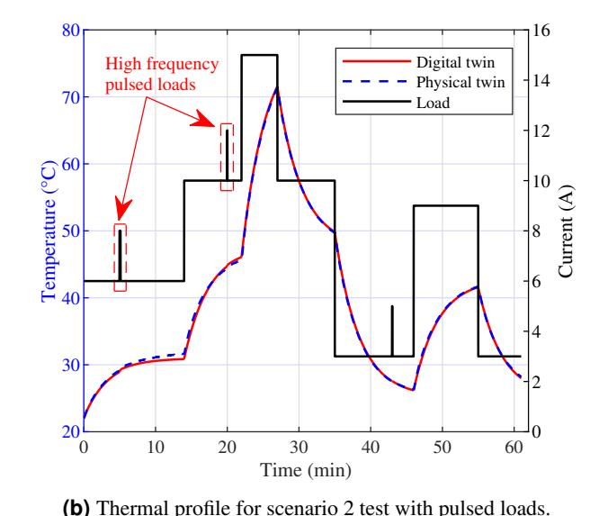
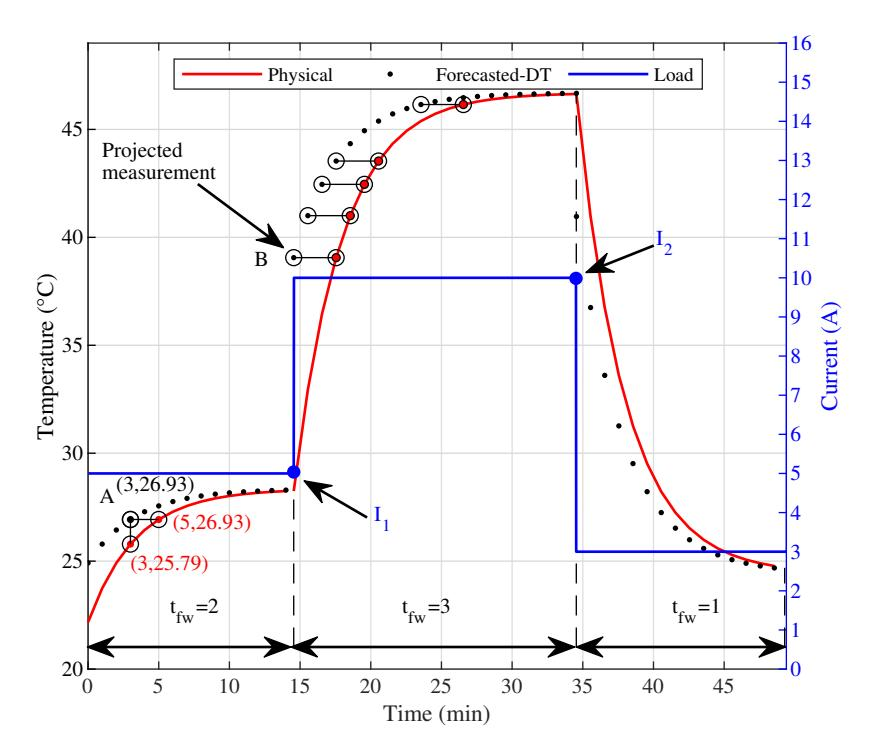
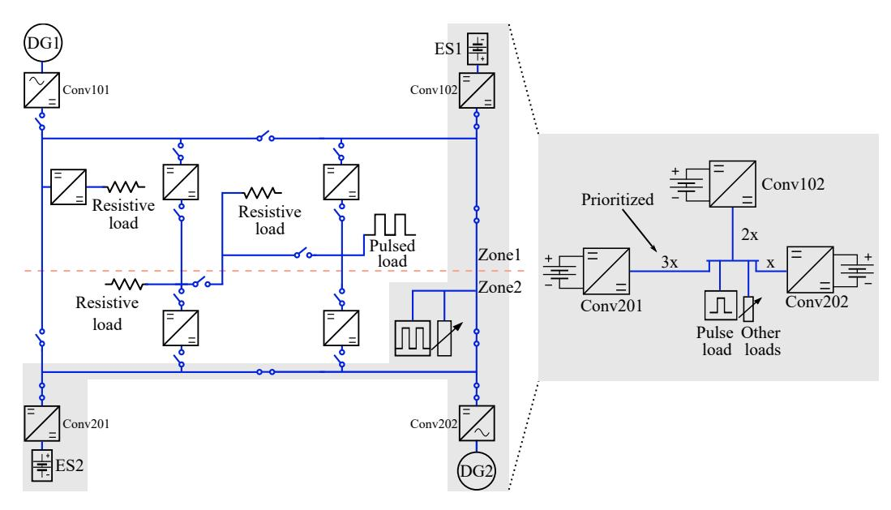
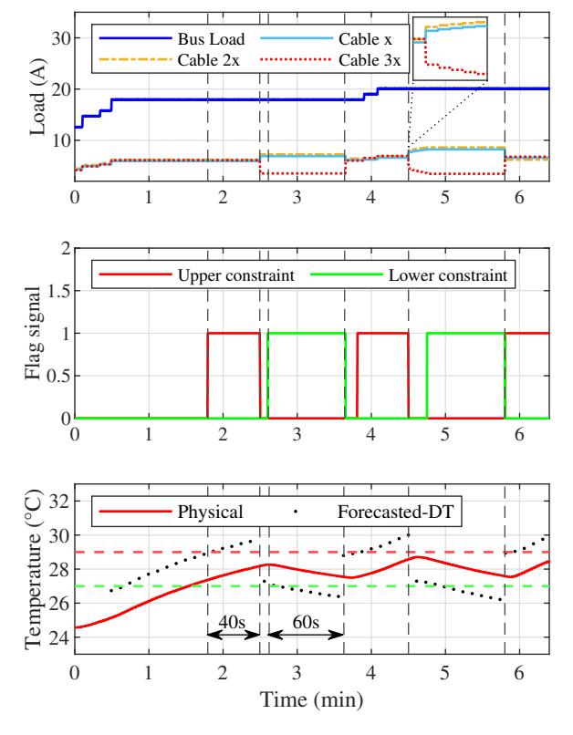

{0}------------------------------------------------

# A Digital Twin Based Forecasting Framework for Power Flow Management in DC Microgrids

This work was supported by the Office of Naval Research under contracts N00014-22-C-1003 and N00014-23-C-1012. "The views expressed are those of the authors and do not reflect the official policy or position of the Department of Defense or the U.S. Government. DISTRIBUTION STATEMENT A. Approved for public release distribution unlimited. Approved, DCN# 2025-1-31-562"

## **ABSTRACT**

The ability to forecast system conditions is integral to the definition and functionality of digital twins. While forecasting methods have been explored for use in digital twin systems, the integration of feedback mechanisms for real-time forecasting and in-situ decision-making in DC microgrids has not been extensively investigated. This research develops a modular forecasting framework tailored for digital twins in DC microgrids to enable real-time monitoring, online forecasting, and decision-making. DC microgrids, characterized by dynamic load variations, benefit from advanced predictive capabilities to maintain stability and operational efficiency. The proposed digital twin-based forecasting framework addresses these challenges by providing real-time predictive insights based on dynamic system conditions and a forecasting window defined by a decision-maker, facilitating proactive management strategies. Leveraging real-time sensor data, the digital twin forecasts system behavior under varying load conditions, enabling proactive management through real-time decision-making within operational constraints. As a proof of concept, the framework incorporates an electro-thermal digital twin designed to manage power flow based on thermal constraints in power distribution cables. Experimental validation using a simplified three-bus DC microgrid testbed demonstrates the effectiveness of the framework in enabling timely adjustments to power flows and preventing thermal overloads.

## Introduction

A Digital Twin (DT) is a comprehensive digital replica of a physical asset that integrates multiphysics, various scales, and faithful representation of a physical system or subsystem, referred to as the physical twin2. In this context, a physical twin refers that define the entity. The definition of digital twins is often misused in the literature with many studies failing to emphasize the feedback loop that differentiates digital twins from traditional models. The bidirectional flow of data between the physical asset and its digital counterpart is integral to the digital twin paradigm as it provides real-time insights, updates, and enabling dynamic decision-making3,4. This mechanism enables the digital twin to adaptively update its state in real-time, driven by sensor data from the physical twin. Furthermore, the bidirectional nature of the feedback loop allows the digital twin to receive information about the current operational parameters from the physical twin, enabling synchronized adjustments in the virtual representation. The bidirectionality also allows the decision-making entity within the digital twin to execute instructions on operations and dynamic adjustments. Without the bidirectionality, a model cannot be considered a true digital twin but rather a static digital representation. The omission of this crucial aspect in research undercuts the potential benefits and applications of digital twin technology5.

&lt;sup>1University of South Carolina, Department of Electrical Engineering, Columbia, SC, USA

&lt;sup>2University of South Carolina, Department of Mechanical Engineering, Columbia, SC, USA

\*ksado@email.sc.edu

{1}------------------------------------------------

Several studies, including those by Nwoke *et al.*14 and Di Nezio *et al.*15, commend digital twins for their effectiveness in monitoring and predictive maintenance, specifically for power electronic converters. These studies focus on reducing data latency and enhancing system parameter estimation through sensor data. However, they primarily address component-level applications and fall short of extending their findings to system-wide forecasting or proactive power management. Wileman *et al.*16 developed a component-level digital twin to monitor the health of power converters using physics-based models. This demonstrates the precision that digital twins can achieve at the component-level. However, it also highlights a significant research gap in applying digital twin technology to broader, system-wide applications, where the ability to forecast across the entire system remains unfulfilled.

Digital twins can forecast the future states and behaviors of physical assets by combining historical data and real-time sensor readings, utilizing cyber-physical data exchange17. Digital twins update forecasts as needed in response to changes in operational conditions of the physical asset, driven primarily by real-time data and feedback mechanisms. This adaptability enhances the precision of digital twins in forecasting future states. Leveraging forecasted data, the decision-making entity can ensure that the most effective operational state is always active, thereby enhancing the operational performance of the asset. Serving as crucial decision aids, digital twins enable the selection of the most suitable operational conditions for the represented physical asset. Although the definition of digital twins inherently includes forecasting capabilities, the literature indicates a significant gap in the actual implementation of this feature for real-time forecasting and comprehensive system integration.

Recent advancements in forecasting methods for digital twin systems also show promise for addressing these gaps. Xie et al. 18 proposed a neural ordinary differential equations-based framework for load forecasting in power grids. This approach integrates machine learning with physics-based modeling to improve scalability and accuracy, highlighting the potential for advanced forecasting in electrical digital twins. Additionally, Jiao et al. 19 introduced a motion forecasting framework leveraging cloud-edge collaboration, emphasizing preemptive risk monitoring by predicting future trajectories with high accuracy through deep learning mechanisms. Furthermore, Maior et al.20 conducted a comparative study of various forecasting methods in digital twin applications, emphasizing the critical role of preprocessing and model selection in achieving reliable predictions. Santos et al. 21 further explored simulation-integrated digital twin systems, where forecasting techniques such as exponential smoothing were combined with discrete event simulations for decision support, enhancing the adaptability of digital twins in industrial contexts. Similarly, Henzel et al.22 developed a digital twin model for residential energy consumption forecasting, employing long-short term memory models to predict energy usage and optimize energy storage and consumption strategies. Xiang et al. 23 proposed a digital twin-based framework for short-term photovoltaic power prediction using bi-directional long short-term to achieve high accuracy in real-time forecasts of photovoltaic output power. Zeb et al.24 investigated surrogate models in mineral processing, applying CNN-based multistep forecasting within a digital twin framework to predict operational metrics, landscape of forecasting methodologies in digital twin research. However, many of these approaches lack in-situ projection capabilities and have not been cyberphysically integrated, limiting their applicability to real-time operational challenges in 

{2}------------------------------------------------

**Figure 1.** The forecasting-focused digital twin for a cyber-physical system.

models to validate digital twin applications in real-world scenarios.

Overall, the body of research shows great promise for digital twins in component-level monitoring and predictive maintenance. These applications typically involve predictions based on models and remaining time estimations. However, they are generally not focused on forecasting in the sense of projecting future states and modifying system controls to achieve optimal outcomes. Therefore, there is a clear need for further research leveraging the true forecasting capabilities of digital twins. Establishing a standard forecasting procedure is essential to validate this technology in practical, real-world applications. This work introduces a modular forecasting framework for digital twins, specifically designed for DC microgrids. An electro-thermal model serves as a proof of concept, demonstrating the adaptability and effectiveness of the framework. Unlike prior studies that focus predominantly on component-level analysis, this approach demonstrates system-level forecasting capabilities validated through experimental results in a DC microgrid testbed.

# Forecasting Requirements and Assumptions for Digital Twins in DC Microgrids

Physical assets, whether operating independently or as part of larger networks, face dynamic challenges where unexpected changes in the operational environment can suddenly arise. By utilizing digital twins for forecasting, these assets can proactively adjust their operations, facilitating seamless transitions between different operational states. In the context of DC microgrids, these challenges often involve dynamic load variations, fluctuations in renewable energy generation, and the need to maintain thermal and electrical stability. The forecasting capability of digital twins is particularly valuable in this domain, enabling real-time decision-making to ensure operational efficiency and responsiveness despite the inherent variability in such systems. As illustrated in Figure 1a, the digital twin system requires a decision-making entity to study the insights provided by the digital twin. The decision-making entity uses the forecasting projections provided by the digital twin, based on certain constraints, to make informed decisions. These decisions are then executed on the physical twin, closing the loop between data collection, analysis, and action. The flowchart in Figure 1b further details the forecasting framework within the digital twin, illustrating the process of updating forecasts and making adjustments based on real-time data.

{3}------------------------------------------------

$$\mathbf{X} = \begin{bmatrix} x_{11} & x_{12} & \cdots & x_{1j} \\ x_{21} & x_{22} & \cdots & x_{2j} \\ \vdots & \vdots & \ddots & \vdots \\ x_{i1} & x_{i2} & \cdots & x_{ij} \end{bmatrix}$$
(1)

- c) Forecasting window,  $t_{\text{fw}}$ : The timeframe within which the digital twin anticipates future states of the physical twin. This window must adhere to defined limits based on the nature of the asset and operational requirements

$$0 \le t_{\text{fw}} \le t_{\text{fw,max}} \tag{2}$$

where  $t_{\text{fw,max}}$  represents the maximum allowable forecasting window. This maximum is defined by considering factors such as the operational dynamics and characteristics of the asset, the desired accuracy of the forecast, and the computational resources available. A  $t_{\text{fw}}$  set to zero indicates no forecasting; the digital twin will then provide a real-time reflection of the behavior of the physical twin or serve as a reactive operational tool.

d) **Decision maker**: The decision-making entity could be a control algorithm, AI, a human-in-the-loop, or a combination of these elements. It acts as the intermediary between the digital twin and the physical asset. The process initiates with the decision maker querying the digital twin for essential data and insights into the behavior of the physical asset. In response, the digital twin provides detailed data projections and insights. With this information, the decision maker performs an in-depth analysis, taking into account operational and environmental factors. Each potential impact of various alternatives is evaluated to ensure that the selected actions are timely and accurate. Final decisions, derived from this comprehensive analysis, are then conveyed as instructions to be executed on the physical twin. This process ensures the most effective alignment with operational requirements and thereby enhancing desired system functions. In DC microgrids, decision-making plays a critical role in maintaining stability and optimizing performance. Advanced control algorithms or human operators leverage in-situ measurements, such as current, voltage, temperature, and state-of-charge, along with digital twin forecasts, to implement proactive strategies like dynamic load shedding, battery dispatch optimization, and power rerouting. These strategies ensure the system operates efficiently under varying load and renewable energy conditions while maintaining key parameters within safe operational thresholds. Real-time insights from in-situ measurements, combined with projections and analysis from the digital twin, enable timely interventions that prevent disruptions and ensure the continued stability of the microgrid.

{4}------------------------------------------------

e) Countdown via flagging mechanism: The response of the digital twin must include a flagging mechanism, an essential feature designed to alert the decision maker to the time at which a constraint will be violated. This proactive alert mechanism enables timely interventions before operational thresholds are breached, thereby preventing potential issues. When monitoring both upper,  $\mathbf{X}_{\text{max}}$ , and lower,  $\mathbf{X}_{\text{min}}$ , constraint boundaries which represent the maximum and minimum values of the parameters in the previously mentioned matrix, the digital twin calculates the time to reach a constraint based on the rate of change,  $(\frac{d\mathbf{X}}{dt})$ , of the operational parameters  $\mathbf{X}$ . If the rate of change is positive, the digital twin activates the upper flag,  $\operatorname{Flag}_{\text{upper}}(t)$ , when the constraint reaches the upper boundary. Conversely, if the rate of change is negative, the digital twin activates the lower flag,  $\operatorname{Flag}_{\text{lower}}(t)$  when approaching the lower boundary. This dual-flagging mechanism can be adapted based on specific application needs, ensuring the digital twin can effectively alert the decision maker to potential issues regardless of the type of operational constraints being monitored. The functionality of this dual-flagging mechanism can be mathematically expressed as

$$\operatorname{Flag}(t) = \begin{cases} \operatorname{Flag}_{\operatorname{upper}} = 1 & \text{if } \frac{d\mathbf{X}}{dt} \ge 0 \text{ and } \mathbf{X} \ge \mathbf{X}_{\operatorname{max}} \\ \operatorname{Flag}_{\operatorname{lower}} = 1 & \text{if } \frac{d\mathbf{X}}{dt} < 0 \text{ and } \mathbf{X} \le \mathbf{X}_{\operatorname{min}} \\ 0 & \text{otherwise} \end{cases}$$
(3)

When the operational parameters exceed  $\mathbf{X}_{max}$  or fall below  $\mathbf{X}_{min}$  the corresponding flags are triggered. In addition to signaling an alert, the digital twin is required to estimate the time remaining before a constraint is breached. This estimation is given by

$$\mathbf{t}_r = \left| \frac{\mathbf{X} - \mathbf{X}(t)}{\frac{d}{dt} \mathbf{X}(t)} \right| \tag{4}$$

where  $t_r$  is the estimated time until the parameter reaches the constraint, X, whether it is a lower or upper boundary, and X(t) is the parameter value at time t. Estimating the remaining time ensures timely alerts, enabling immediate and effective responses to potential system overloads or critical state exceedances. This capability of the digital twin is particularly useful in managing potential system failures.

- ii) Adaptable forecasting window: The forecasting window is dynamically adjustable, providing for specific needs with varied look-ahead periods. Adaptability ensures the system is equipped for both short-term predictions for immediate actions and long-term forecasts for strategic planning. The forecasting window can be modified either through decision maker queries or automated system triggers, ensuring best system responsiveness and preparedness.

# **Forecasting Example**

Building on the outlined assumptions and requirements, this section describes the simplified example used to demonstrate the forecasting framework. This digital twin case study, although simplistic and not representative of typical workloads, validates the foundational assumptions and requirements for detailed forecasting and proactive management strategies. These strategies are crucial for effective power system operation, especially in mission-critical applications like naval ships. This simple case study monitors the temperature of power cables to proactively manage power supplied to a mission-critical load. This illustrative example is not meant to be a realistic application; however, it is simple enough to clearly

{5}------------------------------------------------

# Faithful Representation of the Physical Twin: An Illustrative Example Using Electro-thermal Modeling of Power Transmission Cables

To develop a digital twin with real-time forecasting capabilities, it is essential to first design and validate the accuracy of a real-time digital twin. Serving as the faithful representation of the asset, this real-time digital twin lays the foundation for the forecasting digital twin, ensuring accurate time synchronization and initialization. Characterizing the physical twin is essential for creating a faithful representation that can be effectively integrated into the digital twin framework. The power distribution cabling is utilized here as an example to demonstrate the forecasting capabilities of the digital twin and to validate the assumptions and requirements previously outlined. In the development of the digital twin, a combination of physics-based modeling and lookup tables was employed to ensure a detailed and reliable representation30. The characterization assumes that each cable functions independently. Although this assumption does not fully capture the interconnected nature of cables in a real-world scenario, it provides a valuable foundation for demonstrating the effective implementation of forecasting using digital twins. This approach allows for a clear understanding of individual component behavior under various conditions, which is crucial for developing robust forecasting methodologies. Once the forecasting framework is validated in this simpler context, it can be expanded to more complex, real-world systems. As long as the digital twin maintains a faithful representation of the actual asset, it can be utilized to predict future states and provide decision aids to manage system dynamics proactively.

$$\frac{d}{dt}(\rho VcT) = I^2Rl - hA_s(T_{ss} - T_{amb}). \tag{5}$$

where  $\rho$  is the mass density, V is the volume, c is the specific heat, T is the temperature of the cable, h is the convection coefficient,  $A_s$  is the surface area of the cable,  $T_{ss}$  is the steady-state temperature, and  $T_{amb}$  is the ambient temperature. Given known values for R and l, experimental data on the cable was acquired, enabling the computation of h at various current levels. Accordingly, the steady-state temperature of the cable for a given current can be estimated as

$$T_{\rm ss} = \frac{I^2 R l}{h A_s} + T_{\rm amb}. \tag{6}$$

With the steady-state temperature determined, the transient response is derived using an equivalent thermal RC circuit, allowing the cable temperature at time *t* after a change in current to be described as

$$T(t) = (T_{ss} - T_{i}) \left( 1 - e^{-\frac{t}{\tau}} \right) + T_{i}$$
 (7)

where  $T_i$  is the temperature of the cable just before the application of current and represents the previous real-time temperature before any change in the load occurred, and  $\tau$  is the time constant. The governing equation for the digital twin is based on (7) where  $\tau$  was determined experimentally. The equivalent thermal RC circuit utilized in this study assumes a single time constant, which is sufficient for the simplified example considered here. However, for more complex scenarios involving non-linear thermal behaviors, advanced multi-time constant models, as suggested by De Tommasi  $et\ al.^{32}$ , and Dhayalan  $et\ al.^{33}$  could be incorporated within this framework. These models can enhance accuracy for systems where thermal dynamics are governed by multiple interacting time constants. The experimental testbed for extracting the convection coefficient, h, and thermal time constant,  $\tau$  used thermocouples to record ambient and cable temperatures with an NI-cDAQ system for data acquisition. The cable, rated at 13.5 A and a jacket surface temperature limit of 80 °C, was tested with currents up to 110 % of its rating. A detailed experimental study was performed under natural cooling by incrementally increasing the current through the cable, allowing the system to stabilize and reach a steady state after each step change in current. This procedure was repeated to gather robust data, allowing for the determination of h and  $\tau$  values which were integrated into the digital twin using lookup tables.

{6}------------------------------------------------

. . . . . . . . . . . . . . . . . . . .

**Figure 2.** Thermal profiles of physical and digital twins for two different scenarios30.

$$MAPE = mean\left(\left|\frac{X_{exp} - X_{sim}}{X_{exp}}\right|\right) 100\%$$
(8)

# A Simple Demonstration of the Forecasting Framework for Digital Twins

After establishing a faithful representation of the physical asset and verifying its accuracy, the next phase involves implementing real-time forecasting. To forecast the thermal behavior of the cable in real-time, the forecasting window,  $t_{fw}$ , is incorporated into (7) as

$$T(t + t_{\text{fw}}) = (T_{\text{ss}} - T_{\text{i}}) \times \left(1 - e^{-\frac{t + t_{\text{fw}}}{\tau}}\right) + T_{\text{i}}.$$
 (9)

The proposed forecasting approach leverages the mathematical principles of time-shifting combined with constraint management. By responding to queries with forecasted data and constraint flags, the digital twin enables decision-makers to adjust control strategies to maintain operation within defined safe limits. This intentionally simple approach enhances computational efficiency and ensures broad applicability to various digital twin systems. The digital twin incorporates instantaneous measurements from the hardware in response to event-driven changes or upon receiving a new query from the decision maker. Such queries may involve adjustments to the forecasting window or modifications to the constraints. In response, the digital twin responds with revised predictions to reflect these changes. The closed-loop system depicted in Figure 1a is utilized for enabling the forecasting and decision-making processes.

{7}------------------------------------------------

The digital twin assesses the rate of change of the temperature. If the rate is positive and the forecasted temperature is greater than or equal to the constraint,  $T_{\rm up}$ , the digital twin signals an upper flag to the decision maker and provides an estimated time,  $t_{\rm r}$ , until the constraint is reached. Conversely, if the rate is negative and the forecasted temperature is less than or equal to the lower constraint, the digital twin signals a lower flag. At each iteration, the digital twin calculates the steady-state temperature based on the applied load and compares it with the thermal constraint. If the steady-state temperature is within the boundaries of  $T_{\rm cons}$ , forecasting is considered unnecessary which conserves computational resources. However, if the temperature meets or exceeds the constraint, the digital twin initiates forecasting for the provided window and compares the forecasted temperature with the constraints. If the forecasted temperature is greater than or equal to the constraint, then the digital twin signals a flag and provides an estimated time until the constraint is reached. Otherwise, it will forecast for the next window unless there is a change in load or a new query is received. Upon receiving the forecasted projections from the digital twin, the decision maker can then determine the necessary course of action that aligns with the predefined objectives for a proactive system management.

#### Simulation Results

To graphically portray the forecasted data versus the sensor information collected from the physical twin, a purely idealized scenario of the integrated digital and physical twins (cyber-physical system) was simulated. The ideal scenario assumes clean sensor measurements and no modeling error in the digital twin as a faithful representation, based on the assumptions outlined earlier. Such assumptions set the stage for a controlled environment that facilitates accurate comparative analysis. A variable current load profile was applied to both the digital twin and the corresponding physical asset to demonstrate the methodology for analyzing the projections and adaptability of the digital twin in alignment with the physical changes. Results from this scenario are illustrated in Figure 3. In the initial 15 min, the forecasting window,  $t_{\rm fw}$ , is set to project 2 min ahead of the physical cable. Point A at 3 min represents a projected data point provided by the digital twin forecast for the 5-minute mark based on the system state when the prediction was made. The horizontal line denotes the forecasting window and the vertical line represents the instantaneous difference between the measured data and the projection. Drawing a horizontal line from any data point on

{8}------------------------------------------------

The simulation results of the ideal scenario demonstrate the ability of the digital twin to project the temperature of the cable accurately. These results validate the capacity of the digital twin for thermal forecasting under controlled conditions, highlighting its potential for proactive power management. Building on this foundation, the following section explores the application of the forecasting framework in a physical hardware demonstration.

# A Simplified Demonstration of the Forecasting Framework

To demonstrate the forecasting capabilities of digital twins, a simplified example of power flow management within a shipboard power system is used. The assumptions and boundaries applied in this demonstration are arbitrarily chosen to demonstrate the effectiveness of using digital twins for forecasting and proactive power management. Figure 4 depicts a notional architectural design of such a shipboard power system, featuring DC sources, batteries, and loads interconnected through a multi-zone bus structure with main and zonal buses. The portion of the system replicated within a laboratory environment is highlighted in the shaded area of the diagram, corresponding to the configuration shown on the right side of Figure 4. This reduced-scale setup, far simpler than real-world applications, includes three power sources connected to a load bus via distribution cables of varying lengths, represented as x, 2x, and 3x, where x represents a specific unit length. The differing lengths of these cables result in varying resistances although the resistance per unit length remains consistent across all cables. These variations in cable length significantly influence the energy losses and thermal behavior of the system, particularly under different current load conditions. This example serves to demonstrate the forecasting framework rather than provide a practical application.

{9}------------------------------------------------

**Figure 5.** Proactive power flow adjustment using forecasting capabilities of the digital twin.

guided by the decision maker and based on thermal forecasts provided by the digital twin of the cable. This demonstration focuses on the simple example of power flow through cables to highlight the forecasting framework. By using such a straightforward scenario, the results can be clearly predicted and understood, ensuring the demonstration effectively showcases the forecasting-capable digital twin without the complexity of a real-world application. For proactive power flow management, integrating the decision maker, digital twin, and physical twin is essential to fully leverage the forecasting capabilities of the digital twin. This integration enables the system to use real-time and forecasted data to preemptively adjust operational parameters, thereby avoiding reaching arbitrary thermal constraints. A decision-making mechanism with clearly defined objectives is required for such integration. In this context, the third cable, designated as 3x in the right configuration of Figure 4, is prioritized over others to operate within specific thermal boundaries, key to the requirements of the experiment. This prioritization ensures focused management of its power flow, which is essential for the demonstration. Based on practical considerations, in a maritime scenario, a cable or power converter serving a critical load may be prioritized to ensure focused management of its power flow.

At the start of the demonstration, the decision maker sends a query that sets the forecasting window to 2 min with upper and lower thermal constraints set at 29 °C and 27 °C, respectively. Upon receiving this query, the digital twin updates the forecast either at the end of the forecasting window or if a change in load occurs. The digital twin monitors the rate of change of the thermal behavior, checking the upper boundary when the rate is positive and the lower boundary when it is negative. Whenever the digital twin detects a forecasted breach of the upper boundary, it sends a flag signal indicating that this constraint will be reached. Additionally, it informs the decision maker of the remaining time before the breach occurs. The decision maker reduces the load on the 3x cable when the remaining time to the upper constraint drops to 80 s. Specifically, 40 s after detecting a projected data point that exceeds the desired constraint, instructions are sent to the controller of the physical converters to adjust the droop values. Consequently, the interfacing converter to the 3x cable reduces power, which is compensated by

{10}------------------------------------------------

When the decision maker initiates adjustments to the droop values via the hardware controller to reduce the load through cable 3x, the digital twin detects the resulting change in load and the rate of temperature change, prompting an updated study to monitor for the lower thermal boundary. If this boundary is not imminent, the digital twin informs the decision maker. Subsequently, the decision maker sends new droop values to the controller to gradually reduce the load on the cable, as detailed in the zoomed area of the first plot in Figure 5. This controlled reduction process continues until the digital twin signals an impending approach to the lower boundary within the designated forecasting window. Upon this alert, the digital twin provides an estimate of the remaining time before reaching this boundary, enabling the decision maker to take further necessary actions to maintain system stability and efficiency. Once notified, the decision maker sends instructions to increase the load on the cable 60 s later, allowing the cooled cable to resume contributing power to the bus.

## Conclusions

This research outlined the essential design requirements and foundational assumptions for effectively using digital twins to forecast the behaviors of physical assets. Each assumption and requirement was thoroughly explained. The practical application of this framework was demonstrated through a simple demo using an electro-thermal digital twin designed for power distribution cables. By utilizing real-time sensor data, was able to forecast the thermal behavior of the cable and provide decision aids for proactive power flow management. By addressing the integration of forecasting capabilities in digital twins, this study fills a critical gap in current research. The developed forecasting procedure, assumptions, and requirements can be adapted to a wide range of digital twin applications, enhancing both theoretical understanding and practical utility in diverse fields. Future work should focus on refining these frameworks and exploring their integration with other emerging technologies, such as machine learning and AI, to enhance the predictive accuracy and operational efficiency of digital twins.

#### References

- 1. Glaessgen, E. & Stargel, D. The Digital Twin Paradigm for Future NASA and U.S. Air Force Vehicles. In 53rd AIAA/ASME/ASCE/AHS/ASC Structures, Structural Dynamics and Materials Conference (2012). URL https://arc.aiaa.org/doi/abs/10.2514/6.2012-1818. DOI https://doi.org/10.2514/6.2012-1818. https://arc.aiaa.org/doi/pdf/10.2514/6.2012-1818.
- 3. National Academy of Engineering and National Academies of Sciences, Engineering, and Medicine. Foundational Research Gaps and Future Directions for Digital Twins (The National Academies Press, Washington, DC, 2023). URL https://nap.nationalacademies.org/catalog/26894/foundational-research-gaps-and-future-directions-for-digital-twins.
- **4.** Sado, K. *et al.* Query-and-Response Digital Twin Framework using a Multi-domain, Multi-function Image Folio. *IEEE Transactions on Transp. Electrification* 1–1 (2024). DOI https://doi.org/10.1109/TTE.2024.3425276.
- 5. Wooley, A., Silva, D. F. & Bitencourt, J. When is a simulation a digital twin? a systematic literature review. Manuf. Lett. 35, 940–951 (2023). URL https://www.sciencedirect.com/science/article/pii/S2213846323000718. DOI https://doi.org/10.1016/j.mfglet.2023.08.014. 51st SME North American Manufacturing Research Conference (NAMRC 51).
- **6.** Tao, F., Zhang, H., Liu, A. & Nee, A. Y. C. Digital Twin in Industry: State-of-the-Art. *IEEE Transactions on Ind. Informatics* **15**, 2405–2415 (2019). DOI https://doi.org/10.1109/TII.2018.2873186.
- 7. Mendi, A. F. A Digital Twin Case Study on Automotive Production Line. *Sensors* 22 (2022). URL https://www.mdpi.com/1424-8220/22/18/6963. DOI 10.3390/s22186963.

{11}------------------------------------------------

- **10.** Jensen, J. & Deng, J. Digital Twins for Radiation Oncology. In *Companion Proceedings of the ACM Web Conference* 2023, 989–993 (Association for Computing Machinery, New York, NY, USA, 2023). URL https://doi.org/10.1145/3543873.3587688. DOI https://doi.org/10.1145/3543873.3587688.

- 13. Guo, J., Wan, Z. & Lv, Z. Digital Twins Fuzzy System Based on Time Series Forecasting Model LFTformer. In *Proceedings of the 31st ACM International Conference on Multimedia*, MM '23, 7094–7100 (Association for Computing Machinery, New York, NY, USA, 2023). URL https://doi.org/10.1145/3581783.3612936. DOI 10.1145/3581783.3612936.

- **16.** Wileman, A. J., Aslam, S. & Perinpanayagam, S. A Component Level Digital Twin Model for Power Converter Health Monitoring. *IEEE Access* **11**, 54143–54164 (2023). DOI https://doi.org/10.1109/ACCESS.2023.3243432.
- 17. Segovia, M. & Garcia-Alfaro, J. Design, Modeling and Implementation of Digital Twins. *Sensors* 22 (2022). URL https://www.mdpi.com/1424-8220/22/14/5396. DOI https://doi.org/10.3390/s22145396.
- 19. Jiao, Y. et al. A digital twin-based motion forecasting framework for preemptive risk monitoring. Adv. Eng. Informatics 59, 102250 (2024). URL https://www.sciencedirect.com/science/article/pii/S1474034623003786. DOI https://doi.org/10.1016/j.aei.2023.102250.
- **20.** Maior, J., Bezerra, B., Leal, L., Lopes Junior, C. & Zanchettin, C. A Comparative Study of Forecasting Methods in the Context of Digital Twins. *Revista de Engenharia e Pesquisa Apl.* **9**, 28–40 (2023). DOI 10.25286/repa.v9i1.2771.
- 21. Santos, C. H. d. *et al.* A decision support tool for operational planning: a Digital Twin using simulation and forecasting methods. *Production* 30, e20200018 (2020). URL https://doi.org/10.1590/0103-6513.20200018. DOI 10.1590/0103-6513.20200018.
- 22. Henzel, J., Wrobel, L., Fice, M. & Sikora, M. Energy Consumption Forecasting for the Digital-Twin Model of the Building. *Energies* 15 (2022). URL https://www.mdpi.com/1996-1073/15/12/4318. DOI 10.3390/en15124318.
- 23. Xiang, C., Li, B., Shi, P., Yang, T. & Han, B. Short-Term Photovoltaic Power Prediction Based on a Digital Twin Model. *J. Mar. Sci. Eng.* 12 (2024). URL https://www.mdpi.com/2077-1312/12/7/1219. DOI 10.3390/jmse12071219.
- 24. Zeb, A., Linnosmaa, J., Seppi, M. & Saarela, O. Developing deep learning surrogate models for digital twins in mineral processing A case study on data-driven multivariate multistep forecasting. *Miner. Eng.* 216, 108867 (2024). URL https://www.sciencedirect.com/science/article/pii/S0892687524002966. DOI https://doi.org/10.1016/j.mineng.2024.108867.
- **26.** Wang, Y. *et al.* The Wind and Photovoltaic Power Forecasting Method Based on Digital Twins. *Appl. Sci.* **13** (2023). DOI https://doi.org/10.3390/app13148374.
- 27. Allen, A. *et al.* A Digital Twins Machine Learning Model for Forecasting Disease Progression in Stroke Patients. *Appl. Sci.* 11 (2021). URL https://www.mdpi.com/2076-3417/11/12/5576. DOI https://doi.org/10.3390/app11125576.

{12}------------------------------------------------

- 28. Paldino, G. M. *et al.* A Digital Twin Approach for Improving Estimation Accuracy in Dynamic Thermal Rating of Transmission Lines. *Energies* 15 (2022). URL https://www.mdpi.com/1996-1073/15/6/2254. DOI 10.3390/en15062254.
- **30.** Sado, K., Hainey, R., Peralta, J., Downey, A. & Booth, K. Digital Twin Model for Predicting the Thermal Profile of Power Cables for Naval Shipboard Power Systems. In *2023 IEEE Electric Ship Technologies Symposium (ESTS)*, 299–302 (2023). DOI https://doi.org/10.1109/ESTS56571.2023.10220549.
- **31.** Bergman, T., Lavine, A. & Incropera, F. *Fundamentals of Heat and Mass Transfer, 7th Edition* (John Wiley & Sons, Incorporated, 2011).
- **33.** Dhayalan, S. & Reddy, C. C. Simulation of Electro-Thermal Runaway and Thermal Limits of a Loaded HVDC Cable. *IEEE Transactions on Power Deliv.* **37**, 2621–2628 (2022). DOI 10.1109/TPWRD.2021.3112558.

## Acknowledgements

This work was supported by the Office of Naval Research under contracts N00014-22-C-1003 and N00014-23-C-1012. The views expressed are those of the author and do not reflect the official policy or position of the Department of Defense or the U.S. Government. DISTRIBUTION STATEMENT A. Approved for public release distribution unlimited. Approved, DCN# 2025-1-31-562.

## **Author contributions statement**

# 

The authors declare no competing interests.

## Data availability

The datasets generated and/or analyzed during the current study are not publicly available due funding resource but are available from the corresponding author on reasonable request.