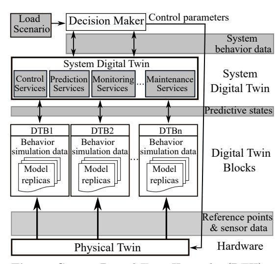
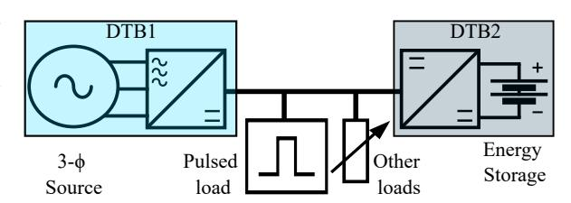
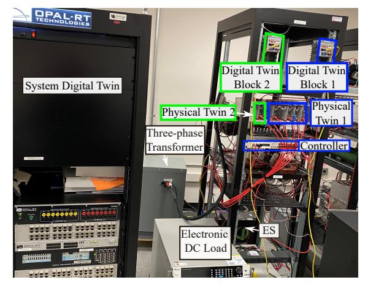
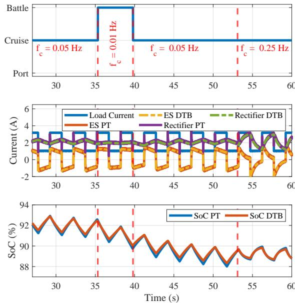

{0}------------------------------------------------

### Hierarchical Digital Twin of a Naval Power System

Abstract—A hierarchical digital twin of a Naval DC power system is developed and experimentally verified. Similar to other state-of-the-art digital twins, it is a digital replica of the physical system executed in real time or faster which can modify hardware controls. However, its advantage stems from distributing computational efforts by pursuing a hierarchical structure composed of lower-level digital twin blocks and a higher-level system digital twin. Each digital twin block is associated with a physical subsystem of the hardware and communicates with a singular system digital twin which creates a system-level response. The maximum deviation between the physical twin and the digital twin was  $\pm 5\%$ . Using information extracted from each level of the hierarchy, power system controls of the hardware were reconfigured autonomously.

## 1 Introduction

The US Navy is shifting toward electric warships as weapons, and the integration of power and energy systems is forcing a reconsideration of ship energy systems. To meet the required flexibility for electric demand, an "energy magazine" will be the basis of power systems of future ships [1]. In addition to an increased average electric power demand, the rate of change of demand will increase due to the fielding of larger pulsed loads, such as air and missile defense radars and directed energy weapons. While converters and Energy Storage (ES) can provide fast response to pulsed loads, they also increase the control complexity for power sharing within the system.

To overcome these challenges, a Digital Twin (DT) can be used to mirror the physical system using multiphysics simulations and historical data to monitor and predict system responses. Accordingly, the DT must replicate the states and behaviors of the hardware it represents [2]. As the system increases in complexity, size, or detail of DT studies or models, the computation effort increases beyond the capabilities to be held within a single digital twin or available computational hardware. Therefore, a Digital Twin Hierarchy (DTH) is proposed to enable increased complexity, future system modifications, and faster computation speeds by distributing computational effort.

Adopting a DTH for naval vessels can significantly improve the capability and efficiency of ships by enabling multi-scenario simulations under a variety of conditions and system configurations. The advantages of a DTH include distributing computational effort, integrating dissimilar 

{1}------------------------------------------------

computing hardware, and expanding modeled quantities and details. The closest concepts found in the literature to the proposed DTH provide a generic architecture that captures the essential components of a digital twin aligned with the layers of the Reference Architecture Model Industry 4.0 for manufacturing [3] or highlight how mechanical parts can be categorized by feature using a hierarchical digital mapping [4]. The "layers" of these hierarchical digital twins are the IT layers and the material properties, drawings, and heterogeneous data, respectively. Ultimately, the information was condensed into a single digital twin, which is not the goal of this research.

In this work, an electrical domain DTH is conceptualized and demonstrated for managing the power system of a naval ship. The DTH presented in this paper is capable of power sharing prediction, is used for autonomous control during operation, and maintains a decomposed hierarchical structure. In Section 2, the DTH is defined and introduced. Section 3 provides details about the experimental testbed modeling, and the system demonstrating the DTH. Section 4 provides results of the hierarchical digital twin-based, autonomous dynamic control reconfiguration. Finally, Section 5 concludes with the DTH outcomes.

# 2 Digital Twin Hierarchy Overview

The proposed Digital Twin Hierarchy (DTH) is shown in Fig. 1. It is comprised of decomposed yet coupled models of varying detail and complexity. The hierarchy is built from Digital Twin Blocks (DTBs) feeding relevant information into a single System Digital Twin (SDT). In this manner, a DTB can be viewed as a puzzle piece of a SDT in which the minute details are shown locally, but the bigger picture is only available when all the pieces are integrated.

Fig. 1: Generic Digital Twin Hierarchy (DTH).

A DTB is a representation or model of a component or subsystem of the Physical Twin (PT), the hardware being monitored. The level of detail developed in a DTB is dependent on the hardware measurements, timescale of study, and system-level relationships. More sophisticated models may provide higher fidelity and indirectly infer quantities not measured in hardware. However, complex models may require longer simulation times than available to complete the DT study, so a simpler

{2}------------------------------------------------

model may be more beneficial. Ultimately, the fundamental requirement of a DTB is to provide the data that will enable the SDT to create a system-level response based on the provided information.

The SDT is a collection of the responses from the DTBs and also encapsulates the system-level controls. Quantities returned from DTBs are aggregated by the SDT and used to inform the decision maker, which is considered to be external to the DTH and not the main focus of this work. Modifications to the system-level controls can be made by the decision maker and applied to the PT. The DTH can be used to model larger systems by distributing complexity among DTBs. Each DTB mirrors local responses and controls while the SDT focuses on the system-level controls and fully integrated system response.

# 3 An Application of the Digital Twin Hierarchy

To validate the DTH concept, the demonstrator to be used is a simplified, single-bus representation of the power system of a ship. The system consists of a DC bus with constant and pulsed loads supplied by a three-phase source and an ES, as shown in

Fig. 2: Digital Twin Hierarchy demonstrator.

Fig. 2. The DTH implemented for validation consists of a SDT and two DTBs: a three-phase source and diode bridge rectifier with boost converter output stage as DTB1 and an ES and its interface converter as DTB2. Both are modeled using small-signal averaged models. The contributed bus current from each DTB and the ES State of Charge (SoC) is communicated to the SDT.

The SDT is being used to enable dynamic current sharing between the 3- $\phi$  source and the ES using Extended Droop Control (EDC). The current is sourced according to frequency, and EDC is, therefore, able to alter the distribution of load current over time from each source depending on its dynamic capabilities. EDC uses an RC filter created by the virtual impedances to divide the load current by frequency and allocate it to each of the converters connected to a bus [5,6]. The cutoff frequency of the RC filter can be set such that the time constant of the system is greater than the response time of the slowest source serving the bus, ensuring that the ramp rate of that source is respected. The maximum tolerable bus voltage deviation,  $\Delta V_{\text{max}}$ , and the maximum converter current,  $I_{\text{max}}$ , are used to specify the virtual resistor,  $R_d$ , in (1) while the desired cutoff frequency,  $f_c$ , of the load filter determines the virtual capacitance,  $C_d$ , in (2) [5].

{3}------------------------------------------------

$$R_d = \frac{\Delta V_{max}}{I_{max}} \tag{1}$$
 
$$C_d = \frac{1}{2\pi f_c R_d}$$

The virtual resistor modifies the voltage reference provided to the rectifier, and the ES interface converter voltage reference is modified by the virtual capacitor. The equivalent circuit model, shown in Fig. 3, was used to model the dynamic behavior of this system. This model can be solved quickly and is suitable for look-ahead simulation. The

$$\begin{array}{c|c} (2) & & \\ \hline \\ R & & C \\ \hline \\ \hline I_{slow} & & I_{fast} \\ \hline \\ \hline \\ \hline \end{array} V_{ref} & \begin{array}{c} \\ \\ \hline \end{array} V_{ref} \end{array}$$

**Fig. 3:** Equivalent EDC circuit with tunable  $f_c$ .

EDC equivalent circuit is inserted into the hierarchy at the SDT. Due to page constraints, a detailed description on modeling DTH layers will be provided in the final version of this paper.

# 4 Experimental Results

The hardware used for the DTH validation is shown in Fig. 4. Power converters were implemented using Imperix PEB8032 Silicon IGBT half-bridge modules and controlled using the Imperix B-Box real-time control platform. The hardware communication is accomplished over Ethernet for coupling and dynamic control reconfiguration. The DTB models were deployed using National Instrument Compact RIOs, and the SDT model was deployed on an Opal-RT real-

Fig. 4: Hardware for DTH demonstration.

time simulator. Before running the hierarchy autonomously, several tests were performed to validate the DTH components, which will be provided in the final version of this paper.

The fuzzy logic-based decision maker, used in this experiment, is dependent on the ship posture: port, cruise, or battle. The various postures determine load current contribution from the ES and generator. In port, the load demand should be served by the generator or land-tie connection. In cruise, the current contribution is shared depending on the ES SoC. More current is provided by the ES when the SoC is above 90% and reduced when below this SoC. In battle, the ES is unconstrained by SoC and contributes the maximum allotted energy. Applying the proposed DTH and decision maker to the simplified ship power system, the results of the autonomous operation of the system are depicted in Fig. 5. The decision maker posture and changes to the cutoff frequency for the ES can be seen in the first plot. A comparison of the DTBs and PT subsystem responses

{4}------------------------------------------------

is shown in the other two plots. According to the selected posture and SoC of the ES, new EDC parameters were provided by the decision maker to the hardware controller, altering its EDC current sharing action. Figure 5 confirms the fidelity and agreement of the digital and physical system. The maximum deviations of the DTH from the hardware are provided in Table 1. This test validates the proposed concept of DTH and confirms that the controls of the PT can be reconfigured in situ using a hierarchical DT.

Fig. 5: Autonomous operation of the hierarchy.

Table 1: DIGITAL TWIN HIERARCHY ACCURACY

| Component | Parameter             | Maximum deviation (%) |
|-----------|-----------------------|-----------------------|
| DTB1      | Rectifier current     | ±5                    |
| DTB2      | ES SoC                | ±1                    |
| SDT       | EDC rectifier current | ±2                    |
| SDT       | EDC ES current        | ±1.85                 |

#### 5 Conclusions

A hierarchical digital twin of a naval DC power system was developed and experimentally verified using an implementation example and modifying the system-level controls. The DTH was developed based on the definitions and system decomposition proposed. As the system operated, the EDC scheme was dynamically reparameterized, allowing the ES to contribute current based on its SoC and ship needs. Provided maximum deviations between the developed DTH and the hardware show that the DTH decomposition and models used are well aligned with the PT. More details on the DTB models, model verifications, and results will be provided in the full paper.

## References

- [1] J. Mochulski and R. Malina, "Naval open architecture machinery control systems for next generation integrated power systems," https://apps.dtic.mil/sti/pdfs/ADA576838.pdf, 2012, accessed: 2022-11-26.
- [2] E. Glaessgen and D. Stargel, "The digital twin paradigm for future NASA and U.S. air force vehicles," in 53rd AIAA/ASME/ASCE/AHS/ASC Structures, Structural Dynamics and Materials Conference.
- [3] G. Steindl, M. Stagl, L. Kasper, W. Kastner, and R. Hofmann, "Generic digital twin architecture for industrial energy systems," NATO Adv. Sci. Inst. Ser. E Appl. Sci., vol. 10, no. 24, 2020.
- [4] M. Zheng and L. Tian, "A hierarchical integrated modeling method for the digital twin of mechanical products," *Machines*, vol. 10, no. 1, 2022.
- [5] Q. X. et al., "A Decentralized Dynamic Power Sharing Strategy for Hybrid Energy Storage System in Autonomous DC Microgrid," IEEE Transactions on Industrial Electronics, vol. 64, no. 7, 2017.
- [6] "Serving constant and pulsed loads in naval power and energy systems," in 2023 IEEE Applied Power Electronics Conference and Exposition.