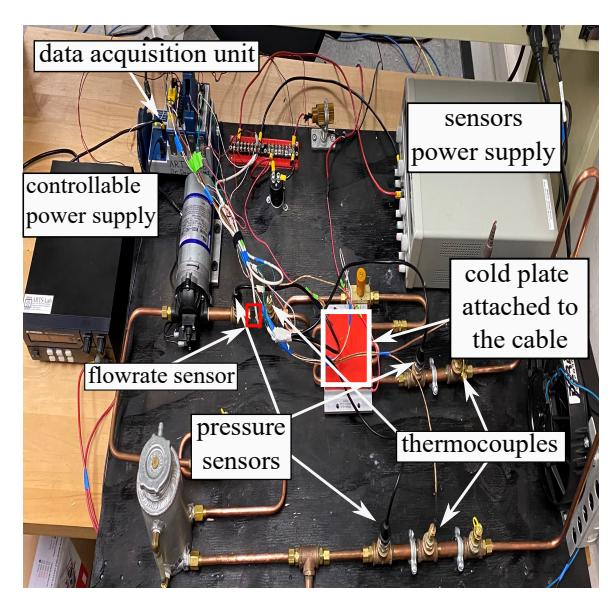
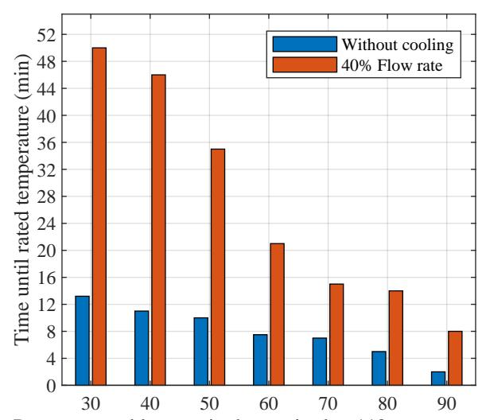
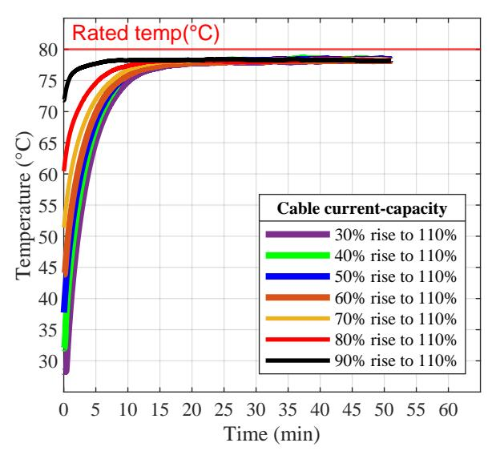
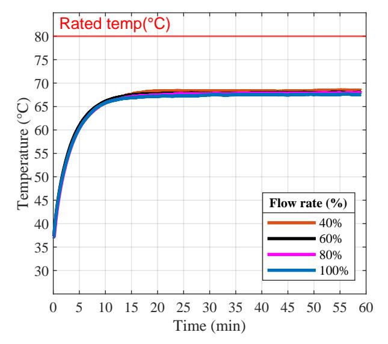
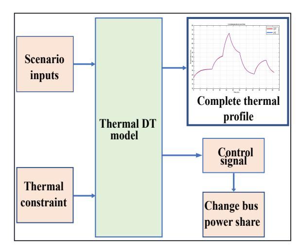
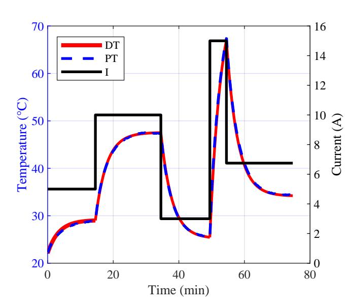
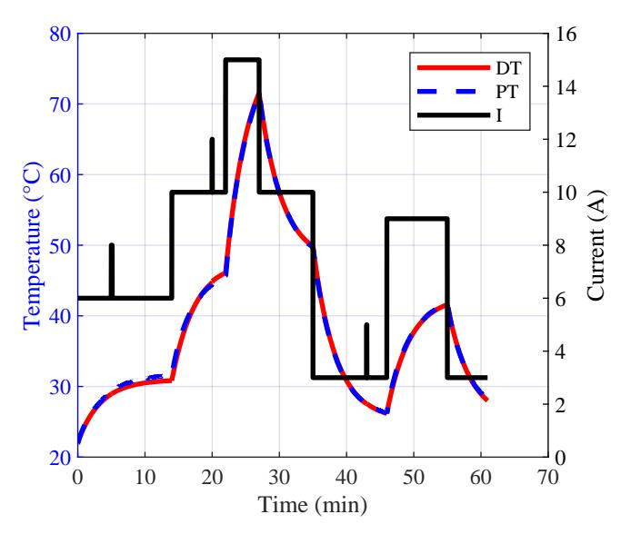

{0}------------------------------------------------

# Digital Twin Model for Predicting the Thermal Profile of Power Cables for Naval Shipboard Power Systems

Kerry Sado\*, Student Member, IEEE, Richard Hainey†, Jose Peralta\*, Student Member, IEEE,

Austin Downey†‡, and Kristen Booth\*, Member, IEEE

\*Dept. of Electrical Engineering

†Dept. of Mechanical Engineering

‡Dept. of Civil and Enviormental Engineering

University of South Carolina

Columbia, USA

\*ksado@email.sc.edu

This work was supported by the Office of Naval Research under contract N00014-22-C-1003.

Abstract—The current-carrying capacity of electric power cables has a significant effect on the total power transmitted from generation bus to the load bus. The capacity decreases as the cable temperature increases. The physics involves a positive feedback effect in which the resistance of the conductor increases as the temperature increases. Observing and predicting the thermal profile of power cables on shipboards will contribute to an efficient, reliable, and robust shipboard power system. An electro-thermal Digital Twin (DT) for predicting and observing the thermal profile of power cables is developed. The developed DT can be used to study the effect of cable temperature on power transmission. The objective of the DT will be to keep the cable temperature below its thermal rating at which deleterious effects occur. The maximum deviation between the physical and digital twin was ±0.7 °C and is well within a reasonable margin of error. Experimental results verify the capabilities of this DT which is ready for integration into larger power system digital twins.

Index Terms—Digital Twin Modeling, Power Cables, Thermal Analysis, Power Systems, Electric Ships

# I Introduction

The Digital Twin (DT) approach has been successfully adopted by the aerospace and automotive industry [1]. A DT can be defined as a dynamic set of digital models that fully describes a physical system or subsystem and effectively reflects its operational behavior [2]. The concept of DTs is of interest for maritime industry due to its great potential [3]. Adopting DT technology for different power system components on shipboards will contribute to fleet success [4]. Observing and predicting the thermal profile of shipboard power cables will contribute to successful ship missions and increase the total efficiency of the power system. Improved utilization of power cables will be accomplished when thermal profile of the cable is predicted for expected future loads. The currentcarrying capacity of electric power cables decreases as the cable temperature increases. The physics involves a positive feedback effect in which the resistance of the conductor increases as the temperature increases [5]. The primary aging effect is manifested in the cable insulation [6], rather than in

the conductor itself, but terminations are also a common point of failure due to increased contact resistance resulting from a combination of oxidation and mechanical stress.

In this work, a DT model observing and predicting the thermal profile of the power cable used for onboard Naval ships power system was developed. The developed DT considers the effect of cable temperature on power transmission. The objective of the DT is to keep the cable temperature below the temperature at which deleterious effects occur. Several different load profile scenarios have been applied to the developed DT, and the results are compared with the physical twin. Section II provides details on the testbed used to collect experimental results. Section II provides the mathematical modelling of the DT and provides the required test results to drive model equations. Results from natural and forced cooling and a quick overview of the cable characterization are provided in Section II. Case scenarios and putting the developed DT into tests are provided in Section III, and Section IV provides conclusions and a discussion of ongoing and future work.

### II TESTBED FOR ELECTRO-THERMAL DIGITAL TWIN

The testbed used for this experiment is shown in Fig. 1. It consist of a centrifugal pump, cold plate heat exchanger, flow control valve, radiator, and a reservoir. The cold plate was attached to the cable and acts as a heat sink during forced cooling tests. Four thermocouples were used in the testbed, one of which was directly coupled with the cable. The other thermocouples were used to measure water temperature at various points along the thermal loop: entering and leaving the cold plate, after the radiator, and before the pump. A turbine flow-rate sensor, situated after the pump, measures the water coolant flow rate through the system. The top sensor power supply, pictured in Fig. 1, supplies power to each of the pressure transducers and turbine sensor. The left power supply provides power to the radiator fan. An NI-cDAQ was used for acquisition and measuring of thermal, pressure,

{1}------------------------------------------------

Fig. 1: Experimental testbed.

and flow-rate data within the system. These data were sent to a nearby dedicated computer for monitoring and control. An experimental study of cable heating was conducted to benchmark system performance. The cable was tested under natural cooling by gradually incrementing the current, waiting until the temperature reached steady state, then increasing the current again, in repeated steps. The cable was also tested under forced cooling using a heat exchanger that consist of a cold plate and a radiator; the flow rate of the coolant was controlled. Different scenarios were tested with sudden rise in the current. When the cable was running at a certain capacity and a sudden rise in current is demanded from the power system following a change in the ship posture, system damage and/or other critical situations, the available time until thermal rating of the cable is reached may not be enough for a successful mission. However, applying forced cooling will increase the time limit before the cable reaches its rated temperature. The time limit depends mainly on the flow rate level of the coolant and the present cable-capacity percentage. With the cable running at different capacities and suddenly changing the current to 10% above its rating, different flow rate levels were applied in order to observe the effect of cooling on the cable thermal profile. The time for the cable to reach its thermal rating without cooling and with forced cooling applied at a 40% flow rate is shown in Fig. 2.

For example, the cable running at 60% capacity, and the load demand is required to be at 110% of its capacity for critical load demands, applying forced cooling will increase the time until thermal ratings from 7.5 minutes to 21 minutes compared to the natural cooling case.

Using a thermal RC circuit as the thermal representation of the system, the mathematical model of the system was developed. The temperature of the cable at time t, after a step

Percentage cable capacity base raised to 110% current rating

Fig. 2: Cable temperature with forced cooling applied VS natural cooling.

increase of current is described as:

$$T(t) = T_0 + \Delta T \times \left(1 - e^{(-t/c)}\right). \tag{1}$$

where  $T_0$  is the initial temperature,  $\Delta T$  is the step increase of asymptotic final temperature above the initial temperature  $T_0$ , and c is the time constant. The thermal time constant can be defined as the time required for the material at a certain temperature to reach 63.2% of the final temperature [7]. In order to get an average time constant for the thermal model, more experimental tests were conducted. The first test, in Fig. 3, shows forced cooling of the cable with a constant 60% flow rate and a variety of current steps. In Fig. 4, the second test shows variation in flow rate with constant current. Accordingly, the average time constant c = 3.4, is derived.

The cable used for this test has a rating current of 13.5 A at a jacket surface temperature of 80 °C. The cable was tested with different currents up to 10% above its rated current. The temperature of the cable is a function of its current and the total time of the current flowing through it. Based on these factors and test data, the best fit equation to find the steady-state temperature of the cable at a given current, I, is

$$T(I) = 0.2434I^2 + 0.01839I. (2)$$

The current value in (2) is limited with upper and lower boundaries of  $0 \le I \le 15$ . The mathematical model which represents the digital twin of the thermal model for the power cable is based on

$$T_n(t) = T_{n-1} + (T(I) + T_{n-1}) \times \left(1 - e^{(-t_n/c)}\right).$$
 (3)

where  $T_n(t)$  is the estimated temperature at time, t,  $T_{n-1}$  is the previous temperature at the previous power transfer condition at time  $t_n$ , and T(I), from (2), is the steady-state temperature calculated from the current.

{2}------------------------------------------------

Fig. 3: Cable temperature with forced cooling applied at 60% flow rate.

Fig. 4: Cable temperature over time with different flow rates.

# III CASE SCENARIOS

The DT development for the electro-thermal studies is completed Fig. 5. Case scenarios along with thermal constraints are fed to the DT model, and it plots the thermal profile of the provided scenario. Based on the thermal constraint value entered, it will flag a control signal indicating the model reached the predefined thermal constraint.

The developed DT was tested with two load profile scenarios in Fig. 6, without pulsed loads, and Fig. 7, with pulsed loads. The results shown validate that the DT can predict the thermal profile of the power cable for different changes in the load current with or without pulsed loads. The maximum

Fig. 5: Electro-thermal digital twin model.

deviation between the physical twin and the DT was  $\pm 0.7$  °C and is well within a reasonable margin of error.

Fig. 6: Thermal profile for scenario 1 test without pulsed loads.

# IV CONCLUSIONS & FUTURE WORK

An electro-thermal DT model for predicting and observing the thermal profile of power cables is developed. The developed DT can be used to study the effect of cable temperature on power transmission. Comparison of the physical twin and the DT verifies the capabilities of this DT which is ready for integration into larger power system digital twins. Results validate that the DT can predict the thermal profile of the power cable for different changes in the load current with or without pulsed loads. The maximum deviation between the physical twin and the DT was  $\pm 0.7$  °C and is well within a

{3}------------------------------------------------

Fig. 7: Thermal profile for scenario 2 test with pulsed loads.

reasonable margin of error. The DT can be used for lookahead simulations based on scenarios fed to the DT and can be easily adjusted to integrate with larger DTs for complete DT of power systems on shipboards. The DT is able to lookahead for different time ranges, seconds, minutes, hours, or even an entire mission profile.

In the future, the electro-thermal DT of the cable will be used in a multi-bus system as a future small-scale testbed for study of the current overload capability of thermally-limited cables. The control signal from the DT can be used for controlling the bus power share. By integrating these results into a decision maker, the predictive power flow decisions will improve the conditions of the system by modifying the system alignment to the most optimal solution, dependent on the ship posture, system damage, and mission.

## ACKNOWLEDGMENTS

This work was supported by the Office of Naval Research under contract N00014-22-C-1003. The support of the ONR is gratefully acknowledged. Any opinions, findings, conclusions, or recommendations expressed in this material are those of the authors and do not necessarily reflect the views of the United States Navy.

### REFERENCES

- [1] The Digital Twin throughout the Lifecycle, ser. SNAME Maritime Convention, vol. Day 2 Thu, October 25, 2018, 10 2018, d023S003R002.
- [2] Origins of the Digital Twin Concept, 08 2016.
- [3] J.-E. Giering and A. Dyck, "Maritime digital twin architecture," at -Automatisierungstechnik, vol. 69, no. 12, pp. 1081–1095, 2021. [Online]. Available: https://doi.org/10.1515/auto-2021-0082
- [4] M. Leonard-Albert, D. Hobbs, J. Hannum, E. Santi, and K. Booth, "Early stage modeling of naval dc power system for digital twin development," in 2021 IEEE Electric Ship Technologies Symposium (ESTS), 2021, pp. 1–8.
- [5] J. C. Maxwell, A treatise on electricity and magnetism. Oxford Clarendon press, 1873.

- [6] S. V. Suraci, D. Fabiani, S. Roland, and X. Colin, "Multi scale aging assessment of low-voltage cables subjected to radiochemical aging: Towards an electrical diagnostic technique," *Polymer Testing*, vol. 103, p. 107352, 2021. [Online]. Available: https://www.sciencedirect.com/science/article/pii/S014294182100297X
- [7] N. S. Nise, Control Systems Engineering. New York: Wiley, 1992.