{0}------------------------------------------------

Kerry Sado\*, Student Member, IEEE, Jarrett Peskar†, Sebastian Ionita\*, Student Member, IEEE,
Jack Hannum\*, Student Member, IEEE, Austin Downey†‡, Member, IEEE, and Kristen Booth\*, Member, IEEE

\*Dept. of Electrical Engineering

†Dept. of Mechanical Engineering

‡Dept. of Civil and Environmental Engineering

University of South Carolina

Columbia, USA

\*ksado@email.sc.edu

Abstract—In this paper real-time electro-thermal simulation models for power electronic converters are developed. The models replicate the electrical and thermal behavior of the physical system under dynamic load conditions with a high degree of accuracy. The approach is discussed using a simple DC-DC power converter topology and employs a multi-domain modeling approach. The paper also highlights the challenges of data synchronization between the physical and digital models while running real-time hardware in the loop experiments, which is critical for the effectiveness of the real-time simulation technology. Experimental results show that the developed models predict the behavior of the physical system with a high degree of accuracy, with a maximum average percentage deviation of 2%, providing a promising approach for developing multi-domain real-time Digital Twins (DTs) for power electronic converters. Overall, the paper develops computationally efficient models with high degree of accuracy that are essential for the practical implementation of DTs. The real-time simulation models serve as the foundation for developing DTs for power electronic converters with model updating capabilities, enabling real-time control and predictive maintenance.

Index Terms—real-time simulation, hardware in the loop, thermal analysis, digital twin, power electronics

# I. Introduction

Power electronic converters are used in various applications such as renewable energy systems, electric vehicles, and naval ships. They have become an essential part of modern power systems and their performance is critical for the efficient operation of the entire system. Power converters generate heat during operation, and their thermal behavior has a significant impact on their electrical performance and overall reliability. Therefore, it is essential to consider both electrical and thermal domains when designing and modeling these systems. Advancements in semiconductor devices technology have led to power converters being pushed to their maximum performance, making thermal management crucial to safeguard them from thermal failure that can significantly reduce the overall efficiency of the power system. This is particularly important in critical applications such as navy ships and electric aircraft,

This work is supported by the Office of Naval Research (ONR) under ONR contract N00014-22-C-1003.

where the efficiency and robustness of the power system are vital for mission success.

To address the challenges of designing and operating power converters and complex power systems, Digital Twin (DT) technology has become a valuable tool. A DT is a virtual replica of physical assets, systems, or processes that can be used for modeling, analysis, and optimization. In power systems, DTs can be used to create a comprehensive and accurate representation of the entire power system, including generators, power converters, distribution networks, and control systems. DTs provide a range of benefits in power systems, including improved operational efficiency, increased reliability, and better asset management. By creating a virtual model of the power system, various scenarios can be analyzed and evaluated to assess the potential impact of control and system configuration changes without causing any disturbance or disruption to the actual system. This can help identify potential issues, optimize performance, and reduce downtime and maintenance costs.

The significance of DTs is rapidly gaining recognition from both academic and industrial sectors and have potential applications across multiple sectors [9]–[11]. As an illustration, in the aerospace industry, DT models have been utilized to accurately assess the wear and fatigue of an aircraft over its lifespan [12]. The maritime industry recognizes the potential of DT technology as an opportunity for improvement [13]. The maritime industry can greatly benefit from using DT technology, especially for naval ship power systems. This advanced technology has the potential to revolutionize and improve different aspects of power systems in naval vessels. In the maritime sector, the adoption of DTs can yield substantial benefits. The primary objective of incorporating DTs in this industry is to enhance asset dependability, optimize

{1}------------------------------------------------

maintenance practices, and minimize operational costs. [14]. Recognizing these potential benefits emphasizes the importance of integrating DT technology into naval ship power systems. Naval ship power systems play a crucial role in the performance and reliability of ships at sea. Designing and operating these systems efficiently and effectively is essential due to their critical nature. As the US Navy transitions towards the electrification of its naval systems, the demand for electric power is increasing significantly, surpassing that of older generations. This shift is driven by larger and pulsed loads, such as air and missile defense radars and directed energy weapons, which require higher levels of power consumption and greater dynamism [15]. The inclusion of pulsed loads and energy storage systems presents a significant design challenge for the power system and components of naval vessels. Modern power systems are faced with a growing complexity that extends beyond military applications. For example, civilian terrestrial grids also encounter challenges with the introduction of fastcharging stations for electric vehicles, which have increased the pulsed loads on the grid. This has made monitoring and control more challenging. As a result, the use of DTs can offer valuable design aid and insights into the entire life cycle of power systems and their components for both military and civilian applications.

In order to build DTs for power electronic converters, one must first design and develop real-time simulation models and validate them through Power Hardware-In-the-Loop (PHIL) experiments. Previous studies have developed real-time simulation models for power electronic converters, such as those presented in [16]–[18]. However, these models only consider the electrical behavior of the converter, limiting their ability to accurately predict the thermal behavior of the system. An electro-thermal modeling approach for multi-chip power modules has been proposed in [19]. The proposed model incorporates both the electrical and thermal behavior of the system, providing a more comprehensive understanding of its performance. However, while the paper outlines the theoretical foundation of the model, there is a lack of experimental validation against the physical system and no evidence of the capability of the model to run in real-time. Designing an effective model of a power electronic converter is crucial for accurate and reliable performance predictions. A robust model should consider both the electrical and thermal behaviors of the converter while being computationally efficient and capable of running in real-time. Achieving this requires the integration of various electrical and thermal models that accurately represent the behavior of the system. The process of integrating electrical and thermal models involves utilizing mathematical models and simulation software to account for the impact of different parameters on the performance of the

converter, including input voltage, current, and temperature. These models can be developed using analytical, empirical, or hybrid approaches, depending on the complexity of the system and the level of accuracy required. To ensure the practical application of the model, it should be computationally efficient and capable of running in real-time. This requires modeling techniques that minimize computational resources while maintaining high accuracy levels.

The development of a real-time simulation model is the first critical step in building a DT of a power electronic converter. This model serves as a virtual representation of the physical system, accurately capturing its electrical and thermal behaviors. The simulation model should incorporate different electrical and thermal models to predict the performance of the system with a high degree of accuracy under varying operating conditions. Once the simulation model has been developed, it must be validated through PHIL experiments. This involves connecting the simulation model to the physical converter and applying the same operating conditions to the physical and digital models. This validation process is crucial in ensuring the accuracy and reliability of the digital model in shadowing the behavior of the physical converter in real-time.

Additionally, the development of a computationally efficient model is essential for the practical implementation of DTs. This ensures that the model can run in real-time on devices with limited processing power. Furthermore, the simulation model serves as the foundation for developing the DT of the power electronic converter. Once the simulation model has been validated, it can be used as a virtual representation of the physical system to enable real-time control and predictive maintenance. This enables the system to be monitored and optimized in real-time, reducing the risk of failures and improving overall efficiency. In this context, a real-time electrothermal model for power converters that considers both the electrical and thermal behaviors is essential.

{2}------------------------------------------------

#### II. ELECTRO-THERMAL MODELING

The electro-thermal real-time model integrates both the electrical and thermal models of the power converter. The electrical model captures the electrical behavior of the power converter while the thermal model focuses on its thermal behavior. The integration of these models enables a comprehensive understanding of the performance of the converter in real-time, including its electrical and thermal behavior. The electrical and thermal domains have different step size and sampling time requirements. The electrical model requires a smaller time step when compared to the thermal model. To overcome this challenge, the multi-domain model utilizes a time synchronization algorithm to coordinate the exchange of information between the two models.

The time synchronization algorithm used in the multidomain model ensures that the electrical and thermal models exchange information at the same time scale, despite their different step size and sampling time requirements. Importantly, this synchronization process does not result in any data loss or other impacts on the accuracy of the information being exchanged. To achieve this synchronization, the algorithm continuously monitors the time elapsed in both models and waits until both models have completed their respective time steps before exchanging information. The algorithm ensures that the electrical and thermal models are operating on the same time scale, yet, does not introduce any errors or inaccuracies in the data exchange process. For instance, if the electrical model has a time step of 10 microseconds, while the thermal model has a time step of 100 microseconds, the synchronization algorithm waits until 10 time steps of the electrical model have elapsed before exchanging information with the thermal model. This approach ensures that both models are operating in sync and that data is being exchanged accurately. Details on the electrical and thermal models are provided in the following subsections.

#### A. Electrical Model

Typically, switching models are used to represent power converters for design and troubleshooting purposes. However, modeling these switching events can be computationally expensive and therefore, an averaged switching model is used. The averaged switching model is a mathematical representation of the switching converter that uses time averaging to smooth out the rapid switching transitions, creating a continuous model that provides an approximation of the average

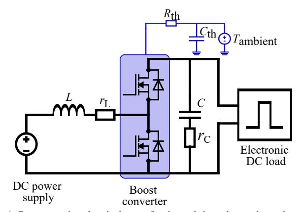

Fig. 1: Representative electrical setup for the real-time electro-thermal model.

behavior of the converter [20]. This approach simplifies the simulation process and reduces computational costs.

Power losses in power semiconductor devices can have significant impacts on the performance of the converter, such as reduced efficiency and reliability due to overheating. In power semiconductor devices, power losses include conduction losses,  $P_{\text{conduction}}$ , and switching losses,  $P_{\text{switching}}$ . Conduction losses can be estimated from the static I-V characteristics of the device. These losses depend on the current flowing through the device, I, on the on-state resistance of the device,  $R_{\text{DS,on}}$ , and the duty cycle, D. On-state resistance is a function of the physical characteristics and material properties of the device and can be affected by factors such as temperature and operating voltage. The power losses due to conduction are

$$P_{\text{conduction1}} = DI^2 R_{\text{DS,on}} \text{ and}$$
 (1)

$$P_{\text{conduction2}} = (1 - D)I^2 R_{\text{DS,on}}$$
 (2)

for the upper and lower devices, respectively. Switching losses depend on the switching frequency,  $f_{\rm s}$ , and the total energy dissipated during both the turn-on,  $E_{\rm T,on}$ , and turn-off,  $E_{\rm T,off}$ , transitions of the device. When the switching frequency increases the power losses due to switching also increase. The energy dissipated during the turn-on and turn-off transitions is also dependent on the capacitances of the device, and the speed at which these transitions occur. The power losses due to switching are

$$P_{\text{switching}} = f_s(E_{\text{T,on}} + E_{\text{T,off}}) \tag{3}$$

Finally, the total power losses in the switching devices,  $P_{\text{losses}}$ , can be obtained by summing up the power losses due to conduction and switching as

$$P_{\text{losses}} = P_{\text{conduction1}} + P_{\text{conduction2}} + P_{\text{switching}}.$$
 (4)

{3}------------------------------------------------

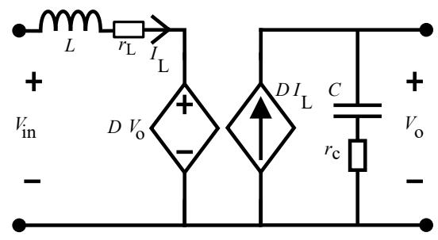

Fig. 2: Averaged switching model of the boost converter.

provides essential parameters such as the switching frequency, duty cycle, and current flowing through the device. These computed losses are seamlessly fed into the thermal model.

#### B. Thermal Model

An effective real-time thermal model should account for various factors that affect the thermal behavior of the converter, such as the materials used, the geometry of the components, and the cooling system employed. Additionally, the thermal model should be validated through experimentation to ensure its accuracy and effectiveness in predicting the thermal behavior of the converter. Once an accurate thermal model has been developed, it can be integrated with the electrical model to create a comprehensive electro-thermal model that can monitor and predict the performance of the converter in realtime. The electrical model is essential for calculating the total losses generated by the switching components of the converter. These losses, which include conduction and switching losses, serve as inputs to the thermal model. Accurately calculating these losses is critical in ensuring that the thermal model can provide real-time insight into the thermal behavior of the converter, enabling effective thermal management. Furthermore, the implementation of the thermal model allows for real-time analysis and response of every individual component, spanning from the junction to the heat sink. This level of applicability may not be achievable through the employment of the physical hardware alone.

The thermal model of the converter is modeled using the Cauer thermal network to represent each component of the MOSFET to heat sink assembly. This approach utilizes the thermal circuit analogy through thermal resistances and capacitances. The thermal resistances aid in calculating the temperature difference while the capacitances enable the computation of the transient response during temperature fluctuations across a material. The use of Cauer thermal network allows for a more accurate representation of the thermal behavior of MOSFETs and heat sinks. This approach has been shown to be highly effective in previous studies [21]–[23].

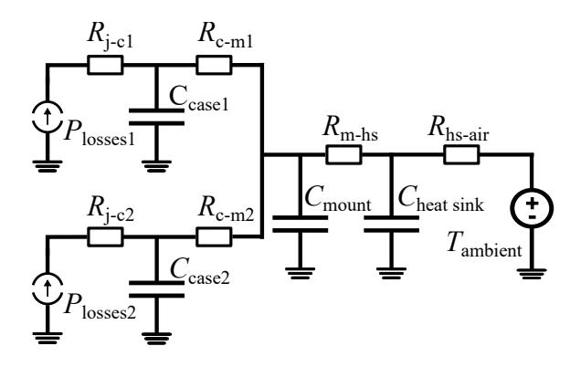

Fig. 3: Thermal network of the power module.

resistance,  $R_{m-hs}$ , thermal capacitance of the heat sink,  $C_{heatsink}$ , and heat sink to ambient air thermal resistance,  $R_{hs-air}$ .

# III. EXPERIMENTAL SETUP

The experimental hardware setup used to validate the operation of the electro-thermal model is shown in Fig. 4. To implement the real-time simulations, a Field Programmable Gate Array (FPGA) board of a National Instruments (NI) compact RIO (cRIO) was employed. This platform enables the integration of high-performance computing and data acquisition capabilities, allowing the models to operate in real-time and respond promptly to changes in the physical hardware. The temperature of the physical converter was monitored using a thermocouple, and the live temperature was fed to the digital models using an NI 9210 C-Series module connected to the cRIO chassis for initialization. The cRIO chassis acted as the real-time interface between the physical converter and the digital models with Ethernet serving as the communication medium. The digital models are updated by utilizing the measurements received from the physical hardware as shown in Fig. 5. The power converter is implemented using Imperix PEB8038 - Halfbridge SiC power module [24]. The PEB8038 consists of two MOSFETs mounted on an aluminum plate, connected to a heat sink with thermal paste. Physical measurements and experiments have been carried out to determine the thermal resistances and capacitances of the thermal network shown in Fig. 3. This thermal network enables the thermal digital model to represent the temperature and transient response of each component, from the junction to the heat sink.

The PEB8038 is equipped with optical gate drive circuits that regulate the MOSFETs. The module can handle continuous currents of up to 38 A rms and comes equipped with a heat sink capable of dissipating 140 W of power losses [24]. The boost converter design included a 1.25 mH inductor and a 500  $\mu$ F capacitor. The bus voltage was monitored using an Imperix DIN800V sensor, and the inductor current was measured with the built-in current sensor of the PEB8038 module. An Imperix external DIN50A current sensor was connected in series with the converter output to measure the load current [25]. The signals measured by the sensors are transmitted to the electrothermal model via Ethernet. To drive the converter, nested

{4}------------------------------------------------

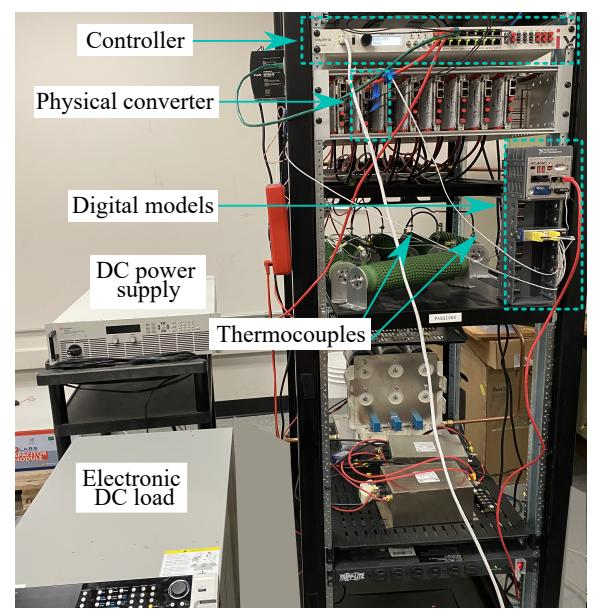

Fig. 4: Experimental hardware setup.

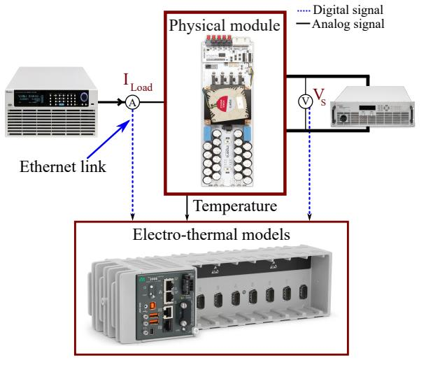

Fig. 5: System coupling.

#### IV. EXPERIMENTAL RESULTS

The validation process for the developed electro-thermal model was an iterative procedure. Initially, the electrical model was tested independently against the corresponding physical converter to verify the accuracy and alignment of the model with the real-world behavior of the physical converter. Subsequently, the thermal model was tested in a similar fashion. These tests involved the application of different load scenarios and measuring the response of each digital model against the physical converter behavior. The obtained results were then compared to evaluate the accuracy of the digital model

#### A. Electrical Model Validation

Verifying a digital model against its physical hardware is critical to ensure that the model accurately represents the behavior of the physical twin. To verify the accuracy of the digital model, the system can be tested under different load scenarios to evaluate its ability to track rapid changes in the physical twin. One effective way to assess the dynamic response of the system is by subjecting it to pulsed loads of varying lengths. Pulsed loads can help evaluate how quickly the system can respond to changes in the load and identify deviations between the digital model and the physical twin that may not be apparent under steady-state conditions. Furthermore, simulating real-world conditions is essential for ensuring that the model accurately reflects the behavior of the physical system. Combining different pulsed loads with different amplitudes and pulse widths can simulate intermittent or transient loads that many physical systems experience in real-world applications. Testing under these conditions can help ensure that the digital model reflects these conditions and can reliably predict the performance of the system under real-world conditions.

Accordingly, two load scenarios were applied to the system of Fig. 5. In the first scenario, the system was subjected to a baseline load of 2 A and a pulsed load of 2 A with a period of 4 seconds and a pulse width of 50%. Fig. 6 illustrates the responses of the inductor current,  $I_L$ , output voltage,  $V_{out}$ , and output power,  $P_{out}$  of the physical converter and the digital model. This scenario presents a unique challenge as the system has to balance the sudden surge in load with a continuous load, and the response of the system is critical to ensure its stability.

In the second scenario, a combination of different pulsed loads with different amplitudes and pulse widths was applied to the system. Fig. 7 illustrates the responses of the system. This scenario represents the highest level of complexity, as the system has to react to a combination of pulsed loads, requiring more precise control and monitoring. Overall, these scenarios present different levels of complexity and challenges for the system, and the responses are critical to ensuring the stability and efficiency of the system.

The results of this verification experiment have provided valuable insights into the correlation between the electrical digital model and its physical counterpart. The results demonstrate a high degree of accuracy and reliability of the digital model as a virtual replica of the physical system. In addition, the model enables real-time monitoring and analysis of the response of the system to different load scenarios. This capability is crucial as it allows for the early detection and identification of any potential issues or deviations, which can

{5}------------------------------------------------

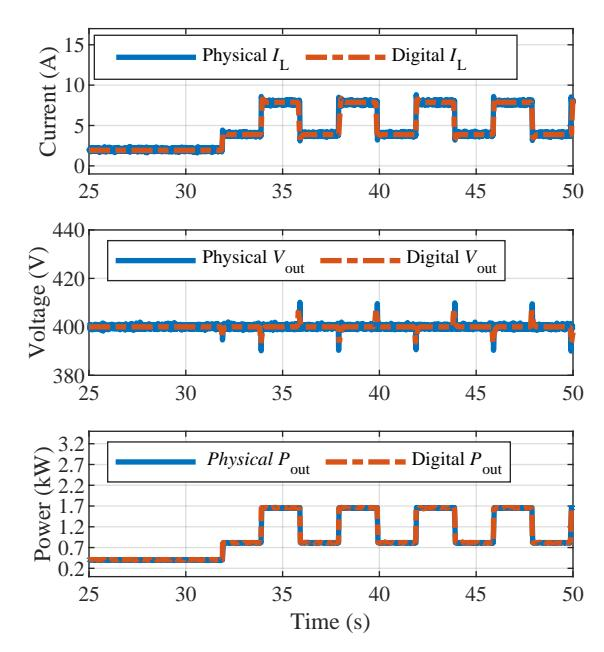

Fig. 6: Electrical model behavior scenario 1.

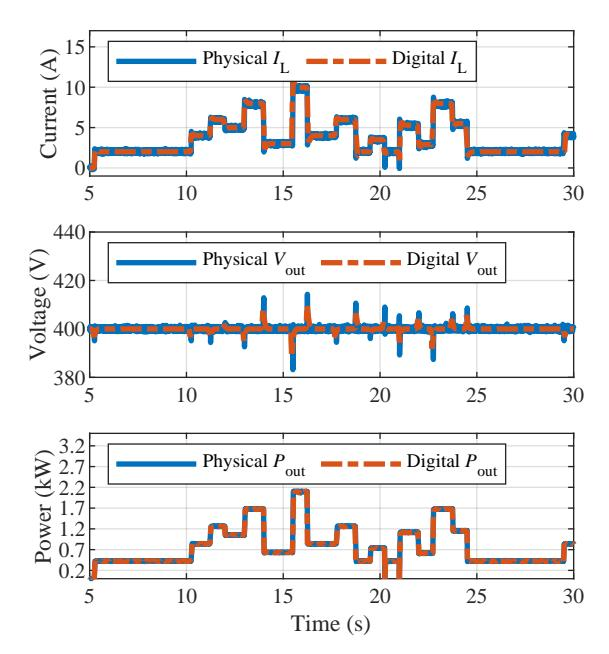

Fig. 7: Electrical model behavior scenario 2.

be difficult to achieve with the physical system due to inherent limitations in monitoring and control.

# B. Thermal Model Validation

The thermal response of a system is typically slower compared to electrical systems due to the inherent characteristics of thermal systems. The time constants of thermal systems are typically much longer than those of electrical systems, and the thermal mass of components can significantly affect the response time of the system. Additionally, heat transfer coefficients and thermal resistances can also play a significant role in determining the thermal response of a system. Due

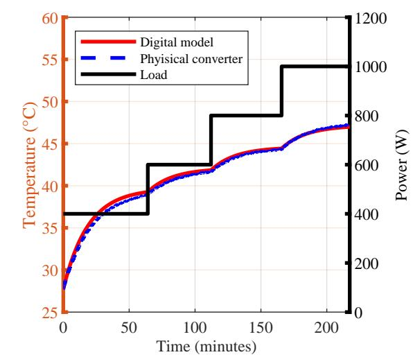

Fig. 8: Thermal model behavior at 20 kHz switching frequency.

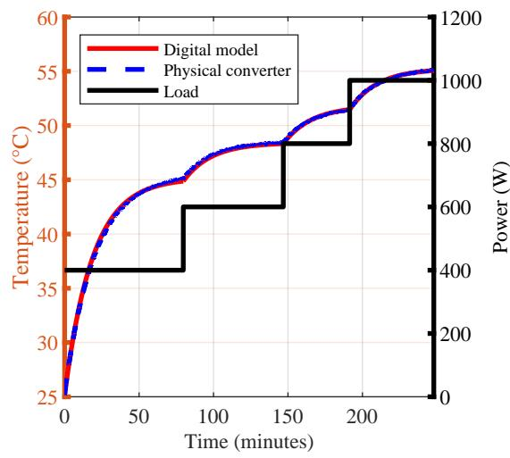

Fig. 9: Thermal model behavior at 30 kHz switching frequency.

Sections II-A and II-B highlighted that the thermal behavior of the converter is determined by the total losses that are the combination of switching and conduction losses. These losses are provided by the electrical domain model. In order to validate the accuracy and effectiveness of the thermal model in tracking the thermal behavior of the physical system, two load scenarios with different switching frequencies were applied. This approach enabled a comprehensive examination of the performance of the digital model in replicating the thermal behavior of the physical converter.

In the initial experimental setup, the boost converter was operated with a switching frequency of 20 kHz while subjected to a steady-state load to establish its thermal behavior. Sub-

{6}------------------------------------------------

sequently, the system was subjected to gradually increasing loads to monitor the dynamic response of the digital model under varied load conditions. The results of this scenario are presented in Fig. 8. The obtained results indicate that the developed model was able to track the thermal behavior of the physical twin with a commendable degree of accuracy. In the second scenario, the switching frequency was increased to 30 kHz while maintaining the previous load profile. The resulting thermal behaviors of the system are presented in Fig. 9. These results demonstrate that the developed digital model is capable of tracking and modeling the thermal behavior of the physical converter even under varying switching frequencies.

In Section II-A, the impact of switching frequency on the thermal behavior of power converters was explained. To support this discussion, the results from Fig. 8 and Fig. 9 were analyzed. These results confirm that increasing the switching frequency of the converter leads to an increase in switching losses, which results in a rise in the temperature of the device. Therefore, the data obtained from the experiment aligns with the information presented in Section II-A. In conclusion, the experimental results presented in this subsection illustrate the effectiveness of the developed model in replicating the thermal behavior of the physical system in real-time under different switching frequencies and load conditions.

#### C. Electro-thermal Model Validation

Accordingly, a switching frequency of 30 kHz was selected, which is within the typical range used for power converters in real-world applications. Constant and pulsed loads were applied to the system for extended periods, and the resulting data was plotted to observe any deviations or fluctuations. The results, as shown in Fig. 10, indicate that the digital model and the physic

MAPE is a measure of the average percentage deviation between the predicted and actual values. It is calculated by finding the absolute difference between the predicted and actual values, dividing it by the actual value, and then averaging these percentage errors across all data points. Accordingly, the data of the physical converter and the digital model were fed to (5) to measure the average percentage deviation of the digital model from the physical hardware.

$$MAPE = \text{mean}\left(\left|\frac{X_{\text{act}} - X_{\text{pred}}}{X_{\text{act}}}\right|\right) * 100\%$$
 (5)

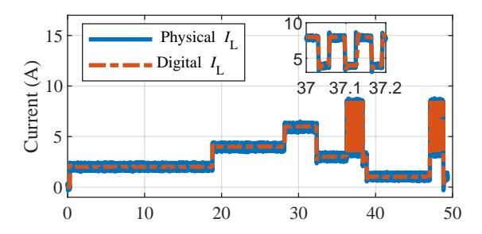

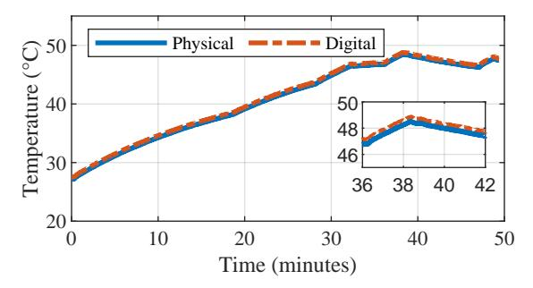

Fig. 10: Electro-thermal model responses.

where  $X_{\rm pred}$  is the output data of the digital model and  $X_{\rm act}$  is the corresponding output data of the physical converter. The lower the MAPE value, the better the accuracy of the digital model. The comparison between the digital model and the physical converter has revealed a maximum average percentage deviation of 2%. The digital model responded to transients under real-world conditions, demonstrating its effectiveness in simulating and shadowing the physical converter with a good degree of accuracy. Moreover, the electro-thermal model demonstrated stability while running for a long period of time.

Modeling real-time simulations with power hardware in the loop poses a significant challenge, particularly when it comes to sensor calibration. The accuracy of the digital model relies heavily on the precision of the sensors used to collect data from the physical asset. Even slight deviations in sensor readings can lead to notable differences between the virtual and physical systems. As demonstrated by Figures 8 and 9, the accuracy varied slightly from one experiment to another due to sensor noise and sensitivity. Therefore, it is crucial to ensure that sensors are properly calibrated and maintained to ensure accurate data collection.

During the verification process of the electrical domain model, an analysis of the inductor current and output voltage in the physical converter revealed the presence of high-frequency noise. It is a common occurrence in real-world scenarios, owing to the sensitivity of the sensors used. To mitigate the noise and improve the accuracy of measurements, appropriate filtering techniques can be applied to the sensor signals, which in turn will enhance the accuracy of the digital model, as it receives the signals measured by the sensors. By applying appropriate filtering techniques, the accuracy of the measurements can be enhanced, which is crucial in real-world scenarios. However, it should be noted that incorrect

{7}------------------------------------------------

Another challenge associated with sensors is the noise from Electromagnetic Interference (EMI). EMI is the unwanted electromagnetic radiation that can interfere with the operation of electronic devices, including sensors. EMI can cause errors in sensor readings, leading to inaccuracies in the digital models. It is, therefore, crucial to mitigate the effects of EMI by using appropriate shielding and grounding techniques to minimize the risk of interference.

#### V. CONCLUSIONS & FUTURE WORK

The electro-thermal model developed in this study consist of multiple models that operate in parallel to replicate the electrical and thermal behavior of the power electronic converter in real-time. The electrical model is based on the averaged switching model which is computationally efficient and provides an approximation of the behavior of the converter under dynamic load conditions with a good degree of accuracy. The thermal model used Cauer thermal network to model temperature distribution in the converter. To ensure the accuracy of the digital models, extensive experimental validation was completed. The experimental results showed that the electrothermal model was capable of predicting the behavior of the physical system with a high degree of accuracy, even under highly dynamic load conditions and running for long times. Overall, the development and experimental verification of this electro-thermal model represents a significant step towards improving the efficiency and reliability of power systems. The accuracy of the model, combined with its ability to operate in real-time, makes it a valuable tool for optimizing power electronic converters under dynamic load conditions, ultimately leading to more efficient and sustainable power systems.

Moreover, the developed model is computationally efficient to be used in the implementation of DTs on edge-computing devices with limited processing power. The model can serve as the foundation for developing the DT of the power electronic converter, enabling real-time control, optimization, and predictive maintenance. Additionally, the developed model can be used for look-ahead simulations based on scenarios fed to it and can be easily adjusted to integrate with larger models for complete digital models of power systems.

Moving forward, this work aims to explore the potential benefits of the developed model to be used as a digital twin with model updating capabilities.

### ACKNOWLEDGMENT

This work is supported by the Office of Naval Research (ONR) under ONR contract N00014-22-C-1003.

# REFERENCES

- [2] A. Castellazzi, A. K. Solomon, N. Delmonte, and P. Cova, "Modular assembly of a single-phase inverter based on integrated functional blocks," *IEEE Transactions on Industry Applications*, vol. 53, no. 6, pp. 5687–5697, 2017.
- [3] R. Chu, A. Bar-Cohen, D. Edwards, M. Herrlin, D. Price, R. Schmidt, J. Joshi, G. Chryser, S. Garimella, L. Mok, B. Sammakia, and L.-T. Yeh, "Thermal management roadmap: Cooling electronic products from hand-held dvices to supercomputers," 05 2003.
- [4] W. Zhou, X. Zhong, and K. Sheng, "High temperature stability and the performance degradation of sic mosfets," *IEEE Transactions on Power Electronics*, vol. 29, no. 5, pp. 2329–2337, 2014.
- [5] S. Yin, T. Wang, K. J. Tseng, J. Zhao, and X. Hu, "Electro-thermal modeling of sic power devices for circuit simulation," in 39th Annual Conference of the IEEE Industrial Electronics Society, 2013.
- [6] S. Pyo and K. Sheng, "Junction temperature dynamics of power mosfet and sic diode," in 2009 IEEE 6th International Power Electronics and Motion Control Conference, 2009, pp. 269–273.
- [7] K. Sheng, "Maximum junction temperatures of sic power devices," *IEEE Transactions on Electron Devices*, vol. 56, no. 2, pp. 337–342, 2009.
- [8] H.-C. Cheng, C.-H. Wu, and S.-Y. Lin, "Thermal and Electrical Characterization of Power Mosfet Module Using Coupled Field Analysis," *Journal of Mechanics*, vol. 35, no. 5, pp. 641–655, 09 2019.
- [9] A. Rasheed, O. San, and T. Kvamsdal, "Digital twin: Values, challenges and enablers from a modeling perspective," *IEEE Access*, vol. 8, pp. 21 980–22 012, 2020.
- [10] W. Danilczyk, Y. Sun, and H. He, "Angel: An intelligent digital twin framework for microgrid security," in 2019 North American Power Symposium (NAPS), 2019.
- [11] F. Tao, M. Zhang, J. Cheng, and Q. Qi, "Digital twin workshop: a new paradigm for future workshop," vol. 23, pp. 1–9, 01 2017.
- [12] E. J. Tuegel, A. R. Ingraffea, T. G. Eason, and S. M. Spottswood, "Reengineering aircraft structural life prediction using a digital twin," *International Journal of Aerospace Engineering*, vol. 2011, Oct. 2011.
- [13] M. Lind, H. Becha, R. Watson, N. Kouwenhoven, P. Zuesongdham, and U. Baldauf, "Digital twins for the maritime sector," 07 2020.
- [14] M. Singh, R. Srivastava, E. Fuenmayor, V. Kuts, Y. Qiao, N. Murray, and D. Devine, "Applications of digital twin across industries: A review," *Applied Sciences*, vol. 12, no. 11, 2022. [Online]. Available: https://www.mdpi.com/2076-3417/12/11/5727
- [15] "Naval power and energy systems technology development roadmap," Office of Naval Research, Tech. Rep., 2019.
- [16] M. Milton, A. Benigni, M. Vygoder, J. Gudex, and R. Cuzner, "Power electronic system real-time simulation on national instruments fpga platforms," in 2019 IEEE Electric Ship Technologies Symposium, 2019.
- [17] A. S. Wunderlich and E. Santi, "Closed-form implicit models for efficient simulation of power electronics," *IEEE Journal of Emerging* and Selected Topics in Power Electronics, vol. 11, no. 2, pp. 1568–1577, 2023.
- [18] S. Singh and B. Jain, "Real time simulation of power electronic converters," in 2018 International Conference on Control, Power, Communication and Computing Technologies (ICCPCCT), 2018, pp. 450– 454.
- [20] M. Faifer, L. Piegari, M. Rossi, and S. Toscani, "An average model of DC-DC Step-Up converter considering switching losses and parasitic elements."
- [21] "Compact model of power mosfet with temperature dependent cauer rc network for more accurate thermal simulations," *Solid-State Electronics*, vol. 94, pp. 44–50, 2014.

- [24] "PEB 8038 half-bridge SiC power module, imperix datasheet."
- [25] Imperix Sensors, "±50a Current Sensors," accessed: 2022-11-30.
- [26] Imperix datasheet, "B-Box RCP 3.0," Nov. 2021, accessed: 2022-11-30.