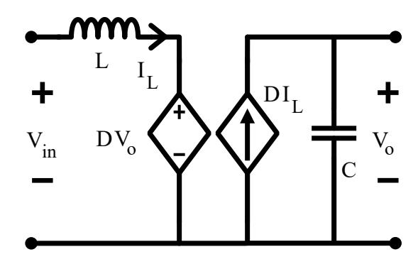
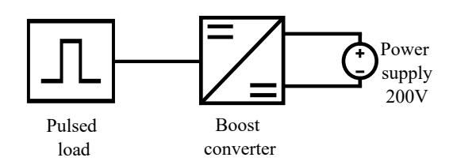
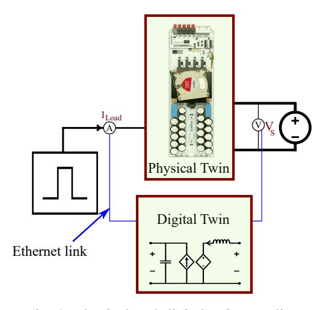
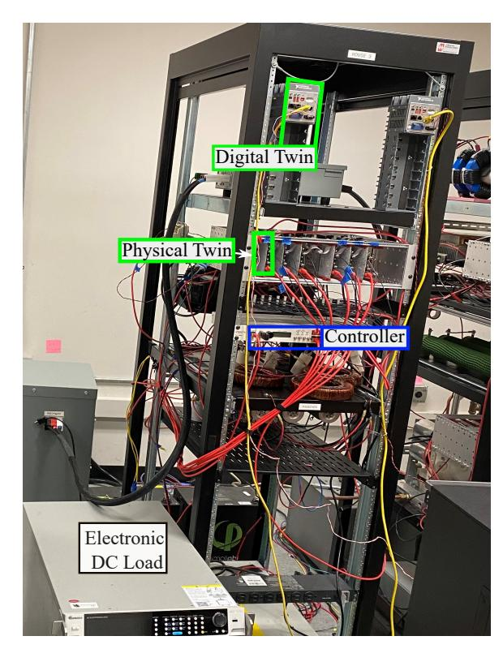
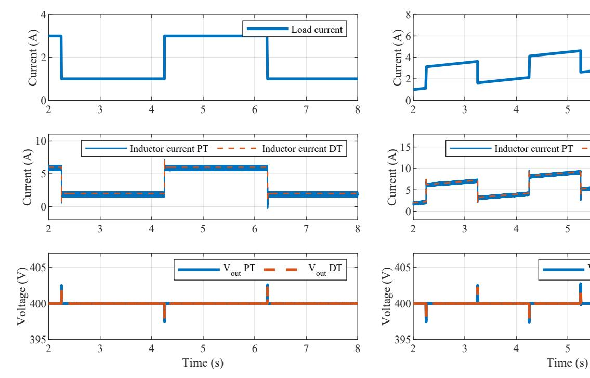
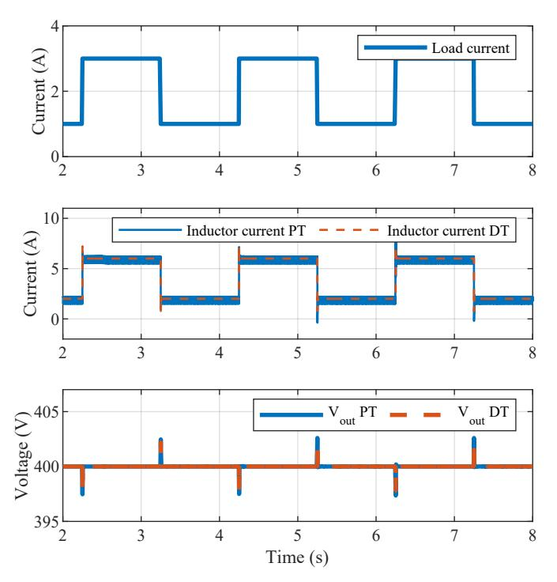

{0}------------------------------------------------

# 

# I INTRODUCTION

A Digital Twin (DT) refers to a collection of dynamic digital models that precisely represent an existing physical system or subsystem. The DT models accurately replicate the behavior of the physical system during its operational state. Digital twin technology is one of the most promising drivers of digitalization across multiple industries [1]. The digital twins can be applied in many sectors. For example in the aerospace sector, a digital twin model has been used to precisely evaluate the wear and fatigue of an aircraft throughout its operational life [2]. In industrial manufacturing, digital twins are utilized to predict the optimal time for maintenance schedules [3]. This is achieved by continually gathering operating data to determine a reference basis for the maintenance cycle. The automotive industry has made use of DTs for various purposes. Digital twins play a crucial role in enhancing the value of a vehicle throughout its lifespan and in optimizing the design of future vehicles [4]. The potential for DT technology to impact electric vehicles is significant. This technology has captured the attention of the maritime industry because of its great potential [5].

In the context of power electronic converters, a DT can be used to predict the behavior and performance of the converter under various operating conditions. It can be used for real-time monitoring and control of the converter during operation, enabling predictive maintenance and helping to identify potential issues prior to their occurrence. In creating a DT of a power electronic converter, various electrical and thermal models can be combined to accurately represent the converter behavior. This can involve the use of mathematical models and simulation softwares, which can take into account the effects of various parameters such as input voltage, current, and temperature on the converter performance. It can also improve the overall reliability and performance of the converter, helping to ensure that it operates within its specified parameters and meets the requirements of the application.

Power electronic converters are essential components of modern power systems, they are used to regulate, control, and convert electrical energy. The design, analysis, and optimization of power electronic converters can be a challenging task due to the complexity of the system and the high switching frequencies involved. Real-time digital twin technology provides a solution to these challenges by creating a virtual replica of the physical system that can be used for simulation, analysis, and optimization. By implementing DT technology in any sector, a range of benefits can be achieved, such as decreased operational costs and streamlined processes, enhanced productive

 

{1}------------------------------------------------

a DC-DC converter was designed and implemented on the FPGA board of a National Instrument (NI) Compact RIO (cRIO). The use of an NI-cRIO allows for the integration of high-performance computing and data acquisition capabilities, enabling the digital twin to operate in real-time and respond quickly to changes in the physical system. Traditionally, power electronic converter models have been implemented using simulation software, which can accurately replicate the behavior of the system but lacks the real-time performance required for dynamic operation. By deploying the model on an NI-cRIO, the digital twin can operate in real-time, enabling the system to be monitored and controlled continuously. Additionally, this equipment provides several advantages, including the ability to integrate with other hardware and software components, such as sensors, actuators, and control systems. This allows for a more comprehensive digital twin that can reflect the behavior of the physical system under a wide range of con-converter and the steps for developing and deploying the DT on the FPGA board of the cRIO. Experimental setup and the hardware used in this work are provided in Section III. Experimental results are provided in Section IV, and Section V provides conclusions and a discussion of ongoing and future work.

# II POWER CONVERTER DIGITAL TWIN

In the field of power electronics, modeling switching power converters is a common practice for design and troubleshooting. These converters use switches to alter their electrical topology to produce a desired outcome. However, modeling these switching events can be computationally expensive. As a result, researchers often opt for a simpler modeling method known as the averaged switching model. The averaged switching model is a simplified mathematical representation of a switching converter. It uses time averaging to smooth out the fast switching transitions and create a continuous model. This model provides an approximation of the average behavior of the converter. This simplifies the simulation and reduces computational cost [8]. An averaged switching model DC-DC boost converter is used as the DT. The converter model is shown in Fig. 1.

# III EXPERIMENTAL SETUP

Fig. 1: Averaged switching model of a boost converter.

{2}------------------------------------------------

Fig. 3: Physical and digital twin coupling.

1.25 mH inductor was chosen for the boost converter design. The bus voltage was monitored using an Imperix DIN800V sensor, while the inductor current was measured with the built-in current sensor of the PEB8032 module [10]. An Imperix external DIN50A current sensor was connected in series with the converter output to measure the load current [11], and this signal is transmitted to the DT via Ethernet. The converter was driven by nested loop controls, which were integrated into an Imperix B-Box control platform [12]. To test the converter, a Chroma DC electronic load was utilized to handle both constant, ramped, and pulsed loads. The Imperix Simulink blockset facilitated programming of the controls through code generation. The hardware setup is shown in Fig. 4.

# IV EXPERIMENTAL RESULTS

Fig. 4: Experimental hardware.

{3}------------------------------------------------

Fig. 5: Scenario one load.

Fig. 6: Scenario two load.

Fig. 7: Scenario three load.

Load current

Inductor current DT

{4}------------------------------------------------

# V CONCLUSIONS & FUTURE WORK

A real-time digital twin was developed for a DC-DC boost converter and verified experimentally under various load scenarios. The developed DT can be used to provide a comprehensive understanding of the system behavior and support improved decision-making and predictive maintenance. Realtime insights and analysis of the converter can be provided using the developed DT. The developed real-time digital twin had fast processing speeds and low-latency data transfer capabilities, enabling it to provide accurate and timely feedback on the behavior of the physical system. Furthermore, it can be integrated into larger digital twin models for the power system hardware, enabling comprehensive real-time modeling and analysis of the entire system. This allows for real-time scenario studies based on different load profiles. The evaluation of the physical twin against the DT confirms the readiness of the DT to be integrated into larger power system DT models. The maximum deviations observed between the DT and the hardware show that it is well aligned with the physical twin.

#### ACKNOWLEDGMENTS

### REFERENCES

- [12] Imperix datasheet, "B-Box RCP 3.0," Nov. 2021, accessed: 2022-11-30.