{0}------------------------------------------------

# Query-and-Response Digital Twin Framework using a Multi-domain, Multi-function Image Folio

Kerry Sado\*, Graduate Student Member, IEEE, Jarrett Peskar†,

Austin R.J. Downey†‡, Member, IEEE, Herbert L. Ginn\*, Senior Member, IEEE,
Roger Dougal\*, Senior Member IEEE, and Kristen Booth\*, Member, IEEE

\*Dept. of Electrical Engineering

†Dept. of Mechanical Engineering

†Dept. of Civil and Environmental Engineering

University of South Carolina

Columbia, SC 29208 USA

\*ksado@email.sc.edu

Abstract—Digital twin capabilities have been limited to a single function, but the reality of physical assets requires digital twins with multi-domain, multi-function representations. Digital twins can and should be designed with multi-domain and multifunctional capabilities to enable adaptability to a diverse set of system domains and perform various representation tasks. This approach allows the digital twin to be as specialized as the physical asset it serves. This study introduces a framework enabling the development of multi-domain, multi-functional digital twins, adaptable for use in various representation tasks. The proposed framework utilizes a collection of digital images for an accurate depiction of different facets of an asset, ensuring a detailed yet unified digital twin. The framework is designed to analyze the human-in-the-loop text-based query and select the most suitable digital image for execution. The proposed multi-domain, multi-function digital twin framework reduces the computational effort by 5.15% when compared to a single, unified digital twin running all studies concurrently. Details on the development of the framework are provided, and experimental results validate the effectiveness of the proposed framework.

Index Terms—Digital Twins, Decision-Making, Computational Efficiency, Power Electronics, Electric Ships, Multi-Domain, Query

#### I. INTRODUCTION

THE marine industry is shifting towards hybrid and allelectric vessels to mitigate the environmental impact of naval operations, including global shipping, commercial voyages, and military defense of international maritime routes. As combustion engines are replaced with electric propulsion systems, emissions of harmful pollutants and greenhouse gases are reduced [1]. Consequently, ship electrification demands innovative technologies to enhance design and sustain operational efficiency [2]. There is a trend towards DC and hybrid system architectures which is motivated by the advantages of DC systems in naval applications, such as reduced weight, space, fuel costs, and the ease of connecting parallel generators [3], [4]. DC systems are characterized by an increased reliance on power electronics converters for providing a fast

This work was supported by the Office of Naval Research under contract No.N00014-22-C-1003. DISTRIBUTION STATEMENT A. Approved for public release distribution unlimited, DCN# 543-1879-24.

response to high-powered pulsed loads on ships. Such loads include electromagnetic catapults, laser weapons, and high-energy radars [5]. Although electrifying naval vessels offers numerous benefits, it also introduces challenges in maintaining the reliability and controllability of their power systems. Ship electrification requires significant modifications to port facilities, power distribution networks, and necessitates new operational models for energy management and route planning [6], [7]. Maintenance strategies need to adapt, focusing on preventative maintenance to prevent costly downtimes.

The technology of a ship evolves over its lifespan, with new capabilities added and older systems degrading. Keeping track of this data is crucial, but utilizing it effectively is even more important. Therefore, innovative solutions, such as Digital Twins (DT), are needed to address these challenges to effectively manage onboard power systems. A DT is a collection of dynamic digital models that accurately represent an existing physical system or subsystem [8]. Digital twin technology is instrumental in ship electrification. By collecting and analyzing data from physical systems, DTs can provide a dynamic replica of vessel operations. This capability allows for deep insights into the performance of the vessel, identifying potential issues before they become critical. For instance, DTs can simulate extreme conditions to determine a stable operating point when an event causes system failures. These simulations enable the Navy to respond to adverse scenarios without exposing the vessel to unstable operating conditions. Furthermore, DTs can enhance decision-making by providing real-time data and predictive analytics, allowing for proactive maintenance and operating strategies. By forecasting potential failures and optimizing maintenance schedules, DTs help ensure the reliability and efficiency of electric vessels.

The maritime industry recognizes the potential of DTs and plans to utilize them for fleet, port, and end-to-end supply chain optimization [9]. The primary objective of incorporating DTs is to enhance asset dependability, optimize maintenance practices, and minimize operational costs [10]. Building upon these established goals, this study focuses on developing a framework for the efficient utilization of DTs in managing the operation of onboard power systems. In the context of electric

1

{1}------------------------------------------------

ships, DTs can be utilized for continuous monitoring of component health. They can enable informed decision-making regarding asset utilization, taking into account the degradation of components and maintenance scheduling. Additionally, DTs can be used to anticipate future needs, allowing operators to prepare and optimize systems in advance [11]. Digital twins hold significant promise for enhancing processes in shipbuilding and maritime applications. By virtually representing the system of a ship, DTs can support decision-making, reduce production and operational costs, and increase efficiency [12]. As a result, DTs have the potential to revolutionize aspects like fleet management, navigation, and maritime maintenance.

Digital twins for power electronics and other systems have traditionally been developed with a focus on singlefunctionality and a one-dimensional approach, a trend that is evident in the existing literature. Recent developments include a real-time diagnostic technique for power converters employing embedded probabilistic DTs, which leverage FPGA computational advantages but primarily concentrate on electrical parameters [13]. Similarly, a study on power electronic transformers (PETs) introduced a real-time monitoring system using FPGA-based DTs [14]. This DT effectively analyzes PET dynamics with a focus mainly on electrical parameters. A DT, designed for distributed photovoltaic systems, excels in identifying electrical faults but does not extend beyond the electrical domain [15]. Further, a method for monitoring and assessing the health of power electronic converters using DTs is demonstrated, focusing primarily on predicting component degradation [16]. A study detailed the use of DTs for threephase power converters with a particular focus on monitoring the degradation of the output LC filter [17]. Another case involves using DTs for the monitoring and control of a dcde buck converter, showcasing their ability to dynamically adapt to changes in the physical converter [18]. An estimation method using a DT evaluates the health of dc-dc converters, emphasizing non-invasive techniques for easy implementation and detailed degradation monitoring, again with an emphasis on the electrical aspects [19]. While effectively demonstrating the application of DTs for power converters, all the referenced DTs focus primarily on the electrical aspects of the converter.

In summary, these studies collectively illustrate the promising advancements in DT applications for power electronics and other systems with a common limitation. They tend to focus on single-function, single-domain applications. The prevalent trend in existing research points towards these singlefunction, one-dimensional DTs. However, DTs often support assets that are multidimensional by nature, and therefore, their respective DTs should be able to support the multi-faceted aspects of the physical asset. Operational DTs play a critical role in operational monitoring and control tasks. An effective operational DT, representing a physical asset, should support various functions and adapt to the multidimensionality of the asset. This multifunctionality enables the DT to handle a wide range of representation tasks, from system monitoring and maintenance prediction to performance optimization. Additionally, it can embody multi-domain capability, allowing it to represent the multidimensionality of the physical asset. The integration of multi-domain, multi-function DTs within physical systems facilitates the simulation and management of various aspects of the physical asset, including but not limited to electrical dynamics, thermal behaviors, mechanical stress analysis, and material degradation. This integration also involves essential activities such as real-time monitoring and predictive analytics. The National Academy of Sciences (NAS) concluded that a DT should be defined with a level of fidelity and resolution appropriate for its intended purpose [20]. With the understanding that the proposed multi-functional DT can have several facets to enable an objective or related set of objectives, the proposed framework enables the DT to select the most computationally efficient, appropriate fidelity representation(s) deemed necessary to fulfill its purpose(s) at any instant in time.

This study introduces a framework that enables the development of multi-domain, multi-function DTs for physical assets. The framework utilizes multiple digital images, as proposed in this work, to represent the physical asset. Each image serves as an individual representation, capturing varying levels of detail specific to different facets of the asset. By systematically integrating these images into a single DT, the approach ensures each domain or facet has a specialized representation with its distinct level of detail, all within the unified framework of the DT. The contributions of this article are:

- 1) Developing a framework that enables the design and use of multi-domain, multi-function DTs and
- Ensuring computational efficiency in the DT framework by selectively activating specific functions through corresponding digital images.

In this article, the exploration into the DT technology begins with foundational definitions and details in Section II. The concept of digital images is introduced in Section III, followed by an in-depth examination of the algorithm for activating digital images in Section IV. The development processes of the image-based DT framework are explained in Section V. The development of the image-based DT for the physical demonstrator is provided in Section VI. The specific algorithm used for this demonstrator is discussed in Section VII. Insights into the experimental hardware and the results achieved are detailed in Section VIII. The article concludes in Section IX, summarizing the key findings and contributions of the study.

# II. DIGITAL TWIN TECHNOLOGY

The concept of using "twins" to represent complex systems was first introduced in the Apollo program by the National Aeronautics and Space Administration (NASA) [21]. NASA defines a DT as a highly accurate simulation that incorporates multiphysics, scales, and probabilities to mirror the state of its corresponding hardware [22]. Thus, DTs accurately replicate the operational behavior of their physical counterparts and enable real-time communication with them. This integration provides specific capabilities, such as real-time monitoring and control, predictive maintenance, and optimization [23].

A DT essentially acts as a faithful integrated representation of a physical asset or element, known as the Physical Twin (PT) [24]. The PT refers to the actual real-world entity, which can vary in complexity. It might be a naval vessel,

{2}------------------------------------------------

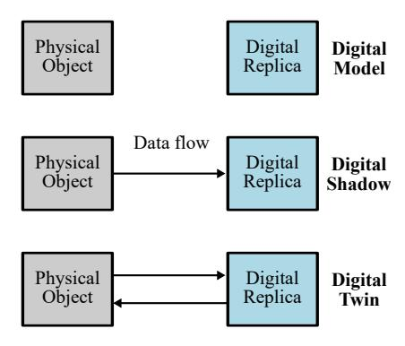

Fig. 1. Differences in data flow between a digital model, digital shadow, and digital twin.

a piece of maritime infrastructure, a single component of a ship system, or an entire fleet. The PT encapsulates the concrete attributes, characteristics, non-idealities, and complex interactions inherent to the asset. To differentiate between the asset under study and the additional hardware needed for DT implementation, a new definition of the physical system is introduced in this work. This physical system refers to the hardware encompassing the real-world PT and the edge computing devices necessary to operate the DT.

Unlike traditional simulation models, a DT can adapt and self-adjust using real-time data from the PT, leveraging the vast amounts of data gathered throughout the lifecycle of the vessel. This self-regulating capability is enabled by feedback mechanisms that transmit measurements from the PT, allowing the DT to dynamically respond to real-time changes in the operational environment of the PT. The digital twin can achieve a sufficient degree of precision in replicating physical attributes, functionalities, characteristics, and systems [25]. This high-fidelity replication is foundational for the adaptability of the DT, enabling its effective functioning across a range of timescales, including real-time, faster or slower than real-time, and in event-driven scenarios [11].

In many instances, the differentiation between a digital model, a digital shadow, and a DT remains ambiguous. Digital models are commonly used in the design stages of physical objects within virtual environments. Digital models significantly reduce design time and costs compared to creating physical prototypes. They usually lack real-time data exchange between the physical and virtual realms. Data transfer occurs manually, where specific conditions from the physical object are applied to the digital model. As a result, any changes affecting the physical object are not mirrored in the digital model. This limitation means that while digital models are effective for initial design and testing, they may not fully capture real-time changes, long-term degradation, or physical world interactions.

In a digital shadow, data transfer is unidirectional, moving exclusively from the physical object to the digital replica. This implies that the digital shadow acts as a passive reflection of the physical object, recording and reflecting its real-world behavior. However, it lacks the capability to influence or interact with the physical object it represents.

Finally, a DT features bidirectional data flow, as illustrated in Fig. 1, distinguishing it from a digital shadow. While a DT

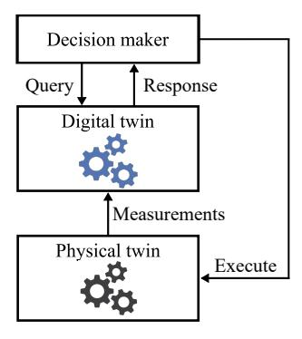

Fig. 2. A generic cyber-physical digital twin implementation.

receives data from its physical counterpart, it does not send information back directly for real-time interaction. Instead, the DT processes and analyzes this data, offering insights into the operation of the physical counterpart. These results then guide a decision-making mechanism, which issues control instructions to the physical object. This process enables the DT to indirectly influence the behavior of the physical object through informed decision-making. For instance, depending on its primary objective, the DT can simulate potential adjustments in control mechanisms. Then, the decision-making mechanism can select an appropriate adjustment to send to the PT controller for implementation.

Before developing a DT, it is essential to determine which features of the physical asset require representation in the DT. Subsequently, establishing a decision-making mechanism with well-defined objectives is essential. Such a step ensures the DT effectively addresses the requirements of the decision-making process. Identifying these key features and functionalities is a foundational aspect of the DT development process, enabling it to fulfill its intended purpose efficiently.

In DT-overlaid systems, the decision maker can take different forms, such as a control algorithm, artificial intelligence, a human-in-the-loop, or a combination of these elements. It acts as a key intermediary between the DT and the PT, as shown in Fig. 2. The role of the decision maker begins with querying the DT for essential data and insights. Within the generic DT framework, a query is defined as a set of instructions sent by the decision maker to the DT. Queries directed at a DT can vary extensively. Under the assumption of multi-functional DTs, these queries may cover a wide range of objectives but are likely to focus on a single aspect of the physical asset in each query. They can range from requesting a single, instantaneous value, such as a specific temperature reading, to continuously predicting a specific behavior of the PT. When the DT receives a query from the decision maker, it generates detailed projections as a response. The decision maker then uses these responses for an in-depth analysis, considering operational factors. Finally, the decisions derived from the "detailed projections" generated by the DT in response to the query are executed on the PT. This transfer of decisions ensures that the PT controls are updated and aligned with the latest insights and directives, facilitating real-time adaptation and synchronization between the digital and physical realms.

{3}------------------------------------------------

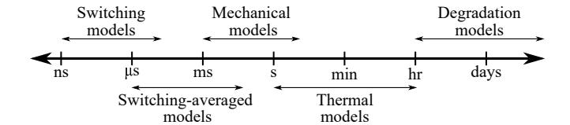

Fig. 3. Timescales of different physical domains and representations.

#### III. CONCEPT OF DIGITAL IMAGES

In the development of DTs for power system components, the selection of an appropriate representation type and level of abstraction is fundamental. The choice of representation should balance fidelity, computational cost, and objectives of the representation. Digital twins are generally given a single, specific representation task; however, various functions can be delegated to the DT to support, leaving room for ambiguity in the design of the DT. Digital twins can be multi-domain and multi-functional, as they may need to provide insights into different system domains and enable various objectives. The decision maker, as proposed in this framework, specifies the representation type for the DT based on the query, ensuring a targeted and efficient response.

Using a universal DT representation for diverse queries is computationally expensive. This one-size-fits-all approach faces efficiency challenges as it can not adapt or 'divide and conquer' when dealing with queries that are smaller or less complex than the original design of the all-purpose representation. Queries may require different domain representations with various timescales to interact, which is computationally expensive using a single DT representation for this purpose. For instance, electrical domain responses usually evolve faster than thermal ones. Additionally, different fidelity of the electrical domain representation require different timescales as illustrated in Fig. 3. Therefore, attempting to compile a representation of these two domains or different levels of abstractions using similar timescales can lead to computational inefficiencies or inaccuracies based on timestep requirements. It is essential to consider the distinct timescales when integrating these domains within a single DT to ensure not only accurate representation but also efficient computational resource utilization.

Recognizing the complexity and multifaceted nature of queries that lead to DTs supporting multiple functions, as well as the different timescales on which various domains operate, this research introduces the concept of digital image. These digital images serve as individual representations that capture varying levels of detail specific to facets of the physical asset. Within a DT, digital images act as specialized representations for each domain of the PT. This method systematically groups cooperative digital images within a single DT, ensuring clarity and precision in the reflection of the physical asset. One primary advantage of using the digital image concept lies in its capability to selectively engage and utilize digital images relevant to specific inquiries or analyses. This selective engagement allows for the efficient deactivation of irrelevant images to save computational resources.

In simpler terms, consider building a folio of a human

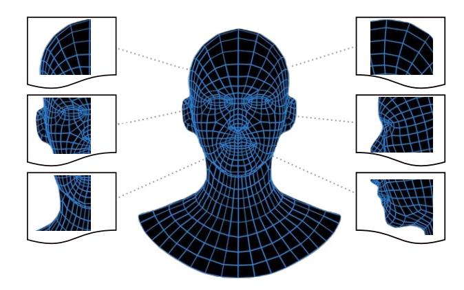

Fig. 4. A folio of digital images depicting the face of a person.

face using various digital images. This collection would be comparable to an extensive portfolio that provides diverse perspectives of the face. Each image would be captured from a unique angle; some might highlight the profile view, focusing on the jawline and nose while others could be frontal shots, emphasizing features like the eyes and mouth, as shown in Fig. 4. Additional images might zoom in on specific details, such as the intricate lines and patterns of the skin or the way the facial muscles move during different expressions. These images, each offering a different viewpoint, collectively present a rich, multidimensional portrayal of the face. They can illustrate a range of expressions, capture changes over time, or highlight the unique features of the face. When combined, these diverse images form a comprehensive, holistic representation, giving a detailed view that encompasses the many facets and subtleties defining the appearance of an individual face. If the goal is to analyze a digital image focusing on the jawline within the face folio, only that specific image is activated while the others are deactivated. This selective activation conserves computational resources leading to faster processing times and reduced energy consumption. This strategic resource management is essential in largescale or continuous operations where efficiently managing computational load yields substantial long-term benefits such as faster processing times and reduced energy consumption.

The DT features a folio that includes a collection of digital images. Each image represents a unique facet of the PT. Digital images within the DT can represent various domains with differing fidelities. To illustrate, the electrical dynamics of the physical asset can adopt multiple modeling techniques. Some digital images may employ switching modeling techniques while others might use switching-averaged techniques. Depending on the nature of the query, the most appropriate digital image is employed. This process enhances computational efficiency by integrating representations of individual subsystems across different timescales. Utilizing digital images simplifies managing complexities in a multi-domain, multi-function DT environment, particularly those related to varied response times and time-steps.

Multiple digital images can be uploaded to a DT to respond to queries depending on the available memory of the edge computing platform. These images can vary in fidelity and/or

{4}------------------------------------------------

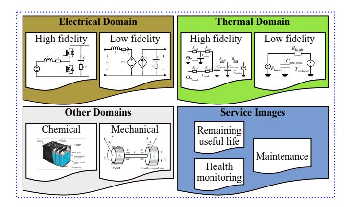

Fig. 5. A folio of images which can be used within a single digital twin.

domain. Within the DT representation for a physical asset, images across various, domains, such as electrical, thermal, chemical, mechanical, and service-related areas like remaining useful life, health monitoring, and maintenance can be utilized. For instance, a DT of a generator could include images displaying electrical data such as voltage and current, mechanical data like rotational speed and torque, fatigue data indicating wear and tear and remaining useful life, and thermal data showing temperature distribution. These images offer a diverse range of functionalities beyond typical hardware measurements, especially quantities that cannot be directly measured. A generic DT, illustrated in Fig. 5, is comprised of a folio of digital images representing various components of an arbitrary system, including power electronics, energy storage, and rotational machines. Digital images in a DT have the flexibility to operate in various modes, functioning independently, in a sequence, or concurrently in parallel, based on the specific requirements of queries.

All DT implementations require a physical asset to be studied, sensor measurements of the PT, memory for historical data and digital twin storage, Random-Access Memory (RAM) for DT studies. The necessary amount of processing power is dependent on the DT fidelity, the type of decision aid used to optimize performance, and the number of projected scenarios to be studied in parallel. For human-in-the-loop interactions, an interfacing computer with some form of a Graphical User Interface (GUI) is necessary to provide queries and/or select decisions to execute. However, unified DTs are scope-limited once these requirements have been set. Therefore, an imagebased DT framework is proposed to enable more multidomain, multi-function scopes of DT studies while reducing the processing power required by self-selecting to a minimal working set of representative studies needed to answer a specific query. The process of activating these images is conducted within the framework set by the decision maker, and the subsequent section details the methodology for selecting these digital images.

#### IV. IMAGE MAPPING AND ACTIVATION

The role of the decision maker is pivotal in the efficient usage and activation of digital images, as defined in Section III, specific to the provided query. Each image within the DT is

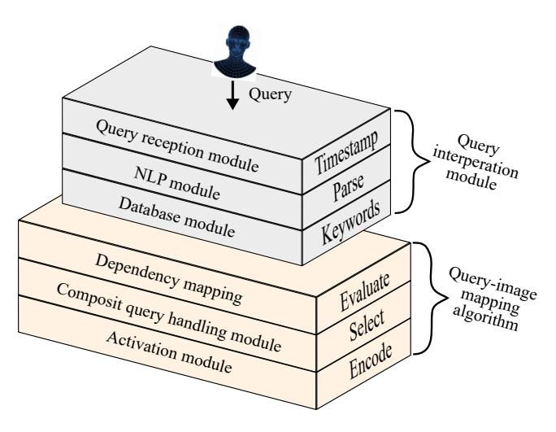

Fig. 6. Structure of the Decision maker for query handling and image activation.

assigned a unique identity, allowing the decision maker to identify and activate the correct image in response to the query. The decision maker structure includes internal modules to handle queries asked by the human-in-the-loop, as illustrated in Fig. 6. These modules ensure the efficient usage and activation of digital images, maintaining the necessary context for each query.

# A. Query Interpretation Module

Queries are input by the human-in-the-loop decision maker through a graphical user interface. The query interpretation module is responsible for receiving and parsing these queries.

- 1) **Query reception:** This initial module receives and logs queries entered by the human-in-the-loop. It ensures accurate logging and timestamping upon entry and serves as the gateway to the query interpretation module.
- 2) Natural language processing (NLP) module: This module analyzes and interprets queries. It parses the query to extract vital elements, such as keywords, entities, context, and the specific actions requested by the decision maker. A database aids in matching queries with relevant digital image identities stored within the DT.
- 3) Database: A database, containing keywords and context, is housed within the interpretation module. Once a query is analyzed and digital image identities are detected, the module then passes these identities to the query-image mapping algorithm.

After interpreting the query and identifying the relevant images, the query interpretation module transmits the unique DT image identities to the query-mapping algorithm for dependency checks. The interpretation module operates on the same computational device as the query-mapping algorithm.

# B. Query-Image Mapping Algorithm

The query-image mapping algorithm recognizes and accommodates the hierarchical relationships between digital images by considering their dependencies. When selecting an image,

{5}------------------------------------------------

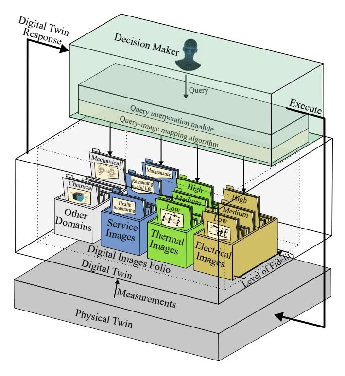

Fig. 7. Image-based DT framework showing images being activated.

it is crucial to consider these dependencies, as some images rely on output data from other images. For instance, a thermal image of a power converter requires power loss data from an electrical image. Consequently, the image selection process within the algorithm determines whether these dependent images operate sequentially or in parallel. This consideration is critical to ensure the algorithm effectively activates multiple, interdependent images as necessary.

- Dependency mapping: A lookup table was developed to record dependencies between digital images. This approach allows the dependency mapping component of the algorithm to evaluate which images rely on others for comprehensive data, ensuring that the query-image mapping algorithm effectively activates interdependent images as required.
- 2) Composite query handling: An algorithm manages queries that require the activation of multiple images, particularly those with dependencies. Handling queries that a single, independent image cannot resolve is essential.
- Activation: In this process, images are activated in the necessary sequence as required, ensuring that all necessary data is available.

#### V. IMAGE-BASED DIGITAL TWIN FRAMEWORK

The image-based DT framework integrates various modules and processes to create a comprehensive system representation for managing and analyzing data from physical assets. Users, or the human-in-the-loop, enter queries through a graphical user interface integrated with the decision-making structure. These queries initiate a series of actions within the DT, ultimately resulting in providing insights to the PT. Queries are input by the human-in-the-loop decision maker through

the graphical user interface, serving as the entry point for all interactions with the DT. Once a query is submitted, it is logged and timestamped by the query reception module to ensure accurate tracking and processing. After the query is processed and relevant images are identified, the querymapping algorithm activates the appropriate digital images. The activation process involves sending binary codes to the DT. A simple digital interface within the DT receives these binary codes, with each code linked to the activation port of a digital image to activate or deactivate the image, as shown in Fig. 7. The system checks for dependent image identities and activates the corresponding images whenever a primary image is selected, ensuring that the DT utilizes all necessary data and images to address complex, multi-faceted queries. Additionally, the query-image mapping algorithm provides suggestions when faced with irrelevant queries. If no specific query is given, the algorithm defaults to selecting the lowest fidelity images to conserve computational resources.

After activating the appropriate digital images, the DT provides a response to the decision maker. The DT interfaces directly with the sensors of the PT to receive real-time data streams. The real-time data from these sensors is integrated into the activated digital images, providing a dynamic and accurate representation of the PT. This integration enables the DT to adapt and self-adjust based on real-time changes and conditions in the operational environment of the PT. Based on the insights generated by the activated digital images, the DT provides responses to the decision maker specific to the query asked. These responses include detailed projections and analyses that guide the decision-making process. The decision maker evaluates these insights, considering operational factors and objectives. Once a decision is made, the necessary actions are formulated and conveyed to the PT. The decision process involves sending control instructions from the decision maker to the PT for necessary modifications, ensuring that the physical controls are updated and aligned with the latest insights from the DT. This bidirectional communication facilitates realtime adaptation and synchronization between the digital and physical realms.

### VI. DEMONSTRATOR DIGITAL TWIN DEVELOPMENT

To validate the proposed image-based DT framework, the demonstrator, depicted in Fig. 8, is utilized. This demonstrator is comprised of an energy storage unit and a dc-dc boost converter. The development of a multi-domain, multi-function image-based DT for this energy storage system uses a folio of digital images with the system serving as the PT. In this demonstration, the DT is assumed to replicate the electrical and thermal behaviors of the converter, estimate the State of Charge (SoC) of the energy storage through indirect measurements, and respond to written queries from a decision maker. Based on the assumed capabilities of the DT, it should include a high-fidelity switching image of the converter. This image is essential for calculating the power losses in the converter. Additionally, a thermal image is needed to replicate the thermal behavior using these power losses. A switchingaveraged image is utilized to determine the average inductor

{6}------------------------------------------------

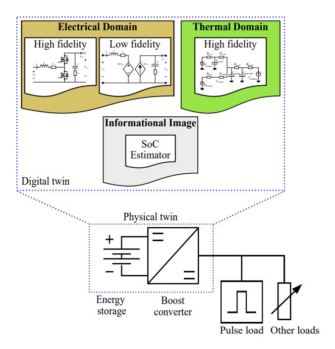

Fig. 8. A folio of digital images for the demonstrator.

current, which is necessary for the image that estimates the SoC of the energy storage since the average inductor current of the converter equates to the output current from the energy storage. With these images, the DT will be able to represent the multifaceted aspects of the energy storage system.

The digital images presented in this paper are far from comprehensive but can be used to simply demonstrate the proposed framework. While alternative techniques like advanced artificial intelligence, machine learning, lookup tables, or data-driven modeling could be used to represent these images, this paper focuses mainly on the image-based DT framework itself, rather than on the optimal methods for developing these images.

# A. Electrical Domain Switching Digital Image

A boost dc-dc converter is used as the interfacing converter for the energy storage, as depicted in Fig. 8. The electrical domain switching image of this converter is shown in Fig. 9. In power semiconductor devices, power losses include conduction losses,  $P_{\rm cond}$ , and switching losses,  $P_{\rm sw}$ . Conduction losses depend on the current flowing through the device,  $i_{\rm L}$ , the on-state resistance of the device,  $R_{\rm DS,on}$ , and the duty cycle, D. Power losses resulting from conduction are

$$P_{\text{cond1}} = Di_{\text{L}}^2 R_{\text{DS.on}} \text{ and} \tag{1}$$

$$P_{\text{cond2}} = (1 - D)i_{\text{L}}^2 R_{\text{DS,on}}$$
 (2)

for the upper and lower devices, respectively.

Switching losses depend on the switching frequency,  $f_{\rm sw}$ , and the total energy dissipated during both the turn-on,  $E_{\rm T,on}$ , and turn-off,  $E_{\rm T,off}$ , transitions of the device. The power losses due to switching for the upper and lower devices are

$$P_{\text{sw1}} = f_{\text{sw}}(E_{\text{T.on}} + E_{\text{T.off}}) \text{ and}$$
 (3)

$$P_{\text{sw2}} = f_{\text{sw}}(E_{\text{T,on}} + E_{\text{T,off}}). \tag{4}$$

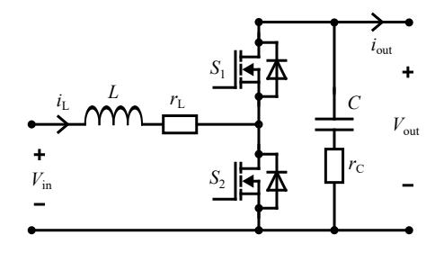

Fig. 9. Electrical domain switching image of the converter.

Finally, the total power losses in the switching devices,  $P_{\text{tot}}$ , can be obtained by summing up the power losses due to conduction and switching for each device as

$$P_{\text{tot}} = P_{\text{cond1}} + P_{\text{cond2}} + P_{\text{sw1}} + P_{\text{sw2}}.$$
 (5)

Based on the aforementioned equations, the electrical domain switching image can be employed to calculate the total losses generated by the switching devices, which are subsequently dissipated as heat in the cooling loop.

#### B. Electrical Domain Switching-Averaged Digital Image

Instead of analyzing the converter with its rapidly switching states when it is not necessary, which can be complex and computationally intensive, the switching-averaged model simplifies the process. This simplification is achieved by averaging the circuit variables over a switching period. The model is derived by averaging the inductor voltage and current equations over one switching period. The state-space averaging technique is typically used, which involves averaging the state equations of the system [26]. The switching-averaged image of the boost converter, incorporating parasitic elements, is depicted in Fig. 10. The validation of this image is detailed in [27]. This image provided an average inductor current with a maximum deviation of 1.2% from the physical measurements.

# C. Digital Image for State of Charge Estimation

The SoC digital image used the Coulomb counting method to estimate the SoC of the energy source supplying the converter. The Coulomb counting method quantifies the discharging current of the battery and integrates this current over time to estimate the SoC(t). This technique computes the SoC based on the measured discharging current, I(t), and the SoC values estimated previously, SoC(t-1) [28]. The SoC is calculated as

$$SoC(t) = SoC(t-1) + \frac{I(t)\Delta t}{Q_n}$$
 (6)

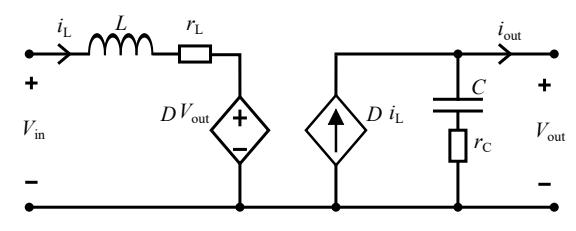

Fig. 10. Electrical domain switching-averaged image of the power converter.

{7}------------------------------------------------

TABLE I
DIGITAL IMAGES ASSIGNED IDENTITIES AND THEIR DEPENDENCY AND CONTEXT

| Digital image                                     | Assigned identity | Keywords   | Context   | Dependent image |
|---------------------------------------------------|-------------------|------------|-----------|-----------------|
| Electrical domain high fidelity switching model   | E1.1              | Electrical | switching | None            |
| Electrical domain low fidelity switching-averaged | E1.2              | Electrical | low       | None            |
| State of charge estimator                         | S1.1              | Charge     | state     | E1.2            |
| Thermal domain high fidelity image                | T1.1              | Thermal    | behavior  | E1.1            |

where  $Q_n$  is the battery cell capacity and  $\Delta t$  is the time-step between (t-1) and t. This image uses the input current to the converter by utilizing the average value inductor current,  $i_{\rm L}$ , from the electrical domain switching-averaged digital image. This SoC was estimated with a maximum deviation of 2% from the physical measurements.

# D. Thermal Domain High Fidelity Digital Image

Data from the electrical switching image are used as inputs to the thermal digital image to determine the thermal behavior of the converter. The thermal digital image of the converter is developed using the Cauer thermal network to represent the connection of the MOSFETs to the heat sink assembly. Cauer thermal networks are a type of electrical network that can be used to develop the thermal behavior of electronic components [29]. The power converter incorporates two switching devices attached to a common heat sink.

The thermal digital image of the converter is shown in Fig. 11. It includes junction to case resistances,  $R_{i-c1}$  and  $R_{i-c2}$ , case capacitances,  $C_{\text{case1}}$  and  $C_{\text{case2}}$ , case to mounting bracket resistances,  $R_{c-m1}$  and  $R_{c-m2}$ , mounting bracket capacitance,  $C_{\rm mount}$ , mounting bracket to heat sink thermal resistance,  $R_{\text{m-hs}}$ , thermal capacitance of the heat sink,  $C_{\text{heat sink}}$ , and heat sink to ambient air resistance,  $R_{hs-air}$ . Physical measurements and experiments were conducted to determine the resistances and capacitances shown in Fig. 11. In the validation process of this image, a physics-based model was initially built and verified in Matlab. In this setup, the the thermal image mirrored the thermal behavior of the converter with a maximum average percentage deviation of less than 2.5%. Further details on this validation are provided in [30]. Lower-order thermal images could also be added as needed; however, in this demonstration, only one representation is used.

In this proof-of-concept framework, it is assumed that data availability from the PT is ensured to demonstrate the functionality of the framework. While this study does not address

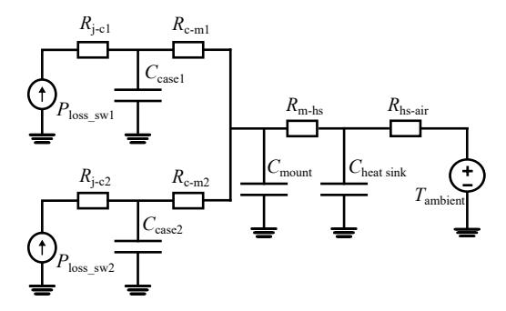

Fig. 11. Thermal domain image of the converter.

challenges related to data quality, real-time data acquisition, and handling incomplete or uncertain data, these factors are recognized as important for all DTs. These four digital images are inserted to the DT, as illustrated in Fig. 8. In order to enable the activation of the images, the next step involves developing the specific query-image mapping algorithm for the demonstrator.

The accuracy of the responses from the digital images was assessed by comparing them to actual measurements from the PT. The deviation between the digital images and measurements was calculated using Mean Absolute Percentage Error (MAPE) measures the difference between digital image calculations and actual values. This metric is determined by taking the absolute difference between the simulated data provided by the digital image,  $X_{\rm sim}$ , and the corresponding experimental output data of the PT,  $X_{\rm exp}$ , dividing by the experimental value, and averaging these percentage differences across all data points as

$$MAPE = mean \left( \left| \frac{X_{exp} - X_{sim}}{X_{exp}} \right| \right) 100\%$$
 (7)

All representations used in this work have an accuracy greater than  $97.5\,\%$ 

# VII. DEMONSTRATOR SPECIFIC QUERY-IMAGE MAPPING ALGORITHM

The DT, developed in Section V, includes a folio of four digital images; each of which can be activated as needed to serve distinct functions. Utilizing these images within the DT allows it to function across multiple domains and for various representation purposes. As discussed in Section IV, each image within the DT is assigned a unique identity, enabling the query-image mapping algorithm to identify and activate the correct image in response to a query. This process requires a database containing keywords and context for parsing queries as well as an understanding of image dependency to recognize and accommodate the hierarchical relationships between digital images. In this simple example, the database is a lookup table. Table I presents the identities assigned to digital images in this demonstration, serving as a lookup table that includes dependencies between digital images according to the query context. From Table I, it is evident that in the SoC estimator image, S1.1 is the primary image while the electrical switching-averaged image, E1.2, is the dependent image, providing the average value of the inductor current. Similarly, the thermal image, T1.1, relies on the electrical domain switching image, E1.1, for calculating power losses. Therefore, for thermal behavior queries, T1.1 is designated as the primary image with E1.1 serving as the dependent image.

{8}------------------------------------------------

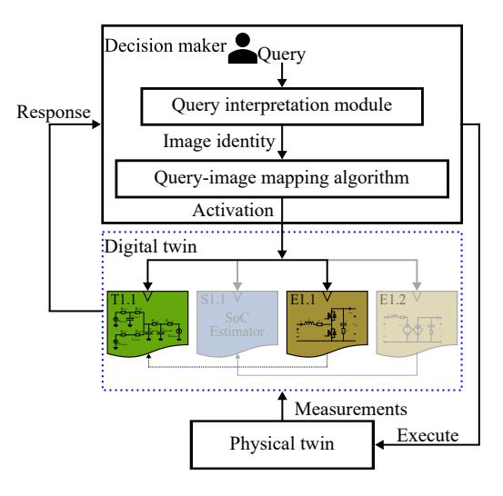

Fig. 12. Demonstrator image activation process for query 1 example.

When a query is received, the algorithm uses keywords and context to identify the primary image. It checks Table I to determine if a dependent image is required and then sends a binary code to the DT to activate these images. To clarify the demonstrator algorithm, example queries and their respective image selection processes are provided:

- Query 1: "Display the thermal behavior of the converter."
   Extraction and mapping: The query interpretation module processes the query and extracts key elements. It identifies the necessity for thermal image, T1.1, by identifying keywords associated with thermal behavior.
   Dependency check: The query-image mapping algorithm evaluates dependencies, determining from Table I that T1.1 relies on data from the electrical image, E1.1.
   Activation: Following the dependency mapping, the process is initiated by first activating E1.1 to calculate the necessary electrical power losses. Once this data is calculated, T1.1 is then activated to replicate the thermal behavior, as illustrated in Fig. 12.
- Query 2: "What is the state of charge of the battery?"

  Extraction and mapping: The query interpretation module processes the query, focusing on keywords associated with the state of charge. This analysis guides the selection of the SoC estimator image, S1.1.

**Dependency check:** The query-image mapping algorithm determines that S1.1 requires data from the electrical switching-averaged image, E1.2, and previous SoC data.

**Activation:** Following the dependency mapping, the system first activates E1.2 to provide the necessary inductor current. Subsequently, S1.1 is activated to estimate the SoC.

If the query is empty, the algorithm automatically selects the lowest fidelity images to conserve computational resources. In this scenario, E1.2 is the default activated image for this demonstration.

After the algorithm activates the appropriate digital images based on the query, the DT generates and provides a response. Certain digital images might require historical data for re-

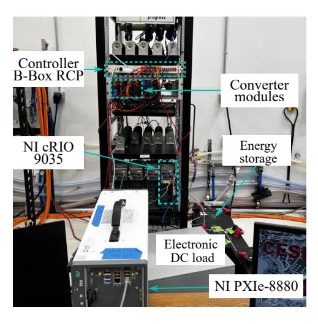

Fig. 13. Experimental hardware setup.

TABLE II
PARAMETERS OF THE IMPLEMENTED CONVERTER

| Parameters                    | Value             |  |
|-------------------------------|-------------------|--|
| Input voltage, $V_{\rm in}$   | 102.4 V           |  |
| Output voltage, Vout          | 200 V             |  |
| Switching frequency, $f_{sw}$ | 20 kHz            |  |
| Inductor, L                   | $1.25\mathrm{mH}$ |  |
| Output capacitor, C           | 500 μF            |  |

initialization. For instance, the SoC estimator image depends on knowledge of previous or initial SoC levels. However, this requirement can be met by obtaining an instantaneous measurement from the hardware when the image is activated without the need for historical data. Next, the decision maker analyzes the response and conveys the necessary actions to the PT for the required modifications. The flexibility of query processing can be enhanced by incorporating additional keywords as desired. The mapping method is based on a natural language processing technique that extracts keywords and context from a database and maps related digital images. Other techniques can also be utilized for this mapping algorithm, such as the convolutional neural network-based feature extraction presented in [31].

# VIII. EXPERIMENTAL SETUP AND RESULTS

# A. Physical Twin Hardware Setup

The hardware testbed used is shown in Fig. 13. The power converter derives its input from an energy storage, two 48-V, 3.5-kWh SimpliPhi batteries with a nominal voltage of  $51.2\,\mathrm{V}$ , connected in series resulting in a nominal battery voltage of  $102.4\,\mathrm{V}$  [32]. The voltage was boosted to a bus voltage of  $200\,\mathrm{-V}$  through the interface converter. The converter was implemented using Imperix PEB8038 half-bridge SiC power module [33]. This module includes two power semiconductor switches and is equipped with an onboard capacitance of  $500\,\mu\mathrm{F}$ . The design of the converter included an inductor of  $1.25\,\mathrm{mH}$ . The converter parameters are provided in Table II. An Imperix DIN800V sensor was used to monitor the output voltage [34]. To measure the load current, an Imperix DIN50A current sensor was connected in series with

{9}------------------------------------------------

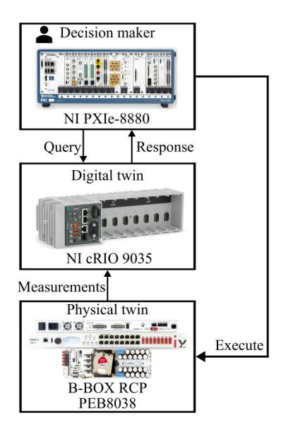

Fig. 14. The physical system and data flow as developed for the experimental demonstrator.

the output of the converter [35]. K-Type thermocouples with an accuracy of  $\pm 1\%$  were used to measure ambient and heat sink temperatures. Nested loop controls were utilized and integrated into an Imperix B-Box control platform for controlling the converter [36].

# B. Digital Twin and Decision Maker Setup

The DT, along with its internal image folio and representations, is deployed on the National Instruments CompactRIO 9035 (NI-cRIO 9035) [37]. The logic and data handling of the DT are developed using C code and LabVIEW. Then these codes were deployed on the NI-cRIO using NI VeriStand. The NI-cRIO 9035 interfaced directly with PT sensors and enabled the DT to receive real-time data streams. In this setup, a human-in-the-loop served as the decision maker, submitting queries in real-time as shown in Fig. 14. The interaction between the human-in-the-loop decision maker and the automated digital image selection process was facilitated through a NI PXIe-8880 controller [38]. The NI PXIe was used for data acquisition and served as a storage device. It received all sensor measurements related to the PT and logged activation codes for digital images along with their timestamps. The data stored on the NI PXIe was directly accessed by the human-inthe-loop decision maker. Data logging occurred at a sampling frequency of 10 Hz. Sensor measurements were relayed to the DT via Ethernet using the User Datagram Protocol (UDP). The human-in-the-loop decision maker submitted queries through a graphical user interface which were logged and timestamped for precise tracking.

#### C. Results

During the experiment, various queries were utilized to assess the effectiveness of the algorithm and the response from the DT. The experimental design comprehensively covered the capabilities of the DT by targeting different domains and functions through diverse queries. The following queries were utilized:

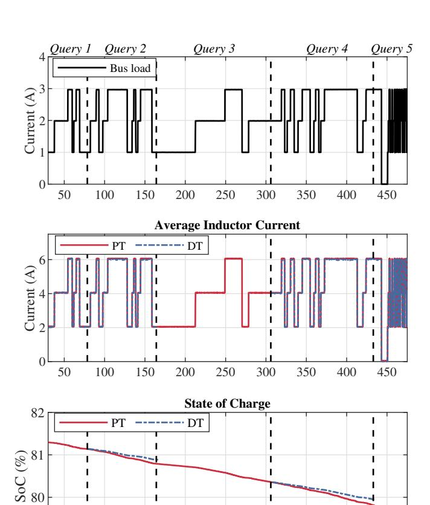

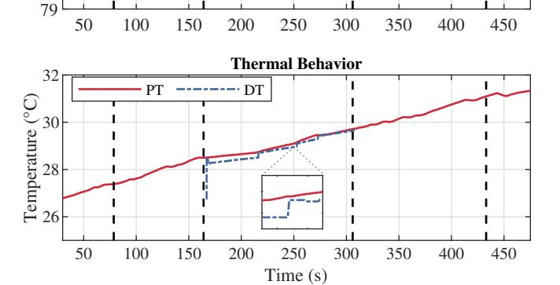

Fig. 15. The outcomes of the image-based DT framework demonstrator. From top to bottom: bus load current; average inductor current; state of charge (SoC) of the energy storage; and thermal behavior. The respective digital twin responses are provided when required by the specific query.

- Query 1: " [Empty, no query was asked].
- Query 2: "Show the SoC of the energy storage."
- Query 3: "Display the thermal behavior of the converter."
- Query 4: "Show the battery state of charge." [Different wording but similar intent as Query 2].
- *Query 5*: "Is the generator currently operational?" [Irrelevant query].

To evaluate the algorithm comprehensively, two distinct queries were formulated with differing wording but similar underlying intent. When the experiment began, an electronic DC load was utilized to apply a random load profile, initially set at 1 A and randomly varied in steps of 1 A, as shown in the first plot of Fig. 15.

At the beginning of the experiment, *Query 1* was initiated, as seen in Fig. 15. The objective of this query was to evaluate the default response behavior of the DT when no specific query

{10}------------------------------------------------

is provided. This was an empty query; therefore, according to the algorithm, the lowest fidelity image was activated while the remaining images were deactivated. In this demonstration, it is the electrical switching-averaged image, E1.2. In response to this query, the DT provided an average value of the inductor current, aligned with that of the PT, as illustrated in the second plot of Fig. 15. The third and fourth plots, showing the SoC of the energy storage and the thermal behavior of the converter, respectively, indicate no response from the DT. This absence of response was due to the deactivation of the images responsible for those responses following the query.

When *Query 2* was initiated to request an estimation of the SoC of the energy storage, the electrical averaged image E1.2 remained active as it is the dependent image for providing the SoC. The algorithm then activated the primary image S1.1, responsible for estimating the SoC. The third plot in Fig. 15 shows the DT provided the SoC of the energy storage when *Query 2* was initiated. This data was obtained by first capturing a SoC measurement from the PT, serving as the initial SoC value in the DT. This initialization highlights the dynamic interaction between the DT and the PT in effectively representing the status of the system.

When *Query 3* was initiated to target the thermal behavior of the converter, the query-image mapping algorithm activated the primary image T1.1, responsible for the thermal behavior concurrently with the electrical switching image E1.1. It is shown from the fourth plot of Fig. 15 that the DT provided the representation of the thermal behavior shortly after the activation of these images. This brief delay was attributed to the time required for E1.1 to calculate the power losses. Similar to the process of SoC estimation, the DT initially acquired a temperature measurement from the PT to establish the initial temperature reading. A closer examination of the zoomed section of the plot indicates that whenever there was a change in the load, the DT was promptly reinitialized by incorporating a new measurement from the PT.

Query 4 was a different wording query with similar intent as Query 2 which requires a SoC estimation. The objective of this query is to verify the response consistency of the DT to differently worded queries with similar intent. Therefore when Query 4 was initiated, the DT provided an estimation of the SoC, as can be seen from the third plot of Fig. 15.

When the irrelevant *Query 5* was initiated, the algorithm defaulted the selection to the electrical average image E1.2 and deactivated the remaining images. Additionally, the following response from the image-mapping algorithm was provided to the decision maker:

No relevant image found. Please refine your query or use more specific keywords, or use the following suggestions:

- 1. Check the SoC of the ES.
- 2. Display the thermal behavior of the converter.

Referring to Fig. 15, it is observed that the DT provided responses exclusive to each specific query while deactivating all other images and thus eliminating irrelevant responses. The selection of experimental parameters, such as the 200-V bus voltage for the dc-dc converter and the 10 Hz data logging frequency, was arbitrary and based on the capabilities of the available laboratory hardware. Potential issues

encountered during the experiments included network latency, sensor noise, and synchronization challenges between the physical and digital twins. These were mitigated by enhancing the network configuration, using precise timestamping for all data packets to ensure accurate synchronization, and applying filtering techniques to reduce sensor noise. The computational efficiency of the proposed framework was analyzed against the state-of-the-art DT using *Query 3*. The total CPU utilization for answering *Query 3* using the image-based DT framework which only required two images, was 17.08%. In comparison, the CPU utilization for a unified DT with all the described DT representations running simultaneously was 22.23%. This test was conducted on an Intel(R) i7 Windows machine and shows a 5.15% improvement when using an image-based multi-domain, multi-function DT over a unified DT.

#### IX. CONCLUSIONS

This research introduced an image-based DT framework that enables multi-domain, multi-function DTs to address the complexities inherent in modern power systems and other complex systems. The proposed framework utilizes multiple digital images, each representing various facets of a physical asset and encapsulating specific domains or facets with unique levels of detail. The image-based DT framework provides a detailed and comprehensive representation of the physical asset. By integrating these digital images into a single DT, it ensures a specialized and detailed portrayal of each facet of the asset, supporting a wide range of functionalities. The experimental results validated the effectiveness of this framework, showing its capability to replicate the behavior of the PT and portray varying levels of detail according to queries asked by the decision maker. The ability of the framework to selectively enable specific functions in the DT aligns with efficient computational resource management, essential for large-scale or continuous operations. The scalability and flexibility of the image-based DT framework accommodate evolving technologies and component upgrades over the long lifespans of naval ships. This approach ensures continuous adaptation and integration of new advancements as initial technologies are replaced or updated.

Additional functionalities can be added into the DT as digital images as needed. These functionalities depend on the essential operational objectives for which the decision maker requires an answer. The flexibility of query processing can be enhanced by adding more keywords or by implementing a feedback system. This system would learn from past queries, thereby improving the accuracy of image selection over time.

Query processing is merely one area of improvement for this image-based DT framework. Future work will focus on mathematically determining digital image selection, prioritization, and shifts between digital images. This process will be based on image and hardware ontology, real-time data, and in situ system requirements and demands on the DT. Although this level of detail was not required for the simplified example provided in this work, it becomes essential for more complex PTs and an increased number of digital images. A more sophisticated methodology will be needed to balance computational demands and required image fidelity.

{11}------------------------------------------------

#### ACKNOWLEDGMENTS

This work was supported by the Office of Naval Research under contract No.N00014-22-C-1003. DISTRIBUTION STATEMENT A. Approved for public release distribution unlimited, DCN# 543-1879-24.

#### REFERENCES

- [1] N. Ammar and I. Seddiek, "Evaluation of the Environmental and Economic Impacts of Electric Propulsion Systems Onboard Ships: Case Study Passenger Vessel," *Environmental Science and Pollution Research*, vol. 28, pp. 37851–37866, 2021.
- [2] P. Deshpande, P. Kalbar, A. Tilwankar, and S. Asolekar, "A Novel Approach to Estimating Resource Consumption Rates and Emission Factors for Ship Recycling Yards in Alang, India," *Journal of Cleaner Production*, vol. 59, 11 2013.
- [3] G. R. Kyunghwa Kim, Kido Park and K. Chun, "DC-grid System for Ships: A Study of Benefits and Technical Considerations," *Journal of International Maritime Safety, Environmental Affairs,* and Shipping, vol. 2, no. 1, pp. 1–12, 2018. [Online]. Available: https://doi.org/10.1080/25725084.2018.1490239
- [4] L. Xu et al., "A Review of DC Shipboard Microgrids—Part I: Power Architectures, Energy Storage, and Power Converters," IEEE Transactions on Power Electronics, vol. 37, no. 5, 2022.
- [5] F. C. Beach and I. R. McNab, "Present and Future Naval Applications for Pulsed Power," in *IEEE Pulsed Power Conference*, 2005, pp. 1–7.
- [6] S. Qazi, P. Venugopal, G. Rietveld, T. B. Soeiro, U. Shipurkar, A. Grasman, A. J. Watson, and P. Wheeler, "Powering Maritime: Challenges and Prospects in Ship Electrification," *IEEE Electrification Magazine*, vol. 11, no. 2, pp. 74–87, 2023.
- [7] G. Parise, L. Parise, L. Martirano, P. B. Chavdarian, C.-L. Su, and A. Ferrante, "Wise Port & Business Energy Management: Portfacilities, Electrical Power Distribution," in 2014 IEEE Industry Application Society Annual Meeting, 2014, pp. 1–6.
- [8] M. Grieves and J. Vickers, "Origins of the Digital Twin Concept," Florida Institute of Technology, vol. 8, pp. 3–20, 2016.
- [9] M. Lind, H. Becha, R. Watson, N. Kouwenhoven, P. Zuesongdham, and U. Baldauf, "Digital Twins for the Maritime Sector," Research Institutes of Sweden, Tech. Rep., 07 2020, doi: 10.13140/RG.2.2.27690.24006.
- [10] M. Singh, R. Srivastava, E. Fuenmayor, V. Kuts, Y. Qiao, N. Murray, and D. Devine, "Applications of Digital Twin Across Industries: A Review," *Applied Sciences*, vol. 12, no. 11, 2022.
- [11] K. Booth, K. Sado, J. Hannum, J. Knight, and R. Dougal, "Introduction of Posture-Based Pre-Alignment for Naval Applications," in 2023 IEEE Electric Ship Technologies Symposium (ESTS), 2023, pp. 464–468.
- [12] E. VanDerHorn and S. Mahadevan, "Digital Twin: Generalization, Characterization and Implementation," *Decision Support Systems*, vol. 145, p. 113524, 2021.
- [13] M. Milton, C. D. L. O, H. L. Ginn, and A. Benigni, "Controller-Embeddable Probabilistic Real-Time Digital Twins for Power Electronic Converter Diagnostics," *IEEE Transactions on Power Electronics*, vol. 35, no. 9, pp. 9850–9864, 2020.
- [14] J. Xiong, H. Ye, W. Pei, K. Li, and Y. Han, "Real-time FPGA-digital twin monitoring and diagnostics for PET applications," in 2021 6th Asia Conference on Power and Electrical Engineering, 2021, pp. 531–536.
- [15] P. Jain et al., "A Digital Twin Approach for Fault Diagnosis in Distributed Photovoltaic Systems," *IEEE Transactions on Power Elec*tronics, vol. 35, no. 1, pp. 940–956, 2020.
- [16] A. J. Wileman, S. Aslam, and S. Perinpanayagam, "A Component Level Digital Twin Model for Power Converter Health Monitoring," *IEEE Access*, vol. 11, pp. 54143–54164, 2023.
- [17] S. de López Diz. et al., "A Real-time Digital Twin Approach on Threephase Power Converters Applied to Condition Monitoring," Applied Energy, vol. 334, p. 120606, 2023.
- [18] Z. Lei, H. Zhou, X. Dai, W. Hu, and G.-P. Liu, "Digital Twin Based Monitoring and Control for DC-DC Converters," *Nature Communications*, vol. 14, no. 5604, 2023.
- [19] Y. Peng, S. Zhao, and H. Wang, "A Digital Twin Based Estimation Method for Health Indicators of DC-DC Converters," *IEEE Transactions on Power Electronics*, vol. PP, pp. 1–1, 07 2020.

- [20] National Academy of Engineering and National Academies of Sciences, Engineering, and Medicine, Foundational Research Gaps and Future Directions for Digital Twins. Washington, DC: The National Academies Press, 2023. [Online]. Available: https://nap.nationalacademies.org/catalog/26894/ foundational-research-gaps-and-future-directions-for-digital-twins
- [21] S. Boschert and R. Rosen, Digital Twin-The Simulation Aspect. Springer International Publishing, 2016, pp. 59–74. [Online]. Available: https://doi.org/10.1007/978-3-319-32156-1\_5
- [22] E. Glaessgen and D. Stargel, "The Digital Twin Paradigm for Future NASA and U.S. Air Force Vehicles," in 53rd AIAA/ASME/ASCE/AHS/ASC Structures, Structural Dynamics and Materials Conference, 2012, pp. 1–14
- Materials Conference, 2012, pp. 1–14.
   [23] I. Graessler and A. Poehler, "Integration of a Digital Twin as Human Representation in a Scheduling Procedure of a Cyber-physical Production System," in 2017 IEEE International Conference on Industrial Engineering and Engineering Management (IEEM), 2017, pp. 289–293.
- [24] K. Sado, J. Hannum, E. Skinner, H. L. Ginn, and K. Booth, "Hierarchical Digital Twin of a Naval Power System," in *IEEE Energy Conversion Congress & Exposition (ECCE)*, 2023, pp. 1–8.
- [25] S. Aheleroff, X. Xu, R. Y. Zhong, and Y. Lu, "Digital Twin as a Service (DTaaS) in Industry 4.0: An Architecture Reference Model," *Advanced Engineering Informatics*, vol. 47, p. 101225, 2021.
- [26] M. Faifer, L. Piegari, M. Rossi, and S. Toscani, "An Average Model of DC–DC Step-Up Converter Considering Switching Losses and Parasitic Elements," *Energies*, vol. 14, no. 22, 2021.
- [27] K. Sado, J. Hannum, and K. Booth, "Digital Twin Modeling of Power Electronic Converters," in 2023 IEEE Electric Ship Technologies Symposium (ESTS), 2023, pp. 86–90.
- [28] K. S. Ng, C.-S. Moo, Y.-P. Chen, and Y.-C. Hsieh, "Enhanced Coulomb Counting Method for Estimating State-of-Charge and State-of-Health of Lithium-ion Batteries," *Applied Energy*, vol. 86.
- [29] J. Marek. et al., "Compact Model of Power MOSFET with Temperature Dependent Cauer RC Network for More Accurate Thermal Simulations," Solid-State Electronics, vol. 94, pp. 44–50, 2014.
- [30] K. Sado, J. Peskar, S. Ionita, J. Hannum, A. Downey, and K. Booth, "Real-time Electro-thermal Simulations for Power Electronic Converters," in 2024 IEEE Applied Power Electronics Conference and Exposition (APEC), 2024, pp. 1–8.
- [31] K. T. Chui, B. B. Gupta, M. Torres-Ruiz, V. Arya, W. Alhalabi, and I. F. Zamzami, "A Convolutional Neural Network-Based Feature Extraction and Weighted Twin Support Vector Machine Algorithm for Context-Aware Human Activity Recognition," *Electronics*, vol. 12, no. 8, 2023. [Online]. Available: https://www.mdpi.com/2079-9292/12/8/1915
- [32] SimpliPhi. PHI 3.8-MTM Battery. [Online; accessed 12/04/2023]. [Online]. Available: https://simpliphipower.com/product/phi-3-8-m-battery/
- [33] Imperix. PEB8038 SiC Power Module. [Online; accessed 11/10/2023]. [Online]. Available: https://imperix.com/products/power/ half-bridge-module/
- [34] "Datasheet for ±800 V DIN Rail-Mountable Voltage Sensors," Online, 2023, accessed: Oct. 25, 2023. [Online]. Available: https://imperix.com/wp-content/uploads/document/DIN-800V.pdf
- [35] Imperix. ±50A Current Sensor. Accessed: 2023-07-9. [Online]. Available: https://imperix.com/wp-content/uploads/document/DIN-50A. pdf
- [36] Împerix. B-Box Rapid Prototyping Controller 3.0. Accessed: 2023-11-30. [Online]. Available: https://imperix.com/wp-content/uploads/ document/B-Box\_Datasheet.pdf
- [37] National Instruments. CompactRIO Controller cRIO-9035 Specifications. [Accessed: 13-Dec-2023]. [Online]. Available: https://www.ni.com/docs/en-US/bundle/crio-9035-specs/page/specs.html
- [38] N. Instruments. PXIe-8880 RT Specifications. [Accessed: 14-Dec-2023]. [Online]. Available: https://www.ni.com/docs/en-US/bundle/pxie-8880rt-specs/page/specs.html