{0}------------------------------------------------

Article

# Bionic Design Based on McKibben Muscles and Elbow Flexion and Extension Assist Device

Hong Jiang, Qingyi Zeng, Yang Jiang, Zihao Zuo and Yanhong Peng \*

College of Mechanical Engineering, Chongqing University of Technology, Chongqing 400054, China \* Correspondence: yhpeng@nagoya-u.jp

#### **Abstract**

The increasing aging population and the rise in sports injuries have led to greater demand for elbow function rehabilitation and daily assistance. To address the limitations of traditional rigid rehabilitation aids and existing flexible assistive systems, this paper designs a wearable elbow-assist robot that arranges pneumatic muscles based on the distribution of human elbow muscles. By integrating bionic design, experimental research, and mathematical modeling, the proposed approach determines the optimal scheme through comparative experiments on material structures and provides supporting data, while the mathematical model describes the force characteristics of the pneumatic muscles. Final experiments verify that the system can effectively assist elbow movement and significantly enhance flexion torque.

**Keywords:** McKibben pneumatic muscle; wearable elbow-assist robot; bionic design; contraction ratio; versatility

## 1. Introduction

Among various soft actuation approaches, McKibben pneumatic artificial muscles (PAMs) are considered highly promising for wearable assistive systems owing to their high

Received: 6 November 2025

Academic Editors: Zhixing Ge and Xingyue Hu

Revised: 20 December 2025
Accepted: 25 December 2025
Published: 31 December 2025
Copyright: © 2025 by the authors.
Licensee MDPI, Basel, Switzerland.
This article is an open access article distributed under the terms and conditions of the Creative Commons

Attribution (CC BY) license.

{1}------------------------------------------------

> power-to-weight ratio, intrinsic compliance, and muscle-like contraction behavior [8,9]. Significant progress has been made in PAM modeling, materials, and control, with several studies exploring their application in elbow and upper-limb assistance [10,11]. Nevertheless, existing systems still face challenges, including imperfect anatomical alignment, limited durability, and insufficient adaptability to individual anthropometry. Moreover, current models and control methods struggle to balance real-time performance and mechanical accuracy during complex motions, limiting long-term comfort, clinical reliability, and widespread adoption. Building upon the aforementioned clinical needs and techno-McKibben pneumatic artificial muscles. Unlike previous McKibben-based elbow assistive systems, this work introduces hybrid-material actuators and a four-node weaving design to enhance durability, torque stability, and anatomical alignment. The research focuses on the was optimized according to anatomical muscle distribution and elbow biomechanics, ensuring refinement and material comparison experiments, improvements were made in flexibility, sealing integrity, and long-term durability of the McKibben actuators, which in turn directly enhanced usability metrics. Specifically, the optimized fabric weaving and compliant actuation arm. Improved sealing and consistent torque gain ensured high repeatability across multiple inflation-deflation cycles. Furthermore, the robust sealing and reinforced materials decreased the likelihood of air leakage and material wear, thereby reducing maintenance requirements. An adjustable attachment mechanism was also designed to accommodate diverse user anthro-that the proposed system can provide stable elbow flexion assistance with a controllable

> output torque ranging from 5 to 50 N·m, confirming its operational effectiveness and application potential. Overall, this work aims to deliver a soft, wearable rehabilitation device with muscle-like compliant actuation, specifically designed to support elbow flexion–extension recovery. The proposed system provides assistive rehabilitation for individuals with impaired upper-limb motor function, particularly stroke survivors experiencing muscle imbalance and

The effective utilization of McKibben PAMs relies heavily on a thorough understanding of their mechanical behavior and the development of appropriate control strategies. Soleymani and Khajehsaeid proposed a continuur

https://doi.org/10.3390/act15010021

older adults with age-related neuromuscular decline.

2.1. Development History of McKibben Pneumatic Muscles

and wearable assistive devices.

2. A Review of McKibben Pneumatic Muscle Research

{2}------------------------------------------------

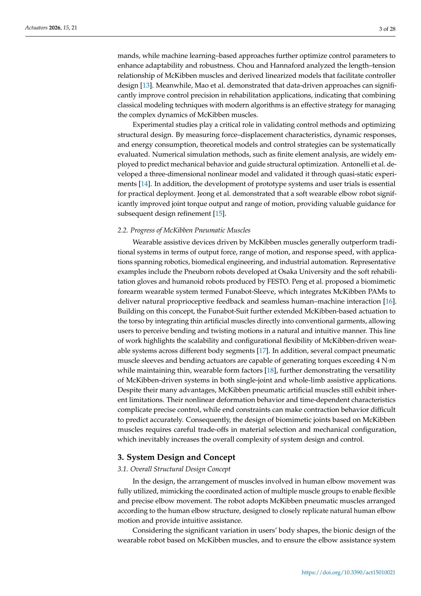

{3}------------------------------------------------

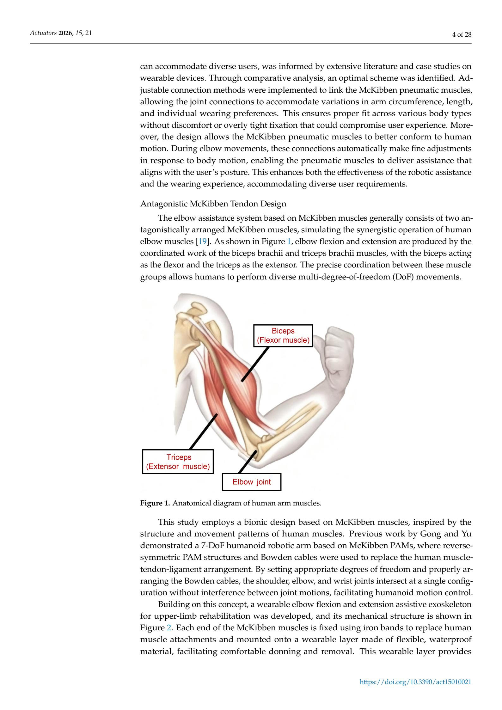

{4}------------------------------------------------

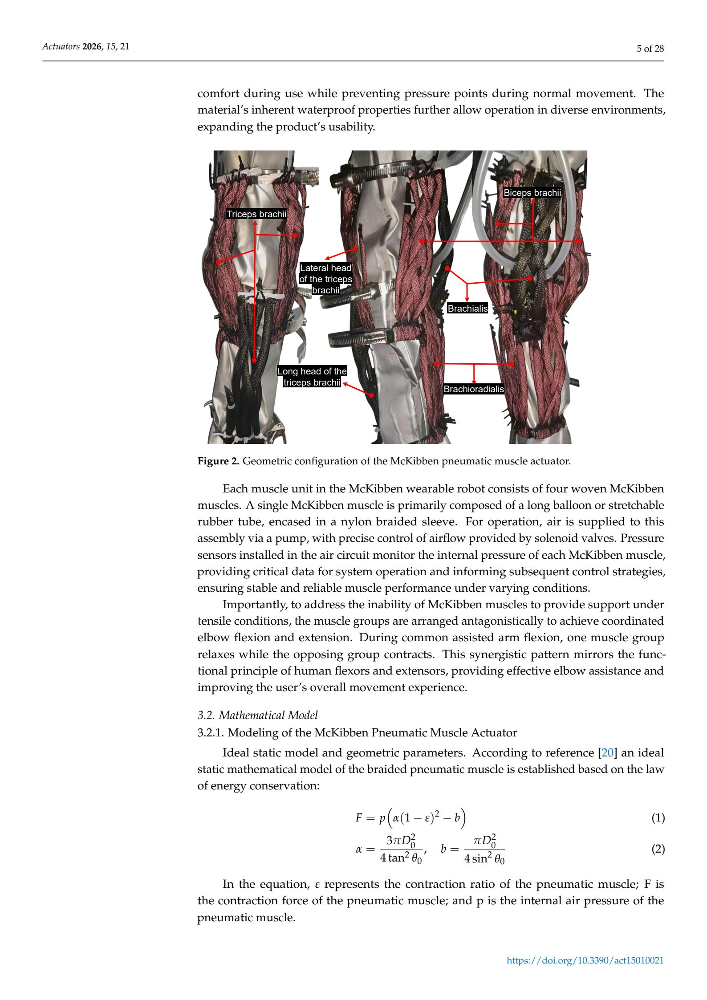

{5}------------------------------------------------

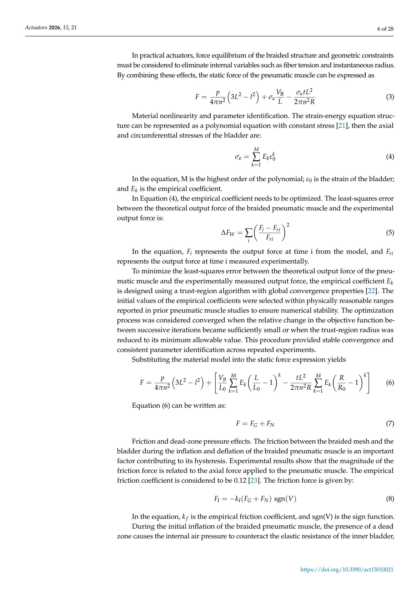

{6}------------------------------------------------

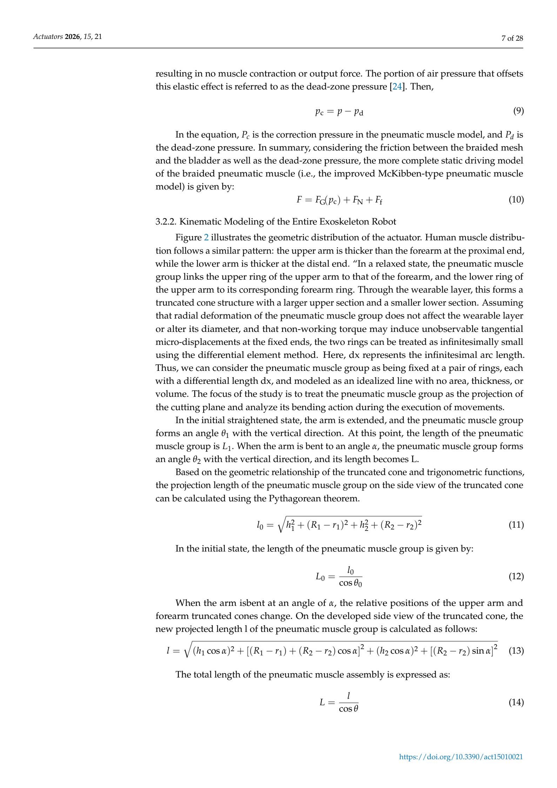

{7}------------------------------------------------

Actuators 2026, 15, 21 8 of 28

The contraction amount is given by  $l = L_0 - L$ . Substituting Equations (2) and (4) yields:

$$\Delta L = \frac{\sqrt{h_1^2 + (R_1 - r_1)^2 + h_2^2 + (R_2 - r_2)^2}}{\cos \theta_0} - \frac{\sqrt{(h_1 \cos \alpha)^2 + \left[ (R_1 - r_1) + (R_2 - r_2) \cos \alpha \right]^2 + (h_2 \cos \alpha)^2 + \left[ (R_2 - r_2) \sin \alpha \right]^2}}{\cos \theta}$$
(15)

where  $R_1$  and  $r_1$  denote the upper and lower base radii of the conical section of the upper arm, respectively, and  $h_1$  represents its height;  $R_2$  and  $r_2$  denote the upper and lower base radii of the conical section of the forearm, respectively, and  $h_2$  represents its height.

$$\varepsilon = 1 - \frac{L}{L_0} \tag{16}$$

$$F = \begin{cases} k_{l1}\varepsilon + C, & \text{if } \varepsilon \ge 0\\ k_{nl3}\varepsilon^3 + k_{nl2}\varepsilon^2 + k_{nl3}\varepsilon + C, & \text{if } \varepsilon < 0 \end{cases}$$
 (17)

## 4. Prototype Fabrication

4.1. Design and Fabrication of a Single Pneumatic Muscle

4.1.1. Sealed Connection Design for Pneumatic Muscle

{8}------------------------------------------------

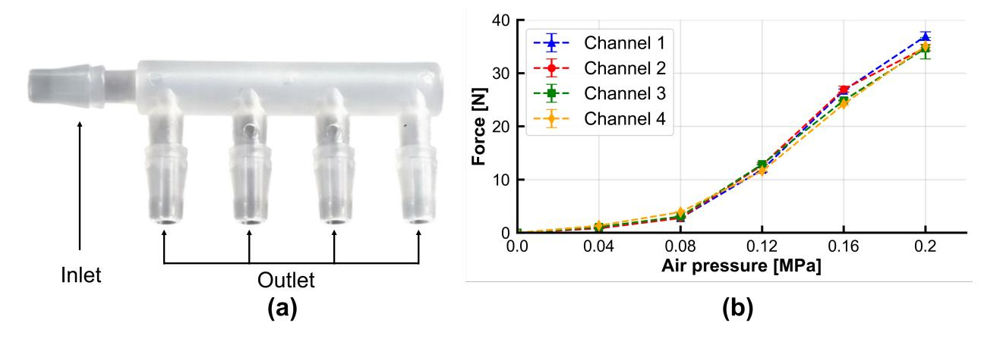

**Figure 3.** (a) Actual Image of F-Type Pagoda Head. (b) Force balance test of the four-channel output of the 4.8F five-way connector.

#### 4.1.2. Selection of Constraint Layer and Expanding Bladder Materials

When selecting materials for the McKibben pneumatic muscle actuator, factors such comprehensively considered. Based on extensive literature review, material testing, and design validation, the PET flame-retardant nylon braided mesh tube (with flattened widths of 6 mm and 10 mm) was selected as the constraint layer material, while a thickened latex balloon and a medical-grade rubber hose (inner diameter 5 mm, outer diameter 7 mm, wall thickness 1 mm) were chosen as the expansion bladders. According to manufacturer data, the PET flame-retardant nylon braided mesh features a braiding angle of less than 25° and a diameter expansion ratio of 1.5, offering excellent elasticity, high tensile strength, and strong abrasion resistance. These properties make it well-suited for use as the constraint layer of the McKibben pneumatic muscle actuator. Although medical rubber tubing can also serve as an actuator bladder, its open-ended structure results in poor air tightness. Moreover, the wall thickness of the medical rubber tube is significantly greater than that of the thickened latex balloon, leading to higher actuator stiffness. Consequently, achieving a given output force requires more time. Through analysis of relevant literature and open-source projects, it was observed that the thickened latex balloon exhibits superior expansibility and air

{9}------------------------------------------------

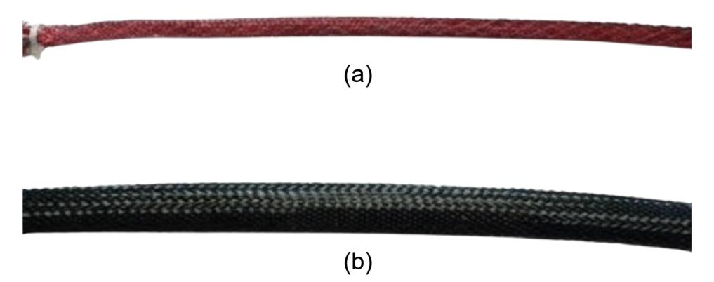

**Figure 4.** Two types of McKibben pneumatic muscle actuators: (a) the elongated balloon McKibben actuator, which uses a thickened latex balloon as the inner tube and a PET flame-retardant nylon braided sleeve as the constraint layer; and (b) the rubber hose McKibben actuator, which uses a medical-grade rubber hose as the inner tube and a PET flame-retardant nylon braided sleeve as the constraint layer.

For the medical rubber tube—based actuator, the artificial muscle demonstrates a relatively rapid pressure rise during the inflation phase, reaching the target pressure of approximately 0.2 MPa within 1.5 s. During the steady-state phase, the pressure remains stable, and the response curves from repeated trials almost completely overlap, indicating excellent pressure tracking performance and repeatability. During deflation, the pressure decreases rapidly, with only minor hysteresis observed near zero pressure.

{10}------------------------------------------------

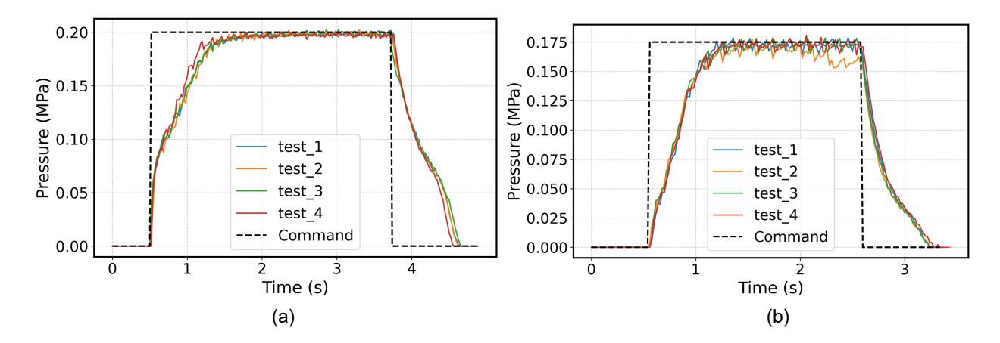

**Figure 5.** (a) Pneumatic response of the medical rubber tube-based expandable bladder actuator. (b) Pneumatic response of the elongated balloon-type expandable bladder actuator fabricated from thickened latex material.

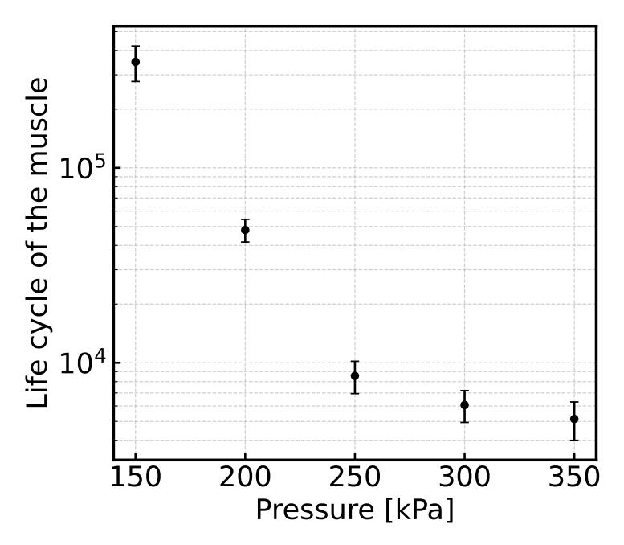

Figure 6. Life cycle of the artificial muscle with a thickened latex balloon bladder.

## 4.1.3. Single Pneumatic Muscle Contraction Experiment

{11}------------------------------------------------

Actuators 2026, 15, 21 12 of 28

type of bladder material, ten independent experiments were performed (n = 10), and the mean value of repeated measurements was used as the final experimental result. This approach reduced the influence of random factors, enhancing the accuracy and reliability of the results.

As shown in Table 1 and Figure 8, the average critical pressure and average maximum effective deformation of the thickened latex balloon McKibben pneumatic muscle actuators are lower than those of the rubber hose McKibben actuators; however, the average contraction ratio of 29.58% is significantly higher than the 20.83% observed for the rubber hose actuators. This outcome aligns with mathematical modeling: bladders with greater wall thickness exhibit higher stiffness, resulting in lower contraction ratios but greater load-bearing capacity. According to studies by Chou, Hannaford, and others, the 1. Hysteresis: The tension-length curve exhibits a hysteresis loop due to Coulomb friction, independent of actuation speed, with the loop's width and height depending on the loading history. 2. Pressure Dependence: Tension is approximately linearly proportional to internal pressure; higher pressure results in higher tension. 3. Stiffness Characteristics: Actuator stiffness increases with pressure and remains nearly constant within a certain length range. 4. Passive Elasticity: Even in the absence of applied pressure, the actuator exhibits intrinsic elasticity due to the material properties of the bladder and shear forces between the constraint fibers.

Because the rubber hose bladder has a significantly greater wall thickness than the latex balloon, it exhibits slower response and higher passive elasticity.

**Table 1.** Comparison of Performance Parameters for Different Types of McKibben Pneumatic Muscle Actuators.

| Type of Pneumatic Muscle Actuator                                     | Average Measured Critical Pressure (kPa) | Average Maximum Effective Deformation Pressure (kPa) | Average Contraction Ratio (%) |  |
|-----------------------------------------------------------------------|---------------------------------------------|------------------------------------------------------------|----------------------------------|--|
| Strip Balloon McKibben Pneumatic Muscle Actuator Rubber Hose McKibben | 189                                         | 175                                                        | 29.58                            |  |
| Pneumatic Muscle Actuator                                             | 250                                         | 200                                                        | 20.83                            |  |

Based on these performance differences, for elbow flexion and extension movements that require mimicking muscle groups with relatively low load but large displacement, the thickened latex balloon McKibben actuators are preferable. Conversely, when rubber hose

{12}------------------------------------------------

Actuators 2026, 15, 21 13 of 28

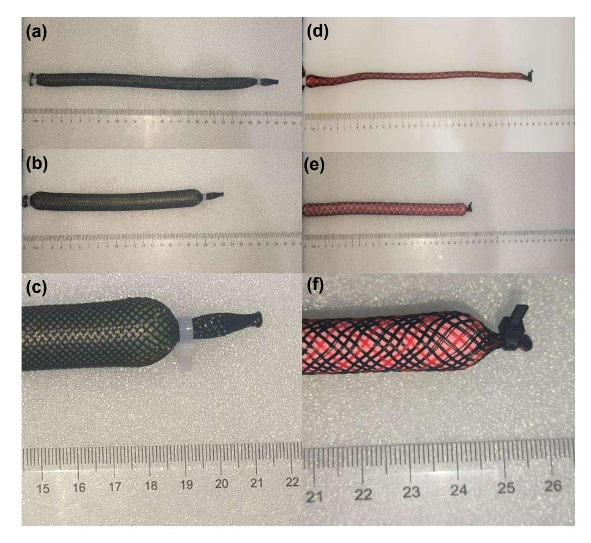

{13}------------------------------------------------

Actuators 2026, 15, 21 14 of 28

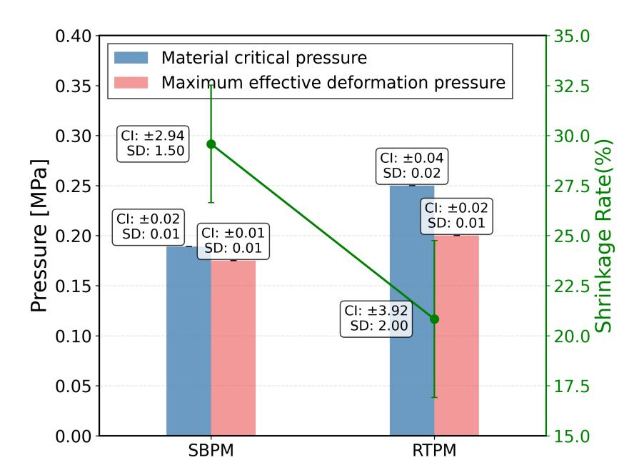

**Figure 8.** Error bar chart of performance test data, where SBPM represents the strip-type pneumatic muscle and RTPM represents the rubber-tube pneumatic muscle.

Force prediction was based on the improved McKibben static model proposed earlier, whose general form is given in Equation (10). The model comprehensively incorporates geometric constraint relationships, nonlinear terms associated with the bladder material (Equation (4)), friction effects (Equation (8)), and dead-zone pressure compensation (Equation (9)). The measured dead-zone pressures for the two flexible bladder materials—medical rubber tubing and latex balloon-type bladders—were 0.0072 MPa and 0.0036 MPa, respectively. The stress-strain behavior of the bladder material was approximated using a first-order polynomial, and the equivalent material parameter  $(E_1)$  was identified by minimizing the error function defined in Equations (3)–(14) via a least-squares method. For different bladder materials, the model structure and friction coefficient remained unchanged, while only  $(E_1)$  varied with material type  $((E_1 \approx 0.91))$  MPa for the medical rubber tube bladder and ( $E_1 \approx 1.39$ ) MPa for the latex balloon-type bladder). Other geometric parameters, including the initial length ( $L_0$ ), initial braid angle ( $\theta_0 = 25^{\circ}$ ), inner and outer diameters, as well as the friction coefficient ( $(k_f = 0.12)$ ), were determined through structural design or experimental calibration and kept constant throughout the analysis. Figure 9 compares the model-predicted output force with the experimental measurements as a function of input pressure. For the medical rubber tube bladder, the model exhibits excellent agreement with the experimental data over the entire pressure range, achieving a coefficient of determination ( $R^2 = 0.993$ ) and a root mean square error (RMSE) of 0.62 N. For the balloon-type bladder, after recalibration of the dead-zone pressure and  $(R^2 = 0.991)$  and an RMSE of approximately 0.69 N. These results indicate that the output force of a single pneumatic muscle is predominantly governed by the pressure-geometry relationship, while differences in bladder materials can be effectively captured by a single of the proposed model across different flexible bladder configurations.

{14}------------------------------------------------

Actuators 2026, 15, 21 15 of 28

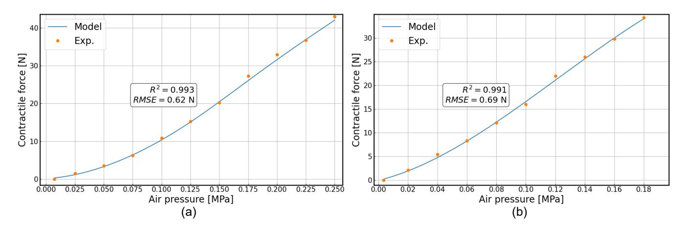

**Figure 9.** (a) Force–Pressure diagram of Artificial muscle with a rubber tube bladder. (b) Artificial muscle with a thickened latex balloon bladder.

## 4.2. Design and Fabrication of the McKibben Pneumatic Muscle Fabric Assembly

From a structural stability perspective, the specific configuration formed by plain weaving effectively constrains the expansion direction of the actuator during inflation. The weaving angle and pattern influence the deformation behavior under pneumatic pressure, thereby limiting excessive radial expansion and ensuring that the actuator contracts or extends primarily along its axial direction while maintaining a stable working form. These characteristics underscore the critical role of plain weaving in ensuring actuator stability and operational accuracy. Regarding mechanical performance, plain weaving significantly enhances the tensile strength of the actuator. Materials commonly used for weaving, such as nylon and other fibers, possess high inherent strength, preventing rupture or damage actuator, allowing it to undergo compliant deformation during complex movements without compromising its structural integrity. From a force transmission efficiency perspective, plain weaving improves the ability of internal pneumatic pressure to be converted into stress concentrations and contributing to stable actuator performance. These properties enable the actuator to better emulate biological muscle motion, making it highly suitable for applications in bionic robots and rehabilitation devices. Additionally, plain weaving enhances abrasion resistance, preventing surface damage caused by friction with external components during prolonged operation.

Multiple experiments have demonstrated a strong correlation between the contraction performance of McKibben pneumatic muscle fabric assemblies and the weaving tightness.

{15}------------------------------------------------

Actuators 2026, 15, 21 16 of 28

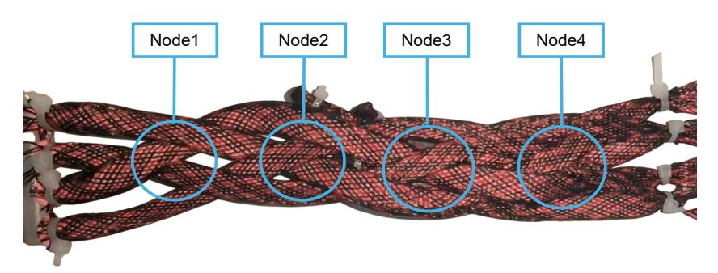

**Figure 10.** Schematic Diagram of the Quantitative Regulation of Fabric Tightness in McKibben Pneumatic Muscles.

#### Fabric Group Performance Testing Experiment

As can be observed from Table 2 and Figure 11, the effect of different node counts on fabric contraction was evaluated through four groups of McKibben pneumatic muscle fabric assemblies with 2, 3, 4, and 5 nodes, respectively. Each group underwent 10 repeated trials. One-way ANOVA and Tukey HSD multiple comparison analyses yielded the following conclusions: the average contraction ratios for 3-node and 4-node fabrics were 28.34% and 31.47%, respectively, both significantly higher than the 23.58% observed for 2-node fabrics (p < 0.05), indicating that increasing the node count to 3–4 effectively enhances contraction performance. In contrast, the 5-node fabric exhibited an average contraction ratio of only 25.33%, showing no significant difference compared with the 2-node fabric (p > 0.05), suggesting that further increasing the number of nodes can actually reduce contraction efficiency. Multiple comparison results indicate that although the 3-node and 4-node fabrics differ numerically, the difference is not statistically significant (p > 0.05). These findings demonstrate that, under the present experimental conditions, 3–4 nodes are optimal for enhancing the contraction performance of McKibben pneumatic muscle fabrics, and that simply increasing the number of nodes does not necessarily improve performance.

Considering factors such as load capacity, durability, and conformity, the 4-node weaving pattern was selected as the standard and applied in the elbow flexion/extension assistive exoskeleton robot.

{16}------------------------------------------------

Actuators 2026, 15, 21 17 of 28

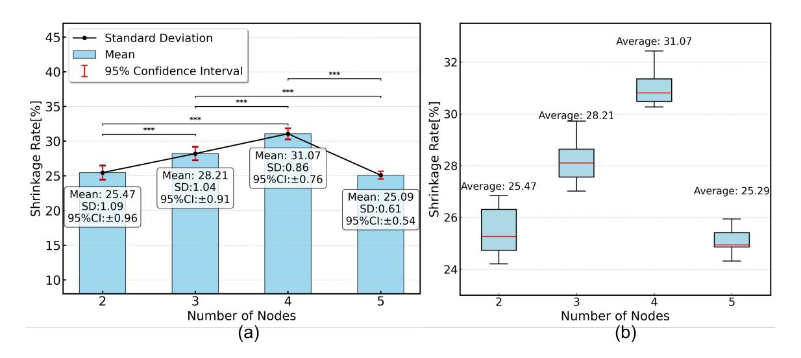

**Figure 11.** (a) ErrorBar Chart of Fabric Contraction Ratio Test Data for Different Node Numbers. \*\*\* indicates p < 0.001, demonstrating a highly significant difference in contraction ratio under different numbers of nodes. (b) Analysis of contraction ratio differences for braided structures with different numbers of nodes.

Table 2. Contraction ratio measurements of braided groups with different numbers of nodes.

| Number of Nodes | Cont  | Contraction Ratio in i-th Trial (%) |       |       | Average Contraction Ratio (%) |       |
|-----------------|-------|-------------------------------------|-------|-------|-------------------------------|-------|
| 2               | 26.31 | 25.26                               | 24.73 | 24.21 | 26.84                         | 25.47 |
| 3               | 29.72 | 27.56                               | 28.10 | 28.64 | 27.02                         | 28.21 |
| 4               | 30.27 | 30.48                               | 31.35 | 32.43 | 30.81                         | 31.07 |
| 5               | 25.94 | 25.41                               | 24.32 | 24.86 | 24.94                         | 25.29 |

## 5. Complete System Assembly

{17}------------------------------------------------

Actuators 2026, 15, 21 18 of 28

Contraction of the triceps brachii enables elbow extension. When fully extended, the generated muscle force decomposes into radial and tangential components, which could cause posterior displacement of the ulna; however, extension relies primarily on the tangential force component.

bent posture. The air supply to both channels was then sequentially shut off, reducing the pressures to zero, followed by venting the tubing. Subsequently, air at 0.150 MPa was supplied to the pneumatic muscle fabric assemblies of the extensor group, causing the arm

https://doi.org/10.3390/act15010021

extensor group. The final assembly drawing of the complete machine is shown in Figure 12. (b) (c)Figure 12. Human Body Model Experiment: (a) Initial State; (b) Flexed State; (c) Extended State. 6. Physical Experiments 6.1. Model Tests 6.1.1. Experimental Design To prevent subconscious human responses from affecting the test results, this experiment employed a plastic human model to evaluate the wearable exoskeleton robot. At the start of the experiment, air at 0.150 MPa and 0.200 MPa was supplied to the two pneumatic muscle assemblies in the flexor region, causing the model to assume the corresponding

to extend, as illustrated in Figure 12.

{18}------------------------------------------------

{19}------------------------------------------------

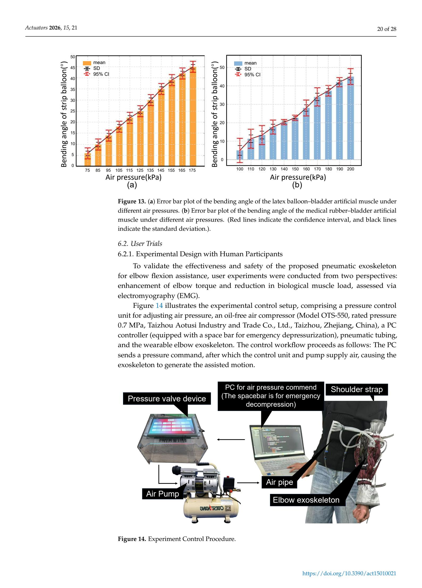

{20}------------------------------------------------

Actuators 2026, 15, 21 21 of 28

Torque Enhancement Test. Eight healthy university students of similar age (20–25 years) were recruited as participants. The statistical results of the forearm length of the sample individuals are shown in Table 4. To eliminate potential gender-related effects, the cohort consisted of four male and four female subjects. A single-blind experimental design was adopted. All participants were informed of the experimental procedures prior to testing and provided written informed consent.

Table 4. User data.

| Subject                | Subject 1 | Subject 2 | Subject 3 | Subject 4 | Subject 5 | Subject 6 | Subject 7 | Subject 8 |
|------------------------|-----------|-----------|-----------|-----------|-----------|-----------|-----------|-----------|
| Forearm Length (cm) | 23.7      | 27.4      | 26.8      | 24.1      | 23.9      | 25.3      | 26.1      | 24.6      |

EMG Test. To further assess the influence of exoskeleton assistance on users' biological muscle load, a surface electromyography (EMG)–based user experiment was conducted. As the exoskeleton primarily provides elbow flexion assistance, EMG measurements focused exclusively on the biceps brachii muscle.

#### 6.2.2. Functional Performance Results and Discussion

{21}------------------------------------------------

Actuators 2026, 15, 21 22 of 28

Elbow flexion torque data from eight participants (including unassisted torque, assisted torque, and torque enhancement) were analyzed using one-way analysis of variance (ANOVA). The results indicate a significant difference in elbow flexion torque between the unassisted and assisted conditions. As shown in Figure 15a, the inter-group F-statistic corresponds to a p-value < 0.05 ( $\alpha$  = 0.05), demonstrating a statistically significant increase in elbow flexion torque when the assistive device is worn. As further illustrated in Table 5 and Figure 15a–c, each individual trial exhibits a significant difference, with torque enhancement accounting for 9.838–23.091% of the unassisted torque. These results confirm that the exoskeleton provides effective assistance for elbow flexion–extension movements.

| <b>Table 5.</b> Torque Comparison Between Assisted and Unassiste | d Conditions. |
|------------------------------------------------------------------|---------------|
|------------------------------------------------------------------|---------------|

| Subject ID | Unassisted Torque (N·m) | Assisted Torque (N·m) | Torque Enhancement (N·m) |
|------------|-------------------------|-----------------------|--------------------------|
| 1          | 9.20                    | 10.80                 | 1.60                     |
| 2          | 14.53                   | 16.85                 | 2.32                     |
| 3          | 13.62                   | 14.96                 | 1.34                     |
| 4          | 10.87                   | 13.38                 | 2.51                     |
| 5          | 10.11                   | 11.94                 | 1.83                     |
| 6          | 11.50                   | 14.07                 | 2.57                     |
| 7          | 11.65                   | 13.62                 | 1.97                     |
| 8          | 10.78                   | 12.89                 | 2.11                     |

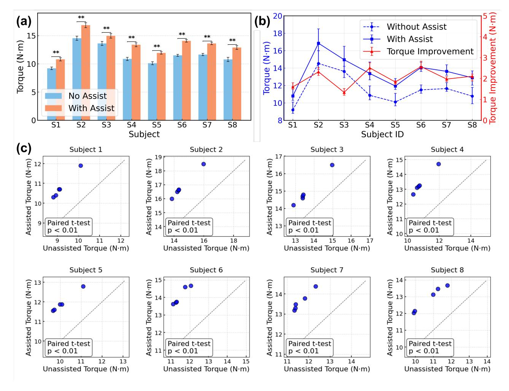

**Figure 15.** Torque test results. (a) Comparison of Elbow Torque Before and After Wearing the Elbow Flexion/Extension Assistive System. \*\* indicates p < 0.01, indicating that the torque difference between the "Assisted" and "Unassisted" conditions is highly significant. (b) Trend of elbow torque enhancement before and after wearing the elbow assistive system. (c) Paired t-test performed on five repeated measurements for each participant.

{22}------------------------------------------------

Actuators 2026, 15, 21 23 of 28

The torque augmentation was calculated as  $\Delta M = M_1 - M_0$ , where  $M_1$  represents the torque with robotic assistance and  $M_0$  represents the baseline torque. This approach minimizes the influence of the exoskeleton's own weight on the experimental results.

The McKibben-muscle-based bionic design of the present study, along with the elbow flexion and extension assistive system, explicitly accounts for individual anatomical differences, enhancing overall adaptability. As shown in Figures 15 and 16, while within-group variability is small, inter-group differences are substantial, indicating significant individual effects. This suggests that further improvements in user-specific adaptation are possible through more detailed individual parameter collection to enable precise personalized fitting. It is noteworthy (Figure 16a) that when the pressure increases from (0.18, 0.155) to (0.2, 0.175), the torque increment becomes significantly smaller. This is mainly because the contraction ratio of the woven muscles reaches its limit, resulting in an increase in the overall exoskeleton stiffness and thus producing a certain antagonistic effect.

{23}------------------------------------------------

Actuators 2026, 15, 21 24 of 28

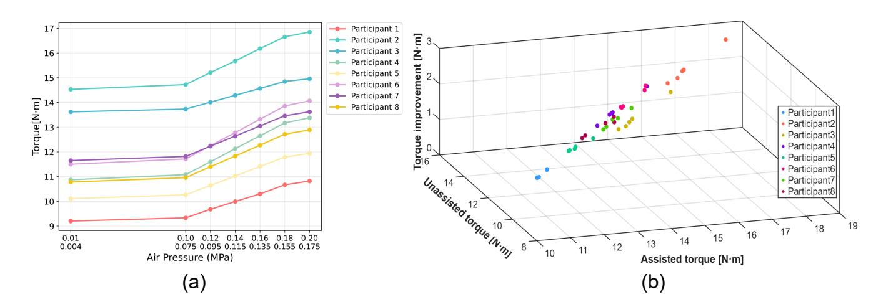

Overall, multiple experimental trials confirmed the assistive efficacy of the wearable exoskeleton for elbow movements, with minimal influence from gender and generally good adaptability. However, individual variability significantly affects adaptation outcomes. These results demonstrate the practical value of McKibben-muscle-based bionic designs in assistive systems and provide guidance for future iterations, emphasizing the need to optimize individualized fitting mechanisms to accommodate diverse users.

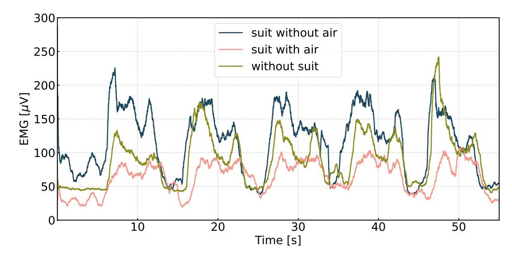

Figure 17. Scatter plots of experimental data for each group.

Notably, when wearing the exoskeleton without pressurization, biceps brachii activation does not decrease compared to the baseline and even shows a slight increase during

{24}------------------------------------------------

Actuators 2026, 15, 21 25 of 28

certain phases. This phenomenon is likely attributable to the mass of the exoskeleton itself (approximately 0.59 kg) and the structural constraints it imposes on arm movement. In the absence of effective assistance, these factors may increase the muscular effort required to perform elbow flexion tasks. A short delay and hysteresis during flexion–extension transitions were also observed, with a characteristic time scale on the order of 1–2 s.

#### 7. Discussion

This study presents a systematic investigation of a wearable elbow assistive system actuated by McKibben pneumatic artificial muscles, encompassing structural design, material selection, and experimental validation. Through torque enhancement experiments, electromyography (EMG) analysis, and dynamic response and repeatability tests, the assistive effectiveness, muscle load reduction capability, and pneumatic performance of the device were evaluated from multiple perspectives. The results demonstrate that the pro-engineering practicality for upper-limb assistive applications. As summarized in Table 5, the overall structural weight and contraction capability of the proposed system fall within the typical performance range reported for recent PAM-based joint and wearable systems, while emphasizing a simplified and lightweight mechanical design. Table 6 provides a performance comparison with representative PAM-based joint and wearable assistive systems reported in the literature. Most existing systems employing conventional PAM actuators achieve contraction ratios in the range of approximately 20–30%, with reported system weights typically around 1.0–1.5 kg and response times of about 2 s. In comparison, the proposed joint prototype using a braided PAM achieves a higher contraction ratio (30.81%) while substantially reducing the overall system weight to 0.59 kg and shortening the system-level response time to 1.5 s. Although differences in application scenarios, structural designs, and evaluation protocols may affect direct numerical comparison, the results indicate that the braided PAM configuration enables a favorable balance between contrac-wearable joint assistance applications.

**Table 6.** Performance comparison with representative PAM-based joint and wearable systems.

| Wearable Devices       | Application          | Actuation   | Contraction (%) | Weight (kg) | Response Time    |
|------------------------|----------------------|-------------|-----------------|-------------|------------------|
| Xiloyannis et al. [25] | Wearable/Exoskeleton | PAM         | $\sim$ 25       | $\sim 1.5$  | 2 s              |
| Caldwell et al. [26]   | Wearable assist      | PAM         | 20-30           | _           | 2 s              |
| Al-Fahaam et al. [27]  | Joint actuator       | PAM         | 20-25           | $\sim 1.0$  | 2 s              |
| Zhang et al. [28]      | Soft joint system    | PAM         | $\sim 30$       | _           | 2 s              |
| This work              | Joint prototype      | Braided PAM | 30.81           | 0.59        | $1.5 \mathrm{s}$ |

{25}------------------------------------------------

Actuators 2026, 15, 21 26 of 28

tensile strength and lower creep. Future work will incorporate more refined anthropometric data and biomechanical modeling methods to enhance individualized system adaptation.

#### 8. Conclusions

Based on the above research, this study conducted the systematic design, fabrication, and preliminary validation of a McKibben pneumatic muscle–driven elbow flexion/extension assistive system, achieving the intended outcomes. In terms of system design, the actuator layout was optimized according to the anatomical distribution of elbow muscles, and an adjustable attachment mechanism was employed to enhance adaptability across different users. Regarding material selection, comparative experiments identified PET flame-retardant nylon braided sleeves as the constraint layer, with thickened latex strips and medical-grade rubber tubing serving as the inflatable bladder, thereby ensuring a balance between stability, rigidity, and flexibility. Structurally, analysis of multi-node McKibben actuator contraction revealed optimal performance with three to four nodes; accordingly, the prototype adopted a four-node planar braided configuration, and a 4.8F five-way "pagoda" connector was used to address gas leakage in the prototype. Validation using both anthropomorphic models and human participants demonstrated that the system could smoothly perform elbow flexion and extension while enhancing elbow joint torque during flexion, providing effective assistance for rehabilitation training.

Despite achieving these foundational functions, several limitations remain. The current system is limited to elbow flexion/extension and does not extend to shoulder abduction/adduction or multi-degree-of-freedom hand movements, restricting its application in complex upper-limb rehabilitation and daily assistance. The control strategy has not fully incorporated the user's voluntary motion intent, which may lead to asynchrony between assisted and actual movements during high-intensity, rapid, or non-standard actions

{26}------------------------------------------------

Actuators 2026, 15, 21 27 of 28

**Author Contributions:** H.J.: Writing—original draft, Writing—review and editing. Q.Z.: Writing—original draft, Methodology, Investigation, Conceptualization. Y.J. and Z.Z.: Methodology, Conceptualization, Supervision, Funding acquisition. All authors have read and agreed to the published version of the manuscript.

**Institutional Review Board Statement:** The study was conducted in accordance with the Declaration of Helsinki, and approved by the Ethics Committee of Chongqing Seventh People's Hospital (Affiliated Central Hospital of Chongqing University of Technology) (date of approval: 11 March 2025).

Informed Consent Statement: Informed consent was obtained from all subjects involved in the study.

### References

- 1. Rocha, C.D.; Carneiro, I.; Torres, M.; Oliveira, H.P.; Pires, E.J.S.; Silva, M.F. Post-stroke upper limb rehabilitation: Clinical practices, compensatory movements, assessment, and trends. *Prog. Biomed. Eng.* **2025**, *7*, 042001. [CrossRef]
- 3. Tran, P.; Jeong, S.; Herrin, K.R.; Desai, J.P. Hand exoskeleton systems, clinical rehabilitation practices, and future prospects. *IEEE Trans. Med. Robot. Bionics* **2021**, *3*, 606–622. [CrossRef]
- 4. Mao, Z.; Suzuki, S.; Nabae, H.; Miyagawa, S.; Suzumori, K.; Maeda, S. Machine learning-enhanced soft robotic system inspired by rectal functions to investigate fecal incontinence. *Bio-Des. Manuf.* **2025**, *8*, 482–494. [CrossRef]
- 5. Mao, Z.; Suzuki, S.; Wiranata, A.; Zheng, Y.; Miyagawa, S. Bio-inspired circular soft actuators for simulating defecation process of human rectum. *J. Artif. Organs* **2025**, *28*, 252–261. [CrossRef]
- 6. Jia, Y.; Zhang, Z.; Du, S.; Zhong, W.; Xu, Y.; Pu, C.; Páez, L.M.R.; Qian, P. Linear active disturbance rejection motion control of a novel pneumatic actuator with linear-rotary compound motion. *Int. J. Hydromechatron.* **2024**, 7, 382–399. [CrossRef]
- 7. Zhang, Y.; Wang, T.; Hu, X. Robust active disturbance rejection control for modular fluidic soft actuators. *Int. J. Hydromechatron*. **2024**, *7*, 293–309. [CrossRef]
- 8. Kurumaya, S.; Nabae, H.; Endo, G.; Suzumori, K. Design of thin McKibben muscle and multifilament structure. *Sens. Actuators A Phys.* **2017**, *261*, 66–74. [CrossRef]
- 9. Koizumi, S.; Kurumaya, S.; Nabae, H.; Endo, G.; Suzumori, K. Braiding thin McKibben muscles to enhance their contracting abilities. *IEEE Robot. Autom. Lett.* **2018**, *3*, 3240–3246. [CrossRef]
- 10. Abe, T.; Koizumi, S.; Nabae, H.; Endo, G.; Suzumori, K.; Sato, N.; Adachi, M.; Takamizawa, F. Fabrication of "18 weave" muscles and their application to soft power support suit for upper limbs using thin mckibben muscle. *IEEE Robot. Autom. Lett.* **2019**, *4*, 2532–2538. [CrossRef]
- 11. Na, G.; Nabae, H.; Suzumori, K. Braided thin mckibben muscles for musculoskeletal robots. *Sens. Actuators A Phys.* **2023**, 357, 114381. [CrossRef]
- 12. Soleymani, R.; Khajehsaeid, H. A mechanical model for McKibben pneumatic artificial muscles based on limiting chain extensibility and 3D application of the network alteration theories. *Int. J. Solids Struct.* **2020**, 202, 620–630. [CrossRef]
- 13. Chou, C.-P.; Hannaford, B. Measurement and modeling of McKibben pneumatic artificial muscles. *IEEE Trans. Robot. Autom.* **1996**, 12, 90–102. [CrossRef]
- 14. Antonelli, M.G.; Beomonte Zobel, P.; D'Ambrogio, W.; Durante, F.; Raparelli, T. An analytical formula for designing McKibben pneumatic muscles. *Int. J. Mech. Eng. Technol.* **2018**, *9*, 320–337.
- 15. Jeong, J.; Hyeon, K.; Jang, S.-Y.; Chung, C.; Hussain, S.; Ahn, S.-Y.; Bok, S.-K.; Kyung, K.-U. Soft wearable robot with shape memory alloy (SMA)-based artificial muscle for assisting with elbow flexion and forearm supination/pronation. *IEEE Robot. Autom. Lett.* 2022, 7, 6028–6035. [CrossRef]

{27}------------------------------------------------

Actuators 2026, 15, 21 28 of 28

16. Peng, Y.H.; Sakai, Y.; Funabora, Y.; Yokoe, K.; Aoyama, T.; Doki, S. Funabot-Sleeve: A Wearable Device Employing McKibben Artificial Muscles for Haptic Sensation in the Forearm. *IEEE Robot. Autom. Lett.* **2025**, *10*, 1944–1951. [CrossRef]

- 17. Peng, Y.; Sakai, Y.; Nakagawa, K.; Funabora, Y.; Aoyama, T.; Yokoe, K.; Doki, S. Funabot-Suit: A bio-inspired and McKibben muscle-actuated suit for natural kinesthetic perception. *Biomim. Intell. Robot.* **2023**, *3*, 100127. [CrossRef]
- 18. Tschiersky, M.; Hekman, E.G.; Brouwer, D.M.; Herder, J.L.; Suzumori, K. A compact McKibben muscle based bending actuator for close-to-body application in assistive wearable robots. *IEEE Robot. Autom. Lett.* **2020**, *5*, 3042–3049. [CrossRef]
- 19. Gong, D.; Yu, J. Design and control of the McKibben artificial muscles actuated humanoid manipulator. In *Rehabilitation of the Human Bone-Muscle System*; IntechOpen: London, UK, 2022.
- 20. Hocking, E.G.; Wereley, N.M. Analysis of nonlinear elastic behavior in miniature pneumatic artificial muscles. *Smart Mater. Struct.* **2012**, 22, 014016. [CrossRef]
- 21. Kothera, C.S.; Jangid, M.; Sirohi, J.; Wereley, N.M. Experimental characterization and static modeling of McKibben actuators. In Proceedings of the ASME International Mechanical Engineering Congress and Exposition, Chicago, IL, USA, 5–10 November 2006; pp. 357–367.
- 22. Lester, B.T.; Scherzinger, W.M. Trust-region based return mapping algorithm for implicit integration of elastic-plastic constitutive models. *Int. J. Numer. Methods Eng.* **2017**, *112*, 257–282. [CrossRef]
- 23. Woods, B.K.S.; Kothera, C.S.; Wereley, N.M. Wind tunnel testing of a helicopter rotor trailing edge flap actuated via pneumatic artificial muscles. *J. Intell. Mater. Syst. Struct.* **2011**, 22, 1513–1528. [CrossRef]
- Solano, B.; Laloy, J.; Rotinat-Libersa, C. Compact and lightweight hydraulic actuation system for high performance millimeter scale robotic applications: Modeling and experiments. In Proceedings of the Smart Materials, Adaptive Structures and Intelligent Systems, San Diego, CA, USA, 28 February

  –4 March 2010; pp. 405

  –411.
- 25. Xiloyannis, M.; Cappello, L.; Khanh, D.B.; Yen, S.-C.; Masia, L. Modelling and design of a synergy-based actuator for a tendon-driven soft robotic glove. In Proceedings of the 2016 6th IEEE International Conference on Biomedical Robotics and Biomechatronics (BioRob), Singapore, 26–29 June 2016; pp. 1213–1219.
- 26. Caldwell, A.; Dvali, G.; Majorovits, B.; Millar, A.; Raffelt, G.; Redondo, J.; Reimann, O.; Simon, F.; Steffen, F. MADMAX Working Group. Dielectric haloscopes: A new way to detect axion dark matter. *Phys. Rev. Lett.* **2017**, *118*, 091801. [CrossRef] [PubMed]
- 28. Zhang, Q.; Liu, R.; Li, Y.; Liang, Y.; Lin, X. A bionic cerebellar motion control model and its application in arm control. *Sheng Xue Gong Cheng Xue Zhi J. Biomed. Eng. Shengwu Yixue Gongchengxue Zazhi* 2020, 37, 1065–1072.

**Disclaimer/Publisher's Note:** The statements, opinions and data contained in all publications are solely those of the individual author(s) and contributor(s) and not of MDPI and/or the editor(s). MDPI and/or the editor(s) disclaim responsibility for any injury to people or property resulting from any ideas, methods, instructions or products referred to in the content.