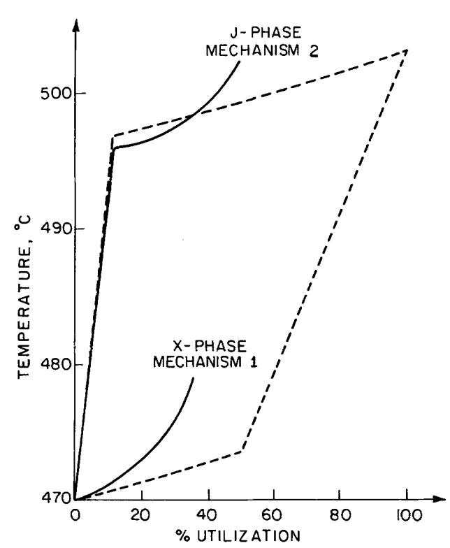
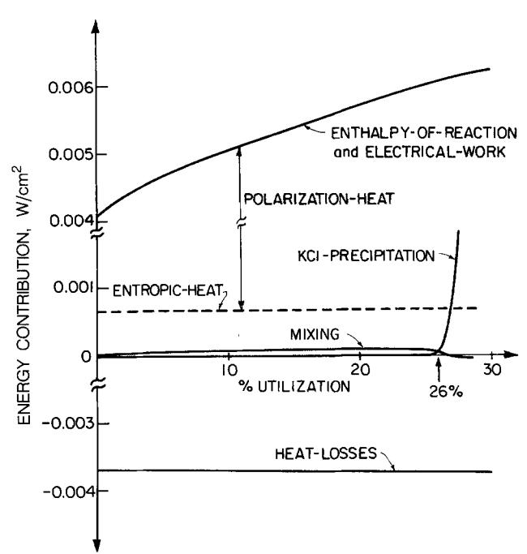

{0}------------------------------------------------

## A General Energy Balance for Battery Systems

To cite this article: D. Bernardi *et al* 1985 *J. Electrochem. Soc.* **132** 5

View the [article online](#) for updates and enhancements.


### ECS Membership = Connection

#### ECS membership connects you to the electrochemical community:

- • Facilitate your research and discovery through ECS meetings which convene scientists from around the world;
- • Access professional support through your lifetime career;
- • Open up mentorship opportunities across the stages of your career;
- • Build relationships that nurture partnership, teamwork—and success!


{1}------------------------------------------------

tity. Fabrication and sampling methods have no significant effect on any of the performance parameters measured. The geometric area of an electrode also shows a null effect. However, if the area is excessively reduced, a detrimental effect will result. Based on our results, mix repeatability, mix uniformity, and cell assembly are the areas in which improvements can be made for more consistent test results. Factors like uniformities of CP<sub>2</sub>, cathode mix and electrode in both composition and morphology, good electrical contact in the cell, and thorough wetting of the electrode would likely yield a significant improvement. Indeed, we have made progress along these lines and have now been able to reduce the standard deviation of V<sub>i</sub> to below 10 mV.

#### Acknowledgments

The authors thank Acheson Colloid and RAI Research Corporation for their respective gifts, the Electrodag® and the initial Permion® A-1260 separator.

Manuscript submitted July 5, 1984; revised manuscript received Sept. 11, 1984. This was Paper 3 presented at the San Francisco, California, Meeting of the Society, May 8-13, 1983.

*Allied Corporation assisted in meeting the publication costs of this article.*

#### REFERENCES

1. 1. N. Watanabe and M. Fukuda, U.S. Pat. 3,536,532 (1970).
2. 2. H. F. Hunter and G. J. Heymach, *This Journal*, **120**, 1161 (1973).
3. 3. R. G. Hunter, in "Power Sources 5," D. H. Collins, Editor, *The Energy Technology Press* (1981).
4. 4. A. Morita, T. Iijima, T. Fujii, and H. Ogawa, *J. Power Sources*, **5**, 111 (1980).
5. 5. N. Watanabe, M. Endo, and K. Ueno, *Solid State Ionics*, **1**, 501 (1980).
6. 6. M. Fukuda and T. Iijima, 12th Symposium on Batteries, Japan (1971).
7. 7. C. A. Hicks, *Ind. Quality Control*, **12**, 1 (1956).
8. 8. W. J. Dixon, Editor, "BMDP Statistical Software," University of California Press (1981).
9. 9. T. A. Ryan, B. L. Joiner, and B. F. Ryan, "MINITAB Reference Manual," (1982).
10. 10. R. D. Snee, *J. Quality Technol.*, **15**, 76 (1983).
11. 11. F. L. Carly, "Electrochemical energy balance to a mathematical equation of California Press (1981)."
12. 12. E. P. Box, W. G. Hunter, and J. S. Hunter, "Statistics For Experimenters," John Wiley & Sons, New York (1978).
13. 13. P. I. Feder, *J. Quality Technol.*, **6**, 98 (1974).

## A General Energy Balance for Battery Systems

D. Bernardi,\*\* E. Pawlikowski,\* and J. Newman\*

*Department of Chemical Engineering, University of California, Berkeley, California 94720*

#### ABSTRACT

A general energy balance for battery systems has been developed. This equation is useful for estimating cell thermal characteristics. Reliable predictions of cell temperature and heat-generation rate are required for the design and thermal management of battery systems. The temperature of a cell changes as a result of electrochemical reactions, phase changes, mixing effects, and joule heating. The equation developed incorporates these effects in a complete and general manner. Simplifications and special cases are discussed. The temperature of the energy balance to a mathematical model of the LiAlPbS cell discharged through two different reaction mechanisms are given as examples. The examples illustrate how the energy equation may be applied to a specific system to examine the relative contributions corresponding to the terms in the equation. The examples show that the processes involved in cell heat generation may be complex and that the application of a sufficiently general energy equation is advantageous.

Energy balance calculations are required for the design and thermal management of battery systems. A proper cell energy balance will give reliable predictions of thermal characteristics such as heat generation and temperature-time profiles. In this work, we present a general energy-balance equation for battery systems. This equation includes energy contributions from mixing, phase changes, and simultaneous electrochemical reactions with composition-dependent open-circuit potentials. Such a thorough treatment has not appeared in the literature.

The problem of determining heat effects with simultaneous electrochemical reactions was first addressed by Sherfey and Brenner in 1958 (1). They presented an equation for the rate of thermal energy generation in terms of the current fraction, the entropy change, and the overpotential for each reaction. Later, Gross (2) presented essentially the same equation, but introduced a quantity called the enthalpy voltage for each reaction. The enthalpy voltage is the enthalpy of reaction per coulomb of charge, and it may be derived from the overpotential and the entropy change terms in Sherfey and Brenner's equation. These treatments are restricted in their application to cell reactions in which every reactant is present in a single, pure phase. Gibbard (3) discussed the calculation of thermodynamic properties of battery systems when some of the reactants are dissolved in solution; however, his treatment of the energy balance considers the case of a single reaction without mixing effects.

\*Electrochemical Society Active Member.

\*\*Electrochemical Society Student Member.

{2}------------------------------------------------

applying the energy balance to a mathematical model of the LiA1/LiC1-KC1/FeS cell are given as examples. The relative contributions corresponding to the terms in the equation are examined.

## **The Energy Balance**

In tiffs section, the general energy balance for a battery system will be derived. The temperature of the battery is assumed to be uniform throughout and changes with time to be determined by the following processes

- (1) reactions
- (2) changes in the heat capacity of the system
- (3) phase changes
- (4) mixing
- (5) electrical work
- (6) heat transfer with the surroundings A battery may be thought of as a composite of many discrete phases that are changing in energy content. It is assumed that these phases are interacting by way of electrochemical reactions, phase changes, and mixing processes. The first law of thermodynamics may be written as

$$\frac{dH_{\text{tot}}}{dt} = q - IV \quad [1]$$

where Htot is the sum of the enthalpies of the phases expressed as

$$H_{\text{lot}} = \sum_i \int_{v_i} \left[ \sum_i c_{i,j} \bar{H}_{i,j} \right] dv_j \quad [2]$$

and i and j denote the individual species and phase, respectively. The term q represents the rate of heat transfer with the surroundings, and *IV* is the electrical work. It is convenient to define an average composition for each of these phases and write *dHtot/dt* as

$$\frac{dH_{t0}}{dt} = \frac{d}{dt} \sum_j \sum_i \left[ n_{i,j} \bar{H}_{ij}^{avg} + \int_{v_j} c_{i,j} (\bar{H}_{i,j} - \bar{H}_{i,j}^{avg}) dv_j \right] \quad [3]$$

The first term on the right side of Eq. [3] represents the rate of change of the enthalpy of the cell when all species are present at their average composition. The second term is a correction accounting for composition variations. In the development that follows, the first term in Eq. [3] will be split into three separate terms. Applying the product rule for differentiation and recalling that

$$\left( \frac{\partial \bar{H}_{ij}^{avg}}{\partial T} \right)_p = \bar{C}_{p_{ij}}^{avg} \quad [4]$$

we obtain

$$\sum_j \sum_i \frac{d}{dt} (n_{i,j} \bar{H}_{i,j}^{\text{avg}}) = \sum_j \sum_i \left[ n_{i,j} \bar{C}_{p_{i,j}}^{\text{avg}} \frac{dT}{dt} + \bar{H}_{i,j}^{\text{avg}} \frac{dn_{i,j}}{dt} \right] \quad [5]$$

for the first term in Eq. [3].

It is assumed that there are several simultaneous electrode reactions of the form

$$\sum s_{i,l} M_l^{z_i} = n_l e^- \quad [6]$$

occurring within the battery. The reactmns are written so that species i is always in phase m, having a certain secondary reference state. For example, in a LiC1-KC1 molten salt cell, all the electrode reactions are written so that the ionic lithium species is always present in the molten electrolyte phase and so that any precipitation of LiC1 is accounted for separately.

A species balance may be written as

$$\frac{dn_{i,m}}{dt} = \sum_i \frac{s_{i,l} I_l}{n_l \mathbf{F}} - \sum_{j,j \neq m} \frac{dn_{i,j}}{dt} \quad [7]$$

The first term on the right side of Eq. [7] represents the amount ofi that is produced or consumed by electrode reactions. The partial current, 11, is positive for a cathodic

reaction and negative for an anodic reaction. The second term accounts for phase changes such as the LiCl precipitation mentioned above. Integration of Eq. [7] yields

$$n_{i,m} = n_{i,m}^0 - \sum_{j,j \neq m} (n_{i,j} - n_{i,j}^0) + \sum_l \frac{s_{l,l}}{n_l \mathbf{F}} \int_0^l l_l dt \quad [8]$$

We may express partial molar enthalpies in the form

$$\bar{H}_{i,m}^{\text{avg}} = H_{i,m}^0 - RT^2 \frac{d}{dT} \ln(a_{i,m}^{\text{avg}}) \quad [9]$$

The theoretical open-circuit potential for reaction 1 at the average composition, relative to a reference electrode of a given kind, is given by

$$U_{i,\text{avg}} = U_i^o - U_{\text{RE}}^o + \frac{RT}{n_{\text{RE}}\mathbf{F}} \sum_i s_{i,\text{RE}} \ln(a_i^{\text{RE}}) - \frac{RT}{n_i\mathbf{F}} \sum_i s_{i,l} \ln(a_{i,m}^{\text{avg}}) \quad [10]$$

By utilizing the Gibbs-Helmholtz relation for each reaction, we may write the standard reaction enthalpy in terms of the standard cell potential

$$\sum_i \frac{s_{i,1}}{n_i F} H_{i,m}^0 = T^2 \frac{d}{dT} \left( \frac{U_i^0}{T} \right) \quad [11]$$

Looking at Eq. [5] and [7], we can see that the contribution to the rate of enthalpy change associated with the electrode reactions may be written as

$$\sum_m \sum_j \overline{H}_{i,m}^{\text{avg}} \sum_l \frac{S_{i,l} I_l}{n_l \mathbf{F}} = \sum_m \sum_l \frac{I_l}{n_l \mathbf{F}} \sum_j \overline{H}_{i,m}^{\text{avg}} S_{i,l} \quad [12]$$

Using Eq. [9] and [11], we may write this contribution in terms of the electrode reaction potentials

$${\sum}_{m} \sum_{i} \frac{I_i}{n_i \mathbf{F}} \sum_{j} ar{H}_{i,m}^{\text{avg} S_{i,j}} = \sum_{j} I_i \left[ T^2 \frac{\frac{d U_i^o}{T}}{\frac{d T}{d T}} - \frac{R T^2}{n_i \mathbf{F}} \sum_{j} \frac{d}{d T} \ln (a_{i,m}^{\text{avg}}) s_{i,j}^{\text{avg}} \right] \quad [13]$$

Using Eq. [10], we may write Eq. [13] in terms of the theoretical open-circuit potentials relative to a reference electrode of a given kind as

$$\sum_i I_1 \sum_m \sum_i \frac{\bar{H}_{i,m}^{\text{avg}_{S_{1,l}}}}{n_i \mathbf{F}} = \sum_i I_1 \left[ T^2 \frac{d \frac{U_{i,\text{avg}}}{T}}{dT} \right] \quad [14]$$

The quantity multiplying I~ on the right and left sides of Eq. [14] is sometimes termed the enthalpy voltage of reaction I.

Substitution of Eq. [7], [8], and [14] into Eq. [5] and placing this result into Eq. [3] results in the final form for *dHtot/dt.* Equating this to *q - IV* (Eq. [1]) gives the following form for the energy-balance equation

**Table I. Model discharge mechanisms in the FeS electrode** 

| Reaction Mechanism 1 (X-phase intermediate)                                                                                                  | \$a_{p} [	ext{V}]\$ | \$b_{l} ullet I^{o'}sa IV/K\$ |
|----------------------------------------------------------------------------------------------------------------------------------------------|---------------------|--------------------------------|
| 1) \$2	ext{FeS} + 2	ext{Li} + 2e^{-} 
ightarrow 	ext{LiFeS} + 	ext{Fe}\$                                                                     | 1.367               | -0.022                         |
| 2) \$	ext{LiFeS}_{..} + 2	ext{LP} + 2e^{-} 
ightarrow 2	ext{Li}_2	ext{S} + 	ext{Fe}\$ Mechanism 2 (J-phase intermediate)                     | 1.454               | -0.178                         |
| 3) \$2^{6}	ext{FeS} + 	ext{LP} + 	ext{C}_{1} + 6	ext{K}^{-} + 6e^{-} 
ightarrow 	ext{LiKFe}_{4}	ext{S}:, 	ext{C}_{1} + 2	ext{Fe}\$ (J-phase) | 1.955               | -0.680                         |
| 4) \$	ext{J} + 5^{1}	ext{Li}^{-} + 4e^{-} 
ightarrow 2^{6}	ext{LiS} + 2^{4}	ext{Fe} + 6	ext{K}^{+} + 	ext{C}_{1}^{-}\$                       | 1.440               | -0.024                         |

<sup>~&#</sup>x27;a, and b, were obtained from Ref. (13).

{3}------------------------------------------------

$$q - IV =$$

The provided html correctly represents the image content and uses appropriate LaTeX formatting within the required math tags. The use of `egin{aligned}` is suitable for displaying a multi-line equation with aligned terms, and the labeling [15] is included outside the math environment.

where

and

$$\Delta C_{p|} \equiv \sum_i s_{i,l} \bar{C}_{p_{i,m}}^{\text{avg}} \quad [16]$$

$$\Delta H^0_{ij\rightarrow m} \equiv H^0_{i,m} - H^0_{i,j} \quad [17]$$

It should be recognized that all the composition dependence of Eq. [15] may be expressed in terms of activity coefficients (aij = x~.ff~j). This is a reflection of the fact that the composition dependence of any thermodynamic quantity is completely determined if the activity coefficient behavior of the species is known. This analysis does not include enthalpy changes associated with nonfaradaic reactions. However, reactions such as serf-discharge or corrosion may be divided into anodic and cathodic components and included in the enthalpy-of-reaction term (other reactions must be accounted for and included as an additional term). Also, the heat capacities of the battery support materials should be understood to be included in Eq. [15]. Actually, in most practical applications, the heat capacity of a battery module does not change substantially during operation. In such cases, the heat-capacity term may be replaced by some average value. Also, the rate of heat transfer q between the battery and surroundings may be expressed as

$$q = -hA(T - T_A) \quad [18]$$

where the heat-transfer coefficient h is based on separator area and is estimated from the heat losses for a battery module.

As an example of how Eq. [15] may be used, let us apply it to the LiAYLiC1-KC]/FeS battery. We shall assume that any number of reactions may be occurring and that all the reacting phases are pure except the electrolyte. The molten LiC1-KC1 electrolyte phase is considered to be a solution of varying composition throughout the battery. The species present are the Li +, K § and C1- in the electrolyte and those corresponding to the pure reacting phases. The open-circuit-potential data are considered to be given at the eutectic composition of the electrolyte as a reference condition and to be of the form *U~.eut = al + biT.* All the electrode reaction potentials are given relative to the twophase (a, /3) LiAl-alloy reference electrode. It is convenient that this is also the negative electrode material. We may relate Ul.eut to Ul,avg by

$$U_{ ext{l,avg}} = U_{ ext{l,eut}} - \frac{RT}{\mathbf{F}} \ln \left[ \left[ \frac{a_{ ext{LiCl}}^{ ext{avg}}}{a_{ ext{LiCl}}^{ ext{eut}}} \right]^{\frac{S_{ ext{Li}^+, ext{i}}}{n_{ ext{l}}}} \right] \left[ \frac{a_{ ext{LiCl}}^{ ext{avg}}}{a_{ ext{LiCl}}^{ ext{eut}}} \right]^{\frac{-S_{ ext{Li}^+, ext{RE}}}{n_{ ext{RE}}}} \left[ \frac{a_{ ext{KCl}}^{ ext{avg}}}{a_{ ext{KCl}}^{ ext{eut}}} \right]^{\frac{S_{ ext{K}^+, ext{i}}}{n_{ ext{l}}}} \right] \quad [19]$$

The resulting equation will allow for precipitation of pure LiC1 and pure KC] solid phases. With the above considerations, Eq. [15] becomes

$$\begin{aligned} MC_p^m \frac{dT}{dt} &= -hA(T - T_A) - IV \\ &+ \sum_i I_i \left[ a_i + \frac{RT^2}{\mathbf{F}} \frac{d}{dT} \ln \left[ \left( \frac{\gamma_{\text{LiCl}^{\text{avg}}}}{\gamma_{\text{LiCl}^{\text{eut}}}} \right)^{\frac{S_{\text{Li}^{*,j}}}{n_i}} \right. \right. \\ &\left. \left. \left( \frac{\gamma_{\text{LiCl}^{\text{avg}}}}{\gamma_{\text{LiCl}^{\text{eut}}}} \right)^{\frac{-S_{\text{Li}^{*,\text{RE}}}}{n_{\text{RE}}}} \left( \frac{\gamma_{\text{KCl}^{\text{avg}}}}{\gamma_{\text{KCl}^{\text{eut}}}} \right)^{\frac{S_{\text{K}^{*,l}}}{n_1}} \right] \right) \right] \\ &+ \frac{d}{dt} \int_v \epsilon RT^2 \left[ c_{\text{LiCl}} \frac{\partial}{\partial T} \ln \left( \frac{\gamma_{\text{LiCl}}}{\gamma_{\text{LiCl}^{\text{avg}}}} \right) \right. \\ &+ \left. c_{\text{KCl}} \frac{\partial}{\partial T} \ln \left( \frac{\gamma_{\text{KCl}}}{\gamma_{\text{KCl}^{\text{avg}}}} \right) \right] dv - \frac{dn_{\text{LiCls}}}{dt} \left[ \Delta H^0_{\text{LiClF}} \right. \\ &\left. + RT^2 \frac{d \ln \gamma_{\text{LiCl}^{\text{avg}}}}{dT} \right] - \frac{dn_{\text{KCls}}}{dt} \\ &\left[ \Delta H^0_{\text{KClF}} + RT^2 \frac{d \ln \gamma_{\text{KCl}^{\text{avg}}}}{dT} \right] \end{aligned} \quad [20]$$

where *dnuclldt* and *dnKcls/dt* are the crystallization rates of solid LiC1 and KC1 phases, respectively. There is a considerable amount of simplification involved in going from Eq. [15] to Eq. [20]. For example, the ionic activity coefficients, ionic concentrations, and ionic partial molar enthalpies have been combined into neutral combinations that refer to undissociated LiC1 and KC1. If the electrolytes were considered to be completely dissociated, then Eq. [15] could be rearranged to contain mean ionic activity coefficients (neutral combinations of individual ionic activity coefficients).

In the next section, each of the terms in Eq. [15] will be discussed. Afterwards, Eq. [20] will be applied more specifically to the LiA1/FeS cell.

### **Discussion of Terms**

*Enthalpy-of-reaction.--If* we use an average heat capacity and do not consider enthalpy-of-mixing and phasechange terms, then Eq. [15] may be written as

$$q = IV + \sum_1^n I_1 \left[ T^2 d \frac{U_{1,\text{avg}}}{T} + MC_p^m \frac{dT}{dt} \right] \quad [21]$$

During discharge, the chemical energy of the cell is directly converted into work in the form of electricity. The work that the cell delivers is maximum when the cell **op-**  

{4}------------------------------------------------

crates reversibly. This reversible work, expressed as a rate, can be written as

$$IV_{\text{rev}} = \sum_1 I_1 [U_{1,\text{avg}}] \quad [22]$$

and is tucked into the enthalpy-of-reaction term. The difference between V~ and V is the cell overpotential. The overpotential is indicative of irreversibilities such as ohmic losses, charge-transfer overpotentials, and masstransfer limitations. The overpotential multiplied by the current is termed the polarization heat and is composed of the joule heating within the battery, as well as the energy dissipated in electrode overpotentials.

Also housed in this enthalpy-of-reaction term is the entropic-heat

$$q_{\text{rev}} = - \sum_I I_I \left[ T \frac{d(U_{I,\text{avg}})}{dT} \right] \quad [23]$$

Equations [22] and [23] represent the power and the heat generation that accompany reversible isothermal cell operation, respectively. The reversible work is related to the change in Gibbs function of the cell's contents. The entropic-heat is related to the entropy change. We may write Eq. [21] in terms of these contributions as

$$q = \left[ IV - \sum_i I_i U_{i,\text{avg}} \right] + \sum_i I_i T_d \frac{U_{i,\text{avg}}}{\partial T} + MC_p^m \frac{dT}{dt} \quad [24]$$

Equations [22] and [23] have allowed the enthalpy-ofreaction and electrical work terms in Eq. [21] to be combined and restated as irreversible and reversible heat effects. This form is most convenient when dealing with reversible conditions because the polarization heat, IV -- E Ii[Ui,avg ] is zero ir~ that case. Furthermore, Eq. [24] l

is the form of the energy balance that is most commonly encountered in the literature. The composition dependence of the open-circuit potential is contained in U~.~g (see Eq. [10]). The original form (Eq. [21]) has an advantage in that a strong composition dependence of the two terms separately may partially cancel in the enthalpy voltage. Also, if the open-circuit potentials U,,~vg are independent of composition and linearly related to temperature, then the enthalpy-of-reaction term becomes

can be shown that the integral in the mixing term may be minimized if the average concentration is defined as

$$c_1^{\text{avg}} = \frac{\int_v c_1 dv}{\int_v dv} \text{ or } x_1^{\text{avg}} = \frac{\int_v cx_1 dv}{\int_v cdv} \quad [26]$$

where

$$c = c_1 + c_2$$

This will be shown as follows. For a binary system, the integral in the mixing term in Eq. [15] may be written as

$$\int_v c [H - (x_1 \bar{H}_1^{\text{avg}} + x_2 \bar{H}_2^{\text{avg}})] dv \quad [27]$$

where the molar enthalpy is defined as

$$H = x_1 \overline{H}_1 + x_2 \overline{H}_2$$

and Hi ~v~ is the partial molar enthalpy of species i at the average composition. It should be recognized that in this development it is assumed that the spatial variation of composition is fixed and that Eq. [27] is only a function of x~ ~. By writing the mixing integral in this form, we may obtain a clearer interpretation of the mixing term. The sum subtracted from H is the tangent line to the enthalpy-vs.-composition (H - x,) plot at the average composition. The integral may be considered to be a measure of the ability to approximate the H curve with a tangent, in the range of composition variation throughout the cell. Therefore, if the enthalpy curve is linear in this range, then H~ and H~ are independent of composition, and the integral is zero regardless of the value of x~ ~g. Also, if the activity coefficients are independent of temperature (see Eq. [9]), then mixing effects can be ignored. Different choices of the tangent, corresponding to different values of the average composition may give better or worse approximations of the enthalpy curve. Equation [27] may be minimized with respect to the average composition by solving the following equation for x? ~'~

$$\frac{d}{dx_1^{\text{avg}}} \left[ \int_v c(x_1 \bar{H}_1^{\text{avg}} + x_2 \bar{H}_2^{\text{avg}}) dv \right] = 0 \quad [28]$$

In formulating Eq. [28], it was recognized that the composition profiles and enthalpy curve are independent of the choice of x~ a~. We may further simplify Eq. [28] and write

$$- \sum_1^{-\infty} I_1 a_1 \quad [25]$$

Notice that the temperature coefficients, b~, are not needed and that the enthalpy voltage of reaction 1 is -a~.

*Enthalpy-of-mixing.--The* enthalpy-of-mixing term represents the heat effects associated with generation or relaxation of concentration profiles. For example, if we do not consider phase-change terms, then this term represents the rate of heat generation after current interruption of cell operation. First, the definition of the average composition will be discussed. Later, an estimate of the adiabatic temperature rise due to relaxation of concentration profiles in a lead-acid cell after full discharge will be made.

The enthalpy-of-mixing term is the only term in Eq. [15] that is dependent on the spatial variation of composition. This term may be thought of as a correction because the other terms depend only on the average composition. The term is difficult to treat because it involves integrations of concentration profiles. Consequently, it is instructive to discuss the conditions under which it may be neglected. The definition of the average composition of species i is arbitrary. Therefore, if mixing effects are to be neglected, then the average composition should be chosen such that the value of this neglected term is minimized. For a binary phase, with components 1 and 2, it

$$\int_v c_1 dv \frac{d\bar{H}_1^{\text{avg}}}{dx_1^{\text{avg}}} + \int_v c_2 dv \frac{d\bar{H}_2^{\text{avg}}}{dx_1^{\text{avg}}} = 0 \quad [29]$$

The Gibbs-Duhem equation

$$x_1^{\text{avg}} \frac{d\bar{H}_1^{\text{avg}}}{dx_1^{\text{avg}}} + x_2^{\text{avg}} \frac{d\bar{H}_2^{\text{avg}}}{dx_1^{\text{avg}}} = 0 \quad [30]$$

may be applied, and Eq. [29] may be solved for x? 'v~ as given in Eq. [26]. The corresponding development for multicomponent mixtures is given in Appendix A. Equation [26] is guaranteed to be the choice of the average composition that will minimize Eq. [27] only if the integral has simple behavior. The behavior is said to be simple if the second derivative of the integral is nonzero for all possible values of x?/v~ (in range of concentration variation throughout the cell). For example, if the integral has a point of inflection such that its value may be either positive or negative depending upon x? 'v~, then x~ ~'~ may be chosen so that the integral is zero. In this case, the best choice of the x? 'v~ is not necessarily defined by Eq. [26]. Regardless of the behavior of the integral, Eq. [26] is the most convenient definition of the average composition. It has physical significance, and it is usually a simple function of state-of-charge. It is the final uniform composition of a concentration profile that is allowed to relax, and the energy effect associated with this process, in this case, is

{5}------------------------------------------------

proportional to the value of the integral for the initial profile.

It is useful to examine further the sign of the integral. The sign of Eq. [27] will indicate such things as whether mixing effects will tend to heat or cool a cell during operation. It is convenient now to look at Eq. [27] as a function of the mixing behavior and assume that the average composition in it is fixed. Equation [27] will be positive if

$$H > (x_1 \bar{H}_1^{\text{avg}} + x_2 \bar{H}_2^{\text{avg}}) \quad [31]$$

The right side of Eq. [31] is linear in x, If Eq. [31] is differentiated twice with respect to x, we obtain

$$\frac{d^2 H}{dx_1^2} > 0 \quad [32]$$

In other words, if in the range of concentration variation throughout the cell the enthalpy curve is always concave upward, then the integral will be positive. Conversely, the integral will be negative if the enthalpy curve is everywhere concave downward. For example, in the lead-acid cell, the sulfuric acid-water system has an enthalpy curve that is always concave upward. Consequently, the temperature of a well-insulated lead-acid cell will always increase after current interruption during operation due to relaxation of concentration profiles. To illustrate this, in Appendix A, Eq. [15] is used to estimate this temperature rise. The temperature rise, after full discharge, is approximately 1.6 K. It is also important to investigate the consequence of neglecting mixing effects in thermal calculations. For the lead-acid cell, the temperature during operation (generation of concentration profiles) is overestimated if calculations are made by neglecting the mixing term. The situation is reversed for a high-temperature cell employing LiC1-KC1 electrolyte. In the range of concentration variation throughout this cell, the enthalpy curve is always concave downward and the cell temperature will decrease due to mixing effects after current interruption. Calculations that neglect mixing will give underestinations of temperature when concentration profiles are being generated (during cell operation). This will be investigated in greater detail later.

If the enthalpy curve, in the range of composition variation, may be concave upward or concave downward, then the sign of the integral depends on the choice of the average composition. Certain associated systems, such as ethanol and water, exhibit inflection points in their enthalpy curves.

*Phase-change terms.--In* the enthalpy-of-reaction term of Eq. [15], all the reactions have species i in the same phase m. For example, in Eq. [20], LiC1 is always Present as a molten LiC1-KC1 solution phase in all reactions. However, one of the phases present in the cell during operation may be pure solid LiC1. The purpose of the phasechange terms is to account for the enthalpy change due to crystallization of this solid phase. For example, ice crystals form during low temperature operation of aqueous batteries, and an energy balance such as Eq. [23] would not correctly predict cell temperatures. If the m phase types in the enthalpy-of-reaction contribution (Eq. [15]) are the only phases present in the cell during operation, then the phase-change terms are zero.

*Heat-capacity.--The* quantities to the right of *dT/dt* in the heat-capacity term of Eq. [15] represent the heat capacity of the cell. This heat capacity changes with time because the composition of the cell changes due to electrochemical reactions and phase changes. The first part of this heat capacity represents the initial heat capacity of the cell's reactive material. The heat capacity of the cell's inert supporting material should be included in this part. The second and third parts account for changes in the initial heat capacity as a result of electrochemical reactions and phase changes, respectively.

As mentioned earlier, the total heat capacity of a typical cell (including supporting material) is approximately constant so that this term usually reduces to a simple expression.

# **Description of Examples**

The results of applying Eq. [15] to the existing model of the LiA1/LiC1, KCl/FeS cell will be given. The purpose of these examples is to illustrate how the energy-balance equation may be applied to a specific system and to examine the relative contributions corresponding to the terms in this equation. The use of Eq. [15] is best illustrated by application to a mathematical model of a battery in which concentration profiles can be used to calculate energy contributions from mixing, and current fractions can be used to calculate energy contributions from simultaneous reactions. This model was originally developed by Pollard and Newman in 1981, and the details of the theoretical analysis are given in their publications (10, 11). The model gives the galvanostatic discharge behavior of a one-dimensional cell sandwich consisting of a-porous LiA1 negative electrode, porous FeS positive electrode, electrolyte reservoir, and separator. The model simulates the discharge processes in the positive by the two simultaneously occurring reactions given as mechanism 1 in Table I. Pawlikowski (12) in 1982 developed a mode] of the cell with mechanism 2 as the positive electrode discharge reactions. Mechanisms 1 and 2 yield the same overall reaction and differ mainly in the intermediate phase (X-phase or J-phase).

The electrochemistry of the FeS electrode is reasonably well understood. The actual discharge processes are complicated and are more like a mixture of the two proposed mechanisms along with simultaneously occurring chemical reactions. There is evidence, however, for the simple 2-reaction mechanisms under certain operating conditions (13). In practice, batteries are operated between 400 ~ and 500~ Higher operating temperatures and LiC1 concentrations tend to favor mechanism 1. Lower temperatures and LiC1 concentrations favor mechanism 2. Discharge through the X-phase intermediate is preferred because of the poor reversibility of the J-phase reactions. For purposes of comparison, the simulations of the two mechanisms will use the same initial temperature and electrolyte composition.

The model discharges are meant to simulate a wellinsulated (but not adiabatic) battery operating in an ambient temperature environment with no external heating. The relevant input data and energy equation specific to each mechanism are given in Appendix B.

### **Results**

Figure 1 gives the cell temperature as a function of utilization for both mechanisms. The dashed lines show the temperature profile for adiabatic and reversible discharge. Under these conditions the two mechanisms yield the same temperature at 100% depth of discharge because the overall reaction is the same. In both cases, the reactions are exothermic, so that the cell temperature increases throughout discharge. Though the adiabaticreversible profile of mechanism 1 appears linear, there is actually a slight amount of curvature, due to the logarithmic dependence of the cell temperature. The composition dependencies associated with the J-phase reactions result in the more discernible curvature of each portion of the adiabatic-reversible profile of mechanism 2. The criterion of reversibility allows the stoichiometry of the reactions to yield the discontinuities in slope located at 50% and 12% for mechanism 1 and mechanism 2, respectively. For example, with mechanism 1 up to 50% utilization, only reaction 1 occurs, and after this point reaction 2 occurs. The dashed curve in Fig. 2 is the heat generation rate for reaction 1. It is approximately constant because the temperature is not changing substantially, and this is responsible for the apparent linearity in Fig. 1. With the J-phase reactions, the stoichiometry dictates that the transition from reaction 3 to reaction 4 occurs at 12% utilization.

It is interesting to compare these results to the results of the more realistic simulations. The solid lines in Fig. 1 are the results of the mathematical\_ models. The relevant input data and energy equation specific to each mecha-

{6}------------------------------------------------



**Fig 1. Cell temperature as a function of utilization for mechanisms 1 and 2. The dashed lines are for adiabatic-reversible discharge. The solid lines are the results of the mathematical model simulations. Cutoff voltages of 1.2 and 1.0V were used for mechanisms 1 and 2, respectively.** 

nism are given in Appendix B. In these simulations, the irreversibilities associated with ohmic losses, migration effects, mass-transfer, and charge-transfer overpotentials cause electrode polarization. The onset of the second reaction of each mechanism may occur before the prediction based on reversibility, because of the resulting potential distribution in the porous, positive electrode. Compared to the values of 50% and 12% utilization, the second reaction begins at 30% and 11% utilization for mechanisms 1 and 2, respectively. At these operating conditions, the reaction potential difference *U3,avg - U4,avg* for the J-phase mechanism is always about four times larger than the difference Ul.avg - U.\_,,,.~ for the X-phase mechanism. We see that the onset of the second reaction occurs closer to the reversible prediction in the case of the J-phase mechanism because a larger positive electrode polarization is required to promote the onset of the second reaction as compared with the X-phase mechanism.

The solid lines in Fig. 2 are plots of the terms in Eq. [B-l] as functions of utilization for the X-phase mechanism up to 30% utilization. The dashed line in Fig. 2 is called the entropic-heat and has the value of *-ilb~T.* It would be the only term on the right side of Eq. [B-l] if the equation were written for the adiabatic-reversible case. The polarization heat, *i~(U,,~ - V),* and the entropic heat add up to the enthalpy-of-reaction and electrical-work term. The heat-loss contribution does not change markedly because the cell is well insulated and the overall cell temperature does not change substantially. The profile for the X-phase mechanism in Fig. 1 follows the adiabatic-reversible profile up to about 5% utilization because the heat-loss contribution tends to cancel the polarization heat. The polarization heat is mainly responsible for the increasing departure of the cell temperature from the reversible case throughout discharge. With increasing utilization, the polarization heat increases because the opencircuit potential (U~,,v,) is approximately constant and the cell voltage drops.

These results can be contrasted to the results with the J-phase mechanism from 0% to 11% utilization. The average LiC1 concentration increases, and the composition de-



**Fig. 2. Terms comprising the energy balance for a LiAI/FeS cell [Eq. B-l] as a function of utilization.** 

pendent U3,avg decreases accordingly (Eq. [19]). Actually, *U3,avg* decreases at about the same rate as the cell voltage, so that the polarization heat remains relatively constant. Up to about 5% utilization, the heat-loss term approximately cancels the polarization heat, and the temperature profile follows the adiabatic-reversible case. The cell temperature increases enough from 5% to 11% utilization so that the heat-loss term dominates, and the temperature remains below the adiabatic-reversible case. After 12% utilization, the heat losses and U4,,v~ stay approximately constant, so that the polarization heat dominates; by the time of 36% utilization, the profile lies above the adiabatic-reversible case.

Although the mixing term offers a negligible contribution to the energy balance, it is interesting to investigate the processes that determine its behavior. As we mentioned earlier, for the molten LiC1-KC1 system, the value of the integral in Eq. [B-l] is always negative. Therefore, if the heat losses are made negligible, the cell temperature will decrease after current interruption. Prior to the onset of precipitation, this is entirely a mixing effect. At 25% utilization in Fig. 2, this temperature decline is only about 0.2 K. Before precipitation, the concentration of LiCI steadily decreases in the positive electrode and increases in the negative electrode, and the average composition, xucl avg = 0.58 (defined by Eq. [26]), is constant. The mixing term (the time derivative of the integral) also increases, and the cell temperature would be slightly underestimated if mixing effects were ignored. The concentration throughout the separator and reservoir volumes remains close to the average composition, so that their contributions to the integral are two orders of magnitude smaller than the contributions from integration through the electrodes. Figure 2 shows that the integral increases in magnitude to the point where the mixing term is zero (26.5% utilization). After this point, the mixing term is slightly negative, corresponding to a decrease in the magnitude of the integral with time. The mixing term decreases when KC1 precipitates because, in the region of precipitation, the electrolyte composition is approximately constant at its saturation value. Following the onset of precipitation, the adiabatic temperature decline after current interruption is determined by the more complex processes of simultaneous melting of KC1 and electrolyte mixing. We present the breakdown of contributions only up to 30% utilization, because when the second reaction begins simultaneously, reaction heat effects and

{7}------------------------------------------------

precipitation effects cause oscillatory behavior. The description and discussion of this phenomenon will be treated in a subsequent publication.

### **Conclusions**

The examples presented help to illustrate that the processes involved in cell heat generation may be complex and that the application of a sufficiently general energy equation is advantageous. Equation [23], written for a single cell reaction, is the energy equation most commonly used in battery applications. The use of this form of an energy balance is justified only if phase-change effects, mixing effects, and simultaneous reactions are not important. An energy equation including the effects mentioned above is, of course, most easily applied to modeling studies. However, applying an energy equation that includes the effects of simultaneous reactions to experimental measurements may help elucidate reaction mechanisms. For example, if heat generation rates and cell voltage measurements are made on LiA1/FeS cells under isothermal operating conditions, an energy equation may be fit to the experimental data to determine the current fractions of simultaneously occurring reactions. The experiments performed under truly isothermal conditions have the advantage that an estimate of the mean cell heat capacity is not required. However, if experimental cells are not kept isothermal, then heat capacity effects or the effects of nonuniform temperature may obscure the relationship of the experimental results to the energy balance.

The reversible-isothermal mode] is relatively easy to construct from knowledge of the stoichiometry of the probable cell reactions and the temperature dependence of their open-circuit potentials. The comparison of such a model with experimental results may also aid in the understanding of the system, just as the adiabatic-reversible model was used to aid in the interpretation of the simulation of the well-insulated cell in the examples. Regardless of the application, understanding the fundamental processes involved in cell heat generation will aid our ability to design and develop more efficient and reliable battery systems.

### **Acknowledgment**

This work was supported by the Assistant Secretary for Conservation and Renewable Energy, Office of Energy Systems Research, Energy Storage Division of the U. S. Department of Energy, under Contract no. DE-AC03- 76SF00098.

Manuscript submitted May 4, 1984; revised manuscript received Sept. 4, 1984.

*University of California assisted in meeting the publication costs of this article.* 

### APPENDIX A

### *Choice of the Average Composition for a Multicomponent System*

For a multicomponent phase, the integral in Eq. [15] may be written as

$$\int_v \sum_i cx_i (\bar{H}_i - \bar{H}_i^{\text{avg}}) dv \quad [\text{A-11}]$$

In this development, it will be assumed that Eq. [A-l] is only a function of the average composition and that the spatial variation of composition is fixed. If the molar enthalpy is defined as

$$H = \sum_i x_i \bar{H}_i \quad [\text{A-2}]$$

$$\int_v c[H - \sum_i x_i \bar{H}_i^{\text{avg}}] dv \quad [\text{A-3}]$$

to zero. Recognizing that the enthalpy is independent of the choice of the average composition, we may write

$$d \left[ \sum_i \int_v \bar{H}_i^{\text{avg}} \, cx_i dv \right] = \sum \left( \int_v cx_i dv \right) d\bar{H}_i^{\text{avg}} = 0 \quad [\text{A-4}]$$

If we multiply and divide each term in Eq. [A-4] by xy g

$$\sum_i \left[ \frac{\int_v cx_i dv}{x_i^{\text{avg}}} \right] x_i^{\text{avg}} d\bar{H}_j^{\text{avg}} = 0 \quad [\text{A-5}]$$

and compare this to the Gibbs-Duhem equation

$$\sum_i x_i^{\text{avg}} d\bar{H}_i^{\text{avg}} = 0 \quad [\text{A-6}]$$

we see that the bracketed quantity in Eq. [A-5] must be equal to a constant. This constant

$$K = \frac{\int_v c x_i dv}{x_i^{\text{avg}}} \quad [\text{A-7}]$$

must be independent of x1 avg in order to satisfy the Gibbs-Duhem equation. If we apply a mole fraction balance

$$\sum_i x_{i\text{avg}} = \frac{\sum_i \int_v c_i x_i dv}{K} = 1 \quad [\text{A-8}]$$

we may solve for this constant

$$K = \int c dv \quad [\text{A-9}]$$

Substituting this into Eq. [A-7], we obtain the final form for the average composition

$$x_i^{\text{avg}} = \frac{\int_v cx_i dv}{\int_v cdv} \quad [\text{A-10}]$$

Equation [A-10] is guaranteed to be the average composition that minimizes Eq. [A-l] only if its second'total differential is positive for all possible values of xi ~vg.

### *Estimate of the Temperature Rise in a Lead-Acid Cell Following Current Interruption*

Prior to discharge, the cell is assumed to have a uniform composition of 5 molal sulfuric acid. It is assumed that one-third of the electrolyte is contained in the cathode and anode spaces and that one-third is in the space between the electrodes. It is also assumed that during discharge the concentration of acid in the intermediate space remains unchanged and that the acid concentrations throughout the electrode compartments are uniform. Basing the discharge on two Faradays (1 tool PbO.\_,) and a transference number of 0.74 for hydrogen ion, we may calculate that the concentration in the cathode space and anode space drops to 1.04 and 2.79 molal, respectively (14). If we regard the cell as well-insulated, and if there are no phase changes (such as formation of ice crystals), Eq. [15] may be written as

$$1.15 \frac{dT}{dt} (n_{\text{PbSO}_4} C_{\text{PbPsO}_4} + n_1 \bar{C}_{\text{P}_1}^{\text{avg}} + n_2 \bar{C}_{\text{P}_2}^{\text{avg}}) = - \frac{d}{dt} \int_{\text{v}} c[H - (x_1 \bar{H}_1^{\text{avg}} + x_2 \bar{H}_2^{\text{avg}})] dv \quad [\text{A-11}]$$

In writing this equation, it is assumed that the heat capacity of the battery support material is 15% of the heat capacity of the reactive material. The integral on the right side is easy to evaluate in this case because the concentration is uniform and the volume is the same in each compartment. The average composition of acid, defined by Eq. [26], is 2.95 molal. As mentioned earlier, this is the

{8}------------------------------------------------

final uniform concentration after relaxation, and the temperature rise is proportional to the value of the integral when the current is interrupted (8630J or 6.5 J/g of electrolyte). Using the data available in Ref. (14) (for 298 K), we calculate the temperature rise to be about 1.6 K (if we allow 1.25 mol of PbO<sub>2</sub> for discharge, the concentrations in the cathode and anode space drop to 0.05 and 2.23 mol/l, respectively, and the temperature rise is 2.9 K). We recognize that the assumed concentration jumps at the interfaces are artificial and that, realistically, diffusion tends to equalize the concentrations. The estimated temperature rise would be slightly lower if the above effect were taken into account. We must also, however, recognize the effects of nonuniform reaction distribution in porous electrodes and that this will tend to make the concentration distribution nonuniform. Reference (9) gives spatial distributions of concentration and reaction for a one-dimensional model of a lead-acid cell.

### APPENDIX B

#### Energy Equations for Model Studies

Mechanism 1 (the number subscripts refer to the reactions in Table I)

$$\frac{M}{A} C_p^m \frac{dT}{dt} = -h(T - T_s) \quad \text{heat-losses}$$

$$+ (i_1 a_1 + i_2 a_2) - V(i_1 + i_2) \quad \text{enthalpy-of-reaction}$$

$$+ \frac{d}{dt} \int_0^t \epsilon R \left[ c_{\text{lact}} T \ln \left( \frac{\gamma_{\text{lact}}}{\gamma_{\text{lact}^{\text{ext}}}} \right) \right] dy \quad \text{and electrical-work}$$

$$+ c_{\text{kcl}} T \ln \left( \frac{\gamma_{\text{kcl}}}{\gamma_{\text{kcl}^{\text{ext}}}} \right) dy \quad \text{mixing}$$

$$+ \frac{1}{A} \frac{dm_{\text{kcl}_2}}{dt} [\Delta H_{\text{kcl}_2} + RT \ln \gamma_{\text{kcl}^{\text{ext}}}]$$

KCl-precipitation [B-1]

Mechanism 2

The energy equation for mechanism 2 differs only in the enthalpy-of-reaction and electrical-work term, which may be written as

```html
$$+ (i_2 a_2 + i_1 a_1) - V(i_1 + i_2)$$

$$- i_1 \frac{RT}{F} imes \ln \left( \left( \frac{\gamma_{ ext{lact}}^{ ext{ext}}}{\gamma_{ ext{lact}}^{ ext{ext}}} \right)^{1/6} \left( \frac{\gamma_{ ext{kcl}}^{ ext{ext}}}{\gamma_{ ext{kcl}}^{ ext{ext}}} \right)^{-1} \right)$$

$$- i_2 \frac{RT}{F} \times \ln \left( \left( \frac{\gamma_{ ext{lact}}^{ ext{ext}}}{\gamma_{ ext{lact}}^{ ext{ext}}} \right)^{-1/6} \left( \frac{\gamma_{ ext{kcl}}^{ ext{ext}}}{\gamma_{ ext{kcl}}^{ ext{ext}}} \right)^{-1/23} \right)$$

Relevant Input Data

| Quantity                  | Value                                      | Quantity            | Value                     |
|---------------------------|--------------------------------------------|---------------------|---------------------------|
| $x^*_{\text{lact}}$       | 0.98 (eutectic)                            | $MC_p^m/A$          | 1.89 J/cm <sup>2</sup> ·K |
| $\Delta H^*_{\text{kcl}}$ | 26,530 J/mol                               | $i$                 | 0.0416 A/cm <sup>2</sup>  |
| $h$                       | $8.25 \times 10^{-4}$ W/cm <sup>2</sup> ·K | $T_s$               | 273.15 K                  |
| Capacity                  | 835.27 C/cm <sup>2</sup>                   | $e^*_{\text{lact}}$ | 0.555                     |

$$T \ln \gamma_{\text{lact}} = 723.15 (-0.52628x_{\text{lact}} - 1.2738x_{\text{lact}}^2 - 2.9783x_{\text{lact}}^3)$$

$$T \ln \gamma_{\text{kcl}} = 723.15 (-0.52628x_{\text{lact}} - 5.7413x_{\text{lact}}^2 + 2.9783x_{\text{lact}}^3 - 0.52628 \ln x_{\text{lact}})$$

### LIST OF SYMBOLS

- $a_{\text{lact}}$  activity of species i in phase j
- $a_{\text{kcl}}$  activity of species i in the reference electrode
- $A$  separator area, cm<sup>2</sup>
- $a_1$  constant in the expression for the open-circuit potential of reaction I, V
- $b_1$  temperature coefficient in the expression for the open-circuit potential of reaction I, V/K
- $c_{\text{lact}}$  concentration of species i in phase j, mol/cm<sup>3</sup>
- $C_{\text{kcl}}^m$  mean heat capacity at constant pressure, J/g·K
- $C_{\text{kcl}}^m$  partial mole constant pressure heat capacity of species i in phase j, J/mol·K
- $d_2$  differential volume element of phase j, cm<sup>3</sup>
- $g^-$  symbol for an electron

- $F$  Faraday's constant, 96,487 C/eq
- $h_{\text{ref}}$  heat transfer coefficient, W/cm<sup>2</sup>·K
- $h_{\text{well}}$  enthalpy, J
- $H_{\text{ref}}$  mole enthalpy, J/mol
- $I_1$  species i in the secondary reference state corresponding to phase m, J/mol
- $\bar{H}_{\text{lact}}$  partial mole enthalpy of species i in phase j, J/mol
- $i_1$  partial current density of electrode reaction I, A/cm<sup>2</sup>
- $i_2$  current, A
- $I_1$  partial current of electrode reaction I, A
- $C$  constant in Eq. [A-7], mol
- $L$  length of cell, cm
- $M$  mass of the cell, g
- $M_1$  symbol for the chemical formula of species i
- $n_1$  number of electrons involved in reaction I
- $n_2$  number of electrons involved in the reference electrode reaction
- $m_1$  mole of species i in phase j, moles
- $m_2$  heat-transfer rate, W
- $U_{\text{lact}}$  universal gas constant, 8.3143 J/mol·K
- $U_{\text{lact}}^{\text{electrode}}$  stoichiometric coefficient of species i in reaction I time, s
- $U_{\text{lact}}^{\text{electrode}}$  absolute temperature, K
- $U_{\text{lact}}^{\text{ref}}$  theoretical open-circuit potential for reaction I at the average composition relative to a reference electrode of a given kind, V
- $U_{\text{lact}}^{\text{electrode}}$  standard electrode potential for reaction I, V
- $V$  mole fraction of species i in phase j
- $V_1$  cell potential, V
- $V_2$  mole fraction of species i in phase j
- $V_3$  charge number of species i

### Greek

- $\epsilon$  porosity
- $\gamma_{\text{lact}}$  activity coefficient of species i in phase j

### Subscripts

- $A$  ambient
- $f$  heat of fusion
- $i$  refers to a species
- $j, m$  refer to phases
- $l$  refers to a reaction
- $rev$  reversible
- $RE$  reference electrode reaction
- $total$

### Superscripts

- $avg$  average
- $eut$  eutectic composition
- $m$  mean
- $o$  refers to secondary reference state or initial
- $RE$  reference electrode composition

### REFERENCES

1. 1. J. M. Sherfey and A. Brenner, *This Journal*, **105**, 665 (1956).
2. 2. S. Gross, *Energy Convers.*, **9**, 55 (1969).
3. 3. H. F. Gibbard, *This Journal*, **125**, 353 (1978).
4. 4. I. A. Dibrov and V. A. Bykov, *Sov. Electrochem.*, **13**, 298 (1979).
5. 5. I. A. Dibrov and V. A. Bykov, *J. Appl. Chem.*, **49**, 2025 (1977).
6. 6. L. D. Hansen and R. M. Hart, *This Journal*, **125**, 842 (1978).
7. 7. J. Dibrov, *ibid.*, **128**, 516 (1981).
8. 8. D. M. Hansen and H. F. Gibbard, *ibid.*, **130**, 1975 (1983).
9. 9. W. H. Tiedemann and J. Newman, in "Battery Design and Optimization," S. Gross, Editor, pp. 23-38, The Electrochemical Society Softbound Proceedings Series, Princeton, NJ (1979).
10. 10. Richard Pollard and John Newman, *This Journal*, **128**, 491 (1981).
11. 11. Richard Pollard and John Newman, *ibid.*, **128**, 502 (1981).
12. 12. E. Pawlikowski, Postdoctoral research, unpublished, Department of Chemical Engineering, University of California, Berkeley, CA (1982).
13. 13. Z. Tomczuk, S. K. Preto, and M. F. Roche, *This Journal*, **14**, 1 (1981).
14. 14. Hans Bode, "Lead-Acid Batteries," R. J. Brodd and K. V. Kordesch, Translators, Wiley-Interscience, New York (1977).