{0}------------------------------------------------

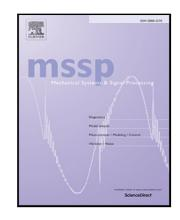

# Physics-informed machine learning for dry friction and backlash modeling in structural control systems

Daniel Coble a, Liang Cao b, Austin R.J. Downey a,c,\*, James M. Ricles b

# A R T I C L E I N F O

Communicated by X. Jing

#### *Keywords:*

Friction

Backlash

Machine learning

Physics-informed machine learning

Structural control

# A B S T R A C T

Modeling dry friction is a challenging task. Accurate models must incorporate hysteretic rise of force across displacement and non-linearity from the Stribeck effect. Though sufficiently accurate models have been proposed for simple friction systems where these two effects dominate, certain rotational friction systems introduce self-energizing and accompanying backlash effects. These systems are termed self-energizing systems. In these systems, the friction force is amplified by a mechanical advantage which is charged through motion and released during reversing the direction of travel. This produces energized and backlash regimes within which the friction device follows different dynamic behaviors. This paper examines self-energizing rotational friction, and proposes a combined physics and machine learning approach to produce a unified model for energized and backlash regimes. In this multi-process information fusion methodology, a classical LuGre friction model is augmented to allow state-dependent parameterization provided by a machine learning model. The method for training the model from experimental data is given, and demonstrated with a 20 kN banded rotary friction device used for structural control. Source code replicating the methodology is provided. Results demonstrate that the combined model is capable of reproducing the backlash effect and reduces error compared to the standard LuGre model by a cumulative 32.8%; in terms modeling the tested banded rotary friction device. In these experimental tests, realistic pre-defined displacements inputs are used to validate the damper. The output of the machine learning model is analyzed and found to align with the physical understanding of the banded rotary friction device.

### **1. Introduction**

Accurate friction modeling has remained an important but elusive goal in the field of control for applications areas such as robotics and structural control. For safety-critical or high-precision applications, model-predictive control laws are developed with integrated friction models, where the precision of movement is dependent on the accuracy of these models [[1\]](#page-16-0). Under these motivations, friction modeling has become a developed field with multiple models able to represent the experimentally observed characteristics of friction, such as the Stribeck effect and hysteretic phenomena [[2\]](#page-16-1).

The first dry friction model to capture both hysteresis and the Stribeck effect was the LuGre model, which was developed as an extension of the Dahl model to capture the Stribeck effect and viscous forces [[3\]](#page-16-2). Since then, the LuGre model has become one of the standard models to describe hysteretic friction. The name LuGre comes from a combination of the names of the cities

a *Department of Mechanical Engineering, University of South Carolina, Columbia, 29201, SC, USA*

b *Department of Civil and Environmental Engineering, Lehigh University, Bethlehem, 18015, PA, USA*

c *Department of Civil and Environmental Engineering, University of South Carolina, Columbia, 29201, SC, USA*

\* Corresponding author.

*E-mail address:* [austindowney@sc.edu](mailto:austindowney@sc.edu) (A.R.J. Downey).

{1}------------------------------------------------

where the authors' universities are. Although the LuGre model is effective at reproducing experimentally observed behavior, there has been persistent criticism in its physical realism. Criticisms have included its non-passivity in certain conditions and lack of an elastic domain [\[4,](#page-16-3)[5](#page-16-4)]. Regardless, the model has been a popular and effective choice for model-based compensation in actuator control [\[6–](#page-16-5)[8](#page-16-6)]. Relevant to this work, the LuGre model has been occasionally used as a starting point in the development of other dry friction models, such as in [[5](#page-16-4)[,6,](#page-16-5)[8–](#page-16-6)[10\]](#page-16-7). Multiple papers, including [[11–](#page-16-8)[13\]](#page-16-9), model backlash as an abrupt state-space transition. Such analyses benefit from theoretical work of piecewise linear differential equations, such as [[14–](#page-16-10)[16\]](#page-16-11) for stability of such systems.

The backlash effect has been noted in friction (specifically rotational systems), actuation (specifically gearing), and pneumatics. The system temporarily operates with different properties across a fixed displacement until re-engaging and resuming typical operation. Modeling and accounting for backlash in control schemes has been noted as a difficult problem to model in multiple domains of engineering. However, up to this point no friction models have been proposed which capture the backlash effect of dry friction. Often, backlash is considered a separate effect to friction [[17\]](#page-16-12), despite the fact analysis has shown backlash to be an inherent effect of rotational friction mechanisms [[11\]](#page-16-8).

Friction models have been categorized as 'white box', for entirely physics-based methods, 'grey box', for methods and 'black box', for those with no physics-derived structure [[18\]](#page-16-13). Another terminology would describe models as a spectrum between physicsinformed and data-driven methods. The study of modeling hysteretic systems is an area of active research, with recent research shifting from model-driven, to data-driven approaches [\[19](#page-16-14)].

The focus of white and gray box methods is parameter estimation for a chosen friction model. Multiple optimization methods have been proposed for parameter identification in the literature. Gradient-free methods include genetic algorithms, particle swarm, the Nelder–Mead simplex algorithm, and recursive least squares, Refs. [[20](#page-16-15)[–23](#page-16-16)] provide an example of each. Principally, machine learning approaches use gradient descent optimization, and so are most related to gradient-based parameter identification algorithms. Historically, it seems that gradient-based approaches have been less-favored as a method of parameter fitting, due to the issue of local minimization. However, gradient-based methods such as the Levenberg–Marquardt method [[24\]](#page-16-17) and a moving horizon filter [[25\]](#page-16-18) have been used with success.

Black box models are driven entirely by machine learning or regression models, and contain no physics-informed design. Modeling often uses recurrent neural networks (RNNs), or its derivatives such as long short-term memory (LSTM). Recurrent neural networks have been applied to friction modeling as early as 2007, with results having been found to be as good as gray box models [\[18](#page-16-13)]. Two major issues with black box models are: (1) the inability to extract relevant dynamical properties; and (2) the inability to produce assurances of model performance. Related to this is the 'out of domain' issue: that for black box models to be effective, training data must span the space of validation data. For control systems which are tested in a laboratory before being deployed, it may be hard to produce such a guarantee [[26\]](#page-17-0).

The topic of this paper is the multi-process information fusion of dry friction and backlash modeling through the integration of machine learning into friction modeling. By modifying the physics model to introduce state-dependent parameterization provided by an ML model, new phenomena not included in the physics model can be represented; in this case, the backlash effect. The approach, termed physics-informed machine learning (PIML or physics-ML) has the potential to retain beneficial features of the physics-informed model while improving generalizability and the fitting/parameterization process. The concept behind PIML is to design models with physics-informed components interacting with black box functions which may be found via machine learning. Physics-informed models are expected to generalize better than black-box ML models [\[27](#page-17-1)]. Integrating machine learning with physics models is also known to improve model interpretability/explainability [[28\]](#page-17-2).

PIML approaches have been a popular area of investigation for both general problems and in civil engineering [[26,](#page-17-0)[29\]](#page-17-3), with common results being that combined approaches produce more accurate results than physics models and generalize better than ML models. This paper develops the concept of ML parameterization. Leveraging the power of automatic differentiation, the ML model is trained to minimize the output of the physics model. In effect, this replaces the need for direct parameter measurements as labeled data for ML training. PIML is a large field, with as many as six methods approaches to combining physics-based and ML models having been identified. [[27\]](#page-17-1). Residual estimation is a technique where a black box model estimates error between experimental data and a physics-based model. In friction modeling, Pires et al. [[30\]](#page-17-4) used a linear autoregressive model for residual estimation as applied to drill string dynamics, de Sousa et al. [[31\]](#page-17-5) used an autoregressive neural network for residual estimation of a series elastic actuator, while Wang and Zhang [[32\]](#page-17-6) use LSTM for residual estimation for the error of a transfer function on a five-axis CNC machine. Residual estimation is a effective technique for improving model accuracy, however as the error reduction comes from a black box model, it does not improve explainability. Olejnik and Ayankoso [\[33](#page-17-7)] applied physics-informed neural networks (PINNs) to friction modeling, finding improved results over a white box model. In such approaches, PINNs use a physics-guided loss function, along with experimental data, to guide optimization of a neural network. As such, the trained model is, in architecture, a black-box model and no assurances can be given on its performance.

The goal of this paper to present a model with interaction between physics and ML components while retaining the constraints and explainability of the physics model. For validation, modeling is performed on two datasets. The first dataset is a numerical simulation with separated backlash and friction components. The second is an experimental dataset from dry friction structural damper characterization tests where a pronounced backlash effect exists [[11\]](#page-16-8). In a prior effort, the authors used long short-term memory, a type of recurrent neural network, and sensor signals to produce the time-dependent LuGre model parameter [[34\]](#page-17-8). That differs from the work presented here in that it required extraneous measurements of band tension, and used a more complex ML model, occluding the ability to analyze the ML model's adherence to physical realism.

{2}------------------------------------------------

The contributions of this paper are threefold. First, this paper introduces a general scheme for modeling structural dampers which captures common friction phenomena as well as backlash. Second, this paper fills a gap in the literature for the use of physics-informed machine learning for parameter prediction. Third, this paper discusses the use of physics-informed machine learning as a method for indirect parameter measurement, where ML can be used to measure physical and time-dependent constants from a dataset. Experimental data and a source code reproduction of the methodology are included as supplementary files to this work. Additionally, they and have been made available in public repositories [35,36].

## 2. Methodology and materials

This section presents background information on the augmented friction model, the numerical/experimental case studies, and the banded rotary friction device.

### 2.1. Physics-ML friction model

The governing equations for the canonical LuGre model are given in Eqs. (1)–(3).

$$\dot{z} = v - \sigma_0 \frac{|v|}{g(v)} z \quad (1)$$

$$F = \sigma_0 z + \sigma_1 \dot{z} + \sigma_2 v \quad (2)$$

$$g(v) = F_c + (F_s + F_c) \left( \frac{v}{s} \right)^2 \quad (3)$$

Where  $v$  is velocity at the interface,  $F_c$  and  $F_s$  are Coulomb and static friction,  $v_s$  is the characteristic Stribeck velocity, and  $\sigma_0$ ,  $\sigma_1$ , and  $\sigma_2$  are model parameters. It is useful to substitute Eq. (1) into Eq. (2) to remove  $\dot{z}$  in the force equation.

$$F(z, v) = \sigma_0 \left( 1 - \sigma_1 \frac{|v|}{g(v)} \right) z + (\sigma_1 + \sigma_2) v \quad (4)$$

This paper considers an augmented LuGre model which allows for smooth transition between friction regimes. This will be done by enhancing the parameter  $\sigma_0$  into a function dependent on state and velocity, but first it is productive to introduce the new model with state variable  $y = \sigma_0 z$ . In this form, the LuGre model is given by Eqs. (5) and (6).

$$\dot{y} = \sigma_0 v \left( 1 - \frac{\text{sgn}(v)}{g(v)} y \right) \quad (5)$$

$$F(y, v) = \left( 1 - \sigma_1 \frac{|v|}{g(v)} \right) y + (\sigma_1 + \sigma_2) v \quad (6)$$

In this form, we see  $\sigma_0$  regulates the rate of convergence of  $y$  to its steady state value, at any time given by  $y_{\text{ss}} = \text{sgn}(v)g(v)$ . At this point we introduce  $\sigma_0(y, v)$  to be a state and velocity dependent function and replace Eq. (5) with Eq. (7).

$$\dot{y} = \sigma_0(y, v)v \left( 1 - \frac{\text{sgn}(v)}{g(v)} y \right) \quad (7)$$

This model preserves the state boundedness and steady state properties of the LuGre model. These values and their equivalents in the augmented model are shown in Table 1. The augmented model of Eq. (7) is then transformed into a discrete-time model by discretizing velocity  $v$  and assuming velocity remains constant through each timestep. Under that condition, the modified LuGre model has a closed-form solution

$$y_{n+1} = y_{\text{ss},n}(1 - k_n) + k_n y_n \quad (8)$$

$$\hat{F}_n = \left( 1 - \sigma_1 \frac{|v_n|}{g(v_n)} \right) y_n + (\sigma_1 + \sigma_2) v_n \quad (9)$$

where

$$y_{\text{ss},n} = \text{sgn}(v_n)g(v_n) \quad (10)$$

$$k_n = \exp \left( -\sigma_{0,n} \frac{|v_n|}{g(v_n)} \frac{dt}{dt} \right) \quad (11)$$

$$\sigma_{0,n} = \sigma_0(y_n, v_n). \quad (12)$$

{3}------------------------------------------------

Table 1Properties of the LuGre and augmented LuGre models.

| Property           | LuGre model                               | Augmented model              |
|--------------------|-------------------------------------------|------------------------------|
| State boundedness  | $ z  \leq \frac{L_n}{\epsilon_n}$         | $ v  \leq F_n$               |
| Steady state value | $z_{ss} = \frac{ g_{ss}(v) }{\epsilon_n}$ | $y_{ss} = \text{sgn}(v)g(v)$ |
| Steady state force | $F_{ss} = \text{sgn}(v)g(v)$              | $F_{ss} = \text{sgn}(v)g(v)$ |

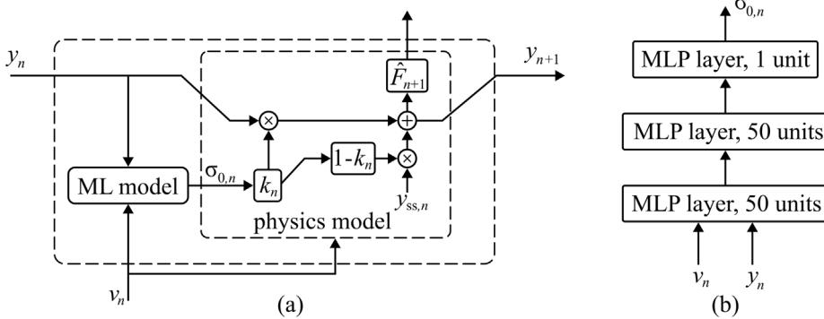

Fig. 1. Data flow of friction model showing: (a) interaction between physics-informed and ML component models; and; (b) architecture of the ML model. Equations for  $F$ ,  $y_{ss}$ , and  $k$  are given in Eqs. (9), (10), and (11), respectively.

Fig. 1 shows a block diagram representation of the discrete, augmented LuGre model in Eqs. (8)–(12), indicating the interaction between the physics and ML component models which comprise the friction model. The ML model takes the place of the function  $\sigma_0(y, v)$  of Eq. (12). A feedback loop exists between the two component models where the discrete LuGre model passes the state variable  $y$  to the ML model and the ML model produces a parameter estimation of  $\sigma_0$  for the physics model. A three layer multilayer perceptron (MLP) architecture with ReLu activation functions as shown in Fig. 1(b) was used in both the numerical and experimental case studies.

Training leverages the machine learning algorithm backpropagation through time (BPTT) to solve the time-dependent properties of the discrete-time equations. A prediction of  $\sigma_{0,n}$  affects the force prediction for timestep  $n$  but also all timesteps after; BPTT efficiently solves for an error gradient for each ML model's predictions which accounts for the forward-time effects of the prediction. For clarity, the BPTT derivation for the discrete augmented model is replicated below, which is produced automatically by the automatic differentiation engine. For  $N$  timesteps, the mean squared error is shown in Eq. (13).

$$\epsilon = \frac{1}{N} \sum_{n=1}^N (\hat{F}_n - F_n)^2 =: \frac{1}{N} \sum_{n=1}^N \epsilon_n \quad (13)$$

$$\begin{aligned} \frac{\partial \epsilon}{\partial y_n} &= \sum_{m \geq t} \frac{\partial \hat{F}_m}{\partial \hat{F}_m} \frac{\partial y_m}{\partial y_n} \frac{\partial y_m}{\partial y_n} = \frac{1}{N} \frac{\partial \epsilon_n}{\partial \hat{F}_n} \frac{\partial \hat{F}_n}{\partial y_n} + \sum_{m \geq n+1} \frac{1}{N} \frac{\partial \epsilon_m}{\partial \hat{F}_m} \frac{\partial \hat{F}_m}{\partial y_m} \frac{\partial y_m}{\partial y_n} \\ &= \frac{1}{N} \frac{\partial \epsilon_n}{\partial \hat{F}_n} \frac{\partial \hat{F}_n}{\partial y_n} + \frac{1}{N} \sum_{m \geq n+1} \frac{\partial \epsilon_m}{\partial \hat{F}_m} \frac{\partial \hat{F}_m}{\partial y_m} \left( \frac{\partial y_m}{\partial y_{n+1}} \frac{\partial y_{n+1}}{\partial y_n} \right) \\ &= \frac{1}{N} \frac{\partial \epsilon_n}{\partial \hat{F}_n} \frac{\partial \hat{F}_n}{\partial y_n} + \frac{1}{N} \frac{\partial y_{n+1}}{\partial y_n} \sum_{m \geq n+1} \frac{\partial \epsilon_m}{\partial \hat{F}_m} \frac{\partial \hat{F}_m}{\partial y_m} \frac{\partial y_m}{\partial y_{n+1}} \\ &= \frac{1}{N} \left( \frac{\partial \epsilon_n}{\partial \hat{F}_n} \frac{\partial \hat{F}_n}{\partial y_n} + \frac{\partial y_{n+1}}{\partial y_n} \frac{\partial \epsilon_n}{\partial y_{n+1}} \right) \\ &= \frac{1}{N} \left( 2 \left( \hat{F}_n - F_n \right) \left( 1 - \sigma_1 \frac{|v|_n}{g(v_n)} \right) + k_n \frac{\partial \epsilon}{\partial y_{n+1}} \right) \end{aligned} \quad (14)$$

Eq. (14) presents a recursive equation in the backwards time direction. The error gradient with respect to  $\sigma_{0,n}$  is an application of the chain rule and Eq. (14).

$$\quad (15)$$

{4}------------------------------------------------

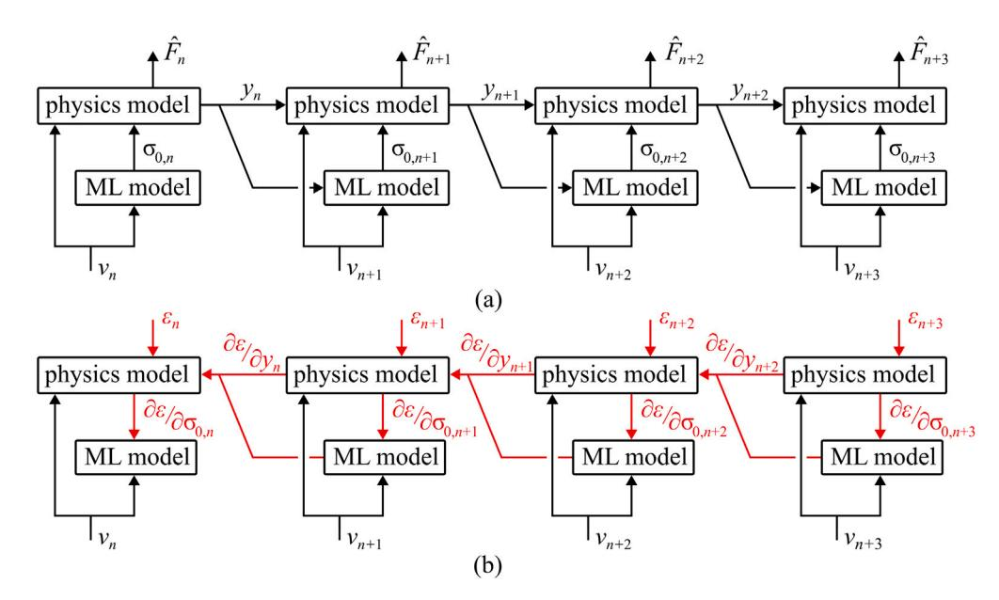

**Fig. 2.** Model prediction computation graph unfolded for each timestep for: (a) inference; and; (b) backpropagation.

In machine learning terminology, Eqs. (8)–(12) describe the forward pass while Eqs. (14) and (15) encompass the backwards pass of a recurrent relation. Fig. 2 shows an unfolded computation graph for inference and training steps. Inference first produces an approximate output signal and an error is calculated using a mean squared error calculation compared against the true signal. The error gradient propagates backwards to produce an error gradient with respect to the model weights. As such, the weights of the ML component model are tuned to minimize the output error  $\epsilon$ , even though the ML model produces a prediction of  $\sigma_0$ . This constitutes the indirect measurement approach of this paper, which contrasts with attempts to directly measure or parameterize  $\sigma_0$  as means to train the ML model.

The training procedure passed through all tests with weight updating occurring every 200 timesteps. The Adam optimizer was used with a learning rate of 0.0001,  $\beta_1 = 0.9$ , and  $\beta_2 = 0.999$ . Training was stopped when error reached sufficient convergence. The reference implementation provided as supplemental material, and as a public repository, contains the forward pass implementation of the modified LuGre model Eqs. (8)–(12) and model training within the TensorFlow automatic differentiation engine.

### *2.2. Numerical case study*

A multiphysics model was constructed to produce a combined friction-backlash system. The multiphysics model is described by the force-flow system shown in Fig. 3(a). A LuGre friction device is placed between two nonlinear springs. Spring reaction force is represented by a piecewise linear system, given in Eq. (16) and shown in 3(b). The backlash effect is reproduced by the much smaller spring coefficient near zero displacement, enabling slipping when the friction interface produces force near zero. Table 2 contains the physical parameters used in the model. This model was developed in MATLAB's Simulink/Simscape Environment. The simulation was run with a step size of 0.00001 s which was then resampled to 0.005 s for training the physics-ML model. It should be noted that the numerical model is an idealized model of a friction interface with backlash and is not an exact model of the rotational friction mechanism presented in Section 2.3.

$$F_{\text{spring}} = \begin{cases} k_1 x + (k_0 - k_1) x_0 & x > x_0 \\ k_0 x & -x_0 \leq x \leq x_0 \\ k_1 x - (k_0 - k_1) x_0 & x < -x_0 \end{cases} \quad (16)$$

Twenty-four forty-second simulations of sinusoidal displacement were performed through a rectangular testing regiment, varying the amplitude and frequency of the excitation. Amplitude was varied between values of 0.05, 0.1, 0.2, 0.3, and 0.4 m; and frequency varied between 0.05, 0.1, 0.2, 0.5, 1, and 2 Hz. Fig. 4 shows force against time, displacement, and velocity for one simulation. The backlash region is visible immediately after reversal of travel as a deflection near zero force.

{5}------------------------------------------------

**Table 2** Parameter values of multiphysics model.

| Parameter   | Value                     |
|-------------|---------------------------|
| $x_0$       | 0.005 m                   |
| $k_0$       | 10000 N/m                 |
| $k_1$       | 150000 N/m                |
| $F_c$       | 1000 N                    |
| $F_s$       | 1050 N                    |
| $v_s$       | 0.01 m/s                  |
| $
ho_{o}$   | 4000	ext{ N}/	ext{m}^{2}  |
| $
ho_{i}$   | 100 	ext{ Ns}/	ext{m}^{3} |
| $
ho_{max}$ | 0 	ext{ Ns}/	ext{m}^{3}   |

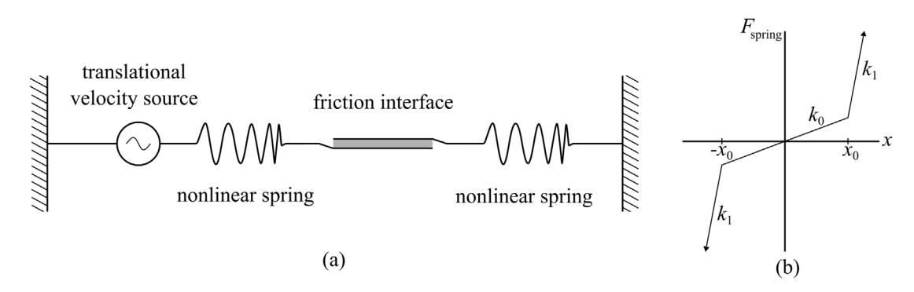

**Fig. 3.** Systems used for numerical modeling, showing: (a) diagram of the multiphysics model construction; and; (b) piecewise linear spring force used to represent backlash.

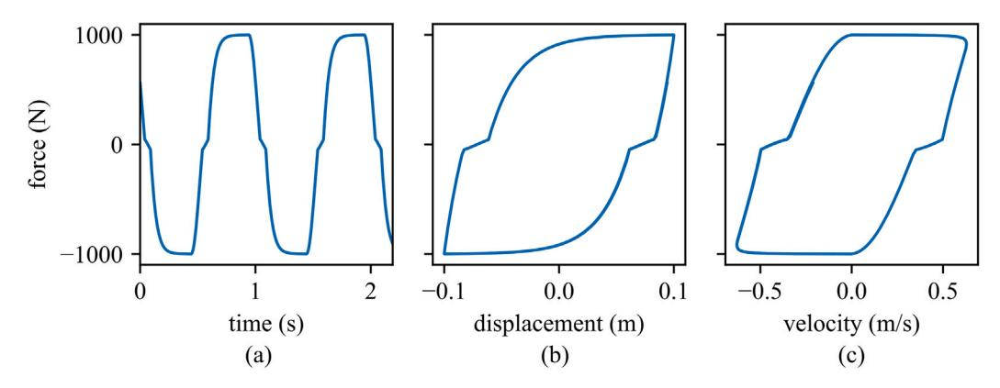

**Fig. 4.** Force of the numerical friction device plotted against: (a) time, (b) displacement, and (c) velocity.

#### *2.3. Experimental case study*

The banded rotary friction device (BRFD) is a friction damper mechanism located at NHERI Lehigh Experimental Facility [37]. The device uses a rotary motion of a friction surface wrapped around a metal drum as damping force and was first proposed in 2016 as a novel, cost-effective, mechanically robust structural damper with a high damping performance [11]. The quality of construction has been improved upon in subsequent years but remains mechanically the same [11,34]. The device and experimental setup is shown in Fig. 5. Its principle of action is friction force between a drum and a surrounding steel band covered in a friction material (GGA-Cured (Rigid)). Three elastic frictional bands are wrapped around the drum, connected to two electric actuators on either end. Under motion, rotational friction produces a linearly increasing pressure profile which is minimized at the end against the direction of motion, termed the slack end, and reaching a maximum at the taut end. As the drum pin moves forward, a frictional torque along the band is produced which is translated to a damping force to counteract the applied force. The mechanical advantage  $C$  of t
$$C = (e^{\mu\phi} - 1) \left( \frac{r}{r_b} \right) \quad (17)$$

{6}------------------------------------------------

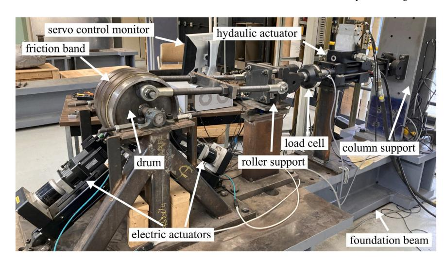

**Fig. 5.** Banded rotary friction device and experimental setup.

**Table 3** Testing matrix for sinusoidal displacement profiles of the banded rotary friction device.

|                  |                  | Frequency (Hz) | 0.1 Hz | 0.25 Hz | 0.5 Hz | 1.0 Hz | 2.0 Hz |
|------------------|------------------|----------------|--------|---------|--------|--------|--------|
|                  |                  | Frequency      |        |         |        |        |        |
| Amplitude        | 12.7 mm (0.5 in) | x              | x      | x       | x      | x      |        |
| 25.4 mm (1.0 in) | x                | x              | x      | x       |        |        |        |
| 28.1 mm (1.5 in) | x                | x              | x      | x       |        |        |        |

**Table 4** Parameter values characterizing the experimental model.

| Parameter   | Value     |
|-------------|-----------|
| $F_{c,neg}$ | 19763 N   |
| $F_{c,pos}$ | 14 261 N  |
| $F_{s,neg}$ | 20 392 N  |
| $F_{s,pos}$ | 14 281 N  |
| $v_S$       | 0.01 m/s  |
| $\sigma_0$  | 2047 kN/m |
| $\sigma_1$  | 0.04 Ns/m |
| $\sigma_2$  | 0 Ns/m    |

Where  $r$  is the drum radius,  $r_b$  is the distance from the center of the drum to the lever connection,  $\mu$  is the coefficient of friction and  $\phi$  is the angular rotation of the drum. For the banded rotary friction device, theoretical analysis and experimental results both indicate a mechanical advantage of roughly 140. The BRFD is capable of semi-active control by actuator control of the tension on the slack end of the steel band.

As a result of its design, the BRFD exhibits the backlash phenomenon typical in rotational friction settings. During reversal of travel, the identities of the slack and taut ends switch, and the contact pressure profile reduces to zero before being re-energized in the opposite direction. During initial movement and reversal of travel, the friction force is momentarily decreased until activation occurs as the band grips onto the drum. Characterization of the backlash region is important as previous work has shown that under certain displacement profiles, damping force can be significantly reduced by the backlash effect [[12\]](#page-16-19).

Training tests followed a sinusoidal displacement profile where amplitude was varied between 12.7 mm (0.5 in.), and 38.1 mm (1.5 in), frequency between 0.1 Hz and 2 Hz. In total, 13 tests were taken, following the testing matrix as shown in [Table](#page-6-1) [3](#page-6-1). Due to the speed limitations of the hydraulic actuator, 2.0 Hz tests at 25.4 mm and 38.1 mm, were not preformed.

Sampling was done at 1024 S/s which was also taken as the inference rate of the physics-ML model. The velocity signal was calculated through numerical differentiation from the displacement signal with a low-pass filter with a pass frequency of 50 Hz, while no preprocessing was done on the force data. [Fig.](#page-7-0) [6](#page-7-0) shows force against time, displacement, and velocity for one test. The similarity to [Fig.](#page-5-3) [4](#page-5-3) is evident, with backlash occurring as a deflection near zero force.

Table 4 shows the parameters used to characterize the BRFD to a LuGre model. Because the BRFD shows asymmetrical properties different kinetic and static friction parameters are used in the positive and negative velocity domains. These values were found by examination to accurately represent the system, with  $\sigma_0$  and  $\sigma_1$  found through gradient descent minimization. Here,  $\sigma_0$  encompasses both the engaged and backlash regimes.

{7}------------------------------------------------

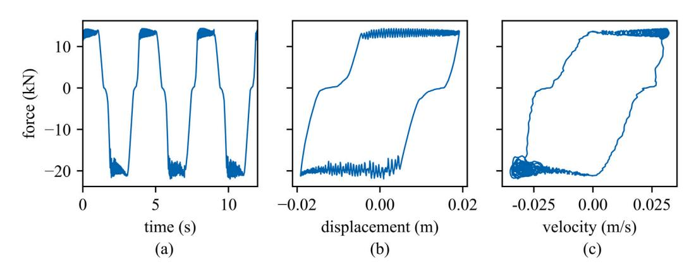

**Fig. 6.** Characterization tests: damping force ( $F$ ) of the friction damper plotted against: (a) time, (b) displacement, and (c) velocity.

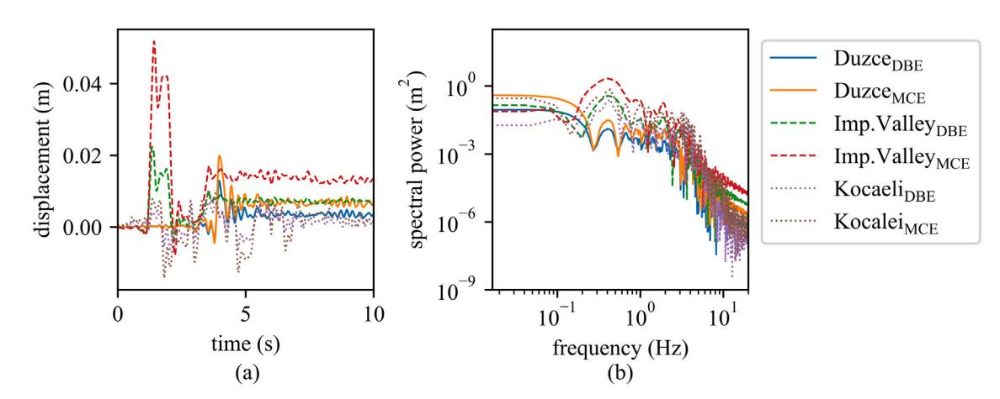

**Fig. 7.** Data of six pre-defined displacement profiles showing: (a) time series; and; (b) the power spectral density plot.

**Table 5** List of selected earthquakes and scale factors.

| Earthquake      | Year | Station name    | Magnitude | Scale factor (DBE) | Scale factor (MCE) |
|-----------------|------|-----------------|-----------|--------------------|--------------------|
| Düzce           | 1999 | Bolu            | 7.14      | 0.5076             | 0.7614             |
| Imperial Valley | 1979 | El Centro Array | 6.53      | 1.0787             | 1.6181             |
| Kocaeli         | 1999 | Yarimca         | 7.51      | 1.4199             | 2.1299             |

### *2.4. Earthquake tests*

The proposed model is verified over realistic pre-defined displacement inputs that are generated from previous real-time hybrid simulation (RTHS) earthquake studies using the BRFD. In the RTHS study, the BRFD is assumed to be installed on the second floor in a two-story reinforced concrete special moment resisting frame building [[38\]](#page-17-12). The building was designed by the authors and assumed to be located in the Los Angeles area on a stiff soil site. Three earthquake excitations are selected and scaled to two levels: the design basis earthquake (DBE) and maximum credible earthquake (MCE). The DBE and MCE are associated with a seismic hazard level having a probability of exceedance of 10% and 2% in 50 years, respectively [\[39](#page-17-13)]. The target spectrum for the scaling is based on the ASCE-7 design spectrum [[39](#page-17-13)]. The information of three earthquake excitations and scale factors are listed in [Table](#page-7-1) [5](#page-7-1). Six pre-defined displacement inputs are generated by using the BRFD deformation under RTHS and shown [Fig.](#page-7-2) [7](#page-7-2). For the validation of the numerical case study, all earthquake profiles were scaled to a maximum displacement of 0.25 m before being supplied to the model.

As earthquake excitations, validation tests include multimodal and nonstationary excitation which was not included in the sinusoidal training dataset. Therefore, good model agreement demonstrates this approach as generalizable from laboratory tests to real-world application.

{8}------------------------------------------------

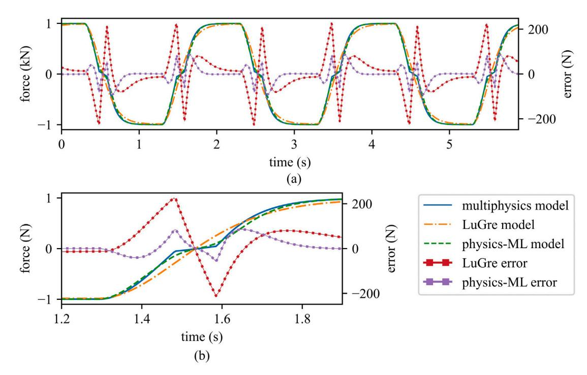

**Fig. 8.** Force of numerical model, LuGre model, and physics-ML model over: (a) multiple cycles; and; (b) one reversal of travel.

#### **3. Results and discussion**

This section presents and discusses the numerical and experimental results.

#### *3.1. Numerical case study*

First the model developed in the numerical case study presented in Section 2.2 under harmonic excitation is used to investigate the physics-ML friction model. In developing the physics-ML model, parameters other than  $\sigma_0$  were taken from the numerical model values as shown in Table 2. For comparison, a standard LuGre model was also fit to the dataset, again using the values from Table 2 but with  $\sigma_0$  being a constant value found through gradient descent minimization. Fig. 8 compares the responses of the numerical, standard LuGre, and the proposed physics-ML model. As can be seen in (a), the largest deviations between the LuGre and numerical occur in the backlash region. With the physics-ML model the deviation is significantly reduced.

In the standard LuGre model,  $\sigma_0$  is mediated between the engaged and backlash regimes, being too small for the engaged regime and too large in the backlash regime. In comparison, the physics-ML model is capable of reproducing the deflection in the backlash region and a greater rising rate during the engaged phases. The prediction of  $\sigma_0$  produced by the ML model through a reversal of travel is shown in Fig. 9. Backlash is actualized as the variance of  $\sigma_0$  between 0.5 and 4 s. De-energization (0.5–1.8 s) and re-energization (1.8–4 s) show a symmetrical pattern, reaching a maximum of 44 kN/m and a minimum of 6.5 kN/m during full backlash.

Fig. 10 reports the DuzceDEE earthquake excitation applied to the numerical, standard LuGre, and physics-ML models. The largest deviations between the numerical and LuGre models occur in the regions before 3 and after 6 s, when the excitation stays within the backlash domain. In these regions, the LuGre model overestimates the friction response, while the physics-ML properly compensates to match the numerical model.

Fig. 11 shows a 3D plot of the function for  $\sigma_0(y, v)$  found via the machine learning training process. The effect of the backlash effect can be seen in the ridge formed along  $y = 0$ . The bottom plane shows the  $(y, v)$  pairs associated with the training dataset. These points provide an indication of the envelope and density of the training dataset. Because of the nature of the damping device and how it is utilized, little data exists in the negative- $y$  and positive- $v$ , or positive- $y$  and negative- $v$  quadrants, as only drastic motion could produce a state value in those domains. The training set consisting of sinusoidal tests was sufficient to cover the earthquake validation data within the  $y$ - $v$  state space, providing evidence that the training set is capable of characterizing the device's dynamics under complex excitation. Furthermore, the values taken by the model in the areas not spanned by the training data can be considered nonessential.

{9}------------------------------------------------

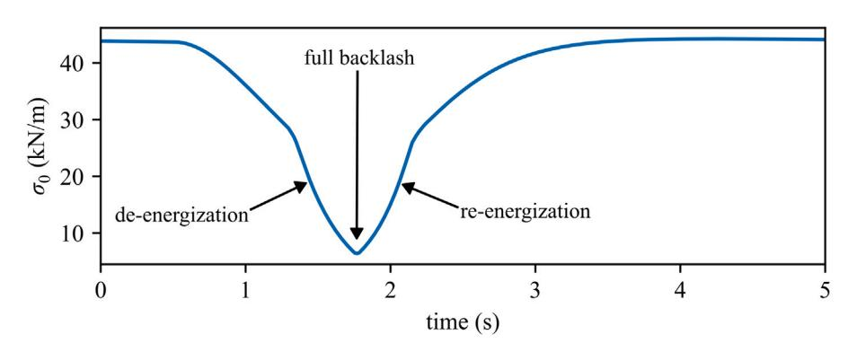

**Fig. 9.** For the numerical dataset,  $\sigma_0$  prediction of the ML model through one reversal of travel.

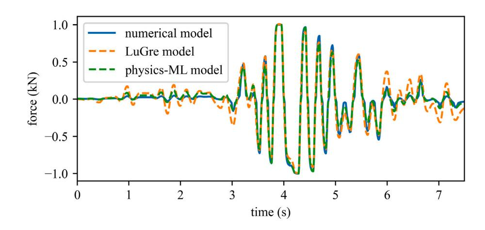

**Fig. 10.** Portion of the DuzceDBE earthquake with numerical damping force and physics-ML predicted damping force.

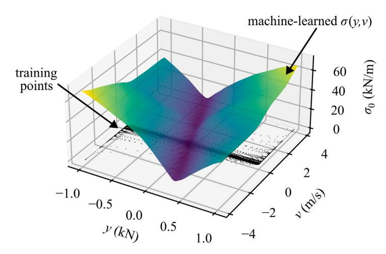

**Fig. 11.** For the numerical dataset,  $\sigma_0$  as a function of  $y$  and  $v$  discovered through ML algorithm.

{10}------------------------------------------------

**Table 6**  
Metric results for harmonic, numerical case study.

| Metric                             | Description                                                        | Standard LuGre | Physics-ML | Percent improvement |
|------------------------------------|--------------------------------------------------------------------|----------------|------------|---------------------|
| Signal to noise ratio              | $10 \times \log_{10} \left( \frac{x^T x}{(x-y)^2 (x-y)} \right)$   | 17.99          | 22.40      | 24.51               |
| Mean absolute error (N)            | $\frac{1}{N} \sum_{i=0}^N  y_i - \hat{y}_i $                       | 58.61          | 28.18      | 51.91               |
| Root mean squared error (N)        | $\sqrt{\frac{(x-y)^2 (x-y)}{N}}$                                   | 103.70         | 62.40      | 39.81               |
| Root relative squared error        | $\sqrt{\frac{(x-y)^2 (x-y)}{(x-y)^2 (x-y)}}$                       | 0.1260         | 0.0759     | 39.81               |
| Normalized root mean squared error | $\sqrt{\frac{(x-y)^2 (x-y)}{N \text{Norm}(y) - \text{matr}(y)^2}}$ | 0.0515         | 0.0310     | 39.81               |
| Time response assurance criterion  | $\frac{x^T \hat{y}^2}{(x^T y \hat{y}^2)}$                          | 0.9841         | 0.9943     | 1.04                |

**Table 7**  
Metric results for earthquake, numerical case study.

| Metric                             | Standard LuGre | Physics-ML | Percent improvement |
|------------------------------------|----------------|------------|---------------------|
| Signal to noise ratio              | 13.58          | 19.16      | 41.10               |
| Mean absolute error (N)            | 76.88          | 36.73      | 52.22               |
| Root mean squared error (N)        | 100.96         | 53.10      | 47.41               |
| Root relative squared error        | 0.2107         | 0.1108     | 47.41               |
| Normalized root mean squared error | 0.0505         | 0.0266     | 47.41               |
| Time response assurance criterion  | 0.9575         | 0.9881     | 3.20                |

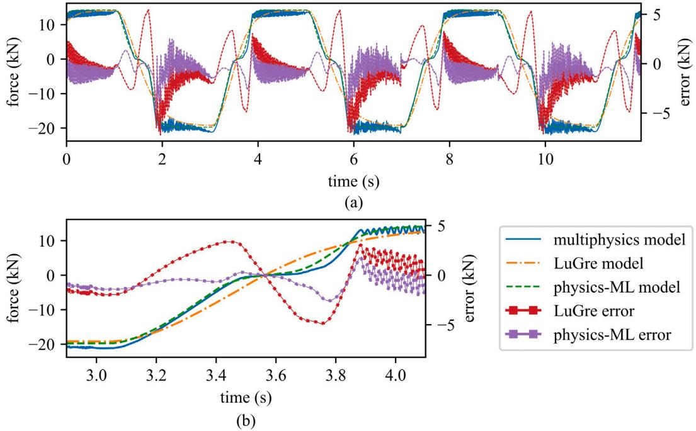

**Fig. 12.** Force of the friction damper and physics-ML model for one harmonic test plotted over: (a) multiple cycles; and; (b) one reversal of travel.

To evaluate the performance of the model, metrics were calculated and are shown in Table 6 for the harmonic tests and Table 7 for the earthquake validation tests. To provide a comparison, metrics were also calculated for a standard LuGre model with parameters taken from Table 2. The physics-ML model performed significantly better, with RMSE improving by 39.8% in the harmonic data and 47.4% in the earthquake data.

### 3.2. Experimental case study

The initial investigation into modeling the experimental system used only the harmonic tests for training. The results from models trained with only harmonic tests were by-and-large inaccurate when validated on earthquake excitations. The authors attribute the discrepancy between the harmonic results and earthquake results to be due to the following phenomena:

{11}------------------------------------------------

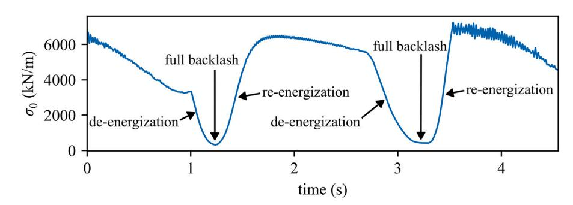

**Fig. 13.** For the experimental dataset,  $\sigma_0$  prediction of the ML model through one reversal of travel.

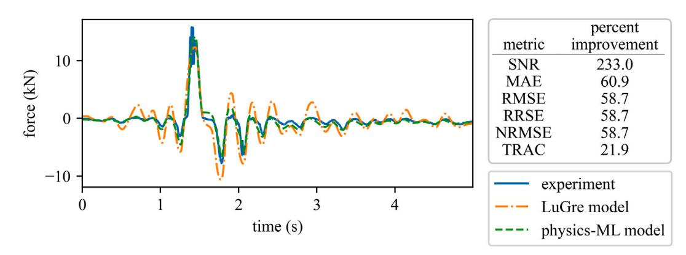

**Fig. 14.** For the experimental dataset, portion of the DizceDBE earthquake with experimental damping force and physics-ML predicted damping force.

- The large directional asymmetry in the device's fully activated friction force produced a strong nonlinearity which the limited model cannot fully correct.
- 2. Earthquake tests spent traveled largely in the hysteretic domain without full activation, inducing drift in the model.

These issues can be corrected by introducing earthquake experiments to the training dataset. However a limitation in the amount of earthquake excitations prevented including earthquake tests while leaving enough tests for a validation dataset. To circumvent this issue, six models were trained, each trained on all experimental harmonic tests and five out of six earthquake excitations. LuGre parameters other than  $\sigma_0$  were sourced from the characterization of the device as reported in Table 4.

Fig. 12 shows physics-ML prediction against experimental data and a LuGre model with parameter values from Table 4. The ML model used to obtain these results is trained on all harmonic data plus all the earthquake data except DüzceDBE. These results are consistent with the numerical results shown in Fig. 8, with the greatest reduction in error occurring through the backlash region. Outside the backlash region, the physics-ML model converges to the fully energized domain quicker than the LuGre model. The considerable amount of jitter in the error is a result of the “ringing” that is present in the BRFD under test, as the model seeks to find a best fit through the ringing rather than reproducing the ringing through time.

Fig. 13 shows the time-series output  $\sigma_0(t)$  of the ML parameter prediction model through two reversals of travel on a harmonic test. In contrast to Fig. 9, behavior is noticeably different for the forward and backwards reversals of travel. This can be attributed to the asymmetry of the device, including the asymmetrical friction properties of the friction interface. In the forward reversal of travel (0.9–1.6 s),  $\sigma_0$  drifts 3300 kN/m then drops to a minimum of 300 kN/m at 1.2 s. Re-energization reaches a maximum of 6500 kN/m then drifts to 5600 kN/m before de-energization in the backward direction begins. In the backward direction, full backlash is sustained for a longer period of time. Re-energization reaches a maximum of 7200 kN/m then begins to drift down as the cycle repeats.

Fig. 14 shows a force plot of the  $Diuzce_{DBE}$  earthquake, and compares the LuGre model prediction to the physics-ML model. Table 8 compares the models' metrics for this test. As in Fig. 10, the LuGre model overestimates force change in the non-energized regions before and after the major excitation at four seconds, while the physics-ML model shows proper deflection in these regions. Results for other earthquake excitations are provided in the appendix.

{12}------------------------------------------------

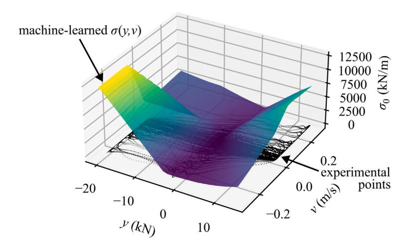

Fig. 15. For the experimental dataset,  $\sigma_0$  as a function of  $y$  and  $v$  discovered through ML algorithm.

Table 8  
Metric results for the validation DizzeDBE earthquake.

| Metric     |          |           |               | Standard LuGre | Physics-ML | Percent improvement |
|------------|----------|-----------|---------------|----------------|------------|---------------------|
| Signal     | to noise | ratio     |               | 3.30           | 10.98      | 233.02              |
| Mean       | absolute | error     | (N)           | 823.27         | 321.97     | 60.89               |
| Root       | mean     | squared   | error (N)     | 1306.36        | 539.62     | 58.69               |
| Root       | relative | squared   | error         | 0.6930         | 0.2862     | 58.69               |
| Normalized |          | root mean | squared error | 0.0554         | 0.0229     | 58.69               |
| Time       | response | assurance | criterion     | 0.7598         | 0.9261     | 21.89               |

**Table 9**  
RMSE (N) of models for earthquake tests.

| Model                |            | Validation Düzce DBE | earthquake Düzce MCE | Imp. Valley | DBE Imp. Valley | MCE Kocaeli DBE | Kocaeli MCE |
|----------------------|------------|----------------------|----------------------|-------------|-----------------|-----------------|-------------|
| LuGre                | model      | 1306.36              | 1892.02              | 2040.92     | 2969.81         | 3131.42         | 3340.78     |
| Excluded in training |            |                      |                      |             |                 |                 |             |
| Düzce                | DBE        | 539.62               | 1634.66              | 1452.19     | 2278.62         | 1957.05         | 1750.51     |
| Düzce                | MCE        | 1646.99              | 2031.00              | 1702.54     | 2375.30         | 2677.86         | 2681.93     |
| Imp.                 | Valley DBE | 1100.04              | 1621.55              | 1524.07     | 2546.10         | 2439.16         | 2686.56     |
| Imp.                 | Valley MCE | 1823.90              | 2653.24              | 1719.14     | 2239.42         | 1867.74         | 1816.44     |
| Kocaeli              | DBE        | 626.89               | 2735.34              | 1828.48     | 2231.57         | 1754.26         | 2070.70     |
| Kocaeli              | MCE        | 1895.60              | 3073.32              | 1566.59     | 2225.33         | 2048.35         | 1917.32     |

Fig. 15 shows the  $y-v$  state-space of the function  $\sigma_0(y, v)$  found via machine learning with the associated training points plotted on the plane. As with the numerical model, the training set was sufficient to cover the validation data, and values taken by the model outside the span of the training set is not relevant. Comparing this learned function to Fig. 11 shows that the two models are noticeably different. The numerical model shows symmetry along  $y = 0$ , while the experimental model shows a large ridge along the negative portion of the  $v = 0$  axis, which is responsible for the abrupt drop in Fig. 13 at 1.6 s. The asymmetry of the learned function  $\sigma_0(y, v)$  can be attributed to physical the physical asymmetry of the device, whereas the different shapes between Figs. 11 and 15, seem to indicate different mechanisms of backlash development between the numerical model and physical device. This is to be expected as the numerical model is not a model of the BRFD, but rather a simplified model of a friction interface with backlash.

**Table 9** reports results for all six models in terms of RMSE, where each are trained on all experimental harmonic tests and five out of six earthquake excitations. The first row shows the results of the LuGre comparison model, and all other rows indicate the physics-ML model with the indicated test excluded. The validation tests, which comprise model performance on tests not included in training, follow the diagonal. In all cases except one, of the physics-ML models outperform the LuGre comparison model. The cumulative RMSE improvement among the validation tests is 844.53 *N* or 32.8%. The only case where the LuGre model outperforms the physics-ML model is DüzceMCE. The authors propose that this is due to drift induced by the excitation in the hysteretic domain.

{13}------------------------------------------------

# **4. Conclusion**

The contributions of this work are twofold. This work advances the possibility of improving accuracy of friction modeling with the integration of ML into physics-derived models. A friction model was developed with physics-informed and ML component models, where the ML model, informed by the system input and physics model state variable, predicts a physical parameter. The new friction model provided a better representation of the backlash effect than a standard friction model and reduced error for both sinusoidal tests and when excited by a nonstationary earthquake signal.

In an broader setting, this paper develops a scheme of integrating machine learning into differential, physics-derived models. The method, used here for indirect and time-variable parameterization, does not require labeled data for the ML model output, but instead uses backpropagation through the physics model to produce an error gradient. BPTT is used to solve forward time dependence of the physics model. By developing a model where the ML component predicts a physical-parameter, we also address the explainability issue of ML. The output of the ML models were analyzed and found to correlate with the expected results based on a physical understanding of the system.

#### **CRediT authorship contribution statement**

**Daniel Coble:** Writing – original draft, Methodology, Conceptualization. **Liang Cao:** Writing – review & editing, Data curation. **Austin R.J. Downey:** Writing – review & editing, Methodology, Conceptualization, Funding acquisition . **James M. Ricles:** Writing – review & editing, Funding acquisition.

# **Declaration of competing interest**

The authors declare that they have no known competing financial interests or personal relationships that could have appeared to influence the work reported in this paper.

# **Data availability**

The paper contains a citation which links to a GitHub repo for the the experimental dataset and example code [[35,](#page-17-9)[36\]](#page-17-10). Both numerical and experimental datasets are available as supplementary material with the publication.

# **Acknowledgments**

The National Science Foundation, United States provided support for this work through Grants CCSS-1937535 and CPS-2237696. The experiments detailed within this paper were performed at the NHERI Lehigh Experimental Facility as part of the National Science Foundation-sponsored NHERI Research Experiences for Undergraduate (REU) program under Cooperative Agreement No. CMMI-2129782. The NHERI Lehigh Experimental Facility's operation is supported by a grant from the National Science Foundation, United States under Cooperative Agreement No. CMMI-2037771. The National Science Foundation's support is sincerely thanked. The authors' opinions, results, conclusions, and recommendations in this material are their own and do not necessarily reflect the views of the National Science Foundation.

# **Appendix**

See [Figs.](#page-14-0) [16–](#page-14-0)[20](#page-16-20) and [Tables](#page-13-0) [10](#page-13-0)[–15](#page-15-0).

# **Appendix B. Supplementary data**

Supplementary material related to this article can be found online at [https://doi.org/10.1016/j.ymssp.2024.111522.](https://doi.org/10.1016/j.ymssp.2024.111522)

**Table 10** SNR of models for earthquake tests.

| Model                | Condition  | Validation Düzce DBE | earthquake Düzce MCE | Imp. Valley | DBE Imp. Valley | MCE Kocaeli DBE | Kocaeli MCE |
|----------------------|------------|----------------------|----------------------|-------------|-----------------|-----------------|-------------|
| LuGre                | model      | 3.30                 | 4.20                 | 7.13        | 6.00            | 3.17            | 5.00        |
| Excluded in training |            |                      |                      |             |                 |                 |             |
| Düzce                | DBE        | 10.98                | 5.47                 | 10.09       | 8.3             | 7.25            | 10.61       |
| Düzce                | MCE        | 1.28                 | 3.58                 | 8.70        | 7.94            | 4.53            | 6.91        |
| Imp.                 | Valley DBE | 4.79                 | 5.54                 | 9.67        | 7.34            | 5.34            | 6.89        |
| Imp.                 | Valley MCE | 0.40                 | 1.26                 | 8.62        | 8.45            | 7.66            | 10.29       |
| Kocaeli              | DBE        | 9.67                 | 0.99                 | 8.08        | 8.48            | 8.20            | 9.15        |
| Kocaeli              | MCE        | 0.06                 | − 0.02               | 9.43        | 8.51            | 6.86            | 9.82        |

{14}------------------------------------------------

**Table 11** Metric results for the validation DüzceMCE earthquake.

| Metric     |          |           |               | Standard LuGre | Physics-ML | Percent improvement |
|------------|----------|-----------|---------------|----------------|------------|---------------------|
| Signal     | to noise | ratio     |               | 4.20           | 3.58       | − 14.67             |
| Mean       | absolute | error     | (N)           | 1244.75        | 1345.64    | − 8.10              |
| Root       | mean     | squared   | error (N)     | 1892.02        | 2031.00    | − 7.35              |
| Root       | relative | squared   | error         | 0.6340         | 0.6805     | − 7.35              |
| Normalized |          | root mean | squared error | 0.0484         | 0.0519     | − 7.35              |
| Time       | response | assurance | criterion     | 0.7089         | 0.6693     | − 5.58              |

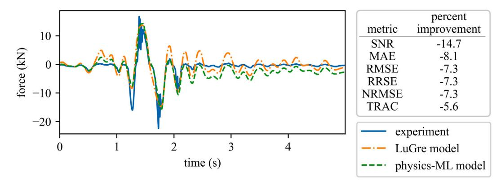

**Fig. 16.** For the experimental dataset, portion of the DüzceMCE earthquake with experimental damping force and physics-ML predicted damping force.

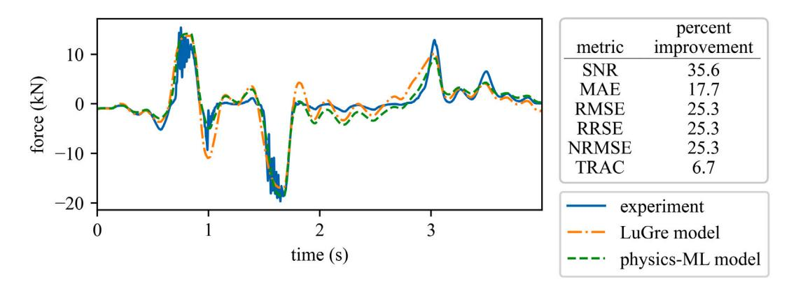

**Fig. 17.** For the experimental dataset, portion of the Imperial ValleyDBE earthquake with experimental damping force and physics-ML predicted damping force.

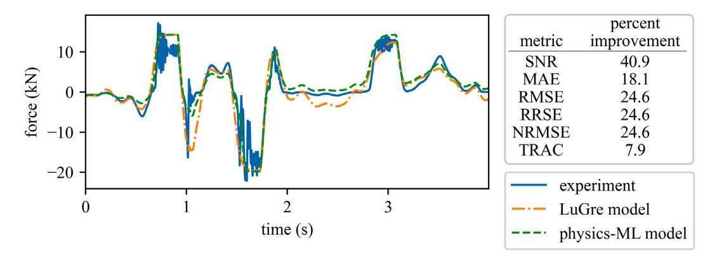

**Fig. 18.** For the experimental dataset, portion of the Imperial ValleyMCE earthquake with experimental damping force and physics-ML predicted damping force.

{15}------------------------------------------------

**Table 12**

Metric results for the validation ImperialValleyDBE earthquake.

| Metric     |          |           |               | DBE     |         |       |
|------------|----------|-----------|---------------|---------|---------|-------|
| Signal     | to noise | ratio     |               | 7.13    | 9.67    | 35.58 |
| Mean       | absolute | error     | (N)           | 1327.36 | 1092.86 | 17.67 |
| Root       | mean     | squared   | error (N)     | 2040.92 | 1524.07 | 25.32 |
| Root       | relative | squared   | error         | 0.4404  | 0.3289  | 25.32 |
| Normalized |          | root mean | squared error | 0.0582  | 0.0435  | 25.32 |
| Time       | response | assurance | criterion     | 0.8482  | 0.9051  | 6.70  |

**Table 13**

Metric results for the validation ImperialValleyMCE earthquake.

| Metric                             |  |  |  | Standard LuGre | Physics-ML | Percent improvement |
|------------------------------------|--|--|--|----------------|------------|---------------------|
| Signal to noise ratio              |  |  |  | 6.00           | 8.45       | 40.85               |
| Mean absolute error (N)            |  |  |  | 1831.51        | 1499.87    | 18.11               |
| Root mean squared error (N)        |  |  |  | 2969.81        | 2239.42    | 24.59               |
| Root relative squared error        |  |  |  | 0.5075         | 0.3827     | 24.59               |
| Normalized root mean squared error |  |  |  | 0.0755         | 0.0570     | 24.59               |
| Time response assurance criterion  |  |  |  | 0.8265         | 0.8919     | 7.91                |

**Table 14**

Metric results for the validation KocaeliDBE earthquake.

|            |          |           |               | DBE            |            |                     |
|------------|----------|-----------|---------------|----------------|------------|---------------------|
| Metric     |          |           |               | Standard LuGre | Physics-ML | Percent improvement |
| Signal     | to noise | ratio     |               | 3.17           | 8.20       | 158.78              |
| Mean       | absolute | error     | (N)           | 2418.63        | 1347.35    | 44.29               |
| Root       | mean     | squared   | error (N)     | 3131.42        | 1754.26    | 43.98               |
| Root       | relative | squared   | error         | 0.7939         | 0.4447     | 43.98               |
| Normalized |          | root mean | squared error | 0.1208         | 0.0677     | 43.98               |
| Time       | response | assurance | criterion     | 0.5421         | 0.8587     | 58.40               |

**Table 15**

Metric results for the validation KocaeliMCE earthquake.

| Metric     |          |                         |  | Standard LuGre | Physics-ML | Percent improvement |
|------------|----------|-------------------------|--|----------------|------------|---------------------|
| Signal     | to noise | ratio                   |  | 5.00           | 9.82       | 96.48               |
| Mean       | absolute | error (N)               |  | 2484.33        | 1334.72    | 46.27               |
| Root       | mean     | squared error (N)       |  | 3340.78        | 1917.32    | 42.61               |
| Root       | relative | squared error           |  | 0.6284         | 0.3607     | 42.61               |
| Normalized |          | root mean squared error |  | 0.0937         | 0.0538     | 42.61               |
| Time       | response | assurance criterion     |  | 0.7154         | 0.8977     | 25.49               |

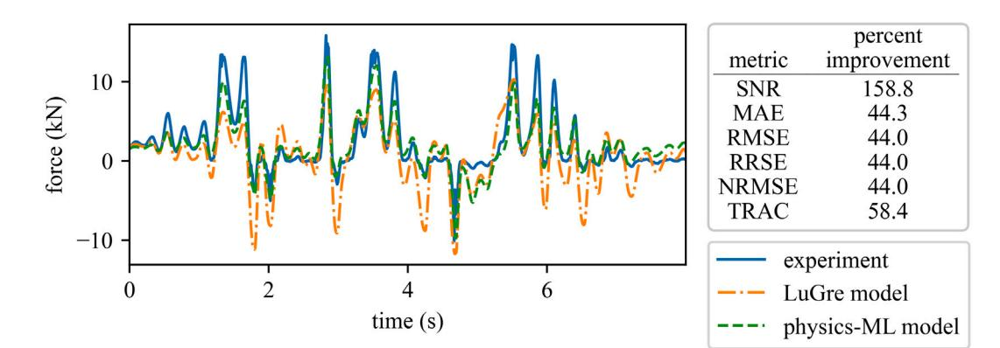

**Fig. 19.** For the experimental dataset, portion of the KocaeliDBE earthquake with experimental damping force and physics-ML predicted damping force.

{16}------------------------------------------------

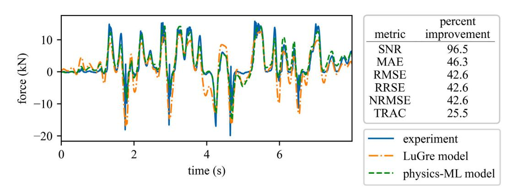

**Fig. 20.** For the experimental dataset, portion of the KocaeliMCE earthquake with experimental damping force and physics-ML predicted damping force.

### **References**

[1] S. Huang, W. Liang, K.K. Tan, Intelligent friction compensation: A review, IEEE/ASME Trans. Mechatronics 24 (4) (2019) 1763–1774, [http://dx.doi.org/](http://dx.doi.org/10.1109/TMECH.2019.2916665) [10.1109/TMECH.2019.2916665](http://dx.doi.org/10.1109/TMECH.2019.2916665). [2] H. Olsson, K.J. Åström, C.C. De Wit, M. Gäfvert, P. Lischinsky, Friction models and friction compensation, Eur. J. Control 4 (3) (1998) 176–195, [http://dx.doi.org/10.1016/S0947-3580\(98\)70113-X.](http://dx.doi.org/10.1016/S0947-3580(98)70113-X) [3] C.C. De Wit, H. Olsson, K.J. Astrom, P. Lischinsky, A new model for control of systems with friction, IEEE Trans. Autom. Control 40 (3) (1995) 419–425, [http://dx.doi.org/10.1109/9.376053.](http://dx.doi.org/10.1109/9.376053) [4] N. Barahanov, R. Ortega, Necessary and sufficient conditions for passivity of the lugre friction model, IEEE Trans. Autom. Control 45 (4) (2000) 830–832, [http://dx.doi.org/10.1109/9.847131.](http://dx.doi.org/10.1109/9.847131) [5] P. Dupont, V. Hayward, B. Armstrong, F. Altpeter, Single state elastoplastic friction models, IEEE Trans. Autom. Control 47 (5) (2002) 787–792, <http://dx.doi.org/10.1109/TAC.2002.1000274>. [6] L. Lu, B. Yao, Q. Wang, Z. Chen, Adaptive robust control of linear motors with dynamic friction compensation using modified LuGre model, Automatica 45 (12) (2009) 2890–2896, <http://dx.doi.org/10.1016/j.automatica.2009.09.007>. [7] L. Freidovich, A. Robertsson, A. Shiriaev, R. Johansson, Lugre-model-based friction compensation, IEEE Trans. Control Syst. Technol. 18 (1) (2010) 194–200, [http://dx.doi.org/10.1109/TCST.2008.2010501.](http://dx.doi.org/10.1109/TCST.2008.2010501) [8] M.R. Sobczyk, V.I. Gervini, E.A. Perondi, M.A. Cunha, A continuous version of the LuGre friction model applied to the adaptive control of a pneumatic servo system, J. Franklin Inst. 353 (13) (2016) 3021–3039, <http://dx.doi.org/10.1016/j.jfranklin.2016.06.003>. [9] J. Swevers, F. Al-Bender, C. Ganseman, T. Projogo, An integrated friction model structure with improved presliding behavior for accurate friction compensation, IEEE Trans. Autom. Control 45 (4) (2000) 675–686, <http://dx.doi.org/10.1109/9.847103>. [10] A. Saha, P. Wahi, M. Wiercigroch, A. Stefański, A modified LuGre friction model for an accurate prediction of friction force in the pure sliding regime, Int. J. Non-Linear Mech. 80 (2016) 122–131, <http://dx.doi.org/10.1016/j.ijnonlinmec.2015.08.013>. [11] A. Downey, L. Cao, S. Laflamme, D. Taylor, J. Ricles, High capacity variable friction damper based on band brake technology, Eng. Struct. 113 (2016) 287–298, <http://dx.doi.org/10.1016/j.engstruct.2016.01.035>. [12] V. Barzegar, S. Laflamme, A. Downey, M. Li, C. Hu, Numerical evaluation of a novel passive variable friction damper for vibration mitigation, Eng. Struct. 220 (2020) 110920, <http://dx.doi.org/10.1016/j.engstruct.2020.110920>. [13] O.P. Yadav, S.R. Balaga, N.S. Vyas, Forced vibrations of a spring–dashpot mechanism with dry friction and backlash, Int. J. Non-Linear Mech. 124 (2020) 103500, <http://dx.doi.org/10.1016/j.ijnonlinmec.2020.103500>. [14] R. Lin, D. Ewins, Chaotic vibration of mechanical systems with backlash, Mech. Syst. Signal Process. 7 (3) (1993) 257–272, [http://dx.doi.org/10.1006/](http://dx.doi.org/10.1006/mssp.1993.1012) [mssp.1993.1012](http://dx.doi.org/10.1006/mssp.1993.1012). [15] S. Tarbouriech, C. Prieur, Stability analysis for sandwich systems with backlash: an LMI approach, IFAC Proc. Vol. 39 (9) (2006) 387–392, [http:](http://dx.doi.org/10.3182/20060705-3-FR-2907.00067) [//dx.doi.org/10.3182/20060705-3-FR-2907.00067](http://dx.doi.org/10.3182/20060705-3-FR-2907.00067), 5th IFAC Symposium on Robust Control Design. [16] T. Tjahjowidodo, F. Al-Bender, H. Van Brussel, Quantifying chaotic responses of mechanical systems with backlash component, Mech. Syst. Signal Process. 21 (2) (2007) 973–993, <http://dx.doi.org/10.1016/j.ymssp.2005.11.003>. [17] L. orinc Márton, B. Lantos, Control of mechanical systems with stribeck friction and backlash, Systems Control Lett. 58 (2) (2009) 141–147, [http:](http://dx.doi.org/10.1016/j.sysconle.2008.10.001) [//dx.doi.org/10.1016/j.sysconle.2008.10.001](http://dx.doi.org/10.1016/j.sysconle.2008.10.001). [18] K. Worden, C. Wong, U. Parlitz, A. Hornstein, D. Engster, T. Tjahjowidodo, F. Al-Bender, D. Rizos, S. Fassois, Identification of pre-sliding and sliding friction dynamics: Grey box and black-box models, Mech. Syst. Signal Process. 21 (1) (2007) 514–534, <http://dx.doi.org/10.1016/j.ymssp.2005.09.004>. [19] T. Wang, M. Noori, W.A. Altabey, Z. Wu, R. Ghiasi, S.-C. Kuok, A. Silik, N.S. Farhan, V. Sarhosis, E.N. Farsangi, From model-driven to data-driven: A review of hysteresis modeling in structural and mechanical systems, Mech. Syst. Signal Process. 204 (2023) 110785, [http://dx.doi.org/10.1016/j.ymssp.](http://dx.doi.org/10.1016/j.ymssp.2023.110785) [2023.110785.](http://dx.doi.org/10.1016/j.ymssp.2023.110785) [20] F. Du, M. Zhang, Z. Wang, C. Yu, X. Feng, P. Li, Identification and compensation of friction for a novel two-axis differential micro-feed system, Mech. Syst. Signal Process. 106 (2018) 453–465, <http://dx.doi.org/10.1016/j.ymssp.2018.01.004>. [21] Z. Wenjing, Parameter identification of LuGre friction model in servo system based on improved particle swarm optimization algorithm, in: 2007 Chinese Control Conference, IEEE, 2006, [http://dx.doi.org/10.1109/chicc.2006.4346908.](http://dx.doi.org/10.1109/chicc.2006.4346908) [22] E. Czerwiński, P. Olejnik, J. Awrejcewicz, Modeling and parameter identification of vibrations of a double torsion pendulum with friction, Acta Mech. Automat. 9 (4) (2015) 204–212, [http://dx.doi.org/10.1515/ama-2015-0033.](http://dx.doi.org/10.1515/ama-2015-0033) [23] C.-Y. Lee, S.-H. Hwang, E. Nam, B.-K. Min, Identification of mass and sliding friction parameters of machine tool feed drive using recursive least squares method, Int. J. Adv. Manuf. Technol. 109 (9–12) (2020) 2831–2844, [http://dx.doi.org/10.1007/s00170-020-05858-x.](http://dx.doi.org/10.1007/s00170-020-05858-x) [24] L. Chen, R. Zeng, Z. Jiang, Nonlinear dynamical model of an automotive dual mass flywheel, Adv. Mech. Eng. 7 (6) (2015) 168781401558953, <http://dx.doi.org/10.1177/1687814015589533>. [25] M. Boegli, T. De Laet, J. De Schutter, J. Swevers, Moving horizon for friction state and parameter estimation, in: 2013 European Control Conference, ECC, IEEE, 2013, <http://dx.doi.org/10.23919/ecc.2013.6669844>.

{17}------------------------------------------------

- [26] S.R. Vadyala, S.N. Betgeri, J.C. Matthews, E. Matthews, A review of physics-based machine learning in civil engineering, Results Eng. 13 (2022) 100316, [http://dx.doi.org/10.1016/j.rineng.2021.100316.](http://dx.doi.org/10.1016/j.rineng.2021.100316) [27] A. Thelen, X. Zhang, O. Fink, Y. Lu, S. Ghosh, B.D. Youn, M.D. Todd, S. Mahadevan, C. Hu, Z. Hu, A comprehensive review of digital twin—part 1: modeling and twinning enabling technologies, Struct. Multidiscip. Optim. 65 (12) (2022) 354, [http://dx.doi.org/10.1007/s00158-022-03425-4.](http://dx.doi.org/10.1007/s00158-022-03425-4) [28] S. Ali, T. Abuhmed, S. El-Sappagh, K. Muhammad, J.M. Alonso-Moral, R. Confalonieri, R. Guidotti, J. Del Ser, N. Díaz-Rodríguez, F. Herrera, Explainable artificial intelligence (XAI): What we know and what is left to attain trustworthy artificial intelligence, Inf. Fusion 99 (2023) 101805, [http://dx.doi.org/10.1016/j.inffus.2023.101805.](http://dx.doi.org/10.1016/j.inffus.2023.101805) [29] J. Willard, X. Jia, S. Xu, M. Steinbach, V. Kumar, Integrating scientific knowledge with machine learning for engineering and environmental systems, ACM Comput. Surv. 55 (4) (2022) 1–37, [http://dx.doi.org/10.1145/3514228.](http://dx.doi.org/10.1145/3514228) [30] I. Pires, H.V.H. Ayala, H.I. Weber, Nonlinear ensemble gray and black-box system identification of friction induced vibrations in slender rotating structures, Mech. Syst. Signal Process. 186 (2023) 109815, [http://dx.doi.org/10.1016/j.ymssp.2022.109815.](http://dx.doi.org/10.1016/j.ymssp.2022.109815) [31] D.H.B.d. Sousa, F.R. Lopes, A.W. do Lago, M.A. Meggiolaro, H.V.H. Ayala, Hybrid gray and black-box nonlinear system identification of an elastomer joint flexible robotic manipulator, Mech. Syst. Signal Process. 200 (2023) 110405, [http://dx.doi.org/10.1016/j.ymssp.2023.110405.](http://dx.doi.org/10.1016/j.ymssp.2023.110405) [32] T. Wang, D. Zhang, Improved prediction model of the friction error of CNC machine tools based on the long short term memory method, Machines 11
- (2) (2023) 243, <http://dx.doi.org/10.3390/machines11020243>. [33] P. Olejnik, S. Ayankoso, Friction modelling and the use of a physics-informed neural network for estimating frictional torque characteristics, Meccanica (2023) [http://dx.doi.org/10.1007/s11012-023-01716-8.](http://dx.doi.org/10.1007/s11012-023-01716-8) [34] D. Coble, L. Cao, A. Downey, J. Ricles, Deep-learning-based friction modeling of dry interfaces for structural dampers, in: Conference Proceedings of the Society for Experimental Mechanics Series, Springer Nature Switzerland, 2023, pp. 207–213, [http://dx.doi.org/10.1007/978-3-031-36663-5\\_27.](http://dx.doi.org/10.1007/978-3-031-36663-5_27) [35] D. Coble, L. Cao, J. Ricles, A. Downey, Dataset-friction-damper-with-backlash, 2022, URL [https://github.com/ARTS-Laboratory/Dataset-Friction-Damper](https://github.com/ARTS-Laboratory/Dataset-Friction-Damper-with-Backlash)[with-Backlash](https://github.com/ARTS-Laboratory/Dataset-Friction-Damper-with-Backlash). [36] D. Coble, Paper-physics-informed-machine-learning-for-dry-friction-and-backlash, 2024, URL [https://github.com/ARTS-Laboratory/Paper-Physics-Informed-](https://github.com/ARTS-Laboratory/Paper-Physics-Informed-Machine-Learning-for-Dry-Friction-and-Backlash)[Machine-Learning-for-Dry-Friction-and-Backlash.](https://github.com/ARTS-Laboratory/Paper-Physics-Informed-Machine-Learning-for-Dry-Friction-and-Backlash) [37] L. Cao, T. Marullo, S. Al-Subaihawi, C. Kolay, A. Amer, J. Ricles, R. Sause, C.S. Kusko, NHERI lehigh experimental facility with large-scale multi-directional hybrid simulation testing capabilities, Front. Built Environ. 6 (2020) 107, <http://dx.doi.org/10.3389/fbuil.2020.00107>. [38] C. Kolay, J.M. Ricles, Force-based frame element implementation for real-time hybrid simulation using explicit direct integration algorithms, J. Struct. Eng. 144 (2) (2018) 04017191, [http://dx.doi.org/10.1061/\(ASCE\)ST.1943-541X.0001944.](http://dx.doi.org/10.1061/(ASCE)ST.1943-541X.0001944) [39] [ASCE, Minimum design loads for buildings and other structures, 2010.](http://refhub.elsevier.com/S0888-3270(24)00420-5/sb39)