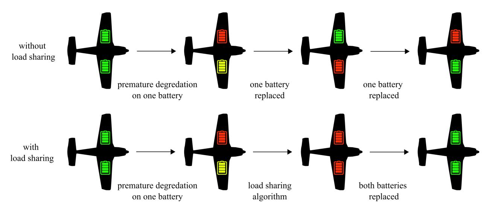
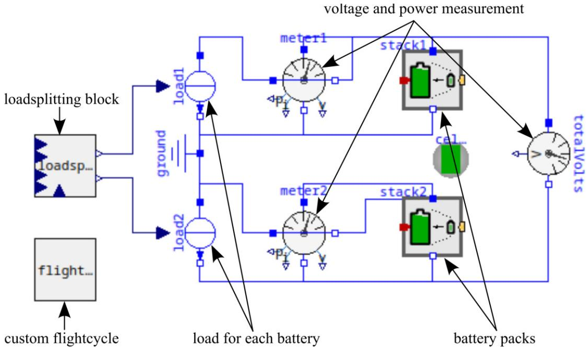
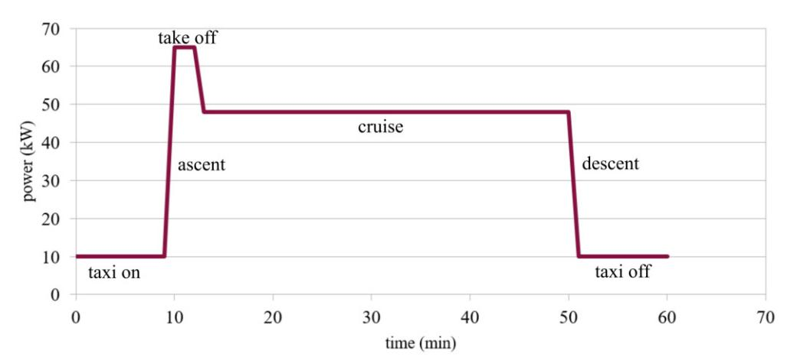
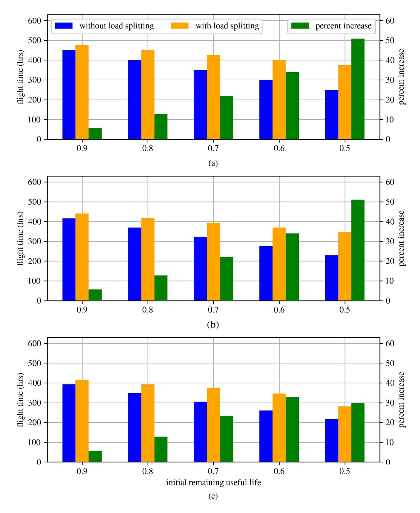

{0}------------------------------------------------

# **Data Assimilation in a Modelica Framework for Optimizing Battery Longevity in Electric Aircraft**

Nathaniel Cooper∗, George Anthony†, Jarett Peskar‡, Austin R.J. Downey§, and Kristen Booth¶

**Electric aircraft have the potential to revolutionize short-distance air travel with lower operating costs and simplified maintenance. Unfortunately, the need for rapid charging and discharging cycles, along with high power demands during flight, complicates the long-term maintenance of the aircraft's battery packs. Safety issues related to thermal runaway of the batteries are also a concern due to the nature of aviation. Therefore, improved battery management systems are needed to ensure adequate safety and maximize the economic benefits. A simple, easy-to-implement algorithm for splitting load demand between two battery cells was developed and applied to a simplified aircraft power train, based on that of the Pipistrel Velis Electro, in OpenModelica. Simulations were then performed using a generic flight profile as a load to determine the improvement in performance after premature replacement of a single stack in terms of flight hours. Results indicate increasing returns the longer the replacement can be delayed, with a 50% increase in flight time in the best case.**

# **I. Nomenclature**

�������� = Constant Current, Constant Voltage ������ = Lithium Iron Phosphate ������ = Open Circuit Voltage ������ = Root Mean Square ������ = Remaining Useful Life ������ = State of Charge ������ = Time to Overhaul

# **II. Introduction**

Electric aircraft have been proposed as a potential solution to the challenges of sustainable transportation. Key to the development of electric aviation is maximizing battery lifespan, particularly when fast charging is implemented [\[1\]](#page-6-0), as rapid charge/discharge cycles can quickly degrade the unit [\[2\]](#page-6-1). In addition, batteries create unique safety issues [\[3,](#page-6-2) [4\]](#page-6-3), such as thermal runaway, which must be addressed.

On an operational level, maintenance issues related to battery degradation are critical to the economic viability of electric aircraft [\[1\]](#page-6-0). The frequent charge and discharge cycles required to maintain the aircraft's availability combined with high power demands during flight accelerate the degradation and greatly reduce the lifespan of the batteries. Subsequently, ensuring the longevity of the batteries, and therefore reducing the expenses associated with replacement, is a significant challenge. Digital twins offer the ability to track the state of various electric aircraft subsystems in real-time; when combined with remaining useful life (RUL) forecasting tools [\[5\]](#page-6-4), they offer the potential to optimally manage the degradation and maintenance of batteries.

<sup>∗</sup>Graduate Student, Department of Mechanical Engineering, University of South Carolina, Columbia, SC 29208, USA.

<sup>†</sup>Graduate Research Assistant, Department of Mechanical Engineering, University of South Carolina, Columbia, SC 29208, USA.

<sup>‡</sup>Graduate Research Assistant, Department of Mechanical Engineering, University of South Carolina, Columbia, SC 29208, USA.

<sup>§</sup>Associate Professor, AIAA Member, Department of Mechanical Engineering, Department of Civil, and Environmental Engineering, University of South Carolina, Columbia, SC 29208, USA, Contact Author austindowney@sc.edu

<sup>¶</sup>Assistant Professor, Department of Electrical Engineering, University of South Carolina, Columbia, SC 29208, USA.

{1}------------------------------------------------

<span id="page-1-0"></span>

**Fig. 1 Scenario of battery fault showing how the load sharing algorithm extends the life of the battery to allow for a consistent maintenance schedule.**

Previous efforts by the authors in Anthony et al. [\[6\]](#page-6-5) developed an adaptive agent to share the load between multiple battery packs by monitoring the status and health of each battery in real-time and adjusting power routing on the fly. The simplistic models used in this prior word were modeled in OpenModelica v3.2.3 [\[7\]](#page-6-6). The load splitting algorithm developed in [\[6\]](#page-6-5) splits the load to prioritize drawing power from the battery with a higher RUL, degrading it faster than the older battery until the RUL has been evened out between the two. This reduces unnecessary strain on the older cells and normalizes the maintenance schedule. A graphical representation of this is shown in Fig. [1.](#page-1-0)

Modelica is an open-source, object-oriented language designed for multi-domain modeling of complex physical systems, making it particularly suitable for simulating complicated electro-mechanical systems [\[8\]](#page-6-7). While its capabilities have been explored in modeling electric aircraft, this application is still in its nascent stage, and mature, robust libraries specifically tailored for electric aircraft are yet to be fully developed. Prior works have positively demonstrated Modelica's potential in this domain: Bals et al. [\[9\]](#page-6-8) presented new modeling and simulation methods for electric aircraft systems, including optimization of electric network architecture and system integration using virtual testing; Podlaski et al. [\[10\]](#page-6-9) took initial steps in modeling fully electrified propulsion systems for aircraft using Modelica, introducing novel multi-domain components; and Castro et al. [\[11\]](#page-6-10) developed Modelica models to assess the dynamic performance of different turboelectric architectures for electrified powertrains. These studies collectively demonstrate the potential of Modelica in modeling electric aircraft systems, highlighting its usefulness while also underscoring the need for more mature libraries to fully support the complexity of electric aircraft modeling.

This present work extends the algorithm presented by Anthony et al. [\[6\]](#page-6-5) by incorporating more detailed experimental data, moving the work to a Modelica framework, and using load profiles based on realistic flight paths. This work applies the proposed methodology to two full battery stacks subjected to the typical loadings seen in the Pipistrel Velis Electro; a small trainer aircraft [\[12\]](#page-6-11). In this work, an aircraft with two batteries is considered to experiences a fault event that causes premature degradation in one of the batteries, necessitating its replacement. After the replacement of the one bad battery, there will now be two batteries with different states of health: one old and partially degraded battery, and one new freshly installed. By applying the previously developed load-splitting algorithm, the amount of flight time available before replacing the partially degraded stack can be greatly extended. A repository with example code for this work is publicly available [\[13\]](#page-6-12). The contributions of this paper are twofold. First, a simple and easy-to-implement load splitting algorithm is tested numerically that dynamically allocates power demand between two battery cells based on their RUL, effectively balancing degradation and extending the operational life of the battery packs. Second, simulations demonstrated that implementing this algorithm significantly improves battery lifespan and total available flight time before battery replacement is necessary, achieving up to a 50% increase in flight hours in the best-case scenario.

{2}------------------------------------------------

<span id="page-2-0"></span>

Fig. 2 Simplified Velis Electro power train modeled in OpenModelica.

### III. Methodology

Here two battery stacks based on that found in the Pipistrel Velis Electro are used. The Velis Electro is a commercially available trainer aircraft designed for short flights (maximum range 50 minutes) with a typical recharge cycle of thirty to forty minutes. The full power train consists of two battery packs containing 1152 Samsung INR 18650-33G cells each. Each pack is configured in a 96 series, 12 parallel battery which results in 13.06 kWh per battery, or 26.12 kWh per plane. However, this is typically reported as a nominal 20 kWh battery pack in promotional material. The battery pack is coupled to an emDrive H300C power controller, and an Emrax 268 AC motor [12].

Figure 2 shows an outline of the overall model, built using the standard OpenModelica electrical libraries [7] and one third-party library, ElectricalEnergySystems [14] for the battery stacks. On the far left are two custom components, loadsplitter, and flightcycle. The flightcycle block outputs a continuous charge/discharge cycle in the form of a current load applied to loadsplitter, described in detail below in section III.B. The loadsplitter block divides this total load between the two stacks proportionally based on the stacks' RUL, as shown in the pseudocode in Algorithm 1.:

<span id="page-2-1"></span>**Algorithm 1** Pseudocode for the load splitting algorithm.

```
if 0 < SOC1 < 1 and 0 < SOC2 < 1 then
  Load1 = totalLoad * (RUL1/(RUL1 + RUL2))
  Load2 = totalLoad * (RUL2/(RUL1 + RUL2))
end if
if SOC1 ≠ 0 or 1 and SOC2 = 0 or 1 then
  Load1 = totalLoad
  Load2 = 0
else if SOC1 = 0 or 1 and SOC2 ≠ 0 or 1 then
  Load1 = 0
  Load2 = totalLoad
end if
```

In general, split the load proportional to each stack's RUL

Once split, the two loads are provided as an input to two source current blocks (load1 and load2). These current blocks then discharge (or charge) two packs of 18650 batteries (stack1 and stack2), wired in parallel. The parameterization and characterization of the cells are given in section III.A. The combined voltage of the stacks is then measured via the totalVolts block.

{3}------------------------------------------------

#### <span id="page-3-0"></span>**A. Battery Cell Characterization**

Parameterization of the cell stacks was performed by a combination of experiments and a literature review. The two most important characterization parameters are the SOC-OCV curve and the cell's internal resistance. The SOC-OCV curve maps the open circuit voltage (OCV), the cell's voltage when disconnected from any current load, to the cell's state of charge (SOC), a percentage ranging from 0 to 1. All experiments were performed on a Samsung INR 18650-30Q, a cell similar to those used in the Electro. Key manufacturer specifications and differences between the two cells are summarized in Table [1.](#page-3-1)

**Table 1 Manufacturer specifications of battery cell.**

<span id="page-3-1"></span>

| Specification                           |      | Samsung 33G | Samsung 30Q |           |
|-----------------------------------------|------|-------------|-------------|-----------|
| Diameter,                               | mm   |             | 18.40       | 18.33     |
| Length,                                 | mm   | 65.2        | 64.85       |           |
| Weight,                                 |      | g           | 48.0        | 48.0      |
| Cell Capacity,                          | A-hr |             | 3.15        | 3.0       |
| Nominal Voltage,                        | V    |             | 3.600       | 3.600     |
| Standard Charge Method                  |      |             | CCCV        | CCCV      |
| Standard Charge Current, A              |      |             | 0.975       | 1.5       |
| Standard Charge Voltage, V              |      |             | 4.2         | 4.2       |
| Standard Charge Cutoff, mA              |      |             | 60          | 150       |
| Maximum Charge Current, A               |      |             | 3.250       | 4.000     |
| Standard Discharge Cutoff Voltage, V    |      |             | 2.5         | 2.5       |
| Maximum Continuous Discharge Current, A |      |             | 6.5         | 15.0      |
| Operating Temperature,                  | ° C  |             | -20 to 60   | -20 to 75 |

A series of short pulses of 6 A was applied to a single INR 18650-30Q cell, discharging it in increments of 10% SOC. The current was removed and the cell voltage was allowed to settle, establishing the OCV at each SOC. The resulting measurements were then curve fit using a least-squares method to a function of the form [\[15\]](#page-7-1):

$$OCV = K_0 + K_1 SOC + K_2 \ln(SOC) + K_3 \ln(1 - SOC) \quad (1)$$

At 20 degrees Celsius, these coefficients were ��<sup>0</sup> = 3.284, ��<sup>1</sup> = 0.823, ��<sup>2</sup> = 0.0959, and ��<sup>3</sup> = 0.00343. The data for these tests is available through a pubic repository [\[16\]](#page-7-2). The cell's internal resistance was estimated by measuring the voltage drop during each pulse of the above tests and calculating the resistance from Ohm's Law. At 20 °C, this was found to be 0.0162 Ω.

<span id="page-3-2"></span>

**Fig. 3 A generic power profile for the flight of a small aircraft demonstrating pre/post-flight taxing, ramp to maximum power, take off, and cruise.**

{4}------------------------------------------------

#### <span id="page-4-0"></span>**B. The flightcycle Block**

The flightcycle block can be divided into two parts: the in-flight discharge cycle and the charging cycle. A generic flight profile, based on publicly available records [\[17\]](#page-7-3), of a small aircraft is shown in Fig. [3.](#page-3-2) In such a flight, the plane will swiftly ramp the motor up to its maximum power and briefly hold for takeoff, before reducing power slightly while cruising. To land, the rotor is ramped down in one or more stages. Per the Velis Electro manual [\[12\]](#page-6-11), the peak power during takeoff is limited to 65kW, for a period of up to 90 seconds, then reduces to a maximum of 48 kW while cruising. For the two stacks in parallel, this equates to a maximum total load of 80 A and a cruising load of 60 A. Both values fall well within the limits specified by the manufacturers for the motor (400 A rms and 190 A rms, respectively) and the battery packs (120 A maximum discharge) with plenty of room to spare to account for other equipment and onboard electronics. As such, each simulated flight consists of 1) a 20-second ramp to maximum speed, 2) a 90-second take-off period, 3) a user-defined time at cruising speed, and 4) a 20-second ramp down for landing. The depth of discharge can be varied by increasing or decreasing the cruising time. In addition, an option for a short taxi period at low power before and after each flight is included but is not used in this work. The battery is then charged at a constant 20 A total (or 10 A per stack) until both battery stacks reach at least 90% SOC [\[12\]](#page-6-11). This charging profile relates to a charge rate of 0.265C and is expected to take approximately 4 hours from a full discharge. Once the charging is complete, the discharge cycle begins again.

#### **C. Simulation Procedure**

At the start of each simulation, the SOC of each stack is assumed to be 100%. However, the RUL of each stack is different; while the RUL of stack1 always begins at 1, the RUL of stack2 is varied in increments of 0.1 between 0.9 and 0.5. Thus, in all cases, stack1 represents a fresh, unused battery while stack2 always represents a partially degraded pack. The lower limit of 0.5 RUL was chosen per the limitations established in Anthony et al. [\[6\]](#page-6-5). In each simulation the aircraft alternates between charging and discharging as described above, beginning immediately with a discharge cycle, until the RUL of one or both stacks is less than 0.01, at which point the plane would need to be grounded and the spent stacks replaced. In addition, for each RUL of stack2, three different discharge cycle lengths (from initial power ramp to landing) are simulated: 10 minutes, 30 minutes, and 50 minutes.

Two sets of simulations were performed for each combination of RUL and discharge time. The first charges/discharges the plane as described without the load splitting algorithm. This establishes a baseline for the flight time available for the plane. Then, a second set of simulations with the algorithm was performed. The results of this set can then be compared with the baseline to estimate the gains made by implementing the algorithm.

## **IV. Results**

A summary of the simulation results is given in Fig. [4.](#page-5-0) Results for the iterations with no load splitting are exactly as expected; per the manufacturer, the time to overhaul (TTO) of a fresh battery stack is 500 flight hours, and the total flight time before replacing stack2 is exactly proportional to its starting RUL for short (10 minute) flights. As the length of each flight increases, so does the depth of discharge, placing additional strain on the stacks. In general, the total flight time decreased by 7.6% when going from 10-minute to 30-minute flights, and a further 5.75% when going from 30 minutes to 50 minutes.

With load splitting, increases in available flight time are seen in all cases, as expected. However, the relative gains increase dramatically the more stack2 is initially degraded, eventually pushing the gains to 50% with an initial stack2 RUL of 0.5. The depth of discharge achieved by varying the length of the discharge cycle has no impact on the observed increase in flight time, remaining approximately the same for all initial RULs. The notable exception is for the case of a 0.5 initial stack2 RUL subjected to 50-minute flights, which saw gains of only 30%, actually slightly less than the improvement seen when starting with 0.6 RUL. This may be due to the limitations of the load splitting algorithm. The 0.5 RUL case already existed on the edge of the algorithm's capability, and the additional strain of a high depth of discharge may have created a case where the *effective* starting RUL fell below this limit.

Therefore, additional work on the load-splitting algorithm is required to better assess improvements at low RULs, but based on these results it can be expected to see continued increases. Fortunately, a low initial RUL case is also the most likely possibility in the field. The premature fault and replacement of stack1 which might lead to the simulation scenario becomes more and more likely the longer the two original battery stacks are operated. It is therefore expected that excellent improvements in performance can be realized by implementing the load-splitting algorithm.

{5}------------------------------------------------

<span id="page-5-0"></span>

**Fig. 4 Results with and without the load sharing, showing results for a: (a) 10 minute test; (b) 30 minute test, and; (c) 50 minute test.**

{6}------------------------------------------------

# **V. Conclusion**

This research studies and quantifies the impact of applying a more efficient load-sharing system to the battery packs on an electric aircraft. A simple model of a Pipistrel Velis Electro power system was devised, and all parameters were confirmed to be within manufacturer specifications. Then, two sets of simulations were performed to compare the total available flight time with and without a load-splitting algorithm. Results showed substantial increases, reducing the frequency of battery replacement and grounded time for the aircraft. However, the same limitations of the previously proposed algorithm still exist. Convergence of the two stacks' RUL cannot be guaranteed below an initial stack2 RUL of 0.5, and the system does not account for the strain placed on batteries discharged below 20% SOC. In addition, the present work did not investigate only partial recharge of the stacks, varied charge rates, or other potential irregularities in operation. Additional research is required to evaluate the impact of these factors.

### **Acknowledgments**

This material is based in part upon work supported by the Air Force Office of Scientific Research (AFOSR) through award no. FA9550-21-1-0083. This work is also partly supported by the National Science Foundation (NSF) grant number 2237696. Any opinions, findings, conclusions, or recommendations expressed in this material are those of the authors and do not necessarily reflect the views of the National Science Foundation or the United States Air Force.

### **References**

<span id="page-6-12"></span><span id="page-6-11"></span><span id="page-6-10"></span><span id="page-6-9"></span><span id="page-6-8"></span><span id="page-6-7"></span><span id="page-6-6"></span><span id="page-6-5"></span><span id="page-6-4"></span><span id="page-6-3"></span><span id="page-6-2"></span><span id="page-6-1"></span><span id="page-6-0"></span>[1] Yang, X.-G., Liu, T., Ge, S., Rountree, E., and Wang, C.-Y., "Challenges and key requirements of batteries for electric vertical takeoff and landing aircraft," *Joule*, Vol. 5, No. 7, 2021, pp. 1644–1659. [https://doi.org/10.1016/j.joule.2021.05.001.](https://doi.org/10.1016/j.joule.2021.05.001) [2] Justin, C. Y., Payan, A. P., Briceno, S. I., German, B. J., and Mavris, D. N., "Power optimized battery swap and recharge strategies for electric aircraft operations," *Transportation Research Part C: Emerging Technologies*, Vol. 115, 2020, p. 102605. [https://doi.org/10.1016/j.trc.2020.02.027.](https://doi.org/10.1016/j.trc.2020.02.027) [3] Ma, Y., Teng, H., and Thelliez, M., "Electro-Thermal Modeling of a Lithium-ion Battery System," *SAE International Journal of Engines*, Vol. 3, No. 2, 2010, pp. 306–317. [https://doi.org/10.4271/2010-01-2204.](https://doi.org/10.4271/2010-01-2204) [4] Lee, S., Cherry, J., Safoutin, M., McDonald, J., and Olechiw, M., "Modeling and Validation of 48V Mild Hybrid Lithium-Ion Battery Pack," *SAE International Journal of Alternative Powertrains*, Vol. 7, No. 3, 2018, pp. 273–287. [https://doi.org/10.4271/](https://doi.org/10.4271/2018-01-0433) [2018-01-0433.](https://doi.org/10.4271/2018-01-0433) [5] Lui, Y. H., Li, M., Downey, A., Shen, S., Nemani, V. P., Ye, H., VanElzen, C., Jain, G., Hu, S., Laflamme, S., and Hu, C., "Physics-based prognostics of implantable-grade lithium-ion battery for remaining useful life prediction," *Journal of Power Sources*, Vol. 485, 2021, p. 229327. [https://doi.org/10.1016/j.jpowsour.2020.229327.](https://doi.org/10.1016/j.jpowsour.2020.229327) [6] Anthony, G., Cooper, N., Peskar, J., Downey, A., and Booth, K., "Extending Battery Life via Load Sharing in Electric Aircraft," 2024. [https://doi.org/10.2514/6.2024-2154.](https://doi.org/10.2514/6.2024-2154) [7] OpenModelica Association, *OpenModelica User's Guide*, 2023. URL [https://openmodelica.org/doc/OpenModelicaUsersGuide/](https://openmodelica.org/doc/OpenModelicaUsersGuide/1.21/) [1.21/.](https://openmodelica.org/doc/OpenModelicaUsersGuide/1.21/) [8] Tiller, M., *Introduction to physical modeling with Modelica*, Springer Science & Business Media, 2001. [9] Bals, J., Ji, Y., Kuhn, M. R., and Schallert, C., "Model based design and integration of more electric aircraft systems using modelica," *Moet forum at European power electronics conference and exhibition*, 2009, pp. 1–12. [10] Podlaski, M., Vanfretti, L., Khare, A., Nademi, H., Ansell, P., Haran, K., and Balachandran, T., "Initial steps in modeling of CHEETA hybrid propulsion aircraft vehicle power systems using modelica," *2020 AIAA/IEEE Electric Aircraft Technologies Symposium (EATS)*, IEEE, 2020, pp. 1–16. [11] de Castro Fernandes, M., Wang, Y., Wang, H., Liu, D., Bortoff, S. A., Vanfretti, L., and Takegami, T., "Modeling, Simulation and Control of Turboelectric Propulsion Systems for More Electric Aircrafts using Modelica," *AIAA AVIATION 2022 Forum*, American Institute of Aeronautics and Astronautics, 2022. [https://doi.org/10.2514/6.2022-3873.](https://doi.org/10.2514/6.2022-3873) [12] Pipistrel Vertical Solutions d.o.o., *Velis Electro Pilot's Operating Handbook*, 2020. [13] Cooper, N., and Downey, A., "Paper Data Assimilation in a Modelica Framework for Optimizing Battery Longevity in Electric Aircraft," GitHub, 2025. URL [https://github.com/ARTS-Laboratory/paper-data-assimilation-in-a-modelica-framework-for](https://github.com/ARTS-Laboratory/paper-data-assimilation-in-a-modelica-framework-for-optimizing-battery-longevity-in-electric)[optimizing-battery-longevity-in-electric.](https://github.com/ARTS-Laboratory/paper-data-assimilation-in-a-modelica-framework-for-optimizing-battery-longevity-in-electric)

{7}------------------------------------------------

<span id="page-7-3"></span><span id="page-7-2"></span><span id="page-7-1"></span><span id="page-7-0"></span>[14] Einhorn, M. C., F.V., Kral, C., Niklas, C., Popp, H., and Fleig, J., "A Modelica Library for Simulation of Electric Energy Storages," *Proceedings of the 8th International Modelica Conference*, Vol. 63, Linkoping Electronic Conference Proceedings, 2011, pp. 436–445. [15] Chin, C., Gao, Z., and Zhang, C., "Comprehensive electro-thermal model of 26650 lithium battery for discharge cycle under parametric and temperature variations," *Journal of Energy Storage*, Vol. 28, 2020, p. 101222. [https://doi.org/10.1016/j.est.2020.](https://doi.org/10.1016/j.est.2020.101222) [101222.](https://doi.org/10.1016/j.est.2020.101222) [16] ARTS-Lab, "dataset-electrothermal-deformation-characterization-for-samsung-30Q-cell," GitHub, 2024. URL [https://github.](https://github.com/ARTS-Laboratory/dataset-electrothermal-deformation-characterization-for-samsung-30Q-cell) [com/ARTS-Laboratory/dataset-electrothermal-deformation-characterization-for-samsung-30Q-cell.](https://github.com/ARTS-Laboratory/dataset-electrothermal-deformation-characterization-for-samsung-30Q-cell) [17] "Flight Data," [https://www.flightdata.com/,](https://www.flightdata.com/) 2024. Accessed: 2024-05-17.