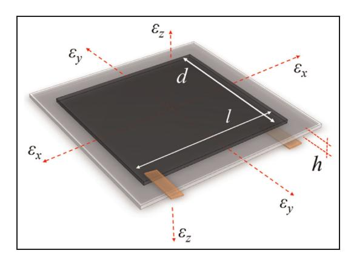
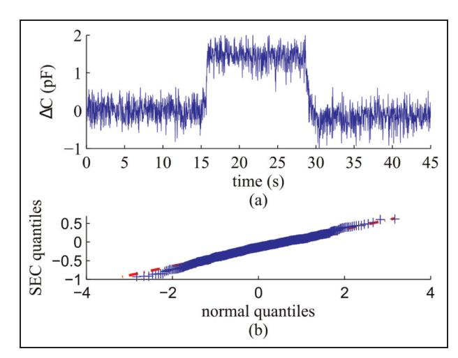
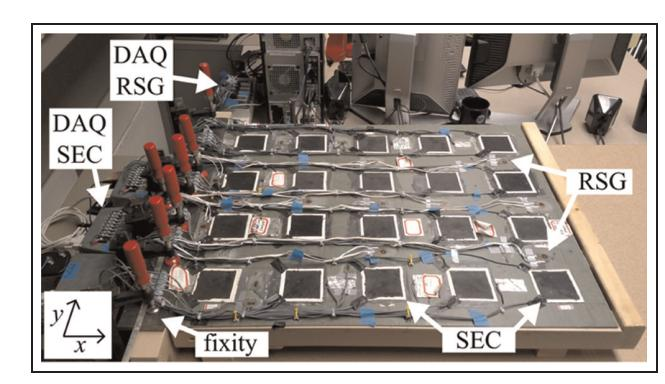
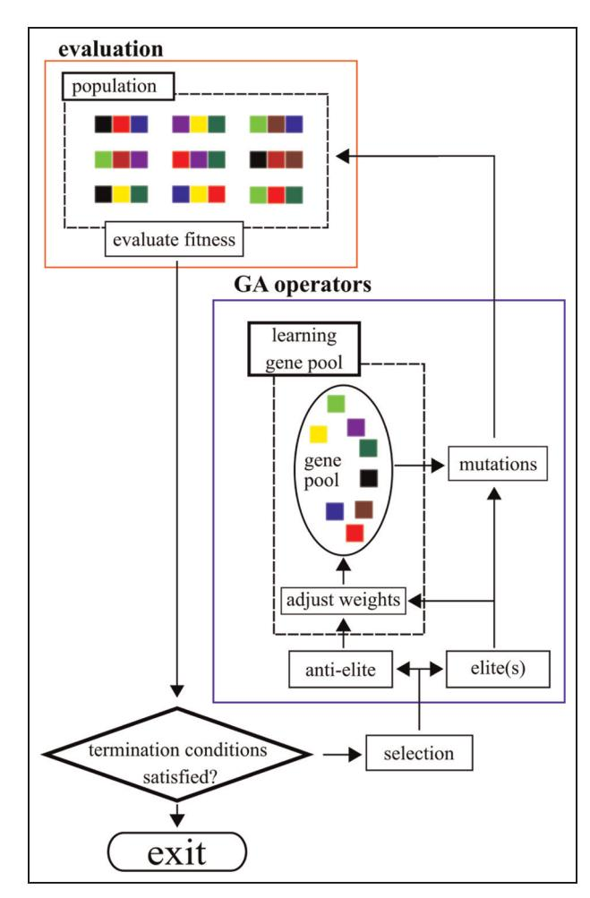
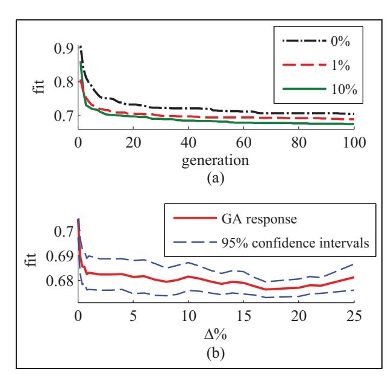
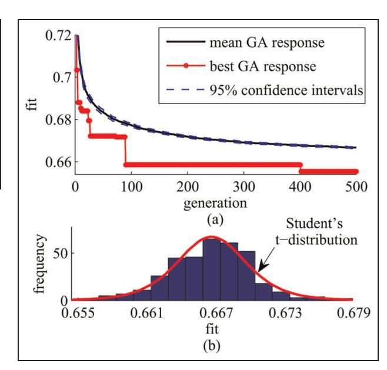
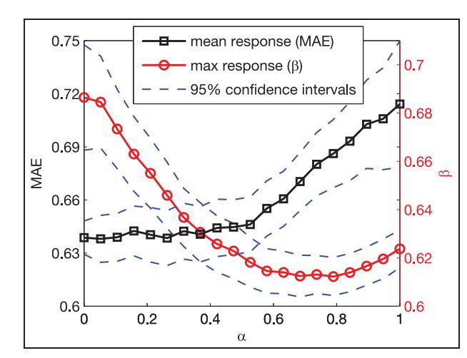
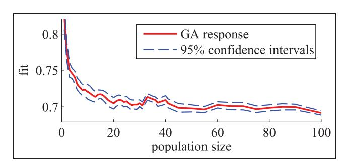
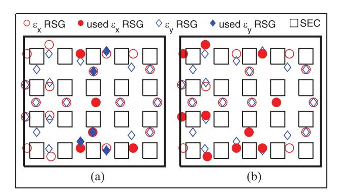

{0}------------------------------------------------

# Optimal sensor placement within a hybrid dense sensor network using an adaptive genetic algorithm with learning gene pool

Austin Downey1 , Chao Hu2,3 and Simon Laflamme1,3

#### Abstract

This work develops optimal sensor placement within a hybrid dense sensor network used in the construction of accurate strain maps for large-scale structural components. Realization of accurate strain maps is imperative for improved strain-based fault diagnosis and prognosis health management in large-scale structures. Here, an objective function specifically formulated to reduce type I and II errors and an adaptive mutation-based genetic algorithm for the placement of sensors within the hybrid dense sensor network are introduced. The objective function is based on the linear combination method and validates sensor placement while increasing information entropy. Optimal sensor placement is achieved through a genetic algorithm that leverages the concept that not all potential sensor locations contain the same level of information. The level of information in a potential sensor location is taught to subsequent generations through updating the algorithm's gene pool. The objective function and genetic algorithm are experimentally validated for a cantilever plate under three loading cases. Results demonstrate the capability of the learning gene pool to effectively and repeatedly find a Pareto-optimal solution faster than its non-adaptive gene pool counterpart.

#### Keywords

Optimal sensor placement, structural health monitoring, dense sensor network, sensor network, genetic algorithm, strain maps, sensing skin, large area electronics

# Introduction

Structural health monitoring (SHM) is the automation of damage detection, localization, and prognosis tasks. From SHM follows prognostics and health management (PHM), which focuses on predicting the remaining useful life of the system based on the inferred health and making optimal (often profit-maximizing) decisions on operations and maintenance (O&M).1,2 Of particular interest to the authors is SHM/PHM of wind turbine blades, where the benefits of condition based maintenance are well understood.2–4 For example, the use of PHM combined with a well-designed SHM system can enable smart load management for damaged wind turbine blades resulting in a reduced operating cost and increased blade life.5

The success of an SHM/PHM system depends heavily on the availability of sensor data and the ability to detect, localize, and quantify a change in health state within the data set. This task becomes increasingly challenging for larger scale systems because of the lack of scalability of existing sensing solutions.6 A solution is to deploy sensor networks, which have been promoted by significant technological advances in sensing, wireless communication, and data processing techniques.7 Also, recent advances in polymers have encouraged the development of flexible electronics, which can be used to form dense sensor networks (DSNs) to monitor large areas at low cost. Such applications are often compared to sensing skins, which often consist of

#### Corresponding author:

Austin Downey, 316 Town Engineering, Iowa State University Ames, IA 50011 USA.

Email: adowney2@iastate.edu

1 Department of Civil, Construction, and Environmental Engineering, Iowa State University, USA

2 Department of Mechanical Engineering, Iowa State University, USA

3 Department of Electrical and Computer Engineering, Iowa State University, USA

{1}------------------------------------------------

discrete rigid or semi-rigid sensing nodes (cells) mounted on a flexible sheet (skin).8,9

The authors have previously developed a capacitance-based sensing skin, termed the soft elastomeric capacitor (SEC). The proposed SEC was designed to be inexpensive with an easily scalable manufacturing process.10 A particular feature of the SEC is that it measures additives in-plane strain, instead of a traditional measurement of the linear strain along a single direction. When used in a DSN configuration, the SEC is able to monitor local additive strain over large areas. The signal can be used to reconstruct strain maps, provided that the additive strain is decomposed into linear strain components along two orthogonal directions. Downey et al. presented an algorithm designed to leverage a DSN configuration along with other off-the-shelf sensors (termed hybrid DSN or HDSN) to enable strain field decomposition.6 The algorithm assumed a shape function and classical Kirchhoff plate theory, as well as boundary conditions, and solved for the coefficients of the shape function using a least squares estimator (LSE). Results demonstrated that such algorithm had great promise for providing strain map measurements, but that its performance was dependent on sensor placement, and that it was critical to develop an optimal sensor placement (OSP) strategy for the placement of sensors within a HDSN.

The objective of an OSP is to identify the optimal locations of sensors such that the measured data provide a rich level of information. An OSP can be expressed as a classical combinatorial problem generalized as: given a set of n candidate locations, find m locations, with m \ n, providing the best possible performance. For optimization problems where m or n are limited, the solution can be solved using a trial-anderror approach. However, for large sizes of m or n, the search becomes computationally demanding; a systematic and efficient sensor placement approach is required. Naturally, two questions arise with regard to sensor placement: which type of sensor placement objective function should be implemented and what algorithm can be applied for an OSP.11

A large number of formulations of the objective function have been developed in prior literature. These can be grouped as:

- (a) Fisher information matrix (FIM) for minimizing the covariance of the parameter estimation error;12–14
- (b) modal assurance criterion (MAC) for minimizing the maximum off-diagonal value (or the highest degree of linearity between different modal vectors) in the MAC matrix;15

- (c) information entropy for minimizing the uncertainty in model parameter estimates;16
- (d) probability of detection for maximizing the probability of damage detection or minimizing the false alarm rate;17
- (e) mean squared error in estimating the structural parameter of interest (e.g. mode shape).14

An objective function chosen to validate sensor placement will vary greatly with respect to the application. Certain objective functions may perform well in selecting sensor locations for global parameter identification (e.g. changes in stiffness) but fail to detect changes in local damage cases (e.g. crack growth). A solution is the formulation of sensor placement as a multi-objective optimization problem.18 For the case of optimizing several conflicting objectives, there does not exist a single solution that simultaneously optimizes every considered objective. However, there is a set of (possibly infinite) optimal solutions known as Pareto-optimal solutions. These solutions reside on the Pareto frontier.

After an appropriate formulation of the objective function is determined, the remaining task is to select the optimal sensor locations from the predefined set of candidate locations. Various solvers for this discrete optimization problem have been proposed. In SHM, sensor placement for the extraction of modal shapes has been extensively researched due to the significant importance of modal shapes in structural model updating.7,11,13,19,20 Some solvers that show good promise for optimizing sensor placement within a HDSN are reviewed here. Sequential sensor placement offers a systematic approach by selecting the sensor location that results in the highest addition in information entropy for one added sensor and setting that as the first optimal sensor position. All subsequent sensor location selections are made in a similar manner. While computationally efficient, sequential sensor placement solvers lack the ability to find optimal sensor locations because its search tree is limited by previously selected sensor locations.12,16 The monkey search algorithm, in its most basic form, seeks to expand on the sequential sensor placement in searching multiple branches of the search tree for local optimal solutions. The algorithm is capable of looking at and jumping to other branches whose objective values exceed those of the current solutions, allowing it to search multiple branches rapidly.15 Particle swarm optimization addresses the problem of sensor placement by allowing a set of particles to transverse a search-space while each particle interacts with the global best-fit particle. In comparison to the solvers presented above, swarm optimization does not build an OSP solution but rather seeks to improve on a candidate solution (often termed an initial guess) until a solution of acceptable performance is found.14

{2}------------------------------------------------

Genetic algorithms (GAs), based on the mutation of genes over generations, have been proposed as an effective solution to the limited search space of the sequential sensor placement and monkey search algorithms.13 They are bio-inspired global probabilistic search algorithms that mimic nature's ability to pass genes from one generation to the next.21 GAs greatly lend themselves for use as an OSP solver. Sensor locations can be directly linked to genes that are mutated through the generations and have been widely used for the simultaneous placement of sensors in an OSP.22 After multiple generations, only the strongest genes remain and form the set of sensor locations for optimal sensor placement.20

In this paper, a specialized case of an OSP is presented for application to a HDSN. The HDSN consists of a sensing skin capable of covering large areas at low cost for SHM of large-scale components. The intention is to equip the HDSN with optimally placed resistive strain gauges (RSGs) for the realization of accurate strain maps through providing precise strain measurements at key locations. It will enable HDSNs for strain-based fault diagnosis and prognosis health management techniques and empower low-cost large-area electronics such as the SEC. Sensor placement design for an HDSN should attain three objectives:

- (a) optimize the sharing of sensor network resources;
- (b) reduce type I errors (false positive for damage detection damage);
- (c) reduce type II errors (fail to detect damage).

All three objectives are considered in the OSP developed for increasing the accuracy of the reconstructed strain maps. Sharing of sensor network resources allows the HDSN to increase information entropy without the cost and complexity of additional sensors. A sensor placement algorithm that reduces the probability of type I errors can reduce the maintenance cost and provide the operator with a high level of confidence in the system.23 Additionally, the choice of sensor placement that reduces the probability of type II errors may reduce the risk of catastrophic failure and the potential for loss-of-life events. Sharing of sensor resources within the HDSN is obtained through the implementation of the enhanced LSE algorithm, while the reduction of type I and type II errors is obtained through the consideration of multiple objectives.

This work introduces an objective function based on the linear combination method and validates simultaneous sensor placement while increasing information entropy. The objective function allows for a sensor placement that decreases the likelihood of the SHM system experiencing a type I or type II error. The single objective function and adaptive GA with a learning gene pool are experimentally validated through an OSP problem formulated for a cantilever plate under three loading cases.

For an OSP solver, we adopt a mutation-based GA through investigating the concept that not all sensor locations in m offer the same information potential. We introduce an adaptive mutation-based GA with a gene pool that is capable of learning as the generations advance. Utilizing the basic knowledge that some sensor locations inherently add more information to the system than others, the adaptive GA continuously alters the algorithm's gene pool in reference to the effect of an individual gene on offspring fitness.

Contributions in this article are threefold:

- (a) definition of a multi-objective optimization problem to reduce the occurrence of type I and type II errors in an SHM system, and solving the multiobjective problem as a single objective problem by linear scalarization;
- (b) development of the case study of an adaptive mutation-based GA with learning gene pool for placement of sensors within a HDSN;
- (c) formulation of the optimal deployment of a HDSN utilizing flexible electronics to monitor local changes on a global scale and RGSs for the enforcement of boundary conditions.

#### Background

This section provides the background on the SEC sensor, including its electro-mechanical model and reviews the enhanced LSE algorithm developed in previous work.

#### Soft elastomeric capacitor

The SEC is a robust and highly elastic flexible electronic that transduces a change in its geometry (i.e. strain) into a measurable change in capacitance. The fabrication process of the SEC was documented by Laflamme et al.24 The sensor's dielectric is composed of a styreneethylene-butylene-styrene (SEBS) block co-polymer matrix filled with titania to increase both its durability and permittivity. Its conductive plates are also fabricated from an SEBS, but filled with carbon black particles. All of the components used in the fabrication process are commercially available, and its fabrication process is relatively simple, making the technology highly scalable.

The SEC is designed to measure in-plane strain (x2y plane in Figure 1) and is pre-stretched and adhered to the monitored substrate using a commercial two-part epoxy. Assuming a relatively low sampling rate (\ 1 kHz), the SEC can be modeled as a non-lossy 

{3}------------------------------------------------

capacitor with capacitance C, given by the parallel plate capacitor equation

$$C = e_0 e_r \frac{A}{h} \quad (1)$$

where e0 = 8.854 pF/m is the vacuum permittivity, er is the polymer relative permittivity, A = d l is the sensor area of width d and length l, and h is the thickness of the dielectric as denoted in Figure 1.

Assuming small strain, an expression relating the sensor's change in capacitance to signal can be expressed as

$$\frac{\Delta C}{C} = \lambda(\varepsilon_x + \varepsilon_y) \quad (2)$$

where l = 1/(1 2 n) represents the gauge factor of the sensor, with n being the sensor material's Poisson ratio. For SEBS, n ' 0.49, which yields a gauge factor l' 2. The electro-mechanical model is derived in the work by Laflamme et al.25 Equation (2) shows that the signal of the SEC varies as a function of the additive strain ex + ey. The linearity of the derived electro-mechanical model holds for mechanical responses up to 15 Hz.25 An altered electro-mechanical model has been derived in the work by Saleen et al. for modeling mechanical responses up to 40 Hz, but is not shown here for brevity.26 The SEC's electro-mechanical model has been validated at numerous occasions for both static and dynamic strain, see for example some cited references.24–26 Additionally, the SEC has been shown to operate successfully in the relatively noisy environment of a wind tunnel mounted inside a wind turbine blade model.27

#### Strain decomposition algorithm

The SEC signal comprises of the additive in-plane strain components, as expressed in equation (2). The enhanced LSE algorithm was designed to decompose strain maps by leveraging a HDSN configuration. The algorithm is presented by Downey et al.,6 and is summarized in what follows.

The enhanced LSE algorithm assumes a parametric displacement shape function. For simplicity, consider a cantilever plate that extends into the x–y plane with a constant thickness c, and is fixed along one edge (at x = 0). A pth order polynomial is selected due to its mathematical simplicity to approximate the plates deflection shape. The deflection shape w is expressed as

$$w(x, y) = \sum_{i=2, j=1}^p b_{ij} x^i y^j \quad (3)$$

where bi,j are regression coefficients, with i . 1 to satisfy the displacement boundary condition on the clamped edge where w(0,y) = 0. Taking a HDSN with m sensors and collecting displacements at sensors' locations in a vector W, equation (3) becomes W = ½ w1 -- wk -- wm T = HB. Where H encodes sensor location information and B is the regression coefficients matrix such that B = ½ b1 -- ba T where ba represents the last regression coefficient.

The H location matrix is defined as H =[GxHxjGy Hy] where Hx and Hy account for the SEC's additive strain measurements. Gx and Gy are added as appropriately defined diagonal weight matrices holding the scalar sensor weight values gx,k and gy,k, associated with the k-th sensor. For instance, an RSG sensor k orientated in the x-direction will take weight values gx,k =1 and gy,k = 0. Virtual sensors, treated as RSG sensors with known signals, may also be added into H. Virtual sensors are analogous to RSG sensors, except they are located at points where the boundary condition can be assumed to a high degree of certainty. The matrices are developed from quantities contained in equation (3)

$$\mathbf{H}_x = \mathbf{H}_y = \begin{bmatrix} y_1^x & x_1 y_1^{n-1} & \cdots & x_1^{n-1} y_1 & x_1^n \\ y_m^x & x_m y_m^{n-1} & \cdots & x_m^{n-1} y_m & x_m^n \end{bmatrix} \quad (4)$$

Linear strain functions ex and ey along the x- and ydirections, respectively, can be obtained from equation (3) through the enforcement of Kirchhoffs plate theory as

$$e_x(x, y) = -\frac{c}{2} \frac{\partial^2 w(x, y)}{\partial x^2} = \Gamma_x \mathbf{H}_x \mathbf{B}_x \quad (5)$$

$$e_y(x, y) = -\frac{c}{2} \frac{\partial^2 w(x, y)}{\partial y^2} = \Gamma_y \mathbf{H}_y \mathbf{B}_y \quad (6)$$

where B =[BxjBy] T .

Linear strains at sensors' locations along the x- and y-directions can be obtained from sensors transducing ex(x, y) and ey(x, y). The signal vector S is constructed in terms of the sensors strain signal S = ½s1 --sk --sm T. Thereafter, the regression coefficient matrix B can be estimated using an LSE

Figure 1. Sketch of an SEC's geometry with reference axes.

{4}------------------------------------------------

$$\hat{\mathbf{B}} = (\mathbf{H}^T \mathbf{H})^{-1} \mathbf{H}^T \mathbf{S} \quad (7)$$

where the hat denotes an estimation. It results that the estimated strain maps can be reconstructed using

$$\hat{\mathbf{E}}_x = \Gamma_x \mathbf{H}_x \hat{\mathbf{B}}_x \quad \hat{\mathbf{E}}_y = \Gamma_y \mathbf{H}_y \hat{\mathbf{B}}_y \quad (8)$$

where Ex and Ey are vectors containing the estimated strain in the x- and y-directions for sensors transducing ex(x, y) and ey(x, y), respectively.

A HDSN without a sufficient number of RSGs will result in H being multi-collinear because Hx and Hy share multiple rows, resulting in HT H being non-invertible. This can be avoided by integrating a sufficient number of RSGs into the HDSN.

#### Optimal sensor placement

This section proposes a single objective function that solves the multi-objective problem of decreasing the likelihood of type I and type II errors through the placement of RSGs in the HDSN. The objective function is based on the linear combination method, borrowed from the field of robust design that seeks to find a solution on the Pareto frontier.28 Thereafter, an adaptive GA specially formulated through the use of a learning gene pool for applications in sensor placement is introduced.

#### Bi-optimization objective function

The occurrence of type I and type II errors in a structure depends, in part, on the strain-based fault diagnostic techniques applied to the extracted strain maps. In general, a type I error is the incorrect calcification of a healthy state as a damage state caused by consistently inaccurate strain maps being construed for a structural component. In comparison, a type II error is the failure to detect a structural fault that the properly selected strain-based fault diagnostic technique was designed to detect.

For the purpose of reducing the occurrence of type I errors within the HDSN's extracted strain maps, an optimization problem based on minimizing the mean absolute error (MAE) between the system and its estimated response is utilized. The use of the MAE for validation provides a simple yet effective representation of how a structure will perform under static and dynamic loading. However, sensor placement validation based solely on the sensor network's MAE value may result in locations of high disagreement between the estimated and real systems. In the case of a monitored system, such an occurrence could result in a system component being stressed past its design limit, leading to an undetected localized failure (i.e. type II error). To reduce the occurrence of type II errors in a HDSN, a second optimization problem based on minimizing the maximum difference between the system and its estimated response per any individual point on a strain map is introduced, defined as b. The biobjective optimization problem for placing m sensors can be formulated as

$$\begin{aligned} \text{minimize } & f(\mathbf{P}) = (\text{MAE}(\mathbf{P}), \beta(\mathbf{P})) \\ \text{subject to} & \mathbf{P} = [p_1 \dots p_m]^T \in \mathbb{P} \\ & 0 \leq m \leq n \end{aligned} \quad (9)$$

where P is a unique vector consisting of m unique sensor locations p taken from the global set of sensor locations, P, with size n.

These multi-optimization problems can be combined to form a single objective optimization function with solutions that lie on the Pareto frontier. While various methods have been proposed for finding solutions on the Pareto frontier, a straightforward scalarization approach formulated as a linear combination method is applied here. The linear combination method finds the minimum of a weighted linear combination of objectives, resulting in a Pareto-optimal solution. This approach allows for trade-offs between the two objectives, thereby increasing the usability of the optimization function. The single objective problem for optimizing the placement of m sensors can be formulated as

$$\begin{aligned} \text{minimize } \mathbf{P} & \quad \text{fit} = (1 - \alpha) \frac{\text{MAE}(\mathbf{P})}{\text{MAE}'} + \alpha \frac{\beta(\mathbf{P})}{\beta'} \\ \text{subject to} & \quad \mathbf{P} = [p_1 \dots p_m]^T \in \mathbb{P} \quad (10) \\ & \quad 0 \leq m \leq n \\ & \quad 0 \leq \alpha \leq 1 \end{aligned}$$

where a is a user-defined scalarization factor to weight both objective functions. MAE# and b# are factors used for normalizing MAE and b. The optimization problem expressed in equation (10) can be converted to a MAE value minimization problem for a = 0, or a b minimization problem for a = 1. Selection of an appropriate value for a is based on the abilities of the selected strain-based fault detection techniques to avoid type I and type II errors. Additionally, selection of a depends on the structure's capability to tolerate type I or type II errors.

### Adaptive genetic algorithm

The proposed adaptive GA leverages the intuitive idea that some sensor locations (pk) add little or no information (i.e. low-information gene) to the estimated system when selected for use in a set (i.e. offspring) of potential

{5}------------------------------------------------

sensor locations **P**. Conversely, some genes add a measurable amount of information to the system when selected for use in **P** (i.e. high-information gene). This concept is enforced into the GA through the use of a learning gene pool. The proposed adaptive GA introduces a selection weight  $\delta_k$  to each gene. Selection weights evolve with each generation through a percentage change ( $\Delta\%$ ). Therefore, increasing the likelihood that a high-information gene is selected in the next generation from the gene pool

$$\delta_{k,\text{generation}+1} = \delta_{k,\text{generation}} * \left( 1 + \frac{\Delta\%}{100} \right) \quad (11)$$

Here k is a high-information gene from the current generation. Selection weights also reduce the likelihood that a low-information gene is selected

$$\delta_{k,\text{generation}+1} = \delta_{k,\text{generation}} * \left( 1 - \frac{\Delta\%}{100} \right) \quad (12)$$

where k is a low-information gene. Bounding the maximum and minimum d values ensures that all genes are carried forward, and no genes dominate the gene pool.

The proposed GA framework is presented in Algorithm 1. Here, Pelite is the best performing P vector containing unique sensor locations that comprise the HDSN layout with the best fit. Conversely, Panti 2 elite is a vector containing the sensor locations that achieve the worst fit. Lastly, Ppopulation is the array of vectors that contains all sensor location vectors tested and can be arranged into P1 2 end based on the performance of these sensor location vectors. Figure 2 diagrams the GA flow.

While multiple variations for the adjustment of selection weights are possible, this work will focus on a simple two-part updating technique. First, the elite offspring from a population is extracted, where all genes in Pelite are considered high-information genes. Next, the lowest performing offspring is extracted, where

genes in  $\mathbf{P}_{\text{anti}} - \text{elite}$  are considered low-information genes. Thereafter, gene weights  $\delta$  are adjusted by  $\Delta\%$  as shown in equations (11) and (12).

# Methodology of experimental validation

Validation of the adaptive GA utilizing a learning gene pool is conducted experimentally on a HDSN. This section describes the experimental set-up and methodology used for the experimental validation.

#### HDSN configuration

The HDSN consists of 20 SECs and 46 RSGs deployed onto the surface of a fiberglass plate of geometry 74 3 63 3 0.32 cm3 fixed along one edge with clamps as shown in Figure 3. Each SEC covers 6.5 3 6.5 = 42 cm2 in area, laid out in a 4 3 5 grid array. The point node used in constructing the H matrix is taken as the center of each SEC. RSGs used in the experimental set-up are foil-type strain gauges of 6 mm length manufactured by Tokyo Sokki Kenkyujo, model FLA-6-350-11-3LT. They are aligned along the directions of the plate's edges, in either a single or double configuration, individually measuring ex or ey along the x- and y-axes as indicated in Figure 3. RSGs were arbitrarily located on the plate with the considerations that an equal number of RSGs measure ex and ey and that the RSGs are relatively evenly distributed.

Three different displacement-controlled load cases were selected and applied to the plate.

 Load case I. An upward uniform displacement of 125 mm along the free edge. Load case II. A downward uniform displacement of 97 mm along the free edge. Load case III. A twist of 43 with reference to the initial plane.

Each test consisted of three 15 s sets of unloaded, loaded, and unloaded conditions, for a total of 45 s.

Separate data acquisition (DAQ) hardware is used for the measurement of the SEC and RSG sensors, as annotated in Figure 3. RSG measurements are recorded at 100 Hz using a National Instrument cDAQ-9174 with four 24-bit 350 O quarter-bridge modules (NI-9236). SEC measurements are recorded at 25 Hz using a 16-bit capacitance-to-digital converter, PCAP-02, mounted inside the metal project boxes.

# Signal processing

A representative SEC signal is shown in Figure 4. Here, the capacitance signal is acquired from an SEC sensor under tension (top row, second from left, as shown in

Algorithm 1 Adaptive genetic algorithm with learning gene pool.

1: Pelite = initial guess 2: for generation count do 3: mutate Pelite into Ppopulation 4: for population count do 5: generate LSE strain maps 6: calculate fit 7: end for 8: P1 2 end = ordered Ppopulation f(fit) 9: Pelite = P1 10: adjust dk correlating to pelite 11: Panti 2 elite = Pend 12: adjust dk correlating to panti 2 elite 13: end for

{6}------------------------------------------------

Figure 3) during load case II. Unfiltered data is presented in Figure 4(a). While the acquired sensor signal is relatively noisy, the noise is Gaussian as represented in the Q-Q plot in Figure 4(b). The oversampled signal is then decimated providing a single displaced measurement of greater resolution for use in the Enhanced LSE algorithm.29 Given the static nature of the current work, this technique was found to provide acceptable results.

# Algorithm configuration

Validation of the proposed adaptive GA with learning gene pool is performed for the case of m = 10 (RGS sensor locations) and n = 46 (RSG candidate locations). A HDSN of 20 SECs and 10 RSGs was selected due to its capability to generate a viable estimation of the real system,6 while still providing a sufficient search space. The estimated strain map is validated against the real strain map, as reconstructed using all 46 RSGs.

A single set of optimized sensor placement locations (P) is obtained for the experimental HDSN. The final sensor configuration is the set of locations that best reproduce all six strain maps, three for ex and three for ey, under the three loading cases. Estimated strain maps are produced using the enhanced LSE algorithm presented in the background section. Additionally, five virtual sensor nodes are added along the fixity such that ey = 0. The sensors nodes are evenly spaced, placed at x = 0, y = 0.10, 0.21, 0.31, 0.42 and 0.52 m. Virtual sensors are not placed at the corners to account for edge effects present in the plate.

A set of initial sensor locations are needed to develop the normalization factors, MAE# and b#, used in equation (9). To provide P, a guess set of 50 randomly selected sensor placement locations were produced. Using a single objective optimization function minimizing the MAE a best-of-50 sensor placements was obtained. The optimization function minimizing only the MAE was chosen over that minimizing b, since the former maximizes the fit over all six strain maps and the latter only minimizes the single point of greatest disagreement. This best-of-50 sensor placements set was then used to calculate the MAE# and b# for use with the single objective optimization problem in equation (10).

Figure 2. Adaptive genetic algorithm with learning gene pool.

Figure 3. Experimental HDSN on a fiberglass substrate.

Figure 4. Representative SEC signal: (a) time series for test under load case II, (b) Q-Q plot for the SEC signal under load.

{7}------------------------------------------------

Certain constraints were implemented in the code to ensure the GA progressed efficiently. The number of gene mutations per offspring was based on a shifted half-normal distribution, such that the probability of a one-gene mutated offspring is 0.5 and a 10-gene mutated offspring is 0.03 (3s). Mutated genes are selected from all available genes, excluding the genes present in the parent (i.e. the parent cannot mutate back into itself). The probability of selecting a certain gene from the learning gene pool is based on that gene's relative selection weight. Selection weights were bounded to ensure that no sensor location would become overly dominant or drop out. The lower bound was set to 0.1, while the upper bound was set to 4. These bounds were selected to keep low-information genes available for selection and reward highinformation genes, without allowing them to diverge to infinity. No constraints were enforced between individual offspring.

All GA iterations for parameter testing were run 10 times (the number of repeated GA runs ns = 10) and terminated after 100 generations. The Student's tdistribution with n = ns 2 1 degrees of freedom was used to obtain an estimate of the true (population) mean from the sample mean. Specifically, the 95% confidence interval for the true mean was developed based on the t-distribution to show with a degree of certainty where the true mean lies.

The proposed adaptive GA with a learning gene pool easily lends itself to running in parallel code configurations as each offspring can be calculated independently. Code was developed using a series of Python codes, in combination with MATLAB's parallel computing toolbox. Computations were performed using individual nodes on a high-performance computing cluster (HPC). Each node consisted of two 2.2 GHz 4-Core AMD Opteron 2354 with 8 GB of RAM. The algorithm speed was found to depend almost exclusively on the offspring population size. On average, a population size of 50 took 18.1 s per generation. The final sensor placement results were calculated in 26 h running on 36 nodes.

# Results of experimental validation

This section presents the results from the parameter studies used for the development of a final mutation-based GA configuration. Thereafter, the selected parameters are used to obtain an optimized sensor placement for the experimental HDSN.

# Parametric study

First, the selection weights parameter is studied in relation to the GA's generational results. Tests were performed using a sample population of 50 with the code repeated over 10 runs to obtain a representative response. A reference case was obtained by solving a GA without a learning gene pool (selection weight = 0). The mean value of the 10 individual runs is shown in Figure 5(a). Through comparisons with the adaptive GAs of selection weights of 1% and 10%, it can be observed that the adaptive GAs with a learning gene pool converge to a local minimum faster than the GA without a learning gene pool.

The effects of changing selection weights on the GA's fit after 100 generations are presented in Figure 5(b). The sample mean (i.e. a point estimate of the true mean) and the 95% confidence interval for the true mean are presented as a solid red and a dashed blue line, respectively. Small increases in selection weights for weights under (\1%) have a large effect on the GA's 100 generation results. However, the benefit of an increasing learning gene pool weights greatly diminishes for selection weights greater than 1%. For the remainder of the tests, a gene pool learning weight of 10% was used due to it being a typical response when compared to other weights\1%.

Next, the effect of the population size on the adaptive GA with a learning gene pool is studied. Again, each population size was tested over 100 generations and 10 runs with the mean of the 100th generation for population sizes ranging from 1-100 presented in Figure 6. The analysis shows that an increase in trial population size has a positive result on the GA's fitting capability, as expected. A greater improvement is seen for unit population increases up to 20, than for unit population increases after 20. Results presented here

**Figure 5.** Effects of  $\Delta\%$  on GA fit: (a) fit vs generation and (b) fit after 100 generations vs  $\Delta\%$ .

{8}------------------------------------------------

agree with the use of a population size of 50 as selected earlier. Thus, the population size of 50 is kept constant for all of the additional tests.

The concept of using multiple elites (parents) from each generation through the selection of the top k parents (k = 1.4) was explored. After selecting the top k parents, the next generation was mutated from these with an equal number of mutations per parent. Any remaining offspring were applied to the leading parent to maintain a total population size of 50. Results showed no benefit to the introduction of multiple elites into the GA, therefore these results are emitted from the GA's formulation.

Lastly, a study of the optimization objective function presented in equation (10) is performed. Results presented in Figure 7 show that the proposed objective function is capable of developing a P that accounts for potential type I and type II errors. For the experimental HDSN presented here, and considering type I and type II errors to be of equal importance, results demonstrate that a = 0.5 provides an acceptable sensor

placement set P. Furthermore, when compared with a single objective function based purely on the MAE (i.e. a = 0), the selected value of a = 0.5 provides a 12.53% improvement in b, while only resulting in a 1.47% cost in the MAE. b has a local minimum at a = 0.7, this is a consequence of a . 0.7 putting greater emphasis on fitting one point per generation over 100 generations. Optimum fitting of sensor locations for a . 0.7 requires excessive generations as the problem is solved through reducing the point of greatest disagreement one-at-a-time. In comparison, a \ 0.7 adds more weight to fitting all the points, therefore ensuring that any single point of disagreement is less of an outlier. Selection of an appropriate a depends on engineering judgment but is taken here as a = 0.5 for the subsequent simulations.

# Optimal sensor locations

Sensor placement for RSGs within the experimental HDSN is performed using a selection weight ( $\Delta\%$ ) of 10%, a scalarization factor ( $\alpha$ ) of 0.5, and a population size of 50. The GA was run 360 times for 500 generations with the generational improvements reported in Figure 8(a). The 95% confidence interval for the true mean was estimated using Student's t-distribution as before, presented here as a solid black (true mean) and a dashed blue line (95% confidence interval). The P with the best fit at the 500th generation is presented as the red line with filled circle markers. As expected, the

Figure 6. Effect of offspring population size on GA performance.

Figure 7. Bi-optimization objective function results presented as a function of the scalarization factor a for a single objective function where: a = 0 seeks to minimize a type I error (MAE); a = 1 seeks to minimize a type II error (b).

Figure 8. Results for obtaining the final set of sensor locations: (a) generational results for adaptive GA with learning gene pool used for sensor placement and (b) histogram showing the sensor results evenly distributed about the mean and compared to a Student's t-distribution.

{9}------------------------------------------------

sensor placement fit improves through the generations with a final minimum fit of 0.655, a 34.5% improvement from the best-of-50 starting conditions. Figure 8(b) presents a histogram showing the distribution for the final P, as found by each of the 360 runs with the optimal P being located in the left-most bin. Figure 8(b) demonstrates that the proposed algorithm is capable of repeatedly converging to an optimum solution, without developing any substantial outliers.

The starting guess best-of-50 results for sensor locations is presented in Figure 9(a). The purely random selection procedure selected five gauges in the x -direction, and five gauges in the y-direction. A MAE of 36 me was obtained across all six strain maps with a maximum difference, b, of 201 me. Optimal sensor locations selected through the adaptive GA with a learning gene pool are presented in Figure 9(b). After optimizing the RSG sensor layout, the MAE was reduced to 23 me while b was reduced to 131 me. The adaptive GA with a learning gene pool prioritized the placement of strain gauges in the x-direction. This can be attributed to ex being the dominant strain in the test configuration under study (the dominant bending direction). Strain map reconstruction with the optimized RSG locations provided a 34.5% improvement in the HDSN's MAE and b (due to a = 0.5) over the best-of-50 starting conditions. The improved strain maps are considered rich enough to enable a good decomposition of the additive strain measured by the SECs. Note that weighted factors could be introduced in the objective function if, for instance, a higher degree of fit on ey would be required. The current sensor placement results are limited to the three loading cases presented here. Sensor placement for an extended loading case library and the effect of dynamic loading cases are left to future work.

# Conclusion

This work presented a multi-objective optimization problem to reduce the occurrence of type I and type II errors in an SHM system, presented a case study of an adaptive mutation-based GA with a learning gene pool for the placement of sensors within a HDSN, and deployed a HDSN utilizing flexible electronics with optimally placed RSGs for the enforcement of boundary conditions. The effort presented here expands on the development of a low-cost sensing skin for monitoring large-scale structural components, including wind turbine blades. A novel sensor (SEC) is combined with a mature technology (RSGs) to form a HDSN capable of large-surface monitoring where the SEC provides a low-cost additive in-place strain measurements over the entire system and the RSGs are used for the enforcement of boundary conditions at key locations. When combined with a previously developed strain decomposition technique, unidirectional strain maps can be obtained, therefore allowing the HDSN to act as a sensing skin capable of monitoring local uni-directional changes in strain over a global area.

An OSP for finding the key boundary condition locations for the deployment of RSGs within a grid of SECs was investigated with the intention to limit the number of RSGs used within the HDSN. A multiobjective optimization problem to reduce the occurrence of type I and type II errors in SHM and PHM was defined. The multi-objective optimization problem was formulated as a single objective optimization problem by linear scalarization. The objective problem was solved through an adaptive GA with a learning gene pool for the placement of RSG sensors within the HDSN. The adaptive GA gene pool was updated every generation to reflect the quantity of information individual genes added to offspring.

Experimental validation demonstrated the adaptive GA's capability to efficiently place RSG sensors within a HDSN with consideration of predetermined loading cases. The efficient placement of RSG sensors enables the deployment of large arrays of SECs over a large surface with the integration of a minimal number of RSGs. This will allow the monitoring of strain maps over large structural components, thereafter, strain maps could be used to detect, localize, and quantify damage, or to create high fidelity models to enhance our understanding of certain structural behaviors. Such models can be particularly helpful in the development of PHM models and condition-based maintenance scheduling.

Figure 9. Optimized Sensor placement: (a) sensor placement for best of 50 random placements and (b) sensor placement obtained through adaptive GA with a learning gene pool.

{10}------------------------------------------------

#### Funding

This work was supported by the National Science Foundation (grant number 1069283) which supports the activities of the Integrative Graduate Education and Research Traineeship (IGERT) in Wind Energy Science, Engineering and Policy (WESEP) at Iowa State University. The development of the SEC technology was supported by (grant number 13-02) from the Iowa Energy Center. Their support is gratefully acknowledged.

#### References

1. Si XS, Wang W, Hu CH, et al. Remaining useful life estimation–A review on the statistical data driven approaches. Eur J Oper Res 2011; 213(1): 1–14. 2. Hu C, Youn BD, Wang P, et al. Ensemble of data-driven prognostic algorithms for robust prediction of remaining useful life. Reliab Eng & Syst Safe 2012; 103: 120–135. 3. Adams D, White J, Rumsey M, et al. Structural health monitoring of wind turbines: Method and application to a HAWT. Wind Energy 2011; 14(4): 603–623. 4. Chang PC, Flatau A and Liu SC. Review paper: Health monitoring of civil infrastructure. Struct Health Monit 2003; 2(3): 257–267. 5. Richards PW, Griffth DT and Hodges DH. Smart loads management for damaged offshore wind turbine blades. Wind Eng 2015; 39(4): 419–436. 6. Downey A, Laflamme S and Ubertini F. Reconstruction of in-plane strain maps using hybrid dense sensor network composed of sensing skin. Meas Sci Technol 2016; 27(12): 124016. 7. Lynch JP and Loh KJ. A summary review of wireless sensors and sensor networks for structural health monitoring. Shock Vib Dig 2006; 38(2): 91–130. 8. Lee HK, Chang SI and Yoon E. A flexible polymer tactile sensor: fabrication and modular expandability for large area deployment. J Microelectromech Syst 2006; 15(6): 1681–1686. 9. Ahmed M, Gonenli IE, Nadvi GS, et al. MEMS sensors on flexible substrates towards a smart skin. In: Sensors, 2012 IEEE, 2012, pp.1–4. IEEE. Available at: https:// doi.org/10.1109%2Ficsens.2012.6411363 10. Laflamme S, Saleem HS, Vasan BK, et al. Soft elastomeric capacitor network for strain sensing over large surfaces. IEEE ASME Trans Mechatron 2013; 18(6): 1647–1654. 11. Yi TH and Li HN. Methodology developments in sensor placement for health monitoring of civil infrastructures. Int J Distrib Sens N 2012; 2012. 612726 pp. 12. Kammer DC. Sensor placement for on-orbit modal identification and correlation of large space structures. J Guid Control Dyn 1991; 14(2): 251–259. 13. Yao L, Sethares WA and Kammer DC. Sensor placement for on-orbit modal identification via a genetic algorithm. AIAA J 1993; 31(10): 1922–1928. 14. Rao ARM and Anandakumar G. Optimal placement of sensors for structural system identification and health

monitoring using a hybrid swarm intelligence technique. Smart Mater Struct 2007; 16(6): 2658–2672. 15. Yi TH, Li HN and Zhang XD. Health monitoring sensor placement optimization for Canton Tower using immune monkey algorithm. Struct Control Health Monit 2015; 22(1): 123–138. 16. Papadimitriou C and Lombaert G. The effect of prediction error correlation on optimal sensor placement in structural dynamics. Mech Syst Signal Process 2012; 28: 105–127. 17. Guratzsch RF and Mahadevan S. Structural health monitoring sensor placement optimization under uncertainty. AIAA J 2010; 48(7): 1281–1289. 18. Abraham A and Jain L. Evolutionary multiobjective optimization. In: Advanced information and knowledge processing, London: Springer, 2005, pp.1–6. 19. Brownjohn JMW, Xia PQ, Hao H, et al. Civil structure condition assessment by FE model updating: Methodology and case studies. Finite Elem Anal Des 2001; 37(10): 761–775. 20. Worden K and Burrows A. Optimal sensor placement for fault detection. Eng Struct 2001; 23(8): 885–901. 21. Holland JH. Adaptation in natural and artificial systems: An introductory analysis with applications to biology, control, and artificial intelligence. Ann Arbor: U Michigan Press, 1975. 22. Guo H, Zhang L, Zhang L, et al. Optimal placement of sensors for structural health monitoring using improved genetic algorithms. Smart Mater Struct 2004; 13(3): 528–534. 23. Scudder HE, Jacobs J, HeighWay R, et al. The book of fables: Chiefly from Aesop – The shepherd-boy and the wolf. Houghton: Miffin, 1882. 24. Laflamme S, Kollosche M, Connor JJ, et al. Robust flexible capacitive surface sensor for structural health monitoring applications. J Eng Mech-ASCE 2013; 139(7): 879–885. 25. Laflamme S, Ubertini F, Saleem H, et al. Dynamic characterization of a soft elastomeric capacitor for structural health monitoring. J Struct Eng 2015; 141(8): 04014186. 26. Saleem H, Downey A, Laflamme S, et al. Investigation of dynamic properties of a novel capacitive-based sensing skin for nondestructive testing. Mater Eval 2015; 73(10): 1384–1391. 27. Downey A, Laflamme S, Ubertini F, et al. Experimental study of thin film sensor networks for wind turbine blade damage detection. In: Chimenti DE and Bond LJ (eds) 43rd review of progress in quantitative nondestructive evaluation. CNDE, 2016, pp.10. Available at: https://doi.org/ 10.1063%2F1.4974617 28. Doltsinis I and Kang Z. Robust design of structures using optimization methods. Comput Methods Appl Mech Eng 2004; 193(23): 2221–2237. 29. Hauser MW. Principles of oversampling A/D conversion. J Audio Eng Soc 1991; 39(1/2): 3–26.