{0}------------------------------------------------

2018

# Sensing skin for the structural health monitoring of mesoscale structures

Austin Robert Johnson Downey *Iowa State University*

Follow this and additional works at: [https://lib.dr.iastate.edu/etd](https://lib.dr.iastate.edu/etd?utm_source=lib.dr.iastate.edu%2Fetd%2F16571&utm_medium=PDF&utm_campaign=PDFCoverPages)


Part of the [Engineering Commons,](http://network.bepress.com/hgg/discipline/217?utm_source=lib.dr.iastate.edu%2Fetd%2F16571&utm_medium=PDF&utm_campaign=PDFCoverPages) and the [Oil, Gas, and Energy Commons](http://network.bepress.com/hgg/discipline/171?utm_source=lib.dr.iastate.edu%2Fetd%2F16571&utm_medium=PDF&utm_campaign=PDFCoverPages)

This Dissertation is brought to you for free and open access by the Iowa State University Capstones, Theses and Dissertations at Iowa State University Digital Repository. It has been accepted for inclusion in Graduate Theses and Dissertations by an authorized administrator of Iowa State University Digital Repository. For more information, please contact [digirep@iastate.edu](mailto:digirep@iastate.edu).

# Recommended Citation

Downey, Austin Robert Johnson, "Sensing skin for the structural health monitoring of mesoscale structures" (2018). *Graduate Theses and Dissertations*. 16571. [https://lib.dr.iastate.edu/etd/16571](https://lib.dr.iastate.edu/etd/16571?utm_source=lib.dr.iastate.edu%2Fetd%2F16571&utm_medium=PDF&utm_campaign=PDFCoverPages)

{1}------------------------------------------------

### Sensing skin for the structural health monitoring of mesoscale structures

by

Austin Robert Johnson Downey

A dissertation submitted to the graduate faculty in partial fulfillment of the requirements for the degree of

DOCTOR OF PHILOSOPHY

Co-majors: Wind Energy Science, Engineering, and Policy; Engineering Mechanics

Program of Study Committee: Chao Hu, Co-major Professor Stephen Holland, Co-major Professor Simon Laflamme Partha Sarkar Ashraf Basrawros Adarsh Krishnamurthy

The student author, whose presentation of the scholarship herein was approved by the program of study committee, is solely responsible for the content of this dissertation. The Graduate College will ensure this dissertation is globally accessible and will not permit alterations after a degree is conferred.

Iowa State University

Ames, Iowa

2018

Copyright c Austin Robert Johnson Downey, 2018. All rights reserved.

{2}------------------------------------------------

ii

# DEDICATION

I would like to dedicate this work with gratitude to the Iowa Community College System. Thank you.

{3}------------------------------------------------

# TABLE OF CONTENTS

|                                                                       |                                 | Page  |    |
|-----------------------------------------------------------------------|---------------------------------|-------|----|
| LIST OF TABLES                                                        |                                 | x     |    |
| LIST OF FIGURES                                                       |                                 | xii   |    |
| ACKNOWLEDGMENTS                                                       |                                 | xxii  |    |
| ABSTRACT                                                              |                                 | xxiii |    |
| CHAPTER 1. INTRODUCTION                                               |                                 | 1     |    |
| 1.1 Why Sensing Skins?                                                |                                 | 1     |    |
| 1.2 Proposed Low-Cost Sensing Skin                                    |                                 | 5     |    |
| 1.2.1 Soft Elastomeric Capacitor (SEC)                                |                                 | 5     |    |
| 1.2.2 SEC-Based Sensing Skin                                          |                                 | 9     |    |
| 1.2.3 Applications in Wind Energy                                     |                                 | 10    |    |
| 1.3 Development of the SEC-Based Sensing Skin                         |                                 | 12    |    |
| 1.3.1 Full-Field Strain Maps                                          |                                 | 12    |    |
| 1.3.2 Damage Detection, Feature Extraction and Data Fusion            |                                 | 15    |    |
| 1.3.3 Experimental Wind Tunnel Testing                                |                                 | 16    |    |
| 1.3.4 Contributions                                                   |                                 | 17    |    |
| 1.4 References                                                        |                                 | 18    |    |
| CHAPTER 2. FUSION OF SENSOR GEOMETRY INTO ADDITIVE STRAIN FIELDS MEA- | SURED WITH SENSING SKIN         |       |    |
| 2.1 Introduction                                                      |                                 |       | 28 |
| 2.2 Background                                                        |                                 | 31    |    |
| 2.2.1 Soft Elastomeric Capacitor                                      |                                 | 31    |    |
| 2.2.2 Kriging (Gaussian Process Regression)                           |                                 | 33    |    |
| 2.3 Strain Map Adjustment Algorithm                                   |                                 | 35    |    |
| 2.4 Methodology                                                       |                                 | 40    |    |
| 2.4.1 Experimental Setup                                              |                                 | 40    |    |
| 2.4.2 SEC Noise Quantification                                        |                                 | 41    |    |
| 2.4.3 Numerical Validation                                            |                                 | 41    |    |
| 2.4.4 Experimental Verification                                       |                                 | 44    |    |
| 2.5                                                                   | Results                         | 45    |    |
|                                                                       | 2.5.1 Numerical Validation      | 47    |    |
|                                                                       | 2.5.2 Experimental Verification | 49    |    |
| 2.6                                                                   | Conclusion                      | 50    |    |
| 2.7                                                                   | References                      | 51    |    |

{4}------------------------------------------------

### CHAPTER 3. RECONSTRUCTION OF IN-PLANE STRAIN MAPS USING HYBRID DENSE

| Section/Topic                                  | Page Number |
|------------------------------------------------|-------------|
| <b>SENSOR NETWORK COMPOSED OF SENSING SKIN</b> | 56          |
| 3.1 Introduction                               | 57          |
| 3.2 Background                                 | 59          |
| 3.2.1 Electro-Mechanical Model                 | 60          |
| 3.2.2 Model Validation                         | 61          |
| 3.2.3 Strain Decomposition Algorithm           | 62          |
| 3.3 Extended LSE-based Algorithm using HDSN    | 64          |
| 3.4 Methodology                                | 67          |
| 3.4.1 HDSN Configuration                       | 67          |
| 3.4.2 Algorithm Configurations                 | 68          |
| 3.4.3 Selection of RSGs into the HDSN          | 72          |
| 3.5 Results                                    | 73          |
| 3.5.1 Algorithm Configurations                 | 73          |
| 3.5.2 Algorithm Robustness to Sensor Placement | 78          |
| 3.6 Conclusion                                 | 78          |
| 3.7 References                                 | 79          |

### CHAPTER 4. RECONSTRUCTION OF UNIDIRECTIONAL STRAIN MAPS VIA ITERATIVE

| SIGNAL | FUSION                        | FOR          |                               | MESOSCALE STRUCTURES MONITORED | BY A SENSING SKIN 83 |
|--------|-------------------------------|--------------|-------------------------------|--------------------------------|----------------------|
|        |                               | 4.1          | Introduction                  |                                |                      |
| 4.2    | Background                    |              |                               |                                | 87                   |
| 4.2.1  | Soft                          |              | Elastomeric                   | Capacitor (SEC)                | 87                   |
| 4.2.2  | Optimal                       |              | Sensor                        | Placement                      | 89                   |
| 4.2.3  | Kriging                       |              | (Gaussian Process Regression) |                                | 90                   |
| 4.3    | Iterative Signal Fusion (ISF) |              |                               |                                | 91                   |
| 4.3.1  |                               | Scenario 1   | Traditional                   | Method                         | 92                   |
| 4.3.2  |                               | Scenario 2   | Proposed                      | Method                         | 92                   |
| 4.4    | Methodology                   |              |                               |                                | 95                   |
| 4.4.1  |                               | Experimental | Setup                         |                                | 95                   |
| 4.4.2  | FEA                           | Model        |                               |                                | 97                   |

{5}------------------------------------------------

|     | Section                                         | Score |
|-----|-------------------------------------------------|-------|
|     | 4.5.1 Temporal Strain Data                      | 99    |
|     | 4.5.2 Numerical Investigation of Strain Maps    | 100   |
|     | 4.5.3 Effect of RSGs on Strain Maps             | 101   |
|     | 4.5.4 Experimental Investigation of Strain Maps | 104   |
| 4.6 | Conclusion                                      | 105   |
| 4.7 | References                                      | 106   |

### CHAPTER 5. OPTIMAL SENSOR PLACEMENT WITHIN A HYBRID DENSE SENSOR NET-

| WORK        | USING        | AN              | ADAPTIVE GENETIC ALGORITHM WITH | LEARNING GENE POOL 112 |
|-------------|--------------|-----------------|---------------------------------|------------------------|
| 5.1         | Introduction |                 |                                 | 113                    |
| 5.2         | Background   |                 |                                 | 116                    |
| 5.2.1       | Soft         | Elastomeric     | Capacitor                       | 116                    |
| 5.2.2       | Strain       |                 | Decomposition Algorithm         | 118                    |
| 5.3         | Optimal      | Sensor          | Placement                       | 119                    |
| 5.3.1       |              | Bi-Optimization | Objective Function              | 119                    |
| 5.3.2       |              | Adaptive        | Genetic Algorithm               | 121                    |
| 5.4         | Methodology  | of              | Experimental Validation         | 123                    |
| 5.4.1       | HDSN         |                 | Configuration                   | 123                    |
| 5.4.2       | Signal       | Processing      |                                 | 124                    |
| 5.4.3       |              | Algorithm       | Configuration                   | 124                    |
| 5.5 Results | of           | Experimental    | Validation                      | 126                    |
| 5.5.1       |              | Parametric      | Study                           | 126                    |
| 5.5.2       |              | Optimal Sensor  | Locations                       | 129                    |
| 5.6         | Conclusion   |                 |                                 | 130                    |
| 5.7         | References   |                 |                                 | 131                    |

# CHAPTER 6. ALGORITHM FOR DAMAGE DETECTION IN WIND TURBINE BLADES US-

| ING A HYBRID DENSE SENSOR NETWORK WITH FEATURE LEVEL DATA FUSION |  | 135 |
|------------------------------------------------------------------|--|-----|
| 6.1 Introduction                                                 |  | 136 |
| 6.2 Background                                                   |  | 138 |
| 6.2.1 Soft Elastomeric Capacitor                                 |  | 138 |
| 6.2.2 Strain Decomposition Algorithm                             |  | 140 |
| 6.3 NeRF Algorithm                                               |  | 141 |
| 6.3.1 Network Reconstruction Feature (NeRF)                      |  | 142 |
| 6.3.2 Feature Extraction                                         |  | 143 |
| 6.4 Numerical Models                                             |  | 144 |

{6}------------------------------------------------

| 6.5 | Results                     | 146 |
|-----|-----------------------------|-----|
|     | 6.5.1 NeRF Features         | 146 |
|     | 6.5.2 Damage Quantification | 147 |
|     | 6.5.3 Damage Localization   | 149 |
| 6.6 | Conclusion                  | 154 |
| 6.7 | References                  | 155 |

# CHAPTER 7. INCIPIENT DAMAGE DETECTION FOR LARGE AREA STRUCTURES MONI-TORED WITH A NETWORK OF SOFT ELASTOMERIC CAPACITORS USING RELATIVE

|     | ENTROPY                           | 159 |
|-----|-----------------------------------|-----|
| 7.1 | Introduction                      | 160 |
| 7.2 | Background                        | 161 |
|     | 7.2.1 SEC-based sensing skin      | 161 |
|     | 7.2.2 Universal Kriging           | 164 |
|     | 7.2.3 Kullback-Leibler divergence | 165 |
| 7.3 | Methodology                       | 166 |
|     | 7.3.1 SDI algorithm               | 166 |
|     | 7.3.2 Numerical validation        | 167 |
| 7.4 | Results                           | 168 |
| 7.5 | Conclusion                        | 173 |
| 7.6 | References                        | 174 |

### CHAPTER 8. EXPERIMENTAL WIND TUNNEL STUDY OF A SMART SENSING SKIN FOR

| CONDITION EVALUATION OF A WIND TURBINE BLADE      | 177 |
|---------------------------------------------------|-----|
| 8.1 Introduction                                  | 178 |
| 8.2 Background on Sensing Skin                    | 181 |
| 8.2.1 Soft Elastomeric Capacitor                  | 181 |
| 8.2.2 Strain Decomposition Algorithm              | 182 |
| 8.2.3 Network Reconstruction Feature (NeRF)       | 184 |
| 8.3 Methodology                                   | 186 |
| 8.3.1 Experimental Setup                          | 186 |
| 8.3.2 Verification of Damage Detection Capability | 189 |
| 8.4 Validation                                    | 190 |
| 8.5 Conclusion                                    | 193 |
| 8.6 References                                    | 195 |

{7}------------------------------------------------

| CHAPTER 9. CONCLUSION                           |     |
|-------------------------------------------------|-----|
| 9.1 Future Work                                 | 199 |
| 9.1.1 Realization of the SEC-based sensing skin | 199 |
| 9.1.2 Numerical model updating                  | 200 |
| 9.1.3 Prognostics and health management         | 200 |
| 9.2 References                                  | 201 |

# APPENDIX A. DURABILITY ASSESSMENT OF SOFT ELASTOMERIC CAPACITOR SKIN

| FOR | SHM OF WIND TURBINE BLADES                                   | 202 |
|-----|--------------------------------------------------------------|-----|
| A.1 | Introduction                                                 | 203 |
| A.2 | The Soft Elastomeric Capacitor                               | 204 |
| A.3 | Experimental Methodology                                     | 206 |
|     | A.3.1 Investigated Specimens                                 | 206 |
|     | A.3.2 Sensor Weathering Tests                                | 206 |
|     | A.3.3 Mechanical and Thermal Characterization of the Samples | 207 |
|     | A.3.4 Optical and Visual Characterization of the Samples     | 207 |
|     | A.3.5 Electrical Characterization of the Samples             | 209 |
| A.4 | Results and Discussion                                       | 211 |
|     | A.4.1 Durability Analysis of Mechanical and Thermal Behavior | 211 |
|     | A.4.2 Optical and Visual Analysis                            | 211 |
|     | A.4.3 Capacitance Stability Investigation                    | 214 |
| A.5 | Conclusion                                                   | 215 |
| A.6 | References                                                   | 216 |

# APPENDIX B. INVESTIGATION OF DYNAMIC PROPERTIES OF A NOVEL CAPACITIVE-

| BASED                                                                                           | SENSING SKIN FOR NONDESTRUCTIVE EVALUATION | Page No. |
|-------------------------------------------------------------------------------------------------|--------------------------------------------|----------|
| B.1                                                                                             | Introduction                               | 220      |
| B.2                                                                                             | Background                                 | 221      |
| <span style="display: inline-block; width: 50%;"></span> B.2.1 Fabrication Method               |                                            | 221      |
| <span style="display: inline-block; width: 50%;"></span> B.2.2 Electromechanical Model          |                                            | 222      |
| B.3                                                                                             | Investigation of Dynamic Behavior          | 223      |
| <span style="display: inline-block; width: 50%;"></span> B.3.1 Methodology                      |                                            | 224      |
| <span style="display: inline-block; width: 50%;"></span> B.3.2 Results                          |                                            | 225      |
| <span style="display: inline-block; width: 50%;"></span> B.3.3 Adjusted Electromechanical Model |                                            | 228      |
| B.4                                                                                             | Conclusion                                 | 231      |
| B.5                                                                                             | References                                 | 232      |

{8}------------------------------------------------

# APPENDIX C. DYNAMIC RECONSTRUCTION OF IN-PLANE STRAIN MAPS USING A TWO-

| DIMENSIONAL | SENSING SKIN                     | 235                                  |                                      |     |
|-------------|----------------------------------|--------------------------------------|--------------------------------------|-----|
| C.1         | Introduction                     | 236                                  |                                      |     |
| C.2         | Background                       | 237                                  |                                      |     |
|             | C.2.1 Soft Elastomeric Capacitor | C.2.2 Strain Decomposition Algorithm |                                      | 237 |
|             |                                  |                                      | C.2.2 Strain Decomposition Algorithm | 238 |
| C.3         | Methodology                      | 239                                  |                                      |     |
| C.4         | Results and Discussions          | 240                                  |                                      |     |
| C.5         | Conclusion                       | 242                                  |                                      |     |
| C.6         | Acknowledgments                  | 242                                  |                                      |     |
| C.7         | References                       | 242                                  |                                      |     |

# APPENDIX D. SURROGATE MODEL FOR CONDITION ASSESSMENT OF STRUCTURES

| USING | A DENSE SENSOR NETWORK                  | 244 |
|-------|-----------------------------------------|-----|
| D.1   | Introduction                            | 245 |
| D.2   | Background                              | 246 |
| D.3   | Surrogate Model Formulation             | 248 |
|       | D.3.1 Model Formulation                 | 248 |
|       | D.3.2 Damage Detection and Localization | 251 |
| D.4   | Numerical Example                       | 251 |
|       | D.4.1 Model Description                 | 251 |
|       | D.4.2 Numerical Results                 | 252 |
| D.5   | Conclusion                              | 253 |
| D.6   | References                              | 254 |

# APPENDIX E. PHYSICS-BASED PROGNOSTICS OF LITHIUM-ION BATTERY USING NON-

| LINEAR | LEAST SQUARES WITH DYNAMIC BOUNDS                   | 257 |
|--------|-----------------------------------------------------|-----|
| E.1    | Introduction                                        | 258 |
| E.2    | Review                                              | 262 |
|        | E.2.1 Half-cell model                               | 262 |
|        | E.2.2 On-board estimation of degradation parameters | 263 |
|        | E.2.3 Non-linear least squares method               | 265 |
| E.3    | Methodology                                         | 265 |

{9}------------------------------------------------

| E.4 | Results                                 | 270 |
|-----|-----------------------------------------|-----|
|     | E.4.1 Remaining useful life predictions | 270 |
|     | E.4.2 Dynamic bounds                    | 275 |
|     | E.4.3 Robustness to noise               | 277 |
|     | E.4.4 Algorithm performance             | 279 |
| E.5 | Conclusion                              | 279 |
| E.6 | References                              | 281 |

{10}------------------------------------------------

# LIST OF TABLES

<span id="page-10-0"></span>

|           |                                                                                                                             | Page |
|-----------|-----------------------------------------------------------------------------------------------------------------------------|------|
| Table 2.1 | Parameters used in constructing the FEA model.                                                                              | 41   |
| Table 2.2 | Values associated with the maximum compressive and tensile strain for the load cases presented in figure 2.7.               | 43   |
| Table 2.3 | Displacements associated with the identifiers (A-F) from figure 2.6 for the 10 loading conditions considered for this study | 45   |
| Table 3.1 | Loading cases.                                                                                                              | 68   |
| Table 3.2 | Evaluated algorithm configurations.                                                                                         | 70   |
| Table 3.3 | Weight parameters $γ$ used to enforce the assumptions on boundary conditions.                                               | 70   |
| Table 4.1 | Parameters used in constructing the FEA model.                                                                              | 96   |
| Table 4.2 | Locations of RSGs used in the ISF method.                                                                                   | 96   |
| Table 6.1 | Polynomial complexities used for condition assessment features.                                                             | 144  |
| Table 6.2 | HDSN and FEA configurations.                                                                                                | 144  |
| Table 7.1 | Loading and damage cases used in the numerical simulations.                                                                 | 163  |
| Table 8.1 | Polynomial complexities used for condition assessment features.                                                             | 186  |
| Table 8.2 | Damage steps for boundary conditions (bolts) removed.                                                                       | 189  |
| Table A.1 | Initial capacitance of control specimens and its variation after 12 months.                                                 | 214  |
| Table A.2 | Capacitance of SECs after QUV testing.                                                                                      | 215  |
| Table B.1 | Average RMSE <sub><math>λ</math></sub>                                                                                      | 228  |

{11}------------------------------------------------

| <b>Table E.1</b> |  | Tabulated RUL RMSE for the each cell using the capacity-based and mechanistic prognostics methods.                                            |
|------------------|--|-----------------------------------------------------------------------------------------------------------------------------------------------|
| <b>Table E.2</b> |  | Tabulated RUL improvements for the each cell using the mechanistic prognostics method in comparison to the capacity-based prognostics method. |
| <b>Table E.3</b> |  | Computational time and memory usage analysis for both the classical capacity-based and the newly proposed physics based approach.             |

{12}------------------------------------------------

# LIST OF FIGURES

<span id="page-12-0"></span>

|            |                                                                                                                                                                                                                                               | Page |
|------------|-----------------------------------------------------------------------------------------------------------------------------------------------------------------------------------------------------------------------------------------------|------|
| Figure 1.1 | The soft elastomeric capacitor (SEC): (a) picture of a sensor used in this study with key components annotated; (b) an exploded view of the sensor geometry with key components annotated.                                                    | 5    |
| Figure 1.2 | Conceptual layout of a fully integrated SEC-based sensing skin: (a) showing the key components of an SEC-based sensing skin; and (b) proposed deployment in-side a wind turbine blade.                                                        | 8    |
| Figure 1.3 | Comparisons of different maintenance strategies in terms of complexity and benefits.                                                                                                                                                          | 11   |
| Figure 2.1 | An SEC sensor with key components, dimensions, and axes annotated.                                                                                                                                                                            | 31   |
| Figure 2.2 | Flowchart detailing the strain map adjustment algorithm.                                                                                                                                                                                      | 35   |
| Figure 2.3 | Graphical representation of the first three iterations of the strain map adjustment algorithm for a 1-D pseudo strain data monitored by 5 SECs with the inset showing a closeup of SEC 3.                                                     | 36   |
| Figure 2.4 | Experimental setup used as the basis for the numerical validation and for generating experimental data used in this work.                                                                                                                     | 38   |
| Figure 2.5 | Experimental data for a sensor on the experimental test setup used showing: (a) dynamic response for a sinusoidal input load; (b) static response for a constant load; and (c) q-q plot of the static load compared to a normal distribution. | 39   |
| Figure 2.6 | Schematic representation of the experimental plate with the identifiers (A-F) used for annotating the loading points for the ten load cases presented in Table 2.3.                                                                           | 40   |
| Figure 2.7 | Additive strain maps, generated by the FEA model, for the ten load cases used in the numerical analysis portion of this work. Numerical values for the maximum compressive and tensile strains are listed in Table 2.2.                       | 42   |

{13}------------------------------------------------

- Figure 2.8 SEC-based sensing skin layouts with: (a) six SECs; (b) 28 SECs; and (c) 45 SECs. [42](#page-66-0) Figure 2.9 SEC and RSG layout of the experimental test setup used for experimental validation. [44](#page-68-0) Figure 2.10 Strain maps generated for load case 4: (a) using the traditional kriging method;
- (b) using the strain map adjustment algorithm; and (c) showing the RMSE as a function of number of iterations for the strain map adjustment algorithm where the inset shows the improvement in strain between the traditional kriging method and the proposed algorithm. [46](#page-70-0) Figure 2.11 RMSE results for both the traditional kriging and the adjusted kriging methods for all ten load cases, considered both with and without noise. [48](#page-72-0) Figure 2.12 Temporal RMSE results for the 0.25 Hz loading condition under the experimental:
- (a) load case 1; and (b) load case 2. This figure appears as a video in the online version of this paper. [49](#page-73-0) Figure 3.1 (a) Picture of an SEC sensor compared with an RSG; and (b) sketch of an SEC's geometry with reference axes. [60](#page-84-0) Figure 3.2 (a) Comparison of strain time histories for the SEC and the RSG; and (b) measured strain by the SEC versus applied strain. [62](#page-86-0) Figure 3.3 Cantilever plate with 20 SECs. [63](#page-87-0) Figure 3.4 Modified strain decomposition algorithm. [66](#page-90-0) Figure 3.5 (a) Picture of the experimental configuration; and (b) sensor nomenclature. [67](#page-91-0) Figure 3.6 Example of sensor signals: sensors SEC 16-20 under load case III. [69](#page-93-0) Figure 3.7 Algorithm results for varying RSGs added to the DSN: (a) load case I for <sup>ε</sup>*x*; (b) load case I for <sup>ε</sup>*y*; (c) load case II for <sup>ε</sup>*x*; (d) load case II for <sup>ε</sup>*y*; (e) load case III for <sup>ε</sup>*x*; (f) load case III for <sup>ε</sup>*y*; (g) load case IV for <sup>ε</sup>*x*; and (h) load case IV for <sup>ε</sup>*y*. [71](#page-95-0) Figure 3.8 Decomposed strain maps: (a) load case I for <sup>ε</sup>*x*; (b) load case I for <sup>ε</sup>*y*; (c) load case II for <sup>ε</sup>*x*; (d) load case II for <sup>ε</sup>*y*; (e) load case IV for <sup>ε</sup>*x*; (f) load case III for <sup>ε</sup>*y*; (g) load case IV for <sup>ε</sup>*x*; and (h) load case IV for <sup>ε</sup>*y*. [74](#page-98-0)

{14}------------------------------------------------

- Figure 3.9 Algorithm robustness towards sensor placement: (a) load case I for  $\varepsilon_x$ ; (b) load case I for  $\varepsilon_y$ ; (c) load case II for  $\varepsilon_x$ ; (d) load case II for  $\varepsilon_y$ ; (e) load case III for  $\varepsilon_x$ ;
- |             | (f) load case III for $\varepsilon_y$ ; (g) load case IV for $\varepsilon_x$ ; and (h) load case IV for $\varepsilon_y$ .                                                                                                     |     |
  |-------------|-------------------------------------------------------------------------------------------------------------------------------------------------------------------------------------------------------------------------------|-----|
  | Figure 4.1  | A soft elastomeric capacitor (SEC) sensor with key components and reference axes annotated.                                                                                                                                   | 87  |
  | Figure 4.2  | Flowchart of unidirectional strain map reconstruction using a traditional Kriging method.                                                                                                                                     | 91  |
  | Figure 4.3  | Flowchart of the proposed ISF method.                                                                                                                                                                                         | 93  |
  | Figure 4.4  | Experimental setup used for validating the proposed method: (a) picture of the test bench with key components annotated; (b) schematic of the test bench showing the locations of the sensors, loading point, and added mass. | 95  |
  | Figure 4.5  | SEC signal for sensors A, B, C, and D as denoted in 4.4 under load case 1; here, only every other data point is shown for clarity.                                                                                            | 97  |
  | Figure 4.6  | Effect of number of iterations on the accuracy of the strain maps obtained through ISF for load case 1: (a) MAE versus the number of iterations; and (b) strain maps obtained through ISF and FEA.                            | 98  |
  | Figure 4.7  | Effect of number of iterations on the accuracy of the strain maps obtained through ISF for load case 2: (a) MAE versus the number of iterations; and (b) strain maps obtained through ISF and FEA.                            | 99  |
  | Figure 4.8  | Strain maps obtained through the FEA and the ISF method using the experimental data with 4, 8 and 12 RSGs.                                                                                                                    | 100 |
  | Figure 4.9  | ISF reconstruction error as a function of the number of RSGs used in the algorithm formulation. The error is calculated using both load cases 1 and 2.                                                                        | 101 |
  | Figure 4.10 | Strain maps obtained through the ISF method using the experimental data with 4, 8, and 12 RSGs                                                                                                                                | 102 |
  | Figure 4.11 | Errors, MAE and $\beta$ , as functions of the plate's displacement for: (a) load case 1; and (b) load case 2.                                                                                                                 | 103 |

{15}------------------------------------------------

Figure 4.12 Video (Appendix A) of the experimental test bench operating under load case 1 with real-time strain data shown on the computer monitor and the post-processed uni-directional strain maps presented on the left-hand side. [104](#page-128-0) Figure 5.1 Sketch of a SEC's geometry with reference axes. [117](#page-141-0) Figure 5.2 Adaptive genetic algorithm with learning gene pool. [122](#page-146-0) Figure 5.3 Experimental HDSN on fiberglass substrate. [124](#page-148-0) Figure 5.4 Representative SEC signal: (a) time series for test under load case II, (b) Q-Q plot for the SEC signal under load. [125](#page-149-0) Figure 5.5 Effects of ∆% on GA fit: (a) fit vs generation; and (b) fit after 100 generations vs ∆%. [127](#page-151-0) Figure 5.6 Effect of offspring population size on GA performance. [127](#page-151-0) Figure 5.7 Bi-optimization objective function results presented as a function a the scalarization factor α for a the single objective function where: α = 0 seeks to minimize type I error (MAE); α = 1 seeks to minimise type II error (β). [128](#page-152-0) Figure 5.8 Results for obtaining the final set of sensor locations: a) generational results for adaptive GA with learning gene pool used for sensor placement; b) histogram showing the sensor results evenly distributed about the mean and compared to a Students t-distribution. [129](#page-153-0) Figure 5.9 Optimized Sensor placement: (a) sensor placement for best of 50 random placements; and (b) sensor placement obtained through adaptive GA with learning gene pool. [130](#page-154-0) Figure 6.1 HDSN technology: HDSN section with FBG sensors enforcing strain boundary conditions and SECs providing large area sensing coverage; insert: annotated SEC sensor with reference axes. [139](#page-163-0)

{16}------------------------------------------------

- Figure 6.2 Subdividing a wind turbine blades' complex geometry into independent sections of different resolutions, here the HDSN is deployed only along the bottom of the wind turbine blade for clarity. [142](#page-166-0) Figure 6.3 Network reconstruction feature (NeRF) algorithm. [143](#page-167-0) Figure 6.4 Reconstruction error *V* (scatter plot) and extracted corresponding features (stem plot along the bottom) for the HDSN containing damage case I: a) healthy state; b) damage state (damage case I). [146](#page-170-0) Figure 6.5 Feature distance for complexities terms No. 3 and 13 showing results for varying levels of damage. [147](#page-171-0) Figure 6.6 HDSNs used in simulation of the NeRF: a) rectangular cantilever plate under tensile loading; and b) wind turbine shaped cantilever plate under pressure loading; insert: routing of FBG over diagonal edge to provide alternating measurements of <sup>ε</sup>*<sup>x</sup>* and <sup>ε</sup>*y*. [148](#page-172-0) Figure 6.7 Damage detection and localization for the square plate using feature distances: a) healthy case; b) damage case I; c) damage case II; and d) damage case III. [150](#page-174-0) Figure 6.8 Damage localization within an HDSN: a) damage case III and associated HDSN;
- b) absolute difference (error) between the estimated and measured strain for SECs within the HDSN [151](#page-175-0) Figure 6.9 Damage detection for wind turbine blade using feature distances: a) healthy case;
- b) damage case IV; and c) damage case V. [152](#page-176-0) Figure 6.10 Damage localization within an HDSN: a) damage case IV and associated HDSN;
  - b) absolute difference (error) between the estimated and measured strain for SECs within the HDSN [153](#page-177-0)

{17}------------------------------------------------

- Figure 7.1 SEC-based sensing skin for the monitoring of mesoscale structures showing the:
- (a) SEC sensor with key components and axes annotated; (b) layout of the SECbased sensing skin used in this study including the 3 damage cases investigated; (c) SEC-based sensing skin deployed onto the side of a reinforced cantilever concrete beam [162](#page-186-0) Figure 7.2 Q-Q plot of SEC sensor signal compared to a normal distribution along with the static temporal data from which this data was taken (upper inset) and the sensor's response to a sinusoidal load (lower inset). [163](#page-187-0) Figure 7.3 Full-field KLDs for five different *Q*s, each with a different SEC removed from the kriging training set, showing KLDs increases in the presence of strain map anomalies (e.g. damage). [167](#page-191-0) Figure 7.4 Numerical validation of the SDI algorithm for damage location #1 under loading case #12 showing (by column) the SEC measured strain maps, the SDI generated damage indexes, the Laplace transformation, and the Gaussian transformation for three different damage cases. [168](#page-192-0) Figure 7.5 Numerical validation of the SDI algorithm for damage location #2 under loading case #12 showing (by column) the SEC measured strain maps, the SDI generated damage indexes, the Laplace transformation, and the Gaussian transformation for three different damage cases. [169](#page-193-0) Figure 7.6 Numerical validation of the SDI algorithm for damage location #3 under loading case #12 showing (by column) the SEC measured strain maps, the SDI generated damage indexes, the Laplace transformation, and the Gaussian transformation for three different damage cases. [170](#page-194-0) Figure 7.7 Max damage index values showing the relationship between the healthy and damage values, including damaged values correctly/incorrectly localize the damage, for loading case #12 under damage case: (a) #7; (b) #9; and (c) #10 [171](#page-195-0) Figure 7.8 POD results for damage location: (a) #1; (b) #2; and (c) #3. [172](#page-196-0)

{18}------------------------------------------------

- Figure 8.1 Conceptual layout of a fully integrated SEC-based sensing skin for a wind turbine blade: (a) SEC with connectors and annotated axis; and (b) proposed deployment inside a wind turbine blade. [180](#page-204-0) Figure 8.2 Network reconstruction feature (NeRF) algorithm, the previously developed extended LSE algorithm for strain map decomposition is enclosed inside the dashed red box. [182](#page-206-0) Figure 8.3 Experimental setup: (a) wind turbine blade model mounted in the wind tunnel and buffeting vanes used for generating the turbulent airflow; (b) wind turbine blade showing the model's monitored fiberglass substrate; and (c) DAQ used for the SEC sensors. [187](#page-211-0) Figure 8.4 Experimental HDSN configuration: (a) monitored fiberglass substrate with labeled bolts along the leading edge (right-hand side) of the substrate; (b) schematic with labeled SECs and RSGs, where virtual sensors in the *x* and *y* directions are denoted by blue circles and green diamonds, respectively; and (c) interior surface view of the HDSN (RSGs A and D are not shown, as they were added after the substrate was installed on the model). [188](#page-212-0) Figure 8.5 Comparison of SEC and RSG signals: frequency domain showing the excitation harmonic as detected by the SEC and RSG; (insert) time series data for the SEC and RSG signals. [190](#page-214-0) Figure 8.6 Reconstructed strain maps: (a) healthy condition <sup>ε</sup>*x*; (b) healthy condition <sup>ε</sup>*y*; (c) damage case 8 <sup>ε</sup>*x*; (d) damage case 8 <sup>ε</sup>*y*. [191](#page-215-0) Figure 8.7 Damage localization through updating the monitored substrate's assumed boundary conditions; (a) improvement in strain map reconstruction error obtained by updating boundary conditions to match the monitored substrate's measurements;
  - (b) damage case 2 localized through updating the assumed boundary conditions of the monitored substrate. [192](#page-216-0)

{19}------------------------------------------------

Figure 8.8 NeRF algorithm results for: (a) changing boundary conditions on the leading edge of the monitored substrate; (b) cut damage induced into the center of the monitored substrate. [193](#page-217-0) Figure A.1 The soft elastomeric capacitor (SEC): (a) picture of a sensor used in this study with key components annotated; (b) an exploded view of the sensor geometry with key components annotated. [205](#page-229-0) Figure A.2 Mechanical properties of the SECs and dielectrics, with different levels of TiO<sup>2</sup> (dielectric layer), after accelerated aging: (a) tensile strength; (b) elongation at break; (c) Young's modulus. [208](#page-232-0) Figure A.3 Residual masses of the SECs and dielectrics, with different levels of TiO<sup>2</sup> doped into the dielectric layer, after accelerated aging. [209](#page-233-0) Figure A.4 Change in solar reflectance of the dielectric and the SEC sensor exposed to 1, 7, 15, and 30 days of weathering procedure with respect to the same reference samples, e.g. the dielectric and of the SEC sensors with 0 days of aging (SRday - SRday−0) / SRday−0. [210](#page-234-0) Figure A.5 (a-f): A dielectric with 0% TiO2, a dielectric with 15% TiO2, and an SEC with 15% TiO<sup>2</sup> before (a-c) and after (d-f) the QUV test, respectively. Subfigure (f) shows the deposition of the dielectric material on top of the conductive layer. [212](#page-236-0) Figure A.6 Colorimetry analysis of SECs and dielectrics with different levels of TiO<sup>2</sup> in the dielectric layer, after accelerated aging. [213](#page-237-0) Figure B.1 soft elastomeric capacitor (SEC): (a) picture (75 x 75 mm<sup>2</sup> ); and (b) reference axis [222](#page-246-0) Figure B.2 (a) test setup and (b) RSG strain data [223](#page-247-0) Figure B.3 Time histories and Fourier transforms of signals provided by RSGs and SEC in the harmonic tensile load test [224](#page-248-0) Figure B.4 sensitivity and linearity of the sensor signal at: (a) 1 Hz; (b) 20 Hz; and (c) 40 Hz [225](#page-249-0) Figure B.5 wavelet transform of the a) raw and the b) processed data [226](#page-250-0)

{20}------------------------------------------------

| Figure B.6 root  | mean            | square     | fitting   | error         | for        | the            | capacitance   | data          |                |              |                | 227            |
|------------------|-----------------|------------|-----------|---------------|------------|----------------|---------------|---------------|----------------|--------------|----------------|----------------|
| Figure B.7       | experimental    |            | gauge     | factor        |            |                |               |               |                |              |                | 228            |
| Figure B.8       | Storage         | moduli     | ( G       |               |            |                |               |               |                |              |                |                |
|                  |                 |            | )         | and           | loss       | factor ( η     | G ) as        | functions     | of             | frequency    | for the        | SEC            |
|                  | composite       | (SEBS      | +         | TiO 2 ).      |            |                |               |               |                |              |                | 229            |
| Figure B.9 a)    | Dynamic         |            | Poisson’s | ratio         | and b)     | Poisson’s      | ratio         | loss          | factor         | plotted      | against        | frequenc y230  |
| Figure B.10 Root | mean            | square     | error     |               | (RMSE)     | on the         | estimation    | of            | λ as           | a function   | of             | frequency 230  |
| Figure C.1 SEC   | sensors         |            | used in   | the           | deployment | of             | an            | HDSN:         | (a)            | annotated    | SEC sensor     | with           |
|                  | reference       | axes;      | and       | (b)           | diagrammed |                | extended      | LSE           | algorithm      | for          | developing     | uni           |
|                  | directional     | strain     | maps.     |               |            |                |               |               |                |              |                | 237            |
| Figure C.2       | Experimental    |            | setup     | used for      |            | dynamic        | strain        | map           | reconstruction |              | with key       | compo         |
| nents            |                 | annotated: | (a)       | picture       | of         | the test       | bench         | as tested     |                | with key     | components     | an            |
|                  | notated;        | (b)        | schematic | of            | the test   | bench          | showing       | the           | sensor         |              | locations with | RSG            |
|                  | sensors         | used in    | the       | HDSN          | denoted    | with           | the           | appropriately |                | filled       | square.        | 239            |
| Figure C.3       | uni-directional |            | in-plane  | strain        |            | maps           | reconstructed |               | from           | the HDSN     | using          | the ex        |
|                  | tended          | LSE        | algorithm |               | showing:   | (a) ε x        | ; (b) ε y     | ; and         | (c)            | error for    | ε x and ε y    | along          |
| with             | the             | input      |           | displacement. |            |                |               |               |                |              |                | 240            |
| Figure C.4       | Displacement    |            | of the    | HDSN          | test       | bench          | showing       | the           |                | displacement | for the input  | and            |
|                  | HDSN            | calculated | at        | the           | loading    | connection     | in            | the           | middle         | of the       | plate.         | 241            |
| Figure D.1 The   | proposed        |            | SEC-based |               | sensing    | skin           | showing       | the:          | (a) SEC        | with         | key components |                |
|                  | annotated;      | and        | (b)       | example       | of         | sensing        | skin          | layout with   | key            | components   |                | annotated. 247 |
| Figure D.2       | Illustration    | of         | the       | Mindlin       | element    | with           | four          | nodes         | located        | on the       | mid-line       | of the         |
|                  | element.        |            |           |               |            |                |               |               |                |              |                | 248            |
| Figure D.3       | Flowchart       | of the     |           | proposed      |            | physics-driven |               | algorithm.    |                |              |                | 248            |
| Figure D.4       | Schematic       | of the     |           | numerical     | example.   |                |               |               |                |              |                | 252            |
| Figure D.5       | Contour         | plots      | of the    | identified    | sti        | ff ness        | reduction     |               | values         | for a        | noise level    | of: (a)        |
| 1%               | uniform;        | (b)        | 1%        | Gaussian;     | (c)        | 3%             | Gaussian;     | and           | (d)            | 5% Gaussian. |                | 253            |

{21}------------------------------------------------

Figure E.1 Schematic diagrams of the existing and proposed battery prognostics approaches. [258](#page-282-0) Figure E.2 Flowchart detailing the methods and sequence of steps in the implementation of the classical capacity-based prognostics approach and the proposed mechanistic prognostics approach. [259](#page-283-0) Figure E.3 Flowchart detailing the half-cell model that is used to generate simulated cell data and produce capacity value for the proposed mechanistic approach. [260](#page-284-0) Figure E.4 (a) Half-cell curve analysis with the key components annotated; and (b) Linear, exponential and logarithmic control equations for dynamic NLLS bounds, presented as a unit function. [263](#page-287-0) Figure E.5 Degradation cases for 8 cell models, generated with the highest level of measurement noise, showing the: (a-b) capacity data; (c-d) mass loss of the positive electrode; (e-f) mass loss of the negative electrode; and (g-h) positive electrode slippage where (a),(c),(e) and (g) report the results for cells #1-4 and (b),(d),(f) and (h) report the results for cells #5-8. [264](#page-288-0) Figure E.6 Capacity life prediction for cell #4 using (a) capacity-based prognostics inspected at 25; (b) 50; (c) 100 charge-discharge cycles; (d) mechanistic prognostics inspected at 25; (e) 50; and (f) 100 charge-discharge cycles. [266](#page-290-0) Figure E.7 Mechanistic capacity predictions for cell #8 with 50% bounded coefficients at inspections points of 15, 25, 50 and 100 charge-discharge cycles. [269](#page-293-0) Figure E.8 RUL results for: (a) capacity-based prognostics approach; and (b) mechanistic prognostics approach. [271](#page-295-0) Figure E.9 RUL results using a final dynamic bound value of 500% for the: (a) capacity-based prognostics approach; and (b) mechanistic prognostics approach. [276](#page-300-0) Figure E.10 Numerical investigations in terms of: (a) RUL prediction errors for the three dynamic bound equations, for capacity-based and mechanistic prognostics inspected for a final bound value ranging from 1-500%; (b) noise robustness for the capacitybased approache; and (c) noise robustness for the mechanistic prognostics approach. [278](#page-302-0)

{22}------------------------------------------------

# ACKNOWLEDGMENTS

<span id="page-22-0"></span>It is not often that one gets to acknowledge in writing all the support and encouragement they have received. This page, while insufficient in its scope, is my attempt at that acknowledgment.

First and foremost I would like to thank my parents, Michael and Colleen Downey, who taught me about hard work, honesty, and compassion. Their constant generosity, active citizenship, and focus on improving the lives of others is beyond admirable. I am immensely grateful for their endless love and support.

No acknowledgment would be complete without thanking the professors who enabled me to obtain a Ph.D. First, Simon Laflamme for his mentorship during both my undergraduate and graduate education. Thank you for letting me explore multiple research topics concurrently, paying for all of my travel, and teaching me to enjoy wine. Chao Hu for his incredibly affirmative leadership style, taking on the role of my Ph.D. adviser, and providing me with even more topics to research. Finally, I would like to thank Filippo Ubertini and Antonella D'Alessandro for graciously hosting me at the University of Perugia on multiple occasions, always buying me more equipment, and teaching me to love Italian pasta.

My high-school shop teachers, Al Nielsen and Jeff Masters, who taught me both the industrial arts and the value in taking pride in every step of a complex project, even if no one will ever see your work. I fervently believe that the skills and thought processes I learned in the shop were the most important education I ever received. Thank you for your years of service to the students in Charles City.

A special thanks to Bryan and Cindy McCoy who helped me understand that making biodiesel in the backyard, while educational in its own right, was not a substitute for a formal education. Thank you for all of your encouragement and assistance.

Lastly to all the lab managers, technicians, and staff at Iowa State University. Thank you for letting me borrow/use all the expensive equipment. I put all the tools back.

{23}------------------------------------------------

### ABSTRACT

<span id="page-23-0"></span>Condition evaluation of large-scale (or mesoscale) structures, including civil, aerospace, and energy structures, is difficult due to their large sizes, complex geometries and lack of economic and scalable sensing technologies capable of detecting, localizing, and quantifying faults over a structure's global area. A key challenge in the monitoring of a mesoscale structure is the need to distinguish between faults in the structure's global (e.g. changing load paths, loss in global stiffness) and local (e.g. crack propagation, composite delamination) conditions. This work presents a flexible sensing skin for the cost-effective monitoring of large-scale structures, with a special focus on the monitoring of wind turbine blades. The use of sensing skins, also termed electronic artificial skins (e-skins) or dense sensor networks (DSNs), for the condition assessment of structures is an emerging technology enabling a broad range of sensors and their associated electronics to be integrated onto a single sheet. Sensing skins offer a logical solution to the local/global detection problem as it allows for the localized and discrete monitoring of a structure over the structure's entire global area, and as such, they mimic the ability of biological skin to detect and localize damage.

This work proposes, develops specialized algorithms for, and experimentally validates a sensing skin based on a soft elastomeric capacitor (SEC). The SEC is a large-area electronic that transduces a structure's strain into a measurable change in capacitance. The SEC is highly scalable due to its low cost and ease of fabrication, and can, therefore, be used for the cost-effective monitoring of large-scale components. When arranged in a network configuration, SECs deployed onto the surface of a structure can be used to reconstruct strain maps. These strain maps can then be used to detect, localize, and quantify damage on a structure. One particularly useful attribute of the SEC is its capability to measure the additive strain of a structure (ε*<sup>x</sup>* + <sup>ε</sup>*y*).

In order to effectively utilize a network of SECs, an algorithm that fuses sensor geometry, along with the sensor locations and measured strain values is proposed and validated. This algorithm allows for the reconstruction of more accurate additive strain maps of a structure without having to increase the number of sensors deployed within a sensing skin. In situations where the structure's unidirectional strain maps are 

{24}------------------------------------------------

needed, the main challenge is to decompose the SEC's additive strain map (i.e. <sup>ε</sup>*<sup>x</sup>* + <sup>ε</sup>*y*) into its linear strain components along two orthogonal directions. To address this challenge, two algorithms were developed that leverage a hybrid dense sensor network (HDSN) of SECs and traditional unidirectional strain sensors (e.g. resistive strain gauges and fiber Bragg grated optical sensors) to decompose the additive strain measurements made by the SECs. In cases where quantifying and predicting the health of a structure is the key consideration, algorithms with trackable damage sensitives features must be developed. To this end, this work presents two data fusion techniques that were specially developed for the high-channel-count sensing skin discussed in this work. To experimentally validate the use of an SEC-based sensing skin for the real-time structural health monitoring of wind turbine blades, an experimental validation was conducted by deploying an HDSN consisting of 12 SECs (measuring 38 × 38 mm<sup>2</sup> ) and eight RGSs on the interior of a scaled model wind turbine blade, mounted inside a wind tunnel to simulate an operational environment. The real-time strain maps were then reconstructed and damage sensitive features were then used to track the degrading health of the wind turbine blade under a series of controlled damage cases. Results demonstrate that the SEC-based sensing skin, working in collaboration with the newly proposed algorithms, is able to successfully detect, localize, and quantify damage in a model wind turbine blade. Additionally, these experimental results demonstrate the capability of the SECs to operate in the electromagnetically noisy environment of a wind tunnel, showing that the SEC would be capable of operating inside the similarly noisy environment of a wind turbine blade.

{25}------------------------------------------------

# CHAPTER 1. INTRODUCTION

# 1.1 Why Sensing Skins?

<span id="page-25-0"></span>Recent advances in sensor technologies have reduced the costs associated with the instrumentation of large-scale (or mesoscale) structures, including civil, aerospace, and energy structures, for structural health monitoring (SHM) applications (Giurgiutiu et al., 2004; Lynch et al., 2016). This reduction in cost enables the deployment of distributed dense sensor networks (DSN) for direct damage sensing over large surfaces. Direct sensing is generally considered to be one of the two categories of methods used for the detection and localization of damage, with the other category being the indirect methods (Yao et al., 2014). Indirect sensing technologies (e.g. accelerometers) and methods involve the measurement of a structure's global condition through an often sparse array of sensors. However, the likelihood that a local damage will directly affect the signal output of a sensor is low. As a consequence, these methods rely on sophisticated data analysis and damage detection algorithms. Indirect sensing technologies can be sensitive to, and their application limited by, noisy measurements, complex structures, and/or environmental variations (e.g. humidity and thermal) (Posenato et al., 2008; Enckell et al., 2011). In contrast, direct sensing methods involve the deployment of distributed dense sensor networks that are capable of directly inferring damage from a change in a signal with only simple, often called "threshold" algorithms (Lynch et al., 2004). Examples of strain-based direct damage sensing technologies include fiber-optic sensors, vibrating wire, and resistive strain gauges (RSGs). To provide a structure with a high probability of detection for cracks and other strain field anomalies, a large number of individual sensors are required (Yao et al., 2014; Perry et al., 2017; Tikka et al., 2003; Tung et al., 2014). While mature technologies such as fiber-optic sensors or vibrating wires can be spatially distributed to increase their damage detection resolution, their relatively high costs (including sensors, data acquisition (DAQ), and installation) and relative bulkiness (Lee et al., 2010) when mounted on the surface of a structure make them less suited for the monitoring of mesoscale structures (Enckell et al., 2011; Wang et al., 2012).

{26}------------------------------------------------

The need for spatially distributed strain sensing technologies has been recognized by multiple researchers and addressed using various techniques. One such technique is electrical impedance tomography (EIT) where either the electrical conductivity, permittivity, or impedance is inferred from the electrical measurements made on the surface of a structure. These measurements are then used to generate a tomographic image of the component. EIT has been used for damage detection in structures by measuring the electrical changes in carbon nanotube skins (Loh et al., 2009; Hua et al., 1993), copper doped conductive paints (Hallaji et al., 2014; Zhang, 2006), or through the component itself (Hou and Lynch, 2008). While EIT is capable of producing a relatively high spatial resolution, it requires a high contact density and repeated measurements to solve the tomography mapping's inverse problem. In addition, as the analytical solution for the inverse mapping problem is difficult (or sometimes impossible) to formulate, the finite element or finite difference method must be used to obtain an approximate solution (Borcea, 2002). Despite high spatial resolution capabilities, the requirements for repeated measurements using a variety of contacts and for solving the inverse mapping problem make the EIT technique not well suited for every application. Another electrical tomography technique uses a resistor mesh model to detect and localize damage-induced strain changes in cement doped with multi-walled carbon nanotubes (Downey et al., 2017a). However, this model-assisted approach requires that damage be located through the use of a searching method that updates the resistor mesh model associated with the structure, thus adding a relatively high computational cost to the approach (Downey et al., 2017b). Another notable method to collect spatially distributed strain data is the use of optical measurements (e.g. cameras and photocells) leveraging either digital image correlation (Pan et al., 2009) or photoactive nanocomposites that generate small amounts of light when various levels of strain are reached (Ryu and Loh, 2012). While these measurement systems benefit from their being noncontact methods, their requirement of having either a camera or photocell set back from the structure limits their deployment in some applications.

The use of sensing skins, also termed electronic artificial skins (e-skins) or dense sensor networks for the condition assessment of structures is an emerging technology enabling a broad range of sensors and their associated electronics to be integrated onto a single sheet (Arias et al., 2010; Paradiso et al., 2004; Loh and Azhari, 2012). Sensing skins offer a logical solution to the local/global detection problem as it allows 

{27}------------------------------------------------

for the localized and discrete monitoring of a structure over the structure's entire global area, and as such, they mimic the ability of biological skin to detect and localize damage. Various researchers have proposed sensing skins that are self-contained units, with all the sensing, data acquisition, power harvesting, and communications built onto a single flexible sheet. Numerous examples of sensing skins, at various stages of development, have been tested at the laboratory scale. This section provides a brief review of some of the key sensing skins (and other spatially distributed sensing systems) designed for the monitoring of civil, aerospace, and energy structures.

One example is a sensing skin that uses a plurality of traditional resistive strain gauges (RSGs) and integrated circuits mounted onto a single flexible substrate (Glisic et al., 2016). A prototype of this RSG based sensing skin was fabricated where communications between the sensors and integrated circuits was done through conductive and capacitive antennas to provide a low-cost and scalable architecture (Hu et al., 2014). Tung et al. (Tung et al., 2014) proposed using this RSG-based sensing sheet, along with embedded processors on a 50 µm thick polyimide sheet, for applications related to crack detection and localization. Other promising approaches for the realization of this type of large-scale sensing skin include using a CO<sup>2</sup> laser to directly write RSGs onto a polyimide film. This process forms graphitic porous sensor arrays that behave similar to traditional RSGs and can be easily customizable in shape and size (Luo et al., 2016). Additionally, the use of strain sensors printed with conductive ink (Zhang et al., 2017) has shown considerable potential for the manufacturing of large-scale sensor arrays.

Another category of sensing skins consists of rigid or semi-rigid cells mounted on a flexible sheet, to form a large area electronic. Early work within this subset of sensing skins consisted of capacitive- (Chase and Luo, 1995) and resistance- (Engel et al., 2003) based tactile force sensors. An example of a tactile force sensing skin was demonstrated by Lee et al. (Lee et al., 2006), based on a capacitive tactile sensor. This sensing skin was experimentally verified using a 16 × 16 array of tactile cells and had a spatial resolution of 1 mm. Xu et al. (Xu et al., 2003) utilized a 36-sensor array of resistive heating elements on a flexible polyimide film to measure shear stress topography and flow separation on the leading edge of a deltawing structure during wind tunnel tests. Recently, research has progressed towards microelectromechanical 

{28}------------------------------------------------

systems (MEMS) based flexible skins without the need for rigid packages (Ahmed et al., 2012; Mahmood et al., 2015).

Another popular approach is the use of piezoceramic (PZT) transducers and receivers built into a flexible substrate to generate a sensing skin. For instance, Schulz et al. proposed the use of series-connected PZT nodes for the continuous monitoring of wind turbine blades, allowing for a finer localization of damage (Schulz and Sundaresan, 2006). Simulations were used to show that an array of these sensors, deployed on a 2D plate, could be used to detect and localize damage. Song et al. demonstrated through experimental validation in a wind tunnel that a network of piezoceramic (PZT) sensors can be used to detect damage in wind turbine blades (Song et al., 2013).

Other researchers have looked at using polymer materials doped with carbon nanotubes to form piezoresistive strain sensors. For example, Loh et al. (Loh et al., 2009) demonstrated that a carbon nanotube sensing skin could be used for spatial strain and impact damage detection. Kang et al. (Kang et al., 2006) fabricated a strain sensor from single-walled carbon nanotubes (SWCNT) exhibiting a gauge factor between 1 and 5. Another example of an SWCNT based strain sensor, developed by Chang et al. (Chang et al., 2008), demonstrated a gauge factor of 269. Advanced methods for constructing flexible membranes reinforced with self-assembled arrays of SWCNT have been investigated (Grilli et al., 2014) and show great potential for the development of robust sensing skins. Sung et al. (Sun et al., 2018) demonstrated a spatially distributed sensing skin consisting of 12 discrete strain sensors patterned from SWCNT nanocomposite film deployed in a 3 × 3 grid array. Additionally, integrated sensing skins with both sensors and electronics have been developed from SWCNT-polymer composite patterned onto a flexible polyimide substrate using optical lithography, yielding a linearity in excess of 0.9 (Burton et al., 2017).

Another sensing skin, being developed by the author of this work, is based on a densely deployed network of low-cost large area capacitor, termed the soft elastomeric capacitor (SEC) (Laflamme et al., 2013). The SEC is a robust and durable sensor (Downey et al., 2017c) that is customizable in both shape and size. One particularly useful attribute of the SEC is its capability to measure the additive strain of a structure (ε*<sup>x</sup>* + <sup>ε</sup>*y*) (Laflamme et al., 2013). The individual SEC has been characterized for both its static (Laflamme et al., 2013b) and dynamic (Laflamme et al., 2015) behaviors and its sensing principles are 

{29}------------------------------------------------

<span id="page-29-0"></span>detailed in the following section and the author's proposal for an SEC-based sensing skin, consisting of a network of SEC sensors, is presented in section [1.2.2.](#page-33-0)

# 1.2 Proposed Low-Cost Sensing Skin

This section presents a proposal for the SEC-based sensing skin, starting with the previously developed soft elastomeric capacitor (SEC), then provides a discussion on the layout of a fully integrated sensing skin consisting of SEC sensors and electronics. Additionally, a discussion focused economics and challenges of the specific application of monitoring wind energy structures (e.g. blades and towers) is presented.

### 1.2.1 Soft Elastomeric Capacitor (SEC)

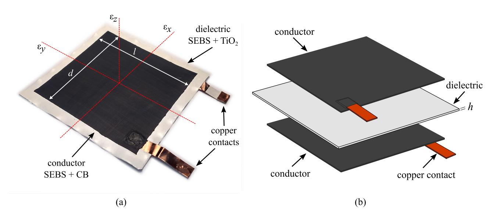

Figure 1.1 The soft elastomeric capacitor (SEC): (a) picture of a sensor used in this study with key components annotated; (b) an exploded view of the sensor geometry with key components annotated.

The SEC, shown in figure 1.1, is a highly scalable thin-film strain sensor with notable elastic properties. Its architecture, manufacturing process, and electromechanical models are presented in Refs. (Laflamme et al., 2013, 2015; Saleem et al., 2015; Downey et al., 2018) and reviewed here for completeness. The sensor is a parallel plate capacitor composed of three layers. These layers consist of two conductive plates

{30}------------------------------------------------

and a dielectric as seen in the expanded view of the SEC in figure [1.1\(](#page-29-0)b). The sensor's strain sensing principle is derived from the fact that a measurable change in the capacitance of a sensor is provoked by a change in the area (i.e. strain) of the monitored surface. The SEC is adhered and pretensioned to the substrate using a commercial two-part epoxy (Zeng et al., 2015). The fabrication of the SEC is simple and does not require any highly specialized manufacturing or processing equipment. The inner layer of an SEC, the dielectric of the capacitor, is made of an styrene-co-ethylene-co-butylene-co-styrene (SEBS) block co-polymer and filled with TiO<sup>2</sup> to increase both its durability and permittivity (Stoyanov et al., 2010; Day, 1990). SEBS is selected due to its purity, elasticity, and strength (Yoda, 1998). TiO<sup>2</sup> is dispersed into a mixture of SEBS and toluene using an ultrasonic tip (D100 Sonic Dismembrator manufactured by Fisher Scientific). The mixture of SEBS-TiO<sup>2</sup> is dropcast onto a glass slide covered with a non-porous Polytetrafluoroethylene (PTFE) coated fiberglass fabric. SECs can be manufactured in any shape or size, typical sizes used throughout this work are squares with lengths of a side measuring either 75 mm or 38 mm. The toluene is then allowed to evaporate over 48 hours, resulting in a highly flexible thin-film dielectric. The sensors conductive plates are fabricated from a similar SEBS-toluene solution, but doped with carbon black (Printex XE 2-B) instead of TiO2. Carbon black as the conductive filler for the capacitor plates is selected for its conductivity, low-cost, simple manufacturing process, ability to absorb both UV and visible light, and its demonstrated weathering protection in plastics and polymer melt mixes (Inc, 2000; Rwei et al., 1992; Downey et al., 2018). The carbon black allows for conductive pathways to form within the SEBS matrix. This solution is hand painted onto both sides of the sensor and a copper contact is added to the sensor with a conductive adhesive. Lastly, a thin layer of the conductive paint is added on top of the copper contact to ensure a good connection between the copper contact and SEBS-based conductive paint as shown in figure [1.1\(](#page-29-0)a). More details regarding the fabrication of the SEC sensors can be found in the literature (Laflamme et al., 2013, 2015; Saleem et al., 2014; Downey et al., 2018). The long-term durability of the SEC is a critical factor for its intended application to the monitoring of wind turbine blades, along with possible applications to other civil infrastructures. An experimental investigation on the durability and weatherability of SEC sensors, with a focus on the development of a mechanically robust sensor capable of withstanding the

{31}------------------------------------------------

<span id="page-31-0"></span>thermal, humidity and UV radiation cycles that the sensor would undergo in a typical exposed application is presented in appendix A.

The capacitance ( $C$ ) of a parallel plate capacitor can be modeled as a non-lossy parallel plate capacitor assuming a sampling rate of less than 1 kHz:

$$C = e_0 e_r \frac{A}{h} \quad (1.1)$$

where  $e_0 = 8.854$  pF/m is the vacuum permittivity,  $e_r$  is the polymer's relative permittivity,  $A = d \cdot l$  is the sensor area of width  $d$  and length  $l$ , and  $h$  is the thickness of the dielectric as annotated in figure 1.1(a). Assuming the SEC is bounded (Zeng et al., 2015) to a substructure that is stiffer than the SEC and only considering small changes in strain, equation 1.1 leads to a differential equation that relates a change in strain to a change in capacitance ( $\Delta C$ ):

$$\frac{\Delta C}{C} = \frac{\Delta d}{d} + \frac{\Delta l}{l} - \frac{\Delta h}{h} \quad (1.2)$$

where  $\Delta d/d$ ,  $\Delta l/l$ , and  $\Delta h/h$ , can be expressed as strain  $\varepsilon_x$ ,  $\varepsilon_y$ , and  $\varepsilon_z$ , respectively. Assuming a plane stress condition,  $\varepsilon_z = -\nu/(1-\nu) \cdot (\varepsilon_x + \varepsilon_y)$  where  $\nu$  is the sensor material's Poisson's ratio taken as  $\nu \approx 0.49$  (Wilkinson et al., 2004). The relative change in capacitance  $\Delta C$  can be related to a change in the sensor's deformation as:

$$\frac{\Delta C}{C} = \frac{1}{1-\nu}(\varepsilon_x + \varepsilon_y) \quad (1.3)$$

assigning the gauge factor  $\lambda$  as  $\lambda = 1/(1 - \nu)$ , the electromechanical equation can be written as:

$$\frac{\Delta C}{C} = \lambda(\varepsilon_x + \varepsilon_y) \quad (1.4)$$

assuming the SEBS that makes up the matrix of the SEC can be approximated as an incompressible material and since  $\nu \approx 0.49$  (Wilkinson et al., 2004), the gauge factor of an SEC bounded to the surface of a stiff structure (relative to the SEC) can be estimated as  $\lambda \approx 2$ . Equation (1.4) shows that the signal of the SEC varies as a function of the sensor's additive strain,  $\varepsilon_x + \varepsilon_y$ .

{32}------------------------------------------------

<span id="page-32-0"></span>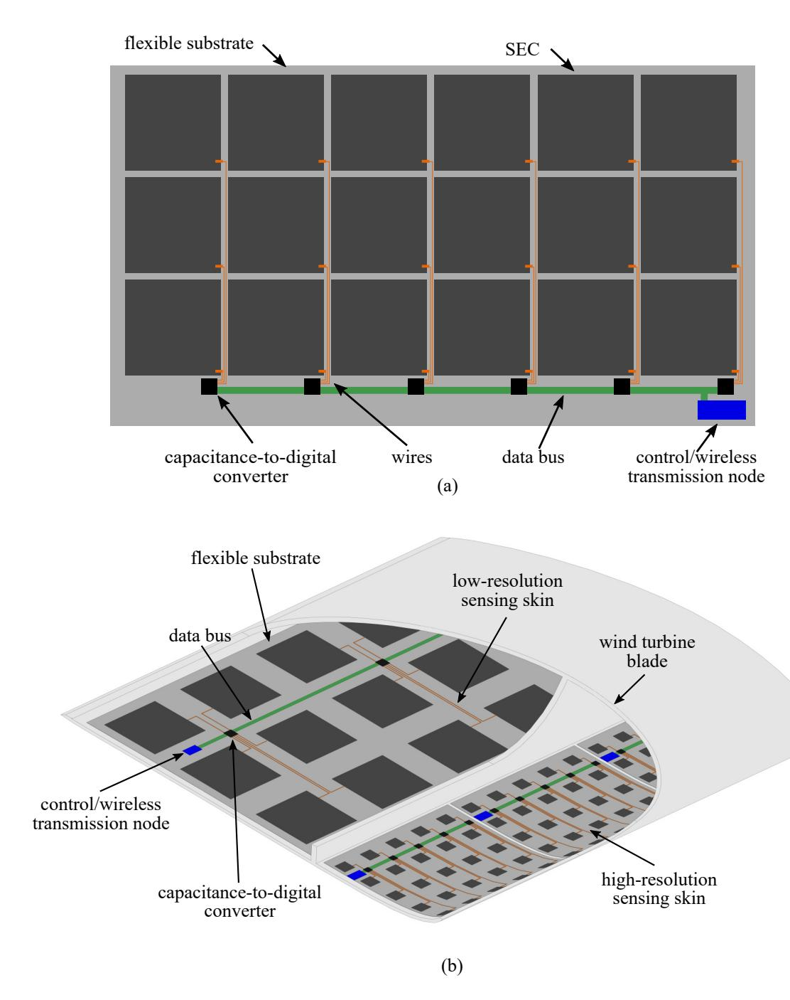

Figure 1.2 Conceptual layout of a fully integrated SEC-based sensing skin: (a) showing the key components of an SEC-based sensing skin; and (b) proposed deployment inside a wind turbine blade.

{33}------------------------------------------------

<span id="page-33-0"></span>The SEC's electro-mechanical model presented in equation [1.4](#page-31-0) has been validated for both static and quasi-static loading conditions (Laflamme et al., 2013b). The linearity of the electro-mechanical model has been validated for mechanical excitation under 15 Hz (Laflamme et al., 2015). Additionally, for mechanical responses up to 40 Hz, an altered electro-mechanical model accounting for the dynamic material properties of the SEC was developed that accounts for the frequency dependent properties of the SEBS polymer. This expanded electromechanical model is discussed in appendix [B](#page-243-0) but is not expanded on here for brevity.

# 1.2.2 SEC-Based Sensing Skin

In this work, the author presents a vision of a fully integrated DSN for the real-time SHM of mesoscale structures, with special attention applied to the monitoring of wind turbine blades. This sensing skin leverages recent advancements in the field of flexible electronics (Rogers et al., 2010) and is based on the inexpensive and robust SEC sensor discussed in the previous section. The SEC-based sensing skin is illustrated in figure [1.2](#page-32-0) The fully integrated DSN system, as presented in figure [1.2\(](#page-32-0)a), would consist of SECs of varying geometries and densities along with the required electronics for power management, data acquisition, data processing, and communications, all mounted onto a flexible substrate (e.g. Kapton). Figure [1.2\(](#page-32-0)b) shows how SEC-based sensing skins of varying geometry could be used in combination for the real-time monitoring of complex structures, here a wind turbine blade is considered. Data (capacitance) for a set of SECs in close proximity would be collected by a centrally located capacitance-to-digital converter, multiplexed to measure multiple SECs. These converters are located close to the SECs to allow for low noise measurements, while multiplexing allows the sensing skin to function with a reduced number of converters. Data would be transferred over a serial bus (e.g. CAN, I2C) to a control/wireless transmission node, this configuration allows multiple capacitance-to-digital converters per transmission node, therefore reducing the number of wireless channels needed. These control nodes collect, process, and parse the data for wireless transmission back to a wireless hub mounted inside the rotor hub. The use of wireless transmission nodes allows for the easy installation of a sensing skin, particularly in cases where a sensing skin is added to an in-service blade such as that needed to monitor a repair (Mar´ın et al., 2008), wireless transmission adds redundancy to the system when compared to a single serial bus being used to carry data over the entire 

{34}------------------------------------------------

<span id="page-34-0"></span>length of the blade, a useful feature given the long service life of wind turbine blades. Power can be provided through a variety of methods, including energy harvesting (for sensing skins mounted inside a wind turbine blade), flexible solar cells embedded into the sensing skin (when mounted on the outside of a wind turbine blade) or batteries when only short-term monitoring is required (e.g. monitoring of initial repair quality).

# 1.2.3 Applications in Wind Energy

The SEC-based sensing skin offers particular benefits for the monitoring of the structural components related to wind energy generation due to the proposed sensing skin's low manufacturing cost, simple deployment and capability to effectively monitor large areas. As with most renewable energies, the growth of wind energy is driven at the nexus of public policy and economics (Borenstein, 2012). While a wind farm's economic viability relies on a combination of public subsidies, a predictable energy source, and mature and reliable technology (Afanasyeva et al., 2016), the economic evaluation of a particular project is challenging due to unpredictable operation and maintenance (O&M) costs. O&M traditionally includes the cost of all necessary repairs and replacements. The initial estimation of O&M costs for wind generating facilities is difficult as operational lifetime data is insufficient or inapplicable to the quickly evolving energy infrastructure. Therefore, O&M costs are estimated on a cost per MW hours basis, allowing owners to share O&M costs across multiple turbines. However, this practice is less convenient for operators of small wind farms where the ability to hedge cost is difficult (Celik, 2003), for operators of wind farms in micro grids where downtime is often compensated for with expensive fossil fuels (VanderMeer and Mueller-Stoffels, 2014), and for operators of wind farms in the offshore environment where the cost structure is often largely unknown (Cockerill et al., 2001).

To achieve an increase in wind turbine system reliability and therefore decrease costs related to wind energy production, an O&M approach that utilizes condition-based maintenance (CBM) should be implemented due to its substantial economic benefits (Besnard et al., 2010; Chang et al., 2003; Ciang et al., 2008; Adams et al., 2011; Yang et al., 2012; Nilsson and Bertling, 2007; Dam and Bond, 2015). The use of condition-based maintenance is even more important for offshore farms where O&M costs may be up to three times higher than that of land-based systems (Kaldellis and Kapsali, 2013), due largely to higher

{35}------------------------------------------------

<span id="page-35-0"></span>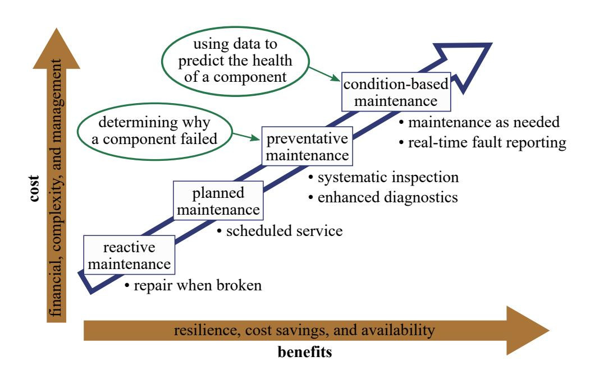

Figure 1.3 Comparisons of different maintenance strategies in terms of complexity and benefits.

transportation and site access costs (Van Bussel and Zaaijer, 2003). Figure 1.3 compares condition-based maintenance, in terms of cost (financial, complexity, and management) and benefits (e.g. resilience, cost savings, and availability) when compared to other maintenance strategies (e.g. reactive, planned, or preventive maintenance).

The current state of condition monitoring of wind turbine blades consists mainly of vibrations and visual analyses (Yang et al., 2012; Adams et al., 2011). Recently, interest has grown in the use of SHM for the condition assessment of wind turbine blades, towers and other structural components due to their high replacement cost (Kaldellis and Kapsali, 2013; Ciang et al., 2008), effect on system availability (Van Bussel and Zaaijer, 2003), and maintenance complexity (Mar´ın et al., 2008). However, monitoring these mesoscale structures is difficult due to the need to distinguish between faults in the structure's global (e.g. changing load paths, loss in global stiffness) and local (e.g. crack propagation, composite delamination) conditions (Ghoshal et al., 2000). The most detailed deployment of sensors for the SHM of wind turbine blades known to the authors was done by Rumsey et al. at Sandia National Laboratories (Rumsey and Paquette, 2008). Various sensor technologies were investigated for the potential of monitoring a composite blade's structural condition during a fatigue test. Generally, successful damage detection was found to require optimal sensor

{36}------------------------------------------------

<span id="page-36-0"></span>placement, synchronization of sampling between different sensor types, and having sensor technology capable of detecting damage that occurs on a small scale while being able to be distributed as an array over the entire structure (i.e. the local/global damage detection). More recent attempts for the SHM of wind turbine blades have used a limited number of sensors and have applied a variety of post-processing techniques (e.g. statistical and modal-based) to localize damage (Ou et al., 2017; Oliveira et al., 2016). These approaches lack the capability to distinguish local failures from global events and have demonstrated a limited effectiveness at damage localization (Adams et al., 2011; Zou et al., 2000). The use of a low-cost sensing skin affords the owners and operators of wind turbine systems the capability to accurately track the growth of localized damage over the blades' global area.

# 1.3 Development of the SEC-Based Sensing Skin

This section discusses the development of algorithms and procedures related to the SEC-based sensing skin as well as the general organization of the dissertation. This dissertation is divided into three main parts: part-1 (section 1.3.1) discusses the development of full-field strain maps, both additive and unidirectional; part-2 (section [1.3.2\)](#page-39-0) discusses algorithms related to damage detection, feature extraction, and data fusion; part-3 (section [1.3.3\)](#page-40-0) discusses experimental testing of a prototype SEC-based sensing skin in the wind tunnel at Iowa State University. In addition to these works, other items of interest with regards to the SECbased sensing skin can be found in the appendix of this work.

#### 1.3.1 Full-Field Strain Maps

#### 1.3.1.1 Additive Strain Maps

As discussed in the prior sections, a network of densely spaced SECs deployed onto the surface of a structure could be used to reconstruct strain maps. Several approaches exist for the purpose of reconstructing full-field strain maps from a set of spatially distributed strain measurements, but all these algorithms assumed that each SEC measured strain located at its geometric center. This assumption may not be realistic since an SEC measures the average strain value of the whole area covered by the sensor. One solution to decrease the error associated in developing full-field strain maps is to reduce the size of each SEC, but this 

{37}------------------------------------------------

would also increase the number of sensors required to cover the large-scale structure, therefore increasing the cost associated with manufacturing, deployment and data processing of the SEC-based sensing skin. Another solution to decreasing the error associated with the SECs additive strain measurement (ε*<sup>x</sup>* + <sup>ε</sup>*y*) over an area is to fuse the sensor's geometric shape into the full-field strain maps, as presented in chapter [2.](#page-51-0) The study presented in chapter [2](#page-51-0) of this work presents an algorithm that accounts for the sensor's strain averaging feature by adjusting the strain measurements and constructing a full-field strain map using the kriging interpolation method. The proposed algorithm fuses the geometry of an SEC sensor into the strain map reconstruction in order to adaptively adjust the average kriging-estimated strain of the area monitored by the sensor to the signal. Results, discussed towards the end of chapter [2,](#page-51-0) show that by considering the sensor geometry, in addition to the sensor signal and location, the proposed strain map adjustment algorithm is capable of producing more accurate full-field strain maps than the traditional spatial interpolation method that considered only signal and location.

### 1.3.1.2 Unidirectional Strain Maps

In situations where the structure's unidirectional strain maps are needed, the main challenge is to decompose the SEC's additive strain map (i.e. <sup>ε</sup>*<sup>x</sup>* + <sup>ε</sup>*y*) into its linear strain components along two orthogonal directions. To address this challenge, two algorithms were developed that leverage a hybrid dense sensor network (HDSN) of SECs and traditional unidirectional strain sensors (e.g. RSGs and fiber Bragg graded optical sensors) to decompose the additive strain maps developed by the SECs. These works, presented separately in chapters [3](#page-80-0) and [4](#page-107-0) have been proposed and verified both numerically and experimentally. The first of these algorithms, presented in chapter [3](#page-80-0) assumes a polynomial deflection shape and uses the unidirectional strain sensors to enforce boundary conditions at key locations within the HDSN. Additionally, virtual sensors (based on assumed boundary conditions) were also used for enforcing the boundary conditions within the strain map reconstruction algorithm. Once the proper boundary conditions have been enforced, the least squares estimator (LSE) is used to estimate unidirectional strain maps over the HDSN's area. The algorithm is verified experimentally using a network of 20 SECs (measuring 75 × 75 mm<sup>2</sup> ) deployed onto a fiberglass plate. In addition to the static loading cases considered in chapter [3,](#page-80-0) appendix [C](#page-259-0) reports the findings for an 

{38}------------------------------------------------

HDSN monitored with 40 SECs under dynamic loading conditions. Overall, the LSE algorithm is seen to effectively leverage the advantages of an HDSN of SECs and RSGs for the application of reconstructing the surface strain fields over large surfaces. The LSE algorithm benefits from its mathematically simple formulation and computational efficiency, key components when selecting a strain map decomposition algorithm to run in embedded applications. For example, when calculating the full-field strain maps on the sensing skin's integrated electronics.

The second unidirectional strain decomposition algorithm, presented in chapter [4,](#page-107-0) also leverages a dense sensor network of SECs and resistive strain gauges (RSGs) for the generation of full-field unidirectional strain maps. This method, termed iterative signal fusion (ISF), adaptively fuses the different sources of signal information (e.g. from SECs and RSGs) to build a structure's best fit unidirectional strain maps. Each step of ISF contains an update process for strain maps based on the kriging model. To demonstrate the accuracy of the proposed method, a network of 40 SECs (measuring 38 × 38 mm<sup>2</sup> ) deployed on a grid (5 × 8) is deployed on an experimental test bench capable of providing varying dynamic loading conditions. In addition to the experimental data, a numerical validation for the ISF method is provided through a finite element analysis model of the experimental test bench. Results show that the proposed ISF method is capable of reconstructing unidirectional strain maps for the experimental test plate.

The quality of the unidirectional strain maps produced using either of the methods presented in chapters [3](#page-80-0) and [4](#page-107-0) is dependent on the quality of the boundary conditions information (e.g. number and location of RSG sensors), as provided by the RSGs. Therefore, it is critical to implement an optimal sensor placement strategy for determining the locations of sensors within an HDSN when validating either of these proposed methods. The optimal sensor configuration is one that minimizes the likelihood of type I (false positive) or type II (false negative) errors (Flynn and Todd, 2010). Chapter [5](#page-136-0) develops a scheme for the optimal sensor placement of RSGs within an HDSN of SECS. The objective function is based on the linear combination method and validates sensor placement while increasing information entropy. Optimal sensor placement is achieved through a genetic algorithm with a learning gene pool that leverages the concept that not all potential sensor locations contain the same level of information. The level of information in a potential sensor location is taught to subsequent generations through updating the algorithm's gene pool. The objec-

{39}------------------------------------------------

<span id="page-39-0"></span>tive function and genetic algorithm are experimentally validated using the 20 SEC HDSN used previously in chapter [3.](#page-80-0) Results demonstrate the ability of the learning gene pool to effectively and repeatedly find a Pareto-optimal solution faster than its non-adaptive gene pool counterpart.

### 1.3.2 Damage Detection, Feature Extraction and Data Fusion

With the development of high-channel-count sensing skins, damage detection and data-fusion techniques need to be developed to provide SHM and PHM capabilities based on this unique class of sensing technology. Data fusion consists of the integration of sensor data from a multitude of sources in order to make a useful representation of the monitored systems. In general, this representation of the sensing skin data should be of sufficient quality to assist in forming a damage detection, localization, and quantification decision. Chapters [6](#page-159-0) and [7](#page-183-0) report on two data fusion techniques that reduce the sensing skin's output from multiple sensory data to a single damage detection feature that can be used to track the health of the structure. Chapter [6](#page-159-0) reports on a computationally efficient data fusion technique that is capable of monitoring mesoscale structures without associated models or historical datasets. More specifically, the proposed NeRF (Network Reconstruction Feature) algorithm is capable of classifying HDSN sections into healthy, or containing potential damage. This algorithm uses a sensing skin consisting of SECs and unidirectional strain sensors (e.g. RSGs or fiber-optic sensors) to first generate orthogonal strain maps using the LSE strain map decomposition algorithm presented in chapter [3.](#page-80-0) Thereafter, the error between the estimated strain maps and measured strains is extracted to define damage detection features that are dependent on the shape functions selected in the LSE algorithm. This technique fuses sensor data into a single damage detection feature, providing a simple and robust method for inspecting large numbers of sensors without the need for complex model driven approaches. Results are presented via numerical simulations that demonstrate the proposed method's capability to distinguish healthy sections from possibly damaged sections on simplified 2D geometries.

Chapter [7](#page-183-0) presents a data fusion technique that utilizes the additive strain map developed by the SECbased sensing skin. This method offers the benefit of not requiring any unidirectional sensor data, as required by the method presented in chapter [6.](#page-159-0) The proposed spatial damage index (SDI) algorithm enhances the 

{40}------------------------------------------------

<span id="page-40-0"></span>damage detection and localization capabilities of the sensing skin by leveraging the network array sensors and by progressively calculating the KLD, at each point in the monitored structure, between two kriging developed strain maps. The first of these kriging interpolated strain maps is built using data from all SEC sensors while the set of second strain maps is calculated by progressively removing one sensor from the training set used to build the kriging model. Thereafter, multiple KLDs are calculated at each point of interest between the strain map generated using all the sensors and each of the strain maps generated with a single sensor extracted from the data set used for training the kriging model. Lastly, the L1-norm of the KLD values is calculated at each point of interest, therefore creating a spatially distributed damage sensitive index. The algorithm is data-driven and does not require the healthy condition be known or historical data sets be available. Numerical simulations of a reinforced cantilever concrete beam showed that the proposed SDI algorithm was capable of detecting incipient damage before the damage severity becomes detectable by a Laplace or Gaussian transform.

### 1.3.3 Experimental Wind Tunnel Testing

The strain maps and features developed in chapters [3](#page-80-0) - [7](#page-183-0) were all developed for the intended task of detecting, localizing and quantifying structural damage on mesoscale structural components. In particular, the monitoring of wind turbines blades was a key motivation of this work. To experimentally validate the use of an SEC-based sensing skin for the real-time SHM of wind turbine blades, chapter [8](#page-201-0) presents an experimental validation that was conducted by deploying an HDSN consisting of 12 SECs (measuring 38 × 38 mm<sup>2</sup> ) and eight RSGs on the interior of a scaled model wind turbine blade, mounted inside a wind tunnel to simulate an operational environment. Two different damage cases were investigated: a delamination simulated by the removal of bolts, and a crack simulated by a cut. Results demonstrated that the HDSN could be used to track the model wind turbine blade's global condition through analysis of the SECs' outputs in the frequency domain, which yielded similar results to the analysis of the output data of RSGs. Both damage cases were successfully detected and quantified through the use of the NeRF algorithm. The delamination (bolt removal) was tracked through an increasingly simplified strain map with increasing damage due to the release of restraints on the boundaries, while the crack (cut) was tracked through an increasingly complex 

{41}------------------------------------------------

<span id="page-41-0"></span>strain map with increasing damage due to the created discontinuity in strain. The capability of the HDSN to locate damage was demonstrated with the identification of which bolts were removed. In the case of a crack, localization would be achieved through proper subdivisions of the HDSN, which was not possible with the current experimental configuration due to the relatively low number of SECs. Additionally, the NeRF Algorithm was used to provide a high level of data compression through fusing the 20 channel HDSN into a single damage detecting feature. These experimental results demonstrate the capability of the SECs to operate in the electromagnetically noisy environment of a wind tunnel, showing that the SEC would be capable of operating inside the similarly noisy environment of a wind turbine blade.

#### 1.3.4 Contributions

This work has made various contributions to the field of sensing skins for the monitoring of mesoscale structures. The main contributions of this dissertation are described as follows:

- 1. Developed and implemented a highly-scalable low-cost DSN based on a large area electronic for monitoring mesoscale systems. This work is presented throughout the chapters and appendixes of this dissertation.
- 2. Proposed and experimentally verified an algorithm that fuses the sensor geometry into the additive strain maps developed by the SEC-based sensing skin. This work is presented in chapter [2.](#page-51-0)
- 3. Devised and implemented two algorithms that decompose the additive strain measurements from a structure monitored by a network of SECs into unidirectional strain maps by leveraging both the large area sensing capability of the SECs and the accurate sensing capabilities of off-the-shelf unidirectional strain sensors (RSGs and fiber Bragg graded optical sensors). These algorithms are presented separately in chapters [3](#page-80-0) and [4.](#page-107-0)
- 4. Formulated an adaptive mutation-based genetic algorithm with learning gene pool for the optimal deployment of unidirectional strain sensors within a network of SEC sensors. This work is presented in chapter [5.](#page-136-0)

{42}------------------------------------------------

- <span id="page-42-0"></span>5. Developed a feature extraction and data fusion algorithm that is both computationally efficient and capable of monitoring mesoscale structures without associated models or historical datasets. This work is presented in chapter [6.](#page-159-0)
- 6. Formulated and numerically verified a damage detection, localization, and quantification algorithm that was demonstrated to be capable of tracking incipient damage in reinforced concrete members monitored by a sensing skin. This work is presented in chapter [7.](#page-183-0)
- 7. Experimentally validated that the proposed SEC-based sensing skin is capable of operating in the electromagnetically noisy environment of a wind tunnel, similar to the noise level present in a wind turbine blade. Additionally, it was demonstrated that the SEC-based sensing skin is capable of detecting damage within an HDSN that is not directly monitored by an SEC through the use of the damage detection algorithm. This experimental validation is presented in chapter [8.](#page-201-0)

### 1.4 References

(2000). Carbon black. In Inc, J. W. &. S., editor, *Kirk-Othmer Encyclopedia of Chemical Technology*. John Wiley & Sons, Inc. Adams, D., White, J., Rumsey, M., and Farrar, C. (2011). Structural health monitoring of wind turbines: method and application to a HAWT. *Wind Energy*, 14(4):603–623. Afanasyeva, S., Saari, J., Kalkofen, M., Partanen, J., and Pyrhonen, O. (2016). Technical, economic and ¨ uncertainty modelling of a wind farm project. *Energy Conversion and Management*, 107:22–33. Ahmed, M., Gonenli, I. E., Nadvi, G. S., Kilaru, R., Butler, D. P., and Celik-Butler, Z. (2012). MEMS sensors on flexible substrates towards a smart skin. In *2012 IEEE Sensors*. IEEE.

{43}------------------------------------------------

Arias, A. C., MacKenzie, J. D., McCulloch, I., Rivnay, J., and Salleo, A. (2010). Materials and applications for large area electronics: Solution-based approaches. *Chemical Reviews*, 110(1):3–24. Besnard, F., Nilsson, J., and Bertling, L. (2010). On the economic benefits of using condition monitoring systems for maintenance management of wind power systems. In *2010 IEEE 11th International Conference on Probabilistic Methods Applied to Power Systems*. IEEE. Borcea, L. (2002). Electrical impedance tomography. *Inverse Problems*, 18(6):R99–R136. Borenstein, S. (2012). The private and public economics of renewable electricity generation. *Journal of Economic Perspectives*, 26(1):67–92. Burton, A., Lynch, J., Kurata, M., and Law, K. (2017). Fully integrated carbon nanotube composite thin film strain sensors on flexible substrates for structural health monitoring. *Smart Materials and Structures*, 26(9). Celik, A. N. (2003). Energy output estimation for small-scale wind power generators using weibullrepresentative wind data. *Journal of Wind Engineering and Industrial Aerodynamics*, 91(5):693–707. Chang, N.-K., Su, C.-C., and Chang, S.-H. (2008). Fabrication of single-walled carbon nanotube flexible strain sensors with high sensitivity. *Applied Physics Letters*, 92(6):063501. Chang, P. C., Flatau, A., and Liu, S. C. (2003). Review paper: Health monitoring of civil infrastructure. *Structural Health Monitoring: An International Journal*, 2(3):257–267. Chase, T. and Luo, R. (1995). A thin-film flexible capacitive tactile normal shear force array sensor. In *Proceedings of IECON 1995 - 21st Annual Conference on IEEE Industrial Electronics*. IEEE. Ciang, C. C., Lee, J.-R., and Bang, H.-J. (2008). Structural health monitoring for a wind turbine system: a review of damage detection methods. *Measurement Science and Technology*, 19(12):122001. Cockerill, T., Kuhn, M., van Bussel, G., Bierbooms, W., and Harrison, R. (2001). Combined technical and ¨ economic evaluation of the northern european offshore wind resource. *Journal of Wind Engineering and Industrial Aerodynamics*, 89(7-8):689–711.

{44}------------------------------------------------

Dam, J. V. and Bond, L. J. (2015). Economics of online structural health monitoring of wind turbines: Cost benefit analysis. AIP Publishing LLC. Day, R. (1990). The role of titanium dioxide pigments in the degradation and stabilisation of polymers in the plastics industry. *Polymer Degradation and Stability*, 29(1):73–92. Downey, A., D'Alessandro, A., Baquera, M., Garc´ıa-Mac´ıas, E., Rolfes, D., Ubertini, F., Laflamme, S., and Castro-Triguero, R. (2017a). Damage detection, localization and quantification in conductive smart concrete structures using a resistor mesh model. *Engineering Structures*, 148:924 – 935. Downey, A., D'Alessandro, A., Ubertini, F., and Laflamme, S. (2017b). Automated crack detection in conductive smart-concrete structures using a resistor mesh model. *Measurement Science and Technology*. Downey, A., Laflamme, S., and Ubertini, F. (2017c). Durability assessment of soft elastomeric capacitor skin for shm of wind turbine blades. In Wu, H. F., Gyekenyesi, A. L., Shull, P. J., and Yu, T.-Y., editors, *Nondestructive Characterization and Monitoring of Advanced Materials, Aerospace, and Civil Infrastructure 2017*. SPIE. Downey, A., Pisello, A. L., Fortunati, E., Fabiani, C., Luzi, F., Torre, L., Ubertini, F., and Laflamme, S. (2018). Durability assessment of soft elastomeric capacitor skin for SHM of wind turbine blades. In Shull, P. J., editor, *Nondestructive Characterization and Monitoring of Advanced Materials, Aerospace, Civil Infrastructure, and Transportation XII*, volume 10599, pages 10599–11. SPIE. Enckell, M., Glisic, B., Myrvoll, F., and Bergstrand, B. (2011). Evaluation of a large-scale bridge strain, temperature and crack monitoring with distributed fibre optic sensors. *Journal of Civil Structural Health Monitoring*, 1(1-2):37–46. Engel, J., Chen, J., and Liu, C. (2003). Development of polyimide flexible tactile sensor skin. *Journal of Micromechanics and Microengineering*, 13(3):359–366. Flynn, E. B. and Todd, M. D. (2010). A bayesian approach to optimal sensor placement for structural health monitoring with application to active sensing. *Mechanical Systems and Signal Processing*, 24(4):891– 903.

{45}------------------------------------------------

Ghoshal, A., Sundaresan, M. J., Schulz, M. J., and Pai, P. F. (2000). Structural health monitoring techniques for wind turbine blades. *Journal of Wind Engineering and Industrial Aerodynamics*, 85(3):309–324. Giurgiutiu, V., Zagrai, A., and Bao, J. (2004). Damage identification in aging aircraft structures with piezoelectric wafer active sensors. *Journal of Intelligent Material Systems and Structures*, 15(9-10):673–687. Glisic, B., Yao, Y., Tung, S.-T. E., Wagner, S., Sturm, J. C., and Verma, N. (2016). Strain sensing sheets for structural health monitoring based on large-area electronics and integrated circuits. *Proceedings of the IEEE*, 104(8):1513–1528. Grilli, S., Coppola, S., Vespini, V., Pagliarulo, V., Nasti, G., Carfagna, C., and Ferraro, P. (2014). One-step fabrication of free-standing flexible membranes reinforced with self-assembled arrays of carbon nanotubes. *Applied Physics Letters*, 105(15):153101. Hallaji, M., Seppanen, A., and Pour-Ghaz, M. (2014). Electrical impedance tomography-based sensing skin ¨ for quantitative imaging of damage in concrete. *Smart Materials and Structures*, 23(8):085001. Hou, T.-C. and Lynch, J. P. (2008). Electrical impedance tomographic methods for sensing strain fields and crack damage in cementitious structures. *Journal of Intelligent Material Systems and Structures*, 20(11):1363–1379. Hu, Y., Rieutort-Louis, W. S. A., Sanz-Robinson, J., Huang, L., Glisic, B., Sturm, J. C., Wagner, S., and Verma, N. (2014). Large-scale sensing system combining large-area electronics and CMOS ICs for structural-health monitoring. *IEEE Journal of Solid-State Circuits*, 49(2):513–523. Hua, P., Woo, E., Webster, J., and Tompkins, W. (1993). Finite element modeling of electrode-skin contact impedance in electrical impedance tomography. *IEEE Transactions on Biomedical Engineering*, 40(4):335–343. Kaldellis, J. and Kapsali, M. (2013). Shifting towards offshore wind energy—recent activity and future development. *Energy Policy*, 53:136–148.

{46}------------------------------------------------

Kang, I., Schulz, M. J., Kim, J. H., Shanov, V., and Shi, D. (2006). A carbon nanotube strain sensor for structural health monitoring. *Smart Materials and Structures*, 15(3):737–748. Laflamme, S., Kollosche, M., Connor, J. J., and Kofod, G. (2013a). Robust flexible capacitive surface sensor for structural health monitoring applications. *Journal of Engineering Mechanics*, 139(7):879–885. Laflamme, S., Saleem, H. S., Vasan, B. K., Geiger, R. L., Chen, D., Kessler, M. R., and Rajan, K. (2013b). Soft elastomeric capacitor network for strain sensing over large surfaces. *IEEE*/*ASME Transactions on Mechatronics*, 18(6):1647–1654. Laflamme, S., Ubertini, F., Saleem, H., D'Alessandro, A., Downey, A., Ceylan, H., and Materazzi, A. L. (2015). Dynamic characterization of a soft elastomeric capacitor for structural health monitoring. *Journal of Structural Engineering*, 141(8):04014186. Lee, H.-K., Chang, S.-I., and Yoon, E. (2006). A flexible polymer tactile sensor: Fabrication and modular expandability for large area deployment. *Journal of Microelectromechanical Systems*, 15(6):1681–1686. Lee, H. M., Kim, J. M., Sho, K., and Park, H. S. (2010). A wireless vibrating wire sensor node for continuous structural health monitoring. *Smart Materials and Structures*, 19(5):055004. Loh, K. J. and Azhari, F. (2012). Recent advances in skin-inspired sensors enabled by nanotechnology. *JOM*, 64(7):793–801. Loh, K. J., Hou, T.-C., Lynch, J. P., and Kotov, N. A. (2009). Carbon nanotube sensing skins for spatial strain and impact damage identification. *Journal of Nondestructive Evaluation*, 28(1):9–25. Luo, S., Hoang, P. T., and Liu, T. (2016). Direct laser writing for creating porous graphitic structures and their use for flexible and highly sensitive sensor and sensor arrays. *Carbon*, 96:522–531. Lynch, J. P., Farrar, C. R., and Michaels, J. E. (2016). Structural health monitoring: technological advances to practical implementations [scanning the issue]. *Proceedings of the IEEE*, 104(8):1508–1512.

{47}------------------------------------------------

Lynch, J. P., Sundararajan, A., Law, K. H., Kiremidjian, A. S., and Carryer, E. (2004). Embedding damage detection algorithms in a wireless sensing unit for operational power efficiency. *Smart Materials and Structures*, 13(4):800–810. Mahmood, M. S., Celik-Butler, Z., and Butler, D. P. (2015). Design and fabrication of self-packaged, flexible MEMS accelerometer. In *2015 IEEE SENSORS*. IEEE. Mar´ın, J., Barroso, A., Par´ıs, F., and Canas, J. (2008). Study of damage and repair of blades of a 300kw ˜ wind turbine. *Energy*, 33(7):1068–1083. Nilsson, J. and Bertling, L. (2007). Maintenance management of wind power systems using condition monitoring systems-life cycle cost analysis for two case studies. *IEEE Transactions on Energy Conversion*, 22(1):223–229. Oliveira, G., Magalhaes, F., Cunha, ˜ A., and Caetano, E. (2016). Development and implementation of a ´ continuous dynamic monitoring system in a wind turbine. *Journal of Civil Structural Health Monitoring*, 6(3):343–353. Ou, Y., Chatzi, E. N., Dertimanis, V. K., and Spiridonakos, M. D. (2017). Vibration-based experimental damage detection of a small-scale wind turbine blade. *Structural Health Monitoring*, 16(1):79–96. Pan, B., Qian, K., Xie, H., and Asundi, A. (2009). Two-dimensional digital image correlation for in-plane displacement and strain measurement: a review. *Measurement Science and Technology*, 20(6):062001. Paradiso, J. A., Lifton, J., and Broxton, M. (2004). Sensate media — multimodal electronic skins as dense sensor networks. *BT Technology Journal*, 22(4):32–44. Perry, M., McAlorum, J., Fusiek, G., Niewczas, P., McKeeman, I., and Rubert, T. (2017). Crack monitoring of operational wind turbine foundations. *Sensors*, 17(8):1925. Posenato, D., Lanata, F., Inaudi, D., and Smith, I. F. (2008). Model-free data interpretation for continuous monitoring of complex structures. *Advanced Engineering Informatics*, 22(1):135–144.

{48}------------------------------------------------

Rogers, J. A., Someya, T., and Huang, Y. (2010). Materials and mechanics for stretchable electronics. *Science*, 327(5973):1603–1607. Rumsey, M. A. and Paquette, J. A. (2008). Structural health monitoring of wind turbine blades. In Ecke, W., Peters, K. J., and Meyendorf, N. G., editors, *Smart Sensor Phenomena, Technology, Networks, and Systems 2008*. SPIE. Rwei, S.-P., Manas-Zloczower, I., and Feke, D. L. (1992). Analysis of dispersion of carbon black in polymeric melts and its effect on compound properties. *Polymer Engineering and Science*, 32(2):130–135. Ryu, D. and Loh, K. J. (2012). Strain sensing using photocurrent generated by photoactive p3ht-based nanocomposites. *Smart Materials and Structures*, 21(6):065016. Saleem, H., Downey, A., Laflamme, S., Kollosche, M., and Ubertini, F. (2015). Investigation of dynamic properties of a novel capacitive-based sensing skin for nondestructive testing. *Materials Evaluation*, 73(10):1384–1391. Saleem, H., Thunga, M., Kollosche, M., Kessler, M., and Laflamme, S. (2014). Interfacial treatment effects on behavior of soft nano-composites for highly stretchable dielectrics. *Polymer*, 55(17):4531–4537. Schulz, M. J. and Sundaresan, M. J. (2006). *Smart Sensor System for Structural Condition Monitoring of Wind Turbines: May 30, 2002-April 30, 2006*. National Renewable Energy Laboratory. Song, G., Li, H., Gajic, B., Zhou, W., Chen, P., and Gu, H. (2013). Wind turbine blade health monitoring with piezoceramic-based wireless sensor network. *International Journal of Smart and Nano Materials*, 4(3):150–166. Stoyanov, H., Kollosche, M., McCarthy, D. N., and Kofod, G. (2010). Molecular composites with enhanced energy density for electroactive polymers. *Journal of Materials Chemistry*, 20(35):7558. Sun, P., Burton, A., and Lynch, J. P. (2018). Spatial strain measurements using a strain-sensing grid patterned from nanocomposite films. In Sohn, H., editor, *Sensors and Smart Structures Technologies for Civil, Mechanical, and Aerospace Systems 2018*. SPIE.

{49}------------------------------------------------

Tikka, J., Hedman, R., and Silijander, A. (2003). Strain gauge capabilities in crack detection. In *4th International Workshop on Structural Health Monitoring*, pages 15–17. Tung, S.-T., Yao, Y., and Glisic, B. (2014). Sensing sheet: the sensitivity of thin-film full-bridge strain sensors for crack detection and characterization. *Measurement Science and Technology*, 25(7):075602. Van Bussel, G. and Zaaijer, M. (2003). *Reliability, availability and maintenance aspects of large-scale o*ff*shore wind farms, a concepts study*. Institute of marine engineers. VanderMeer, J. B. and Mueller-Stoffels, M. (2014). *Wind-Geothermal-Diesel Hybrid Micro-Grid Development: A Technical Assessment for Nome, AK*. PhD thesis, M. Sc. Thesis, University of Oldenburg. Wang, Y., Gong, J., Dong, B., Wang, D. Y., Shillig, T. J., and Wang, A. (2012). A large serial time-division multiplexed fiber bragg grating sensor network. *Journal of Lightwave Technology*, 30(17):2751–2756. Wilkinson, A., Clemens, M., and Harding, V. (2004). The effects of SEBS-g-maleic anhydride reaction on the morphology and properties of polypropylene/PA6/SEBS ternary blends. *Polymer*, 45(15):5239–5249. Xu, Y., Jiang, F., Newbern, S., Huang, A., Ho, C.-M., and Tai, Y.-C. (2003). Flexible shear-stress sensor skin and its application to unmanned aerial vehicles. *Sensors and Actuators A: Physical*, 105(3):321–329. Yang, W., Tavner, P. J., Crabtree, C. J., Feng, Y., and Qiu, Y. (2012). Wind turbine condition monitoring: technical and commercial challenges. *Wind Energy*, 17(5):673–693. Yao, Y., Tung, S.-T. E., and Glisic, B. (2014). Crack detection and characterization techniques-an overview. *Structural Control and Health Monitoring*, 21(12):1387–1413. Yoda, R. (1998). Elastomers for biomedical applications. *Journal of Biomaterials Science, Polymer Edition*, 9(6):561–626. Zeng, W., Sun, W., Bowler, N., and Laflamme, S. (2015). Peel resistance of adhesive joints with elastomer–carbon black composite as surface sensing membranes. *International Journal of Adhesion and Adhesives*, 58:28–33.

{50}------------------------------------------------

Zhang, Y. (2006). In situ fatigue crack detection using piezoelectric paint sensor. *Journal of Intelligent Material Systems and Structures*, 17(10):843–852. Zhang, Y., Anderson, N., Bland, S., Nutt, S., Jursich, G., and Joshi, S. (2017). All-printed strain sensors: Building blocks of the aircraft structural health monitoring system. *Sensors and Actuators A: Physical*, 253:165–172. Zou, Y., Tong, L., and Steven, G. P. (2000). Vibration-based model-dependent damage (delamination) identification and health monitoring for composite structures-a review. *Journal of Sound and Vibration*, 230(2):357–378.

{51}------------------------------------------------

# <span id="page-51-0"></span>CHAPTER 2. FUSION OF SENSOR GEOMETRY INTO ADDITIVE STRAIN FIELDS MEASURED WITH SENSING SKIN

This chapter is wholly based on "Fusion of sensor geometry into additive strain fields measured with sensing skin" accepted for publication in Smart Materials and Structures.

Austin Downey1,<sup>2</sup> , Mohammadkazem Sadoughi<sup>1</sup> , Simon Laflamme2,<sup>3</sup> and Chao Hu1,<sup>3</sup>

<sup>1</sup> Department of Mechanical Engineering, Iowa State University, Ames, IA, USA

<sup>2</sup> Department of Civil, Construction, and Environmental Engineering, Iowa State University, Ames, IA, USA

<sup>3</sup> Department of Electrical and Computer Engineering, Iowa State University, Ames, IA, USA

# Abstract

Recently, numerous studies have been conducted on flexible skin-like membranes for the cost effective monitoring of large-scale structures. The authors have proposed a large-area electronic consisting of a soft elastomeric capacitor (SEC) that transduces a structure's strain into a measurable change in capacitance. Arranged in a network configuration, SECs deployed onto the surface of a structure could be used to reconstruct strain maps. Several regression methods have been recently developed with the purpose of reconstructing such maps, but all these algorithms assumed that each SEC measured strain located at its geometric center. This assumption may not be realistic since an SEC measures the average strain value of the whole area covered by the sensor. One solution is to reduce the size of each SEC, but this would also increase the number of required sensors needed to cover the large-scale structure, therefore increasing the need for the power and data acquisition capabilities. Instead, this study proposes an algorithm that accounts for the sensor's strain averaging feature by adjusting the strain measurements and constructing a full-field strain map using the kriging interpolation method. The proposed algorithm fuses the geometry of an SEC sensor into the strain map reconstruction in order to adaptively adjust the average kriging-estimated strain of the area monitored by the sensor to the signal. Results show that by considering the sensor geometry, in addition to the sensor signal and 

{52}------------------------------------------------

<span id="page-52-0"></span>location, the proposed strain map adjustment algorithm is capable of producing more accurate full-field strain maps than the traditional spatial interpolation method that considered only signal and location.

Keywords: structural health monitoring, capacitive-based sensor, soft elastomeric capacitor, flexible membrane sensor, additive strain maps, full-field strain maps, sensor fusion

### 2.1 Introduction

Recent advances in sensor technologies have reduced the costs associated with the instrumentation of large-scale (or mesoscale) structures, including civil, aerospace, and energy structures, for structural health monitoring applications (Lynch et al., 2016). This reduction in cost enables the deployment of distributed dense sensor networks for direct damage sensing over large surfaces. Direct sensing is generally considered to be one of the two categories of methods used for the detection and localization of damage, with the other category being the indirect methods (Yao et al., 2014). Indirect sensing technologies (e.g. accelerometers) and methods involve the measurement of a structure's global condition through an often sparse array of sensors. However, the likelihood that a local damage will directly affect the signal output of a sensor is low. As a consequence, these methods rely on sophisticated data analysis and damage detection algorithms. Indirect sensing technologies can be sensitive to, and their application limited by, noisy measurements, complex structures, and/or environmental variations (e.g. humidity and thermal) (Posenato et al., 2008; Enckell et al., 2011). In contrast, direct sensing methods involve the deployment of distributed dense sensor networks that are capable of directly inferring damage from a change in a signal with only simple, often called "threshold" algorithms (Lynch et al., 2004). Examples of strain-based direct damage sensing technologies include fiber-optic sensors, vibrating wire, and resistive strain gauges (RSGs). To provide a structure with a high probability of detection for cracks and other strain field anomalies, a large number of individual sensors are required (Yao et al., 2014; Perry et al., 2017; Tikka et al., 2003; Tung et al., 2014). While mature technologies such as fiber-optic sensors or vibrating wires can be spatially distributed to increase their damage detection resolution, their relatively high costs (including sensors, data acquisition (DAQ), and installation) and relative bulkiness (Lee et al., 2010) when mounted on the surface of a structure make them less suited for the monitoring of mesoscale structures (Enckell et al., 2011; Wang et al., 2012).

The need for spatially distributed strain sensing technologies has been recognized by multiple researchers and addressed using various techniques. One such technique is electrical impedance tomography (EIT) where either the electrical conductivity, permittivity, or impedance is inferred from the electrical measurements made on the surface of a structure. These measurements are then used to generate a tomographic image of the component. EIT has been used for damage detection in structures by measuring the electrical changes in carbon nanotube skins (Loh et al., 2009; Hua

{53}------------------------------------------------

et al., 1993), copper doped conductive paints (Hallaji et al., 2014; Zhang, 2006), or through the component itself (Hou and Lynch, 2008). While EIT is capable of producing a relatively high spatial resolution, it requires a high contact density and repeated measurements to solve the tomography mapping's inverse problem. In addition, as the analytical solution for the inverse mapping problem is difficult (or sometimes impossible) to formulate, the finite element or finite difference method must be used to obtain an approximate solution (Borcea, 2002). Despite high spatial resolution capabilities, the requirements for repeated measurements using a variety of contacts and for solving the inverse mapping problem make the EIT technique not well suited for every application. Another electrical tomography technique uses a resistor mesh model to detect and localize damage-induced strain changes in cement doped with multi-walled carbon nanotubes (Downey et al., 2017a). However, this model-assisted approach requires that damage be located through the use of a searching method that updates the resistor mesh model associated with the structure, thus adding a relatively high computational cost to the approach (Downey et al., 2017b). Another notable method to collect spatially distributed strain data is the use of optical measurements (e.g. cameras and photocells) leveraging either digital image correlation (Pan et al., 2009) or photoactive nanocomposites that generate small amounts of light when various levels of strain are reached (Ryu and Loh, 2012). While these measurement systems benefit from their being non-contact methods, their requirement of having either a camera or photocell set back from the structure limits their deployment in some applications.

The use of large area electronics or sensing skins for the condition assessment of structures is an emerging technology enabling a broad range of sensors and their associated electronics to be integrated onto a single sheet (Arias et al., 2010; Paradiso et al., 2004). These sensing skins allow for the easy installation of a high number of discrete sensors over a large-scale surface. The discrete sensors that make up a sensing skin allow for the direct detection and localization of damage. These sensing skins are analogous to biological skin in that they are capable of detecting and localizing damage over a structure's global area. Various researchers have proposed sensing skins that are self-contained units, with all the sensing, data acquisition, power harvesting, and communications built onto a single flexible sheet. Numerous examples of sensing skins, at various stages of development, have been tested at the laboratory scale. One example is a sensing skin that uses a plurality of traditional RSGs and integrated circuits mounted onto a single flexible substrate (Glisic et al., 2016). A prototype of this RSG based sensing skin was fabricated where communications between the sensors and integrated circuits was done through conductive and capacitive antennas to provide a low-cost and scalable architecture (Hu et al., 2014). Other researchers have looked at using polymer materials doped with carbon nanotubes to form piezoresistive strain sensors (Kang et al., 2006; Loh et al., 2007; Robert et al., 2012) that could be combined with electronics to constitute sensing skins. One such example is a fully integrated sensing skin that combined thin film resistive sensors fabricated from a carbon nanotube composite with the required 

{54}------------------------------------------------

electronics for on-board resistance measurements (Burton et al., 2017). Other promising approaches for the realization of large-scale sensing skins include using a CO<sup>2</sup> laser to directly write RSGs onto a polyimide film to form graphitic porous sensor arrays that could be easily customizable in shape and size (Luo et al., 2016) and the use of strain sensors printed with conductive ink (Zhang et al., 2017).

Another sensing skin, being developed by the authors of this paper, is based on a densely deployed network of low-cost large area capacitor termed the soft elastomeric capacitor (SEC) (Laflamme et al., 2013). The SEC is a robust and durable sensor (Downey et al., 2017c) that is customizable in both shape and size. One particularly useful attribute of the SEC is its capability to measure the additive strain of a structure (ε*x*+ε*y*) (Laflamme et al., 2013). The individual SEC has been characterized for both its static (Laflamme et al., 2013b) and dynamic (Laflamme et al., 2015) behaviors. The sensing skin consisting of a network of SEC sensors has been used for the generation of full-field uni-directional strain maps (Sadoughi et al., 2018; Downey et al., 2016), and for the detection of fatigue cracks in steel bridges (Kong et al., 2017). Additionally, an SEC-based sensing skin has been studied for the detection and localization of damage on a wind turbine blade, both numerically (Laflamme et al., 2016) and experimentally (Downey et al., 2017).

Because the SEC is a strain transducing sensor, it follows that a network of SECs deployed onto the surface of a structure could be used to reconstruct strain maps. An approximated full-field additive strain map can be reconstructed by assuming that the measurement of each SEC is located in the geometric center of the SEC and interpolating the measurement points between adjacent SECs. Various interpolation methods can be used for this task, including radial basis functions (Park and Sandberg, 1991), cubic splines (De Boor et al., 1978), and kriging (or Gaussian process regression) (Rasmussen, 2004). As the number and density of SECs deployed over a given area increases, the approximated full-field strain map will become more accurate due to the capability of the SEC network to reproduce more complex strain topographies. However, as with any sensing technology, an increase in the number of sensors deployed onto a structure necessitates increased power, data acquisition capabilities, and communication hardware. Therefore, a trade-off must be made between the cost (economic and technical) associated with a particular sensor density and the required strain map resolution. To help reduce the severity of this trade-off, this work introduces a robust algorithm that fuses the geometry (i.e. the area of the sensor) of the SEC sensor into the previously discussed strain map interpolation method that relied solely on the sensor signal and sensor location.

The strain map adjustment algorithm works by first building a traditional full-field strain map using the SEC sensor signals and locations and then interpolating the measurement points between the sensors. In this work kriging is used as the interpolation method. Next, the sensor geometry is fused into the strain map by calculating what the signal of each SEC should be using the kriging-estimated strain map under the area covered by each sensor and adjusting the SEC signal used for training the kriging model. Thereafter, the computation iteratively adjusts the SEC signal used for 

{55}------------------------------------------------

<span id="page-55-0"></span>training the kriging model until the estimated signal from the kriging-derived strain map converges to the actual signal of the SECs. The improvement in full-field strain estimation allows for more accurate damage and strain field anomaly detection. In cases where uni-directional strain maps are needed, this algorithm can be used to improve the accuracy of the additive strain field used in the decomposition task using a previously proposed kriging-based (Sadoughi et al., 2018) or least-squares-based (Downey et al., 2016) algorithm. Results show that by considering the sensor geometry, in addition to the sensor signal and location, the proposed strain map adjustment algorithm is capable of producing more accurate full-field strain maps with a given number of sensors than the traditional interpolation method that considered only the sensor signal and location.

# 2.2 Background

This section provides a brief review of the SEC sensor that forms the basis of the SEC-based sensing skin, followed by a brief introduction to the kriging method used in this work.

# 2.2.1 Soft Elastomeric Capacitor

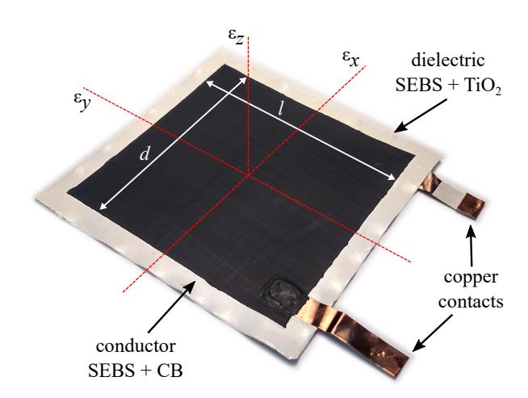

Figure 2.1 An SEC sensor with key components, dimensions, and axes annotated.

The Soft Elastomeric Capacitor (SEC) is a highly scalable thin-film strain sensor. Figure 2.1 presents a square SEC with a area of 56 cm<sup>2</sup> . The sensor is a parallel plate capacitor with its strain sensing principle derived from the fact that a change in area (i.e., strain) of the monitored structure will provoke a measurable change in its capacitance. The fabrication process of the SEC is simple and highly scalable, because it does not require any highly specialized

{56}------------------------------------------------

manufacturing or processing equipment. The dielectric of the capacitor is constituted from an SEBS block co-polymer filled with  $\text{TiO}_2$  to increase both its durability (Downey et al., 2017c; Day, 1990) and permittivity (Saleem et al., 2014). The conductive layers painted onto each side of the SEC sensor are fabricated by doping the same SEBS but filled carbon black instead of  $\text{TiO}_2$ . Carbon black is used as the conductive filler as it allows for conductive pathways to form within the SEBS matrix. Additionally, it absorbs both UV and visible light (Inc, 2000) and has demonstrated resiliency to weathering (Downey et al., 2017c). Currently, electrical connections are made to the painted conductive layers of the SEC using copper contacts. To ensure a good connection between the copper contact and SEBS-based conductive paint, a thin layer of the conductive paint is added on top of the copper contacts as denoted in Figure 2.1. For more details regarding the manufacturing process of the SEC sensors, the interested reader is referred to (Laflamme et al., 2013, 2015).

An electro-mechanical model that relates a change in area of the monitored structure to a measurable change in capacitance can be derived by taking the capacitance ( $C$ ) of a parallel plate capacitor, modeled as a non-lossy parallel plate capacitor:

$$C = e_0 e_r \frac{A}{h} \quad (2.1)$$

where  $e_0 = 8.854$  pF/m is the vacuum permittivity,  $e_r$  is the polymer's relative permittivity,  $A = d \cdot l$  is the sensor area, of width  $d$  and length  $l$  (as annotated in Figure 2.1), and  $h$  is the thickness of the dielectric. Assuming small strains, equation (2.1) can be written as a change in capacitance ( $\Delta C$ ):

$$\frac{\Delta C}{C} = \frac{\Delta d}{d} + \frac{\Delta l}{l} - \frac{\Delta h}{h} \quad (2.2)$$

where it can be noted that  $\Delta d/d$ ,  $\Delta l/l$ , and  $\Delta h/h$ , can be expressed as strain components  $\varepsilon_x$ ,  $\varepsilon_y$ , and  $\varepsilon_z$ , respectively. Assuming a plane stress condition,  $\varepsilon_z = -\nu/(1-\nu) \cdot (\varepsilon_x + \varepsilon_y)$ , a relative change in capacitance  $\Delta C$  can be related to a change in the sensor's deformation as:

$$\frac{\Delta C}{C} = \lambda(\varepsilon_x + \varepsilon_y) \quad (2.3)$$

where  $\nu$  is the sensor material's Poisson's ratio taken as  $\nu \approx 0.49$  (Wilkinson et al., 2004). Therefore,  $\lambda = 1/(1 - \nu) \approx 2$  represents the gauge factor of the sensor. A key advantage of the SEC is its capability to measure the additive strain of a structure, as shown in equation (2.3).

{57}------------------------------------------------

#### Algorithm 1 Pseudocode for the strain map adjustment algorithm

<span id="page-57-0"></span>1: Build and run the initial kriging model. 2: Use the kriging model to calculate the estimated SEC signal. 3: Calculate the difference between the SEC signal and the kriging model's estimated SEC signal. 4: while difference > difference threshold do: 5: Add the difference to the SEC signal. 6: Build and run the updated kriging model. 7: Use the updated kriging model to calculate the estimated SEC signal. 8: Calculate the difference between the SEC signal and the kriging model's estimated strain. 9: end while 10: Build the final kriging model based on the adjusted SEC signal. 11: Run the final kriging model to develop improved additive strain maps.

### 2.2.2 Kriging (Gaussian Process Regression)

Kriging (or Gaussian process regression) is a statistical process in which interpolated values are obtained from a spatially dependent set of training data. As a general rule, kriging seeks to predict the value of a function at the point of interest by computing a spatially weighted average of the training points in the neighborhood (Rasmussen, 2004; Shahriari et al., 2016). The spatial variability of a generalized spatially continuous process at a location *x*, denoted as Z(*x*), can be represented as:

$$\mathbf{Z}(x) = \mu(x) + \epsilon(x) \quad (2.4)$$

where µ(*x*) is the mean value of the process and (*x*) deals with the small-scale spatial variation in the process. When considering a noisy process, (*x*) is typically related to the noise (i.e. error) term. In cases where the prediction mean µ(*x*) varies smoothly, universal kriging (sometimes called kriging with external drifts or regression kriging) is preferred (Hengl et al., 2004). When considering external drifts and expressing *n* observations (training points) as *z*(*x*1), *z*(*x*2), ..., *z*(*xn*), the value at a new, unsampled location *x*<sup>0</sup> can be predicted as the sum of the drift component ( ˆ*m*) plus the residual (ˆ*e*):

$$\hat{z}(x_0) = \hat{m}(x_0) + \hat{e}(x_0) \quad (2.5)$$

where the drift term ˆ*m* is fit onto an assumed trend term using linear regression. Various trend terms have been used to model the large-scale spatial variations in the sample data and these terms include linear, polynomial, and

{58}------------------------------------------------

<span id="page-58-0"></span>point logarithmic (Tonkin and Larson, 2002). This work uses a regional linear trend to estimate the mean value at *x*<sup>0</sup> (Kitanidis, 1997). The universal kriging predicted value ˆ*z*(*x*0) can be solved for in a matrix notation as:

$$\hat{z}(x_0) = \mathbf{q}_0^T \cdot \hat{\boldsymbol{\beta}} + \boldsymbol{\lambda}_0^T \cdot \mathbf{e} \quad (2.6)$$

where q<sup>0</sup> is a vector of the predictors at *x*0, βˆ is a vector that contains the estimated drift term coefficients, λ<sup>0</sup> is a vector of *n* kriging weights determined by the covariance function, and e is a vector that contains all the regression residuals. The unknown drift term coefficients, βˆ , can be solved for using the generalized least squares technique, formulated as:

$$\hat{\mathbf{b}} = (\mathbf{q}^T \cdot \mathbf{C}^{-1} \cdot \mathbf{q})^{-1} \cdot \mathbf{q}^T \cdot \mathbf{C}^{-1} \cdot \mathbf{z} \quad (2.7)$$

where q is the matrix of the predictors at all observed locations, z is the sampled observations, and C is the covariance matrix of residuals:

$$\mathbf{C} = \begin{bmatrix} C(x_1, x_2) & & ext{$oldsymbol{ ext{.}}$} & C(x_1, x_n) \\ \vdots & \ddots & & \vdots \\ C(x_n, x_1) & & ext{$oldsymbol{ ext{.}}$} & C(x_n, x_n) \end{bmatrix} \quad (2.8)$$

The covariance between point pairs *C*(*x<sup>i</sup>* , *xj*), separated by a distance *d*, in the covariance matrix are then estimated using a variogram model. Different forms of variogram models (variance functions) have been developed to model the spatial correlation in the random space between point pairs. Examples of variogram models include the Gaussian, exponential, spherical, linear and power models. For the purpose of this work, the power model was selected due to its simplicity and capability to estimate unbounded spatial variances (Oliver and Webster, 2014). The power variogram model is expressed as *s* · *d* <sup>α</sup> + *n*, and used to form the piecewise semivariance function γ(*d*):

$$\gamma(d) = \begin{cases} 0 & d = 0 \\ s \cdot d^\alpha + n & 0 \leq d \end{cases} \quad (2.9)$$

where *s* is a scaling factor, α is the exponent (between 1 and 1.99), and *n* is the nugget term (Kitanidis, 1997). The nugget term accounts for the "noise" in the measurement as it represents the random deviations from the otherwise smooth spatial data trend. <sup>γ</sup>(*d*) is related with the covariance function for a point wise pair as <sup>γ</sup>(*d*) = *n* − *C*(*x<sup>i</sup>* , *xj*). As represented in Equation 2.9, this work considers measurements that are "exact", meaning that at the training points the variogram is forced to be zero (i.e. the predicted values at the training points will be equal to the observed values 

{59}------------------------------------------------

<span id="page-59-0"></span>at these points). Lastly, considering that the generalized least squares accounts for the spatial correlation of residuals, Equation [2.6](#page-58-0) can be expressed as:

$$\hat{z}(x_0) = \mathbf{q}_0^T \cdot \hat{\boldsymbol{\beta}} + \boldsymbol{\lambda}_0^T \cdot (\mathbf{z} - \mathbf{q} \cdot \hat{\boldsymbol{\beta}}) \quad (2.10)$$

Given that various points of interest are sampled with sufficient density, the universal kriging process outlined here can create a near continuous interpolation of a sampled process. More details about the kriging model can be found in reference (Kitanidis, 1997). This work utilized PyKrige, an open source kriging toolkit for Python, for the development and solving of the universal kriging interpolation models (rth et al., 2018).

### 2.3 Strain Map Adjustment Algorithm

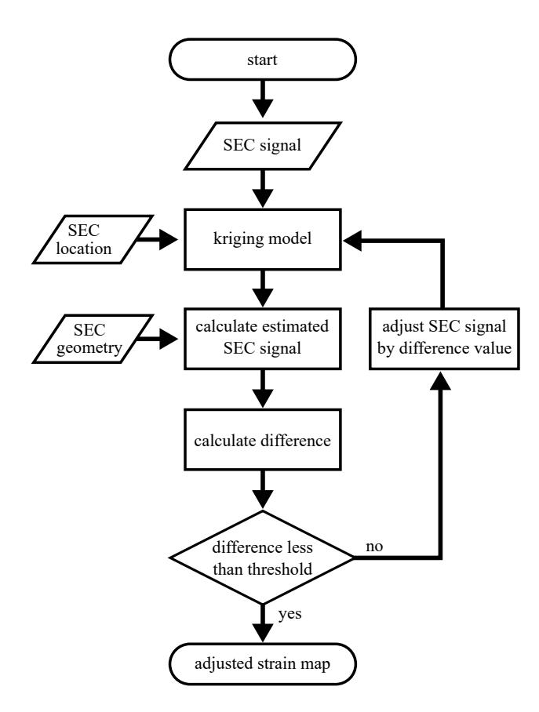

Figure 2.2 Flowchart detailing the strain map adjustment algorithm.

The use of traditional interpolation methods (including kriging and radial basis functions) for the estimation of full-field strain maps for structures monitored by an SEC-based sensing skin only considers the sensor location and

{60}------------------------------------------------

<span id="page-60-0"></span>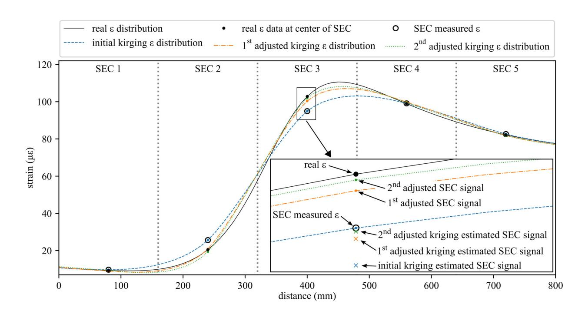

Figure 2.3 Graphical representation of the first three iterations of the strain map adjustment algorithm for a 1-D pseudo strain data monitored by 5 SECs with the inset showing a closeup of SEC 3.

signal. For these interpolation methods, the signal of each SEC is deemed to be located at the center of the sensor. The proposed strain map adjustment algorithm improves the accuracy of the full-field strain maps by fusing the sensor geometry, along with the sensor location and signal, into the strain maps.

The proposed algorithm maintains the assumption that the signal of the SEC is located at the center of the SEC. However, the additive strain measured by the sensor corresponds to the average strain under the sensing area, and is therefore not equal to the additive strain found at the center. It should also be noted that the discrepancy between these two values increases with either an increase in sensor size or an increase in strain map complexity. The proposed strain map adjustment algorithm is presented as a flowchart in figure [2.2,](#page-59-0) described as a pseudocode in algorithm [1,](#page-57-0) and discussed it what follows. First, a universial kriging model, denoted as UK in the following equations, is trained using the SEC sensor locations I SEC and their measured additive strain data OSEC:

$$\mathcal{E}(x, y) = UK\Big((x, y)|\boldsymbol{D} = \{\mathbf{I}^{\text{SEC}}, \mathbf{O}^{\text{SEC}}\}\Big) \quad (2.11)$$

where ε(*x*, *y*) is the additive strain at an arbitrary point (*x*, *y*). The Gaussian process or kriging model for this arbitrary point is denoted *UK*((*x*, *y*)|D) where D is the data set used for training the model. Considering an SEC sensor location

{61}------------------------------------------------

<span id="page-61-0"></span>*i*, the average strain value for the area monitored by the sensor, written as OSEC,estimated *i* , is extracted from the 2-D additive strain field ε(*x*, *y*) such that:

$$O_i^{\text{SEC,estimated}} = \frac{1}{n} \sum_{z=1}^n \mathcal{E}(x_z, y_z) \quad (2.12)$$

where *n* is the number of strain points under the SEC sensor *i* that are sampled from the kriging model. Next, the difference between the measured strain for a sensor (OSEC *i* ) and the strain estimated by the kriging model at that location (OSEC,estimated *i* ) is given by:

$$\xi_i = \mathbf{O}_i^{\text{SEC}} - \mathbf{O}_i^{\text{SEC,estimated}} \quad (2.13)$$

Once ξ*<sup>i</sup>* has been solved for, it is used to update the strain value measured by the sensor (OSEC *i* ) and create an adjusted SEC signal value:

$$\mathbf{O}_i^{\text{SEC,adjusted}} = \mathbf{O}_i^{\text{SEC}} + \xi_i \quad (2.14)$$

Combining OSEC,adjusted *i* for all sensors in the sensing skin yields the vector OSEC,adjusted. These adjusted strain values, resulting from a fusion of SEC signals, locations, and geometries, are used to train a new kriging model:

$$\mathcal{E}(x, y) = UK((x, y)|\boldsymbol{D} = \{(\mathbf{I}^{\text{SEC}}, \mathbf{O}^{\text{SEC, adjusted}})\}) \quad (2.15)$$

and therefore, a new additive strain field ε(*x*, *y*). This process of obtaining estimated SEC strain signals from the kriging-estimated strain field, adjusting the SEC signals based on the difference between the real and estimated signals, and resolving the kriging-estimated strain field based on the adjusted signals is repeated until a stop condition is met. In this work, the stop condition requires every ξ*<sup>i</sup>* to fall below 0.1 µε.

A graphical representation of the strain map adjustment algorithm for a simplified 1-D case is presented in figure [2.3.](#page-60-0) This 1-D pseudo strain data was created to represent a relatively complex strain topography that is monitored by five SECs. The measurement of each SEC is the mean strain over the area monitored by the SEC. The real strain distribution is represented by the thin black line with the real strain value at the center of the SEC denoted by the filled black circles. The geometric transition from one SEC to another is denoted by the dotted vertical line. The strain map adjustment algorithm starts with the strain value measured by the *i* th SEC from the real strain distribution to form the data point OSEC *i* . For the purpose of this simplified 1-D case, this measurement is obtained without considering any noise in the signal and is represented by the hollow black circle in figure [2.3.](#page-60-0) These strain measurements can be observed to correctly estimate the strain value at the center of the sensor for sensor locations that monitor linear strain

{62}------------------------------------------------

<span id="page-62-0"></span>distributions (i.e. SECs 1, 4, and 5) while either overestimating or underestimating the strain value for locations that monitor more complex strain distributions (i.e. SECs 2 and 4). Once the SEC measurements have been obtained, a kriging model is generated that uses the SEC-measured strain as the input for the model, this model is than densely sampled over the entire distance to create a near continuous strain distribution as represented by the dashed blue line. Note that the model goes through the data points used in training the model and as such this initially estimated strain distribution can be observed to overestimate the strain at SEC 2 and underestimate the strain at SEC 3. Now the estimated SEC signal (OSEC,estimated *i* ) is obtained from the densely sampled initial kriging model, and for *i* = 3 (SEC 3), this value is shown as a blue x in the inset of figure [2.3.](#page-60-0) Next the difference between OSEC *i* and OSEC,estimated *i* can be calculated from Equation [2.13](#page-61-0) and used to adjust the SEC signal used in training the adjusted kriging model (or the next adjusted SEC signal in the case of additional iterations) as denoted in Equation [2.14.](#page-61-0) This newly adjusted SEC signal is represented by an orange filled circle in the inset of figure [2.3](#page-60-0) and is termed the 1st adjusted SEC signal. This process is repeated until the adjusted SEC signal converges to the measured SEC signal. These adjusted SEC signals, which are closer to the real strain values at the center of the SEC, can then be used to generate kriging models that better reproduce the shape of the strain topology over the entire area of interest. For this example, only two iterations are required to generate a kriging model that shows a marked improvement over the original kriging-estimated strain topography as shown by the dotted green line in figure [2.3.](#page-60-0)

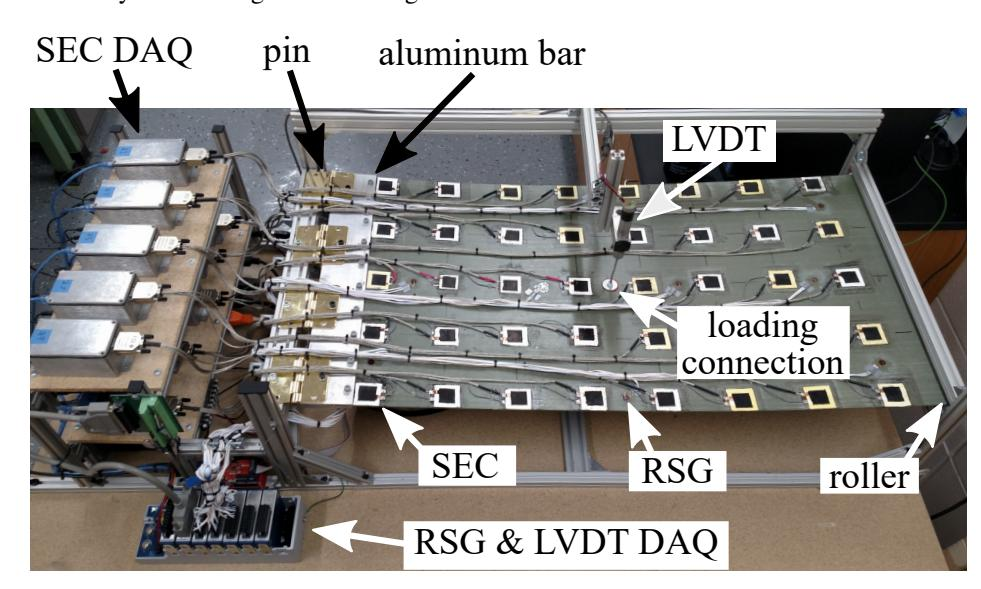

Figure 2.4 Experimental setup used as the basis for the numerical validation and for generating experimental data used in this work.

{63}------------------------------------------------

<span id="page-63-0"></span>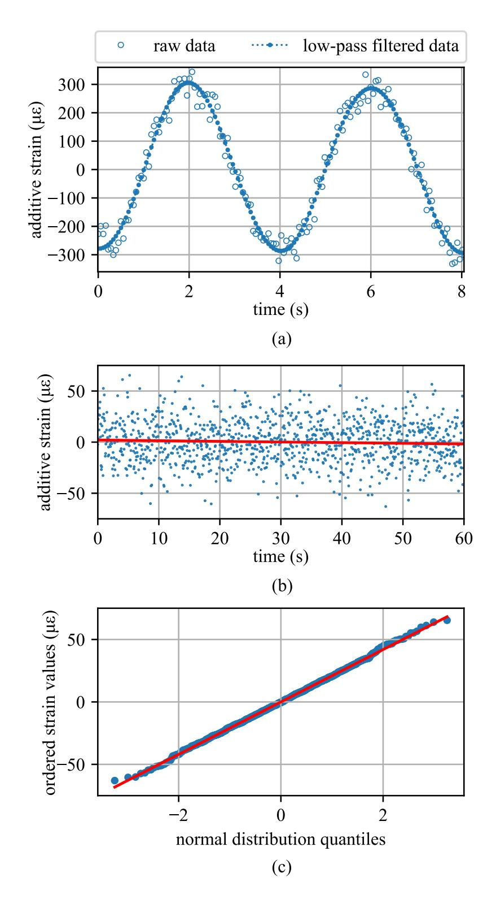

Figure 2.5 Experimental data for a sensor on the experimental test setup used showing: (a) dynamic response for a sinusoidal input load; (b) static response for a constant load; and (c) q-q plot of the static load compared to a normal distribution.

{64}------------------------------------------------

# 2.4 Methodology

<span id="page-64-0"></span>This section starts by introducing the experimental test setup that forms the basis for both the numerical validation and experimental verification performed in this work. After, a brief noise quantification study is performed on an SEC from the experimental setup to provide realistic noise characteristics for the numerical study. Lastly, the numerical and experimental studies are presented.

### 2.4.1 Experimental Setup

The strain map adjustment algorithm presented in this work is numerically validated and experimentally verified using the configuration shown in figure [2.4.](#page-62-0) The numerical investigation is conducted on an FEA model of the plate for a variety of sensor layouts. The experimental test setup consists of a fiberglass plate with a geometry of 500 × 900 × 2.6 mm<sup>3</sup> . The plate is driven by a stepper motor mounted under the plate and connected to the plate through a series of mechanical linkages. The left-hand side of the plate is bolted to an aluminum support (12.7 × 76.2 × 500 mm<sup>3</sup> ). This bolted connection forms a rigid connection that was added to eliminate strain complexities from a direct connection of the hinge to the fiberglass plate. This rigid connection is attached to the frame through a pinned connection. The right-hand side of the plate is restrained in the vertical direction by a roller. This roller consists of two lightly greased rods of diameter 12.7 mm mounted on both the top and bottom of the plate. This experimental setup was previously used in a study related to developing uni-directional strain maps from the SEC-based sensing skin (Sadoughi et al., 2018).

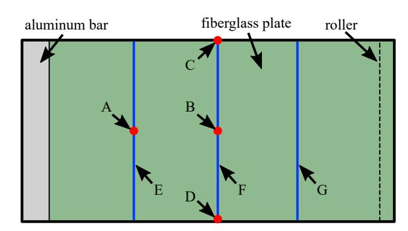

Figure 2.6 Schematic representation of the experimental plate with the identifiers (A-F) used for annotating the loading points for the ten load cases presented in Table [2.3.](#page-69-0)

{65}------------------------------------------------

<span id="page-65-0"></span>Table 2.1 Parameters used in constructing the FEA model.

| parameter |              |              | value                |
|-----------|--------------|--------------|----------------------|
| elements  | total        |              | 298,065              |
| elements  | type         |              | linear brick         |
| Abaqus    | element      | type         | C3D8R                |
| elements  | (aluminum    | connection)  | 32,340               |
| elements  | (fiberglass  | plate)       | 265,725              |
| element   | nodes        |              | 8                    |
| element   | integration  | points       | 1                    |
| Young’s   | Modulus      | (aluminum)   | 68.9 GPa             |
| Young’s   | Modulus      | (fiberglass) | 15 GPa               |
| Poisson’s | ratio        | (aluminum)   | 0.33                 |
| Poisson’s | ratio        | (fiberglass) | 0.21                 |
| density   | (aluminum)   |              | 2,700 kg / m³        |
| density   | (fiberglass) |              | 2,100 kg / m³        |
| plate     | dimensions   |              | 500 × 900 × 3.18 mm³ |

### 2.4.2 SEC Noise Quantification

A noise signature is extracted from the experimental test setup for the SEC sensor just to the left of the loading point in Figure [2.4](#page-62-0) for the purpose of evaluating the robustness of the strain map adjustment algorithm with respect to noise. The SEC was selected at this location as it experienced a relatively high level of strain during dynamic testing and the length of the cable connecting the SEC sensor to the DAQ is of average length. Figure [2.5](#page-63-0) presents the data for the single sensor under a dynamic (Figure [2.5\(](#page-63-0)a)) and static (Figure [2.5\(](#page-63-0)b)) load case. The experimental data for the static load case, sampled at 17 samples per second, was found to have a standard deviation of σ = 32 µε. The red line in Figure [2.5\(](#page-63-0)b) is the best-fit linear regression of the data over the 60-second test. In total, the data was found to drift 4.12 µε with *r*− and *p*-values of -0.056 and 0.048 respectively. The capability of a normal distribution to effectively estimate the SEC signal noise is demonstrated by the q-q plot presented in Figure [2.5\(](#page-63-0)c). Therefore, a noise with a normal distribution and a standard deviation of σ = 32 µε is deemed appropriate for conducting simulations of the strain map adjustment algorithm with respect to noise.

### 2.4.3 Numerical Validation

Numerical validation of the strain map adjustment algorithm is performed using 10 load cases of varying complexities applied to an Abaqus FEA model of the experimental test setup (Hibbit et al., 2007). The FEA model was

{66}------------------------------------------------

<span id="page-66-0"></span>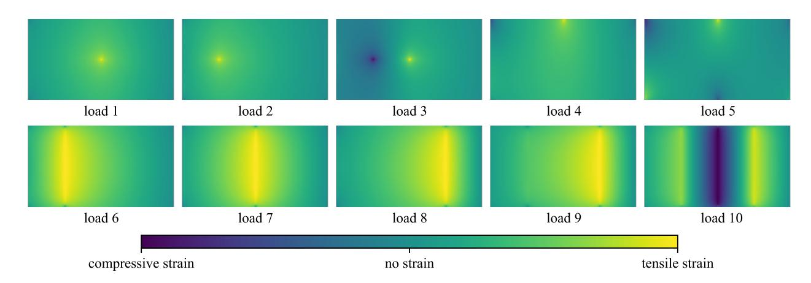

Figure 2.7 Additive strain maps, generated by the FEA model, for the ten load cases used in the numerical analysis portion of this work. Numerical values for the maximum compressive and tensile strains are listed in Table [2.2.](#page-67-0)

designed to replicate the experimental test setup. In addition to modeling the fiberglass plate, the FEA model also considers the rigid aluminum connection on the left-hand side of the plate. The model is constructed of 298,065 linear brick elements, each with eight-nodes and one integration point. This model configuration was found to have an error of less than 1% when compared to a densely-meshed (1.2 million elements) version of the same FEA model. In the fiberglass plate, nine elements are used through its thickness to prevent shear locking. The plate's connection, pinned on the left-hand side and a roller on the right-hand side, were modeled as ideal connections. The material properties of the fiberglass were obtained experimentally while the properties of the aluminum were taken from the material's data sheet supplied by the distributor. The key parameters of the FEA model are listed in Table [2.1.](#page-65-0)

The 10 loading cases are presented using figure [2.6](#page-64-0) and table [2.3](#page-69-0) where figure [2.6](#page-64-0) details the locations of the seven loading location identifiers (A-F) consisting of four loading points (A-D) and three uniform loading conditions (E-G).

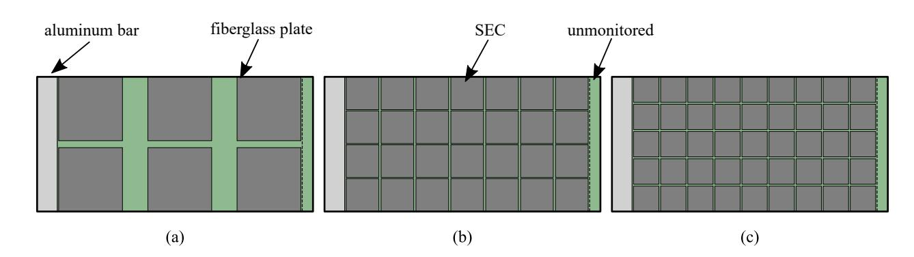

Figure 2.8 SEC-based sensing skin layouts with: (a) six SECs; (b) 28 SECs; and (c) 45 SECs.

{67}------------------------------------------------

<span id="page-67-0"></span>Table 2.2 Values associated with the maximum compressive and tensile strain for the load cases presented in figure [2.7.](#page-66-0)

|      |      |    | maximum compressive strain ( \$\mu\epsilon\$ ) | maximum tensile strain ( \$\mu\epsilon\$ ) |
|------|------|----|------------------------------------------------|--------------------------------------------|
| load | case | 1  | -1572                                          | 1572                                       |
| load | case | 2  | -1938                                          | 1938                                       |
| load | case | 3  | -7160                                          | 7160                                       |
| load | case | 4  | -1135                                          | 1135                                       |
| load | case | 5  | -1965                                          | 1965                                       |
| load | case | 6  | -1043                                          | 1043                                       |
| load | case | 7  | -907                                           | 907                                        |
| load | case | 8  | -1266                                          | 1266                                       |
| load | case | 9  | -1239                                          | 1239                                       |
| load | case | 10 | -6797                                          | 6797                                       |

Table [2.3](#page-69-0) lists the displacement for each of the identifiers for the 10 load cases considered. In the case that a specific location is unused for a load case, its correlating position in table [2.3](#page-69-0) is left empty. A displacement of zero denotes a loading point that is fixed at 0 mm of displacement. The strain maps produced for these 10 load cases are shown in figure [2.7.](#page-66-0) These load cases were selected to develop strain maps that produced varying amounts of asymmetry and strain map complexity. For each load case, the strain maps are normalized to either their maximum compressive or tensile strain values to help the visualization of results such that the no strain condition is the same color for each plot. The values associated with the maximum compressive and tensile strain for the load cases are listed in table 2.2.

The numerical validation also investigated the effect of changing sensor densities on the accuracy of both the traditional kriging and adjusted kriging strain maps. To do this, an algorithm was formulated that covered the monitored area of the fiberglass plate with an evenly spaced grid of square SEC sensors. This algorithm started with six sensors and progressively added square sensors to the fiberglass plate by reducing the size of each individual sensor. Every combination of square sensors arranged in a rectangular grid formed from six to 500 sensors was considered, with a total of 39 different grid configurations considered. Figure [2.8](#page-66-0) shows the SEC sensor layouts for three different sensor densities. As the strain map adjustment algorithm seeks to only update the strain value at the center of each SEC, the spaces between the SECs do not have a direct effect on the strain map interpolations. However, this unmonitored area does have a secondary effect on the performance of the algorithm as an area that is not monitored by a sensor will not be fused into the adjusted additive strain map. For uniformity, this work considers only SEC sensors of a square

{68}------------------------------------------------

<span id="page-68-0"></span>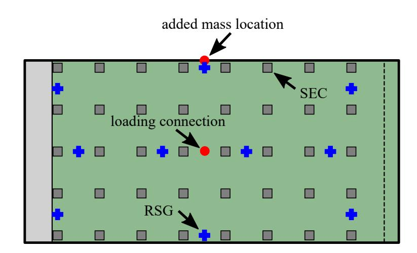

Figure 2.9 SEC and RSG layout of the experimental test setup used for experimental validation.

geometry. The investigation of other dense sensor network configurations, including those with non-uniform sensor densities, geometries, and sizes, are beyond the scope of this introductory work.

### 2.4.4 Experimental Verification

The experimental verification for the strain map adjustment algorithm was performed using a network of 40 SECs deployed as a grid onto the fiberglass plate. The layout of these SECs is presented in figure 2.9. In addition to the 40 SECs, 20 RSGs were deployed onto the fiberglass plate for the purpose of validating the strain map adjustment algorithm at various locations on the plate. The RSGs (model #FCA-5-350-11-3LJBT, manufactured by Tokyo Sokki Kenkyujo) were deployed in pairs, each individually measuring <sup>ε</sup>*<sup>x</sup>* and <sup>ε</sup>*y*. The 40 SECs were deployed in a 5 × 8 grid array, each monitoring an area of 38 × 38 mm<sup>2</sup> . The DAQ system consists of 10 custom-built capacitance measurement devices (annotated as SEC DAQ in figure [2.4\)](#page-62-0) that also generate an active shield for the cable that removes the parasitic capacitance found in the cable. In addition to these devices, a chassis (cDAQ-9178, manufactured by National Instruments) was used to hold three quarter bridge analog input (NI-9236) modules for measuring the RSGs, an analog input module (NI-9205) for measuring the LVDT, and a digital output module (NI-9472) for sourcing a trigger to ensure the SEC and RSG data is sampled simultaneously. Additionally, an LVDT (model #0244, manufactured by Trans-Tek) was mounted to the plate to record the plates center displacement. All the data sources were measured at 17 samples per second. Lastly, to remove the high-frequency noise found in the SEC signal, a fifth-order Butterworth filter with a cutoff frequency of 10 Hz was used. The effects of this filtering can be seen in figure [2.5\(](#page-63-0)a). No filtering was needed for either the RSG or LVDT data.

{69}------------------------------------------------

<span id="page-69-0"></span>Table 2.3 Displacements associated with the identifiers (A-F) from figure [2.6](#page-64-0) for the 10 loading conditions considered for this study

|           | Summary Table for Load Cases |          |               |                |
|-----------|------------------------------|----------|---------------|----------------|
| Load Case | (Units)                      | (Cycles) | Max Force (N) | Frequency (Hz) |
| 1         | 0.24                         | 13       | 5             | -              |
| 2         | -                            | 5        | 5             | -              |
| 3         | -                            | 0        | 5             | -              |
| 4         | -                            | -        | 5             | -              |
| 5         | 0.24                         | -        | 5             | -              |

The experimental validation considered two experimental load cases. First, load case 1 (similar to load case 1 in the numerical investigation) is used to verify the strain map adjustment algorithm for a relatively simple load case. This load case is produced at the center of the plate by the stepper motor located under the plate. The plate is displaced 5 mm from its initial condition harmonically at 0.25 Hz. Second, an asymmetric load is generated to verify the strain map adjustment algorithm under a more complex loading condition. To generate this asymmetric load, a 0.5 kg mass is added at the center of the plate along its top edge (see Figure [2.9\)](#page-68-0) then the plate is excited using the stepper motor in the same manner as load case 1. For both cases, the experimental data is investigated over two complete cycles.

# 2.5 Results

This section presents the results from both the numerical and experimental studies. First, a detailed evaluation of the strain map adjustment algorithm for load case 4 is presented, followed by a discussion on the results for all ten load cases. Lastly, the experimental results are discussed.

{70}------------------------------------------------

<span id="page-70-0"></span>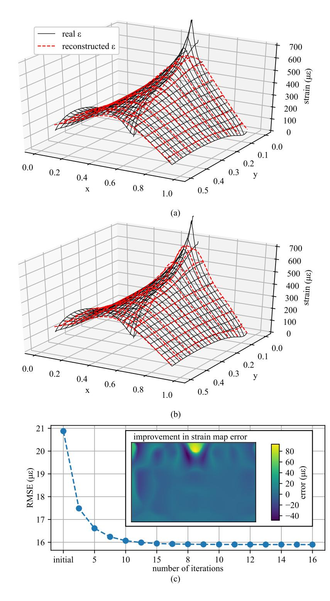

Figure 2.10 Strain maps generated for load case 4: (a) using the traditional kriging method; (b) using the strain map adjustment algorithm; and (c) showing the RMSE as a function of number of iterations for the strain map adjustment algorithm where the inset shows the improvement in strain between the traditional kriging method and the proposed algorithm.

{71}------------------------------------------------

#### <span id="page-71-0"></span>2.5.1 Numerical Validation

Results for the strain map adjustment algorithm for load case 4, monitored with 28 SECs as shown in figure [2.8\(](#page-66-0)b), are presented in figure [2.10.](#page-70-0) The combination of load case 4 with 28 SECs was selected due to its capability to demonstrate both portions of the strain field where the strain map adjustment algorithm improves the accuracy of the strain map (i.e. near the load case) and portions where its benefit is less obvious (i.e. portions the strain topography that are relatively simple). To expand, figure [2.10](#page-70-0) presents both the plate's real strain map and its kriging-estimated strain maps using the traditional kriging method (figure [2.10\(](#page-70-0)a)) and the strain map adjustment algorithm (figure [2.10\(](#page-70-0)b)). Figure [2.10\(](#page-70-0)c) reports the RMSE error between the real strain map and that estimated using the strain map adjustment algorithm over each successive iteration of the algorithm. In figure [2.10\(](#page-70-0)c) the initial condition is the strain map generated using a traditional kriging method (figure [2.10\(](#page-70-0)a)) and therefore does not incorporate the sensor geometry into the strain map interpolation. Conversely, the strain map for iteration 16 (figure [2.10\(](#page-70-0)b)) incorporates the sensor geometry into the reconstructed strain maps. The inset in figure [2.10\(](#page-70-0)c) shows the reduction in strain map reconstruction error (measured as µε) by the strain map adjustment algorithm (figure [2.10\(](#page-70-0)b)) over the traditional kriging method (figure [2.10\(](#page-70-0)a)). The strain map adjustment algorithm generates a considerable improvement near the loading point at the top center of the plate where the traditional kriging method underestimates the real strain value. Furthermore, the algorithm generally improves the accuracy of the strain map over the entire plate.

Figure [2.11](#page-72-0) reports the results for the ten cases used in the numerical validation in terms of the root mean squared error (RMSE) where the error is measured at every point of the strain map. Results are reported for the RMSE from both the traditional kriging method and for the strain map adjustment algorithm. These results are reported with and without noise added to the system. Overall, the strain maps developed using the strain map adjustment algorithm have less error than those developed using the traditional method. A few notable results for some specific load cases are as follows. First, it should be noted that in every load case considered for the no-noise conditions the adjusted strain maps are capable of achieving a level of error that would require far more sensors than if the strain map adjustment algorithm was not used. When noise was added to the sensor signal and for loading conditions that developed low levels of strain (e.g. load cases 1, 4, and 7), the benefit of using the strain map adjustment algorithm for a given number of SECs was reduced but never worst than the traditional kriging method's error levels. Next, it can be noticed that load cases 4 and 5 experience an increase in error for an increase in the number of sensors deployed in the dense sensor network before leveling out once a certain number of sensors are used. This increase in RMSE for load cases 4 and 5 come from the very center of the plate where the kriging method underestimates the peak strain value due to

{72}------------------------------------------------

<span id="page-72-0"></span>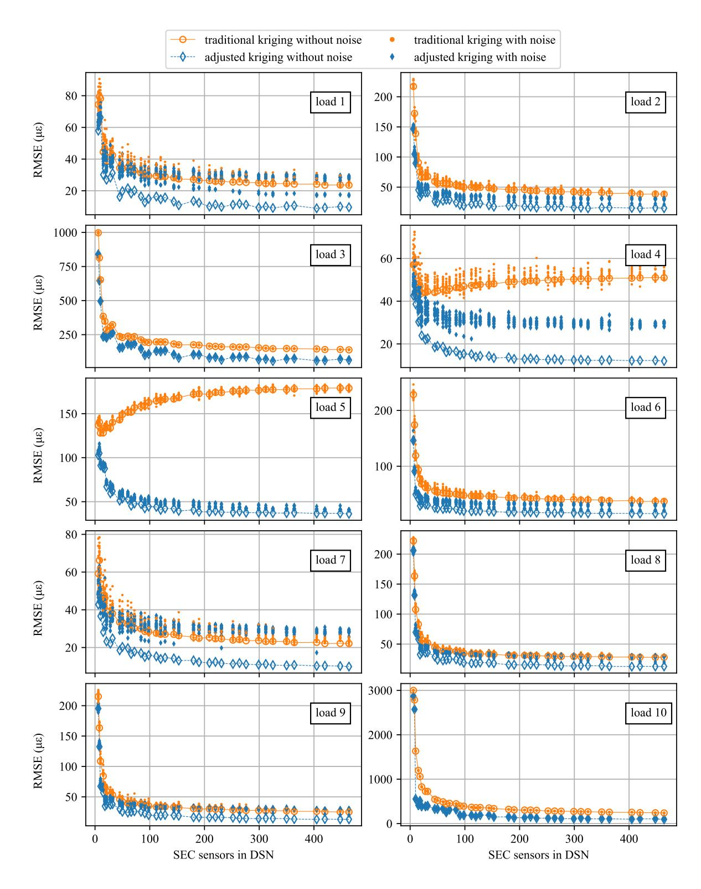

Figure 2.11 RMSE results for both the traditional kriging and the adjusted kriging methods for all ten load cases, considered both with and without noise.

{73}------------------------------------------------

<span id="page-73-0"></span>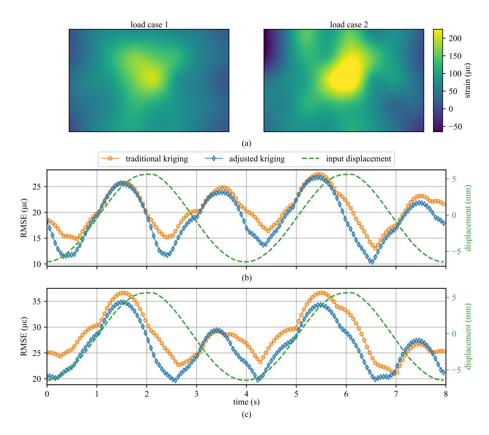

Figure 2.12 Temporal RMSE results for the 0.25 Hz loading condition under the experimental: (a) load case 1; and (b) load case 2. This figure appears as a video in the online version of this paper.

sensors being positioned right on top of this high strain concentration. However, in both of these cases, the strain map adjustment algorithm is capable of compensating for this concentrated strain location.

### 2.5.2 Experimental Verification

The experimental results for the 40 sensors deployed on the experimental test setup are presented in figure 2.12. The strain maps in figure 2.12(a) report the full-field strain maps developed using the strain map adjustment algorithms for both load cases. For the experimental study the RMSE is measured at the 20 RSG locations on the plate. The RSGs are used for this task due to their higher accuracy when compared to the SECs, and capability to measure 

{74}------------------------------------------------

<span id="page-74-0"></span>the additive strain at any location when their signals are added together. As expected, the RMSE for both load cases generally increases when the displacement is increasing and is near either its maximum upward or maximum downward displacement. Load case 1 (figure [2.12\(](#page-73-0)b)) does report lower error values than load case 2 [2.12\(](#page-73-0)c)). This increase in the error for load case 2 is to be expected given the general increase in the complexity of the strain topography for load case 2, as seen in figure [2.12\(](#page-73-0)a). Additionally, for two brief moments in load case 2 around 3.4 and 7.4 seconds, the adjusted strain map reports a higher level of error than those generated using the traditional kriging methods. This can be attributed to the relatively small number of RSG gauges used for quantifying the error of the full-field strain maps.

# 2.6 Conclusion

This work proposed an algorithm that fuses the locations of strain sensors, their signals, and the geometry of a network of sensor constituting a sensing skin into an approximated full-field strain map. These sensors, termed the soft elastomeric capacitors (SECs), are a large-area electronic that are capable of covering large areas at low costs. Given that each SEC measures the summation of a structure's orthogonal strains (i.e. <sup>ε</sup>*<sup>x</sup>* + <sup>ε</sup>*y*), the SECs deployed in a network configuration are capable of reproducing the full-field additive strain map of a structure. These full-field strain maps can then be used to extract physics-based features for real-time condition assessment. Examples of the physics-based features include changes in strain maps and deflection shapes.

The proposed algorithm improves the quality of these full-field strain maps by fusing the sensor size into a traditional strain field interpolation that only uses the sensor location and signal. This work used kriging as the interpolation method. However, other interpolation methods including cubic splines and radial bias functions could also be used. The improvement in the additive full-field strain map generation is accomplished through iterative adjustments to the measured SEC signal used as the input to the kriging model until the measured SEC signal matches the SEC signal estimated using the kriging model. Therefore, the newly proposed algorithm fuses data from the SEC's location, signal, and geometry to produce a full-field strain map. Results from numerical and experimental investigations show that the proposed strain map adjustment algorithm is capable of generating improved full-field strain maps over those produced using the traditional kriging method.

# Acknowledgments

This work was in part supported by the National Science Foundation Grant Nos. CNS-1566579 and ECCS-1611333. This work was also partly supported by the National Science Foundation Grant No. 1069283, which 

{75}------------------------------------------------

<span id="page-75-0"></span>supports the activities of the Integrative Graduate Education and Research Traineeship (IGERT) in Wind Energy Science, Engineering and Policy (WESEP) at Iowa State University. Their support is gratefully acknowledged. Any opinions, findings, and conclusions or recommendations expressed in this material are those of the authors and do not necessarily reflect the views of the National Science Foundation.

# 2.7 References

(2000). Carbon black. In Inc, J. W. &. S., editor, *Kirk-Othmer Encyclopedia of Chemical Technology*. John Wiley & Sons, Inc. Arias, A. C., MacKenzie, J. D., McCulloch, I., Rivnay, J., and Salleo, A. (2010). Materials and applications for large area electronics: Solution-based approaches. *Chemical Reviews*, 110(1):3–24. Borcea, L. (2002). Electrical impedance tomography. *Inverse Problems*, 18(6):R99–R136. Burton, A., Lynch, J., Kurata, M., and Law, K. (2017). Fully integrated carbon nanotube composite thin film strain sensors on flexible substrates for structural health monitoring. *Smart Materials and Structures*, 26(9). Day, R. (1990). The role of titanium dioxide pigments in the degradation and stabilisation of polymers in the plastics industry. *Polymer Degradation and Stability*, 29(1):73–92. De Boor, C., De Boor, C., Mathematicien, E.-U., De Boor, C., and De Boor, C. (1978). ´ *A practical guide to splines*, volume 27. Springer-Verlag New York. Downey, A., D'Alessandro, A., Baquera, M., Garc´ıa-Mac´ıas, E., Rolfes, D., Ubertini, F., Laflamme, S., and Castro-Triguero, R. (2017a). Damage detection, localization and quantification in conductive smart concrete structures using a resistor mesh model. *Engineering Structures*, 148:924 – 935. Downey, A., D'Alessandro, A., Ubertini, F., and Laflamme, S. (2017b). Automated crack detection in conductive smart-concrete structures using a resistor mesh model. *Measurement Science and Technology*. Downey, A., Laflamme, S., and Ubertini, F. (2016). Reconstruction of in-plane strain maps using hybrid dense sensor network composed of sensing skin. *Measurement Science and Technology*, 27(12):124016.

{76}------------------------------------------------

- Downey, A., Laflamme, S., and Ubertini, F. (2017c). Durability assessment of soft elastomeric capacitor skin for shm of wind turbine blades. In Wu, H. F., Gyekenyesi, A. L., Shull, P. J., and Yu, T.-Y., editors, *Nondestructive Characterization and Monitoring of Advanced Materials, Aerospace, and Civil Infrastructure 2017*. SPIE. Downey, A., Laflamme, S., and Ubertini, F. (2017d). Experimental wind tunnel study of a smart sensing skin for condition evaluation of a wind turbine blade. *Smart Materials and Structures*. Enckell, M., Glisic, B., Myrvoll, F., and Bergstrand, B. (2011). Evaluation of a large-scale bridge strain, temperature and crack monitoring with distributed fibre optic sensors. *Journal of Civil Structural Health Monitoring*, 1(1-2):37–
- 46. Glisic, B., Yao, Y., Tung, S.-T. E., Wagner, S., Sturm, J. C., and Verma, N. (2016). Strain sensing sheets for structural health monitoring based on large-area electronics and integrated circuits. *Proceedings of the IEEE*, 104(8):1513– 1528. Hallaji, M., Seppanen, A., and Pour-Ghaz, M. (2014). Electrical impedance tomography-based sensing skin for ¨ quantitative imaging of damage in concrete. *Smart Materials and Structures*, 23(8):085001. Hengl, T., Heuvelink, G. B., and Stein, A. (2004). A generic framework for spatial prediction of soil variables based on regression-kriging. *Geoderma*, 120(1-2):75–93. Hibbit, Karlsson, and Sorensen (2007). *ABAQUS*/*Standard Analysis User's Manual*. Hibbit, Karlsson, Sorensen Inc., USA. Hou, T.-C. and Lynch, J. P. (2008). Electrical impedance tomographic methods for sensing strain fields and crack damage in cementitious structures. *Journal of Intelligent Material Systems and Structures*, 20(11):1363–1379. Hu, Y., Rieutort-Louis, W. S. A., Sanz-Robinson, J., Huang, L., Glisic, B., Sturm, J. C., Wagner, S., and Verma, N. (2014). Large-scale sensing system combining large-area electronics and CMOS ICs for structural-health monitoring. *IEEE Journal of Solid-State Circuits*, 49(2):513–523. Hua, P., Woo, E., Webster, J., and Tompkins, W. (1993). Finite element modeling of electrode-skin contact impedance in electrical impedance tomography. *IEEE Transactions on Biomedical Engineering*, 40(4):335–343. Kang, I., Schulz, M. J., Kim, J. H., Shanov, V., and Shi, D. (2006). A carbon nanotube strain sensor for structural health monitoring. *Smart Materials and Structures*, 15(3):737–748.

{77}------------------------------------------------

- Kitanidis, P. K. (1997). *Introduction to geostatistics: applications in hydrogeology*. Cambridge University Press. Kong, X., Li, J., Collins, W., Bennett, C., Laflamme, S., and Jo, H. (2017). A large-area strain sensing technology for monitoring fatigue cracks in steel bridges. *Smart Materials and Structures*, 26(8):085024. Laflamme, S., Cao, L., Chatzi, E., and Ubertini, F. (2016). Damage detection and localization from dense network of strain sensors. *Shock and Vibration*, 2016:1–13. Laflamme, S., Kollosche, M., Connor, J. J., and Kofod, G. (2013a). Robust flexible capacitive surface sensor for structural health monitoring applications. *Journal of Engineering Mechanics*, 139(7):879–885. Laflamme, S., Saleem, H. S., Vasan, B. K., Geiger, R. L., Chen, D., Kessler, M. R., and Rajan, K. (2013b). Soft elastomeric capacitor network for strain sensing over large surfaces. *IEEE*/*ASME Transactions on Mechatronics*, 18(6):1647–1654. Laflamme, S., Ubertini, F., Saleem, H., D'Alessandro, A., Downey, A., Ceylan, H., and Materazzi, A. L. (2015). Dynamic characterization of a soft elastomeric capacitor for structural health monitoring. *Journal of Structural Engineering*, 141(8):04014186. Lee, H. M., Kim, J. M., Sho, K., and Park, H. S. (2010). A wireless vibrating wire sensor node for continuous structural health monitoring. *Smart Materials and Structures*, 19(5):055004. Loh, K. J., Hou, T.-C., Lynch, J. P., and Kotov, N. A. (2009). Carbon nanotube sensing skins for spatial strain and impact damage identification. *Journal of Nondestructive Evaluation*, 28(1):9–25. Loh, K. J., Kim, J., Lynch, J. P., Kam, N. W. S., and Kotov, N. A. (2007). Multifunctional layer-by-layer carbon nanotube–polyelectrolyte thin films for strain and corrosion sensing. *Smart Materials and Structures*, 16(2):429–
- 438. Luo, S., Hoang, P. T., and Liu, T. (2016). Direct laser writing for creating porous graphitic structures and their use for flexible and highly sensitive sensor and sensor arrays. *Carbon*, 96:522–531. Lynch, J. P., Farrar, C. R., and Michaels, J. E. (2016). Structural health monitoring: technological advances to practical implementations [scanning the issue]. *Proceedings of the IEEE*, 104(8):1508–1512. Lynch, J. P., Sundararajan, A., Law, K. H., Kiremidjian, A. S., and Carryer, E. (2004). Embedding damage detection algorithms in a wireless sensing unit for operational power efficiency. *Smart Materials and Structures*, 13(4):800– 810.

{78}------------------------------------------------

Oliver, M. and Webster, R. (2014). A tutorial guide to geostatistics: Computing and modelling variograms and kriging. *CATENA*, 113:56–69. Pan, B., Qian, K., Xie, H., and Asundi, A. (2009). Two-dimensional digital image correlation for in-plane displacement and strain measurement: a review. *Measurement Science and Technology*, 20(6):062001. Paradiso, J. A., Lifton, J., and Broxton, M. (2004). Sensate media — multimodal electronic skins as dense sensor networks. *BT Technology Journal*, 22(4):32–44. Park, J. and Sandberg, I. W. (1991). Universal approximation using radial-basis-function networks. *Neural Computation*, 3(2):246–257. Perry, M., McAlorum, J., Fusiek, G., Niewczas, P., McKeeman, I., and Rubert, T. (2017). Crack monitoring of operational wind turbine foundations. *Sensors*, 17(8):1925. Posenato, D., Lanata, F., Inaudi, D., and Smith, I. F. (2008). Model-free data interpretation for continuous monitoring of complex structures. *Advanced Engineering Informatics*, 22(1):135–144. Rasmussen, C. E. (2004). *Gaussian Processes in Machine Learning*. Springer Berlin Heidelberg. Robert, C., Feller, J. F., and Castro, M. (2012). Sensing skin for strain monitoring made of PC-CNT conductive polymer nanocomposite sprayed layer by layer. *ACS Applied Materials* & *Interfaces*, 4(7):3508–3516. rth, bsmurphy, mjziebarth, and basaks (2018). Pykrige: Kriging toolkit for python. Ryu, D. and Loh, K. J. (2012). Strain sensing using photocurrent generated by photoactive p3ht-based nanocomposites. *Smart Materials and Structures*, 21(6):065016. Sadoughi, M., Downey, A., Yan, J., Hu, C., and Laflamme, S. (2018). Reconstruction of unidirectional strain maps via iterative signal fusion for mesoscale structures monitored by a sensing skin. *Mechanical Systems and Signal Processing*, 112:401–416. Saleem, H., Thunga, M., Kollosche, M., Kessler, M., and Laflamme, S. (2014). Interfacial treatment effects on behavior of soft nano-composites for highly stretchable dielectrics. *Polymer*, 55(17):4531–4537. Shahriari, B., Swersky, K., Wang, Z., Adams, R. P., and de Freitas, N. (2016). Taking the human out of the loop: A review of bayesian optimization. *Proceedings of the IEEE*, 104(1):148–175.

{79}------------------------------------------------

Tikka, J., Hedman, R., and Silijander, A. (2003). Strain gauge capabilities in crack detection. In *4th International Workshop on Structural Health Monitoring*, pages 15–17. Tonkin, M. J. and Larson, S. P. (2002). Kriging water levels with a regional-linear and point-logarithmic drift. *Ground Water*, 40(2):185–193. Tung, S.-T., Yao, Y., and Glisic, B. (2014). Sensing sheet: the sensitivity of thin-film full-bridge strain sensors for crack detection and characterization. *Measurement Science and Technology*, 25(7):075602. Wang, Y., Gong, J., Dong, B., Wang, D. Y., Shillig, T. J., and Wang, A. (2012). A large serial time-division multiplexed fiber bragg grating sensor network. *Journal of Lightwave Technology*, 30(17):2751–2756. Wilkinson, A., Clemens, M., and Harding, V. (2004). The effects of SEBS-g-maleic anhydride reaction on the morphology and properties of polypropylene/PA6/SEBS ternary blends. *Polymer*, 45(15):5239–5249. Yao, Y., Tung, S.-T. E., and Glisic, B. (2014). Crack detection and characterization techniques-an overview. *Structural Control and Health Monitoring*, 21(12):1387–1413. Zhang, Y. (2006). In situ fatigue crack detection using piezoelectric paint sensor. *Journal of Intelligent Material Systems and Structures*, 17(10):843–852. Zhang, Y., Anderson, N., Bland, S., Nutt, S., Jursich, G., and Joshi, S. (2017). All-printed strain sensors: Building blocks of the aircraft structural health monitoring system. *Sensors and Actuators A: Physical*, 253:165–172.

{80}------------------------------------------------

# <span id="page-80-0"></span>CHAPTER 3. RECONSTRUCTION OF IN-PLANE STRAIN MAPS USING HYBRID DENSE SENSOR NETWORK COMPOSED OF SENSING SKIN

This chapter is wholly based on "Reconstruction of In-Plane Strain Maps using Hybrid Dense Sensor Network composed of Sensing Skin" published in Measurement Science and Technology, vol. 27, no. 12, 2016, p. 124016. doi:10.1088/0957-0233/27/12/124016.

Austin Downey<sup>1</sup> , Simon Laflamme1,<sup>2</sup> and Filippo Ubertini<sup>3</sup>

# Abstract

The authors have recently developed a soft-elastomeric capacitive (SEC)-based thin film sensor for monitoring strain on mesosurfaces. Arranged in a network configuration, the sensing system is analogous to a biological skin, where local strain can be monitored over a global area. Under plane stress conditions, the sensor output contains the additive measurement of the two principal strain components over the monitored surface. In applications where the evaluation of strain maps are useful, in structural health monitoring for instance, such signal must be decomposed into linear strain components along orthogonal directions. Previous work has led to an algorithm that enabled such decomposition by leveraging a dense sensor network configurations with the addition of assumed boundary conditions. Here, we significantly improve the algorithm's accuracy by leveraging mature off-the-shelf solutions to create a hybrid dense sensor network (HDSN) to improve on the boundary condition assumptions. The system's boundary conditions are enforced using unidirectional RSGs and assumed virtual sensors. Results from an extensive experimental investigation demonstrate the good performance of the proposed algorithm and its robustness with respect to sensors' layout. Overall, the proposed algorithm is seen to effectively leverage the advantages of a hybrid dense network for application of the thin film sensor to reconstruct the surface strain fields over large surfaces.

<sup>1</sup> Department of Civil, Construction, and Environmental Engineering, Iowa State University, Ames, IA, USA

<sup>2</sup> Department of Electrical and Computer Engineering, Iowa State University, Ames, IA, USA

<sup>3</sup> Department of Civil and Environmental Engineering, University of Perugia, Perugia, Italy

{81}------------------------------------------------

<span id="page-81-0"></span>Keywords: structural health monitoring, capacitive-based sensor, soft elastomeric capacitor, flexible membrane sensor, sensor network, signal decomposition, strain measurement.

# 3.1 Introduction

Structural health monitoring (SHM) is the automation of damage detection, localization, and prognosis of structural systems or components. The monitoring of large-scale systems, here termed mesosystems, is especially challenging due to the inherent geometric size and complexity (Laflamme et al., 2015). Mesosystems, including aerospace structures, energy systems and civil infrastructures are traditionally inspected and maintained via time-based or breakdownbased maintenance strategies. The use of SHM to enable condition-based maintenance (CBM) may lead to strong economic benefits for owners, operators, and society. Of particular interest is the field of wind energy system, where CBM is known to have substantial economic benefits (Chang et al., 2003; Ciang et al., 2008; Adams et al., 2011).

Monitoring solutions for mesoscale structures need to be capable of global (e.g., loss of stiffness, changing boundary conditions) and local (e.g., localizing material failure, crack propagation, and fastener loosening) condition assessment over strategic locations. However, distinguishing a localized change in a structure from a global change is difficult using existing technologies and methods (Zou et al., 2000; Ubertini et al., 2014). The task is often complicated by the dependence of sensor signals on environmental effects such as temperature and humidity (Gross et al., 1999; Rumsey and Paquette, 2008). The ability to monitor local damage over a global scale necessitates a large array of sensors (Ciang et al., 2008). However, the cost incurred in using traditional sensors can be hard to financially justify (Frangopol and Messervey, 2009).

A solution to the local-global monitoring challenge involves the utilization of flexible skin-like membranes. Such films, often termed electronic artificial skins, e-skins, or sensing skins are thin electronic sheets that mimic biological skin. Research on sensing skin has recently gained popularity with advances in the field of flexible electronics (Laflamme et al., 2015; Rogers et al., 2010). Dense sensor network applications of skin sensors have also been reported. Lee et al. (Lee et al., 2006) demonstrated a flexible capacitive tactile sensor. Experimentally verified using a 16 × 16 array of tactile cells, this artificial skin has a spatial resolution of 1 mm. Xu et al. (Xu et al., 2003) utilized a 36-sensor array of resistive heating elements on a flexible polyimide film to measure shear stress topography and flow separation on the leading edge of a delta-wing structure during wind tunnel tests. Recently, research has progressed towards microelectromechanical systems (MEMS) based flexible skins without the need for rigid packages (Ahmed et al., 2012; Mahmood et al., 2015). Large sensing sheets of strain gauges with embedded processors on a 50 µm thick 

{82}------------------------------------------------

polyimide sheet have been proposed, with applications to crack detection and localization (Hu et al., 2014; Tung et al., 2014).

The use of resistance-based thin-film strain sensors fabricated with carbon nanotubes has attracted considerable attention in the last decade. Examples of such sensors include a strain sensor fabricated from single-walled carbon nanotubes (SWCNT) exhibiting a gauge factor between 1 and 5 (Kang et al., 2006), a highly sensitive sensor also using SWCNT but resulting in a gauge factor of 269 (Chang et al., 2008). Advanced methods for constructing flexible membranes reinforced with self-assembled arrays of SWCNT have been investigated (Grilli et al., 2014) and show great potential for the development of robust sensing skins. Transparent elastic conductors capable of transducing strain and pressure, essential in certain electronic and optoelectronic applications, have been fabricated with conductivities as high as 2,200 S/cm in the stretched state (Lipomi et al., 2011). Integrated sensor-electronic have been developed from SWCNT-polymer composite patterned onto a flexible polyimide substrate using optical lithography yielding a gauge factor of 0.77 and a resolution of 50 µε (Burton et al., 2016). Strain transducers based on SWCNT have been demonstrated for measuring high strain applications, up to 280%, such as that needed for human-motion detection (Yamada et al., 2011).

Capacitive-based sensing skins have also been studied for measuring strain (Suster et al., 2006), pressure (Lee et al., 2016), triaxial force (Dobrzynska and Gijs, 2012), and humidity (Geng et al., 2016). Capacitive-based sensors offer the potential to be highly applicable to mesoscale monitoring as they are less affected by temperature changes and can be manufactured using various techniques, including high-speed offset lithography printing process (Harrey et al., 2002). The challenge in the fabrication of sensing skins for mesosensing lies in the selection of an inexpensive polymer mix that is robust to environmental conditions (Metzger et al., 2008). In the same framework of low-cost sensing skins for mesoscale systems, the authors have previously developed a soft elastomeric capacitor (SEC). The proposed SEC was designed to be inexpensive with an easily scalable manufacturing process (Yoda, 1998). The SEC is fabricated from an inexpensive nanocomposite based on a styrene-co-ethylene-co-butylene-co-styrene (SEBS) block co-polymer matrix filled with titania (dielectric) and carbon black (electrodes) particles and is customizable in shape and size (Laflamme et al., 2013a,b). Static (Laflamme et al., 2013b) and dynamic behaviors (Laflamme et al., 2015; Saleem et al., 2015) have been characterized, including damage detection applications in wind turbine blades (Laflamme et al., 2016) subjected to random wind loading (Ubertini and Giuliano, 2010), and the effectiveness of a dense sensor network for detecting fatigue cracks has been demonstrated (Kharroub et al., 2015).

A particular feature of the SEC is that it measures additive in-plane strain, instead of a traditional measurement of the linear strain along a single direction. When used in a dense sensor network (DSN) the SEC is able to monitor local additive strain over large areas. Therefore, the signal can be used to reconstruct strain maps, provided that the

{83}------------------------------------------------

<span id="page-83-0"></span>additive strain is decomposed into linear strain components along two orthogonal directions. The authors presented an algorithm in (Wu et al., 2015) designed to leverage a DSN configuration to enable strain field decomposition. The algorithm assumed a shape function and classical Kirchhoff plate theory and solved for the coefficients of the shape function using the least squares estimator (LSE). Numerical simulations showed the promise of the algorithm. However, the proposed technique was limited by sensor placement along the edge of the plate, and the quality of the assumptions on the boundary conditions. It follows that boundary conditions can be difficult to assume for complex geometries and may be time-varying over the monitored structure' lifetime.

In this work, the authors propose a hybrid DSN (HDSN) to alleviate limitations of the previously proposed strain decomposition algorithm (Wu et al., 2015). The HDSN considered here introduces resistive strain gauges (RSGs), a mature sensing technology capable of precise point measurements. However, due to their size, as well as technical and economic constraints, RSGs lack the ability to efficiently cover mesosurfaces (Liu et al., 2010). The HDSN presented here combines the SECs coverage capacity with the high precision measurements of RSGs. The LSE algorithm discussed above is expanded to include RSG readings and virtual sensing nodes at known boundary conditions. The enhanced LSE algorithm also introduces weighted matrices to the LSE algorithm to concatenate data, allowing for the enforcement of localized strain conditions and the fusion of unidirectional and additive strain sensors. The proposed strain decomposition algorithm is experimentally verified utilizing an HDSN consisting of 20 SECs and a variable number of RSGs, from 2 to 46, on a thin composite plate.

The paper is organized as follows. Section 3.2 provides a background on the SEC technology, including its electro-mechanical model and derivation of the prior LSE-based strain decomposition algorithm. Section [3.3](#page-88-0) extends the algorithm to HDSN formulations. Section [3.4](#page-91-0) illustrates the methodology used in the evaluation and validation of the algorithm. Section [3.5](#page-97-0) reports and discusses algorithm results. Section [3.6](#page-102-0) concludes the paper.

# 3.2 Background

The SEC, shown in figure [3.1\(](#page-84-0)a), is a soft electronic element that transduces a change in the geometry (i.e. strain) into a change in capacitance. The fabrication process of the SEC is documented in (Laflamme et al., 2015). Briefly, its dielectric is composed of an SEBS block co-polymer matrix filled with titania to increase both its permittivity and durability. Both of its conductive plates are also fabricated from an SEBS, but this time filled with carbon black particles. All of the components used in the fabrication process are readily and widely available, and its fabrication process is relatively simple. It results that the SEC is a highly scalable skin sensor. In this section, the electro-mechanical

{84}------------------------------------------------

<span id="page-84-0"></span>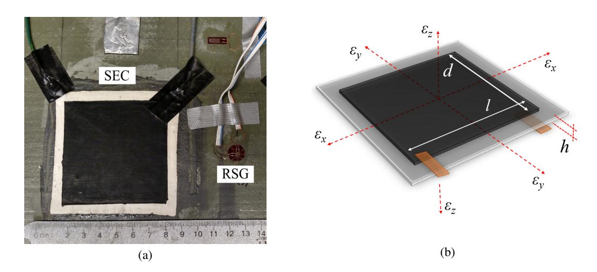

Figure 3.1 (a) Picture of an SEC sensor compared with an RSG; and (b) sketch of an SEC's geometry with reference axes.

model of the SEC is derived and validated, and the basic strain decomposition algorithm previously developed by the authors reviewed.

### 3.2.1 Electro-Mechanical Model

The SEC is designed to measure in-plane strain (*x* − *y* plane in figure [3.2\(](#page-86-0)b)) and is adhered to the monitored substrate using an off-the-shelf epoxy along the *x* − *y* plane. The sensor is typically installed after some pre-stretching to prevent any warping of the sensor under compressive loading of the monitored substrate. Assuming a relatively low sampling rate (< 1 kHz), the SEC can be modeled as a non-lossy capacitor with capacitance *C*, given by the parallel plate capacitor equation,

$$C = e_0 e_r \frac{A}{h} \quad (3.1)$$

where *e*<sup>0</sup> = 8.854 pF/m is the vacuum permittivity, *e<sup>r</sup>* is the polymer relative permittivity, *A* = *d* · *l* is the sensor area of width *d* and length *l*, and *h* is the thickness of the dielectric. Assuming small strain, the differential of equation (3.1) is expressed as

$$\frac{\Delta C}{C} = \left( \frac{\Delta l}{l} + \frac{\Delta d}{d} - \frac{\Delta h}{h} \right) = \varepsilon_x + \varepsilon_y - \varepsilon_z \quad (3.2)$$

{85}------------------------------------------------

<span id="page-85-0"></span>where  $\varepsilon_x$ ,  $\varepsilon_y$  and  $\varepsilon_z$  are linear strains in the  $x$ ,  $y$  and  $z$  directions as shown in figure 3.2(b). An expression relating  $\varepsilon_z$  to  $\varepsilon_x$  and  $\varepsilon_y$  can be obtained using Hooke's law for plane stress

$$\varepsilon_z = -\frac{\nu}{1-\nu}(\varepsilon_x + \varepsilon_y) \quad (3.3)$$

which gives

$$\frac{\Delta C}{C} = \lambda(\varepsilon_x + \varepsilon_y) \quad (3.4)$$

with

$$\lambda = \frac{1}{1-\gamma} \quad (3.5)$$

representing the gauge factor of the sensor. For SEBS, ν ≈ 0.49 (Wilkinson et al., 2004), which gives a gauge factor λ ≈ 2. Equation (3.4) shows that the signal of the SEC varies as a function of the additive strain <sup>ε</sup>*<sup>x</sup>* + <sup>ε</sup>*y*. The linearity of the derived electro-mechanical model holds for mechanical responses up to 15 Hz (Laflamme et al., 2015). An altered electro-mechanical model has been derived in (Saleem et al., 2015) for modeling mechanical responses up to 40 Hz, but is not shown here for brevity.

#### 3.2.2 Model Validation

The SEC's electro-mechanical model has been validated at numerous occasions. A typical result is presented here. The test setup consists of a simply supported aluminum plate of dimensions 200 x 75 x 3 mm<sup>3</sup> subjected to a four-point load setup to provide a constant strain field across the SEC, mounted onto the bottom surface of the plate at half-length. The performance of the SEC is validated using an off-the-shelf resistive strain gauge (RSG) (Vishay Micro-Measurements, CEA-06-500UW-120) having a resolution of 1 µε. A quasi-static triangular load is applied using a servo-hydraulic fatigue testing machine (MTS). Data from the SECs are acquired using an inexpensive off-the-shelf data acquisition system (ACAM PCap01) sampled at 95.4 Hz. Data from the RSGs are measured using Hewlett-Packard 3852 data acquisition system at a sampling frequency of 55Hz. A time series of the measured responses of the SEC and RSG is plotted in figure [3.2a](#page-86-0), where the signal of the SEC was converted into strain using the electromechanical model (equation (3.4)) specialized for uni-directional strain. Figure [3.2b](#page-86-0) is a plot of the measured strain from the SEC versus the applied strain. Results show a good agreement of the SEC data with the RSG data, and that the electro-mechanical model holds. The resolution of the sensor using this particular data acquisition setup is 25 µ*m*.

{86}------------------------------------------------

<span id="page-86-0"></span>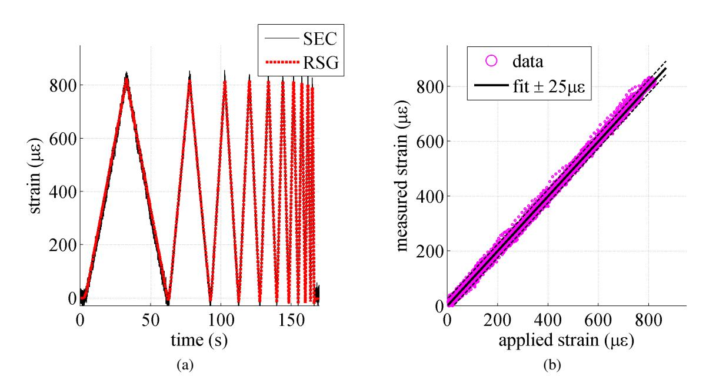

Figure 3.2 (a) Comparison of strain time histories for the SEC and the RSG; and (b) measured strain by the SEC versus applied strain.

#### 3.2.3 Strain Decomposition Algorithm

A strain decomposition algorithm was proposed in (Wu et al., 2015) to decompose the SEC signal (equation [\(3.4\)](#page-85-0)) into linear strain components in two orthogonal directions. It is summarized in this subsection and later enhanced for HDSN applications.

The algorithm consists of assuming a parametric displacement shape function, from which the equations mapping strain in two orthogonal directions, *x* and *y*, are derived. An LSE is then used to estimate the coefficients of strain maps that would best fit the signals of the SECs, which is done after enforcing boundary conditions. A polynomial displacement shape function has shown promise for conducting strain decomposition on a thin plate. Consider a cantilever plate of the type illustrated in figure [3.3](#page-87-0) and an *n th* order polynomial to approximate its deflection shape *w*(*x*, *y*) as

$$w(x, y) = \sum_{i=1, j=0}^n b_{ij} x^i y^j \quad (3.6)$$

where *bi j* are regression coefficients and *i* > 0 to satisfy the displacement boundary condition on the clamped edge (*w*(0, *y*) = 0). Considering a network with *m* sensors and collecting displacements at sensors' locations in a vector W ∈ R *m*×1 , the following equation can be written from equation (3.6)

{87}------------------------------------------------

<span id="page-87-0"></span>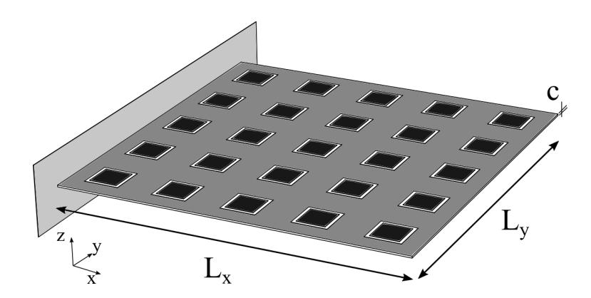

Figure 3.3 Cantilever plate with 20 SECs.

$$\mathbf{W} = \begin{bmatrix} w_1 & \dots & w_k & \dots & w_m \end{bmatrix}^T = \mathbf{H}\mathbf{B} \quad (3.7)$$

where H ∈ R *<sup>m</sup>*×*n*(*n*+1) is called the location matrix and B ∈ <sup>R</sup> *n*(*n*+1)×1 is the regression coefficients matrix. After straightforward computations, the following expressions are obtained for quantities contained in equation (3.7)

```html
$$\mathbf{H} = egin{bmatrix} x_1 & x_1 y_1 & & ext{...} \ x_2 & x_2 y_1 & & ext{...} \ ext{...} & ext{...} & & ext{...} \[-0.8em] ext{This matrix form is complex and contains ellipses indicating continuation.} \[-0.8em] \end{bmatrix}$$
```

$$\mathbf{B} = \begin{bmatrix} b_{10} & \dots & b_{ij} & \dots & b_{mn} \end{bmatrix}^T \quad (3.9)$$

Linear strain functions <sup>ε</sup>*x*(*x*, *y*) and <sup>ε</sup>*y*(*x*, *y*), along *x* and *y* directions, respectively, can be obtained from equation (3.7) by enforcing Kirchoff plate Theory as:

$$\varepsilon_x(x, y) = -\frac{c}{2} \frac{\partial^2 w(x, y)}{\partial x^2} = \mathbf{H}_x \mathbf{B}_x \quad (3.10)$$

$$\epsilon_y(x, y) = -\frac{c}{2} \frac{\partial^2 w(x, y)}{\partial y^2} = \mathbf{H}_y \mathbf{B}_y \quad (3.11)$$

where *c* is the thickness of the plate. Collecting linear strains at sensors locations along *x* and *y* directions in vectors E*<sup>x</sup>* and E*y*, respectively, and making use of equation [\(3.6\)](#page-86-0), the following expressions are derived

$$\mathbf{E}_x = \mathbf{H}_x \mathbf{B}_x \quad (3.12)$$

$$\mathbf{E}_y = \mathbf{H}_y \mathbf{B}_y \quad (3.13)$$

{88}------------------------------------------------

<span id="page-88-0"></span>where H*<sup>x</sup>* and H*<sup>y</sup>* are the location matrices for sensors transducing <sup>ε</sup>*x*(*x*, *y*) and <sup>ε</sup>*y*(*x*, *y*), respectively. Furthermore, B*<sup>x</sup>* and B*<sup>y</sup>* are the corresponding regression coefficients matrices. Written in terms of sensors' signals S ∈ <sup>R</sup> *m*×1 , the same equation reads:

$$\mathbf{S} = \begin{bmatrix} s_1 & \cdots & s_k & \cdots & s_m \end{bmatrix}^T = \mathbf{E}_x + \mathbf{E}_y = \mathbf{H}_s \mathbf{B}_s \quad (3.14)$$

where, for convenience, the signal *s<sup>k</sup>* for the *k*-th SEC sensor is taken as:

$$s_k = \frac{\Delta C_k}{\lambda C_k} = \varepsilon_x(x_k, y_k) + \varepsilon_y(x_k, y_k) \quad (3.15)$$

where (*xk*, *yk*) denote the location of the *k*-th SEC sensor and H*<sup>s</sup>* and B*<sup>s</sup>* read as

$$\mathbf{H}_s = \begin{bmatrix} \mathbf{H}_x | \mathbf{H}_y \end{bmatrix} \quad (3.16)$$

$$\mathbf{B}_s = \begin{bmatrix} \mathbf{B}_x \\ \mathbf{B}_y \end{bmatrix} \quad (3.17)$$

Using sensors' readings, the regression coefficient matrix B*<sup>s</sup>* can be estimated as Bˆ *<sup>s</sup>* via an LSE:

$$\hat{\mathbf{H}}_s = (\mathbf{H}_s^T \mathbf{H}_s)^{-1} \mathbf{H}_s^T \mathbf{S} \quad (3.18)$$

where the hat denotes an estimation. It follows that the strain maps can be reconstructed using

$$\hat{\mathbf{E}}_x = \mathbf{H}_x \hat{\mathbf{B}}_x \quad \hat{\mathbf{E}}_y = \mathbf{H}_y \hat{\mathbf{B}}_y \quad (3.19)$$

However, in its unaltered form, H*<sup>s</sup>* is multi-collinear because H*<sup>x</sup>* and H*<sup>y</sup>* share multiple rows, resulting in H *T <sup>s</sup>* H*<sup>s</sup>* being non-invertible. The solution utilized in (Wu et al., 2015) was to assume boundary conditions and replace selected rows of H*<sup>s</sup>* with null coefficients or scaling factors, as determined by the particular boundary conditions. Such a strategy was numerically validated for the specialized case of a cantilever thin plate. While results demonstrated the overall promise of the algorithm, the quality of the assumptions on the boundary conditions limited the performance of the algorithm. In the section that follows, the algorithm is extended to include uni-directional data from RSGs, with the objective to minimize knowledge required on the components' boundary conditions.

# 3.3 Extended LSE-based Algorithm using HDSN

The integration of a limited number of off-the-shelf sensors within an SEC network can have the advantage to add known strain values at given locations, therefore reducing or eliminating the reliance on boundary conditions 

{89}------------------------------------------------

assumptions. With the proposed HDSN configurations, RSGs are introduced at strategic locations to provide accurate boundary conditions within the LSE algorithm. Data from SECs and RSGs are fused in the algorithm using the same mathematical notation, with a prime to denote quantities that are generalized in the extended algorithm. In particular, the generalized sensors' location matrix is defined as:

$$\mathbf{H}_{s'} = \left[ \mathbf{r}_x \mathbf{H}_x | \mathbf{r}_y \mathbf{H}_y \right] \quad (3.20)$$

where Γ*<sup>x</sup>* and Γ*<sup>y</sup>* are appropriately defined diagonal weight matrices, as detailed in the following. The signal vector S 0 , including both SEC and RSG signals, is defined as:

$$\mathbf{S}' = \left[ \frac{\mathbf{S}_{\text{SEC}}}{\mathbf{S}_{\text{RSG}}} \right] \quad (3.21)$$

where SSEC and SRSG are matrices containing SEC and RSG signals, respectively. equation [\(8.8\)](#page-208-0) thus becomes:

$$\hat{\mathbf{H}}' = (\mathbf{H}_{s'}^T \mathbf{H}_{s'})^{-1} \mathbf{H}_{s'}^T \mathbf{S}' \quad (3.22)$$

Weight matrices introduced in equation (3.20) are diagonal matrices composed of scalars, <sup>γ</sup>*x*,*<sup>k</sup>* and <sup>γ</sup>*y*,*<sup>k</sup>*, associated with the *k*-th sensor. In particular, RSG signals are incorporated in H*<sup>s</sup>* <sup>0</sup> using

$$\gamma_{x,k} = 1 \ , \ \gamma_{y,k} = 0 \quad (3.23)$$

when the *k*-th RSG measures strain along the *x*-axis only, or, alternatively,

$$\gamma_{x,k} = 0 \ , \ \gamma_{y,k} = 1 \tag{3.24}$$

when the *k*-th RSG measures strain along the *y*-axis only. Different weight values other than unity can be selected in the design to add more importance to particular sensors. For instance, γ > 1 can be selected for RSGs due to their high level of accuracy compared with the SEC technology, or for SECs installed along a known boundary condition.

The extended algorithm also includes virtual sensors based on knowledge about the system's behavior. Virtual sensors are analogous to assumed boundary conditions, except that they are located at points on the edge of the strain reconstruction map. In the algorithm, virtual sensors are treated identically to RSGs and can also be used directly in the reconstruction of the strain maps. For instance, a sensor reading <sup>ε</sup>*<sup>y</sup>* = 0 can be added under a clamped fixity that extends along the *y* axis.

{90}------------------------------------------------

<span id="page-90-0"></span>The extended LSE-based algorithm is conceptually illustrated in figure 3.4. Dotted boxes in the figure represent the two new features added through the utilization of an HDSN. Both the virtual sensors and RSG signals can be utilized either fully or partly into the LSE or directly in the reconstruction of the strain maps as known points. Strain maps are decomposed at the sensors' locations included in matrix H*<sup>s</sup>* <sup>0</sup> and reconstructed elsewhere using C<sup>2</sup> continuous biharmonic splines. The algorithm can be specified by constructing splines that interpolate decomposed strains from equation [\(3.19\)](#page-88-0), strains measured by RSGs and/or strains known at virtual sensors locations.

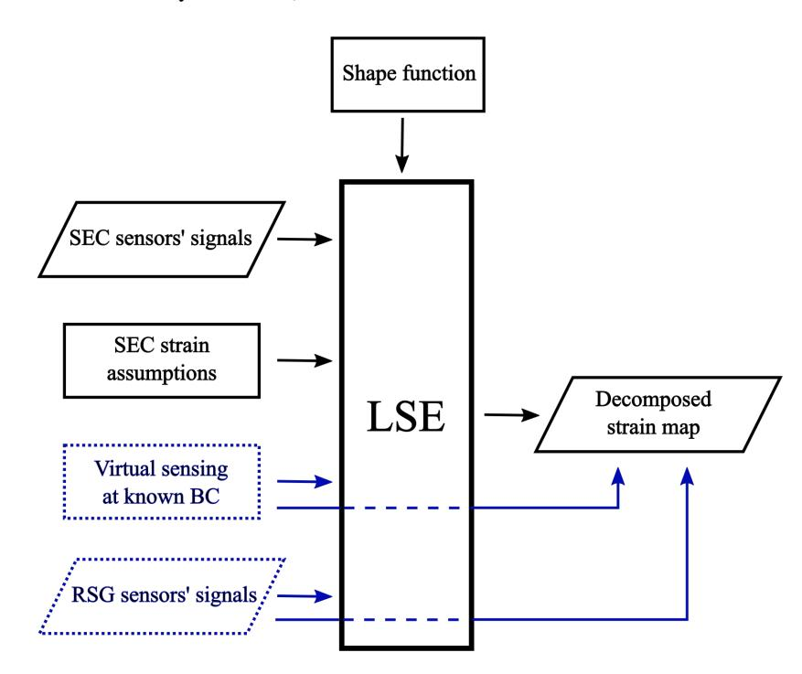

Figure 3.4 Modified strain decomposition algorithm.

The described extended algorithm still includes boundary conditions on the SEC strain readings, as it was the case for the original algorithm, to provide the user with greater flexibility. For instance, in the case of a cantilever plate, the boundary condition along the fixity can be assumed as <sup>ε</sup>*y*(0, *a<sup>y</sup>* ≤ *y* ≤ *L<sup>y</sup>* − *ay*) = 0, where *a<sup>y</sup>* is a positive constant such that 0 ≤ *a<sup>y</sup>* ≤ *Ly*/2 to account for different boundary conditions at corners. This assumed boundary condition is enforced for SECs installed along the fixity using <sup>γ</sup>*x*,*<sup>m</sup>* = 1, <sup>γ</sup>*y*,*<sup>m</sup>* = 0.

{91}------------------------------------------------

### 3.4 Methodology

<span id="page-91-0"></span>Validation of the strain decomposition algorithm presented in Section [3.3](#page-88-0) is conducted experimentally on an HDSN. This section describes the methodology used for the experimental validation.

#### 3.4.1 HDSN Configuration

The HDSN consists of 20 SECs and 46 RSGs deployed onto the surface of a fiberglass plate of geometry 74 × 63 × 0.32 cm<sup>3</sup> fixed along one edge with clamps as shown in figure 3.5(a). Figure 3.5(b) is a schematic of the SEC and RSG sensor placement. Each SEC covers 6.5 × 6.5 = 42 cm<sup>2</sup> in area, laid out in a 4 × 5 grid array. The point node used in constructing the H<sup>s</sup> <sup>0</sup> matrix is taken as the center of each SEC. RSGs used in the experimental setup are foil-type strain gauges of 6 mm length manufactured by Tokyo Sokki Kenkyujo, model FLA-6-350-11-3LT. They are aligned along the directions of the plate's edges, in either a single or double configuration, individually measuring <sup>ε</sup>*<sup>x</sup>* and <sup>ε</sup>*<sup>y</sup>* as indicated in figure 3.5(b) by using circles and squares, respectively. The number of considered RSGs was purposely very large in order to provide enough measurement points to assess the performance of the algorithm as a function of the number of arbitrarily located RSGs.

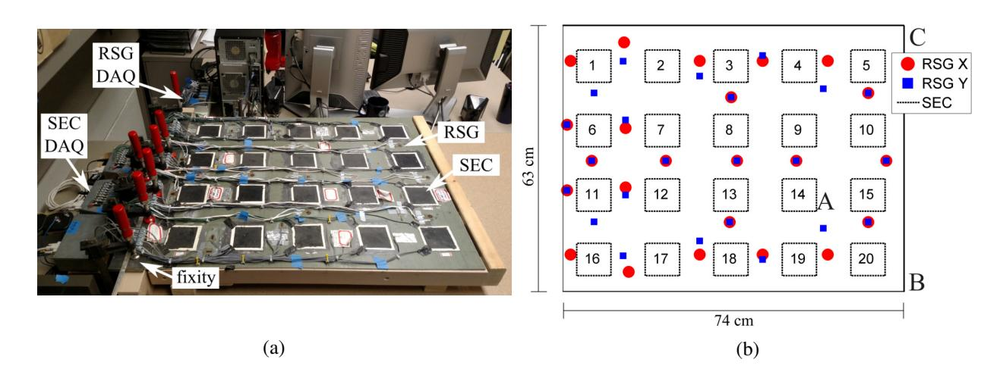

Figure 3.5 (a) Picture of the experimental configuration; and (b) sensor nomenclature.

The plate is subjected to four different displacement-controlled load cases, listed in Table [3.1.](#page-92-0) Load case I consists of an upward uniform displacement along the free edge BC as shown in figure 3.5(b). Load case II is a downward uniform displacement along free edge BC. Load case III is an upward point displacement under point A (directly under SEC 14), with points B and C restrained in the vertical direction. Load case IV consists of an upward displacement 

{92}------------------------------------------------

<span id="page-92-0"></span>at point C, with point B restrained in the vertical direction. The displacement controlled loads were applied using a frame built from extruded aluminum framing. Each test consisted of three 15-second sets of unloaded, loaded, and unloaded conditions, for a total of 45 seconds.

Table 3.1 Loading cases.

| Point | Location | Magnitude | Displacement Direction |
|-------|----------|-----------|------------------------|
| I     | BC       | 125       | none                   |
| II    | BC       | -97       | none                   |
| III   | A        | 47        | B,C                    |
| IV    | C        | 47        | B                      |

Different data acquisition (DAQ) hardware is used for the measurement of the SEC and RSG sensors, as annotated in figure [3.5\(](#page-91-0)a). SEC measurements are recorded using a capacitance-to-digital converter, PCAP-02, mounted inside protective boxes and manufactured by ACAM-Messelectronic GmbH. Capacitance measurement is performed by measuring the SEC sensors discharge time, in comparison with the discharge time of a known reference capacitor. This DAQ is capable of reading up to 7 channels, multiplexed through a single capacitance-to-digital converter. The acquisition of data was performed using a PCAP-02 evaluation board with ACAM's evaluation software at a sampling rate of 25 Hz. RSG measurements are recorded using a National Instruments cDAQ-9174 with four 24-bit 350 Ω quarter-bridge modules (NI-9236) through LabVIEW, sampled at 100 Hz.

Figure [3.6](#page-93-0) shows an example of SEC signal, ∆*C*, acquired from a row of sensors (16 - 20) during load case III. Data are presented filtered using a moving average. The sensors operate as designed under both compression and tension. Given the static nature of the study, the capacitance signal for the reconstruction of strain maps is taken as the average of data points between 23 and 28 seconds.

#### 3.4.2 Algorithm Configurations

Validation is performed on different algorithm configurations, as listed in Table [3.2,](#page-94-0) to investigate the effects of the different inputs illustrated in the block diagram of figure [3.4.](#page-90-0) Algorithm 1 consists of enforcing boundary conditions through the introduction of RSGs into the SEC DSN, forming an HDSN. This is obtained by adding RSGs into H*<sup>s</sup>* 0 . Algorithms 2-4 add additional inputs, namely virtual sensors at known boundary conditions, assumptions on the SEC strain boundary conditions and RSG data directly in the reconstruction of the strain maps. Algorithm 5 uses all the inputs.

{93}------------------------------------------------

<span id="page-93-0"></span>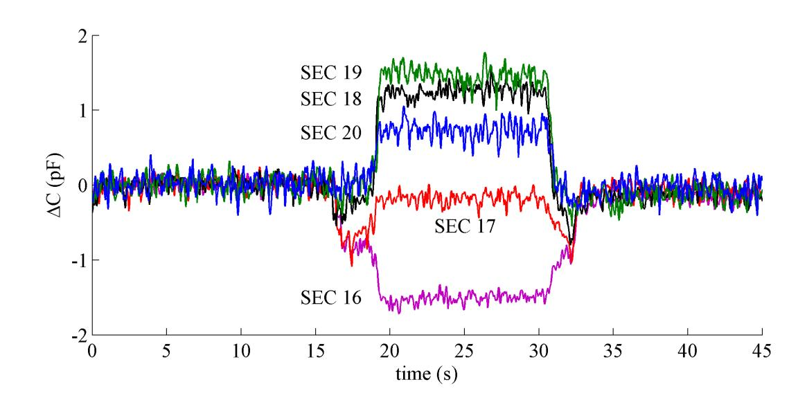

Figure 3.6 Example of sensor signals: sensors SEC 16-20 under load case III.

For the thin plate under study, virtual sensors are added to enforce the assumptions on the boundary conditions. On the fixed edge, <sup>ε</sup>*<sup>y</sup>* = 0 is assumed for *a<sup>y</sup>* ≤ *y* ≤ *L<sup>y</sup>* − *a<sup>y</sup>* where *a<sup>y</sup>* = 5 mm to account for the corner effects. For all loading cases, 5 virtual sensors are placed along the fixity (*x* = 0) at *y* = 5.00, 15.8, 26.6, 37.4, 48.2 and 59.0 mm with virtual signals <sup>ε</sup>*<sup>y</sup>* = 0. For the purpose of enforcing the plates boundary conditions, and due to low levels of <sup>ε</sup>*<sup>x</sup>* along the free edge opposite to the fixity, the assumption that <sup>ε</sup>*<sup>x</sup>* ≈ 0 was made along the free edge. Five virtual sensors are placed along the free edge (*x* = 0.74 mm) at *y* = 5.00, 15.8, 26.6, 37.4, 48.2 and 59.0 mm with signals (ε*<sup>x</sup>* = 0). While this assumption is valid only for load cases 1 and 2, it has shown to be convenient to equate the strain levels to 0 given the low levels of strain at these positions.

For the algorithm cases based on strain assumptions at the SECs locations, different assumptions were made along the plate's edges for different load cases in order to be consistent with the prior form of the algorithm. For the boundary conditions along the fixity, <sup>ε</sup>*<sup>y</sup>* was assumed to be zero for *a<sup>y</sup>* ≤ *y* ≤ *Ly*−*ay*, where *a<sup>y</sup>* is taken as 20 cm. This is enforced in the LSE algorithm by setting <sup>γ</sup>*y*,<sup>11</sup> = 0 and <sup>γ</sup>*y*,<sup>16</sup> = 0. A similar approach was taken for <sup>ε</sup>*<sup>x</sup>* at the plate's free edge (SEC 10 and 15) due to the low level of strain present, <sup>ε</sup>*<sup>x</sup>* was enforced as zero by setting <sup>γ</sup>*x*,<sup>10</sup> = 0 and <sup>γ</sup>*x*,<sup>15</sup> = 0. Under the asymmetric loads (loading cases III and IV), different assumptions are conducted on <sup>ε</sup>*<sup>x</sup>* and <sup>ε</sup>*y*. Table [3.3](#page-94-0) summarizes weights used to enforce the assumptions on boundary conditions for all SECs under different loading cases.

{94}------------------------------------------------

Table 3.2 Evaluated algorithm configurations.

<span id="page-94-0"></span>

|   |   |   | RSG data in |            |
|---|---|---|-------------|------------|
|   |   |   | strain maps |            |
|   |   |   |             | RSGs added |
|   |   |   |             | into H s   |
| 1 |   |   |             | x          |
| 2 | x |   |             | x          |
| 3 |   | x |             | x          |
| 4 |   |   | x           | x          |
| 5 | x | x | x           | x          |

Table 3.3 Weight parameters γ used to enforce the assumptions on boundary conditions.

| SEC      | γ x | I γ y | γ x | loading II γ y | case γ x | III γ y | IV γ x | γ y |
|----------|-----|-------|-----|----------------|----------|---------|--------|-----|
| 1        | 1   | 1     | 1   | 1              | 1        | 0       | 1      | 1   |
| 2 to 5   | 1   | 1     | 1   | 1              | 1        | 1       | 1      | 1   |
| 6        | 1   | 0     | 1   | 0              | 1        | 0       | 1      | 0   |
| 7 to 9   | 1   | 1     | 1   | 1              | 1        | 1       | 1      | 1   |
| 10       | 0   | 1     | 0   | 1              | 1        | 1       | 0      | 1   |
| 11       | 1   | 0     | 1   | 0              | 1        | 0       | 1      | 0   |
| 12 to 14 | 1   | 1     | 1   | 1              | 1        | 1       | 1      | 1   |
| 15       | 0   | 1     | 0   | 1              | 1        | 1       | 0      | 1   |
| 16       | 1   | 1     | 1   | 1              | 1        | 0       | 1      | 1   |
| 17 to 20 | 1   | 1     | 1   | 1              | 1        | 1       | 1      | 1   |

For the algorithm cases utilizing RSG data directly in the strain maps, RSG sensor data are introduced directly into the decomposed strain maps alongside with the decomposed SEC strains from the enhanced LSE algorithm. Lastly, for all of the algorithms, a polynomial function (equation [\(3.6\)](#page-86-0)) for the deflection shape was assumed. A fourth order polynomial was selected to improve the ability of the strain decomposition algorithm in capturing more complex strain features in the *y* direction. Note that *i* ≥ 2 and *j* ≥ 2 to satisfy the boundary conditions of a cantilever plate.

$$w(x, y) = \sum_{i=2, j=2}^4 a_{ij} x^i y^j \quad (3.25)$$

{95}------------------------------------------------

<span id="page-95-0"></span>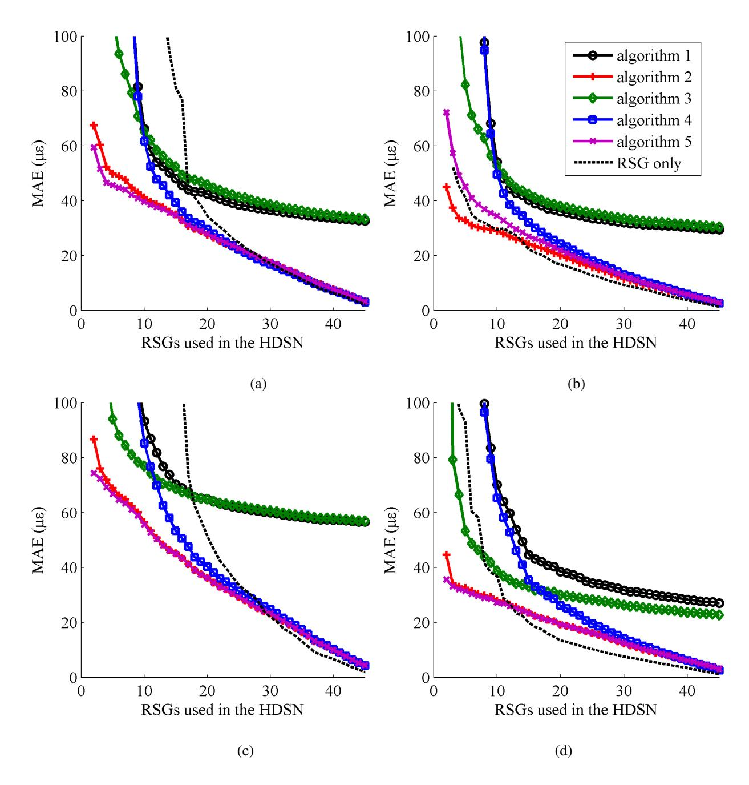

Figure 3.7 Algorithm results for varying RSGs added to the DSN: (a) load case I for  $\varepsilon_x$ ; (b) load case I for  $\varepsilon_y$ ; (c) load case II for  $\varepsilon_x$ ; (d) load case II for  $\varepsilon_y$ ; (e) load case III for  $\varepsilon_x$ ; (f) load case III for  $\varepsilon_y$ ; (g) load case IV for  $\varepsilon_x$ ; and (h) load case IV for  $\varepsilon_y$ .

{96}------------------------------------------------

<span id="page-96-0"></span>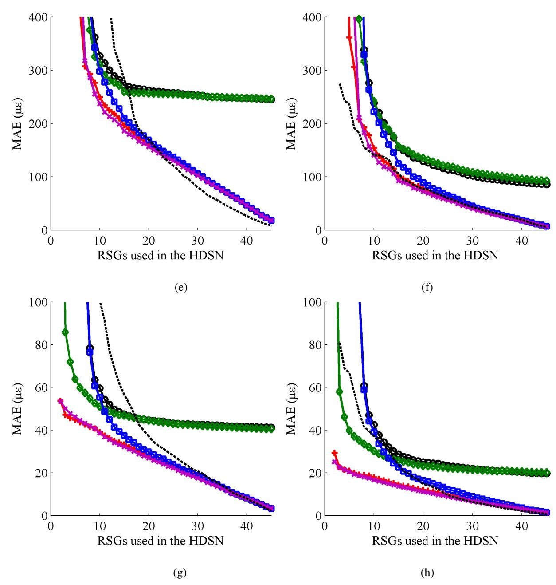

Figure 3.7 (continued)

### 3.4.3 Selection of RSGs into the HDSN

Selection of the RSGs is conducted randomly to study the influence of sensor placement on the performance of the algorithm. A total of 100 sets of randomly selected sensors constructed from the RSG placement shown in figure 

{97}------------------------------------------------

<span id="page-97-0"></span>[3.5\(](#page-91-0)b) were generated. Simulations consist of adding RSGs in the HDSN in the order listed in each random set. Each algorithm case is ran 100 times, and results show the average value of the LSE performance. The variance in performance under changing RSGs sensors layout is also discussed. The special case of 1 single RSG, for which only 46 permutations are possible, is not considered. Optimal sensor placement for RSGs within the HDSN is out-of-thescope of this paper.

# 3.5 Results

Results from the experimental validation are presented and discussed in this section. The performance of each algorithm configuration (Table [3.2\)](#page-94-0) is quantified using the mean absolute error (MAE) between the LSE estimated strain maps and the known strains at the locations of the RSGs (23 along the *x*-axis and 23 along the *y*-axis). The LSE estimated strain maps are developed for the entire area of the cantilever plate shown in figure [3.5.](#page-91-0) In the subsection that follows, the performance in strain reconstruction is investigated, for different LSE-based algorithms, as a function of the number of RSGs used in the algorithm, taken at random locations as discussed in Section [3.4.](#page-91-0) Afterward, the robustness of the algorithm is studied as a function of RSG sensor placement.

#### 3.5.1 Algorithm Configurations

Figure [3.4.2](#page-94-0) shows the average performance of the algorithms under each loading case. The "RSG-only" case is the performance benchmark, and converges to 0 as the number of RSG augments due to the formulation of the MAE index. As expected, the performance of each algorithm improves with the number of RSGs used into the HDSN. Using algorithm 1 as the base line (simplest form), algorithms 2-5 improve on the MAE to various levels, where adding more inputs to the algorithms helps the reconstruction of strain maps, except for a few cases (loading case I, for instance) where algorithm 3 underperforms algorithm 1, most likely due to errors on the boundary conditions assumptions. Algorithm 2 provides a substantial improvement in the MAE compared with algorithm 1 through the integration of virtual sensors. Algorithm 4 generally exhibits a slower convergence rate, offering only a marginal improvement to the base LSE algorithm (algorithm 1). However, algorithm 4 could see substantial improvement with an optimized sensor placement scheme. Lastly, algorithm 5, which combines all of the inputs, performs similarly to algorithm 2. Under most loading conditions and algorithms configurations, the extended LSE algorithm provides a better representation of

{98}------------------------------------------------

<span id="page-98-0"></span>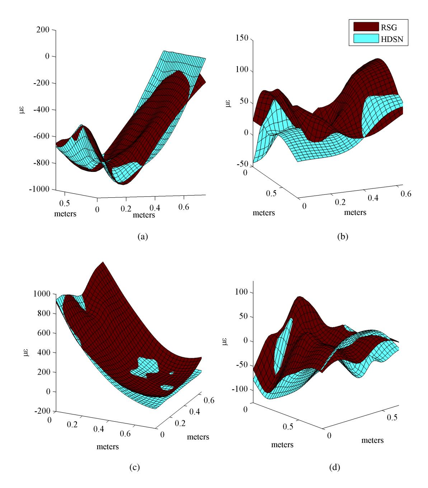

Figure 3.8 Decomposed strain maps: (a) load case I for  $\varepsilon_x$ ; (b) load case I for  $\varepsilon_y$ ; (c) load case II for  $\varepsilon_x$ ; (d) load case II for  $\varepsilon_y$ ; (e) load case IV for  $\varepsilon_x$ ; (f) load case III for  $\varepsilon_y$ ; (g) load case IV for  $\varepsilon_x$ ; and (h) load case IV for  $\varepsilon_y$ .

{99}------------------------------------------------

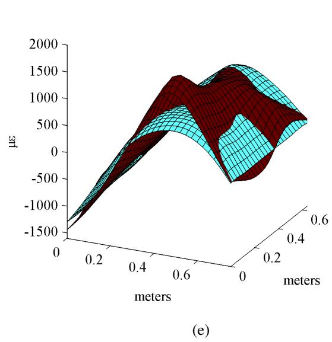

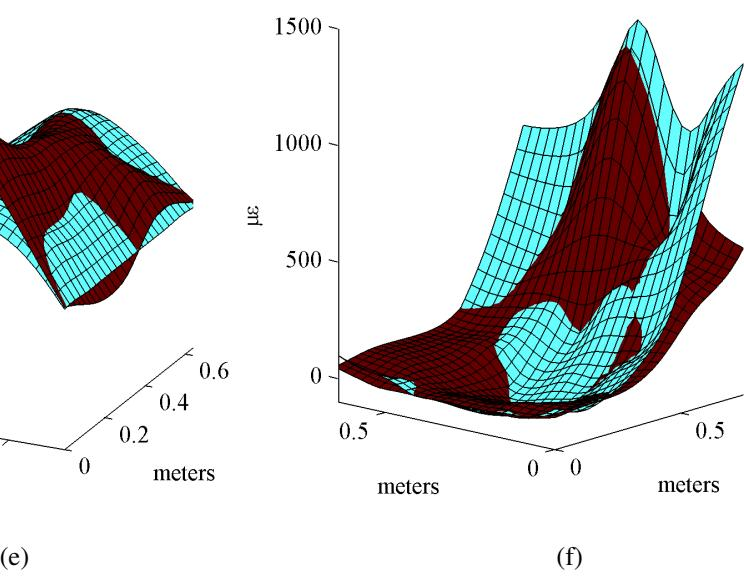

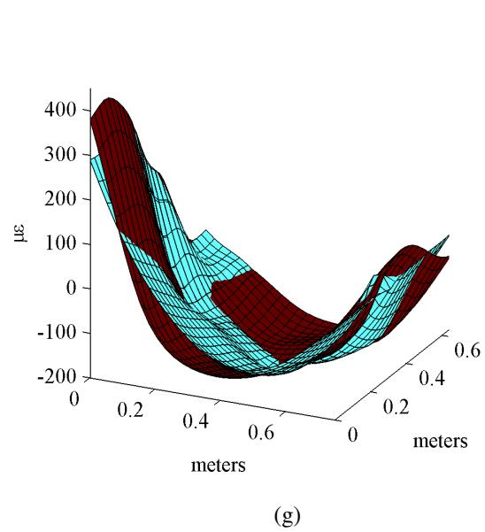

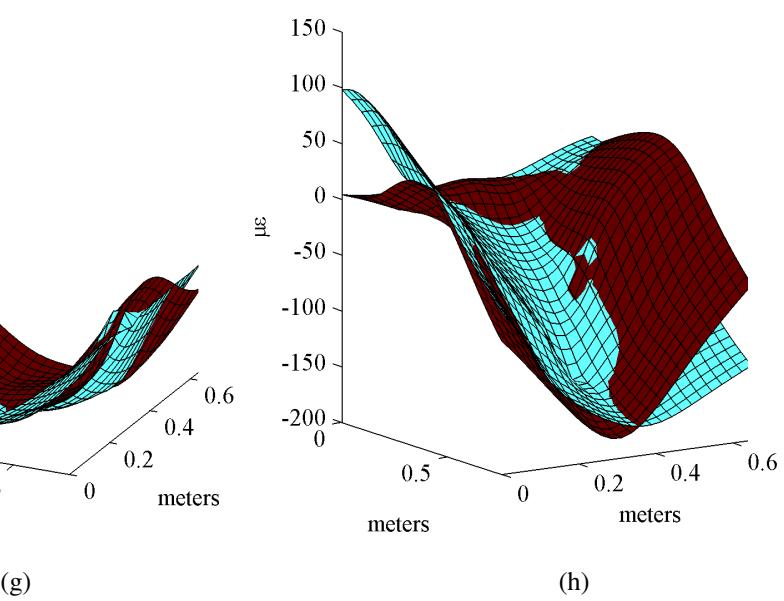

Figure 3.8 (continued)

{100}------------------------------------------------

<span id="page-100-0"></span>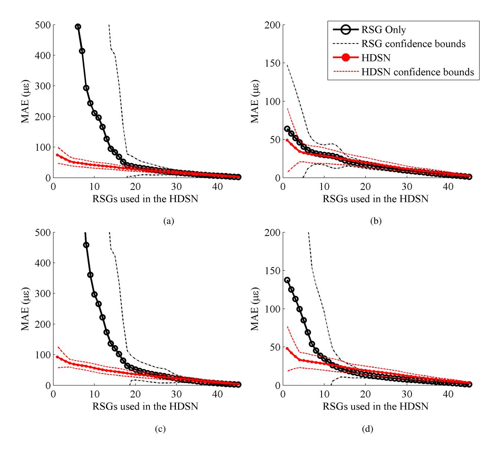

Figure 3.9 Algorithm robustness towards sensor placement: (a) load case I for  $\varepsilon_x$ ; (b) load case I for  $\varepsilon_y$ ; (c) load case II for  $\varepsilon_x$ ; (d) load case II for  $\varepsilon_y$ ; (e) load case III for  $\varepsilon_x$ ; (f) load case III for  $\varepsilon_y$ ; (g) load case IV for  $\varepsilon_x$ ; and (h) load case IV for  $\varepsilon_y$ .

the unidirectional strain maps than the equivalent number of RSGs, when less than 20 RSGs are added into the HDSN, demonstrating a net advantage of utilizing an HDSN. Also, it can be concluded from these results that algorithm 2 offers the best performance given its simplicity. Another notable advantage of algorithm 2 over algorithm 5 is that it does not include SEC assumptions, which need to be adjusted depending upon the peculiar loading condition. It is, therefore, a generally applicable algorithm.

{101}------------------------------------------------

The decomposed strain maps are presented in figure [3.8.](#page-98-0) An HDSN consisting of 20 RSGs was arbitrarily selected to investigate the extended LSE algorithm (configuration 2) when using an equal number of RSGs and SECs. The decomposed strain maps are compared against the strain maps obtained using 46 RSGs only. The layout of RSG sensors within the HDSN was selected to provide the best fit from the list of 100 randomly generated sensor placement

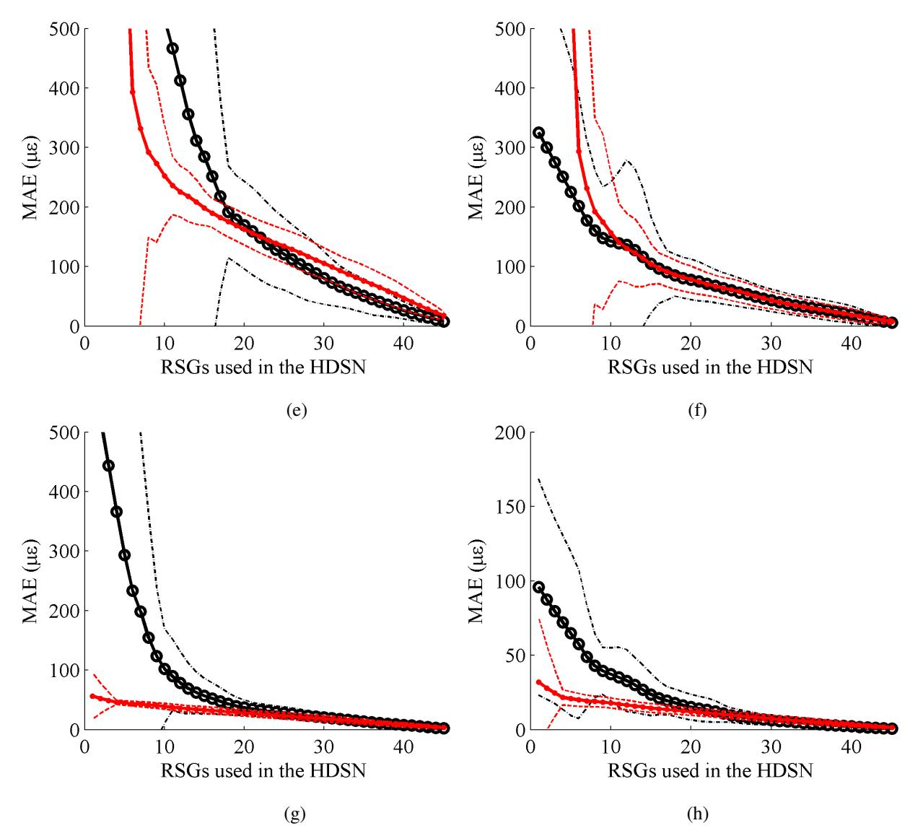

Figure 3.9 (continued)

arrangements discussed in Section [3.4.3.](#page-96-0) Results show similar maps, with slight disagreements for the strain along the *y*-axis. Obtaining a more accurate fit for <sup>ε</sup>*<sup>y</sup>* would require a higher order shape function. Such strategy was not 

{102}------------------------------------------------

<span id="page-102-0"></span>investigated due to the low number of SECs along that axis, which would result in over-fitting for lower numbers of RSGs used into the HDSN.

### 3.5.2 Algorithm Robustness to Sensor Placement

The robustness of the LSE-based algorithm with respect to the layout of RSG sensors is evaluated by comparing the 95% confidence bound on the MAE over all 100 sensor placement cases. For the study, algorithm 2 is selected due to its higher overall performance compared with other algorithm variations. Figure [3.9](#page-100-0) compares the results with the RSG only case. Except for loading case III, the 95% confidence bound on the HDSN using algorithm 2 is small compared to the 95% confidence bound using RSGs only. This is as expected, given that the HDSN always utilizes 20 SECs spread over the entire plate. The 95% confidence bound is larger for loading case III, most likely due to the higher complexity of the strain maps. Overall, the confidence bounds obtained by the HDSN are tighter than those obtained using RSG readings only, which allows the authors to conclude that the HDSN has a high robustness with respect to sensor placement.

# 3.6 Conclusion

This paper presented a method for the directional decomposition of additive strain measured by a novel large soft elastomeric capacitor (SEC). The SEC is an inexpensive strain gauge, designed to cover large surfaces for the purpose of damage detection and localization. A previously proposed least squares estimator (LSE)-based algorithm was enhanced to provide boundary condition updating through the use of a hybrid dense network (HDSN) leveraging mature off-the-shelf technology, in particular, a set of electrical resistive strain gauges (RSGs). In this HDSN configuration, the SECs' ability to inexpensively monitor large areas is combined with the RSGs ability to provide precise, unidirectional local strain measurements. The original LSE algorithm consists of assuming a shape function in the framework of classical Kirchhoff plate theory and using an LSE to find the coefficients of the shape function. The enhanced LSE algorithm introduces weighted matrices to concatenate and achieve an effective fusion between signals from both the SECs and the RSGs. Additionally, virtual sensing nodes are introduced along the plates known boundary conditions to enforce known boundary conditions outside the HDSN sensing points.

Experimental investigations were conducted on a cantilever plate equipped with 20 SECs and 46 RSGs. For a plate under simple loading cases, the LSE algorithm successfully produced unidirectional strain maps. However, it showed limitations in fitting more complex strain fields, possibly due to the limited number of sensors (SECs and RSGs) used in the investigation that limited the order of the polynomial used in representing the shape function. Further

{103}------------------------------------------------

<span id="page-103-0"></span>investigation is needed to validate the proposed algorithm for use with different HDSN layouts and with an expanded library of loading cases. While the proposed strategy showed to be robust with respect to sensor placement, the formal network design, including the optimal placement, type, and number of sensors within an HDSN needs to be explored. The algorithmic improvements presented here build a basis for future work in real-time boundary condition updating and regression fitting of parameters' weights.

# Acknowledgments

The development of the SEC technology is supported by grant No. 13-02 from the Iowa Energy Center. This work is also partly supported by the National Science Foundation Grant No. 1069283, which supports the activities of the Integrative Graduate Education and Research Traineeship (IGERT) in Wind Energy Science, Engineering and Policy (WESEP) at Iowa State University. Their support is gratefully acknowledged.

### 3.7 References

Adams, D., White, J., Rumsey, M., and Farrar, C. (2011). Structural health monitoring of wind turbines: method and application to a HAWT. *Wind Energy*, 14(4):603–623. Ahmed, M., Gonenli, I. E., Nadvi, G. S., Kilaru, R., Butler, D. P., and Celik-Butler, Z. (2012). MEMS sensors on flexible substrates towards a smart skin. In *2012 IEEE Sensors*. IEEE. Burton, A. R., Kurata, M., Nishino, H., and Lynch, J. P. (2016). Fully integrated patterned carbon nanotube strain sensors on flexible sensing skin substrates for structural health monitoring. In Lynch, J. P., editor, *Sensors and Smart Structures Technologies for Civil, Mechanical, and Aerospace Systems 2016*. SPIE. Chang, N.-K., Su, C.-C., and Chang, S.-H. (2008). Fabrication of single-walled carbon nanotube flexible strain sensors with high sensitivity. *Applied Physics Letters*, 92(6):063501. Chang, P. C., Flatau, A., and Liu, S. C. (2003). Review paper: Health monitoring of civil infrastructure. *Structural Health Monitoring: An International Journal*, 2(3):257–267.

{104}------------------------------------------------

Ciang, C. C., Lee, J.-R., and Bang, H.-J. (2008). Structural health monitoring for a wind turbine system: a review of damage detection methods. *Measurement Science and Technology*, 19(12):122001. Dobrzynska, J. A. and Gijs, M. A. M. (2012). Polymer-based flexible capacitive sensor for three-axial force measurements. *Journal of Micromechanics and Microengineering*, 23(1):015009. Frangopol, D. M. and Messervey, T. B. (2009). Life-cycle cost and performance prediction: role of structural health monitoring. *Frontier technologies for infrastructures engineering: structures and infrastructures book series*, 4:361. Geng, W., He, X., Su, Y., Dang, J., Gu, J., Tian, W., and Zhang, Q. (2016). Remarkable humidity-responsive sensor based on poly ( n , n -diethylaminoethyl methacrylate)- b -polystyrene block copolymers. *Sensors and Actuators B: Chemical*, 226:471–477. Grilli, S., Coppola, S., Vespini, V., Pagliarulo, V., Nasti, G., Carfagna, C., and Ferraro, P. (2014). One-step fabrication of free-standing flexible membranes reinforced with self-assembled arrays of carbon nanotubes. *Applied Physics Letters*, 105(15):153101. Gross, E., Zadoks, R., Simmermacher, T., and Rumsey, M. (1999). Application of damage detection techniques using wind turbine modal data. In *37th Aerospace Sciences Meeting and Exhibit*. American Institute of Aeronautics and Astronautics. Harrey, P., Ramsey, B., Evans, P., and Harrison, D. (2002). Capacitive-type humidity sensors fabricated using the offset lithographic printing process. *Sensors and Actuators B: Chemical*, 87(2):226–232. Hu, Y., Rieutort-Louis, W. S. A., Sanz-Robinson, J., Huang, L., Glisic, B., Sturm, J. C., Wagner, S., and Verma, N. (2014). Large-scale sensing system combining large-area electronics and CMOS ICs for structural-health monitoring. *IEEE Journal of Solid-State Circuits*, 49(2):513–523. Kang, I., Schulz, M. J., Kim, J. H., Shanov, V., and Shi, D. (2006). A carbon nanotube strain sensor for structural health monitoring. *Smart Materials and Structures*, 15(3):737–748. Kharroub, S., Laflamme, S., Song, C., Qiao, D., Phares, B., and Li, J. (2015). Smart sensing skin for detection and localization of fatigue cracks. *Smart Materials and Structures*, 24(6):065004. Laflamme, S., Cao, L., Chatzi, E., and Ubertini, F. (2016). Damage detection and localization from dense network of strain sensors. *Shock and Vibration*, 2016:1–13.

{105}------------------------------------------------

- Laflamme, S., Kollosche, M., Connor, J. J., and Kofod, G. (2013a). Robust flexible capacitive surface sensor for structural health monitoring applications. *Journal of Engineering Mechanics*, 139(7):879–885. Laflamme, S., Saleem, H. S., Vasan, B. K., Geiger, R. L., Chen, D., Kessler, M. R., and Rajan, K. (2013b). Soft elastomeric capacitor network for strain sensing over large surfaces. *IEEE*/*ASME Transactions on Mechatronics*, 18(6):1647–1654. Laflamme, S., Ubertini, F., Saleem, H., D'Alessandro, A., Downey, A., Ceylan, H., and Materazzi, A. L. (2015). Dynamic characterization of a soft elastomeric capacitor for structural health monitoring. *Journal of Structural Engineering*, 141(8):04014186. Lee, B.-Y., Kim, J., Kim, H., Kim, C., and Lee, S.-D. (2016). Low-cost flexible pressure sensor based on dielectric elastomer film with micro-pores. *Sensors and Actuators A: Physical*, 240:103–109. Lee, H.-K., Chang, S.-I., and Yoon, E. (2006). A flexible polymer tactile sensor: Fabrication and modular expandability for large area deployment. *Journal of Microelectromechanical Systems*, 15(6):1681–1686. Lipomi, D. J., Vosgueritchian, M., Tee, B. C.-K., Hellstrom, S. L., Lee, J. A., Fox, C. H., and Bao, Z. (2011). Skinlike pressure and strain sensors based on transparent elastic films of carbon nanotubes. *Nature Nanotechnology*, 6(12):788–792. Liu, W., Tang, B., and Jiang, Y. (2010). Status and problems of wind turbine structural health monitoring techniques in china. *Renewable Energy*, 35(7):1414–1418. Mahmood, M. S., Celik-Butler, Z., and Butler, D. P. (2015). Design and fabrication of self-packaged, flexible MEMS accelerometer. In *2015 IEEE SENSORS*. IEEE. Metzger, C., Fleisch, E., Meyer, J., Dansachmuller, M., Graz, I., Kaltenbrunner, M., Keplinger, C., Schwodiauer, R., and Bauer, S. (2008). Flexible-foam-based capacitive sensor arrays for object detection at low cost. *Applied Physics Letters*, 92(1):013506. Rogers, J. A., Someya, T., and Huang, Y. (2010). Materials and mechanics for stretchable electronics. *Science*, 327(5973):1603–1607. Rumsey, M. A. and Paquette, J. A. (2008). Structural health monitoring of wind turbine blades. In Ecke, W., Peters,
  - K. J., and Meyendorf, N. G., editors, *Smart Sensor Phenomena, Technology, Networks, and Systems 2008*. SPIE.

{106}------------------------------------------------

- Saleem, H., Downey, A., Laflamme, S., Kollosche, M., and Ubertini, F. (2015). Investigation of dynamic properties of a novel capacitive-based sensing skin for nondestructive testing. *Materials Evaluation*, 73(10):1384–1391. Suster, M., Guo, J., Chaimanonart, N., Ko, W., and Young, D. (2006). A high-performance MEMS capacitive strain sensing system. *Journal of Microelectromechanical Systems*, 15(5):1069–1077. Tung, S.-T., Yao, Y., and Glisic, B. (2014). Sensing sheet: the sensitivity of thin-film full-bridge strain sensors for crack detection and characterization. *Measurement Science and Technology*, 25(7):075602. Ubertini, F. and Giuliano, F. (2010). Computer simulation of stochastic wind velocity fields for structural response analysis: Comparisons and applications. *Advances in Civil Engineering*, 2010:1–20. Ubertini, F., Materazzi, A. L., D'Alessandro, A., and Laflamme, S. (2014). Natural frequencies identification of a reinforced concrete beam using carbon nanotube cement-based sensors. *Engineering Structures*, 60:265–275. Wilkinson, A., Clemens, M., and Harding, V. (2004). The effects of SEBS-g-maleic anhydride reaction on the morphology and properties of polypropylene/PA6/SEBS ternary blends. *Polymer*, 45(15):5239–5249. Wu, J., Song, C., Saleem, H. S., Downey, A., and Laflamme, S. (2015). Network of flexible capacitive strain gauges for the reconstruction of surface strain. *Measurement Science and Technology*, 26(5):055103. Xu, Y., Jiang, F., Newbern, S., Huang, A., Ho, C.-M., and Tai, Y.-C. (2003). Flexible shear-stress sensor skin and its application to unmanned aerial vehicles. *Sensors and Actuators A: Physical*, 105(3):321–329. Yamada, T., Hayamizu, Y., Yamamoto, Y., Yomogida, Y., Izadi-Najafabadi, A., Futaba, D. N., and Hata, K. (2011). A stretchable carbon nanotube strain sensor for human-motion detection. *Nature Nanotechnology*, 6(5):296–301. Yoda, R. (1998). Elastomers for biomedical applications. *Journal of Biomaterials Science, Polymer Edition*, 9(6):561–
- 626. Zou, Y., Tong, L., and Steven, G. P. (2000). Vibration bases model dependet damage delamination identification and health monitoring for composite structres - a review. *Journal of Sound and Vibration*, 230(2):357–378.

{107}------------------------------------------------

# <span id="page-107-0"></span>CHAPTER 4. RECONSTRUCTION OF UNIDIRECTIONAL STRAIN MAPS VIA ITERATIVE SIGNAL FUSION FOR MESOSCALE STRUCTURES MONITORED BY A SENSING SKIN

This chapter is wholly based on "Reconstruction of Unidirectional Strain Maps via Iterative Signal Fusion for Mesoscale Structures Monitored by a Sensing Skin" Published in the Mechanical Systems and Signal Processing, vol. 112, 2018, p. 401-416. doi:10.1016/j.ymssp.2018.04.023.

Mohammadkazem Sadoughi<sup>1</sup> , Austin Downey1,<sup>2</sup> , Jin Yan<sup>2</sup> , Chao Hu1,<sup>3</sup> and Simon Laflamme2,<sup>3</sup>

# Abstract

Flexible skin-like membranes have received considerable research interest for the cost-effective monitoring of mesoscale (large-scale) structures. The authors have recently proposed a large-area electronic consisting of a soft elastomeric capacitor (SEC) that transduces a structure's change in geometry (i.e. strain) into a measurable change in capacitance. The SEC sensor measures the summation of the orthogonal strains (i.e. <sup>ε</sup>*<sup>x</sup>* + <sup>ε</sup>*y*). It follows that an algorithm is required for the decomposition of the sensor signal into unidirectional strain maps. In this study, a new method enabling such decomposition, leveraging a dense sensor network of SECs and resistive strain gauges (RSGs), is proposed. This method, termed iterative signal fusion (ISF), combines the large-area sensing capability of SECs and the high-precision sensing capability of RSGs. The proposed method adaptively fuses the different sources of signal information (e.g. from SECs and RSGs) to build a structure's best fit unidirectional strain maps. Each step of ISF contains an update process for strain maps based on the Kriging model. To demonstrate the accuracy of the proposed method, an experimental test bench is developed, which is the largest deployment of the SEC-based sensing skin to date both in terms of size and sensor count. A network of 40 SECs deployed on a grid (5 × 8) is utilized and an optimal

<sup>1</sup> Department of Mechanical Engineering, Iowa State University, Ames, IA, USA

<sup>2</sup> Department of Civil, Construction, and Environmental Engineering, Iowa State University, Ames, IA, USA

<sup>3</sup> Department of Electrical and Computer Engineering, Iowa State University, Ames, IA, USA

{108}------------------------------------------------

<span id="page-108-0"></span>sensor placement algorithm is used to select the optimal RSG sensor locations within the network of SECs. Results show that the proposed ISF method is capable of reconstructing unidirectional strain maps for the experimental test plate. In addition to the experimental data, a numerical validation for the ISF method is provided through a finite element analysis model of the experimental test bench.

Keywords: structural health monitoring, sensing skin, capacitive-based sensor, soft elastomeric capacitor, sensor network, kriging-based signal decomposition

# 4.1 Introduction

Traditionally, mesoscale structural systems, including aerospace structures, energy systems and civil infrastructures are investigated and maintained using break-down based and time-based (Chang et al., 2003) strategies. An alternative is condition-based maintenance, which is known to have strong economic benefits for owners, operators, and society (Ciang et al., 2008; Adams et al., 2011). Structural health monitoring (SHM) and life prediction are among the key components of the condition based maintenance (Hu et al., 2015; Wang et al., 2012). SHM is defined as the automation of damage detection, localization, and prognosis of structural systems and components. A major challenge in the SHM of mesoscale structural systems is the distinction of global versus local faults (Brownjohn et al., 2011; Park et al., 2013; Kullaa, 2011). Also, since the monitored mesoscale structures can be geometrically complex (Park et al., 2013), the selection of sensors and models capable of performing SHM can be challenging (Brownjohn et al., 2011). Of particular importance in the development of an SHM system is the consideration of sensor density. The use of dense sensor networks (DSNs) for SHM applications have attracted interest in recent years (Kullaa, 2011; Hu et al., 2014; Downey et al., 2017; Yao and Glisic, 2015; Deraemaeker and Preumont, 2006)

When compared to traditional sparse sensor networks, a DSN will provide for greater detection and localization of localized damage, including cracks (Yao et al., 2014; Kong et al., 2017), material delamination (Cramer, 2016; Pavlopoulou et al., 2015), corrosion (Zhao et al., 2007), and loosening of bolts (Caccese et al., 2004; Ghazi et al., 2017). While a DSN has its advantages, it faces challenges in terms of high hardware requirements, complex installation, and high data management costs (Ghazi et al., 2017). Recently, through the use of micro-fabrication techniques (Hu et al., 2014; Luo et al., 2016) and advances in the field of flexible electronics (Rogers et al., 2010), skin-like sensing membranes have been proposed as a solution for simplifying the deployment and utilization of DSNs. These DSNs would fully integrate sensing, data acquisition, data transmission, and power management into a sensing skin. The term sensing skin is used because of their ability to mimic the capability of biological skin to detect and localize events (e.g. damage, contact, temperature changes) over a large area (Hammock et al., 2013).

{109}------------------------------------------------

Sensing skins for SHM applications have attracted significant attention in the last few years and various sensing skins have been proposed and prototyped. These efforts have leveraged various technologies, including: resistive strain gauges (RSGs) (Hu et al., 2014; Yao and Glisic, 2015); piezoceramic transducers and receivers (Schulz and Sundaresan, 2006; Giurgiutiu et al., 2004); carbon nanotube thin film strain sensors (Loh et al., 2009; Burton et al., 2017); electrically conductive paint (Hallaji et al., 2014); graphitic porous sensor arrays on polyimide (Luo et al., 2016); and photoactive nanocomposites (Ryu and Loh, 2012). The authors have previously proposed a fully integrated sensing skin (Downey et al., 2017) based on a novel large-area electronic termed the soft elastomeric capacitor (SEC) (Laflamme et al., 2013). The SEC was designed to be inexpensive and benefits from an easily scalable manufacturing process. In contrast with traditional strain sensors (e.g. RSG, fiber optic, and vibrating wire) that measure unidirectional strain at discrete points, the SEC measures the additive strain over an area. The SEC and its additive strain signal have been used for fatigue crack detection (Kong et al., 2017) as well as damage detection and localization over large areas (Laflamme et al., 2016). However, in cases where the unidirectional strain maps of a structure are desired, it is imperative that the sensor's additive signal be decomposed into its unidirectional components. Examples where a structure's unidirectional strain maps are needed include: the incorporation of strain data into existing strain based displacement (Pan et al., 2009) and damage detection (Cuadra et al., 2013) algorithms; model updating, including finite element analysis (FEA) and analytical surrogate models (Tuegel, 2012); and material characterization (Lomov et al., 2008; Poulsen et al., 2004).

In situations where the structure's unidirectional strain maps are needed, the main challenge is to decompose the SEC's additive strain map into its linear strain components along two orthogonal directions. To address this challenge, the authors have previously developed an algorithm that leverages a dense sensor network (DSN) of SECs to decompose the additive strain maps. The algorithm assumes a polynomial deflection shape and appropriate boundary conditions and uses a least squares estimator (LSE) to estimate unidirectional strain maps over the DSN's area (Wu et al., 2015). However in certain cases, such as the complex loading conditions present in a wind turbine blade (Downey et al., 2017,b), accurate knowledge of the boundary conditions can be difficult or impossible to determine. To alleviate this challenge, RSGs were added to the DSN to allow for the real-time updating of boundary conditions at key locations, therefore, forming a hybrid DSN (HDSN) (Downey et al., 2016). This extended LSE algorithm has been demonstrated for damage detection, both numerically (Downey et al., 2017b) and experimentally (Downey et al., 2017). While computationally efficient, the extended LSE algorithm lacks the ability to reproduce nonlinear or complex strain maps due to its selection of a polynomial deflection shape function. The capability to reproduce nonlinear or complex strain maps is important, because damage often manifests itself as nonlinearities in a unidirectional strain map (e.g., a thin crack in a plate) (Downey et al., 2017).

{110}------------------------------------------------

In this study, the authors propose a generic method, termed iterative signal fusion (ISF), that overcomes the difficulty of capturing high nonlinearities in strain responses and makes strain map reconstruction suitable for local damage detection. The method adaptively fuses the different sources of strain information from an HDSN containing both SECs and RSGs to build optimum and unique unidirectional strain maps. Each step of the ISF contains an update process for the strain maps based on a surrogate modeling technique. Various potential surrogate modeling techniques are based on radial basis functions (Park and Sandberg, 1991), support vector machines (Cortes and Vapnik, 1995), artificial neural networks (Schalkoff, 1992), fuzzy modeling (Medina and Ojeda-Aciego, 2010; Pozna et al., 2012), and Kriging (Rasmussen, 2004). In the field of surrogate modeling, Kriging, or sometimes called Gaussian process regression, is a method of spatial interpolation for which the approximations are modeled by a Gaussian process derived by proper covariance (Rasmussen, 2004; Sadoughi et al., 2017a). The authors' previous studies showed that Kriging has strong benefits when it comes to processing data with a small number of sample points, a small number of input variables, and/or when the response shows a highly nonlinear behavior (Sadoughi et al., 2017b). Due to these benefits, Kriging is selected in this study as the surrogate modeling technique. Since the RSG and SEC sensors are located at different locations on the surface of a structure, a simple Kriging model cannot directly be used to generate the unidirectional strain maps based on the available data. To address this issue, the proposed ISF method adaptively finds the best unbiased prediction of unidirectional strain data at the SEC sensor locations to virtually expand the set of strain data. Consequently, the unidirectional strain maps can be generated directly from this expanded data set using Kriging, or any other surrogate modeling technique.

In comparison with the previously developed extended LSE algorithm (Downey et al., 2016), the newly proposed ISF method is capable of more accurately modeling highly nonlinear strain maps due to its use of a Gaussian variogram in comparison to the polynomial shape function assumed by the extended LSE algorithm. The use of this Gaussian variogram also reduces the risk of overfitting that is common in high order polynomial shape functions. Preliminary comparisons between the proposed ISF method and the extended LSE algorithm have shown that ISF is able to achieve a more accurate approximation of unidirectional strain maps (Sadoughi et al., 2018). While the proposed ISF method is capable of producing more accurate uni-directional strain maps than the extended LSE algorithm, the extended LSE algorithm is more computationally efficient and may be better suited for certain embedded applications where computational power is limited (e.g., calculations performed on a sensing skin (Downey et al., 2017; Lynch et al., 2004)).

As with any sensor network, the placement of sensors is a critical component of an SHM system (Yi and Li, 2012). The optimal sensor configuration is one that minimizes the likelihood of type I (false positive) or type II (false negative) errors (Flynn and Todd, 2010). Therefore, it is critical to implement an optimal sensor placement strategy

{111}------------------------------------------------

<span id="page-111-0"></span>for determining the locations of sensors within an HDSN. For the particular case under study, a network of 40 SECs deployed on a grid (5 × 8) is utilized on an experimental test bench and an optimal sensor placement algorithm is used to select the optimal RSG sensor locations within the network of SECs. This optimal sensor placement algorithm (Downey et al., 2017), previously developed by the authors for use within the extended LSE algorithm, leverages the intuitive idea that not all potential sensor locations hold the same level of information. The key contributions of this paper are twofold: 1) it introduces an effective strain decomposition algorithm for the previously proposed SEC-based sensing skin that does not require the assumption of a shape function; and 2) it validates the proposed SEC-based sensing skin and the newly proposed ISF method through experimental results obtained from the largest deployment of the SEC-based sensing skin, both in terms of size and sensor count.

### 4.2 Background

This section covers the background that is needed to implement the ISF method. This includes a review of the SEC sensors and its electromechanical model, a previously investigated genetic algorithm to determine the optimal placement of RSGs within a network of SECs, and the discussion of a generic Kriging model.

#### 4.2.1 Soft Elastomeric Capacitor (SEC)

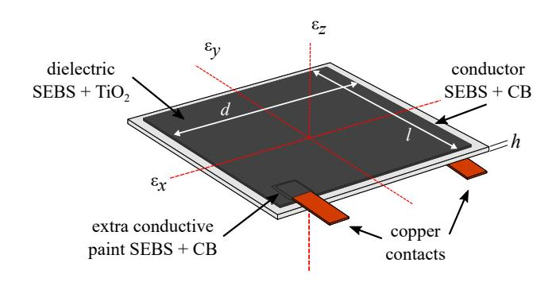

Figure 4.1 A soft elastomeric capacitor (SEC) sensor with key components and reference axes annotated.

The SEC is a robust large-area electronic that is inexpensive and easy to fabricate. Its architecture, manufacturing process, and electromechanical models are presented in Refs. (Laflamme et al., 2013, 2015; Saleem et al., 2015) and reviewed here for completeness. The SEC sensor takes the form of a parallel plate capacitor, as shown in Figure 4.1, where the dielectric is composed of a styrene-ethylene-butadiene-styrene (SEBS) block co-polymer matrix filled with titania (TiO2) to increase both its durability and permittivity. Its conductive plates are fabricated using a conductive

{112}------------------------------------------------

paint, made from the same SEBS, but filled with carbon black particles, painted onto each side of the SEBS matrix. Copper contacts, with an electrically conductive adhesive, are added to the conductors on both the top and bottom plates. These contacts are used for connecting the data acquisition to the SECs with a secure solder connection. Lastly, a thin layer of conductive paint is applied over the copper contacts to ensure a good connection between the copper contacts and the conductors, as seen in Figure 4.1. Manufacturing of the SEC sensor in various shapes and sizes is relatively simple and does not require any highly specialized equipment or techniques, therefore allowing the technology to be easily scaled. To ensure the SEC is capable of monitoring the substrate in both tension and compression, the sensor is pre-stretched during its adhesion to the monitored substrate.

The capacitance ( $C$ ) of a parallel plate capacitor can be modeled as a non-lossy parallel plate capacitor assuming a sampling rate of less than 1 kHz:

$$C = e_0 e_r \frac{A}{h} \quad (4.1)$$

where  $e_0 = 8.854$  pF/m is the vacuum permittivity,  $e_r$  is the polymer's relative permittivity,  $A = d \cdot l$  is the sensor area of width  $d$  and length  $l$ , and  $h$  is the thickness of the dielectric as annotated in Figure 4.1. Assuming small changes in strain, equation 4.1 leads to a differential equation that relates a change in strain to a change in capacitance ( $\Delta C$ ):

$$\frac{\Delta C}{C} = \frac{\Delta d}{d} + \frac{\Delta l}{l} - \frac{\Delta h}{h} \quad (4.2)$$

where  $\Delta d/d$ ,  $\Delta l/l$ , and  $\Delta h/h$ , can be expressed as strain  $\varepsilon_x$ ,  $\varepsilon_y$ , and  $\varepsilon_z$ , respectively. Assuming a plane stress condition,  $\varepsilon_z = -\nu/(1-\nu) \cdot (\varepsilon_x + \varepsilon_y)$  where  $\nu$  is the sensor material's Poisson's ratio taken as  $\nu \approx 0.49$  (Wilkinson et al., 2004). The relative change in capacitance  $\Delta C$  can be related to a change in the sensor's deformation as:

$$\frac{\Delta C}{C} = \lambda(\varepsilon_x + \varepsilon_y) \quad (4.3)$$

where  $\lambda = 1/(1 - \nu)$  represents the gauge factor of the sensor. Since  $\nu \approx 0.49$ , the gauge factor can be estimated as  $\lambda \approx 2$ . Equation (4.3) shows that the signal of the SEC varies as a function of the sensor's additive strain,  $\varepsilon_x + \varepsilon_y$ .

The SEC's electro-mechanical model presented in equation 4.3 has been validated for both static and quasi-static loading conditions (Laflamme et al., 2013b). The linearity of the electro-mechanical model has been validated for mechanical excitation under 15 Hz (Laflamme et al., 2015). Additionally, for mechanical responses up to 40 Hz, an altered electro-mechanical model accounting for the dynamic material properties of the SEC was presented in (Saleem et al., 2015), but is not discussed here for brevity.

{113}------------------------------------------------

#### <span id="page-113-0"></span>4.2.2 Optimal Sensor Placement

The sensing skin used in this work consists of a network of SECs with a few RSGs distributed into the SEC grid to form an HDSN. The numbers and locations of RSGs within an HDSN affect the accuracy of the decomposed strain fields. Therefore, it is important to consider an optimal sensor placement scheme for the RSGs when validating the ISF method. The authors have previously developed a genetic algorithm with a learning gene pool for selecting optimal RSG sensor locations within a network of SECs (Downey et al., 2017). The genetic algorithm leverages the intuitive idea that for a set of potential sensor locations (P), some sensor locations (*p*) add little or no information to the estimated system. Conversely, some sensor locations add a measurable level of information to the system. Therefore, the goal of the genetic algorithm is to build a set of optimal sensor locations (P = [*p*1...*pm*]) that minimize the error between the system and its estimated state. This goal is achieved through linking sensor locations to genes. The probability of these genes (sensor locations) reoccurring are then mutated over generations by the genetic algorithm. After a sufficient number of generations, only the strongest genes remain and these form a set of sensor locations that constitute an optimal set of RSG locations within the network of the SECs. In this work, the system is the true strain maps of the monitored substrate while the estimated state is the strain maps obtained through the ISF method. The error between the true strain field and its estimated state can be expressed in terms of type I and type II errors (Flynn and Todd, 2010; Downey et al., 2017). In the case where strain maps are obtained for a structure with the intention of detecting damage, a type I error (false positive) is the incorrect classification of a healthy state as a damage state, while, a type II error (false negative) is the failure to detect a structural fault.

Here, a previously developed single objective function (Downey et al., 2017), borrowed from the field of robust design (Doltsinis and Kang, 2004), is used in the multi-objective problem for decreasing the likelihood of type I and type II errors through the optimal placement of RSGs in the HDSN. The occurrence of type I errors within the HDSN's extracted strain maps is reduced through minimizing the mean absolute error (MAE) between the system and its estimated state. The use of MAE for selecting sensor locations provides an effective representation of how a structure will perform under various loading conditions. However, if the placement of RSGs is based solely on the MAE of the system, locations of high disagreement between the estimated and real systems will develop. In the case of a load-carrying structural component, such an occurrence could result in the component being stressed passed its design limit (i.e. type II error). Therefore, to reduce the occurrence of type II errors, a second optimization problem based on minimizing the maximum difference between the system and its estimated state (i.e. strain value) at any point on a strain map is introduced, defined as Emax. The bi-objective optimization problem (type I and II errors) can be simplified into a single objective function through a straightforward scalarization approach formulated as a linear 

{114}------------------------------------------------

<span id="page-114-0"></span>combination of the bi-objective optimization problem. Considering *n* possible sensor locations in P, a single objective problem for optimizing the placement of *m* sensors (0 ≤ *m* ≤ *n*) can be formulated as,

$$\text{minimize } \mathbf{P} = (1 - \alpha) \frac{\text{MAE}(\mathbf{P})}{\text{MAE}'} + \alpha \frac{\text{E}_{\max}(\mathbf{P})}{\text{E}'_{\max}} \quad (4.4)$$

$$\text{subject to } \mathbf{P} = [p_1 \dots p_m]^T \in \mathbb{P}$$

where <sup>α</sup> is a user-defined scalarization factor used to weigh both objective functions (0 ≤ <sup>α</sup> ≤ 1) and MAE<sup>0</sup> and E<sup>0</sup> max are factors used for normalizing MAE and Emax. While the selection of <sup>α</sup> depends on the structure's ability to tolerate type I or type II errors, the value of 0.5 has been shown to be a suitable value for similar problems (Downey et al., 2017).

#### 4.2.3 Kriging (Gaussian Process Regression)

Kriging performs two main steps simultaneously: 1) it builds a trend function h (x) β based on the available data; and 2) it constructs a Gaussian process using the residuals *Z* (Rasmussen, 2004). The Kriging-approximated model of the true response *G*(x) takes the following form

$$\hat{\mathcal{C}}(\mathbf{x}) = \mathbf{h}(\mathbf{x})\boldsymbol{\beta} + Z(\mathbf{x}) \quad (4.5)$$

where *Z* (x) is a Gaussian process with zero mean, variance *s* 2 , and a correlation matrix Ψ. The objective is to capture the general trend or the largest variance in the data using the regression function and interpolate the residuals using the Gaussian process. The elements of matrix Ψ are derived by the kernel function that can take different forms to model the spatial correlation in random space. One popular choice is the squared exponential kernel with a vector of hyper-parameters θ (Couckuyt et al., 2014):

$$\psi(\mathbf{x}_i, \mathbf{x}_j) = \exp\left(-\frac{1}{2}(\mathbf{x}_i - \mathbf{x}_j)^T \text{diag}(\theta)^{-2}(\mathbf{x}_i - \mathbf{x}_j)\right) \quad (4.6)$$

where x*<sup>i</sup>* and x*<sup>j</sup>* are two arbitrary points in the input space. The hyper-parameters determine the smoothness of the prediction, and are estimated by maximizing the likelihood of observations given Ψ. Subsequently, using the Sherman-Morrison-Woodbury formula, the prediction mean <sup>µ</sup>*G*<sup>ˆ</sup> and uncertainty <sup>σ</sup> 2 *G*ˆ of Kriging are expressed as (Couckuyt et al., 2014):

$$\mu_{\hat{G}}(\mathbf{x}) = \mathbf{h}(\mathbf{x})\beta + \mathbf{r}(\mathbf{x}) \cdot \Psi^{-1} \cdot (\mathbf{y} - \mathbf{F}\beta) \quad (4.7)$$

$$\sigma_{\hat{G}}^2(\mathbf{x}) = s^2 \left[ 1 - \mathbf{r}(\mathbf{x}) \Psi^{-1} \mathbf{r}(\mathbf{x})^T + \frac{(1 - \mathbf{F}^T \Psi^{-1} \mathbf{r}(\mathbf{x})^T)}{\mathbf{F}^T \Psi^{-1} \mathbf{F}} \right] \quad (4.8)$$

{115}------------------------------------------------

<span id="page-115-0"></span>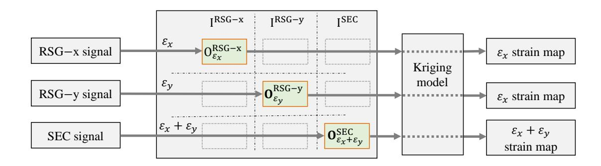

Figure 4.2 Flowchart of unidirectional strain map reconstruction using a traditional Kriging method.

where h (x) = h *h*1, . . . , *h<sup>p</sup>* iT is a vector of *p* trend functions, y = -*y*1, . . . , *y<sup>t</sup>* T is a vector of *t* responses, β is the *p*element vector of the coefficients of the trend functions, and r (x) = ψ (x, x1) , . . . , ψ (x, x*t*) T is a correlation vector between training and testing points. The process variance *s* 2 can be determined as *s* <sup>2</sup> = 1/*t* · (y − Fβ) <sup>T</sup> Ψ −1 (y − Fβ). More details about the Kriging model can be found in reference (Couckuyt et al., 2014).

#### 4.3 Iterative Signal Fusion (ISF)

This work proposes the new ISF method for strain map reconstruction, with the objective to minimize the loss of information when fusing the various signals from HDSNs. To build strain maps from a DSN with a single type of sensor, one may simply use traditional surrogate modeling techniques (e.g. Kriging) when the source of strain data is limited to the one type of sensor, provided the strain data is obtained for the correct orientation. However, in the HDSN of interest both unidirectional and additive strain data are collected at different RSG and SEC sensor locations (see Figure [4.4\(](#page-119-0)b)). In addition, the different sensing systems are measuring the same physical phenomenon and thus a high correlation among the unidirectional and additive strain data can be expected. Therefore, a direct implementation of any traditional surrogate modeling technique would not leverage all potential information in the unidirectional strain map reconstruction. To overcome this challenge, the proposed ISF method adaptively fuses the multiple sources of strain information from both the SECs and RSGs to build an optimal prediction of the unidirectional strain maps. It follows that a high correlation among the reconstructed unidirectional and additive strain models is considered. In what follows, the traditional method and proposed methods are explained in the form of two scenarios.

{116}------------------------------------------------

#### <span id="page-116-0"></span>4.3.1 Scenario 1 - Traditional Method

First, consider the scenario where no information fusion is applied. The strain measurements collected by an HDSN can be grouped into three data sets (see the solid-line boxes in Figure 4.2): 1) x-direction strains ( $\varepsilon_x$ ) at the location of RSG-x sensors ( $\mathbf{I}^{\text{RSG-x}}$ ), 2) y-direction strains ( $\varepsilon_y$ ) at the location of RSG-y sensors ( $\mathbf{I}^{\text{RSG-y}}$ ), and 3) additive strains ( $\varepsilon_x + \varepsilon_y$ ) at the location of SEC sensors ( $\mathbf{I}^{\text{SEC}}$ ). Next, taking  $\mathbf{O}$  as the measured strain data, superscripts are added to denote sensor type/locations and subscripts are added to denote strain map type. For example,  $\mathbf{O}_{\varepsilon_x+\varepsilon_y}^{\text{SEC}}$  represents the additive strain data at the locations of the SEC sensors while  $\mathbf{O}_{\varepsilon_x+\varepsilon_y}^{\text{RSG-x}}$  represents the additive strain data at the location of the RSG-x sensors. As shown in Figure 4.2, traditional surrogate modeling techniques such as Kriging build the model for each of the three available strain data sets (i.e.  $\mathbf{O}_{\varepsilon_x}^{\text{RSG-x}}$ ,  $\mathbf{O}_{\varepsilon_y}^{\text{RSG-y}}$ , and  $\mathbf{O}_{\varepsilon_x+\varepsilon_y}^{\text{SEC}}$ ) separately and independently. Therefore, the  $\varepsilon_x$  strain map, the  $\varepsilon_y$  strain map, and the  $\varepsilon_x + \varepsilon_y$  strain map at an arbitrary point  $(x, y)$  on the surface of a structure are defined as:

$$\varepsilon_x = GP((x, y) | \mathcal{D} = \{(\mathbf{I}^{\text{RSG-x}}, \mathbf{O}_{\varepsilon_x}^{\text{RSG-x}})\}) \quad (4.9)$$

$$\mathcal{E}_y = GP\big((x, y) | \mathcal{D} = \{(\mathbf{I}^{\text{RSG-}y}, \mathbf{O}_{\mathcal{E}_y}^{\text{RSG-}y})\}\big) \quad (4.10)$$

$$\varepsilon_x + \varepsilon_y = GP((x, y) | \mathbf{D} = \{(\mathbf{I}^{\text{SEC}}, \mathbf{O}^{\text{SEC}}_{\varepsilon_x, \varepsilon_y})\}) \quad (4.11)$$

where  $GP((x, y)|\mathcal{D})$  denotes the prediction at the arbitrary point  $(x, y)$  in the 2-D input space using the Gaussian process or Kriging model which is trained based on the data set  $\mathcal{D}$ . In Scenario 1, each model is built using a separate data set and it follows that this scenario does not consider any correlation among the built models. For instance, the SEC sensor data is not used for constructing either the  $\varepsilon_x$  strain map or the  $\varepsilon_y$  strain map.

#### 4.3.2 Scenario 2 - Proposed Method

Second, consider a scenario that leverages the correlation among the different sources of data in constructing the unidirectional strain maps. The ISF method is proposed based on this premise. To fuse the different sources of information, the proposed ISF method iteratively exploits all three strain measurement sets to estimate the strain responses at sensor locations where such responses are not measured. Figure 4.3 shows the flowchart of the ISF method. A solid-line box denotes a directly measured strain and a dashed-line box denotes a strain that is not directly measured and needs to be estimated using the ISF method. To this end, Kriging is used to find the best unbiased prediction of strain data at the dashed-line boxes using the available data sets (i.e. RSG-x, RSG-y, and SEC sensor

{117}------------------------------------------------

<span id="page-117-0"></span>

Figure 4.3 Flowchart of the proposed ISF method.

**Algorithm 2** Procedure of ISF using Kriging to construct the strain maps

1: Build the initial Kriging model for all three strain maps > Equations 4.12, 4.13 and 4.14

2: Calculate the error estimator  $\xi$  ► Equation 4.21

3: **while**  $\xi > \xi_0$  **do**

4: Step 1:  $\epsilon_y$  map at RSG-x sensors location ▷ Equation 4.15

5: Step 2:  $\epsilon_x + \epsilon_y$  strain map at RSG-x sensors location ▷ Equation 4.16

6: Step 3:  $\epsilon_x + \epsilon_y$  strain map at RSG-y sensors location ▷ Equation 4.17

7: Step 4:  $\epsilon_x$  strain map at RSG-y sensors location ▷ Equation 4.18

8: Step 5:  $\epsilon_x$  strain map at SEC sensors location ▷ Equation 4.19

9: Step 6:  $\epsilon_y$  strain map at SEC sensors location ► Equation 4.20

10: Calculate the error estimator  $\xi$  ▷ Equation 4.21

11: **end while**

| <span></span>                      | <span></span> > Equations 4.22 and 4.23 |
|------------------------------------|-----------------------------------------|
| 12: Build the final Kriging models |                                         |

data) as the training data sets. It follows that the unidirectional stain maps can be generated directly from Kriging or any other surrogate modeling techniques based on the expanded data sets at all solid-line and dashed-line boxes.

In Figure 4.3, all nine possible strain data sets are shown in the main middle block. The three solid-line boxes represent the available strain data sets and the six dashed-line boxes show the unavailable data sets for which one attempts to find the best unbiased predictions (called virtual data set). A pseudo-code of the proposed method is provided in Algorithm 2. The algorithm starts with finding initial guesses for the virtual data sets using the available data sets:

$$[\mathbf{O}_{\varepsilon_x}^{\text{RS-y}}, \mathbf{O}_{\varepsilon_x}^{\text{SEC}}] = GP(\mathbf{I}^{\text{RS-y}}, \mathbf{I}^{\text{SEC}} | \boldsymbol{\mathcal{D}} = \{\mathbf{I}^{\text{RS-x}}, \mathbf{O}_{\varepsilon_x}^{\text{RS-x}}\}) \quad (4.12)$$

{118}------------------------------------------------

$$[\mathbf{O}_{\mathcal{E}_y}^{\text{RSG-x}}, \mathbf{O}_{\mathcal{E}_y}^{\text{SEC}}] = GP(\mathbf{I}^{\text{RSG-x}}, \mathbf{I}^{\text{SEC}} | \boldsymbol{\mathcal{D}} = \{\mathbf{I}^{\text{RSG-y}}, \mathbf{O}_{\mathcal{E}_y}^{\text{RSG-y}}\}) \quad (4.13)$$

$$[\mathbf{O}_{\varepsilon_x + \varepsilon_y}^{\text{RSG-x}}, \mathbf{O}_{\varepsilon_x + \varepsilon_y}^{\text{RSG-y}}] = GP(\mathbf{I}^{\text{RSG-x}}, \mathbf{I}^{\text{RSG-y}} | \mathcal{D} = \{\mathbf{I}^{\text{SEC}}, \mathbf{O}_{\varepsilon_x + \varepsilon_y}^{\text{SEC}}\}) \quad (4.14)$$

<span id="page-118-0"></span>After finding the initial guesses, the virtual data sets are updated iteratively until the optimal prediction is achieved. As shown by the small arrows in Figure 4.3, each iteration consists of six sequential steps, each of which updates a Kriging (or strain response) model with the most recent strain measurements/estimates and uses the updated model to estimate the strain responses pertaining to one of the virtual data sets. Step 1 estimates  $\varepsilon_y$  at  $\mathbf{I}^{\text{RSG-x}}$  (virtual data set  $\mathbf{O}_{\varepsilon_y}^{\text{RSG-x}}$ ) based on all available y-strain measurements/estimates,  $\mathbf{O}_{\varepsilon_y}^{\text{RSG-y}}$  and  $\mathbf{O}_{\varepsilon_y}^{\text{SEC}}$ , with the following form:

$$\mathbf{O}_{\mathbf{e}_y}^{\text{RSG-x}} = GP(\mathbf{I}^{\text{RSG-x}}|\mathbf{D} = \{(\mathbf{I}^{\text{RSG-y}}, \mathbf{O}_{\mathbf{e}_y}^{\text{RSG-y}}), (\mathbf{I}^{\text{RSG-y}}, \mathbf{O}_{\mathbf{e}_y}^{\text{SEC}})\}) \quad (4.15)$$

At Step 2,  $\mathbf{O}_{\varepsilon_y}^{\text{RSG-x}}$  (i.e.  $\varepsilon_y$  at  $\mathbf{I}^{\text{RSG-x}}$ ) is used to update the additive strain data  $\mathbf{O}_{\varepsilon_x + \varepsilon_y}^{\text{RSG-x}}$  at the same locations:

$$\mathbf{O}_{\varepsilon_x + \varepsilon_y}^{\text{RSG-x}} = \mathbf{O}_{\varepsilon_y}^{\text{RSG-x}} + \mathbf{O}_{\varepsilon_x}^{\text{RSG-x}} \quad (4.16)$$

At Step 3, the virtual data set  $\mathbf{O}_{\varepsilon_x + \varepsilon_y}^{\text{RSG-y}}$  is updated using a Kriging model trained with the true data set  $\mathbf{O}_{\varepsilon_x + \varepsilon_y}^{\text{SEC}}$  and virtual data set  $\mathbf{O}_{\varepsilon_x + \varepsilon_y}^{\text{RSG-x}}$ :

$$\mathbf{O}_{\varepsilon_x, \varepsilon_y}^{\text{RSG-y}} = GP(\mathbf{I}^{\text{RSG-y}} | \boldsymbol{\mathcal{D}} = \{(\mathbf{I}^{\text{SEC}}, \mathbf{O}_{\varepsilon_x, \varepsilon_y}^{\text{SEC}}), (\mathbf{I}^{\text{RSG-x}}, \mathbf{O}_{\varepsilon_x, \varepsilon_y}^{\text{RSG-x}})\}) \quad (4.17)$$

At Step 4, the updated  $\mathbf{O}_{e_x + e_y}^{\text{RSG-y}}$  is used to predict  $\mathbf{O}_{e_x}^{\text{RSG-y}}$ :

$$\mathbf{O}_{e_x}^{\text{RSG-y}} = \mathbf{O}_{e_x+e_y}^{\text{RSG-y}} - \mathbf{O}_{e_y}^{\text{RSG-y}} \quad (4.18)$$

At Step 5,  $\mathbf{O}_{ex}^{\text{SEC}}$  is updated using the following equation:

$$\mathbf{O}_{e_x}^{\text{SEC}} = GP(\mathbf{I}^{\text{SEC}}|\boldsymbol{\mathcal{D}} = \{(\mathbf{I}^{\text{RSG-x}}, \mathbf{O}_{e_x}^{\text{RSG-x}}), (\mathbf{I}^{\text{RSG-y}}, \mathbf{O}_{e_x}^{\text{RSG-y}})\}) \quad (4.19)$$

Lastly, Step 6 updates  $\mathbf{O}_{\text{e}_y}^{\text{SEC}}$  using the values solved for in Steps 4 and 5 (equations 4.18 and 4.19):

$$\mathbf{O}_{\varepsilon_y}^{\text{SEC}} = \mathbf{O}_{\varepsilon_x + \varepsilon_y}^{\text{SEC}} - \mathbf{O}_{\varepsilon_x}^{\text{SEC}} \quad (4.20)$$

After performing the 6 sequential steps, the strain estimates in all virtual data sets (dashed-line boxes) will be updated. The iteration continues until the level of change in the strain values pertaining to all dashed-line boxes converges close to zero. To this end, an error estimator is defined as:

$$\xi = \mathbf{O}_{\mathcal{E}_y}^{\text{RSG-x}} - GP(\mathbf{I}^{\text{RSG-x}}|\boldsymbol{\mathcal{D}} = \{\mathbf{I}^{\text{RSG-y}}, \mathbf{O}_{\mathcal{E}_y}^{\text{RSG-y}}, (\mathbf{I}_{\text{SEC}}, \mathbf{O}_{\mathcal{E}_y}^{\text{SEC}})\}) \quad (4.21)$$

{119}------------------------------------------------

<span id="page-119-0"></span>If the change in ORSG−<sup>x</sup> ε*y* over sequential iterations converges to a same number (i.e. ξ < ξ0), then the algorithm is stopped and the final Kriging models are built based on all measured/estimated <sup>ε</sup>*<sup>x</sup>* and <sup>ε</sup>*<sup>y</sup>* strain data to reconstruct the unidirectional strain maps, expanded for the entire surface area of the structure:

$$\mathcal{E}_x = GP((x, y)|\mathcal{D} = \{(\mathbf{I}^{\text{RSG-x}}, \mathbf{O}_{xx}^{\text{RSG-x}}), (\mathbf{I}^{\text{RSG-y}}, \mathbf{O}_{xx}^{\text{RSG-y}}), (\mathbf{I}^{\text{SEC}}, \mathbf{O}_{xx}^{\text{SEC}})\}) \quad (4.22)$$

$$\mathcal{E}_y = GP((x, y)|\mathcal{D} = \{(\mathbf{I}^{\text{RSG-x}}, \mathbf{O}_{\mathcal{E}_y}^{\text{RSG-x}}), (\mathbf{I}^{\text{RSG-y}}, \mathbf{O}_{\mathcal{E}_y}^{\text{RSG-y}}), (\mathbf{I}^{\text{SEC}}, \mathbf{O}_{\mathcal{E}_y}^{\text{SEC}})\}) \quad (4.23)$$

#### 4.4 Methodology

This section presents the methodology used in validating the ISF method. First, an experimental test bench specifically designed for validating the ISF method is introduced, followed by the introduction of an FEA model of the test bench that is used for the numerical validation of the ISF method.

#### 4.4.1 Experimental Setup

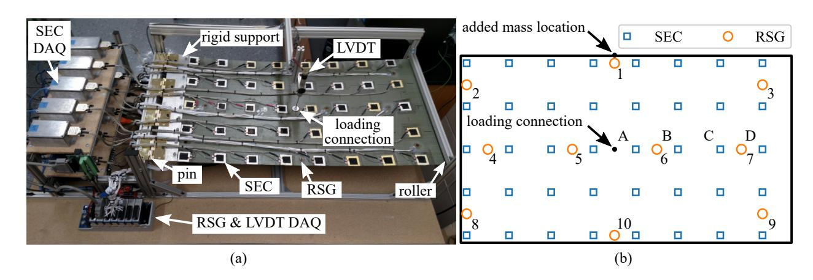

Figure 4.4 Experimental setup used for validating the proposed method: (a) picture of the test bench with key components annotated; (b) schematic of the test bench showing the locations of the sensors, loading point, and added mass.

The test bench developed for validating the ISF method is shown in Figure 4.4. An HDSN consisting of 40 SECs and 20 RSGs (10 measuring <sup>ε</sup>*<sup>x</sup>* and 10 measuring <sup>ε</sup>*y*) was deployed onto the surface of a fiberglass plate with a geometry of 500 × 900 × 2.6 mm<sup>3</sup> , as shown in Figure 4.4(a). Figure 4.4(b) is a schematic of the sensor layout

{120}------------------------------------------------

Table 4.1 Parameters used in constructing the FEA model.

<span id="page-120-0"></span>

| Property       | Sub-property          | Value Unit | Group 1 (Mechanical/Physical Properties) |                     |                     | Parameter                        | Value | Unit                | Dimensions / Notes |               |
|----------------|-----------------------|------------|------------------------------------------|---------------------|---------------------|----------------------------------|-------|---------------------|--------------------|---------------|
|                |                       |            | (Blank/Placeholder)                      | (Blank/Placeholder) | (Blank/Placeholder) |                                  |       |                     | Value Parameter    | Sub-parameter |
| Abaqus         | element               | type       | C3D8R                                    | Young’s Modulus     | (aluminum)          | 68.9                             | GPa   |                     |                    |               |
| element        | type                  |            | linear brick                             | Poisson’s ratio     | 0.21 (aluminum)     |                                  | 0.33  |                     |                    |               |
| element        | nodes                 |            | 8                                        | density             | (aluminum)          |                                  | 2,700 | kg / m <sup>3</sup> |                    |               |
| element        | integration points    | 1          | Young’s Modulus                          | (fiberglass)        | 15                  | GPa                              |       |                     |                    |               |
| elements total |                       |            | 298,065                                  | Poisson’s ratio     | (fiberglass)        |                                  | 0.21  |                     |                    |               |
| elements       | (aluminum connection) |            | 32,340                                   | density             | (fiberglass)        |                                  | 4,500 | kg / m <sup>3</sup> |                    |               |
| elements       | (fiberglass plate)    |            | 265,725                                  | plate dimensions    |                     | 500 × 900 × 3.18 mm <sup>3</sup> |       |                     |                    |               |

Table 4.2 Locations of RSGs used in the ISF method.

| number of RSGs used | RSGs locations             | RSGs used                  |
|---------------------|----------------------------|----------------------------|
| RSGs used           | used for \$\varepsilon_x\$ | used for \$\varepsilon_y\$ |
| 4                   | 8, 10                      | 3, 7                       |
| 8                   | 1, 4, 5, 7                 | 1, 8, 9, 10                |
| 12                  | 3, 5, 6, 7, 9              | 1, 4, 5, 6, 7, 8, 10       |

showing the locations of the SECs and RSGs, where each RSG location has two RSGs (model #FCA-5-350-11- 3LJBT, manufactured by Tokyo Sokki Kenkyujo), individually measuring <sup>ε</sup>*<sup>x</sup>* and <sup>ε</sup>*y*. The RSG locations are numbered 1-10, for later use in selecting RSGs to be utilized as part of the ISF method. Additionally, the four SECs denoted A, B, C, and D are used for investigating temporal strain data. A yellowing is present on some of the sensors' dielectrics (see sensors A and C for example). This yellowing does not appear to affect the sensors' strain measurements, as it will be discussed later in this work. The plate's left-hand side is bolted to an aluminum support (12.7 × 76.2 × 500 mm<sup>3</sup> ) to form a rigid connection. The rigid connection was added to eliminate the strain complexities that would be present if the hinges were connected directly to the fiberglass plate. This rigid connection is then attached to the frame through a pinned connection. The right-hand side of the plate is restrained in the vertical direction through the use of two lightly greased rods of diameter 12.7 mm to form a roller connection. Each SEC covers an area of 38 × 38 mm<sup>2</sup> and these SEC sensors are deployed in a 5 × 8 grid array. The center of an SEC sensor is used as the location of the sensor in the ISF method. The SEC and RSG data are sampled simultaneously at 17 samples per second. The SECs are measured using a custom-built data acquisition system that includes active shielding in the cable to remove the cable's parasitic capacitance. The RSGs are measured using three quarter bridge analog input modules (NI-9236, manufactured by National Instruments) mounted in a chassis (cDAQ-9178, manufactured by National Instruments). Additionally, the same chassis is used to obtain measurements from the LVDT (model #0244, manufactured by Trans-Tek) measured

{121}------------------------------------------------

<span id="page-121-0"></span>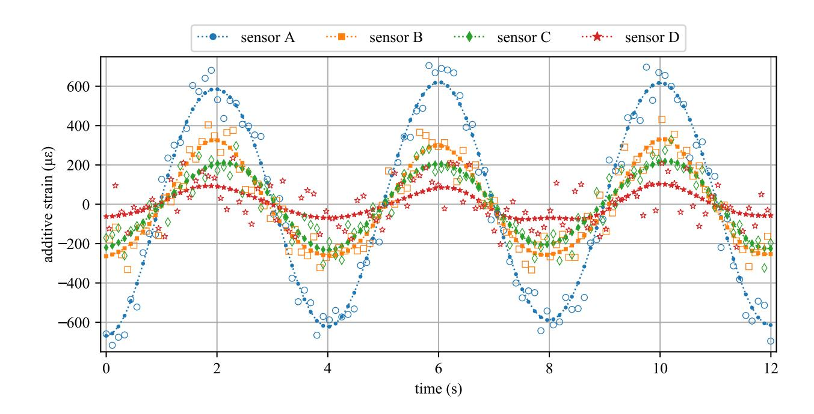

Figure 4.5 SEC signal for sensors A, B, C, and D as denoted in [4.4](#page-119-0) under load case 1; here, only every other data point is shown for clarity.

through a 16-bit analog input module (NI-9205) while also providing a simultaneous trigger source for the SEC and RSG DAQs through a sourced digital output (NI-9472, manufactured by National Instruments).

Two experimental load cases are considered during the course of this work. For load case 1, the plate is excited with a displacement controlled force at the center of the plate, as annotated in Figure [4.4,](#page-119-0) sourced from a stepper motor located under the plate. The excitation force is a 20 mm sinusoidal load at 0.25 Hz. Load case 2 uses the same driving displacement and frequency, but includes a 0.5 kg mass added to the edge of the plate (see Figure [4.4\(](#page-119-0)b)) to introduce some complexities into the strain maps. To eliminate any high-frequency noise in the SEC signal, a fifth order Butterworth filter with a cutoff frequency of 10 Hz was applied to the raw SEC signals. No filtering was applied to the RSG signals.

#### 4.4.2 FEA Model

Numerical validation for the ISF method is performed through an FEA model of the experimental test bench created in Abaqus (Hibbit et al., 2007). The FEA model included the fiberglass plate and the rigid aluminum connection that connects the pinned connections to the fiberglass plate. It was constructed using 298,065 eight-node brick elements with 1 integration point to allow for simple modeling of the connection between the fiberglass plate and the

{122}------------------------------------------------

<span id="page-122-0"></span>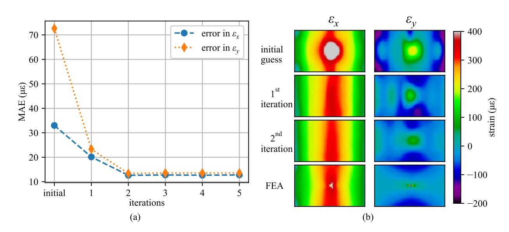

Figure 4.6 Effect of number of iterations on the accuracy of the strain maps obtained through ISF for load case 1: (a) MAE versus the number of iterations; and (b) strain maps obtained through ISF and FEA.

rigid aluminum connector. Constraints were modeled as a pinned connection at the plate's left-hand side and a roller connection on the plate's right-hand side. All materials were considered to be isotropic. In the fiberglass plate, nine elements are used through its thickness to prevent shear locking. A convergence test was performed and the selected model parameters yielded an error of less than 1% when compared to the FEA model with 1.2 million elements. The key parameters of the FEA model used in this numerical validation are listed in Table [4.1,](#page-120-0) where the material constants for the aluminum were taken from the material's data sheet and the material properties for the fiberglass were obtained experimentally from material drops. Similar to the experimental validation, two load cases are considered: 1) load case 1 consists of the plate displaced 20 mm upward at the middle; and 2) load case 2 consists of the same displacement but with the addition of a 0.5 kg load at the center along the top edge, as shown in Figure [4.4\(](#page-119-0)b).

Optimal sensor placement using the genetic algorithm presented in (Downey et al., 2017) and reviewed in section [4.2.2](#page-113-0) was performed using the results for both load case 1 and 2. The genetic algorithm was solved over 500 generations using a population of 50 offsprings per generation. An initial guess for the genetic algorithm was generated by finding the lowest MAE for a set of 50 randomly selected RSG sensor locations. Then, MAE' and E<sup>0</sup> max were set by solving for the MAE and point of maximum disagreement (Emax) for the initial guess. Table [4.2](#page-120-0) reports the RSG sensors, numbered to correspond with the RSG sensor locations depicted in Figure [4.4\(](#page-119-0)b), used for developing the strain maps. When calculating the error between the FEA and ISF generated strain maps, every point on the FEA model was used excluding a 50 × 50 mm<sup>2</sup> square around the loading point. This was excluded as the FEA creates relatively high,

{123}------------------------------------------------

<span id="page-123-0"></span>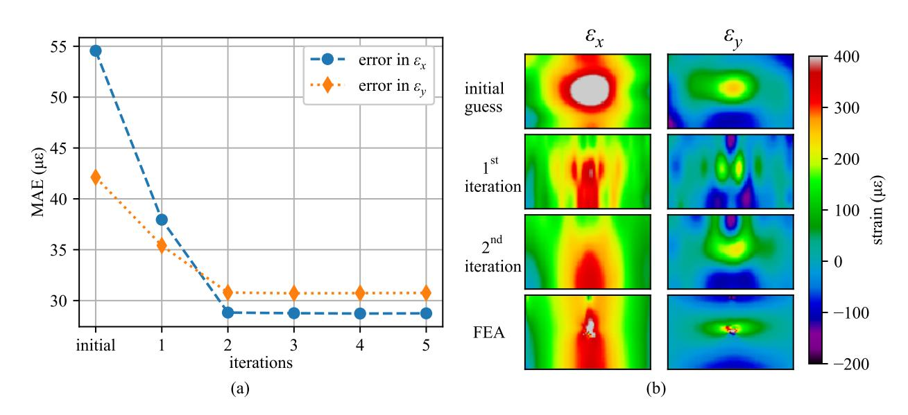

Figure 4.7 Effect of number of iterations on the accuracy of the strain maps obtained through ISF for load case 2: (a) MAE versus the number of iterations; and (b) strain maps obtained through ISF and FEA.

highly localized strain values around the 30 mm circular loading point used in the FEA model to simulate the washer used in the real experimental setup.

# 4.5 Results

This section presents the numerical and experimental validation results for the proposed ISF method. First, the temporal data results for SEC sensors are provided to show the level of noise in strain measurements. Next, a structured numerical example that studies the effect of increasing the number of iterations of the proposed ISF method is presented. This is followed by an investigation on the effect of the number of RSGs on the accuracy of the built unidirectional strain maps. Then the proposed method is further verified via an experimental procedure.

### 4.5.1 Temporal Strain Data

Figure [4.5](#page-121-0) presents the temporal data results for sensors A, B, C, and D as denoted in Figure [4.4\(](#page-119-0)b). These sensors were selected to demonstrate the range of SEC sensor signals under varying strain conditions, including two sensors that experienced the yellowing of the dielectric discussed in section [4.4.1.](#page-119-0) For clarity, only every other strain data point is reported for an individual SEC sensor with its corresponding marker type. The raw SEC signal is presented as a hollow marker while the signal filtered with a low-pass Butterworth filter is presented as a filled marker on a dotted

{124}------------------------------------------------

<span id="page-124-0"></span>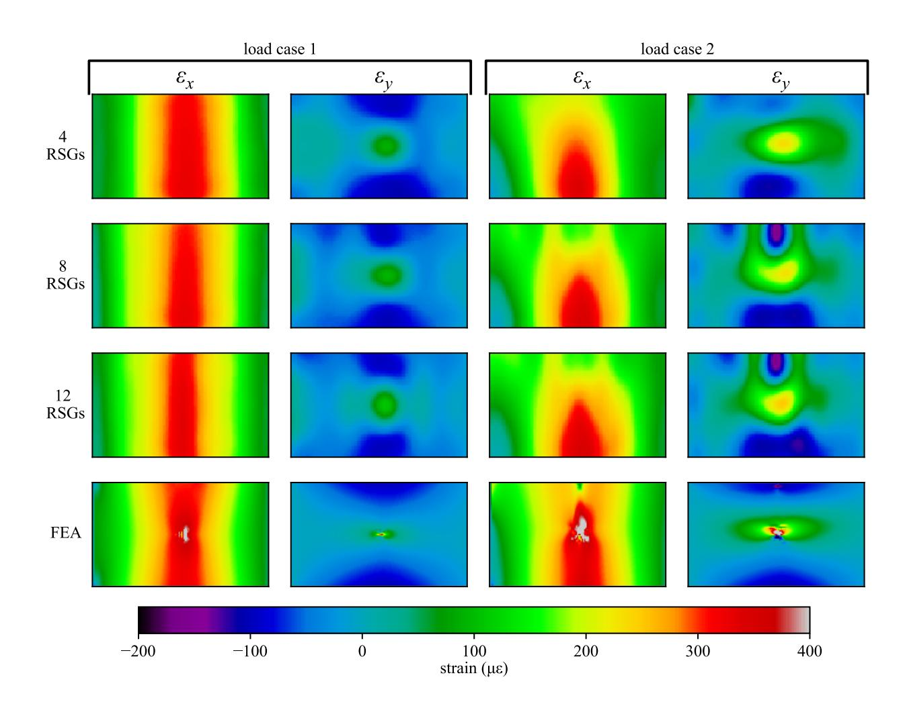

Figure 4.8 Strain maps obtained through the FEA and the ISF method using the experimental data with 4, 8 and 12 RSGs.

line. As shown in Figure [4.5,](#page-121-0) sensor D experiences the highest level of noise, which is due in part to the sensor having the longest cable at 1.2 meters and the lowest level of strain. However, even with the high noise level and relatively low localized strain, the filtered signal provides a smooth signal that can be used for the ISF method.

## 4.5.2 Numerical Investigation of Strain Maps

Figures [4.6](#page-122-0) and [4.7](#page-123-0) demonstrate how increasing the number of iterations in ISF can increase the accuracy of the constructed strain maps for load cases 1 and 2, respectively. The errors reported in Figures [4.6\(](#page-122-0)a) and [4.7\(](#page-123-0)a) are calculated based on the mean absolute difference between the true strain maps obtained through FEA and those obtained through ISF. For these examples, the ISF based strain maps were obtained using 8 optimally placed RSGs

{125}------------------------------------------------

<span id="page-125-0"></span>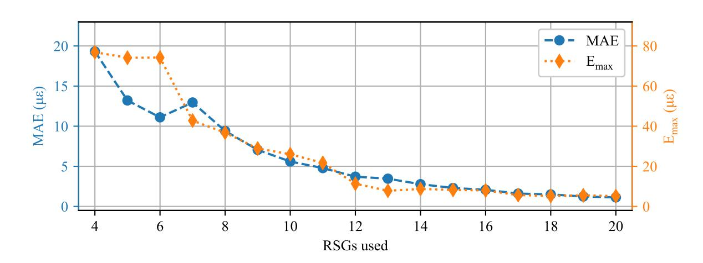

Figure 4.9 ISF reconstruction error as a function of the number of RSGs used in the algorithm formulation. The error is calculated using both load cases 1 and 2.

(Table [4.2\)](#page-120-0). The first row in figures [4.6\(](#page-122-0)b) and [4.7\(](#page-123-0)b) show the unidirectional strain maps obtained using only the RSGs oriented in their respective orientations. This is the method discussed in section [4.3.1](#page-116-0) and annotated in figure [4.2.](#page-115-0) The error associated with these strain maps are labeled as the initial iteration in Figures [4.6\(](#page-122-0)a) and [4.7\(](#page-123-0)a). The second to the fourth rows present the strain maps obtained by ISF from the initial guess, the first iteration and the second iteration, respectively. Four important observations can be made from the figures: 1) the strain maps constructed with the initial guess have very low accuracy; 2) by increasing the number of iterations, the strain maps obtained through ISF approach their real strain conditions; 3) in both load cases, the results by the proposed method converge to the optimal results only after a few iterations with no significant changes in the accuracy of strain maps thereafter; and 4) the algorithm converges to the optimal result that should be treated as a local minima of the true system, as MAE > 0. The last rows in [4.6\(](#page-122-0)b) and [4.7\(](#page-123-0)b) show the true strain maps obtained through FEA for both load cases.

### 4.5.3 Effect of RSGs on Strain Maps

Figure [4.8](#page-124-0) reports the strain maps obtained through the FEA analysis (first row) for both load cases and the strain maps estimated using the ISF method with 4, 8, and 12 RSGs. From the FEA analysis, a difference can be observed in strain maps developed using load case 1 and those using load case 2, particularly in the <sup>ε</sup>*<sup>x</sup>* strain maps. The mass exerts a compressive force on the top of the plate where the mass is added (see Figure [4.4\(](#page-119-0)b) for the location of the added mass). This compressive force reduces the magnitude of the tensile strain along the top of the plate. The unidirectional strain maps developed using the ISF method with 4, 8, and 12 optimally placed RSGs (Table [4.2\)](#page-120-0) are presented on rows 2, 3, and 4, respectively.

{126}------------------------------------------------

<span id="page-126-0"></span>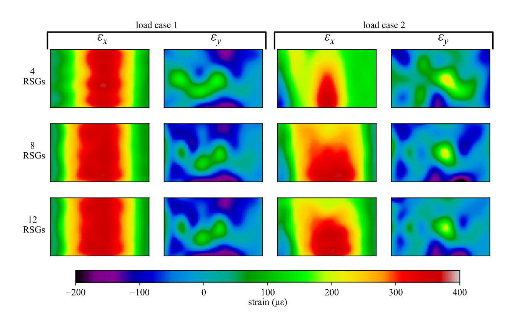

Figure 4.10 Strain maps obtained through the ISF method using the experimental data with 4, 8, and 12 RSGs

Load case 1, a simpler loading configuration, is generally easily solved for using any numbers of RSGs. The largest points of disagreement between the FEA and ISF strain maps are around the loading connection. This is as hypothesized, because the sensor network is relatively sparse compared to the complexity of this local strain topology. In comparison, the more complicated strain topology caused by load case 2 benefits more from the increasing number of strain gauges. With a sufficient number of RSGs, the reconstructed strain maps try to fit the complex strain topologies around the location of the mass. In particular, the ISF method with 8 and 12 RSGs benefits from the higher numbers of RSGs as the optimal sensor placement algorithm selected RSG location #1 for the RSGs that measure <sup>ε</sup>*y*. This added strain information at a location close to the added mass allows the ISF method to greatly increase its ability to track the complex strain topology, although this highly localized information causes the ISF method to overestimate the spatial distribution of the compressive load at top of the plate, as depicted by the large purple area in the <sup>ε</sup>*<sup>y</sup>* strain maps for 8 and 12 RSGs in load case 2.

Next, the effect of increasing the number of RSGs used in the ISF method is investigated and presented in Figure [4.9.](#page-125-0) This study uses the FEA model's derived strain maps to better investigate the effect of adding RSGs to the ISF

{127}------------------------------------------------

<span id="page-127-0"></span>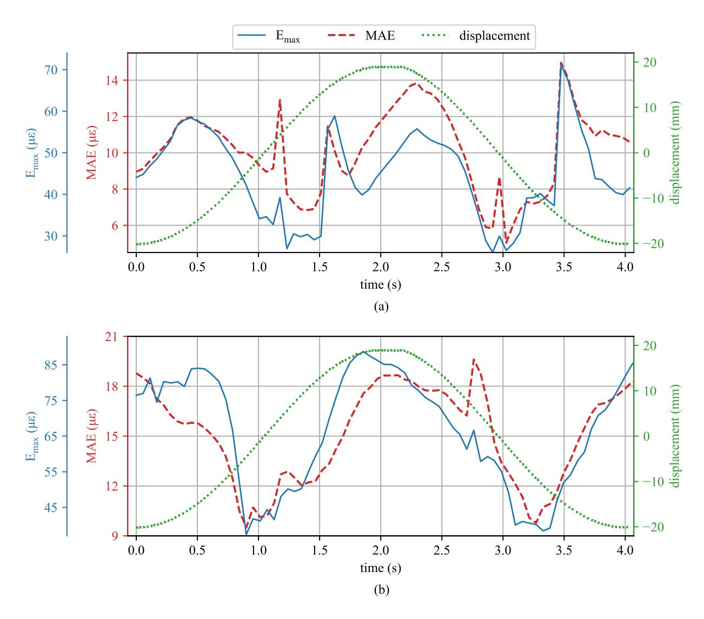

Figure 4.11 Errors, MAE and β, as functions of the plate's displacement for: (a) load case 1; and (b) load case 2.

{128}------------------------------------------------

<span id="page-128-0"></span>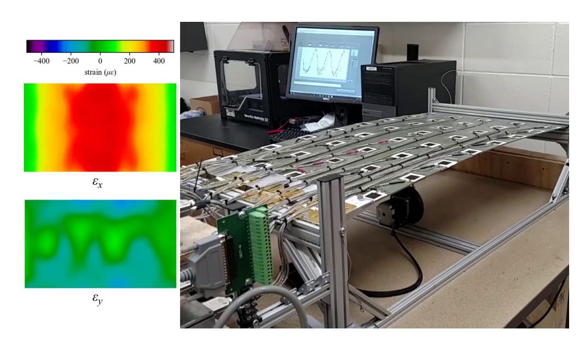

Figure 4.12 Video (Appendix A) of the experimental test bench operating under load case 1 with real-time strain data shown on the computer monitor and the post-processed uni-directional strain maps presented on the left-hand side.

method without considering the effect of other complications found in experimental testing (i.e., noise). Results are quantified using the error in the FEA strain maps (MAE and Emax) for both loading conditions. As before, a 50 × 50 mm<sup>2</sup> square around the loading point is excluded when calculating the error to prevent the highly localized strain results from complicating the investigation. As expected and plotted in Figure [4.9,](#page-125-0) the introduction of more RSGs into the ISF method results in a reduction of both quantifiable error values.

# 4.5.4 Experimental Investigation of Strain Maps

Here, the experimental implementation of the ISF method is presented. Figure [4.10](#page-126-0) shows that the ISF method is capable of reconstructing strain maps for the experimental test plate. While no full-field strain data is available for the experimental test bench, the algorithm does generate strain maps close to those predicted by the FEA model. This is particularly true in load case 2 where the ISF method is capable of capturing the complex topology caused by adding the mass to the top of the plate. Deviations between the FEA model results and the experimental data could be caused by various factors, including material variations, imperfect loading conditions, and the fact that the FEA model does not account for the added mass and stiffness from the sensor wires.

Figure [4.11](#page-127-0) reports the temporal error results for the case with the ISF method with 12 RSGs over a typical load cycle. For this figure, the error is calculated by using the readings from all 20 RSGs. The RSGs were selected due 

{129}------------------------------------------------

<span id="page-129-0"></span>to their high reliability and low level of noise. As expected, the error parameters increase when the magnitude of the displacement increases. This is due to the higher levels of strain in the system. Figure [4.11\(](#page-127-0)a) presents the temporal error data for load case 1 while Figure [4.11\(](#page-127-0)b) presents the temporal error data for load case 2. As expected, the errors are consistently higher for load case 2 (figure [4.11\(](#page-127-0)b)) due to the more complex loading configuration.

### 4.6 Conclusion

We have proposed a robust method for the development of unidirectional strain maps from the additive strain signal of a novel large-area electronic, termed the soft elastomeric capacitor (SEC). When deployed in a network configuration, SECs can cover large-scale surfaces and can be used to reconstruct physics-based features for condition assessment, such as strain maps and deflection shapes. Given that each SEC measures the summation of the orthogonal strains (i.e. <sup>ε</sup>*<sup>x</sup>* + <sup>ε</sup>*y*), the proposed method retrieves the magnitude and directional information of strain prior to reconstructing strain maps. The proposed method, termed iterative signal fusion (ISF), adaptively fuses the different sources of signal information (e.g. from SECs and RSGs) to build best-fit unidirectional strain maps for the monitored structure. Each step of ISF contains an update process for strain maps based on a Kriging model. We have investigated the accuracy of the proposed method by developing an experimental test bench which is the largest deployment of the SEC-based sensing skin to date. We have utilized a network of 40 SECs deployed on a grid (5 × 8) and an optimal sensor placement algorithm to select the optimal RSG sensor locations within the network of SECs. This optimal sensor placement algorithm, previously developed by the authors, leverages the intuitive idea that not all potential sensor locations hold the same level of information. Two experimental load cases were considered during the course of this work. These load cases consist of a displacement controlled force at the center of the experimental plate and a similar load case but with a mass added to the edge of the plate to introduce some complexities into the strain maps. For both load cases, the results show that the proposed ISF method successfully develops strain maps for the experimental test plate. In addition, a finite element analysis model of the experimental test bench was developed to numerically verify the accuracy of the proposed ISF method. While no full-field strain data is available for the experimental test bench, we have shown that the results of unidirectional strain maps reconstructed using the ISF method strongly correlate with the results generated by the numerical finite element analysis model.

### Acknowledgments

This work was in part supported by the National Science Foundation Grant Nos. CNS-1566579 and ECCS-1611333. This work was also partly supported by the National Science Foundation Grant No. 1069283, which 

{130}------------------------------------------------

<span id="page-130-0"></span>supports the activities of the Integrative Graduate Education and Research Traineeship (IGERT) in Wind Energy Science, Engineering and Policy (WESEP) at Iowa State University. Their support is gratefully acknowledged. Any opinions, findings, and conclusions or recommendations expressed in this material are those of the authors and do not necessarily reflect the views of the National Science Foundation.

# Appendix A. Supplementary material

Supplementary data associated with this article can be found, in the online version, at https://doi.org/10.1016/j.ymssp.2018.04.023

# 4.7 References

Adams, D., White, J., Rumsey, M., and Farrar, C. (2011). Structural health monitoring of wind turbines: method and application to a HAWT. *Wind Energy*, 14(4):603–623. Brownjohn, J. M. W., Stefano, A. D., Xu, Y.-L., Wenzel, H., and Aktan, A. E. (2011). Vibration-based monitoring of civil infrastructure: challenges and successes. *Journal of Civil Structural Health Monitoring*, 1(3-4):79–95. Burton, A., Lynch, J., Kurata, M., and Law, K. (2017). Fully integrated carbon nanotube composite thin film strain sensors on flexible substrates for structural health monitoring. *Smart Materials and Structures*, 26(9). Caccese, V., Mewer, R., and Vel, S. S. (2004). Detection of bolt load loss in hybrid composite/metal bolted connections. *Engineering Structures*, 26(7):895–906. Chang, P. C., Flatau, A., and Liu, S. C. (2003). Review paper: Health monitoring of civil infrastructure. *Structural Health Monitoring: An International Journal*, 2(3):257–267. Ciang, C. C., Lee, J.-R., and Bang, H.-J. (2008). Structural health monitoring for a wind turbine system: a review of damage detection methods. *Measurement Science and Technology*, 19(12):122001. Cortes, C. and Vapnik, V. (1995). Support-vector networks. *Machine Learning*, 20(3):273–297. Couckuyt, I., Dhaene, T., and Demeester, P. (2014). oodace toolbox: A flexible object-oriented kriging implementation. *Journal of Machine Learning Research*, 15:3183–3186.

{131}------------------------------------------------

Cramer, K. E. (2016). Research developments in nondestructive evaluation and structural health monitoring for the sustainment of composite aerospace structures at nasa. Cuadra, J., Vanniamparambil, P. A., Hazeli, K., Bartoli, I., and Kontsos, A. (2013). Damage quantification in polymer composites using a hybrid NDT approach. *Composites Science and Technology*, 83:11–21. Deraemaeker, A. and Preumont, A. (2006). Vibration based damage detection using large array sensors and spatial filters. *Mechanical Systems and Signal Processing*, 20(7):1615–1630. Doltsinis, I. and Kang, Z. (2004). Robust design of structures using optimization methods. *Computer Methods in Applied Mechanics and Engineering*, 193(23-26):2221–2237. Downey, A., Hu, C., and Laflamme, S. (2017a). Optimal sensor placement within a hybrid dense sensor network using an adaptive genetic algorithm with learning gene pool. *Structural Health Monitoring*, page 147592171770253. Downey, A., Laflamme, S., and Ubertini, F. (2016). Reconstruction of in-plane strain maps using hybrid dense sensor network composed of sensing skin. *Measurement Science and Technology*, 27(12):124016. Downey, A., Laflamme, S., and Ubertini, F. (2017b). Experimental wind tunnel study of a smart sensing skin for condition evaluation of a wind turbine blade. *Smart Materials and Structures*. Downey, A., Ubertini, F., and Laflamme, S. (2017c). Algorithm for damage detection in wind turbine blades using a hybrid dense sensor network with feature level data fusion. *Journal of Wind Engineering and Industrial Aerodynamics*, 168:288–296. Flynn, E. B. and Todd, M. D. (2010). A bayesian approach to optimal sensor placement for structural health monitoring with application to active sensing. *Mechanical Systems and Signal Processing*, 24(4):891–903. Ghazi, R. M., Chen, J. G., and Buy¨ uk¨ ozt ¨ urk, O. (2017). Pairwise graphical models for structural health monitoring ¨ with dense sensor arrays. *Mechanical Systems and Signal Processing*, 93:578–592. Giurgiutiu, V., Zagrai, A., and Bao, J. (2004). Damage identification in aging aircraft structures with piezoelectric wafer active sensors. *Journal of Intelligent Material Systems and Structures*, 15(9-10):673–687. Hallaji, M., Seppanen, A., and Pour-Ghaz, M. (2014). Electrical impedance tomography-based sensing skin for ¨ quantitative imaging of damage in concrete. *Smart Materials and Structures*, 23(8):085001.

{132}------------------------------------------------

Hammock, M. L., Chortos, A., Tee, B. C.-K., Tok, J. B.-H., and Bao, Z. (2013). 25th anniversary article: The evolution of electronic skin (e-skin): A brief history, design considerations, and recent progress. *Advanced Materials*, 25(42):5997–6038. Hibbit, Karlsson, and Sorensen (2007). *ABAQUS*/*Standard Analysis User's Manual*. Hibbit, Karlsson, Sorensen Inc., USA. Hu, C., Youn, B. D., Kim, T., and Wang, P. (2015). A co-training-based approach for prediction of remaining useful life utilizing both failure and suspension data. *Mechanical Systems and Signal Processing*, 62-63:75–90. Hu, Y., Huang, L., Rieutort-Louis, W. S. A., Sanz-Robinson, J., Sturm, J. C., Wagner, S., and Verma, N. (2014). A self-powered system for large-scale strain sensing by combining CMOS ICs with large-area electronics. *IEEE Journal of Solid-State Circuits*, 49(4):838–850. Kong, X., Li, J., Collins, W., Bennett, C., Laflamme, S., and Jo, H. (2017). A large-area strain sensing technology for monitoring fatigue cracks in steel bridges. *Smart Materials and Structures*, 26(8):085024. Kullaa, J. (2011). Distinguishing between sensor fault, structural damage, and environmental or operational effects in structural health monitoring. *Mechanical Systems and Signal Processing*, 25(8):2976–2989. Laflamme, S., Cao, L., Chatzi, E., and Ubertini, F. (2016). Damage detection and localization from dense network of strain sensors. *Shock and Vibration*, 2016:1–13. Laflamme, S., Kollosche, M., Connor, J. J., and Kofod, G. (2013a). Robust flexible capacitive surface sensor for structural health monitoring applications. *Journal of Engineering Mechanics*, 139(7):879–885. Laflamme, S., Saleem, H. S., Vasan, B. K., Geiger, R. L., Chen, D., Kessler, M. R., and Rajan, K. (2013b). Soft elastomeric capacitor network for strain sensing over large surfaces. *IEEE*/*ASME Transactions on Mechatronics*, 18(6):1647–1654. Laflamme, S., Ubertini, F., Saleem, H., D'Alessandro, A., Downey, A., Ceylan, H., and Materazzi, A. L. (2015). Dynamic characterization of a soft elastomeric capacitor for structural health monitoring. *Journal of Structural Engineering*, 141(8):04014186. Loh, K. J., Hou, T.-C., Lynch, J. P., and Kotov, N. A. (2009). Carbon nanotube sensing skins for spatial strain and impact damage identification. *Journal of Nondestructive Evaluation*, 28(1):9–25.

{133}------------------------------------------------

- Lomov, S. V., Ivanov, D. S., Verpoest, I., Zako, M., Kurashiki, T., Nakai, H., Molimard, J., and Vautrin, A. (2008). Full-field strain measurements for validation of meso-FE analysis of textile composites. *Composites Part A: Applied Science and Manufacturing*, 39(8):1218–1231. Luo, S., Hoang, P. T., and Liu, T. (2016). Direct laser writing for creating porous graphitic structures and their use for flexible and highly sensitive sensor and sensor arrays. *Carbon*, 96:522–531. Lynch, J. P., Sundararajan, A., Law, K. H., Kiremidjian, A. S., and Carryer, E. (2004). Embedding damage detection algorithms in a wireless sensing unit for operational power efficiency. *Smart Materials and Structures*, 13(4):800–
- 810. Medina, J. and Ojeda-Aciego, M. (2010). Multi-adjoint t-concept lattices. *Information Sciences*, 180(5):712–725. Pan, B., Qian, K., Xie, H., and Asundi, A. (2009). Two-dimensional digital image correlation for in-plane displacement and strain measurement: a review. *Measurement Science and Technology*, 20(6):062001. Park, H., Shin, Y., Choi, S., and Kim, Y. (2013). An integrative structural health monitoring system for the local/global responses of a large-scale irregular building under construction. *Sensors*, 13(7):9085–9103. Park, J. and Sandberg, I. W. (1991). Universal approximation using radial-basis-function networks. *Neural Computation*, 3(2):246–257. Pavlopoulou, S., Grammatikos, S., Kordatos, E., Worden, K., Paipetis, A., Matikas, T., and Soutis, C. (2015). Continuous debonding monitoring of a patch repaired helicopter stabilizer: Damage assessment and analysis. *Composite Structures*, 127:231–244. Poulsen, H. F., Wert, J. A., Neuefeind, J., Honkimaki, V., and Daymond, M. (2004). Measuring strain distributions in ¨ amorphous materials. *Nature Materials*, 4(1):33–36. Pozna, C., Minculete, N., Precup, R.-E., Koczy, L. T., and Ballagi, ´ A. (2012). Signatures: Definitions, operators and ´ applications to fuzzy modelling. *Fuzzy Sets and Systems*, 201:86–104. Rasmussen, C. E. (2004). *Gaussian Processes in Machine Learning*. Springer Berlin Heidelberg. Rogers, J. A., Someya, T., and Huang, Y. (2010). Materials and mechanics for stretchable electronics. *Science*, 327(5973):1603–1607.

{134}------------------------------------------------

Ryu, D. and Loh, K. J. (2012). Strain sensing using photocurrent generated by photoactive p3ht-based nanocomposites. *Smart Materials and Structures*, 21(6):065016. Sadoughi, M., Downey, A., Hu, C., and Laflamme, S. (2018). An iterative signal fusion method for reconstruction of in-plane strain maps from strain measurements by hybrid dense sensor networks. In *2018 AIAA Information Systems-AIAA Infotech @ Aerospace*. American Institute of Aeronautics and Astronautics. Sadoughi, M., Hu, C., MacKenzie, C. A., Eshghi, A. T., and Lee, S. (2017a). Sequential exploration-exploitation with dynamic trade-off for efficient reliability analysis of complex engineered systems. *Structural and Multidisciplinary Optimization*. Sadoughi, M. K., Li, M., Hu, C., and Mackenzie, C. A. (2017b). High-dimensional reliability analysis of engineered systems involving computationally expensive black-box simulations. In *Volume 2B: 43rd Design Automation Conference*. ASME. Saleem, H., Downey, A., Laflamme, S., Kollosche, M., and Ubertini, F. (2015). Investigation of dynamic properties of a novel capacitive-based sensing skin for nondestructive testing. *Materials Evaluation*, 73(10):1384–1391. Schalkoff, R. J. (1992). *Pattern recognition*. Wiley Online Library. Schulz, M. J. and Sundaresan, M. J. (2006). *Smart Sensor System for Structural Condition Monitoring of Wind Turbines: May 30, 2002-April 30, 2006*. National Renewable Energy Laboratory. Tuegel, E. (2012). The airframe digital twin: Some challenges to realization. In *53rd AIAA*/*ASME*/*ASCE*/*AHS*/*ASC Structures, Structural Dynamics and Materials Conference*&*lt;BR*&*gt;20th AIAA*/*ASME*/*AHS Adaptive Structures Conference*&*lt;BR*&*gt;14th AIAA*. American Institute of Aeronautics and Astronautics. Wang, P., Youn, B. D., and Hu, C. (2012). A generic probabilistic framework for structural health prognostics and uncertainty management. *Mechanical Systems and Signal Processing*, 28:622–637. Wilkinson, A., Clemens, M., and Harding, V. (2004). The effects of SEBS-g-maleic anhydride reaction on the morphology and properties of polypropylene/PA6/SEBS ternary blends. *Polymer*, 45(15):5239–5249. Wu, J., Song, C., Saleem, H. S., Downey, A., and Laflamme, S. (2015). Network of flexible capacitive strain gauges for the reconstruction of surface strain. *Measurement Science and Technology*, 26(5):055103. Yao, Y. and Glisic, B. (2015). Detection of steel fatigue cracks with strain sensing sheets based on large area electronics. *Sensors*, 15(4):8088–8108.

{135}------------------------------------------------

Yao, Y., Tung, S.-T. E., and Glisic, B. (2014). Crack detection and characterization techniques-an overview. *Structural Control and Health Monitoring*, 21(12):1387–1413. Yi, T.-H. and Li, H.-N. (2012). Methodology developments in sensor placement for health monitoring of civil infrastructures. *International Journal of Distributed Sensor Networks*, 8(8):612726. Zhao, X., Gao, H., Zhang, G., Ayhan, B., Yan, F., Kwan, C., and Rose, J. L. (2007). Active health monitoring of an aircraft wing with embedded piezoelectric sensor/actuator network: I. defect detection, localization and growth monitoring. *Smart Materials and Structures*, 16(4):1208–1217.

{136}------------------------------------------------

# <span id="page-136-0"></span>CHAPTER 5. OPTIMAL SENSOR PLACEMENT WITHIN A HYBRID DENSE SENSOR NETWORK USING AN ADAPTIVE GENETIC ALGORITHM WITH LEARNING GENE POOL

This chapter is wholly based on "Optimal Sensor Placement within a Hybrid Dense Sensor Network using an Adaptive Genetic Algorithm with Learning Gene Pool" Published in the Measurement Science and Technology, vol. 27, no. 12, 2016, p. 124016. doi:10.1088/0957-0233/27/12/124016 .

Austin Downey<sup>1</sup> , Chao Hu2,<sup>3</sup> and Simon Laflamme1,<sup>3</sup>

# Abstract

This work develops optimal sensor placement within a hybrid dense sensor network used in the construction of accurate strain maps for large-scale structural components. Realization of accurate strain maps is imperative for improved strain-based fault diagnosis and prognosis health management in large-scale structures. Here, an objective function specifically formulated to reduce type I and II errors and an adaptive mutation-based genetic algorithm for the placement of sensors within the hybrid dense sensor network are introduced. The objective function is based on the linear combination method and validates sensor placement while increasing information entropy. Optimal sensor placement is achieved through a genetic algorithm that leverages the concept that not all potential sensor locations contain the same level of information. The level of information in a potential sensor location is taught to subsequent generations through updating the algorithm's gene pool. The objective function and genetic algorithm are experimentally validated for a cantilever plate under three loadings cases. Results demonstrate the ability of the learning gene pool to effectively and repeatedly find a Pareto-optimal solution faster than its non-adaptive gene pool counterpart.

<sup>1</sup> Department of Civil, Construction, and Environmental Engineering, Iowa State University, Ames, IA, USA

<sup>2</sup> Department of Mechanical Engineering, Iowa State University, Ames, IA, USA

<sup>3</sup> Department of Electrical and Computer Engineering, Iowa State University, Ames, IA, USA

{137}------------------------------------------------

<span id="page-137-0"></span>Keywords: optimal sensor placement, structural health monitoring, dense sensor network, sensor network, genetic algorithm, strain maps, sensing skin, large area electronics.

# 5.1 Introduction

Structural health monitoring (SHM) is the automation of the damage detection, localization, and prognosis tasks. From SHM follows Prognostics and health management (PHM), which focuses on predicting the remaining useful life of the system based on the inferred health and making optimal (often profit-maximizing) decisions on operations and maintenance (O&M) (Si et al., 2011; Hu et al., 2012). Of particular interest to the authors is SHM/PHM of wind turbine blades, where the benefits of condition based maintenance are well understood (Hu et al., 2012; Adams et al., 2011; Chang et al., 2003). For examples, the use of PHM combined with a well-designed SHM system can enable smart load management for damaged wind turbine blades resulting in reduced operating cost and increased blade life (Richards et al., 2015).

The success of an SHM/PHM system depends heavily on the availability of sensor data and the ability to detect, localize, and quantify a change in health state within the data set. This task becomes increasingly challenging for larger scale systems because of the lack of scalability of existing sensing solutions (Downey et al., 2016). A solution is to deploy sensor networks, which have been promoted by significant technological advances in sensing, wireless communication, and data processing techniques (Lynch, 2006). Also, recent advances in polymers have encouraged the development of flexible electronics, which can be used to form dense sensor networks (DSNs) to monitor large areas, at low cost. Such applications are often compared to sensing skins, which often consist of discrete rigid or semi-rigid sensing nodes (cells) mounted on a flexible sheet (skin) (Lee et al., 2006; Ahmed et al., 2012).

The authors have previously developed a capacitance-based sensing skin, termed the soft elastomeric capacitor (SEC). The proposed SEC was designed to be inexpensive with an easily scalable manufacturing process (Laflamme et al., 2013b). A particular feature of the SEC is that it measures additive in-plane strain, instead of a traditional measurement of the linear strain along a single direction. When used in a DSN configuration, the SEC is able to monitor local additive strain over large areas. The signal can be used to reconstruct strain maps, provided that the additive strain is decomposed into linear strain components along two orthogonal directions. Downey *et. al* presented an algorithm(Downey et al., 2016) designed to leverage a DSN configuration along with other off-the-shelf sensors (termed hybrid DSN or HDSN) to enable strain field decomposition. The algorithm assumed a shape function and classical Kirchhoff plate theory, as well as boundary conditions, and solved for the coefficients of the shape function using a least squares estimator (LSE). Results demonstrated that such algorithm had great promise at providing strain 

{138}------------------------------------------------

map measurements, but that its performance was dependent on sensor placement, and that it was critical to develop an optimal sensor placement (OSP) strategy for the placement of sensors within an HDSN.

The objective of OSP is to identify the optimal locations of sensors such that the measured data provide a rich level of information. OSP can be expressed as a classical combinatorial problem generalized as: given a set of *n* candidate locations, find *m* locations, with *m* < *n*, providing the best possible performance. For optimization problems where *m* or *n* are limited, the solution can be solved using a trial-and-error approach. However, for large sizes of *m* or *n*, the search becomes computationally demanding; a systematic and efficient sensor placement approach is required. Naturally, two questions arise with regard to sensor placement: which type of sensor placement objective function should be implemented and what algorithm can be applied for OSP (Yi and Li, 2012).

A large number of formulations of the objective function have been developed in prior literature. These can be grouped as: 1) Fisher information matrix (FIM) (Kammer, 1991; Yao et al., 1993; Rao and Anandakumar, 2007) for minimizing the covariance of the parameter estimation error; 2) modal assurance criterion (MAC) (Yi et al., 2014) for minimizing the maximum off-diagonal value (or the highest degree of linearity between different modal vectors) in the MAC matrix; 3) information entropy (Papadimitriou and Lombaert, 2012) for minimizing the uncertainty in model parameter estimates; 4) probability of detection (Guratzsch and Mahadevan, 2010) for maximizing probability of damage detection or minimizing false alarm rate; and 5) mean squared error in estimating structural parameter of interest (e.g., mode shape (Rao and Anandakumar, 2007)). An objective function chosen to validate sensor placement will vary greatly with respect to the application. Certain objective functions may perform well in selecting sensor locations for global parameter identification (e.g., changes in stiffness) but fail to detect changes in local damage cases (e.g. crack growth). A solution is the formulation of sensor placement as a multi-objective optimization problem (Abraham and Jain, 2005). For the case of optimizing several conflicting objectives, there does not exist a single solution that simultaneously optimizes every considered objective. However, there is a set of (possibly infinite) optimal solutions known as Pareto-optimal solutions. These solutions reside on the Pareto frontier.

After an appropriate formulation of the objective function is determined, the remaining task is to select the optimal sensor locations from the predefined set of candidate locations. Various solvers for this discrete optimization problem have been proposed. In SHM, sensor placement for the extraction of modal shapes has been extensively researched due to the significant importance of modal shapes in structural model updating (Yi and Li, 2012; Lynch, 2006; Brownjohn et al., 2001; Yao et al., 1993; Worden and Burrows, 2001). Some solvers that show good promise for optimizing sensor placement within an HDSN are reviewed here. Sequential sensor placement offers a systematic approach by selecting the sensor location that results in the highest addition in information entropy and setting that as the first optimal sensor position. All subsequent sensor location selections are made in a similar manner. While computationally 

{139}------------------------------------------------

efficient, sequential sensor placement solvers lack the ability to find optimal sensor locations because its search tree is limited by previously selected sensor locations (Kammer, 1991; Papadimitriou and Lombaert, 2012). The monkey search algorithm, in its most basic form, seeks to expand on the sequential sensor placement in searching multiple branches of the search tree for local optimal solutions. The algorithm is capable of looking at and jumping to others branches whose objective values exceed those of the current solutions allowing it to search multiple branches rapidly (Yi et al., 2014). Particle swarm optimization addresses the problem of sensor placement by allowing set of particles to transverse a search-space while each particle interacts with the global best-fit particle. In comparison to the solvers presented above, swarm optimization does not build an OSP solution but rather seeks to improve on a candidate solution (often termed an initial guess) until a solution of acceptable performance is found (Rao and Anandakumar, 2007).

Genetic algorithms (GAs), based on the mutation of genes over generations, have been proposed as an effective solution to the limited search space of the sequential sensor placement and monkey search algorithms (Yao et al., 1993). They are bio-inspired global probabilistic search algorithms that mimic nature's ability to pass genes from one generation to the next (Holland, 1975). GAs greatly lend themselves for use as an OSP solver. Sensor locations can be directly linked to genes that are mutated through the generations and have been widely used for the simultaneous placement of sensors in OSP (Guo et al., 2004). After multiple generations, only the strongest genes remain and form the set of sensor locations for optimal sensor placement(Worden and Burrows, 2001).

In this paper, a specialized case of OSP is presented for application to an HDSN. The HDSN consists of a sensing skin capable of covering large areas at low cost for SHM of large-scale components. The intention is to equip the HDSN with optimally placed resistive strain gauges (RSGs) for the realization of accurate strain maps through providing precise strain measurements at key locations. It will enable HDSNs for strain-based fault diagnosis and prognosis health management techniques and empower low-cost large-area electronics such as the SEC. Sensor placement design for an HDSN should attain three objectives: 1) optimize the sharing of sensor network resources; 2) reduce type I errors (false positive for damage detection damage); and 3) reduce type II errors (fail to detect damage). All three objectives are considered in the OSP developed for increasing the accuracy of the reconstructed strain maps. Sharing of sensor network resources allows the HDSN to increase information entropy without the cost and complexity of additional sensors. A sensor placement algorithm that reduces the probability of type I errors can reduce maintenance cost and provide the operator with a high level of confidence in the system (Scudder et al., 1882). Additionally, the choice of sensor placement that reduces the probability of type II errors may reduce the risk of catastrophic failure and the potential for loss-of-life events. Sharing of sensor resources within the HDSN is obtained through the im

{140}------------------------------------------------

<span id="page-140-0"></span>plementation of the enhanced LSE algorithm, while the reduction of type I and type II errors is obtained through the consideration of multiple objectives.

This work introduces an objective function based on the linear combination method and validates simultaneous sensor placement while increasing information entropy. The objective function allows for a sensor placement that decreases the likelihood of the SHM system experiencing a type I or type II error. The single objective function and adaptive GA with learning gene pool are experimentally validated through an OSP problem formulated for a cantilever plate under three loadings cases.

For a OSP solver, we adopt a mutation-based GA through investigating the concept that not all sensor locations in *m* offer the same information potential. We introduce an adaptive mutation-based GA with a gene pool that is capable of learning as the generations advance. Utilizing the basic knowledge that some sensor locations inherently add more information to the system than others, the adaptive GA continuously alters the algorithm's gene pool in reference to the individual gene's effect on offspring fitness.

Contributions in this article are threefold: 1) definition of a multi-objective optimization problem to reduce the occurrence of type I and type II errors in an SHM system, and solving the multi-objective problem as a single objective problem by linear scalarization; 2) development of the case study of an adaptive mutation-based GA with learning gene pool for placement of sensors within an HDSN; 3) formulation of the optimal deployment of an HDSN utilizing flexible electronics to monitor local changes on a global scale and RGSs for the enforcement of boundary conditions.

## 5.2 Background

This section provides the background on the SEC sensor, including its electro-mechanical model and reviews the enhanced LSE algorithm developed in previous work.

### 5.2.1 Soft Elastomeric Capacitor

The SEC is a robust and highly elastic flexible electronic that transduces a change in its geometry (i.e., strain) into a measurable change in capacitance. The fabrication process of the SEC was documented by Laflamme *et. al*(Laflamme et al., 2013). The sensor's dielectric is composed of a styrene-ethylene-butylene-styrene (SEBS) block co-polymer matrix filled with titania to increase both its durability and permittivity. Its conductive plates are also fabricated from an SEBS but filled with carbon black particles. All of the components used in the fabrication process are commercially available, and its fabrication process is relatively simple, making the technology highly scalable.

{141}------------------------------------------------

<span id="page-141-0"></span>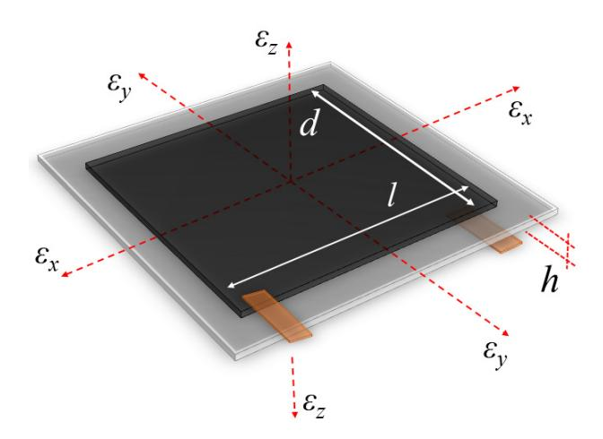

Figure 5.1 Sketch of a SEC's geometry with reference axes.

The SEC is designed to measure in-plane strain (*x* − *y* plane in Figure 5.1) and is pre-stretched and adhered to the monitored substrate using a commercial two-part epoxy. Assuming a relatively low sampling rate (< 1 kHz), the SEC can be modeled as a non-lossy capacitor with capacitance *C*, given by the parallel plate capacitor equation,

$$C = e_0 e_r \frac{A}{h} \quad (5.1)$$

where *e*<sup>0</sup> = 8.854 pF/m is the vacuum permittivity, *e<sup>r</sup>* is the polymer relative permittivity, *A* = *d* · *l* is the sensor area of width *d* and length *l*, and *h* is the thickness of the dielectric as denoted in Figure 5.1.

Assuming small strain, an expression relating the sensor's change in capacitance to signal can be expressed as

$$\frac{\Delta C}{C} = \lambda(\varepsilon_x + \varepsilon_y) \quad (5.2)$$

where λ = 1/(1 − ν) represents the gauge factor of the sensor, with ν being the sensor material's Poisson ratio. For SEBS, ν ≈ 0.49, which yields a gauge factor λ ≈ 2. The electro-mechanical model is derived in reference (Laflamme et al., 2015). Equation (5.2) shows that the signal of the SEC varies as a function of the additive strain <sup>ε</sup>*<sup>x</sup>* + <sup>ε</sup>*y*. The linearity of the derived electro-mechanical model holds for mechanical responses up to 15 Hz (Laflamme et al., 2015). An altered electro-mechanical model has been derived in (Saleem et al., 2015) for modeling mechanical responses up to 40 Hz but is not shown here for brevity. The SEC's electro-mechanical model has been validated at numerous occasions for both static and dynamic strain, see references (Laflamme et al., 2015; Saleem et al., 2015; Laflamme et al., 2013) for instance. Additionally, the SEC has been shown to operate successfully in the relatively noisy environment of a wind tunnel mounted inside a wind turbine blade model(Downey et al., 2017).

{142}------------------------------------------------

#### <span id="page-142-0"></span>5.2.2 Strain Decomposition Algorithm

The SEC signal comprises the additive in-plane strain components, as expressed in Equation [\(5.2\)](#page-141-0). The enhanced LSE algorithm was designed to decompose strain maps by leveraging an HDSN configuration. The algorithm is presented in (Downey et al., 2016) and summarized in what follows.

The enhanced LSE algorithm assumes a parametric displacement shape function. For simplicity, consider a cantilever plate that extends into the *x*-*y* plane with a constant thickness *c*, and fixed along one edge (at *x* = 0). A *p* th order polynomial is selected due to its mathematical simplicity to approximate the plates deflection shape. The deflection shape *w* is expressed as

$$w(x, y) = \sum_{i=2, j=1}^p b_{ij} x^i y^j \quad (5.3)$$

where *b<sup>i</sup>*, *<sup>j</sup>* are regression coefficients, with *i* > 1 to satisfy the displacement boundary condition on the clamped edge where *w*(0,*y*) = 0. Taking an HDSN with *m* sensors and collecting displacements at sensors' locations in a vector W, Equation (5.3) becomes W = *w*<sup>1</sup> · · · *w<sup>k</sup>* · · · *w<sup>m</sup> T* = HB. Where H encodes sensor location information and B is the regression coefficients matrix such that B = *b*<sup>1</sup> · · · *b<sup>a</sup> T* where *b<sup>a</sup>* represents the last regression coefficient.

The H location matrix is defined as H = [ΓxHx|ΓyHy] where H<sup>x</sup> and H<sup>y</sup> account for the SEC's additive strain measurements. Γ*<sup>x</sup>* and Γ*<sup>y</sup>* are added as appropriately defined diagonal weight matrices holding the scalar sensor weight values <sup>γ</sup>*x*,*<sup>k</sup>* and <sup>γ</sup>*y*,*<sup>k</sup>*, associated with the *k*-th sensor. For instance, an RSG sensor *k* orientated in the *x* direction will take weight values <sup>γ</sup>*x*,*<sup>k</sup>* = 1 and <sup>γ</sup>*y*,*<sup>k</sup>* = 0. Virtual sensors, treated as RSG sensors with known signals, may also be added into H. Virtual sensors are analogous to RSG sensors, except they are located at points where the boundary condition can be assumed to a high degree of certainty. The matrices are developed from quantities contained in Equation (5.3);

$$\mathbf{H}_x = \mathbf{H}_y = \begin{bmatrix} y_1^n & x_1 y_1^{n-1} & \cdots & x_1^{n-1} y_1 & x_1^n \\ y_m^n & x_m y_m^{n-1} & \cdots & x_m^{n-1} y_m & x_m^n \end{bmatrix} \quad (5.4)$$

Linear strain functions <sup>ε</sup>*<sup>x</sup>* and <sup>ε</sup>*<sup>y</sup>* along the *x* and *y* directions, respectively, can be obtained from Equation 5.3 through the enforcement of Kirchhoffs plate theory as;

$$\varepsilon_x(x, y) = -\frac{c}{2} \frac{\partial^2 w(x, y)}{\partial x^2} = \Gamma_\lambda \mathbf{H}_\lambda \mathbf{B}_\lambda \quad (5.5)$$

$$\varepsilon_y(x, y) = -\frac{c}{2} \frac{\partial^2 w(x, y)}{\partial y^2} = \Gamma_y \mathbf{H}_y \mathbf{B}_y \quad (5.6)$$

{143}------------------------------------------------

<span id="page-143-0"></span>where B = [Bx|By] *T* .

Linear strains at sensors' locations along the *x* and *y* directions can be obtained from sensors transducing <sup>ε</sup>*x*(*x*, *y*) and <sup>ε</sup>*y*(*x*, *y*). Signal vector S is constructed in terms of the sensors strain signal S = *s*<sup>1</sup> · · · *s<sup>k</sup>* · · · *s<sup>m</sup> T* . Thereafter, the regression coefficient matrix B can be estimated using an LSE:

$$\hat{\mathbf{B}} = (\mathbf{H}^T \mathbf{H})^{-1} \mathbf{H}^T \mathbf{S} \quad (5.7)$$

where the hat denotes an estimation. It results that the estimated strain maps can be reconstructed using

$$\hat{\mathbf{E}}_x = \Gamma_x \mathbf{H}_x \hat{\mathbf{B}}_x \quad \hat{\mathbf{E}}_y = \Gamma_y \mathbf{H}_y \hat{\mathbf{B}}_y \quad (5.8)$$

where E<sup>x</sup> and E<sup>y</sup> are vectors containing the estimated strain in the *x* and *y* directions for sensors transducing <sup>ε</sup>*x*(*x*, *y*) and <sup>ε</sup>*y*(*x*, *y*), respectively.

An HDSN without a sufficient number of RSGs will result in H being multi-collinear because H<sup>x</sup> and H<sup>y</sup> share multiple rows, resulting in H *<sup>T</sup>*H being non-invertible. This can be avoided by integrating a sufficient number of RSGs into the HDSN.

# 5.3 Optimal Sensor Placement

This section proposes a single objective function that solves the multi-objective problem of decreasing the likelihood of type I and type II errors through the placement of RSGs in the HDSN. The objective function is based on the linear combination method, borrowed from the field of robust design (Doltsinis and Kang, 2004) that seeks to find a solution on the Pareto frontier. Thereafter, an adaptive GA specially formulated through the use of a learning gene pool for applications in sensor placement is introduced.

### 5.3.1 Bi-Optimization Objective Function

The occurrence of type I and type II errors in a structure depends, in part, on the strain-based fault diagnostic techniques applied to the extracted strain maps. In general, a type I error is the incorrect calcification of a healthy state as a damage state caused by consistently inaccurate strain maps being construed for a structural component. In comparison, a type II error is the failure to detect a structural fault that the properly selected strain-based fault diagnostic technique was designed to detect.

For the purpose of reducing the occurrence of type I errors within the HDSN's extracted strain maps, an optimization problem based on minimizing the mean absolute error (MAE) between the system and its estimated response is 

{144}------------------------------------------------

<span id="page-144-0"></span>utilized. The use of MAE for validation provides a simple yet effective representation of how a structure will perform under static and dynamic loading. However, sensor placement validation based solely on the sensor network's MAE value may result in locations of high disagreement between the estimated and real systems. In the case of a monitored system, such an occurrence could result in a system component being stressed past its design limit, leading to an undetected localized failure (i.e. type II error). To reduce the occurrence of type II errors in an HDSN, a second optimization problem based on minimizing the maximum difference between the system and its estimated response per any individual point on a strain map is introduced, defined as β. The bi-objective optimization problem for placing *m* sensors can be formulated as,

```html
$$egin{aligned} ext{minimize} & ext{ } f(oldsymbol{P}) = ( ext{MAE}(oldsymbol{P}), eta(oldsymbol{P})) \ ext{subject to} & oldsymbol{P} = [p_1, 
as{}{ ext{.} }, 
as{.}{m}]^T ext{ }
otin ext{ } ar{ ext{A}} \ & 0 
ightarrow m 
ightarrow n ext{ } ext{ } ext{(Note: The original image is cropped/poorly rendered for the bounds, I will use general notation.)} ag{5.9}\\\end{aligned}
ight$$

```

where P is a unique vector consisting of *m* unique sensor locations *p* taken from the global set of sensor locations, P, with size *n*.

These multi-optimization problems can be combined to form a single objective optimization function with solutions that lie on the Pareto frontier. While various methods have been proposed for finding solutions on the Pareto frontier, a straightforward scalarization approach formulated as a linear combination method is applied here. The linear combination method finds the minimum of a weighted linear combination of objectives, resulting in a Paretooptimal solution. This approach allows for trade-offs between the two objectives, thereby increasing the usability of the optimization function. The single objective problem for optimizing the placement of *m* sensors can be formulated as,

$$$$

where <sup>α</sup> is a user-defined scalarization factor to weight both objective functions. MAE<sup>0</sup> and β 0 are factors used for normalizing MAE and β. The optimization problem expressed in Equation (5.10) can be converted to a MAE value minimization problem for α = 0, or a β minimization problem for α = 1. Selection of an appropriate value for α is based on the abilities of the selected strain-based fault detection techniques to avoid type I and type II errors. Additionally, selection of α depends on the structure's ability to tolerate type I or type II errors.

{145}------------------------------------------------

#### <span id="page-145-0"></span>5.3.2 Adaptive Genetic Algorithm

The proposed adaptive GA leverages the intuitive idea that some sensor locations (*pk*) add little or no information (i.e. low-information gene) to the estimated system when selected for use in a set (i.e. offspring) of potential sensors locations P. Conversely, some genes add a measurable amount of information to the system when selected for use in P (i.e. high-information gene). This concept is enforced into the GA through the use a learning gene pool. The proposed adaptive GA introduces a selection weight δ*<sup>k</sup>* to each gene. Selection weights evolve with each generation through a percentage change (∆%). Therefore, increasing the likelihood that a high-information gene is selected in the next generation from the gene pool:

$$\delta_{k,\text{generation}+1} = \delta_{k,\text{generation}} * \left( 1 + \frac{\Delta\%}{100} \right) \quad (5.11)$$

Here *k* is a high-information gene from the current generation. Selection weights also reduce likelihood that a lowinformation gene is selected

$$\delta_{k,\text{generation}+1} = \delta_{k,\text{generation}} * \left(1 - \frac{\Delta\%}{100}\right) \quad (5.12)$$

where *k* is a low-information gene. Bounding the maximum and minimum δ values ensures that ensure that all genes are carried forward, and no genes dominate the gene pool.

Algorithm 3 Adaptive genetic algorithm using learning gene pool.

1: Pelite = initial guess 2: for generation count do 3: mutate Pelite into Ppopulation 4: for population count do 5: generate LSE strain maps 6: calculate fit 7: end for 8: P1-end = ordered Ppopulation *f*(fit) 9: Pelite = P<sup>1</sup> 10: adjust δ*<sup>k</sup>* correlating to *p*elite 11: Panti-elite = Pend 12: adjust δ*<sup>k</sup>* correlating to *p*anti-elite 13: end for

{146}------------------------------------------------

<span id="page-146-0"></span>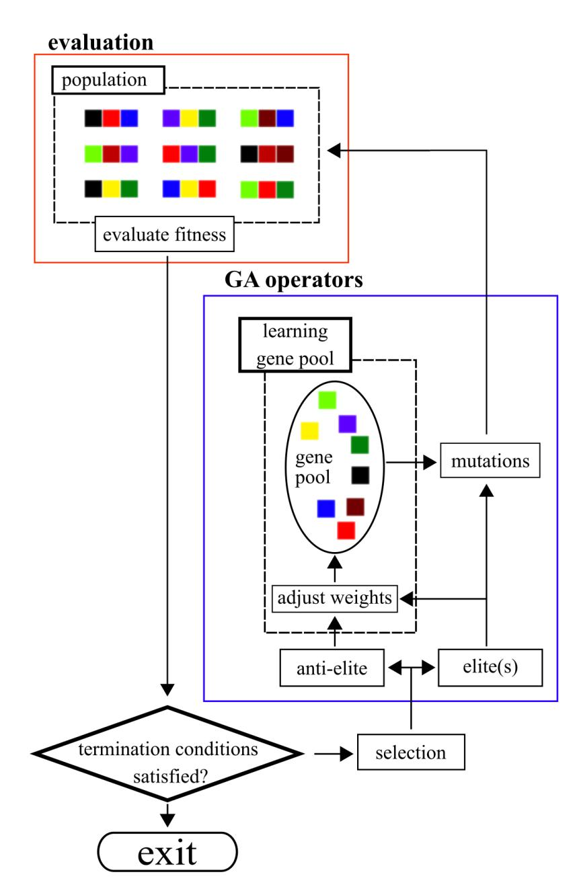

Figure 5.2 Adaptive genetic algorithm with learning gene pool.

{147}------------------------------------------------

<span id="page-147-0"></span>The proposed GA framework is presented in Algorithm [3.](#page-145-0) Here, Pelite is the best performing P vector containing unique sensor locations that comprise the HDSN layout with the best fit. Conversely, Panti-elite is a vector containing the sensor locations that achieve the worst fit. Lastly, Ppopulation is the array of vectors that contains all sensor location vectors tested and can be arranged into P1-end based on the performance of these sensor location vectors. Figure [5.2](#page-146-0) diagrams the GA flow.

While multiple variations for the adjustment of selection weights are possible, this work will focus on a simple two-part updating technique. First, the elite offspring from a population is extracted, where all genes in Pelite are considered high-information genes. Next, the lowest performing offspring is extracted, where genes in Panti-elite are considered low-information genes. Thereafter, gene weights δ are adjusted by ∆% as shown in Equations [5.11](#page-145-0) and [5.12.](#page-145-0)

# 5.4 Methodology of Experimental Validation

Validation of the Adaptive GA utilizing a learning gene pool is conducted experimentally on an HDSN. This section describes the experimental set-up and methodology used for the experimental validation.

#### 5.4.1 HDSN Configuration

The HDSN consists of 20 SECs and 46 RSGs deployed onto the surface of a fiberglass plate of geometry 74 × 63 × 0.32 cm<sup>3</sup> fixed along one edge with clamps as shown in Figure [5.3.](#page-148-0) Each SEC covers 6.5 × 6.5 = 42 cm<sup>2</sup> in area, laid out in a 4 × 5 grid array. The point node used in constructing the H matrix is taken as the center of each SEC. RSGs used in the experimental setup are foil-type strain gauges of 6 mm length manufactured by Tokyo Sokki Kenkyujo, model FLA-6-350-11-3LT. They are aligned along the directions of the plate's edges, in either a single or double configuration, individually measuring <sup>ε</sup>*<sup>x</sup>* or <sup>ε</sup>*<sup>y</sup>* along the *x* and *y* axes as indicated in Figure [5.3.](#page-148-0) RSGs were arbitrarily located on the plate with the considerations that an equal number of RSGs measure <sup>ε</sup>*<sup>x</sup>* and <sup>ε</sup>*<sup>y</sup>* and that the RSGs are relatively evenly distributed.

Three different displacement-controlled load cases were selected and applied to the plate: load case I) an upward uniform displacement of 125 mm along the free edge; load case II) a downward uniform displacement of 97 mm along the free edge; and load case III) a twist of 43 degrees with reference to the initial plane. Each test consisted of three 15-second sets of unloaded, loaded, and unloaded conditions, for a total of 45 seconds.

Separate data acquisition (DAQ) hardware is used for the measurement of the SEC and RSG sensors, as annotated in Figure [5.3.](#page-148-0) RSG measurements are recorded at 100 Hz using a National Instruments cDAQ-9174 with four 24-bit

{148}------------------------------------------------

<span id="page-148-0"></span>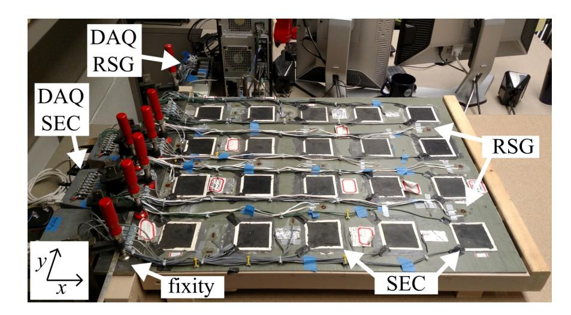

Figure 5.3 Experimental HDSN on fiberglass substrate.

350 Ω quarter-bridge modules (NI-9236). SEC measurements are recorded at 25 Hz using a 16-bit capacitance-todigital converter, PCAP-02, mounted inside the metal project boxes.

#### 5.4.2 Signal Processing

A representative SEC signal is shown in Figure [5.4.](#page-149-0) Here, the capacitance signal is acquired from an SEC sensor under tension (top row, second from left, as shown Figure 5.3(b)) during load case II. Unfiltered data is presented in Figure [5.4\(](#page-149-0)a). While the acquired sensor signal is relatively noisy, the noise is Gaussian as represented in the Q-Q plot in Figure [5.4\(](#page-149-0)b). The oversampled signal is then decimated providing a single displaced measurement of greater resolution (Hauser, 1991) for use in the Enhanced LSE algorithm. Given the static nature of the current work, this technique was found to provide acceptable results.

### 5.4.3 Algorithm Configuration

Validation of the proposed adaptive GA with learning gene pool is performed for the case of *m* = 10 (RGS sensor locations), *n* = 46 (RSG candidate locations). An HDSN of 20 SECs and 10 RSGs was selected due to its ability to generate a viable estimation of the real system (Downey et al., 2016), while still providing a sufficient search space. The estimated strain map is validated against the real strain map, as reconstructed using all 46 RSGs.

A single set of optimized sensor placement locations (P) is obtained for the experimental HDSN. The final sensor configuration is the set of locations that best reproduce all six strain maps, three for <sup>ε</sup>*<sup>x</sup>* and three for <sup>ε</sup>*y*, under the three loading cases. Estimated strain maps are produced using the enhanced LSE algorithm presented in the background

{149}------------------------------------------------

<span id="page-149-0"></span>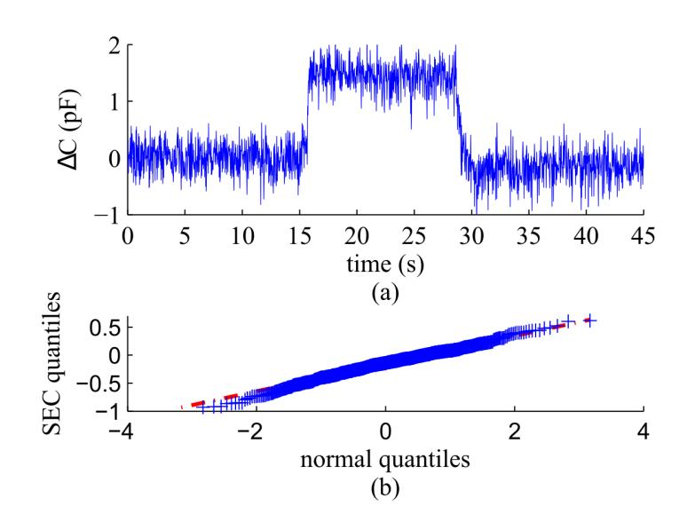

Figure 5.4 Representative SEC signal: (a) time series for test under load case II, (b) Q-Q plot for the SEC signal under load.

section. Additionally, five virtual sensor nodes are added along the fixity such that <sup>ε</sup>*<sup>y</sup>* = 0. The sensors nodes are evenly spaced, placed at *x* = 0, *y* = 0.10, 0.21, 0.31, 0.42 and 0.52 m. Virtual sensors are not placed at the corners to account for edge effects present in the plate.

A set of initial sensor locations are needed to develop the normalization factors, MAE<sup>0</sup> and β 0 , used in Equation [5.9.](#page-144-0) To provide P, a guess a set of 50 randomly selected sensor placement locations were produced. Using a single objective optimization function minimizing the MAE a best-of-50 sensor placement was obtained. The optimization function minimizing only the MAE was chosen over that minimizing β, since the former maximizes the fit over all six strain maps and the latter only minimizes the single point of greatest disagreement. This best-of-50 sensor placement set was then used to calculate the MAE<sup>0</sup> and β 0 for use with the single objective optimization problem in Equation [\(5.10\)](#page-144-0).

Certain constraints were implemented in the code to ensure the GA progressed efficiently. The number of gene mutations per offspring was based on a shifted half-normal distribution, such that the probability of a one-gene mutated offspring is 0.5 and a 10-gene mutated offspring is 0.03 (3σ). Mutated genes are selected from all available genes, excluding the genes present in the parent (i.e. the parent cannot mutate back into itself). The probability of selecting a certain gene from the learning gene pool is based on that gene's relative selection weight. Selection weights were bounded to ensure that no sensor location would become overly dominant or drop out. The lower bound was set to 0.1, while the upper bound was set to 4. These bounds were selected to keep low-information genes available 

{150}------------------------------------------------

<span id="page-150-0"></span>for selection and reward high-information genes, without allowing them to diverge to infinity. No constraints were enforced between individual offspring.

All GA iterations for parameter testing were run 10 times (the number of repeated GA runs *n<sup>s</sup>* = 10) and terminated after 100 generations. The Student's t-distribution with <sup>ν</sup> = *n<sup>s</sup>* − 1 degrees of freedom was used to obtain an estimate of the true (population) mean from the sample mean. Specifically, the 95% confidence interval for the true mean was developed based on the t-distribution to show with a degree of certainty where the true mean lies.

The proposed adaptive GA with learning gene pool easily lends itself to running in parallel code configurations as each offspring can be calculated independently. Code was developed using a series of Python codes, in combination with MATLAB's Parallel Computing Toolbox. Computations were performed using individual nodes on a highperformance computing cluster (HPC). Each node consisted of two 2.2 GHz 4-Core AMD Opteron 2354 with 8 GB of RAM. Algorithm speed was found to depend almost exclusively on the offspring population size. On average, a population size of 50 took 18.1 seconds per generation. The final sensor placement results were calculated in 26 hours running on 36 nodes.

# 5.5 Results of Experimental Validation

This section presents the results from the parameter studies used for the development of a final mutation-based GA configuration. Thereafter, the selected parameters are used to obtain an optimized sensor placement for the experimental HDSN.

### 5.5.1 Parametric Study

First, the selection weights parameter is studied in relation to the GA's generational results. Tests were performed using a sample population of 50 with the code repeated over 10 runs to obtain a representative response. A reference case was obtained by solving a GA without a learning gene pool (selection weight = 0). The mean value of the 10 individual runs is shown in Figure [5.5\(](#page-151-0)a). Through comparisons with the adaptive GAs of selection weights of 1% and 10%, it can be observed that the adaptive GAs with learning gene pool converge to a local minimum faster than the GA without a learning gene pool.

The effects of changing selection weights on the GA's fit after 100 generations are presented in Figure [5.5\(](#page-151-0)b). The sample mean (i.e., a point estimate of the true mean) and the 95% confidence interval for the true mean are presented as a solid red and a dashed blue line, respectively. Small increases in selection weights for weights under (< 1%) have a large effect on the GA's 100 generation results. However, the benefit of an increasing learning gene pool weights

{151}------------------------------------------------

<span id="page-151-0"></span>greatly diminishes for selection weights greater than 1%. For the remainder of the tests, a gene pool learning weight of 10% was used due to it being a typical response when compared to other weights < 1%.

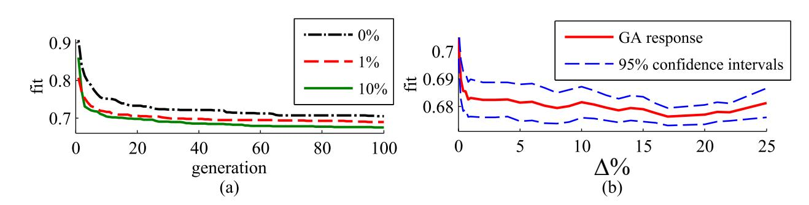

Figure 5.5 Effects of ∆% on GA fit: (a) fit vs generation; and (b) fit after 100 generations vs ∆%.

Next, the effect of population size on the adaptive GA with learning gene pool is studied. Again, each population size was tested over 100 generations and 10 runs with the mean of the 100th generation for population sizes ranging from 1-100 presented in Figure 5.6. The analysis shows that an increase in trial population size has a positive result on the GA's fitting ability, as expected. A greater improvement is seen for unit population increases up to 20 than for unit population increases after 20. Results presented here agree with the use of a population size of 50 as selected earlier. Thus, the population size of 50 is kept constant for all of the additional tests.

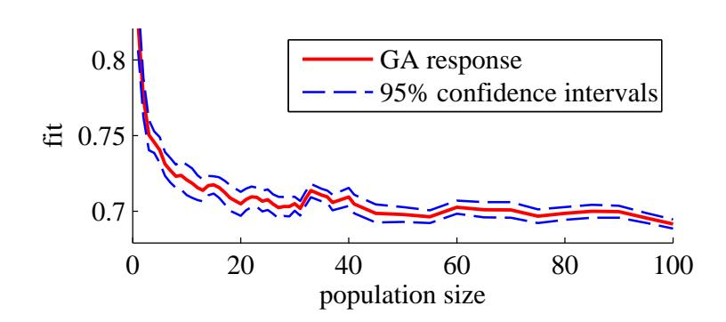

Figure 5.6 Effect of offspring population size on GA performance.

The concept of using multiple elites (parents) from each generation through the selection of the top *k* parents (*k* = 1...4) was explored. After selecting the top *k* parents, the next generation was mutated from these with an equal number of mutations per parent. Any remaining offspring were applied to the leading parent to maintain a total

{152}------------------------------------------------

<span id="page-152-0"></span>population size of 50. Results showed no benefit to the introduction of multiple elites into the GA, therefore these results are emitted from the GAs formulation.

Lastly, a study of optimization objective function presented in Equation [5.10](#page-144-0) is performed. Results presented in Figure 5.7 show that the proposed objective function is capable of developing a P that accounts for potential type I and type II errors. For the experimental HDSN presented here, and considering type I and type II errors to be of equal importance, results demonstrate that α = 0.5 provides an acceptable sensor placement set P. Furthermore, when compared with a single objective function based purely on MAE (i.e. α = 0), the selected value of α = 0.5 provides a 12.53% improvement in β, while only resulting in a 1.47% cost in MAE. β has a local minimum at α = 0.7, this is a consequence of α > 0.7 putting greater emphasis on fitting one point per generation over 100 generations. Optimum fitting of sensor locations for α > 0.7 requires excessive generations as the problem is solved through reducing the point of greatest disagreement one-at-a-time. In comparison, α < 0.7 adds more weight to fitting all the points, therefore ensuring that any single point of disagreement is less of an outlier. Selection of an appropriate α depends on engineering judgment but is taken here as α = 0.5 for the subsequent simulations.

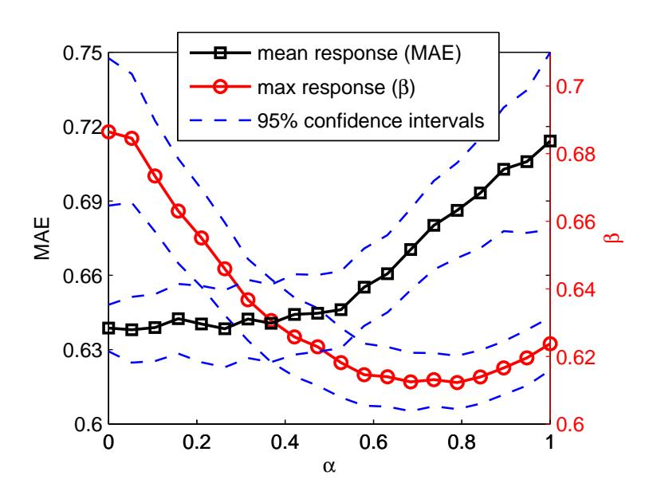

Figure 5.7 Bi-optimization objective function results presented as a function a the scalarization factor α for a the single objective function where: α = 0 seeks to minimize type I error (MAE); α = 1 seeks to minimise type II error (β).

{153}------------------------------------------------

<span id="page-153-0"></span>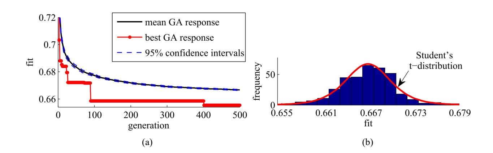

Figure 5.8 Results for obtaining the final set of sensor locations: a) generational results for adaptive GA with learning gene pool used for sensor placement; b) histogram showing the sensor results evenly distributed about the mean and compared to a Students t-distribution.

### 5.5.2 Optimal Sensor Locations

Sensor placement for RSGs within the experimental HDSN is performed using a selection weight (∆%) of 10%, a scalarization factor (α) of 0.5, and a population size of 50. The GA was run 360 times for 500 generations with the generational improvements reported in Figure 5.8(a). The 95% confidence interval for the true mean was estimated using Student's t-distribution as before, presented here as a solid black (true mean) and a dashed blue line (95% confidence interval). The P with the best fit at the 500th generation is presented as the red line with filled circle markers. As expected, the sensor placement fit improves through the generations with a final minimum fit of 0.655, a 34.5% improvement from the best-of-50 starting condition. Figure 5.8(b) presents a histogram showing the distribution for the final P, as found by each of the 360 runs with the optimal P being located in the left-most bin. Figure 5.8(b) demonstrates that the proposed algorithm is capable of repeatedly converging to an optimum solution, without developing any substantial outliers.

The starting guess best-of-50 results for sensor locations is presented in Figure [5.9\(](#page-154-0)a). The purely random selection procedure selected five gauges in the *x*-direction, and five gauges in the *y*-direction. A MAE of 36µε was obtained across all six strain maps with a maximum difference, β, of 201µε. Optimal sensor locations selected through the adaptive GA with learning gene pool are presented in [5.9\(](#page-154-0)b). After optimizing RSG sensor layout, the MAE was reduced to 23µε while β reduced to 131µε. The adaptive GA with learning gene pool prioritized the placement of strain gauges in the *x*-direction. This can be attributed to <sup>ε</sup>*<sup>x</sup>* being the dominant strain in the test configuration under study (a dominant bending direction). Strain map reconstruction with the optimized RSG locations provided a 35%

{154}------------------------------------------------

<span id="page-154-0"></span>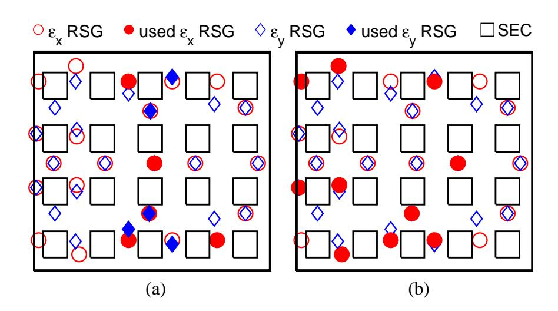

Figure 5.9 Optimized Sensor placement: (a) sensor placement for best of 50 random placements; and (b) sensor placement obtained through adaptive GA with learning gene pool.

improvement in the HDSN's MAE and β (due to α = 0.5) over the best-of-50 starting condition. The improved strain maps are considered rich enough to enable a good decomposition of the additive strain measured by the SECs. Note that weighted factors could be introduced in the objective function if, for instance, a higher degree of fit on <sup>ε</sup>*<sup>y</sup>* would be required. The current sensor placement results are limited to the three loading cases presented here. Sensor placement for an extended loading case library and the effect of dynamic loading cases are left to future work.

# 5.6 Conclusion

This work presented a multi-objective optimization problem to reduce the occurrence of type I and type II errors in an SHM system, presented a case study of an adaptive mutation-based GA with learning gene pool for placement of sensors within an HDSN and deployed an HDSN utilizing flexible electronics with optimally placed RSGs for the enforcement of boundary conditions. The effort presented here expands on the development of a low-cost sensing skin for the monitoring of large-scale structural components, including wind turbine blades. A novel sensor termed soft elastomeric capacitors (SEC) is combined with a mature technology, resistive strain gauges (RSGs), to form a hybrid dense sensor network (HDSN) capable of large-surface monitoring where the SEC provides low-cost additive in-place strain measurements over the entire system and the resistive strain gauges (RSG) are used for the enforcement of boundary conditions at key locations. When combined with a previously developed strain decomposition 

{155}------------------------------------------------

<span id="page-155-0"></span>technique, uni-directional strain maps can be obtained, therefore, allowing the HDSN to act as a sensing skin capable of monitoring local uni-directional changes in strain over a global area.

An optimum sensor placement (OSP) for finding the key boundary condition locations for the deployment of RSGs within a grid of SECs was investigated with the intention to limit the number of RSGs used within the HDSN. A multiobjective optimization problem to reduce the occurrence of type I and type II errors in structural health monitoring (SHM) and prognostics and health management (PHM) was defined. The multi-objective optimization problem was formulated as a single objective optimization problem by linear scalarization. The objective problem was solved through an adaptive GA with learning gene pool for the placement of RSG sensors within the HDSN. The adaptive GA gene pool was updated every generation to reflect the quantity of information individual genes added to offspring.

Experimental validation demonstrated the adaptive GA's capability to efficiently place RSG sensors within an HDSN with consideration of predetermined loading cases. The efficient placement of RSGs sensors enables the deployment of large arrays of SECs over a large surface with the integration of a minimal number of RSGs. This will allow the monitoring of strain maps over large structural components, which information could be used to detect, localize, and quantify damage, or to create high fidelity models to enhance our understanding of certain structural behaviors. Such models can be particularly helpful in the development of PHM models and condition-based maintenance scheduling.

## Acknowledgment

The development of the SEC technology is supported by grant No. 13-02 from the Iowa Energy Center. This work is also partly supported by the National Science Foundation Grant No.1069283, which supports the activities of the Integrative Graduate Education and Research Traineeship (IGERT) in Wind Energy Science, Engineering and Policy (WESEP) at Iowa State University. Their support is gratefully acknowledged.

# 5.7 References

Abraham, A. and Jain, L. (2005). Evolutionary multiobjective optimization. In *Advanced Information and Knowledge Processing*, pages 1–6. Springer Nature.

{156}------------------------------------------------

Adams, D., White, J., Rumsey, M., and Farrar, C. (2011). Structural health monitoring of wind turbines: method and application to a HAWT. *Wind Energy*, 14(4):603–623. Ahmed, M., Gonenli, I. E., Nadvi, G. S., Kilaru, R., Butler, D. P., and Celik-Butler, Z. (2012). MEMS sensors on flexible substrates towards a smart skin. In *2012 IEEE Sensors*. IEEE. Brownjohn, J., Xia, P.-Q., Hao, H., and Xia, Y. (2001). Civil structure condition assessment by FE model updating:. *Finite Elements in Analysis and Design*, 37(10):761–775. Chang, P. C., Flatau, A., and Liu, S. C. (2003). Review paper: Health monitoring of civil infrastructure. *Structural Health Monitoring: An International Journal*, 2(3):257–267. Doltsinis, I. and Kang, Z. (2004). Robust design of structures using optimization methods. *Computer Methods in Applied Mechanics and Engineering*, 193(23-26):2221–2237. Downey, A., Laflamme, S., and Ubertini, F. (2016). Reconstruction of in-plane strain maps using hybrid dense sensor network composed of sensing skin. *Measurement Science and Technology*, 27(12):124016. Downey, A., Laflamme, S., Ubertini, F., Sauder, H., and Sarkar, P. (2017). Experimental study of thin film sensor networks for wind turbine blade damage detection. Author(s). Guo, H. Y., Zhang, L., Zhang, L. L., and Zhou, J. X. (2004). Optimal placement of sensors for structural health monitoring using improved genetic algorithms. *Smart Materials and Structures*, 13(3):528–534. Guratzsch, R. F. and Mahadevan, S. (2010). Structural health monitoring sensor placement optimization under uncertainty. *AIAA Journal*, 48(7):1281–1289. Hauser, M. W. (1991). Principles of oversampling a/d conversion. *J. Audio Eng. Soc*, 39(1/2):3–26. Holland, J. H. (1975). *Adaptation in natural and artificial systems: an introductory analysis with applications to biology, control, and artificial intelligence.* U Michigan Press. Hu, C., Youn, B. D., Wang, P., and Yoon, J. T. (2012). Ensemble of data-driven prognostic algorithms for robust prediction of remaining useful life. *Reliability Engineering* & *System Safety*, 103:120–135. Kammer, D. C. (1991). Sensor placement for on-orbit modal identification and correlation of large space structures. *Journal of Guidance, Control, and Dynamics*, 14(2):251–259.

{157}------------------------------------------------

Laflamme, S., Kollosche, M., Connor, J. J., and Kofod, G. (2013a). Robust flexible capacitive surface sensor for structural health monitoring applications. *Journal of Engineering Mechanics*, 139(7):879–885. Laflamme, S., Saleem, H. S., Vasan, B. K., Geiger, R. L., Chen, D., Kessler, M. R., and Rajan, K. (2013b). Soft elastomeric capacitor network for strain sensing over large surfaces. *IEEE*/*ASME Transactions on Mechatronics*, 18(6):1647–1654. Laflamme, S., Ubertini, F., Saleem, H., D'Alessandro, A., Downey, A., Ceylan, H., and Materazzi, A. L. (2015). Dynamic characterization of a soft elastomeric capacitor for structural health monitoring. *Journal of Structural Engineering*, 141(8):04014186. Lee, H.-K., Chang, S.-I., and Yoon, E. (2006). A flexible polymer tactile sensor: Fabrication and modular expandability for large area deployment. *Journal of Microelectromechanical Systems*, 15(6):1681–1686. Lynch, J. P. (2006). A summary review of wireless sensors and sensor networks for structural health monitoring. *The Shock and Vibration Digest*, 38(2):91–128. Papadimitriou, C. and Lombaert, G. (2012). The effect of prediction error correlation on optimal sensor placement in structural dynamics. *Mechanical Systems and Signal Processing*, 28:105–127. Rao, A. R. M. and Anandakumar, G. (2007). Optimal placement of sensors for structural system identification and health monitoring using a hybrid swarm intelligence technique. *Smart Materials and Structures*, 16(6):2658–2672. Richards, P. W., Griffth, D. T., and Hodges, D. H. (2015). Smart loads management for damaged offshore wind turbine blades. *Wind Engineering*, 39(4):419–436. Saleem, H., Downey, A., Laflamme, S., Kollosche, M., and Ubertini, F. (2015). Investigation of dynamic properties of a novel capacitive-based sensing skin for nondestructive testing. *Materials Evaluation*, 73(10):1384–1391. Scudder, H. E., Jacobs, J., and HeighWay, R. (1882). *The Book of Fables: Chiefly from Aesop - The Shepherd-Boy and the Wolf*. Houghton, Miffin. Si, X.-S., Wang, W., Hu, C.-H., and Zhou, D.-H. (2011). Remaining useful life estimation – a review on the statistical data driven approaches. *European Journal of Operational Research*, 213(1):1–14. Worden, K. and Burrows, A. (2001). Optimal sensor placement for fault detection. *Engineering Structures*, 23(8):885– 901.

{158}------------------------------------------------

Yao, L., Sethares, W. A., and Kammer, D. C. (1993). Sensor placement for on-orbit modal identification via a genetic algorithm. *AIAA Journal*, 31(10):1922–1928. Yi, T.-H. and Li, H.-N. (2012). Methodology developments in sensor placement for health monitoring of civil infrastructures. *International Journal of Distributed Sensor Networks*, 8(8):612726. Yi, T.-H., Li, H.-N., and Zhang, X.-D. (2014). Health monitoring sensor placement optimization for canton tower using immune monkey algorithm. *Structural Control and Health Monitoring*, 22(1):123–138.

{159}------------------------------------------------

# <span id="page-159-0"></span>CHAPTER 6. ALGORITHM FOR DAMAGE DETECTION IN WIND TURBINE BLADES USING A HYBRID DENSE SENSOR NETWORK WITH FEATURE LEVEL DATA FUSION

This chapter is wholly based on 'Algorithm for Damage Detection in Wind Turbine Blades using a Hybrid Dense Sensor Network with Feature Level Data Fusion" Published in the Journal of Wind Engineering and Industrial Aerodynamics, vol. 168, 2017, p. 288-296. doi:10.1016/j.jweia.2017.06.016.

Austin Downey<sup>1</sup> , Filippo Ubertini <sup>2</sup> and Simon Laflamme1,<sup>3</sup>

# Abstract

Damage detection in wind turbine blades requires the ability to distinguish local faults over a global area. The implementation of dense sensor networks provides a solution to this local-global monitoring challenge. Here the authors propose a hybrid dense sensor network consisting of capacitive-based thin-film sensors for monitoring the additive strain over large areas and fiber Bragg grating sensors for enforcing boundary conditions. This hybrid dense sensor network is leveraged to derive a data-driven damage detection and localization method for wind turbine blades. In the proposed method, the blade's complex geometry is divided into less geometrically complex sections. Orthogonal strain maps are reconstructed from the sectioned hybrid dense sensor network by assuming different bidirectional shape functions and are solved using the least squares estimator. The error between the estimated strain maps and measured strains is extracted to define damage detection features that are dependent on the selected shape functions. This technique fuses sensor data into a single damage detection feature, providing a simple and robust method for inspecting large numbers of sensors without the need for complex model driven approaches. Numerical simulations

<sup>1</sup> Department of Civil, Construction, and Environmental Engineering, Iowa State University, Ames, IA, USA

<sup>2</sup> Department of Civil and Environmental Engineering, University of Perugia, Perugia, Italy

<sup>3</sup> Department of Electrical and Computer Engineering, Iowa State University, Ames, IA, USA

{160}------------------------------------------------

<span id="page-160-0"></span>demonstrate the proposed method's capability to distinguish healthy sections from possibly damaged sections on simplified 2D geometries.

Keywords: wind turbine blades, structural health monitoring, capacitive-based sensor, soft elastomeric capacitor, flexible membrane sensor, sensor network, signal decomposition, damage detection, damage localization, data fusion

# 6.1 Introduction

Wind energy growth is driven at the nexus of public policy and economics (Borenstein, 2012). As with most renewable energy projects, a wind farm's economic viability typically relies on public subsidies, a predictable energy source, and mature and reliable technology (Afanasyeva et al., 2016). The economic evaluation of wind projects is particularly challenging due to the unpredictable operation and maintenance (O&M) costs. O&M traditionally includes the cost of all necessary repairs and replacements. The estimation of O&M costs for wind generating facilities is difficult as operational lifetime data is insufficient or inapplicable to the quickly evolving energy infrastructure. Therefore, O&M costs are estimated on a cost per MW hours basis, allowing owners to share O&M costs across multiple turbines. However, this practice is less convenient for operators of small wind farms where the ability to hedge cost is difficult (Celik, 2003), for operators of wind farms in micro grids where downtime is often compensated for with expensive fossil fuels (VanderMeer and Mueller-Stoffels, 2014), and for operators of wind farms in the offshore environment where the cost structure is often largely unknown (Cockerill et al., 2001).

Reduction of uncertainty related to the O&M of a wind turbine structural system (Ghoshal et al., 2000) and the enabling of prognostics and health management (PHM) (Richards et al., 2015; Ekelund, 2000) is therefore of interest to wind farm owners and operators. Monitoring the mesostructures (e.g. towers and blades) of wind turbines is difficult due to the need to distinguish between faults in the structure's global (e.g. changing load paths, loss in global stiffness) and local (e.g. crack propagation, composite delamination) conditions (Ghoshal et al., 2000). Traditional approaches for structural health monitoring (SHM) of wind turbine blades have focused on monitoring the structure using a limited number of sensors and applying a variety of post-processing techniques (Gross et al., 1999). However, these techniques often lack the ability to distinguish local failures from global events and demonstrated a limited damage localization ability (Zou et al., 2000).

A logical solution to the local/global detection problem is to simply increase the number of sensors in the monitored structure by creating dense sensor networks (DSNs). These networks, often termed electronic artificial skins, e-skins or sensing skins, are thin electronic sheets that mimic the ability of biological skin to detect and localize damage. Sensing skins often consist of rigid or semi-rigid cells mounted on a flexible sheet, as demonstrated by (Lee et al., 

{161}------------------------------------------------

2006; Xu et al., 2003). Recent developments in sensing skins have progressed towards the development of microelectromechanical systems (MEMS) mounted in flexible sheets without the need for rigid packaging (Mahmood et al., 2015). Sensing skins with the transducing sensor built into the skin have been proposed (Chang et al., 2008). Additionally, Sensing skins with integrated electronics for signal processing have also been introduced (Yao and Glisic, 2015). These integrated sensing skins offer the potential to enable low-cost direct sensing and can be scaled for the monitoring of mesoscale systems, including wind turbine blades. Schulz *et al.* have proposed the use of a dense sensor network of series-connected piezoceramic (PZT) nodes for the continuous monitoring of wind turbine blades Schulz and Sundaresan (2006). The densest deployment of sensors for the SHM of wind turbine blades known to the authors was done by Rumsey *et al.* at Sandia National Laboratories Rumsey and Paquette (2008). Various sensor technologies were investigated for the potential of monitoring a composite blade's structural condition during a fatigue test. Generally, successful damage detection was found to require optimal sensor placement, synchronization of sampling between different sensor types, and having sensor technology capable of detecting damage that occurs on a small scale while being able to be distributed as an array over the entire structure.

Leveraging recent advances in the field of flexible electronics (Rogers et al., 2010), the authors have developed a sensing skin termed the soft elastomeric capacitor (SEC). Developed around an inexpensive nanocomposite based on a styrene-co-ethylene-co-butylene-co-styrene (SEBS) block co-polymer, the SEC is a low-cost sensor customizable in shape and size (Laflamme et al., 2013). Its static (Laflamme et al., 2013b) and dynamic (Laflamme et al., 2015) behaviors have been characterized, including numerical and experimental damage detection applications to wind turbine blades (Laflamme et al., 2016; Downey et al., 2017). Additionally, the effectiveness of a DSN consisting of SECs for detecting fatigue cracks has been demonstrated (Kharroub et al., 2015). A particularity useful attribute of the SEC is its ability to measure additive in-plane strain, and therefore, its signal must be decomposed into orthogonal directions if one desires to reconstruct uni-directional strain maps.

With the advancement of low-cost, high-channel-count sensing skins, damage detection and data-fusion techniques need to be developed to provide SHM and PHM capabilities based on this unique class of sensors. Data fusion consists of the integration of sensor data from a multitude of sources in order to make a useful representation of the monitored systems. This representation should be of sufficient quality to assist in forming a damage detection, localization, and quantification decision. Additionally, data fusion can be used to obtain a damage detection feature from multiple sensors that is informative and non-redundant. In the case of SHM, features should allow for the distinction between a damaged and an undamaged state. Examples found in the literature are most commonly based on measured dynamic signals such as resonant frequencies, mode shapes, or properties derived from mode shapes (Sohn et al., 2003; Zou et al., 2000; Han et al., 2006).

{162}------------------------------------------------

<span id="page-162-0"></span>This work introduces a computationally efficient data fusion technique that is capable of monitoring mesoscale structures without associated models or historical datasets. More specifically, the proposed NeRF (Network Reconstruction Feature) algorithm is capable of classifying hybrid dense sensor networks (HDSN) sections into healthy, or containing potential damage. This work uses HDSNs consisting of SECs for covering the large areas of a blade and Fiber Bragg grating (FBG) sensors for the enforcement of boundary conditions along the edges of sections and the separation of monitored sections. The SEC is used throughout this work as a large area electronic strain transducer. However, similarly developed large area electronics optimized for strain measurements could also be used (Yao and Glisic, 2015; Burton et al., 2016).

The NeRF algorithm works through comparing an individual sensor's measured state with the estimated response within an HDSN section. This response is built through assuming a shape function and using the least squares estimator (LSE) to approximate uni-directional strain maps. An error function is introduced, which is defined as the mean square error (MSE) between a sensors' measured and estimated strains. Thereafter, features are defined as the change in error associated with a given increase in the shape function's complexity. This technique fuses the SEC and FBG strain data into a single damage detection feature, providing a simple and robust method for inspecting large numbers of sensors without necessitating complex physical models.

The contributions of this work are three-fold: 1) an algorithm for the development of a damage detection feature that integrates data from a newly proposed HDSN into a single detection value is introduced; 2) a demonstration of the damage detection feature's ability to detect, quantify and localize damage; and 3) the evaluation of the damage detection feature's capabilities without relying on models or historical datasets. This paper is organized as follows. Section 6.2 introduces the SEC along with relevant background including the strain decomposition algorithm previously developed. Section [6.3](#page-165-0) introduces the NeRF algorithms simulations used for validation. Section [6.5](#page-170-0) discusses the simulation results. Section [6.6](#page-178-0) concludes the paper.

### 6.2 Background

This section provides background on the SEC sensor along with a brief review of the extended LSE algorithm for decomposing the SEC additive in-plane strain signal.

### 6.2.1 Soft Elastomeric Capacitor

The SEC is a thin film, large area sensor that transduces a change in its geometry (i.e., the monitored substrate's strain) into a change in capacitance. The SEC measures in-plane strain (*x*−*y* plane in Fig. [6.1\(](#page-163-0)insert)). The fabrication

{163}------------------------------------------------

<span id="page-163-0"></span>process of the SEC is documented in (Laflamme et al., 2013). Briefly, the dielectric is fabricated from an SEBS block co-polymer filled with titania to enhance its durability and permittivity. The conductive plates are fabricated from an SEBS filled with carbon black particles. The SEC is a highly scalable technology, because it uses only commercially available and inexpensive materials and its fabrication process is simple.

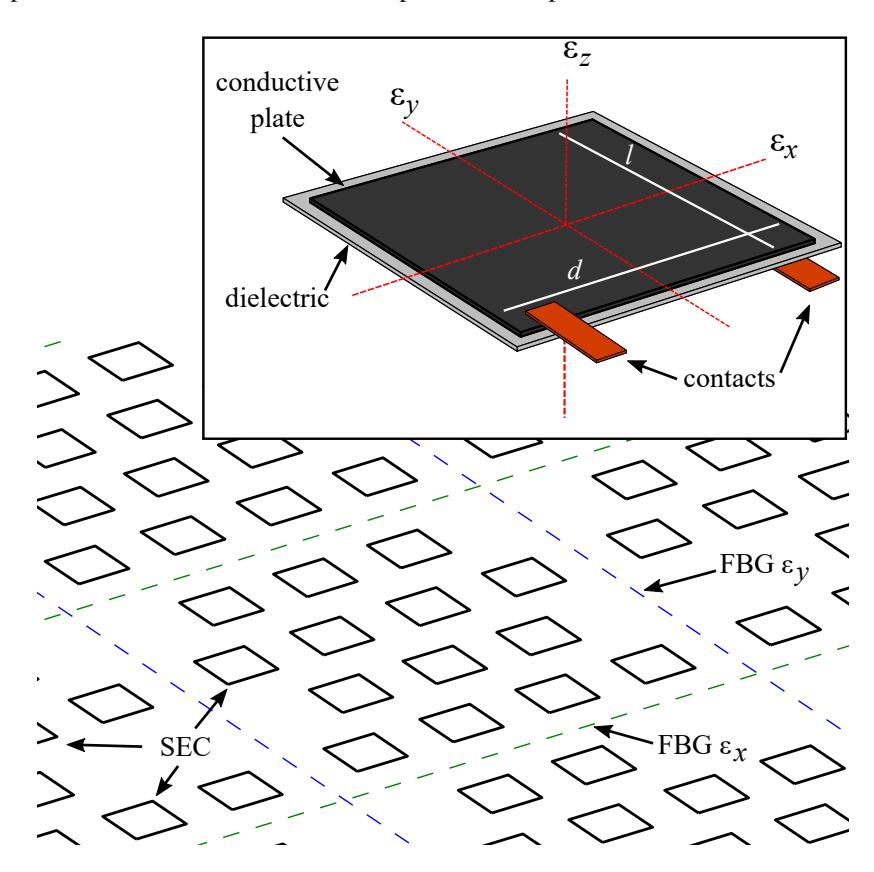

Figure 6.1 HDSN technology: HDSN section with FBG sensors enforcing strain boundary conditions and SECs providing large area sensing coverage; insert: annotated SEC sensor with reference axes.

SECs are adhered to the monitored substrate under pre-stress using a commercial epoxy, allowing it to measure strain under both tension and compression. Its electro-mechanical model is derived in (Laflamme et al., 2015). Briefly, assuming a low sampling rate (< 1 kHz), the SEC can be modeled as a non-lossy capacitor with capacitance *C*, given by the parallel plate capacitor equation,

$$C = e_0 e_r \frac{A}{h} \quad (6.1)$$

where *e*<sup>0</sup> = 8.854 pF/m is the vacuum permittivity, *e<sup>r</sup>* is the polymer relative permittivity, *A* = *d* · *l* is the overlapping area of the conductive electrodes and *h* is the thickness of the dielectric.

{164}------------------------------------------------

<span id="page-164-0"></span>Assuming small in-plane strain, an expression relating the sensor's change in capacitance to the substrate's surface strain can be expressed as

$$\frac{\Delta C}{C} = \lambda(\varepsilon_x + \varepsilon_y) \quad (6.2)$$

where λ = 1/(1 − ν) represents the gauge factor of the sensor. For SEBS, ν ≈ 0.49, which yields a gauge factor λ ≈ 2. Eq. (6.2) shows that the signal of the SEC varies as a function of the orthogonal strain components <sup>ε</sup>*<sup>x</sup>* + <sup>ε</sup>*y*. The linearity of the electro-mechanical model has been validated for mechanical responses under 15 Hz (Laflamme et al., 2015). For mechanical responses up to 40 Hz, an altered electro-mechanical model is presented in (Saleem et al., 2015) but is not shown here for brevity. The SEC's electro-mechanical model has been validated for both static and dynamic strain and is presented in references (Laflamme et al., 2015; Saleem et al., 2015; Laflamme et al., 2013).

### 6.2.2 Strain Decomposition Algorithm

Leveraging an HDSN configuration, orthogonal strain maps can be obtained from the additive strain measured by the SEC, as expressed in Eq. (6.2), using a network of sensors in combination with boundary conditions enforced using linear strain measurement techniques. In this work, FBG sensors are used as linear strain sensors. These measurements are used for updating the HDSN at key locations. The algorithm, termed the extended LSE algorithm, is presented in (Downey et al., 2016) and summarized in what follows.

The extended LSE algorithm starts by assuming a parametric displacement shape function. Here, a *p* th order polynomial is selected as the displacement shape function due to its mathematical simplicity and its ability to develop a wide range of displacement topographies. The shape function is developed for the *x*-*y* plane with a constant plate thickness *c*, such that the deflection shape *w* is expressed as

$$w(x, y) = \sum_{i=1, j=1}^p b_{ij} x^i y^j \quad (6.3)$$

where *b<sup>i</sup>*, *<sup>j</sup>* are regression coefficients. Considering an HDSN with *m* sensors that includes both SEC and FBG sensor nodes, and collecting displacements at sensor locations in a vector W ∈ R *<sup>m</sup>*, Eq. (6.3) becomes W = *w*<sup>1</sup> · · · *w<sup>k</sup>* · · · *w<sup>m</sup> T* = HB. Here, H encodes information on sensor locations and B contains the regression coefficients such that B = *b*<sup>1</sup> · · · *b<sup>f</sup> T* where *b<sup>f</sup>* represents the last regression coefficient.

Appropriately defined diagonal weight matrices Γ are introduced into the H matrix to account for the SEC additive strain measurements such that H is defined as H = [ΓxHx|ΓyHy]. Γ*<sup>x</sup>* and Γ*<sup>y</sup>* hold sensor weight values along the *x* and *y* axes, respectively. These matrices are formed with scalars <sup>γ</sup>*x*,*<sup>k</sup>* and <sup>γ</sup>*y*,*<sup>k</sup>* associated with the *k*-th sensor. For instance, 

{165}------------------------------------------------

<span id="page-165-0"></span>an FBG node *k* oriented to make strain measurements in the *x* direction will take weight values <sup>γ</sup>*x*,*<sup>k</sup>* = 1 and <sup>γ</sup>*y*,*<sup>k</sup>* = 0. The following matrices are developed from quantities contained in [\(6.3\)](#page-164-0):

$$\mathbf{H}_x = \mathbf{H}_y = \begin{bmatrix} y_1^n & x_1 y_1^{n-1} & \cdots & x_1^{n-1} y_1 & x_1^n \\ y_m^n & x_m y_m^{n-1} & \cdots & x_m^{n-1} y_m & x_m^n \end{bmatrix} \quad (6.4)$$

Linear strain functions <sup>ε</sup>*<sup>x</sup>* and <sup>ε</sup>*<sup>y</sup>* along the *x* and *y* directions, respectively, can be obtained from Eq. [\(6.3\)](#page-164-0) through the enforcement of Kirchhoff's plate theory as

$$\varepsilon_x(x, y) = -\frac{c}{2} \frac{\partial^2 w(x, y)}{\partial x^2} = \Gamma_x \mathbf{H}_x \mathbf{B}_x \quad (6.5)$$

$$\varepsilon_y(x, y) = -\frac{c}{2} \frac{\partial^2 w(x, y)}{\partial y^2} = \Gamma_y \mathbf{H}_y \mathbf{B}_y \quad (6.6)$$

where B = [Bx|By] *T* .

Constructing a signal vector, S = *s*<sup>1</sup> · · · *s<sup>k</sup>* · · · *s<sup>m</sup> T* where S contains the additive SEC and unidirectional FBG strain measurements, the regression coefficient matrix B can be estimated using an LSE:

$$\hat{\mathbf{B}} = (\mathbf{H}^T \mathbf{H})^{-1} \mathbf{H}^T \mathbf{S} \quad (6.7)$$

where the hat denotes an estimation. Estimated strain maps can now be reconstructed using

$$\hat{\mathbf{E}}_x = \Gamma_x \mathbf{H}_x \hat{\mathbf{B}}_x \quad \hat{\mathbf{E}}_y = \Gamma_y \mathbf{H}_y \hat{\mathbf{B}}_y \quad (6.8)$$

where Eˆ <sup>x</sup> and Eˆ <sup>y</sup> are vectors containing the estimated strain in the *x* and *y* directions, respectively.

In the case of an HDSN without a sufficient number of unidirectional inputs, H will be multi-collinear as H<sup>x</sup> and H<sup>y</sup> will share multiple rows, resulting in H *<sup>T</sup>*H being non-invertible. Additionally, H *<sup>T</sup>*H may lack sufficient information to be invertible for a shape function of high complexity. It follows that H *<sup>T</sup>*H is invertible given a sufficient level of input information for a given shape function. Experimental validation of the extended LSE algorithm for static Downey et al. (2016) and dynamic conditions Downey et al. (2017) have been used to validate the strain decomposition method in field conditions.

### 6.3 NeRF Algorithm

{166}------------------------------------------------

<span id="page-166-0"></span>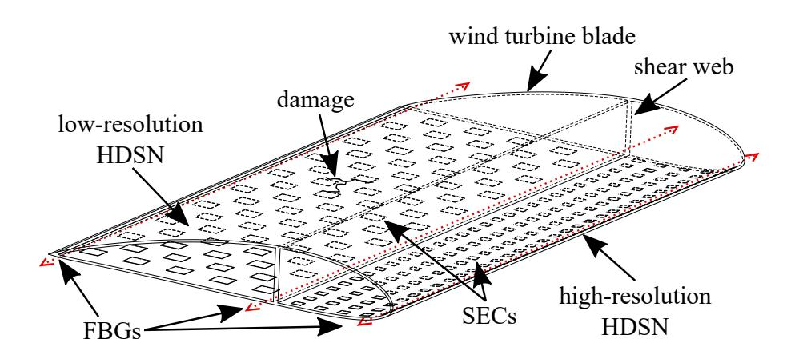

Figure 6.2 Subdividing a wind turbine blades' complex geometry into independent sections of different resolutions, here the HDSN is deployed only along the bottom of the wind turbine blade for clarity.

#### 6.3.1 Network Reconstruction Feature (NeRF)

The algorithm provides damage detection and localization capabilities by subdividing a complex geometry into a set of geometrically smaller, and typically simpler, sections. The algorithm works by comparing the signal measured by an individual sensor with the estimated response within a predefined HDSN section. The estimated response is obtained by assuming a shape function and using a least squares estimator (LSE) to approximate uni-directional strain maps. An error function, defined as the mean square error (MSE) between a sensor's measured and estimated strains, is used to associate a feature value with a given increase in the shape function's complexity. An advantage is that the HDSN can be strategically customized (e.g., to monitor crack growth, or inspect a key structural location). Fig. 6.2 illustrates this idea where a high-resolution HDSN is deployed inside a wind turbine blade along the leading edge where the geometry is more complex, and a low-resolution HDSN is deployed inside the blade along the trailing edge of the blade where the geometry is simpler.

Consider an HDSN section similar to that shown in Fig. 6.2, consisting of optical fibers with integrated FBG sensors forming the perimeter and SECs placed within. Establishing the NeRF's theoretical foundation requires that we first consider an ideal situation where strain maps are easily approximated through the use of low order shape functions. The error in the approximation, calculated for *m* sensors, can be quantified as:

$$V = \frac{1}{m} \sum_{k=1}^m (\mathbf{S}_k - \mathbf{S}'_k)^2 \quad (6.9)$$

{167}------------------------------------------------

<span id="page-167-0"></span>where *V* is a scalar of MSE values. For a given sensor location *k*, S*<sup>k</sup>* is the sensor signal, and S 0 *k* is the estimated sensor signal using the reconstructed strain maps. The estimated sensor signals for FBG sensors measuring <sup>ε</sup>*<sup>x</sup>* and <sup>ε</sup>*<sup>y</sup>* are taken from Eˆ <sup>x</sup> and Eˆ <sup>y</sup>, respectively, while the estimated SEC signals are taken as the summation of Eˆ <sup>x</sup> and Eˆ <sup>y</sup> at any given location (Eq. [6.2\)](#page-164-0). The algorithm is outlined in Fig. 6.3 where orthogonal strain maps are created using the extended LSE algorithm shown inside the red dashed rectangle.

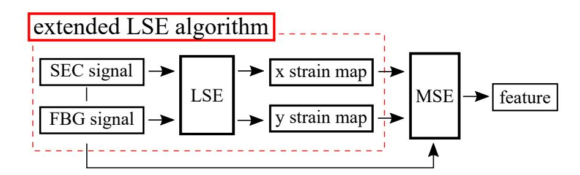

Figure 6.3 Network reconstruction feature (NeRF) algorithm.

Generally, undamaged structural components will result in strain fields with relatively simple topologies that can be estimated with low-order shape functions. Adding damages into the monitored substrate will produce highly curved strain fields that require higher-order shape functions to reconstruct to the same level of reconstruction error. This principle is leveraged in the proposed method for damage detection and localization. The proposed NeRF algorithm monitors a section's reconstruction error (*V*) in response to adding higher order shape functions. As the higher-order terms are added to the shape function, the reconstruction error (*V*) between the estimated and measured state will substantially reduce in the case of damaged sections. Therefore, the condition of a section can be assessed from the changing level of reconstruction error. This technique provides damage detection potential within the monitored area, even at locations that are not directly covered by an SEC. This technique adds versatility to the proposed HDSN for monitoring mesoscale structures such as wind turbine blades, by reducing the number and density of required sensors.

### 6.3.2 Feature Extraction

Starting with *w*(*x*, *y*) = P<sup>2</sup> *i*=1, *j*=1 *bi jx i y j* , the binomial terms listed in Table [6.1](#page-168-0) are shape function components that are added in symmetric pairs from the outside of Pascal's triangle and progressing inwards for a given row. Therefore, value for feature No. 1 becomes the difference in reconstruction error, *V*, between the baseline shape function *w*(*x*, *y*) = P<sup>2</sup> *i*=1, *j*=1 *bi jx i y j* and the baseline shape function with term No. 1 added *w*(*x*, *y*) = P<sup>2</sup> *i*=1, *j*=1 *bi jx i y <sup>j</sup>* + *x* <sup>3</sup> + *y* 3 . Similarly, feature No. 2 becomes the difference between *w*(*x*, *y*) = P<sup>2</sup> *i*=1, *j*=1 *bi jx i y <sup>j</sup>* + *x* <sup>3</sup> + *y* 3 and *w*(*x*, *y*) = P<sup>2</sup> *i*=1, *j*=1 *bi jx i y j*+

{168}------------------------------------------------

<span id="page-168-0"></span>*x* <sup>3</sup> + *y* <sup>3</sup> + *x* 2 *y* + *xy*<sup>2</sup> , and so forth. Note that no displacement-defined boundary conditions are enforced into the shape functions. Instead, all boundary conditions are enforced into strain topography through the use of the uni-directional FBG sensors. The development of features from each HDSN section provides a high level of data compression from the fusion of all sensor signals S into a single feature-based scalar.

Table 6.1 Polynominal complexities used for condition assessment features.

| No. |   | term added | No. |   | term added |
|-----|---|------------|-----|---|------------|
| 1   | x |            |     |   |            |
|     |   | , y        |     |   |            |
|     |   | 3          | 8   | x |            |
|     |   |            |     |   | , x y y    |
| 2   | x |            |     |   |            |
|     |   | y , xy 2   | 9   | x |            |
|     |   |            |     |   | , y        |
| 3   | x |            |     |   |            |
|     |   | , y        |     |   |            |
|     |   | 4          | 10  | x |            |
|     |   |            |     |   | y , xy 5   |
| 4   | x |            |     |   |            |
|     |   | y , xy 3   | 11  | x |            |
|     |   |            |     |   | , y        |
| 5   | x |            |     |   |            |
|     |   | 2          | 12  | x |            |
|     |   | y          |     |   | y , xy 6   |
| 6   | x |            |     |   |            |
|     |   | , y        |     |   |            |
|     |   | 5          | 13  | x |            |
|     |   |            |     |   | , x y y    |
| 7   | x |            |     |   |            |
|     |   | y , xy 4   | 14  | x |            |
|     |   |            |     |   | , x y y    |

# 6.4 Numerical Models

Table 6.2 HDSN and FEA configurations.

|                           | Model 1 (rectangle) | Model 2 (blade)     |
|---------------------------|---------------------|---------------------|
|                           | model 1             | model 2             |
| HDSN sections             | 9                   | 13                  |
| SECs                      | 126                 | 194                 |
| SEC size                  | 120 cm <sup>2</sup> | 120 cm <sup>2</sup> |
| FBG points                | 104                 | 249                 |
| FBG points (x)            | 52                  | 141                 |
| FBG points (y)            | 52                  | 108                 |
| FEA elements              | shell               | shell               |
| No. of elements           | 25372               | 52590               |
| No. of integration points | 9                   | 9                   |
| Young's Moduli            | 20 GPa              | 20 GPa              |
| density                   | 2 kg/mL             | 2 kg/mL             |
| loading                   | 45 kN/m             | 1 kN/m <sup>2</sup> |
| thickness                 | 7 mm                | 40 mm               |

The proposed NeRF algorithm is validated on two different numerical models intended as a preliminary validation to demonstrate the concept of the proposed algorithm. In this regards, it is worth commenting that real wind turbine 

{169}------------------------------------------------

blades are complex composite layups, representing highly optimized structures with complicated aerodynamic shapes Wang et al. (2016); Malcolm and Hansen (2002), under highly varying loading conditions and exhibiting various failure conditions Kong et al. (2005); Rumsey and Paquette (2008). Therefore, the selected models are to demonstrate the theory associated with the proposed algorithm and should not be considered as accurate representations of a fullscale wind turbine blade. The conclusive validation of the proposed algorithm would therefore require experimental or field tests that go beyond the purposes of this work.

For each presented model, the HDSN sections are constructed similarly to the configuration illustrated in Fig. [6.1,](#page-163-0) where networks of SEC sections are divided by FBG sensors measuring either <sup>ε</sup>*<sup>x</sup>* or <sup>ε</sup>*y*. SECs are placed on an offset grid to allow for more complete coverage, and to introduce some complexity into H *<sup>T</sup>*H following preliminary results suggesting that this configuration may increase the HDSN's ability to detect damage that is not directly monitored by an SEC. Sensors are positioned with a slight randomness of ±2cm to account for simulated error in placement and to add a small amount of non-uniformity to the HDSN sections to better approximate an installed condition. FBG's are placed along the *x* and *y* axes with a small gap around the edge to reproduce a realistic installation. Gaussian noise is introduced into the sensors signals with noise levels of 25 ± µε for the SECs (taken from previous work (Laflamme et al., 2013b)) and ±5 µε for the FBG nodes, representing a typical FBG systems with low-resolution (Majumder et al., 2008).

The first simulated model is a cantilever beam under uniform tensional loading of 45 kN/m, as shown in Fig. [6.6\(](#page-172-0)a). It is used to validate the NeRF algorithm under simple geometry and loading. The HDSN sections are constructed with networks of 14 SECs, as denoted by the number in the bottom right corner of each section, divided by unbroken strands of continuous optical fibers with integrated FBG sensors measuring either <sup>ε</sup>*<sup>x</sup>* or <sup>ε</sup>*y*. Three damage cases are used (illustrated in Fig. [6.6\(](#page-172-0)a) as I, II, and III), each to investigate particular opportunities and limitations of the NeRF: case I) capacity to detect and quantify large damage in an area where the strain field has relatively small curvatures; case II) capacity to detect large damage spanning two HDSN sections; and case III) capacity to detect small damage in an area of relatively complex strain maps. Damage is introduced in the form of composite ply delamination and is represented into the model by a 50% reduction in stiffness for the affected area Rodriguez (2016). A stiffness reduction of 25% was also introduced for damage case I to determine the ability of the NeRF algorithm to quantify the extent of the damage.

The second simulated model is a wind turbine blade simplified as an isotropic cantilever plate (Rumsey and Paquette, 2008) illustrated in Fig. [6.6\(](#page-172-0)b). A uniform pressure load of 1 kN/m<sup>2</sup> is applied onto the top surface of the model. Similarly to the first simulated model, the HDSN sections are constructed with network grids of SECs divided by unbroken strands of continuous FBG sensors. In the case of FBG sensor along the diagonal edge of the blade, 

{170}------------------------------------------------

<span id="page-170-0"></span>the FBG sensors are arranged as shown in the insert of Fig. [6.6\(](#page-172-0)b) to provide alternating <sup>ε</sup>*<sup>x</sup>* or <sup>ε</sup>*<sup>y</sup>* signals along the diagonal. The number of SECs per section is denoted in the lower right corner of each section. This configuration is used to assess two additional opportunities and limitations: case IV) capacity to detect damage present in locations of highly curved strain fields; and case V) capacity to detect damage present in areas of low curvature strain fields relatively close to instances of more complex strain fields. Table [6.2](#page-168-0) lists model-specific data relating to both finite element models and their corresponding HDSN. For both models, a mesh convergence study was performed. The sizes of mesh were selected to ensure that each model had a dense enough meshing to allow each simulated SEC to cover at least six elements.

# 6.5 Results

This section presents and discusses simulation results for the validation of the NeRF algorithm. Feature extraction and quantification for an example damage case is first demonstrated. It is followed by a presentation of data for each damage case, and a discussion of the algorithm's performance at damage localization.

### 6.5.1 NeRF Features

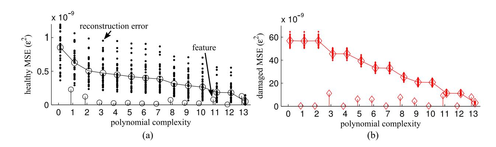

Figure 6.4 Reconstruction error *V* (scatter plot) and extracted corresponding features (stem plot along the bottom) for the HDSN containing damage case I: a) healthy state; b) damage state (damage case I).

Consider the HDSN that contains damage case I. The level of sensor error *V* obtained as a function of the increasing shape function complexity is shown in Fig. 6.4, where values of *V* and its mean are plotted for the healthy case (Fig. 6.4(a)) and for the damage case I (Fig. 6.4(b)). Here, polynomial complexity 0 reports *V*, using the shape func-

{171}------------------------------------------------

<span id="page-171-0"></span>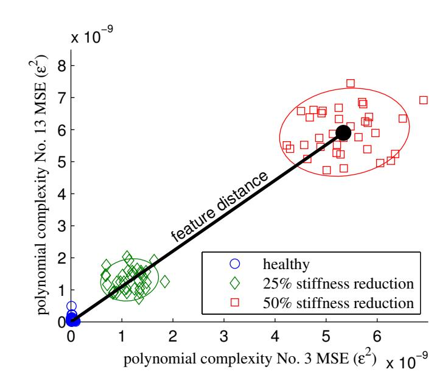

Figure 6.5 Feature distance for complexities terms No. 3 and 13 showing results for varying levels of damage.

tion *w*(*x*, *y*) = P<sup>2</sup> *i*=1, *j*=1 *bi jx i y <sup>j</sup>* with each corresponding term being added sequentially. The corresponding features, quantified as the reduction in error (ε 2 ) between two polynomial complexity terms are presented along the bottom of the plots. Feature numbering is related to the higher order term used in constructing the feature. The scatter for the polynomial complexities is a result of noise introduced into the sensors.

The healthy state, as shown in Fig. [6.4\(](#page-170-0)a), converges after a few added shape function terms, demonstrating that the strain topography can be easily reproduced with a relatively simple shape function. This is demonstrated by the fact that adding more complex terms to the shape function results in only incremental improvements. In comparison, damage case I starts with a considerably higher level of strain error and continuously benefits from adding more complexity to the shape functions. In both cases, the shape function beyond that produced by term No. 13 became overly complex, whereas H *<sup>T</sup>*H becomes non-invertible. Therefore, solving for higher shape function with greater complexity would require additional sensors be added into the HDSN section. As expected, the feature values are greater for the damaged case when compared to the healthy state, providing a means to detect and quantify damage.

### 6.5.2 Damage Quantification

The magnitude of features can be used to quantify different levels of damage as presented in Fig. 6.5. Here, features obtained from adding polynomial complexities terms No. 3 and 13 are used to distinguish varying levels

{172}------------------------------------------------

<span id="page-172-0"></span>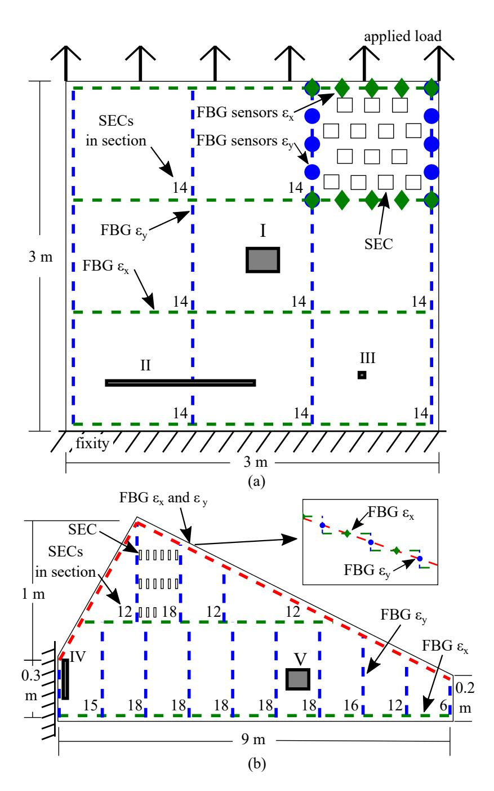

Figure 6.6 HDSNs used in simulation of the NeRF: a) rectangular cantilever plate under tensile loading; and b) wind turbine shaped cantilever plate under pressure loading; insert: routing of FBG over diagonal edge to provide alternating measurements of <sup>ε</sup>*<sup>x</sup>* and <sup>ε</sup>*y*.

{173}------------------------------------------------

<span id="page-173-0"></span>of damage for damage case I. Damage levels in the form of a reduction in stiffness of 25% and 50% for the damaged area are shown. Each feature scatter increases as the damage level increases. This is as expected given that the LSE encounters more variation with the increase in topology complexity. The feature distance can be calculated as any *n*dimensional combination of NeRF. A two-dimensional feature taken from the mean of the distances is shown here for simplicity. A two-dimensional Gaussian distribution confidence interval with amplitude 2σ, where σ is the standard deviation, is plotted over the scatter plot to show the distribution of features.

#### 6.5.3 Damage Localization

Damage localization can be conducted through the spatial comparison of feature values or feature distances taken as the Euclidean distance between the origin and the center of a Gaussian cluster such as that illustrated in Fig. [6.5.](#page-171-0) Results shown in Fig. [6.7](#page-174-0) are taken as the feature distance from the center points of features No. 6, 9, and 11, and the origin. First, the simple cantilever plate under a tension load is considered. Fig. [6.7\(](#page-174-0)a) presents the healthy state of the plate while Fig. [6.7\(](#page-174-0)b-d) present damage cases I to III, respectively. As expected, Fig. [6.7\(](#page-174-0)a) shows that a more complex strain topology is located at the fixity of the plate. These results are to be expected as the fixity will result in more complex local strain fields. The non-symmetric relationship is most likely a result of the slight randomness applied to individual SEC layouts, resulting in non-identical HDSN sections, and of the noise induced into the sensor signals. Damage case I is presented in Fig. [6.7\(](#page-174-0)b). Here, the location of a high strain map reconstruction error *V* is easily detectable as the error caused by the damage case is significantly higher than that present along the fixed edge. This sharp increase in error demonstrates the capability of the NeRF algorithm to distinguish between HDSNs that may be damaged from those that are healthy. This damage case is detectable without the use of historical data or external models.

Damage case II is introduced to test the NeRF algorithm's robustness to multiple damaged sections, here placed across two HDSN sections (illustrated in Fig. [6.6\(](#page-172-0)a)). The feature distance results, presented in Fig. [6.7\(](#page-174-0)c) demonstrate that the algorithm is capable of detecting damage in both HDSN sections. These results provide evidence that the NeRF algorithm is robust in terms damage detection across multiple HDSN sections, allowing greater flexibility in terms of HDSN layout.

Damage case III is used to study the algorithm's capability to detect a small damage not directly measured by any SEC sensor, as shown in Fig. [6.8\(](#page-175-0)a). Damage case III consists of a 50% reduction in stiffness for a 0.2% area of the HDSN section, positioned between SEC sensors. Feature distances are presented in Fig. [6.7\(](#page-174-0)d). While the magnitude of the feature distance increased by approximately 50%, form 1.95 × 10<sup>−</sup><sup>9</sup> (ε 2 ) for the healthy state to 2.97 × 10<sup>−</sup><sup>9</sup> (ε 2 ) for the damaged state, the assessment of damage is difficult because a complex strain topology is already present in

{174}------------------------------------------------

<span id="page-174-0"></span>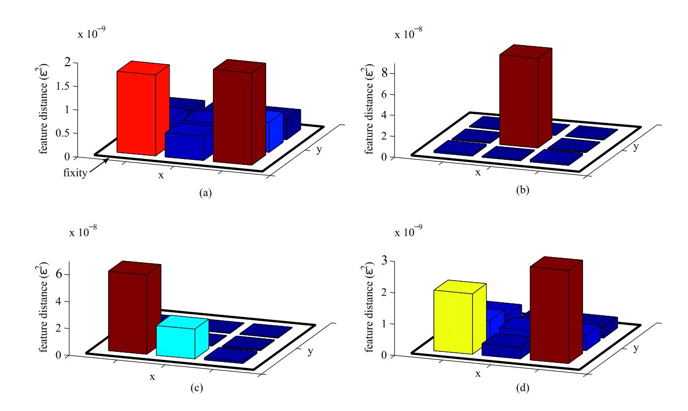

Figure 6.7 Damage detection and localization for the square plate using feature distances: a) healthy case; b) damage case I; c) damage case II; and d) damage case III.

the HDSN section of interest. An alternative is to compare the measured strain with the estimated strain for individual sensors throughout the HDSN.

To do so, the estimated strain for the damaged and undamaged case is obtained using the extended LSE algorithm and a high order shape function encompassing complexity terms 0-11 for the HDSN section of interest. The high complexity shape function, using complexity terms 0-11 was selected to match the highest polynomial complexity term used in building the damage feature distance and is capable of developing accurately reconstructed strain maps for the HDSN section. Fig. [6.8\(](#page-175-0)b) shows the absolute error between the additive SEC sensor signal and the reconstructed strain maps for both the healthy and damaged states. Note that for the healthy case, the error is relatively small for all SEC sensors. When damage is introduced into the HDSN section the mean error of the section increases. The damage can easily be localized as close to SEC No. 6 due to the high strain difference between the estimated and measured strain of 98 µε. Sensors No. 5 and 6 also show a large error value for the damage case III where sensor No. 6 is higher due to the more complex strain topography in that section of the HDSN. All other SEC error values fall within strain

{175}------------------------------------------------

<span id="page-175-0"></span>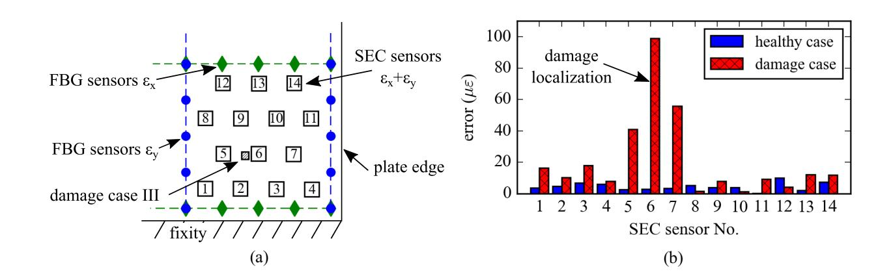

Figure 6.8 Damage localization within an HDSN: a) damage case III and associated HDSN; b) absolute difference (error) between the estimated and measured strain for SECs within the HDSN

difference of 20 µε and therefore fall close to the system's noise band. A reduction in system noise or filtering of sensor signals is required for localizing damage with respect to other sensors (e.g. SEC No. 9 and 2). These findings demonstrate that the NeRF algorithm is capable of detecting and localizing relativity small damage within an HDSN, using only sensor data without any external models or assumptions.

To further investigate the performance of the NeRF algorithm, two additional damage cases are studied on the more complex wind turbine blade model presented in Fig. [6.6\(](#page-172-0)b). Results are presented in Fig. [6.9](#page-176-0) in the same format as for Fig. [6.7,](#page-174-0) using the Euclidean distance computed between the center of feature clusters No. 6, 9 and 11, and the origin. Fig[.6.9\(](#page-176-0)a) presents the healthy state of the wind turbine blade, with highly complex strain topology located at the base (root) of the cantilever plate, as expected. The HDSN section at the root experiences high levels of strain and torsion due to the loading and asymmetric shape of the blade. Damage case IV is introduced into this section and results are illustrated in Fig[.6.9\(](#page-176-0)b). The introduction of damage greatly increases the strain topology of the HDSN, even considering its previous complexity. Results demonstrate that the feature distance increased from 0.62 × 10<sup>−</sup><sup>5</sup> (ε 2 ) to 2.95×10<sup>−</sup><sup>5</sup> (ε 2 ). The increase in feature distance is significant and similar to damage case III in that an external model or historical data would need to be applied to detect damage because of the complex strain topology already present in the HDSN section. However, similar to damage case III the damage can be localized withing the HDSN section of interest as presented in Fig. [6.10.](#page-177-0) Again, Fig. [6.10\(](#page-177-0)a) shows the location of the damage case and Fig. [6.10\(](#page-177-0)b) presents the absolute error in the strain data between the measured state and the reconstructed strain fields for the SEC sensors in the HDSN of interest. For compatibility with results presented before, a shape function using complexity terms 0-11 was used to reconstruct the global strain maps. Here, damage can be localized through comparing error

{176}------------------------------------------------

<span id="page-176-0"></span>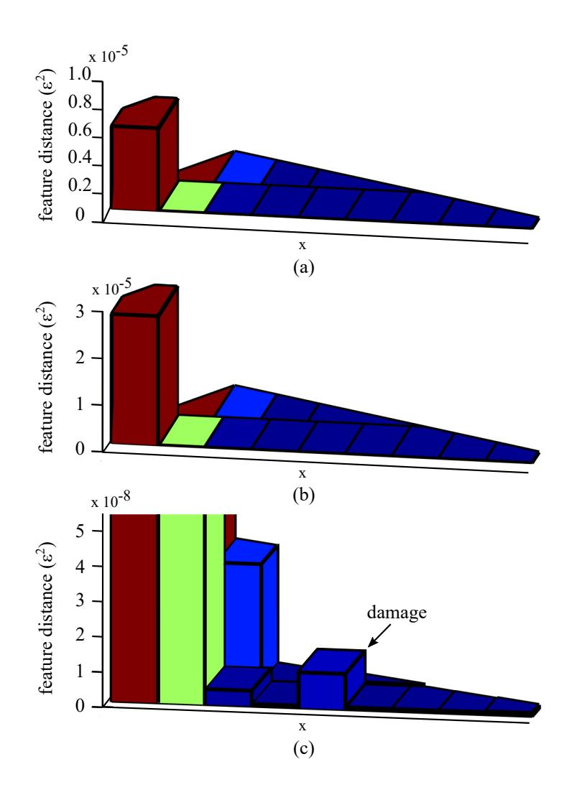

Figure 6.9 Damage detection for wind turbine blade using feature distances: a) healthy case; b) damage case IV; and c) damage case V.

{177}------------------------------------------------

<span id="page-177-0"></span>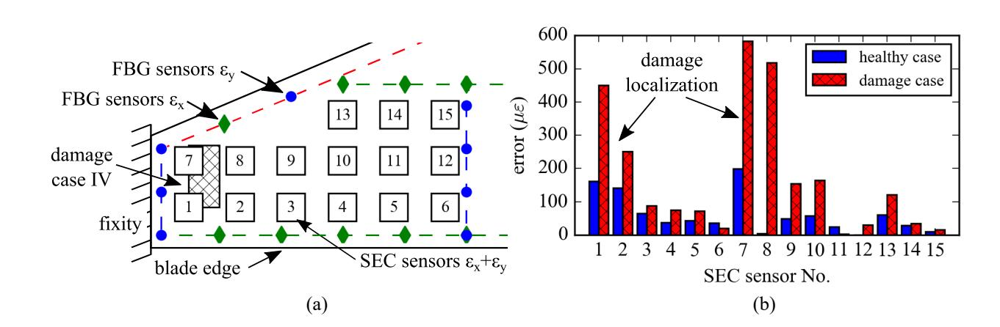

Figure 6.10 Damage localization within an HDSN: a) damage case IV and associated HDSN; b) absolute difference (error) between the estimated and measured strain for SECs within the HDSN

in the damage case for SEC sensors 1,2,7 and 8 to their respective healthy state. These results further strengthen the localization results found for damage case III. In contrast to damage case IV, damage case V presented in Fig[.6.9\(](#page-176-0)c) exhibits a situation where damage is detectable through comparison with neighboring sections.

Simulation results demonstrate that an HDSN using NeRF is capable of damage detection, quantification, and localization. The input load used here is static and similar across cases with only sensor noise being considered. In situations where dynamic loading is relatively constant, such as a wind turbine blade in operation, a set of sample measurement could be taken at a reoccurring interval such as when a blade is in the vertical position providing a semiconstant loading reference. Furthermore, an average of samples taken continuously over several revolutions could be used to build the NeRF features, assuming that the average load is relatively constant over a period of time

Damage detection and localization performance may be improved through the deployment of denser, more complex HDSNs in areas where greater strain topologies are present. NeRF is also capable of providing a high level of data compression in the form of features fused from sections of an HDSN. Take for example the cantilever plate model. The feature distance calculated for each HDSN section is the result of the fusion of 34 individual data channels, when extended to the entire plate algorithm provides a data compression of 246 data points to 9, equivalent to a 96.4% data reduction. The blade model represents similar results, providing data compression from 443 data points to 13, equivalent to a 97.0% reduction. Compression of data allows for faster post-processing, retention of longer historical datasets, and a reduction in the cost associated with building prognostic datasets.

{178}------------------------------------------------

# 6.6 Conclusion

<span id="page-178-0"></span>A computationally efficient, data-driven damage detection, quantification and localization technique was presented for use with hybrid dense sensor networks (HDSN). This method was designed to enable monitoring of mesoscale structures, including wind turbine blades, without associated models or historical datasets. Termed the network reconstruction feature (NeRF), the algorithm allows for the separation of healthy and potentially damaged sections within an HDSN. NeRF fuses high channel count data found in an HDSN to scalar damage detection features. This provides a high level of data compression when implemented over a larger HDSN section. The NeRF algorithm works through first assuming a shape function within an HDSN section and using the least squares estimator (LSE) to approximate uni-directional strain maps within an HDSN section. An error function, defined as the mean square error (MSE) between the sensors' measured and estimated strain is then obtained. Features are defined as the change in error associated with a given increase in the shape function complexity used in the reconstruction of strain maps.

Numerical investigations were conducted to evaluate the performance of NeRF. First, a rectangular cantilever plate was considered, equipped with an HDSN consisting of 126 soft elastomeric capacitors (SEC) and 104 fiber Bragg grating (FBG) nodes, sectioned into nine discrete sections. The NeRF algorithm successfully distinguished between damaged and healthy HDSN sections for all three different damage cases. In the first two damage cases, it was possible to distinguish between healthy and damaged conditions using the Euclidean distance between damage features. The third damage case was difficult to detect by using this strategy because it was highly localized within a region of high strain complexity. Instead, its localization was made possible by comparing the measured strain to the strain estimated using a complex shape function to produce a strain error for each sensor. The damage was then located as being close to the sensors that reported the highest error value. Two additional damage cases were investigated on a more complex shape consisting of a wind turbine blade modeled as a cantilever plate. This second set of simulations confirmed results obtained on the rectangular plate. Lastly, the damage case within the HDSN at the root was localized by comparing the error between the measured strain and the estimated strain. Further collaborating the damage localization results found in the simple plate on a more complex strain topography.

Future investigations are needed to validate the algorithm for use with an extended library of loadings and damage cases, more realistically representing a large wind turbine blade in an operational environment including dynamic loading cases. Sensor network design and partitions, including the number and of SECs within HDSN sections, also needs exploration. The ability of denser networks in regions of highly complex strain maps needs to be studied. This includes the use of asymmetric sensor networks and the inclusion of SECs of different geometries.

{179}------------------------------------------------

<span id="page-179-0"></span>Results presented in this paper show that data compression provided by the NeRF algorithm reduces the computational effort and storage space needed to develop and monitor prognostic datasets for large-scale structures. They also demonstrated the promise of the technology at monitoring large-scale surfaces such as wind turbine blades by leveraging a hybrid sensor network configuration. For example, the HDSN combined with the NeRF algorithm could be used to formulate prognostic datasets to detect changes in structural health over time, reducing wind turbines operational cost through the use of damage mitigation technology and real-time structural health management.

# Acknowledgments

This work is supported by the National Science Foundation Grant No. 1069283, which supports the activities of the Integrative Graduate Education and Research Traineeship (IGERT) in Wind Energy Science, Engineering and Policy (WESEP) at Iowa State University. Their support is gratefully acknowledged.

### 6.7 References

Afanasyeva, S., Saari, J., Kalkofen, M., Partanen, J., and Pyrhonen, O. (2016). Technical, economic and uncertainty ¨ modelling of a wind farm project. *Energy Conversion and Management*, 107:22–33. Borenstein, S. (2012). The private and public economics of renewable electricity generation. *Journal of Economic Perspectives*, 26(1):67–92. Burton, A. R., Kurata, M., Nishino, H., and Lynch, J. P. (2016). Fully integrated patterned carbon nanotube strain sensors on flexible sensing skin substrates for structural health monitoring. In Lynch, J. P., editor, *Sensors and Smart Structures Technologies for Civil, Mechanical, and Aerospace Systems 2016*. SPIE. Celik, A. N. (2003). Energy output estimation for small-scale wind power generators using weibull-representative wind data. *Journal of Wind Engineering and Industrial Aerodynamics*, 91(5):693–707. Chang, N.-K., Su, C.-C., and Chang, S.-H. (2008). Fabrication of single-walled carbon nanotube flexible strain sensors with high sensitivity. *Applied Physics Letters*, 92(6):063501.

{180}------------------------------------------------

Cockerill, T., Kuhn, M., van Bussel, G., Bierbooms, W., and Harrison, R. (2001). Combined technical and eco- ¨ nomic evaluation of the northern european offshore wind resource. *Journal of Wind Engineering and Industrial Aerodynamics*, 89(7-8):689–711. Downey, A., Laflamme, S., and Ubertini, F. (2016). Reconstruction of in-plane strain maps using hybrid dense sensor network composed of sensing skin. *Measurement Science and Technology*, 27(12):124016. Downey, A., Laflamme, S., Ubertini, F., and Sarkar, P. (2017). Experimental damage detection of wind turbine blade using thin film sensor array. Ekelund, T. (2000). Yaw control for reduction of structural dynamic loads in wind turbines. *Journal of Wind Engineering and Industrial Aerodynamics*, 85(3):241–262. Ghoshal, A., Sundaresan, M. J., Schulz, M. J., and Pai, P. F. (2000). Structural health monitoring techniques for wind turbine blades. *Journal of Wind Engineering and Industrial Aerodynamics*, 85(3):309–324. Gross, E., Zadoks, R., Simmermacher, T., and Rumsey, M. (1999). Application of damage detection techniques using wind turbine modal data. In *37th Aerospace Sciences Meeting and Exhibit*. American Institute of Aeronautics and Astronautics. Han, T., Yang, B.-S., Choi, W.-H., and Kim, J.-S. (2006). Fault diagnosis system of induction motors based on neural network and genetic algorithm using stator current signals. *International Journal of Rotating Machinery*, 2006:1–13. Kharroub, S., Laflamme, S., Song, C., Qiao, D., Phares, B., and Li, J. (2015). Smart sensing skin for detection and localization of fatigue cracks. *Smart Materials and Structures*, 24(6):065004. Kong, C., Bang, J., and Sugiyama, Y. (2005). Structural investigation of composite wind turbine blade considering various load cases and fatigue life. *Energy*, 30(11-12):2101–2114. Laflamme, S., Cao, L., Chatzi, E., and Ubertini, F. (2016). Damage detection and localization from dense network of strain sensors. *Shock and Vibration*, 2016:1–13. Laflamme, S., Kollosche, M., Connor, J. J., and Kofod, G. (2013a). Robust flexible capacitive surface sensor for structural health monitoring applications. *Journal of Engineering Mechanics*, 139(7):879–885.

{181}------------------------------------------------

- Laflamme, S., Saleem, H. S., Vasan, B. K., Geiger, R. L., Chen, D., Kessler, M. R., and Rajan, K. (2013b). Soft elastomeric capacitor network for strain sensing over large surfaces. *IEEE*/*ASME Transactions on Mechatronics*, 18(6):1647–1654. Laflamme, S., Ubertini, F., Saleem, H., D'Alessandro, A., Downey, A., Ceylan, H., and Materazzi, A. L. (2015). Dynamic characterization of a soft elastomeric capacitor for structural health monitoring. *Journal of Structural Engineering*, 141(8):04014186. Lee, H.-K., Chang, S.-I., and Yoon, E. (2006). A flexible polymer tactile sensor: Fabrication and modular expandability for large area deployment. *Journal of Microelectromechanical Systems*, 15(6):1681–1686. Mahmood, M. S., Celik-Butler, Z., and Butler, D. P. (2015). Design and fabrication of self-packaged, flexible MEMS accelerometer. In *2015 IEEE SENSORS*. IEEE. Majumder, M., Gangopadhyay, T. K., Chakraborty, A. K., Dasgupta, K., and Bhattacharya, D. (2008). Fibre bragg gratings in structural health monitoring—present status and applications. *Sensors and Actuators A: Physical*, 147(1):150–164. Malcolm, D. and Hansen, A. (2002). Windpact turbine rotor design study. *National Renewable Energy Laboratory, Golden, CO*, 5. Richards, P. W., Griffth, D. T., and Hodges, D. H. (2015). Smart loads management for damaged offshore wind turbine blades. *Wind Engineering*, 39(4):419–436. Rodriguez, G. (2016). *Finite Element Modeling of Delamination Damage in Carbon Fiber Laminates Subject to Low-Velocity Impact and Comparison with Experimental Impact Tests Using Nondestructive Vibrothermography Evaluation*. PhD thesis, California Polytechnic State University, San Luis Obispo. Rogers, J. A., Someya, T., and Huang, Y. (2010). Materials and mechanics for stretchable electronics. *Science*, 327(5973):1603–1607. Rumsey, M. A. and Paquette, J. A. (2008). Structural health monitoring of wind turbine blades. In Ecke, W., Peters,
- K. J., and Meyendorf, N. G., editors, *Smart Sensor Phenomena, Technology, Networks, and Systems 2008*. SPIE. Saleem, H., Downey, A., Laflamme, S., Kollosche, M., and Ubertini, F. (2015). Investigation of dynamic properties of a novel capacitive-based sensing skin for nondestructive testing. *Materials Evaluation*, 73(10):1384–1391.

{182}------------------------------------------------

Schulz, M. J. and Sundaresan, M. J. (2006). *Smart Sensor System for Structural Condition Monitoring of Wind Turbines: May 30, 2002-April 30, 2006*. National Renewable Energy Laboratory. Sohn, H., Farrar, C. R., Hemez, F. M., Shunk, D. D., Stinemates, D. W., Nadler, B. R., and Czarnecki, J. J. (2003). A review of structural health monitoring literature: 1996–2001. *Los Alamos National Laboratory, USA*. VanderMeer, J. B. and Mueller-Stoffels, M. (2014). *Wind-Geothermal-Diesel Hybrid Micro-Grid Development: A Technical Assessment for Nome, AK*. PhD thesis, M. Sc. Thesis, University of Oldenburg. Wang, L., Quant, R., and Kolios, A. (2016). Fluid structure interaction modelling of horizontal-axis wind turbine blades based on CFD and FEA. *Journal of Wind Engineering and Industrial Aerodynamics*, 158:11–25. Xu, Y., Jiang, F., Newbern, S., Huang, A., Ho, C.-M., and Tai, Y.-C. (2003). Flexible shear-stress sensor skin and its application to unmanned aerial vehicles. *Sensors and Actuators A: Physical*, 105(3):321–329. Yao, Y. and Glisic, B. (2015). Detection of steel fatigue cracks with strain sensing sheets based on large area electronics. *Sensors*, 15(4):8088–8108. Zou, Y., Tong, L., and Steven, G. P. (2000). Vibration-based model-dependent damage (delamination) identification and health monitoring for composite structures-a review. *Journal of Sound and Vibration*, 230(2):357–378.

{183}------------------------------------------------

# <span id="page-183-0"></span>CHAPTER 7. INCIPIENT DAMAGE DETECTION FOR LARGE AREA STRUCTURES MONITORED WITH A NETWORK OF SOFT ELASTOMERIC CAPACITORS USING RELATIVE ENTROPY

Austin Downey1,<sup>2</sup> , Mohammadkazem Sadoughi<sup>1</sup> , Simon Laflamme2,<sup>3</sup> and Chao Hu1,<sup>3</sup>

# Abstract

Structural health monitoring of mesoscale structures is difficult due to their large sizes and often complex geometries. A solution to this challenge lies in the development of sensing skins. Sensing skins are an emerging technology that enables a broad range of sensors and their associated electronics to be integrated onto a single sheet, therefore reducing the cost and complexity associated with deploying these dense sensor networks onto mesoscale structures. This paper presents a new algorithm for the detection and localization of incipient damage in mesoscale structures. The algorithm is specialized for a sensing skin consisting of a large area electronic termed soft elastomeric capacitor. The proposed algorithm utilizes relative entropy to quantify the dissimilarity between one sensor and every other sensors in the network, with more weight placed on the dissimilarities between the sensor of interest and those in its immediate vicinity. The algorithm is data-driven and does not require the healthy condition be known or historical data sets be available to generate damage sensitive indexes. Numerical simulations are used to demonstrate the effectiveness of the data-driven algorithm in both detecting and localizing incipient damage.

Keywords: structural health monitoring, sensing skin, soft elastomeric capacitor, additive strain maps, full-field strain maps, sensor fusion.

<sup>1</sup> Department of Mechanical Engineering, Iowa State University, Ames, IA, USA

<sup>2</sup> Department of Civil, Construction, and Environmental Engineering, Iowa State University, Ames, IA, USA

<sup>3</sup> Department of Electrical and Computer Engineering, Iowa State University, Ames, IA, USA

{184}------------------------------------------------

# 7.1 Introduction

<span id="page-184-0"></span>Localization of damage on mesoscale structural systems, which include full-scale civil, aerospace, and energy structures, is a challenging task, but one that provides real economic incentives arising from the premise of conditionbased maintenance (Giurgiutiu et al., 2004; Lynch et al., 2016). To date, various approaches to damage detection, localization, and quantification on mesoscale structures have been proposed. These approaches can generally be classified into either indirect or direct sensing methods. Indirect sensing of structural systems typically focuses on the vibration monitoring of the systems where damage is localized through the use of sophisticated data analysis or model-assisted damage detection (Cavalagli et al., 2017). While vibration monitoring is capable of detecting damage in mesoscale structures using a limited number of sensors, the localization of damage is an arduous task. In contrast to the indirect sensing approaches, direct sensing approaches function through the direct measurements of a structure using discrete, often strain transducing sensors (Perry et al., 2017). Distributed dense sensor networks (DSNs) can be deployed for direct damage sensing of large surfaces. While the use of DSNs offers excellent damage localization capabilities, the technical (e.g., signal cross-talk and wire management) and economic (e.g., insulation and data processing costs) trade-offs make deploying a high number of traditional, individually mounted sensors challenging (Rumsey and Paquette, 2008). In the case where damage of sufficient magnitude forms directly under a sensor, this damage (Loyola et al., 2013) is often detectable using simple threshold style algorithms (Lynch et al., 2004). However, the detection of incipient damage (early stage damage of low magnitude) is more complex as its signature contained in the sensor signal is weak and concealed by sensor noise. Data-driven techniques based on statistical methods have been used to detect incipient damage in various engineered systems (Harmouche et al., 2016; Rahman et al., 2009; Frosini et al., 2015).

One solution to the deployment of DSNs is enabled by recent advances in sensor technologies that allow for all the required sensors, electronics, and communications to be mounted onto a single flexible substrate, creating a sensing skin (Khan et al., 2015; Glisic et al., 2016; Ahmed et al., 2012; Park et al., 2012). These sensing skins, also termed sensing sheets or electronic artificial skins, mimic biological skin in that they are capable of detecting and localizing damage over the structure's global area. In this work, a previously proposed sensing skin consisting of a network of large area sensors, termed soft elastomeric capacitor (SEC), is used as the sensing skin (Laflamme et al., 2013). The SEC is a low cost and robust large area sensor that transduces a change in a structure's geometry into a measurable change in capacitance. The detection of damage within the area monitored by the SEC-based sensing skin has been investigated both numerically and experimentally through various approaches. These include the spatiotemporal comparison of sensor responses (Kong et al., 2017) and the monitoring of changes in full-field strain maps 

{185}------------------------------------------------

<span id="page-185-0"></span>(Downey et al., 2017). In this paper, we propose an algorithm termed spatial damage index (SDI) that leverages the network configuration of the SEC-based sensing skin in combination with the kriging interpolation method to generate spatial damage maps that provide improved damage detection capabilities over existing gradient-based spatial damage detection methods. Kriging is utilized to generate full-field strain maps that contain both the expected value and its variance at each point of interest within the monitored area.

The proposed SDI algorithm utilizes the relative entropy between two probability density functions (PDFs) to quantify the dissimilarity between the signal of one sensor and that of every other sensor in the network, with more weight placed on the dissimilarities between the sensor of interest and those in its immediate neighborhood. The use of relative entropy, often based on the Kullback-Leibler divergence (KLD), has been shown to improve the detection of incipient damage over the monitoring of changes in signals (e.g. shifts in signal means or variances) directly (Zeng et al., 2014). KLD has found uses for crack detection in a nickel-based alloy plate (Harmouche et al., 2016), anomaly detection in electric motors (Giantomassi et al., 2015), and fault detection in composite wing structures (Nichols et al., 2006). SDI provides a spatially distributed damage index that is obtained directly from the data (i.e., data-driven) without the use of black boxes or historical data sets. SDI calculates a damage sensitive index for any given location in the monitored section of a structure by taking the L1-norm of multiple KLD values. Each of these KLD values is obtained by comparing the PDF of the kriging estimated strain value at the point of interest with that at the same point when one SEC is removed from the training set. SDI creates a full-field map of damage sensitive indexes by recursively solving for each KLD value at all the points of interests. These damage sensitive indexes can be interpreted as damage when compared to the proper baseline (i.e. healthy condition) (Worden et al., 2007). This work presents a numerical investigation of the SDI algorithm for incipient damage on a reinforced concrete beam.

### 7.2 Background

This section provides a review of the SEC sensor and the SEC-based sensing skin, followed by an overview of kriging.

#### 7.2.1 SEC-based sensing skin

The SEC-based sensing skin is based on a network of densely deployed SECs. The SEC is a low-cost, robust, and highly scalable thin-film strain sensor that consists of a parallel plate capacitor. For a given change in a monitored structure's geometry of (i.e., strain), the SEC transduces a measurable change in its capacitance. An SEC, presented in figure [7.1\(](#page-186-0)a) with its key components annotated, is constituted from an SEBS block co-polymer arranged in three

{186}------------------------------------------------

<span id="page-186-0"></span>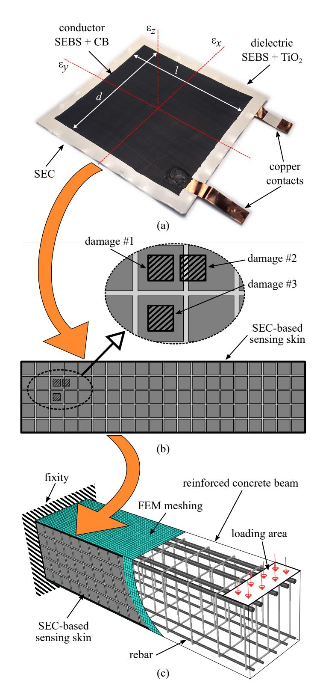

Figure 7.1 SEC-based sensing skin for the monitoring of mesoscale structures showing the: (a) SEC sensor with key components and axes annotated; (b) layout of the SEC-based sensing skin used in this study including the 3 damage cases investigated; (c) SEC-based sensing skin deployed onto the side of a reinforced cantilever concrete beam

{187}------------------------------------------------

Table 7.1 Loading and damage cases used in the numerical simulations.

<span id="page-187-0"></span>

| loading (kNs)         | 735  | 1114 | 1493 | 1872 | 2250 | 2629 | 3008 | 3387 | 3766 | 4145 | 4525  | 4903  |
|-----------------------|------|------|------|------|------|------|------|------|------|------|-------|-------|
| damage (Δ%)           | -65  | -68  | -74  | -77  | -70  | -80  | -83  | -85  | -88  | -91  | -94   | -97   |
| signal to noise ratio | 1.36 | 1.83 | 2.37 | 3.01 | 3.78 | 4.66 | 5.63 | 6.69 | 7.81 | 8.98 | 10.21 | 11.49 |

layers where the inner layer (dielectric) is filled with TiO<sup>2</sup> to increase both its durability and permittivity while the outer layers (conductors) are doped with carbon black to both provide conductive pathways and increase the sensor's resiliency to weathering. Manufacturing of the SEC is covered in more detail in ref. (Laflamme et al., 2013). A model that relates the sensor's capacitance (*C*) to change in the monitored structure geometry (i.e. strain) can be derived from the parallel plate capacitor equation:

$$C = e_0 e_r \frac{A}{h} \quad (7.1)$$

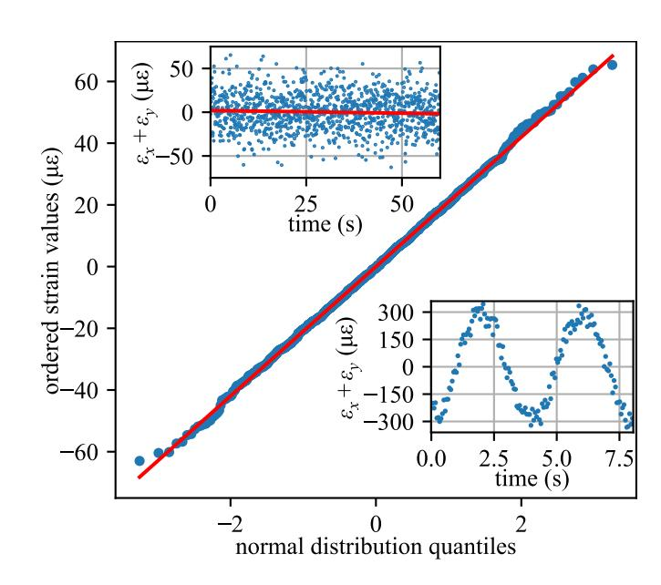

Figure 7.2 Q-Q plot of SEC sensor signal compared to a normal distribution along with the static temporal data from which this data was taken (upper inset) and the sensor's response to a sinusoidal load (lower inset).

where *e*<sup>0</sup> = 8.854 pF/m is the vacuum permittivity, *e<sup>r</sup>* is the polymer's relative permittivity, *A* = *d* · *l* is the sensor area of width *d* and length *l* (as annotated in Figure [7.1\(](#page-186-0)a)), and *h* is the thickness of the dielectric. Assuming small strains 

{188}------------------------------------------------

<span id="page-188-0"></span>in the substrate and a plane stress condition in the sensor, equation [\(7.1\)](#page-187-0) can be written as a change in capacitance (∆*C*):

$$\frac{\Delta C}{C} = \lambda(\varepsilon_x + \varepsilon_y) \quad (7.2)$$

where ν is the sensor material's Poisson's ratio taken as ν ≈ 0.49 (Wilkinson et al., 2004), with λ = 1/(1 − ν) ≈ 2 representing the gauge factor of the sensor. A key advantage of the SEC is its capability to measure the additive strain of a structure, as shown in equation (7.2). Previously reported experimental data for an SEC is presented in figure [7.2.](#page-187-0) The main figure consists of a quantile-quantile (Q-Q) plot demonstrating that the noise of an SEC signal can be effectively estimated by a normal distribution with a standard deviation of σ = 32 µε. The upper inset shows the static signal from which this data was extracted, while the lower inset shows a sensor response for the SEC under a dynamic load. More details regarding the quantification of SEC noise can be found in (Downey et al., 2018).

Figure [7.1\(](#page-186-0)b) presents an SEC-based sensing skin, consisting of a network of densely deployed SECs mounted onto the surface of a structure, as shown in figure [7.1\(](#page-186-0)c). A fully realized SEC-based sensing skin would consist of a flexible substrate (e.g. Kapton) with all the required electronics for power management, data acquisition, and communications, embedded onto the substrate. For more detail on the proposed sensing skin, the interested reader is referred to ref. (Downey et al., 2017). To further leverage the network of SECs, the geometry of an SEC can fused into the strain signal using the previously proposed technique presented in ref. (Downey et al., 2018).

### 7.2.2 Universal Kriging

Kriging is a method of spatial interpolation for which the interpolated values are modeled by a Gaussian process (Kitanidis, 1997). Importantly for this work, kriging provides both an interpolated value at any location within the spatial grid and its associated confidence interval that represent the uncertainty of the interpolation. Kriging predicts the value of a function at a point of interest by computing a spatially weighted average of the training points in the neighborhood. The function under consideration can be modeled as Z(*x*) = µ(*x*) + (*x*), where Z(*x*) is the real value at location *x* and µ(*x*) is the expected constant mean value of the process and (*x*) denotes the small-scale spatial variation in the process. However, in situations where the mean value of the function varies smoothly, as it is generally the case with strain fields, universal kriging (UK) is preferred (Hengl et al., 2004). A kriging estimated value at the point of interest, ˆ*z*(*x*0), can be expressed as the sum of the drift drifting mean value ( ˆ*m*) plus the residual (ˆ*e*):

$$\hat{z}(x_0) = \hat{m}(x_0) + \hat{e}(x_0) \quad (7.3)$$

{189}------------------------------------------------

<span id="page-189-0"></span>where the drift term ˆ*m* is fit onto an assumed trend term using linear regression. This work utilizes the regional linear drift trend to estimate the mean value at *x*0, however other terms including linear, polynomial, and point logarithmic (Tonkin and Larson, 2002) could also be used. Equation [7.3](#page-188-0) can be written in a matrix notation:

$$\hat{z}(x_0) = \mathbf{q}_0^T \cdot \hat{\mathbf{b}} + \boldsymbol{\lambda}_0^T \cdot \mathbf{e} \quad (7.4)$$

where q<sup>0</sup> is a vector of the predictors at *x*0, βˆ is a vector that contains the estimated drift term coefficients, λ<sup>0</sup> is a vector of kriging weights determined by the covariance function, and e is a vector that contains all the regression residuals. The covariance matrix (C) is estimated using the power variogram model expressed as *s* · *d* <sup>α</sup> + *n*, where *s* is a scaling factor, α is the exponent (between 1 and 1.99), and *n* is the nugget term that effectively takes up "noise" in the measurement (Kitanidis, 1997). The variance of the kriging estimate at the point of interest can then be calculated by:

$$\begin{aligned} \sigma^2(x_0) &= n - \mathbf{c}_0^T \cdot \mathbf{C}^{-1} \cdot \mathbf{c}_0 + (\mathbf{q}_0 - \mathbf{q}^T \cdot \mathbf{C}^{-1} \cdot \mathbf{c}_0)^T \\ &\cdot (\mathbf{q}^T \cdot \mathbf{C}^{-1} \cdot \mathbf{q})^{-1} \cdot (\mathbf{q}_0 - \mathbf{q}^T \cdot \mathbf{C}^{-1} \cdot \mathbf{c}_0) \end{aligned} \quad (7.5)$$

where c<sup>0</sup> is a vector consisting of the residuals between the points of interests and the known data points. UK can create a near continuous interpolation of a sampled process, given that various points of interest are sampled with sufficient density. This work utilized PyKrige for the development and solving of the UK interpolation models (rth et al., 2018), itself based on the work found in ref. (Kitanidis, 1997).

### 7.2.3 Kullback-Leibler divergence

The Kullback-Leibler divergence (also called relative entropy) is a method for quantifying the dissimilarity between two PDFs (Harmouche et al., 2016). For distributions *P* and *Q* of two continuous random variables, with the respective densities denoted as *p* and *q*, the KLD is defined to be the integral

$$D_{\text{KL}}(P||Q) = \int_{-\infty}^{\infty} p(x) \cdot \log \frac{p(x)}{q(x)} dx \quad (7.6)$$

However, when dealing with two Gaussian distributions, as generated by equations 7.4 and 7.5, the KLD of the Gaussian distributions (*P* and *Q*) can be represented by their respective means and variances (µ*p*, <sup>σ</sup>*p*, <sup>µ</sup>*<sup>q</sup>* and <sup>σ</sup>*q*). Correspondingly, equation 7.6 becomes:

$$D_{\text{KL}}(P || \mathcal{Q}) = \log\left(\frac{\sigma_q}{\sigma_p} + \frac{\sigma_p^2 + (\mu_p - \mu_q)^2}{2\sigma_q^2} - \frac{1}{2}\right) \quad (7.7)$$

{190}------------------------------------------------

# 7.3 Methodology

<span id="page-190-0"></span>This section first introduces the proposed algorithm and then discusses the numerical validation procedure used in this work.

#### 7.3.1 SDI algorithm

This work proposes the novel SDI algorithm for the creation of full-field damage indicator maps. The SDI algorithm generates these damage indicator maps through a systematic approach that progressively calculates the KLD between a kriging interpolated model developed using all sensors in the sensing skin and a model developed with one sensor removed from the training set used to build the kriging model. Let us consider an SEC-based sensing skin with *n* sensors. SDI starts by first calculating the probability distribution *P* characterized with <sup>µ</sup>*<sup>p</sup>* and <sup>σ</sup>*<sup>p</sup>* from equations [7.4](#page-189-0) and [7.5](#page-189-0) for the training set that considers all *n* SECs. Thereafter, *n* different *Q* probability distributions are calculated for each of the points of interest. Each *Q* probability distribution is developed from a training set consisting of *n* − 1 SECs where the removed SEC is changed for each successive calculation. The distribution *Q* is also represented by its mean and variance values (µ*<sup>q</sup>* and <sup>σ</sup>*q*) as calculated using equations [7.4](#page-189-0) and [7.5.](#page-189-0) After, the KLD for each point of interest is calculated between *P* and *Q* using equation [7.7.](#page-189-0) Figure [7.3](#page-191-0) demonstrates how the KLD increases between *P* and the respective *Q* at the points of interest around the damage when an SEC is removed close to or exactly above damage. Next, the SDI algorithm calculates the L1-norm of the *n* KLDs at each spatial point of interest. Lastly, the L1-norm lengths are plotted to generate the spatially distributed damage sensitive indexes. To summarize, the SDI algorithm follows a direct six step process:.

- 1. Strain measurements are obtained from each SEC.
- 2. A full-field strain map of *P* is developed by using all *n* sensors to train the kriging model.
- 3. *n* full-field strain maps of *Q* are generated where each strain map is generated by ignoring one of the SECs.
- 4. For each point of interest, *n* KLDs are generated between *P* and the *n* unique *Q*s.
- 5. The length (L1-norm) of the KLDs is obtained for each location of interest.
- 6. The L1-norm lengths are plotted to generate the spatially distributed damage sensitive indexes.

{191}------------------------------------------------

<span id="page-191-0"></span>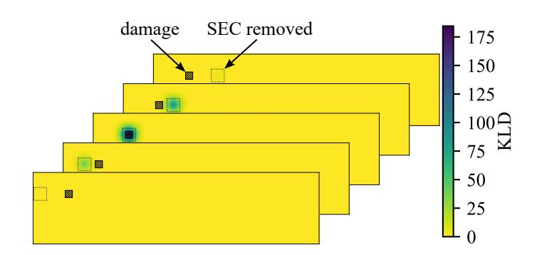

Figure 7.3 Full-field KLDs for five different *Q*s, each with a different SEC removed from the kriging training set, showing KLDs increases in the presence of strain map anomalies (e.g. damage).

#### 7.3.2 Numerical validation

The numerical model used for the simulations is presented in figure [7.1\(](#page-186-0)c). It consists of a 2 × 0.5 × 0.5 meter reinforced cantilever concrete beam loaded at its tip. The beam was constructed in Abaqus using 72,306 eight-node brick elements with reduced integration (Hibbit et al., 2007), The FEA meshing is visible in figure [7.1\(](#page-186-0)c). The loading cases considered are such that the beam remains linear. Three damage locations are used in this work and are presented in the subset of figure [7.1\(](#page-186-0)b). These damage locations, each introduced into the FEA model as a reduction in the concrete's stiffness, protrude all the way through the beam. Damage cases were selected to investigate damage that forms directly under a sensor (damage location #1), under two sensors (damage location #2), and close to the neutral axis of the beam where strain levels are lower (damage location #3). The SEC data is obtained by taking the average additive strain under each sensor, applying noise from a normal distribution (σ = 32 µε), and fusing the sensor geometry into the strain signals.

For each damage location, 156 different combinations of damage and loading cases were considered. These combinations were constituted by pairing each of the 12 damage cases with each of the 12 loading cases (plus one healthy case). These results are first presented as damage index maps for a few selected loading/damage case combinations. The loading levels and damage levels, introduced as relative changes ∆% of the concrete stiffness value in the damage area, are presented in table [7.1.](#page-187-0) The damage detection maps obtained by the SDI algorithm are compared to those obtained by second-order Laplace and Gaussian filters to show the enhanced capabilities of SDI over these accepted techniques. A grid measuring 100 × 400 for the points of interest was solved for by SDI.

Subsequently, the metrics for the detection and localization of damage are considered. The damage is considered to be properly detected and localized if the maximum L1 length of the damage is both at the location of the damage and higher than any L1 distance calculated using the healthy beam case. The use of this threshold index eliminates the 

{192}------------------------------------------------

<span id="page-192-0"></span>possibility of false positives (i.e. damage that is correctly localized but only as a function of the signal noise). In the case of localization, the damage is considered to be correctly localized if the max damage index obtained by the SDI algorithm is within 0.05 meters from the damage. Calculations for the probability of detection (POD) for each of the loading/damage cases is achieved by generating 50 noise cases for each loading case and dividing the number of noise cases where the damage is correctly detected and localized by the total number of noise cases.

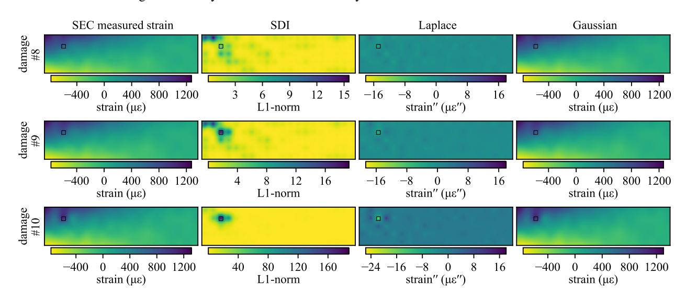

Figure 7.4 Numerical validation of the SDI algorithm for damage location #1 under loading case #12 showing (by column) the SEC measured strain maps, the SDI generated damage indexes, the Laplace transformation, and the Gaussian transformation for three different damage cases.

# 7.4 Results

The spatially distributed damage sensitive indexes generated using the SDI algorithm are presented in figures 7.4- [7.6.](#page-194-0) These figures report the SEC-measured strain values on the leftmost column and the results by the SDI algorithm on the center-left column. Additionally, the results for the gradient-based image filtering techniques (Laplace and Gaussian transformations) are reported in the center-right and rightmost columns. Figure 7.4, reporting the results for damage location #1, shows that, for lower damage cases (i.e. damage cases #1-8) under this loading condition, the SDI algorithm tends to identify damage along the top edge of the beam where the strain values are the greatest. However, when the damage level increases to damage case #9, the SDI algorithm correctly localizes the incipient damage. This damage case is not notably detectable thourhg the direct inspection of the measured strain map, the Laplace transformation, or the Gaussian transformation. Increasing the severity of damage to case # 10, the SDI

{193}------------------------------------------------

<span id="page-193-0"></span>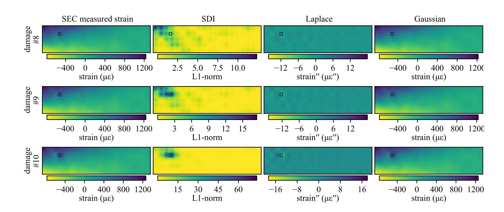

Figure 7.5 Numerical validation of the SDI algorithm for damage location #2 under loading case #12 showing (by column) the SEC measured strain maps, the SDI generated damage indexes, the Laplace transformation, and the Gaussian transformation for three different damage cases.

algorithm detects the damage. While the Laplace transformation can also detect damage at this stage, results are much less evident than those from the SDI algorithm. Furthermore, damage detection from the strain map or Gaussian transformation is still uncertain and would require further signal post-processing.

Figure 7.5 report the results produced by the SDI algorithm for a damage (location #2) that sits in between the two SEC sensors. As observed in figure [7.4,](#page-192-0) for low levels of damage the SDI algorithm tends to localize damage in the areas of high strain. However, as the damage increases in severity, the algorithm is able to correctly detect and locate the damage. In comparison to damage location #1, damage location #2 has considerably more spread in its estimated damage location. This is attributed to the damage not being completely covered by a single sensor, but rather directly affecting two sensors as seen in figure [7.1\(](#page-186-0)b). Similar to the results for damage location #1, the SDI algorithm outperforms both the Laplace and Gaussian transformations in all cases. While the Laplace transformation was able to detect and localize the damage in damage case #10, results are also less evident than those from the SDI algorithm. Lastly, damage location #3 is considered in figure 7.5. This damage, located near the neutral axis of the beam, sees significantly less strain and therefore lower signals at the location of the damage. However, the damage can still be correctly located by the SDI algorithm, given that the damage is severe enough. As before, the SDI algorithm outperform both the Laplace and Gaussian transformations.

The peak L1-norms for three damage cases are presented in figure [7.7](#page-195-0) for loading case #12 under damage location #1. The left-hand side of the subfigures reports the peak damage indexes for the healthy condition. Considering the

{194}------------------------------------------------

<span id="page-194-0"></span>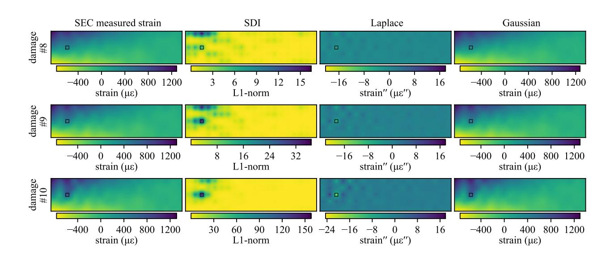

Figure 7.6 Numerical validation of the SDI algorithm for damage location #3 under loading case #12 showing (by column) the SEC measured strain maps, the SDI generated damage indexes, the Laplace transformation, and the Gaussian transformation for three different damage cases.

maximum healthy value as the threshold for damage detection, the right-hand side of figures (a)-(c) presents the max L1-norm distance of the damage cases #7, #9, and #10. Figure [7.7\(](#page-195-0)a) presents a condition that only correctly localizes the damage 7 out of 50 times, however, this case does not generate any L1-norm distances greater than that generated by the healthy data and as such does not correctly identify any damage, resulting in a POD of 0. In comparison, figure [7.7\(](#page-195-0)b) correctly localizes the damage for every noise case considered. However, due to the relatively high level of noise in the SECs, only 16 cases fall above the minimum threshold set by the healthy condition and a POD of 0.32 is obtained. An example of this situation can be seen in figure [7.4](#page-192-0) for damage case #9 where the maximum L1 distance correctly locates the damage. However, this value (17.5) falls below the max value obtained from the 50 samples of the healthy state. Lastly, figure [7.7\(](#page-195-0)c) shows a case in which the damage is correctly detected for every noise case, resulting in a POD of 1. Figure [7.8](#page-196-0) reports the POD values for each of the loading/damage case combinations. Generally, given a severe enough damage and sufficient loading force, the SDI algorithm is shown to be capable of accurately and repeatably detecting and localizing damage within the area monitored by the sensing skin. The reduction in the POD for the relatively low damage cases with an increase in the applied loading forces is a result of increasing strain values along the top of the beam, as discussed before and shown in figures [7.4-](#page-192-0)7.6.

{195}------------------------------------------------

<span id="page-195-0"></span>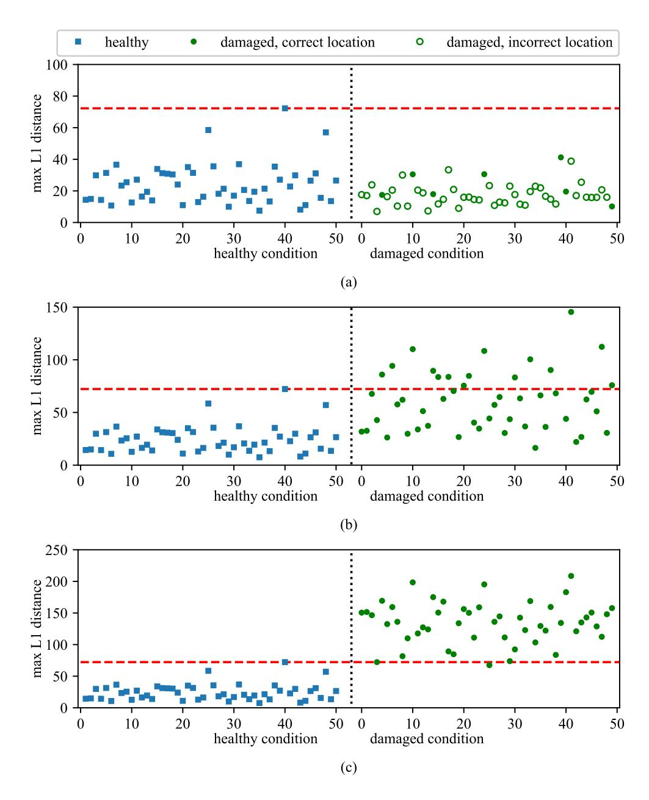

Figure 7.7 Max damage index values showing the relationship between the healthy and damage values, including damaged values correctly/incorrectly localize the damage, for loading case #12 under damage case: (a) #7; (b) #9; and (c) #10

{196}------------------------------------------------

<span id="page-196-0"></span>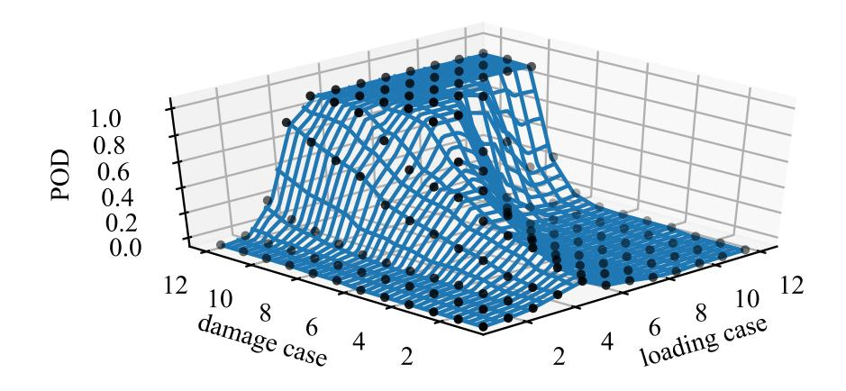

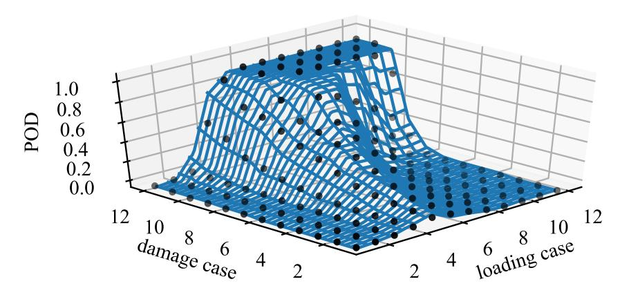

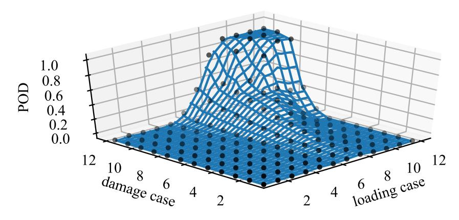

(a)

(b)

(c)

Figure 7.8 POD results for damage location: (a) #1; (b) #2; and (c) #3.

{197}------------------------------------------------

# 7.5 Conclusion

<span id="page-197-0"></span>An algorithm for damage detection and localization over the surfaces of mesoscale structures monitored by a sensing skin has been proposed. The sensing skin used in this work was based on a large area electronic, termed soft elastomeric capacitor, that is capable of covering a large area at a low cost. When arranged in a network configuration, these sensors are capable of reconstructing the full-field additive strain maps of the structure. The proposed spatial damage index (SDI) algorithm enhances the damage detection and localization capabilities of the sensing skin by leveraging the sensor network, where the KLD is progressively calculated at each point in the monitored structure between two kriging-developed strain maps. The first of these kriging strain maps is built using data from all SEC sensors while the set of second strain maps is calculated by progressively removing one sensor from the training set used to build the kriging model. Thereafter, multiple KLDs are calculated at each point of interest between the strain map generated using all the sensors and each of the strain maps generated with a single sensor extracted from the data set used for training the kriging model. Lastly, the L1-norm of the KLD values is calculated at each point of interest, therefore creating a spatially distributed damage sensitive index. A numerical validation, performed on a reinforced cantilever concrete beam, showed that the proposed SDI algorithm was capable of detecting incipient damage before the damage severity becomes detectable by a Laplace or Gaussian transform. Overall, the proposed algorithm's performance, combined with the high scalability of the sensing skin, makes the technology a promising candidate for structural health monitoring of mesoscale structures.

## Acknowledgments

This work was in part supported by the National Science Foundation Grant Nos. CNS-1566579, ECCS-1611333, and 1069283. Grant No. 1069283 supports the activities of the Integrative Graduate Education and Research Traineeship (IGERT) in Wind Energy Science, Engineering and Policy (WESEP) at Iowa State University. Their support is gratefully acknowledged. Any opinions, findings, and conclusions or recommendations expressed in this material are those of the authors and do not necessarily reflect the views of the National Science Foundation.

{198}------------------------------------------------

# 7.6 References

<span id="page-198-0"></span>Ahmed, M., Gonenli, I. E., Nadvi, G. S., Kilaru, R., Butler, D. P., and Celik-Butler, Z. (2012). MEMS sensors on flexible substrates towards a smart skin. In *2012 IEEE Sensors*. IEEE. Cavalagli, N., Comanducci, G., and Ubertini, F. (2017). Earthquake-induced damage detection in a monumental masonry bell-tower using long-term dynamic monitoring data. *Journal of Earthquake Engineering*, pages 1–24. Downey, A., Kazem, M., Laflamme, S., and Hu, C. (2018). Fusion of sensor geometry into additive strain fields measured with sensing skin. *Smart Materials and Structures*. Downey, A., Laflamme, S., and Ubertini, F. (2017). Experimental wind tunnel study of a smart sensing skin for condition evaluation of a wind turbine blade. *Smart Materials and Structures*. Frosini, L., Harlisca, C., and Szabo, L. (2015). Induction machine bearing fault detection by means of statistical processing of the stray flux measurement. *IEEE Transactions on Industrial Electronics*, 62(3):1846–1854. Giantomassi, A., Ferracuti, F., Iarlori, S., Ippoliti, G., and Longhi, S. (2015). Electric motor fault detection and diagnosis by kernel density estimation and kullback–leibler divergence based on stator current measurements. *IEEE Transactions on Industrial Electronics*, 62(3):1770–1780. Giurgiutiu, V., Zagrai, A., and Bao, J. (2004). Damage identification in aging aircraft structures with piezoelectric wafer active sensors. *Journal of Intelligent Material Systems and Structures*, 15(9-10):673–687. Glisic, B., Yao, Y., Tung, S.-T. E., Wagner, S., Sturm, J. C., and Verma, N. (2016). Strain sensing sheets for structural health monitoring based on large-area electronics and integrated circuits. *Proceedings of the IEEE*, 104(8):1513– 1528. Harmouche, J., Delpha, C., Diallo, D., and Bihan, Y. L. (2016). Statistical approach for nondestructive incipient crack detection and characterization using kullback-leibler divergence. *IEEE Transactions on Reliability*, 65(3):1360– 1368. Hengl, T., Heuvelink, G. B., and Stein, A. (2004). A generic framework for spatial prediction of soil variables based on regression-kriging. *Geoderma*, 120(1-2):75–93. Hibbit, Karlsson, and Sorensen (2007). *ABAQUS*/*Standard Analysis User's Manual*. Hibbit, Karlsson, Sorensen Inc., USA.

{199}------------------------------------------------

- Khan, S., Lorenzelli, L., and Dahiya, R. S. (2015). Technologies for printing sensors and electronics over large flexible substrates: A review. *IEEE Sensors Journal*, 15(6):3164–3185. Kitanidis, P. K. (1997). *Introduction to geostatistics: applications in hydrogeology*. Cambridge University Press. Kong, X., Li, J., Collins, W., Bennett, C., Laflamme, S., and Jo, H. (2017). A large-area strain sensing technology for monitoring fatigue cracks in steel bridges. *Smart Materials and Structures*, 26(8):085024. Laflamme, S., Kollosche, M., Connor, J. J., and Kofod, G. (2013). Robust flexible capacitive surface sensor for structural health monitoring applications. *Journal of Engineering Mechanics*, 139(7):879–885. Loyola, B. R., Saponara, V. L., Loh, K. J., Briggs, T. M., O'Bryan, G., and Skinner, J. L. (2013). Spatial sensing using electrical impedance tomography. *IEEE Sensors Journal*, 13(6):2357–2367. Lynch, J. P., Farrar, C. R., and Michaels, J. E. (2016). Structural health monitoring: technological advances to practical implementations [scanning the issue]. *Proceedings of the IEEE*, 104(8):1508–1512. Lynch, J. P., Sundararajan, A., Law, K. H., Kiremidjian, A. S., and Carryer, E. (2004). Embedding damage detection algorithms in a wireless sensing unit for operational power efficiency. *Smart Materials and Structures*, 13(4):800–
- 810. Nichols, J. M., Seaver, M., Trickey, S. T., Salvino, L. W., and Pecora, D. L. (2006). Detecting impact damage in experimental composite structures: an information-theoretic approach. *Smart Materials and Structures*, 15(2):424–
- 434. Park, Y.-L., Chen, B.-R., and Wood, R. J. (2012). Design and fabrication of soft artificial skin using embedded microchannels and liquid conductors. *IEEE Sensors Journal*, 12(8):2711–2718. Perry, M., McAlorum, J., Fusiek, G., Niewczas, P., McKeeman, I., and Rubert, T. (2017). Crack monitoring of operational wind turbine foundations. *Sensors*, 17(8):1925. Rahman, Z., Ohba, H., Yoshioka, T., and Yamamoto, T. (2009). Incipient damage detection and its propagation monitoring of rolling contact fatigue by acoustic emission. *Tribology International*, 42(6):807–815. rth, bsmurphy, mjziebarth, and basaks (2018). Pykrige: Kriging toolkit for python. Rumsey, M. A. and Paquette, J. A. (2008). Structural health monitoring of wind turbine blades. In Ecke, W., Peters,
  - K. J., and Meyendorf, N. G., editors, *Smart Sensor Phenomena, Technology, Networks, and Systems 2008*. SPIE.

{200}------------------------------------------------

Tonkin, M. J. and Larson, S. P. (2002). Kriging water levels with a regional-linear and point-logarithmic drift. *Ground Water*, 40(2):185–193. Wilkinson, A., Clemens, M., and Harding, V. (2004). The effects of SEBS-g-maleic anhydride reaction on the morphology and properties of polypropylene/PA6/SEBS ternary blends. *Polymer*, 45(15):5239–5249. Worden, K., Farrar, C. R., Manson, G., and Park, G. (2007). The fundamental axioms of structural health monitoring. *Proceedings of the Royal Society A: Mathematical, Physical and Engineering Sciences*, 463(2082):1639–1664. Zeng, J., Kruger, U., Geluk, J., Wang, X., and Xie, L. (2014). Detecting abnormal situations using the kullback–leibler divergence. *Automatica*, 50(11):2777–2786.

{201}------------------------------------------------

# <span id="page-201-0"></span>CHAPTER 8. EXPERIMENTAL WIND TUNNEL STUDY OF A SMART SENSING SKIN FOR CONDITION EVALUATION OF A WIND TURBINE BLADE

This chapter is wholly based on "Experimental wind tunnel study of a smart sensing skin for condition evaluation of a wind turbine blade" Published in Materials and Structures, vol. 26, no. 12, 2017, p. 125005. doi:10.1088/1361-665X/aa9349.

Austin Downey<sup>1</sup> , Simon Laflamme<sup>1</sup> , Filippo Ubertini<sup>2</sup>

# Abstract

Condition evaluation of wind turbine blades is difficult due to their large size, complex geometry and lack of economic and scalable sensing technologies capable of detecting, localizing, and quantifying faults over a blade's global area. A solution is to deploy inexpensive large area electronics over strategic areas of the monitored component, analogous to sensing skin. The authors have previously proposed a large area electronic consisting of a soft elastomeric capacitor (SEC). The SEC is highly scalable due to its low cost and ease of fabrication, and can, therefore, be used for monitoring large-scale components. A single SEC is a strain sensor that measures the additive strain over a surface. Recently, its application in a hybrid dense sensor network (HDSN) configuration has been studied, where a network of SECs is augmented with a few off-the-shelf strain gauges to measure boundary conditions and decompose the additive strain to obtain unidirectional surface strain maps. These maps can be analyzed to detect, localize, and quantify faults. In this work, we study the performance of the proposed sensing skin at conducting condition evaluation of a wind turbine blade model in an operational environment. Damage in the form of changing boundary conditions and cuts in the monitored substrate are induced into the blade. An HDSN is deployed onto the interior surface of the substrate, and the blade excited in a wind tunnel. Results demonstrate the capability of the hybrid dense sensor network and

<sup>1</sup> Department of Civil, Construction, and Environmental Engineering, Iowa State University, Ames, IA, USA

<sup>2</sup> Department of Civil and Environmental Engineering, University of Perugia, Perugia, Italy

{202}------------------------------------------------

<span id="page-202-0"></span>associated algorithms to detect, localize, and quantify damage. These results show promise for the future deployment of fully integrated sensing skins deployed inside wind turbine blades for condition evaluation.

Keywords: structural health monitoring, capacitive-based sensor, soft elastomeric capacitor, flexible membrane sensor, sensor network, damage detection, damage localization

# 8.1 Introduction

The profitability of industrial-scale wind energy projects is challenging due to their reliance on public subsidies, unpredictable energy source, and reliable technology. Additionally, varying operation and maintenance (O&M) costs add complexity and uncertainty to the management of wind energy projects (Afanasyeva et al., 2016). To achieve an increase in wind turbine system reliability and therefore decrease costs related to wind energy production, an O&M approach that utilizes condition-based maintenance (CBM) should be implemented (Yang et al., 2012; Nilsson and Bertling, 2007). The use of condition based maintenance is even more important for offshore farms where O&M costs may be up to three times higher than that of land-based systems (Kaldellis and Kapsali, 2013), due largely to higher transportation and site access costs (Van Bussel and Zaaijer, 2003). The current state of condition monitoring of wind turbine blades consists mainly of vibrations, and visual analyses (Yang et al., 2012; Adams et al., 2011). Recently, interest has grown in the use of structural health monitoring (SHM) for the condition assessment of wind turbine blades, towers and other structural components due to their high replacement cost (Kaldellis and Kapsali, 2013; Ciang et al., 2008), effect on system availability (Van Bussel and Zaaijer, 2003), and maintenance complexity (Mar´ın et al., 2008). Monitoring the mesostructures of wind turbines (e.g., towers and blades) is difficult due to the need to distinguish between faults in the structure's global (e.g. changing load paths, loss in global stiffness) and local (e.g. crack propagation, composite delamination) conditions (Ghoshal et al., 2000). Recent attempts for the SHM of wind turbine blades have used a limited number of sensors and have applied a variety of post-processing techniques (e.g. statistical and modal-based) to localize damage (Ou et al., 2017; Oliveira et al., 2016). However, this approach lacks the capability to distinguish local failures from global events and has demonstrated a limited effectiveness at damage localization (Adams et al., 2011; Zou et al., 2000).

A solution to this local/global detection problem is to deploy a dense sensor network (DSN) inside the component that is capable of detecting local faults. These integrated sensing skins mimic biological skin in that they are capable of detecting and localizing damage over the blade's global area and with the objective to enable low-cost, direct sensing of large-scale structures. Sensing skins can be made of large area electronics (Kang et al., 2006) or of rigid or semi-rigid cells mounted on a flexible sheet (Lee et al., 2006). Early work in the field of sensing skins consisted 

{203}------------------------------------------------

of capacitive- (Chase and Luo, 1995) and resistance- (Engel et al., 2003) based tactile force sensors. More recently, sensing skins with piezoceramic (PZT) transducers and receivers built into a flexible skin have been proposed (Schulz and Sundaresan, 2006). In certain cases, sensing skins with the integrated electronics for data acquisition and signal processing mounted directly onto the skin have been developed (Yao and Glisic, 2015; Burton et al., 2017). Various researchers have proposed and experimentally validated sensing skin-type solutions for wind turbine blades. For instance, Song *et. al.* demonstrated through experimental validation in a wind tunnel that a network of piezoceramic (PZT) sensors can be used to detect damage in wind turbine blades (Song et al., 2013). Schulz *et al.* proposed the use of series-connected PZT nodes for the continuous monitoring of wind turbine blades, allowing for a finer localization of damage (Schulz and Sundaresan, 2006). Simulations were used to show that an array of these sensors, deployed on a 2D plate, could be used to detect and localize damage. Ryu *et al.* demonstrated a self-sensing thin film fabricated from poly(3-hexylthiophene) (P3HT) and multi-walled carbon nanotubes (MWNTs) that is capable of monitoring strain through the photocurrent generated by the photoactive nanocomposite (Ryu and Loh, 2012). These sensors are capable of generating their own power, therefore eliminating their need for external power sources. Rumsey *et al.* deployed a number of SHM systems on the outside of an experimental wind turbine blade at Sandia National Laboratories (Rumsey and Paquette, 2008). Various sensor technologies were used, including PZT and strain-based sensors, to monitor the blade during a fatigue test. In general, successful damage detection was found to require an optimal sensor placement and synchronization of sampling between different sensor types.

In this work, the authors present the vision of a fully integrated DSN for the real-time SHM of wind turbine blades and experimentally validate a prototype skin that demonstrates the feasibility of the concept. This DSN consists of an inexpensive and robust large area electronic consisting of a highly elastic capacitor based on a styrene-coethylene-co-butylene-co-styrene (SEBS) block co-polymer. Termed the soft elastomeric capacitor (SEC), the sensor is customizable in shape and size (Laflamme et al., 2013). The SEC possesses the unique capability of measuring the substrate's additive strain (ε*<sup>x</sup>* + <sup>ε</sup>*y*), and its static (Laflamme et al., 2013b) and dynamic (Laflamme et al., 2015) behaviors have been well documented including numerical demonstrations for damage detection applications in wind turbine blades (Laflamme et al., 2016).

A particularly useful attribute of the SEC is its capability to measure additive in-plane strain. It follows that the signal must be decomposed into orthogonal directions in order to obtain unidirectional strain maps. A previously developed algorithm is used in this work to decompose the sensors' additive strain into estimated unidirectional strain maps (Downey et al., 2016). The algorithm, termed the extended least squares estimator algorithm, leverages off-theshelf sensors such as resistive strain gauges (RSGs), to form a hybrid DSN (HDSN). A deflection shape function for the monitored substrate is assumed along with boundary conditions (assumed or measured through the RSGs) and uses

{204}------------------------------------------------

<span id="page-204-0"></span>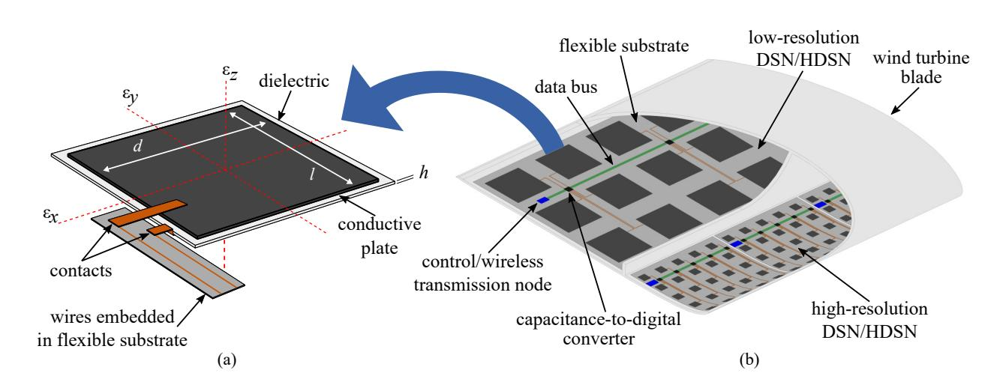

Figure 8.1 Conceptual layout of a fully integrated SEC-based sensing skin for a wind turbine blade: (a) SEC with connectors and annotated axis; and (b) proposed deployment inside a wind turbine blade.

the least squares estimator (LSE) to solve for the shape function's coefficients. In this work, the reconstructed strain maps are inspected to investigate how damage induced into the monitored substrate changes the loading path of the blade. Thereafter, it is shown that damage in the form of leading edge faults (e.g. changing boundary conditions) can be localized through changing the assumed boundary conditions of the plate. Lastly, the quality of these unidirectional strain maps is measured in the form of a reconstruction error to develop a damage detecting feature for a predefined section of the HDSN (Downey et al., 2017b). This network reconstruction feature (NeRF) algorithm allows the sensing skin to fuse the high-channel-count sensing skins data into a single damage detecting feature, therefore providing a high level of data compression and increasing the functionality of the proposed system.

This paper experimentally verifies the HDSN, deployed inside a model wind turbine blade excited by aerodynamic loading in a wind tunnel. The reported results are the first use of a large area electronic for damage detection in a wind turbine blade under aerodynamic loading. These tests validate the use of SECs in a wind turbine blade and demonstrate the potential utility of the concurrently proposed, fully integrated, SEC-based sensing skin. The contributions of this work are three-fold: 1) propose an integrated SEC-based sensing skin for the real-time structural health monitoring of wind turbine blades; 2) demonstrate the capability of the SECs to operate in the electromagnetically noisy environment of a wind tunnel, showing that the SEC would be capable of operating inside the similarly noisy environment of a wind turbine blade; 3) evaluate the HDSN data through previously developed algorithms showing that the SEC-based sensing skin is capable of detecting damage within an HDSN that is not directly monitored by an SEC.

{205}------------------------------------------------

# 8.2 Background on Sensing Skin

<span id="page-205-0"></span>The SEC-based sensing skin is illustrated in Figure [8.1,](#page-204-0) with the sketch of an individual SEC shown in Figure [8.1\(](#page-204-0)a). The fully integrated DSN system, as presented in Figure [8.1\(](#page-204-0)b), would consist of SECs of varying geometries and densities along with the required electronics for power management, data acquisition, data processing, and communications, all mounted onto a flexible substrate (e.g. Kapton). The optimal placement of RSGs within a grid of SECs has been previously used by the authors to improve the accuracy of strain map reconstruction from SEC data (Downey et al., 2017). These sensing skins would be deployed inside a wind turbine blade, either at the factory or in the field to monitor cases of interest, such as repair made at the root of a blade (Mar´ın et al., 2008).

Data (capacitance) for a set of SECs in close proximity would be collected by a centrally located capacitance-todigital converter, multiplexed to measure multiple SECs. These converters are located close to the SECs to allow for low noise measurements, while multiplexing allows the sensing skin to function with a reduced number of converters. Data would be transferred over a serial bus (e.g. CAN, I2C) to a control/wireless transmission node, this configuration allows multiple capacitance-to-digital converters per transmission node, therefore reducing the number of wireless channels needed. These control nodes collect, process, and parse the data for wireless transmission back to a wireless hub mounted inside the rotor hub. The use of wireless transmission nodes allows for the easy installation of a sensing skin, particularly in cases where a sensing skin is added to an in-service blade such as that needed to monitor a repair. Additionally, wireless transmission adds redundancy to the system when compared to a single serial bus being used to carry data over the entire length of the blade, a useful feature given the long service life of wind turbine blades. Power can be provided through a variety of methods, including energy harvesting (for sensing skins mounted inside a wind turbine blade), flexible solar cells embedded into the sensing skin (when mounted on the outside of a wind turbine blade) or batteries when only short-term monitoring is required.

In the rest of this section, the background on the SEC sensor is provided, which includes its electro-mechanical model, followed by a review of the extended LSE algorithm and the NeRF algorithm for damage detection, localization, and quantification.

### 8.2.1 Soft Elastomeric Capacitor

The SEC used in the sensing skin is a robust large area electronic that is inexpensive, easy to fabricate, and customizable in shape and size. The sensor's fabrication procedure is described in Ref. (Laflamme et al., 2013). Briefly, the sensor's dielectric is composed of a styrene-ethylene-butylene-styrene (SEBS) block co-polymer matrix filled with titania to increase both its durability and permittivity. Conductive plates are painted onto each side of the

{206}------------------------------------------------

<span id="page-206-0"></span>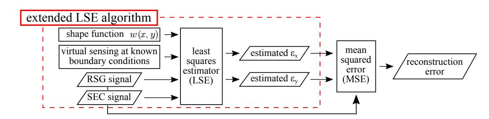

Figure 8.2 Network reconstruction feature (NeRF) algorithm, the previously developed extended LSE algorithm for strain map decomposition is enclosed inside the dashed red box.

SEBS matrix using a conductive paint fabricated from the same SEBS, but filled with carbon black particles. Material, equipment and techniques used in the fabrication are readily available and the sensor's fabrication process is relatively simple, making the technology highly scalable.

The SEC transduces a change in a monitored substrate's geometry (i.e., strain) into a measurable change in capacitance. It is stretched during its application to enable tensile and compressive strain measurement and is adhered using commercial epoxy. Assuming a low sampling rate (< 1 kHz), the SEC can be modeled as a non-lossy capacitor with capacitance *C* defined by the parallel plate capacitor equation,

$$C = e_0 e_r \frac{A}{h} \quad (8.1)$$

where *e*<sup>0</sup> = 8.854 pF/m is the vacuum permittivity, *e<sup>r</sup>* is the polymer relative permittivity, *A* = *d* · *l* is the sensor area of width *d* and length *l*, and *h* is the thickness of the dielectric as annotated in Figure [8.1\(](#page-204-0)a). Assuming small strain, an expression relating the sensor's change in capacitance to its signal can be expressed as (Laflamme et al., 2015)

$$\frac{\Delta C}{C} = \lambda(\varepsilon_x + \varepsilon_y) \quad (8.2)$$

where  $\lambda = 1/(1 - \nu)$  represents the gauge factor of the sensor, with  $\nu$  being the sensor material's Poisson ratio. For SEBS,  $\nu \approx 0.49$ , which yields a gauge factor  $\lambda \approx 2$ . Equation (8.2) shows that the signal of the SEC varies as a function of the additive strain  $\varepsilon_x + \varepsilon_y$ .

### 8.2.2 Strain Decomposition Algorithm

The extended LSE algorithm was designed to decompose the SEC signal's additive strain measurement, as expressed in Equation (8.2), by leveraging an HDSN configuration consisting of SECs and unidirectional strain sensors (e.g. RSGs). RSGs measure boundary conditions within the HDSN that can be used to increase the capability of 

{207}------------------------------------------------

<span id="page-207-0"></span>the extended LSE algorithm to decompose strain maps. Boundary conditions on the edges of the structure are also introduced into the algorithm as virtual unidirectional sensors at locations where the unidirectional strain can be assumed within a high level of confidence. The extended LSE algorithm is presented in reference (Downey et al., 2016), diagrammed in the red dashed rectangle in Figure [8.2,](#page-206-0) and summarized in what follows.

The extended LSE algorithm assumes a *p* th order polynomial displacement shape function (*w*), selected due to its mathematical simplicity and its capability to develop a wide range of displacement topographies. The deflection *w* in the *x*-*y* plane can be written

$$w(x, y) = \sum_{i=1, j=1}^p b_{ij} x^i y^j \quad (8.3)$$

where *b<sup>i</sup>*, *<sup>j</sup>* are regression coefficients. Considering an HDSN with *m* sensors (SEC and RSGs in this case), displacement values at sensors locations can be collected in a vector W ∈ R *<sup>m</sup>*. Equation (8.3) becomes

$$\mathbf{W} = \begin{bmatrix} w_1 & \cdots & w_k & \cdots & w_m \end{bmatrix}^T = \mathbf{H}\mathbf{B} \quad (8.4)$$

where the subscript *k* is associated with the *k*-th sensor. Matrix H contains sensor location information, and B contains the *f* regression coefficients B = *b*<sup>1</sup> · · · *b<sup>f</sup> T* .

Matrix H is defined as H = [ΓxHx|ΓyHy] where H<sup>x</sup> and H<sup>y</sup> account for the SEC's additive strain measurements, with Γ*<sup>x</sup>* and Γ*<sup>y</sup>* being diagonal weight matrices holding the scalar sensor weight values <sup>γ</sup>*x*,*<sup>k</sup>* and <sup>γ</sup>*y*,*<sup>k</sup>*. For instance, an RSG sensor *k* orientated so that it measures strain in the *x* direction will take the weight values <sup>γ</sup>*x*,*<sup>k</sup>* = 1 and <sup>γ</sup>*y*,*<sup>k</sup>* = 0. Additionally, virtual sensors are used to enforce boundary conditions and are treated as RSG sensors with known signals, typically ε = 0. These virtual sensors are added into H at locations where the boundary condition can be assumed to a high degree of certainty. The components of matrix H can be developed from Equation (8.3):

$$\mathbf{H}_x = \mathbf{H}_y = \begin{bmatrix} y_1^n & x_1 y_1^{n-1} & \cdots & x_1^{n-1} y_1 & x_1^n \\ y_k^n & x_k y_k^{n-1} & \cdots & x_k^{n-1} y_k & x_k^n \\ y_m^n & x_m y_m^{n-1} & \cdots & x_m^{n-1} y_m & x_m^n \end{bmatrix} \quad (8.5)$$

Using Kirchhoff's plate theory, unidirectional strain functions for  $\varepsilon_x$  and  $\varepsilon_y$  are obtained:

$$\varepsilon_x(x, y) = -\frac{c}{2} \frac{\partial^2 w(x, y)}{\partial x^2} = \Gamma_x \mathbf{H}_x \mathbf{B}_x \quad (8.6)$$

$$\varepsilon_y(x, y) = -\frac{c}{2} \frac{\partial^2 w(x, y)}{\partial y^2} = \Gamma_y \mathbf{H}_y \mathbf{B}_y \quad (8.7)$$

{208}------------------------------------------------

<span id="page-208-0"></span>where *c* is the thickness of the plate and B = [Bx|By] *T* . Here, B<sup>x</sup> and B<sup>y</sup> hold the regression coefficients for strain components in the *x* and *y* directions, respectively.

A vector S = *s*<sup>1</sup> · · · *s<sup>k</sup>* · · · *s<sup>m</sup> T* containing the signal for each sensor in the HDSN is constructed from measurements with *s<sup>k</sup>* = <sup>ε</sup>*<sup>x</sup>* + <sup>ε</sup>*<sup>y</sup>* for an SEC and *s<sup>k</sup>* = <sup>ε</sup>*<sup>x</sup>* or *s<sup>k</sup>* = <sup>ε</sup>*<sup>y</sup>* for an RSG. The regression coefficient matrix B is estimated using the LSE:

$$\hat{\mathbf{B}} = (\mathbf{H}^T \mathbf{H})^{-1} \mathbf{H}^T \mathbf{S} \quad (8.8)$$

where the hat denotes an estimation. It follows that the estimated strain maps can be reconstructed using

$$\hat{\mathbf{E}}_x = \Gamma_x \mathbf{H}_x \hat{\mathbf{B}}_x \quad \hat{\mathbf{E}}_y = \Gamma_y \mathbf{H}_y \hat{\mathbf{B}}_y \quad (8.9)$$

where Eˆ <sup>x</sup> and Eˆ <sup>y</sup> are vectors containing the estimated strain in the *x* and *y* directions for sensors transducing <sup>ε</sup>*x*(*x*, *y*) and <sup>ε</sup>*y*(*x*, *y*), respectively.

Without a sufficient number of unidirectional sensors in an HDSN, H will be multi-collinear because H<sup>x</sup> and H<sup>y</sup> will share multiple columns. This results in H*<sup>T</sup>*H being non-invertible. This is avoided by integrating a sufficient number of RSGs and virtual sensors into the HDSN.

#### 8.2.3 Network Reconstruction Feature (NeRF)

The NeRF algorithm (Downey et al., 2017b) provides a method for damage detection and localization formulated for strain map measurements. It works through comparing the signal measured by an individual sensor with the estimated strain map (Equation (8.9)) for a predefined HDSN. An error function defined as the mean square error (MSE) between a sensor's measured and estimated strains can be used to associate a feature value with a given increase in the shape function's complexity (*p* in Equation [\(8.3\)](#page-207-0)). Consider an HDSN section similar to that shown in Figure [8.1\(](#page-204-0)b), consisting of a network of SECs in an array and a few optimally placed RSGs used at key locations. To establish the NeRF's theoretical foundation, we first consider an ideal situation where strain maps are easily approximated through the use of low order shape functions. The error in the approximation, calculated for the *m* sensors within the HDSN, can be quantified as:

$$V = \frac{1}{m} \sum_{k=1}^m (\mathcal{S}_k - \mathcal{S}'_k)^2 \quad (8.10)$$

where *V* is a scalar. For a given sensor location *k*, *S <sup>k</sup>* is the sensor signal, and *S* 0 *k* is the estimated sensor signal using the reconstructed strain maps. The estimated sensor signals for RSG sensors measuring <sup>ε</sup>*<sup>x</sup>* and <sup>ε</sup>*<sup>y</sup>* are taken from Eˆ x

{209}------------------------------------------------

and Eˆ <sup>y</sup>, respectively, while the estimated SEC signals are taken as the summation of Eˆ <sup>x</sup> and Eˆ <sup>y</sup> at given locations (Equation [8.2\)](#page-206-0). The NeRF algorithm is diagrammed in Figure [8.2,](#page-206-0) where the extended LSE algorithm used to develop the orthogonal strain maps is encapsulated inside the red dashed rectangle.

For an undamaged area of a structure, the strain field will have a simple strain topology, while damage will generally represent itself as a discontinuity in the surface's strain field, which will develop a more complex strain topology. It follows that in general areas without damage, the strain field can be accurately estimated with loworder shape functions, while damaged areas will require higher-order shape functions to minimize reconstruction error. To quantify the level of strain map complexity in a section of the structure, and therefore whether it contains damage, NeRF uses the section's reconstruction error (*V*) and how this reconstruction error responds to adding higher order shape functions. As higher-order terms are added to the shape function, the reconstruction error (*V*) between the estimated and measured state will substantially reduce in the case of damaged sections, allowing the section's condition to be evaluated from the changing level of reconstruction error. This technique is capable of providing damage detection within an area monitored by an SEC-based sensing skin even at locations that are not directly covered by an SEC. Additionally, NeRF adds versatility to the sensing skin for monitoring wind turbine blades as it reduces the number and density of required sensors and is computationally light.

Building the binomial terms used in the NeRF algorithm, as listed in Table [8.1,](#page-210-0) requires starting with *w*(*x*, *y*) = P<sup>2</sup> *i*=1, *j*=1 *bi jx i y j* as the most basic shape function. To build the following terms of increasing complexity, shape function components are added in symmetric pairs from the outside of the Pascal's triangle, progressing inwards for a given row. For example, the value for feature No. 1 becomes the difference in reconstruction error, *V*, between the baseline shape function *w*base (*x*, *y*) = P<sup>2</sup> *i*=1, *j*=1 *bi jx i y j* and the baseline shape function with term No. 1 added *w*<sup>1</sup> (*x*, *y*) = P<sup>2</sup> *i*=1, *j*=1 *bi jx i y <sup>j</sup>* + *x* <sup>3</sup> + *y* 3 . Expanding to feature No. 2, this value becomes the difference between *w*<sup>1</sup> (*x*, *y*) = P<sup>2</sup> *i*=1, *j*=1 *bi jx i y <sup>j</sup>* + *x* <sup>3</sup> + *y* 3 and *w*<sup>2</sup> (*x*, *y*) = P<sup>2</sup> *i*=1, *j*=1 *bi jx i y <sup>j</sup>* + *x* <sup>3</sup> + *y* <sup>3</sup> + *x* 2 *y* + *xy*<sup>2</sup> , and so forth. Note that no displacement-defined boundary conditions are enforced into the shape functions. Instead, all boundary conditions are enforced into strain topography through the use of unidirectional sensors (e.g. RSG) or assumed boundary conditions. A high level of data compression is provided through the fusion of all the sensing channels in the sensing skin into a single parameter, therefore reducing the computational effort required in analyzing and storing the extracted data. This level of compression could offer a great benefit to owners and operators of wind turbine blades given their complexity and relatively long design life of 10-30 years (Mar´ın et al., 2008).

{210}------------------------------------------------

<span id="page-210-0"></span>Table 8.1 Polynomial complexities used for condition assessment features.

| No. | x terms | term added (x) | y terms | term added (y) | Product/Combination |
|-----|---------|----------------|---------|----------------|---------------------|
| 1   | x       |                |         |                |                     |
|     |         | , y            |         |                |                     |
|     |         | 3              | 8       | x              |                     |
|     |         |                |         | , x y y        |                     |
| 2   | x       |                |         |                |                     |
|     |         | y , xy 2       | 9       | x              |                     |
|     |         |                |         |                | , y                 |
| 3   | x       |                |         |                |                     |
|     |         | , y            |         |                |                     |
|     |         | 4              | 10      | x              |                     |
|     |         |                |         |                | y , xy 5            |
| 4   | x       |                |         |                |                     |
|     |         | y , xy 3       | 11      | x              |                     |
|     |         |                |         |                | , y                 |
| 5   | x       |                |         |                |                     |
|     |         | 2              | 12      | x              |                     |
|     |         | y              |         |                | y , xy 6            |
| 6   | x       |                |         |                |                     |
|     |         | , y            |         |                |                     |
|     |         | 5              | 13      | x              |                     |
|     |         |                |         |                | , x y y             |
| 7   | x       |                |         |                |                     |
|     |         | y , xy 4       | 14      | x              |                     |
|     |         |                |         |                | , x y y             |

# 8.3 Methodology

This section discusses the experimental setup used in validating the concept of the SEC-based sensing skin and in verifying the capability of the skin to detect damage.

## 8.3.1 Experimental Setup

The SEC-based sensing skin is experimentally validated using an HDSN consisting of 12, 3 × 3 cm<sup>2</sup> , SECs and 8 unidirectional RSGs, TML model # FCA-2 deployed onto the inside of a model wind turbine blade tested in a wind tunnel. The experimental setup, shown in Figure [8.3\(](#page-211-0)a), consisted of a 139 cm wind turbine blade model. It is modeled after the center third of a 30 m wind turbine blade, designed using NREL S-series airfoils that are aerodynamically efficient with high lift to drag ratios that generate low noise during operation. The model was 139 cm in length with airfoil cord lengths at the root and tip of 40 and 15 cm, respectively. Further details on the model's design and its experimental setup are presented in Sauder *et al.* (Sauder and Sarkar, 2017). The model is mounted vertically with its root section attached to a 6 degree-of-freedom frame that allowed for the measurement of root forces. The model (Figure [8.3\(](#page-211-0)b)) consisted of an aluminum spar fixed at the root (blade root mounted up) and 10 wood/plastic airfoil sections mounted onto it (Sauder and Sarkar, 2017). Sections 2 and 3, if counted from the blade's root, are used to support a fiberglass substrate that is used in testing of the deployed HDSN. This substrate, shown in Figure [8.3\(](#page-211-0)b), could be removed through a series of 24 bolts mounted around its perimeter. Data acquisition (DAQ) systems were mounted above the blade model in the mounting frame. The SEC DAQs are shown in Figure [8.3\(](#page-211-0)b)-(c). Each SEC DAQ used a 24-bit capacitance-to-digital converter multiplexed over 4 channels that sampled at 22 samples/second (S/s). An actively shielded coaxial cable, used to remove the parasitic capacitance found in the cables, was used to connect the SEC sensors to the DAQs. RSG measurements were obtained using a National Instruments 24-bit 350 Ω

{211}------------------------------------------------

<span id="page-211-0"></span>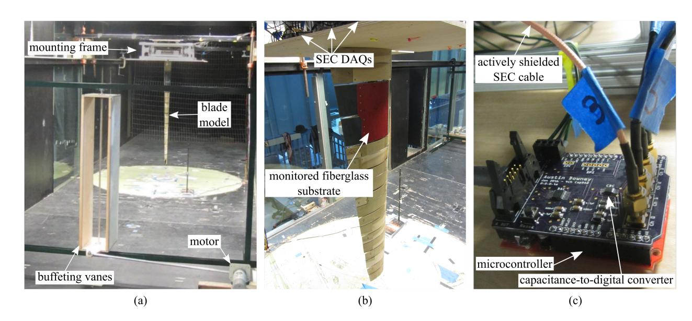

Figure 8.3 Experimental setup: (a) wind turbine blade model mounted in the wind tunnel and buffeting vanes used for generating the turbulent airflow; (b) wind turbine blade showing the model's monitored fiberglass substrate; and (c) DAQ used for the SEC sensors.

quarter-bridge module (NI-9236) and sampled at 2000 S/s. Data for the SECs and RSGs were collected simultaneously through a LabVIEW code.

Experimental validation was carried out in the Aerodynamic and Atmospheric Boundary Layer wind and gust tunnel located in the Wind Simulation and Testing Laboratory (WiST Lab) at Iowa State University. The wind tunnel has an aerodynamic test section of 2.44 × 1.83 m<sup>2</sup> dimensions and a design maximum wind speed of 53 m/s. The model blade was set at a 3-degree angle of attack and air turbulence was induced into the tunnel by forcing a set of buffeting vanes (Figure 8.3(a)) to oscillate at the blade's characteristic frequency of 3.1 Hz. This turbulence created an almost sinusoidal buffeting load (lift and moment) along the span of the blade.

The HDSN was mounted onto the inside surface of the fiberglass substrate of dimensions 270 x 220 x 0.8 mm<sup>3</sup> , shown in Figure [8.4\(](#page-212-0)a). The deployed HDSN is sketched in Figure [8.4\(](#page-212-0)b) and shown in Figure [8.4\(](#page-212-0)c). Due to the sectioned geometry of the blade, the majority of the bending and torsion induced strain developed in the gap between sections 2 and 3. The 24 bolts used to fasten the substrate onto the model were used as boundary conditions for the extended LSE algorithm, as annotated in Figure [8.4\(](#page-212-0)b). The thin fiberglass substrate was significantly less stiff than the aluminum frame that formed the backbone of the model. For this reason, the strain along the axis of the bolts is assumed to be zero. Thus, <sup>ε</sup>*<sup>x</sup>* = 0 is taken at each bolt location along the top and bottom of the monitored substrate, and <sup>ε</sup>*<sup>y</sup>* = 0 is taken at each bolt location along the vertical edges of the monitored substrate. A picture of the HDSN

{212}------------------------------------------------

<span id="page-212-0"></span>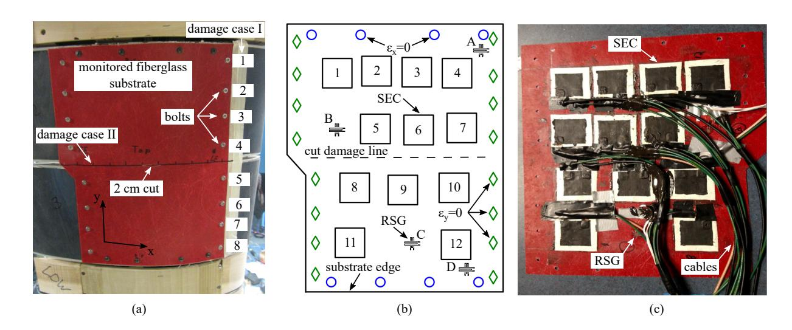

Figure 8.4 Experimental HDSN configuration: (a) monitored fiberglass substrate with labeled bolts along the leading edge (right-hand side) of the substrate; (b) schematic with labeled SECs and RSGs, where virtual sensors in the *x* and *y* directions are denoted by blue circles and green diamonds, respectively; and (c) interior surface view of the HDSN (RSGs A and D are not shown, as they were added after the substrate was installed on the model).

before its installation onto the wind turbine blade model is shown in Figure 8.4(c). In the picture, only 4 of the 8 RSGs are shown because the remaining 4 RSGs were installed after the substrate was attached to the model.

Two forms of damage were induced during the measurement campaign. Damage case I consisted of introducing a simulated delamination in the form of changing boundary conditions through removing the bolts on the leading edge (facing into the wind flow) of the blade. The removed bolts are annotated in Figure 8.4(a) and their order of removal for 8 different damage steps are listed in Table [8.2.](#page-213-0) The section's condition is expressed in terms of the length of the longest unsupported section (damage length) of the monitored substrate. Experimental data sets were acquired for the healthy case (where the leading edge had an unsupported length of 4.2 cm) and following each damage step, resulting in a total of nine data sets acquired. Damage case II consisted of cutting the skin in 1 cm increments after an initial 2 cm cut through the center of the skin along a predefined path as shown in Figure 8.4(a)-(b). The induced cut damage was approximately 2 mm wide and went completely through the fiberglass substrate. Data was acquired for the healthy condition (no cut damage) and for the 12 damage steps (2 to 13 cm).

Signal interference between the SEC cables caused by the active shielding of SEC DAQs required that only one SEC DAQ was in operation at any given time. Therefore, experimental data for each test was obtained over 3 repeated test runs, each test recording 4 SECs and all eight RSGs. This superposition of data was possible because of the constant load provided by the buffeting machine, which was confirmed through the similarity of RSG data throughout

{213}------------------------------------------------

Table 8.2 Damage steps for boundary conditions (bolts) removed.

<span id="page-213-0"></span>

| damage step        | healthy | 1   | 2    | 3     | 4       | 5         | 6           | 7             | 8               |
|--------------------|---------|-----|------|-------|---------|-----------|-------------|---------------|-----------------|
| bolts removed      | none    | 5   | 4,5  | 3,4,5 | 3,4,5,6 | 3,4,5,6,7 | 2,3,4,5,6,7 | 1,2,3,4,5,6,7 | 1,2,3,4,5,6,7,8 |
| damage length (cm) | 4.2     | 7.7 | 11.0 | 14.0  | 17.0    | 21.0      | 23.8        | 25.5          | 27.3            |

the repeated tests. Using the RSG data as a reference, the final SEC experimental data was aligned to provide a complete data set of 12 SECs and 8 RSGs. To reduce sensor noise in the SEC and provide a common time stamp to simplify data analysis, the sensor signals were filtered as follows. A low pass Weibull filter with a cutoff frequency of 10 Hz was applied to remove any high-frequency noise. Next, a principal component analysis (PCA) decomposition was applied on the SEC signals retaining the first four eigenvalues. Lastly, the SEC and RSG signals were resampled to 100 S/s with a common time stamp using a spline interpolation.

# 8.3.2 Verification of Damage Detection Capability

The verification of the damage detection capability started with the investigation of the performance of the SEC to monitor the dynamic buffeting-induced strain in the wind turbine blade, that is investigated through an analysis in the frequency domain. Thereafter, unidirectional strain maps decomposed using the extended LSE algorithm presented in section [8.2.2](#page-206-0) are used to track the changing load paths between a healthy state and the fully damaged leading edge case. Strain maps are computed from data taken when <sup>ε</sup>*<sup>y</sup>* at RSG B was at the maximum compressive strain (i.e. when the tip of the model was at its maximum displacement). An empirical damage detection method is achieved through updating the assumed boundary conditions and monitoring of the error between the estimated unidirectional strain maps and the measured strain. Here, we leverage the concept of updating the assumed boundary conditions to detect and localize a damage caused by the change in boundary conditions for damage step 2. In total, five possible damage locations were investigated in an attempt to localize damage step 2. These attempts were the removal of boundary conditions (bolts) 2 & 3, 3 & 4, 4 & 5, 5 & 6 and 6 & 7. Assumptions containing bolts 1 and 8 were found to be unfeasible due to the complex interaction of the monitored substrate's edge effects and the assumed shape function. The leading edge damage consisting of damage step 2 (bolts 4 & 5 removed) was selected because it provided large enough damage to be trackable with the deployed HDSN, while still providing a relatively large search space of five possible damage locations.

Lastly, the NeRF algorithm is used to track the damage propagation over the entire section as a function of the unsupported leading edge (damage case I) and the length of the induced cut (damage case II). For damage case I, the

{214}------------------------------------------------

<span id="page-214-0"></span>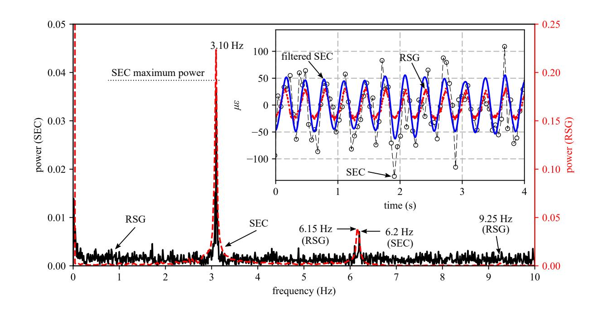

Figure 8.5 Comparison of SEC and RSG signals: frequency domain showing the excitation harmonic as detected by the SEC and RSG; (insert) time series data for the SEC and RSG signals.

features developed from adding polynomial complexities No. 5 and 7, as listed in Table [8.1,](#page-210-0) are used to track the growth of the unsupported leading edge damage of the monitored section as presented in Table [8.2.](#page-213-0) Thereafter, the extent of the cut in damage case II is tracked using the features developed from adding polynomial complexities No. 5 and 6.

# 8.4 Validation

The capability of the SEC to track the dynamic buffeting-induced strain in the wind turbine blade is shown in Figure 8.5. Data extracted from SEC #5 and RSG B (Figure [8.4\(](#page-212-0)b)) are compared due to their proximity. It can be observed that the SEC captures the blade's excitation frequency of 3.1 Hz and tracks an additional excitation harmonic at 6.2 Hz. This compares well with the excitation frequency detected by the RSG and its additional harmonics, as denoted in Figure 8.5. The excitation frequency of 3.1 Hz was set to the blade's fundamental frequency, as shown by Sauder et al. (Sauder and Sarkar, 2017). Time series measurements for the SEC and the RSG are presented in Figure 8.5(insert). An approximatively sinusoidal shape can be seen in both time series, albeit the SEC exhibits a slower sampling rate and a higher level of noise when compared to the RSG. Individual SEC strain samples are shown as

{215}------------------------------------------------

<span id="page-215-0"></span>black dots, and the filtered SEC signal is presented as the solid blue line. Overall, the SEC demonstrates an excellent capability at tracking the blade's response and frequency domain components while operating in the relatively noisy environment of a wind tunnel. Future deployment of an SEC-based sensing skin will require an increased precision and sampling rate of the capacitance-to-digital converter. The difference in the amplitude of the measured strain between the RSG and SEC sensors is a result of their different locations on the substrate, the torsion present in the substrate, and the capability of the SEC to measure additive instead of uni-directional strain (as expressed in Equation 8.2).

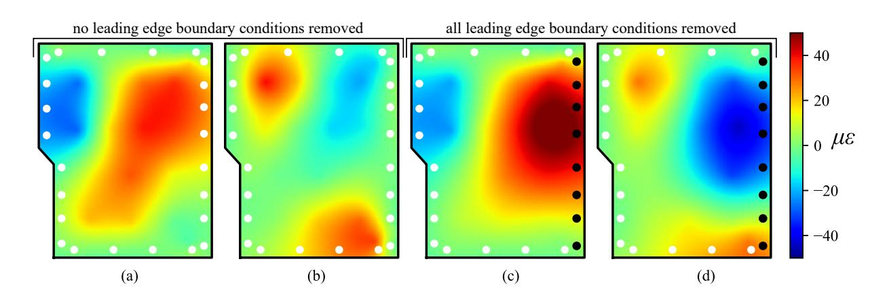

Figure 8.6 Reconstructed strain maps: (a) healthy condition  $\varepsilon_x$ ; (b) healthy condition  $\varepsilon_y$ ; (c) damage case 8  $\varepsilon_x$ ; (d) damage case 8  $\varepsilon_y$ .

Next, the performance of the HDSN at developing full field strain maps is experimentally validated. Results are shown in Figure 8.6. The decomposed strain maps  $\varepsilon_x$  and  $\varepsilon_y$  (developed using Equation 8.9), for the healthy case (Figure 8.6(a)-(b)) and the damaged case (Figure 8.6(c)-(d)), demonstrate that the HDSN is capable of tracking changes in the monitored substrate's strain fields. For the undamaged test's reconstructed strain maps, the enforced boundary conditions ensure that  $\varepsilon_y = 0$  along the leading and trailing edges of the monitored substrate (Figure 8.6(a)-(b)). As expected, when the boundary conditions on the leading edge are removed and the boundary conditions in the LSE are updated to reflect the monitored substrate's change in strain, a compressive strain energy moves into the leading edge due to the increased bending. Changes in the substrate's strain field can be related to changes in its load path. Additionally, results demonstrate that the HDSN can reconstruct relatively complex strain fields, such as that caused by the torsional motion of the blade model, represented by the different parts of the substrate being under tension and compression. The blade torsion detected by the strain maps was corroborated through accelerometers, force transducers, and video captured during testing (Sauder and Sarkar, 2017).

{216}------------------------------------------------

<span id="page-216-0"></span>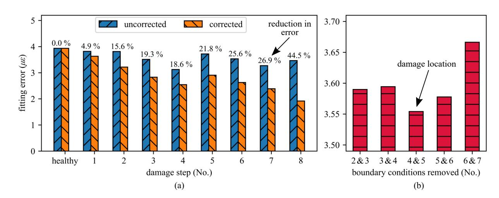

Figure 8.7 Damage localization through updating the monitored substrate's assumed boundary conditions; (a) improvement in strain map reconstruction error obtained by updating boundary conditions to match the monitored substrate's measurements; (b) damage case 2 localized through updating the assumed boundary conditions of the monitored substrate.

Results from updating the enforced boundary conditions, as discussed in Section [8.3.2,](#page-213-0) to match the damage state of the system are presented in Figure 8.7. Here, the error between the estimated strain maps and the experimental RSG data is measured as a mean fitting error across all 8 RSGs for the two orthogonal strain map reconstruction cases. The mean error is obtained by averaging the error throughout six full vibration cycles of the model. A comparison in the measured error between uncorrected strain maps that maintain a constant set of boundary conditions throughout all the damage steps and the corrected strain maps that update the boundary conditions to match each damage step is presented in Figure 8.7(a). Results show that updating the boundary conditions to match the damage state provides a consistently better fit than that obtained through the use of original boundary conditions. In the case of the damage step 8 (all the leading edge bolts removed), a 44.5% improvement in the measured error is obtained through updating the boundary conditions to match measurements. These results further validate the technique of updating of boundary conditions used to develop the strain maps presented in Figure [8.6.](#page-215-0) Results presented in Figure 8.7(b) exhibit the fitting error as a function of the boundary conditions that are removed, here shown for damage step 2. Boundary conditions were removed in pairs to match the known damage size in damage step 2 (bolts 4 and 5 removed). The fitting error for the removal of bolts 4 and 5 results in a lower fitting error, therefore identifying damage step 2 correctly. This demonstrates the capability of the HDSN to localize damage.

Lastly, we present results obtained from the NeRF algorithm, presented in Section [8.2.3,](#page-208-0) applied to damage cases I and II. Figure [8.8](#page-217-0) presents the extracted feature distances as a function of the length of unsupported leading edge in

{217}------------------------------------------------

<span id="page-217-0"></span>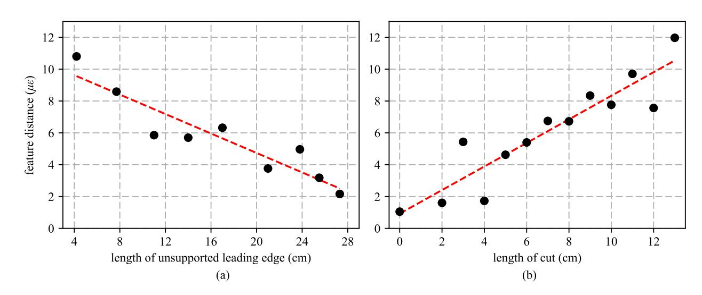

Figure 8.8 NeRF algorithm results for: (a) changing boundary conditions on the leading edge of the monitored substrate; (b) cut damage induced into the center of the monitored substrate.

case I, and as a function of the length of the induced cut in case II. Figure 8.8(a) shows that the feature distance tends to decrease as the length of the unsupported section of the monitored substrate along the leading edge increases. This is to be expected as the removal of discrete boundary conditions (bolts) will reduce the complexity in the strain map topography, therefore reducing the error between the estimated strain maps and the measured strain. This reduction in strain map complexity manifests itself as a smaller feature distance, as computed by the NeRF algorithm. Here, the damage case with an unsupported length of 27.3 cm is the same damage case presented in figure [8.6\(](#page-215-0)c)-(d). Conversely, the NeRF algorithm results for damage case II presented in Figure 8.8(b) demonstrate that the damage induced into the center of the monitored substrate in the form of a cut results in the NeRF's feature distance increasing with the length of the cut. This can be justified by noticing that the damage introduces a discontinuity into the monitored substrate's strain map. These results show that the HDSN can accurately quantify damage.

# 8.5 Conclusion

This paper experimentally investigated the use of a novel sensing skin for condition evaluation of a wind turbine blade. The novel sensing skin consists of an array of soft elastomeric capacitors (SECs), each acting as a flexible strain gauge. The critical advantage of the sensing skin is its high scalability to its low cost and ease of fabrication. It can, therefore, be used to cover very large surfaces. We presented a specialized deployment of the sensing skin, which included a few off-the-shelf resistive strain gauges (RSGs) to enable the precise measurement of boundary conditions, 

{218}------------------------------------------------

therefore forming a hybrid dense sensor network (HDSN). The resulting HDSN can be used to decompose the SEC's additive strain signal into unidirectional strain maps based on the previously developed extended LSE-based algorithm. These reconstructed strain maps were used with a damage detection algorithm termed network reconstruction feature (NeRF), which provided damage detecting features to detect, localize, and quantify damage.

Experimental validation was conducted by deploying the HDSN inside a scaled model wind turbine blade excited in a wind tunnel to simulate an operational environment. The experimental HDSN consisted of 12 SECs and 8 RSGs. Two different damage cases were investigated: a delamination simulated by the removal of bolts, and a crack simulated by a cut. Results demonstrated that the HDSN could be used to track the model wind turbine blade's global condition through analysis of SECs outputs in the frequency domain, which yielded similar results to the analysis of the output data of RSGs. Both damage cases were successfully detected and quantified through the use of the NeRF algorithm. The delamination (bolt removal) was tracked through an increasingly simplified strain map with increasing damage due to the release of restraints on the boundaries, while the crack (cut) was tracked through an increasingly complex strain map with increasing damage due to the created discontinuity in strain. The capability of the HDSN to locate damage was demonstrated with the identification of which bolts were removed. In the case of a crack, localization would be achieved through proper subdivisions of the HDSN, which was not possible with the current experimental configuration due to the relatively low number of SECs. Additionally, the NeRF Algorithm was used to provide a high level of data compression through fusing the 20 channel HDSN into a single damage detecting feature.

Results showed the promise of the sensing skin technology for damage detection, localization, and quantification in a wind turbine blade under aerodynamic loading in a wind tunnel (i.e., operational environment). The high level of data fusion provided by the NeRF algorithm enhances the potential of the sensing skin through reducing the amount of data stored for operations. Given the demonstrated capability of the HDSN at measuring strain maps, the technology offers potential for updating computational models in real-time. These high fidelity models could then be used for the design of structural health monitoring strategies and research and development activities. Future work will include development of the sensing skin hardware and algorithms for updating of high fidelity models using sensor data collected by a distributed array of sensing skins.

### Acknowledgments

The development of the SEC technology was supported by grant No. 13-02 from the Iowa Energy Center. This work is also partly supported by the National Science Foundation Grant No. 1069283, which supports the activities of the Integrative Graduate Education and Research Traineeship (IGERT) in Wind Energy Science, Engineering and 

{219}------------------------------------------------

<span id="page-219-0"></span>Policy (WESEP) at Iowa State University. Their support is gratefully acknowledged. The authors would also like to thank Dr. Heather Sauder and Dr. Partha Sarkar for their support regarding wind tunnel testing. Any opinions, findings, and conclusions or recommendations expressed in this material are those of the authors and do not necessarily reflect the views of the National Science Foundation.

# 8.6 References

Adams, D., White, J., Rumsey, M., and Farrar, C. (2011). Structural health monitoring of wind turbines: method and application to a HAWT. *Wind Energy*, 14(4):603–623. Afanasyeva, S., Saari, J., Kalkofen, M., Partanen, J., and Pyrhonen, O. (2016). Technical, economic and uncertainty ¨ modelling of a wind farm project. *Energy Conversion and Management*, 107:22–33. Burton, A., Lynch, J., Kurata, M., and Law, K. (2017). Fully integrated carbon nanotube composite thin film strain sensors on flexible substrates for structural health monitoring. *Smart Materials and Structures*, 26(9). Chase, T. and Luo, R. (1995). A thin-film flexible capacitive tactile normal shear force array sensor. In *Proceedings of IECON 1995 - 21st Annual Conference on IEEE Industrial Electronics*. IEEE. Ciang, C. C., Lee, J.-R., and Bang, H.-J. (2008). Structural health monitoring for a wind turbine system: a review of damage detection methods. *Measurement Science and Technology*, 19(12):122001. Downey, A., Hu, C., and Laflamme, S. (2017a). Optimal sensor placement within a hybrid dense sensor network using an adaptive genetic algorithm with learning gene pool. *Structural Health Monitoring*, page 147592171770253. Downey, A., Laflamme, S., and Ubertini, F. (2016). Reconstruction of in-plane strain maps using hybrid dense sensor network composed of sensing skin. *Measurement Science and Technology*, 27(12):124016. Downey, A., Ubertini, F., and Laflamme, S. (2017b). Algorithm for damage detection in wind turbine blades using a hybrid dense sensor network with feature level data fusion. *Journal of Wind Engineering and Industrial Aerodynamics*, 168:288–296. Engel, J., Chen, J., and Liu, C. (2003). Development of polyimide flexible tactile sensor skin. *Journal of Micromechanics and Microengineering*, 13(3):359–366.

{220}------------------------------------------------

Ghoshal, A., Sundaresan, M. J., Schulz, M. J., and Pai, P. F. (2000). Structural health monitoring techniques for wind turbine blades. *Journal of Wind Engineering and Industrial Aerodynamics*, 85(3):309–324. Kaldellis, J. and Kapsali, M. (2013). Shifting towards offshore wind energy—recent activity and future development. *Energy Policy*, 53:136–148. Kang, I., Schulz, M. J., Kim, J. H., Shanov, V., and Shi, D. (2006). A carbon nanotube strain sensor for structural health monitoring. *Smart Materials and Structures*, 15(3):737–748. Laflamme, S., Cao, L., Chatzi, E., and Ubertini, F. (2016). Damage detection and localization from dense network of strain sensors. *Shock and Vibration*, 2016:1–13. Laflamme, S., Kollosche, M., Connor, J. J., and Kofod, G. (2013a). Robust flexible capacitive surface sensor for structural health monitoring applications. *Journal of Engineering Mechanics*, 139(7):879–885. Laflamme, S., Saleem, H. S., Vasan, B. K., Geiger, R. L., Chen, D., Kessler, M. R., and Rajan, K. (2013b). Soft elastomeric capacitor network for strain sensing over large surfaces. *IEEE*/*ASME Transactions on Mechatronics*, 18(6):1647–1654. Laflamme, S., Ubertini, F., Saleem, H., D'Alessandro, A., Downey, A., Ceylan, H., and Materazzi, A. L. (2015). Dynamic characterization of a soft elastomeric capacitor for structural health monitoring. *Journal of Structural Engineering*, 141(8):04014186. Lee, H.-K., Chang, S.-I., and Yoon, E. (2006). A flexible polymer tactile sensor: Fabrication and modular expandability for large area deployment. *Journal of Microelectromechanical Systems*, 15(6):1681–1686. Mar´ın, J., Barroso, A., Par´ıs, F., and Canas, J. (2008). Study of damage and repair of blades of a 300kw wind turbine. ˜ *Energy*, 33(7):1068–1083. Nilsson, J. and Bertling, L. (2007). Maintenance management of wind power systems using condition monitoring systems-life cycle cost analysis for two case studies. *IEEE Transactions on Energy Conversion*, 22(1):223–229. Oliveira, G., Magalhaes, F., Cunha, ˜ A., and Caetano, E. (2016). Development and implementation of a continuous ´ dynamic monitoring system in a wind turbine. *Journal of Civil Structural Health Monitoring*, 6(3):343–353. Ou, Y., Chatzi, E. N., Dertimanis, V. K., and Spiridonakos, M. D. (2017). Vibration-based experimental damage detection of a small-scale wind turbine blade. *Structural Health Monitoring*, 16(1):79–96.

{221}------------------------------------------------

- Rumsey, M. A. and Paquette, J. A. (2008). Structural health monitoring of wind turbine blades. In Ecke, W., Peters,
- K. J., and Meyendorf, N. G., editors, *Smart Sensor Phenomena, Technology, Networks, and Systems 2008*. SPIE. Ryu, D. and Loh, K. J. (2012). Strain sensing using photocurrent generated by photoactive p3ht-based nanocomposites. *Smart Materials and Structures*, 21(6):065016. Sauder, H. S. and Sarkar, P. P. (2017). Real-time prediction of aeroelastic loads of wind turbine blades in gusty and turbulent wind using an improved load model. *Engineering Structures*, 147:103–113. Schulz, M. J. and Sundaresan, M. J. (2006). *Smart Sensor System for Structural Condition Monitoring of Wind Turbines: May 30, 2002-April 30, 2006*. National Renewable Energy Laboratory. Song, G., Li, H., Gajic, B., Zhou, W., Chen, P., and Gu, H. (2013). Wind turbine blade health monitoring with piezoceramic-based wireless sensor network. *International Journal of Smart and Nano Materials*, 4(3):150–166. Van Bussel, G. and Zaaijer, M. (2003). *Reliability, availability and maintenance aspects of large-scale o*ff*shore wind farms, a concepts study*. Institute of marine engineers. Yang, W., Tavner, P. J., Crabtree, C. J., Feng, Y., and Qiu, Y. (2012). Wind turbine condition monitoring: technical and commercial challenges. *Wind Energy*, 17(5):673–693. Yao, Y. and Glisic, B. (2015). Detection of steel fatigue cracks with strain sensing sheets based on large area electronics. *Sensors*, 15(4):8088–8108. Zou, Y., Tong, L., and Steven, G. P. (2000). Vibration-based model-dependent damage (delamination) identification and health monitoring for composite structures-a review. *Journal of Sound and Vibration*, 230(2):357–378.

{222}------------------------------------------------

# CHAPTER 9. CONCLUSION

<span id="page-222-0"></span>This dissertation investigated and developed a sensing skin for the structural health monitoring of mesoscale structures. This sensing skin is based on a soft elastomeric capacitor (SEC) that when deployed in a network configuration is able to efficiently monitor the large surface areas associated with mesoscale structures. The SEC itself is a robust and durable sensor that is customizable in both shape and size. A key benefit of the SEC is its capability to measure the additive strain of a structure (ε*<sup>x</sup>* + <sup>ε</sup>*y*). Previously, the static and dynamic sensing principles of the SEC have been investigated. This work investigated the use of a network of SECs, termed the SEC-based sensing skin, for the real-time monitoring and damage detection of mesoscale structures. In chapter [2](#page-51-0) an algorithm that fuses the sensor geometry into the full-field strain maps generated by the SEC-based sensing skin was introduced. This algorithm increased the accuracy of these full-field strain maps while simultaneously allowing the SEC-based sensing skin to monitor a structure using fewer, but larger, SEC sensors. Next, chapters [3](#page-80-0) - [5](#page-136-0) developed algorithms for decomposing the SECs' additive (ε*<sup>x</sup>* +ε*y*) strains into two unidirectional strain maps (ε*x*, <sup>ε</sup>*y*) through the use of a hybrid dense sensor network. This hybrid dense sensor network combined an array of SECs with a few off-the-shelf unidirectional strain sensors for the updating of boundary locations at key locations. Chapters [3](#page-80-0) and [4](#page-107-0) introduced two algorithms for decomposing the SECs' additive strain into two unidirectional strain maps while chapter [5](#page-136-0) developed a genetic algorithm for the optimal placement of unidirectional sensors within a network of SECs. This work was followed by two algorithms for the detection and localization of damage within an SEC-based sensing skin as presented in chapters [6](#page-159-0) and [7.](#page-183-0) The damage sensitive features generated in these algorithms lay the foundation for using the SEC-based sensing skin for the prognostics and health management of mesoscale structures. Lastly, chapter [8](#page-201-0) presented an experimental validation of an SEC-based sensing skin mounted inside a model wind turbine blade and tested in a wind tunnel.

{223}------------------------------------------------

# 9.1 Future Work

<span id="page-223-0"></span>Three main challenges to the effective use of the SEC-based sensing skin for the real-time monitoring and prognostics of mesoscale structures are the realization of a low-cost and easily deployable SEC-based sensing skin, the development of algorithms for the direct updating of numerical models associated with structures monitored by an SEC-based sensing skin, and the development of prognostics and health management tools that fully utilize the data provided by the SEC-based sensing skin. These tasks are explored in more detail in what follows.

# 9.1.1 Realization of the SEC-based sensing skin

The realization of the SEC-based sensing skin is a complex task that will require the development/selection of a flexible substrate, electrical connections, and power management hardware. As discussed in this work the fully integrated SEC-based sensing skin would consist of SECs of varying geometries and densities along with the required electronics for power management, data acquisition, data processing, and communications, all mounted onto a flexible substrate. One of the key challenges to producing highly scalable large area electronics is the development of the connection between the SEC sensors and the data acquisition hardware itself. One solution to this dilemma is the use of non-contact interfaces between the components to be joined. For example, inductive and capacitive antennas for connections have found use on other large area electronics (Hu et al., 2014). Another challenge in the realization of an SEC-based sensing skin lies in its power management subsystems. For applications that require only short-term monitoring (e.g. monitoring of repairs or laboratory experiments), the use of batteries embedded onto the flexible substrate of the sensing skin is a viable option. In addition to battery power, the use of flexible solar cells, embedded energy harvesters, or external power supplies are viable options. Lastly, the use of wireless communications, to increase the SEC-based sensing skin's ease of deployment and robustness to failures in communication wires needs to be developed. In addition to the development of electronics, the long-term durability of the SEC in terms of its capabilities to maintain consistent measurement principles in the time frame of years needs to be further studied. An introductory work related to the electrical stability of the SEC sensor to accelerated weathering is provided in appendix [A.](#page-226-0)

{224}------------------------------------------------

### <span id="page-224-0"></span>9.1.2 Numerical model updating

To enhance the capability of the SEC-based sensing skin in the structural health monitoring of mesoscale structures, algorithms and methods that link the additive strain map data to structural conditions via numerical models (e.g. FEA models) should be developed. Ideally, these algorithms methods would be physicsbased with a direct and simple mapping between the full-field additive strain maps developed by the SECbased sensing skin and the updates made to a numerical model. Other researchers in the field have proposed physics-driven approaches with model updating based on sensor data. Some examples of these approaches include an iterative technique proposed by Sanayei et al. using static strain data to identify beam- and frame-like structural element properties (Sanayei and Saletnik, 1996a). Cerracchio et al. reconstructed displacement and stress field from discrete strain measurements employing an inverse finite element method to assess structural integrity (Cerracchio et al., 2015). In addition to these methods, Cancelli et al. developed a stochastic subspace identification technique that was used to extract modal information from acceleration data that was then used to reconstruct the stiffness matrix of the structure that would then match these parameters (Cancelli et al., 2017). With the same objective as the research presented here, appendix [D](#page-268-0) presents a physics-driven method for the updating of surrogate numerical models associated with a structure monitoring by an SEC-based sensing skin. The objective of the work found in appendix [D](#page-268-0) is to introduce an algorithm that links the measured strain map data to structural conditions.

### 9.1.3 Prognostics and health management

The prognostics, and through extension, the health management of structures is a complex task made even more challenging by the uncertain parameters, complex degradation mechanisms, and the various subsystems that make up a structural system. While challenging, a systematic approach to prognostics and health management focusing on the extraction of damage sensitive features and indexes that vary with degradation provides a clear physics-driven approach to the prognostics and health management of structures. The development of damage sensitive features were the focuses of chapters [6](#page-159-0) and [7](#page-183-0) in this dissertation. In addition, chapter [8](#page-201-0) experimentally demonstrated that these damage sensitive features could be used for tracking the health of a wind turbine blade tested in a wind tunnel under aerodynamic loading. One approach to 

{225}------------------------------------------------

<span id="page-225-0"></span>calculating the remaining useful life of a complex structure is to consider and model multiple concurrent degradation mechanisms simultaneously. This physics-based (or mechanistic) approach enables the prediction of a structure's remaining useful life while only monitoring the key components of the structure. Along these lines, appendix [E](#page-281-0) presents a work that develops a mechanistic approach for the prognostics of an engineering system, in this case, a Li-ion battery cell. Results from a simulation study with eight Li-ion battery cells demonstrate that the mechanistic prognostics approach produces more accurate remaining useful life predictions than a traditional capacity-based prognostics approach. In addition, the mechanistic approach also helps to ensure a low level of uncertainty in the predictions throughout the entire life of the cell under consideration.

# 9.2 References

Cancelli, A., Micheli, L., Laflamme, S., Alipour, A., Sritharan, S., and Ubertini, F. (2017). Damage location and quantification of a pretensioned concrete beam using stochastic subspace identification. In Wu, H. F., Gyekenyesi, A. L., Shull, P. J., and Yu, T.-Y., editors, *Nondestructive Characterization and Monitoring of Advanced Materials, Aerospace, and Civil Infrastructure 2017*. SPIE. Cerracchio, P., Gherlone, M., Sciuva, M. D., and Tessler, A. (2015). A novel approach for displacement and stress monitoring of sandwich structures based on the inverse finite element method. *Composite Structures*, 127:69–76. Hu, Y., Rieutort-Louis, W. S. A., Sanz-Robinson, J., Huang, L., Glisic, B., Sturm, J. C., Wagner, S., and Verma, N. (2014). Large-scale sensing system combining large-area electronics and CMOS ICs for structural-health monitoring. *IEEE Journal of Solid-State Circuits*, 49(2):513–523. Sanayei, M. and Saletnik, M. J. (1996). Parameter estimation of structures from static strain measurements. i: Formulation. *Journal of Structural Engineering*, 122(5):555–562.

{226}------------------------------------------------

# <span id="page-226-0"></span>APPENDIX A. DURABILITY ASSESSMENT OF SOFT ELASTOMERIC CAPACITOR SKIN FOR SHM OF WIND TURBINE BLADES

This chapter is wholly based on "Durability assessment of soft elastomeric capacitor skin for SHM of wind turbine blade" published in Proc. SPIE 10599, Nondestructive Characterization and Monitoring of Advanced Materials, Aerospace, Civil Infrastructure, and Transportation XII, vol. 10599, 2018, p. 10599-11. doi:10.1117/12.2296518.

Austin Downey <sup>1</sup>,<sup>2</sup> , Anna Laura Pisello <sup>3</sup>,<sup>4</sup> , Elena Fortunati <sup>5</sup> , Claudia Fabiani <sup>5</sup> , Francesca Luzi <sup>5</sup> , Luigi Torre <sup>5</sup> , Filippo Ubertini <sup>5</sup> , Simon Laflamme <sup>2</sup>,<sup>6</sup>

# Abstract

Renewable energy production has become a key research driver during the last decade. Wind energy represents a ready technology for large-scale implementation in locations all around the world. While important research is conducted to optimize wind energy production efficiency, a critical issue consists of monitoring the structural integrity and functionality of these large structures during their operational life cycle. This paper investigates the durability of a soft elastomeric capacitor strain sensing membrane, designed for structural health monitoring of wind turbines, when exposed to aggressive environmental conditions. The sensor is a capacitor made of three thin layers of an SEBS polymer in a sandwich configuration. The inner layer is doped with titania and acts as the dielectric, while the external layers are filled with carbon black and work as the conductive plates. Here, a variety of samples, not limited to the

<sup>1</sup> Department of Mechanical Engineering Iowa State University, Ames, IA, USA

<sup>2</sup> Department of Civil, Construction, and Environmental Engineering, Iowa State University, Ames, IA, USA

<sup>3</sup> CIRIAF Interuniversity Research Centre on Pollution and Environment Mauro Felli, Perugia, Italy

<sup>4</sup> Department of Engineering, University of Perugia, Perugia, Italy

<sup>5</sup> Department of Civil and Environmental Engineering, University of Perugia, Perugia, Italy

<sup>6</sup> Department of Electrical and Computer Engineering, Iowa State University, Ames, IA, USA

{227}------------------------------------------------

<span id="page-227-0"></span>sensor configuration but also including its dielectric layer, were fabricated and tested within an accelerated weathering chamber (QUV) by simulating thermal, humidity, and UV radiation cycles. A variety of other tests were performed in order to characterize their mechanical, thermal, and electrical performance in addition to their solar reflectance. These tests were carried out before and after the QUV exposures of 1, 7, 15, and 30 days. The tests showed that titania inclusions improved the sensor durability against weathering. These findings contribute to better understanding the field behavior of these skin sensors, while future developments will concern the analysis of the sensing properties of the skin after aging.

Keywords: soft elastomeric capacitor, structural health monitoring, durability, titania, titanium dioxide, TiO2, weatherability, environmental degradation

# A.1 Introduction

Recently, the use of smart materials has seen considerable research interest for the long-term SHM of civil infrastructures(Kang et al., 2006; Loh et al., 2009; Burton et al., 2017; Schulz and Sundaresan, 2006; Downey et al., 2017). Of particular interest is the monitoring of wind turbine systems operating in either offshore (Kaldellis and Kapsali, 2013) or remote environments(Shaahid and El-Amin, 2009) where maintenance and operation costs may be from two to five times higher than for in-land systems. These smart materials have the potential to greatly improve the functionality of fully integrated SHM systems deployed on wind turbines. Potential benefits provided by these smart materials include reduced manufacturing and installation costs(Luo et al., 2016), large area sensing capabilities(Loh et al., 2009) and fully integrated electronics (Burton et al., 2017). Another unique feature of these smart materials is the capability to both cover large areas and, when deployed in a dense sensor network, distinguish local from global damages(Downey et al., 2017; Kong et al., 2017). However, due to the novelty of these sensing technologies, the effect of environmental conditions on this new class of smart materials has not been sufficiently addressed. The proper design and implementation of an SHM system network must consider the environmental conditions that the sensor will undergo, including changes in temperature, moisture, and ultraviolet (UV) radiation. In addition, the sensing system will need to provide reliable measurements throughout the design life of the system, which is currently considered to be 10-30 years for wind turbines (Mar´ın et al., 2008). This study advances the applicability of smart materials through investigating the durability of a specific soft sensor developed by the authors.

The investigated sensor, termed the soft elastomeric capacitor (SEC), is a low-cost, large-area, strain-sensitive sensor(Laflamme et al., 2013). When deployed in a dense sensor network configuration, the SEC is capable of detecting and localizing damage over the large area of a wind turbine blade(Downey et al., 2017). The SEC is a parallel plate 

{228}------------------------------------------------

<span id="page-228-0"></span>capacitor developed around a styrene-co-ethylene-co-butylene-co-styrene (SEBS) block co-polymer matrix. SEBS is selected due to its purity, elasticity, and strength (Yao et al., 2014). TiO<sup>2</sup> (titania or titanium dioxide) is used to dope the dielectric layer to increase the dielectric permittivity and durability (Stoyanov et al., 2010; Day, 1990). The dielectric is formed using a dropcast process where the sensor's dielectric mix, dissolved in toluene, is cast onto a glass plate. Once the toluene is allowed to evaporate, a conductive plate is painted onto both sides of the dielectric using an SEBS-based conductive paint made from carbon black particles. Carbon black as the conductive filler for the capacitor plates is selected for its conductivity, low-cost, simple manufacturing process, ability to absorb both UV and visible light, and its demonstrated weathering protection in plastics and polymer melt mixes (Inc, 2000; Rwei et al., 1992). More details regarding the fabrication of the SEC sensors can be found in the literature(Laflamme et al., 2013, 2015).

The long-term durability of the SEC is a critical factor for its intended application to the monitoring of wind turbine blades, along with possible applications to other civil infrastructures. This work provides an assessment of the sensor's robustness under various environmental conditions where the SEC's dielectric is formulated using varying percentages of TiO2, here 0%, 5%, 10%, and 15% by volume. The focus of this research is the development of a mechanically robust sensor that is able to withstand the thermal, humidity and UV radiation cycles that the sensor would undergo in a typical exposed application. Particularly, it is important that the capacitance of the sensor does not vary significantly with aging in order to provide consistent strain transducing capabilities. Both the sensor's dielectric and the SEC sensor itself are studied under a variety of induced environmental conditions simulated within an accelerated weathering chamber (QUV tests). These environmental conditions simulated thermal, humidity and UV radiation cycles. Once the accelerated weathering tests were completed, a series of tests were performed in order to characterize their capacitance, mechanical, thermal performance and solar reflectance at 0, 1, 7, 15, and 30 days. The key contributions of this work are a quantification of the increased durability provided by the doping of the SEBS matrix with TiO<sup>2</sup> and that the SEC sensors when doped with a sufficient level of TiO2.

# A.2 The Soft Elastomeric Capacitor

The Soft Elastomeric Capacitor (SEC), shown in Figure [A.1,](#page-229-0) is a highly scalable thin-film strain sensor with notable elastic properties. The sensor is a parallel plate capacitor composed of three layers. These layers consist of two conductive plates and a dielectric as seen in the expanded view of the SEC in Figure [A.1\(](#page-229-0)b). The sensor's strain sensing principle is derived from the fact that a measurable change in the capacitance of a sensor is provoked by a change in the area (i.e. strain) of the monitored surface. The SEC is adhered and pretensioned to the substrate

{229}------------------------------------------------

<span id="page-229-0"></span>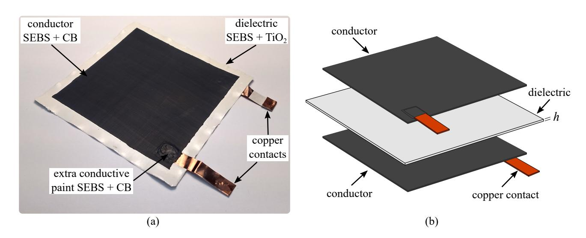

Figure A.1 The soft elastomeric capacitor (SEC): (a) picture of a sensor used in this study with key components annotated; (b) an exploded view of the sensor geometry with key components annotated.

using a commercial two-part epoxy. The fabrication of the SEC is simple and does not require any highly specialized manufacturing or processing equipment. The inner layer of an SEC, the dielectric of the capacitor, is made of an SEBS block co-polymer and filled with TiO<sup>2</sup> to increase both its durability and permittivity(Stoyanov et al., 2010; Day, 1990). TiO<sup>2</sup> is dispersed into a mixture of SEBS and toluene using an ultrasonic tip (D100 Sonic Dismembrator manufactured by Fisher Scientific). The mixture of SEBS-TiO<sup>2</sup> is dropcast onto a 75 × 75 mm<sup>2</sup> glass slide covered with a non-porous Polytetrafluoroethylene (PTFE) coated fiberglass fabric. The toluene is then allowed to evaporate over 48 hours, resulting in a highly flexible thin-film dielectric. The sensors conductive plates are fabricated from a similar SEBS-toluene solution, but doped with carbon black (Printex XE 2-B) instead of TiO2. The carbon black allows for conductive pathways to form within the SEBS matrix. This solution is hand painted onto both sides of the sensor and a copper contact is added to the sensor with a conductive adhesive. Lastly, a thin layer of the conductive paint is added on top of the copper contact to ensure a good connection between the copper contact and SEBS-based conductive paint as shown in Figure A.1(a). The capacitance, *C*, of an SEC can be written

$$\Delta C = e_0 e_r \frac{\Delta A}{\Delta h} \quad (\text{A.1})$$

where *e*<sup>0</sup> = 8.854 pF/m and *e<sup>r</sup>* are the vacuum permittivity and the polymer relative permittivity, respectively. *A* is the overlapping area of the conductive electrodes and *h* is the thickness of the dielectric. The static(Laflamme et al., 2013) and dynamic(Laflamme et al., 2015) sensing capabilities of the SEC have been investigated. In addition to 

{230}------------------------------------------------

<span id="page-230-0"></span>these material-based studies, the SEC has been experimentally investigated for structural health monitoring specific applications, including: fatigue crack detection (Kong et al., 2017); full field strain map reconstruction(Downey et al., 2016); and damage detection and localization in a model wind turbine blade under aerodynamic loading (Downey et al., 2017).

# A.3 Experimental Methodology

### A.3.1 Investigated Specimens

Sensor samples for this study consisted of 24 SEC sensors and 20 dielectric samples. Of the SEC sensors, eight were used for control and 15 were used as testing samples. Both the SEC sensors and the dielectric samples measured 75 × 75 mm<sup>2</sup> while the SEC sensors had a sensing area of 65 × 65 mm<sup>2</sup> . This reduction in the sensors sensing area is due to the extra dielectric that extends past the end of the conductive plates, as shown in Figure [A.1\(](#page-229-0)a). The average capacitance of the SEC sensors after fabrication, when measured as sitting flat on a table in a relaxed state, was 535 pF with a standard deviation of 30 pF. For the SEC sensors, three different percentages of TiO<sup>2</sup> are investigated: 5%, 10%, and 15% TiO<sup>2</sup> by volume. Due to difficulties in painting the SEBS-based conductive paint onto dielectric samples without TiO2, a 0% TiO<sup>2</sup> sample is not considered for the SECs. Likewise, the 20 dielectric samples were fabricated with four different levels of TiO2: 0% (pure SEBS), 5%, 10%, and 15% TiO<sup>2</sup> by volume. Material samples were cut from the both the SEC and dielectric samples for the mechanical testing, as needed.

# A.3.2 Sensor Weathering Tests

The durability investigation of both the dielectric and SEC sensor samples was performed by means of an accelerated weathering test. This experimental investigation is used to quantify the sensors' comparative resistance capability against the combined forces of thermal stress and damaging solar radiation. The different specimens were placed in a QUV machine (QUV Accelerated Weathering Testes, Q-Lab), and the aging test was carried out following the ASTM D 4329-99 (Pra, a), linked to the operative procedure described in the ASTM G 154-06 (Pra, b). According to the standard procedure, the specimens were alternately exposed to repeated cycles of UVA radiation (340 nm, energy of 0.77 W/m<sup>2</sup> ) at 50 ◦C for 8 hours, than 2 hours in a humid condition (100 RH%) at 40 ◦C and lastly 2 hours at 20 ◦C (100 RH%). The effect of the accelerated weathering tests on the different SEC and dielectric mixes was evaluated in terms of visual observations, color variation, mechanical responses by tensile test and degradation properties by thermogravimetric analysis after 1, 7, 15, and 30 days of exposure.

{231}------------------------------------------------

#### <span id="page-231-0"></span>A.3.3 Mechanical and Thermal Characterization of the Samples

Mechanical, thermal, electrical and optical characterizations were performed both before and after the exposures by means of the QUV test. The samples' mechanical behavior before and after the accelerated weathering was evaluated by failure tensile tests. Specifically, the mechanical characterization was performed using a material testing machine (Lloyd Instrument LR 30) with a 500 N load cell at room temperature on five rectangular samples (50 mm × 5 mm). An initial gauge length of 25 mm along with a crosshead speed of 100 mm/min were used during testing. From the material samples' stress-strain curves, the Young's modulus (E), the tensile strength (σr), and elongation at break (εb) were measured.

Thermal degradation, before and after the UV weathering, was evaluated by thermogravimetric analysis (TGA), using a TGA system (Seiko Exstar 6300). TGAs of the different material samples were performed using the following test parameters: 10 mg weight samples, nitrogen flow rate of 250 ml/min, and temperatures ranging from 30 ◦C to 800 ◦C with a heating rate of 10 ◦C/min. The residual mass from thermogravimetric curves of different mixes at different time was evaluated in order to study the effect of UV weathering on the degradation behavior of the studied materials.

#### A.3.4 Optical and Visual Characterization of the Samples

Photographs of the different samples before and after the exposure to the UV weathering were taken for visual comparison, whereas the color changes of studied materials during weathering were examined with a spectrophotometer (CM-2300d Konica Minolta, Japan). Data was acquired using the SCI 10/D65 method with CIELAB color variables, as defined by the International Commission on Illumination(Witt, 1995). The specimens were placed on a standard white plate, allowing for the and ∆L\*, ∆a\*, and ∆b\* parameters and gloss level to be determined.

Optical analyses were performed by means of a solar spectrophotometer with an integrating sphere according to the international test method reported in ASTM E 903-96 (Tes, ), which describes the procedure to perform measurements of spectral near normal-hemispherical reflectance over the spectral range of 300-2500 nm with a lab instrument. For typical applications, solar reflectance values are usually calculated by weighting wavelength with respect to reference solar spectra, according to reference values (Tab, ). In this study, given the focus on the material characterization and not specifically on its capability to stay cooler under the solar radiation, a simple measurement technique is implemented and terrestrial solar irradiance distribution is not evaluated. The spectrophotometer used (SolidSpec-3700) is equipped with a 60 mm-diameter integrating sphere and has a wavelength accuracy of 0.1 nm. The machine functions with a double beam scheme and coated optics. The measurement procedure started by recording the spectral 100%

{232}------------------------------------------------

<span id="page-232-0"></span>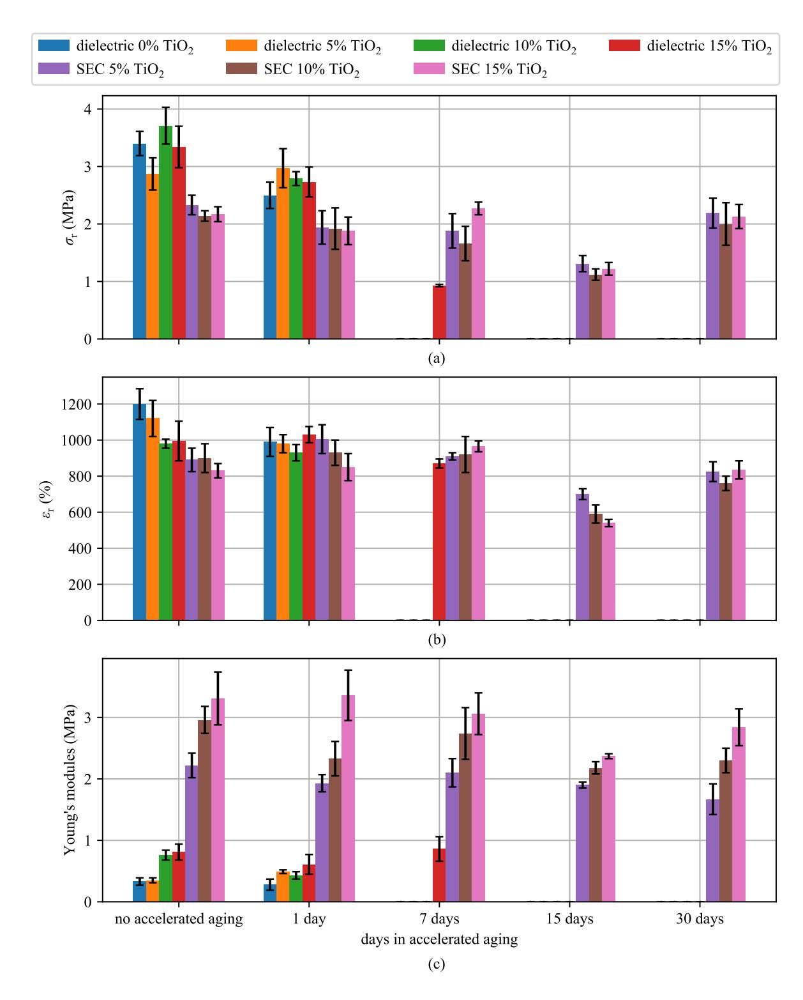

Figure A.2 Mechanical properties of the SECs and dielectrics, with different levels of TiO<sup>2</sup> (dielectric layer), after accelerated aging: (a) tensile strength; (b) elongation at break; (c) Young's modulus.

{233}------------------------------------------------

<span id="page-233-0"></span>and the zero lines to be kept as reference for the whole characterization campaign. Then, all materials were tested and the reflectance values were obtained similar to other literature work(Pisello, 2015), as reported in the following sections.

### A.3.5 Electrical Characterization of the Samples

The capacitance of SEC sensors after aging was measured and compared to the capacitance of the sensor after manufacturing to investigate their durability. Capacitance was measured using an LCR meter (875B manufactured by BK precision). First, the eight control sensors were considered and their capacitance was measured after fabrication and again after one year without any accelerated aging. During this year, the sensors were left in a laboratory environment at room temperature. The capacitance for the 15 SEC samples used for the durability investigation was measured. These measurements were also taken after 1 year with sensors being subjected to either 0, 1, 7, 15, and 30 days of QUV aging. Due to the fact that materials were cut from each of these samples, as required by the material testing needs, the capacitance of portions of the sensors was measured (e.g. a 35 × 75 mm<sup>2</sup> ) and adjusted through Equation [A.1.](#page-229-0) This adjustment was based

on the change in area caused by the removed material to obtain an estimated capacitance for the sensors after aging.

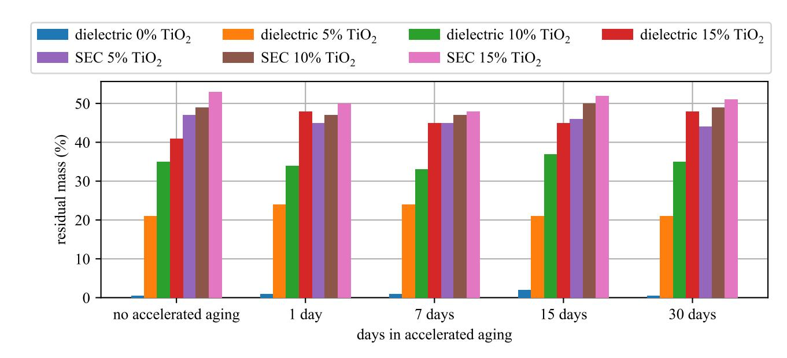

Figure A.3 Residual masses of the SECs and dielectrics, with different levels of TiO<sup>2</sup> doped into the dielectric layer, after accelerated aging.

{234}------------------------------------------------

<span id="page-234-0"></span>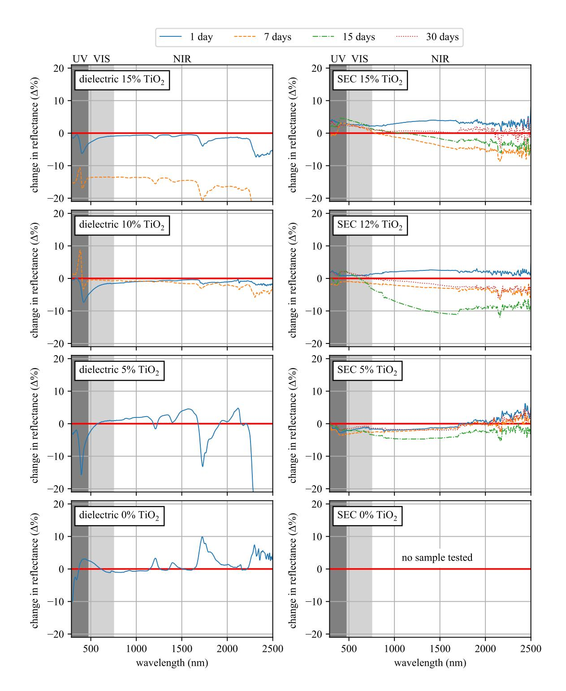

Figure A.4 Change in solar reflectance of the dielectric and the SEC sensor exposed to 1, 7, 15, and 30 days of weathering procedure with respect to the same reference samples, e.g. the dielectric and of the SEC sensors with 0 days of aging (SRday - SRday−0) / SRday−0.

{235}------------------------------------------------

### A.4 Results and Discussion

#### <span id="page-235-0"></span>A.4.1 Durability Analysis of Mechanical and Thermal Behavior of the Samples

The effect of the accelerated weathering test performed on the different sensors and dielectrics was evaluated in terms of visual observations, color variation, mechanical responses by tensile test and degradation properties by thermogravimetric analysis after 1, 7, 15, and 30 days of exposure, using a QUV machine and considering 12-hour long thermal cycles. Each cycle consisted of temperature variations from 20 ◦C to 50 ◦C with a UV intensity value of 0.77 W/m<sup>2</sup> at 340 nm of wavelength.

Figure [A.2](#page-232-0) shows the mechanical properties of SECs and dielectric layers after accelerated aging under various levels of TiO<sup>2</sup> in the dielectric layer. Results show that the pure dielectric (0% TiO2) is quite sensitive to aging, with tensile strength and elongation at break exhibiting notable reductions after just one day of accelerated aging. The addition of TiO<sup>2</sup> is seen to highly improve the dielectric's durability, which is particularly observable with the elongation at break. The carbon-black-based conductive layer found over the SECs results in stable mechanical properties even after 30 days of accelerated aging. It is also found that the inclusion of TiO<sup>2</sup> increases the Young's modulus of the SEC.

Values of the residual masses of the samples after accelerated aging are shown in Figure [A.3.](#page-233-0) The dielectric and sensor samples with higher levels of TiO<sup>2</sup> retained more residual mass relative to samples with lower levels of TiO2. This is clearly observable for the dielectric layer, where the dielectric with 15% TiO<sup>2</sup> retained more than 40% of its mass while the dielectric with 0% TiO<sup>2</sup> retained about 1% of its mass. Aging does not appear to influence the residual mass of any sample.

### A.4.2 Optical and Visual Analysis

Results from the spectrophotometer analysis, as presented in Figure [A.4,](#page-234-0) can be used to investigate the durability of the membranes in terms of solar reflectance variation due to the weathering procedure. Figure [A.4](#page-234-0) shows the relative differences between the total reflectance of the reference membranes, i.e. the dielectric layer and the SEC sensors, and the same samples exposed to 1, 7, 15, and 30 days of aging, using the accelerated weathering test. In general, results indicate a significantly better behavior of the SEC samples compared to the dielectrics. As observed in the left column of Figure [A.4,](#page-234-0) only the 1 day aged dielectric samples could be tested for each of the four TiO<sup>2</sup> concentration values, while the samples exposed to a 7 days-long weathering could only be analyzed when 10 and 15% TiO<sup>2</sup> was added to the dielectric membrane. Higher exposure time caused such a high level of damage to the dielectric samples that it was not possible to perform any spectral analysis on them. The SEC samples, as shown in the right column of Figure

{236}------------------------------------------------

<span id="page-236-0"></span>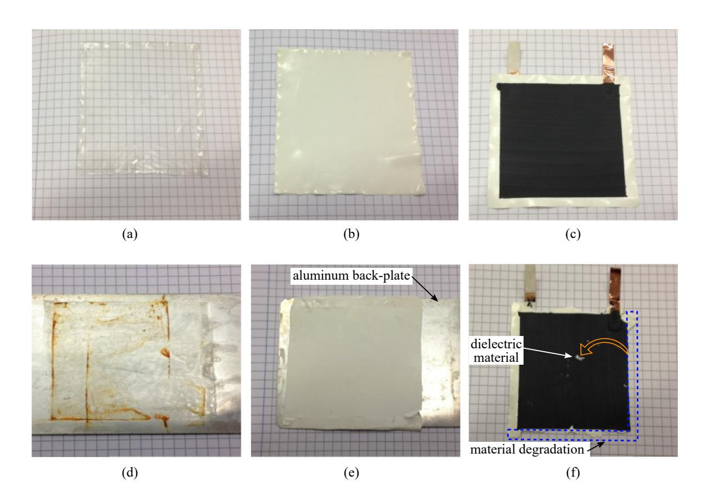

Figure A.5 (a-f): A dielectric with 0% TiO2, a dielectric with 15% TiO2, and an SEC with 15% TiO<sup>2</sup> before (a-c) and after (d-f) the QUV test, respectively. Subfigure (f) shows the deposition of the dielectric material on top of the conductive layer.

[A.4,](#page-234-0) appear to be more resilient to the accelerated aging tests. Although they were exposed to the same weathering cycles as the dielectrics, they all retained a level of mechanical stability that allowed spectrophotometer testing. In this case, despite the lower relative difference between the reference and the other samples, i.e. below ± 10% vs values higher than 12% for the dielectric samples, it is interesting to note that the addition of titanium dioxide to the original mixture seems to produce a higher spectral variation in the samples, particularly in the near infrared region (NIR) of the spectrum. However, the highest variations are generally associated to the samples exposed to a 1 and 15 days-long weathering cycle, while after 30 days all of the samples show a reduced relative difference with respect to the neat sample. Lastly, the introduction of carbon black seems to produce a highly scattered behavior in the range 1700-2500 nm.

Pictures of samples after fabrication and after 30 days of accelerated weathering tests are shown in Figure A.5. These photographs show the degradation for the dielectric layer with 0% TiO<sup>2</sup> before (A.5(a)) and after (A.5(d)) aging.

{237}------------------------------------------------

<span id="page-237-0"></span>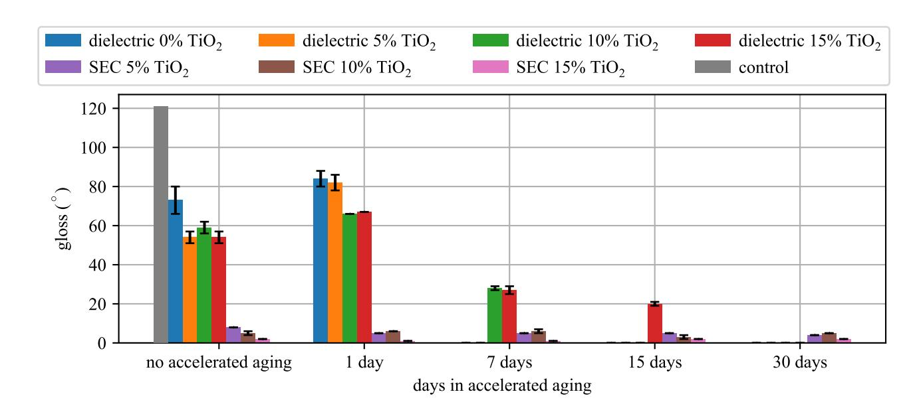

Figure A.6 Colorimetry analysis of SECs and dielectrics with different levels of TiO<sup>2</sup> in the dielectric layer, after accelerated aging.

In the case of the dielectric layer after aging, the material was too fragile to be remove from the aluminum back-plate, which explains the view of the back-plate in the picture. The oxidation in Figure [\(A.5\(](#page-236-0)d)) came from other materials not part of this current study that were tested in close proximity to the sample in the QUV chamber. In comparison, the dielectric layer doped with 15% TiO<sup>2</sup> exhibits only a limited difference from before (Figure [A.5\(](#page-236-0)b)) and after (Figure [A.5\(](#page-236-0)e)) aging. Figures [A.5\(](#page-236-0)c) and [A.5\(](#page-236-0)f) present the effects of 30 days of accelerated aging on an SEC sensor with a dielectric that is doped with 15% TiO2. The unprotected portions of the dielectric layer around the outside of the SEC sensor did degrade, and once fully separated some pieces of the dielectric layer fell onto the carbon-black-based conductor as denoted by the arrow in Figure [A.5\(](#page-236-0)f). No holes were found in the conductor layer of the SEC sensors. The conductive layer was found to provide an excellent protective layer for the dielectric.

Results of the colorimetry analysis are shown in Figure A.6. Quantitatively, these results confirm that the color of the dielectric with 15% TiO<sup>2</sup> is the most stable, at least until the 15 days in the QUV chamber. Additionally, the color of the SECs undergoes limited variations with aging owing to the protection provided by the conductive plates. This data helps to further validate the stability provided by the carbon-black-based conductive plates to the accelerated weathering tests performed in this work.

{238}------------------------------------------------

<span id="page-238-0"></span>Table A.1 Initial capacitance of control specimens and its variation after 12 months.

| sensor | no. TiO_2 (%) | initial C (pF) | final C (pF) | change (%) |
|--------|---------------|----------------|--------------|------------|
| 1      | 5             | 497            | 499          | 0.40       |
| 2      | 5             | 535            | 540          | 0.93       |
| 3      | 5             | 516            | 523          | 1.36       |
| 4      | 10            | 549            | 554          | 0.91       |
| 5      | 10            | 576            | 574          | -0.35      |
| 6      | 10            | 537            | 545          | 1.49       |
| 7      | 15            | 528            | 527          | -0.19      |
| 8      | 15            | 574            | 566          | -1.39      |

### A.4.3 Capacitance Stability Investigation

The capacitance values for the SEC sensors over the one year investigation period are listed in Tables A.1 and [A.2.](#page-239-0) The aged control sensors (Table A.1) do not exhibit any clear reduction in capacitance. Each sensor exhibits changes in capacitance after one year of less than 1.5 % of its initial value. Due to the sensor being allowed to sit freely on the bench during testing, this value is well within the accuracy of the measurement system. As presented in Table [A.2,](#page-239-0) the aged samples exhibit higher variations in their capacitance change over the 1 year period. These variations are not correlated to the number of days the samples spend in the QUV test chamber. For example, the highest variations in capacitance are found in the samples that spent only 1 day in the QUV test chamber and these samples exhibit both positive and negative changes in capacitance. These higher variations in capacitance can be attributed to the extrapolating of the capacitance values from the cut sensor samples rather than the aging of the sensors. This hypothesis is further validated by the fact that when considering the sensors in the aged sample set, the total change for the average capacitance for all 15 sensors is a decrease of just 0.72% from their initial average capacitance.

{239}------------------------------------------------

Table A.2 Capacitance of SECs after QUV testing.

<span id="page-239-0"></span>

| sensor no.     | TiO 2 (%) | initial C (pF) | final C (pF) | change (%) |
|----------------|-----------|----------------|--------------|------------|
| 1              | 5         | 520            | 513          | -1.44      |
| No QUV 2       | 10        | 583            | 563          | -3.52      |
| 3              | 15        | 540            | 525          | -2.78      |
| 4              | 5         | 534            | 624          | 16.85      |
| QUV 1 day 5    | 10        | 581            | 510          | -12.22     |
| 6              | 15        | 545            | 534          | -2.02      |
| 7              | 5         | 505            | 540          | 6.93       |
| QUV 7 days 8   | 10        | 586            | 558          | -4.78      |
| 9              | 15        | 558            | 550          | -1.43      |
| 10             | 5         | 503            | 486          | 0.91       |
| QUV 15 days 11 | 10        | 546            | 568          | 4.03       |
| 12             | 15        | 507            | 496          | -2.17      |
| 13             | 5         | 481            | 482          | 0.21       |
| QUV 50 days 14 | 10        | 524            | 504          | -3.82      |
| 15             | 15        | 487            | 460          | -5.54      |

# A.5 Conclusion

The paper has investigated long-term durability of the soft elastomeric capacitor, a skin-type strain sensor developed for measuring strain over large structural surfaces. This sensor is designed as a parallel plate capacitor with the dielectric made of a styrene-co-ethylene-co-butylene-co-styrene (SEBS) block co-polymer matrix doped with TiO<sup>2</sup> and two conductive plates consisting of the same SEBS matrix, but filled with carbon black to increase its conductivity. The results have shown that the introduction of TiO<sup>2</sup> can strongly improve the durability of the inner dielectric layer of the sensor. Furthermore, the conductive plates doped with carbon black are observed to effectively act as protective layers for the inner dielectric. The increase in durability of both the SEC sensor and its dielectric layer was quantified through a series of mechanical, thermal, and optical tests. Additionally, within the constraints of this study, it was demonstrated that the capacitance of the sensor does not significantly vary through aging. Future work will include an investigation of the strain-sensitivity of the sensors under various static and dynamic loading cases. From the results presented in this research, it can be concluded that the mechanical and electrical robustness of the SEC sensor, when the dielectric is doped with at least 5% TiO2, is resilient to the effects of accelerated weathering.

{240}------------------------------------------------

# Acknowledgments

<span id="page-240-0"></span>The support of the National Science Foundation Grant No. 1069283, which supports the activities of the Integrative Graduate Education and Research Traineeship (IGERT) in Wind Energy Science, Engineering and Policy (WESEP) at Iowa State University is gratefully acknowledged. This work is also partly supported by the Italian Ministry of Education, University and Research (MIUR) through the funded Project of Relevant National Interest (PRIN) entitled "SMART-BRICK: Novel strain-sensing nano-composite clay brick enabling self-monitoring masonry structures" (protocol no. 2015MS5L27). Any opinions, findings, and conclusions or recommendations expressed in this material are those of the authors and do not necessarily reflect the views of the funding agencies (National Science Foundation and MIUR).

# A.6 References

Practice for fluorescent ultraviolet (UV) lamp apparatus exposure of plastics.

Practice for operating fluorescent ultraviolet (UV) lamp apparatus for exposure of nonmetallic materials.

Tables for reference solar spectral irradiances: Direct normal and hemispherical on 37 tilted surface.

Test method for solar absorptance, reflectance, and transmittance of materials using integrating spheres.

(2000). Carbon black. In Inc, J. W. &. S., editor, *Kirk-Othmer Encyclopedia of Chemical Technology*. John Wiley & Sons, Inc.

Burton, A., Lynch, J., Kurata, M., and Law, K. (2017). Fully integrated carbon nanotube composite thin film strain sensors on flexible substrates for structural health monitoring. *Smart Materials and Structures*, 26(9).

Day, R. (1990). The role of titanium dioxide pigments in the degradation and stabilisation of polymers in the plastics industry. *Polymer Degradation and Stability*, 29(1):73–92.

Downey, A., Laflamme, S., and Ubertini, F. (2016). Reconstruction of in-plane strain maps using hybrid dense sensor network composed of sensing skin. *Measurement Science and Technology*, 27(12):124016.

{241}------------------------------------------------

Downey, A., Laflamme, S., and Ubertini, F. (2017). Experimental wind tunnel study of a smart sensing skin for condition evaluation of a wind turbine blade. *Smart Materials and Structures*. Kaldellis, J. and Kapsali, M. (2013). Shifting towards offshore wind energy—recent activity and future development. *Energy Policy*, 53:136–148. Kang, I., Schulz, M. J., Kim, J. H., Shanov, V., and Shi, D. (2006). A carbon nanotube strain sensor for structural health monitoring. *Smart Materials and Structures*, 15(3):737–748. Kong, X., Li, J., Collins, W., Bennett, C., Laflamme, S., and Jo, H. (2017). A large-area strain sensing technology for monitoring fatigue cracks in steel bridges. *Smart Materials and Structures*, 26(8):085024. Laflamme, S., Kollosche, M., Connor, J. J., and Kofod, G. (2013). Robust flexible capacitive surface sensor for structural health monitoring applications. *Journal of Engineering Mechanics*, 139(7):879–885. Laflamme, S., Ubertini, F., Saleem, H., D'Alessandro, A., Downey, A., Ceylan, H., and Materazzi, A. L. (2015). Dynamic characterization of a soft elastomeric capacitor for structural health monitoring. *Journal of Structural Engineering*, 141(8):04014186. Loh, K. J., Hou, T.-C., Lynch, J. P., and Kotov, N. A. (2009). Carbon nanotube sensing skins for spatial strain and impact damage identification. *Journal of Nondestructive Evaluation*, 28(1):9–25. Luo, S., Hoang, P. T., and Liu, T. (2016). Direct laser writing for creating porous graphitic structures and their use for flexible and highly sensitive sensor and sensor arrays. *Carbon*, 96:522–531. Mar´ın, J., Barroso, A., Par´ıs, F., and Canas, J. (2008). Study of damage and repair of blades of a 300kw wind turbine. ˜ *Energy*, 33(7):1068–1083. Pisello, A. (2015). Experimental analysis of cool traditional solar shading systems for residential buildings. *Energies*, 8(3):2197–2210. Rwei, S.-P., Manas-Zloczower, I., and Feke, D. L. (1992). Analysis of dispersion of carbon black in polymeric melts and its effect on compound properties. *Polymer Engineering and Science*, 32(2):130–135. Schulz, M. J. and Sundaresan, M. J. (2006). *Smart Sensor System for Structural Condition Monitoring of Wind Turbines: May 30, 2002-April 30, 2006*. National Renewable Energy Laboratory.

{242}------------------------------------------------

Shaahid, S. and El-Amin, I. (2009). Techno-economic evaluation of off-grid hybrid photovoltaic–diesel–battery power systems for rural electrification in saudi arabia—a way forward for sustainable development. *Renewable and Sustainable Energy Reviews*, 13(3):625–633. Stoyanov, H., Kollosche, M., McCarthy, D. N., and Kofod, G. (2010). Molecular composites with enhanced energy density for electroactive polymers. *Journal of Materials Chemistry*, 20(35):7558. Witt, K. (1995). Cie guidelines for coordinated future work on industrial colour-difference evaluation. *Color Research* & *Application*, 20(6):399–403. Yao, Y., Tung, S.-T. E., and Glisic, B. (2014). Crack detection and characterization techniques-an overview. *Structural Control and Health Monitoring*, 21(12):1387–1413.

{243}------------------------------------------------

# <span id="page-243-0"></span>APPENDIX B. INVESTIGATION OF DYNAMIC PROPERTIES OF A NOVEL CAPACITIVE-BASED SENSING SKIN FOR NONDESTRUCTIVE EVALUATION

This chapter is wholly based on "Investigation of Dynamic Properties of a Novel Capacitive-Based Sensing Skin for Nondestructive Evaluation" published in Materials Evaluation, vol. 73, no. 10, 2015, p.

1384-1319.

Hussam Saleem<sup>1</sup> , Austin Downey<sup>1</sup> , Simon Laflamme1,<sup>2</sup> , Matthias Kollosche<sup>3</sup> , Filippo Ubertini<sup>4</sup>

# Abstract

A capacitive-based soft elastomeric strain sensor was recently developed by the authors for structural health monitoring applications. Arranged in a network configuration, the sensor becomes a sensing skin, where local deformations can be monitored over a global area. The sensor transduces a change in geometry into a measurable change in capacitance, which can be converted into strain using a previously developed electromechanical model. Prior studies have demonstrated limitations of this electromechanical models for dynamic excitations beyond 15 Hz, due to a loss in linearity in the sensor's response. In this paper, the dynamic behavior beyond 15 Hz is further studied, and a new version of the electromechanical model is proposed in order to accommodate dynamic strain measurements up to 40 Hz. This behavior is characterized by subjecting the sensor to a frequency sweep, and identifying possible sources of nonlinearities beyond 15 Hz. Results show possible frequency dependence of the materials' Poisson's ratio, which is successfully modeled and integrated into the electromechanical model. This demonstrates that the proposed sensor can be used for monitoring and evaluation of structural responses up to 40 Hz, a range covering the vast majority of

<sup>1</sup> Department of Civil, Construction, and Environmental Engineering, Iowa State University, Ames, IA, USA

<sup>2</sup> Department of Electrical and Computer Engineering, Iowa State University, Ames, IA, USA

<sup>3</sup> Institute of Physics and Astronomy, Potsdam University, Potsdam , Germany;

<sup>4</sup> Department of Civil and Environmental Engineering, University of Perugia, Perugia, Italy

{244}------------------------------------------------

<span id="page-244-0"></span>the dominating frequency responses of civil infrastructures.

Keywords: nondestructive evaluation, structural health monitoring, soft elastomeric capacitor, capacitive sensor, vibration monitoring, sensing skin.

# B.1 Introduction

Structural health monitoring (SHM) is defined as the automation of nondestructive evaluation (NDE), aimed at diagnosing, localizing, and prognosing structural damages in order to ensure public safety and structural integrity (Harms et al., 2010). A particular challenge in SHM is associated with the magnitude of the geometries under assessment (Laflamme et al., 2015). Existing sensing solutions are typically difficult to scale up to this mesoscale, because of technical and/or economic constraints. These include limitations in data interpretation, cost of installation, and scalability of the transducers (Farrar and Lieven, 2007; Laflamme et al., 2013).

Recent advances in conductive polymers have enabled the development of scalable sensors. Their measurement principles are typically based on monitoring local states over global areas by deploying large arrays of flexible sensing substrates, analogous to sensing skins. For instance, Refs. (Kang et al., 2006; Loh et al., 2009; Srivastava et al., 2011) investigated carbon nanotube-based flexible strain sensors, and Refs. (Tung et al., 2014; Hu et al., 2014) proposed to utilize flexible sensing sheets of strain gauges.

The authors have recently proposed a highly scalable sensing skin for measurement of strain onto mesosurfaces (Laflamme et al., 2013). The skin is composed of a dense network of soft elastomeric capacitors (SEC). The dielectric of an SEC is fabricated from a styrene-co-ethylene-co-butylene-co-styrene (SEBS) polymer matrix doped with titanium dioxide (TiO2) nanoparticles, and the electrodes are constituted also from SEBS, but doped with carbon black (CB) particles. The SEC tranduces a change in its geometry into a measurable change in its capacitance. Other capacitive-based sensors have been proposed in literature for applications to humidity (Hong et al., 2012), pressure (Lipomi et al., 2011), strain (Arshak et al., 2000; Suster et al., 2006), and tri-axial measurements (Dobrzynska and Gijs, 2012). The proposed SEC differs from other sensors by being inexpensive and easy to fabricate, thus being highly scalable.

The utilization of the SEC technology for nondestructive evaluation has been demonstrated, including applications to fatigue crack detection (Kharroub et al., 2015), surface strain measurements (Wu et al., 2015), and extraction of deflection shapes (Laflamme et al., 2013b). These applications were focused on static and quasi-static behaviors. Recent investigations have been conducted on the characterization of the dynamic behavior of the SEC (Laflamme 

{245}------------------------------------------------

<span id="page-245-0"></span>et al., 2015), with applications to monitoring of vibration signatures (Ubertini et al., 2014). Both studies concluded that while the sensor can detect a change in dynamic properties, it only provides a linear response for mechanical excitations up to 15 Hz.

This paper investigates the dynamic response of the SEC for a wider range of excitation, considering mechanical frequencies up to 40 Hz, which covers a wide range of structural dynamics found in mesosystems. Note that unless noted otherwise, the term "frequency" in this paper refers to a mechanical frequency, not electrical. The electrical frequency-dependence of SEBS filled with titania has been thoroughly discussed in literature (Stoyanov et al., 2010; Kollosche et al., 2011). The objective of this paper is to develop an augmented electromechanical model that accommodates for possible sources of nonlinearity beyond 15 Hz, to enable SHM applications up to 40 Hz, a range covering the vast majority of the dominating frequency responses of civil infrastructures.

It is hypothesized that a possible source of nonlinearity arises from a non-negligible frequency-dependence of the SEBS's Poisson's ratio due to its viscoelasticity (Tschoegl et al., 2002; Pritz, 2007; Kugler et al., 1990; Wada et al., 1962). A laboratory-based study is conducted to test the hypothesis by investigating the change in the sensor's sensitivity as a function of frequency. Its dynamic behavior is characterized up to 40 Hz based on the assumption that this sensitivity is purely explained by the frequency-dependence of the Poisson's ratio. This model is used to develop an augmented electromechanical model for the SEC.

The rest of the paper is organized as follows. Section 2 presents the background on the technology, which includes the fabrication method and the original electromechanical model. Section 3 investigates the sensor's dynamic behavior, and develops an augmented electromechanical model that covers excitations up to 40 Hz. Section 4 concludes the paper.

### B.2 Background

This section provides a background on the SEC technology. It includes a description of the fabrication process and a derivation of the original electromechanical model.

#### B.2.1 Fabrication Method

The fabrication process of an SEC is described in details in Ref. (Kharroub et al., 2015). Briefly, SEBS is dissolved in toluene, and the solution is mixed with 15 vol% TiO<sup>2</sup> to increase permittivity and durability of the polymer. Uniform dispersion of the nanoparticles is obtained via sonication using a sonic dismembrator for 10 min. The sonicated solution is then casted on a 80 mm × 80 mm non-stick glass plate and left overnight for the solvent to

{246}------------------------------------------------

<span id="page-246-0"></span>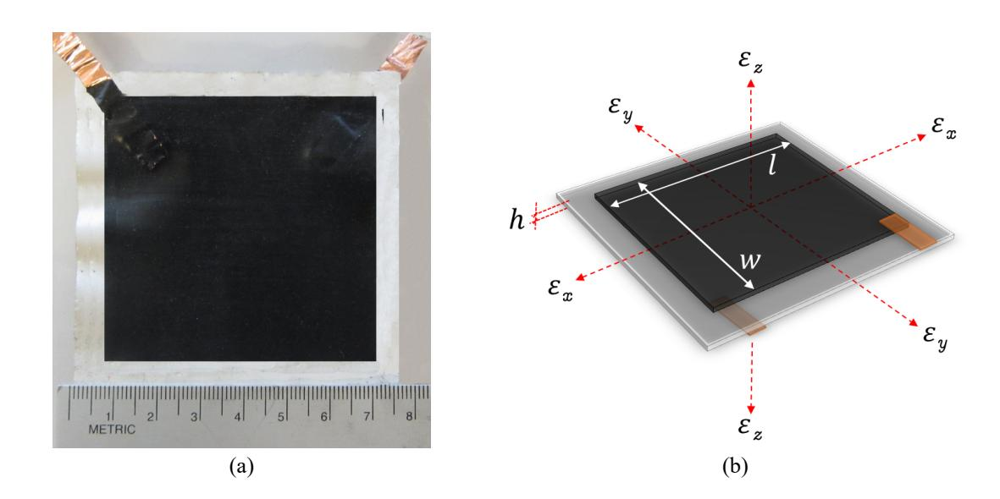

Figure B.1 soft elastomeric capacitor (SEC): (a) picture (75 x 75 mm<sup>2</sup> ); and (b) reference axis

evaporate, which creates the dielectric. In the meanwhile, 10 vol% CB is added to another SEBS-toluene solution and dispersed in a sonic bath for 6 hours. The resulting conductive paint is applied onto the top and bottom surfaces of the dielectric to create electrodes. Copper tape is embedded in the wet conductive paint, on each sides of the dielectric, to enable mechanical connections to the data acquisition system (DAQ). Figure B.1(a) is a picture of the resulting SEC.

### B.2.2 Electromechanical Model

The SEC is designed to measure in-plane strain along the *x* − *y* plane shown in Fig. B.1(b). Assuming low electrical frequency measurements (< 1 kHz), the SEC can be simplified as a non-lossy parallel plate capacitor with capacitance *C*

$$C = e_0 e_r \frac{A}{h} \quad (\text{B.1})$$

where *e*<sup>0</sup> = 8.854 pF/m is the vacuum permittivity, *e<sup>r</sup>* is the polymer relative permittivity, *A* = *w* · *l* is the area of the sensor electrodes of width *w* and length *l*, and *h* is the thickness of the dielectric. Assuming small strain, one can take the differential of Eq. (B.1) to obtain an expression for the change in capacitance ∆*C*:

$$\frac{\Delta C}{C} = \left( \frac{\Delta l}{l} + \frac{\Delta w}{w} - \frac{\Delta h}{h} \right) = \varepsilon_x + \varepsilon_y - \varepsilon_z \quad (\text{B.2})$$

{247}------------------------------------------------

<span id="page-247-0"></span>where  $\varepsilon_x$ ,  $\varepsilon_y$  and  $\varepsilon_z$  are strains in the  $x$ ,  $y$  and  $z$  directions as shown in Fig. B.1(b). An expression relating  $\varepsilon_z$  to  $\varepsilon_x$  and  $\varepsilon_y$  can be obtained using Hooke's law for plane stress conditions:

$$\varepsilon_z = -\frac{v}{1-v}(\varepsilon_x + \varepsilon_y) \quad (\text{B.3})$$

The final form of the electromechanical model is obtained by integrating Eq. B.3 in Eq. B.2

$$\frac{\Delta C}{C} = \lambda(\varepsilon_x + \varepsilon_y) \quad (\text{B.4})$$

where

$$\lambda = \frac{1}{1-\nu} \quad (\text{B.5})$$

is the gauge factor. For SEBS,  $v \approx 0.49$  (Wilkinson et al., 2004), which yields a gauge factor  $\lambda \approx 2$ .

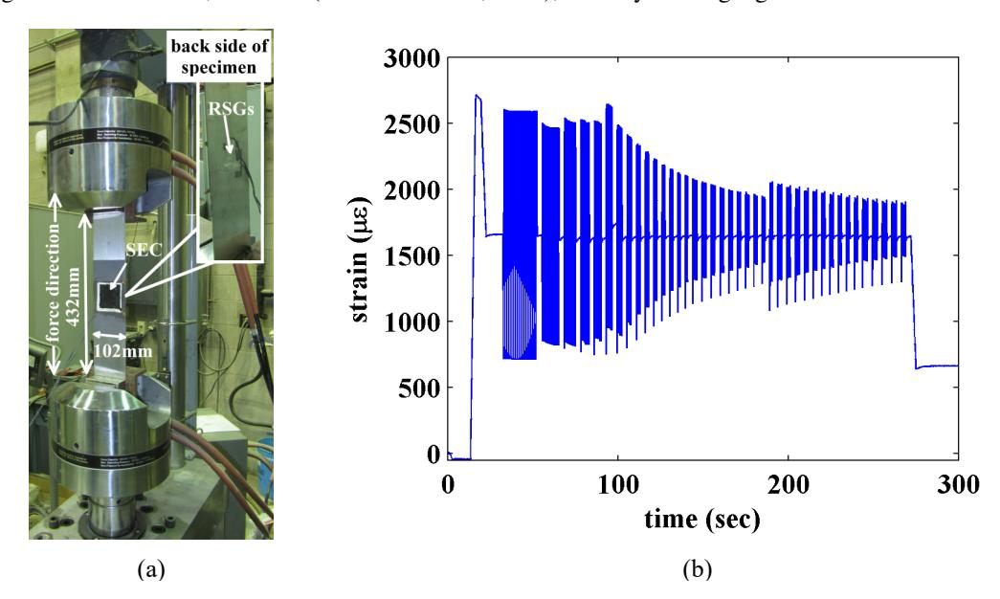

Figure B.2 (a) test setup and (b) RSG strain data

# B.3 Investigation of Dynamic Behavior

In this section, the behavior of the SEC is investigated in the frequency range 1-40 Hz. Response linearity and sensitivity as a function of a frequency-dependent Poisson's ratio are studied. Finally, an augmented electromechanical model where  $\nu$  is allowed to be frequency-dependent in Eq. (B.5) is presented.

{248}------------------------------------------------

### <span id="page-248-0"></span>B.3.1 Methodology

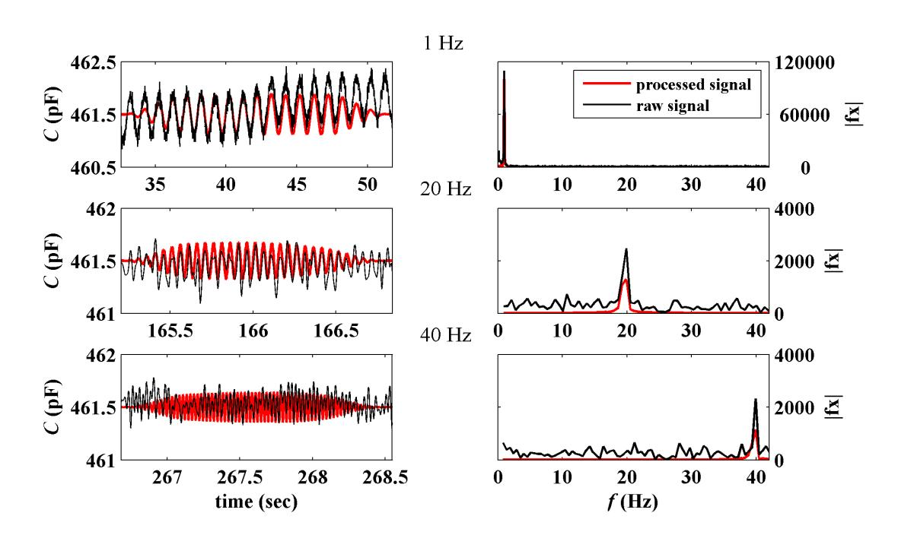

Figure B.3 Time histories and Fourier transforms of signals provided by RSGs and SEC in the harmonic tensile load test

The test setup is shown in Fig. [B.2\(](#page-247-0)a). It consists of an aluminum plate of dimensions 432 x 102 x 0.68 mm<sup>3</sup> excited axially, onto which an SEC is adhered. Two resistive strain gauges (RSGs) are installed onto the back of the plate opposite to the SEC, measuring strain in both the *x* and *y* directions independently, where *x* denotes the direction of the applied load and *y* is transverse to the load and in-plane with the SEC. Data from the SEC are recorded using an off-the-shelf DAQ (ACAM PCAP-02) at a sampling rate of 250 Hz.

The axial excitation is provided by a servo-hydraulic testing machine, and consists of a time-varying harmonic tensile force sweeping from 1 to 40 Hz in 1 Hz increments. The strain time history is shown in Figure [B.2\(](#page-247-0)b). Due to equipment limitations, the displacement decreased with increasing frequency as it is observed in Figure [B.2\(](#page-247-0)b).

Parameters of interest in the study of the dynamic behavior of the SEC are the linearity of the response and the gauge factor as a function of the excitation frequency. For each frequency of interest, the time histories of both the load input and the sensor's capacitance output were extracted using a window function. A band-pass filter designed around this frequency was applied to both time series (input and output) to reduce noise. The linearity was assessed by plotting the filtered output versus the filtered input, and the experimental gauge factor was back-calculated from Eq. [B.4](#page-247-0) using the measured <sup>ε</sup>*<sup>x</sup>* and <sup>ε</sup>*<sup>y</sup>* from the resistive strain gauges and ∆*C*.

{249}------------------------------------------------

<span id="page-249-0"></span>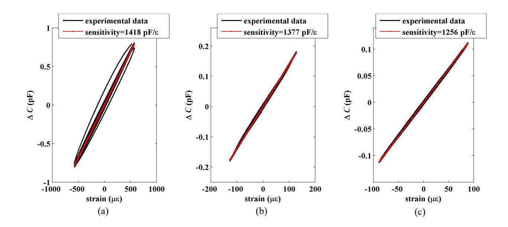

Figure B.4 sensitivity and linearity of the sensor signal at: (a) 1 Hz; (b) 20 Hz; and (c) 40 Hz

Figure [B.3](#page-248-0) shows the filtered time series following this methodology at three particular frequencies: 1, 20 and 40 Hz, which represent the lowest, middle and highest frequencies in the sweep. A salient feature in the plots is the increase in the level of noise with the increase in frequency. This can be attributed to electromagnetic interference (EMI), despite careful attention to minimize such noise in the experimental setup (e.g., by utilizing shielded cables and grounding of components).

Figure [B.5](#page-250-0) shows the wavelet transform of the raw signal (Figure [B.5\(](#page-250-0)a)) compared against the processed signal (Figure [B.5\(](#page-250-0)b)), using morlet wavelets. The wavelet transform is normalized at each discrete time interval to the highest wavelet amplitude. The black line is the input frequency content. Results validate the signal processing methodology, and show good agreement between the dynamic input and sensor output across the entire frequency range from 1 to 40 Hz.

#### B.3.2 Results

The sensor linearity and sensitivity are studied through the investigation of the sensor's response as a function of frequencies. Figure B.4 are plots of the response of the SEC against the measured additive strain <sup>ε</sup>*<sup>x</sup>* + <sup>ε</sup>*y*. The red line is the linear fit obtained via linear regression. The quality of the linear fit represents the linearity of the sensor, while the slope of the regression represents its sensitivity *S* = ∆*C*/(ε*<sup>x</sup>* + <sup>ε</sup>*y*). The root means square error (RMSE) is used as a performance measure for linearity, plotted in Fig. [B.6.](#page-251-0) The figure shows higher error at lower frequency excitations.

{250}------------------------------------------------

<span id="page-250-0"></span>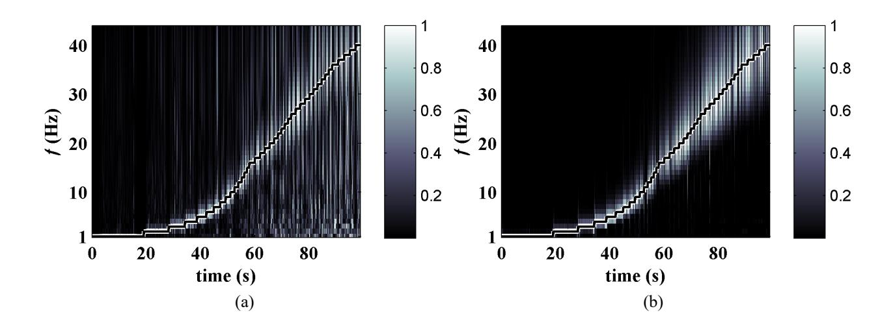

Figure B.5 wavelet transform of the a) raw and the b) processed data

This could be attributed to the higher magnitude of the strain input at lower frequencies. Yet, the overall RMSE shows a good linearity of the sensor.

Results from Fig. [B.4](#page-249-0) show a decrease in sensitivity with increasing frequency. This can also be observed in the plotted gauge factor, calculated from the experimental results, shown in Figure [B.7.](#page-252-0) A two-term power series provided the best fit of the experimental gauge factor data. This fit illustrates the apparent reduction in the gauge factor as the frequency increases. The sensitivity *S* is reduced by 2.9% at 20 Hz and 11.5% at 40 Hz with respect to the reference *S* at 1 Hz as shown in Figures [B.4\(](#page-249-0)a), (b), and (c) respectively.

As explained in the introduction, we model the change in the sensor's sensitivity assuming that it can be explained by the complex Poisson's ratio of the material. Consider the strain modeled as a complex component (Pritz, 2007):

$$\varepsilon_x(t) = \hat{\varepsilon}_x e^{j\omega t} \quad (\text{B.6})$$

$$\varepsilon_y(t) = \hat{\varepsilon}_y e^{j\omega(t-\Delta t)} = \hat{\varepsilon}_y e^{j(\omega t - \delta_y)}$$

where  $t$  is the time,  $\hat{\mathcal{E}}_x$  is the amplitude of the axial strain,  $\hat{\mathcal{E}}_y$  is the amplitude of the lateral strain modeled with the same frequency response as  $\hat{\mathcal{E}}_x$ , but with a phase lag  $\delta_y = \omega\Delta t$ . The complex Poisson's ratio is the ratio of the lateral to the axial strains:

$$\bar{v}(j\omega) = \frac{\hat{\epsilon}_y(t)}{\hat{\epsilon}_x(t)} = \frac{\hat{\epsilon}_y}{\hat{\epsilon}_x} e^{-j\delta_y} = \frac{\hat{\epsilon}_y}{\hat{\epsilon}_x} (\cos \delta_y - j \sin \delta_y) = v_d(\omega) - jv_l(\omega) = v_d(\omega)[1 - j\eta_y(\omega)] \quad (\text{B.7})$$

{251}------------------------------------------------

<span id="page-251-0"></span>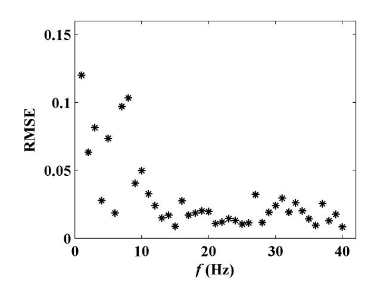

Figure B.6 root mean square fitting error for the capacitance data

where  $v_d$  is the dynamic Poisson's ratio,  $v_l$  is the loss component, and  $\eta_v$  is the Poisson's loss factor:

$$\eta_v(\omega) = \frac{v_l(\omega)}{v_d(\omega)} \quad (\text{B.8})$$

The absolute value of  $\bar{v}(j\omega)$  (Eqn. B.7) provides an expression that relates  $v_d$  and  $\eta_v$  to the magnitude of the Poisson's ratio  $|\bar{v}(j\omega)|$ :

$$|\bar{v}(j\omega)| = \frac{\hat{\epsilon}_y}{\hat{\epsilon}_x} = (v_d^2 + v_l^2)^{1/2} = v_d(1 + \eta_v^2)^{1/2} \quad (\text{B.9})$$

Further, it is shown in Ref.(Pritz, 2007) that, assuming an incompressible material ( $v_d \approx 0.5$ ), the Poisson's loss factor relates to the materials' shear loss modulus  $\eta_G$  through the following expression:

$$\frac{\eta_V(\omega)}{\eta_G(\omega)} \approx 1 - 2v_d(\omega) \quad (\text{B.10})$$

We obtained a set of experimental values for  $\eta_G$  by conducting a dynamic mechanical analysis (DMA) of the studied material. Fig. B.8 presents the results. Measurements indicate an increase in the real part of the shear modulus  $G'$  and the shear loss modulus  $\eta_G = G'/G$  with increasing frequency. This phenomenon can be attributed to the polymer-particles and particle-particle interactions (Fröhlich et al., 2005).

Values for  $\eta_G$  obtained from the DMA, combined with the experimental Poisson's ratio coefficients derived from  $S$  and Eqn. B.5, can be used with Eqns. B.9 and B.10 to find  $\nu_d$  and  $\eta_\nu$ . Figures. B.9(a) and (b) show the results obtained over the frequency range 1-40 Hz. Results show a decreasing dynamic Poisson's ratio  $\nu_d$  and an increasing Poisson's loss factor  $\eta_\nu$  with increasing frequency. The red solid line is the data fit using a two-term power series fit.

{252}------------------------------------------------

<span id="page-252-0"></span>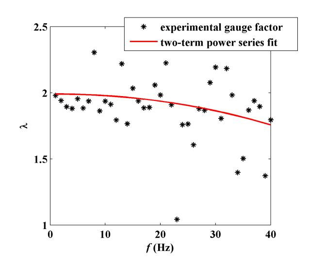

Figure B.7 experimental gauge factor

This fit can be used to characterize the changes in  $v_d$  and  $\eta_v$  as a function of  $\omega$ , and yield mathematical expressions to generate the adjusted electromechanical model.

Table B.1 Average RMSE<sub>λ</sub>

|                | 1-40 Hz | range 1-15 Hz | 16-40 Hz |
|----------------|---------|---------------|----------|
| original model | 0.266   | 0.146         | 0.317    |
| adjusted model | 0.228   | 0.143         | 0.267    |
| improvement    | 14.3%   | 2.05%         | 15.8%    |

### B.3.3 Adjusted Electromechanical Model

Using results from the previous section, we can generate an adjusted electromechanical model that accounts for the change in the material's behavior as the frequency increases. The proposed model is a variation of Eqn. B.4:

$$\frac{\Delta C}{C} = \lambda_{\text{adj}}(\varepsilon_x + \varepsilon_y) \quad (\text{B.11})$$

where

$$\lambda_{\text{adj}} = \frac{1}{1 - v_{\text{adj}}} \quad (\text{B.12})$$

{253}------------------------------------------------

<span id="page-253-0"></span>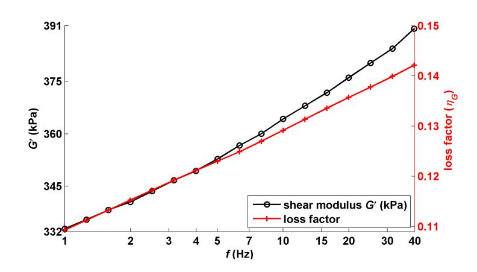

Figure B.8 Storage moduli (*G* 0 ) and loss factor (η*G*) as functions of frequency for the SEC composite (SEBS+TiO2).

and

$$\nu_{\text{adj}}(\omega) = \nu_d(\omega)(1 + \eta_V^2(\omega))^{1/2} \quad (\text{B.13})$$

where the expressions for  $v_d$  and  $\eta_v$  are directly obtained from the investigation in the previous section:

$$v_d(\omega) = -4.65 \times 10^{-5} \omega^{1.35} + 0.49 \quad (\text{B.14})$$

$$\eta_\nu(\omega) = 1.27 \times 10^{-5} \omega^{1.36} + 0.0016$$

where the adjusted electromechanical model is valid up to 40 Hz.

Figure [B.10](#page-254-0) shows the RMSE on the estimation of λ as a function of frequency, for both the original and adjusted models. Table [B.1](#page-252-0) summarizes the results for frequency ranges of interest. Results show that the adjusted model provides an overall improvement on the estimation of RMSE<sup>λ</sup> by 14.3% over the range 1-40 Hz. The vast majority of this improvement is from the estimation in the 16-40 Hz range, where the adjusted model improves the estimation on RMSE<sup>λ</sup> by 15.8%. This demonstrates the superiority of the new model over the original model. Note that the RMSE<sup>λ</sup> over the range 1-15 Hz is only marginally improved, which demonstrates the validity of the original model over the 1-15 Hz range.

{254}------------------------------------------------

<span id="page-254-0"></span>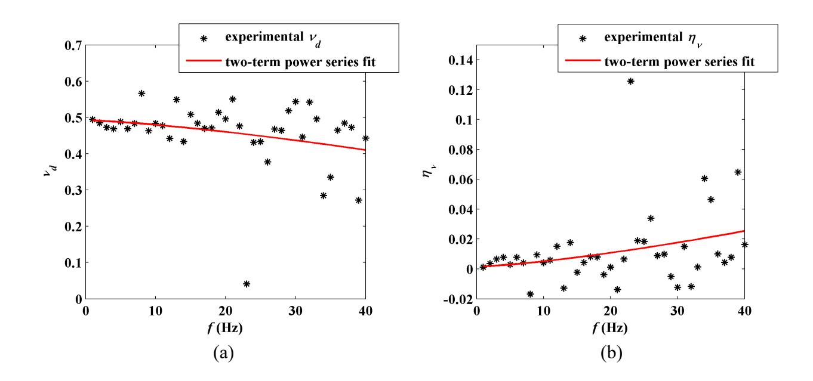

Figure B.9 a) Dynamic Poisson's ratio and b) Poisson's ratio loss factor plotted against frequency

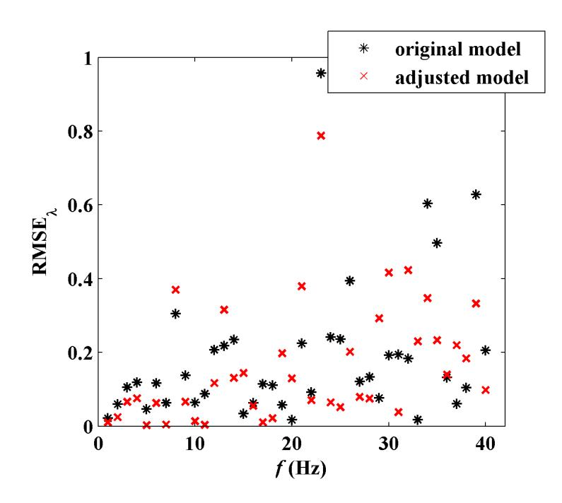

Figure B.10 Root mean square error (RMSE) on the estimation of λ as a function of frequency

{255}------------------------------------------------

# B.4 Conclusion

<span id="page-255-0"></span>In this paper, we have presented a novel sensor for nondestructive evaluation. The sensor is a soft elastomeric capacitor (SEC). Arranged in a network configuration, it is analogous to sensing skin, in the sense that it can measure discrete changes over a global area. Previous work on the SEC developed an electromechanical model, which showed to be valid for excitations up to 15 Hz. Here, we proposed to adjust the electromechanical model to cover a broader range of excitations, up to 40 Hz.

We hypothesized that a possible source of nonlinearities arose from a non-negligible frequency-dependence of the SEBS's Poisson's ratio due to its viscoelasticity. An empirical study on the SEC's material response as a function of frequency was conducted. Results show that the experimental Poisson's ratio decreased with increasing mechanical frequency. This relationship was successfully modeled as a complex Poisson's ratio, and led to an adjusted electromechanical model that could account for the sensor's nonlinearities up to 40 Hz. Note that while it is possible that the nonlinearities come from other sources, this model can still be used to transduce changes in capacitance into strain.

By covering an excitation range up to 40 Hz, the adjusted electromechanical model enables measurements over a frequency range that covers the vast majority of dynamic responses in civil structures. It empowers the SEC technologies with dynamic measurement capabilities, useful for vibration-based structural health monitoring and nondestructive evaluation.

## Acknowledgments

The work presented in this paper is partially funded by a fellowship award from the American Society for Nondestructive Testing. The development of the SEC technology is supported by grant No. 1001062565 from the Iowa Alliance for Wind Innovation and Novel Development and grant No. 13-02 from the Iowa Energy Center. This work is also partially funded under the U.S. National Science Foundation Grant No. 4782025 which supports the activities of the Integrative Graduate Education and Research Traineeship (IGERT) in Wind Energy Science, Engineering and Policy (WESEP) at Iowa State University.

{256}------------------------------------------------

# B.5 References

<span id="page-256-0"></span>Arshak, K., McDonagh, D., and Durcan, M. (2000). Development of new capacitive strain sensors based on thick film polymer and cermet technologies. *Sensors and Actuators A: Physical*, 79(2):102–114. Dobrzynska, J. A. and Gijs, M. A. M. (2012). Polymer-based flexible capacitive sensor for three-axial force measurements. *Journal of Micromechanics and Microengineering*, 23(1):015009. Farrar, C. R. and Lieven, N. A. J. (2007). Damage prognosis: the future of structural health monitoring. *Philosophical Transactions of the Royal Society A: Mathematical, Physical and Engineering Sciences*, 365(1851):623–632. Frohlich, J., Niedermeier, W., and Luginsland, H.-D. (2005). The e ¨ ffect of filler–filler and filler–elastomer interaction on rubber reinforcement. *Composites Part A: Applied Science and Manufacturing*, 36(4):449–460. Harms, T., Sedigh, S., and Bastianini, F. (2010). Structural health monitoring of bridges using wireless sensor networks. *IEEE Instrumentation* & *Measurement Magazine*, 13(6):14–18. Hong, H. P., Jung, K. H., Min, N. K., Rhee, Y. H., and Park, C. W. (2012). A highly fast capacitive-type humidity sensor using percolating carbon nanotube films as a porous electrode material. In *2012 IEEE Sensors*. IEEE. Hu, Y., Rieutort-Louis, W. S. A., Sanz-Robinson, J., Huang, L., Glisic, B., Sturm, J. C., Wagner, S., and Verma, N. (2014). Large-scale sensing system combining large-area electronics and CMOS ICs for structural-health monitoring. *IEEE Journal of Solid-State Circuits*, 49(2):513–523. Kang, I., Schulz, M. J., Kim, J. H., Shanov, V., and Shi, D. (2006). A carbon nanotube strain sensor for structural health monitoring. *Smart Materials and Structures*, 15(3):737–748. Kharroub, S., Laflamme, S., Song, C., Qiao, D., Phares, B., and Li, J. (2015). Smart sensing skin for detection and localization of fatigue cracks. *Smart Materials and Structures*, 24(6):065004. Kollosche, M., Stoyanov, H., Laflamme, S., and Kofod, G. (2011). Strongly enhanced sensitivity in elastic capacitive strain sensors. *Journal of Materials Chemistry*, 21(23):8292. Kugler, H. P., Stacer, R. G., and Steimle, C. (1990). Direct measurement of poisson's ratio in elastomers. *Rubber Chemistry and Technology*, 63(4):473–487. Laflamme, S., Kollosche, M., Connor, J. J., and Kofod, G. (2013a). Robust flexible capacitive surface sensor for structural health monitoring applications. *Journal of Engineering Mechanics*, 139(7):879–885.

{257}------------------------------------------------

Laflamme, S., Saleem, H. S., Vasan, B. K., Geiger, R. L., Chen, D., Kessler, M. R., and Rajan, K. (2013b). Soft elastomeric capacitor network for strain sensing over large surfaces. *IEEE*/*ASME Transactions on Mechatronics*, 18(6):1647–1654. Laflamme, S., Ubertini, F., Saleem, H., D'Alessandro, A., Downey, A., Ceylan, H., and Materazzi, A. L. (2015). Dynamic characterization of a soft elastomeric capacitor for structural health monitoring. *Journal of Structural Engineering*, 141(8):04014186. Lipomi, D. J., Vosgueritchian, M., Tee, B. C.-K., Hellstrom, S. L., Lee, J. A., Fox, C. H., and Bao, Z. (2011). Skinlike pressure and strain sensors based on transparent elastic films of carbon nanotubes. *Nature Nanotechnology*, 6(12):788–792. Loh, K. J., Hou, T.-C., Lynch, J. P., and Kotov, N. A. (2009). Carbon nanotube sensing skins for spatial strain and impact damage identification. *Journal of Nondestructive Evaluation*, 28(1):9–25. Pritz, T. (2007). The poisson's loss factor of solid viscoelastic materials. *Journal of Sound and Vibration*, 306(3- 5):790–802. Srivastava, R. K., Vemuru, V. S. M., Zeng, Y., Vajtai, R., Nagarajaiah, S., Ajayan, P. M., and Srivastava, A. (2011). The strain sensing and thermal–mechanical behavior of flexible multi-walled carbon nanotube/polystyrene composite films. *Carbon*, 49(12):3928–3936. Stoyanov, H., Kollosche, M., McCarthy, D. N., and Kofod, G. (2010). Molecular composites with enhanced energy density for electroactive polymers. *Journal of Materials Chemistry*, 20(35):7558. Suster, M., Guo, J., Chaimanonart, N., Ko, W., and Young, D. (2006). A high-performance MEMS capacitive strain sensing system. *Journal of Microelectromechanical Systems*, 15(5):1069–1077. Tschoegl, N., Knauss, W. G., and Emri, I. (2002). Poisson's ratio in linear viscoelasticity - a critical review. *Mechanics of Time-Dependent Materials*, 6(1):3–51. Tung, S.-T., Yao, Y., and Glisic, B. (2014). Sensing sheet: the sensitivity of thin-film full-bridge strain sensors for crack detection and characterization. *Measurement Science and Technology*, 25(7):075602. Ubertini, F., Laflamme, S., Ceylan, H., Materazzi, A. L., Cerni, G., Saleem, H., D'Alessandro, A., and Corradini, A. (2014). Novel nanocomposite technologies for dynamic monitoring of structures: a comparison between cementbased embeddable and soft elastomeric surface sensors. *Smart Materials and Structures*, 23(4):045023.

{258}------------------------------------------------

Wada, Y., Ito, R., and Ochiai, H. (1962). Comparison between mechanical relaxations associated with volume and shear deformations in styrene-butadiene rubber. *Journal of the Physical Society of Japan*, 17(1):213–218. Wilkinson, A., Clemens, M., and Harding, V. (2004). The effects of SEBS-g-maleic anhydride reaction on the morphology and properties of polypropylene/PA6/SEBS ternary blends. *Polymer*, 45(15):5239–5249. Wu, J., Song, C., Saleem, H. S., Downey, A., and Laflamme, S. (2015). Network of flexible capacitive strain gauges for the reconstruction of surface strain. *Measurement Science and Technology*, 26(5):055103.

{259}------------------------------------------------

# <span id="page-259-0"></span>APPENDIX C. DYNAMIC RECONSTRUCTION OF IN-PLANE STRAIN MAPS USING A TWO-DIMENSIONAL SENSING SKIN

This chapter is wholly based on "Dynamic Reconstruction of In-plane Strain Maps Using a Two-dimensional Sensing Skin." published in Structural Health Monitoring 2017, 2017. doi:10.12783/shm2017/14019.

Austin Downey<sup>1</sup> , Jin Yan<sup>1</sup> , Simon Laflamme<sup>1</sup> and An Chen<sup>1</sup>

<sup>1</sup> Department of Civil, Construction, and Environmental Engineering, Iowa State University, Ames, IA, USA

### Abstract

Damage detection and localization in large-scale systems requires the detection of local faults over a typically very large geometry. This can be done through the deployment of two-dimensional sensor arrays capable of discreetly monitoring local changes over a structures global area. The authors have previously developed a soft-elastomeric capacitor (SEC) thin film sensor capable of measuring the additive strain components over a surface along its two principal directions. For applications to structural health monitoring, it is useful to decompose the signal into strain components along these principal directions. When deployed in a dense sensor network configuration, the principal strain components can be extracted from the measured additive strain using a previously developed algorithm that used assumptions on the boundary conditions. The introduction of mature off-the-shelf solutions, for the purpose of boundary condition updating, has been shown to significantly improve the algorithms accuracy. The newly created hybrid dense sensor network (HDSN), consisting of SECs and resistive strain gauges, is capable of producing orthogonal strain maps over the structure's surface. Previous studies were conducted using static loads. Here, the authors report on the capability of the HDSN-based technique to reconstruct dynamic strain maps for a component exposed to dynamic loads. Results demonstrate that the hybrid dense sensor network can efficiently reconstruct dynamic in-plane strain maps. These dynamic strain maps can then be used for the reconstruction of dynamic deflection shapes or, in 

{260}------------------------------------------------

<span id="page-260-0"></span>combination with other damage detection algorithms, to detect, localize and quantify damage.

# C.1 Introduction

Cost effective monitoring solutions for mesoscale structures, such as transportation infrastructures and energy systems, need to be capable of monitoring the structures global (e.g., loss in stiffness) and local (e.g., crack propagation) conditions. However, distinguishing between localized and global faults on a mesoscale system using state-of-the-art sensing technologies is difficult (Fassois and Sakellariou, 2007). A solution to this global/local condition monitoring problem is the deployment of dense sensor networks (DSNs) that are capable of economically covering the structures global surface. For example, a DSN of strain gauges can provide valuable information regarding deformation and stress distribution and can be used for the structural health monitoring of civil structures where damage is a localized phenomenon (Doebling et al., 1998).

Various strain transducers have been adopted for monitoring of civil infrastructures, including resistive strain gauges (RSG), vibrating wire gauges, and fiber Bragg grating sensors. A limiting factor of these off-the-shelf sensors is their lack of scalability for measuring strain of a large surface. An advancement in strain sensing technologies has been proposed in the form of sensing skins (Loh and Azhari, 2012; Laflamme et al., 2013). Deployed in an array over large areas, sensing skins offer many potential advantages over conventional point-based strain sensors. Examples of experimentally validated sensing skins include: a carbon nanotube (CNT) based strain sensors in the form of bucky paper (Dharap et al., 2004); a carbon nanotube-polymer composite patterned onto a flexible polyimide substrate with fully integrated data acquisition (Burton et al., 2016) and a strain sensing sheet constructed as a large area electronic from resistive strain gauges for crack detection and localization (Yao and Glisic, 2015).

Within the scope of sensing skins, the authors have previously developed a capacitance-based sensor, termed soft elastomeric capacitor (SEC) (Laflamme et al., 2013) suitable for use in the monitoring of mesoscale systems. The SEC is a large area electronic that measures the additive in-plane strain of a substrate to which it is attached. Prior results have demonstrated the effectiveness of SECs for detecting fatigue cracks (Kong et al., 2016) and when deployed in a network for monitoring a structure's global condition (Laflamme et al., 2016). To fully enable the applications of SECs for condition assessment of mesoscale structures, an algorithm to decompose the SEC's additive strain into uni-directional strain components, through leveraging a network of SECs, has been developed. Termed the extended least squares estimator (LSE) algorithm, it functions based on the introduction of resistive strain gauges (RSGs) into a network of SECs to enforce the boundary conditions within the DSN. The new sensor network consisting of SECs and

{261}------------------------------------------------

<span id="page-261-0"></span>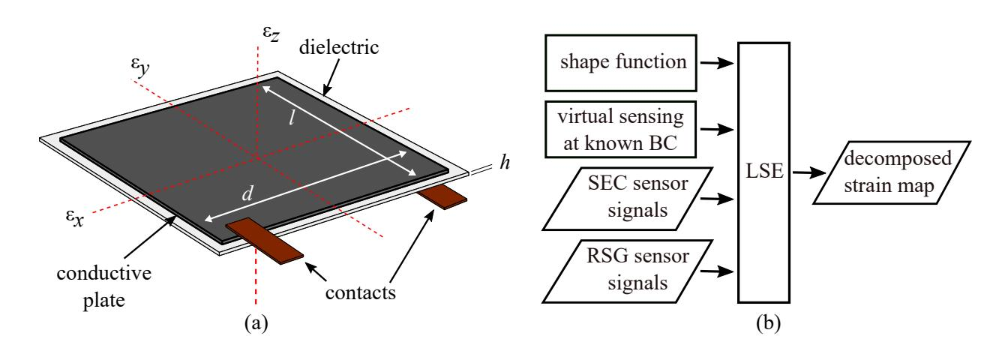

Figure C.1 SEC sensors used in the deployment of an HDSN: (a) annotated SEC sensor with reference axes; and (b) diagrammed extended LSE algorithm for developing uni-directional strain maps.

RSGs is termed hybrid dense network (HDSN) (Downey et al., 2016). This work seeks to expand on previous work by demonstrating that an HDSN consisting of SECs and RSGs is capable of efficiently reconstructing dynamic in-plane strain maps. This work expands the use of the previously proposed HDSN into dynamic excitations and demonstrates that the decomposed uni-directional in-plane strain maps can be used for reconstructing the deflection shapes.

### C.2 Background

#### C.2.1 Soft Elastomeric Capacitor

The SEC is a large area capacitor that transduces a change in geometry (i.e., strain) into a measurable change in capacitance. The sensor's capability to function as a large area electronic for structural health monitoring has been well documented and is reviewed here for brevity. Its fabrication processes (Laflamme et al., 2013) and sensor characterization for static and dynamic (Laflamme et al., 2015) characterization have been previously reported.

The SEC measures the additive in-plane strain (*x*−*y* plane in Figure C.1(a)) of a monitored substrate. The sensor is pre-stretched during its installation to enable the measurement of tension and compression. Assuming a low sampling rate (< 1 kHz), the SEC is modeled as a non-lossy capacitor where capacitance (*C*) is given by the equation for a parallel plate capacitor *C* = *e*0*e<sup>r</sup> A <sup>h</sup>* where *e*<sup>0</sup> = 8.854 pF/m is the vacuum permittivity, *e<sup>r</sup>* is the polymer relative permittivity. The area of the plate, is given by *A* = *d* · *l*, is the sensor area of width *d* and length *l*, and *h* is the thickness 

{262}------------------------------------------------

<span id="page-262-0"></span>of the dielectric, as annotated in Figure [C.1\(](#page-261-0)a). Assuming that the monitored substrate experiences only small, in-plane strains, an expression relating the sensor's change to is capacitance is expressed as

$$\frac{\Delta C}{C} = \lambda(\varepsilon_x + \varepsilon_y) \quad (\text{C.1})$$

where  $\lambda$  represents the gauge factor with  $\lambda \approx 2$  (Laflamme et al., 2015). Equation (C.1) shows that the signal of the SEC varies as a function of the additive strain  $\varepsilon_x + \varepsilon_y$ .

#### C.2.2 Strain Decomposition Algorithm

An algorithm was designed to decompose the SEC signal (Equation (C.1)) into uni-directional strain components by leveraging an HDSN configuration of SECs and resistive strain gauges (RSG). The algorithm requires the knowledge of boundary conditions that can be either assumed, enforced through the measurement of strain at key locations, or a combination of both (Downey et al., 2016). The algorithm uses measured point strain at key locations using off-the-shelf strain sensors, and is termed extended LSE algorithm. It is diagrammed in Figure [C.1\(](#page-261-0)b) and briefly summarized in what follows.

The extended LSE algorithm works through assuming a polynomial displacement shape function *w* along the *x*-*y* plane such that *w*(*x*, *y*) = P*<sup>p</sup> i*=1, *j*=1 *bi jx i y j* , for a *p*th order polynomial. Here *b<sup>i</sup>*, *<sup>j</sup>* are regression coefficients that will be solved using an LSE estimator. Considering an HDSN that includes both SECs and RSGs, the uni-directional strain at the location of each sensor node can be calculated through the enforcement of Kirchhoffs plate theory

$$\varepsilon_x(x, y) = -\frac{c}{2} \frac{\partial^2 w(x, y)}{\partial x^2} = \Gamma_x \mathbf{H}_x \mathbf{B}_x \quad (\text{C.2})$$

$$\varepsilon_y(x, y) = -\frac{c}{2} \frac{\partial^2 w(x, y)}{\partial y^2} = \Gamma_y \mathbf{H}_y \mathbf{B}_y \quad (\text{C.3})$$

where *c* is the thickness of the plate, H is the sensor placement matrix with H = [ΓxHx|ΓyHy] where H<sup>x</sup> and H<sup>y</sup> account for the SEC's additive strain measurements, Γ*<sup>x</sup>* and Γ*<sup>y</sup>* are diagonal weight matrices holding the scalar sensor weight values <sup>γ</sup>*x*,*<sup>k</sup>* and <sup>γ</sup>*y*,*<sup>k</sup>*. For instance, corresponding rows in <sup>γ</sup>*x*,*<sup>k</sup>* and <sup>γ</sup>*y*,*<sup>k</sup>* would contain 1 and 1 for a bidirectional SEC, 1 and 0 for an RSG measuring <sup>ε</sup>*x*, and 0 and 1 for an RSG measuring <sup>ε</sup>*y*. An estimate for matrix B, where B = [Bx|By], containing the regression coefficients *b<sup>i</sup>*, *<sup>j</sup>* can be estimated using an LSE:

$$\hat{\mathbf{B}} = (\mathbf{H}^T \mathbf{H})^{-1} \mathbf{H}^T \mathbf{S} \quad (\text{C.4})$$

{263}------------------------------------------------

<span id="page-263-0"></span>where the hat denotes an estimation. Thereafter, the estimated strain maps can be reconstructed with Eˆ <sup>x</sup> = ΓxHxBˆ x and Eˆ <sup>y</sup> = ΓyHyBˆ <sup>y</sup> where Eˆ <sup>x</sup> and Eˆ <sup>y</sup> are vectors containing the estimated strain at each sensor node in the *x* and *y* directions.

# C.3 Methodology

An HDSN consisting of 40 SECs and 8 RSGs was deployed onto the surface of an aluminum plate of geometry 500 × 900 × 1.3 mm<sup>3</sup> , as shown in Figure C.2(a). In total, 40 RSGs were deployed onto the plate used for validation, with 8 of these used in the HDSN as shown in Figure C.2(b). The left-hand side of the plate is attached to a rigid support (12.7 × 76.2 × 500 mm<sup>3</sup> ) with bolts that form a pinned connection. The right-hand side of the plate is restrained in the vertical direction through the use of two greased rods (12.7 mm) mounted between aluminum frames to form a roller connection. Each SEC covers 38 × 38 mm<sup>2</sup> and they are deployed in a 5 × 8 grid array. The point node used in constructing the H matrix is taken at the center of each SEC. RSGs used in the experimental setup are foil-type strain gauges with a gauge length of 6 mm and are manufactured by Tokyo Sokki Kenkyujo, model FLA-6-23-3LJBT. They are dual channel gauges, with each channel individually measuring <sup>ε</sup>*<sup>x</sup>* and <sup>ε</sup>*y*. SEC and RSG data are sampled simultaneously at 22 Samples per second using a custom-built data acquisition system.

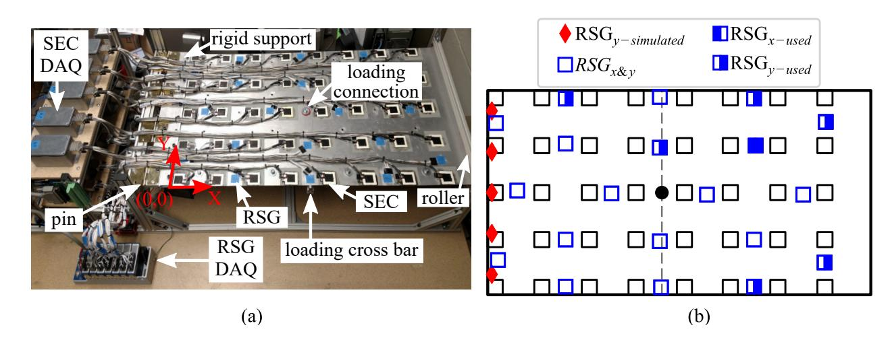

Figure C.2 Experimental setup used for dynamic strain map reconstruction with key components annotated:

(a) picture of the test bench as tested with key components annotated; (b) schematic of the test bench showing the sensor locations with RSG sensors used in the HDSN denoted with the appropriately filled square.

In this work, a single 20-second test was used for the analysis of the HDSN's capability to reconstruct dynamic in-plane strain maps. A stepper motor, mounted under the HDSN test bench, was used to apply a 15 mm sinusoidal

{264}------------------------------------------------

<span id="page-264-0"></span>displacement at a rate of 0.25 Hz. No filtering or post processing was applied to the SEC or RSG data. A 6th order polynomial displacement function  $w$  was used in decomposing the uni-directional strain maps.

The placement of RSGs within the HDSN for the purpose of enforcing boundary conditions has been shown to greatly affect the capability of the extended LSE algorithm to accuracy reproduce a structure's strain fields (Downey et al., 2016). To reduce the error present in the reconstructed strain shape, a genetic algorithm with a learning gene pool was developed for selecting RSGs within a grid of SECs. This algorithm was previously developed by the authors and is implemented here (Downey et al., 2017). Figure C.2(b) denotes the 8 RSGs used in the HDSN, as selected by the genetic algorithm after a 250 generation investigation, using the data from the 20-second test. In all, 1 RSGs measuring  $\varepsilon_x$  and 7 RSG  $\varepsilon_y$  measuring were selected. Additionally, 5 pre-selected virtual RSGs were placed along the edge of the plate next to the reinforcement bar where boundary conditions can be assumed with a high level of certainty.

# C.4 Results and Discussions

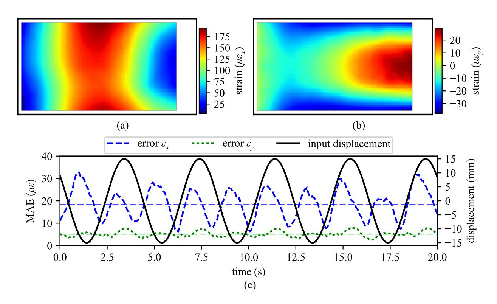

Figure C.3 uni-directional in-plane strain maps reconstructed from the HDSN using the extended LSE algorithm showing: (a)  $\varepsilon_x$ ; (b)  $\varepsilon_y$ ; and (c) error for  $\varepsilon_x$  and  $\varepsilon_y$  along with the input displacement.

{265}------------------------------------------------

<span id="page-265-0"></span>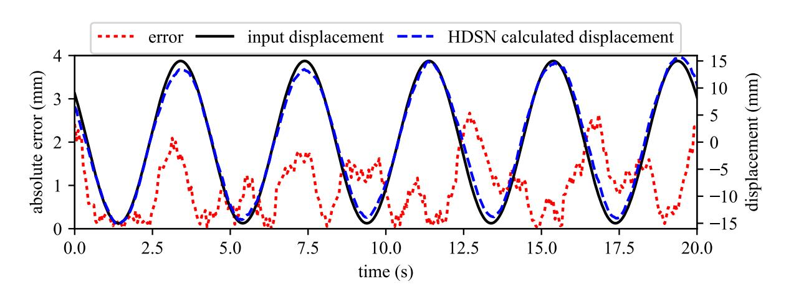

Figure C.4 Displacement of the HDSN test bench showing the displacement for the input and HDSN calculated at the loading connection in the middle of the plate.

The capability of the HDSN and extended LSE-based algorithm to reproduce the dynamic in-plane strain maps of the test bench is investigated with results shown in Figure [C.3.](#page-264-0) Figure [C.3\(](#page-264-0)a)-(b) show the uni-directional strain field decomposed from the sensor data at the first positive peak of displacement, approximately 3 seconds into the test. These results show that the HDSN is capable of decomposing the SEC's additive strain into uni-directional strain maps over the plate's monitored area. The white area outside the HDSN was intentionally left blank as the interpolation of strain fields outside the HDSN was deemed inappropriate in this context. Figure [C.3\(](#page-264-0)c) reports the mean absolute strain, as obtained through comparing the RSG data to the reconstructed strain map. As expected, <sup>ε</sup>*<sup>x</sup>* experiences a greater absolute error than <sup>ε</sup>*<sup>y</sup>* due to the higher strain levels in the *x* direction as denoted in Figure [C.2\(](#page-263-0)a). The mean error values for <sup>ε</sup>*<sup>x</sup>* and <sup>ε</sup>*<sup>y</sup>* over the entire test is represented as a horizontal dashed line in Figure [C.3\(](#page-264-0)c), the values are non-zero as error is taken as the absolute value. The error in the *x* direction equates to 9.78 % error while the error in the y direction is 41.0 % error. The higher percent error in the *y* direction is a function of the overall lower strain values present in the decomposed *y* strain map. The level of error present in the system could be reduced by increasing the number of RSGs in the system. However, this would add complexity to the system and increase the cost associated with an HDSN.

Lastly, the strain maps reconstructed from the HDSN are used to calculate the vertical displacement at the loading connection (denoted in Figure [C.2\(](#page-263-0)a)). The HDSN's calculated displacement is shown in Figure C.4 in the form of a dashed blue line and is compared to the theoretical input displacement. The calculated displacement was achieved through applying two assumed boundary conditions and integrating the strain component of equation twice to obtain a displacement function. The assumed boundary conditions used for this validation were the slope of the plate at the 

{266}------------------------------------------------

<span id="page-266-0"></span>loading connection taken equal to zero and the displacement of the plate at the right-hand side fixity taken equal to zero. Additionally, the absolute error between the input and calculated error is presented as a short-dashed red line. These results demonstrate that the HDSN can accurately reproduce the displacement of the plate.

# C.5 Conclusion

This paper presents the experimental validation of a novel hybrid dense sensor network (HDSN) for monitoring dynamic strain maps on a specially designed experimental test bench. The HDSN counted of 40 large area electronic sensors consisting of soft elastomeric capacitors (SECs), eight resistive strain gauges (RSGs), and assumed boundary condition along the rigid support. An algorithm based on a least squares estimator was used to fuse the SEC's additive strain measurements, the RSG's linear strain measurements, and the assumed boundary conditions into uni-directional strain maps for each time stamp of a 20-second test under a sinusoidal loading condition.

Experimental results demonstrated the capability of the HDSN to reconstruct the dynamic strain maps of the test plate with relatively low levels of error. Using the reconstructed strain maps and assumed boundary conditions, timeseries deflection data was obtained and demonstrated that the HDSN can accuracy reproduce the plate's displacement. The HDSN technology shows promise for the structural health monitoring of very large structural components.

# C.6 Acknowledgments

This work is partly supported by the National Science Foundation Grant No. 1069283, which supports the activities of the Integrative Graduate Education and Research Traineeship (IGERT) in Wind Energy Science, Engineering and Policy (WESEP) at Iowa State University. Their support is gratefully acknowledged. Any opinions, findings, and conclusions or recommendations expressed in this material are those of the authors and do not necessarily reflect the views of the National Science Foundation.

# C.7 References

Burton, A. R., Kurata, M., Nishino, H., and Lynch, J. P. (2016). Fully integrated patterned carbon nanotube strain sensors on flexible sensing skin substrates for structural health monitoring. In Lynch, J. P., editor, *Sensors and Smart Structures Technologies for Civil, Mechanical, and Aerospace Systems 2016*. SPIE.

{267}------------------------------------------------

Dharap, P., Li, Z., Nagarajaiah, S., and Barrera, E. V. (2004). Flexural strain sensing using carbon nanotube film. *Sensor Review*, 24(3):271–273. Doebling, S. W., Farrar, C. R., and Prime, M. B. (1998). A summary review of vibration-based damage identification methods. *The Shock and Vibration Digest*, 30:91–105. Downey, A., Hu, C., and Laflamme, S. (2017). Optimal sensor placement within a hybrid dense sensor network using an adaptive genetic algorithm with learning gene pool. *Structural Health Monitoring*, page 147592171770253. Downey, A., Laflamme, S., and Ubertini, F. (2016). Reconstruction of in-plane strain maps using hybrid dense sensor network composed of sensing skin. *Measurement Science and Technology*, 27(12):124016. Fassois, S. D. and Sakellariou, J. S. (2007). Time-series methods for fault detection and identification in vibrating structures. *Philosophical Transactions of the Royal Society A: Mathematical, Physical and Engineering Sciences*, 365(1851):411–448. Kong, X., Li, J., Bennett, C., Collins, W., and Laflamme, S. (2016). Numerical simulation and experimental validation of a large-area capacitive strain sensor for fatigue crack monitoring. *Measurement Science and Technology*, 27(12):124009. Laflamme, S., Cao, L., Chatzi, E., and Ubertini, F. (2016). Damage detection and localization from dense network of strain sensors. *Shock and Vibration*, 2016:1–13. Laflamme, S., Kollosche, M., Connor, J. J., and Kofod, G. (2013). Robust flexible capacitive surface sensor for structural health monitoring applications. *Journal of Engineering Mechanics*, 139(7):879–885. Laflamme, S., Ubertini, F., Saleem, H., D'Alessandro, A., Downey, A., Ceylan, H., and Materazzi, A. L. (2015). Dynamic characterization of a soft elastomeric capacitor for structural health monitoring. *Journal of Structural Engineering*, 141(8):04014186. Loh, K. J. and Azhari, F. (2012). Recent advances in skin-inspired sensors enabled by nanotechnology. *JOM*, 64(7):793–801. Yao, Y. and Glisic, B. (2015). Detection of steel fatigue cracks with strain sensing sheets based on large area electronics. *Sensors*, 15(4):8088–8108.

{268}------------------------------------------------

# <span id="page-268-0"></span>APPENDIX D. SURROGATE MODEL FOR CONDITION ASSESSMENT OF STRUCTURES USING A DENSE SENSOR NETWORK

This chapter is wholly based on "Surrogate model for condition assessment of structures using a dense sensor network" published in Proc. SPIE 10598, Sensors and Smart Structures Technologies for Civil, Mechanical, and Aerospace Systems 2018, vol. 10598, 2018, p. 10598-9. doi:10.1117/12.2296711.

Jin Yan<sup>1</sup> , Xiaosong Du<sup>2</sup> , Austin Downey1,<sup>3</sup> , Alessandro Cancelli<sup>1</sup> , Simon Laflamme1,<sup>4</sup> , Leifur Leifsson<sup>2</sup> , AN Chen<sup>1</sup> and Filippo Ubertini<sup>5</sup>

<sup>1</sup> Department of Civil, Construction, and Environmental Engineering, Iowa State University, Ames, IA, USA

<sup>2</sup> Department of Aerospace Engineering, Iowa State University, Ames, IA, USA

<sup>3</sup> Department of Mechanical Engineering, Iowa State University, Ames, IA, USA

<sup>4</sup> Department of Electrical and Computer Engineering, Iowa State University, Ames, IA, USA

<sup>5</sup> Department of Civil and Environmental Engineering, University of Perugia, Perugia, Italy

# Abstract

Condition assessment of civil infrastructures is difficult due to technical and economic constraints associated with the scaling of sensing solutions. When scaled appropriately, a large sensor network will collect a vast amount of rich data that is difficult to directly link to the existing condition of the structure along with its remaining useful life. This paper presents a methodology to construct a surrogate model enabling diagnostic of structural components equipped with a dense sensor network collecting strain data. The surrogate model, developed as a matrix of discrete stiffness elements, is used to fuse spatial strain data into useful model parameters. Here, strain data is collected from a sensor network that consists of a novel sensing skin fabricated from large area electronics. The surrogate model is constructed by updating the stiffness matrix to minimize the difference between the model's response and measured data, yielding a 2D map of stiffness reduction parameters. The proposed method is numerically validated on a plate equipped with 40 large area strain sensors. Results demonstrate the suitability of the proposed surrogate model for the condition assessment of structures using a dense sensor network.

{269}------------------------------------------------

<span id="page-269-0"></span>Keywords: dense sensor network, strain, model updating, condition assessment, structural health monitoring, surrogate model

# D.1 Introduction

The deteriorating condition of civil infrastructures is a source of significant concern for their owners and operators. The evaluation of structural condition is typically conducted via visual inspection Koch et al. (2015), and sometime non-destructive evaluation (NDE) techniques are leveraged to enhance the ability of inspectors to detect damage Kim et al. (2017). However, visual inspections are left to the inspector's judgement, may pose safety hazards, and are expensive and labor-intensive Papaelias et al. (2016); Agdas et al. (2016). A solution is to automate the process of condition assessment, known as structural health monitoring (SHM).

A notable challenge in SHM is to link sensor data to structural conditions. Research counts several examples of vibration-based SHM using limited sensors for condition assessment Guo et al. (2012); Liu et al. (2016); Shafiullah et al. (2010); Marquez et al. (2012). Vibration-based SHM is typically conducted by identifying a change in the ´ structure's global characteristics provoked by a local damage, which may be difficult to apply in the field due to the numerous frequency components present in a complex structure Farrar and Sohn (2000). Since strain is a direct indicator of, and sensitive to, damage, the monitoring of a structure's strain fields using strain sensors has attracted considerable attention in recent years Gullapalli et al. (2010). In an effort to monitor the global area of a large-scale structure, distributed sensing technologies have been investigated for the distinction of local from global damage. One example of distributed sensing technologies that have gained broad acceptance is the use of fiber optic sensors due to their unique capability of monitoring one-dimensional strain fields at a large number of discrete points. However, fiber optic sensors are not highly deployed for monitoring infrastructure due to the fragility of the fibers and high deployment cost Glisic and Inaudi (2011); Arsenault et al. (2013).

In order to improve the spatial resolution of distributed sensing technologies, it is becoming feasible to deploy a two dimensional array of densely spaced sensors. Strain sensing sheets based on large area electronics were developed for fatigue crack detection and localization Glisic et al. (2016). Carbon nanotube sensors have been demonstrated for the detection of large strains and cracks Kang et al. (2006). Along with this effort, the authors have developed a scalable and cost-effective flexible skin-like membrane for the monitoring of structural components Laflamme et al. (2013); Downey et al. (2017). This technology is analogous to sensing skin because it mimics biological skin's capability to detect local damage over a global area. It is based on a large area strain-sensitive sensor termed soft elastomeric capacitor (SEC) Laflamme et al. (2013). In contrast with fiber optic sensors, vibrating wire, or traditional resistive 

{270}------------------------------------------------

<span id="page-270-0"></span>strain gauges that measure strain at discrete points, the soft elastomeric capacitor (SEC) has the unique capability of measuring the additive in-plane strain over a large and customizable area. Previous research related to the SEC has decomposed the SEC's additive strain into two uni-directional strain components and used these strain components to reconstruct uni-directional strain maps over the monitored surface Downey et al. (2016) for damage detection through a visual interpretation of changes in strain fields Downey et al. (2017).

The objective of this paper is to introduce an algorithm to link strain map data to structural conditions. At this preliminary stage, we develop a physics-driven approach to reconstruct the stiffness matrix of a component equipped with sensing skin. Others have already proposed physics-driven approaches with model updating based on sensor data. Sanayei et al. proposed an iterative technique using static strain data to identify beam- and frame-like structural element properties Sanayei and Saletnik (1996b,a). Others have reconstructed displacement and stress field from discrete strain measurements employing an inverse finite element method to assess structural integrity Cerracchio et al. (2015). A substructure model updating approach using frequency domain data was proposed to identified structural stiffness and mass elements Zhu et al. (2016). Also, a stochastic subspace identification technique was used to extract modal information from acceleration data and a genetic algorithm was used to reconstruct the stiffness matrix that would match these parameters Cancelli et al. (2017).

The novelty of this paper resides in the development of the physics-based algorithm that could be later transformed into a hybrid model/data approach enabling fast reconstruction of physical representation, in real-time. Such reconstructions could be readily used for damage detection, localization, quantification, and condition evaluation. In particular, we exploit a physically representative surrogate model based on a Mindlin finite elements to harness additive strain measurements of the SEC. Upon the static forces applied to the plate, the stiffness can be reconstructed from the surface additive strain measurements by minimizing the difference between the estimated and observed responses.

The paper is organized as follows. First, the sensing principle of the SEC is reviewed. Second, the formulation of the physics-driven surrogate model is explained. Third, the algorithm is demonstrated through a numerical simulation. Last, the paper is concluded.

### D.2 Background

The previously proposed sensing skin is constituted from a network of strain sensors. These sensors, or SECs, are large area capacitors suitable for strain sensing over large-scale surfaces. The sensor's fabrication procedure, sensing characteristics, and its electromechanical models have been studied in detail in previous works Saleem et al. (2014); Laflamme et al. (2015). Briefly, the SEC is built using a layer-by-layer approach where a dielectric (white layer of

{271}------------------------------------------------

<span id="page-271-0"></span>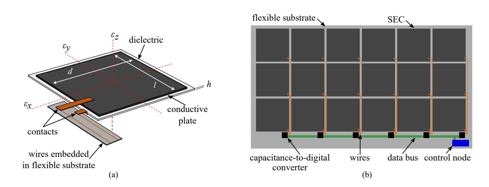

Figure D.1 The proposed SEC-based sensing skin showing the: (a) SEC with key components annotated; and (b) example of sensing skin layout with key components annotated.

the capacitor shown in Figure D.1(a)) is fabricated from a styrene-ethylene-butadiene-styrene (SEBS) polymer matrix filled with titania. The conductive layers are painted from a conductive paint fabricated using the same SEBS matrix but filled with carbon black. The capacitance (*C*) of an SEC can be estimated from the equation for a parallel plate capacitor (assuming negligible losses):

$$C = \varepsilon_0 \varepsilon_r \frac{A}{h} \quad (\text{D.1})$$

where <sup>ε</sup><sup>0</sup> is the vacuum permittivity (ε<sup>0</sup> = 8.854pF/m), <sup>ε</sup>*<sup>r</sup>* is the relative permittivity of the dielectric, *A* is the electrode's surface area of width *w* and length *l*, and *h* is the thickness of the dielectric. Assuming that the capacitor undergoes small strain, the change in capacitance is related to the additive in-plane strains <sup>ε</sup>*<sup>x</sup>* + <sup>ε</sup>*<sup>y</sup>* with a gauge factor λ ≈ 2 Laflamme et al. (2015):

$$\frac{\Delta C}{C_0} = \lambda(\varepsilon_x + \varepsilon_y) \quad (\text{D.2})$$

An example layout for the sensing skin is shown in Figure D.1(b). This fully integrated skin consists of SECs deployed on a flexible polyimide sheet along with the necessary electronics. A more detailed discussion regarding on the electronics can be found in reference Downey et al. (2017).

{272}------------------------------------------------

# D.3 Surrogate Model Formulation

<span id="page-272-0"></span>A surrogate model is constructed by simplifying the structural behavior of the component of interest, here a plate. The plate is discretized into four-node quadrilateral Mindlin elements Reddy (2005), with an SEC in the center of each element. A graphical representation of the element is shown in Figure D.2. Assuming a static load, the governing equation for the surrogate model, expressed as F = KU, is based on the static stiffness relationship between the force vector F, the stiffness matrix K, and displacement vector U. Vector U is related to the measured additive strain through a transformation matrix B. Once the surrogate model is constructed, an optimization function can be defined such that it minimizes the error between the strain predicted by the surrogate model and the strain measured by the SECs through the alteration of the K matrix. Matrix K is recursively refined until the error converges . The processes is outlined in Figure D.3. The production of a surrogate model enables greater computational efficiency, which can be useful in conducting condition assessment, structural predictions, and remaining useful life estimations.

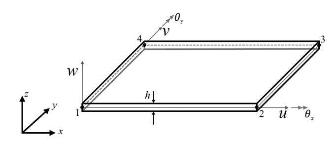

Figure D.2 Illustration of the Mindlin element with four nodes located on the mid-line of the element.

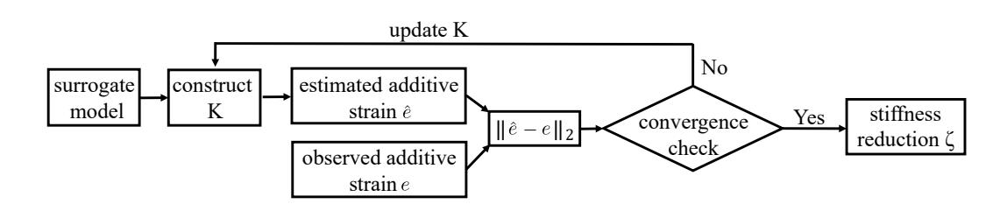

Figure D.3 Flowchart of the proposed physics-driven algorithm.

### D.3.1 Model Formulation

At this preliminary stage of the research, the model formulation assumes a static load of known location and magnitude, and is based on work from Sanayei and Saletnik (1996b); Cerracchio et al. (2015). The discretized displacement vector u *e* and stiffness matrix k *e* is constructed for each element, where *e* = 1, 2, . . ., NEM with NEM

{273}------------------------------------------------

being the total number of elements in the surrogate model. Using the Cartesian coordinate system, u *e* fully defines the deformation of a four-node quadrilateral element as shown in Figure [D.2.](#page-272-0) Each element comprises three independent degrees-of-freedom (DOFs) θ*x*, θ*y*, and *w*, resulting in 12 DOFs for the four nodes:

$$\mathbf{u}^\epsilon = [\theta_{x1} \ \theta_{y1} \ w_1 \ \theta_{x2} \ \theta_{y2} \ w_2 \ \theta_{x3} \ \theta_{y3} \ w_3 \ \theta_{x4} \ \theta_{y4} \ w_4]^T \quad (\text{D.3})$$

where  $w$  is the mid-surface deflection in the  $z$  axis,  $\theta_x = z\partial w/\partial x$  and  $\theta_y = z\partial w/\partial y$  are the transverse bending rotations with respect to the  $x$  and  $y$  axes, respectively. Vector  $\mathbf{u}^e$  can be approximated from geometry using the bilinear quadrilateral shape functions  $N_i(i = 1, 2, 3, 4)$ 

$$\theta_x = \sum_{i=1}^4 N_i \theta_{xi}; \quad \theta_y = \sum_{i=1}^4 N_i \theta_{yi}; \quad w = \sum_{i=1}^4 N_i w_i \quad (\text{D.4})$$

The surface bending strains  $\varepsilon_x, \varepsilon_y$  and in-plane shear strain  $\gamma_{xy}$  for each element can be obtained based on three-dimensional elasticity:

$$\mathbf{e}_b^e = \begin{bmatrix} \varepsilon_x \\ \varepsilon_y \end{bmatrix} = \frac{h}{2} \begin{bmatrix} \frac{\partial \theta_x}{\partial x} \\ \frac{\partial \theta_y}{\partial y} \end{bmatrix} = \frac{h}{2} \mathbf{B}_b \mathbf{u}^e \quad (\text{D.5})$$

where B<sup>b</sup> is a transformation matrix. To relate to SEC data, the bending strains in the plate are converted from the displacement vector (u *e* ) by differentiating the shape functions through the transform matrices Bb:

$$\mathbf{B}_b = \begin{bmatrix} 0 & \frac{N_1}{\partial x} & 0 & \dots & 0 & \frac{N_4}{\partial x} & 0 \\ 0 & 0 & \frac{N_1}{\partial y} & \dots & 0 & 0 & \frac{N_4}{\partial y} \\ 0 & \frac{N_1}{\partial x} & \frac{N_1}{\partial x} & \dots & 0 & \frac{N_4}{\partial x} & \frac{N_4}{\partial x} \end{bmatrix} \quad (\text{D}.6)$$

Also, the out-of-plane shear strains e<sup>s</sup> can be written:

$$\mathbf{e}_s^e = \begin{bmatrix} \gamma_{xz} \\ \gamma_{yz} \end{bmatrix} = \begin{bmatrix} \frac{\partial w}{\partial x} + \theta_x \\ \frac{\partial w}{\partial y} + \theta_y \end{bmatrix} = \mathbf{B}_s \mathbf{u}^e \quad (\text{D.7})$$

along with the strain-displacement shear transformation matrix B<sup>s</sup> :

$$\mathbf{B}_s = \begin{bmatrix} \frac{N_1}{\partial x} & N_1 & 0 & \dots & \frac{N_4}{\partial x} & N_4 & 0 \\ \frac{N_1}{\partial y} & 0 & N_1 & \dots & \frac{N_4}{\partial x} & 0 & N_4 \end{bmatrix} \quad (\text{D.8})$$

where B<sup>s</sup> can be obtained for each element from the three-dimensional elasticity. It is noted that only the additive surface axial strains can be experimentally measured by the SEC (i.e. the shear strains cannot be directly obtained 

{274}------------------------------------------------

from the SEC). However, for a thin plate, the shear strains can be neglected due to their relatively small magnitudes when compared to the bending strains Kefal et al. (2016).

After the element stiffness matrix that governs the structural behavior of the plate is constructed as a function of Young's modulus (*E*), Poisson's ratio (ν), and shear modulus (*G* = *E* 2(1+ν) ). The element stiffness matrix, k *e* , is built using the principle of minimum potential energy using the Gauss quadrature technique with a two point integration for bending and one point integration for shear to avoid shear locking Reddy (2005). Once the elemental stiffness matrix is constructed, the stiffness matrix for one element can be expressed:

$$\mathbf{k}^e = \frac{h^3}{12} \int_{A^e} \mathbf{B}_b^T \mathbf{D}_b \mathbf{B}_b dA^e + \alpha h \int_{A^e} \mathbf{B}_s^T \mathbf{D}_s \mathbf{B}_s dA^e, \quad (\text{D.9})$$

where <sup>α</sup> is the shear correction factor taken as 5/6 Reddy (2005), D<sup>b</sup> is the constitutive equation for bending:

$$\mathbf{D}_b = \frac{E}{1 - \gamma^2} \begin{bmatrix} 1 & \gamma & 0 \\ \gamma & 1 & 0 \\ 0 & 0 & \frac{1-\gamma}{2} \end{bmatrix} \quad (\text{D.10})$$

and D<sup>s</sup> is the shear constitutive equation matrix:

$$\mathbf{D}_s = \begin{bmatrix} G & 0 \\ 0 & G \end{bmatrix} \quad (\text{D.11})$$

By introducing the displacement vector u *e* and stiffness matrix k *e* into the element-wise governing equation of the surrogate model f *<sup>e</sup>* = k *e*u *e* , the bending strains of one element (e *e* b ) can be obtained assuming f *e* is known:

$$\mathbf{e}_b = \mathbf{B}_b[\mathbf{k}']^{-1}\mathbf{f}' \quad (\text{D.12})$$

For a linear system, only the additive strains are measured by the SEC. It follows that the system's overall bending strain vector (eb) and transformation matrix (Bb) for the measured and unmeasured strains can be rearranged as:

$$\left[ \frac{\mathbf{e}_{\text{measured}}}{\mathbf{e}_{\text{unmeasured}}} \right] = \left[ \frac{\mathbf{B}_{\text{measured},b}}{\mathbf{B}_{\text{unmeasured},b}} \right] \mathbf{K}^{-1} \mathbf{F} \quad (\text{D.13})$$

Because the unmeasured strains are not required for estimating the measured strain, they can be removed from Equation D.13, with

$$\hat{\mathbf{e}} = \mathbf{B}_{\text{measured},b}\mathbf{K}^{-1}\mathbf{F} \quad (\text{D.14})$$

{275}------------------------------------------------

<span id="page-275-0"></span>where the hat denotes an estimation, eˆ is a vector with a length equal to NEM and F is a vector equal to the number of DOFs (nDOF), and Bmeasured,<sup>b</sup> and K are matrices of sizes NEM × nDOF and nDOF × nNDOF, respectively.

#### D.3.2 Damage Detection and Localization

Damage characterization in the plate can be obtained through the temporal comparison of updated values in K, which values are represented through a reduction parameter ζ, as diagrammed in Figure [D.3.](#page-272-0) Matrix K is updated by minimizing the objective function *J*:

$$J = \|\hat{\mathbf{e}} - \mathbf{e}_2\|_2 \quad (\text{D.15})$$

where || · ||<sup>2</sup> is *L*<sup>2</sup> norm and e is the mean of the observed strain field, which is obtained by averaging over a number of observations. In this present work, there is no additional inequality or equality constrains, except for the bound [0, 1] on ζ. When ζ = 0, the structural element has no damage, and conversely, when ζ = 1 the structural element is removed (i.e. complete damage). Equation D.15 is a nonlinear, multiple parameters function. For the purpose of this work, the pattern search solver in MATLAB MATLAB Optimization Toolbox (017a) was used to solve the optimization problem through the minimization of the error, *J*. Convergence thresholds for either ζ or *J* were set to

$$\|\zeta^{i+1} - \zeta^i\| \leq 10^{-8} \quad \text{or} \quad \|J^{i+1} - J^i\| \leq 10^{-8} \quad (\text{D.16})$$

and were used as the stop criteria for the optimization (Equation D.15).

# D.4 Numerical Example

This section numerically demonstrates the proposed algorithm.

#### D.4.1 Model Description

This numerical example considers a rectangular aluminum plate 1000 mm long by 500 mm wide and 3.3 mm thick. The model is clamped (i.e., fixed) on the right-hand side and a roller support is used on the left-hand side, and has a Young's modulus *E* = 69 GPa and a Poisson's ratio ν = 0.33. For this preliminary work, the numerical representation of the plate was constructed using 50 elements, where 40 SECs are simulated with one SEC installed at the center of each element covering the majority of the element plus five boundary elements for each side without SECs). The Figure [D.4](#page-276-0) is a schematic of the 50 elements showing the 40 SECs (darker squares) and 10 boundary elements (light rectangles).

{276}------------------------------------------------

<span id="page-276-0"></span>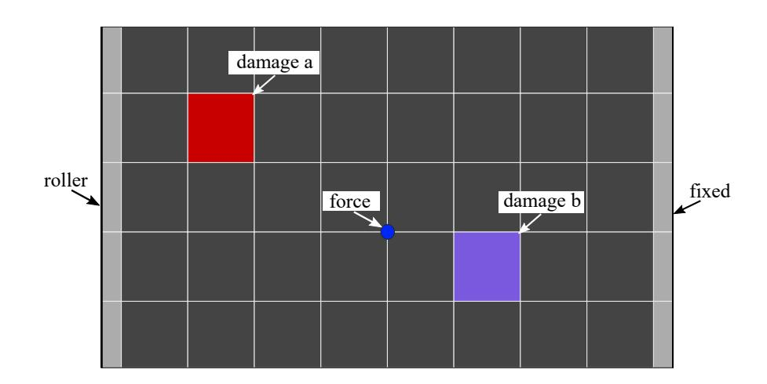

Figure D.4 Schematic of the numerical example.

Damage was introduced in the plate in the form of a reduction in stiffness at two different locations. The Young's modulus in the rectangular elements denoted as "damage a" and "damage b" in Figure D.4 were reduced by 20% (ζ = 0.2) and 40% (ζ = 0.4), respectively. To investigate the effect of noise on the system, four levels of noise investigated: 1% uniformly distributed, 1% Gaussian, 3% Gaussian, and 5% Gaussian. A unit concentrated force was applied to a node near the center of the plate, as shown in Figure D.4.

# D.4.2 Numerical Results

Figure [D.5](#page-277-0) shows the spatial distribution of ζ obtained through the algorithm. When inspecting results from the low-noise levels presented in Figures [D.5\(](#page-277-0)a) and (b), it can be observed that the optimization technique was capable of correctly quantifying the reduction in stiffness for "damage a" as ζ = 0.4 and "damage b" as ζ = 0.2. Also, results show that while increasing the noise level reduces the precision of the damage localization, the algorithm can still identify and quantify both damage locations.

{277}------------------------------------------------

<span id="page-277-0"></span>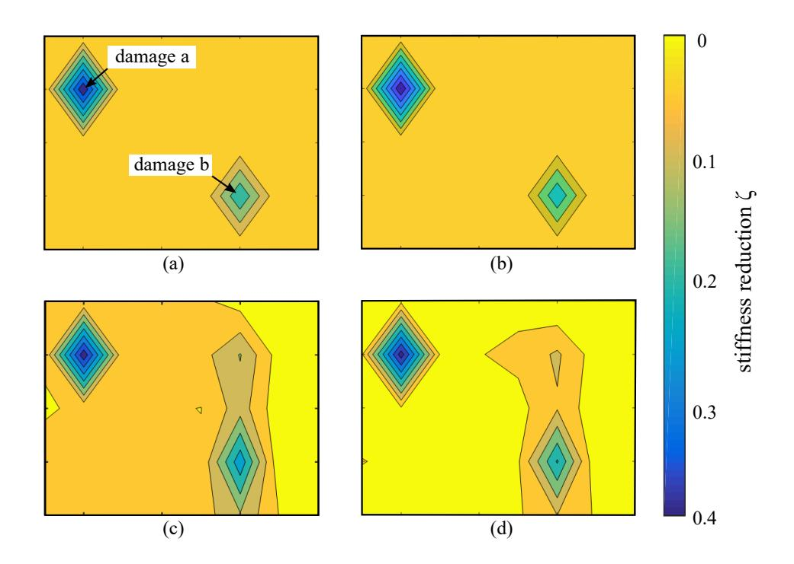

Figure D.5 Contour plots of the identified stiffness reduction values for a noise level of: (a) 1% uniform; (b) 1% Gaussian; (c) 3% Gaussian; and (d) 5% Gaussian.

### D.5 Conclusion

This work proposed and derived a physics-driven approach bespoke to components equipped with sensing skin providing additive strain measurements. The sensor forming the sensing skin, termed the soft elastomeric capacitor (SEC), is a large-scale strain sensor that is designed to cover large surfaces at low cost. The surrogate model presented in this work allows for the SEC's additive strain measurement to be mapped to structural stiffness. This is done by updating the stiffness matrix to match the strain measurements through a minimization function. A temporal comparison of the obtained stiffness matrix can be used for condition assessment, and the surrogate model itself could be useful to conduct further studies such as structural behavior prediction and remaining useful life estimation.

A numerical demonstration was conducted on a steel plate with a simulated dense sensor network of 40 SECs. Results showed that the proposed surrogate model could be used to detect, localize, and quantify damage, even in the presence of noise. Future work will involve validating the surrogate model technique through the use of higher fidelity finite element models and experimental data, and extend the methodology to dynamic excitations with uncertain loads.

{278}------------------------------------------------

### Acknowledgments

<span id="page-278-0"></span>The support of the Air Force Office of Scientific Research (AFOSR) under award number FA9550-17-1-0131, and of the National Science Foundation under grant number 1069283, which supports the activities of the Integrative Graduate Education and Research Traineeship (IGERT) in Wind Energy Science, Engineering and Policy (WESEP) at Iowa State University, is gratefully acknowledged. Any opinions, findings, and conclusions or recommendations expressed in this material are those of the authors and do not necessarily reflect the views of the sponsors.

### D.6 References

- Agdas, D., Rice, J. A., Martinez, J. R., and Lasa, I. R. (2016). Comparison of visual inspection and structuralhealth monitoring as bridge condition assessment methods. *Journal of Performance of Constructed Facilities*, 30(3):04015049. Arsenault, T. J., Achuthan, A., Marzocca, P., Grappasonni, C., and Coppotelli, G. (2013). Development of a FBG based distributed strain sensor system for wind turbine structural health monitoring. *Smart Materials and Structures*, 22(7):075027. Cancelli, A., Micheli, L., Laflamme, S., Alipour, A., Sritharan, S., and Ubertini, F. (2017). Damage location and quantification of a pretensioned concrete beam using stochastic subspace identification. In Wu, H. F., Gyekenyesi,
- A. L., Shull, P. J., and Yu, T.-Y., editors, *Nondestructive Characterization and Monitoring of Advanced Materials, Aerospace, and Civil Infrastructure 2017*. SPIE. Cerracchio, P., Gherlone, M., Sciuva, M. D., and Tessler, A. (2015). A novel approach for displacement and stress monitoring of sandwich structures based on the inverse finite element method. *Composite Structures*, 127:69–76. Downey, A., Laflamme, S., and Ubertini, F. (2016). Reconstruction of in-plane strain maps using hybrid dense sensor network composed of sensing skin. *Measurement Science and Technology*, 27(12):124016. Downey, A., Laflamme, S., and Ubertini, F. (2017). Experimental wind tunnel study of a smart sensing skin for condition evaluation of a wind turbine blade. *Smart Materials and Structures*.

{279}------------------------------------------------

Farrar, C. R. and Sohn, H. (2000). Pattern recognition for structural health monitoring. In *Workshop on Mitigation of Earthquake Disaster by Advanced Technologies*. Glisic, B. and Inaudi, D. (2011). Development of method for in-service crack detection based on distributed fiber optic sensors. *Structural Health Monitoring: An International Journal*, 11(2):161–171. Glisic, B., Yao, Y., Tung, S.-T. E., Wagner, S., Sturm, J. C., and Verma, N. (2016). Strain sensing sheets for structural health monitoring based on large-area electronics and integrated circuits. *Proceedings of the IEEE*, 104(8):1513– 1528. Gullapalli, H., Vemuru, V. S. M., Kumar, A., Botello-Mendez, A., Vajtai, R., Terrones, M., Nagarajaiah, S., and Ajayan, P. M. (2010). Flexible piezoelectric ZnO-paper nanocomposite strain sensor. *Small*, 6(15):1641–1646. Guo, T., Frangopol, D. M., and Chen, Y. (2012). Fatigue reliability assessment of steel bridge details integrating weigh-in-motion data and probabilistic finite element analysis. *Computers* & *Structures*, 112-113:245–257. Kang, I., Schulz, M. J., Kim, J. H., Shanov, V., and Shi, D. (2006). A carbon nanotube strain sensor for structural health monitoring. *Smart Materials and Structures*, 15(3):737–748. Kefal, A., Oterkus, E., Tessler, A., and Spangler, J. L. (2016). A quadrilateral inverse-shell element with drilling degrees of freedom for shape sensing and structural health monitoring. *Engineering Science and Technology, an International Journal*, 19(3):1299 – 1313. Kim, J., Gucunski, N., Duong, T. H., and Dinh, K. (2017). Three-dimensional visualization and presentation of bridge deck condition based on multiple NDE data. *Journal of Infrastructure Systems*, 23(3):B4016012. Koch, C., Georgieva, K., Kasireddy, V., Akinci, B., and Fieguth, P. (2015). A review on computer vision based defect detection and condition assessment of concrete and asphalt civil infrastructure. *Advanced Engineering Informatics*, 29(2):196–210. Laflamme, S., Kollosche, M., Connor, J. J., and Kofod, G. (2013). Robust flexible capacitive surface sensor for structural health monitoring applications. *Journal of Engineering Mechanics*, 139(7):879–885. Laflamme, S., Ubertini, F., Saleem, H., D'Alessandro, A., Downey, A., Ceylan, H., and Materazzi, A. L. (2015). Dynamic characterization of a soft elastomeric capacitor for structural health monitoring. *Journal of Structural Engineering*, 141(8):04014186.

{280}------------------------------------------------

Liu, X., Dong, X., and Wang, Y. (2016). Field testing of martlet wireless sensing system on an in-service pre-stressed concrete highway bridge. In Kundu, T., editor, *Health Monitoring of Structural and Biological Systems 2016*. SPIE. Marquez, F. P. G., Tobias, A. M., P ´ erez, J. M. P., and Papaelias, M. (2012). Condition monitoring of wind turbines: ´ Techniques and methods. *Renewable Energy*, 46:169–178. MATLAB Optimization Toolbox (2017a). Matlab optimization toolbox. The MathWorks, Natick, MA, USA. Papaelias, M., Cheng, L., Kogia, M., Mohimi, A., Kappatos, V., Selcuk, C., Constantinou, L., Munoz, C. Q. G., Marquez, F. P. G., and Gan, T.-H. (2016). Inspection and structural health monitoring techniques for concentrated solar power plants. *Renewable Energy*, 85:1178 – 1191. Reddy, J. (2005). *An Introduction to the Finite Element Method*. McGraw-Hill, 3 edition. Saleem, H., Thunga, M., Kollosche, M., Kessler, M., and Laflamme, S. (2014). Interfacial treatment effects on behavior of soft nano-composites for highly stretchable dielectrics. *Polymer*, 55(17):4531–4537. Sanayei, M. and Saletnik, M. J. (1996a). Parameter estimation of structures from static strain measurements. i: Formulation. *Journal of Structural Engineering*, 122(5):555–562. Sanayei, M. and Saletnik, M. J. (1996b). Parameter estimation of structures from static strain measurements. II: Error sensitivity analysis. *Journal of Structural Engineering*, 122(5):563–572. Shafiullah, G. M., Ali, A. B. M. S., Thompson, A., and Wolfs, P. J. (2010). Predicting vertical acceleration of railway wagons using regression algorithms. *IEEE Transactions on Intelligent Transportation Systems*, 11(2):290–299. Zhu, D., Dong, X., and Wang, Y. (2016). Substructure stiffness and mass updating through minimization of modal dynamic residuals. *Journal of Engineering Mechanics*, 142(5):04016013.

{281}------------------------------------------------

# <span id="page-281-0"></span>APPENDIX E. PHYSICS-BASED PROGNOSTICS OF LITHIUM-ION BATTERY USING NON-LINEAR LEAST SQUARES WITH DYNAMIC BOUNDS

This chapter is wholly based on "Physics-Based Prognostics of Lithium-Ion Battery Using Non-linear Least Squares with Dynamic Bounds" that is currently under review with the journal of Reliability Engineering & System Safety

Austin Downey<sup>1</sup> , Yu-Hui Lui<sup>1</sup> , Chao Hu1,<sup>2</sup> , Simon Laflamme2,<sup>3</sup> and Shan Hu<sup>1</sup>

# Abstract

Real-time health diagnostics/prognostics and predictive maintenance/control of lithium-ion (Li-ion) batteries are essential to reliable and safe battery operation. This paper presents a physics-based (or mechanistic) approach to Li-ion battery prognostics, which enables prediction of remaining useful life (RUL) with consideration of multiple concurrent degradation mechanisms. In the proposed approach, robust prediction of RUL is achieved by employing a non-linear least squares method with dynamic bounds that traces the evolution of individual degradation parameters. The novelty of this approach lies in the ability to incorporate mechanistic degradation analysis results into RUL prediction using nonlinear models. Results from a simulation study with eight Li-ion battery cells demonstrate that the mechanistic prognostics approach produces more accurate RUL predictions than a traditional capacity-based prognostics approach and that the use of dynamic bounds ensures a low level of uncertainty in the predictions throughout the entire life of the cells.

Keywords: lithium-ion battery, prognostics, degradation mechanisms, non-linear least squares, dynamic bounds

<sup>1</sup> Department of Mechanical Engineering, Iowa State University, Ames, IA, USA

<sup>2</sup> Department of Electrical and Computer Engineering, Iowa State University, Ames, IA, USA

<sup>3</sup> Department of Civil, Construction, and Environmental Engineering, Iowa State University, Ames, IA, USA

{282}------------------------------------------------

<span id="page-282-0"></span>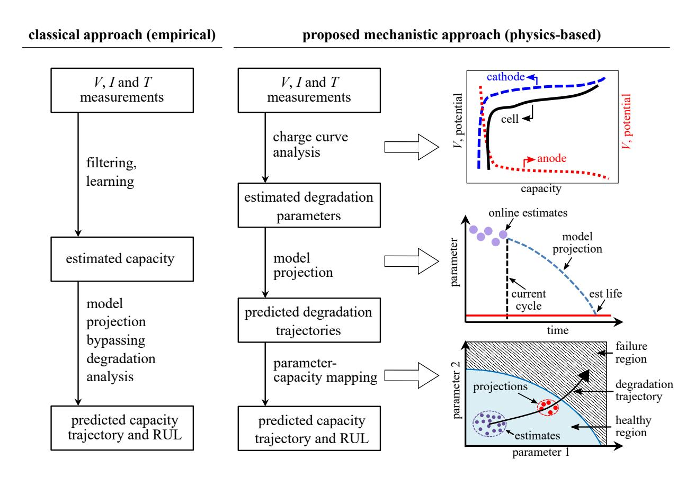

Figure E.1 Schematic diagrams of the existing and proposed battery prognostics approaches.

# E.1 Introduction

Lithium-ion (Li-ion) batteries are widely used in consumer electronics (e.g. cell phones and laptops), in implantable medical devices (e.g. deep brain stimulators and spinal cord stimulators), in transportation applications (e.g. hybrid and electric vehicles), and in emerging grid-scale energy storage applications. As a Li-ion battery cell ages, the decrease of capacity and the increase of internal resistance degrade the electrical performance of the cell by means of energy and power losses. Capacity, which quantifies the total amount of energy stored in a fully charged cell, is an important indicator of the state of health of the cell; remaining useful life (RUL), also called remaining longevity, refers to the available service time or number of charge-discharge cycles left before the capacity fade reaches an unacceptable level. Battery prognostics enables an on-board battery management system (BMS) to predict the RUL of each battery cell managed by the BMS before the cell capacity fades below a threshold (or failure limit). This allows predictive maintenance service and/or control operation, thereby providing the failure anticipation/prevention capability of the BMS.

{283}------------------------------------------------

<span id="page-283-0"></span>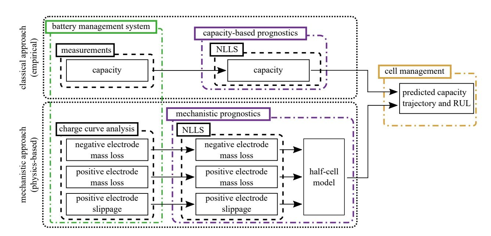

Figure E.2 Flowchart detailing the methods and sequence of steps in the implementation of the classical capacity-based prognostics approach and the proposed mechanistic prognostics approach.

Extensive research has been conducted on RUL assessment of general engineered systems with an emphasis on modeling the RUL distribution. In general, three categories of approaches have been developed enabling continuous updating of system health condition and RUL distribution: (i) model-based approaches (Gebraeel et al., 2005; Luo et al., 2008; Gebraeel and Pan, 2008), (ii) data-driven approaches (Si et al., 2013; Wang et al., 2008; Heimes, 2008; Hu et al., 2012; Wang et al., 2012), and (iii) hybrid approaches (Goebel et al., 2006; Liu et al., 2012). These approaches, although not developed specifically for Li-ion battery prognostics, can generally be adapted for RUL assessment of Li-ion batteries. Research devoted to developing new approaches for Li-ion battery prognostics has been mainly conducted by researchers in the prognostics and health management (PHM) society. One of the earliest studies proposed a Bayesian framework with particle filter for RUL prediction of Li-ion battery based on impedance measurements (Saha and Goebel, 2009). A later study on battery prognostics attempted the use of a recurrent neural network and RUL prediction was performed also based on impedance measurements (Liu et al., 2010). In order to eliminate the reliance of battery prognostics on impedance measurement equipment, researchers developed various model-based approaches that predict RUL by extrapolating a capacity fade model (Miao et al., 2013; Hu et al., 2014; Wang et al., 2016; Hu et al., 2018). Many of these model-based approaches estimate the parameters of a capacity fade model by using non-linear least squares (NLLS) (He et al., 2011; Walker et al., 2015) and particle filter (He et al., 2011; Walker

{284}------------------------------------------------

<span id="page-284-0"></span>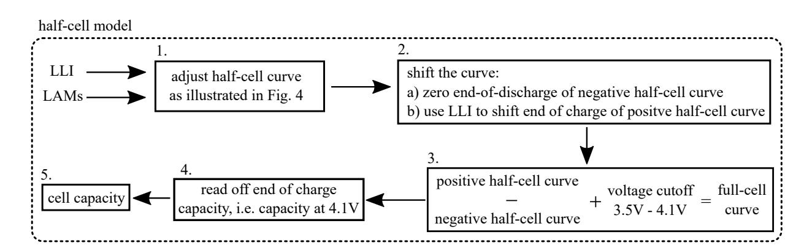

Figure E.3 Flowchart detailing the half-cell model that is used to generate simulated cell data and produce capacity value for the proposed mechanistic approach.

et al., 2015) and its variants, such as unscented particle filter (Miao et al., 2013), Gauss-Hermite particle filter (Hu et al., 2014), spherical cubature particle filter (Wang et al., 2016), and multiple model particle filter (Hu et al., 2018).

Existing battery prognostics approaches simply extrapolate the capacity fade trend for RUL prediction, without understanding the underlying degradation mechanism (see the classical approach in figure [E.1\)](#page-282-0). Such an extrapolation does not consider the trends of degradation from underlying mechanisms and could result in an intolerably large prediction error (Burns et al., 2013). Realizing battery failure anticipation/prevention through real-time prognostics entails the development of a physics-based prognostics approach that explicitly considers degradation mechanisms and achieves robust RUL prediction across a variety of degradation scenarios. This research proposes a novel physicsbased prognostics approach where robust prediction of RUL is achieved by leveraging quantitative degradation analysis in a model-based prognostics framework (see the proposed approach in figure [E.1\)](#page-282-0). The proposed prognostics approach captures the trends of degradation from three major mechanisms (i.e. losses of active materials (LAMs) on the positive and negative electrodes, and loss of lithium inventory (LLI or slippage)) by tracing the evolutions of the corresponding degradation parameters, i.e., the active masses of the positive and negative electrodes, *m*<sup>p</sup> and *m*n, and the (relative) slippage of the positive electrode, δpn. This approach to battery prognostics is termed mechanistic prognostics throughout the remainder of this work. The frameworks for the newly proposed mechanistic prognostic approach and the classical capacity-based prognostics approach are graphically presented in figure [E.2.](#page-283-0)

Modeling the trends of degradation from the three mechanisms requires the selection of an appropriate method. In this work, an NLLS method is selected due to its relative robustness and greater simplicity and computational efficiency than particle filter (Walker et al., 2015). Computational efficiency, and by extension low-power consumption, is of particular importance for on-board BMSs that operate in environments with limited power availability (e.g. im

{285}------------------------------------------------

plantable medical devices (Joung, 2013)). The use of NLLS for battery prognostics through tracking capacity fade has been well studied in the literature (He et al., 2011; Walker et al., 2015). NLLS is a curve fitting algorithm for non-linear problems that seeks to minimize the sum of squared errors between a selected model and a number of observations. When a proper mathematical model is considered, NLLS is capable of providing an accurate representation of the data set. The selection of a proper mathematical model for battery prognostics is a difficult task due to the wide range of operating conditions a battery may operate in. Once an appropriate model has been selected and the model's coefficients have been determined using the NLLS method, the model can be used to extrapolate the data set into the future. In the mechanistic prognostics approach, three mathematical models are used to capture the evolutions of the three degradation parameters, one for each degradation mechanism, and NLLS is employed to optimize the coefficients of each mathematical model given the degradation parameter estimates at a number of charge-discharge cycles. These mathematical models are then used to extrapolate the degradation parameter estimates over future charge-discharge cycles to the point where the cell capacity reaches the failure limit. The extrapolated parameter estimates at any given cycle are then used as inputs for a half-cell model that provides an estimate of the cell capacity at that cycle. In other words, the half-cell model is used to approximate the nonlinear mapping from the degradation parameter estimates to the cell capacity. For comparing the newly proposed mechanistic prognostics approach with the previously validated capacity-based prognostics approach, the NLLS solver and associated models are used throughout this work to solve both the capacity-based and mechanistic prognostics approaches. This also helps to provide a framework for validating the proposed approach.

As mentioned before, the use of NLLS requires the selection of a proper mathematical model for fitting to the observations (i.e. degradation parameter estimates in the present study). With only a limited number of observations from a testing data set (i.e. degradation data obtained from a testing cell), the model coefficients solved for by the NLLS algorithm are generally unsatisfactory. Given additional information from training data sets (i.e. degradation data obtained from a number of training cells), all or some of the coefficients can be constrained within predefined ranges of the coefficients solved for using the additional information. Various restrictions on the model coefficients are presented in this work, all of which are set through the use of training data sets. Bounding the coefficients within a certain percentage of the "best-fit" coefficients obtained using the training sets was found to be most accurate and convenient, within certain limitations. Through inspecting various levels of bounds, it was noted that models with tighter bounds tend to produce predicted RULs closer to those predicted by the training sets while models with less stringent bounds were more capable of adapting to the true degradation behavior of the testing cell as more observations become available. The capability of the models with looser bounds to adapt to new observations as they come online results in a more accurate RUL prediction, particularly in cases where the true degradation trend of the testing cell 

{286}------------------------------------------------

<span id="page-286-0"></span>greatly varies from those of the training cells. The capability of the mathematical models with looser bounds to predict the RUL of the testing cell greatly improves as the number of charge-discharge cycles progresses. However, this also means that the same models tend to have a high level of prediction uncertainty before a sufficient number of observations are available. To compensate for this shortcoming, this work introduces the concept of dynamic bounds, for both the capacity-based and mechanistic prognostics approaches. The use of dynamic bounds allows the model coefficients to increase their allowed fitting range over the expected lifetime of the testing cell. These dynamic bounds result in a prognostics approach that relies heavily on its training sets in the early stages of the testing cell's life and slowly loses its reliance as the cell's life progresses. This newly proposed mechanistic prognostics approach is shown to provide more accurate RUL predictions and possess an increased capacity to cope with testing cells that lie on the extremity of the training sets than the existing capacity-based approach.

# E.2 Review

This section provides a review of the analytical half-cell model, on-board estimation of degradation parameters and the non-linear least squares method for battery prognostics.

#### E.2.1 Half-cell model

Half-cell curve analysis was first introduced by Bloom et al. and later popularized by Dahns group as a nondestructive method to analyze the health of a battery cell by reproducing the full-cell curve through two half-cell curves, the positive electrode half-cell curve and the negative electrode half-cell curve (Smith et al., 2012; Dahn et al., 2012). Often, the half-cell curve analysis is done by reconstructing the differential voltage/capacity (dVdQ/dQdV) of the full-cell curve by taking the difference between those of the positive and negative electrodes. The dVdQ curves are used to reveal the electrodes phase transformation during charge and discharge as peaks, which are easier to visualize. These peaks serve as the characteristic features that facilitate the curve fitting during the half-cell curve analysis. Three important degradation parameters of a battery cell, LLI and LAMs on both electrodes, can be extracted from the analysis.

The mass of active material is used to adjust the width of the half-cell curve of each electrode. The LLI is analyzed through the relative movement of the two half-cell curves. Researchers have shown that full-cell curve constructed through half-cell curve analysis by adjusting the three degradation parameters can achieve decent agreement with a measured full-cell curve (Smith et al., 2012; Dahn et al., 2012). An illustration of half-cell curve analysis is shown in figure [E.4\(](#page-287-0)a).

{287}------------------------------------------------

<span id="page-287-0"></span>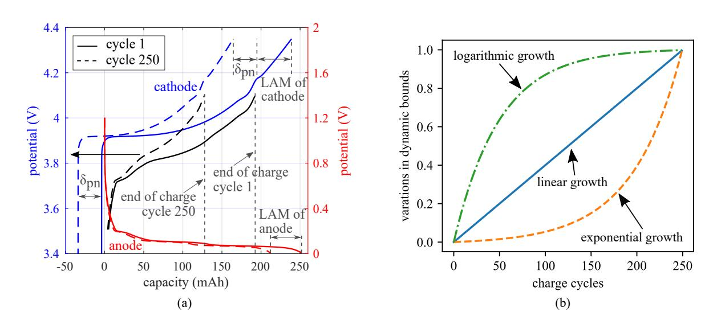

Figure E.4 (a) Half-cell curve analysis with the key components annotated; and (b) Linear, exponential and logarithmic control equations for dynamic NLLS bounds, presented as a unit function.

In this work, the three degradation parameters are assumed to evolve over time following certain rules that have been reported in the literature. Specifically, LLI grows proportionally to the square root of time (i.e. following the *t* 1/2 rule) (Smith et al., 2011b) and the growth of LAM on either electrode follows an exponential function (Honkura et al., 2011). The resulting capacity is calculated through a differential voltage analysis algorithm which used LiCoO<sup>2</sup> and graphite half-cell curve data to calculate the full-cell curve data with cutoff voltage of 3.5 V for end-of-discharge voltage and 4.1 V for end-of-charge voltage. A flowchart for half-cell model is shown in figure [E.3.](#page-284-0)

### E.2.2 On-board estimation of degradation parameters

As aforementioned, early identification and resolution of reliability issues and proactive prevention of failures require the capability of BMS to diagnose, in a quantitative manner, the degradation mechanisms in individual battery cells while the cells are in operation. More specifically, BMS should be capable of on-board estimation of the degradation parameters (i.e., LLI, and LAMs on both electrodes) of individual battery cells that quantify the degrees of degradation from the mechanisms. Most of the recent works have been focused on offline estimation of the degradation parameters using the half-cell model (Smith et al., 2012; Dubarry et al., 2011). Existing parameter estimation methods use either least-squares numerical optimization (Dahn et al., 2012; Smith et al., 2011a) or stochastic optimization(Han et al., 2014) to determine optimum values of the degradation parameters that produce the best agreement between the measured and estimated full-cell *V* vs. *Q* or *dV*/*dQ* vs. *Q* curves. These methods are well suited for the diagnostics

{288}------------------------------------------------

<span id="page-288-0"></span>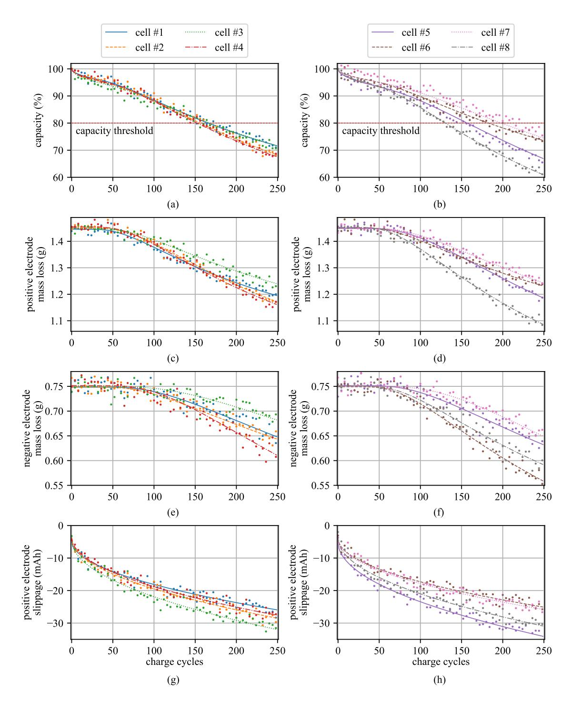

Figure E.5 Degradation cases for 8 cell models, generated with the highest level of measurement noise, showing the: (a-b) capacity data; (c-d) mass loss of the positive electrode; (e-f) mass loss of the negative electrode; and (g-h) positive electrode slippage where (a),(c),(e) and (g) report the results for cells #1-4 and (b),(d),(f) and (h) report the results for cells #5-8.

{289}------------------------------------------------

<span id="page-289-0"></span>of degradation mechanisms in an offline environment, where a precise measurement of the *V* vs. *Q* curve (and thus the *dV*/*dQ* vs. *Q* curve) can be obtained using high-precision testing equipment. However, none of these offline methods consider the various noise sources in the on-board measurements of *V* and *Q*. To the authors' knowledge, the only work that attempted to make half-cell analysis applicable to on-board BMS adopted particle filtering to infer the degradation parameters from the measurement of the full-cell *dV*/*dQ* curve (Hu et al., 2016). Nevertheless, this recent work did not consider noise in the on-board measurements of *V* and *Q*. The proposed methodology assumes that the estimation errors of the three degradation parameters all follow zero-mean Gaussian distributions with the following values of standard deviation: 0.25 mg for *m<sup>p</sup>* and *m<sup>n</sup>* and 0.05 mAh for δ*pn*. To ensure that the proposed mechanistic prognostics approach is capable of dealing with higher levels of uncertainty in parameter estimation, a noise investigation is carried out in this work.

#### E.2.3 Non-linear least squares method

Non-linear least squares (NLLS) is a form of least squares analysis that is used to fit *m* observations into a nonlinear mathematical model with *n* unknown coefficients, such that *m* > *n*. Computationally, NLLS are solved through successive iterations of a two-step process. First, the selected nonlinear mathematical model is linearized around the initial guesses for the model coefficients using a first-order Taylor series and solved. Secondly, the error between the initial guess and the solved model is calculated. The two steps are repeated till a minimization of the error is obtained. This iterative process requires good initial guesses to enable short calculation times. The requirement can easily be met for the work presented here as the number of unknown coefficients (*n*) is relatively low, being only 3 or 4 as presented in the following section. Additionally, the same degradation parameters from different battery cells evolve in a similar manner, allowing for static initial guesses for any given parameter. For the duration of this work the NLLS fitting is accomplished using the Symfit Python package (tBuLi et al., 14 ).

### E.3 Methodology

Investigation of the newly proposed mechanistic prognostics approach was performed using degradation parameter estimates synthetically generated for eight Li-ion battery cells. The synthetic data generation involved two steps. In the first step, the true degradation parameters for eight cells were generated using eight sets of model parameter data with each set depicting the evolution of the LAMs on the positive and negative electrodes and the relative slippage on

{290}------------------------------------------------

<span id="page-290-0"></span>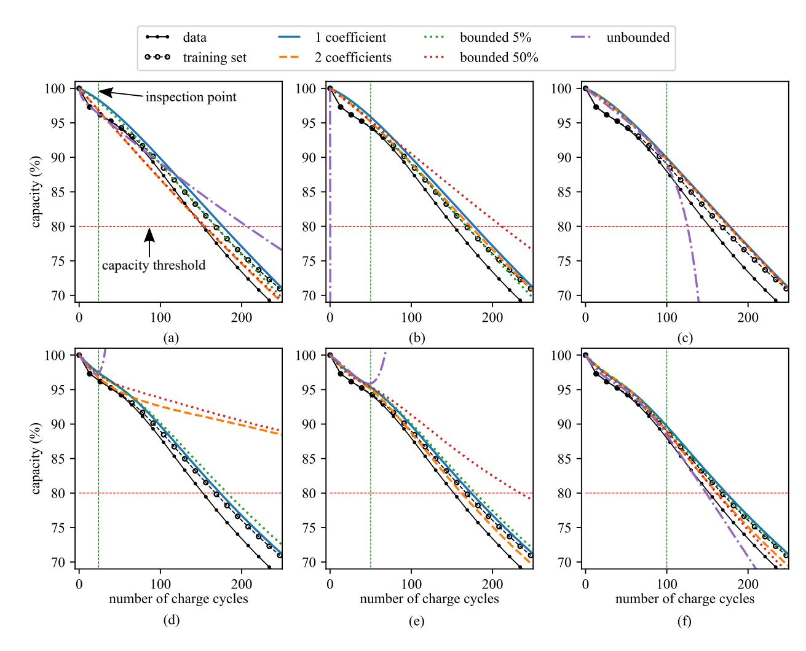

Figure E.6 Capacity life prediction for cell #4 using (a) capacity-based prognostics inspected at 25; (b) 50; (c) 100 charge-discharge cycles; (d) mechanistic prognostics inspected at 25; (e) 50; and (f) 100 charge-discharge cycles.

{291}------------------------------------------------

<span id="page-291-0"></span>the positive electrode (Honkura et al., 2011). The evolution of the LAM on the positive or negative electrode follows the exponential function:

$$m(t) = m_0 - a \cdot e^{-b/t} \quad (\text{E.1})$$

where *m*(*t*) is the LAM as a function of the number of cycles (*t*) and *m*<sup>0</sup> is the initial mass (*g*) on the positive or negative active material. The variables *a* and *b* are used as adjustable coefficients to introduce cell-to-cell variation. The equation used for the relative slippage follows the square root of time (Smith et al., 2011b; Honkura et al., 2011) and takes the following form:

$$\delta_{\text{pn}}(t) = \delta_{\text{pn},0} - a \cdot t^{1/2} \quad (\text{E.2})$$

where δpn(*t*) is the relative slippage as a function of the number of cycles (*t*), δpn,<sup>0</sup> is the initial slippage due to the formation of an initial solid electrolyte interface layer, and *a* is an adjustable parameter to introduce cell-to-cell variation. The true capacities of each cell were then calculated through the use of the half-cell model that takes the cell's degradation parameters as inputs. The capacity and parameter data sets span 250 charge-discharge cycles and are presented in figure [E.5](#page-288-0) as data lines of various styles.

In the second step, a noise was introduced into the degradation parameter data as a normally distributed Gaussian noise and is intended to simulate the estimation error that would be present during the process of inferring the parameters from the full-cell *V* and *Q* measurements as discussed in section [E.2.2.](#page-287-0) To investigate the effects of noise (or estimation error) on the performance of the mechanistic prognostics approach, integer multiples of the previously defined standard deviations were applied to the data sets. Figure [E.5](#page-288-0) presents the parameter estimates used for the eight cells, where the noisy parameter estimates (dots) are distributed about the true parameter values (lines). To improve readability, figure [E.5](#page-288-0) presents every forth data point for the highest level of noise tested, fifty times that defined in section [E.2.2.](#page-287-0)

Mathematical models for the capacity and degradation parameters were chosen that were capable of accurately reproducing the non-linear shapes of a cell's capacity and degradation parameters, while still maintaining simple mathematical expressions. For consistency with previously published work in the field (He et al., 2011; Walker et al., 2015), the following mathematical model was used for the implementation of the capacity-based prognostics approach:

$$M(t) = a \cdot e^{b \cdot t} + c \cdot e^{d \cdot t} \quad (\text{E.3})$$

{292}------------------------------------------------

where *M* is the model output, *t* is the number of charge-discharge cycles and *a*, *b*, *c* and *d* are the coefficients that need to be fitted. Due to its versatility, equation [E.3](#page-291-0) was also used to model the evolution of the relative slippage on the positive electrode. A similar equation was developed for modeling the evolutions of the LAMs on the positive and negative electrodes,

$$M(t) = a \cdot e^{bt} + c \cdot (1 - e^{dt}) \quad (\text{E.4})$$

*a*, *c* and *d* and are the coefficients that need to be fitted and *b* = 0 is considered a constant. This formulation of the equation was chosen for its continuity with equation [E.3](#page-291-0) in terms of the number of parameters, their locations and relative effects on the final fitting results. Degradation tracking was provided through fitting the model's coefficients for any given number of observations and then using the models to infer the degradation parameters past the last observation point (or cycle). In this work, four model fitting strategies are used, and these include: i) fitting 1 coefficient (*c*), ii) fitting 2 coefficients (*c* and *d*), iii) fitting all coefficients unbounded (with *b* = 0 for equation E.4), and iv) fitting all coefficients with various levels of percentage bounds. These model fitting strategies were selected for continuity with previously published work (He et al., 2011; Walker et al., 2015). In all these cases, except fitting all coefficients, the remaining coefficients were set using training data. For each testing cell, its training set was formed as the data from the other seven cells. The cells, numbered #1 through 8 are ordered such that cell #1 is the cell with the least disagreement between itself and its training set, while cell #8 is the cell with the highest level of disagreement between itself and its training set. Therefore, the cells considered in this work consist of cells that act similar to the average of their respective training sets (e.g. cells #1, 2, and 3) and cells that can be considered as outliers (e.g. cells #6, 7 and 8).

For the bounded data sets, parameter bounds are set as a percentage of the coefficient's (*a*, *b*, *c* and *d*) value, as determined by the cell's training set. A tighter bound will force the NLLS algorithm to maintain a prediction closer to the prediction generated by the training set, while a looser bound will allow the model to rely more on observation data as it becomes available. RUL predictions made in the early stages of the cell's life cycle benefit from the tighter bounds as they have a higher reliance on the training data set. However, as more observations become available the looser bounds allow the mechanistic prognostics approach to learn from the online observations. To leverage the benefits of both the tighter (early-stage benefits) and loser (late-stage benefits) bounds, the concept of dynamic bounds that shift throughout the life cycle of a battery cell is introduced, termed dynamic bounds. Here, the concept of dynamic bounds is investigated using three equations to control the dynamic bounds, as presented in figure [E.4\(](#page-287-0)b). These include linear, exponential and logarithmic growth functions that were selected to demonstrate the effects of dynamic bounds under various situations. Functions used in developing the dynamic bounds, as presented in figure [E.4\(](#page-287-0)b), are unity functions that start with 0 at charge-discharge cycle 0 and scale to 1 at cycle 250, the last measurement point in the capacity

{293}------------------------------------------------

<span id="page-293-0"></span>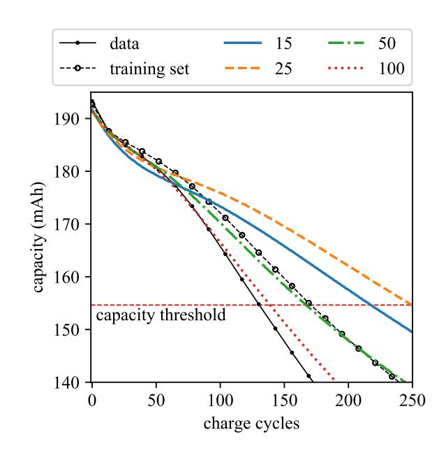

Figure E.7 Mechanistic capacity predictions for cell #8 with 50% bounded coefficients at inspections points of 15, 25, 50 and 100 charge-discharge cycles.

and parameter data sets. This allows the bounds to be scaled to fit various final bound values following the different progression shapes presented in figure [E.4\(](#page-287-0)b). For example, a dynamic bound with a final value set to 500% would start with 0 at cycle 0 (relying completely on the training set to select the model parameters) and finish as 500% at cycle 250. At 250 cycles, the model fitting for a testing cell relies completely on the cell's observations as a 500% difference from the training sets coefficients was found to be unobtainable at 250 cycles for all the data sets tested here. As expected, the charge-discharge cycle where the bounds cease to affect the coefficient selection is dependent on a cell's capacity level, the level of agreement between that cell and its training set and the level of the bounds set. The effect of changing the final bound values on the prognostics results was investigated for 70 evenly spaced final bound values between 0 and 500%. Each final bound value was repeated three times, for all eight cells, at the noise levels discussed in section [E.2.2](#page-287-0) to obtain a clearer representation of a typical response. In total, 10,080 individual cell cases were investigated for the six dynamic bounds cases considered.

Comparison of the capacity-based and mechanistic prognostics approaches is achieved by calculating the mean RUL prediction error for each of the eight cells over five runs. The aforementioned model fitting strategies, 1 coefficient, 2 coefficients, all coefficients unbounded, and all coefficients bounded at 5, 10, 25, 50 and 75%, are investigated. Additionally, dynamic bounds for the linear, exponential and logarithmic control equations with a final bound value of 500% are also investigated.

{294}------------------------------------------------

<span id="page-294-0"></span>A noise study was performed to investigate how the level of noise present in the online measurements (or estimates) of the capacity and degradation parameters manifests itself in the RUL predictions for both the capacity-based and mechanistic prognostics approaches. Noise was added as fifty integer multiples to the levels of noise assumed to be present in the online measurement of cell parameters, as discussed in section [E.2.2.](#page-287-0) These tests were again repeated 3 times to obtain a general representation of how noise effects the prognostics affects and to limit the effect of any single sample points of high noise. The data is presented as the average error over all eight cells tested, for 5 model fitting strategists for both prognostics methods. In total, 12,000 noise cases for individual cell cases were investigated in this noise study. Lastly, the increase in computational resources required for obtaining prognostic estimations for the mechanistic approach over that of the classical capacity-based approach is investigated.

# E.4 Results

This section presents the results for the proposed mechanistic prognostics approach, including the proposed dynamic bounds used in selecting the mathematical model's coefficients.

# E.4.1 Remaining useful life predictions

Computation of the RUL can be made at any point, termed inspection point, in the life cycle of a battery cell. Figure [E.6](#page-290-0) presents the capacity predictions for cell #4 (testing cell) using the capacity-based (figure [E.6\(](#page-290-0)a)-(c)) and the mechanistic prognostics (figure [E.6\(](#page-290-0)d)-(f)) approaches for various coefficient fitting strategies. Cell #4 was selected because it provides a clear illustration of several key prognostics features. First, it can be observed that the testing cell and its training set, generated from the other 7 cells, do not strongly agree. More precisely, the training set estimates that the cell should reach its capacity threshold in 176 cycles versus the 152 cycles achieved by cell #4. Model fitting strategies that rely heavily on the training set (e.g. 1 coefficient and bounded 5%) produce capacity estimates for the testing cell that stay close to those of the training set. In contrast, fitting strategies that impose looser bounds on the parameters (e.g. 2 coefficients, all coefficients unbounded and all coefficients bounded at 50%) can produce capacity estimates that vary greatly from those by the training set, allowing them to take advantage of new observation data as it becomes available. However, this feature means that the predictions made by these strategies can diverge from the data when a low number of observations are available as observable in figure [E.6\(](#page-290-0)d) for the unbounded set. With an increasing number of observations, the loosely bounded model fitting strategies are capable of accurately predicting the cell's future capacities. This attribute can be seen for the bounded 50% predictions in figures [E.6\(](#page-290-0)d)-(f) where an increase in the number of available observations results in the bounded 50% predictions

{295}------------------------------------------------

<span id="page-295-0"></span>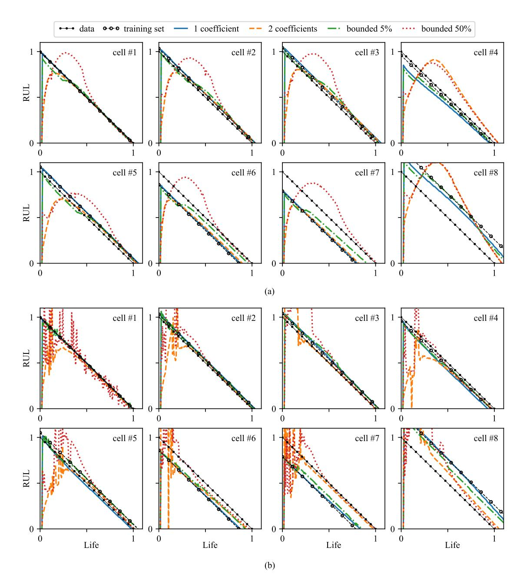

Figure E.8 RUL results for: (a) capacity-based prognostics approach; and (b) mechanistic prognostics approach.

{296}------------------------------------------------

<span id="page-296-0"></span>Table E.1 Tabulated RUL RMSE for the each cell using the capacity-based and mechanistic prognostics methods.

| 1           | parameter  | 0.008      | 0.035   | 0.061   | 0.055   | 0.045       | 0.122       | 0.193   | 0.224      |       |  |  |  |  |  |
|-------------|------------|------------|---------|---------|---------|-------------|-------------|---------|------------|-------|--|--|--|--|--|
| 2           | parameters | 0.072      | 0.130   | 0.113   | 0.045   | 0.103       | 0.149       | 0.209   | 0.179      |       |  |  |  |  |  |
|             | unbounded  | 0.281      | 0.288   | 0.183   | 0.294   | 0.234       | 0.275       | 0.266   | 0.291      |       |  |  |  |  |  |
|             | bounded 5% | 0.023      | 0.041   | 0.053   | 0.049   | 0.034       | 0.070       | 0.131   | 0.159      |       |  |  |  |  |  |
| bounded     | 10%        | 0.035      | 0.061   | 0.043   | 0.059   | 0.054       | 0.052       | 0.105   | 0.147      |       |  |  |  |  |  |
| bounded     | 25%        | 0.072      | 0.119   | 0.079   | 0.092   | 0.106       | 0.058       | 0.059   | 0.165      |       |  |  |  |  |  |
| bounded     | 50%        | 0.142      | 0.178   | 0.106   | 0.153   | 0.139       | 0.136       | 0.157   | 0.198      |       |  |  |  |  |  |
| bounded     | 75%        | 0.188      | 0.217   | 0.132   | 0.195   | 0.169       | 0.189       | 0.209   | 0.225      |       |  |  |  |  |  |
| linear      | dynamic    | 0.219      | 0.218   | 0.108   | 0.344   | 0.186       | 0.195       | 0.202   | 0.257      |       |  |  |  |  |  |
| exponential | dynamic    | 0.058      | 0.074   | 0.052   | 0.135   | 0.075       | 0.066       | 0.099   | 0.143      |       |  |  |  |  |  |
| logarithmic | dynamic    | 0.207      | 0.205   | 0.107   | 0.269   | 0.176       | 0.198       | 0.201   | 0.227      |       |  |  |  |  |  |
|             |            |            |         |         |         | mechanistic | prognostics |         |            |       |  |  |  |  |  |
|             |            | cell       | #1 cell | #2 cell | #3 cell | #4 cell     | #5 cell     | #6 cell | #7 cell #8 |       |  |  |  |  |  |
|             | 1          | parameter  | 0.005   | 0.009   | 0.016   | 0.020       | 0.007       | 0.029   | 0.038      | 0.042 |  |  |  |  |  |
|             | 2          | parameters | 0.056   | 0.062   | 0.087   | 0.075       | 0.102       | 0.080   | 0.072      | 0.122 |  |  |  |  |  |
|             | unbounded  | 0.282      | 0.307   | 0.258   | 0.322   | 0.297       | 0.281       | 0.294   | 0.267      |       |  |  |  |  |  |
|             | bounded 5% | 0.011      | 0.013   | 0.019   | 0.049   | 0.021       | 0.027       | 0.042   | 0.043      |       |  |  |  |  |  |
| bounded     | 10%        | 0.020      | 0.018   | 0.028   | 0.056   | 0.027       | 0.023       | 0.041   | 0.041      |       |  |  |  |  |  |
| bounded     | 25%        | 0.040      | 0.037   | 0.048   | 0.089   | 0.053       | 0.043       | 0.049   | 0.061      |       |  |  |  |  |  |
| bounded     | 50%        | 0.065      | 0.063   | 0.092   | 0.112   | 0.097       | 0.078       | 0.083   | 0.092      |       |  |  |  |  |  |
| bounded     | 75%        | 0.097      | 0.090   | 0.118   | 0.159   | 0.123       | 0.107       | 0.097   | 0.134      |       |  |  |  |  |  |
| linear      | dynamic    | 0.091      | 0.085   | 0.083   | 0.190   | 0.124       | 0.116       | 0.125   | 0.250      |       |  |  |  |  |  |
| exponential | dynamic    | 0.037      | 0.026   | 0.043   | 0.057   | 0.036       | 0.050       | 0.068   | 0.118      |       |  |  |  |  |  |
| logarithmic | dynamic    | 0.120      | 0.105   | 0.129   | 0.127   | 0.107       | 0.126       | 0.136   | 0.147      |       |  |  |  |  |  |

converging onto the actual capacity observations from the cell. Provided that an appropriate coefficients estimation strategy is selected, the mechanistic approach is shown to provide better prediction accuracy than the capacity-based approach. In total, ignoring the unbounded coefficients fitting strategy, the mechanistic approach outperformed the capacity-based approach in 78 of the 80 cases considered, or 97.5% of the time. This increase in RUL predictions is mainly due to the inability of the capacity-based approach to account for the sharp change in capacity in the first few charge-discharge cycles. This disagreement in the first few cycles is represented in the RUL plots, provided later in this paper, as an overestimation of the cell's RUL.

{297}------------------------------------------------

<span id="page-297-0"></span>The effect of changing inspection points is further expanded upon in figure [E.7](#page-293-0) where the mechanistic capacity predictions, made at 15, 25, 50 and 100 charge-discharge cycles, are shown for cell #8 with the coefficients bounded at 50%. Here, cell #8 was selected because it exhibits the largest studied disagreement between its capacities and those estimated by its training set. In the early stages, as expected, the predictions vary widely due to the fact that the coefficients have only loose constraints provided by the 50% bounds. However, as the number of observations increases, the looser bounds result in the NLLS being able to track and predict the cell's true capacities. The capability of the mechanistic prognostics approach with loose bounds to track the time-varying fade behavior of a cell that strongly deviates from its training set is a great advance over the use of tight fitting bounds. Furthermore, it should be noted that the unbounded coefficient fitting solution provides highly divergent predictions for both the capacity-based and mechanistic prognostics approaches. Due to its inability to provide useful RUL predictions, it is mostly neglected for the remainder of this work.

Table E.2 Tabulated RUL improvements for the each cell using the mechanistic prognostics method in comparison to the capacity-based prognostics method.

|              |  | ?      | ?      | ?      | ?      | ?      | ?      | ?      | ?     | ? |
|--------------|--|--------|--------|--------|--------|--------|--------|--------|-------|---|
| 1 parameter  |  | 0.003  | 0.026  | 0.045  | 0.035  | 0.038  | 0.093  | 0.155  | 0.182 |   |
| 2 parameters |  | 0.016  | 0.068  | 0.026  | -0.030 | 0.001  | 0.069  | 0.137  | 0.057 |   |
| unbounded    |  | -0.001 | -0.019 | -0.075 | -0.028 | -0.063 | -0.006 | -0.028 | 0.024 |   |
| bounded      |  | 0.012  | 0.028  | 0.034  | 0.000  | 0.013  | 0.043  | 0.089  | 0.116 |   |
| bounded      |  | 0.015  | 0.043  | 0.015  | 0.003  | 0.027  | 0.029  | 0.064  | 0.106 |   |
| bounded      |  | 0.032  | 0.082  | 0.031  | 0.003  | 0.053  | 0.015  | 0.010  | 0.104 |   |
| bounded      |  | 0.077  | 0.115  | 0.014  | 0.041  | 0.042  | 0.058  | 0.074  | 0.106 |   |
| bounded      |  | 0.091  | 0.127  | 0.014  | 0.036  | 0.046  | 0.082  | 0.112  | 0.091 |   |
| linear       |  | 0.128  | 0.133  | 0.025  | 0.154  | 0.062  | 0.079  | 0.077  | 0.007 |   |
| exponential  |  | 0.021  | 0.048  | 0.009  | 0.078  | 0.039  | 0.016  | 0.031  | 0.025 |   |
| logarithmic  |  | 0.087  | 0.100  | -0.022 | 0.142  | 0.069  | 0.072  | 0.065  | 0.080 |   |

The RUL plots for each cell are provided in figure [E.8,](#page-295-0) where figure [E.8\(](#page-295-0)a) and (b) presents the RULs for each cell as predicted by the capacity-based and mechanistic prognostics approaches, respectively. Results are presented as RUL over life consumed, where a threshold of 80% of the initial capacity is used as the failure limit to determine the cell's end of life and RUL. Therefore, the cell's capacity data is presented as a straight line between maximum RUL and the maximum life consumed. For all the cases presented, the predicted RULs are zero for the first four charge-discharge cycles due to the NLLS algorithm needing at least 5 observation points for model fitting, as discussed in section [E.2.3.](#page-289-0) This discontinuity is ignored in the remaining discussion. The RUL plots for both the capacity-based and mechanistic

{298}------------------------------------------------

<span id="page-298-0"></span>Table E.3 Computational time and memory usage analysis for both the classical capacity-based and the newly proposed physics based approach.

|      |    | classical | time (s) mechanistic | memory classical | (MB) mechanistic |
|------|----|-----------|----------------------|------------------|------------------|
| cell | #1 | 0.37      | 6.28                 | 4.40             | 4.62             |
| cell | #2 | 0.47      | 6.90                 | 4.31             | 4.69             |
| cell | #3 | 0.47      | 6.79                 | 4.39             | 4.96             |
| cell | #4 | 0.40      | 6.99                 | 3.99             | 5.01             |
| cell | #5 | 0.45      | 7.13                 | 3.70             | 5.01             |
| cell | #6 | 1.13      | 7.88                 | 3.91             | 4.67             |
| cell | #7 | 0.47      | 7.37                 | 4.26             | 4.63             |
| cell | #8 | 0.43      | 6.51                 | 4.70             | 4.90             |

prognostics approaches demonstrate that the coefficients fitting strategies that rely on tighter bounds (1 coefficient and 5% bounded) tend to provide RUL estimations closer to the training sets, as would be expected. In contrast, fitting strategies that are loosely bounded to the training sets (2 coefficients and 50% bounded) demonstrate a high level of noise until a sufficient number of observations become available. Thereafter, these fitting strategies demonstrate that they are capable of accurately predicting the RULs of cells that vary widely from their respective training sets, and this feature is seen in the prediction results on cells #6, 7 and 8. Overall, the capacity-based prognostics approach possesses a high level of overestimation in the early stages of a cell's life cycle. This is caused by the inability of the capacitybased prognostics approach to reproduce the highly nonlinear portion of the cells capacity fade in its early stages, as shown in figure [E.6.](#page-290-0) After a sufficient number of observations are obtained the capacity-based RUL predictions converge onto the real data set after a sufficient number of observations come online. The number of observations needed is a function of the level of disagreement between the testing data set and its training set. The higher the level of disagreement, the more observations that are needed before the predicted RUL converges onto the true RUL. The RUL predicted by the mechanistic prognostics approach is characterized by having a high level of chaotic noise in the early stages of life and converging onto the cells' true RULs quicker than that by the capacity-based approach. The capability of the RUL estimated using the mechanistic approach to converge onto the cells' true RULs quicker than the capacity-based prognostics approach, for cells that diverge greatly from their training sets, is a marked improvement over the capacity-based prognostics approach. Again, cells #6, 7 and 8 show the difference between the capacity-based (figure [E.8\(](#page-295-0)a)) and mechanistic (figure [E.8\(](#page-295-0)b)) approaches in the prediction of a cell's RUL for the case where the cell's true capacities greatly differ from those of its training set.

{299}------------------------------------------------

<span id="page-299-0"></span>A further exploration of the RUL predictions is presented in Table [E.1.](#page-296-0) It lists the error measured as the root mean square error (RMSE) between each cell's predicted RUL and its true RUL for each charge cycle excluding the first 25 charge-discharge cycles. The first 25 charge-discharge cycles were ignored because these exhibited a high level of noise in both cases. Table [E.1](#page-296-0) lists results for all the model fitting strategies investigated, including the dynamic bounds that are discussed later in this section. Results were obtained by running each cell five times, with the noise levels defined in section [E.2.2,](#page-287-0) and taking the average of all the runs. This was done to obtain an accurate representation of the prognostics ability of each fitting strategy. The level of improvement for the mechanistic prognostics approach over that of the capacity-based prognostics approach is listed in Table [E.2.](#page-297-0) These values were calculated by subtracting the mechanistic error results from the capacity-based results for each cell and fitting strategy investigated. Therefore, a positive number is associated with an improvement in RUL prediction accuracy while a negative number is associated with a decrease in the RUL prediction accuracy for that particular cell and fitting strategy. For clarity, the negative numbers are all highlighted in Table [E.2.](#page-297-0) Ignoring the unbounded coefficient fitting strategy, that already possessed a high level of prediction error, the mechanistic approach demonstrated a improvement over the capacity-based approach 97.5% of the time. In only two cases did the capacity-based prognostics approach outperform the mechanistic prognostics approach, however, these improvements were small and only achieved on cell cases that had a relatively strong agreement between its real capacities and those of its training set.

#### E.4.2 Dynamic bounds

Here, the concept of dynamic bounds is inspected. First a series of tests were performed to validate the performance of the three sets of previously proposed dynamic bounds, as shown in figure [E.4\(](#page-287-0)b), at various final bound levels. Figure [E.10\(](#page-302-0)a) shows the error results, again quantified as the RMSE for the charge-discharge cycles excluding the first 25 cycles. For both the capacity-based and mechanistic prognostics approaches, the exponential control equation for increasing the dynamic bounds demonstrated the most usable prognostics results. Here, usability is defined in terms of a RUL prediction that can be accurately used by a BMS to properly manage loads and/or schedule cell replacement. The high usability of the exponential control equation for the dynamic bounds is to be expected as it forces the model to rely heavily on the training set in the early stages and then quickly, in the later stages, switches to allow the RUL to be predicted using the online data. For low levels of the final dynamic bound value, the linear and logarithmic control equations were found to provide a low level of error. This low level of noise was mainly due to their capability to minimize the error in the early stages of a cell's life cycle rather than minimizing error in the later portions of the cells life, as desired. Also, the linear and logarithmic control equations experience a relatively small range where these equations are at their minimum error values when compared to the exponential control equation.

{300}------------------------------------------------

<span id="page-300-0"></span>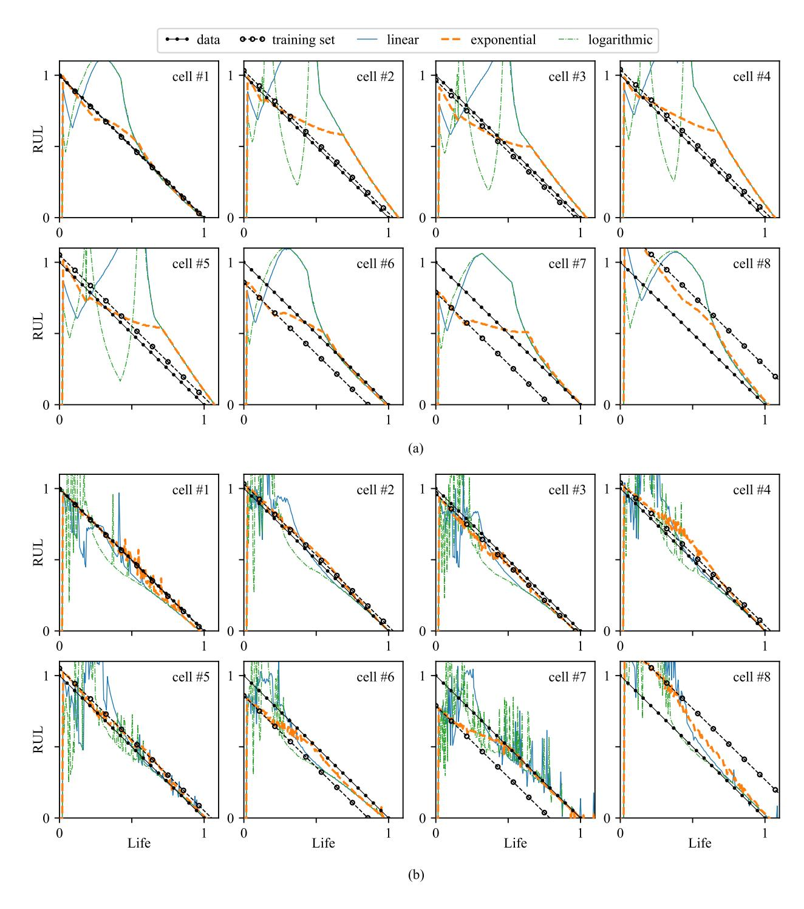

Figure E.9 RUL results using a final dynamic bound value of 500% for the: (a) capacity-based prognostics approach; and (b) mechanistic prognostics approach.

{301}------------------------------------------------

<span id="page-301-0"></span>Therefore, it can be stated that the exponential control equation is better suited to providing reliable and repeatable prognostic results due to its capability to improve predictions over the cells entire life cycle and the simplicity in choosing a final bounded value.

Figure [E.9](#page-300-0) presents the RUL predictions by the capacity-based and mechanistic prognostics approaches. While in certain conditions the RULs predicted with the dynamic bounds controlled with the linear or logarithmic equation converged onto the true RULs sooner, these predictions always possessed a higher level of noise than the predictions obtained with the dynamic bounds using the exponential growth equation. This noise, while not detrimental to prognostics in the later stages of a cell's life, adds a level of uncertainty that may be unacceptable in cases where accurate RUL prediction is needed by BMSs to properly manage loads and/or schedule replacement. In comparison, the dynamic bounds controlled with the exponential growth equation demonstrate a low level of noise in the early stages of the prognostics, therefore, resulting in a nice clean RUL prediction as presented in figure [E.9.](#page-300-0) Of particular interests are the RUL predictions of the dynamic bounds controlled by the exponential growth equation for the battery cells that strongly disagree with their training sets (cells #6, 7 and 8). Here, RUL calculated using the dynamic bounds method with the exponential growth equation starts out by following the training sets, then as more online observations become available the predicted RULs start to converge onto the cell's true RULs. This feature is observed in figure [E.9\(](#page-300-0)b) for cell #6 and 7 where the dynamic bounds method with the exponential growth equation provides the RUL predictions with the least amount of noise and is capable of accurately predicting the cells' end-of-life conditions. Furthermore, as the training set of a cell starts to diverge more from the cell's real condition (e.g. cell #8), the RUL prediction made with the exponential growth equation starts to require a higher level of online observations to accurately predict the cell's RUL. It should be noted that for cell #8, the RULs predicted by the linear and logarithmic control equations converge onto the true RULs quicker than those by the exponential. However, their high level of uncertainty in the early stages makes their predictions less reliable from a load management or cell replacement point of view. The special case of cells that vary greatly from their training sets and the optimum methods for their prognostics is beyond the scope of this introductory study.

#### E.4.3 Robustness to noise

To evaluate the robustness of the prognostics approaches presented here with respect to noise, an estimated noise signature for the on-board estimation of the degradation parameters is assumed, amplified, and added to the degradation parameter estimates as scalar multiples of the originally estimated noise. These results are presented in figure [E.10\(](#page-302-0)b-c) for a few selected model fitting strategies with figure [E.10\(](#page-302-0)b) and (c) showing the results of the capacity-based

{302}------------------------------------------------

<span id="page-302-0"></span>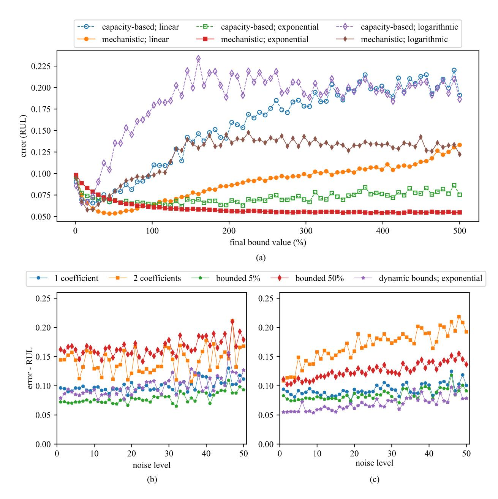

Figure E.10 Numerical investigations in terms of: (a) RUL prediction errors for the three dynamic bound equations, for capacity-based and mechanistic prognostics inspected for a final bound value ranging from 1-500%; (b) noise robustness for the capacity-based approache; and (c) noise robustness for the mechanistic prognostics approach.

{303}------------------------------------------------

<span id="page-303-0"></span>and mechanistic approaches, respectively. Again, the error results are calculated as the RMSE for the chargedischarge cycles after ignoring the first 25 cycles. While some model fitting strategies demonstrate the majority of their errors in the early stages of development, this whole cycle error calculation approach allows for an accurate representation and comparison of each fitting strategy over the entire data set. As demonstrated in figure [E.10\(](#page-302-0)b-c), the addition of higher levels of noise to the on-board parameter estimation is not highly detrimental to the mechanistic approach to battery prognostics. Moreover, when comparing the mechanistic approach with the capacity-based approach, the mechanistic approach tends to provide a more stable error, and therefore, a more stable prognostics response. This is demonstrated by the more linear trend of the error for any given fitting strategy. The dynamically bounded mechanistic approach controlled by the exponential equation was found to possess an excellent ability to function in the various noise levels investigated.

#### E.4.4 Algorithm performance

The newly proposed mechanistic prognostics approach requires the more data and computational resources than that of the classical capacity-based prognostics approach, as annotated in figure [E.2.](#page-283-0) To quantify the increase in resources required, the computational time and memory required to solve a signal prognostics analysis for each of the eight cells under consideration was analyzed and is presented in Table [E.3.](#page-298-0) These results were obtained for both prognostic methods at 100 charge-discharge cycles using the NLLS algorithm with 50% static bounds. The prognostic results for these cases are presented in figure [E.6\(](#page-290-0)c) and (f). On average, the mechanistic prognostic approach required 13.3 time more computational time (running on a single thread of a 3.4 GHz Intel 4770) and 1.14 times more peak memory than the classical capacity-based prognostics approach using the sane NLLS algorithm.No great variation in computational requirements were detected when different bounds were applied to the NLLS algorithm. Therefore, for brevity, these results are omitted.

### E.5 Conclusion

This paper proposed a novel mechanistic approach to battery prognostics that achieves remaining useful life (RUL) prediction of a battery cell through tracking its degradation parameters and estimating the cell's capacity through the use of a half-cell model. In this physics-based approach, each degradation parameter is fitted to a mathematical model through the use of a non-linear least squares (NLLS) solver. In addition to the newly proposed mechanistic approach, this work also expands upon the use of NLLS for battery prognostics through the introduction of dynamic bounds. This is achieved through limiting the model coefficients solved for by NLLS to within a predefined percentage of 

{304}------------------------------------------------

the coefficient used in fitting the training data set, the predefined percentage is then allowed to increase as the cell progresses through its life cycle. This increase is controlled by a predefined function, here, an exponential function was shown to provided the best results in terms of usable and stable RUL predictions. The mechanistic approach was demonstrated, through simulated data, to provide a marked improvement over a traditional capacity-based prognostics approach. When used in combination with the dynamic bounds for the NLLS solver, the mechanistic prognostics approach was demonstrated to be a reliable prognostics tool with a low level of uncertainty throughout the entire life of a cell. This low level of uncertainty was achieved through the RUL predictions being closely tied to the cells training set in the early stages and then being allowed to converge onto the cell's true RULs as more online observations become available. In addition to the low levels of uncertainty achieved with the mechanistic approach using dynamic bounds, this approach is also capable of providing accurate RUL predictions for cells whose trends of degradation differ significantly from those of their training sets.

The mechanistic prognostics approach introduced here provides the necessary framework needed to advance the state-of-the-art in battery prognostics from the current capacity-based approaches to physics-based approaches. This advance in battery prognostics can be leveraged to equip existing battery management systems (BMSs) with the capability to explicitly consider the coupling effects of the major degradation mechanisms on battery degradation and RUL prediction. The tracking of the degradation parameters could be expanded through the use of various other model-based approaches already used for capacity-based prognostics of battery cells. These include Kalman filters, support vector machine, and particle filters to name a few. Additionally, the estimation of cell capacity from the extrapolated degradation parameters, here done with an analytical half-cell model, could be enhanced through the use of a more advanced model (e.g. a reduced-order electrochemical model). Finally, an experimental validation of the mechanistic prognostics approach is currently being performed in the authors' group by running long-term aging tests on commercial Li-ion cells with a high-precision charger.

# Acknowledgments

This work is supported by the National Science Foundation (NSF) Grant Nos. 1069283 and ECCS-1611333. It is also partly supported by the NSF Grant No. 1069283, which supports the activities of the Integrative Graduate Education and Research Traineeship (IGERT) in Wind Energy Science, Engineering and Policy (WESEP) at Iowa State University. Their support is gratefully acknowledged. Any opinions, findings, and conclusions or recommendations expressed in this material are those of the authors and do not necessarily reflect the views of the NSF.

{305}------------------------------------------------

# E.6 References

<span id="page-305-0"></span>Burns, J. C., Kassam, A., Sinha, N. N., Downie, L. E., Solnickova, L., Way, B. M., and Dahn, J. R. (2013). Predicting and extending the lifetime of li-ion batteries. *Journal of the Electrochemical Society*, 160(9):A1451–A1456. Dahn, H. M., Smith, A. J., Burns, J. C., Stevens, D. A., and Dahn, J. R. (2012). User-friendly differential voltage analysis freeware for the analysis of degradation mechanisms in li-ion batteries. *Journal of the Electrochemical Society*, 159(9):A1405–A1409. Dubarry, M., Liaw, B. Y., Chen, M.-S., Chyan, S.-S., Han, K.-C., Sie, W.-T., and Wu, S.-H. (2011). Identifying battery aging mechanisms in large format li ion cells. *Journal of Power Sources*, 196(7):3420–3425. Gebraeel, N. and Pan, J. (2008). Prognostic degradation models for computing and updating residual life distributions in a time-varying environment. *IEEE Transactions on Reliability*, 57(4):539–550. Gebraeel, N. Z., Lawley, M. A., Li, R., and Ryan, J. K. (2005). Residual-life distributions from component degradation signals: A bayesian approach. *IIE Transactions*, 37(6):543–557. Goebel, K., Eklund, N., and Bonanni, P. (2006). Fusing competing prediction algorithms for prognostics. In *2006 IEEE Aerospace Conference*. IEEE. Han, X., Ouyang, M., Lu, L., Li, J., Zheng, Y., and Li, Z. (2014). A comparative study of commercial lithium ion battery cycle life in electrical vehicle: Aging mechanism identification. *Journal of Power Sources*, 251:38–54. He, W., Williard, N., Osterman, M., and Pecht, M. (2011). Prognostics of lithium-ion batteries based on dempster–shafer theory and the bayesian monte carlo method. *Journal of Power Sources*, 196(23):10314–10321. Heimes, F. O. (2008). Recurrent neural networks for remaining useful life estimation. In *2008 International Conference on Prognostics and Health Management*. IEEE. Honkura, K., Takahashi, K., and Horiba, T. (2011). Capacity-fading prediction of lithium-ion batteries based on discharge curves analysis. *Journal of Power Sources*, 196(23):10141–10147. Hu, C., Hong, M., Li, Y., and Jeong, H.-L. (2016). On-board analysis of degradation mechanisms of lithium-ion battery using differential voltage analysis. In *Volume 2A: 42nd Design Automation Conference*. ASME.

{306}------------------------------------------------

Hu, C., Jain, G., Tamirisa, P., and Gorka, T. (2014). Method for estimating capacity and predicting remaining useful life of lithium-ion battery. *Applied Energy*, 126:182–189. Hu, C., Ye, H., Jain, G., and Schmidt, C. (2018). Remaining useful life assessment of lithium-ion batteries in implantable medical devices. *Journal of Power Sources*, 375:118–130. Hu, C., Youn, B. D., Wang, P., and Yoon, J. T. (2012). Ensemble of data-driven prognostic algorithms for robust prediction of remaining useful life. *Reliability Engineering* & *System Safety*, 103:120–135. Joung, Y.-H. (2013). Development of implantable medical devices: From an engineering perspective. *International Neurourology Journal*, 17(3):98. Liu, J., Saxena, A., Goebel, K., Saha, B., and Wang, W. (2010). An adaptive recurrent neural network for remaining useful life prediction of lithium-ion batteries. Technical report, National aeronautics and space administration moffett field CA ames research center. Liu, J., Wang, W., Ma, F., Yang, Y., and Yang, C. (2012). A data-model-fusion prognostic framework for dynamic system state forecasting. *Engineering Applications of Artificial Intelligence*, 25(4):814–823. Luo, J., Pattipati, K., Qiao, L., and Chigusa, S. (2008). Model-based prognostic techniques applied to a suspension system. *IEEE Transactions on Systems, Man, and Cybernetics - Part A: Systems and Humans*, 38(5):1156–1168. Miao, Q., Xie, L., Cui, H., Liang, W., and Pecht, M. (2013). Remaining useful life prediction of lithium-ion battery with unscented particle filter technique. *Microelectronics Reliability*, 53(6):805–810. Saha, B. and Goebel, K. (2009). Modeling li-ion battery capacity depletion in a particle filtering framework. In *Proceedings of the annual conference of the prognostics and health management society*, pages 2909–2924. San Diego, CA. Si, X.-S., Wang, W., Hu, C.-H., Chen, M.-Y., and Zhou, D.-H. (2013). A wiener-process-based degradation model with a recursive filter algorithm for remaining useful life estimation. *Mechanical Systems and Signal Processing*, 35(1-2):219–237. Smith, A. J., Burns, J. C., and Dahn, J. R. (2011a). High-precision differential capacity analysis of LiMn2o4/graphite cells. *Electrochemical and Solid-State Letters*, 14(4):A39. Smith, A. J., Burns, J. C., Xiong, D., and Dahn, J. R. (2011b). Interpreting high precision coulometry results on li-ion cells. *Journal of The Electrochemical Society*, 158(10):A1136.

{307}------------------------------------------------

Smith, A. J., Dahn, H. M., Burns, J. C., and Dahn, J. R. (2012). Long-term low-rate cycling of LiCoO2/graphite li-ion cells at 55c. *Journal of The Electrochemical Society*, 159(6):A705. tBuLi et al. (2014–). symfit: Open source fitting package Python. [Online; accessed July 27, 2017]. Walker, E., Rayman, S., and White, R. E. (2015). Comparison of a particle filter and other state estimation methods for prognostics of lithium-ion batteries. *Journal of Power Sources*, 287:1–12. Wang, D., Yang, F., Tsui, K.-L., Zhou, Q., and Bae, S. J. (2016). Remaining useful life prediction of lithium-ion batteries based on spherical cubature particle filter. *IEEE Transactions on Instrumentation and Measurement*, 65(6):1282–1291. Wang, P., Youn, B. D., and Hu, C. (2012). A generic probabilistic framework for structural health prognostics and uncertainty management. *Mechanical Systems and Signal Processing*, 28:622–637. Wang, T., Yu, J., Siegel, D., and Lee, J. (2008). A similarity-based prognostics approach for remaining useful life estimation of engineered systems. In *2008 International Conference on Prognostics and Health Management*. IEEE.