{0}------------------------------------------------

# Simulation-in-the-loop additive manufacturing for real-time structural validation and digital twin development

Yanzhou Fu a,b, Austin R.J. Downey a,b,c, Lang Yuan a,b, Hung-Tien Huang c,d, Emmanuel A. Ogunniyi a,b

## A R T I C L E I N F O

#### *Keywords:*

Additive manufacturing

Simulation-in-the-loop

Finite element analysis

Image segmentation

Automatic structural validation

Real-time decision-making

Digital twins

## A B S T R A C T

Ensuring end-use quality is essential for batch-produced parts, particularly for load-bearing components, where defects can significantly compromise structural integrity. Traditionally, finite element analysis (FEA) has been employed either in pre-process design or as a post-process troubleshooting tool. This paper introduces a novel, in-process, simulation-in-the-loop FEA system for real-time validation of the structural quality of additively manufactured components as they are being produced. We present a case study using a consumer-grade 3D material extrusion printer to validate the proposed system. Defect information is segmented from the layer image using a U-net architecture and fed into a finite element solver to predict the potential structural failure of the specimen in real-time. The proposed vision-based damage detection system achieved a segmentation accuracy of 92.79% on the test data, while the FEA model showed final errors of 4.92% and 3.36% in terms of tensile strengths when compared to the measured specimens with and without impactful defects, respectively. The real-time FEA validation process varies depending on the computer system and the complexity of detected defects. Overall, the framework introduced in this work progresses the state-of-the-art towards ensuring realtime validation and timely decision-making during printing. The proposed algorithm is effective for automatic real-time product structural quality validation and decision-making, as demonstrated in three case studies. Result show that for the three different test cases with different levels of defects, the model predicted the failure strength of the specimen within 5%. The contributions of this paper are threefold: First, a simulationin-the-loop framework was developed for in-process real-time structural validation of additively manufactured components. Second, advanced image segmentation was integrated for adaptive defect detection, enabling precise localization of defects without prior training on each defect size. Third, a flexible decision-making system was created to evaluate product quality using tailored structural metrics, allowing timely responses to maintain integrity. Together, these innovations form a comprehensive real-time FEA validation system, enhancing reliability in structural assessment for additive manufacturing.

### **1. Introduction**

End-use product quality guarantee ensures that products meet specific quality standards, including undergoing thorough structural validation to secure integrity and performance [[1](#page-13-0)]. This method is analogous to a Digital-Twin. Assured product quality is crucial for products requiring robust structural properties, such as in buildings [\[2\]](#page-13-1), automotive components [[3](#page-13-2)], aerospace parts [\[4\]](#page-13-3), and medical devices incorporating adaptive technologies [\[5\]](#page-13-4). Products made by additive manufacturing (AM) are known for their lightweight nature and structural integrity, making them widely used in aerospace applications [[6](#page-13-5)] and biomedical devices [[7](#page-13-6)].

AM is an iterative process inherently containing uncertainties. Common defects, such as voids, incomplete fusion, and inconsistent layer adhesion in extrusion-based printing and thermal cracking, porosity from incomplete melting, and residual stress accumulation in laserbased printing, can significantly impact structural integrity [[8](#page-13-7)], especially in critical applications like aerospace and automotive components. Defects in load-bearing areas, for instance, can dramatically impact structural quality, leading to potential failure under operational conditions. Post-manufacturing structural validation addresses these issues by subjecting products to comprehensive testing, simulation, and analysis to ensure they withstand various loads, stresses, vibrations,

a *Department of Mechanical Engineering, University of South Carolina, Columbia, SC 29208, United States*

b *Department of Civil and Environmental Engineering, University of South Carolina, Columbia, SC 29208, United States*

c *Department of Computer Science, University of South Carolina, Columbia, SC 29208, United States*

---

\* Correspondence to: 300 Main St., Columbia SC, 29208, United States.

*E-mail address:* [austindowney@sc.edu](mailto:austindowney@sc.edu) (A.R.J. Downey).

{1}------------------------------------------------

and environmental factors in their intended applications. However, because post-manufacturing validation occurs after production, it is often inefficient in terms of time and cost [[9](#page-13-8)]. A more efficient solution is in-process structural validation, which monitors and validates quality as the product is being manufactured, offering early defect detection that is particularly valuable for critical AM applications. For highstakes components, additional post-manufacturing checks may still be necessary to ensure the highest reliability standards are met.

In-situ monitoring combined with feedback control systems has been developed to improve AM part quality during the manufacturing process [[10\]](#page-13-9). Research has shown that utilizing neural network-based feedback with thermal history integration [\[11](#page-13-10)], closed-loop control through thermal sensor and controller integration [\[12](#page-13-11)], and the combination of process parameter adjustments with deep learning [[13\]](#page-13-12) can mitigate inconsistencies and defects, thereby enhancing laser powder bed fusion (LPBF) part quality. However, these systems primarily address thermal and surface quality, overlooking the entire structural validation. While feedback controls mitigate surface-level and thermal issues, they lack insights into overall structural integrity, leaving uncertainty about whether the final product meets design standards, especially in high-precision applications requiring consistent mechanical properties. Without a comprehensive, layer-by-layer validation approach, these methods cannot fully ensure the printed part's reliable performance.

Finite Element Analysis (FEA) is widely used to evaluate the structural behavior of products under various conditions, identifying potential weaknesses, stress concentrations, and defect areas to optimize performance and reduce the risk of structural failures [\[14](#page-13-13)]. Research has applied FEA models to predict the impact of defects on structural integrity [\[15](#page-13-14)], establish relationships between pore defects and stress distribution validated against experimental data [[16\]](#page-13-15), and investigate deformation behavior [[17\]](#page-13-16). These FEA models have become essential for assessing post-manufacture structural quality, helping manufacturers identify stress concentrations and potential failure zones in AM parts. Despite these advancements, conventional FEA models are primarily static, designed for post-production analysis, limiting their suitability for real-time validation. Without adaptability to real-time changes, FEA cannot track defect accumulation and shifting stress patterns throughout the AM process. Consequently, conventional FEA lacks the dynamic capability needed to continuously assess and maintain structural integrity as defects develop unpredictably layer by layer.

Integrating in-process monitoring with real-time validation for AM is a promising approach to ensure product quality, enabling early defect detection with cost efficiency [\[18](#page-13-17)]. When considered jointly, in-process monitoring and real-time validation are key constituents of a digital twin [\[19](#page-13-18)]. In brief, digital twins provide a conceptual framework for monitoring and controlling a product's life cycle through a simulated representation of the physical system [[20\]](#page-13-19). The framework presented in this paper introduces a methodology for developing an FEA model of the component during printing and using that model for online decision-making regarding the continuation of the print. This incipient model could also serve as the base digital twin of the component throughout its lifetime, enabling predictive maintenance, optimization of operational parameters, and proactive responses to potential performance degradation [\[21](#page-13-20)]. By addressing the structural evolution during AM, this framework bridges a critical gap in realizing the potential of digital twins for in-situ applications.

Although the potential of digital twins has been widely hypothesized and the necessity for physics-based digital twins articulated [\[22](#page-13-21)], their practical implementation faces significant challenges. Developing physics-based models that can operate in real-time remains formidable, hindered by the complexity and computational demands of accurately modeling physical phenomena. Data compression techniques such as compressive sensing [[23\]](#page-13-22) or physics-informed machine learning [\[24](#page-13-23)] could potentially reduce these computational burdens, but real-world adoption is limited. Moreover, most published research on digital twins emphasizes data-driven implementations [[25\]](#page-13-24), focusing on fault detection [\[26](#page-13-25)], material modeling [\[27](#page-13-26)], or dynamic process optimization [[28\]](#page-13-27). These data-driven approaches, however, are less effective for forecasting, particularly when applied to structural components that have not yet entered service. This paper directly addresses these gaps by advancing a physics-informed, real-time simulation framework tailored for additive manufacturing, integrating defect segmentation and structural analysis into a cohesive system that lays the foundation for future digital twin development.

Our previous work developed a real-time structural quality validation system based on a multi-dimensional, accumulation-threshold decision-making model [\[29](#page-13-28)]. This system links defect information with decision boundaries to assess defect impacts, allowing immediate decisions based on structural integrity. While this approach achieved high accuracy in real-time validation, it faces limitations. Convolutional neural network (CNN) models generally require predefined defect characteristics, restricting their adaptability when unexpected defect types or variations arise, which is a common scenario in AM due to process dynamics and varied defect profiles. Despite incorporating diverse samples, issues persisted with setting accurate defect impact thresholds.

The present work presents a novel real-time product structural quality validation system, integrated within a versatile FEA simulation-inthe-loop framework, designed to achieve real-time structural validation during AM. Unlike traditional FEA applications in AM, which primarily validate structural integrity post-production, our approach towards enables real-time structural validation as each layer is printed. This inprocess validation provides immediate defect detection and response, reducing the need for extensive post-production testing and rework. The contributions of this study are threefold. First, the creation of a versatile simulation-in-the-loop framework to enable real-time structural validation across diverse additive manufacturing applications, as described in Section [2.1.](#page-1-0) Second, the incorporation of an advanced image segmentation model for adaptive defect detection, offering flexibility through precise localization and characterization of defects, including size variations within the same type, without requiring specific training for each defect size, covered in Section [2.2](#page-2-0). Third, the development of a flexible decision-making system that evaluates product quality using tailored structural metrics, such as stress, strain, bending, compression, and energy absorption to support responsive, applicationspecific decisions that enhance product reliability and reduce waste, introduced in Section [2.3.](#page-2-1) Overall, this work demonstrates the novelty of implementing in-process validation within the simulation-in-theloop framework, balancing the need for real-time quality assessment with considerations of FEA accuracy and computation time. Given the complexity of additive manufacturing processes, with variables such as printing pattern, layer thickness, and material properties affecting outcomes, the proposed framework prioritizes efficient computation while maintaining sufficient accuracy for reliable structural validation. Supplementary data and code are provided via a public repository [\[30](#page-13-29)].

### **2. Simulation-in-the-loop framework**

This section explains the framework for the simulation-in-the-loop real-time FEA structural validation system.

### *2.1. Simulation-in-the-loop framework structure*

[Fig.](#page-2-2) [1](#page-2-2) illustrates the simulation-in-the-loop framework for real-time FEA-based product quality validation, a key contribution of this work. This versatile framework enables continuous structural validation by starting with an ideal, defect-free FEA model that is dynamically updated as the component is printed layer by layer. Defect information is extracted using in situ image-based monitoring, where any detected defects immediately trigger an FEA simulation and are incorporated into the model. Each layer's structural integrity is assessed before proceeding to the next layer, allowing the framework to adaptively

{2}------------------------------------------------

**Fig. 1.** The framework of simulation-in-the-loop real-time FEA product structural quality validation system.

integrate defects as they arise and provide an accurate representation of the part's evolving structure. If the FEA simulation results indicate compromised structural integrity, the system will automatically issue a warning to an operator to cancel the printing. For defect-free prints, direct assignment of intrinsic material properties, rather than recalculating averages to save significant computational time, especially in large-scale simulations. Simulation results, including metrics such as stress and strain, guide validation criteria, enabling responsive, inprocess decisions to optimize both accuracy and efficiency for additive manufacturing applications.

### *2.2. Defect segmentation*

Image segmentation is a foundational technique in computer vision, designed to partition digital images into distinct regions, facilitating the identification and isolation of key features, such as defects in manufactured components. In AM, segmentation enables the precise detection of defects, such as voids, cracks, and irregularities, in real-time, allowing for immediate quality assessment of each printed layer. This capability is crucial for structural integrity, as it supports a continuous monitoring process that adapts to the dynamic nature of additive manufacturing.

The incorporation of advanced image segmentation techniques for adaptive defect detection provides the flexibility needed for additive manufacturing by enabling precise localization and characterization of defects with varying sizes within the same type, without requiring prior training for each specific size. Models like U-net, Mask R-CNN, and DeepLab significantly enhance defect detection through flexible segmentation. For instance, U-net's symmetrical contracting and expansive paths facilitate precise localization by capturing detailed spatial information and refining defect boundaries. This flexibility allows the model to segment defects across various scales and shapes, making it especially useful for integrating defect data into real-time validation processes. By providing detailed defect information, segmentation supports continuous FEA updating, contributing to the accuracy of the simulation-in-the-loop framework and ensuring that structural assessments reflect actual manufacturing conditions.

### *2.3. Online finite element model updating*

Online finite element model updating is essential for achieving realtime structural validation in AM. This process starts with a baseline FEA model, representing an ideal, defect-free component with material properties and boundary conditions optimized for the specific AM process. As printing progresses layer by layer, real-time defect data is incorporated through adaptive image segmentation, enabling the framework to detect and classify defects with high accuracy. Identified defects, such as geometric anomalies or material inconsistencies, are integrated dynamically into the FEA model, which adjusts geometry (e.g., voids) and material properties (e.g., Young's modulus) to reflect the impact of each defect on structural integrity. An element re-meshing process in the FEA model ensures that it aligns with the evolving structure of the component. This dynamic updating captures real-world manufacturing conditions in near-real-time, enhancing the model's accuracy in structural analysis. By integrating updated defect information, the framework adapts continuously, offering timely insights into the structural health of the part under production.

### *2.4. Real-time structural validation and decision-making*

Real-time structural validation is crucial to ensure that printed components maintain integrity throughout the production process. The validation system continuously monitors mechanical properties, such as stress, strain, deflection, bending, and compression, to detect potential structural weaknesses. By tracking key metrics like maximum principal stress or strain distribution, the framework identifies deviations that could compromise product reliability. This real-time monitoring enables prompt decision-making, allowing manufacturers to intervene by pausing or canceling the printing process based on structural performance.

The decision-making process is guided by predefined thresholds for critical structural metrics. For example, if stress reduction exceeds a specified threshold, indicating a high risk of structural failure, the system can automatically alert the user to prevent production of a defective component. This proactive approach reduces waste and operational downtime by ensuring only structurally sound components continue through production. The integration of real-time data within the decision-making loop supports both automated responses and operator insights, offering actionable feedback through a userfriendly interface. This system not only improves quality control but also optimizes the AM workflow, enhancing product reliability while minimizing material consumption and operational disruptions.

#### **3. Case study and result**

To demonstrate the feasibility of the proposed simulation-in-theloop framework, a case study was conducted using a simple rectangular specimen geometry with randomly distributed inherent printing void defects manufactured by a material extrusion printer. This choice allowed for controlled testing conditions, where the interactions between defect segmentation, FEA model updating, and decision-making could be effectively analyzed without the additional computational and analytical challenges introduced by complex, irregular shapes. The straightforward rectangular geometry, along with inherent void defects, provided a reliable baseline for validating core functionalities, such as detecting layer-wise defects and accurately integrating them into the FEA model, essential steps that are foundational regardless of geometry.

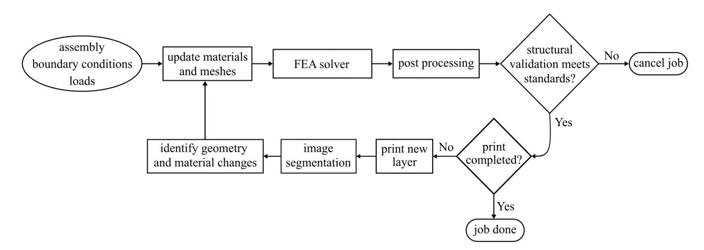

{3}------------------------------------------------

**Fig. 2.** The experimental platform and designed specimen: (a) experimental platform for product structural quality validation; (b) the designed specimen dimension; and (c) a good quality layer of the specimen and two layers with various defects on different positions.

### *3.1. Specimen preparation and fabrication*

A Creality Ender 5 3D printer with Polylactic Acid (PLA) filament, as shown in Fig. 2(a), was utilized in this case study. The unique characteristic of this printer is that the relative position between the camera and the build plane of the specimen is fixed. This fixed distance provides consistent images with an identical scale across layers. An optical camera (JAICV-M4+ CL) with a resolution of  $1368 \times 1020$  was positioned above the extruder on the printer frame to capture printing images. The G-code for the designed specimen was modified prior to printing, and a LabVIEW code activated the camera to capture layer images after each completion.

The designed specimen follows the American Society for Testing Materials (ASTM) D5766 standard, aimed at generating data for fastener holes or simulating flaws in material components [31]. The hole allows for stress concentration and reduced net cross-section, while the test method calculates ultimate strength based on the gross cross-sectional area, disregarding the hole. Due to the printer's size constraints, all dimensions were scaled down to 0.56 of the original size. Scaling down the geometry may influence tensile test reliability, as stress concentration effects around the hole and stress distribution profiles can differ from full-sized samples, potentially affecting failure stress and strain values. However, the scaled design preserves the essential flaw and stress concentration features, allowing effective validation of the framework's ability, even with minor deviations from standard specimen behavior. The printing process used standard white Hatchbox 1.75 mm PLA filament. The layer thickness was set to 0.3 mm with a 0.8 mm nozzle, with an extrusion temperature of 210 °C, a bed temperature of 70 °C, and a printing speed of 45 mm/s. The specimen's dimensions are illustrated in Fig. 2(b), showing 100% infill density across ten layers. The top and bottom layers were printed vertically, while the middle layers were printed horizontally, as shown in Fig. 2(c). Defects were introduced by modifying the G-code to temporarily stop extrusion at specific positions during certain layers, allowing for controlled void formation to assess the impact on structural integrity. The artificially introduced defects, such as seeded voids, mimic common real-world defects in FFF, including material inconsistencies, extrusion interruptions, and flow fluctuations. This approach allows for systematic analysis of their impact on structural integrity, ensuring the proposed procedure is relevant and applicable to real manufacturing scenarios with complex geometries. Note that even with 100% infill during slicing, the FFF process inherently creates small voids between the struts in the horizontal direction, contributing to a baseline level of porosity. This inherent porosity is accounted for in the mechanical property analysis, as discussed in Section 3.3. Fig. 2(c) shows both inherent and seeded defects on the printed specimen.

### *3.2. Failure mechanism validation*

Tensile tests were conducted on collected specimens to obtain material properties for simulation. Ten good-quality samples and ten with impactful defects were tested to determine the average tensile force. The impactful defects were 5 mm seeded faults placed in the same position around the hole on three consecutive layers, as shown in Fig. 2(c). Mechanical validation was performed using an MTS Exceed E43 electromechanical load frame with a 50 kN capacity (Fig. 3(a)). Each specimen was mounted vertically, gripped at 15 mm at each end, and loaded at 9 mm/s, leading to fracture in approximately 3 s. Data on force, displacement, and time were collected at 10 Hz to compute stress and strain.

Fig. 3(b) displays the averaged tensile forces of specimens with and without defects. As summarized in Table 1, the average maximum force and displacement for defect-free samples were 2083 N and 2.74 mm, while defective samples averaged 1684 N and 2.17 mm. Correspondingly, the average strain before fracture was 19,600 and 15,528  $\mu\epsilon$ , and the maximum stress was 49.59 and 40.10 MPa, respectively. These results demonstrate that impactful defects significantly reduce structural quality, resulting in lower stress tolerance. The tensile test results for all 20 samples are provided in Table 6 within Appendix A.

Digital image correlation (DIC) is used to validate tensile test values, as shown in Fig. 3(a). The experiment is conducted on the same machine with identical configurations as previously described. Ten specimens, both with and without impactful samples, are speckled following the standard process described by Correlated Solutions [32], as depicted in Fig. 4(b). Speckled samples are allowed to dry completely before mounting on the machine. The camera captures four images per second, sufficient for analysis. To ensure consistency, the DIC analysis was conducted on multiple samples, and it was observed that all samples, despite variations in the speckle pattern, produced similar DIC results. For this analysis, a subset size of 45 pixels and a step size of 7 pixels were selected, yielding a spatial resolution that effectively captures the primary deformation characteristics within the field of view. These subset and step sizes were chosen to minimize noise in the strain data while preserving critical information on strain distribution across the samples. No additional smoothing was applied during strain computation. For brevity, only two results are reported here; a sample without impactful defects in Fig. 5 and a sample with impactful defects in Fig. 6.

Fig. 5(a)–(j) presents a series of contour maps illustrating the strain distribution in the sample without impactful defects under progressive tensile loading, starting from one second of loading (Fig. 5(a)) to just before fracture (Fig. 5(j)). In Fig. 5(b), the specimen is uniformly

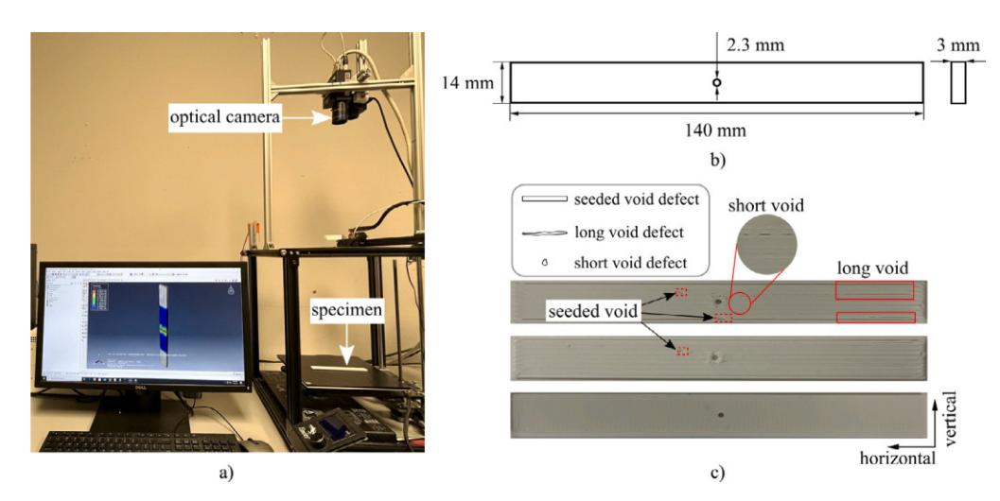

{4}------------------------------------------------

**Fig. 3.** Printed specimen tensile test: (a) setup; (b) the specimen tensile force results.

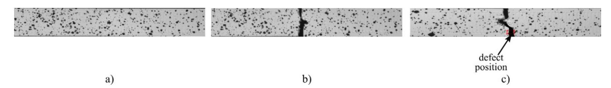

**Fig. 4.** Digital image correlation specimens: (a) a sample speckle specimen; (b) fractured sample without impactful defect; and (c) fractured sample with an impactful defect.

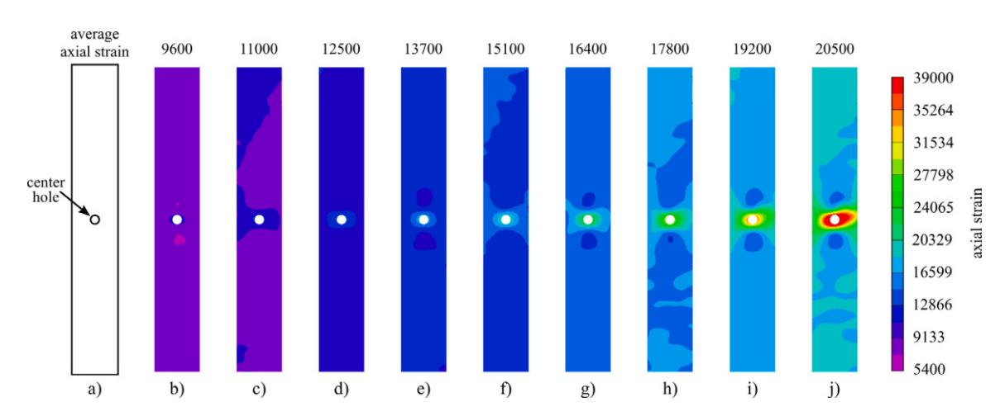

**Fig. 5.** Strain distribution progression in a sample without impactful defects, subjected to tensile loading from the initial state before loading to after fracture with average axial strain. (For interpretation of the references to color in this figure legend, the reader is referred to the web version of this article.)

colored, indicating no or minimal strain. Non-uniformity becomes apparent in Fig. 5(d), with localized regions experiencing higher strain, signifying the onset of material deformation. A clear hotspot of strain is visible in Fig. 5(f), indicating a significant deformation concentration around the center hole. Fig. 5(h) represents the pre-fracture state, with highly localized strain around the center hole, leading to failure. In Fig. 5(i), the strain is at its maximum concentration, suggesting material yielding around a critical center hole just before fracture, with an average strain of  $20\,500 \mu\text{e}$ . The fractured sample without impactful defects is shown in Fig. 4(c).

[Fig.](#page-5-2) [6](#page-5-2)(a)-(j) depicts the progression of strain distribution in the impactful sample, featuring a center hole and an internal defect, under tensile loading. The sequence spans from the initial state [\(Fig.](#page-5-2) [6\(](#page-5-2)a)) to just before fracture ([Fig.](#page-5-2) [6](#page-5-2)(j)). Slight strain accumulation is visible around the hole and the defect in [Fig.](#page-5-2) [6](#page-5-2)(b), indicating stress concentration due to the geometric discontinuities. Stress concentration becomes more pronounced in [Fig.](#page-5-2) [6](#page-5-2)(d), suggesting these features influence the

failure mode. Fig. 6(h) shows a clear pattern of high strain around the hole and the defect, possibly indicating material damage or micro cracking. The highest strain is localized at the hole and the defect area as both act as stress concentrators, with the color gradient showing a sharp transition from high to low strain around these areas, indicative of a critical stress state just before the material fractures (Fig. 6(j)). The results indicate that the defect significantly influences the failure, with an average strain before failure of  $16\,000\ \mu\epsilon$ , much lower than observed in a sample without impactful defects. The fractured sample with impactful defects is displayed in Fig. 4(d), which shows the failure across the impactful defect position.

The tensile and DIC tests are summarized in [Table](#page-5-1) [1](#page-5-1). To derive stress distribution from DIC strain data, a linear elastic stress–strain relationship was applied. This approach enables accurate stress estimation from strain using Young's modulus, yielding reliable stress distribution maps, even with minor localized deviations around defects. Both the tensile and DIC tests confirm that impactful defects significantly affect product

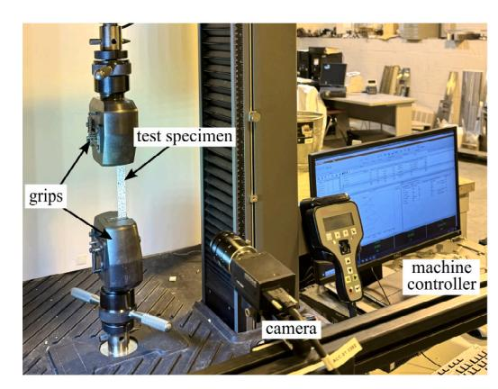

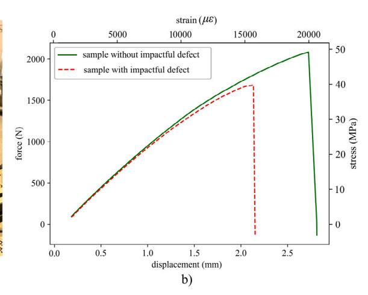

{5}------------------------------------------------

**Fig. 6.** Strain distribution progression in the sample with an internal defect, subjected to tensile loading from the initial state before loading to after fracture with average axial strain. (For interpretation of the references to color in this figure legend, the reader is referred to the web version of this article.)

**Table 1**  
Tensile and DIC test results with stress and strain difference.

|         | Specimen Without | impactful | Test defect | type Tensile test | Number samples 10 | of 19 | Averaged strain ( με 600 | Strain standard deviation ) 80.10 | Strain difference – | Averaged ( με ) stress 49.59 | Stress standard deviation (MPa) 0.24 | Stress difference (MPa) – |
|---------|------------------|-----------|-------------|-------------------|-------------------|-------|--------------------------|-----------------------------------|---------------------|------------------------------|--------------------------------------|---------------------------|
| Without | impactful        | defect    | DIC         | test              | 10                | 20    | 500                      | 86.32                             | 900                 | 50.61                        | 0.28                                 | 1.02                      |
| With    | impactful        | defect    | Tensile     | test              | 10                | 15    | 528                      | 91.45                             | –                   | 40.10                        | 0.37                                 | –                         |
| With    | impactful        | defect    | DIC         | test              | 10                | 16    | 600                      | 102.96                            | 1072                | 41.43                        | 0.43                                 | 1.33                      |

| <b>Table 2</b>                                        |                              |                       |                 |                         |                                       |
|-------------------------------------------------------|------------------------------|-----------------------|-----------------|-------------------------|---------------------------------------|
| Material property from tensile stress-strain for FEA. |                              |                       |                 |                         |                                       |
| Property                                              | Density (g/mm 3 ) | Young's modulus (MPa) | Poisson's ratio | Strain at UTS ( $\mu$ ) | Ultimate Tensile Strength (UTS) (MPa) |

| Value | 1.36 | 3000 | 0.36 | 19 600 | 49.59 |
|-------|------|------|------|--------|-------|
|-------|------|------|------|--------|-------|

properties, with average strains of 19,600 and 15,528  $\mu\text{e}$  for good-quality specimens and those with impactful defects, respectively, as measured in the tensile test. DIC results show material yielding around a critical center hole, with strains averaging 20,500  $\mu\text{e}$  for good-quality specimens and significantly lower at 16,600  $\mu\text{e}$  for specimens with harmful defects. The material properties in Table 2 were determined using a combination of experimental data and literature references. Young's modulus was calculated from tensile stress–strain data by applying a linear least-squares regression to the initial, linear portion of the curve, capturing the material's elastic response. Poisson's ratio was obtained from established PLA literature values, which are consistently reported as the same [33–35]. The density was measured by calculating the mass-to-volume ratio based on the specimen's dimensions and weight, ensuring alignment with typical PLA properties. Comparing strain values across tests validates the material properties derived from the tensile test (Table 2) for further simulation. In this study, defects are classified as impactful if they reduce maximum tensile stress by more than 8% (3.97 MPa) compared to defect-free samples [36,37]. This threshold aligns with ensuring product's damage tolerance principles [38,39]. This balanced approach ensures that only defects with a meaningful impact on performance are flagged, while minor defects are disregarded for efficiency.

To ensure the accuracy of the FEA model, a validation process was conducted using strain maps obtained from DIC, allowing for a detailed comparison with FEA results. Root Mean Square Error (RMSE) quantified the differences between FEA and DIC strain maps, focusing on the axial strain component, which corresponds to the primary loading direction in the tensile test to balance accuracy and model simplicity. This validation used experimental strain data from specimens both with and without defects, enabling a comprehensive calibration of the FEA model to capture structural responses accurately in the presence of defects.

Based on initial comparisons, adjustments were made to FEA model parameters, such as mesh density and material properties, until the FEA results closely matched the experimental strain maps. While this process confirmed the model's accuracy for the specific rectangular geometry used in this study, additional tuning may be required for different geometries, as structural responses can vary significantly depending on shape and defect placement. This iterative process validated the FEA model's reliability in predicting the PLA specimen's mechanical behavior, making it suitable for assessing structural integrity and failure modes under the tested conditions.

### *3.3. Defect segmentation with U-net*

The image segmentation algorithm used in this research is U-net [40], a well-studied and widely adopted model in image segmentation tasks [41]. The segmentation process is depicted in Fig. 7. The U-net architecture is composed of a contracting path and an expansive path. In the contracting path, two  $3 \times 3$  convolutions (unpadded) are repeatedly applied, each followed by a rectified linear unit (ReLU) and a  $2 \times 2$  max pooling operation with stride 2 for downsampling. At each downsampling step, the number of feature channels doubles. In the expansive path, the feature map is upsampled, followed by a  $2 \times 2$  “up-convolution” that halves the number of feature channels. The corresponding cropped feature map from the contracting path is then concatenated with two  $3 \times 3$  convolutions, each followed by a ReLU. Cropping is necessary to compensate for the loss of border pixels in each convolution. At the final layer, a  $1 \times 1$  convolution maps each 64-component feature vector to the desired number of classes. Overall, the U-net architecture has 23 convolutional layers, enabling robust defect detection, which informs the FEA model updating step. The U-net architecture employed follows a classic configuration, chosen for its balance

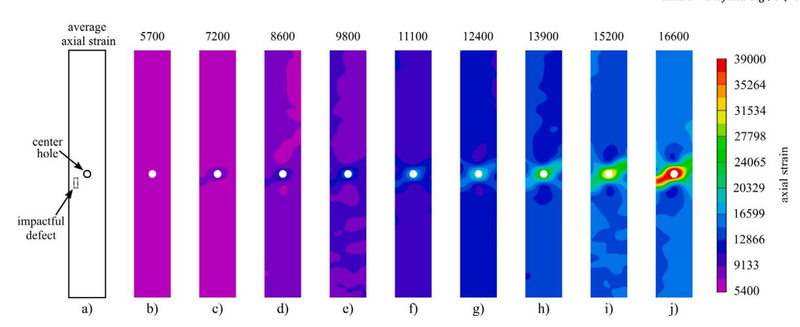

{6}------------------------------------------------

**Fig. 7.** The defect segmentation process with U-net.

between model complexity and performance. This setup ensures reliable segmentation, crucial for accurate defect detection in real-time applications. Variations in settings, such as kernel size or number of layers, could affect the performance; larger kernels or deeper networks might capture more complex features but increase computational demands, while simpler configurations might compromise accuracy. This classic configuration strikes an effective balance, offering robust defect detection with manageable computational requirements.

To increase the size of the training dataset, data augmentation (i.e., flip, random rotation, Gaussian blur, and Gaussian noise) is implemented. After data augmentation, the final dataset contains 1000 images, covering four types: seeded voids (3–8 mm), long voids (large than 10 mm), short voids (less than 2 mm), and good quality layers. For the labeled specimen images and masks, 80% of them are randomly chosen as training data, and the remaining 20% are used as test data. The raw image dimension of the specimen is  $1368 \times 1020$  pixels. To accelerate the training speed, the image resolution is reduced by resizing to  $512 \times 512$  pixels before input into the model. Training is done over 100 epochs.

The ground truth for defect segmentation was determined by manually labeling five categories: background, sample, seeded void, long void, and short void. Given the challenge of consistently identifying subtle defects like short voids and long voids, multiple team members independently labeled the data, resolving discrepancies through consensus to reduce subjectivity.

The U-net-based defect segmentation process updates the FEA model layer-by-layer in two distinct ways: (1) larger defects, referring to seeded, regular-shaped voids (e.g., rectangular defects), are incorporated as geometric model changes, and (2) smaller defects, representing inherent, irregular-shaped voids (e.g., long and short voids formed during the printing process), are handled through adjustments to the layer's Young's modulus. Note that while long voids may appear extensive in length, they are classified as ''smaller'' due to their irregular shape and distribution, which makes direct geometric updates in the FEA model computationally impractical. The center hole replicates a fastener hole or simulates a large material flaw in a component. Based on research by Choren et al. [[42\]](#page-14-0), the equation for Young's modulus of a porous body is:

$$E_p = E_0(1 - aP) \quad (1)$$

where  $E_p$  is Young’s modulus of the porous body,  $E_0$  is the modulus of a non-porous body of the same material,  $a$  is a constant dependent on Poisson’s ratio of the matrix material, and  $P$  is the volume porosity. To simplify the calculation and simulation process, the constant dependent  $a$  is equal to 1, which means Young’s modulus negatively correlates with the volume porosity. The equation for Young’s modulus of a porous body aims to enhance simulation accuracy by accounting for minor printing defects. However, it has limitations: (1) assumes a linear

relationship between Young's modulus ( $E_p$ ) and porosity ( $P$ ), which may not accurately capture the behavior of materials with high porosity or varying pore structures; (2) sets a constant  $a$  dependent on the Poisson's ratio of the matrix material, which may vary with different materials and porosity configurations, affecting the accuracy of the calculated Young's modulus; and (3) is valid only for moderate porosity levels and may not suit highly porous materials where structural integrity is significantly compromised. Note that these limitations impact the model's accuracy, particularly for materials with high porosity or varying pore structures, resulting in less reliable predictions under such conditions. Young's modulus for the upcoming layers is derived by calculating the modulus for each previously printed layer using Eq. (1), where  $P$  represents the porosity of each layer, and then averaging these values to ensure accurate mechanical property representation.

### *3.4. FEA model updating and structural validation*

In this work, the FEA is simulated using an explicit scheme in tension with a fixed loading displacement. One end of the specimen is constrained in all six degrees of freedom, while the other end is constrained in five degrees, with a displacement rate of 10 mm/s applied along the longitudinal axis. Material properties are assumed to be homogeneous and isotropic for each layer, balancing computational simplicity with accuracy. This isotropic model facilitates reduced computational complexity and is suitable for real-time applications, though it does not capture FFF's directional anisotropy due to printing direction [\[43](#page-14-1),[44\]](#page-14-2). Tensile test results confirmed minimal plastic deformation, indicating brittle behavior in PLA. The Python API within Abaqus is leveraged for FEA model updating [[45\]](#page-14-3).

The brittle material model follows ASTM D5766 standards for evaluating structural integrity under stress concentrations, using the maximum principal stress criterion to simulate failure by element removal upon reaching critical stress levels. This approach is particularly suited for capturing failure initiation and progression in brittle materials like PLA, where localized stress concentrations play a significant role [[46–](#page-14-4) [48\]](#page-14-5). The details are presented in [Appendix](#page-12-1) [B.](#page-12-1)

The simulation employed a global mesh size of 1 mm to maintain computational efficiency, with a 4-node linear tetrahedral (C3D4) element shape. Tetrahedral elements were selected for their stability and error-free meshing capabilities when introducing defects via the Abaqus Python script. Although alternatives like hexahedral elements offer faster convergence, they introduced instability in defected geometries, making tetrahedrons the most practical choice. While local mesh refinement could provide more detail around intricate defect geometries, it would considerably increase computation time, potentially compromising real-time validation goals. To ensure accurate structural quality assessment, the specimen's gauge region was treated as a separate set for extracting maximum principal stress values.

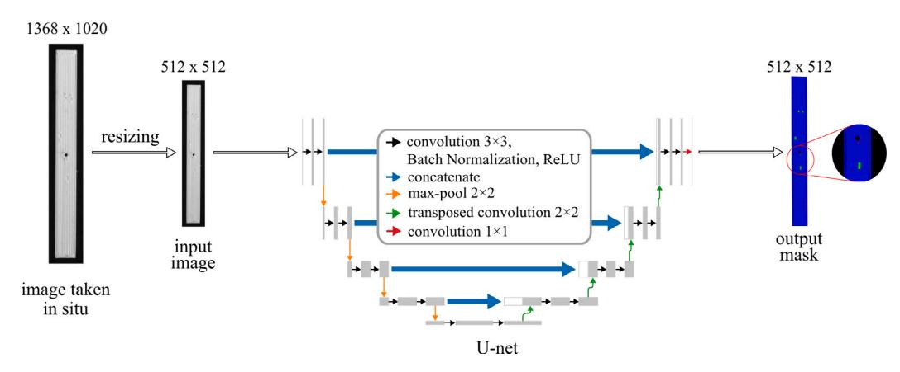

{7}------------------------------------------------

**Table 3** System configurations for the real-time computational time calculation.

| Hardware            | System 1           | System 2                     | System 3             | System 4 |
|---------------------|--------------------|------------------------------|----------------------|----------|
| Processor           | Intel core i7-3770 | AMD Ryzen Threadripper 3970X | Intel Xeon Gold 6250 | N/A      |
| Number of processor | 1                  | 1                            | 2                    | 2        |
| Total core count    | 4 cores, 8 threads | 32 cores, 64 threads         | 16 cores, 32 threads | N/A      |
| Base clock speed    | 3.4 GHz            | 3.7 GHz                      | 3.9 GHz              | N/A      |
| RAM                 | 8 GB               | 128 GB                       | 96 GB                | N/A      |
| Operating system    | Windows 10, 64 Bit | Windows 10, 64 Bit           | Windows 10, 64 Bit   | N/A      |

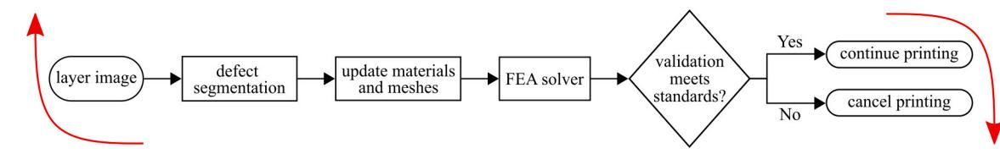

**Fig. 8.** The diagram of the computational time calculation for real-time automatic product structural quality validation.

#### *3.5. Real-time computation and decision-making*

[Fig.](#page-7-0) [8](#page-7-0) illustrates the computational cycle as a diagram for realtime product structural quality validation. Real-time refers to computing or other operations within a specified time range, typically very short. Real-time FEA solvers need to be completed within defined time steps [[49\]](#page-14-6). This investigation focuses on total cycle time, encompassing defect segmentation, model update, FEA simulation, and decision-making. Three personal desktops with varying system configurations are utilized to measure structural validation computational time, the desktop hardware specifications are detailed in [Table](#page-7-1) [3.](#page-7-1)

#### *3.6. Case study result*

[Fig.](#page-8-0) [9](#page-8-0) illustrates the online product structural quality validation and decision-making process in a real case study: a specimen with a 3 mm seeded defect on layer two, 3 mm and 5 mm seeded defects on layer four, and short and long voids on each layer. The sizes and positions of these defects were chosen to simulate realistic failure scenarios, with defect sizes reflecting dimensions that could impact structural integrity and positions selected in high-stress areas, such as near load-bearing paths [[17,](#page-13-16)[36\]](#page-13-34). FEA structural validation is skipped for the initial layers without defects. Upon the appearance of a 3 mm seeded defect on layer two, the image segmentation model updates the defect sketch and Young's modulus in the FEA model, triggering the FEA simulation. However, as the maximum principal stress does not exceed the threshold, indicating negligible impact, printing continues to layer three, which contains only short and long voids. On layer four, with two seeded defects (3 mm and 5 mm) and voids, all defect information from previous layers accumulates to update the FEA model. The resulting maximum principal stress surpasses the stress threshold, indicating that accumulated defects compromise structural integrity, leading to automatic print cancellation.

### *3.6.1. Defect segmentation results*

The accuracy of data-driven defect segmentation using U-net is crucial, as it determines the success of subsequent steps like structural quality validation and decision-making. To evaluate the image segmentation accuracy, Intersection-Over-Union (IoU) is utilized as the evaluation metric [\[50](#page-14-7)]. The IoU is calculated by dividing the area of overlap between the predicted segmentation and the ground truth by the area of union between the predicted segmentation and the ground truth. The metric ranges from 0%–100%, with 0% indicating no overlap and 100% meaning perfectly overlapping segmentation. The ultimate IoU for training data achieves 95.32%. The algorithm also performs well on test data, with a 92.79% IoU accuracy, reflecting strong performance. However, this accuracy is influenced by the challenges

**Table 4** Variation in void/gap volume and Young's modulus for layers.

| Layer            |  | Void volume (%) | Young’s modulus (% of solid material) |
|------------------|--|-----------------|---------------------------------------|
| 2                |  | 1.35            | 98.65                                 |
| 3                |  | 1.16            | 98.84                                 |
| 4                |  | 1.42            | 98.58                                 |
| Following layers |  | 1.31            | 98.69                                 |

of manual ground truth labeling, particularly for small porosity and long voids, where some defects may have been missed. Improving the labeling process and enhancing the model with advanced techniques could further boost accuracy. Despite this, the current rate effectively supports real-time structural validation and decision-making in additive manufacturing. The segmentation results for good layer and layer with defects are shown in [Fig.](#page-8-1) [10](#page-8-1).

#### *3.6.2. FEA model updating and structural validation results*

In [Fig.](#page-8-2) [11](#page-8-2), defects and their polygonal representations are shown, derived from the defect segmentation results. The defect polygons are sketched by connecting key points sequentially. [Fig.](#page-8-2) [11](#page-8-2)(a) and (b) display the updated defect outlines on layers two and four, with sketches illustrating defect localization. Void percentages and corresponding Young's modulus adjustments for layers two, three, and four are summarized in [Table](#page-7-2) [4.](#page-7-2) Based on Young's modulus adjustments from the porous body description [[51\]](#page-14-8), these values are calculated to reflect defect influence accurately. Given the minimal defect presence in the bottom layers, no modulus adjustment is necessary, ensuring stable structural support for subsequent layers.

[Fig.](#page-9-0) [12](#page-9-0) displays the FEA simulation result for the specimens with and without defects. From [Fig.](#page-9-0) [12](#page-9-0)(a), the maximum principal stress for the specimen without impactful defects after fracture is 47.15 MPa. As shown in [Fig.](#page-9-0) [12](#page-9-0)(b), the specimen with the seeded defect in an ignorable position (the defect in [Fig.](#page-8-2) [11\(](#page-8-2)a)), the maximum principal stress is 47.09 MPa. The specimen with a seeded defect near the fastener hole has a 45.22 MPa maximum principal stress (accumulates all the defects in [Fig.](#page-8-2) [11](#page-8-2)(a) and (b)), which is shown in [Fig.](#page-9-0) [12](#page-9-0)(c). The tensile test stress for the good-quality specimen, the specimen with a 3 mm defect on layer two, and the specimen with a 3 mm defect on layer two and 3 mm, 5 mm defects on layer four are 49.59, 49.32, and 46.79 MPa.

[Table](#page-9-1) [5](#page-9-1) reports the tensile test and FEA simulation results for the three validation cases, verifying the proposed algorithm's effectiveness for automatic real-time product structural quality validation and decision-making. The results indicate that for the three different test cases, each with varying levels of defects, the model predicted the failure strength of the specimen within 5%. Despite minor gaps

{8}------------------------------------------------

**Fig. 9.** The process of real-time automatic FEA structural quality validation on the fourth layer.

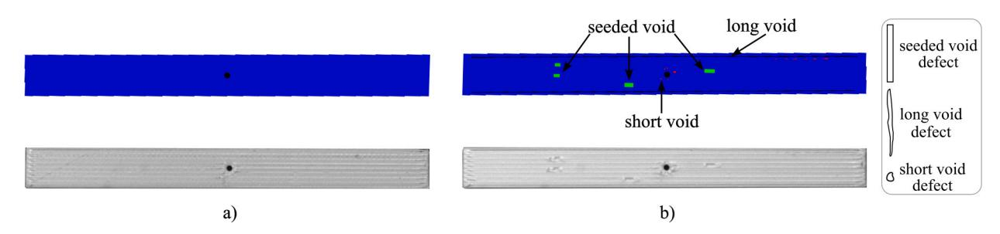

**Fig. 10.** The randomly selected U-net segmentation results: (a) the segmentation result for a good layer and (b) the segmentation result for the layer with defects.

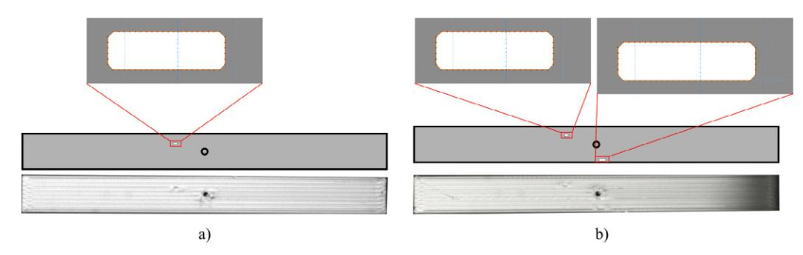

**Fig. 11.** The defect updating results on specific layers: (a) a 3 mm seeded defect with a sketch on layer two and (b) the seeded 3 and 5 mm defects sketch updating result on layer four.

between the real experiment and the simulation results, the overall results remain consistent across different levels of damage. However, in the third case, a discrepancy arises where the actual tensile test stress exceeded the threshold, while the FEA simulation predicted a lower stress, triggering the system's print cancellation. This discrepancy highlights the limitations of the FEA in capturing all real-world factors and reflects the conservative cancellation threshold of 45.62 MPa, designed to ensure safety. [Fig.](#page-9-2) [13](#page-9-2) displays a screenshot of the warning/print cancellation window during the real-time FEA validation and decision-making process.

### *3.6.3. Real-time computation and decision-making results*

The computational time for each step in real-time structural validation, tested with system 2 from [Table](#page-7-1) [3](#page-7-1), is shown in [Fig.](#page-10-0) [14](#page-10-0). A

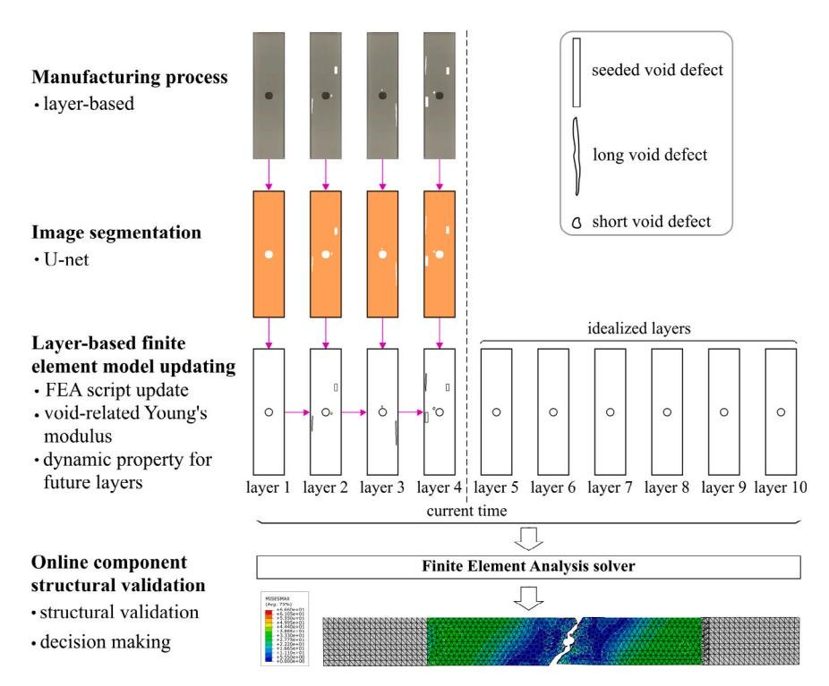

{9}------------------------------------------------

**Fig. 12.** The FEA simulation result: (a) without defects, (b) with a 3 mm defect on layer two, and (c) with a 3 mm defect on layer two along with 3 and 5 mm defects on layer four.

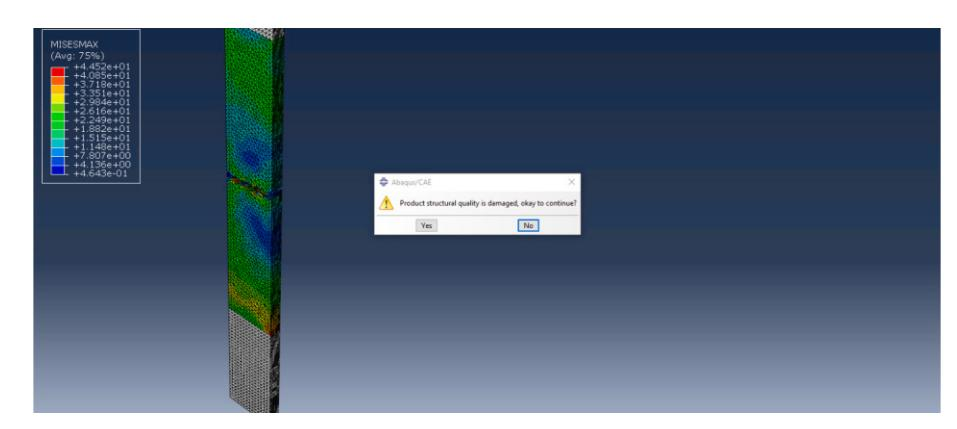

**Fig. 13.** Print cancellation alert initiated by real-time structural quality validation framework.

**Table 5** Tensile test and FEA simulation results for the tested specimens.

|                                    | No detectable defects | With inspectable defect (3 mm) | With ignorable (3 mm) and impactful defect (5 mm) |
|------------------------------------|-----------------------|--------------------------------|---------------------------------------------------|
| Tensile test stress (MPa)          | 49.59                 | 49.32                          | 46.79                                             |
| FEA maximum principal stress (MPa) | 47.15                 | 47.09                          | 45.22                                             |
| Stress difference (MPa)            | 2.44                  | 2.23                           | 1.57                                              |
| Percent difference                 | 4.92%                 | 4.52%                          | 3.36%                                             |

layer with two defects (258 defect pixels) was selected for analysis, as depicted in [Fig.](#page-8-2) [11](#page-8-2)(b). The results in [Fig.](#page-10-0) [14\(](#page-10-0)a) show that model updating for 3 mm and 5 mm defects takes 7.4 s, with FEA structural validation consuming the most time at 129 s. Decision-making, which involves traversing all frames to determine the maximum principal stress, takes 4.4 s. The total computation time is 141.2 s. Fifteen samples with varying defect sizes and numbers were examined, as shown in [Fig.](#page-10-0) [14\(](#page-10-0)b). The computational time for image segmentation remains constant at 0.4 s, while the time required for FEA model updates and structural validation depends on defect characteristics. Notably, computational time increases with both the size and number of defects, as larger and more numerous defects demand more time for defect sketch updates and FEA simulations.

Fifteen samples with varying defect sizes and numbers were examined, as shown in [Fig.](#page-10-0) [14\(](#page-10-0)b). The computational time for image segmentation remains constant at 0.4 s, while the time required for FEA model updates and structural validation depends on defect characteristics. Notably, computational time increases with both the size and number of defects, as larger and more numerous defects demand more time for defect sketch updates and FEA simulations. A deeper analysis indicates that cases with fewer large defects (e.g., a single defect with 591 pixels) can exhibit similar computational times to cases with multiple smaller defects (e.g., five defects totaling 387 pixels). This observation suggests that both the cumulative defect area and the number of individual defect zones independently contribute to computational demand. Thus, while each defect increases processing load, the complexity and spread of defect areas also play a critical role in determining computational efficiency.

[Fig.](#page-10-1) [15](#page-10-1) reports achievable and unachievable real-time combinations of FEA models considering the number of defects in the model as well as the total defect area measured in pixels. The performance space is plotted individually for the three computer systems reported in [Table](#page-7-1) [3](#page-7-1). This figure explores a computer system configuration's impact on computational time. As one layer printing time requires 140 s, realtime structural validation is unachievable if the defect's computational time exceeds this constraint. Therefore, the threshold for achievable

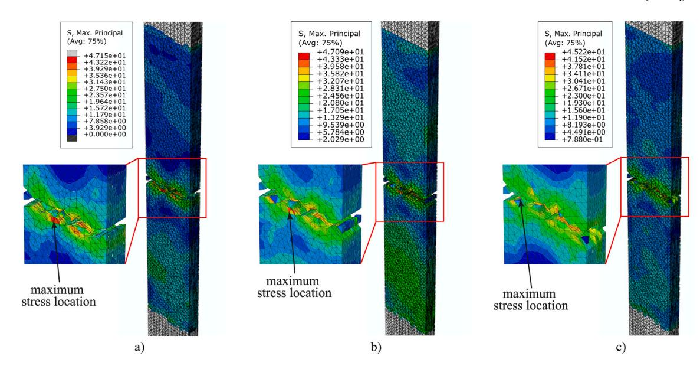

{10}------------------------------------------------

**Fig. 14.** The computational time for each step in real-time product structural quality validation: (a) the computational time for each step and (b) the computational time for FEA validation with various defect sizes.

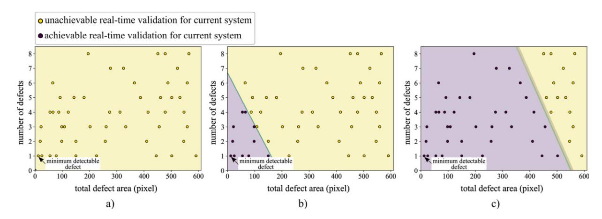

**Fig. 15.** The decision boundary of the achievable and unachievable real-time structural validation defect for different computer system configurations in [Table](#page-7-1) [3](#page-7-1): (a) the decision boundary for computer system 1, (b) the decision boundary for computer system 2, and (c) the decision boundary for computer system 3.

and unachievable defects is set at 140 s for this study. Logistic regression was used to plot the decision boundaries for achievable and unachievable defects to ensure the proposed algorithm meets real-time product structural quality validation timing constraints, as shown in [Fig.](#page-10-1) [15](#page-10-1). In [Fig.](#page-10-1) [15](#page-10-1)(a), all defects surpass the real-time limitation, with the minimum defect computational time being 459 s. From [Fig.](#page-10-1) [15](#page-10-1)(b) and (c), it is evident that a more powerful computer can accelerate the entire process. It is noteworthy that the minimal detectable defect size is 12 pixels (0.37 mm); defects smaller than that are undetectable or generally considered insignificant.

#### **4. Conclusions**

This paper presents a novel finite element analysis (FEA) simulationin-the-loop framework for real-time structural validation of additively manufactured components. Defect data is extracted via a U-net image segmentation algorithm and integrated into a pre-generated model, enabling geometry and material adjustments to reflect actual printing defects. The FEA model operates in parallel with the layer-by-layer printing process, performing continuous structural assessments by comparing the maximum principal stress against a threshold to validate product quality. In a verification case study, an integrated optical camera captured in situ images for U-net training, allowing automatic quality validation upon detecting defect layers. Based on these results, the system determines whether to proceed with or terminate the manufacturing process.

Results indicate that the U-net model achieves high Intersection-Over-Union (IoU) accuracy on both training and validation datasets, with defect segmentation accuracies of 95.32% and 92.79%, respectively. Validation cases further confirmed the model's reliability, with the FEA predictions of failure strength aligning within 5% of experimental results across three different defect levels. This method represents a significant advancement in real-time defect detection and structural validation, iteratively ensuring product integrity throughout the printing process.

Our in-process FEA approach represents a pioneering step towards ''Smart Manufacturing'' in additive processes, moving beyond static, post-production analyses to a responsive, adaptive system. This transition is essential for advancing additive manufacturing to meet the demands of precision-engineered, load-bearing components, reinforcing the capability of additive manufacturing to reliably produce highperformance parts in critical applications.

### **5. Limitations and future work**

This section discusses the limitation of the proposed simulation-inthe-loop additive manufacturing real-time structural validation framework and proposes future work in detail.

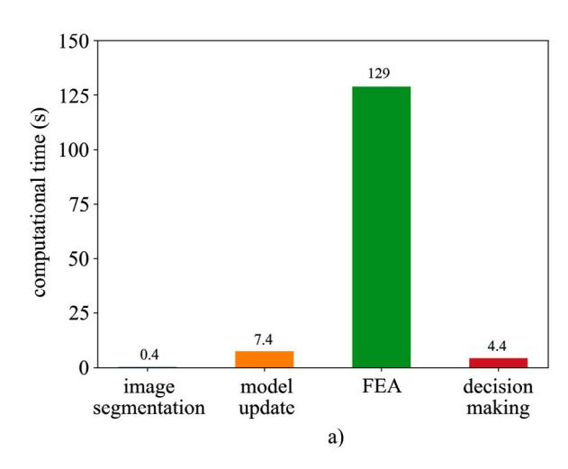

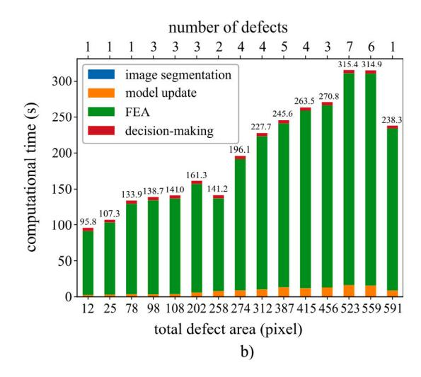

{11}------------------------------------------------

### *5.1. Limitations*

- Computational Efficiency vs. Accuracy

A primary limitation of this study is the challenge of balancing computational efficiency with the accuracy required in FEA simulations, which are sensitive to defect conditions, mesh size, boundary conditions, and material properties. While finer meshes improve accuracy, they significantly increase computational demand, making real-time validation challenging for complex geometries or large areas. This trade-off is especially critical for larger-scale industrial applications where both accuracy and realtime feasibility are essential.

## • **Defect Segmentation Accuracy**

The U-net-based segmentation model effectively detects a range of defect types but may struggle with very small or subtle defects requiring highly accurate, manually labeled ground truth. Furthermore, the current approach is limited to surface-level defects and overlooks subsurface or internal defects within layers, which can impact FEA predictions. Complementary detection technologies, such as thermal [\[52](#page-14-9)] or acoustic monitoring [[53](#page-14-10),[54\]](#page-14-11), could help address these limitations and ensure comprehensive validation.

- • **Limited Scope and Scalability Challenges**The research is constrained to a single case study with one specific process, material, and geometry, limiting its generalizability to other AM technologies, materials, and processes. Additionally, the time required for real-time defect detection and FEA updates can vary significantly with geometry complexity, process type, and printing conditions. For instance, thermal-induced defects in Selective Laser Melting (SLM) may require incorporating thermal properties into the FEA model [55], while intricate geometries or high-speed processes like Electron Beam Melting (EBM) demand quicker detection and updates, affecting scalability across diverse setups. Addressing these challenges is critical for broadening the framework’s applicability and feasibility.

## • **Lack of Adaptive Control**

While the system detects defects in real-time, it lacks mechanisms to dynamically adjust printing parameters in response to detected defects [[56\]](#page-14-13). This limits its ability to proactively address quality issues during printing, which is particularly critical where real-time responses could prevent defect propagation.

### *5.2. Future work*

- Improving Computational Efficiency and Accuracy

Future work will focus on achieving an optimal feature-to-mesh size ratio around defects to enhance stress distribution accuracy without excessive computational costs. Additionally, comparing DIC analysis with the predicted FEA strains would be helpful in assessing prediction accuracy and identifying potential errors. Adaptive meshing techniques, which dynamically adjust mesh density based on defect complexity, offer a promising solution for improving real-time feasibility [\[57](#page-14-14),[58\]](#page-14-15), particularly for large layer areas and intricate geometries.

## • **Enhancing Defect Detection**

Advancements in image segmentation models will aim to improve the detection of subtle or small defects. Complementary technologies such as thermal and acoustic monitoring could provide a more comprehensive view of structural integrity, addressing the current limitation of detecting only surface defects. Additionally, numerical quantification methods based on optical analysis may enable simpler defect evaluations using metrics like pixel-based measurements.

## • **Expanding Case Studies**

Testing the framework across a broader range of geometries, materials, and AM technologies—including Selective Laser Sintering (SLS), SLM, and EBM will validate its applicability [\[59](#page-14-16)]. Material- and process-specific adaptations, such as integrating thermal properties for SLM applications, will also be explored. Enhancements to maintain real-time feasibility in high-speed processes like SLM and EBM will be prioritized.

## • **Integrating Adaptive Control Mechanisms**

Incorporating dynamic adjustments to printing parameters (e.g., temperature, speed, or material flow) in response to detected defects could prevent defect propagation and enhance overall part quality. This integration aligns with Smart Manufacturing initiatives, optimizing efficiency and product reliability.

## • **Exploring PINNs for Real-Time Validation**

Physics-Informed Neural Networks (PINNs) will be investigated as an alternative to traditional FEA for real-time validation [[60,](#page-14-17)[61](#page-14-18)]. By integrating physical laws directly into the network, PINNs can rapidly predict structural performance based on sensor inputs and defect characteristics, bypassing the computational challenges of conventional methods.

## • **Standardizing Framework Implementation**

Future efforts will focus on developing standardized guidelines for implementing real-time structural validation across different AM platforms. This includes predefined validation criteria, calibration protocols, and an intuitive user interface to monitor defects, stress analysis, and validation outcomes. These tools will empower operators to make informed decisions on quality without disrupting production workflows.

### **CRediT authorship contribution statement**

**Yanzhou Fu:** Writing – review & editing, Writing – original draft, Visualization, Validation, Methodology, Investigation, Conceptualization. **Austin R.J. Downey:** Writing – review & editing, Methodology, Funding acquisition. **Lang Yuan:** Writing – review & editing, Methodology, Funding acquisition. **Hung-Tien Huang:** Software. **Emmanuel A. Ogunniyi:** Visualization, Validation.

### **Declaration of competing interest**

The authors declare the following financial interests/personal relationships which may be considered as potential competing interests: Austin Downey reports a relationship with University of South Carolina that includes:. If there are other authors, they declare that they have no known competing financial interests or personal relationships that could have appeared to influence the work reported in this paper.

### **Acknowledgments**

This material is based upon work supported by the South Carolina Space Grant Consortium, United States under grants 521179-RP-SC007 and 21-117-RID RGP-SC-009. This work is also partially supported by the National Institute of Standards & Technology, United States under grand number 70NANB23H030; the National Science Foundation of the United States through grant CPS-2237696; and the Air Force Office of Scientific Research (AFOSR), United States through award no. FA9550- 21-1-0083. The support of these agencies is gratefully acknowledged. Any opinions, findings, conclusions, or recommendations expressed in this material are those of the authors and do not necessarily reflect the views of the South Carolina Space Grant Consortium, the National Institute of Standards & Technology, the National Science Foundation, or the United States Air Force.

### **Appendix A. Tensile test results**

{12}------------------------------------------------

**Table 6**  
Tensile test results for good and impactful defect samples.

| Sample                         | Sample | Max strain (MPa) | Max stress | Displacement (mm) | Force (N) |
|--------------------------------|--------|------------------|------------|-------------------|-----------|
| Good quality 1                 | 19     | 579.98           | 49.35      | 2.74              | 2072.70   |
| 2                              | 19     | 563.42           | 49.35      | 2.74              | 2072.70   |
| 3                              | 19     | 637.26           | 49.61      | 2.75              | 2084.62   |
| 4                              | 19     | 691.51           | 49.99      | 2.76              | 2099.84   |
| 5                              | 19     | 637.57           | 49.66      | 2.75              | 2085.72   |
| 6                              | 19     | 666.37           | 49.97      | 2.75              | 2098.74   |
| 7                              | 19     | 618.10           | 49.44      | 2.75              | 2076.48   |
| 8                              | 19     | 619.08           | 49.44      | 2.75              | 2076.48   |
| 9                              | 19     | 585.64           | 49.70      | 2.74              | 2087.40   |
| 10                             | 19     | 401.17           | 49.39      | 2.72              | 2074.38   |
| Average (Good)                 | 19     | 600.01           | 49.59      | 2.745             | 2082.91   |
| Standard deviation (Good)      | 80.10  |                  | 0.24       | 0.011             | 10.18     |
| With impactful defect 1        | 15     | 335.05           | 39.90      | 2.15              | 1675.80   |
| 2                              | 15     | 533.14           | 40.15      | 2.18              | 1686.30   |
| 3                              | 15     | 569.09           | 39.83      | 2.18              | 1672.86   |
| 4                              | 15     | 515.32           | 40.23      | 2.17              | 1689.66   |
| 5                              | 15     | 510.64           | 40.67      | 2.17              | 1708.14   |
| 6                              | 15     | 476.55           | 39.78      | 2.17              | 1670.76   |
| 7                              | 15     | 641.32           | 39.78      | 2.19              | 1670.76   |
| 8                              | 15     | 623.16           | 40.70      | 2.19              | 1709.40   |
| 9                              | 15     | 463.30           | 40.29      | 2.16              | 1692.18   |
| 10                             | 15     | 612.34           | 39.67      | 2.19              | 1666.14   |
| Average (Impactful)            | 15     | 527.99           | 40.10      | 2.175             | 1684.20   |
| Standard deviation (Impactful) | 91.44  |                  | 0.37       | 0.014             | 15.61     |

recorded for each sample in both the good-quality and impactful defect groups. For good-quality samples, the average strain and stress values align closely with theoretical expectations, supporting the validity of the specimen preparation and testing process. In contrast, samples with impactful defects show consistently lower strain and stress values, indicating the significant influence of defects on the material's mechanical properties. These findings underscore the importance of defect detection and the impact of structural flaws on tensile performance.

### **Appendix B. Constitutive model for material failure in PLA**

In this study, we employ a constitutive model to capture the fracture behavior of PLA (Polylactic Acid) material in finite element analysis (FEA) [62–64]. The PLA specimens exhibit minimal plastic deformation and fail abruptly [65,66], as evidenced by tensile test results in Fig. 3(b). The constitutive model is designed to simulate the on-set of fracture once the material reaches its ultimate tensile strength (UTS), with limited post-peak ductility. This model employs a damage initiation criterion based on a critical strain threshold and follows a displacement-based damage evolution law, as detailed below.

To achieve this in Abaqus, we adapted the ductile damage model to simulate the characteristics of PLA failure. While typically applied to ductile materials, this model was adjusted with low fracture strain values and immediate element deletion upon reaching critical strain to capture the abrupt failure behavior observed in PLA.

### *B.1. Material properties*

The specific material properties used in the simulation are as follows: the density of PLA is 1.36 g/mm3, with a Young's modulus of 3000 MPa, Poisson's ratio of 0.36, strain at UTS of 19 600 µε, and UTS of 49.59 MPa.

### *B.2. Damage initiation*

The onset of damage is defined by a critical strain threshold, calculated as follows:

$$\epsilon_f = \frac{\sigma_{\text{ul}}}{E} \quad (2)$$

- $\epsilon_f$  is the fracture strain, representing the threshold strain at which damage begins.
- $\sigma_u$  is the ultimate tensile strength, which is 49.59 MPa for PLA.
- $\sigma_h^0$  is the ultimate tensile strength, which is 49.59 MPa for  $E$ 
   $E$  is Young's modulus of the material, which is 3000 MPa.

Substituting the values, we obtain the fracture strain:

$$\epsilon_f = \frac{49.59 \text{ MPa}}{3000 \text{ MPa}} = 0.01653 \quad (16530 \mu\epsilon)$$

This calculated fracture strain is close to the experimentally observed strain at UTS,  $19600 \mu\epsilon$ , confirming that the PLA material behaves with limited ductility, consistent with quasi-brittle failure under tensile loading [67].

### *B.3. Damage evolution*

Following damage initiation, the material undergoes progressive degradation until complete failure, modeled with a displacement-based damage evolution law [68,69]. The damage variable  $D$  is defined as:

$$D = 1 - \frac{\sigma_r}{\sigma_u} \quad (3)$$

where:

- $\sigma_r$  is the residual stress after damage evolution.
- $\sigma_r$  is the residual stress after damage evolution
   $\sigma_u$  is the ultimate tensile strength, 49.59 MPa.

In this model, the damage variable  $D$  increases as displacement progresses beyond the initiation point, with  $D$  approaching 1 rapidly, which indicates a near-instantaneous loss of stiffness. Using displacement-based evolution allows the model to capture the abrupt failure behavior as soon as critical displacement is reached.

### *B.4. Displacement at failure*

The displacement at failure,  $u_f$ , is estimated based on tensile test data, where the displacement at peak load was approximately observed. For this analysis,  $u_f$  is closely estimated to be 2.63 mm.

## *B.5. Element deletion for material failure*

In Abaqus, element deletion is employed once the displacement at failure  $u_t$  is reached. This approach allows for the simulation of sudden loss of material elements from the analysis, representing the abrupt breakdown of PLA's structural integrity under loading.

{13}------------------------------------------------

### *B.6. Summary*

This constitutive model, implemented in Abaqus/Explicit, provides a computationally efficient approach for simulating the failure behavior of PLA under tensile loading, demonstrating its validity. By employing a displacement-based damage evolution law, the model captures the abrupt failure characteristics of PLA and offers a viable framework for addressing limited ductility cases typical of brittle or quasi-brittle materials. This approach establishes a foundation for the development of more comprehensive and realistic models in the future.

### **Data availability**

Data and example code for this work are provided through a public repository.

#### **References**

- [1] J. Yang, [Soonhung](http://refhub.elsevier.com/S2214-8604(24)00677-8/sb1) Han, H. Kang, J. Kim, Product data quality assurance for [e-manufacturing](http://refhub.elsevier.com/S2214-8604(24)00677-8/sb1) in the automotive industry, Int. J. Comput. Integr. Manuf. 19
- (2) (2006) [136–147.](http://refhub.elsevier.com/S2214-8604(24)00677-8/sb1) [2] Zhiming Zhang, Chao Sun, Structural damage identification via [physics-guided](http://refhub.elsevier.com/S2214-8604(24)00677-8/sb2) machine learning: a [methodology](http://refhub.elsevier.com/S2214-8604(24)00677-8/sb2) integrating pattern recognition with finite element model updating, Struct. Health Monit. 20 (4) (2021) [1675–1688.](http://refhub.elsevier.com/S2214-8604(24)00677-8/sb2) [3] Xuzhao Lu, Chul-Woo Kim, Kai-Chun Chang, Finite element analysis [framework](http://refhub.elsevier.com/S2214-8604(24)00677-8/sb3) for dynamic [vehicle-bridge](http://refhub.elsevier.com/S2214-8604(24)00677-8/sb3) interaction system based on ABAQUS, Int. J. Struct. Stab. Dyn. 20 (03) (2020) [2050034.](http://refhub.elsevier.com/S2214-8604(24)00677-8/sb3) [4] Yongha Kim, Jungsun Park, A theory for the free vibration of a [laminated](http://refhub.elsevier.com/S2214-8604(24)00677-8/sb4) composite rectangular plate with holes in aerospace [applications,](http://refhub.elsevier.com/S2214-8604(24)00677-8/sb4) Compos. Struct. 251 (2020) [112571.](http://refhub.elsevier.com/S2214-8604(24)00677-8/sb4) [5] Davood Rahmatabadi, Kianoosh [Soltanmohammadi,](http://refhub.elsevier.com/S2214-8604(24)00677-8/sb5) Mohammad Aberoumand, Elyas Soleyman, Ismaeil Ghasemi, Majid [Baniassadi,](http://refhub.elsevier.com/S2214-8604(24)00677-8/sb5) Karen Abrinia, Mahdi Bodaghi, Mostafa Baghani, 4D printing of porous PLA-TPU [structures:](http://refhub.elsevier.com/S2214-8604(24)00677-8/sb5) effect of applied [deformation,](http://refhub.elsevier.com/S2214-8604(24)00677-8/sb5) loading mode and infill pattern on the shape memory [performance,](http://refhub.elsevier.com/S2214-8604(24)00677-8/sb5) Phys. Scr. 99 (2) (2024) 025013. [6] Byron [Blakey-Milner,](http://refhub.elsevier.com/S2214-8604(24)00677-8/sb6) Paul Gradl, Glen Snedden, Michael Brooks, Jean Pitot, Elena Lopez, Martin Leary, Filippo Berto, Anton Du Plessis, Metal [additive](http://refhub.elsevier.com/S2214-8604(24)00677-8/sb6) [manufacturing](http://refhub.elsevier.com/S2214-8604(24)00677-8/sb6) in aerospace: A review, Mater. Des. 209 (2021) 110008. [7] Rakesh Kumar, Manoj Kumar, [Jasgurpreet](http://refhub.elsevier.com/S2214-8604(24)00677-8/sb7) Singh Chohan, The role of additive [manufacturing](http://refhub.elsevier.com/S2214-8604(24)00677-8/sb7) for biomedical applications: A critical review, J. Manuf. Process. 64 (2021) [828–850.](http://refhub.elsevier.com/S2214-8604(24)00677-8/sb7) [8] Yanzhou Fu, Austin RJ [Downey,](http://refhub.elsevier.com/S2214-8604(24)00677-8/sb8) Lang Yuan, Tianyu Zhang, Avery Pratt, Yunusa Balogun, Machine learning algorithms for defect detection in metal [laser-based](http://refhub.elsevier.com/S2214-8604(24)00677-8/sb8) additive [manufacturing:](http://refhub.elsevier.com/S2214-8604(24)00677-8/sb8) A review, J. Manuf. Process. 75 (2022) 693–710. [9] Olatunji Oladimeji Ojo, Emel Taban, Post-processing [treatments–microstructure–](http://refhub.elsevier.com/S2214-8604(24)00677-8/sb9) performance [interrelationship](http://refhub.elsevier.com/S2214-8604(24)00677-8/sb9) of metal additive manufactured aerospace alloys: a review, Mater. Sci. [Technol.](http://refhub.elsevier.com/S2214-8604(24)00677-8/sb9) 39 (1) (2023) 1–41. [10] Yuhua Cai, Jun Xiong, Hui Chen, Guangjun Zhang, A review of in-situ [monitoring](http://refhub.elsevier.com/S2214-8604(24)00677-8/sb10) and process control system in metal-based laser additive [manufacturing,](http://refhub.elsevier.com/S2214-8604(24)00677-8/sb10) J. Manuf. Syst. 70 (2023) [309–326.](http://refhub.elsevier.com/S2214-8604(24)00677-8/sb10) [11] Qi Zhong, Xiaoyong Tian, [Xiaokang](http://refhub.elsevier.com/S2214-8604(24)00677-8/sb11) Huang, Cunbao Huo, Dichen Li, Using feedback control of thermal history to improve quality [consistency](http://refhub.elsevier.com/S2214-8604(24)00677-8/sb11) of parts fabricated via [large-scale](http://refhub.elsevier.com/S2214-8604(24)00677-8/sb11) powder bed fusion, Addit. Manuf. 42 (2021) 101986. [12] Rongxuan Wang, Benjamin [Standfield,](http://refhub.elsevier.com/S2214-8604(24)00677-8/sb12) Chaoran Dou, Andrew C Law, Zhenyu James Kong, Real-time process monitoring and [closed-loop](http://refhub.elsevier.com/S2214-8604(24)00677-8/sb12) control on laser power via a [customized](http://refhub.elsevier.com/S2214-8604(24)00677-8/sb12) laser powder bed fusion platform, Addit. Manuf. 66 (2023) [103449.](http://refhub.elsevier.com/S2214-8604(24)00677-8/sb12) [13] Lu Lu, Jie Hou, [Shangqin](http://refhub.elsevier.com/S2214-8604(24)00677-8/sb13) Yuan, Xiling Yao, Yamin Li, Jihong Zhu, Deep [learning-assisted](http://refhub.elsevier.com/S2214-8604(24)00677-8/sb13) real-time defect detection and closed-loop adjustment for additive manufacturing of continuous [fiber-reinforced](http://refhub.elsevier.com/S2214-8604(24)00677-8/sb13) polymer composites, Robot. [Comput.-Integr.](http://refhub.elsevier.com/S2214-8604(24)00677-8/sb13) Manuf. 79 (2023) 102431. [14] Barna Szabó, Ivo Babuška, Finite element analysis: method, [verification](http://refhub.elsevier.com/S2214-8604(24)00677-8/sb14) and [validation,](http://refhub.elsevier.com/S2214-8604(24)00677-8/sb14) 2021. [15] SONG Xin, FU Bowen, CHEN Xin, Jiazhen Zhang, LIU Tong, YANG [Chunpeng,](http://refhub.elsevier.com/S2214-8604(24)00677-8/sb15) YE Yifan, Effect of internal defects on tensile strength in SLM [additively](http://refhub.elsevier.com/S2214-8604(24)00677-8/sb15)[manufactured](http://refhub.elsevier.com/S2214-8604(24)00677-8/sb15) aluminum alloys by simulation, Chin. J. Aeronaut. 36 (10) (2023) [485–497.](http://refhub.elsevier.com/S2214-8604(24)00677-8/sb15) [16] Guiru Meng, [Jingdong](http://refhub.elsevier.com/S2214-8604(24)00677-8/sb16) Zhang, Jiachen Li, Zongze Jiang, Yadong Gong, Jibin Zhao, Impact of pore defects on laser additive [manufacturing](http://refhub.elsevier.com/S2214-8604(24)00677-8/sb16) of inconel 718 alloy based on a novel finite element model: Thermal and stress [evaluation,](http://refhub.elsevier.com/S2214-8604(24)00677-8/sb16) Opt. Laser [Technol.](http://refhub.elsevier.com/S2214-8604(24)00677-8/sb16) 167 (2023) 109782. [17] Ashu Garg, Anirban [Bhattacharya,](http://refhub.elsevier.com/S2214-8604(24)00677-8/sb17) An insight to the failure of FDM parts under tensile loading: finite element analysis and [experimental](http://refhub.elsevier.com/S2214-8604(24)00677-8/sb17) study, Int. J. Mech. Sci. 120 (2017) [225–236.](http://refhub.elsevier.com/S2214-8604(24)00677-8/sb17)

[18] Yanzhou Fu, Austin Downey, Lang Yuan, Avery Pratt, Yunusa [Balogun,](http://refhub.elsevier.com/S2214-8604(24)00677-8/sb18) In situ [monitoring](http://refhub.elsevier.com/S2214-8604(24)00677-8/sb18) for fused filament fabrication process: A review, Addit. Manuf. (2020) [101749.](http://refhub.elsevier.com/S2214-8604(24)00677-8/sb18) [19] A. Phua, C.H.J. Davies, G.W. Delaney, A digital twin [hierarchy](http://refhub.elsevier.com/S2214-8604(24)00677-8/sb19) for metal additive [manufacturing,](http://refhub.elsevier.com/S2214-8604(24)00677-8/sb19) Comput. Ind. 140 (2022) 103667. [20] Benjamin D Bevans, Antonio [Carrington,](http://refhub.elsevier.com/S2214-8604(24)00677-8/sb20) Alex Riensche, Adriane Tenequer, [Christopher](http://refhub.elsevier.com/S2214-8604(24)00677-8/sb20) Barrett, Harold Scott Halliday, Raghavan Srinivasan, Kevin D Cole, Prahalada Rao, Digital twins for rapid in-situ [qualification](http://refhub.elsevier.com/S2214-8604(24)00677-8/sb20) of part quality in laser powder bed fusion additive [manufacturing,](http://refhub.elsevier.com/S2214-8604(24)00677-8/sb20) Addit. Manuf. 93 (2024) 104415. [21] Kerry Sado, Jarrett Peskar, Austin R.J. [Downey,](http://refhub.elsevier.com/S2214-8604(24)00677-8/sb21) Herbert L. Ginn, Roger Dougal, Kristen Booth, [Query-and-response](http://refhub.elsevier.com/S2214-8604(24)00677-8/sb21) digital twin framework using a multi-domain, [multi-function](http://refhub.elsevier.com/S2214-8604(24)00677-8/sb21) image folio, IEEE Trans. Transp. Electr. (2024) 1–1. [22] D.R. [Gunasegaram,](http://refhub.elsevier.com/S2214-8604(24)00677-8/sb22) A.B. Murphy, A. Barnard, T. DebRoy, M.J. Matthews, L. Ladani, D. Gu, Towards developing [multiscale-multiphysics](http://refhub.elsevier.com/S2214-8604(24)00677-8/sb22) models and their surrogates for digital twins of metal additive [manufacturing,](http://refhub.elsevier.com/S2214-8604(24)00677-8/sb22) Addit. Manuf. 46 (2021) [102089.](http://refhub.elsevier.com/S2214-8604(24)00677-8/sb22) [23] Yanglong Lu, Yan Wang, Physics based [compressive](http://refhub.elsevier.com/S2214-8604(24)00677-8/sb23) sensing to monitor tem[perature](http://refhub.elsevier.com/S2214-8604(24)00677-8/sb23) and melt flow in laser powder bed fusion, Addit. Manuf. 47 (2021) [102304.](http://refhub.elsevier.com/S2214-8604(24)00677-8/sb23) [24] [Shenghan](http://refhub.elsevier.com/S2214-8604(24)00677-8/sb24) Guo, Mohit Agarwal, Clayton Cooper, Qi Tian, Robert X. Gao, Weihong Guo, Y.B. Guo, Machine learning for metal additive [manufacturing:](http://refhub.elsevier.com/S2214-8604(24)00677-8/sb24) Towards a [physics-informed](http://refhub.elsevier.com/S2214-8604(24)00677-8/sb24) data-driven paradigm, J. Manuf. Syst. 62 (2022) 145–163. [25] Liuchao Jin, Xiaoya Zhai, Kang Wang, Kang Zhang, [Dazhong](http://refhub.elsevier.com/S2214-8604(24)00677-8/sb25) Wu, Aamer Nazir, Jingchao Jiang, [Wei-Hsin](http://refhub.elsevier.com/S2214-8604(24)00677-8/sb25) Liao, Big data, machine learning, and digital twin assisted additive [manufacturing:](http://refhub.elsevier.com/S2214-8604(24)00677-8/sb25) A review, Mater. Des. 244 (2024) 113086. [26] Lequn Chen, Xiling Yao, Kui Liu, Chaolin Tan, Seung Ki Moon, [Multisensor](http://refhub.elsevier.com/S2214-8604(24)00677-8/sb26) fusion-based digital twin in additive [manufacturing](http://refhub.elsevier.com/S2214-8604(24)00677-8/sb26) for in-situ quality monitoring and defect correction, Proc. Des. Soc. 3 (2023) [2755–2764.](http://refhub.elsevier.com/S2214-8604(24)00677-8/sb26) [27] Haochen Mu, Fengyang He, Lei Yuan, Houman [Hatamian,](http://refhub.elsevier.com/S2214-8604(24)00677-8/sb27) Philip Commins, Zengxi Pan, Online distortion [simulation](http://refhub.elsevier.com/S2214-8604(24)00677-8/sb27) using generative machine learning models: A step toward digital twin of metallic additive [manufacturing,](http://refhub.elsevier.com/S2214-8604(24)00677-8/sb27) J. Ind. Inf. Integr. 38 (2024) [100563.](http://refhub.elsevier.com/S2214-8604(24)00677-8/sb27) [28] Vispi Karkaria, Anthony [Goeckner,](http://refhub.elsevier.com/S2214-8604(24)00677-8/sb28) Rujing Zha, Jie Chen, Jianjing Zhang, Qi Zhu, Jian Cao, Robert X. Gao, Wei Chen, Towards a digital twin [framework](http://refhub.elsevier.com/S2214-8604(24)00677-8/sb28) in additive [manufacturing:](http://refhub.elsevier.com/S2214-8604(24)00677-8/sb28) Machine learning and bayesian optimization for time series process [optimization,](http://refhub.elsevier.com/S2214-8604(24)00677-8/sb28) J. Manuf. Syst. 75 (2024) 322–332. [29] Yanzhou Fu, Austin RJ Downey, Lang Yuan, [Hung-Tien](http://refhub.elsevier.com/S2214-8604(24)00677-8/sb29) Huang, Real-time structural validation for material extrusion additive [manufacturing,](http://refhub.elsevier.com/S2214-8604(24)00677-8/sb29) Addit. Manuf. (2023) [103409.](http://refhub.elsevier.com/S2214-8604(24)00677-8/sb29) [30] Yanzhou Fu, Austin R.J. Downey, Simulation-in-the-loop-additive-manufacturing, 2024, [https://github.com/ARTS-Laboratory/Simulation-in-the-loop-Additive-](https://github.com/ARTS-Laboratory/Simulation-in-the-loop-Additive-Manufacturing)[Manufacturing](https://github.com/ARTS-Laboratory/Simulation-in-the-loop-Additive-Manufacturing). GitHub. [31] D20 [Committee,](http://refhub.elsevier.com/S2214-8604(24)00677-8/sb31) et al., Test method for tensile properties of plastics, ASTM Int. [\(2010\).](http://refhub.elsevier.com/S2214-8604(24)00677-8/sb31) [32] Correlated Solutions, Fundamentals of speckling for DIC, 2023, URL [https://www.correlatedsolutions.com/accessories-ref/speckle-kits#:~:text=The%](https://www.correlatedsolutions.com/accessories-ref/speckle-kits#:~:text=The%2520ideal%2520speckle%2520pattern%2520is,very%2520high%2520levels%2520of%2520certainty) [20ideal%20speckle%20pattern%20is,very%20high%20levels%20of%20certainty](https://www.correlatedsolutions.com/accessories-ref/speckle-kits#:~:text=The%2520ideal%2520speckle%2520pattern%2520is,very%2520high%2520levels%2520of%2520certainty). (Accessed 16 December 2023). [33] Ahmed Esmael Mohan, Hiyam Adil Habeeb, Ahmed Hadi Abood, [Experimental](http://refhub.elsevier.com/S2214-8604(24)00677-8/sb33) and modeling stress [concentration](http://refhub.elsevier.com/S2214-8604(24)00677-8/sb33) factor (SCF) of a tension poly lactic acid (PLA) plate with two [circular](http://refhub.elsevier.com/S2214-8604(24)00677-8/sb33) holes, Period. Eng. Nat. Sci. (PEN) 7 (4) (2019) [1733–1742.](http://refhub.elsevier.com/S2214-8604(24)00677-8/sb33) [34] Sandra C Cifuentes, E Frutos, Rosario [Benavente,](http://refhub.elsevier.com/S2214-8604(24)00677-8/sb34) V Lorenzo, José Luis González-Carrasco, Assessment of [mechanical](http://refhub.elsevier.com/S2214-8604(24)00677-8/sb34) behavior of PLA composites reinforced with Mg [micro-particles](http://refhub.elsevier.com/S2214-8604(24)00677-8/sb34) through depth-sensing indentations analysis, J. Mech. Behav. Biomed. Mater. 65 (2017) [781–790.](http://refhub.elsevier.com/S2214-8604(24)00677-8/sb34) [35] Ma-Magdalena Pastor-Artigues, Francesc [Roure-Fernández,](http://refhub.elsevier.com/S2214-8604(24)00677-8/sb35) Xavier Ayneto-Gubert, Jordi Bonada-Bo, Elsa [Pérez-Guindal,](http://refhub.elsevier.com/S2214-8604(24)00677-8/sb35) Irene Buj-Corral, Elastic asymmetry of PLA material in FDM-printed parts: [Considerations](http://refhub.elsevier.com/S2214-8604(24)00677-8/sb35) concerning experimental [characterisation](http://refhub.elsevier.com/S2214-8604(24)00677-8/sb35) for use in numerical simulations, Materials 13 (1) (2019) 15. [36] Kazem [Fayazbakhsh,](http://refhub.elsevier.com/S2214-8604(24)00677-8/sb36) Mobina Movahedi, Jordan Kalman, The impact of defects on tensile properties of 3D printed parts [manufactured](http://refhub.elsevier.com/S2214-8604(24)00677-8/sb36) by fused filament fabrication, Mater. Today [Commun.](http://refhub.elsevier.com/S2214-8604(24)00677-8/sb36) 18 (2019) 140–148. [37] Liviu [Marşavina,](http://refhub.elsevier.com/S2214-8604(24)00677-8/sb37) Cristina Vălean, Mihai Mărghitaş, Emanoil Linul, Nima Razavi, Filippo Berto, Roberto Brighenti, Effect of the [manufacturing](http://refhub.elsevier.com/S2214-8604(24)00677-8/sb37) parameters on the tensile and fracture properties of FDM 3D-printed PLA [specimens,](http://refhub.elsevier.com/S2214-8604(24)00677-8/sb37) Eng. Fract. Mech. 274 (2022) [108766.](http://refhub.elsevier.com/S2214-8604(24)00677-8/sb37) [38] Michael Gorelik, Additive [manufacturing](http://refhub.elsevier.com/S2214-8604(24)00677-8/sb38) in the context of structural integrity, Int. J. Fatigue 94 (2017) [168–177.](http://refhub.elsevier.com/S2214-8604(24)00677-8/sb38) [39] Federal Aviation [Administration,](http://refhub.elsevier.com/S2214-8604(24)00677-8/sb39) Damage tolerance and fatigue evaluation of structure, 2011, FAA Advisory Circular [25.571-1D.](http://refhub.elsevier.com/S2214-8604(24)00677-8/sb39) [40] Olaf Ronneberger, Philipp Fischer, Thomas Brox, U-net: [Convolutional](http://refhub.elsevier.com/S2214-8604(24)00677-8/sb40) networks for biomedical image [segmentation,](http://refhub.elsevier.com/S2214-8604(24)00677-8/sb40) in: Medical Image Computing and Computer-Assisted [Intervention–MICCAI](http://refhub.elsevier.com/S2214-8604(24)00677-8/sb40) 2015: 18th International Conference, Munich, Germany, October 5-9, 2015, [Proceedings,](http://refhub.elsevier.com/S2214-8604(24)00677-8/sb40) Part III 18, Springer, 2015, pp. [234–241.](http://refhub.elsevier.com/S2214-8604(24)00677-8/sb40) [41] Shervin Minaee, Yuri Boykov, Fatih Porikli, Antonio Plaza, Nasser [Kehtarnavaz,](http://refhub.elsevier.com/S2214-8604(24)00677-8/sb41) Demetri Terzopoulos, Image [segmentation](http://refhub.elsevier.com/S2214-8604(24)00677-8/sb41) using deep learning: A survey, IEEE Trans. Pattern Anal. Mach. Intell. 44 (7) (2021) [3523–3542.](http://refhub.elsevier.com/S2214-8604(24)00677-8/sb41)

{14}------------------------------------------------

- [42] John Anthony Choren, Stephen M Heinrich, M Barbara [Silver-Thorn,](http://refhub.elsevier.com/S2214-8604(24)00677-8/sb42) Young's modulus and volume porosity relationships for additive [manufacturing](http://refhub.elsevier.com/S2214-8604(24)00677-8/sb42) [applications,](http://refhub.elsevier.com/S2214-8604(24)00677-8/sb42) J. Mater. Sci. 48 (2013) 5103–5112. [43] Wilco MH Verbeeten, Miriam [Lorenzo-Bañuelos,](http://refhub.elsevier.com/S2214-8604(24)00677-8/sb43) Pablo J Arribas-Subiñas, Anisotropic [rate-dependent](http://refhub.elsevier.com/S2214-8604(24)00677-8/sb43) mechanical behavior of poly (lactic acid) processed by material extrusion additive [manufacturing,](http://refhub.elsevier.com/S2214-8604(24)00677-8/sb43) Addit. Manuf. 31 (2020) 100968. [44] [Jendrik-Alexander](http://refhub.elsevier.com/S2214-8604(24)00677-8/sb44) Tröger, Christina Steinweller, Stefan Hartmann, Identification, uncertainty [quantification](http://refhub.elsevier.com/S2214-8604(24)00677-8/sb44) and validation of orthotropic material properties for additively [manufactured](http://refhub.elsevier.com/S2214-8604(24)00677-8/sb44) polymers, Mech. Mater. 197 (2024) 105100. [45] Dassault [Systemes](http://refhub.elsevier.com/S2214-8604(24)00677-8/sb45) Corp, Simula ABAQUS user guide, 2020. [46] Timo Saksala, Reijo Kouhia, A [damage-plasticity](http://refhub.elsevier.com/S2214-8604(24)00677-8/sb46) model for brittle materials based on an [approximation](http://refhub.elsevier.com/S2214-8604(24)00677-8/sb46) of rankine type of failure criterion, Rakenteiden Mek. 56
- (4) (2023) [136–145.](http://refhub.elsevier.com/S2214-8604(24)00677-8/sb46) [47] Zainul Huda, Zainul Huda, Failures theories and design, in: [Mechanical](http://refhub.elsevier.com/S2214-8604(24)00677-8/sb47) Behavior of Materials: [Fundamentals,](http://refhub.elsevier.com/S2214-8604(24)00677-8/sb47) Analysis, and Calculations, Springer, 2022, pp. [201–213.](http://refhub.elsevier.com/S2214-8604(24)00677-8/sb47) [48] Francisco G. [Emmerich,](http://refhub.elsevier.com/S2214-8604(24)00677-8/sb48) Tensile strength and fracture toughness of brittle [materials,](http://refhub.elsevier.com/S2214-8604(24)00677-8/sb48) J. Appl. Phys. 102 (7) (2007). [49] [Emmanuel](http://refhub.elsevier.com/S2214-8604(24)00677-8/sb49) A Ogunniyi, Claire Drnek, Seong Hyeon Hong, Austin RJ Downey, Yi Wang, Jason D Bakos, Peter [Avitabile,](http://refhub.elsevier.com/S2214-8604(24)00677-8/sb49) Jacob Dodson, Real-time structural model updating using local eigenvalue [modification](http://refhub.elsevier.com/S2214-8604(24)00677-8/sb49) procedure for applications in [high-rate](http://refhub.elsevier.com/S2214-8604(24)00677-8/sb49) dynamic events, Mech. Syst. Signal Process. 195 (2023) 110318. [50] Hamid [Rezatofighi,](http://refhub.elsevier.com/S2214-8604(24)00677-8/sb50) Nathan Tsoi, JunYoung Gwak, Amir Sadeghian, Ian Reid, Silvio Savarese, [Generalized](http://refhub.elsevier.com/S2214-8604(24)00677-8/sb50) intersection over union: A metric and a loss for bounding box regression, in: [Proceedings](http://refhub.elsevier.com/S2214-8604(24)00677-8/sb50) of the IEEE/CVF Conference on Computer Vision and Pattern [Recognition,](http://refhub.elsevier.com/S2214-8604(24)00677-8/sb50) 2019, pp. 658–666. [51] R.W. Rice, Maccrone RK (ed) Properties and [Microstructure,](http://refhub.elsevier.com/S2214-8604(24)00677-8/sb51) Vol. 11, Academic Press, 1977, pp. [199–381.](http://refhub.elsevier.com/S2214-8604(24)00677-8/sb51) [52] Zhaorui Yan, Weiwei Liu, Zijue Tang, Xuyang Liu, Nan Zhang, [Mingzheng](http://refhub.elsevier.com/S2214-8604(24)00677-8/sb52) Li, Hongchao Zhang, Review on thermal analysis in [laser-based](http://refhub.elsevier.com/S2214-8604(24)00677-8/sb52) additive [manufacturing,](http://refhub.elsevier.com/S2214-8604(24)00677-8/sb52) Opt. Laser Technol. 106 (2018) 427–441. [53] Md Shahjahan Hossain, Hossein Taheri, In situ process [monitoring](http://refhub.elsevier.com/S2214-8604(24)00677-8/sb53) for additive [manufacturing](http://refhub.elsevier.com/S2214-8604(24)00677-8/sb53) through acoustic techniques, J. Mater. Eng. Perform. 29 (10) (2020) [6249–6262.](http://refhub.elsevier.com/S2214-8604(24)00677-8/sb53) [54] Youssef [AbouelNour,](http://refhub.elsevier.com/S2214-8604(24)00677-8/sb54) Nikhil Gupta, In-situ monitoring of sub-surface and internal defects in additive [manufacturing:](http://refhub.elsevier.com/S2214-8604(24)00677-8/sb54) A review, Mater. Des. 222 (2022) 111063. [55] Zhibo Luo, Nonlinear Finite Element Modeling of Transient [Thermo-Mechanical](http://refhub.elsevier.com/S2214-8604(24)00677-8/sb55) Behavior in Selective Laster Melting, McGill [University](http://refhub.elsevier.com/S2214-8604(24)00677-8/sb55) (Canada), 2020. [56] Lequn Chen, Xiling Yao, [Youxiang](http://refhub.elsevier.com/S2214-8604(24)00677-8/sb56) Chew, Fei Weng, Seung Ki Moon, Guijun Bi, Data-driven adaptive control for laser-based additive [manufacturing](http://refhub.elsevier.com/S2214-8604(24)00677-8/sb56) with [automatic](http://refhub.elsevier.com/S2214-8604(24)00677-8/sb56) controller tuning, Appl. Sci. 10 (22) (2020) 7967. [57] Hui Huang, Jian Chen, Blair Carlson, Hui-Ping Wang, Paul [Crooker,](http://refhub.elsevier.com/S2214-8604(24)00677-8/sb57) Gregory Frederick, Zhili Feng, Stress and distortion simulation of additive [manufactur](http://refhub.elsevier.com/S2214-8604(24)00677-8/sb57)ing process by high [performance](http://refhub.elsevier.com/S2214-8604(24)00677-8/sb57) computing, in: Pressure Vessels and Piping [Conference,](http://refhub.elsevier.com/S2214-8604(24)00677-8/sb57) Vol. 51678, American Society of Mechanical Engineers, 2018, [V06AT06A009.](http://refhub.elsevier.com/S2214-8604(24)00677-8/sb57) [58] Mojtaba Mozaffar, Ebot [Ndip-Agbor,](http://refhub.elsevier.com/S2214-8604(24)00677-8/sb58) Stephen Lin, Gregory J Wagner, Kornel Ehmann, Jian Cao, [Acceleration](http://refhub.elsevier.com/S2214-8604(24)00677-8/sb58) strategies for explicit finite element analysis of metal powder-based additive [manufacturing](http://refhub.elsevier.com/S2214-8604(24)00677-8/sb58) processes using graphical processing units, Comput. Mech. 64 (2019) [879–894.](http://refhub.elsevier.com/S2214-8604(24)00677-8/sb58) [59] Jingfu Liu, Behrooz [Jalalahmadi,](http://refhub.elsevier.com/S2214-8604(24)00677-8/sb59) YB Guo, Michael P Sealy, Nathan Bolander, A review of computational modeling in powder-based additive [manufacturing](http://refhub.elsevier.com/S2214-8604(24)00677-8/sb59) for metallic part [qualification,](http://refhub.elsevier.com/S2214-8604(24)00677-8/sb59) Rapid Prototyp. J. 24 (8) (2018) 1245–1264. [60] Salvatore Cuomo, Vincenzo Schiano Di Cola, Fabio [Giampaolo,](http://refhub.elsevier.com/S2214-8604(24)00677-8/sb60) Gianluigi Rozza, Maziar Raissi, [Francesco](http://refhub.elsevier.com/S2214-8604(24)00677-8/sb60) Piccialli, Scientific machine learning through physics– informed neural [networks:](http://refhub.elsevier.com/S2214-8604(24)00677-8/sb60) Where we are and what's next, J. Sci. Comput. 92
  - (3) [\(2022\)](http://refhub.elsevier.com/S2214-8604(24)00677-8/sb60) 88. [61] Rahul Sharma, Maziar Raissi, Y.B. Guo, Physics-informed machine learning for smart additive manufacturing, 2024, arXiv preprint [arXiv:2407.10761.](http://arxiv.org/abs/2407.10761) [62] Ruben Løland Sælen, Odd Sture [Hopperstad,](http://refhub.elsevier.com/S2214-8604(24)00677-8/sb62) Arild Holm Clausen, Mechanical behaviour and constitutive modelling of an additively [manufactured](http://refhub.elsevier.com/S2214-8604(24)00677-8/sb62) [stereolithography](http://refhub.elsevier.com/S2214-8604(24)00677-8/sb62) polymer, Mech. Mater. 185 (2023) 104777. [63] Xunfei Zhou, Sheng-Jen Hsieh, [Chen-Ching](http://refhub.elsevier.com/S2214-8604(24)00677-8/sb63) Ting, Modelling and estimation of tensile behaviour of polylactic acid parts [manufactured](http://refhub.elsevier.com/S2214-8604(24)00677-8/sb63) by fused deposition modelling using finite element analysis and [knowledge-based](http://refhub.elsevier.com/S2214-8604(24)00677-8/sb63) library, Virtual Phys. Prototyp. 13 (3) (2018) [177–190.](http://refhub.elsevier.com/S2214-8604(24)00677-8/sb63) [64] Liang Zhang, Wenbin Yu, Constitutive modeling of [damageable](http://refhub.elsevier.com/S2214-8604(24)00677-8/sb64) brittle and [quasi-brittle](http://refhub.elsevier.com/S2214-8604(24)00677-8/sb64) materials, Int. J. Solids Struct. 117 (2017) 80–90. [65] Shanshan Xu, [Jean-Francois](http://refhub.elsevier.com/S2214-8604(24)00677-8/sb65) Tahon, Isabelle De-Waele, Grégory Stoclet, Valerie Gaucher, [Brittle-to-ductile](http://refhub.elsevier.com/S2214-8604(24)00677-8/sb65) transition of PLA induced by macromolecular orientation, EXPRESS Polym. Lett. 14 (11) (2020) [1037–1047.](http://refhub.elsevier.com/S2214-8604(24)00677-8/sb65) [66] Tetsuo Takayama, Mitsugu Todo, [Improvement](http://refhub.elsevier.com/S2214-8604(24)00677-8/sb66) of impact fracture properties of PLA/PCL polymer blend due to LTI addition, J. Mater. Sci. 41 (2006) [4989–4992.](http://refhub.elsevier.com/S2214-8604(24)00677-8/sb66) [67] Ignasi de Pouplana Sarda, An Isotropic Damage Model for [Geomaterials](http://refhub.elsevier.com/S2214-8604(24)00677-8/sb67) in the KRATOS [Framework](http://refhub.elsevier.com/S2214-8604(24)00677-8/sb67) (Master's thesis), Universitat Politècnica de Catalunya, [2015.](http://refhub.elsevier.com/S2214-8604(24)00677-8/sb67) [68] Francesco Marotti de Sciarra, A nonlocal model with [strain-based](http://refhub.elsevier.com/S2214-8604(24)00677-8/sb68) damage, Int.
  - J. Solids Struct. 46 (22–23) (2009) [4107–4122.](http://refhub.elsevier.com/S2214-8604(24)00677-8/sb68) [69] Tianyun Yao, Juan Ye, Zichen Deng, Kai Zhang, Yongbin Ma, [Huajiang](http://refhub.elsevier.com/S2214-8604(24)00677-8/sb69) Ouyang, Tensile failure strength and [separation](http://refhub.elsevier.com/S2214-8604(24)00677-8/sb69) angle of FDM 3D printing PLA material: [Experimental](http://refhub.elsevier.com/S2214-8604(24)00677-8/sb69) and theoretical analyses, Composites B 188 (2020) 107894.