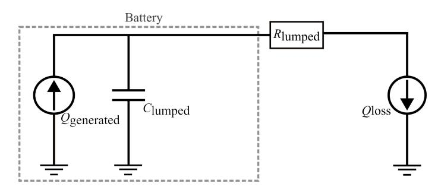
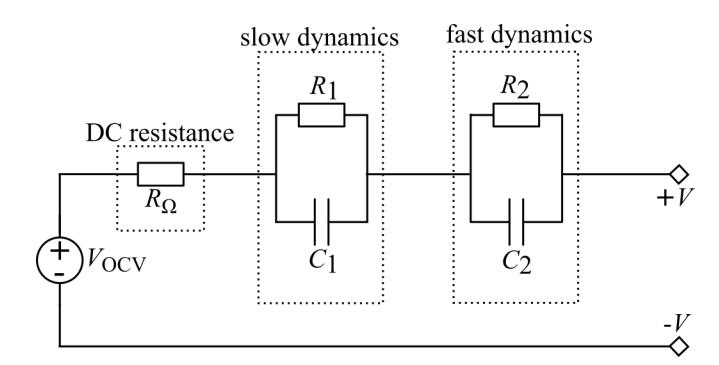
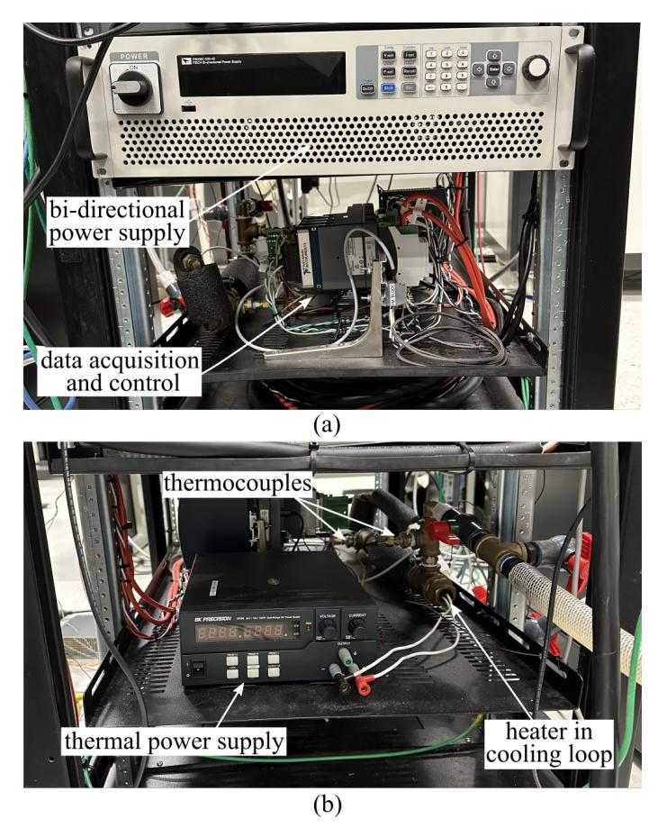
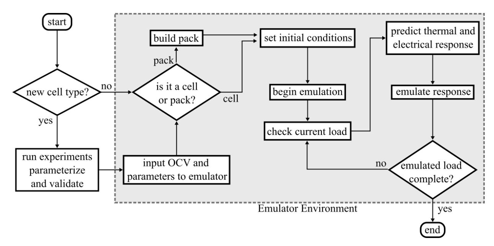
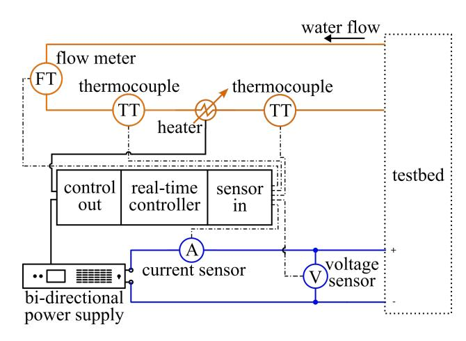
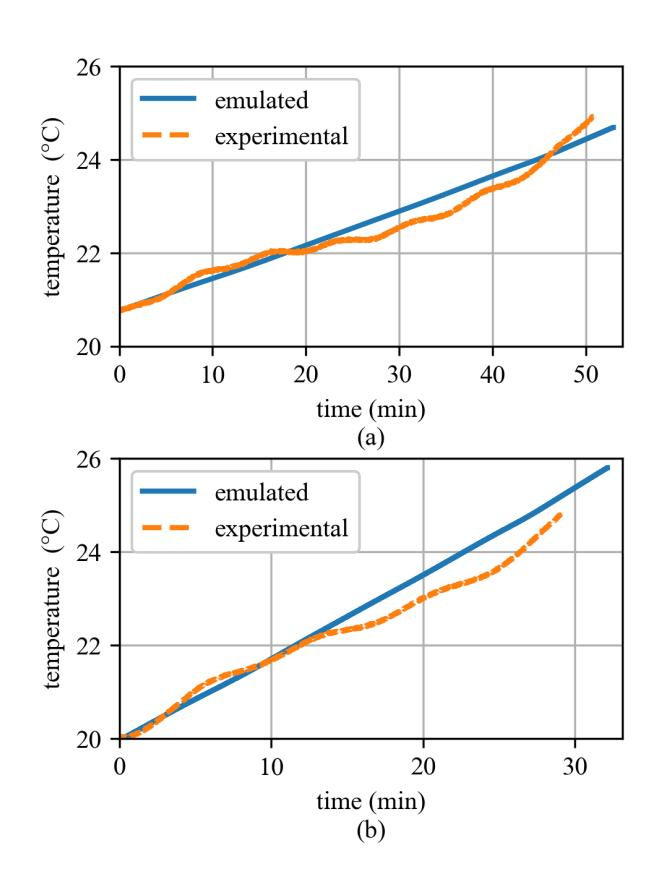
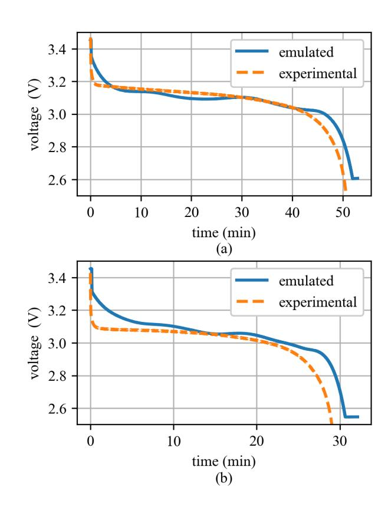

{0}------------------------------------------------

*Abstract*—The transition to all-electric marine vessels has elevated the importance of batteries in meeting high-pulsed loads and efficiency requirements. Understanding the electrical and thermal responses is vital to both safety and cost in battery energy storage system development. To address this, an electro-thermal hardware-in-the-loop (HIL) battery emulator has been developed, integrating a bi-directional power supply and a cooling loop heater to replicate both electrical and thermal behaviors. The output for each is determined by a real-time controller, running a coupled electrical and thermal model using an equivalent circuit, and a reduced order model, respectively. The parameters for model operation are determined by cell testing and curve fitting. This work seeks to define an approach for investigating any lithium-ion battery for a given energy storage system, and presents progress on the hardware that comprises the emulator. The ability to substitute the battery in a testbed while evaluating its effectiveness, especially in edge-case scenarios, significantly reduces hazards and costs when determining the right battery. Using a lithium iron phosphate 26650 cell as a case study, this work demonstrates the accuracy of this method, emulating the voltage and temperature of a 1C constant current discharge with an average error of 1.14% and 0.89%, respectively. At 2C, the voltage emulation error was found to be 2.07% and the temperature error was found to be 1.39%.

*Index Terms*—Hardware-in-the-loop, batteries, thermal modeling, battery emulation, reduce order modeling.

#### I. INTRODUCTION

Visible by the recent push for electrification of transportation, reducing greenhouse emissions has become a priority in all sectors. As seafaring travel accounts for 90% of transoceanic trade, all-electric ships are the expected next steps for the global shipping industry, with General Electric and Siemens having already completed all-electric propulsion systems [1], [2]. Frequently requiring variable operation states of shipboard power systems, Battery Energy Storage Systems are essential for ensuring stable microgrid operation [3]. However, testing lithium-ion batteries, a onboard energy storage system of great interest, quickly becomes expensive and dangerous when examining new system architectures. A hardware-in-the-loop substitute for these batteries provides a safer and more sustainable alternative for investigating battery chemistries, cooling strategies, and Battery Management Systems [4].

Existing research on a multi-domain battery emulation often neglects thermal emulation beyond its affect on electrical parameters [5]. While electrical-only emulation can determine voltage, state of charge (SOC), and remaining useful life from an external load, it does not account for heat generation. However, as current increases, Ohmic heating becomes a significant factor [6]. This is relevant for all-electric ships, where rapidly shifting loads can require batteries to supply up to 70% of the total microgrid power needs at aa given time. To ensure safe and efficient system operation, battery thermal response must be integrated into system architecture [3].

Electro-thermal battery emulation offers a potential to test and validate both the electrical and thermal aspects of a battery in connection with the electro-thermal design and development of power systems. To expand, the proposed electro-thermal battery emulator is designed to replicate both the heat generated into a liquid cooling system, and the electrical response of the desired battery. In previous work, Peskar et al. [7] introduced a foundational framework for developing an electro-thermal battery emulator and presented preliminary results emulating a 18650 3.6 V 3 Ah lithium nickel cobalt aluminum oxide (NCA) cell. In this work, progress on the development of an emulation system methodology and supporting hardware is presented. The contributions of this work are twofold. First, it examines the electro-thermal simulation of a more modern cell geometry and chemistry, using a 26650 3.2 V 2.6 Ah Lithium iron phosphate (LFP) cell. Second, it provides an update on the physical hardware that makes up the emulator and reports the results obtained from experimental validation.

#### II. METHODOLOGY

### *A. Electrical Model*

The coupled electro-thermo model can be separated into two subsystems that share parameters, and will be referred to as the electrical and thermal models. The electrical model updates the voltage, open-circuit voltage (OCV), current across the battery, and the SOC. As shown in Fig. 1, the electrical response is modeled as a second-order equivalent circuit, which was selected for its balance between fidelity and computational efficiency. The equivalent circuit relies on six parameters, the open circuit voltage of the battery, the DC internal resistance,

# Electro-thermal Hardware-in-the-Loop Battery Emulator for Shipboard Systems Testing

Connor Madden\*, Jarrett Peskar\*, Kerry Sado†, *Member, IEEE*,  
Austin R.J. Downey\*‡, *Member, IEEE*, and Jamil Khan\*

\*Dept. of Mechanical Engineering

†*Dept. of Electrical Engineering*

‡*Dept. of Civil and Environmental Engineering  
University of South Carolina*

Columbia, SC 29208 USA

austindowney@sc.edu

{1}------------------------------------------------

Fig. 1. Diagram of the equivalent circuit used in the electrical model.

TABLE I TESTS CONDUCTED TO BUILD AND VALIDATE THE MODEL.

| <b>detailed collection</b>           |                                                   |  |  |
|--------------------------------------|---------------------------------------------------|--|--|
| HPPC at $T_{\min}$ and $T_{\max}$    | fitting $R_{Q1}$ , $R_1}$ , $R_2$ , $C_1$ , $C_2$ |  |  |
| C/10 CC at $T_{\min}$ and $T_{\max}$ | estimate OCV                                      |  |  |
|                                      |                                                   |  |  |
|                                      |                                                   |  |  |
| 1C CC discharge                      | validation data                                   |  |  |
| 2C CC discharge                      | validation data                                   |  |  |

and two resistance and capacitance pairs that capture the battery dynamics. These parameters are implemented through lookup tables dependent on the SOC, temperature, and current loading (C-rate) of the cell. To build the necessary lookup tables, the required experimental data is summarized in Table I.

The DC internal resistance and battery dynamics can be determined using Hybrid Pulse Power Characterization (HPPC) at the minimum and maximum expecting operating temperatures. HPPC is a standard method for evaluating the dynamic performance of a battery [8]. This is done by analyzing the battery's response to discharge pulses at specific SOC and temperatures. The resistances and capacitances defining the battery dynamics can then be found using nonlinear least squares fitting. The OCV can be estimated and fitted from constant current (CC) C/10 discharges at each edge of the temperature range. Once obtained, these parameter can be validated against moderate rate discharge data at varying temperatures. While additional data can increase the model accuracy, the tests outlined in Table I represent the minimal requirements for emulator operation.

$$V_{\text{terminal}}(t) = V_{\text{OCV}}(SOC, T) - V_1(t) - V_2(t) \\ - I(t) * R_{\Omega}(SOC, T, C_{\text{rate}}) \quad (1)$$

The equivalent circuit is defined by equation 1, which describes the battery voltage as a function of time [9]. The OCV and DC internal resistance dependent on the SOC and temperature, and they are updated at each iteration by the electrical and thermal models, respectively.

$$V_i(t) = \alpha_i * V_{i,t-1} + R_i(SOC, T, C_{\text{rate}}) * (1 - \alpha_i) * I(t) \quad (2)$$

$$\alpha_i = e^{-\Delta t * R_i * C_i} \quad (3)$$

Equation 2 defines  $V_1$  and  $V_2$ , which are used in equation 1. These voltages account for the battery dynamics and are updated at each iteration based on  $\alpha_i$  as described by equation 3.

Fig. 2. Thermal circuit used in the reduced order model.

Similar to the DC internal resistance, the dynamic resistance and capacitance vary with SOC, temperature, and discharge rate.

#### *B. Thermal Model*

The thermal model, defined by equation 4, calculates the heat generated and dissipated to update the cell temperature. Visually represented in Fig. 2, the heat transfer model is a lumped thermal circuit, and employs the isothermal reduced-order heat generation model, described by equation 5, which assumes uniform heat generation. The heat transfer model relies on two lumped parameters.  $C_{\text{lumped}}$  represents the total thermal mass, which is the product of the cell mass and heat capacity, and  $R_{\text{lumped}}$  represent the total thermal resistance from the cell to ambient air.

$$$$

$$Q_{\text{gen}} = I(t) * (V_{\text{OCV}}(SOC, T) - V_{\text{terminal}}(t)) + I(t) * \frac{du}{dT} \quad (5)$$

Equation 5 describes heat generation within the cell as the difference between OCV and voltage at the terminals multiplied by the discharge current [10]. The OCV and terminal voltage being shared by the electrical model. Additionally, entropy is accounted for as the current multiplied by the rate of change of OCV with respect to temperature. However, accurately determining the entropy contribution requires specialized experimental procedures, which were beyond the scope of this study and thus neglected.

### *C. Hardware-in-the-Loop*

Figure 3 highlights the connections within the battery emulator hardware. The model, running on the real-time controller, couples the separate electrical and thermal domains. The controller receives real-time updates on heat dissipation via a flow transducer and two temperature transducers in the cooling loop, and monitors the electrical emulation via voltage and current sensors. The emulator cooling loop is connected to a pump submerged in a tank, and the bi-directional power supply interfaces with an electronic load. This setup allows the emulator to be connected to a microgrid testbed by swapping out the electronic load and cooling tank as needed.

Figure 4 shows the implementation of the hardware-inthe-loop emulator, employing a bi-directional power supply

{2}------------------------------------------------

Fig. 3. Diagram of the battery emulator hardware setup.

(IT6000C-500-40) for electrical emulation and an analog power supply (BK 9104) heating a cooling loop. Both power supplies are controlled by a cRIO-9054 from NI, which runs the model at 100 Hz, and adjusts the outputs of each power supply accordingly.

#### *D. Usage Procedure*

Figure 5 demonstrates the process of using the battery emulator to test any lithium-ion battery. If the cell is not a new type, whether in terms of chemistry, size, or brand, and the test is not conducted at the pack level, the emulator only requires initial conditions for operation. If given a new pack layout or when moving from a cell to a pack level, the series and parallel configuration must be defined in the software to allow the emulator to scale its outputs accordingly. Once the pack is configured, the emulation can proceed the provided initial conditions. This capability is particularly useful as large battery packs, such as those used in all-electric-ships, where high power demands and significant heat generation make

Fig. 4. The battery emulator hardware setup from (a) the front view and (b) the back view.

physical testing both costly and hazardous. The emulator offers a safer and more cost-effective alternative.

In the case of a new cell type, there are steps outside of

{3}------------------------------------------------

Fig. 6. The voltage during a) 1C and b) 2C constant current discharges of a K2 26650 LFP cell along with the emulator results for the same cell.

the emulator environment that must be completed first. Cell testing is required to collect data and determine the model parameters, completing at minimum those listed in Table I. The model must then be updated with the new parameters and data, and should be validated against moderate rate tests. Once this process is complete, the emulator environment can then be used to test the cell or pack under a load, limited only by hardware.

# III. RESULTS

Reported in figures 6 and 7, the performance of the emulator was evaluated relative to the physical counterpart for a K2 Energy 26650 lithium iron phosphate battery under 1C and 2C constant current discharge conditions. Previously used in a naval railgun, the 2.6Ah cells used were developed for high power pulsed loads, and were expected to perform well under the 2C test. The 1C shows that the emulator could emulate the voltage with 1.14% average error and the temperature with 0.89% average error. This demonstrates that both the model and hardware of the emulator could replicate the dynamics of the cell at 1C. However, at 2C, the error increased, with the voltage emulation error reaching 2.07% and temperature was found to be 1.39%.

The increase in error for the test conducted at 2C was expected due the neglected entropic ( $\frac{dU}{dT}$ ) heat generation mode. At C-rates higher than 1C, the internal reaction rates are known to increase causing a more dynamic temperature variations due to the larger contribution of the entropy. This effect explains

Fig. 7. The temperature during a) 1C and b) 2C constant current discharges of a K2 26650 LFP cell along with the emulator results for the same cell.

the higher variance seen in the 2C test. However, the overall trend of increasing temperature was still well captured as the maximum variance was remaining within  $\pm 1^\circ\text{C}$ . Further contributions to the total error seen in both the 1C and 2C tests is derived from modeling assumptions and the use of averaged values. The tested K2 26650 batteries were not new cells and had an unknown history, leading to an unknown state of health. This uncertainty completed parameterization and testing of the cells as the calculated parameters varied across each cell tested. This variance from the cells leads to uncertainty in electrical parameters as they might fit well for one cell but inaccurate for another. Using new cells or cells with a documented history is imperative for obtaining more certain parameters that accurately represent the cell and its current state.

## IV. CONCLUSION

To meet the demands of all-electric ships, a hardware-inthe-loop battery emulator is needed to safely test the electrical and thermal characteristics of lithium-ion batteries. This work demonstrated the capabilities of a hardware-in-the-loop battery emulator assessed on the accuracy of replicating electrical and thermal responses under moderate constant current discharge rates. Using a second order equivalent electrical circuit and a reduced-order thermal model, a cRIO-9054 is used to control a bi-directional power supply and an analog power supply to emulate the electrical and thermal output of a K2 26650

{4}------------------------------------------------

lithium iron phosphate cell. The emulator was able to produce a temperature response with 0.89% and 1.39% average error at 1C and 2C, respectively, while the voltage response average

- error was 1.14% at 1C and 2.07% at 2C. than previously possible. ACKNOWLEDGMENT necessary reflect the views of the United States Navy. REFERENCES [1] S. Fang, Y. Wang, B. Gou, and Y. Xu, "Toward future green maritime transportation: An overview of seaport microgrids and all-electric ships," *IEEE Transactions on Vehicular Technology*, vol. 69, no. 1, pp. 207–219, 2020. [2] S. Guo, Y. Wang, L. Dai, and H. Hu, "All-electric ship operations and management: Overview and future research directions," *eTransportation*, vol. 17, p. 100251, 2023. [Online]. Available: https://www.sciencedirect. com/science/article/pii/S2590116823000267 [3] S. Fang, Y. Xu, H. Wang, C. Shang, and X. Feng, "Robust operation of shipboard microgrids with multiple-battery energy storage system under navigation uncertainties," *IEEE Transactions on Vehicular Technology*, vol. 69, no. 10, pp. 10 531–10 544, 2020. [4] A. Verani, R. Di Rienzo, N. Nicodemo, F. Baronti, R. Roncella, and
- R. Saletti, "Open hardware/software modular battery emulator for battery management systems development and functional testing," *IEEE Access*, vol. 12, pp. 84 488–84 497, 2024. [5] O. Konig, C. Hametner, G. Prochart, and S. Jakubek, "Battery emulation ¨ for power-hil using local model networks and robust impedance control," *IEEE Transactions on Industrial Electronics*, vol. 61, no. 2, pp. 943–955, 2014. [6] Y. Zeng, D. Chalise, S. D. Lubner, S. Kaur, and R. S. Prasher, "A review of thermal physics and management inside lithiumion batteries for high energy density and fast charging," *Energy Storage Materials*, vol. 41, pp. 264–288, 2021. [Online]. Available: https://www.sciencedirect.com/science/article/pii/S2405829721002695 [7] J. Peskar, A. R. Downey, J. Khan, and K. Booth, "Progress towards a coupled electro-thermo battery emulator," in *2023 IEEE Electric Ship Technologies Symposium (ESTS)*, 2023, pp. 333–336. [8] H. Miniguano, A. Barrado, A. Lazaro, P. Zumel, and C. Fern ´ andez, ´ "General parameter identification procedure and comparative study of li-ion battery models," *IEEE Transactions on Vehicular Technology*, vol. 69, no. 1, pp. 235–245, 2020. [9] R. R. Kumar, C. Bharatiraja, K. Udhayakumar, S. Devakirubakaran,
  - K. S. Sekar, and L. Mihet-Popa, "Advances in batteries, battery modeling, battery management system, battery thermal management, soc, soh, and charge/discharge characteristics in ev applications," *IEEE Access*, vol. 11, pp. 105 761–105 809, 2023. [10] A. Verma and D. Rakshit, "Performance analysis of pcm-fin combination for heat abatement of li-ion battery pack in electric vehicles at high ambient temperature," *Thermal Science and Engineering Progress*, vol. 32, p. 101314, 2022. [Online]. Available: https: //www.sciencedirect.com/science/article/pii/S2451904922001214

Future work will explore advanced model development to include high C-rate loads and irregular temperatures. However, continued work in understanding and the modeling of the cells and degradation effects is needed and will provide insight on the true parameters of the cells once state of health reference points are obtained. Investigation of scaling factors and pack design will allow pack level emulation from single cell characterization, to provide safer testing of high voltage and high power battery packs, as used in commercial systems. Integrated into a full testbed, a coupled electro-thermal battery emulator could serve applications beyond determining battery selection. A single emulator can provide insights on the rapid development of a battery management system for both electrical and thermal control. Additionally, multiple emulators could be deployed to facilitate the design of battery control systems across multiple packs. With the initial SOC of the battery being a set parameter, the time investment for testing these systems will be greatly reduced since the emulator does not recharging, only reinitialization. Removing a real battery from a system allows harsher, safer, and more thorough testing

This material is based upon work supported by the Office of Naval Research (ONR) under contract No.N00014-22- C-1003, No.N00014-23-C-1012, and No.N00014-24-C-1301. Any opinions, findings, and conclusions or recommendations expressed in this material are those of the authors and do not