{0}------------------------------------------------

# Mechanical Systems and Signal Processing

# Multi-step ahead state estimation with hybrid algorithm for high-rate dynamic systems

Matthew Nelson a,\*, Vahid Barzegar a, Simon Laflamme a, Chao Hu b, Austin R.J. Downey c, Jason D. Bakos d, Adam Thelen b, Jacob Dodson e

### A R T I C L E I N F O

Communicated by J.E. Mottershead

*MSC:*

00-01

99-00

#### *Keywords:*

High-rate state estimation

Real-time

Deadline overshoot

Physics-informed deep learning

Ensemble of LSTMs

Model reference adaptive system

#### A B S T R A C T

High-rate systems are defined as engineering systems that undergo accelerations of amplitudes typically greater than  $100 \text{ g}_m$  over less than  $100 \text{ ms}$ . Examples include adaptive airbag deployment systems, hypersonic vehicles, and active blast mitigation systems. The use of feedback mechanisms in these high-rate applications is often critical in ensuring their continuous operations and safety. Of interest to this paper are algorithms needed to support high-rate structural health monitoring (HRSHM) to empower sub-millisecond decision systems. HRSHM is a complex task because high-rate systems are uniquely characterized by (1) large uncertainties in the external loads, (2) high levels of non-stationarities and heavy disturbances, and (3) unmodeled dynamics generated from changes in system configurations that necessitate careful crafting of adaptive strategies. This paper studies benefits of integrating a data-driven predictive model with a physics-based state observer to reduce latency and convergence time estimating actionable information. The predictive model, constructed with long short-term memory (LSTM) cells, performs multi-step ahead signal prediction acting as the input to the physical model, a model reference adaptive system (MRAS). The MRAS then performs state estimation of the predicted signal rather than the true signal. A comparison study was done between the proposed hybrid algorithm and a physics-based MRAS on a testbed involving a fast-moving boundary condition. Results showed that the hybrid algorithm could perform state estimations with zero timing deadline overshoot and with up to 50% faster convergence time when compared to the MRAS under constant boundary conditions. However, the hybrid generally underperformed the MRAS algorithm in terms of convergence accuracy during motion of the boundary condition by increasing convergence time by 20%, attributable to the lag in learning the new dynamics used in predicting. The performance of the NSE algorithm was also examined on a true high-rate system, where it was shown to be capable of qualitatively tracking actionable information.

#### **1. Introduction**

High-rate dynamic systems are defined as engineering systems experiencing accelerations of high amplitude, typically higher than 100  $g_n$  ( $g_n = 9.81 \text{ m/s}^2$ ), over durations less than 100 ms [1]. Examples of high-rate systems include blast mitigation

a *Department of Civil, Construction, and Environmental Engineering, Iowa State University, Ames, IA, USA*

b *Department of Mechanical Engineering, Iowa State University, Ames, IA, USA*

c *Department of Mechanical Engineering, University of South Carolina, Columbia, SC, USA*

d *Department of Computer Science and Engineering, University of South Carolina, Columbia, SC, USA*

e *Air Force Research Laboratory, Munitions Directorate, Fuzes Branch, Eglin Air Force Base, FL, USA*

\* Corresponding author.

*E-mail address:* [mjn5@iastate.edu](mailto:mjn5@iastate.edu) (M. Nelson).

{1}------------------------------------------------

mechanisms, advanced hypersonic weaponry and vehicles, and adaptive airbag deployment systems. Monitoring of these highrate systems requires state estimation capable of providing actionable information for preemptive measures in the sub-millisecond range [[2](#page-12-1)]. With technology advancing towards dynamically challenging ideas, proper monitoring must be implemented to provide more advanced safety mechanisms through high-rate structural health monitoring (HRSHM). However, the development of HRSHM algorithms is a complex task given that these systems typically exhibit (1) large uncertainties in the external loads, (2) high levels of non-stationarity and heavy disturbances, and (3) unmodeled dynamics generated from changes in the system configurations [[3\]](#page-12-2). Algorithms developed specifically for high-rate monitoring need to be capable of state estimation in the sub-millisecond range if they are to provide actionable information promptly [[4\]](#page-12-3). Such algorithms are required to be lean and computationally inexpensive while preserving adequate accuracy to empower real-time implementations [[5](#page-12-4)].

Among the many data-driven methods proposed for high-rate system modeling, neural networks have shown promise in learning unknown, complex dynamics [[6](#page-12-5)[,7\]](#page-12-6). The universal approximation capability of neural networks makes them a suitable candidate for modeling the complex behavior of high-rate systems. Still, they require a multitude of labeled data to construct accurate representations. Examples of neural networks used to predict unknown and complex dynamics include the multi-layer perceptron [[8,](#page-12-7)[9\]](#page-12-8), generative adversarial network [\[10](#page-12-9),[11\]](#page-12-10), wavelet neural network [[12\]](#page-12-11), and recurrent neural network (RNN) [[13–](#page-12-12)[15\]](#page-12-13).

Recurrent neural networks, developed specifically as a temporal analysis tool, are generally preferred to model time-series sensor measurements [16]. Lindemann et al. discussed the applicability of the RNN, and specifically, the long short-term memory (LSTM) network in its ability to accurately predict nonlinear time-varying systems [17]. The authors found that LSTMs have excellent nonlinear and time-varying prediction capabilities and excel at multi-modal and multi-step ahead predictions. In the high-rate realm, Salmela et al. designed an LSTM to accurately perform real-time predictions for nonlinear, high power pulse compression and broadband supercontinuum generation [18]. Barzegar et al. [19] parallelized multiple LSTM cells in an ensemble to perform multi-step ahead predictions for high-rate systems. The ensemble learning architecture allowed each LSTM to specialize over different temporal features identified in the input, yielding a leaned architecture and thus faster computation time, with a reported average computation time of 25  $\mu$ s per step. While these techniques showed promise, they typically did not yield actionable information unless intensive training was performed on labeled data.

In contrast to purely data-driven methods, physics-based system modeling incorporates physical knowledge about the system, which can help reduce physically inconsistent predictions. These models also improve the availability of actionable information, particularly when labeled data is limited in availability. Popular methods are those based on frequency estimates, where, for instance, sudden variations in frequencies indicate changes in boundary conditions that may be quantifiably linked to defects [[20\]](#page-12-18). While the signal's frequency domain is rich in information, it is often difficult to measure accurately online in real-time as it requires a long sampling window. Utilizing the frequency domain is especially challenging in the sub-millisecond realm [[21\]](#page-13-0). Scheppegrell et al. [\[22](#page-13-1)] and Yan et al. [[23\]](#page-13-2) examined the use of short-term Fourier transforms and other modal techniques and discussed challenges in HRSHM applications. Dimassi et al. demonstrated the capabilities of an adaptive model reference adaptive system (MRAS) to monitor a twin-rotor, nonlinear system in real-time [[24\]](#page-13-3). MRAS is a compact adaptive observer that uses a simplified physical model of the system constructed from known physics to perform state estimation. Yan et al. developed an MRAS architecture and demonstrated sub-millisecond state estimation capabilities for a high-rate system represented as a single-degree-of-freedom system [[25\]](#page-13-4). The authors augmented the MRAS architecture to relax the need for persistent excitation. While MRAS and other physics-based methods are useful for directly providing actionable information, a key limitation is their higher computation time; thus yielding latency that causes an overshoot of the timing deadline and limits their applicability to real-time HRSHM.

This paper investigates a physics-informed machine learning architecture for HRSHM applications by integrating the datadriven ensemble of RNNs previously developed by the authors [[19\]](#page-12-17) with the physics-based MRAS also previously developed by the authors [\[25](#page-13-4)]. The LSTM provides the MRAS with multi-step ahead predictions, thus allowing the MRAS to pre-compute the system's dynamic state and thus eliminate timing deadline overshoot caused by the MRAS computation time. This combined algorithm is termed the neural state estimator (NSE). The novelty of this paper is in the examination of opportunities and limitations of such technique for high-rate dynamics, in particular in terms of accuracy when dynamic states evolve and cause complications in the quality of the LSTM's step ahead predictions. The NSE is evaluated in three case studies: (1) a cantilever beam of repeatable and constant boundary conditions, (2) a cantilever beam of repeatable and changing boundary conditions, and (3) a true high-rate system of unknown and changing boundary conditions. Results are benchmarked against a hypothetical MRAS algorithm with a modified sampling rate greater than the system's latency.

The rest of the paper is outlined as follows. Section [2](#page-1-0) introduces the NSE architecture. Section [3](#page-5-0) describes the research methodology, including the experimental setup for the three case studies. Sections Sections [4.1](#page-8-0) and [4.2,](#page-9-0) and [4.3](#page-11-0) present and discuss results. Section [5](#page-11-1) concludes the paper.

#### **2. Neural state estimator architecture**

The general architecture of the NSE is diagrammed in Fig. 1(a). This architecture allows for zero timing deadline overshoot, thus providing state estimation in real-time. The NSE consists of two sequential processes as depicted in Fig. 1(a): at every time step  $i$ , an LSTM that predicts  $\lambda$  steps ahead, and an MRAS that takes the prediction and estimates the state at time step  $i + \lambda$ . In terms of latency, consider that the LSTM has a computation time of  $\lambda_{\text{LSTM}}$ , and the MRAS has a computation time of  $\lambda_{\text{MRAS}}$ , typically  $\lambda_{\text{LSTM}} < \lambda_{\text{MRAS}}$ . The value of  $\lambda$  is selected such that:

$$\lambda_{\text{LSTM}} + \lambda_{\text{MRAS}} \leq \lambda \quad (1)$$

{2}------------------------------------------------

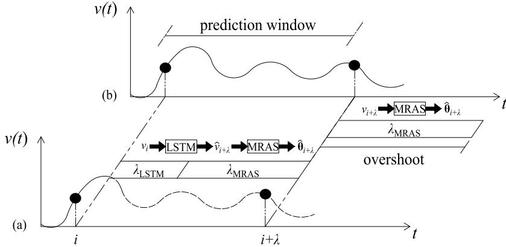

Fig. 1. General architecture of the NSE presented as a function of computation time (a), compared against the MRAS-only algorithm (b).

With an MRAS-only approach, as shown in Fig. 1, the state estimation  $\hat{\theta}$  can only be completed at step  $i + \lambda + \lambda_{\text{MRAS}}$ , with respect to the desired estimate time of  $i + \lambda$ . This approach results in an overshoot of the timing deadline for  $\lambda_{\text{MRAS}}$  determined by the latency of the MRAS. It follows that the MRAS-only method can be applied in real-time only if the computation time is faster than the sampling rate ( $\lambda_{\text{MRAS}} \leq \Delta t$ ). This relationship is particularly true if the state estimation is used in a feedback loop, say for guidance. Thus, a relatively large computation time is not practical in HRSHM, where sampling rates could be 1 sample/ $\mu$ s. Here, if the prediction horizon is taken as  $\lambda = \lambda_{\text{LSTM}} + \lambda_{\text{MRAS}}$ , an estimate of the state can be provided at step  $i + \lambda$  with zero overshoot computation time, provided that the LSTM predictor can be initiated at time  $i$  (i.e., dataset available and appropriate learning or training conducted). The NSE follows that the sole purpose of the LSTM is to provide the MRAS with enough of an early start, through a prediction, to yield the state estimate without a computational overshoot caused by the MRAS computation time. Yet, it must be noted that if a change in dynamics occurs within the prediction window, the algorithm may not be capable of including this information within its prediction. While the NSE does not show an apparent delay in predicting states, the time required to adjust to new dynamics will create inherent latency in the algorithm.

## 2.1. Ensemble of LSTM architecture

The LSTM is a gated unit which stores multiple prior errors in order to eradicate the vanishing gradient problem. The LSTM is split into four gates; the input gate (i), forget gate (f), output gate (o), and the cell state (C) with equations shown in Eq. (2),

$$$$

where  $\mathbf{x}_i$  and  $\mathbf{h}_i$  are the input and hidden vectors, respectively,  $\mathbf{W}$  and  $\mathbf{U}$  are the weights for the associated gates, and  $\sigma$  represents the sigmoid activation functions. For further details, the reader is referred to [26].

The ensemble of LSTMs architecture is described in detail in [19], and illustrated in Fig. 2, here used for a univariate time series prediction. Briefly, it consists of an ensemble of  $n$  RNNs constructed with short-sequence LSTM cells. Each LSTM has a dedicated input vector  $\mathbf{v}$ . The hidden states  $\mathbf{h}$  produced by the LSTMs are features extracted from the input  $\mathbf{v}$ . All of the hidden states  $\mathbf{h}$  are then passed through an attention layer and a dense layer. After, a dense layer produces the prediction  $\hat{v}_{i, \lambda}$  to be input to the MRAS and calculate the prediction error. The error on the prediction is back-propagated, and the weights are adapted using learning rates  $\zeta_1$  to adapt the attention and dense layer weights and  $\zeta_2$  to adapt the LSTM cell weights.

The attention layer is a mechanism used to learn features found in time series [27]. However, since the dynamics of high-rate systems changes rapidly by nature, the attention layer is kept lean to inhibit the memorization of long-term features to better suit the quick-changing nature of high-rate systems. Here, the attention layer assigns weights to each hidden state  $\mathbf{h}_n$  based on similarities between the short-term features and the features found in  $\mathbf{h}_n$  [28]. Each  $\mathbf{h}_n$ , along with its designated weight, is then concatenated and input to the dense layer to perform signal prediction.

The construction of individual input spaces  $\mathbf{v}$  is based on the embedding theorem [29] and on the assumption that some level of prior knowledge is available about the dynamics of the system. The embedding theorem states that the phase-space of an autonomous system can be reconstructed from a delayed vector  $\mathbf{v}$  of the measurements embedded in a dimension  $d$ :

$$\mathbf{v} = [v_{i-\tau} \quad v_{i-2\tau} \quad \cdots \quad v_{i-(d-1)\tau} \quad v_{i-d\tau}] \tag{3}$$

{3}------------------------------------------------

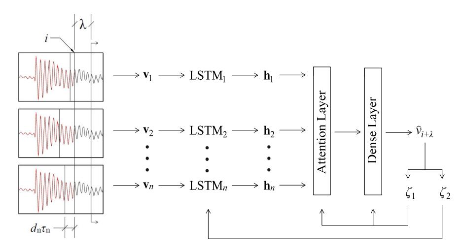

**Fig. 2.** Architecture of the ensemble of LSTMs.

where  $\tau$  is the time delay, and  $\tau$  and  $d$  are selected using the assumed prior knowledge of the system in Section 3. For  $v$  parameterized appropriately, the vector is said to preserve the essential dynamics of the system. Hence, a neuro-representation can be constructed to take such a delay vector as its input instead of using a long sequence of the past measurements as it is typically done. As demonstrated in [30], such technique has the potential to yield leaner neuro-architectures, thus improving on computation time necessary for high-rate systems. While the embedded theorem has been extended to non-autonomous systems with deterministic forcing [31], state-dependent forcing [32], and stochastic forcing [33], it does not apply to non-stationary systems.

Here, the strategy is to decompose the complex non-stationary system into a set of  $n$  simpler systems, each through a unique input space, and reconstruct the signal through an automatic assignment of time-varying weights via the attention layer. Hence, the individual input vectors are constructed to discover local and global changes in nonlinear dynamics through subsampled topology and act as encoded signals decoded by the LSTMs via hidden states. The LSTM neural network was selected to assess the effectiveness of combining physics-based and data-driven algorithms to estimate a dynamic state in real-time with zero timing deadline overshoot. Other neural architectures could be used to form the NSE, such as the gated recurrent units and wavelet neural network, yet it is expected that the selected LSTM architecture would perform relatively well with the dataset under investigation [30,34,35]. Such investigation is left to future work.

There exists a multitude of methods to select the individual delay vectors. Here, this is done either using physical knowledge or by decomposing a representative signal available a prior through principal component analysis (PCA), as discussed in Section 3. The number of dominant frequencies or the number of considered principal components defines the number of LSTMs used in the ensemble. After, offline training is performed on each individual LSTM prior to creating the ensemble using the prior knowledge available about the system. During the online training process, weights are updated through back-propagation in time [36] using the prediction mean square error, MSE, on the pre-defined prediction horizon ( $\lambda$ ).

The performance of the ensemble of LSTMs at conducting step-ahead predictions was evaluated in Barzegar et al. [37]. It was demonstrated on the same datasets of interest that the prediction performance decayed smoothly with the increasing prediction horizon, thus indicating that overfitting was not a concern. The evolution of performance with the changing prediction horizon was even smoother than when compared with a single LSTM network, thus attributing smoothness to the attention layer that acts as a low-pass filter through the smooth evolution of its various weights.

#### *2.2. MRAS architecture*

The MRAS architecture is described in detail in [25] and illustrated in Fig. 3. Briefly, the MRAS is an adaptive observer that constructs a representation (‘adaptive model’) of the unknown (‘reference model’) system. Consider the following equation of motion, here presented as a single-degree-of-freedom system for simplicity:

$$m\dot{x}(t) + c\dot{x}(t) + kx(t) = r(t)$$
 (4)

where  $k$  is the stiffness,  $c$  the damping,  $m$  the mass,  $x$  the position,  $r$  the forcing, and the dot represents a time derivative. In this paper, and as is commonly the case for many high-rate systems, the high-rate systems are subjected to impulse loads, and therefore  $r$  is ignored. Eq. (4) can be written in a state-space representation, expressed as

$$\mathbf{z} = \mathbf{A}\mathbf{z} + \mathbf{b}\mathbf{g}(\mathbf{z})$$
 (5)

{4}------------------------------------------------

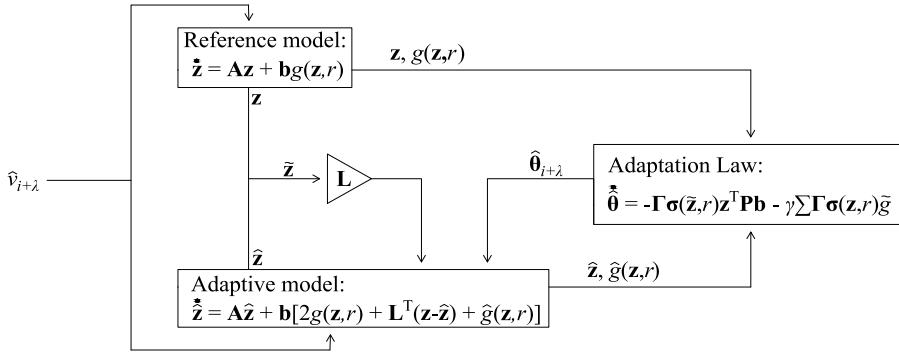

Fig. 3. Architecture of the MRAS algorithm.with

$$\mathbf{A} = \begin{bmatrix} \frac{0}{m} & 1 \\ -\frac{\varepsilon}{m} & -\frac{\varepsilon}{m} \end{bmatrix}, \mathbf{b} = \begin{bmatrix} 0 \\ 1 \end{bmatrix} \quad (6)$$

where  $\mathbf{z} = [x \ \hat{x}]^T$  is the state vector,  $\mathbf{A}$  the state-space matrix,  $\mathbf{b}$  the input matrix, and  $g(\mathbf{z})$  represents the uncertainties, here taken as linearly depending on states only

$$g(\mathbf{z}) = \mathbf{\theta}^T \sigma(\mathbf{z}) = [\theta_1 \ \theta_2] \begin{bmatrix} \frac{\varepsilon}{m} & x \\ \frac{\varepsilon}{m} & \hat{x} \end{bmatrix}^T \quad (7)$$

where  $\mathbf{\theta}$  is the unknown parameter matrix, here as a function of the system's stiffness  $k$  and damping  $c$ . An adaptive model is constructed to produce estimates on the uncertainties until the reference model is reached. This is done using the estimate on  $g$ :

$$\hat{g}(\mathbf{z}) = \hat{\mathbf{\theta}}^T \sigma(\mathbf{z}) = [\hat{\theta}_1 \ \hat{\theta}_2] \begin{bmatrix} \frac{\varepsilon}{m} & x \\ \frac{\varepsilon}{m} & \hat{x} \end{bmatrix}^T \quad (8)$$

where  $\mathbf{\theta}$  is used to as modification factor on selected values for  $k$  and  $c$ . To construct the adaptive model, an estimation of the true input  $g(\mathbf{z})$  is taken as  $\hat{G}(\mathbf{z})$  [38]:

$$g(\mathbf{z}) \approx \hat{G}(\mathbf{z}) = 2g(\mathbf{z}) + \mathbf{L}^T(\mathbf{z} - \hat{\mathbf{z}}) - \hat{g}(\mathbf{z}) \quad (9)$$

where  $\mathbf{L} = [L_1 \ L_2]^T$  is a gain matrix of positive elements and is used to adjust the rate of convergence to  $\hat{\mathbf{z}}$ , shown in Eq. (10).

$$\hat{\mathbf{z}} = \mathbf{A}\hat{\mathbf{z}} + \mathbf{b}\hat{G}(\mathbf{z}) \quad (10)$$

The estimation error on the state  $\hat{\mathbf{z}} = \mathbf{z} - \hat{\mathbf{z}}$  is written

$$\begin{aligned} \hat{\mathbf{z}} &= \mathbf{A}\hat{\mathbf{z}} + \mathbf{b}(g(\mathbf{z}) - \hat{G}(\mathbf{z})) \\ &= \mathbf{A}\hat{\mathbf{z}} + \mathbf{b}(-\mathbf{L}^T\hat{\mathbf{z}} + \hat{g}(\mathbf{z})) \\ &= \mathbf{A}_L\hat{\mathbf{z}} + \mathbf{b}(\hat{g}(\mathbf{z})) \end{aligned} \quad (11)$$

where  $\hat{g}(\mathbf{z}) = g(\mathbf{z}) - \hat{g}(\mathbf{z})$ , and  $\mathbf{A}_L = \mathbf{A} - \mathbf{L}^T\hat{\mathbf{z}}$  is a Hurwitz matrix guaranteeing exponential convergence [39]. The following adaptation law

$$\hat{\mathbf{\theta}} = -\Gamma\sigma(\mathbf{z})^T\mathbf{P}\mathbf{b} \quad (12)$$

can be shown to be stable using Lyapunov stability [25], where  $\mathbf{P}$  can be a user-defined positive definite matrix or by solving the Riccati equation

$$\mathbf{A}_L^T\mathbf{P} + \mathbf{P}\mathbf{A}_L + \mathbf{Q} = \mathbf{0} \quad (13)$$

with  $\mathbf{Q}$  a symmetric matrix [40], where  $\Gamma$  is a diagonal user-defined learning rate matrix of positive definite elements.

To relax the requirement on persistent excitation, the adaptation law is modified to include concurrent learning to force [41,42]. With concurrent learning, a vector called history stack consisting of  $J$  past inputs sequentially selected and updated to maximize the level of information is constructed, and the fitting error for each of the history stack's input  $e_j = g(\mathbf{z}_j) - \hat{\mathbf{\theta}}^T \sigma(\mathbf{z}_j)$  for  $j = 1, 2, \dots, J$  is incorporated in the adaptation rule.

$$\hat{\mathbf{\theta}} = -\Gamma\sigma(\mathbf{z})^T\mathbf{P}\mathbf{b} - \gamma \sum_{j=1}^J \Gamma\sigma(\mathbf{z}_j)e_j \quad (14)$$

{5}------------------------------------------------

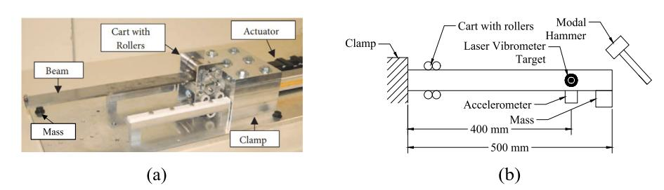

**Fig. 4.** Picture (a) [[25](#page-13-4)] and schematic (b) of the DROPBEAR testbed with key components annotated.

**Table 1** Input space hyperparameters for DROPBEAR.

|     |                                      | Cart position | Static  | Dynamic | LTM     | Early mm() |
|-----|--------------------------------------|---------------|---------|---------|---------|------------|
|     |                                      | frq           | $\tau$  | frq     | $\tau$  |            |
|     |                                      | (Hz)          | (steps) | (Hz)    | (steps) |            |
| LTM | (mm)                                 |               |         |         |         |            |
| #   |                                      |               |         |         |         |            |
| 1   | $\overline{\square \square \square}$ | 17.7          | 28      | 20      | 31      | 0.015      |
| 2   | $\overline{\square \square \square}$ | 21            | 33      | 24      | 38      | 0.15       |
| 3   | $\overline{\square \square \square}$ | 25            | 39      | 29      | 46      | 0.15       |
| 4   | $\overline{\square \square \square}$ | 31            | 49      | 35      | 55      | 0.20       |

# **3. Testbeds and validation**

The performance of the NSE is validated in three case studies conducted on datasets obtained experimentally on two different testbeds. The first one is the Dynamic Reproduction of Projectiles in Ballistic Environments for Advanced Research (DROPBEAR) testbed, used to generate reproducible fast-changing dynamics, and the other is the accelerated drop tower testbed used to generate realistic high-rate dynamics. These testbeds are described in the following subsections, followed by a description of the case studies.

## *3.1. DROPBEAR*

DROPBEAR, presented in [[43\]](#page-13-22) and illustrated in [Fig.](#page-5-1) [4,](#page-5-1) is a cantilever beam capable of repeatable and controllable changes in the dynamics mimicking sudden structural changes found in high-rate systems. These changes consist of a sudden change in boundary condition stimulated with a moving cart (''cart with rollers'', [Fig.](#page-5-1) [4\)](#page-5-1) and a sudden change in mass that is produced using an electromagnet-activated mass drop (shown in [Fig.](#page-5-1) [4](#page-5-1)). A modal hammer is used to excite the beam on some datasets.

[Fig.](#page-5-1) [4](#page-5-1), In this paper, only changes in boundary conditions are considered. Datasets provide static and dynamic positions of the cart. For static positions, the cart is fixed at a pre-determined location while measurements are recorded. Positions include 50, 100, 150, and 200 mm away from the clamp. The beam is excited using the modal hammer hit at 100 ms, and data is recorded for one second. The dynamic positions consist of vibration data recorded while the cart is moving. During these tests, the cart is initially located 50 mm away from the clamp, moves to 200 mm over 1.15 s, remains at the position for 1.13 s, and moves back to its initial position over 1.15 s. Some of this dataset is collected while the modal hammer impacts the beam at arbitrary times. Measurements of the tests are taken using an accelerometer (PCB 353B17) placed 400 mm away from the clamp (to collect acceleration data) and a laser vibrometer pointing at the same location (to collect displacement data).

The selection of the input space for each LSTM*i* in the ensemble is conducted based on the physical knowledge where the system's dominating vibration frequencies at the four cart positions are known and shown in Table 1. Given each dominating frequency, the state space is constructed with time delay,  $\tau_i$ , and embedding dimension,  $d_i$ . The optimal value for  $\tau$  for a harmonic signal is known to be equal to one-fourth of the dominating period [44]. The associated  $\tau$  under each dominating frequency is listed in Table 1. It can be shown that, for harmonic excitations, the optimal embedding dimension is  $d = 2$  [45]. However, to account for unmodeled dynamics the input vectors were over-embedded with  $d = 4$  [46]. Because the static tests include four different positions, the ensemble was constructed with four LSTMs, each trained under the dynamics of its associated frequency shown in Table 1.

The same four LSTMs were used for the dynamic cart tests, knowing that the cart oscillates within the range of the static cart positions. However, the frequencies used in selecting  $\tau$  differ slightly because the mass at the tip of the beam was not present during the dynamic tests, thus altering the natural frequencies. The hyperparameters of the input spaces are listed in Table 1 along with the learning rates. A higher learning rate was used for the 200 mm cart position to improve learning performance under the faster vibration mode.

Each LSTM cell was validated through the data holdout method as a function of training epochs in order to assess the optimal number of training epochs and avoid overfitting. [Fig.](#page-6-0) [5](#page-6-0) illustrates a typical example of the training and validation errors for an LSTM cell over the DROPBEAR 50 mm static cart test. The optimal amount of epochs is chosen once the validation error begins to rise. Results show that both the training and validation errors decrease significantly up to three training epochs, with validation errors fluctuating after five epochs.

{6}------------------------------------------------

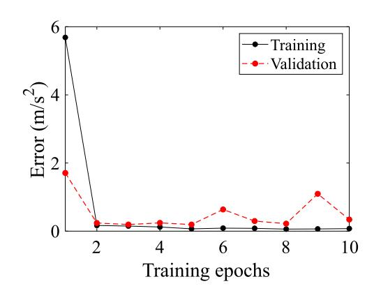

**Fig. 5.** Training versus validation error as a function of training epochs for LSTM cell 1.

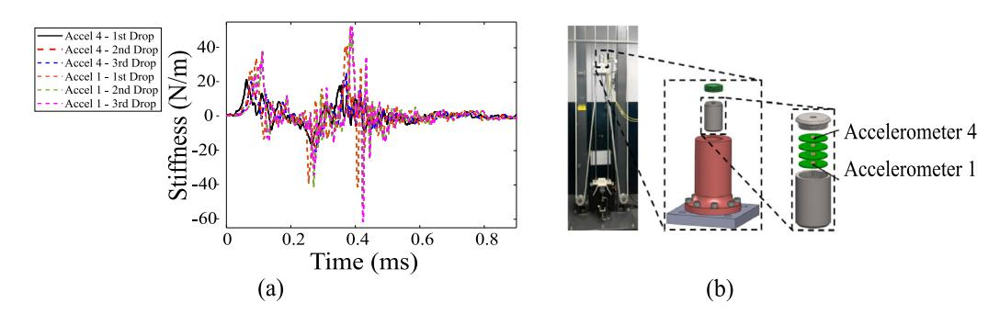

**Fig. 6.** Acceleration signals for the first three drops from accelerometers 1 and 4 (a) and drop tower experimental setup (b).

### *3.2. Drop tower*

The drop tower testbed is shown in Fig. 6. It consists of four high-magnitude accelerometers (up to 120,000  $\text{g}_n$ ) securely held inside a canister impacted using an MTS-66 accelerated drop tower. The canister is dropped five consecutive times, and data from the accelerometers is recorded at a sampling frequency of 1 MHz. Out of the five tests, the first was conducted using stiffer padding around the accelerometers and inside the canister, thus altering the frequency response. As an example, Fig. 6(a) plots data from accelerometer 1 through the five drops. The drop tower tests exhibit true high-rate characteristics where: (1) the response is of high amplitude, in the thousands of  $\text{g}\cdot\text{force}$  ( $1 \text{ kg}_n = 9810 \text{ m/s}^2 = 32,200 \text{ ft/s}^2$ ); (2) the dynamics are highly nonlinear; (3) the response is altered after each test, which could be attributed to one or a combination of the following three causes: the whipping of cables, damage of the electronics assembly, and changes in the internal boundary conditions of the electronics; and (4) the change in dynamics occurs in the sub-millIt is important to note that there exists very little physical knowledge on the dynamics of the drop tower nor the states of the canister. What is known is that Test 1 was significantly stiffer than the other tests due to the presence of padding combined with likely damage occurring between each test due to cracking of the epoxy holding the electronics firmly, thus gradually reducing the overall stiffness of the system after each test.

Unlike DROPBEAR, the drop tower response is complex and the physical representation unknown; hence the previously known input space selection method based on dominating frequencies is not applicable. Instead, the selection was made through PCA following the method discussed in [37]. Under this method, the signal from accelerometer 4 (taken as the output) is decomposed. The first five principal components (representing 90% of the signal) are used to construct five input spaces. Values for  $\tau$  and  $d$  are selected based on mutual information and false nearest neighbors, respectively. The resulting hyperparameters are listed in Table 2, along with the associated pre-optimized learning rates obtained heuristically to ensure the stability of the adaptive process within 50% of the selected values. After, the LSTMs were trained offline on their respective principal components, and the NSE was evaluated using data from accelerometer 1 to represent a signal with different properties.

# *3.3. Evaluation and performance metrics*

The performance of the NSE is evaluated using three case studies. Case Study 1 is on data from DROPBEAR — static cart experiments and is used to assess convergence in terms of stiffness. Case Study 2 is on data from DROPBEAR — dynamic cart

{7}------------------------------------------------

**Table 2**  
Offline input space hyperparameters.

|      |          | #    | (steps) | d                                               | learning rate | Epochs |  |  |
|------|----------|------|---------|-------------------------------------------------|---------------|--------|--|--|
| LSTM | \$\tau\$ | LSTM |         | Model Parameters/Structure (Header Row Implied) |               |        |  |  |
| 1    | 5        | 3    | 0.02    | 3                                               |               |        |  |  |
| 2    | 6        | 3    | 0.1     | 3                                               |               |        |  |  |
| 3    | 8        | 4    | 0.06    | 3                                               |               |        |  |  |
| 4    | 12       | 3    | 0.05    | 3                                               |               |        |  |  |
| 5    | 15       | 3    | 0.03    | 3                                               |               |        |  |  |

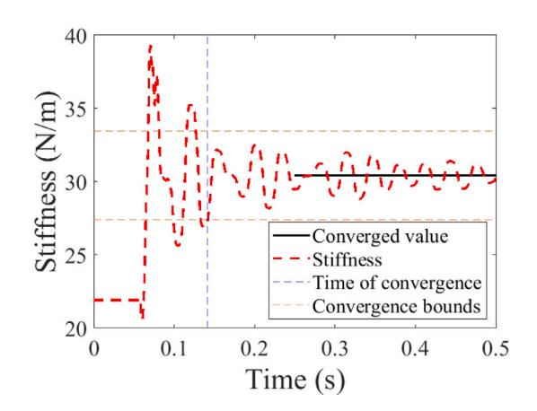

Fig. 7. Illustration of convergence in stiffness estimation with dashed range to show 10% error around converged value.

experiments, without and with hammer hits, used to evaluate the performance in terms of real-time position tracking. Case Study 3 is on data from the drop tower, used to assess performance over a true high-rate system.

The following performance metrics are used: (1) convergence time and (2) percentage error of the estimated state after convergence,  $e_{it}$ . For all tests, convergence time is taken as the time when the state estimation reaches and remains within 10% of the final estimation value. Compared with the MRAS-only algorithm, the convergence is evaluated after time  $i + \lambda$  for all tests. Convergence is assumed when the stiffness estimation remains within 10% of a given value. Fig. 7 illustrates a state estimation with dashed 10% error lines surrounding the converged value to illustrate when convergence time is claimed.

The mean error is recorded once the estimation stays within the error range at the blue circle on Fig. 7. The metrics are computed using

$$e_c(\%) = \frac{v - \hat{v}_i}{v_i} \times 100 \quad (15)$$

where  $v_i$  is the true value,  $\hat{v}_i$  is the estimated value, and  $\hat{v}_i$  is the estimation mean once converged. Lastly, the RMSE is taken as

$$\text{RMSE} = \sqrt{\frac{\sum_{i=1}^N (v_i - \hat{v}_i)^2}{N}} \quad (16)$$

where  $N$  is the length of  $\mathbf{v}_i$ .

Performance is also assessed over a conventional short-term Fourier transform (STFT) as reported in a study in [23] using DROPBEAR and drop tower datasets. Under DROPBEAR tests, the dominating frequency extracted using the STFT, with a window size of 1750 steps (or 70 ms), conducted on the last data points is used to backtrack the system's stiffness and thus the cart position.

All simulations were done in Python 3.7 using the Keras package [47] on an Intel (R) Core (TM) i7-4770 CPU @3.40 GHz. The average simulation time of the NSE algorithm is  $\lambda_{\text{NSE}} = \lambda_{\text{STM}} + \lambda_{\text{MRAS}} = 119 \mu\text{s}$ , and that of the MRAS-only is  $\lambda_{\text{MRAS}} = 94 \mu\text{s}$ . The prediction horizon  $\lambda$  was selected to be under 119  $\mu\text{s}$ . Data used for the MRAS and the STFT were downsampled to obtain computation times shorter than the sampling rate in order to simulate real-time applications.

Hence, for the DROPBEAR simulations conducted on dataset sampled at 25 kHz, a three-step ahead prediction horizon is used giving  $\lambda = 120 \mu\text{s}$ , and simulation data for the MRAS-only algorithm is downsampled to 8333 Hz yielding  $\lambda_{MRAS} = 94 \mu\text{s} \leq \Delta t = 120 \mu\text{s}$ . For the drop tower simulations conducted on datasets sampled at 1 MHz, a 120-steps ahead prediction is used giving  $\lambda = 120 \mu\text{s}$ , and simulation data for the MRAS-only algorithm is downsampled at 10 kHz yielding  $\lambda_{MRAS} = 94 \mu\text{s} \leq \Delta t = 100 \mu\text{s}$ .

{8}------------------------------------------------

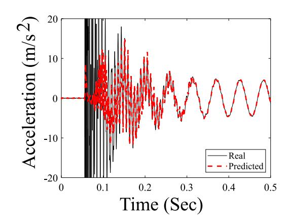

**Fig. 8.** NSE prediction of the static cart acceleration signal at 50 mm.

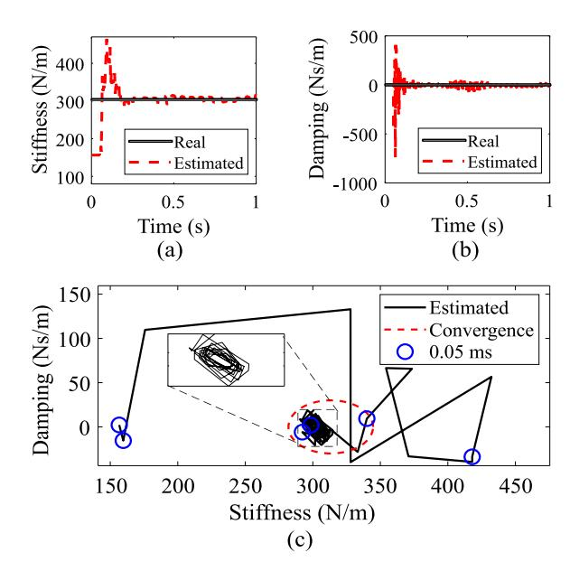

**Fig. 9.** NSE estimation of stiffness (N/m) (a) and damping (Ns/m) (b) in the time domain and parameter state space with stability range (c) for the static cart at 50 mm.

#### **4. Results**

#### *4.1. Case study 1: DROPBEAR static cart*

Fig. 8 plots the typical acceleration signal of DROPBEAR, taken with the cart positioned at 50 mm away from the clamp and under free vibration after being struck by the modal hammer. Acceleration measurements were filtered using a band-pass filter of 5 Hz and 100 Hz cutoff frequencies. For the MRAS portion of the NSE, a recursive least squares (RLS) algorithm was used to reduce the effects of double integration when simulating position ( $x$ ) from the input of acceleration ( $\ddot{x}$ ). The LSTMs' three-step ahead prediction shows an adaptation to the stiffness within the 0.1 s range and later tracks the free vibration response.

[Fig.](#page-8-2) [9](#page-8-2) shows the evolution of the estimated states from the NSE, including the system's stiffness [8](#page-8-1)(a) and damping [8](#page-8-1) (b) using the same signal. Results show that the estimated stiffness converges to the measured value. The figure also plots the estimated stiffness against the estimated damping and demonstrates rapid state convergence towards the stability zone, thus demonstrating the stability of the adaptation law. This figure also shows a scatter every 0.05 ms outside the stability zone to exhibit the convergence speed.

[Table](#page-9-1) [3](#page-9-1) summarizes results under all cart positions, listing the convergence times for the stiffness and the RMSE on the acceleration prediction. The results show that the NSE yields a substantially faster convergence time for the stiffness and damping estimation than the MRAS-only approach. In particular, it cuts down on the convergence time on stiffness by 50%, 34%, 40%, and 44% at the 50, 100, 150, and 200 mm cart positions, respectively, and on damping by 77%, 47%, 37%, and 30% at the 50, 100, 150, and 200 mm cart positions, respectively. Also, the NSE generally improves the quality of the estimate compared with the MRAS,

{9}------------------------------------------------

**Table 3** Performance results of the NSE, MRAS-only, and STFT algorithms for static cart tests.

| cart position      | 200 mm |      | 1000 mm |      | 1500 mm |      | 2000 mm |      | 3000 mm |      |      |
|--------------------|--------|------|---------|------|---------|------|---------|------|---------|------|------|
|                    | NSE    | MRAS | STFT    | NSE  | MRAS    | STFT | NSE     | MRAS | STFT    | NSE  | MRAS |
| k convergence (ms) | 222    | 240  | 297     | 239  | 349     | 297  | 194     | 324  | N/A     | 191  | 324  |
| k error (%)        | 2.54   | 4.31 | 3.17    | 3.28 | 6.20    | 3.17 | 3.90    | 3.72 | 3.17    | 4.12 | 4.14 |

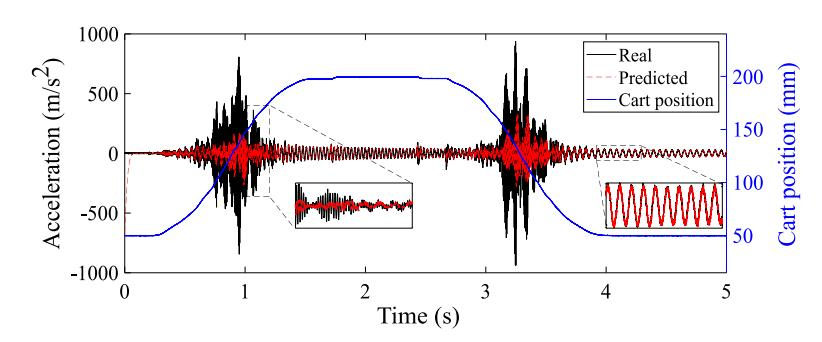

**Fig. 10.** Ensemble of LSTMs prediction for dynamic cart tests without hammer hit.

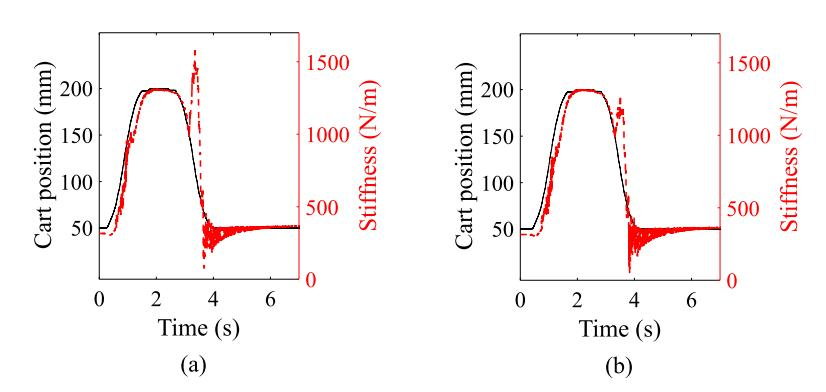

**Fig. 11.** NSE state estimation (a), and MRAS-only state estimation (b) for dynamic cart tests without hammer hits.

except when the cart is at 150 mm. The NSE was also benchmarked against results from the STFT. The computation time for the STFT baseline was 6.9 ms for a 70 ms rolling window, and experimental data was taken at 25 kHz. Results show the NSE yields better accuracy for the 50 mm card position when compared with the STFT, with its relative performance becoming increasingly worst with the cart moving away from the clamp. In other words, the NSE appears to perform better than a traditional STFT over low frequencies, yet the STFT is difficult to apply in real-time, given its relatively long computation time.

#### *4.2. Case study 2: DROPBEAR dynamic cart*

First, the evaluation is conducted on the dynamic cart data without any hammer hit. The input vector  $(v_n)$  is the acceleration of the system. Fig. 10 is a plot of the cart's true position and the 3-step ahead predicted state. The total RMSE of the dynamic cart prediction is  $84.2 \text{ m/s}^2$ . This algorithm converges well after the cart movements. The sub-par predictive capabilities during the cart movement could be explained by a change in the learned dynamics that requires time to adapt. Yet, the predicted signal does not exhibit any prediction overshoots nor overfitting, in particular in regions (i.e., during movement) where training data was not available.

[Fig.](#page-9-3) [11](#page-9-3) reports the card position estimates by the NSE [\(11](#page-9-3) (a)) and MRAS-only ([11](#page-9-3) (b)) algorithms. The cart position estimate can be obtained by evaluating the frequency from the system's stiffness and assuming that a 1-to-1 mapping exists between the frequency and the position, as suggested in [[43\]](#page-13-22). The results from both algorithms are visually similar, exhibiting an under-estimate of the position before the cart moves, slightly overshooting the 200 mm position, chattering on the way back, and a long convergence time after the cart returns at 50 mm. Data were linearly detrended to estimate the accuracy during movement, and the RMSE was computed over the range 0.515–1.63 s corresponding to the cart moving from 50 mm to 200 mm, and 2.9–4.05 s corresponding to the cart moving from 200 mm to 50 mm.

[Table](#page-10-0) [4](#page-10-0) reports the convergence times and estimation errors. Convergence is evaluated over four regions: when the cart is at a fixed position (when reaching 200 mm and back at 50 mm, discarding the initial position at 50 mm to allow for learning), and when

{10}------------------------------------------------

**Table 4** Performance results of NSE vs. MRAS for dynamic cart tests — no hammer hit.

|                    | 50 → 200 mm |      | 200 mm |      | 500 → 50 mm |       | 500 mm |      |
|--------------------|-------------|------|--------|------|-------------|-------|--------|------|
|                    | NRE         | MRAS | NRE    | MRAS | NRE         | MRAS  | NRE    | MRAS |
| k convergence (ms) | 675         | 543  | 57     | 86.6 | 0           | 0     | 570    | 813  |
| k error (%)        | 1.81        | 1.34 | 2.84   | 3.94 | 21.50       | 13.80 | 5.67   | 6.14 |

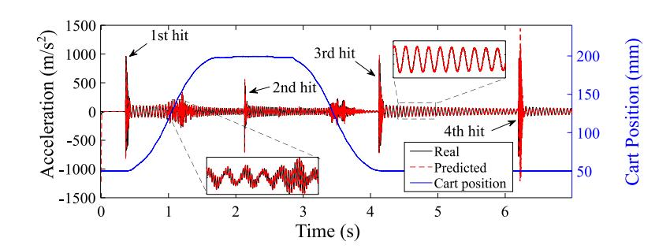

**Fig. 12.** Dynamic cart with modal hammer impacts ensemble prediction.

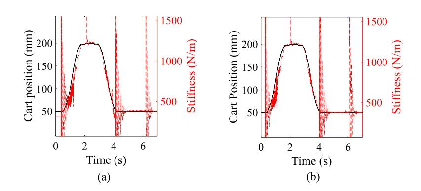

**Fig. 13.** NSE state estimation (a) and MRAS state estimation (b) for dynamic cart with modal hammer impacts.

moving between fixed positions. During movement, convergence is estimated by detrending the estimated signal and evaluating the time when the signal remains approximately constant. The estimation errors are measured at convergence.

Results show that the MRAS-only estimate converges 20% faster and to more accurate values during movement. The faster convergence is attributable to the delay for the NSE's predictor in learning changes in dynamics. When the position stabilizes, the NSE estimate is again faster at converging and to a more accurate value, analogous to results obtained under the static cart tests. Note that the results under the 200 mm to 50 mm movement indicates 0 s for convergence as both algorithms immediately track the change in position, yet with a stabilization in the estimation occurring shortly after the movement initiates, as observable in [Fig.](#page-9-3) [11,](#page-9-3) and shown by the relatively important error in the table.

Second, the evaluation is conducted on the dynamic cart data with hammer hits. Fig. 12 is a time series plot of the 120 steps ahead prediction versus the true values. The RMSE on the entire time series is  $53.1 \text{ m/s}^2$ . The prediction appears more accurate than the no-hammer-hit case, attributable to the richer dynamics favoring faster learning. Some discrepancies can be observed during each of the four impulses. Figs. 13(a) and 13(b) plot the position versus frequency estimates under both the NSE and MRAS-only algorithms, respectively. Both results appear visually similar, with good convergence after the 2nd, 3rd, and 4th modal hammer hits at 1.88, 3.87, and 5.94 s, respectively. The NSE exhibits more chattering during the movement of the cart.

[Table](#page-11-2) [5](#page-11-2) reports the results, showing the convergence over five regions: during movement and after each hammer hit (discarding the first hammer hit to account for learning). The findings are similar to those obtained from the previous dataset. The MRAS-only exhibits better performance during movement yet within 10% of the NSE, except for the convergence time from 50 mm to 200 mm, yet non-significantly underperforming the NSE. The state estimation during each hammer hit occurs while the cart is not moving. Here, the NSE outperforms the MRAS-only algorithm in terms of convergence speed but shows similar convergence error under both the 2nd and 4th hammer hits, and better performance after the 3rd hammer hit.

{11}------------------------------------------------

**Table 5** Performance results of NSE vs. MRAS for dynamic cart tests — hammer hits.

|                    | 20 → 200 mm |      | 200 → 50 mm |      | 3rd hit |      | 4th hit |      |
|--------------------|-------------|------|-------------|------|---------|------|---------|------|
|                    | NSE         | MRAS | NSE         | MRAS | NSE     | MRAS | NSE     | MRAS |
| k convergence (ms) | 795         | 800  | 34.2        | 60.4 | 78      | 715  | 67      | 59   |
| k error (%)        | 6.4         | 2.2  | 0.8         | 0.7  | 3.43    | 4.4  | 2.4     | 2.1  |

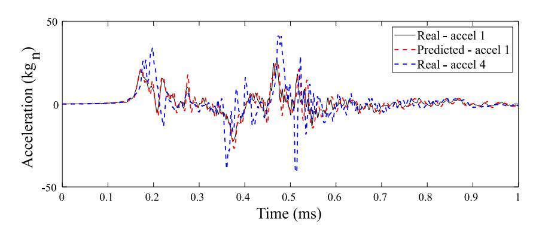

**Fig. 14.** Drop tower data versus the ensemble of LSTM prediction.

### *4.3. Case study 3: Drop tower*

Case study 3 is the application of the NSE to a realistic high-rate dataset with unknown and changing dynamics. Because the system is highly nonlinear, it is difficult to obtain a state estimate that would be meaningful without constructing a proper dynamic representation that the MRAS algorithm could use. Such an evaluation is left to future study. Instead, similar to simulations conducted on DROPBEAR, an SDOF representation is constructed. The stiffness is estimated in real-time, expecting no convergence or information other than a relative rank between tests in terms of stiffness.

Fig. 14 compares the 120 steps ahead (120  $\mu$ s ahead) prediction of the acceleration data from accelerometer 1 — test 1 (after training using accelerometer 4 — test 1 data), versus the real values. The plot also shows the real accelerometer 4 — test 1 data for reference. Results show good agreement between both time series, with an RMSE of 4.05 kgn. During the highly nonlinear event, one can observe some spikes in the predicted signal, between 0.38 and 0.66 ms.

The NSE algorithm is applied to the dataset to extract information on the relative change of stiffnesses between all five tests. [Fig.](#page-12-19) [15](#page-12-19) is a plot of the estimated stiffness under each test. Results show that the algorithm can appropriately rank each test through the expected change in frequency. The stiffness dropped by 13.4% after test 1, and approximately 2% after each subsequent test. As discussed early, an important change in stiffness between test 1 and tests 2–5 is expected, and generally, the stiffness should decrease after each test. This can be observed in the zoomed regions of the plots, specifically the third peak showing a clear difference between the first test and the rest. As expected, the relationship in stiffness is inverted when the canister bounces back in the third zoom.

#### **5. Conclusion**

This paper evaluated the effect of combining data-driven and physics-based methods into a hybrid algorithm, termed neural state estimator (NSE), to optimize the estimation of actionable information for applications to high-rate systems. The NSE contained an ensemble of long short-term memory (LSTM) cells in an ensemble to perform multi-step ahead signal prediction combined with a model reference adaptive system (MRAS) to take the predicted signal and perform state estimation. Choosing the optimal deep learning model for the data-driven portion of the NSE can be further investigated. Validation was performed using the Dynamic Reproduction of Projectiles in Ballistic Environments for Advanced Research (DROPBEAR) testbed and the accelerated drop tower shock testbed.

Using DROPBEAR data, a comparison study was conducted between the NSE and a solely physics-based MRAS (MRAS-only) algorithm to assess convergence speed and accuracy. It was found that the NSE outperformed the MRAS-only over both convergence speed and accuracy for all tests when the cart was not moving. The NSE outperformed the MRAS with up to 50% decrease in convergence time for estimation the stiffness of the system. When the cart was moving, it usually underperformed the MRAS-only algorithm with up to 20% increase in convergence time, often with higher convergence error, attributable to the lag in learning the new dynamics used in predicting. After, the drop tower data was used to assess the performance of the NSE on a true high-rate system. Results showed that the NSE algorithm could be used to track the system's stiffness qualitatively.

Overall, the results showed that the NSE could be used to extract actionable information from an unknown dynamic system with fast-changing dynamics. A net advantage of the NSE is its capability to perform zero timing deadline overshoot estimates because it conducts the estimations using predicted data, thus making it an ideal candidate for high-rate state estimation.

{12}------------------------------------------------

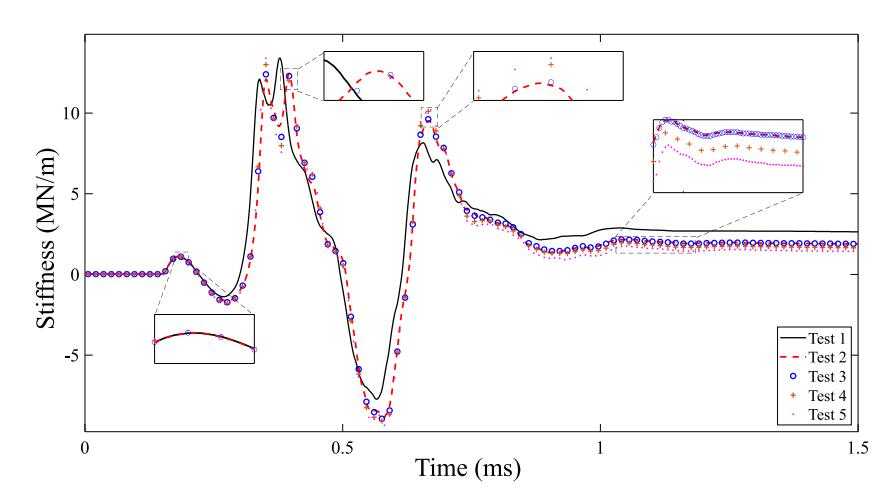

**Fig. 15.** Drop tower NSE frequency convergence overlay.

## **Acknowledgments**

The work presented in this paper is funded by the National Science Foundation under award numbers CISE-1937460 and CISE-1937535. Their support is gratefully acknowledged. Any opinions, findings, and conclusions or recommendations expressed in this material are those of the authors and do not necessarily reflect the views of the sponsor. The authors also acknowledge Dr. Janet Wolfson and Dr. Jonathan Hong for providing the experimental data.

#### **References**

[1] J. Dodson, B. Joyce, J. Hong, S. Laflamme, J. Wolfson, Microsecond state monitoring of nonlinear time-varying dynamic systems, in: Modeling, Simulation and Control of Adaptive Systems; Integrated System Design and Implementation; Structural Health Monitoring, vol. 2, American Society of Mechanical Engineers, 2017, [http://dx.doi.org/10.1115/smasis2017-3999.](http://dx.doi.org/10.1115/smasis2017-3999) [2] J. Dodson, A. Downey, S. Laflamme, M.D. Todd, A.G. Moura, Y. Wang, Z. Mao, P. Avitabile, E. Blasch, High-rate structural health monitoring and prognostics: An overview, in: Data Science in Engineering, vol. 9, Springer International Publishing, 2021, pp. 213–217, [http://dx.doi.org/10.1007/978-](http://dx.doi.org/10.1007/978-3-030-76004-5_23) [3-030-76004-5\\_23.](http://dx.doi.org/10.1007/978-3-030-76004-5_23) [3] J. Hong, S. Laflamme, J. Dodson, B. Joyce, Introduction to state estimation of high-rate system dynamics, Sensors 18 (2) (2018) 217, [http://dx.doi.org/](http://dx.doi.org/10.3390/s18010217) [10.3390/s18010217.](http://dx.doi.org/10.3390/s18010217) [4] A. Downey, J. Hong, J. Dodson, M. Carroll, J. Scheppegrell, Millisecond model updating for structures experiencing unmodeled high-rate dynamic events, Mech. Syst. Signal Process. 138 (2020) 106551, [http://dx.doi.org/10.1016/j.ymssp.2019.106551.](http://dx.doi.org/10.1016/j.ymssp.2019.106551) [5] [J. Hong, S. Laflamme, L. Cao, B. Joyce, J. Dodson, Hybrid algorithm for structural health monitoring of high-rate systems, Smart Mater. Adapt. Struct.](http://refhub.elsevier.com/S0888-3270(22)00637-9/sb5) [Intell. Syst. 51951 \(2018\) V002T05A005.](http://refhub.elsevier.com/S0888-3270(22)00637-9/sb5) [6] L. Cheng, Z. Wang, F. Jiang, J. Li, Adaptive neural network control of nonlinear systems with unknown dynamics, Adv. Space Res. 67 (3) (2021) 1114–1123, <http://dx.doi.org/10.1016/j.asr.2020.10.052>. [7] A.A. Kaptanoglu, J.L. Callaham, A. Aravkin, C.J. Hansen, S.L. Brunton, Promoting global stability in data-driven models of quadratic nonlinear dynamics, Phys. Rev. Fluids 6 (9) (2021) 094401, [http://dx.doi.org/10.1103/physrevfluids.6.094401.](http://dx.doi.org/10.1103/physrevfluids.6.094401) [8] [S. Pierucci, F. Manenti, G. Bozzano, D. Manca, Artificial neural network to capture the dynamics of a dividing wall column, 2020.](http://refhub.elsevier.com/S0888-3270(22)00637-9/sb8) [9] K. Wang, M. Aanjaneya, K. Bekris, Sim2Sim evaluation of a novel data-efficient differentiable physics engine for tensegrity robots, 2020, [arXiv:2011.04929](http://arxiv.org/abs/2011.04929). [10] [W. Nie, A.B. Patel, Towards a better understanding and regularization of GAN training dynamics, in: Uncertainty in Artificial Intelligence, PMLR, 2020,](http://refhub.elsevier.com/S0888-3270(22)00637-9/sb10) [pp. 281–291.](http://refhub.elsevier.com/S0888-3270(22)00637-9/sb10) [11] [M. Ťapajna, Current understanding of bias-temperature instabilities in GaN MIS transistors for power switching applications, Crystals 10 \(12\) \(2020\) 1153.](http://refhub.elsevier.com/S0888-3270(22)00637-9/sb11) [12] J. Hong, S. Laflamme, J. Dodson, Study of input space for state estimation of high-rate dynamics, Struct. Control Health Monit. 25 (6) (2018) [http://dx.doi.org/10.1002/stc.2159.](http://dx.doi.org/10.1002/stc.2159) [13] [X. Qing, J. Jin, Y. Niu, S. Zhao, Time–space coupled learning method for model reduction of distributed parameter systems with encoder-decoder and](http://refhub.elsevier.com/S0888-3270(22)00637-9/sb13) [RNN, AIChE J. 66 \(8\) \(2020\) e16251.](http://refhub.elsevier.com/S0888-3270(22)00637-9/sb13) [14] [S. Hespeler, D. Fuqua, Online RNN model for SOC prediction in next generation hybrid car batteries, in: IIE Annual Conference. Proceedings, Institute of](http://refhub.elsevier.com/S0888-3270(22)00637-9/sb14) [Industrial and Systems Engineers \(IISE\), 2020, pp. 97–102.](http://refhub.elsevier.com/S0888-3270(22)00637-9/sb14) [15] Z. Zhang, G. Wu, Y. Yue, Y. Li, X. Zhou, Deep incremental RNN for learning sequential data: A lyapunov stable dynamical system, in: Proceedings of IEEE International Conference on Data Mining, ICDM, 2021. [16] A.D. Santo, A. Galli, M. Gravina, V. Moscato, G. Sperli, Deep learning for HDD health assessment: An application based on LSTM, IEEE Trans. Comput. 71 (1) (2022) 69–80, [http://dx.doi.org/10.1109/tc.2020.3042053.](http://dx.doi.org/10.1109/tc.2020.3042053) [17] B. Lindemann, T. Müller, H. Vietz, N. Jazdi, M. Weyrich, A survey on long short-term memory networks for time series prediction, Procedia CIRP 99 (2021) 650–655, [http://dx.doi.org/10.1016/j.procir.2021.03.088.](http://dx.doi.org/10.1016/j.procir.2021.03.088) [18] L. Salmela, N. Tsipinakis, A. Foi, C. Billet, J.M. Dudley, G. Genty, Predicting ultrafast nonlinear dynamics in fibre optics with a recurrent neural network, 2020, [arXiv:2004.14126.](http://arxiv.org/abs/2004.14126) [19] V. Barzegar, S. Laflamme, C. Hu, J. Dodson, Ensemble of recurrent neural networks with long short-term memory cells for high-rate structural health monitoring, Mech. Syst. Signal Process. 164 (2022) 108201, <http://dx.doi.org/10.1016/j.ymssp.2021.108201>. [20] P. Inci, C. Goksu, E. Tore, A. Ilki, Effects of seismic damage and retrofitting on a full-scale substandard RC building-ambient vibration tests, J. Earthq. Eng. (2021) 1–28, [http://dx.doi.org/10.1080/13632469.2021.1887009.](http://dx.doi.org/10.1080/13632469.2021.1887009)

{13}------------------------------------------------

[21] D. Zografos, M. Ghandhari, R. Eriksson, Real time frequency response assessment using regression, in: 2020 IEEE PES Innovative Smart Grid Technologies Europe, ISGT-Europe, IEEE, 2020, [http://dx.doi.org/10.1109/isgt-europe47291.2020.9248783.](http://dx.doi.org/10.1109/isgt-europe47291.2020.9248783) [22] J. Scheppegrell, A.G. Moura, J. Dodson, A. Downey, Optimization of rapid state estimation in structures subjected to high-rate boundary change, in: ASME 2020 Conference on Smart Materials, Adaptive Structures and Intelligent Systems, American Society of Mechanical Engineers, 2020, [http:](http://dx.doi.org/10.1115/smasis2020-2306) [//dx.doi.org/10.1115/smasis2020-2306.](http://dx.doi.org/10.1115/smasis2020-2306) [23] J. Yan, S. Laflamme, P. Singh, A. Sadhu, J. Dodson, A comparison of time-frequency methods for real-time application to high-rate dynamic systems, Vibration 3 (3) (2020) 204–216, <http://dx.doi.org/10.3390/vibration3030016>. [24] [H. Dimassi, S. Hadj Said, A. Loria, F. M'Sahli, An adaptive observer for a class of nonlinear systems with a high-gain approach. Application to the twin-rotor](http://refhub.elsevier.com/S0888-3270(22)00637-9/sb24) [system, Internat. J. Control 94 \(2\) \(2021\) 370–381.](http://refhub.elsevier.com/S0888-3270(22)00637-9/sb24) [25] J. Yan, S. Laflamme, J. Hong, J. Dodson, Online parameter estimation under non-persistent excitations for high-rate dynamic systems, Mech. Syst. Signal Process. 161 (2021) 107960, [http://dx.doi.org/10.1016/j.ymssp.2021.107960.](http://dx.doi.org/10.1016/j.ymssp.2021.107960) [26] [S. Varsamopoulos, K. Bertels, C. Almudever, Designing neural network based decoders for surface codes, 2018.](http://refhub.elsevier.com/S0888-3270(22)00637-9/sb26) [27] A. Hernández, J.M. Amigó, Attention mechanisms and their applications to complex systems, Entropy 23 (3) (2021) 283, [http://dx.doi.org/10.3390/](http://dx.doi.org/10.3390/e23030283) [e23030283.](http://dx.doi.org/10.3390/e23030283) [28] F.A.R.R. Chowdhury, Q. Wang, I.L. Moreno, L. Wan, Attention-based models for text-dependent speaker verification, in: 2018 IEEE International Conference on Acoustics, Speech and Signal Processing, ICASSP, IEEE, 2018, [http://dx.doi.org/10.1109/icassp.2018.8461587.](http://dx.doi.org/10.1109/icassp.2018.8461587) [29] [F. Takens, Detecting strange attractors in turbulence, in: Dynamical Systems and Turbulence, Warwick 1980, Springer, 1981, pp. 366–381.](http://refhub.elsevier.com/S0888-3270(22)00637-9/sb29) [30] J. Hong, S. Laflamme, L. Cao, J. Dodson, B. Joyce, Variable input observer for nonstationary high-rate dynamic systems, Neural Comput. Appl. 32 (9) (2018) 5015–5026, <http://dx.doi.org/10.1007/s00521-018-3927-x>. [31] J. Stark, Delay embeddings for forced systems. I. Deterministic forcing, J. Nonlinear Sci. 9 (3) (1999) 255–332, <http://dx.doi.org/10.1007/s003329900072>. [32] V. Caballero, Acta Math. Hungar. 88 (4) (2000) 269–278, <http://dx.doi.org/10.1023/a:1026753605784>. [33] J. Stark, D.S. Broomhead, M.E. Davies, J. Huke, Delay embeddings for forced systems. II. Stochastic forcing, J. Nonlinear Sci. 13 (6) (2003) 519–577, [http://dx.doi.org/10.1007/s00332-003-0534-4.](http://dx.doi.org/10.1007/s00332-003-0534-4) [34] Y.O. Ouma, R. Cheruyot, A.N. Wachera, Rainfall and runoff time-series trend analysis using LSTM recurrent neural network and wavelet neural network with satellite-based meteorological data: Case study of nzoia hydrologic basin, Complex Intell. Syst. 8 (1) (2021) 213–236, [http://dx.doi.org/10.1007/s40747-](http://dx.doi.org/10.1007/s40747-021-00365-2) [021-00365-2](http://dx.doi.org/10.1007/s40747-021-00365-2). [35] [D.-E. Choe, H.-C. Kim, M.-H. Kim, Sequence-based modeling of deep learning with LSTM and GRU networks for structural damage detection of floating](http://refhub.elsevier.com/S0888-3270(22)00637-9/sb35) [offshore wind turbine blades, Renew. Energy 174 \(2021\) 218–235.](http://refhub.elsevier.com/S0888-3270(22)00637-9/sb35) [36] G. Chen, A gentle tutorial of recurrent neural network with error backpropagation, 2016, [arXiv:1610.02583](http://arxiv.org/abs/1610.02583). [37] [V. Barzegar, S. Laflamme, C. Hu, J. Dodson, Multi-time resolution ensemble LSTMs for enhanced feature extraction in high-rate time series, Sensors \(2021\).](http://refhub.elsevier.com/S0888-3270(22)00637-9/sb37) [38] N. Cho, H.-S. Shin, Y. Kim, A. Tsourdos, Composite model reference adaptive control with parameter convergence under finite excitation, IEEE Trans. Automat. Control 63 (3) (2018) 811–818, [http://dx.doi.org/10.1109/tac.2017.2737324.](http://dx.doi.org/10.1109/tac.2017.2737324) [39] L. Liu, D. Wang, Z. Peng, Q.-L. Han, Distributed path following of multiple under-actuated autonomous surface vehicles based on data-driven neural predictors via integral concurrent learning, IEEE Trans. Neural Netw. Learn. Syst. (2021) 1–11, [http://dx.doi.org/10.1109/tnnls.2021.3100147.](http://dx.doi.org/10.1109/tnnls.2021.3100147) [40] [A.B.K. Alexander N. Daryin, Dynamic Programming for Impulse Feedback and Fast Controls, Springer-Verlag GmbH, 2019.](http://refhub.elsevier.com/S0888-3270(22)00637-9/sb40) [41] G. Chowdhary, T. Yucelen, M. Mühlegg, E.N. Johnson, Concurrent learning adaptive control of linear systems with exponentially convergent bounds, Internat. J. Adapt. Control Signal Process. 27 (4) (2012) 280–301, <http://dx.doi.org/10.1002/acs.2297>. [42] R. Ortega, V. Nikiforov, D. Gerasimov, On modified parameter estimators for identification and adaptive control. a unified framework and some new schemes, Annu. Rev. Control 50 (2020) 278–293, [http://dx.doi.org/10.1016/j.arcontrol.2020.06.002.](http://dx.doi.org/10.1016/j.arcontrol.2020.06.002) [43] B. Joyce, J. Dodson, S. Laflamme, J. Hong, An experimental test bed for developing high-rate structural health monitoring methods, Shock Vib. 2018 (2018) 1–10, [http://dx.doi.org/10.1155/2018/3827463.](http://dx.doi.org/10.1155/2018/3827463) [44] C. Li, L. Su, Extracting harmonic signal from a chaotic background with local linear model, Mech. Syst. Signal Process. 84 (2017) 499–515, [http:](http://dx.doi.org/10.1016/j.ymssp.2016.07.040) [//dx.doi.org/10.1016/j.ymssp.2016.07.040](http://dx.doi.org/10.1016/j.ymssp.2016.07.040). [45] [M. Small, Applied Nonlinear Time Series Analysis: Applications in Physics, Physiology and Finance, Vol. 52, World Scientific, 2005.](http://refhub.elsevier.com/S0888-3270(22)00637-9/sb45) [46] [T.S. Holger Kantz, Nonlinear Time Series Analysis, Cambridge University Press, 2006.](http://refhub.elsevier.com/S0888-3270(22)00637-9/sb46) [47] [F. Chollet, et al., Keras, 2015.](http://refhub.elsevier.com/S0888-3270(22)00637-9/sb47)