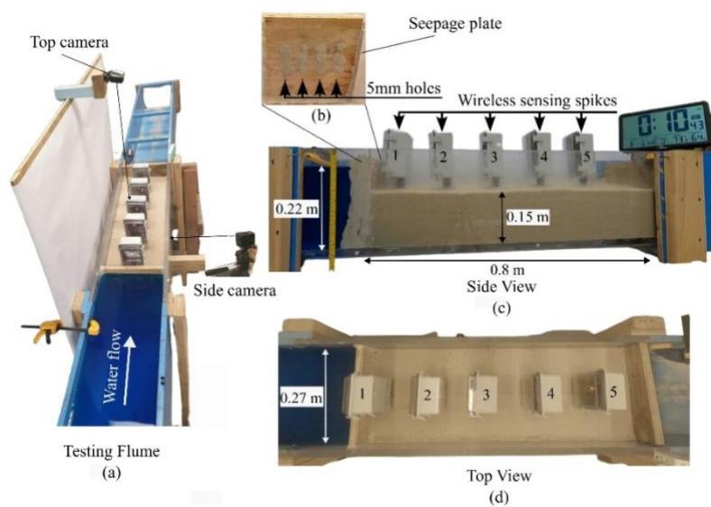
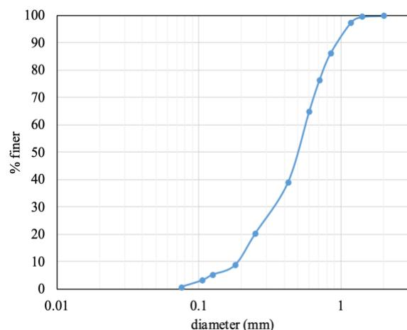
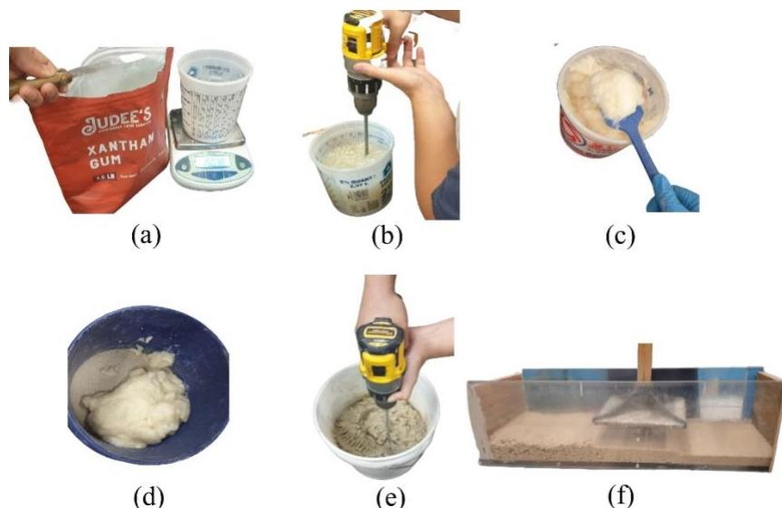
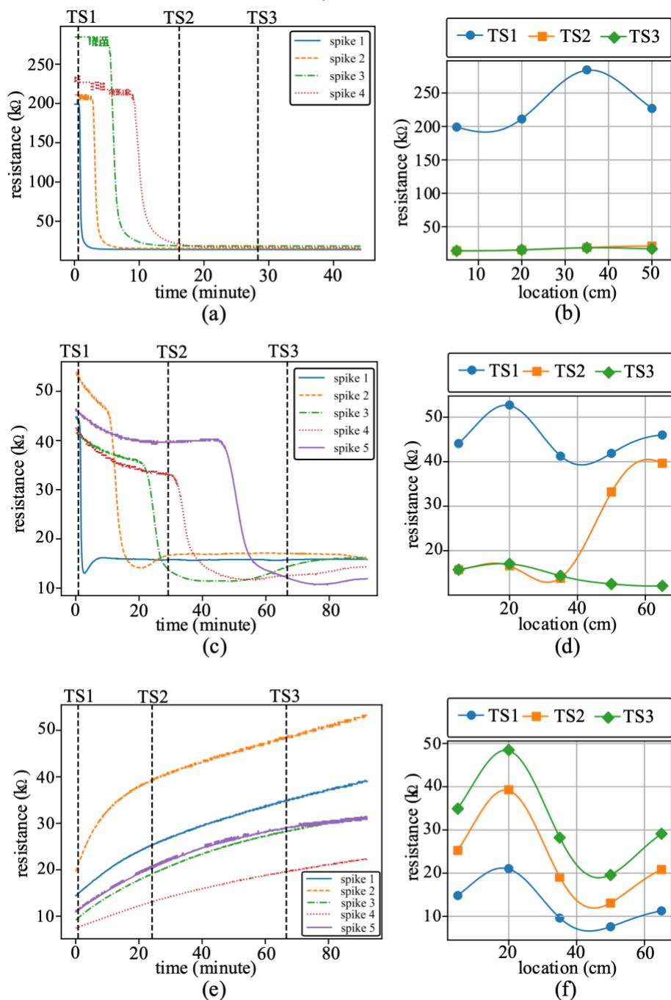
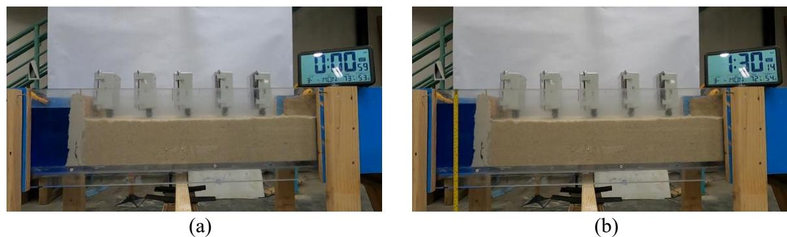
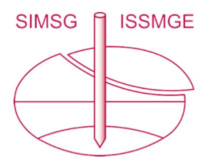

{0}------------------------------------------------

# **Mapping Seepage Flow in Untreated and Biopolymer-Treated Soils Using Wireless Sensing Spikes for Electrical Conductivity Assessment**

**Ayman Mokhtar Nemnem, S.M.ASCE1 , Puja Chowdhury2 , Clay Crews3 , Austin R.J. Downey4 , Jason D. Bakos5 , M. Sadik Khan6 , M. Hanif Chaudhry, Dist.M.ASCE7 , and Jasim Imran, F.ASCE8**

1Dept. of Civil and Environmental Engineering, University of South Carolina, 300 Main St., Columbia, SC 29208. ORCID: <https://orcid.org/0009-0003-0238-4394>; Email: [amokhtar@email.sc.edu](mailto:amokhtar@email.sc.edu)

2Dept. of Mechanical Engineering, University of South Carolina, 300 Main St., Columbia, SC 29208; Email: [pujac@email.sc.edu](mailto:pujac@email.sc.edu)

3Dept. of Computer Science and Engineering, University of South Carolina, Columbia, SC 29208; Email: [jccrews@email.sc.edu](mailto:jccrews@email.sc.edu)

4Dept. of Mechanical Engineering and Dept. of Civil and Environmental Engineering, University of South Carolina, 300 Main St., Columbia, SC 29208; Email: [austindowney@sc.edu](mailto:austindowney@sc.edu)

5Dept. of Computer Science and Engineering, University of South Carolina, Columbia, SC 29208; Email: [jbakos@cse.sc.edu](mailto:jbakos@cse.sc.edu)

6Dept. of Civil and Environmental Engineering, Jackson State University, Jackson, MS 39217; Email: [sadik.khan@jsums.edu](mailto:sadik.khan@jsums.edu)

7Dept. of Civil and Environmental Engineering, University of South Carolina, 300 Main St., Columbia, SC 29208. ORCID: https://orcid.org/0000-0003-1311-8844; Email: [chaudhry@sc.edu](mailto:chaudhry@sc.edu)

8Dept. of Civil and Environmental Engineering, University of South Carolina, 300 Main St., Columbia, SC 29208. (Corresponding author). ORCID: https://orcid.org/0000-0002-3479-3905; Email: [imran@sc.edu](mailto:imran@sc.edu)

## **ABSTRACT**

Levees are essential for protecting lives and property from flooding, with over 90% of the USA consisting of earthen embankments averaging 60 years of age. Their failure can result in catastrophic damage and fatalities, emphasizing the need for sustainable treatments, such as biopolymers, to improve soil stability and reduce seepage. Xanthan Gum (XG) biopolymers have shown promise in enhancing soil performance, offering a natural, environmentally friendly alternative for levee reinforcement. This study investigates the effectiveness of XG biopolymers in seepage control, alongside the capability of wireless sensing spikes in monitoring soil moisture dynamics. Laboratory experiments were conducted on untreated sand, silica flour-treated sand, and 0.5% XG-treated sand to evaluate moisture propagation and retention under controlled infiltration conditions in a flume. Post-processed data provided spatial and temporal variations using Gaussian process regression (kriging). The results indicate that even a low concentration of 0.5% XG significantly reduces seepage, enhancing soil stability and its suitability for levees and dams. Additionally, wireless sensing spikes, potentially drone-deployable, demonstrated an efficient and autonomous solution for real-time levee monitoring. These sensors provide critical data to support maintenance efforts, identify vulnerable sections, and issue timely warnings to prevent failures.

{1}------------------------------------------------

### **INTRODUCTION**

Biopolymers, particularly Xanthan Gum (XG), have gained considerable attention in geotechnical engineering for their ability to improve soil stability and moisture retention. XG is a biopolymer derived from bacterial fermentation, recognized for its high viscosity and ability to create strong gels when mixed with water (Zhang & Liu, 2023; Garcı́a-Ochoa et al., 2000). These gels effectively fill soil pores, significantly reducing permeability and hydraulic conductivity—up to four orders of magnitude lower than untreated soils (M. Lee et al., 2023). Due to its costeffectiveness, XG has been widely utilized in the food processing and petroleum industries (Zhang & Liu, 2023). The unique properties of XG make it a highly promising candidate for soil stabilization, especially in the context of critical infrastructure like levees and dams.

A growing body of research supports the use of biopolymers like XG in soil stabilization. Ko & Kang (2018) conducted experimental studies on the stability of levees reinforced with XGtreated soil, demonstrating notable improvements in soil strength and erosion resistance. Abdelaziz et al. (2019) investigated the adaptability of biopolymer-stabilized earth materials, highlighting their resilience in diverse environmental conditions. In another study, S. Lee et al. (2019) examined the tri-axial shear behavior of XG-treated sand, revealing enhanced shear strength and improved deformation characteristics. Chang et al. (2020) provided a comprehensive review of biopolymers in geotechnical engineering, emphasizing their potential for sustainable soil treatment. More recent studies by Kotey et al. (2024) and Czapiga et al. (2024) have further explored the optimal water content for the XG biopolymers and the breaching behavior of biopolymer-treated soils, offering critical insights into their practical applications in levee and dam management.

Here, we present results from laboratory experiments that track moisture propagation through various soil mixtures using five wireless sensor packages developed at the University of South Carolina. This comparative analysis investigates moisture infiltration and retention across different treatment conditions, including untreated sand, sand treated with silica flour, and XG biopolymer. The findings aim to shed light on the effectiveness of these treatments in moisture retention, ultimately contributing to enhanced soil strength and resilience in critical infrastructure like dams and levees.

#### **METHODOLOGY**

**Design and Development of Sensing Spike.** The development of the wireless sensing spike packages was informed by the need to measure conductivity across soil layers in levee and dam infrastructure. Each sensing spike was designed as a modular, low-cost, and durable solution for real-time moisture monitoring (Chowdhury et al., 2024). The sensing spikes are an open-sourced project available on GitHub (ARTS-Lab, n.d.). The core of each spike consists of two concentric brass tubes—an outer and inner tube—separated by an insulating ABS plastic layer. This configuration allows the spike to function as a resistance sensor, with the conductivity between the tubes providing a direct measurement of the moisture content in the surrounding soil.

The resistance is determined using a voltage divider circuit, where the sensing spike functions as one resistor ( $R_1$ ), and a 6.8 k $\Omega$  resistor ( $R_2$ ) serves as the second. The output voltage ( $V_{out}$ ) and corresponding timestamps are processed by an Arduino Nano microcontroller and wirelessly transmitted to a base station via an nRF24L01+ transceiver module, enabling real-time data collection from multiple sensing spikes. The resistance of the soil ( $R_1$ ) is then calculated using

{2}------------------------------------------------

the formula:  $R_1 = R_2 \cdot \frac{V_{\text{in}-V_{\text{out}}}}{V_{\text{out}}}$ . This resistance is inversely related to the soil's conductivity; higher moisture content reduces resistance, leading to increased conductivity and a corresponding rise in  $V_{\text{out}}$ .

**Laboratory Testing Setup.** A rectangular soil sample, measuring 0.8 m in length, 0.27 m in width, and 0.15 m in height, was constructed within the transparent central section of a 4.9 m long flume at the Hydraulics Laboratory, University of South Carolina (Figure 1a). Two plates bound the sample; the right plate stabilizes the soil sample, while the left seepage plate has 5 mm holes (Figure 1b), positioned 60 mm above the flume bottom, to allow water to seep into the soil sample. Water is infiltrated through the drainage plate under a constant hydraulic head. A side weir was used to maintain the constant head (22 cm) throughout the entire duration of the experiments.

Five wireless sensing spikes were strategically placed along the mid-width of the sample (13.5 cm). The spikes were positioned at distances of 5 cm, 20 cm, 35 cm, 50 cm, and 65 cm from the seepage plate, corresponding to locations [x1 to x5]. Blue dye was applied to the water flow, and two cameras (top and side), were used to record the moisture propagation. Figure 1 presents the laboratory setup, showing the testing flume, wireless sensing spikes, camera placements, seepage plate, and top and side views of the soil sample.

The experiments considered various soil compositions, including untreated sand, sand treated with silica flour, and sand treated with XG biopolymer. The sand used in these experiments had a specific grain size distribution, characterized by D10 = 0.15 mm, D50 = 0.5 mm, and D90 = 1.0 mm. Figure 2 presents the grain size distribution curve for the sand used in the experiments. Silica flour is a finely ground silica sand with particles smaller than 75 microns. The untreated sand served as the base case for the study (experiment 1), against which two other conditions were compared: sand treated with 10% silica flour by mass (experiment 2) and sand treated with 0.5% XG biopolymer by mass (experiment 3).

**Figure 1. Laboratory setup for the soil moisture seepage experiments, showing the testing flume, wireless sensing spikes, camera placements, seepage plate, and top and side views of the soil sample.**

{3}------------------------------------------------

**Figure 2. Grain size distribution curve for the sand used in the experiments.**

**Sample Preparation and Mixing Procedure.** The untreated sand sample was prepared by mixing 60 kilograms of dry sand with 3 liters of water, achieving a 5% moisture content. The mixture was divided into smaller batches and mixed using an electric cement mixer to ensure uniform moisture distribution throughout the sample. For the silica flour-treated sample, 5.5 kilograms of silica flour (10% by weight) was mixed with 55.5 kilograms of dry sand. This mixture was then combined with 3.8 liters of water, resulting in a 7% moisture content.

The biopolymer-treated mixture was prepared using the wet mixing technique, where the biopolymer was first dissolved in water before being applied to sand (Moghal & Vydehi, 2021; Kotey et al., 2024). The preparation involved 57 kilograms of sand, 2.9 liters of water (5% by weight), and 290 grams of powder XG (0.5% by weight). The quantities were divided into two batches to ensure thorough mixing and uniform distribution. The XG biopolymers were gradually added to the water with continuous stirring until a uniform, dense, gel-like consistency was achieved (Figure 3a to 3c). This gel was then thoroughly mixed with the dry sand (Figure 3d and 3e) ensuring an even distribution of the XG biopolymer throughout the soil.

Once prepared, both treated and untreated sand samples were placed in 5 cm thick layers within the flume. Each layer was compacted using 10 blows from a 7.5-kg hand tamper dropped from a height of 15 cm (Figure 3f). This compaction method was selected based on its effectiveness in achieving the maximum dry density of the samples, as demonstrated in previous studies (O'Donal, 2023).

The 5% initial moisture content, for both the sand-only and XG biopolymer-treated samples, and the 7% for the silica flour-treated sample, represent the optimal water content for each mixture, at which the soil achieves its maximum dry density. This was determined through a series of Standard Proctor tests (ASTM, 2021), which involves compacting the soil at various moisture levels to find the point of maximum compaction. The selected moisture content values were based on previous studies and testing (O'Donal, 2023; Kotey et al., 2024).

**Data processing.** The ordinary Kriging method was employed to interpolate data across all spatial points (Rouhani & Wackernagel, 1990). The positions of the wireless sensing spike packages are represented by coordinates  $[X] = [(x_1), (x_2), \dots, (x_5)]$ , and the corresponding voltage measurements are denoted as  $V = [v_1, v_2, \dots, v_5]$ .

The kriging process was implemented using the PyKrige library (GeoStat-Framework, 2024), which trained Gaussian variogram models based on the data, including sensor locations and

{4}------------------------------------------------

voltage readings. To ensure physically realistic results, a boolean operator was applied to the estimated voltages, setting any inferred values below zero to zero (V < 0 → 0).

**Figure 3. XG Biopolymer Mixing Procedure: (a) Weighing the biopolymer powder, (b)** 

**Gradually mixing the biopolymer powder with water, (c) The gel-like consistency achieved after mixing, (d and e) Adding and mixing the gel-like biopolymer slurry with dry sand, (f) Compacting the treated mixture in 5 cm layers within the testing flume.**

## **RESULTS AND DISCUSSIONS**

The moisture sensing experiments demonstrated the effectiveness of wireless sensing spikes in monitoring soil moisture across three soil compositions: (a) untreated sand, (b) sand treated with 10% silica flour, and (c) sand treated with 0.5% Xanthan Gum (XG) biopolymer. These experiments revealed distinct moisture propagation behaviors and conductivity patterns for each soil type. Table 1 summarizes the resistance results at three key timestamps (TS1–TS3), while Figure 4 visually presents these findings. Panels (a, c, e) depict the variation in resistance over time for each soil composition, and panels (b, d, f) show the corresponding 1D kriging analysis of moisture distribution across spike locations at TS1, TS2, and TS3.

For the untreated sand sample (Figure 4a), the test lasted approximately 44.2 minutes. Initial resistance across spikes was averaged at 231.3 kΩ and steadily decreased over time, indicating moisture propagation, until reaching full saturation at each spike location, with resistance values stabilizing at approximately 16.5 kΩ. This resistance is inversely related to the soil's conductivity; as moisture content increases, resistance decreases. The first spike reached saturation after 9 minutes, with the remaining spikes following between 14 and 44.2 minutes. Due to a sensor malfunction, Spike 5 did not produce results for this test. Table 1 provides detailed resistance readings at key timestamps: at TS 1 (35 s), the resistance readings were relatively high, with Spike 1 recording 190.9 kΩ, Spike 2 at 209.9 kΩ, Spike 3 at 296.1 kΩ, and Spike 4 at 228.2 kΩ. By TS 3 (1700 s), moisture propagation led to significantly lower resistance, with Spike 1 at 13.9 kΩ and Spike 4 at 16.9 kΩ, indicating near-complete saturation. Figure 4b shows these trends, illustrating the spatial distribution of moisture at the three timestamps through 1D kriging analysis.

{5}------------------------------------------------

For the 10% silica flour-treated sand sample (Figure 4c), the initial average resistance across spikes was lower at 36.8 kΩ. The test lasted 92 minutes, during which resistance gradually declined at a slower rate than in the untreated soil sample, indicating a more controlled and gradual moisture infiltration. By the end of the test, near-saturation was achieved, with an average final resistance of 14.5 kΩ across all spikes. Similar to the untreated sand, the decreasing resistance values confirm increasing soil moisture content and the approach to full saturation. Table 1 provides resistance values at key timestamps: at TS 1 (50 s), the resistance values ranged from 32.8 kΩ to 43.0 kΩ. By TS 3 (4005 s), moisture propagation resulted in lower resistance values, with spikes showing progressive decline from the nearest to the farthest spike. Figure 4d presents the corresponding kriging analysis, illustrating the spatial distribution of moisture at three key timestamps (TS1–TS3).

In contrast, the 0.5% XG biopolymer-treated sand exhibited distinct behavior (Figure 4e). Table 1 provides detailed resistance readings at key timestamps: at TS 1 (45 s), resistance ranged from 6.4 kΩ to 22.1 kΩ across the five spikes. By TS 3 (4000 s), resistance had increased, with spikes recording values between 23.1 kΩ and 47.3 kΩ. Figure 4f illustrates the corresponding kriging results, showing maximum resistance levels by TS 3.

This trend contrasts with the untreated and silica flour-treated samples, where resistance decreased over time due to progressive moisture infiltration. The initially lower resistance values in the XG-treated soil (averaging 12.7 kΩ) suggest higher conductivity at the start of the test, which can be attributed to the ionic components of XG. When mixed with water, XG releases ions into the pore water, increasing the ionic concentration and enhancing electrical conductivity (Mallick & Sarkar, 2000). Additionally, the gel-like matrix of XG facilitates ionic connectivity, further contributing to the initially high conductivity.

**Table 1. Resistance (kΩ) measurements for the five wireless sensing spike packages at the three TS for the untreated sand, the 10% silica flour-treated, and 0.5% XG biopolymertreated sand tests**

| Time stamp (s)  | Condition/Sample Type | Spike 1 | Spike 2 | Resistance (k Ω) Spike 3 | Spike 4 | Spike 5 |
|-----------------|-----------------------|---------|---------|--------------------------|---------|---------|
| TS 1 Untreated  | -                     | 190.940 | 209.902 | 296.194                  | 228.250 |         |
| TS 2 sand       | -                     | 14.069  | 15.007  | 20.445                   | 22.167  |         |
| TS 3            | -                     | 13.906  | 15.007  | 20.165                   | 16.978  |         |
| TS 1            | -                     | 36.908  | 43.073  | 32.808                   | 33.504  | 37.801  |
| TS 2 flour      | -                     | 15.775  | 16.572  | 13.847                   | 29.542  | 36.148  |
| TS 3            | -                     | 15.775  | 16.996  | 14.294                   | 13.006  | 12.673  |
| TS 1            | -                     | 14.721  | 22.167  | 9.211                    | 6.460   | 10.859  |
| TS 2 biopolymer | -                     | 21.085  | 39.785  | 18.417                   | 10.338  | 18.500  |
| TS 3            | -                     | 29.114  | 47.386  | 23.139                   | 16.544  | 17.656  |

{6}------------------------------------------------

**Figure 4. Moisture test results for three soil compositions: (a, b) untreated sand, (c, d) sand treated with 10% silica flour, and (e, f) sand treated with 0.5% Xanthan Gum (XG) biopolymer. Panels (a), (c), and (e) display resistance variations over time, while panels (b), (d), and (f) show the 1D kriging interpolation of resistance data at three key timestamps (TS1–TS3).**

{7}------------------------------------------------

As the experiment progressed, resistance increased in the XG biopolymer-treated soil, indicating that XG's hydrophilic nature retained moisture within the soil matrix, thereby restricting further seepage (M. Lee et al., 2023). This limited water movement, along with the gradual depletion of free ions, led to a steady rise in resistance and a progressive decline in conductivity. Over time, drying and consolidation processes further amplified this trend, reducing moisture content and, consequently, the soil's ability to conduct electricity (Moghal & Vydehi, 2021). The retention of moisture within the soil matrix limited water propagation, causing localized drying, particularly in regions with minimal water movement, as demonstrated by the before-and-after images in Figure 5.

As the soil consolidated over time, the reduction in pore space further decreased the availability of free water for ion conduction. Since electrical conductivity is highly dependent on moisture content (Rhoades et al., 1976), the diminished free water reduced ion mobility, leading to a steady increase in resistance. Additionally, material polarization within the biopolymer matrix may have further hindered ion mobility (Downey et al., 2017). This effect is evidenced by the resistance measurements in Figure 4e, which show a continuous increase in resistance throughout the test. The combined effects of moisture retention, soil consolidation, and material polarization highlight the biopolymer's influence on soil behavior and its potential as an effective seepage control measure.

**Figure 5. Condition of the 0.5% XG biopolymer-treated sand sample before (a) and after (b) the test, showing no water propagation, demonstrating the biopolymer's effectiveness in preventing seepage.**

Each soil composition exhibited distinct moisture propagation and resistance patterns. The untreated and silica flour-treated sands showed a steady decrease in resistance over time, indicating moisture infiltration and eventual saturation. In contrast, the XG-treated soil displayed a unique behavior, with initially low resistance due to ionic release, followed by a gradual increase over time. This behavior suggests that XG's moisture retention capacity restricted seepage, leading to localized drying, while material polarization within the biopolymer matrix further contributed to the increasing resistance. The silica flour-treated soil demonstrated hybrid behavior, exhibiting gradual moisture propagation with lower final saturation levels, highlighting the variability in soil responses based on treatment type. Overall, these results highlight the effectiveness of XG biopolymers in reducing seepage and enhancing soil stability, making them a promising solution for improving the resilience of critical infrastructure such as levees and dams. Additionally, the findings reinforce the capability of wireless sensing spikes in accurately monitoring soil moisture dynamics, providing real-time data for proactive maintenance and early-warning systems.

{8}------------------------------------------------

#### **CONCLUSION**

This study demonstrated the effectiveness of Xanthan Gum (XG) biopolymers in reducing seepage and enhancing soil stability, alongside the capability of wireless sensing spikes in monitoring soil moisture dynamics. Laboratory tests on untreated sand, sand treated with 10% silica flour, and sand treated with 0.5% XG biopolymer revealed distinct moisture propagation and resistance trends. Laboratory tests on untreated sand, sand treated with 10% silica flour, and sand treated with 0.5% XG biopolymer revealed distinct moisture propagation and resistance trends.

The XG-treated soil exhibited low initial resistance due to ionic release, followed by a gradual increase, indicating moisture retention and restricted seepage. In contrast, untreated and silica flour-treated sands showed a steady resistance decline, reflecting gradual moisture infiltration and full saturation. These findings suggest that even a 0.5% XG concentration can significantly improve soil stability, making it a viable solution for levee and dam reinforcement.

Additionally, wireless sensing spikes effectively captured real-time resistance trends, demonstrating their potential for continuous levee monitoring. However, calibration is needed to correlate resistance with actual saturation levels.

Future research should investigate the impact of varying XG concentrations on seepage control, the long-term stability and durability of XG-treated soils, and the potential for integrating biopolymers with other soil stabilization techniques, to enhance levee performance under diverse environmental conditions. Additionally, extended field studies are essential to validate these laboratory findings, assess real-world performance, and determine the practical feasibility of biopolymer treatments in large-scale levee and dam applications.

## **ACKNOWLEDGEMENTS**

We gratefully acknowledge funding support from the National Science Foundation (Award #2152896) and from the US Army Engineer Research and Development Center (ERDC).

#### **REFERENCES**

Abdelaziz, S., Gersappe, D., & Rafailovich, D. (2019). *Biopolymer-Stabilized Earth Materials for Resilient and Adaptable Infrastructures*. ARTS-Lab. (n.d.). *Smart Penetrometer with Edge Computing and Intelligent Embedded Systems*. https://github.com/ARTS-Laboratory/Smart-Penetrometers-with-Edge-Computing-and-Intelligent-Embedded-Systems ASTM. (2021). *Test Methods for Laboratory Compaction Characteristics of Soil Using Standard Effort (12,400 ft-lbf/ft3 (600 kN-m/m3))*. ASTM International. https://doi.org/10.1520/D0698-12R21 Chang, I., Lee, M., Tran, A. T. P., Lee, S., Kwon, Y.-M., Im, J., & Cho, G.-C. (2020). Review on biopolymer-based soil treatment (BPST) technology in geotechnical engineering practices. *Transportation Geotechnics*, *24*, 100385. https://doi.org/10.1016/j.trgeo.2020.100385 Chowdhury, P., Crews, J., Mokhtar, A., Oruganti, S. D. R., Van Wyk, R., Downey, A. R., Flemming, M., Bakos, J. D., Imran, J., & Khan, S. (2024). Distributed real-time soil saturation assessment in levees using a network of wireless sensor packages with

{9}------------------------------------------------

conductivity probes. *Proceedings of the ASME 2024 International Mechanical Engineering Congress and Exposition*, *IMECE2024-145950*.

Czapiga, M. J., Kotey, E., Elalfy, E., Nkiri, O.-N., Viparelli, E., & Chaudhry, M. H. (2024). *Laboratory Investigation on the Breaching of Biopolymer-Treated Dams and Embankments*. World Environmental and Water Resources Congress 2024. Downey, A., D'Alessandro, A., Ubertini, F., Laflamme, S., & Geiger, R. (2017). Biphasic DC measurement approach for enhanced measurement stability and multi-channel sampling of self-sensing multi-functional structural materials doped with carbon-based additives. *Smart Materials and Structures*, *26*(6), 065008. https://doi.org/10.1088/1361- 665X/aa6b66 Garcı́a-Ochoa, F., Santos, V. E., Casas, J. A., & Gómez, E. (2000). Xanthan gum: Production, recovery, and properties. *Biotechnology Advances*, *18*(7), 549–579. https://doi.org/10.1016/S0734-9750(00)00050-1 GeoStat-Framework. (2024). *PyKrige Documentation*. https://geostatframework.readthedocs.io/\_/downloads/pykrige/en/v1.5.0/pdf Ko, D., & Kang, J. (2018). Experimental Studies on the Stability Assessment of a Levee Using Reinforced Soil Based on a Biopolymer. *Water*, *10*(8), 1059. https://doi.org/10.3390/w10081059 Kotey, E., Czapiga, M. J., Nkiri, O.-N., Chaudhry, H., & Viparelli, E. (2024). *Characterizing Optimum Water Content of Biopolymer-Treated Sand*. World Environmental and Water Resources Congress 2024. Lee, M., Chang, I., Park, D.-Y., & Cho, G.-C. (2023). Strengthening and permeability control in sand using Cr3+-crosslinked xanthan gum biopolymer treatment. *Transportation Geotechnics*, *43*, 101122. https://doi.org/10.1016/j.trgeo.2023.101122 Lee, S., Im, J., Cho, G.-C., & Chang, I. (2019). Tri-Axial Shear Behavior of Xanthan Gum Biopolymer-Treated Sand. *GSP 309*. Geo-Congress 2019. Mallick, H., & Sarkar, A. (2000). An experimental investigation of electrical conductivities in biopolymers. *Bulletin of Materials Science*, *23*(4), 319–324. https://doi.org/10.1007/BF02720090 Moghal, A. A. B., & Vydehi, K. V. (2021). State-of-the-art review on efficacy of xanthan gum and guar gum inclusion on the engineering behavior of soils. *Innovative Infrastructure Solutions*, *6*(2), 108. https://doi.org/10.1007/s41062-021-00462-8 O'Donal, H. (2023). *Impact of Dam Height and Grain Size Distribution on Breaching of Noncohesive Dams Due to Overtopping* [Masters, University of South Carolina]. https://scholarcommons.sc.edu/etd/7472 Rhoades, J. D., Raats, P. A. C., & Prather, R. J. (1976). Effects of Liquid‐phase Electrical Conductivity, Water Content, and Surface Conductivity on Bulk Soil Electrical Conductivity. *Soil Science Society of America Journal*, *40*(5), 651–655. https://doi.org/10.2136/sssaj1976.03615995004000050017x Rouhani, S., & Wackernagel, H. (1990). Multivariate geostatistical approach to space-time data analysis. *Water Resources Research*, *26*(4), 585–591. Zhang, J., & Liu, J. (2023). A Review on Soils Treated with Biopolymers Based on Unsaturated Soil Theory. *Polymers*, *15*(22), 4431. https://doi.org/10.3390/polym15224431

{10}------------------------------------------------

# INTERNATIONAL SOCIETY FOR SOIL MECHANICS AND GEOTECHNICAL ENGINEERING

*This paper was downloaded from the Online Library of the International Society for Soil Mechanics and Geotechnical Engineering (ISSMGE). The library is available here:*

*<https://www.issmge.org/publications/online-library>*

*This is an open-access database that archives thousands of papers published under the Auspices of the ISSMGE and maintained by the Innovation and Development Committee of ISSMGE.*

*The paper was published in the proceedings of the 2025 International Conference on Bio-mediated and Bioinspired Geotechnics (ICBBG) and was edited by Julian Tao. The conference was held from May 18 th to May 20th 2025 in Tempe, Arizona.*