{0}------------------------------------------------

# Full length article

# *��*(*��*) Local Eigenvalue Modification Procedure for real-time updating of structural digital twins with sub-millisecond-latency performance

Emmanuel A. Ogunniyia,b, Austin R.J. Downeya,b,b,\*, Pete Avitabilec,b, Jacob Dodsond,b, Adriane G. Mourae,b

# A R T I C L E I N F O

Communicated by Y. Lei

Dataset link: Paper 2026 O(n) Digital Twin Upd ating (Original data)

*Keywords:*

Structural health monitoring

Digital twin

Reduced-order modeling

Eigenvalue modification

Real-time model updating

Modal analysis

Finite element analysis

# A B S T R A C T

Real-time structural digital twins require rapid and reliable model updating to maintain accuracy as the physical system evolves, particularly in high-rate dynamic environments where microsecond- to millisecond-scale decisions are critical. Traditional finite element (FE) based updating methods rely on repeatedly solving the Generalized Eigenvalue (GE) Problem whose  $O(n^3)$  computational cost prevents deployment in real-time digital-twin frameworks for even moderately sized structural models. This work numerically validates a two-dimensional extension of the Local Eigenvalue Modification Procedure (LEMP) as a reduced-order, physics-based updating strategy that enables fast model updating of structural digital twins without resolving the full eigenvalue problem. Using a steel plate modeled with bilinear quadrilateral finite elements, a systematic mesh-convergence and modal-error study identifies a 25-node reduced-order model (ROM) that maintains about  $<10\%$  modal-frequency error relative to a high-fidelity reference mesh. Localized stiffness changes are introduced across the plate to emulate evolving structural states, and comparisons between the Generalized Eigenvalue Procedure (GEP) and LEMP show that mode seven (7) offers a more reliable accuracy for real-time updating. Across all introduced local changes, LEMP maintains frequency-prediction errors below 10% while avoiding recomputing global eigenvalues. Timing analyses demonstrate that LEMP achieves update latencies as low as 0.46 ms for the 25-node model and remains below 2 ms at 169 nodes, offering speedups exceeding  $2500\times$  relative to GEP. Empirical scaling analysis confirms near-linear ( $O(n)$ ) algorithmic complexity for LEMP compared to the cubic ( $O(n^3)$ ) scaling of GEP. These results establish LEMP as a computationally efficient and numerically benchmarked mechanism for real-time digital-twin updating of 2D structural systems, and provide a computational basis toward integrating physics-based methods into high-rate structural model updating, active control, and edge-deployed digital-twin applications.

https://doi.org/10.1016/j.ymssp.2026.114451

Received 6 March 2026; Received in revised form 5 May 2026; Accepted 15 May 2026

0888-3270/© 2026 The Authors. Published by Elsevier Ltd. This is an open access article under the CC BY license (http://creativecommons.org/licenses/by/4.0/).

a *Department of Mechanical Engineering, University of South Carolina, Columbia, SC, USA*

b *Department of Civil and Environmental Engineering, University of South Carolina, Columbia, SC, USA*

c *Structural Dynamics and Acoustic Systems Laboratory, University of Massachusetts Lowell, USA*

d *Air Force Research Laboratory, USA*

e *Applied Research Associates Emerald Coast Division, Niceville, FL, USA*

\* Corresponding author.

*E-mail address:* austindowney@sc.edu (A.R.J. Downey).

{1}------------------------------------------------

**Fig. 1.** Digital twin updating framework illustrating the bidirectional data exchange between the physical and virtual spaces for real-time model updating.

#### **1. Introduction**

Real-time model updating is a foundational requirement for modern digital twins [1], in which a computational model must continually assimilate data from its physical counterpart to maintain an accurate virtual representation of structural behavior. In high-rate dynamic environments, even small discrepancies between the physical system and its virtual model can rapidly accumulate [2], thereby degrading the twin's predictive capability and introducing operational risk. Digital-twin updating can be achieved through direct approaches, such as explicitly observing and incorporating physical changes. However, indirect methods are particularly useful for structural systems because they enable the twin to infer internal changes by comparing sensor measurements with model-predicted responses. Through this indirect data-assimilation process, the digital twin identifies discrepancies between measured and simulated responses and subsequently updates the underlying physics-based model to keep the virtual representation synchronized with the evolving state of the physical structure.

Physics-based models are highly sought after for use as the virtual representation of the physical counterpart within the digital twin framework because they encode the governing mechanics of the system, enabling the digital twin framework to maintain and update its virtual representation rather than merely replaying past observations [3]. Fig. 1 depicts a digital-twin framework, following the definition provided in the United States National Academy of Engineering report [1], which includes a physicsbased virtual representation connected to its physical counterpart through dynamic, bidirectional data exchange. Physics-based approaches span several categories, including finite element (FE) analysis frameworks, lumped-mass or reduced-order structural models, analytical beam and plate theories, and multibody dynamics formulations [4]. Finite element models (FEMs), in particular, provide a physically interpretable representation of stresses, deformations, boundary conditions, and load paths, which allows the virtual representation to support prognostics, evaluate retrofits, and test hypothetical repairs or configuration changes; capabilities that purely data-driven models cannot reliably deliver. In contrast, data-driven approaches tend to mirror only the statistical patterns present in their training sets and struggle when confronted with conditions not represented in those datasets. Moreover, field deployments rarely yield labeled data, making online retraining or correcting data-driven models difficult, if not effectively impossible. While physics-informed machine learning (PIML) can incorporate governing equations during training to improve model generalization [5], the resulting surrogate is still ultimately a data-driven representation. As such, PIML inherits the same fundamental limitations: the developed models are constrained by the training distribution, cannot be robustly updated online without labeled field data, and lack the explicit mechanistic structure needed for prognostics, repair evaluation, and scenario exploration.

Traditional approaches have primarily relied on applying an error minimization technique to update the FEM of a structure by altering the model to reduce the error between a measured signal or structural parameter and the model's response [6]. Within this context, it is common to minimize the error between the model and measured response in the modal domain, a process that requires solving the full (and computationally expensive) Generalized Eigenvalue Procedure (GEP) [7]. Rahai et al. [8] introduced a singular value decomposition (SVD) based FEM updating method for structural damage detection, but did not consider the computational limitations of the approach. Weng et al. [9] reviewed dynamic substructuring methods for efficient model updating and damage detection, but their limitations include the high number of iterations and the long convergence time required for large-scale systems. Sengupta and Chakraborty [10] provide a review of model reduction and substructuring techniques for FEM model updating, demonstrating their efficiency in handling incomplete measurements; however, their limitation lies in the high computational cost, as many methods still require repeated eigenvalue decompositions and convergence steps in large-scale systems. Moravej et al. [11] conducted a comprehensive review of FE model updating in civil structural engineering and highlighted the need to improve convergence accuracy and reduce computational intensity without compromising either.

Because the GEP at the core of error-minimization-based FEA model updating scales as an  $O(n^3)$  computation, GEP is fundamentally too slow for real-time digital-twin operation. Recent work has attempted to overcome these limitations through

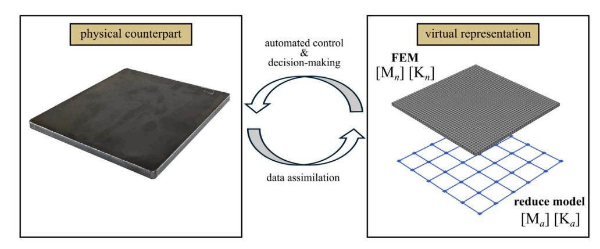

{2}------------------------------------------------

numerical innovations and hybrid physics-based strategies. Li et al. [12] proposed a reduced-order FE model updating framework that solves the generalized eigenvalue (GE) problem for repeated modal components, leveraging incomplete mode information to achieve high accuracy with far lower computational costs; however, the process still requires an expensive offline basis construction stage for complex structures. Wang et al. [13] showed that GPU acceleration and parallel processing only reduce, but cannot eliminate the fundamental  $O(n^3)$  complexity of GEP. Giagopoulos et al. [14] developed a hybrid framework combining vibration data with FE model updating to accurately predict fatigue damage, but it has the limitation that stochastic optimization requires several days of computation, limiting its real-time applicability. Advances in GPU-accelerated eigenvalue solvers have reduced GEP computation times (but not algorithmic complexity) by 60%, yet still require more than four seconds for systems exceeding 1000 degrees of freedom [15,16]. While these methods remain rooted in system-level mass and stiffness matrices, their computational demands can still affect rapid or continuous adaptations.

Hybrid approaches combining machine learning with physics-based models show promise for real-time model updating. Particularly, when they focus on enabling computational efficiency and without constraining scalability, they can achieve 15.7% reconstruction error compared to 69% for traditional CNN models alone, though their training comes with significant computational costs [17,18]. Contemporary alternatives to traditional GEP include compressed sensing, neural surrogate-assisted updating, and sparse subspace tracking schemes tailored for parameter refinement. Physics-informed architectures also yield notable gains in update robustness but require extensive training datasets and still generalize poorly under changing conditions. Real-time sparse reconstruction strategies offer competitive performance yet can introduce stability challenges under noisy measurements. Likewise, edge computing deployments face hardware constraints and latency limitations that currently hinder microsecond-scale applications [19]. Table 1 provides a qualitative analysis, highlighting computational complexity, accuracy trade-offs, and real-time capabilities of some current model updating techniques drawn from different studies under different problems, and are not directly comparable. Direct one-to-one qualitative comparison with these heterogeneous frameworks is outside the scope of the present algorithmic benchmark.

The authoring team has been working on the challenge of real-time model updating for systems operating in high-rate dynamic environments. Beginning with Dodson et al. [2], the groundwork was laid in defining requirements for sub-millisecond structural health monitoring in shock- and impact-dominated settings. Building on this foundation, Downey et al. [20] proposed an error-minimization technique conceptually similar to those discussed prior in this section, but still reliant on solving the full GEP. Quantitative analysis in that work showed that, while GEP-based solutions achieve  $> 95\%$  state-estimation accuracy, they consume roughly 90% of the computational time in frequency calculations (i.e., solving the GEP). Consequently, to meet the critical 1 ms real-time constraint for high-rate dynamics, the FE models considered were limited to  $\lesssim 23$  nodes; directly compromising estimation accuracy. Parallel strategies such as r-adaptive meshing with online FE regeneration and parallelization were also explored by the team [21], yet GEP remained the dominant factor slowing real-time model updating, with its  $O(n^3)$  scaling imposing prohibitive latency for high-rate dynamics.

To address the  $O(n^3)$  scaling of the GEP, the authors turned to model-order reduction through structural dynamic modification (SDM) [22], while also exploring the Local Eigenvalue Modification Procedure (LEMP) as a physics-based model updating strategy designed to locally modify the eigenstructure of a system in response to structural changes [23,24]. Unlike global approaches, such as GEP, LEMP isolates and updates only the affected regions of the model, thereby reducing computational expense to  $O(n)$ . Because LEMP is intended here as a replacement for repeated eigensolutions inside an otherwise unchanged FE updating loop, the GEP is used as the primary benchmark. This choice isolates the approximation error introduced by the local eigen-update itself, without conflating that error with differences in search strategy, training data, surrogate quality, or inverse-solver architecture. Our development pathway progressed in three stages: first, identifying the mathematical basis for localized changes and their projection into modal space [25]; second, building a dedicated LEMP solver capable of computing eigenvalue shifts and updated mode shapes without full re-computation [26]; and third, validating the 1D formulation for beam-like structures, where LEMP successfully captured localized stiffness changes while retaining modal accuracy and enabling real-time responsiveness [24,27]. Experimental validation of the 1D LEMP framework using measured data from the DROPBEAR testbed has been reported previously; this study is the extension of the local eigen-update formulation to 2D plate-type FE models. This work demonstrated that LEMP maintains physics-based rigor while achieving computational performance suitable for edge deployment [28], offering a unique combination of accuracy, speed, and deployability.

The present study develops a detailed framework for extending LEMP to 2D structures while preserving accuracy under sub-millisecond constraints, focusing on a reduced-order representation suitable for edge computing deployment. Additionally, by tracking the modes that consistently yield lower errors during each iteration of the estimation rather than treating all modes equally, this process identifies which mode carries the most reliable predictive information for real-time updates. The study begins by constructing an FE model using bilinear quadrilateral elements. A systematic mesh refinement analysis is conducted to ensure convergence and accuracy, yielding a 25-node reduced-order model (ROM) that balances computational efficiency and frequency resolution. Initially modeled as a free plate, the structure is transformed into a cantilevered system by applying displacement constraints to the degrees of freedom associated with five nodes along one edge. This boundary condition replicates support conditions commonly found in structural mounting configurations and provides a robust platform for simulating structural dynamics under localized disturbances.

To investigate LEMP's performance in capturing localized changes, the study introduces a sequential high-stiffness change of magnitude ( $1 \times 10^{10}$  N/m) at the out-of-plane ( $U_z$ ) degree of freedom of selected nodes. For each change, modal frequencies from mode 1 through mode 15 are computed using GEP and LEMP. The error between these results is then computed as a measure of LEMP's accuracy in tracking the influence of localized stiffness modifications. The analysis reveals that mode seven (7) consistently

{3}------------------------------------------------

**Table 1**

Qualitative description of some structural model updating techniques.

| Method            | Accuracy         | Speed                          | Real-time Capability | Limitations                                                                  |
|-------------------|------------------|--------------------------------|----------------------|------------------------------------------------------------------------------|
| GEP               | High (>95%)      | Slow (O(n 3 ))      | Limited (≤25 nodes)  | Global recomputation; not feasible for real-time in large-scale systems [15] |
| SVD-based         | High (>90%)      | Moderate (O(mn 2 )) | No timing studies    | High iteration and convergence time for large systems [8,29]                 |
| Substructuring    | Moderate         | Slow                           | Poor convergence     | Inefficient for large-scale systems; high computation time [9,10]            |
| Hybrid ML-Physics | Moderate (84.3%) | Fast                           | Limited by training  | Requires large, high-quality datasets; limited robustness [17]               |
| LEMP (1D)         | High (>90%)      | Fast (O(n))                    | Yes (<1 ms)          | Previously applied only to 1D beam structures [24]                           |

has the lowest error across all nodes. The timing analysis quantifies LEMP's computational advantages under specific hardware constraints (Intel® Core™ i7-10700K CPU @3.80 GHz processor, 64 GB RAM, standard workstation configuration). LEMP achieves eigen updates in 0.46 ms per localized change (25-node system), versus 9.03 ms for GEP, resulting in a 20x speedup. Scaling analysis demonstrates LEMP maintains sub-millisecond performance up to 100 nodes (0.691 ms) while GEP exceeds real-time constraints at 36 nodes (24.529 ms). These benchmarks suggest LEMP is suitable for edge computing environments where millisecond latency is critical for high-rate dynamic monitoring.

The contributions of this work are multifaceted. (1) The study expands the domain of applicability of LEMP from 1D beams to 2D plate structures, (2) introduces a systematic approach for reduced-order modeling and mode selection, facilitating efficient computation without compromising modal resolution. (3) The study presents numerical validation of the extended LEMP framework against GEP across a range of localized state changes. The contribution is therefore a local eigen-update kernel for 2D FE plate models, not a claim of universal superiority over all real-time updating frameworks. The rest of the paper is structured as follows. Section 2 presents the necessary background studies for the model update approach. Section 3 discusses the methodology for achieving the reduced order model for the 2D system, and Section 4 presents the results from the study, while Section 5 concludes the paper.

#### **2. Background studies**

This section discusses the conceptual digital twin framework for real-time structural model updating, (Section 2.1), through the Generalized Eigenvalue Procedure (Section 2.2), to the Local Eigenvalue Modification Procedure (LEMP) as a solution for real-time applications (Section 2.3)

#### *2.1. Digital twin framework*

In this study, the physics-based digital twin framework centers on the error-minimization scheme originally presented by Downey et al. [20], which serves as the core mechanism for continuously synchronizing the model with the physical system. The architectural context (Diagrammed in Fig. 2) operates by comparing the experimentally measured resonant frequency extracted from acceleration data with the natural frequencies computed from a set of finite element (FE) models, which are solved in parallel. Each FE model corresponds to a surrogate structural state with a distinct boundary condition or local geometric configuration, and the algorithm identifies the best-fitting model by minimizing the error ( $\omega_i$ ) between the extracted and predicted frequencies. This process is repeated at sub-10 ms intervals, enabling the digital twins to maintain real-time fidelity to the evolving structural state.

A key feature of the approach is its adaptive search strategy, in which the selected FE models are updated at each iteration to remain centered around the most recently estimated state. This ensures that the algorithm can efficiently track both gradual and abrupt changes without relying on precomputed datasets or offline training. As illustrated in Fig. 2, the resulting closed-loop scheme integrates sensor acquisition, frequency extraction, parallel FE evaluation, and iterative state estimation into a unified digital twin update cycle. In the present study, the frequency-extraction block is assumed to supply modal features to the updater; the modal features (extracted natural frequencies) supplied to the updater are obtained from ANSYS simulations of the plate rather than from physical sensors. A 2D experimental implementation is left for future work. The algorithm used and assessed here concerns the FEside local eigen-update once those features are available. Robust modal identification and mode tracking from noisy acceleration data are established research topics in structural health monitoring and are not re-derived in this manuscript. By directly minimizing the discrepancy between measured and simulated dynamics, the framework provides a computationally efficient pathway for real-time structural model updating, forming the basis upon which the digital twin framework operates.

{4}------------------------------------------------

**Fig. 2.** Conceptual framework that integrates sensor acquisition, frequency extraction, parallel FE evaluation, and iterative state estimation into a unified digital twin update cycle.

# *2.2. Generalized eigenvalue procedure*

The Generalized Eigenvalue Procedure (GEP) is fundamental in structural dynamics for determining a system's dynamic characteristics [30] and is expressed as

$$K\bar{v} = \lambda M\bar{v}$$
 (1)

where  $K$  and  $M$  denote the global stiffness and mass matrices,  $\lambda$  are the eigenvalues (squares of natural frequencies), and  $\bar{v}$  are the eigenvectors (mode shapes). This equation arises from the free vibration of linear time-invariant systems with small deformations. The natural frequencies are obtained as  $\omega_i = \sqrt{\lambda_i}$ . Solving the GE problem yields the structural vibrational response, which requires steps such as matrix assembly, boundary condition application, and numerical eigenvalue computation.

Numerical techniques for solving GE problem fall into two main categories: direct and iterative methods. Direct approaches including inverse iteration, provide high accuracy but are computationally expensive, suitable for small to medium systems. Iterative algorithms like Lanczos and Arnoldi efficiently approximate dominant modes in large systems [31]. In structural dynamics, repeated GE solutions are needed as stiffness and mass vary due to environmental or damage effects. This process is computationally intensive because eigenvalues depend on the system parameters globally. Even slight local stiffness changes require recomputing the full system.

$$\frac{\partial \lambda_i}{\partial K_{jk}} = \vec{v}_i^T \frac{\partial K}{\partial K_{jk}} \vec{v}_i \quad (2)$$

As shown in Eq. (2), eigenvalue sensitivity depends on the entire mode shape [32]. Hence, even minor local stiffness variations ( $10^{-3}$  of the global value) can cause eigenvalue shifts, requiring  $O(n^3)$  recomputation, where  $n$  is the system's degrees of freedom.

Reduced-order models (ROMs) addresses this by representing the system with a few dominant modes using methods such as Component Mode Synthesis (CMS) and Proper Orthogonal Decomposition (POD) [33,34]:

$$\vec{u}(t) \approx \sum_{i=1}^r \alpha_i(t) \vec{v}_i \quad (3)$$

Here,  $\vec{u}(t) \in \mathbb{R}^n$  is the full displacement vector,  $\vec{v}_i$  are selected mode shapes forming an orthogonal basis,  $\alpha_i(t)$  are modal coordinates and  $r \ll n$  is the reduced dimension. Typically, modes below a cutoff frequency  $\omega_c$  or those contributing more than a threshold percentage (typically 90%–95%) to the total system energy are selected. ROM reduces the problem size from  $n \times n$  to  $r \times r$ , achieving speedups of  $O((n/r)^3)$  with 2%–5% accuracy loss [35].

# *2.3. Local Eigenvalue Modification Procedure (LEMP)*

The Local Eigenvalue Modification Procedure (LEMP) is a computationally efficient method developed for real-time structural model updating applications. Unlike traditional methods that require solving the full GE problem, LEMP updates only the affected eigenvalues and mode shapes due to localized structural changes, significantly reducing computational cost. The LEMP algorithm workflow is illustrated in Fig. 3, showing the systematic approach from the initial eigenvalue solution to the updated system state after local modification. The detailed explanation of how the systems of equations are solved is elaborated upon through Eq. (4) to (13)

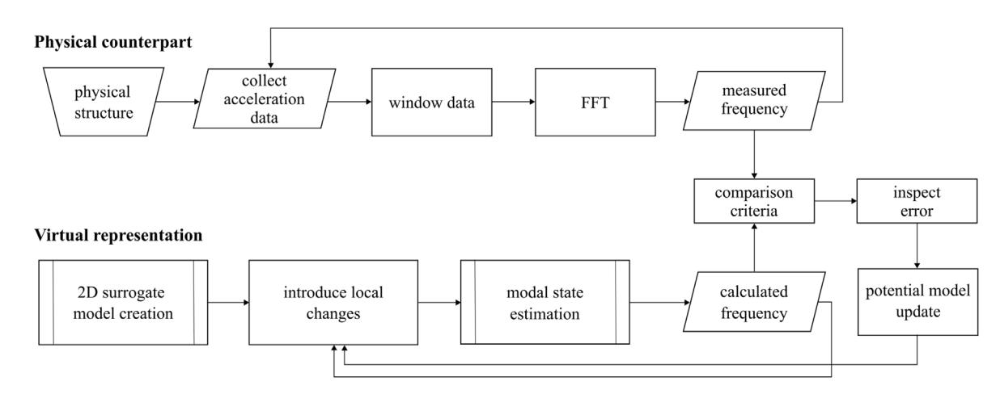

{5}------------------------------------------------

**Fig. 3.** Flowchart of LEMP algorithm showing the step-by-step process for evaluating how changes in system parameters and locations impact natural frequencies by sequentially simplifying the model, updating system matrices, and isolating significant degrees of freedom using modal and singular value decomposition techniques.

#### *Classical eigenvalue problem*

The undamped equation of motion for an  $n$ -DOF system is

$$\mathbf{M}\bar{x}(t) + \mathbf{K}\bar{x}(t) = \bar{\mathbf{F}}(t) \quad (4)$$

where  $M$  is the mass matrix,  $K$  is the stiffness matrix,  $\vec{x}(t)$  is the displacement vector, and  $\vec{F}(t)$  is the force vector. The classical eigenvalue problem for free vibration is obtained by assuming  $\vec{F}(t) = 0$ .

#### *Modal transformation*

The transformation to modal coordinates is achieved by using Eq. (5):

$$\vec{x} = U_1\vec{p} \quad (5)$$

where  $U_1$  is the modal matrix of eigenvectors and  $\bar{p}$  is the vector of modal coordinates. Substituting Eq. (5) into Eq. (4) and premultiplying by  $U_1^T$  leads to Eq. (6) which is the modal form:

$$\vec{p} + \Omega^2 \vec{p} = \mathbf{U}_1^T \vec{F}(t) \quad (6)$$

assuming unit modal mass and diagonal stiffness matrix  $\Omega^2 = \text{diag}(\omega_1^2, \dots, \omega_m^2)$ .

### *Structural modification and projection to modal space*

When the structure is modified, the mass and stiffness matrices become as shown in

$$M_2 = M_1 + 4M, \quad K_2 = K_1 + 4K \quad (7)$$

where  $\Delta M$  and  $\Delta K$  represent the changes in the system. The changes projected into the modal space are

$$\Delta M_{\text{modal}} = U_1^T \Delta M U_1, \quad \Delta K_{\text{modal}} = U_1^T \Delta K U_1 \quad (8)$$

hence modified eigenvalue problem can be obtained by substituting Eq. (8) into Eq. (6) to obtain

$$(\Omega^2 + \Delta K_{\text{modal}} - \omega^2(I + \Delta M_{\text{modal}}))\bar{p} = 0. \quad (9)$$

### *Local eigenvalue modification via SVD*

Using SVD, the change in stiffness is expressed as:

$$\Delta K = \sum_{i=1}^r \alpha_i \vec{t}_i^T \vec{t}_i^T \quad (10)$$

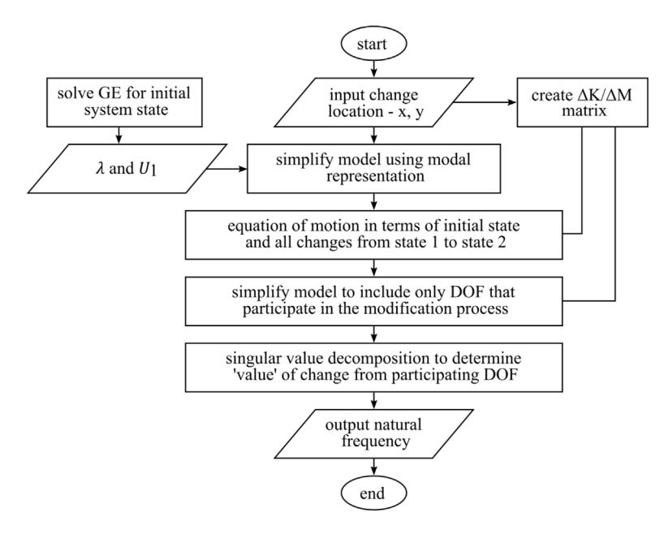

{6}------------------------------------------------

**Fig. 4.** Modal updating procedure where (a) is the physical description of a 2D plate; (b) analytical formulation for mass and stiffness matrices; (c) application of boundary conditions; (d) mesh generation with construction for *n* FEA models; (e) introduction of local stiffness changes; (f) analytical calculation of modal frequency.

The change is projected into modal space expressed in Eq. (11) as

$$\Delta K_{\text{modal}} = \sum i = 1' \alpha_i \vec{u}_i \vec{u}_i^T, \quad \vec{u}_i = U_1^T \vec{t}_i \quad (11)$$

The eigenvalue shift is then computed using the secular equation

$$\sum_{i=1}^r \frac{\alpha_i (\vec{u}_i^\top \vec{u}_i)}{\omega^2 - \omega_i^2} = 1. \quad (12)$$

This yields a set of scalar equations that are significantly easier to solve than recomputing the full eigenvalue problem. For multiple local changes, Eq. (12) is solved for each affected mode individually.

#### *Updated mode shapes*

The updated modal matrix  $U_2$  is computed as a linear combination of the original modes:

$$\vec{v}_i^{(2)} = \sum j = 1^m a_{ij} \vec{v}_j^{(1)} \quad (13)$$

where the coefficients  $a_{ij}$  are determined during the solution process. This approach maintains consistency with the original modal basis and ensures that updates reflect physically plausible changes. LEMP offers significant computational advantages, particularly in real-time applications, by reducing a high-order eigenvalue problem to a set of second-order scalar equations. However, LEMP assumes only one localized change at a time and may introduce approximation errors if structural changes significantly alter the global dynamics.

#### **3. Model development and simulation**

The finite element analysis (FEA) in ANSYS is used to generate reference responses and benchmark the analytical LEMP implementation. The study uses a steel square plate with the following dimensions: length: 0.3 m, width: 0.3 m, thickness: 0.006 m. The plate serves as a simplified structural component for analyzing modal responses and vibration characteristics. The square plate was selected as a 2D benchmark so that discrepancies between GEP and LEMP could be attributed primarily to the 2D eigen-update formulation rather than to geometry-specific details. This controlled setting is appropriate for establishing the first pass 2D extension of LEMP before moving to “stiffened”, “perforated”, “non-rectangular”, or “shell-type” structures with additional geometric and modal complexity. The steel plate is modeled using elastic material properties, ensuring an accurate simulation of structural behavior. The key material parameters are: Young’s modulus ( $E$ ): 200 GPa, Density ( $\rho$ ): 7850 (kg/m3), Poisson’s ratio ( $\nu$ ): 0.3. These properties are standard for steel and are used to obtain stiffness and mass matrices in the analytical models.

Fig. 4(a)–(f) describes the modal updating procedure used in this study. The 2D finite element model of a square plate (Fig. 4(a)) is constructed, which serves as the baseline numerical representation of the structure. In parallel, an analytical model is formulated

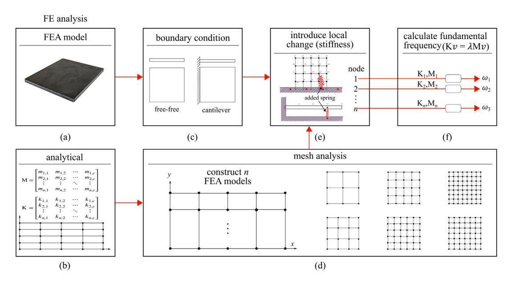

{7}------------------------------------------------

**Fig. 5.** Reduced FEMs with increasing nodal densities: (a) 9 nodes; (b) 16 nodes; (c) 25 nodes; (d) 36 nodes; (e) 49 nodes; and (f) 64 nodes.

from matrices extracted from the FEA model. Fig. 4(b) enables direct comparison between the analytical and computational simulations by solving the matrices using the GEP and LEMP solvers. Boundary conditions are imposed to ensure realistic structural representation, ranging from unconstrained (free) to cantilever boundary condition as shown in Fig. 4(c). A mesh optimization study is performed by constructing multiple finite element models with varying mesh densities (Fig. 4(d)). Upon developing the structural model and constructing several FEA models to define the structure, local stiffness modifications are introduced to simulate structural changes, such as damage or localized defects, as depicted in Fig. 4(e). Modal frequencies and mode shapes are extracted from both simulation and analytical methods. The impact of these modifications on the dynamic response is captured by recalculating the modal frequencies using GEP and LEMP (Fig. 4(f)). Here, the system matrices for each modification scenario yield corresponding eigenfrequencies that reflect the updated structural behavior. The procedure concludes with a comparative analysis, wherein the finite element model analyzed directly through simulation to compute modal responses under different conditions is compared with the solutions from LEMP to obtain the reduced-order model (ROM) and working mode, enabling rapid and accurate updates of the structural model in response to localized changes. Code, examples, and artifacts for this wor

# *3.1. Mesh and reduced-order sensitivity study*

Fig. 5 represents a series of reduced-order FEMs for the plate used, each constructed using different levels of nodal discretization to search for the ROM configuration. The models vary in complexity, with configurations including 9, 16, 25, 36, 49, and 64 nodes, as illustrated in Figs. 5(a)–(f). The selected configuration approximates the full plate geometry (which can have up to 900 nodes in standard discretization), enabling analysis of the system's dynamic characteristics with varying computational effort.

For each reduced model under free and cantilever boundary conditions, the global mass and stiffness matrices are extracted to represent each finite element discretization. These matrices are then used to solve the generalized eigenvalue problem in Eq. (1). The solution yields the natural frequencies and associated mode shapes for each reduced model. Mesh convergence is evaluated using a systematic refinement strategy in which element sizes are reduced by a factor of  $\sqrt{2}$  between successive models, thereby ensuring geometric similarity. The accuracy of each reduced-order model is assessed by computing the first 12 natural frequencies and comparing them with those of a reference meshed model with over 900 nodes, which achieved mesh-independent results with  $<1\%$  error tolerance. The comparison is performed by computing the percentage error between the predicted frequencies from each reduced model and those of the reference model. The analysis quantifies the impact of mesh resolution on modal prediction accuracy. The results provide valuable insights into the trade-off between computational cost and accuracy. Lower node configurations result in faster computations but higher approximation errors, while finer models improve accuracy at the expense of computational resour

#### *3.2. Performance metrics*

The reduced configuration used in this study is selected by a two-stage criterion combining frequency accuracy (error <10%) and computational efficiency (<1 ms execution time). First, a ROM is sought that satisfies the timing target while maintaining acceptable accuracy to the fine-mesh reference over the frequency band of interest. Second, the online update working mode is selected from that ROM based on the spatial stability of the LEMP-versus-GEP error across localized change locations, using the percentage (%) error metric defined in Eq. (14).

$$\text{error (\%)} = \left| \frac{f_{i,\text{reduced}} - f_{i,\text{reference}}}{f_{i,\text{reference}}} \right| \times 100 \quad (14)$$

where  $f_{i,\text{reduced}}$  and  $f_{i,\text{reference}}$  are the  $i$ th natural frequencies from the reduced and reference models, respectively, and  $n$  is the total number of natural frequencies considered.

This selection methodology ensures both accuracy and real-time feasibility for structural dynamic applications, addressing the fundamental trade-off between model accuracy and computational speed that limits existing GEP-based approaches [15]. The 10% error threshold used in this study is a pragmatic, application-specific criterion informed by common engineering practice rather than a universal standard. In structural dynamics, errors below 5% are often considered high accuracy, while 5%–10% may be acceptable for monitoring or reduced-order modeling, depending on the quantity of interest. Errors in the 10%–20% range are

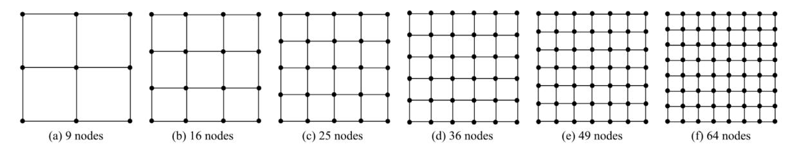

{8}------------------------------------------------

**Table 2** Error between reduced-order models and the reference solution for modes 7–12 (free plate configuration).

| Mode | 9 nodes | 16 nodes | 25 nodes | 36 nodes | 49 nodes | 64 nodes |
|------|---------|----------|----------|----------|----------|----------|
| 7    | 6.35    | 4.88     | 3.39     | 2.51     | 2.02     | 2.02     |
| 8    | 16.22   | 10.15    | 6.97     | 5.13     | 3.93     | 3.21     |
| 9    | 23.74   | 15.49    | 9.1      | 7.41     | 5.59     | 4.52     |
| 10   | 8.23    | 8.19     | 6.48     | 5.01     | 3.93     | 3.21     |
| 11   | 8.23    | 8.19     | 6.48     | 5.01     | 3.93     | 3.21     |
| 12   | 14.96   | 11.71    | 10.03    | 10.02    | 8.46     | 6.93     |

typically suitable only for preliminary screening, and errors above 20% are deemed inadequate for reliable structural assessment. For safety-critical aerospace applications, acceptable error levels are highly context-dependent and are generally defined by certification requirements and uncertainty bounds; in many cases, tolerances tighter than 5% are required; however, the 10% threshold referenced here represents a conservative balance between computational efficiency and accuracy requirements.

Another metric used in evaluating efficiency is comparing computational times between LEMP and traditional GEP. By benchmarking computational times for different model sizes and scenarios, the effectiveness of LEMP in reducing solution times without compromising accuracy is assessed. Furthermore, the scalability of LEMP with respect to increasing model complexity is evaluated. This includes studying the impact of mesh size (nodal configuration) on computational performance.

The present approach assumes linear elastic behavior, uniform material properties, and idealized boundary conditions. Performance may degrade under conditions involving: (i) nonlinear geometric or material effects, (ii) temperature-dependent properties, (iii) multi-physics coupling effects, or (iv) multiple simultaneous damage locations exceeding the local modification assumption of LEMP. These limitations represent areas for future research extension.

## **4. Nodal configuration, mode analysis and timing study**

This section presents a comprehensive analysis of reduced-order finite element models to determine the ROM configuration for real-time model updating using LEMP. Each subsection builds upon previous findings to systematically identify the most efficient model configuration while maintaining acceptable accuracy.

#### *4.1. Unconstrained plate (Free-free boundary conditions)*

Modal analysis of the free plate reveals that modes 1–6 exhibit eigenfrequencies below  $10^{-6}$  Hz, confirming their identification as rigid body modes due to the absence of kinematic constraints. Verification was performed by examining both eigenvalue magnitudes ( $\lambda_i < 10^{-12}$ ) and corresponding eigenvector patterns, which exhibit pure translational and rotational motions without elastic deformation. The first elastic mode is mode 7, corresponding to the natural bending mode with a characteristic saddle-shaped deformation pattern and a frequency of 24.7 Hz for the reference model. This physical behavior is consistent with free plate dynamics, in which elastic deformation begins after all rigid-body motions are identified. Subsequent analysis focuses exclusively on modes 7 through 12 to capture the primary elastic response characteristics. To assess the accuracy of the reduced-order models, the natural frequencies obtained from each reduced model for modes 7 to 12 are compared with those from the reference model. The error between these frequencies is presented in Table 2.

The errors are further visualized in Fig. 6, which presents a line plot of the error distribution across modes 7–12 for each reduced nodal configuration. The result demonstrates that for the free plate, only the 9-node and 16-node models exceed the 10% threshold in multiple modes. The 25-node model is the least complex model that maintains an error of about 10% or less across all analyzed modes.

# *4.2. Constrained plate (Cantilever boundary condition)*

The performance of the reduced models under cantilever boundary conditions is assessed by computing the first 12 natural frequencies for each reduced nodal configuration and comparing the results with those of a fine-mesh cantilever model. Table 3 presents the error for each nodal configuration.

Fig. 7 shows the graphical representation of the error data in Table 3, where both 9-node and 16-node configurations exceed 10% error thresholds significantly in several modes. The 25-node model demonstrates substantially improved performance, with a maximum error of 12.16% in mode 8, though it exceeds the 10% threshold in modes 7, 8, and 9. Among the reduced-order models evaluated, the 25-node model is identified as the smallest configuration that remains within the 10% error limit for several modes for both the free and cantilever plate cases. The 25-node model is retained not because it is globally optimal across all modes, but because it is the reduced-order model that preserves the later-selected working mode while satisfying the real-time timing target.

Tables 2 and 3 constitute a discretization sensitivity study for the proposed 2D LEMP workflow. As nodal density increases, the modal-frequency error decreases monotonically, confirming that spatial discretization directly affects both reduced-model accuracy and downstream update reliability.

{9}------------------------------------------------

**Fig. 6.** Percentage error between reduced-order models and reference solution for modes 7–12 (free plate configuration).

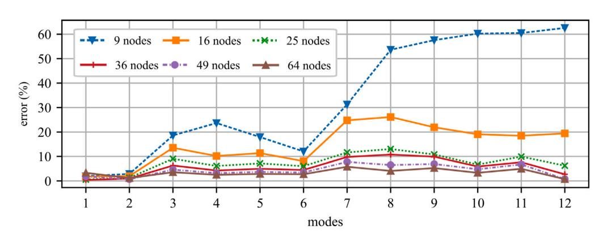

**Fig. 7.** Percentage Error between reduced-order models and reference solution for modes 1–12 (cantilever plate configuration).

**Table 3**

Error between reduced models and fine mesh for modes 1 to 12 cantilever plate).

| Mode | 9 nodes | 16 nodes | 25 nodes | 36 nodes | 49 nodes | 64 nodes |
|------|---------|----------|----------|----------|----------|----------|
| 1    | 1.96    | 1.78     | 0.58     | 0.40     | 1.85     | 3.33     |
| 2    | 2.89    | 1.99     | 1.30     | 0.98     | 0.71     | 1.18     |
| 3    | 18.61   | 13.55    | 9.06     | 6.31     | 4.63     | 3.58     |
| 4    | 23.67   | 10.19    | 6.13     | 4.28     | 3.22     | 2.52     |
| 5    | 17.94   | 11.36    | 7.17     | 4.98     | 3.70     | 2.88     |
| 6    | 13.71   | 8.08     | 6.04     | 4.49     | 3.45     | 2.75     |
| 7    | 31.28   | 24.56    | 11.06    | 9.43     | 7.50     | 5.51     |
| 8    | 53.63   | 25.92    | 12.16    | 10.41    | 6.22     | 3.89     |
| 9    | 57.57   | 22.71    | 10.88    | 9.54     | 6.63     | 4.04     |
| 10   | 60.25   | 19.84    | 7.34     | 7.28     | 5.63     | 3.19     |
| 11   | 60.48   | 18.26    | 9.94     | 8.58     | 7.67     | 5.89     |
| 12   | 62.57   | 19.21    | 7.18     | 2.72     | 0.78     | 0.75     |

### *4.3. Mode-screening and sensitivity analysis*

The dynamic behavior of the system (cantilever plate) is characterized for a reduced configuration by selecting a ROM working mode. This mode should be sensitive enough to detect localized changes, such as stiffness or mass, that indicate structural modifications or damage. The selection process involves introducing a local change as shown in Fig. 4(e) in Fig. 8, which shows the nodal layout of the 25-node reduced model with cantilever boundary conditions applied to nodes 1 through 5 at the base.

A local stiffness change is systematically introduced to the remaining nodes of the plate, one at a time, at the out-of-plane degree of freedom  $U_z$ . Specifically, an increased stiffness of magnitude  $1 \times 10^{10}$  N/m is applied to each node from node 6 through node 25. These nodes span the entire active region of the plate, not fixed at the base.

The modal analysis also validates the geometric symmetry of the cantilever plate about its centerline under the applied boundary conditions. This symmetry is verified by: (1) geometric verification showing identical nodal spacing and element dimensions on both halves, (2) material property uniformity, and (3) modal analysis demonstrating symmetric mode shapes consistent with structural

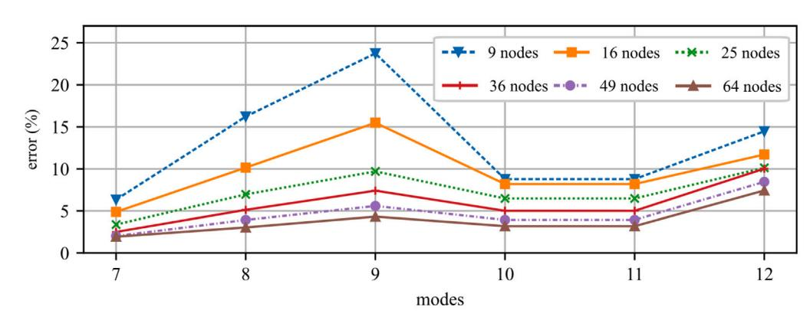

{10}------------------------------------------------

**Fig. 8.** Nodal configuration for ROM working mode selection where nodes 1 to 5 are the fixed nodes and nodes 6 to 25 are for localized stiffness modifications and nodes on side A mirror nodes on side B.

**Table 4**

| Percentage error | for modes 1 to 15 at nodes |        |        |        |        |         |         |         |         |         |
|------------------|----------------------------|--------|--------|--------|--------|---------|---------|---------|---------|---------|
|                  | mode                       | Node 6 | Node 7 | Node 8 | Node 9 | Node 10 | Node 11 | Node 12 | Node 13 | Node 14 |
| mode             | 6                          | 7      | 8      | 9      | 10     | 11      | 12      | 13      | 14      | 15      |
| 1                | 2.532                      | 1.987  | 2.686  | 2.039  | 2.574  | 5.890   | 7.965   | 7.192   | 8.101   | 5.912   |
| 2                | 1.748                      | 2.466  | 2.074  | 2.063  | 1.719  | 4.619   | 7.172   | 9.368   | 6.822   | 4.639   |
| 3                | 0.953                      | 1.317  | 0.814  | 1.117  | 0.946  | 1.622   | 3.017   | 0.802   | 2.835   | 1.606   |
| 4                | 0.521                      | 1.485  | 2.826  | 1.614  | 0.552  | 3.596   | 7.637   | 4.136   | 7.630   | 3.629   |
| 5                | 4.700                      | 6.679  | 3.521  | 6.014  | 4.744  | 7.170   | 9.990   | 4.552   | 9.260   | 7.141   |
| 6                | 5.323                      | 6.451  | 4.053  | 6.503  | 5.323  | 3.910   | 7.563   | 4.103   | 7.733   | 3.956   |
| 7                | 0.766                      | 0.979  | 1.636  | 0.987  | 0.802  | 3.834   | 4.717   | 5.510   | 4.827   | 3.864   |
| 8                | 0.616                      | 3.333  | 3.5367 | 3.298  | 0.708  | 7.865   | 2.171   | 5.033   | 1.990   | 7.854   |
| 9                | 7.734                      | 3.905  | 5.084  | 3.620  | 7.997  | 6.362   | 11.01   | 16.73   | 10.74   | 6.453   |
| 10               | 7.126                      | 3.785  | 2.770  | 3.562  | 7.038  | 15.00   | 10.56   | 15.25   | 10.64   | 14.99   |
| 11               | 5.682                      | 10.78  | 7.697  | 10.60  | 5.700  | 17.08   | 11.37   | 9.440   | 11.26   | 17.09   |
| 12               | 16.42                      | 13.98  | 16.83  | 14.03  | 16.50  | 18.69   | 18.48   | 13.96   | 18.58   | 18.63   |
| 13               | 10.00                      | 16.19  | 18.27  | 16.28  | 9.983  | 5.868   | 17.09   | 16.32   | 17.25   | 5.889   |
| 14               | 12.15                      | 7.737  | 5.404  | 7.856  | 12.17  | 17.33   | 7.093   | 7.794   | 7.115   | 17.34   |
| 15               | 12.06                      | 12.44  | 12.30  | 12.37  | 12.09  | 17.03   | 22.45   | 22.63   | 22.45   | 17.26   |

symmetry principles. The assumption remains valid for localized stiffness modifications up to 1010 N/m, beyond which nonlinear effects may invalidate symmetry.

For each local stiffness change, the modal frequencies are computed using both the GEP and LEMP algorithms. Frequencies corresponding to the first fifteen vibration modes are extracted for both solvers. The percentage error is used as the metric for quantifying the accuracy of the LEMP-extracted modal frequencies for each mode and at each node, thereby comparing LEMPpredicted frequencies to those obtained from the benchmark GEP solver. By comparing frequency changes across multiple modes, the mode with the highest sensitivity across the considered nodes is identified as the ROM working mode for real-time model updating and damage detection. This strategy ensures that the selected working mode provides sufficient spatial coverage and sensitivity to local variations, allowing it to serve as a reliable descriptor of the plate's global dynamic behavior under the cantilever boundary condition.

The frequencies obtained through GEP and LEMP are shown in Fig. 9(a)–(l). Additionally, the error between LEMP and GEP for each mode is plotted. The resulting errors are presented in Tables 4 and 5, highlighting LEMP's performance across all modes and nodes. In each table, the three modes with the lowest error at a given node are highlighted, denoting a closer match between LEMP and GEP. From Table 5, the count column reveals how many times a mode appears in the top three lowest errors across all nodes to quantify which mode most reliably tracks structural changes using LEMP. The result of this frequency-based evaluation is displayed in Fig. 10(a).

Fig. 10(a) shows that mode 7 ranks highest with the lowest-error modes 17 times, while mode 3 appears 15 times and mode 8 appears 11 times. This mode corresponds to a symmetric bending pattern with maximum deflection at the free end and nodal lines oriented perpendicular to the cantilever boundary, making it particularly responsive to structural modifications in the plate's active region. The physical interpretation reveals that mode 7 represents an out-of-plane bending motion, which naturally exhibits the highest energy content and clearest deformation patterns for damage detection applications. Mode 7 specifically avoids modal complexity challenges (larger node-to-node error variability) demonstrated in higher-order modes through eigenvalue sensitivity analysis. Mode 7 demonstrates stability for all adjacent modes across the parameter range investigated, confirming robust mode identification, suitable for real-time monitoring reliability.

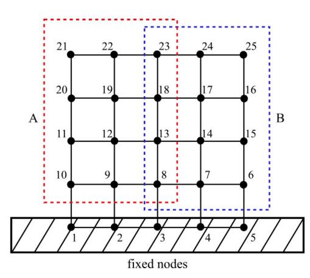

{11}------------------------------------------------

**Fig. 9.** Frequency comparisons and error profiles for local stiffness changes at nodes (a) 6 to (l) 25.

As a result, mode 7 is selected as the working mode for the real-time structural assessment with LEMP on the 2D structural system. Subsequent validation tasks, error tracking, and simulation analyses will reference this mode, ensuring accurate, computationally efficient model updating in dynamic, uncertain environments. Fig. 10(b) compares GEP and LEMP frequencies for mode 7 at each perturbation node from 6 to 25. For the selected working mode 7, LEMP consistently maintains errors below 10% across all tested nodes, with an average error of 3.2% and standard deviation of 1.4%, confirming reliable performance for the primary monitoring mode. This reinforces the reliability of mode 7 in capturing system dynamics under local perturbations and confirms its suitability as the working mode for tracking and real-time model updating.

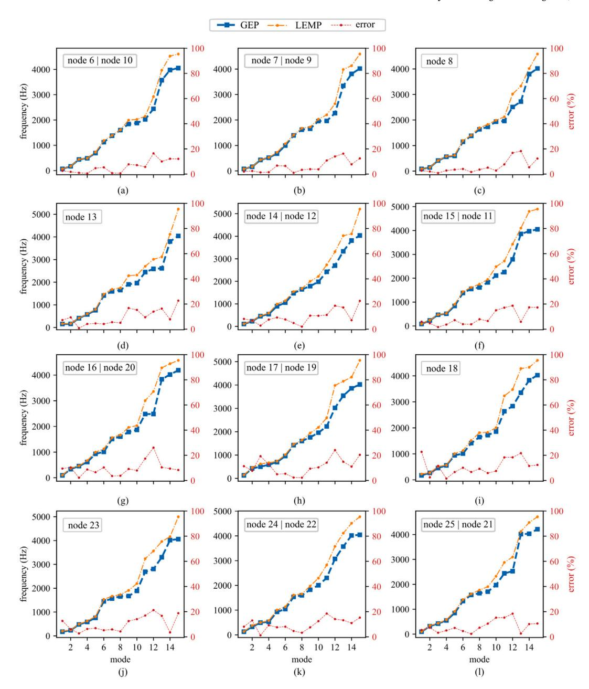

{12}------------------------------------------------

**Table 5** Percentage error for modes 1 to 15 at nodes 16 to 25.

|      |       |       |       |       |       | Error at | node  |       |       |       |       |
|------|-------|-------|-------|-------|-------|----------|-------|-------|-------|-------|-------|
| mode | 16    | 17    | 18    | 19    | 20    | 21       | 22    | 23    | 24    | 25    | count |
| 1    | 9.497 | 11.33 | 22.76 | 11.47 | 9.488 | 5.442    | 8.088 | 12.67 | 8.049 | 5.424 | 0     |
| 2    | 10.38 | 7.715 | 2.417 | 7.677 | 10.38 | 7.161    | 12.92 | 6.074 | 12.94 | 7.218 | 2     |
| 3    | 2.176 | 19.31 | 11.59 | 18.66 | 2.193 | 3.166    | 1.183 | 2.701 | 1.199 | 3.237 | 15    |
| 4    | 8.734 | 12.74 | 1.519 | 12.62 | 8.707 | 5.018    | 9.199 | 6.276 | 9.173 | 5.037 | 8     |
| 5    | 6.561 | 4.950 | 6.674 | 5.247 | 6.607 | 7.077    | 7.587 | 6.927 | 7.587 | 7.083 | 2     |
| 6    | 10.35 | 5.378 | 10.12 | 5.434 | 10.38 | 4.592    | 8.067 | 5.231 | 8.051 | 4.599 | 2     |
| 7    | 3.524 | 2.327 | 6.722 | 2.226 | 3.543 | 2.234    | 4.555 | 5.883 | 4.655 | 2.356 | 17    |
| 8    | 3.769 | 2.219 | 9.296 | 2.279 | 3.821 | 7.067    | 3.274 | 4.274 | 3.215 | 7.256 | 11    |
| 9    | 9.132 | 9.428 | 5.873 | 9.418 | 9.002 | 10.38    | 7.378 | 12.53 | 7.524 | 10.44 | 0     |
| 10   | 7.980 | 10.40 | 7.539 | 10.28 | 8.098 | 15.11    | 12.33 | 14.06 | 12.47 | 15.21 | 0     |
| 11   | 17.39 | 14.18 | 18.35 | 14.21 | 17.44 | 15.27    | 18.39 | 16.90 | 18.48 | 15.27 | 0     |
| 12   | 26.13 | 24.16 | 18.38 | 24.10 | 26.11 | 18.29    | 14.16 | 21.24 | 14.14 | 18.41 | 0     |
| 13   | 10.39 | 14.89 | 21.69 | 15.01 | 10.35 | 2.543    | 13.19 | 16.70 | 13.16 | 2.572 | 2     |
| 14   | 9.475 | 11.05 | 11.52 | 11.06 | 9.475 | 10.13    | 10.91 | 3.439 | 10.96 | 10.14 | 0     |
| 15   | 8.318 | 20.35 | 12.35 | 20.46 | 8.328 | 10.63    | 15.25 | 18.76 | 15.26 | 10.56 | 0     |

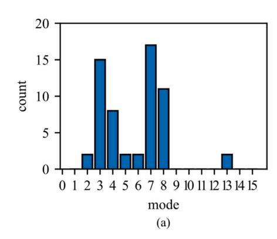

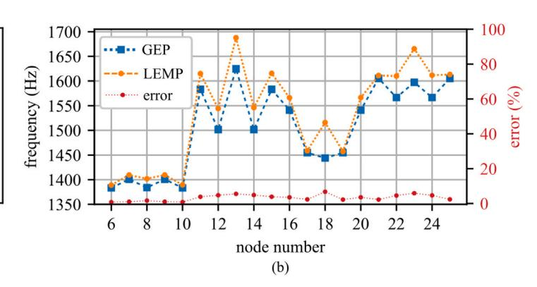

**Fig. 10.** Mode selection showing (a) mode 7 as selected working mode with lowest error across all nodes, and; (b) mode 7 frequencies computed with GEP and LEMP at each nodal stiffness change.

**Table 6** Single state change timing comparison for LEMP and GEP performance across multiple nodal configuration changes.

| No. | of nodes | element DOF |  | Matrix | size | Time GEP (ms) | Time LEMP (ms) |
|-----|----------|-------------|--|--------|------|---------------|----------------|
| 9   | 4        | 54          |  | x      | 54   | 1.093         | 0.384          |
| 16  | 9        | 96          |  | x      | 96   | 3.200         | 0.456          |
| 25  | 16       | 150         |  | x      | 150  | 9.031         | 0.458          |
| 36  | 25       | 216         |  | x      | 216  | 24.529        | 0.464          |
| 49  | 36       | 294         |  | x      | 294  | 67.579        | 0.466          |
| 64  | 49       | 384         |  | x      | 384  | 212.773       | 0.475          |
| 81  | 64       | 486         |  | x      | 486  | 348.656       | 0.539          |
| 100 | 81       | 600         |  | x      | 600  | 559.744       | 0.691          |
| 121 | 100      | 726         |  | x      | 726  | 994.675       | 0.890          |
| 144 | 121      | 864         |  | x      | 864  | 2197.694      | 1.225          |
| 169 | 144      | 1014        |  | x 1014 | 1014 | 4075.451      | 1.523          |

# *4.4. State change timing analysis for 2D systems*

The computational advantages of LEMP are quantified in Table 6, which demonstrates timing comparisons across different system sizes and provides empirical validation of the theoretical  $O(n)$  versus  $O(n^3)$  complexity advantages over traditional GEP approaches.

All timing measurements were conducted on a standardized hardware platform: an Intel Core i7-10700K processor (3.8 GHz base, 8 cores), 64 GB of DDR4-3200 RAM, and Windows 10 Professional. Timing protocols followed established benchmarking practices, including ensuring 50 independent runs per configuration to establish statistical significance, a system warm-up period of 100 iterations before measurement, exclusion of I/O operations from timing calculations, minimizing background processes to ensure consistent system load, and memory pre-allocation to eliminate dynamic allocation effects. Reported timing values represent mean execution times with 95% confidence intervals, and the coefficient of variation is maintained below 5% for all measurements.

{13}------------------------------------------------

Table 7

| Log-log regression parameters for GEP and LEMP runtime scaling. |           |         |         |            |
|-----------------------------------------------------------------|-----------|---------|---------|------------|
| Method                                                          | Slope (b) | R-value | p-value | Std. error |
| GEP                                                             | 3.047     | 0.987   | 0.00024 | 0.245      |
| LEMP                                                            | 1.248     | 0.986   | 0.00030 | 0.106      |

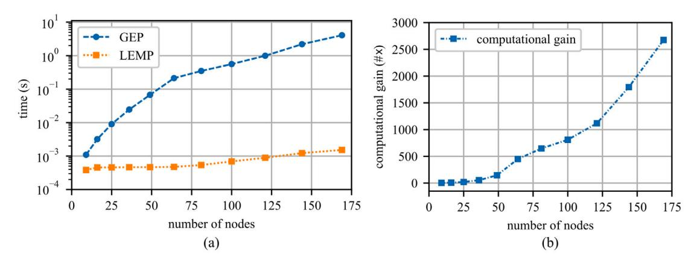

Fig. 11. Time taken to solve the system equation for each number of nodes plotted on (a) logarithmic scale, and; (b) potential computational gain at each number of nodes.

The GEP and LEMP solvers were analyzed for computational performance on 2D plates with increasing numbers of nodes, up to 169. In contrast to the 1-D system, where the system matrix grows gradually, the 2D system has 6 DOFs per node, compared to just 2 in the 1-D system. For instance, the system matrix is  $54 \times 54$  for a 9-node 2D plate, compared to  $18 \times 18$  for a 9-node 1D system. Also, at 100 nodes, the 2D system has a matrix of size  $600 \times 600$ , whereas the 1D system has a size  $200 \times 200$ . Table 6 reports how the matrix size grows as the number of nodes increases. This matrix size growth also underscores the need for a faster algorithm to solve the system of equations. The system equation solving time is expanded upon in Fig. 11(a), showing the timing of LEMP in a logarithmic scale against GEP. Even with up to 100 nodes, the LEMP algorithm still achieves  $691 \mu\text{s}$ , while GEP is already at  $0.56 \text{ s}$ . At 169 nodes, the LEMP algorithm takes 1.5 ms, while the GEP takes 4 s, exceeding the investigated latency constraint. The near-linear scaling of LEMP yields sub-millisecond updates for the smaller ROMs tested and low-millisecond updates for the larger benchmark cases on the workstation platform considered here. The potential computational gain of LEMP over GEP is shown in Fig. 11(b). As observed, the gain increases sharply with the number of nodes, indicating th

#### *4.5. Complexity scaling analysis of GEP and LEMP*

To evaluate and compare the computational scaling of GEP and the LEMP algorithm with respect to problem size (number of nodes), runtime measurements for both methods over a range of node numbers ( $n$ ) above 49 nodes were analyzed. The log-log regression approach was employed to empirically determine the scaling exponent, providing quantitative insights into their computational complexities.

For each algorithm, the observed runtimes ( $T$ ) were paired with corresponding number of nodes ( $n$ ), hence following power-law relationship in Eq. (15):

$$T(n) = an^b \quad (15)$$

where  $a$  is a constant and  $b$  is the scaling exponent characterizing asymptotic complexity. Taking logarithms on both sides yields the linear relation:

$$\log T(n) = \log a + b \log n$$
 (16)

A linear regression was performed on  $(\log n, \log T)$  data pairs for both GEP and LEMP algorithms. The estimated slope  $b$  directly reflects the empirical computational order. The regression results are summarized in Table 7. The low  $p$ -value indicates strong statistical confidence in the relationship between node count and runtime for both algorithms.

The log-log plots (Fig. 12) confirm that both algorithms exhibit strong linearity in the logarithmic domain ( $R \approx 0.99$ ), supporting the validity of the power-law assumption. The empirically determined scaling exponents reveal a cubic relationship for Generalized Eigenvalue (GE) ( $b_{\text{GE}} \approx 3$ ), corresponding to a classical complexity of  $O(n^3)$ , which is well known from theoretical considerations:

$$T_{\text{GE}}(n) \propto n^3 \quad (17)$$

{14}------------------------------------------------

**Fig. 12.** Log–log plots of runtime (s) (a) Generalized Eigenvalue (GE), and; (b) LEMP algorithms, showing analysis data and regression fits.

In contrast, the LEMP algorithm exhibits near-linear scaling with  $b_{\text{LEMP}} \approx 1.25$ , which closely approximates  $O(n)$  complexity:

$$T_{\text{LEMP}}(n) \propto n$$
 (18)

These results confirm the efficiency advantage of LEMP over direct solvers such as GEP as the problem size increases. The observed computational orders are consistent with the intended algorithmic designs and demonstrate the practical feasibility of LEMP for large-scale problems.

The demonstrated  $2500\times$  speedup factors must be interpreted within LEMP's operational constraints. Memory usage analysis shows that LEMP requires 15%–25% storage for modal transformation matrices but maintains constant complexity  $O(n)$ , whereas GEP has  $O(n^3)$  growth. At the 169-node limit, LEMP achieves 1.523 ms execution time with 2.3 MB memory footprint compared to GEP's 4.075 s execution time and 8.7 MB memory requirement, confirming scalability advantages essential for edge computing deployment.

The presented methodology operates under specific constraints that may limit generalizability: (1) Linear elastic material behavior assumption may not capture damage-induced nonlinearities exceeding certain strain level, (2) Single localized change assumption restricts simultaneous multi-site damage detection, (3) Uniform material properties exclude temperature-dependent or degradation effects, (4) Idealized boundary conditions may not represent complex real-world mounting configurations, (5) Quasistatic analysis excludes rate-dependent material effects relevant to high-rate dynamics, and (6) Noise-free measurements assumption requires validation under realistic signal-to-noise ratios. These limitations establish the operational envelope for reliable LEMP performance and identify areas requiring future research extension. The validation scenario is controlled so that the observed discrepancies can be attributed to the 2D local eigen-update formulation rather than to confounding effects from nonlinear constitutive behavior, environmental variability, distributed damage, or measurement uncertainty.

#### *4.6. Extension to complex systems*

In subsequent works, the LEMP algorithm will be extended to 3D digital twin frameworks. Recent 3D digital-twin frameworks have addressed real-time updating through broader project-level data-assimilation architectures. Tian et al. [37] proposed an uncertainty-aware digital twin for deep excavations that integrates multi-source time-evolving 3D monitoring data with physicsguided Bayesian updating, and also developed a sparse-dictionary-learning framework in which field measurements identify weights of dictionary atoms generated from random 3D FEM analyses [38]. These methods solve a rich 3D prediction problem but rely on project-specific model libraries and Bayesian or sparse-representation layers. The extension would address a complementary bottleneck: the repeated eigensolution required by physics-based FE updating. In this sense, LEMP may be interpreted as a lightweight local-update kernel that could potentially be embedded within broader 3D digital-twin architectures.

A practical pathway to 3D LEMP is to combine the local eigen-update with substructuring. First, the 3D model will be partitioned so that only the affected subdomain and its interface modes are updated online. Second, localized changes will be represented as block-sparse changes over element groups rather than a single DOF. Third, when modal crowding or strong coupling is detected, adaptive modal enrichment or periodic full-order relinearization will be used to refresh the modal basis. These steps would preserve the local-update philosophy while addressing the larger modal density and stronger coupling typical of 3D structures.

#### **5. Conclusion**

This study provides a foundational step toward real-time, physics-based digital twins by extending and validating the Local Eigenvalue Modification Procedure (LEMP) numerically for model updating of two-dimensional structures. Within a digital-twin framework that requires continuous synchronization between the physical system and its virtual representation, LEMP can enable the virtual model to assimilate local structural changes without recomputing the full generalized eigenvalue problem. Through

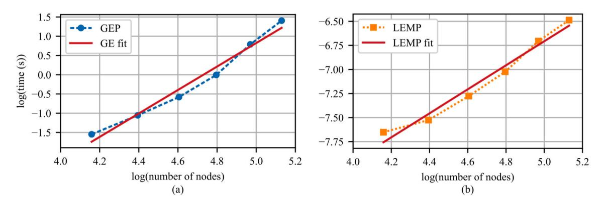

{15}------------------------------------------------

mesh-convergence studies, reduced-order modeling, and analyses of localized stiffness changes, a 25-node FE representation was identified as the ROM configuration for real-time updating, and mode 7 was shown to provide the most stable and sensitive modal parameter for tracking local state changes.

The results demonstrate that LEMP reliably updates the modal properties with errors consistently below 10% while offering computational speedups exceeding  $2500\times$  compared to GEP for models up to 169 nodes. The near-linear ( $O(n)$ ) scaling of LEMP validated through empirical log-log complexity analysis stands in contrast to the cubic ( $O(n^3)$ ) scaling of GEP, capable of enabling sub-millisecond scale update cycles suitable for real-time digital-twin operation. These findings confirm that LEMP provides a viable pathway for embedding physics-based reduced-order FE models into high-rate digital twin architectures, and suggest that LEMP is a promising candidate for edge deployment, subject to hardware-specific implementation and end-to-end latency evaluation.

While the present study assumes linear elastic behavior, independent local changes, and idealized boundary conditions, the demonstrated performance establishes a strong baseline for more advanced digital-twin capabilities. The present study is not a single benchmark representative of all practical 2D structures; however, future work will extend LEMP to accommodate nonlinear material and geometric effects, simultaneous multi-site changes, temperature or environment-dependent properties, and measurement noise characteristic of field-deployed sensing. Integration with state-estimation frameworks and learning-based components such as Kalman filtering, Bayesian updating, or hybrid physics-informed strategies represents a promising avenue for fully autonomous, self-correcting digital twins. This study is foundational in achieving real-time, physics-based digital twins capable of supporting high-rate structural updating, active control, and on-board decision-making in demanding engineering environments.

# **CRediT authorship contribution statement**

**Emmanuel A. Ogunniyi:** Writing – original draft, Validation, Methodology, Investigation, Formal analysis, Conceptualization. **Austin R.J. Downey:** Writing – review & editing, Supervision, Resources, Methodology, Funding acquisition. **Pete Avitabile:** Writing – review & editing, Validation, Resources. **Jacob Dodson:** Writing – review & editing, Resources. **Adriane G. Moura:** Writing – review & editing, Resources.

# **Declaration of competing interest**

The authors declare the following financial interests/personal relationships which may be considered as potential competing interests: Austin R.J. Downey reports financial support was provided by Air Force Office of Scientific Research (AFOSR). Austin R.J. Downey reports financial support was provided by National Science Foundation (NSF). If there are other authors, they declare that they have no known competing financial interests or personal relationships that could have appeared to influence the work reported in this paper.

# **Acknowledgments**

This material is partially supported by the Air Force Office of Scientific Research (AFOSR), United States through award no. FA9550-21-1-0083. Additional funding for this work comes from the National Science Foundation (NSF) grant numbers CCF - 1956071, CMMI - 2152896, CCF-2234921, and CPS - 2237696. Any opinions, findings, conclusions, or recommendations expressed in this material are those of the authors and do not necessarily reflect the views of the National Science Foundation or the United States Air Force. Distribution Statement A. Approved for public release: distribution unlimited. AFRL-2026-0956.

# **Data availability**

Code, examples, and artifacts for this work are available through a public repository (https://github.com/ARTS-Laboratory/Paper-2026-O-n-Digital-Twin-Updating)

Paper 2026 O(n) Digital Twin Updating (Original data) (GitHub)

# **References**

[1] National Academy of Engineering, National Academies of Sciences, Engineering, and Medicine, Foundational research gaps and future directions for digital twins, The National Academies Press, Washington, DC, 2024. [2] Jacob Dodson, Austin Downey, Simon Laflamme, Michael D. Todd, Adriane G. Moura, Yang Wang, Zhu Mao, Peter Avitabile, Erik Blasch, High-rate structural health monitoring and prognostics: An overview, in: Data Science in Engineering, Volume 9, Springer International Publishing, 2021, pp. 213–217. [3] T.G. Ritto, F.A. Rochinha, Digital twin, physics-based model, and machine learning applied to damage detection in structures, Mech. Syst. Signal Process. 155 (2021) 107614. [4] Michael G Kapteyn, David J Knezevic, DBP Huynh, Minh Tran, Karen E Willcox, Data-driven physics-based digital twins via a library of component-based reduced-order models, Internat. J. Numer. Methods Engrg. 123 (13) (2022) 2986–3003. [5] Mohsen Gol Zardian, Austin R. J. Downey, Eleonora Maria Tronci, Conor Madden, Daniel Coble, Sina Navidi, Chao Hu, Physics-informed machine learning part III: Hard-constraint ODE method for structural dynamics, in: Proceedings of the Society for Experimental Mechanics (SEM) IMAC Conference, 2026. [6] Shankar Sehgal, Harmesh Kumar, Structural dynamic model updating techniques: A state of the art review, Arch. Comput. Methods Eng. 23 (3) (2016) 515–533.

{16}------------------------------------------------

- [7] Yao Chen, Jian Feng, Generalized eigenvalue analysis of symmetric prestressed structures using group theory, J. Comput. Civ. Eng. 26 (4) (2012) 488–497. [8] Mohammad Rahai, Akbar Esfandiari, Ali Bakhshi, Detection of structural damages by model updating based on singular value decomposition of transfer function subsets, Struct. Control. Health Monit. 27 (11) (2020) e2622. [9] Shun Weng, Hongping Zhu, Yong Xia, Jiajing Li, Wei Tian, A review on dynamic substructuring methods for model updating and damage detection of large-scale structures, Adv. Struct. Eng. 23 (3) (2020) 584–600. [10] Partha Sengupta, Subrata Chakraborty, A state-of-the-art review on model reduction and substructuring techniques in finite element model updating for structural health monitoring applications, Arch. Comput. Methods Eng. (2025) 1–32. [11] Hossein Moravej, Shojaeddin Jamali, Tommy Chan, Andy Nguyen, Finite element model updating of civil engineering infrastructures: A literature review, in: Proceedings of the 8th International Conference on Structural Health Monitoring of Intelligent Infrastructure 2017, International Society for Structural Health Monitoring of Intelligent . . . , 2017, pp. 1–12. [12] Yuwei Li, Kuo Tian, Peng Hao, Bo Wang, Hao Wu, Bin Wang, Finite element model updating for repeated eigenvalue structures via the reduced-order model using incomplete measured modes, Mech. Syst. Signal Process. 142 (2020) 106748. [13] J. Wang, G. Wang, Y. Zhang, Efficient finite element modeling of photonic modal analysis: A neural symbolic approach, Opt. Express 32 (2024) 38107–38119. [14] Dimitrios Giagopoulos, Alexandros Arailopoulos, Vasilis Dertimanis, Costas Papadimitriou, Eleni Chatzi, Konstantinos Grompanopoulos, Structural health monitoring and fatigue damage estimation using vibration measurements and finite element model updating, Struct. Health Monit. 18 (4) (2019) 1189–1206. [15] S. Ereiz, I. Duvnjak, J.F. Jiménez-Alonso, Review of finite element model updating methods for structural applications, Structures 41 (2022) 684–723. [16] Cristobal A. Navarro, Nancy Hitschfeld-Kahler, Luis Mateu, A survey on parallel computing and its applications in data-parallel problems using GPU architectures, Commun. Comput. Phys. 15 (2) (2014) 285–329. [17] Arman Malekloo, Ekin Ozer, Mohammad AlHamaydeh, Mark Girolami, Machine learning and structural health monitoring overview with emerging technology and high-dimensional data source highlights, Struct. Health Monit. 21 (4) (2022) 1906–1955. [18] Ido Ben-Shaul, Leah Bar, Dalia Fishelov, Nir Sochen, Deep learning solution of the eigenvalue problem for differential operators, Neural Comput. 35 (6) (2023) 1100–1134. [19] Md Shezad Dihan, Anwar Islam Akash, Zinat Tasneem, Prangon Das, Sajal Kumar Das, Md Robiul Islam, Md Manirul Islam, Faisal R Badal, Md Firoj Ali, Md Hafiz Ahamed, et al., Digital twin: Data exploration, architecture, implementation and future, Heliyon 10 (5) (2024). [20] Austin Downey, Jonathan Hong, Jacob Dodson, Michael Carroll, James Scheppegrell, Millisecond model updating for structures experiencing unmodeled high-rate dynamic events, Mech. Syst. Signal Process. 138 (2020) 106551. [21] Seong Hyeon Hong, Claire Drnek, Austin Downey, Yi Wang, Jacob Dodson, Real-time model updating algorithm for structures experiencing highrate dynamic events, in: Smart Materials, Adaptive Structures and Intelligent Systems, vol. 84027, American Society of Mechanical Engineers, 2020, V001T03A018. [22] Peter Avitabile, Twenty years of structural dynamic modification-a review, Sound Vib. 37 (1) (2003) 14–27. [23] John C. O'Callahan, Chaur-Ming Chou, Peter Avitabile, Study of a local eigenvalue modification procedure using a generalized beam element, in: 1984 American Control Conference, IEEE, 1984, pp. 998–1005. [24] Emmanuel A Ogunniyi, Claire Drnek, Seong Hyeon Hong, Austin RJ Downey, Yi Wang, Jason D Bakos, Peter Avitabile, Jacob Dodson, Real-time structural model updating using local eigenvalue modification procedure for applications in high-rate dynamic events, Mech. Syst. Signal Process. 195 (2023) 110318. [25] Peter Avitabile, Pawan Pingle, Prediction of full field dynamic strain from limited sets of measured data, Shock. Vib. 19 (2012) 765–785. [26] Emmanuel Ogunniyi, Austin R.J. Downey, Jason Bakos, Development of a Real-Time Solver for the Local Eigenvalue Modification Procedure, SPIE, 2022,
- p. 51, [27] Alexander B Vereen, Emmanuel A Ogunniyi, Austin RJ Downey, Erik Blasch, Jason D Bakos, Jacob Dodson, Optimal sampling methodologies for high-rate structural twinning, in: 2023 26th International Conference on Information Fusion, FUSION, IEEE, 2023, pp. 1–8. [28] Alexander B Vereen, Emmanuel A Ogunniyi, Austin RJ Downey, Jacob Dodson, Adriane G Moura, Jason D Bakos, Online implementation of the local eigenvalue modification procedure for high-rate model assimilation, in: Society for Experimental Mechanics Annual Conference and Exposition, Springer, 2023, pp. 121–127. [29] Faming Liang, Runmin Shi, Qianxing Mo, A split-and-merge approach for singular value decomposition of large-scale matrices, Stat. Interface 9 (4) (2016)
- 453. [30] Sungkwon Lee, Klaus-Jürgen Bathe, Solution of the generalized eigenvalue problem using overlapping finite elements, Adv. Eng. Softw. 173 (2022) 103241. [31] Jane Cullum, Tong Zhang, Two-sided arnoldi and nonsymmetric lanczos algorithms, SIAM J. Matrix Anal. Appl. 24 (2) (2002) 303–319. [32] Nataša Trišović, Eigenvalue sensitivity analysis in structural dynamics, FME Trans. 35 (3) (2007) 149–156. [33] Lars Hinke, F Dohnal, Brian R Mace, Timothy P Waters, NS Ferguson, Component mode synthesis as a framework for uncertainty analysis, J. Sound Vib. 324 (1–2) (2009) 161–178. [34] YC Liang, HP Lee, SP Lim, WZ Lin, KH Lee, CG1237 Wu, Proper orthogonal decomposition and its applications—Part I: Theory, J. Sound Vib. 252 (3) (2002) 527–544. [35] Saeed Eftekhar Azam, Stefano Mariani, Investigation of computational and accuracy issues in POD-based reduced order modeling of dynamic structural systems, Eng. Struct. 54 (2013) 150–167. [36] Emmanuel A. Ogunniyi, O-n-digital-twin-updating, 2026, URL https://github.com/ARTS-Laboratory/Paper-2026-O-n-Digital-Twin-Updating. [37] Hua-Ming Tian, Yu Wang, Yong-Jian Huang, Uncertainty-aware digital twins for deep excavations with lateral support, Autom. Constr. 181 (2026) 106658. [38] Huaming Tian, Yu Wang, Danni Zhang, Real-time model updating and prediction of three-dimensional time-varying consolidation settlement using machine learning, J. Rock Mech. Geotech. Eng. (2025).