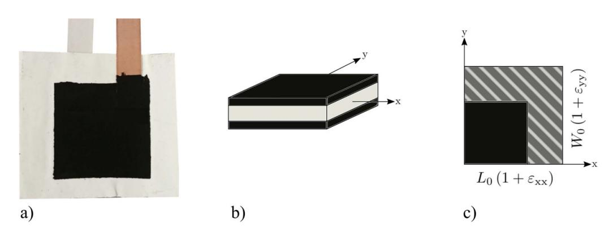
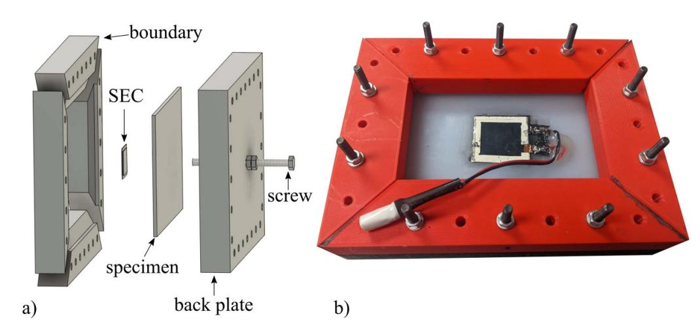
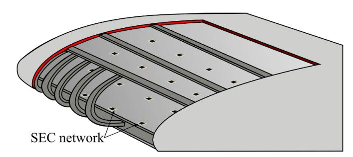
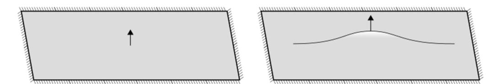
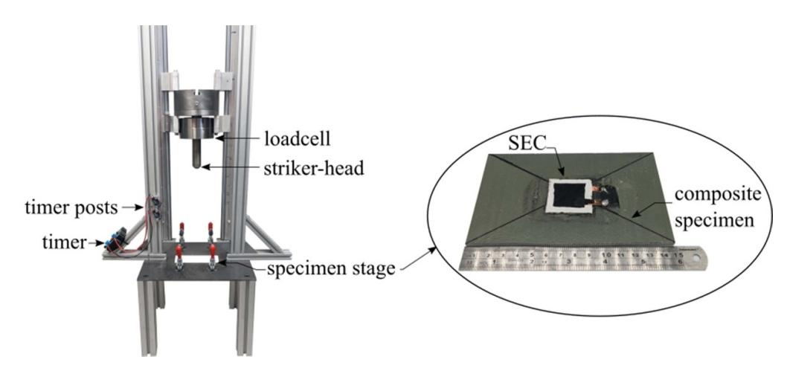
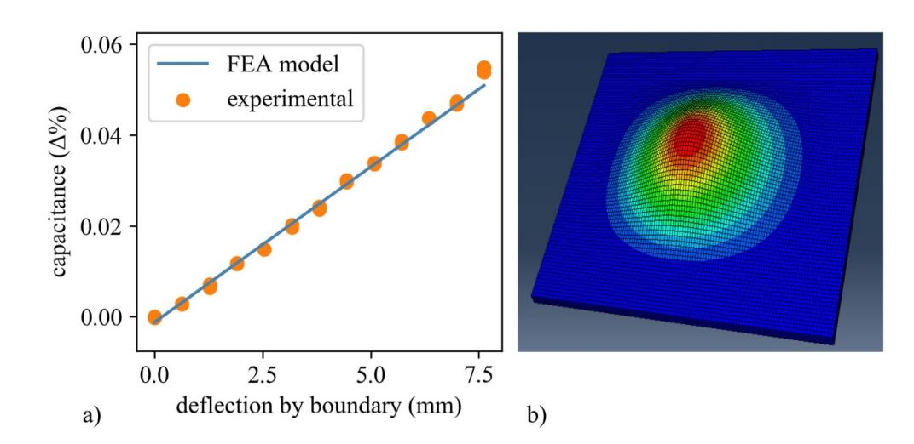
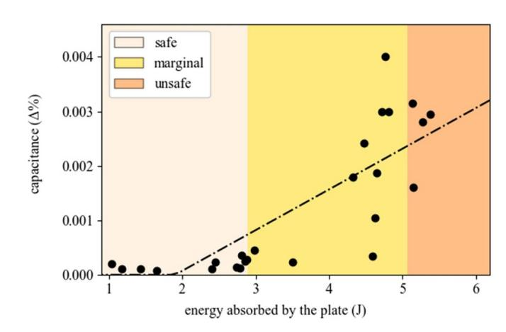
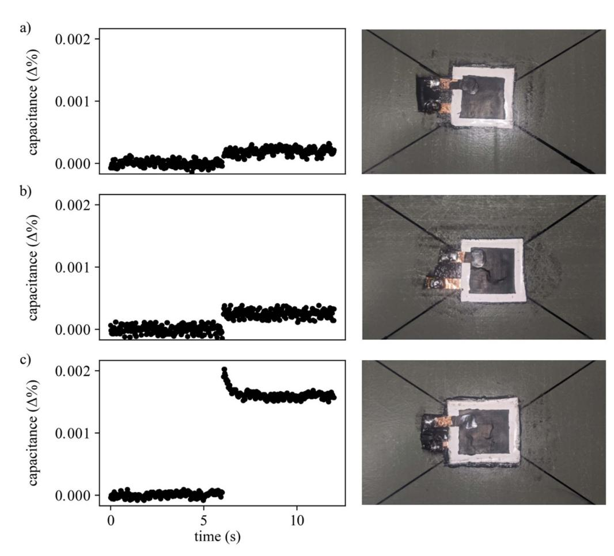
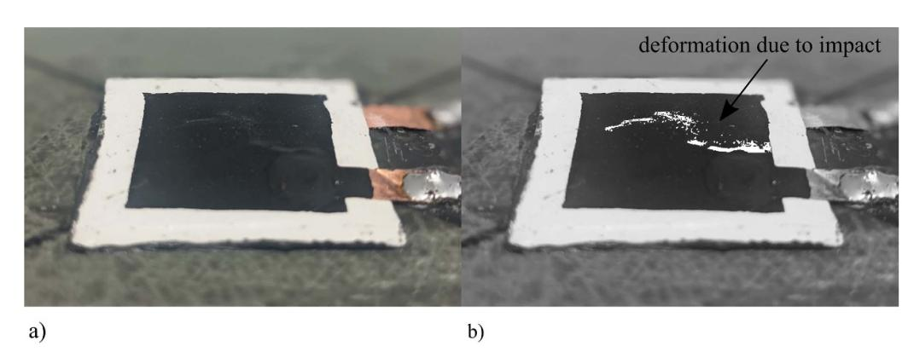
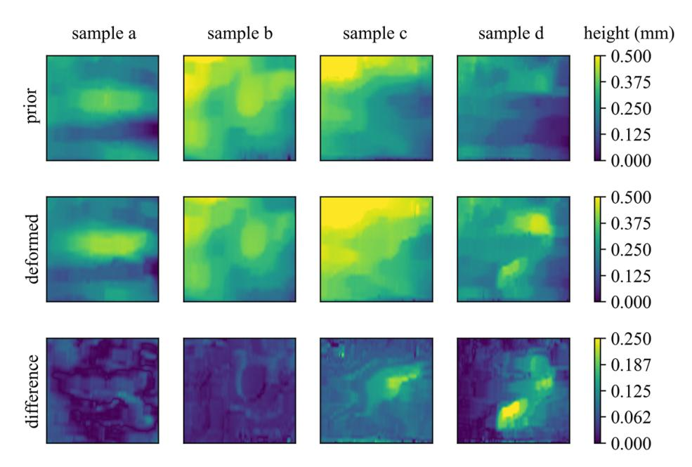

{0}------------------------------------------------

# **Validation of large area capacitive sensors for impact damage assessment**

**Alexander Vereen**[1](#page-0-0)**, Austin R J Downey**[1,](#page-0-0)[2,](#page-0-1)*[∗](#page-0-2)***, Subramani Sockalingam**[1](#page-0-0) **and Simon Laflamme**[3](#page-0-3)

1 Department of Mechanical Engineering, University of South Carolina, Columbia, SC 29208, United States of America

2 Department of Civil and Environmental Engineering, University of South Carolina, Columbia, SC 29208, United States of America

3 Department of Civil, Environmental, and Construction Engineering, Iowa State University, Ames, IA 50011, United States of America

E-mail: [austindowney@sc.edu](mailto:austindowney@sc.edu)

Received 29 March 2023, revised 9 October 2023

Accepted for publication 2 November 2023

Published 6 December 2023

# **Amazon Prime Student - College and University Students**

- Amazon Prime Student offers a discounted membership to Amazon Prime for college and university students.

## **Benefits and Features**

Students can access all the benefits of Amazon Prime at a reduced price. These include:

- **Free Shipping:** Get free shipping on millions of items directly to your door, regardless of size or weight.
- **Prime Video:** Access thousands of movies and TV shows for streaming entertainment.  
  - **Amazon Music:** Stream millions of songs in high quality. (Excluding some live concerts which may require an additional subscription).
- **Kindle:** Enjoy free shipping on a vast selection of eBooks and digital magazines, making studying easier and more portable.

## **Eligibility Requirements**

To qualify for Amazon Prime Student, you must be enrolled as a full-time or part-time student at an accredited college or university. You will need to provide proof of enrollment through a third-party verification process (e.g., your .edu email address).

## **Pricing and Plans**

The annual cost for Prime Student is significantly lower than the standard Prime membership. *Please note that pricing is subject to change based on geographical location and current promotions.*

| Plan                 | Duration | Price                |
|----------------------|----------|----------------------|
| Amazon Prime Student | 1 Year   | \$48.99 (as of date) |

**Special Offer:** Sign up today and get the first three months free!

*Disclaimer: Terms and conditions apply. Minimum purchase requirements may vary.*

#### **Abstract**

Impacts in fiber-reinforced polymer matrix composites can severely inhibit their functionality and prematurely lead to the composite's failure. This research focuses on determining the efficacy of a novel capacitive sensor, termed as the soft elastomeric capacitor (SEC), to monitor the magnitude of out-of-plane deformations in composites. This work forwards the development of a sensing skin that can be used as an *in situ* monitoring tool for composites. The capacitive sensor can be made to arbitrary sizes and geometries. The sensor is composed of an elastomer composite that measures strains experienced by the material it is bonded to. The structure of the sensor, fabricated to function as a parallel plate capacitor, responds to impacts by transducing strains into a measurable change in capacitance. In this work, the SECs are deployed on randomly oriented fiberglass-reinforced plates with a polyester resin matrix. The material is impacted at various energy levels until the monitored composite material reaches its yielding point. The behavior of the sensor in impact detection applications below the proof resilience shows little to no change in the capacitance of the sensor. As the impacts surpass this yielding point, the sensor responds linearly with induced change in the area. The sensor performed within the expectations of the proposed model and demonstrated the efficacy of the proposed large-area sensor as a damage quantification tool in the structural health monitoring of composites.

Keywords: impact damage, SEC, composites, SHM

# **1. Introduction**

Fiber-reinforced polymer matrix composites are in common use in modern structural applications and offer a notable

\* Author to whom any correspondence should be addressed.

Original Content from this work may be used under the terms of the [Creative Commons Attribution 4.0 licence](https://creativecommons.org/licenses/by/4.0/). Any further distribution of this work must maintain attribution to the author(s) and the title of the work, journal citation and DOI.

strength to weight ratio, making them ideal for lightweight automotive bodies and aircraft components such as skin or struts [\[1](#page-9-0)]; however, Composites can experience permanent losses in stiffness caused by impacts while implemented in service. During low-energy impacts, these losses may be incurred without incurring visibly recognizable damage on the surface of the composite [[2\]](#page-9-1). While non-destructive testing methods can be used to detect, localize, and quantify impact damage in composites, the implementation of these methods incurs nontrivial opportunity costs through increased down-time or the removal of certain composite parts that cannot be inspected 

{1}------------------------------------------------

*in situ* [\[3](#page-9-2)]. Moreover, certain applications, such as airframes in flight or structures in remote locations, necessitate using methods that can be applied *in situ* without a human operator.

Structural health monitoring (SHM) solutions can be used to monitor composite materials under impact. SHM methods can be divided into global and local methods. Global SHM consists of measuring the structure's global dynamic response and detecting damage through changes in the measured response compared to a healthy state. The benefits of the global approach include the ability to detect damage anywhere on the structure and reduced sensor density [\[4](#page-9-3)]. However, challenges can arise in the localization and quantification of damage [[5\]](#page-9-4). Direct SHM typically utilizes discrete sensors to measure local states, such as strain, throughout the structure. However, discrete strain transducers can only inform about the state of the material where they are attached. As such, they can easily miss cracking or fracture unless directly under/over the feature induced by impact damage. Compounding the challenge is the cost of implementing traditional resistive strain gauges in dense configurations to enable useful resolutions.

Dense sensor networks that consist of multiple direct strain sensors have been proposed to help ensure the detection of localized faults (i.e. damage) that are characteristic of impact damage. A commonly investigated sensor in aerospace applications for SHM is the fiber Bragg grating (FBG) sensor. The FBG sensors measure strains directly along their length and benefit from being a lightweight, durable, and precise sensor [\[6](#page-9-5), [7](#page-9-6)]. For the challenge of detecting bird impacts in composites, Park *et al* extended the use of FBG sensors to be networked by a multiplexed interrogator. This is achieved by a neural network interpreting four FBGs distributed along the leading edge of a mock wing and successfully locating the impact damage within 50 mm of error [\[8](#page-9-7)]. Li *et al* developed a sensor fusion approach using Lamb waves generated by a piezoelectric actuator projected through a Carbon Fiber Reinforce Plate bar. The reflection of impact damage features is recorded by both a Fiber Optical Doppler (FOD) sensor and FBGs. The proposed method limits electromagnetic interferences that are typical in standard homogeneous PZT Lamb wave methodologies. They extended this hybrid approach to multiplexed FBGs with the sensing limitation of unidirectionality in panels. While FODs benefit in full plane directionality in their perception, they are not capable of multiplexing and, as such, require multiple data acquisition units [[9\]](#page-9-8). The trade-offs provided by FBG systems in terms of accuracy and precision should be weighed against the cost of FBG interrogators in SHM applications.

Sensing skins are an emerging class of mesoscale sensors that aggregate strain characteristics within their acquisition area analogous to a direct method but scale many times larger than traditional strain transducers [[10\]](#page-9-9). Sensing skins have shown a particular aptitude due to their ability to directly monitor large areas that may be subjected to impact. In early work, Loh *et al* developed a conformable carbon nanotubepolyelectrolyte sensing skin to spatially monitor strain and impact damage using electrical impedance tomography, multiple damage conditions could be localized and quantified within a single sensing element [\[11](#page-9-10)]. Results showed that the sensing skin exhibited a linear response between percent change in conductivity and impact energy, from 0.2 to 3.4 J. Wu *et al* developed mechanically robust hydrogel with selfhealing properties for use in human wearables. The hydrogel showed reliable fidelity in recognizing strain in complex geometries [\[12](#page-9-11)]. Progress has been made in networking sensing skins in small UAVs using soft elastomeric interdigitated capacitive sensors, a unidirectional sensor that consists of two interdigitated comb-like structures mounted to an elastomer, for wing state estimation Shin *et al* found to be capable of monitoring torsional and bending loads [[13\]](#page-9-12). The outlook of these soft sensing skins in aerospace applications is promising due to their low cost of manufacture and implementation. While state measures of planar deformation by the soft elastomeric capacitor (SEC) have been explored, impact and out-of-plane damage have remained relatively unexplored.

In this work, the SEC is studied as a tool to detect impact damage in composites. The SEC is a simple to fabricate a sensor that is made of an elastomeric matrix mimicking the electro-mechanical properties of a parallel plate capacitor [[14\]](#page-9-13). Over small strains, the sensor's response can be modeled as linearly proportional to the areal deformations beneath it. This is similar in an application where a traditional resistive strain gauge may be used to produce a signal that is linearly proportional to the longitudinal deformations it experiences; the SEC is used to produce a signal that is linearly proportional to the areal deformations. The SEC benefits from its low fabrication cost and high scalability, allowing a single sensor to cover large enough areas to contain cracks within the monitored practicably. In a dense sensor network, the SEC is capable of damage detection, localization, and quantification on large structures [[15\]](#page-9-14).

In previous studies, the SEC has been used to measure plane strains in metals and concrete materials [[15,](#page-9-14) [16](#page-9-15)]. In considering the application to composites, the behavior of the sensors within in-plane elastic strains is known to be consistent. The SEC, like many elastomers, inherits an extremely low stiffness and a notable tolerance to strain compared to structural materials such as metals or composites. Of note in all studies of the SEC is mounted on the side opposite of any direct loading to prevent damage. The SEC while robust in tension, would be destroyed by regular exposure to impact damage or scraping; thus, the SEC is mounted to the side opposite the impact. This study explores the SEC's behavior in measuring failure in random orient composites due to impact and how it aligns with current electro-mechanical sensor models and sensor response expectations. The study's novelty is in monitoring out-of-plane deformations associated with impact damage. The sensor ideally should be able to inform of potential failure in the composite and of that failure's magnitude. To provide a basis for exploring the out-ofplane response of the SEC to impact, a testbed is created to study the behavior of the SEC out-of-plane deformations similar to those created under purely elastic impact. The study material for this proof of validity in impact applications is polypropylene, due to it is compliant nature allowing extreme

{2}------------------------------------------------

strain without failure. Thereafter, impact tests of composites are undertaken. The sensor is imaged with a profilometer before and after impact. The aggregate deformation confirms the sensor's measurements adhere to the electro-mechanical model's expectation. Substrate cracking presents a unique challenge to many sensors; however, the large adhesion area allows adhesion and study beyond first-ply failure.

This study quantifies the exact energy levels induced in the plate samples with a large sample set to assay the capability to detect barely visible impact and more significant damage. Experimental results indicate that the measured change in capacitance aligns with the measured impact damage. The sensors showed consistently significant responses when the plates surpass their nominal resistance to impact damage proportional to the amount of damage sustained. The contributions of this work are threefold: (1) demonstration of the viability of the SEC as a sensing tool for out-of-plane cracking and fracture; (2) extensions of the electro-mechanical from planar deformation to out-of-plane elastic bending and cracking, and; (3) study of the SEC's lower limit of detectable impact damages.

# **2. Background**

This section details the modeling considerations used in this study.

#### *2.1. Sensor model*

The SEC has been used in several applications prospectively with materials in the field of structural engineering. The sensor has been vetted in fatigue crack monitoring in steel, cracking in concrete, and quantifying plane strains in hybrid sensor networks on fiberglass composites [17, 18].

The SEC is an elastomer that can stretch up to 500% its original length in each dimension without yielding, allowing linear response in applications measuring strain up to 25  $\varepsilon$ . The base elastomer is styrene-ethylene-butylene-styrene (SEBS), this material is then modified to create a parallel plate capacitor. The dielectric is formed from dispersing titania within the SEBS matrix. The conductive plates are formed with carbon black (CB) particles mixed within another SEBS matrix to form a conductive solution. This conductive solution is layered onto the dielectric, allowing each layer to fully dry until a sheet resistance of 1  $\Omega$  is reached [14]. This CB+SEBS layer is known to add great environmental robustness to the sensor, thus making it ideal for prolonged deployment in many environments [18, 19]. Copper contacts are added for interfacing with data acquisition systems.

In modeling the relation between the SEC's electrical properties to its physical properties, the formulation for the parallel plate capacitor is used, shown in equation (1). In this relationship, the capacitance  $C$  is equivalent to the ratio of the area of the conductive plates, for a unit area,  $l \cdot w$  over the distance

between the plates  $d$  by a factor of the vacuum permittivity  $\epsilon_0$  and the relative permittivity of the dielectric  $\epsilon_r$ .

$$C = \epsilon_0 \epsilon_r \frac{l_w}{d}. \quad (1)$$

By taking the gradient of the expression of capacitance in equation (1), an expression for the change in capacitance can be derived as shown in equation (2), as depicted in figure 1. Where the  $\nabla$  operator denotes a sum of partial derivatives in the three orthogonal axes of the material and where  $\Delta$  operator denotes an aggregation over some discrete volume of the sensor. The approximation of the formulations is valid where the rate of deformation through the sensor is constant.

$$abla C &= \epsilon_0 \epsilon_r \left( \frac{l}{d} \partial w + \frac{w}{d} \partial l - \frac{wl}{d^2} \partial d \right) \\ &\approx \epsilon_0 \epsilon_r \left( \frac{l}{d} \Delta w + \frac{w}{d} \Delta l - \frac{wl}{d^2} \Delta d \right).\end{aligned}\quad (2)$$

For small uniform strains within the sensor, the derivative may be approximated by a discrete volume shown in equation (2). Normalizing this small change by the initial capacitance yields equation (3) directly relating strains to the change in sensor capacitance.

$$\frac{\Delta C}{C_0} = \frac{\Delta w}{w} + \frac{\Delta l}{l} - \frac{\Delta d}{d} = \varepsilon_w + \varepsilon_l - \varepsilon_d. \quad (3)$$

By application of Hooke's stress-strain relation under the plane stress assumption, the substitution of the  $\varepsilon_d$  into equation (3) with the definition in equation (4) yields equation (5).

$$\varepsilon_d = -\frac{\nu}{E}(\sigma_1 + \sigma_w) = -\frac{\nu}{1 - \nu}(\varepsilon_1 + \varepsilon_w) \quad (4)$$

$$\frac{\Delta C}{C_0} = \frac{1}{1-\nu} (\varepsilon_w + \varepsilon_l). \quad (5)$$

This allows a physical interpretation of the change in capacitance of the sensor and the state of the material it has adhered to [16].

### *2.2. Impact model*

Proof resilience describes the ability of a material to accept strain energy without yielding. Yielding past this point stores the energy used to do so as a nonconservative loss. Due to the impacts transgressing the plastic region of the plate, the mechanical energy losses can be tracked to allow observation of the strain energy retained in the plate. By tracking the impact velocity of the impactor and the force measured by the impactor's load cell, the energy absorbed into the plate can be derived [20].

{3}------------------------------------------------

**Figure 1.** The Soft Elastomeric Capacitor (SEC) showing: (a) the SEC composed of an elastomer dielectric, two elastomer conductive plates, and two copper contacts; (b) a simplification of the SEC as a parallel plate capacitor used in modeling considerations, and; (c) the SEC undergoing a small discrete deformation in two dimensions.

$$E_{\text{sys}}(t) = T_{\text{kinetic}}(t) + U_{\text{graviational}}(t) - U_{\text{strain}}(t) = 0. \quad (6)$$

While observing the impact event from the time of contact until the impactor leaves the sample, the simplification in equation ([6\)](#page-3-1) holds, while ignoring small losses due to environmental interactions.

$$\Delta U_{\text{strain}} = \Delta T_{\text{kinetic}} + \Delta U_{\text{graviational}}. \quad (7)$$

The total energy stored in the plate (∆*U*strain) can be stated to be equivalent to be the total change in the mechanical energies of the impactor shown in equation ([7\)](#page-3-2) while in contact with the composite plate. The integration of the load cell signal yields the change in momentum of the impactor. Scaling the momentum by the mass of the impactor velocities can be retrieved as shown in equation [\(8](#page-3-3)).

$$\Delta U_{\text{strain}} = \frac{m (V_f^2 - V_i^2)}{2} + mg\Delta h \quad (8)$$

where *V*f and *V*i are the velocity of the impactor leaving and entering respectively the impact event while *m*, *g*, and ∆*h* are the mass of the impactor, the acceleration due to gravity, and change in height of the impactor head, respectively.

### **3. Methodology**

Elastic out-of-plane deformation is explored using the experimental setup shown in figure 2. In this experimental setup, the screw in the middle of the fixture induces a controlled deformation on the specimen, producing an out-of-plane strain measured by the SEC placed opposite the screw's deformation. The SEC while robust in tension, would be destroyed by regular exposure to impact damage and scraping; thus, the SEC is mounted to the side opposite the impacts. In the case of an airplane, it would be mounted to the inside of the skin facing the wing box as shown figure 3. The polypropylene plate is 3.175 mm (0.125 in) thick, measuring 152.4 mm (6 in)  $\times$  101.6 mm (4 in), and is deformed at the geometric center of the plate. The magnitude of the displacement is measured from

the length of the screw protruding from the base plate directly deforming the plate.

To numerically study the SEC for sensing out-of-plane deformations, a finite element analysis (FEA) model of the test setup presented in figure [2](#page-4-0) is produced. This FEA model uses uniform reduced integration brick elements (C3D8R in Abaqus). The thickness of the modeled plate has 5 nodes and the width and length have 81 and 121, respectively. The pinned condition is placed along the edge as described in figure [4](#page-4-2). A fixity placed along the clamping edge where the frame would clamp the plate in the finite element model. All FEA modeling is performed in Abaqus using a static analysis of a step-wise displacement being instated at the center of the plate incremented by 6.35 mm (0.025 in) steps.

The boundary condition chosen to illustrate the experimental viability of the SEC in elastic out-of-plane deformation is a fixity along each edge width with an overhang of 6.35 mm (0.25 in) clamping the material. The displacement location is aligned directly in the center of the plate aligning with the center of the SEC. A finite element model of the plate is created for comparison with the experimental results to validate the capacitive model in the intended out-of-plane applications. The modeled experiment in FEA inherits the boundary condition of its experimental counterpart, and each had its displacement condition incremented by 0.635 mm (0.025 in) from 0 to 7.62 mm (0 to 0.3 in) of displacement over 12 steps. At each step, the average capacitance of the sensor is taken three times and compared to the modeled change in capacitance outlined in figure [6.](#page-5-0) This measure is taken 30 000 times for each step to obtain an average capacitance.

Experimental impact testing to investigate cracking in random orient composites with an approximate isotropic response is performed following the ASTM D7136/D7136M for measuring the damage resistance of a composite in a dropweight impact event [[20\]](#page-9-19), hardware implementation depicted in figure [5](#page-5-1). These procedures allow the work done by the composite plate to be retrieved for each test and compared to the measured capacitance change. The expectation is to observe a large change in the capacitance of the SEC in impacts where the proof resilience is exceeded, representing the sensor has observed failure of the material. The drop tower is constructed to the ASTM with an allowable exception for the

{4}------------------------------------------------

**Figure 2.** Experimental setup for elastic deformation test used in this work, consisting of: (a) exploded model of the experimental setup for the elastic response test; (b) the assembled experimental setup.

**Figure 3.** Visualization of an intended applications in aerospace composites where a network of SECs is installed inside the wing of a structure at key locations; note that in a real application, the density of the network is a dependent on the intended usage of the data.

**Figure 4.** The boundary conditions used in the model case for the out-of-plane study.

impactor mass, which is reported as non-standard at 7.5 kg. The Impactor head comports with the hemisphere requirement, and the support fixture follows all dimensioning outlines. The timing unit is positioned with its posts spanning 2.5 cm, and it is last post 0.5 cm before impact sampling a 150 Khz timing resolution. The load cell is a pancake-type Honeywell model 43 sampled at 15 Khz compliance with the ASTM D7136/D7136M.

To obtain sensor deformation during crack formation, a profilometer (Keyence, LJ-X8000 series) is used to approximate the total areal deformation. A smaller set of four composite samples are impacted as before. However, with this set, the vertical profile is imaged before and after the impact. The measured deformation of the sensor is then compared to the measured change in capacitance.

Capacitance measurements for the SECs are obtained using a B&K Precision model 891 at a test frequency of 1 kHz and a sampling frequency of 45 S/s with a measurement error of 2% for the capacitance range of the SECs in the range of 100 pF. The noise was assumed uniform when measuring the capacitance to reduce the effect of the noise on the individual measurement; all measurements were made 30 000 times with the average of the total as a single measure of state, reducing the estimated error to 0.075% in practice. Given the dynamic nature of the testing, the cabling used is of great concern. Tri-axial cabling (Video Triax, RG11, #15 Stranded, CL2X) is used to isolate the measure as thoroughly as possible from mechanical perturbation of the cabling from affecting the signal. As in prior applications, the SEC's ground plane is attached to the sample to aid signal isolation. All objects in contact with the sample are included in the ground plane by extension of this principle, including the impactor mass, drop tower, peripheral equipment, and any contact by the researchers.

{5}------------------------------------------------

**Figure 5.** Depicted on the left is the drop tower, and on the right is the bottom side an example specimen of random orient composite GFRP plate, 3.175 mm (0.125 in) thick measuring  $101.6 \text{ mm} \times 152.4 \text{ mm}$  ( $4 \text{ in} \times 6 \text{ in}$ ), with an SEC mounted opposite the impact site, 25.4 mm  $\times$  25.4 mm ( $1 \text{ in} \times 1 \text{ in}$ ).

**Figure 6.** Experimental and numerical results for the elastic deformation test of polypropylene specimen the shown in (a), showing the sample subjected rigidly fixed along all boundaries as modeled in the FEA formulation.

### **4. Results**

This section reports results for the elastic deformation test and impact testing. Figure 6 reports the results from the elastic deformation test, showing a strong correlation between the electro-mechanical model and experimental results using the polypropylene during the out-of-plane test. The correlation between the results is 99.4% by the coefficient of determination showing results to be well explained using the in-plane model developed by Kong *et al* [17].

The experimental data set contains 25 individual samples impacted with varying energy levels. The measures taken for each sample include measuring the capacitance, force, and impact velocity. Experimental results are reported in this paper's [appendix](#). These measures derive the work done on the plate during the impact. The impact energy is proportional to the failure in the plate with a stochastic distributor due to individual differences in the plate material and manufacturing

quality, as a composite's failure modes in random orient fiber are not practicably predictable. As shown in the variability of the deformation in the capacitance measure versus the impact in figure 7.

The test showed the expected response after the nominal proof resilience of the composite. The proof resilience of the composite, its maximum nominal resistance to impact damages of a certain energy level, from 2.88 J to 5.08 J. Here the SEC sensor is used as a tool to measure the damage of the composite material using a function that correlates between the normalized change in capacitance and the energy absorbed by the material with  $\Delta E = \lambda \frac{\Delta C}{C_0}$  where  $\lambda = 267.737 \text{ j}$ . Note that this function is relative to each application and depends on sensor coverage and material impact resilience. The observed change in the measured normalized capacitance occurs above the nominal proof resilience where the composite exhibits failure. In figure 7, a trend is shown with an increase past the expected point of failure. The procedure to retrieve the work

{6}------------------------------------------------

**Figure 7.** The capacitive response with respect to the energy absorbed by the fiber-reinforced composite plate.

**Table 1.** Material properties of discussed materials.

|               | flexural modulus (MPa) | $\sigma_{yield\ tensile}$ (MPa) | proof resilience (J/m 2 ) |
|---------------|------------------------|---------------------------------|--------------------------------------|
| Polypropelene | 58–1861                | 27–34                           | 48–101                               |
| GFRP          | Not rated              | 310–413                         | 293–640                              |
| SEBS          | 23.8                   | 14.42                           | Not rated                            |

done by the plate deformation is outlined in equation ([8\)](#page-3-3). The impact velocity and the force over time measure are used to determine the work done on the impactor head by the plate. The work done by the plate on the impactor head shows an increase in the measured capacitance as the energy absorbed by the plate increases though the deformations induced are non-deterministic due to the nature of impact damage response in composites.

Figure [6](#page-5-0) reveals a consistent correlation between deflection and capacitance within the elastic range of the plastic material under test. The observed variance in figure [7](#page-6-0) can be attributed to the stochastic nature of GFRP plates' response to impacts, as indicated by table [1](#page-6-1) in the material properties section, specifically the entry on proof resilience. The response of the GFRP plates, whether involving cracking or plastic deformation, exhibits the most significant variability, particularly under marginally unsafe loading conditions. Notably, impacts just beyond the threshold of resilience often yield minimal response as measured by the SEC, while certain impacts result in substantial changes in capacitance. This observed variability aligns with the expected stochastic response of GFRP materials in shock and impact scenarios.

Figure [8](#page-7-0) shows select samples from the experimental test; figure [8\(](#page-7-0)a) shows a sample impacted well within the safe region of the material as a 1 J impact, while figures [8\(](#page-7-0)b) and (c) show a progression through the marginally unsafe region to an impact that is exceeded the safety margin of the material, measuring at approximately 3 J and 5 J respectively.

Figure [9](#page-7-1) reports a detailed look of the SEC impacted in the marginally unsafe region in figure [8](#page-7-0)(b). This figure shows deformations occurring due to cracking in the fiberglass substrate where the white dots in figure [9](#page-7-1)(b) are added to highlight damage in the SEC using deformation using the canny edge detection algorithm. The exact image alignment and cropping are handled by a classical genetic algorithm to refine cropping to exclusively the area of interest between the images before and after. The objective of minimization is the difference between the two height map images with planar rotation and translation as the degrees of freedom. This aligned common features between the two images leaving alignment of common features between the two with the damage in the posterior image as the minimal residual error pardoning some bias. The two images are returned with common features aligned as scalar height maps. The difference between the two height maps' surface areas is used to estimate the capacitive response of the SEC between images of the SEC before and after impact. The accuracy of this method is limited, as seen in table [2](#page-7-2) and is provided as a point of reference for the performance of the SEC versus contemporary damage analysis technologies as the sensors aggregation of strain and large area renders direct comparison to traditional strain transducers largely impracticable.

Figure [10](#page-8-1) visualizes samples discussed the table [2](#page-7-2) showing a profilometer image of each sample before impact on row 1, after impact on row 2, than the difference of the two images to show the magnitude of deformity incurred by that impact on row 3. The response of the four samples in cracking shows an apparent proportional relationship between the damage and the sensor response. The profilometer estimates the expected damage in the four composite samples, as seen in table [2.](#page-7-2)

{7}------------------------------------------------

**Figure 8.** Selected samples from the safe, marginal, and unsafe regions of figure [7](#page-6-0)(b): (a) depicts a sample in the safe region subjected to a 1.03 J impact; (b) a sample in marginal region subjected to a 2.84 J impact, and; (c) a sample in unsafe region subjected to a 5.14 J impact.

**Figure 9.** Deformation of SEC used for testing, showing the: (a) SEC over an impact region after having sustained damage caused by an impact 2.84 J, and (b) same image of the SEC but with the deformation area of the crack enhanced with white markers.

**Table 2.** Tabulated values from the profilometer measurement test.

|        |   | work done on plate (J) | capacitance (∆%) | estimated capacitance (∆%) |
|--------|---|------------------------|------------------|----------------------------|
| Sample | a | 6.458                  | 0.0003913        | 0.0005869                  |
| Sample | b | 8.161                  | 0.0021948        | 0.0027440                  |
| Sample | c | 8.547                  | 0.0010284        | 0.0005882                  |
| Sample | d | 11.546                 | 0.0016526        | 0.0009343                  |

{8}------------------------------------------------

**Figure 10.** The four sample data set showing the profilometer images before and after impact.

### **5. Conclusions**

This is a prospective study for the use of the SEC asserting the current understanding of the sensor as linear within outof-plane deformations, as it has been previously validated for in-plane strain applications. The test demonstrated the efficacy of the SEC in determining the failure in the composite plates via detection of large cracking consistent with the prescribed impact loading. This study aims to address questions of the sensors' linearity for studies in impacts for further investigations and response. Considering this scope and purpose, the limitations of this study include the optimization of the adhesive methodologies for impact applications, the effect of small adhesive delaminations under cracking applications, and the exposure of SECs to repeated impact loading. As well as showing the sensors behavior model used in in-plane strains extends to out-of-plane deformation due to impact. The sensors show a functional ability to identify failure states in the composites correctly. The coverage of the sensor can assure adhesion well past the first ply failures in impacts while in use, assuring consistent capture of the impacts above and below the proof resilience. The sensors benefit from being a large area electronic capable of measuring the entirety of the deformation in the impact. This allows the state assessments to be made about material health. With the robust characteristics of the sensor, the material can fully enter and be observed in its failure modes as well. Additionally, the in-plane model previous used was found to extend to extreme bending strains up to 99.4% accuracy when compared to FEA models. Results indicate that the sensors can be used in out-of-plane deformations in the case of extreme strain beyond that measured by most practical applications of non-destructive evaluation. The authors forward that this prospective work indicates further studies into composite materials' aggregate behavior after local failure using the SEC are a practicable and efficacious endeavor.

### **Data availability statement**

Data represented in study is available publicly from the repository at: [https://github.com/ARTS-Laboratory/paper-](https://github.com/ARTS-Laboratory/paper-Validation-of-Large-Area-Capacitive-Sensors)[Validation-of-Large-Area-Capacitive-Sensors](https://github.com/ARTS-Laboratory/paper-Validation-of-Large-Area-Capacitive-Sensors) The data that support the findings of this study are openly available at the following URL/DOI: [https://github.com/ARTS-Laboratory/](https://github.com/ARTS-Laboratory/paper-Validation-of-Large-Area-Capacitive-Sensors) [paper-Validation-of-Large-Area-Capacitive-Sensors](https://github.com/ARTS-Laboratory/paper-Validation-of-Large-Area-Capacitive-Sensors).

### **Acknowledgments**

This research was partially funded by the Departments of Transportation of Iowa, Kansas, South Carolina, and North Carolina, through the Transportation Pooled Fund Study TPF-5(449). This work is also partly supported by the National Science Foundation Grant Number 1850012 and the Air Force Office of Scientific Research (AFOSR) Award Number FA9550-21-1-0083. Any opinions, findings, and conclusions or recommendations expressed in this material are those of the authors and do not necessarily reflect the views of the Departments of Transportation, the National Science Foundation, or the United States Air Force.

#### **Conflicts of interest**

The authors wish to declare no conflicts of interest within this work due to funding sources, financial assets, or personal considerations that may compromise their professional judgment in this work. There are no additional disclosures they wish to make as to their funding or financial interests within the outcome of the study.

# **Ethics statement**

The research did not entail any human or animal subjects and experimental approval from any ethics board was not required. No beings were harmed during the scope of this research.

{9}------------------------------------------------

## **The Best Time to Get Started on a Home Renovation**

The best time to start a home renovation depends largely on your specific location and lifestyle, but generally speaking, the prime seasons are early fall through spring. This timing helps you avoid extreme weather conditions while also capitalizing on favorable construction environments.

### **Consider Your Climate Zone**

- **Hot Climates:** In areas with extremely hot summers, aiming for late autumn or winter months can significantly reduce discomfort and associated labor costs (like air-conditioning overloads). Spring is also a very pleasant time to work outdoors.
- **Cold Climates:** Cold climates often necessitate working in the indoor seasons (late fall through early spring). Professional HVAC planning and appropriate insulation upgrades are critical during these times. The shoulder season (early spring/late fall) remains ideal for most exterior work.

### **Analyze Local Regulations and Construction Schedules**

1. **Permitting Time:** Start your research on local building codes and obtaining permits *at least* 3-6 months in advance. Delays here are the single biggest project killer.
2. **Vendor Availability:** The spring and early fall periods are often when popular contractors and specialized tradespeople book up fastest. Early scheduling is key to locking in reliable talent.

### **Financial Planning Tips**

- **Budget Buffer:** Always allocate 15–20% of the total budget for contingencies. Unexpected plumbing issues or structural surprises are inevitable.
- **Incremental Approach:** Consider tackling the renovation in phases (e.g., kitchen first, then bathrooms) rather than trying to do everything at once. This spreads out costs and allows you to manage stress better.

- **Appendix** The experimental values for figure [7](#page-6-0) are reported in table [3](#page-9-20). damage seen in figure [7](#page-6-0). **ORCID iDs** [2416](https://orcid.org/0000-0002-5524-2416) [4335-2009](https://orcid.org/0000-0003-4335-2009) Simon Laflamme <https://orcid.org/0000-0002-0601-9664> **References** [1] Rajak D K, Pagar D D, Menezes P L and Linul E 2019 Fiber-reinforced polymer composites: manufacturing, properties and applications *Polymers* **[11](https://doi.org/10.3390/polym11101667)** [1667](https://doi.org/10.3390/polym11101667) [2] Talreja R and Phan N 2019 Assessment of damage tolerance approaches for composite aircraft with focus on barely visible impact damage *Compos. Struct.* **[219](https://doi.org/10.1016/j.compstruct.2019.03.052)** [1–7](https://doi.org/10.1016/j.compstruct.2019.03.052) [3] Gunes B and Gunes O 2013 Structural health monitoring and damage assessment Part I: a critical review of approaches and methods *Int. J. Phys. Sci.* **[8](https://doi.org/10.5897/IJPS11.1327)** [1694–702](https://doi.org/10.5897/IJPS11.1327) [4] Worden K, Farrar C R, Manson G and Park G 2007 The fundamental axioms of structural health monitoring *Proc.*
  - *R. Soc.* A **[463](https://doi.org/10.1098/rspa.2007.1834)** [1639–64](https://doi.org/10.1098/rspa.2007.1834) [5] Mei H, Haider M F, Joseph R, Migot A and Giurgiutiu V 2019 Recent advances in piezoelectric wafer active sensors for structural health monitoring applications *Sensors* **[19](https://doi.org/10.3390/s19020383)** [383](https://doi.org/10.3390/s19020383) [6] Nicolas M J, Sullivan R W and Richards W L 2016 Large scale applications using FBG sensors: determination of in-flight loads and shape of a composite aircraft wing *Aerospace* **[3](https://doi.org/10.3390/aerospace3030018)** [18](https://doi.org/10.3390/aerospace3030018) [7] Gherlone M, Cerracchio P and Mattone M 2018 Shape sensing methods: review and experimental comparison on a wing-shaped plate *Prog. Aerosp. Sci.* **[99](https://doi.org/10.1016/j.paerosci.2018.04.001)** [14–26](https://doi.org/10.1016/j.paerosci.2018.04.001) [8] Park C Y, Jang B-W, Kim J H, Kim C-G and Jun S-M 2012 Bird strike event monitoring in a composite UAV wing using high speed optical fiber sensing system *Compos. Sci. Technol.* **[72](https://doi.org/10.1016/j.compscitech.2011.12.008)** [498–505](https://doi.org/10.1016/j.compscitech.2011.12.008) [9] Li F, Murayama H, Kageyama K and Shirai T 2009 Guided wave and damage detection in composite laminates using different fiber optic sensors *Sensors* **[9](https://doi.org/10.3390/s90504005)** [4005–21](https://doi.org/10.3390/s90504005) [10] Wang Y, Hu S, Xiong T, Huang Y and Qiu L 2021 Recent progress in aircraft smart skin for structural health monitoring *Struct. Health Monit.* **[21](https://doi.org/10.1177/14759217211056831)** [2453–80](https://doi.org/10.1177/14759217211056831) [11] Loh K J, Hou T-C, Lynch J P and Kotov N A 2009 Carbon nanotube sensing skins for spatial strain and impact damage identification *J. Nondestruct. Eval.* **[28](https://doi.org/10.1007/s10921-009-0043-y)** [9–25](https://doi.org/10.1007/s10921-009-0043-y) [12] Wu M, Pan M, Qiao C, Ma Y, Yan B, Yang W, Peng Q, Han L and Zeng H 2022 Ultra stretchable, tough, elastic and transparent hydrogel skins integrated with intelligent sensing functions enabled by machine learning algorithms *Chem. Eng. J.* **[450](https://doi.org/10.1016/j.cej.2022.138212)** [138212](https://doi.org/10.1016/j.cej.2022.138212) [13] Shin H-S, Ott Z, Beuken L G, Ranganathan B N, Humbert J S and Bergbreiter S 2021 Bio-inspired large-area soft sensing skins to measure UAV wing deformation in flight *Adv. Funct. Mater.* **[31](https://doi.org/10.1002/adfm.202100679)** [2100679](https://doi.org/10.1002/adfm.202100679) [14] Laflamme S, Ubertini F, Saleem H, D'Alessandro A, Downey A, Ceylan H and Materazzi A L 2015 Dynamic characterization of a soft elastomeric capacitor for structural health monitoring *J. Struct. Eng.* **[141](https://doi.org/10.1061/(ASCE)ST.1943-541X.0001151)** [04014186](https://doi.org/10.1061/(ASCE)ST.1943-541X.0001151) [15] Yan J, Downey A, Cancelli A, Laflamme S, Chen A, Li J and Ubertini F 2019 Concrete crack detection and monitoring using a capacitive dense sensor array *Sensors* **[19](https://doi.org/10.3390/s19081843)** [1843](https://doi.org/10.3390/s19081843) [16] Liu H, Laflamme S, Li J, Bennett C, Collins W N, Downey A, Ziehl P and Jo H 2021 Soft elastomeric capacitor for angular rotation sensing in steel components *Sensors* **[21](https://doi.org/10.3390/s21217017)** [7017](https://doi.org/10.3390/s21217017) [17] Kong X, Li J, Bennett C, Collins W and Laflamme S 2016 Numerical simulation and experimental validation of a large-area capacitive strain sensor for fatigue crack monitoring *Meas. Sci. Technol.* **[27](https://doi.org/10.1088/0957-0233/27/12/124009)** [124009](https://doi.org/10.1088/0957-0233/27/12/124009) [18] Sadoughi M, Downey A, Yan J, Hu C and Laflamme S 2018 Reconstruction of unidirectional strain maps via iterative signal fusion for mesoscale structures monitored by a sensing skin *Mech. Syst. Signal Process.* **[112](https://doi.org/10.1016/j.ymssp.2018.04.023)** [401–16](https://doi.org/10.1016/j.ymssp.2018.04.023) [19] Downey A, Pisello A L, Fortunati E, Fabiani C, Luzi F, Torre L, Ubertini F and Laflamme S 2019 Durability and weatherability of a styrene-ethylene-butylene-styrene (SEBS) block copolymer-based sensing skin for civil infrastructure applications *Sens. Actuators* A **[293](https://doi.org/10.1016/j.sna.2019.04.022)** [269–80](https://doi.org/10.1016/j.sna.2019.04.022) [20] ASTM International 2015 ASTM D7136/D7136M: Test method for measuring the damage resistance of a fiber-reinforced polymer matrix composite to a drop-weight impact event

**Table 3.** The full dataset used for the correlation of impact to

| Work On | Done Plate (J) | Impact | Energy (J) | (A)   | Change | Capacitance (\$\%\$) | (C) |
|---------|----------------|--------|------------|-------|--------|----------------------|-----|
| 1.034   | 922            | 2.6355 | 450        | 0.000 | 194    | 180                  | 12  |
| 1.169   | 733            | 2.9774 | 850        | 0.000 | 110    | 829                  | 60  |
| 1.434   | 277            | 3.6810 | 500        | 0.000 | 100    | 460                  | 86  |
| 1.650   | 841            | 3.9526 | 250        | 0.000 | 076    | 140                  | 46  |
| 2.404   | 173            | 5.4988 | 530        | 0.000 | 115    | 376                  | 20  |
| 2.446   | 876            | 5.8950 | 420        | 0.000 | 237    | 401                  | 33  |
| 2.743   | 015            | 7.0759 | 430        | 0.000 | 137    | 742                  | 70  |
| 2.784   | 628            | 5.8950 | 420        | 0.000 | 116    | 152                  | 15  |
| 2.804   | 692            | 7.0952 | 770        | 0.000 | 359    | 681                  | 47  |
| 2.855   | 210            | 7.0952 | 770        | 0.000 | 250    | 090                  | 65  |
| 2.879   | 652            | 6.4535 | 150        | 0.000 | 287    | 052                  | 44  |
| 2.978   | 829            | 6.3356 | 450        | 0.000 | 457    | 946                  | 59  |
| 3.501   | 581            | 8.8934 | 070        | 0.000 | 233    | 849                  | 16  |
| 4.319   | 462            | 10.668 | 055        | 0.001 | 789    | 790                  | 26  |
| 4.474   | 601            | 12.061 | 176        | 0.002 | 423    | 494                  | 38  |
| 4.596   | 840            | 9.2930 | 610        | 0.000 | 338    | 071                  | 81  |
| 4.624   | 423            | 9.5030 | 670        | 0.001 | 045    | 493                  | 71  |
| 4.653   | 935            | 12.372 | 419        | 0.001 | 866    | 975                  | 65  |
| 4.723   | 799            | 12.372 | 419        | 0.002 | 991    | 080                  | 21  |
| 4.761   | 123            | 12.532 | 578        | 0.004 | 005    | 285                  | 88  |
| 4.814   | 589            | 12.137 | 876        | 0.003 | 000    | 404                  | 45  |
| 5.135   | 103            | 11.938 | 079        | 0.003 | 156    | 879                  | 30  |
| 5.144   | 822            | 12.695 | 867        | 0.001 | 597    | 965                  | 99  |
| 5.279   | 425            | 10.926 | 665        | 0.002 | 806    | 703                  | 87  |
| 5.381   | 873            | 12.532 | 578        | 0.002 | 942    | 351                  | 39  |

Alexander Vereen <https://orcid.org/0000-0001-7175-7666> Austin R J Downey [https://orcid.org/0000-0002-5524-](https://orcid.org/0000-0002-5524-2416)

Subramani Sockalingam [https://orcid.org/0000-0003-](https://orcid.org/0000-0003-4335-2009)

# The Book of Common Prayer

## A Service for Holy Communion

### Preparation

- For Holy Communion, prepare yourself with prayer and reflection.
- Remember that this sacrament is a gift from God.

### Invocation

O Lord Jesus Christ,
we acknowledge you as our Savior.
We confess our sins to you.
Have mercy on us, O Lord. By your grace, we approach this table filled with gratitude.

### Readings

- **Old Testament Reading:** Genesis 1:27-30 (The Creation)
- **Psalm:** Psalm 23 (The Shepherd's Care)
- **Gospel Acclamation:** Alleluia, Alleluia!

### Liturgy of the Word

**Welcome:** The priest greets the assembled congregation.
**Homily:** A reflection on the meaning of scripture and the Eucharist.

### Liturgy of Holy Communion

1. **The Preparation of Elements:** Bread and wine are blessed.
2. **The Consecration:** The central moment where the bread and wine become the Body and Blood of Christ.
3. **Communion:** Adoration and receiving the sacrament by the faithful.

### Conclusion

**Prayer of Thanks:** A collective prayer of gratitude to God.
**Dismissal:** Being sent out in peace to continue carrying the grace received.