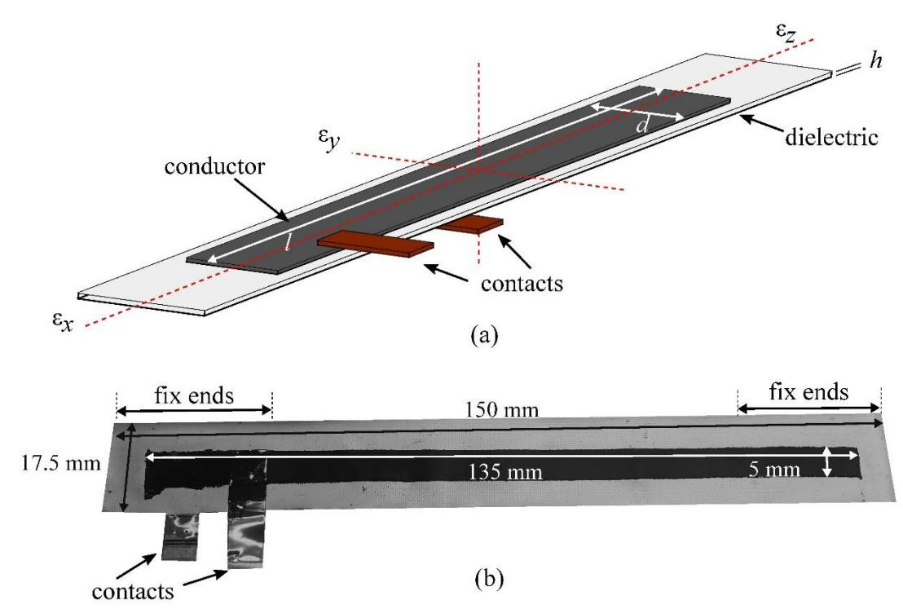
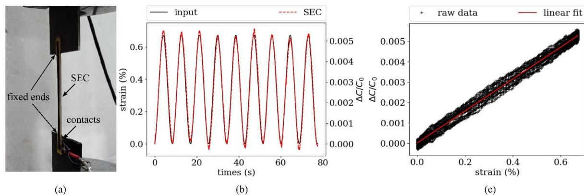
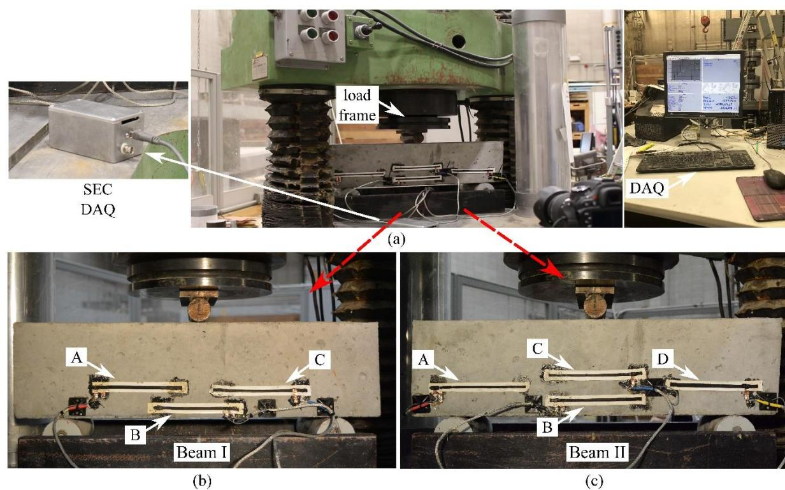
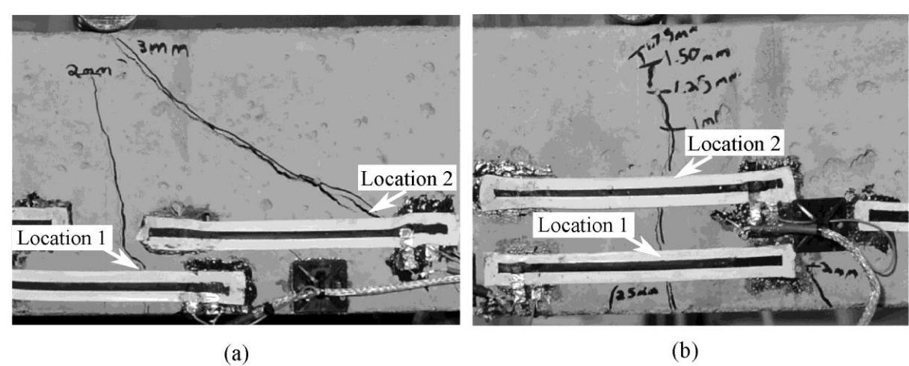
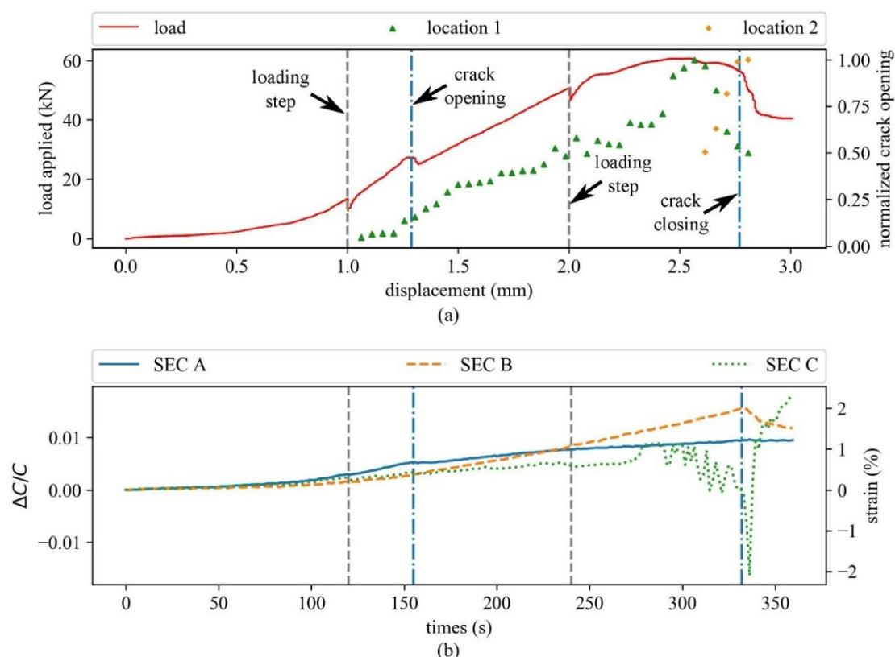
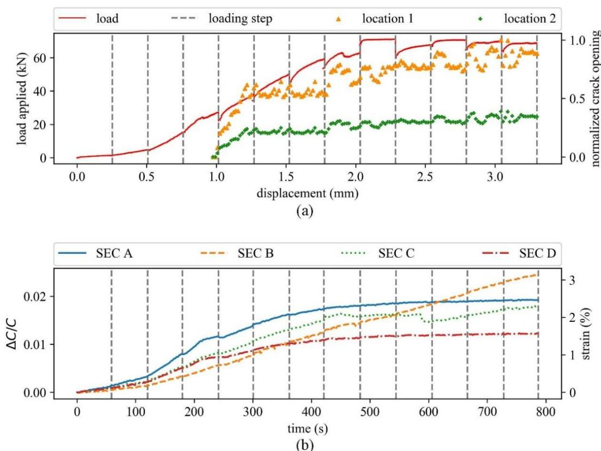

{0}------------------------------------------------

## **Detection and Monitoring of Cracks in Reinforced Concrete Using an Elastic Sensing Skin**

Jin Yan1 ; Austin Downey2 ; Alessandro Cancelli3 ; Simon Laflamme4 ; and An Chen5

1Dept. of Civil, Construction and Environmental Engineering, Iowa State Univ., 813 Bissell Rd., Ames 50011. E-mail: yanjin@iastate.edu

2Dept. of Mechanical Engineering, Univ. of South Carolina, 300 Main St., A117, Columbia 29201. E-mail: adowney2@cec.sc.edu

3Dept. of Civil, Construction and Environmental Engineering, Iowa State Univ., 813 Bissell Rd., Ames 50011. E-mail: acancell@iastate.edu

4Dept. of Civil, Construction and Environmental Engineering and Dept. of Electrical Engineering, Iowa State Univ., 813 Bissell Rd., Ames 50011. E-mail: laflamme@iastate.edu

5Dept. of Civil, Construction and Environmental Engineering, Iowa State Univ., 813 Bissell Rd., Ames 50011. E-mail: achen@iastate.edu

## **ABSTRACT**

A sensing skin has been employed to detect and monitor cracks in reinforced concrete specimens. This sensing skin is constituted of a flexible electronic termed soft elastomeric (SEC) capacitor, which detects a change in strain through changes in capacitance. The SEC is a low cost and robust sensing technology that has previously been studied for the monitoring of fatigue cracks in steel bridges. The sensor is highly elastic and as such offers a unique capability to detect and monitor the growth of cracks in structural elements. In this study, an array of surfacedeployed SECs was used to detect and locate bending-induced cracks. To validate the proposed approach, an experimental campaign was conducted using reinforced concrete beams. Threepoint bending tests were conducted on two small-scale reinforced concrete beams. Different configurations of SEC arrays were used on the two specimens to assess the capacity and limitation of the proposed approach. Results show that the sensing skin was capable of detecting and localizing cracks that formed in both specimens. Additionally, the sensor is shown to offer a good signal-to-noise ratio and thus could represent a cost-effective alternative to current sensing technologies for the monitoring of cracks in concrete structures.

# **INTRODUCTION**

Crack formation and propagation often occur in concrete structures. These cracks can be caused by a combination of poor design, environmental effects, overloading, carbonation, freezethaw cycles, etc. If located at critical locations and of a significant size, these cracks may decrease the capacity of the component and affect the durability and safety of the structure. The presence of cracks may also accelerate the corrosion process and be unsettling for the general public. It follows that crack localization and assessment could be useful in evaluating and managing maintenance actions for a given structural system.

Various nondestructive evaluation techniques have been developed to measure strain and detect cracking in concrete infrastructure. Some of the most popular include acoustic emission for crack classification (Aggelis 2011); (Ohno and Ohtsu 2010), ultrasonic methods for crackdepth estimation (Breysse 2012); (Fursa et al. 2014), penetrating radar for subsurface geophysical imaging Eisenmann et al. (2016). However, these methods often lack scalability and cost-effectiveness over large geometries, making their use in automated long-term health monitoring deployments more difficult.

{1}------------------------------------------------

Traditional monitoring technologies have been used to quantify crack openings in concrete structures. These include resistive strain gauges (Hu et al. 2017), vibrating wire (Lee et al. 2010), fiber optic sensors (Glisic and Inaudi 2011), and linear variable differential transformers (LVDT) (Kaminski and Bien 2015); (Zhou et al. 2016). While each technology has demonstrated success in certain conditions, they have some limitations. For example, resistive strain gauges, vibrating wire, and fiber optics are not able to monitor large crack openings due to their limited elasticity. In addition, while an LVDT is capable of measuring the large crack openings that can be associated with concrete structures, their relative bulkiness and susceptibility to environmental conditions (e.g., ice buildup and corrosion of the moving mechanical parts) limit their applicability in continuous monitoring mode.

In addition to monitoring large cracks associated with concrete, the problem of localization remains a challenge. Distributed dense sensing networks have been proposed as a solution for the monitoring of concrete cracks over large surfaces in an operational environment (Yao et al. 2014); (Perry et al. 2017). Fiber optic sensing technology has demonstrated localization capabilities (Glisic and Inaudi 2011); (Tang et al. 2016). Fiber optic sensors provide an accurate multi-point strain measurements (and therefore cracks) over one relatively long one-dimensional strain field, but the detection systems may be complex and expensive. While other mature technologies, such as LVDTs or vibrating wires, can be spatially distributed to increase their damage detection resolution, their relatively high costs (including sensors, data acquisition (DAQ), and installation) and bulkiness make them ill-suited for monitoring large-scale structures (Enckell et al. 2011); (Wang et al. 2012). Other promising technologies include the use of electrical impedance tomography (EIT) to measure the conductivity distribution in cementitious material that can be mapped to the strain field (Hou and Lynch 2008). While EIT is capable of producing a relatively high spatial resolution, it requires repetitive boundary measurement to solve the ill-posed inverse problem. Another promising technology is the use of self-sensing concrete that utilizes a measurable electrical output relating to the internal damage which provides monitoring capabilities at key locations in the structure of interest (Han et al. 2015); (Downey et al. 2018a). The internal self-sensing smart concrete, while offers many benefits including having the same durability and mechanical properties as that of the structure being monitored. However, these materials are often used with carbon-based fillers embedded into the cement matrix, limiting their use to new or retrofitted structures.

Recently, another distributed sensing approach termed sensing skins has been investigated. Sensing skins seek to mimic biological skin in their ability to detect and localize damage over the entire area of a structure. These skins have seen potential in crack detection. Various recently developed sensing skins have the ability to measure strain over a large area. Hallaji et al. developed a copper paint-based sensing skin that uses electrical impedance tomography to detect and localize cracks in concrete structures (Hallaji et al. 2014). Zhou developed and deployed a smart film with magnetic wires that when installed on an in-service bridge provided a feasible way for remotely visualizing crack initiation and development (Zhou et al. 2010). Also, a full bridge sensing sheet that consists of a high concentration of traditional resistive strain gauges deployed onto a single polymer sheet has been shown capable of detecting and continuously monitoring crack growth (Tung et al. 2014).

This study aims at evaluating the feasibility of strain measurement and crack detection in concrete infrastructures with sensing skins. These soft elastomeric capacitor (SEC) sensing skins are capable of detecting and localizing damage over the structures' global area by measuring strain variations. The SEC technology offers unique advantages for crack detection and

{2}------------------------------------------------

monitoring over traditional sensing technologies due to their low-cost (Downey et al. 2017), high durability to environmental conditions (Downey et al. 2018b), and mechanical robustness (Laflamme et al. 2013). Previous investigations have experimentally evaluated the feasibility of using SECs for fatigue cracks in steel bridges (Kong et al. 2019). In this study, a preliminary validation of two small steel reinforced concrete beams is used to show the feasibility of using the SEC sensors for crack detection in concrete. The authors anticipate that the work outlined here will provide a starting point for real-time and long-term analyses of crack formation in reinforced concrete in the future.

# **DESCRIPTION OF SOFT ELASTOMERIC CAPACITOR**

This section provides a background on the SEC technology, illustrating the fabrication process and the electromechanical model that characterizes its behavior.

# **Sensor Fabrication**

The SEC is a low-cost, robust, and highly scalable thin-film strain sensor that consists of a flexible parallel plate capacitor. A given change in a monitored structures geometry of (i.e., strain) is transduced in a measurable change in the SEC's capacitance. An SEC is presented in Figure 1(a) with its key components annotated. The SEC is constituted from a styreneethylene/butylene styrene (SEBS) block copolymer arranged in three layers where the inner layer (dielectric) is filled with titania to increase both its durability and permittivity, while the outer layers (conductors) are filled with carbon black to enhance their conductivity. The carbon blackfilled outer layers also provide enhanced UV light protection, therefore enhancing the sensor's environmental durability (Downey et al. 2018b). The fabrication process of the SEC is covered in more detail in (Laflamme et al. 2013). An electromechanical model that relates a change in the monitored structure geometry (i.e. strain) to a change in the sensor's capacitance (C) can be derived from the parallel plate capacitor equation:

$$C = e_o e_r \frac{A}{h} \quad (1)$$

where *e pF m* 0 8.854 / is the vacuum permittivity, *r e* is the polymers relative permittivity, *A d l* is the sensor area of width *d* and length *l* (as annotated in Figure 1(b)), and *h* is the thickness of the dielectric.

Equation 1 can be specialized for the sensor configuration of interest to this paper, where the sensor is glued at each end and free-standing in the middle, as shown in Figure 1(b), undergoing uniaxial strain ( ):

$$\varepsilon = \lambda \frac{\Delta C}{C_0} = \lambda \frac{\Delta l}{l_0} \quad (2)$$

where 0 *l* is the unstrained length of the SEC, C0 denotes the initial unstrained capacitance, ∆C represents the incremental change in capacitance and is the gauge factor that is here experimentally determined. In the sensor configuration of interest, the gauge factor is a function of the sensor geometry. Here, sensors of overall dimension 150 mm × 17.5 mm, where the dimensions of the sensing area is 135 mm × 5 mm (Figure 1(b)) are considered, and their associated gauge factors determined in the next section.

{3}------------------------------------------------

**Figure 1: (a) Schematic of an SEC; (b) SEC configuration on a concrete specimen.**

## **Sensor Response Characterization**

The electromechanical response of a slender end-bonded SEC was investigated by applying an axial 0.12 Hz cyclic excitation on a free-standing specimen in a servo-hydraulic testing machine, as shown in Figure 2(a). During the test, the SEC's capacitance was recorded on a custom-built DAQ, and the displacement response was obtained from the dynamic testing machine.

**Figure 2: (a) Experimental gauge factor characterization test setup; (b) capacitance time history response subject to cyclic strain input; and (c) sensitivity and linearity of the sensor.**

Figure 2 presents the results of the electromechanical test comparing the measured strain (black line in Figure 2(b)) and the corresponding change in capacitance measured by the SEC. Figure 2(c) reports the change in capacitance as a function of the change in strain. As shown in Figure 2(c), the strain and measured change in capacitance have a linear relationship, that when

Downloaded from ascelibrary.org by Iowa State University on 05/06/19. Copyright ASCE. For personal use only; all rights reserved.

{4}------------------------------------------------

fitted with linear least square regression can be used to obtain the gauge factor *λ* over the tested range 0-0.7% strain. Here, the experimental gauge factor *λ* was determined to be equal to 0.78.

# **PROTOTYPE TESTING**

To investigate the feasibility of the proposed approach, an experimental campaign was conducted on small-scale reinforced concrete (RC) beams. The testing involved two different specimens subjected to a three-point bending test to study the detectability of bending cracks using an SEC array. Both specimens were subjected to the same loading protocol. Two different configurations of SEC arrays were considered to study the effect of spatial distribution against damage detection and location capabilities. The following subsections present the experimental configurations and results.

## **Experiment Setup**

The three-point bending tests were conducted on two RC beams of dimensions 60.96 cm × 15.24 cm × 15.24 cm (24 in × 6 in × 6 in). The SECs were installed using a thin layer of an offthe-shelf epoxy (JB Kwik). The first specimen (Beam I - Figure 3(b)) was equipped with an array of three sensors identified as SEC A, B, and C. SEC B was installed at the bottom of the midspan and the remaining two were placed symmetrically to the sides of SEC B higher with respect to the surface (Figure 3(b)). The second specimen (Beam II) was equipped with an additional SEC, identified as SEC C, placed at midspan but higher than SEC B with respect to the surface (Figure 3(c)) to study additional crack assessment capability.

**Figure 3: (a) RC beams three-points bending test setup; (b) sensor schematic of Beam I; (c) sensor schematic of Beam II.**

{5}------------------------------------------------

Both specimens were subjected to a three-point bending test using a quasi-static testing machine. The supports for the beams were placed at an internal distance of 45.72 cm (18 in) symmetric around the center-line. The load was applied on the top of the beams at midspan on a roller support placed between the concrete and the load frame (Figure 3(a)). A displacement controlled approach was used, increasing the mid-span displacement from 0 to 2 mm (0 to 0.079 in) at increments of 0.25 mm (0.0098 in). After each increment, a visual inspection of the beams was conducted to locate and highlight the formation of new cracks and the growth of existing ones. Experimental load, displacement, capacitance, and crack locations and sizes were collected. Load and displacement were acquired through the internal DAQ system of the quasistatic testing machine. The capacitance data were collected using a customized DAQ driven by a LabVIEW code. Lastly, the crack locations and sizes were monitored using a Nikon D7100 digital camera, with a resolution of 6000 × 4000 pixels. The camera was placed perpendicular to the beam's monitored surface at a distance of 1.0 m (39.37 in). The videos were post-processed using two open-source software, FFmpeg and Fiji, to determine the crack opening width through the known width of the reference points.

**Figure 4: Crack locations of (a) Beam I; (b) Beam II.**

# **Results and Discussion**

Results from the crack location and formation on Beam I are shown in Figures 4(a) and 5, respectively. The gray dashed lines in Figure 5 are where the machine paused and resumed to produce incremental loads. These occurred because the testing machine did not maintain a stable load during the time when it was paused. For low levels of displacement, a single crack formed initially at the middle of the beam. This was confirmed through the analysis of the loaddisplacement curve of the specimen, along with the normalized crack width amplitude obtained by averaging the crack width of the top and bottom edges of SEC (Figure 5(a)). When the cracks open, it is possible to see a sudden drop in the load-displacement curve (first blue line in Figure 5(a)), along with the opening of the crack at the mid-span location (termed Location 1, illustrated as green triangles in Figure 5(a)). After, the beam experienced a stable crack growth phase, with a decrease of the slope with respect to the elastic one before crack opening (the first blue dashed line in Figure 5(a)), until reaching a displacement of 2 mm (Figure 5(a)). Following an additional drop in stiffness, a new, shear-type crack started to open (yellow dots in Figure 5(a)). During this stage, it was noted that the growth of the shear crack corresponded to a reduction in

{6}------------------------------------------------

the flexural crack dimension. This reduction was induced by the splitting of the specimen along the shear crack, which caused the bottom portion of the beam to move downward and closing the mid-span crack. This behavior was completely captured by the SEC network installed on the specimen. As shown in Figure 5(b), SEC A has a drop in slope that matches the one associated with the formation of the first flexural crack. During the closing phase of the mid-span crack, SEC B captured this behavior through a significant drop in its capacitance (second blue line in Figure 5(b)), which was associated with the increase in compressive strain. Results for sensor C were found to be inconclusive for crack monitoring, because its signal seems to originate from the formation of the crack through the epoxy resin (Figure 4(a)) that connects the sensor to the beam. Such challenge could be circumvented by modifying the orientation and the number of SEC overlaps in the design of an SEC array.

**Figure 5: Beam I: (a) Load-displacement curve and normalized crack opening widths history; (b) capacitance change and computed strain history.**

Results from Beam II exhibited the formation of cracks in the middle bottom of the specimen (Figure 4(b)). A single crack formation was initially confirmed through the slight drop in the load-displacement curve (between the third and fourth gray dashed line from the left in Figure 6(a)), along with the opening of the crack at mid-span (termed Location 1, illustrated as green dots, and Location 2 on top of Location 1 illustrated as orange triangles in Figure 6(a)). The flexural crack propagated to the compression zone, with a decrease of stiffness, up to a 2 mm displacement. There is a stiffness reduction around 1.9 mm which was induced by a shear crack opening in the back side of the concrete specimen. From then up to 3.6 mm, the load remains constant. This behavior was almost completely captured by the SEC network installed on the

{7}------------------------------------------------

specimen. As shown in Figure 6(b), SEC A, SEC C, and SEC D all have a drop in slope that matches the one associated with the formation of the first flexural crack. At the initialization of the backside shear crack, SEC C was able to capture this behavior as a drop in its capacitance followed with an unstable capacitance growth (Figure 6(b)), which was associated with the stress redistribution as the new shear crack opened. Note that SEC B mounted at the bottom of the tension zone should have the highest strain value/capacitance change. However, at the initial stage, SEC B has the lowest capacitance change. This could be caused by strain transfer at the interface arising from the installation procedure, which cannot be quantified directly. Both SEC B in beam I and SEC B in beam II do not experience a significant drop in a slope of capacitance change when there is a reduction in the measured capacitance changes from the other SECs.

**Figure 6: Beam II: (a) Load-displacement curve and normalized crack opening widths history; (b) capacitance change and computed strain history.**

# **CONCLUSION**

This paper described a preliminary effort to investigate the potential of a skin sensor, termed soft elastomeric capacitor (SEC), to monitor crack formation and growth for in-service structures. The core of this approach is the use of a large sensor network of inexpensive, durable and robust sensors to efficiently monitor cracks over a large surface. The spatial sensibility of such a network is suitable for applications to concrete structures.

The background on the SEC was presented, which included the electromechanical model and the experimental determination of the gauge factor. Two different laboratory experiments on small-scale reinforced concrete beams were conducted to assess the capability of the proposed

{8}------------------------------------------------

methodology. Time series measurements from the SECs were correlated with input and visual observations, evaluating the monitoring performance of different configurations of SEC arrays.

Results demonstrated that the proposed approach is capable of detecting and localizing cracks on concrete structures. Thus, the application of dense networks of SECs could provide a cost-effective monitoring solution for real-time, long-term crack monitoring on civil structures. Future work will focus on studying the effects of orientation and density of the network on the crack identification capability for both traditional and complex geometries.

#### **REFERENCES**

- Aggelis, D. G. (2011). Classification of cracking mode in concrete by acoustic emission parameters. *Mechanics Research Communications*, 38(3):153–157. Breysse, D. (2012). Nondestructive evaluation of concrete strength: An historical review and a new perspective by combining NDT methods. *Construction and Building Materials*, 33:139–
- 163. Downey, A., D'Alessandro, A., Ubertini, F., and Laflamme, S. (2018a). Automated crack detection in conductive smart-concrete structures using a resistor mesh model. *Measurement Science and Technology*, 29(3):035107. Downey, A., Laflamme, S., and Ubertini, F. (2017). Experimental wind tunnel study of a smart sensing skin for condition evaluation of a wind turbine blade. *Smart Materials and Structures*. Downey, A., Pisello, A. L., Fortunati, E., Fabiani, C., Luzi, F., Torre, L., Ubertini, F., and Laflamme, S. (2018b). Durability assessment of soft elastomeric capacitor skin for SHM of wind turbine blades. In Shull, P. J., editor, *Nondestructive Characterization and Monitoring of Advanced Materials, Aerospace, Civil Infrastructure, and Transportation XII*, volume 10599, pages 10599–11. SPIE. Eisenmann, D., Margetan, F. J., Koester, L., and Clayton, D. (2016). Inspection of a large concrete block containing embedded defects using ground penetrating radar. AIP Publishing
- LLC. Enckell, M., Glisic, B., Myrvoll, F., and Bergstrand, B. (2011). Evaluation of a large-scale bridge strain, temperature and crack monitoring with distributed fibre optic sensors. *Journal of Civil Structural Health Monitoring*, 1(1-2):37–46. Fursa, T. V., Osipov, K. Y., Lukshin, B. A., and Utsyn, G. E. (2014). The development of a method for crack-depth estimation in concrete by the electric response parameters to pulse mechanical excitation. *Measurement Science and Technology*, 25(5):055605. Glisic, B. and Inaudi, D. (2011). Development of method for in-service crack detection based on distributed fiber optic sensors. *Structural Health Monitoring: An International Journal*, 11(2):161–171. Hallaji, M., Seppa¨nen, A., and Pour-Ghaz, M. (2014). Electrical impedance tomography-based sensing skin for quantitative imaging of damage in concrete. *Smart Materials and Structures*, 23(8):085001. Han, B., Ding, S., and Yu, X. (2015). Intrinsic self-sensing concrete and structures: A review. *Measurement*, 59:110–128. Hou, T.-C. and Lynch, J. P. (2008). Electrical impedance tomographic methods for sensing strain fields and crack damage in cementitious structures. *Journal of Intelligent Material Systems and Structures*, 20(11):1363–1379. Hu, W.-H., Said, S., Rohrmann, R. G., Cunha, A´., and Teng, J. (2017). Continuous dynamic

{9}------------------------------------------------

monitoring of a prestressed concrete bridge based on strain, inclination and crack measurements over a 14-year span. *Structural Health Monitoring*, 17(5):1073–1094. Kamin´ski, T. and Bien´, J. (2015). Condition assessment of masonry bridges in poland, In *National Conference on Bridge Maintenance and Safety of Bridges (ASCP'2015), Lisboa, Portugal*, pages 25–26. Kong, X., Li, J., Bennett, C., Collins, W., Laflamme, S., and Jo, H. (2019). Thin-film sensor for fatigue crack sensing and monitoring in steel bridges under varying crack propagation rates and random traffic loads. *Journal of Aerospace Engineering*, 32(1):04018116. Laflamme, S., Kollosche, M., Connor, J. J., and Kofod, G. (2013). Robust flexible capacitive surface sensor for structural health monitoring applications. *Journal of Engineering Mechanics*, 139(7):879–885. Lee, H. M., Kim, J. M., Sho, K., and Park, H. S. (2010). A wireless vibrating wire sensor node for continuous structural health monitoring. *Smart Materials and Structures*, 19(5):055004. Ohno, K. and Ohtsu, M. (2010). Crack classification in concrete based on acoustic emission. *Construction and Building Materials*, 24(12):2339–2346. Perry, M., McAlorum, J., Fusiek, G., Niewczas, P., McKeeman, I., and Rubert, T. (2017). Crack monitoring of operational wind turbine foundations. *Sensors*, 17(8):1925. Tang, Y., Wang, Z., and Song, M. (2016). Self-sensing and strengthening effects of reinforced concrete structures with near-surfaced mounted smart basalt fibre–reinforced polymer bars. *Advances in Mechanical Engineering*, 8(10):168781401667349. Tung, S.-T., Yao, Y., and Glisic, B. (2014). Sensing sheet: the sensitivity of thin-film full- bridge strain sensors for crack detection and characterization. *Measurement Science and Technology*, 25(7):075602. Wang, Y., Gong, J., Dong, B., Wang, D. Y., Shillig, T. J., and Wang, A. (2012). A large serial time-division multiplexed fiber bragg grating sensor network. *Journal of Lightwave Technology*, 30(17):2751–2756. Yao, Y., Tung, S.-T. E., and Glisic, B. (2014). Crack detection and characterization techniques an overview. *Structural Control and Health Monitoring*, 21(12):1387–1413. Zhou, J., Xu, Y., and Zhang, T. (2016). A wireless monitoring system for cracks on the surface of reactor containment buildings. *Sensors*, 16(6):883. Zhou, Z., Zhang, B., Xia, K., Li, X., Yan, G., and Zhang, K. (2010). Smart film for crack monitoring of concrete bridges. *Structural Health Monitoring: An International Journal*, 10(3):275–289.